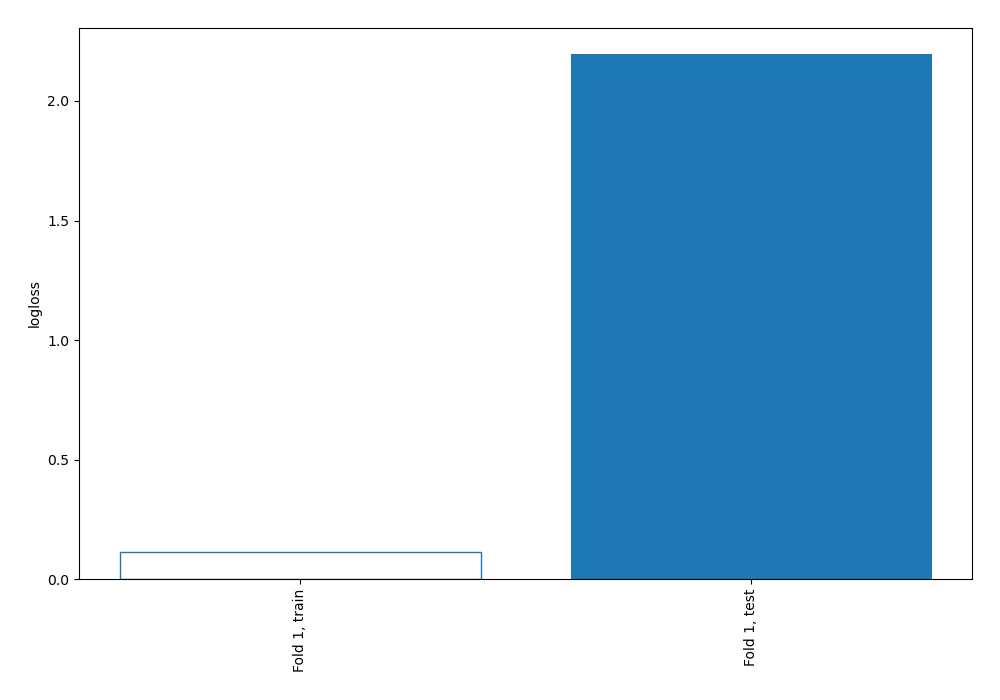
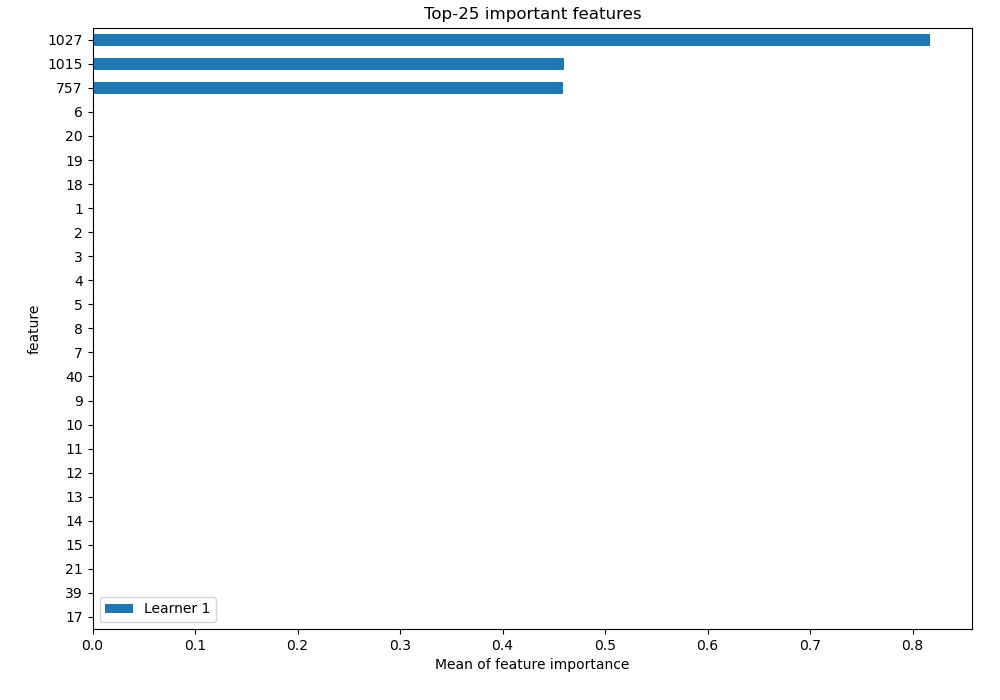
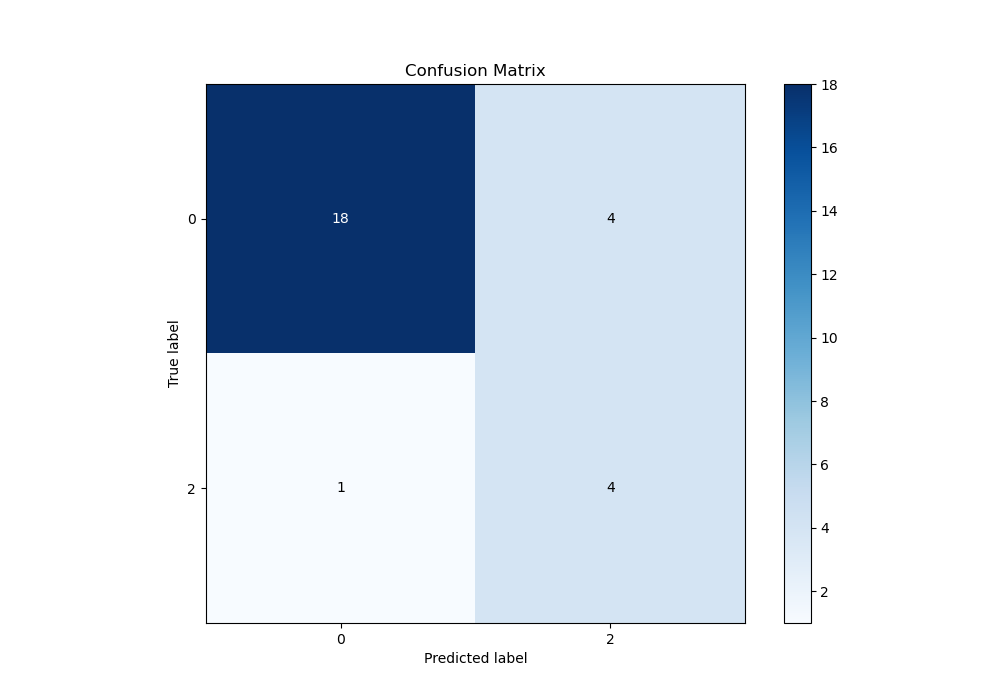
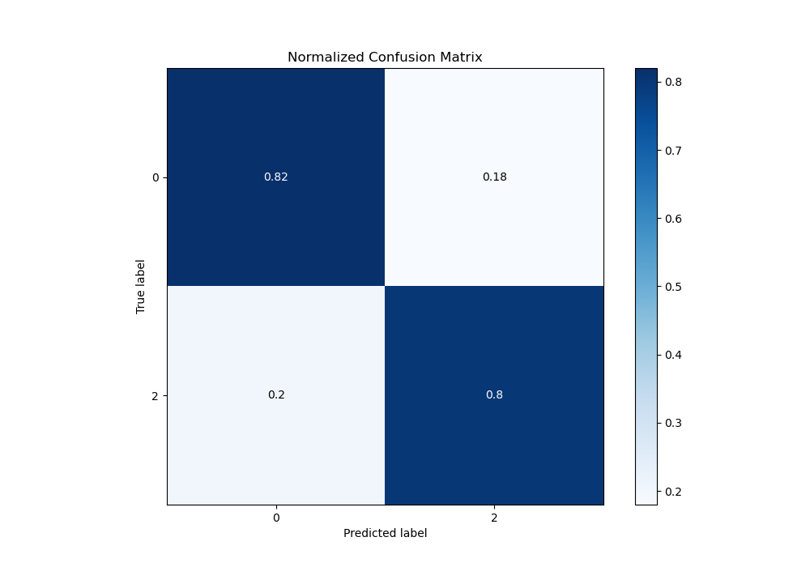
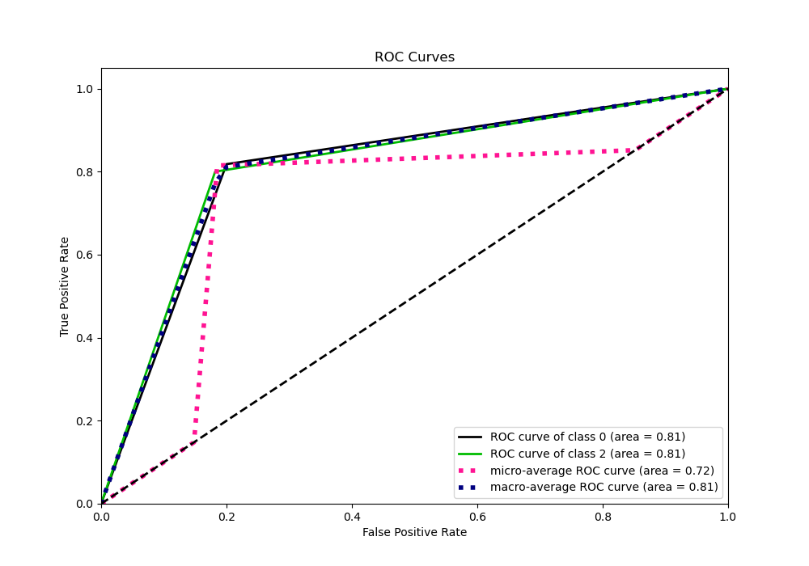
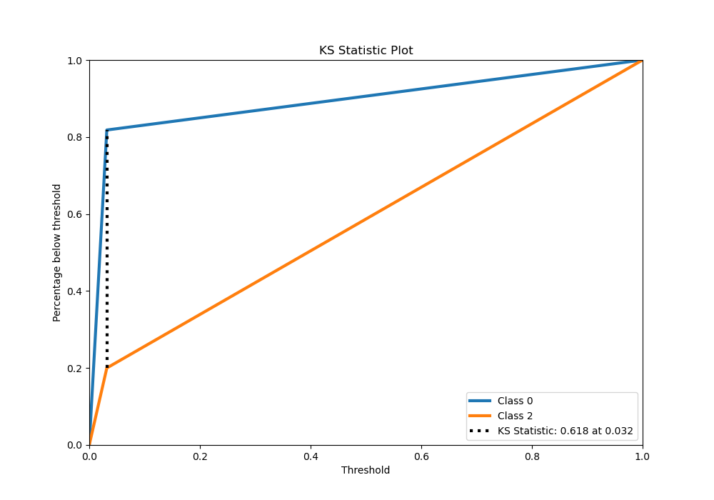
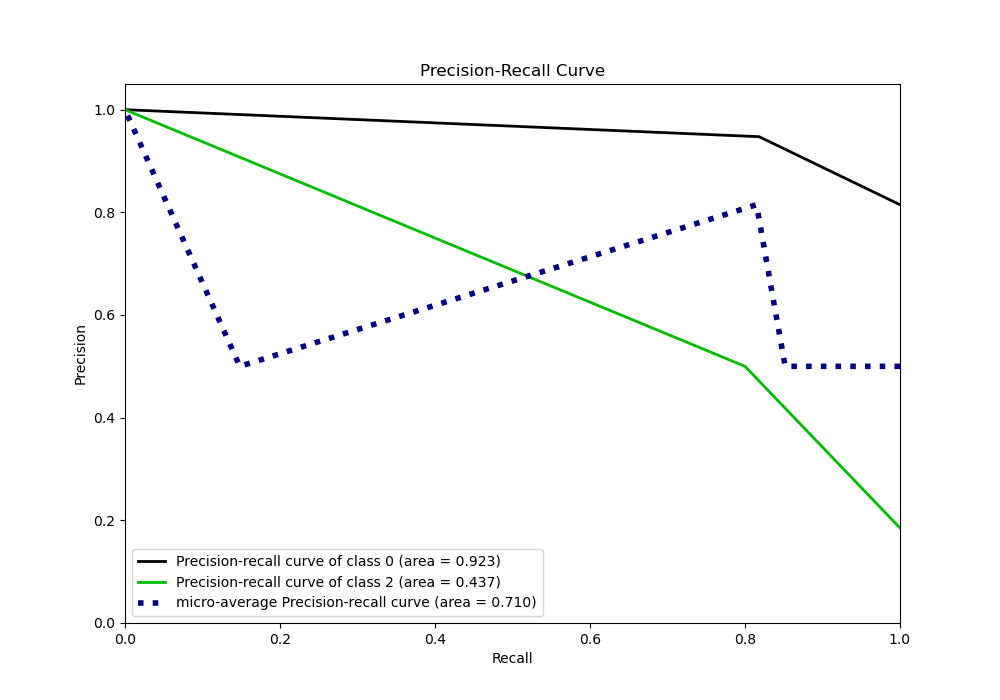
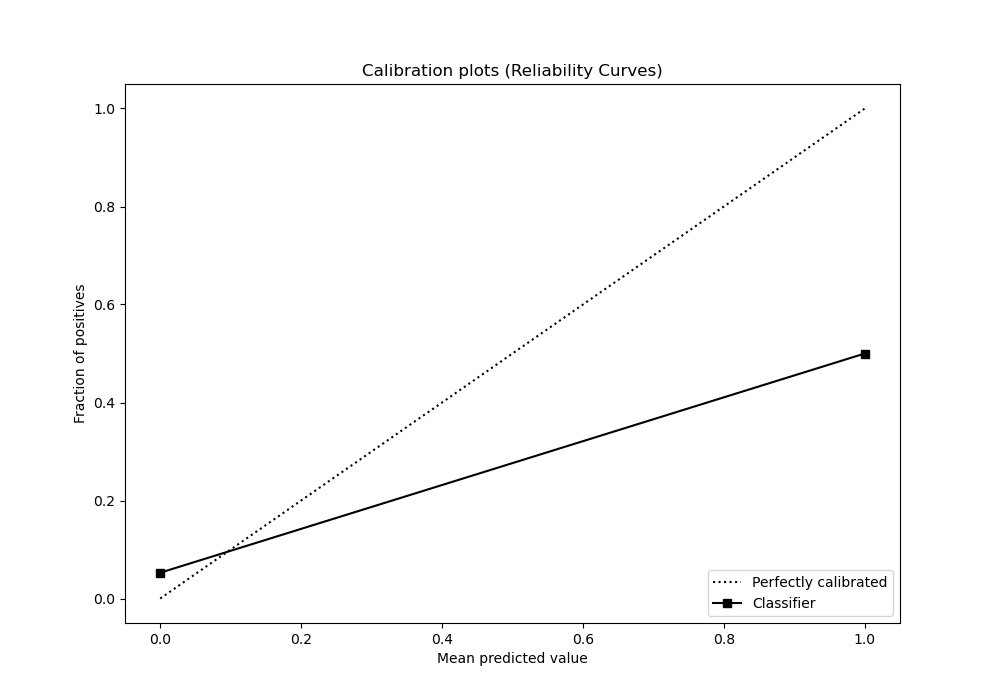
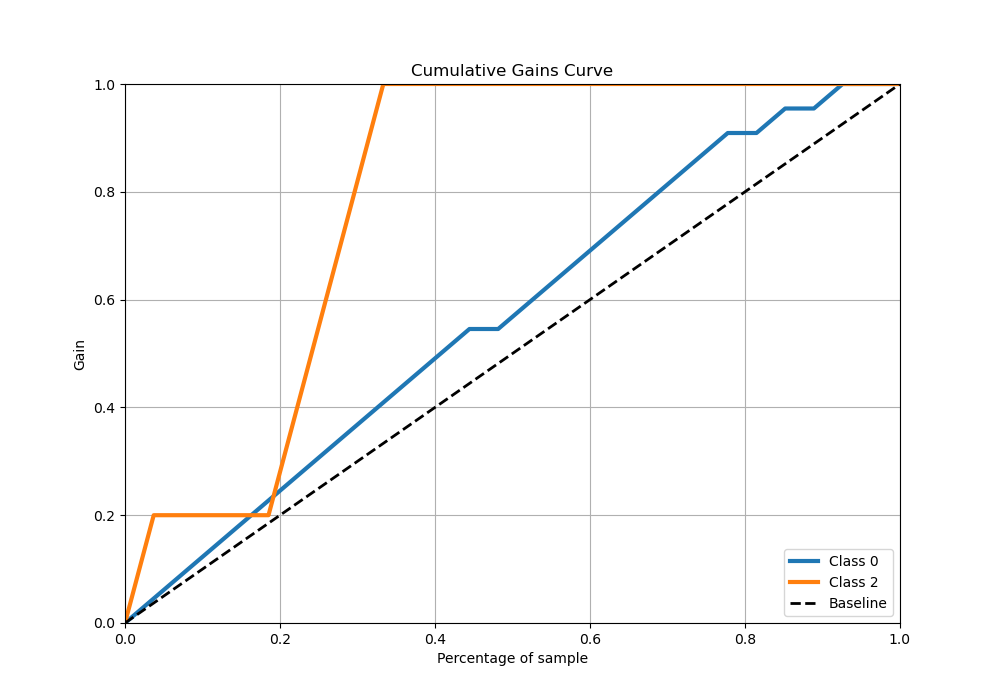
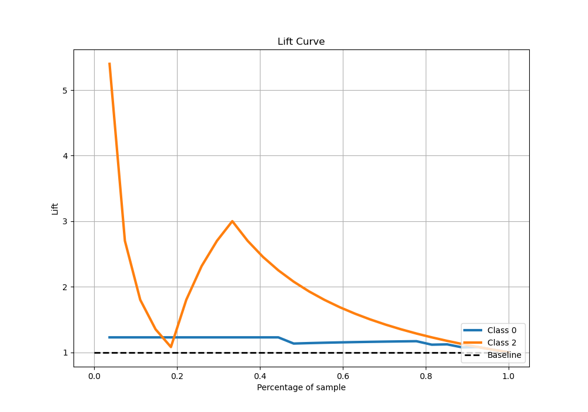

# Summary of 2_DecisionTree

[<< Go back](../README.md)

## Decision Tree
- **n_jobs**: -1
- **criterion**: gini
- **max_depth**: 3
- **explain_level**: 2

## Validation
 - **validation_type**: split
 - **train_ratio**: 0.75
 - **shuffle**: True
 - **stratify**: True

## Optimized metric
logloss

## Training time

23.0 seconds

## Metric details
|           |    score |   threshold |
|:----------|---------:|------------:|
| logloss   | 2.19603  | nan         |
| auc       | 0.809091 | nan         |
| f1        | 0.615385 |   0.031746  |
| accuracy  | 0.814815 |   0.031746  |
| precision | 0.5      |   0.031746  |
| recall    | 1        |   0.0285714 |
| mcc       | 0.525885 |   0.031746  |

## Confusion matrix (at threshold=0.031746)
|              |   Predicted as 0 |   Predicted as 2 |
|:-------------|-----------------:|-----------------:|
| Labeled as 0 |               18 |                4 |
| Labeled as 2 |                1 |                4 |

## Learning curves

## Permutation-based Importance

## Confusion Matrix

## Normalized Confusion Matrix

## ROC Curve

## Kolmogorov-Smirnov Statistic

## Precision-Recall Curve

## Calibration Curve

## Cumulative Gains Curve

## Lift Curve

[<< Go back](../README.md)
