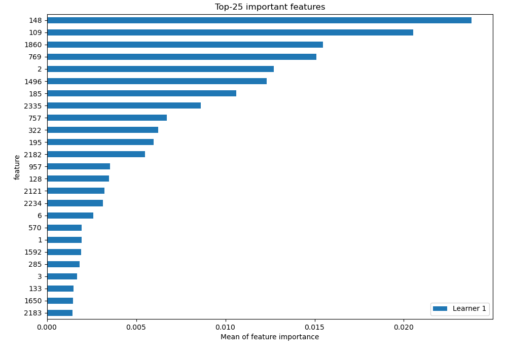
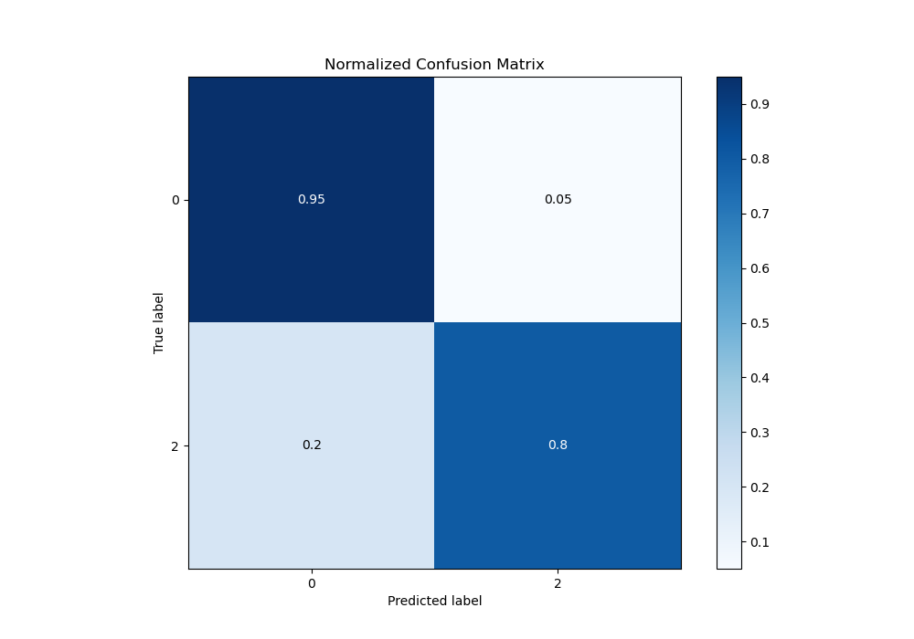
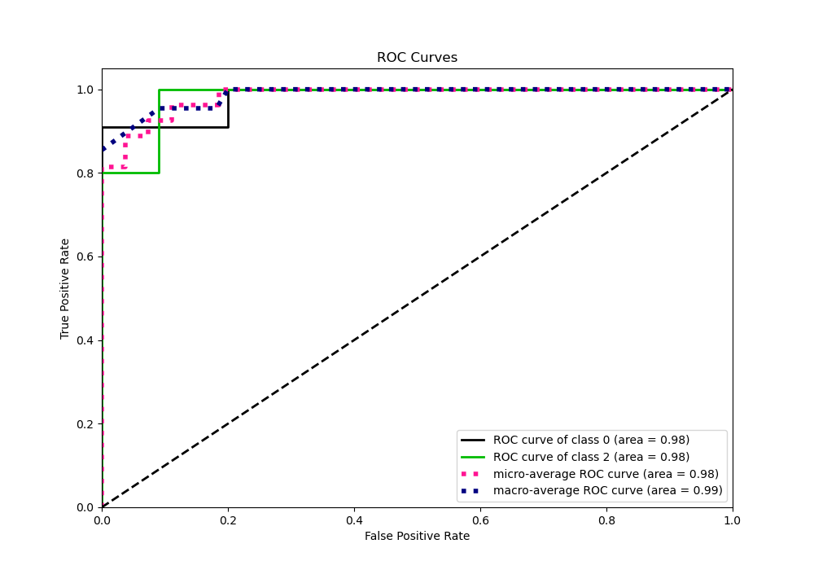
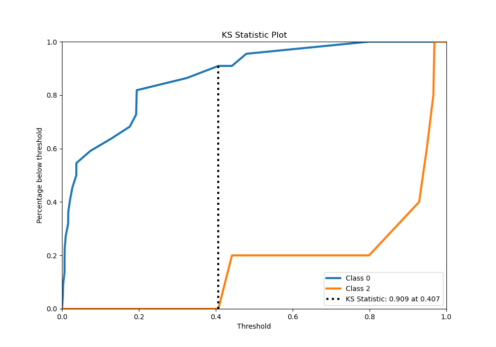
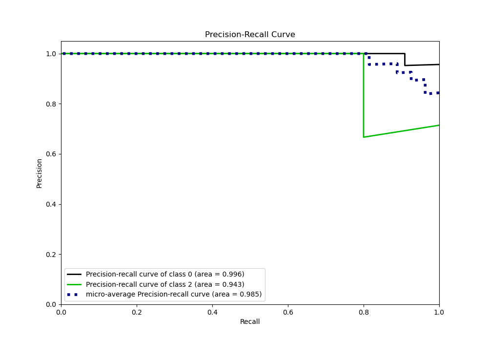
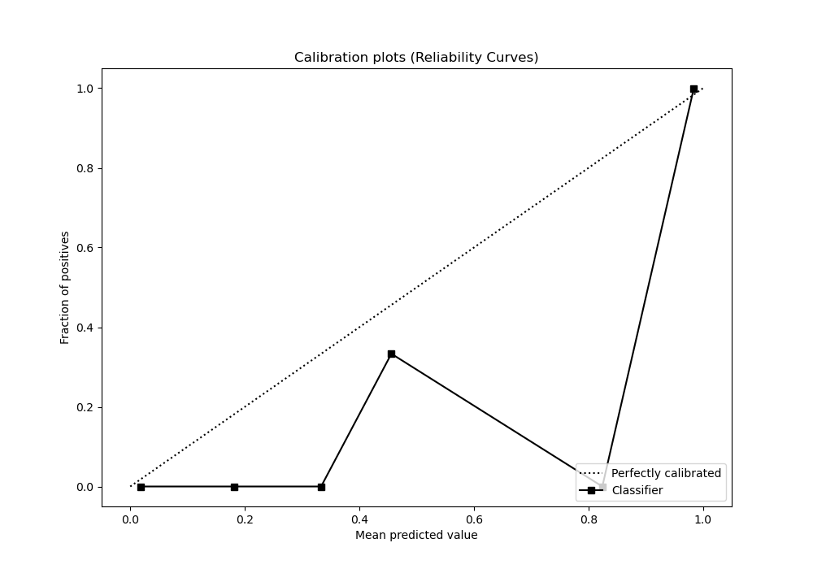
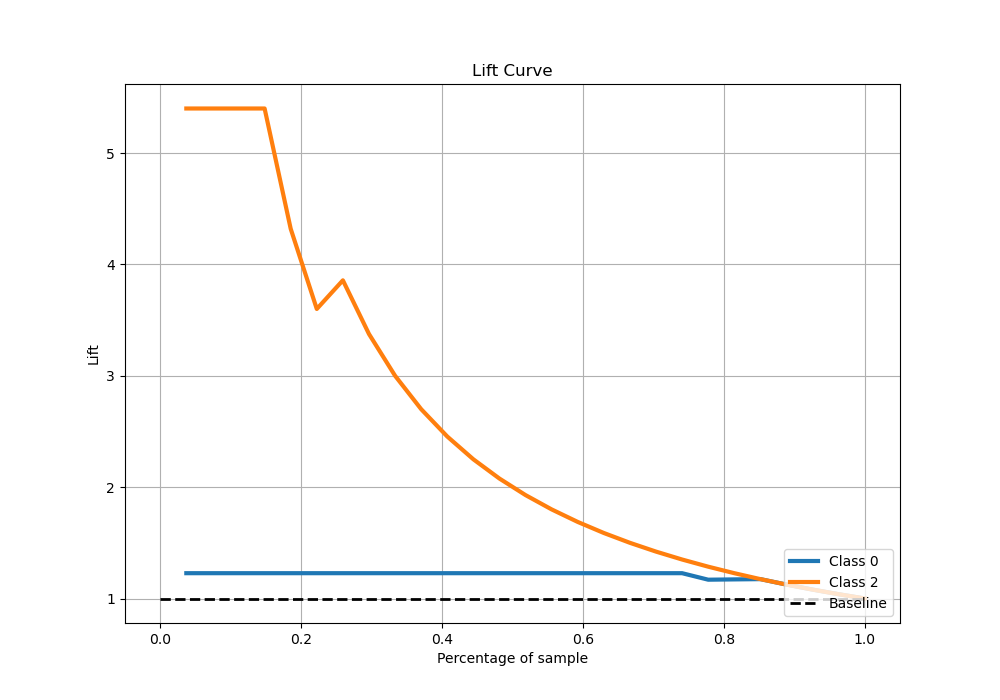

# Summary of 3_Default_Xgboost

[<< Go back](../README.md)

## Extreme Gradient Boosting (Xgboost)
- **n_jobs**: -1
- **objective**: binary:logistic
- **eta**: 0.075
- **max_depth**: 6
- **min_child_weight**: 1
- **subsample**: 1.0
- **colsample_bytree**: 1.0
- **eval_metric**: logloss
- **explain_level**: 2

## Validation
 - **validation_type**: split
 - **train_ratio**: 0.75
 - **shuffle**: True
 - **stratify**: True

## Optimized metric
logloss

## Training time

334.6 seconds

## Metric details
|           |    score |    threshold |
|:----------|---------:|-------------:|
| logloss   | 0.20092  | nan          |
| auc       | 0.981818 | nan          |
| f1        | 0.833333 |   0.40994    |
| accuracy  | 0.925926 |   0.487523   |
| precision | 1        |   0.939034   |
| recall    | 1        |   0.00193418 |
| mcc       | 0.805823 |   0.40994    |

## Confusion matrix (at threshold=0.487523)
|              |   Predicted as 0 |   Predicted as 2 |
|:-------------|-----------------:|-----------------:|
| Labeled as 0 |               21 |                1 |
| Labeled as 2 |                1 |                4 |

## Learning curves

## Permutation-based Importance

## Confusion Matrix

## Normalized Confusion Matrix

## ROC Curve

## Kolmogorov-Smirnov Statistic

## Precision-Recall Curve

## Calibration Curve

## Cumulative Gains Curve

## Lift Curve

[<< Go back](../README.md)
