# Exploratory Data Analysis

[<< Go back](../README.md)
## Feature : target
- **Feature type** : discrete
- **Missing** : 0.0%
- **Unique** : 2
- **Count** :97.0
- **Mean** :0.24742268041237114
- **Std** :0.6619247161852375
- **Min** :0.0
- **25%th Percentile** : 0.0
- **50%th Percentile** : 0.0
- **75%th Percentile** : 0.0
- **Max** :2.0

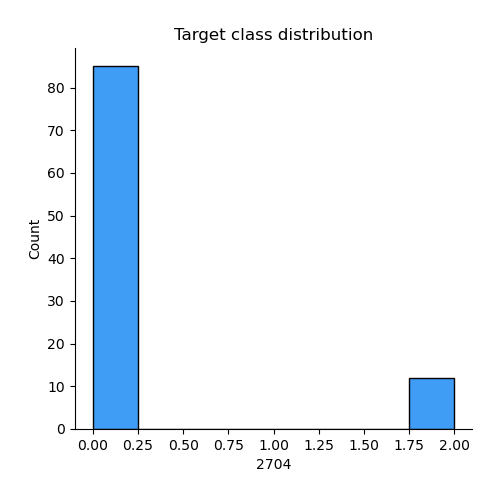
## Feature : 0
- **Feature type** : continous
- **Missing** : 0.0%
- **Unique** : 3
- **Count** :97.0
- **Mean** :1.0
- **Std** :1.0323183791322668e-16
- **Min** :0.9999999999999998
- **25%th Percentile** : 0.9999999999999999
- **50%th Percentile** : 1.0
- **75%th Percentile** : 1.0
- **Max** :1.0

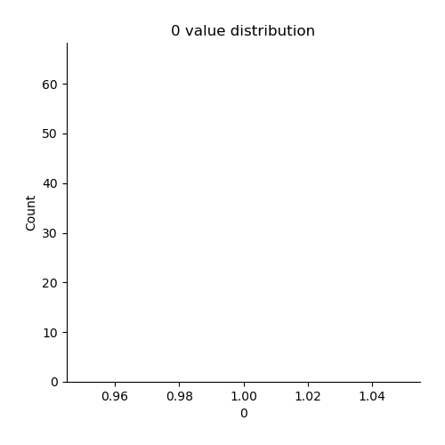
## Feature : 1
- **Feature type** : continous
- **Missing** : 0.0%
- **Unique** : 97
- **Count** :97.0
- **Mean** :0.48745006509349736
- **Std** :0.31627764646346873
- **Min** :-0.0903404886606594
- **25%th Percentile** : 0.23316627912999605
- **50%th Percentile** : 0.4598011211451881
- **75%th Percentile** : 0.6992169794941928
- **Max** :0.9902209690765202

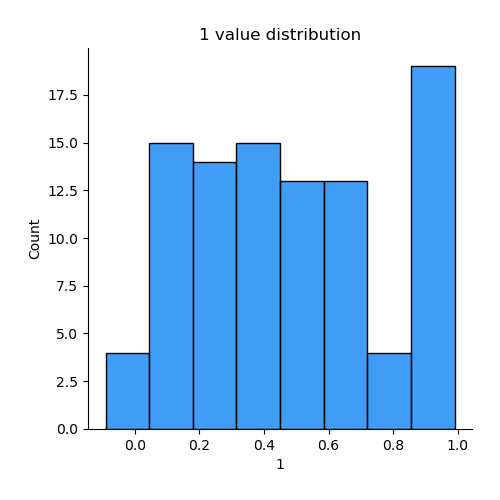
## Feature : 2
- **Feature type** : continous
- **Missing** : 0.0%
- **Unique** : 97
- **Count** :97.0
- **Mean** :0.6163171224776948
- **Std** :0.25673603794729505
- **Min** :-0.17596519230503263
- **25%th Percentile** : 0.4781344700750919
- **50%th Percentile** : 0.6005192811063346
- **75%th Percentile** : 0.8146763519657129
- **Max** :0.9910456737741862

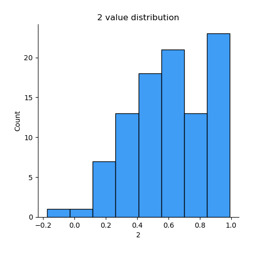
## Feature : 3
- **Feature type** : continous
- **Missing** : 0.0%
- **Unique** : 97
- **Count** :97.0
- **Mean** :0.37289231651065813
- **Std** :0.33824392481570237
- **Min** :-0.5119064465766645
- **25%th Percentile** : 0.15349548725677856
- **50%th Percentile** : 0.2921751940121361
- **75%th Percentile** : 0.5702897300621739
- **Max** :0.9843908523865255

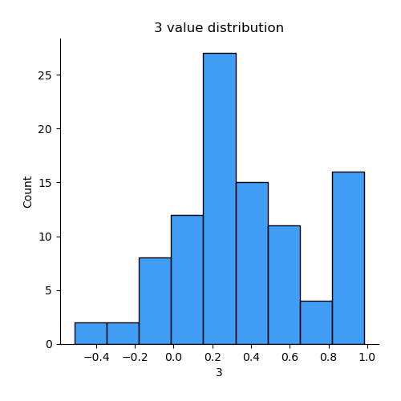
## Feature : 4
- **Feature type** : continous
- **Missing** : 0.0%
- **Unique** : 97
- **Count** :97.0
- **Mean** :0.6257021572128164
- **Std** :0.24218781068483483
- **Min** :-0.11541133137762925
- **25%th Percentile** : 0.4602061995147083
- **50%th Percentile** : 0.6349215369312534
- **75%th Percentile** : 0.80708270679975
- **Max** :0.9930625327345778

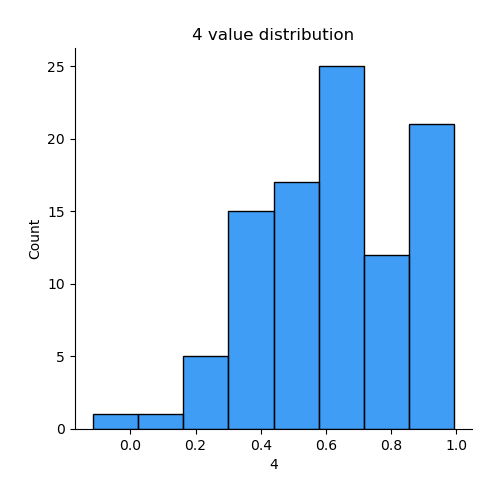
## Feature : 5
- **Feature type** : continous
- **Missing** : 0.0%
- **Unique** : 97
- **Count** :97.0
- **Mean** :0.7053197515537662
- **Std** :0.19621596237193076
- **Min** :0.16919039556108073
- **25%th Percentile** : 0.5861776510928799
- **50%th Percentile** : 0.7157798207277654
- **75%th Percentile** : 0.8113307575105576
- **Max** :0.9949821986898075

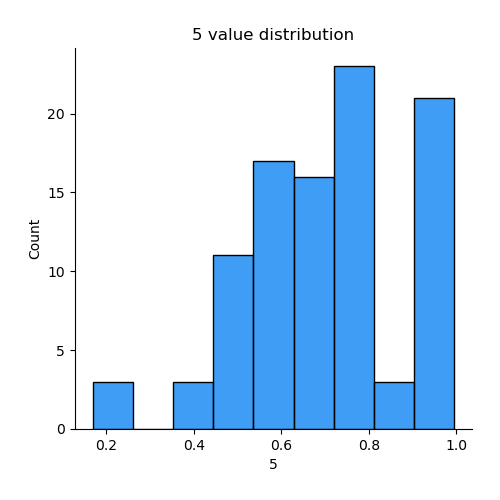
## Feature : 6
- **Feature type** : continous
- **Missing** : 0.0%
- **Unique** : 97
- **Count** :97.0
- **Mean** :0.6035303485124933
- **Std** :0.25928672649132845
- **Min** :-0.10155562478606499
- **25%th Percentile** : 0.4421074830860097
- **50%th Percentile** : 0.575603795464268
- **75%th Percentile** : 0.7847597530486915
- **Max** :0.9931203068778985

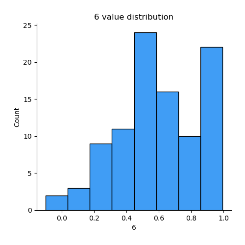
## Feature : 7
- **Feature type** : continous
- **Missing** : 0.0%
- **Unique** : 97
- **Count** :97.0
- **Mean** :0.6345835313075519
- **Std** :0.25847831248153763
- **Min** :-0.09384278583954714
- **25%th Percentile** : 0.47938536644626834
- **50%th Percentile** : 0.6444722065360413
- **75%th Percentile** : 0.8258257727452591
- **Max** :0.9945456846981265

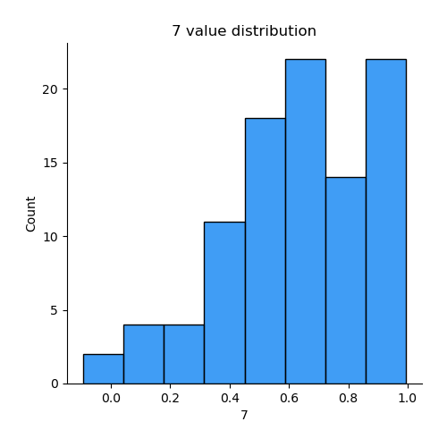
## Feature : 8
- **Feature type** : continous
- **Missing** : 0.0%
- **Unique** : 97
- **Count** :97.0
- **Mean** :0.5932957815537516
- **Std** :0.2689412321323936
- **Min** :-0.03084443265451733
- **25%th Percentile** : 0.39356299122710414
- **50%th Percentile** : 0.6001454029141385
- **75%th Percentile** : 0.813338381011937
- **Max** :0.9872375702416932

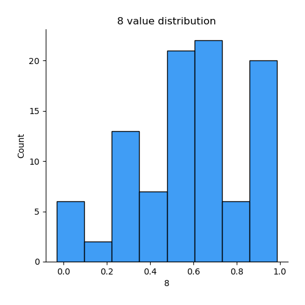
## Feature : 9
- **Feature type** : continous
- **Missing** : 0.0%
- **Unique** : 97
- **Count** :97.0
- **Mean** :0.6131201262041808
- **Std** :0.24430207060299533
- **Min** :-0.0427021976169515
- **25%th Percentile** : 0.4175494020570281
- **50%th Percentile** : 0.5904526057062361
- **75%th Percentile** : 0.8358795556559541
- **Max** :0.986481921288605

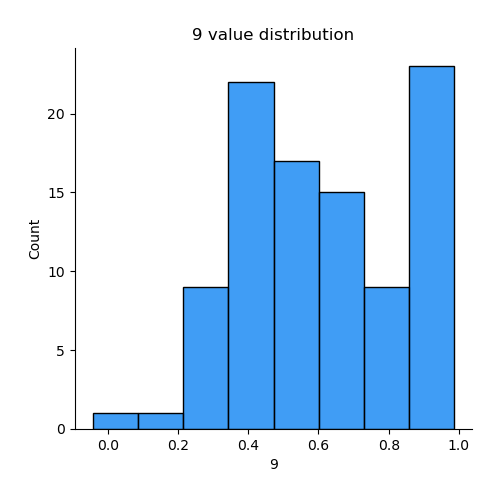
## Feature : 10
- **Feature type** : continous
- **Missing** : 0.0%
- **Unique** : 97
- **Count** :97.0
- **Mean** :0.6058412098539213
- **Std** :0.2592487249728818
- **Min** :-0.12199783214735348
- **25%th Percentile** : 0.4291046884451635
- **50%th Percentile** : 0.6173295444467805
- **75%th Percentile** : 0.8095865469714886
- **Max** :0.9898890618149953

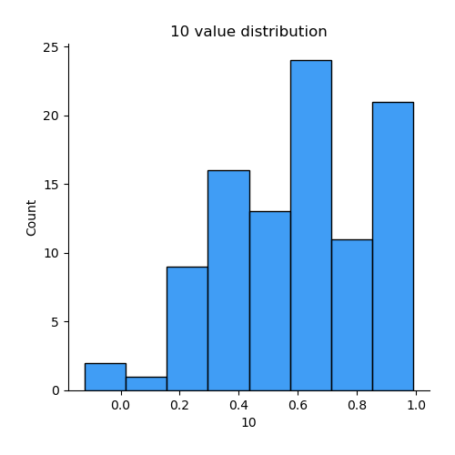
## Feature : 11
- **Feature type** : continous
- **Missing** : 0.0%
- **Unique** : 97
- **Count** :97.0
- **Mean** :0.7416143722495242
- **Std** :0.1915858706096914
- **Min** :-0.07350705113177959
- **25%th Percentile** : 0.6152728166524805
- **50%th Percentile** : 0.7565290181890412
- **75%th Percentile** : 0.8791991013728713
- **Max** :0.9941846627303138

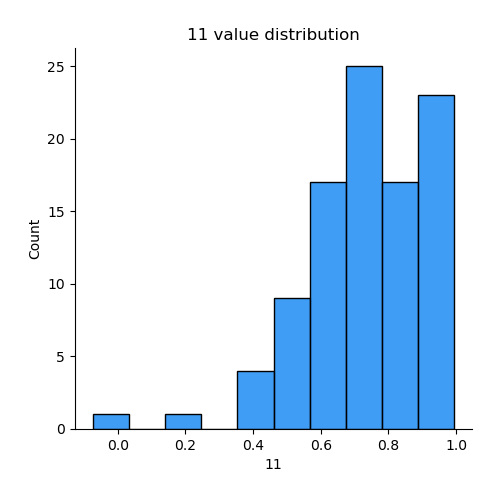
## Feature : 12
- **Feature type** : continous
- **Missing** : 0.0%
- **Unique** : 97
- **Count** :97.0
- **Mean** :0.5307146384726174
- **Std** :0.31367147146515006
- **Min** :-0.2224574900778945
- **25%th Percentile** : 0.29116109572019916
- **50%th Percentile** : 0.5267996680291405
- **75%th Percentile** : 0.7739213684697532
- **Max** :0.9924657308291698

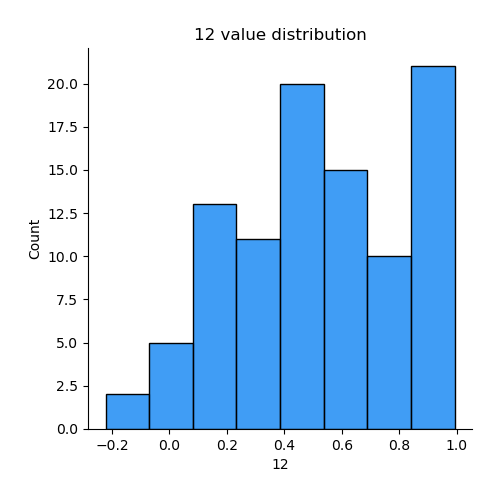
## Feature : 13
- **Feature type** : continous
- **Missing** : 0.0%
- **Unique** : 97
- **Count** :97.0
- **Mean** :0.5409576249212819
- **Std** :0.2749557819293179
- **Min** :-0.1014394913462557
- **25%th Percentile** : 0.3384683770445521
- **50%th Percentile** : 0.535433292592608
- **75%th Percentile** : 0.6981525997727035
- **Max** :0.9896405445453358

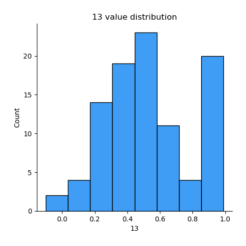
## Feature : 14
- **Feature type** : continous
- **Missing** : 0.0%
- **Unique** : 97
- **Count** :97.0
- **Mean** :0.5550770574739625
- **Std** :0.27597437727517987
- **Min** :-0.17669481605630252
- **25%th Percentile** : 0.33521996071464627
- **50%th Percentile** : 0.5351078007408431
- **75%th Percentile** : 0.7940477528727413
- **Max** :0.9850573011960986

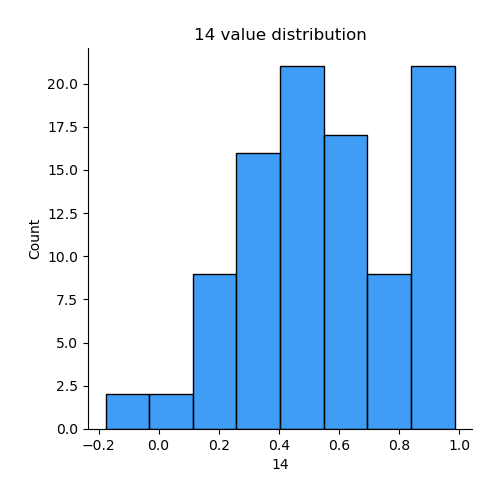
## Feature : 15
- **Feature type** : continous
- **Missing** : 0.0%
- **Unique** : 97
- **Count** :97.0
- **Mean** :0.6093647831085856
- **Std** :0.25416394902214645
- **Min** :-0.16421835410845786
- **25%th Percentile** : 0.46906073727411357
- **50%th Percentile** : 0.5712031593228166
- **75%th Percentile** : 0.7916690433152056
- **Max** :0.99375076826862

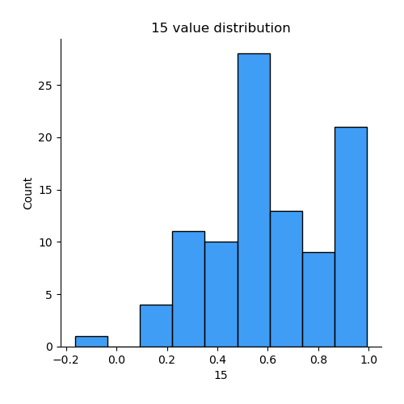
## Feature : 16
- **Feature type** : continous
- **Missing** : 0.0%
- **Unique** : 97
- **Count** :97.0
- **Mean** :0.5628022490411473
- **Std** :0.28002222209290567
- **Min** :-0.22310488944445087
- **25%th Percentile** : 0.36164825634351744
- **50%th Percentile** : 0.5563340567663655
- **75%th Percentile** : 0.7487555064200262
- **Max** :0.9899044779426092

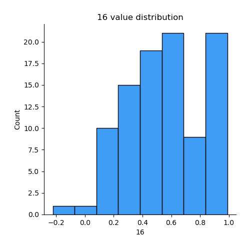
## Feature : 17
- **Feature type** : continous
- **Missing** : 0.0%
- **Unique** : 97
- **Count** :97.0
- **Mean** :0.6032469493668705
- **Std** :0.2610632198934785
- **Min** :-0.16142959084903127
- **25%th Percentile** : 0.4298327589596214
- **50%th Percentile** : 0.5737117004563026
- **75%th Percentile** : 0.802790688338614
- **Max** :0.9944613007750747

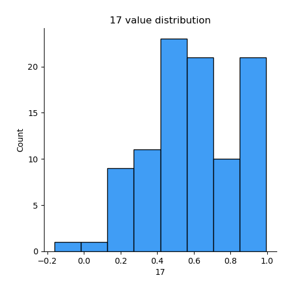
## Feature : 18
- **Feature type** : continous
- **Missing** : 0.0%
- **Unique** : 97
- **Count** :97.0
- **Mean** :0.6329297482397743
- **Std** :0.24727170634118034
- **Min** :0.03195043569534274
- **25%th Percentile** : 0.4430047002468662
- **50%th Percentile** : 0.6636300006228771
- **75%th Percentile** : 0.765135027207143
- **Max** :0.9926080534671856

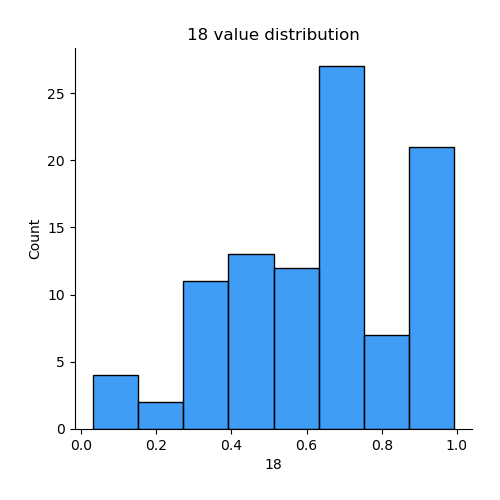
## Feature : 19
- **Feature type** : continous
- **Missing** : 0.0%
- **Unique** : 97
- **Count** :97.0
- **Mean** :0.47373755091497044
- **Std** :0.32119186922799753
- **Min** :-0.2753611012038661
- **25%th Percentile** : 0.22608815307270677
- **50%th Percentile** : 0.4425835106215747
- **75%th Percentile** : 0.6666857482340925
- **Max** :0.9862006178490994

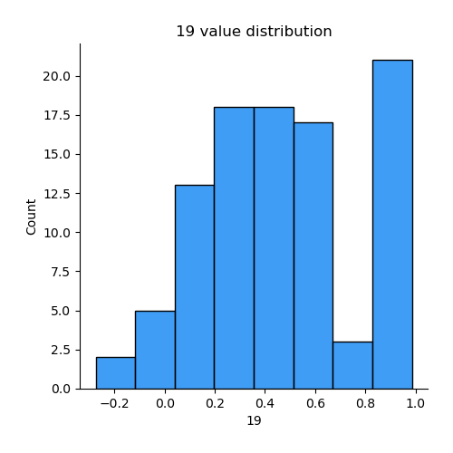
## Feature : 20
- **Feature type** : continous
- **Missing** : 0.0%
- **Unique** : 97
- **Count** :97.0
- **Mean** :0.5463129000841385
- **Std** :0.311887876335097
- **Min** :-0.06594176678776828
- **25%th Percentile** : 0.3318627996068044
- **50%th Percentile** : 0.5383819942611024
- **75%th Percentile** : 0.7492873752783045
- **Max** :0.9937840590295474

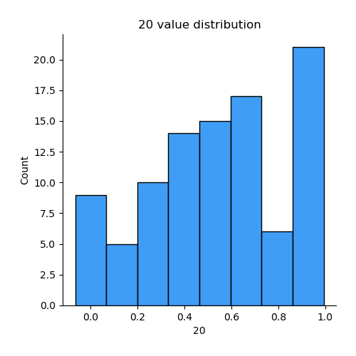
## Feature : 21
- **Feature type** : continous
- **Missing** : 0.0%
- **Unique** : 97
- **Count** :97.0
- **Mean** :0.5954778973953555
- **Std** :0.2667294129551713
- **Min** :-0.29787425172766324
- **25%th Percentile** : 0.3930381741790059
- **50%th Percentile** : 0.5813354154413966
- **75%th Percentile** : 0.7589676949832534
- **Max** :0.9926116527924819

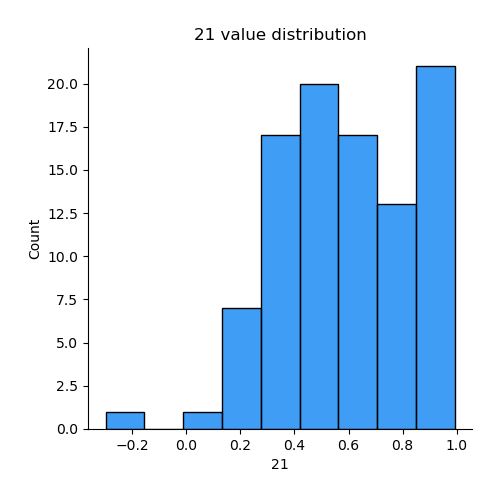
## Feature : 22
- **Feature type** : continous
- **Missing** : 0.0%
- **Unique** : 97
- **Count** :97.0
- **Mean** :0.7592447438200151
- **Std** :0.17199872414310116
- **Min** :0.33273261146501365
- **25%th Percentile** : 0.664486328219625
- **50%th Percentile** : 0.7712395203328142
- **75%th Percentile** : 0.895007236633696
- **Max** :0.9948339022693805

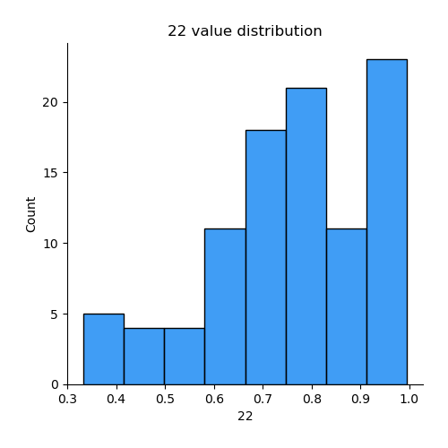
## Feature : 23
- **Feature type** : continous
- **Missing** : 0.0%
- **Unique** : 97
- **Count** :97.0
- **Mean** :0.6650298723219201
- **Std** :0.2357579283167925
- **Min** :-0.050972565580010294
- **25%th Percentile** : 0.5386363114539439
- **50%th Percentile** : 0.6576005025167158
- **75%th Percentile** : 0.8350231480500634
- **Max** :0.9942399606860168

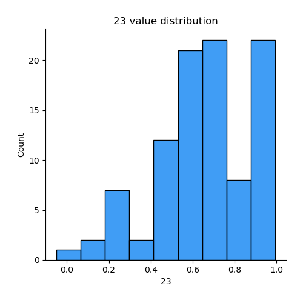
## Feature : 24
- **Feature type** : continous
- **Missing** : 0.0%
- **Unique** : 97
- **Count** :97.0
- **Mean** :0.43064670419570666
- **Std** :0.31940572274366363
- **Min** :-0.33793620600658303
- **25%th Percentile** : 0.21306671800867077
- **50%th Percentile** : 0.39501282181600494
- **75%th Percentile** : 0.6043817129736767
- **Max** :0.9729367820389804

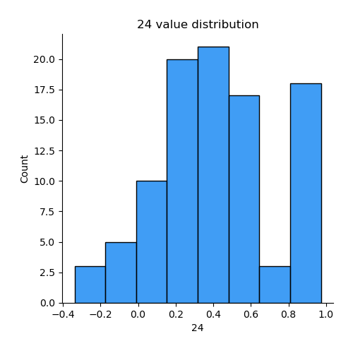
## Feature : 25
- **Feature type** : continous
- **Missing** : 0.0%
- **Unique** : 97
- **Count** :97.0
- **Mean** :0.6093328586111961
- **Std** :0.2419393550976931
- **Min** :-0.03668950374570533
- **25%th Percentile** : 0.44623277982742066
- **50%th Percentile** : 0.5957849626073879
- **75%th Percentile** : 0.797791536903726
- **Max** :0.9887418671745558

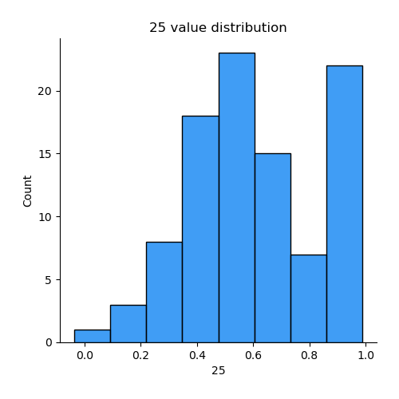
## Feature : 26
- **Feature type** : continous
- **Missing** : 0.0%
- **Unique** : 97
- **Count** :97.0
- **Mean** :0.7233443426108401
- **Std** :0.2286063547935412
- **Min** :-0.21762743650664587
- **25%th Percentile** : 0.6036552223088179
- **50%th Percentile** : 0.7515179055227107
- **75%th Percentile** : 0.8834702810886755
- **Max** :0.9960908314308006

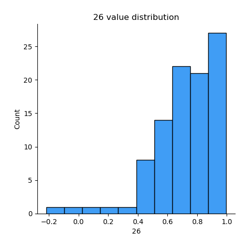
## Feature : 27
- **Feature type** : continous
- **Missing** : 0.0%
- **Unique** : 97
- **Count** :97.0
- **Mean** :0.4798628662746851
- **Std** :0.3135344626593632
- **Min** :-0.2440922036883753
- **25%th Percentile** : 0.26653625873451126
- **50%th Percentile** : 0.4393898286901653
- **75%th Percentile** : 0.6722541990221584
- **Max** :0.9884363719886632

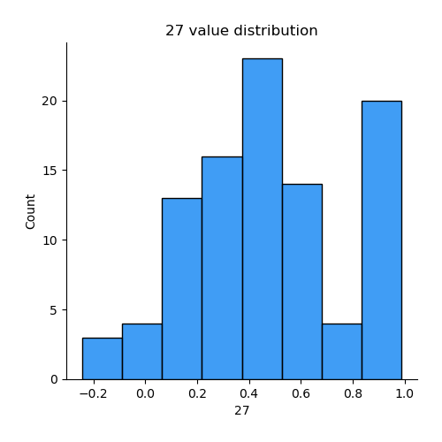
## Feature : 28
- **Feature type** : continous
- **Missing** : 0.0%
- **Unique** : 97
- **Count** :97.0
- **Mean** :0.5874941834917077
- **Std** :0.2733672795558594
- **Min** :-0.19537059727267625
- **25%th Percentile** : 0.4135036965599559
- **50%th Percentile** : 0.5824106676065037
- **75%th Percentile** : 0.794904570709321
- **Max** :0.9909934906521235

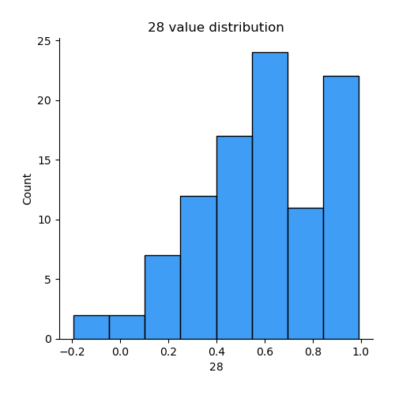
## Feature : 29
- **Feature type** : continous
- **Missing** : 0.0%
- **Unique** : 97
- **Count** :97.0
- **Mean** :0.3504696941661109
- **Std** :0.3532610228614209
- **Min** :-0.5786107396526718
- **25%th Percentile** : 0.10669488191466746
- **50%th Percentile** : 0.325382615774751
- **75%th Percentile** : 0.5583711001459745
- **Max** :0.9796134228738385

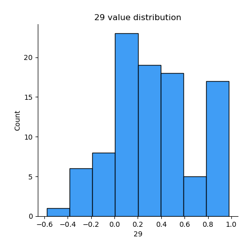
## Feature : 30
- **Feature type** : continous
- **Missing** : 0.0%
- **Unique** : 97
- **Count** :97.0
- **Mean** :0.5842171865967938
- **Std** :0.2769088095080737
- **Min** :-0.1317716911573761
- **25%th Percentile** : 0.407649648964199
- **50%th Percentile** : 0.5914064741817342
- **75%th Percentile** : 0.8169337879787578
- **Max** :0.9909221164344535

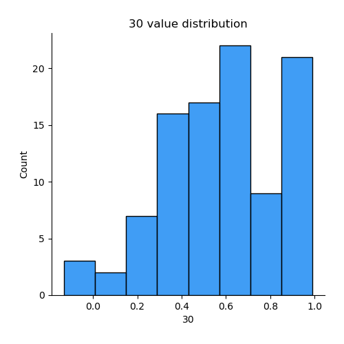
## Feature : 31
- **Feature type** : continous
- **Missing** : 0.0%
- **Unique** : 97
- **Count** :97.0
- **Mean** :0.6156521227996203
- **Std** :0.27074282481280015
- **Min** :-0.17190623424458268
- **25%th Percentile** : 0.4150823974928032
- **50%th Percentile** : 0.6302880555379066
- **75%th Percentile** : 0.7767643752204403
- **Max** :0.9948677682714705

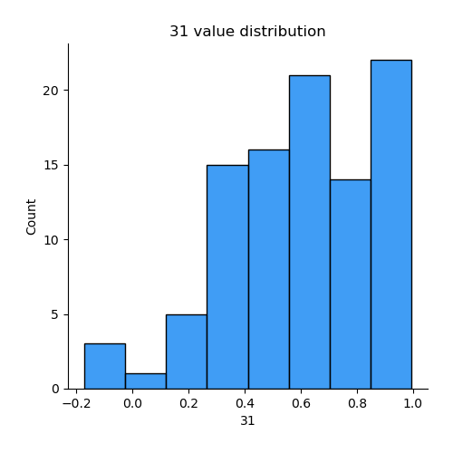
## Feature : 32
- **Feature type** : continous
- **Missing** : 0.0%
- **Unique** : 97
- **Count** :97.0
- **Mean** :0.5325711454487001
- **Std** :0.29593824022697446
- **Min** :-0.2147019378586194
- **25%th Percentile** : 0.3484225758547747
- **50%th Percentile** : 0.5135500928735023
- **75%th Percentile** : 0.6880926286816642
- **Max** :0.9909791602958434

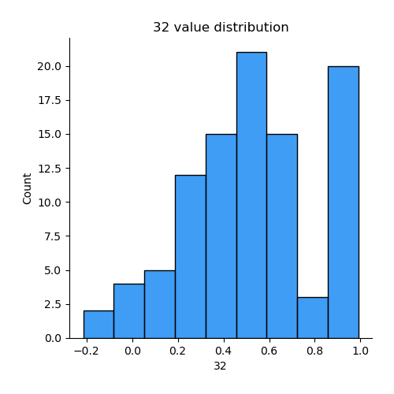
## Feature : 33
- **Feature type** : continous
- **Missing** : 0.0%
- **Unique** : 97
- **Count** :97.0
- **Mean** :0.5819610055298795
- **Std** :0.29648968542516957
- **Min** :-0.35543952114938304
- **25%th Percentile** : 0.4181545892735124
- **50%th Percentile** : 0.5802974063733396
- **75%th Percentile** : 0.7703198325845998
- **Max** :0.9945115928428873

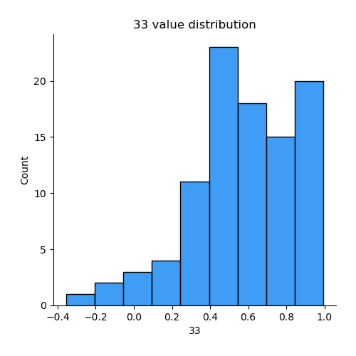
## Feature : 34
- **Feature type** : continous
- **Missing** : 0.0%
- **Unique** : 97
- **Count** :97.0
- **Mean** :0.5725032179325724
- **Std** :0.2843122547600389
- **Min** :-0.09405754564590346
- **25%th Percentile** : 0.32014811915343544
- **50%th Percentile** : 0.6034583771566088
- **75%th Percentile** : 0.7496061191041822
- **Max** :0.9836816285659231

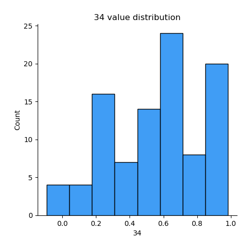
## Feature : 35
- **Feature type** : continous
- **Missing** : 0.0%
- **Unique** : 97
- **Count** :97.0
- **Mean** :0.5809751707557296
- **Std** :0.2722720231898736
- **Min** :-0.1638593149970825
- **25%th Percentile** : 0.38767156607073777
- **50%th Percentile** : 0.5639027880837795
- **75%th Percentile** : 0.8409876538940033
- **Max** :0.9900092012106778

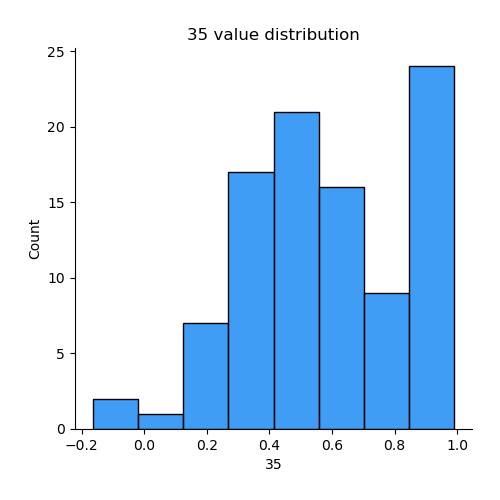
## Feature : 36
- **Feature type** : continous
- **Missing** : 0.0%
- **Unique** : 97
- **Count** :97.0
- **Mean** :0.5882449080836093
- **Std** :0.27820664995000044
- **Min** :-0.2471757871034307
- **25%th Percentile** : 0.3868965055241645
- **50%th Percentile** : 0.5862158297114398
- **75%th Percentile** : 0.8290818599482825
- **Max** :0.9910251265473415

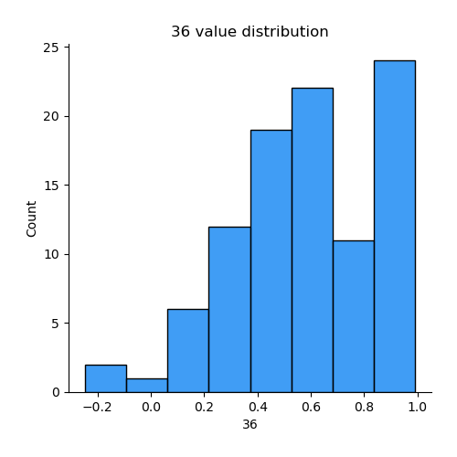
## Feature : 37
- **Feature type** : continous
- **Missing** : 0.0%
- **Unique** : 97
- **Count** :97.0
- **Mean** :0.6444986563390231
- **Std** :0.27479096268274283
- **Min** :-0.3652777577438207
- **25%th Percentile** : 0.5107278584398924
- **50%th Percentile** : 0.6618924890178117
- **75%th Percentile** : 0.8506668922831486
- **Max** :0.9961782977455214

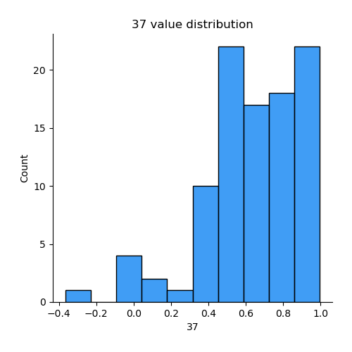
## Feature : 38
- **Feature type** : continous
- **Missing** : 0.0%
- **Unique** : 97
- **Count** :97.0
- **Mean** :0.5073101814879333
- **Std** :0.33259315517611765
- **Min** :-0.2913506928737934
- **25%th Percentile** : 0.2743171273438111
- **50%th Percentile** : 0.505907801391026
- **75%th Percentile** : 0.7676361296091548
- **Max** :0.9935195414424739

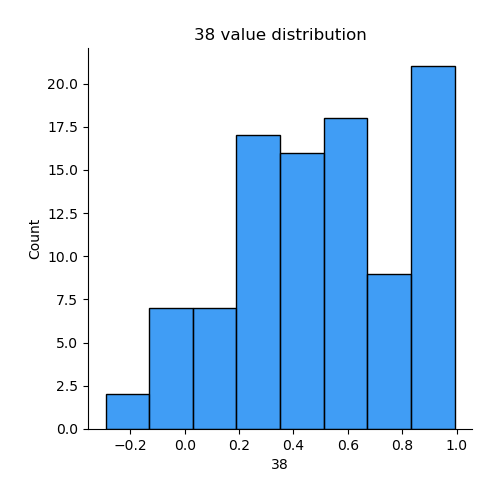
## Feature : 39
- **Feature type** : continous
- **Missing** : 0.0%
- **Unique** : 97
- **Count** :97.0
- **Mean** :0.4775103239417724
- **Std** :0.3271242414969116
- **Min** :-0.31274155240360174
- **25%th Percentile** : 0.23606059099744472
- **50%th Percentile** : 0.4373572067649279
- **75%th Percentile** : 0.6954184102679811
- **Max** :0.9903594653671175

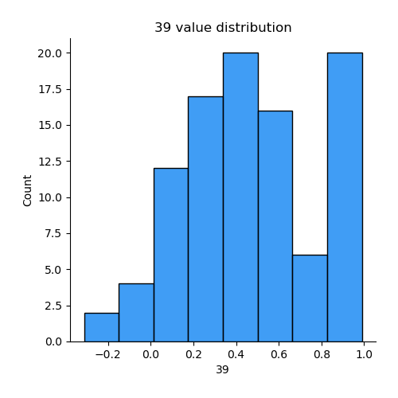
## Feature : 40
- **Feature type** : continous
- **Missing** : 0.0%
- **Unique** : 97
- **Count** :97.0
- **Mean** :0.5441865864287442
- **Std** :0.2916379280196081
- **Min** :-0.22485806757906296
- **25%th Percentile** : 0.3123303650377824
- **50%th Percentile** : 0.5368423342930095
- **75%th Percentile** : 0.7916246858136943
- **Max** :0.984851398158771

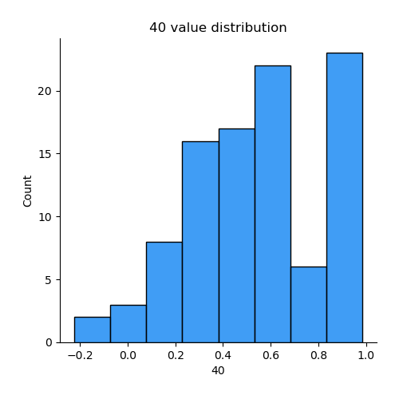
## Feature : 41
- **Feature type** : continous
- **Missing** : 0.0%
- **Unique** : 97
- **Count** :97.0
- **Mean** :0.5426808440091903
- **Std** :0.322281323287708
- **Min** :-0.4612534412629313
- **25%th Percentile** : 0.3504711444401524
- **50%th Percentile** : 0.5303003609403221
- **75%th Percentile** : 0.8166857297259612
- **Max** :0.99357730661055

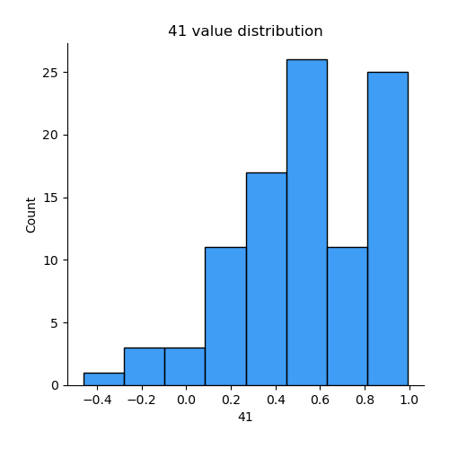
## Feature : 42
- **Feature type** : continous
- **Missing** : 0.0%
- **Unique** : 97
- **Count** :97.0
- **Mean** :0.5327051494708188
- **Std** :0.29866371521406965
- **Min** :-0.25376014788203716
- **25%th Percentile** : 0.32401814581201605
- **50%th Percentile** : 0.5073895967940404
- **75%th Percentile** : 0.7232156262868885
- **Max** :0.9920816657722892

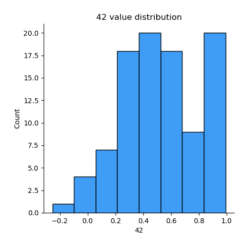
## Feature : 43
- **Feature type** : continous
- **Missing** : 0.0%
- **Unique** : 97
- **Count** :97.0
- **Mean** :0.5376396834665854
- **Std** :0.3166329651693545
- **Min** :-0.24297717304802488
- **25%th Percentile** : 0.3654601702960148
- **50%th Percentile** : 0.5067250307674525
- **75%th Percentile** : 0.7852872943903412
- **Max** :0.994496139330186

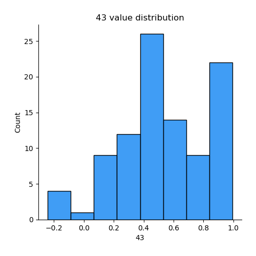
## Feature : 44
- **Feature type** : continous
- **Missing** : 0.0%
- **Unique** : 97
- **Count** :97.0
- **Mean** :0.6054524149848811
- **Std** :0.2643069177907716
- **Min** :-0.06599689276448964
- **25%th Percentile** : 0.4076531723788783
- **50%th Percentile** : 0.6115328612784224
- **75%th Percentile** : 0.7527086354949002
- **Max** :0.9928246818561733

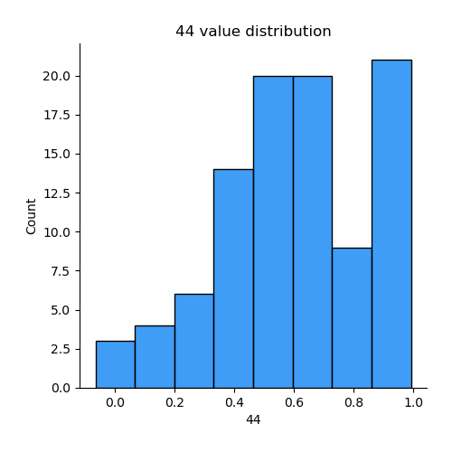
## Feature : 45
- **Feature type** : continous
- **Missing** : 0.0%
- **Unique** : 97
- **Count** :97.0
- **Mean** :0.4208000297304551
- **Std** :0.3520288790222554
- **Min** :-0.36637903009906764
- **25%th Percentile** : 0.16976036217917498
- **50%th Percentile** : 0.3730098922451664
- **75%th Percentile** : 0.6229569771664178
- **Max** :0.9851949204365219

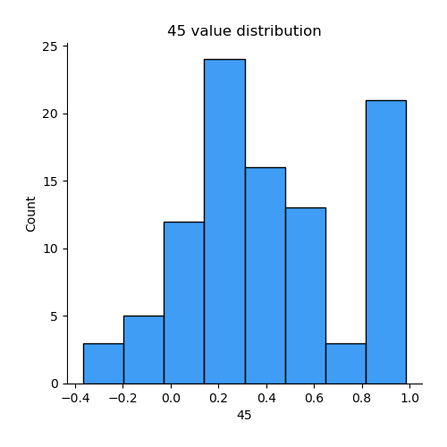
## Feature : 46
- **Feature type** : continous
- **Missing** : 0.0%
- **Unique** : 97
- **Count** :97.0
- **Mean** :0.505346322613185
- **Std** :0.3397202066000396
- **Min** :-0.20989677418853395
- **25%th Percentile** : 0.29179962041885327
- **50%th Percentile** : 0.5136752602742051
- **75%th Percentile** : 0.7370506052513676
- **Max** :0.9918926757817735

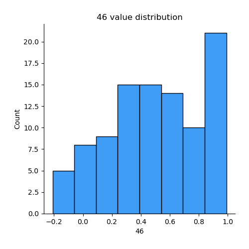
## Feature : 47
- **Feature type** : continous
- **Missing** : 0.0%
- **Unique** : 97
- **Count** :97.0
- **Mean** :0.5504281500144379
- **Std** :0.30287017344437994
- **Min** :-0.3496822453138747
- **25%th Percentile** : 0.3484631771035266
- **50%th Percentile** : 0.5379407804285425
- **75%th Percentile** : 0.7616384938534311
- **Max** :0.9935506228012028

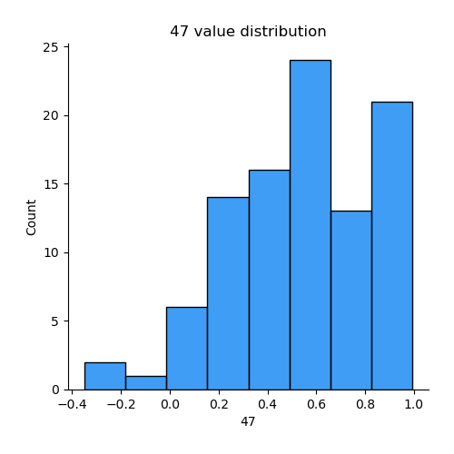
## Feature : 48
- **Feature type** : continous
- **Missing** : 0.0%
- **Unique** : 97
- **Count** :97.0
- **Mean** :0.6676452337703648
- **Std** :0.26232166341278196
- **Min** :-0.4153588695198884
- **25%th Percentile** : 0.5123384849540631
- **50%th Percentile** : 0.7146624032490322
- **75%th Percentile** : 0.868893506069816
- **Max** :0.9916958077760432

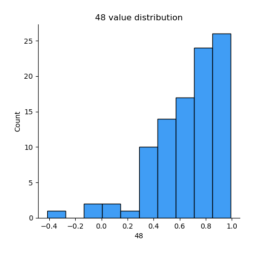
## Feature : 49
- **Feature type** : continous
- **Missing** : 0.0%
- **Unique** : 97
- **Count** :97.0
- **Mean** :0.5617432823492008
- **Std** :0.31498503004017636
- **Min** :-0.36036235308166026
- **25%th Percentile** : 0.34915319511882037
- **50%th Percentile** : 0.602350001693507
- **75%th Percentile** : 0.7641800045323156
- **Max** :0.9950179750997088

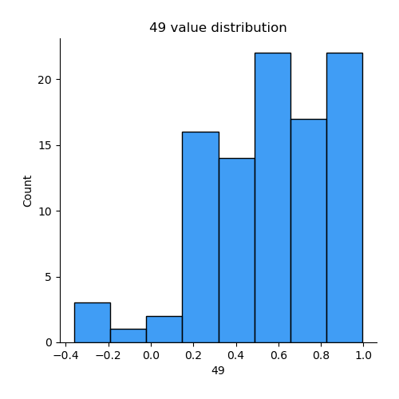
## Feature : 50
- **Feature type** : continous
- **Missing** : 0.0%
- **Unique** : 97
- **Count** :97.0
- **Mean** :0.39112983306503607
- **Std** :0.3332254634868238
- **Min** :-0.25511086902533703
- **25%th Percentile** : 0.17335723781480808
- **50%th Percentile** : 0.36679106874498696
- **75%th Percentile** : 0.6357686278131272
- **Max** :0.9772098569811121

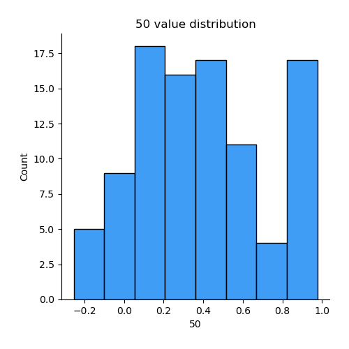
## Feature : 51
- **Feature type** : continous
- **Missing** : 0.0%
- **Unique** : 97
- **Count** :97.0
- **Mean** :0.5120394550780504
- **Std** :0.31817433397632544
- **Min** :-0.19787575658743084
- **25%th Percentile** : 0.28909551490468227
- **50%th Percentile** : 0.4859729481182135
- **75%th Percentile** : 0.7740505097777215
- **Max** :0.9900001567856128

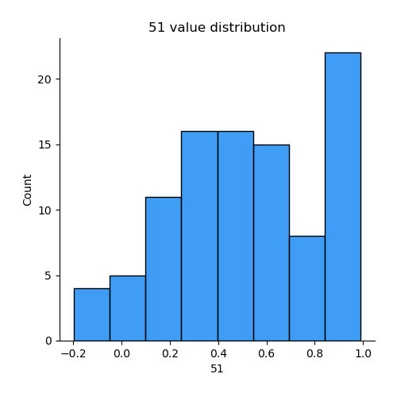
## Feature : 53
- **Feature type** : continous
- **Missing** : 0.0%
- **Unique** : 3
- **Count** :97.0
- **Mean** :1.0
- **Std** :8.849923789036128e-17
- **Min** :0.9999999999999998
- **25%th Percentile** : 0.9999999999999999
- **50%th Percentile** : 1.0
- **75%th Percentile** : 1.0
- **Max** :1.0

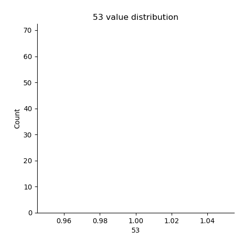
## Feature : 54
- **Feature type** : continous
- **Missing** : 0.0%
- **Unique** : 97
- **Count** :97.0
- **Mean** :0.5547719062036783
- **Std** :0.2753487673780439
- **Min** :-0.07307563375647746
- **25%th Percentile** : 0.33031520701521166
- **50%th Percentile** : 0.5462676094704981
- **75%th Percentile** : 0.7552314145358002
- **Max** :0.9868870962794191

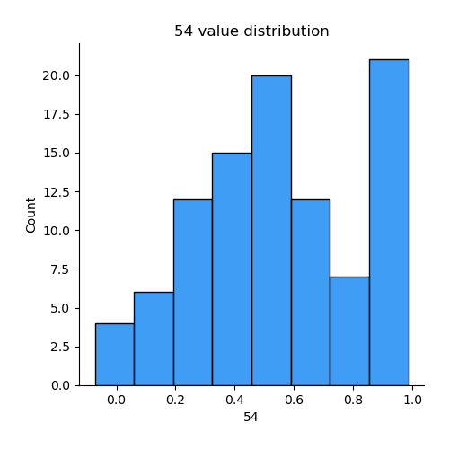
## Feature : 55
- **Feature type** : continous
- **Missing** : 0.0%
- **Unique** : 97
- **Count** :97.0
- **Mean** :0.416702188188072
- **Std** :0.3080402182652802
- **Min** :-0.5130585116063803
- **25%th Percentile** : 0.20376484808204234
- **50%th Percentile** : 0.3683634828064326
- **75%th Percentile** : 0.5773798209203275
- **Max** :0.9873239198103654

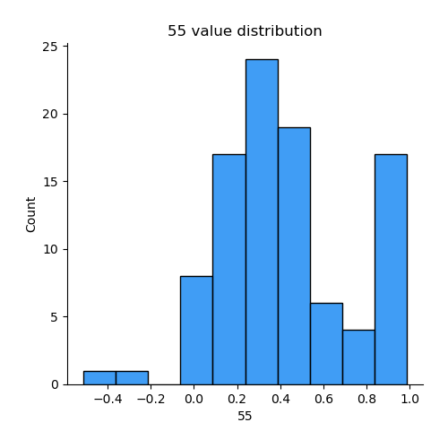
## Feature : 56
- **Feature type** : continous
- **Missing** : 0.0%
- **Unique** : 97
- **Count** :97.0
- **Mean** :0.555129081816351
- **Std** :0.2905079471618431
- **Min** :-0.36209351048657556
- **25%th Percentile** : 0.4122015687910652
- **50%th Percentile** : 0.5493187011762026
- **75%th Percentile** : 0.7359436101498431
- **Max** :0.9879669847005962

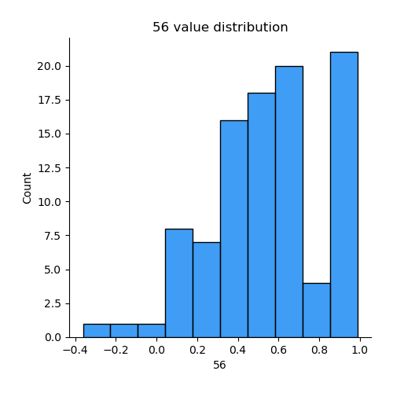
## Feature : 57
- **Feature type** : continous
- **Missing** : 0.0%
- **Unique** : 97
- **Count** :97.0
- **Mean** :0.5705948481519729
- **Std** :0.25651594707671116
- **Min** :0.06494745373292746
- **25%th Percentile** : 0.38737614432336864
- **50%th Percentile** : 0.5469052892186327
- **75%th Percentile** : 0.7473111455777915
- **Max** :0.9910206292631263

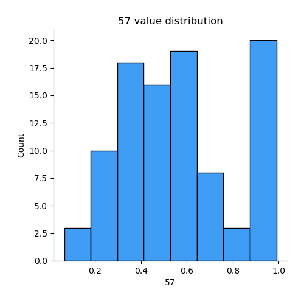
## Feature : 58
- **Feature type** : continous
- **Missing** : 0.0%
- **Unique** : 97
- **Count** :97.0
- **Mean** :0.5473640877770893
- **Std** :0.2774762740088435
- **Min** :-0.15509353479339705
- **25%th Percentile** : 0.35653444900356973
- **50%th Percentile** : 0.5027353612613934
- **75%th Percentile** : 0.718186789381346
- **Max** :0.9878383778303169

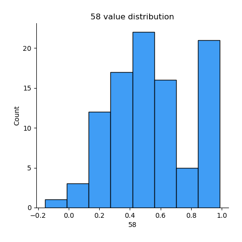
## Feature : 59
- **Feature type** : continous
- **Missing** : 0.0%
- **Unique** : 97
- **Count** :97.0
- **Mean** :0.6881539366897088
- **Std** :0.22804815466975986
- **Min** :0.043037950585268735
- **25%th Percentile** : 0.5635147086743517
- **50%th Percentile** : 0.7139814443409428
- **75%th Percentile** : 0.8682228242616732
- **Max** :0.9952987084100154

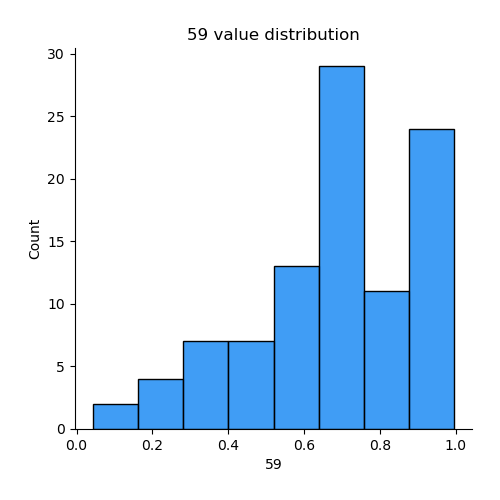
## Feature : 60
- **Feature type** : continous
- **Missing** : 0.0%
- **Unique** : 97
- **Count** :97.0
- **Mean** :0.5577684110325606
- **Std** :0.25892318472131826
- **Min** :-0.021329001290473635
- **25%th Percentile** : 0.37483006064879054
- **50%th Percentile** : 0.5342595565868516
- **75%th Percentile** : 0.709152836909168
- **Max** :0.9831600625090817

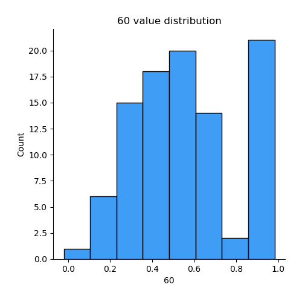
## Feature : 61
- **Feature type** : continous
- **Missing** : 0.0%
- **Unique** : 97
- **Count** :97.0
- **Mean** :0.5158725586559435
- **Std** :0.2788880241229169
- **Min** :-0.006040031570178077
- **25%th Percentile** : 0.31749249479817165
- **50%th Percentile** : 0.45965103960051895
- **75%th Percentile** : 0.6753682701351835
- **Max** :0.9823715605404273

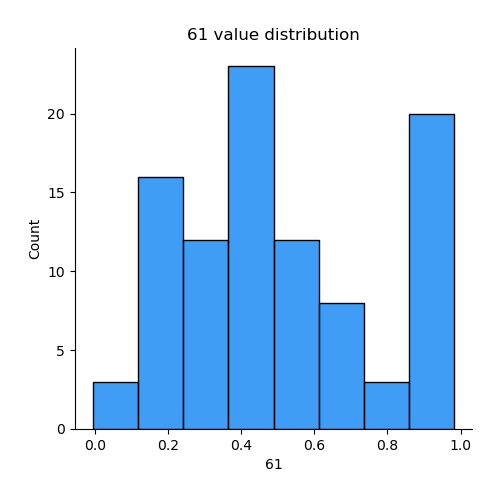
## Feature : 62
- **Feature type** : continous
- **Missing** : 0.0%
- **Unique** : 97
- **Count** :97.0
- **Mean** :0.5508925768555297
- **Std** :0.2838620775308166
- **Min** :-0.07434377250592258
- **25%th Percentile** : 0.3724432364444878
- **50%th Percentile** : 0.5568439974750047
- **75%th Percentile** : 0.7287781191084622
- **Max** :0.9859567844510805

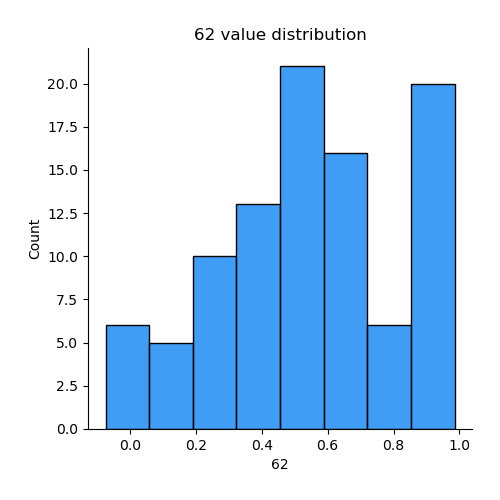
## Feature : 63
- **Feature type** : continous
- **Missing** : 0.0%
- **Unique** : 97
- **Count** :97.0
- **Mean** :0.5329181152551451
- **Std** :0.29367686241611207
- **Min** :-0.1501565497897484
- **25%th Percentile** : 0.30259677785955275
- **50%th Percentile** : 0.518589387953612
- **75%th Percentile** : 0.7412840851112347
- **Max** :0.9903605857527125

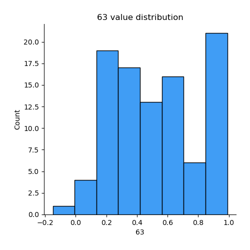
## Feature : 64
- **Feature type** : continous
- **Missing** : 0.0%
- **Unique** : 97
- **Count** :97.0
- **Mean** :0.6257504708402025
- **Std** :0.2595907777405546
- **Min** :-0.17143239727086676
- **25%th Percentile** : 0.4629365462464081
- **50%th Percentile** : 0.6212712496428145
- **75%th Percentile** : 0.7827130393249526
- **Max** :0.9937088112618173

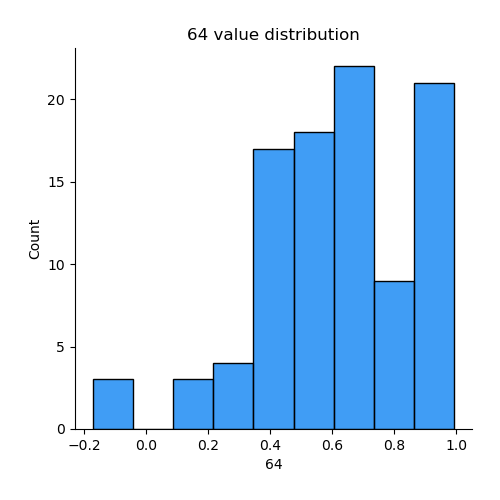
## Feature : 65
- **Feature type** : continous
- **Missing** : 0.0%
- **Unique** : 97
- **Count** :97.0
- **Mean** :0.4920019407196578
- **Std** :0.3110906265207887
- **Min** :-0.42430318757527824
- **25%th Percentile** : 0.32337013459035446
- **50%th Percentile** : 0.44807781950942355
- **75%th Percentile** : 0.6482827305443936
- **Max** :0.9908026681076921

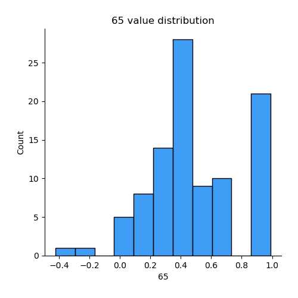
## Feature : 66
- **Feature type** : continous
- **Missing** : 0.0%
- **Unique** : 97
- **Count** :97.0
- **Mean** :0.5479485480860041
- **Std** :0.2628034661022629
- **Min** :-0.007329938733188229
- **25%th Percentile** : 0.3936602462463546
- **50%th Percentile** : 0.5313688974881596
- **75%th Percentile** : 0.7121862814809489
- **Max** :0.9853336577455923

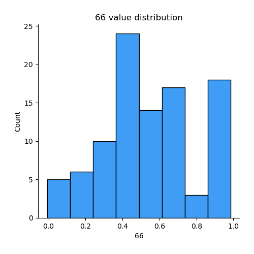
## Feature : 67
- **Feature type** : continous
- **Missing** : 0.0%
- **Unique** : 97
- **Count** :97.0
- **Mean** :0.6672267253145413
- **Std** :0.22074244581582744
- **Min** :0.13436927118857422
- **25%th Percentile** : 0.5190502871593713
- **50%th Percentile** : 0.6525930600995095
- **75%th Percentile** : 0.8741783985824964
- **Max** :0.9958037757449429

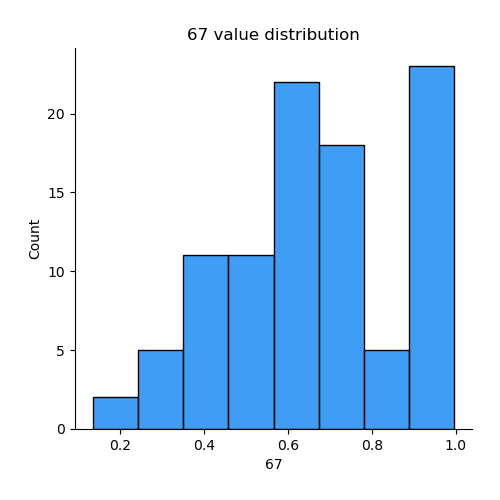
## Feature : 68
- **Feature type** : continous
- **Missing** : 0.0%
- **Unique** : 97
- **Count** :97.0
- **Mean** :0.7688393335753116
- **Std** :0.17093480853842147
- **Min** :0.25503521775483523
- **25%th Percentile** : 0.6722013406850246
- **50%th Percentile** : 0.7733535116171888
- **75%th Percentile** : 0.8917338954037356
- **Max** :0.995908926367117

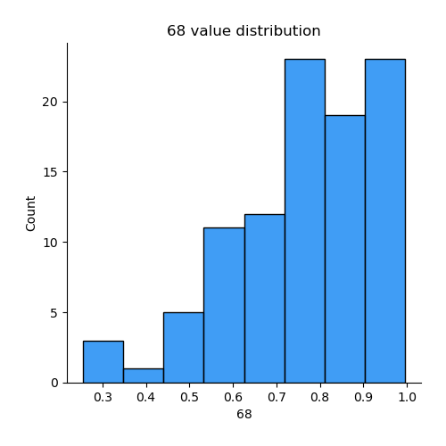
## Feature : 69
- **Feature type** : continous
- **Missing** : 0.0%
- **Unique** : 97
- **Count** :97.0
- **Mean** :0.7222839570943951
- **Std** :0.19134454250555008
- **Min** :0.15419736097740147
- **25%th Percentile** : 0.6047662086990895
- **50%th Percentile** : 0.7146725164465477
- **75%th Percentile** : 0.8750149828526232
- **Max** :0.9974487697459942

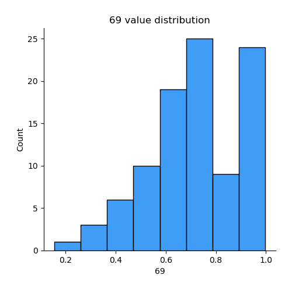
## Feature : 70
- **Feature type** : continous
- **Missing** : 0.0%
- **Unique** : 97
- **Count** :97.0
- **Mean** :0.6570361422508523
- **Std** :0.2150762242664147
- **Min** :0.21789749198616817
- **25%th Percentile** : 0.517152856417283
- **50%th Percentile** : 0.6381358716862607
- **75%th Percentile** : 0.8030585659689636
- **Max** :0.9900680168735287

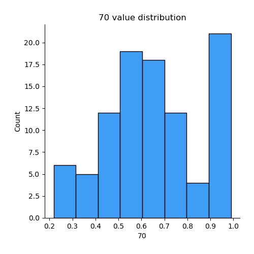
## Feature : 71
- **Feature type** : continous
- **Missing** : 0.0%
- **Unique** : 97
- **Count** :97.0
- **Mean** :0.6166683573034146
- **Std** :0.24750484870550923
- **Min** :0.0057244075369544236
- **25%th Percentile** : 0.4411533067321573
- **50%th Percentile** : 0.5669573359377384
- **75%th Percentile** : 0.8357559323949291
- **Max** :0.9914768679382742

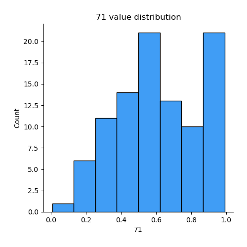
## Feature : 72
- **Feature type** : continous
- **Missing** : 0.0%
- **Unique** : 97
- **Count** :97.0
- **Mean** :0.7634599518628571
- **Std** :0.16765745980468305
- **Min** :0.2856652849686547
- **25%th Percentile** : 0.6882658182661541
- **50%th Percentile** : 0.767951274415069
- **75%th Percentile** : 0.8671047546360462
- **Max** :0.9958860796733289

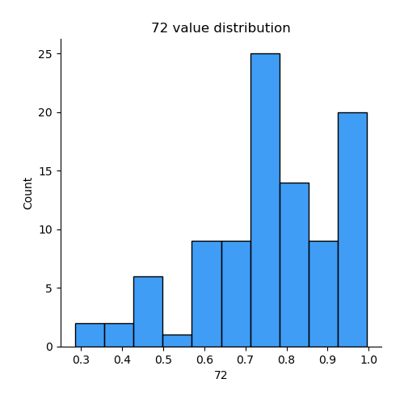
## Feature : 73
- **Feature type** : continous
- **Missing** : 0.0%
- **Unique** : 97
- **Count** :97.0
- **Mean** :0.6361222050590459
- **Std** :0.232375710844902
- **Min** :0.18502191063232784
- **25%th Percentile** : 0.48089563108968675
- **50%th Percentile** : 0.6106971231264124
- **75%th Percentile** : 0.7745748483831917
- **Max** :0.9953647201365384

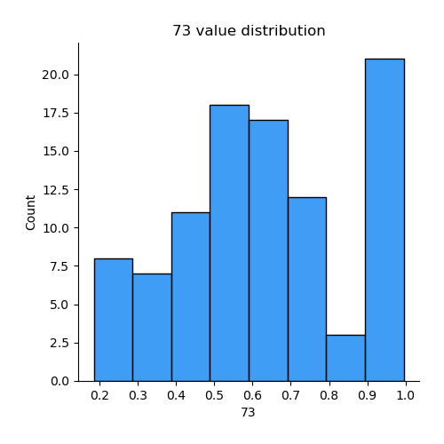
## Feature : 74
- **Feature type** : continous
- **Missing** : 0.0%
- **Unique** : 97
- **Count** :97.0
- **Mean** :0.6009727440766705
- **Std** :0.2761716426892047
- **Min** :-0.07544450191284781
- **25%th Percentile** : 0.3923170086086952
- **50%th Percentile** : 0.6064094456263731
- **75%th Percentile** : 0.8387091532901212
- **Max** :0.9927518111682893

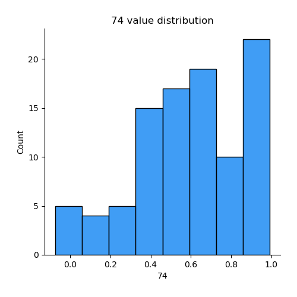
## Feature : 75
- **Feature type** : continous
- **Missing** : 0.0%
- **Unique** : 97
- **Count** :97.0
- **Mean** :0.6977317246143989
- **Std** :0.19766220568355772
- **Min** :0.162213930701269
- **25%th Percentile** : 0.588865479079315
- **50%th Percentile** : 0.6738685527504565
- **75%th Percentile** : 0.8623615880742493
- **Max** :0.9954788787262601

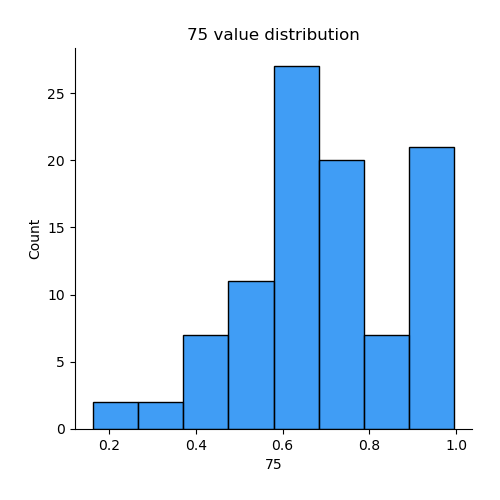
## Feature : 76
- **Feature type** : continous
- **Missing** : 0.0%
- **Unique** : 97
- **Count** :97.0
- **Mean** :0.4329662795097089
- **Std** :0.3076120183031533
- **Min** :-0.2595637651381403
- **25%th Percentile** : 0.22303812583454918
- **50%th Percentile** : 0.3770174798804706
- **75%th Percentile** : 0.5582047056056731
- **Max** :0.9839763044933997

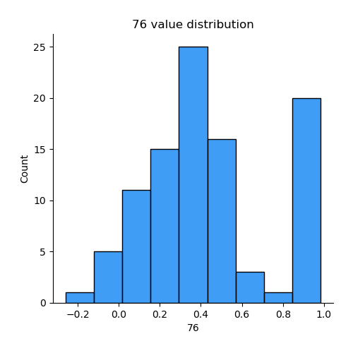
## Feature : 77
- **Feature type** : continous
- **Missing** : 0.0%
- **Unique** : 97
- **Count** :97.0
- **Mean** :0.5969563487097489
- **Std** :0.25906296578934246
- **Min** :-0.004218571665723469
- **25%th Percentile** : 0.4170094496682399
- **50%th Percentile** : 0.5662558515309055
- **75%th Percentile** : 0.7994670158747311
- **Max** :0.9922161103593049

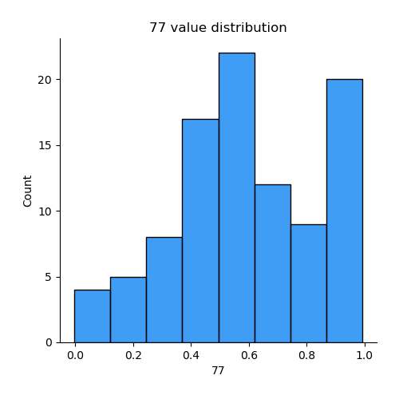
## Feature : 78
- **Feature type** : continous
- **Missing** : 0.0%
- **Unique** : 97
- **Count** :97.0
- **Mean** :0.5105503614782235
- **Std** :0.3140429607538263
- **Min** :-0.15361448330082222
- **25%th Percentile** : 0.28096128185169633
- **50%th Percentile** : 0.502024628487779
- **75%th Percentile** : 0.7238030916541158
- **Max** :0.9914783505872494

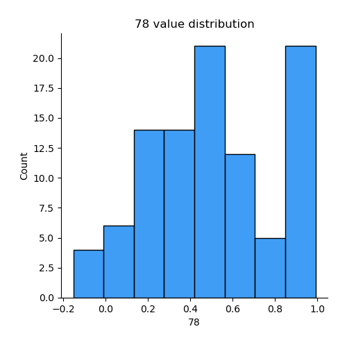
## Feature : 79
- **Feature type** : continous
- **Missing** : 0.0%
- **Unique** : 97
- **Count** :97.0
- **Mean** :0.8389656187793008
- **Std** :0.12877650474008506
- **Min** :0.42116281058342064
- **25%th Percentile** : 0.7641304797409791
- **50%th Percentile** : 0.8451283016466604
- **75%th Percentile** : 0.9442804526463772
- **Max** :0.9973970362909194

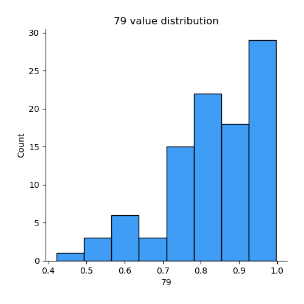
## Feature : 80
- **Feature type** : continous
- **Missing** : 0.0%
- **Unique** : 97
- **Count** :97.0
- **Mean** :0.5619349265802931
- **Std** :0.2663637607378925
- **Min** :-0.016085706603206053
- **25%th Percentile** : 0.3806334656013622
- **50%th Percentile** : 0.5245120914189099
- **75%th Percentile** : 0.7442667483496105
- **Max** :0.9870748070211012

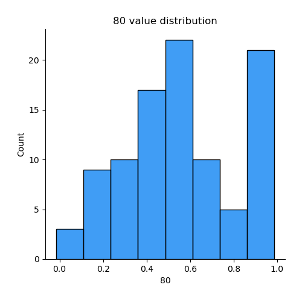
## Feature : 81
- **Feature type** : continous
- **Missing** : 0.0%
- **Unique** : 97
- **Count** :97.0
- **Mean** :0.42756366492267883
- **Std** :0.29136947430250437
- **Min** :-0.11403720190222905
- **25%th Percentile** : 0.21482630926688803
- **50%th Percentile** : 0.386603885317657
- **75%th Percentile** : 0.5438375715295063
- **Max** :0.9838302544959073

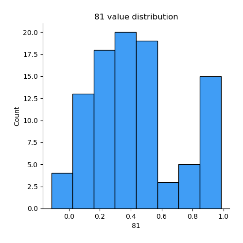
## Feature : 82
- **Feature type** : continous
- **Missing** : 0.0%
- **Unique** : 97
- **Count** :97.0
- **Mean** :0.5485339041377943
- **Std** :0.2853998185240454
- **Min** :-0.13678733838856685
- **25%th Percentile** : 0.4075038154685648
- **50%th Percentile** : 0.5318851997668012
- **75%th Percentile** : 0.7108601204190974
- **Max** :0.9875509616477568

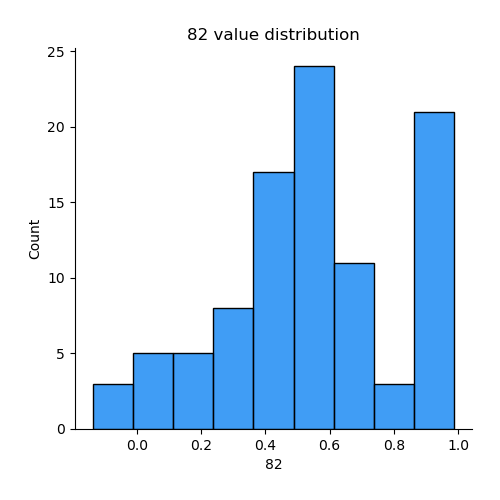
## Feature : 83
- **Feature type** : continous
- **Missing** : 0.0%
- **Unique** : 97
- **Count** :97.0
- **Mean** :0.5764985690817793
- **Std** :0.2640064948865884
- **Min** :0.10400223225778057
- **25%th Percentile** : 0.3891658788069589
- **50%th Percentile** : 0.5468587690272592
- **75%th Percentile** : 0.7433710435511652
- **Max** :0.9929524896810018

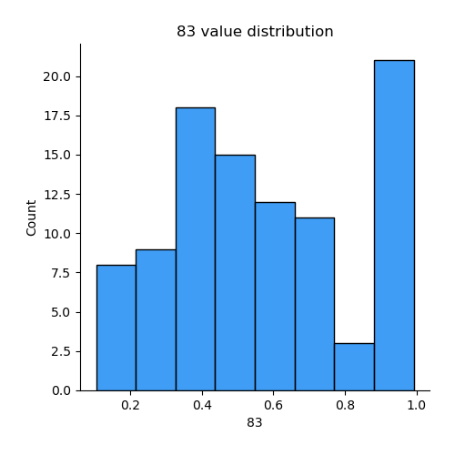
## Feature : 84
- **Feature type** : continous
- **Missing** : 0.0%
- **Unique** : 97
- **Count** :97.0
- **Mean** :0.5293617499981814
- **Std** :0.29013272025188036
- **Min** :-0.2820370950679457
- **25%th Percentile** : 0.34620370379457904
- **50%th Percentile** : 0.5242247146991361
- **75%th Percentile** : 0.6490650447761545
- **Max** :0.9884626612754545

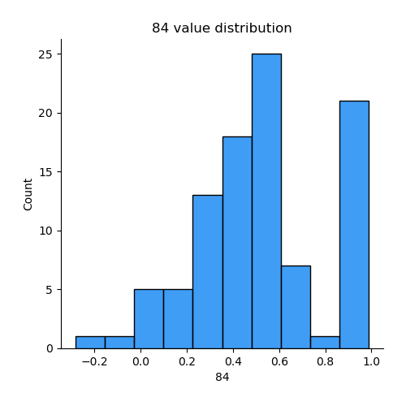
## Feature : 85
- **Feature type** : continous
- **Missing** : 0.0%
- **Unique** : 97
- **Count** :97.0
- **Mean** :0.6891500667577566
- **Std** :0.21258333951334035
- **Min** :0.23900593345693963
- **25%th Percentile** : 0.529114633643444
- **50%th Percentile** : 0.7096853252262787
- **75%th Percentile** : 0.821893525590523
- **Max** :0.9950088306423902

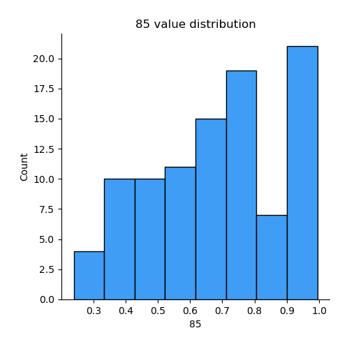
## Feature : 86
- **Feature type** : continous
- **Missing** : 0.0%
- **Unique** : 97
- **Count** :97.0
- **Mean** :0.5829865337034723
- **Std** :0.24360767763147767
- **Min** :-0.015435333164034946
- **25%th Percentile** : 0.3915934428031142
- **50%th Percentile** : 0.5490077331318524
- **75%th Percentile** : 0.7320715017952201
- **Max** :0.9844705395624985

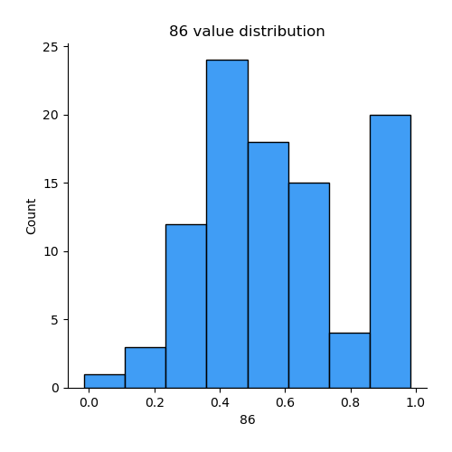
## Feature : 87
- **Feature type** : continous
- **Missing** : 0.0%
- **Unique** : 97
- **Count** :97.0
- **Mean** :0.5137661982353832
- **Std** :0.2770761279004054
- **Min** :-0.0004917395957786871
- **25%th Percentile** : 0.29910519550789166
- **50%th Percentile** : 0.47095841074555284
- **75%th Percentile** : 0.6620563797917127
- **Max** :0.9846753782448149

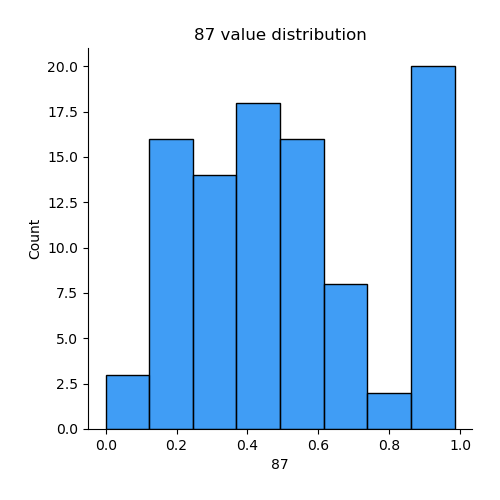
## Feature : 88
- **Feature type** : continous
- **Missing** : 0.0%
- **Unique** : 97
- **Count** :97.0
- **Mean** :0.5578483347915255
- **Std** :0.2708124089959498
- **Min** :-0.012014562671948035
- **25%th Percentile** : 0.35195032054873426
- **50%th Percentile** : 0.5480227905238653
- **75%th Percentile** : 0.712960152338985
- **Max** :0.9881060033147758

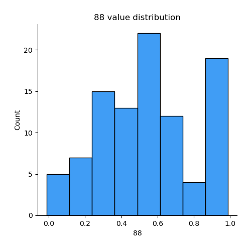
## Feature : 89
- **Feature type** : continous
- **Missing** : 0.0%
- **Unique** : 97
- **Count** :97.0
- **Mean** :0.519504131209671
- **Std** :0.30525433781937145
- **Min** :-0.3646236597820288
- **25%th Percentile** : 0.31547350486305775
- **50%th Percentile** : 0.4866217131793173
- **75%th Percentile** : 0.6950198309697547
- **Max** :0.9915338324514799

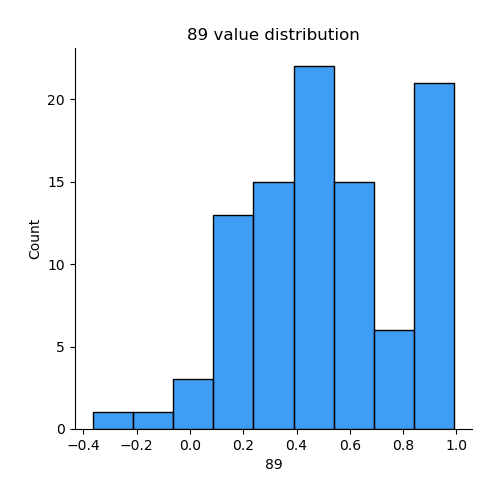
## Feature : 90
- **Feature type** : continous
- **Missing** : 0.0%
- **Unique** : 97
- **Count** :97.0
- **Mean** :0.6104271764410413
- **Std** :0.266228830927296
- **Min** :-0.1048552786191596
- **25%th Percentile** : 0.4385102224902105
- **50%th Percentile** : 0.607864152363583
- **75%th Percentile** : 0.8127563301747689
- **Max** :0.9950880440170888

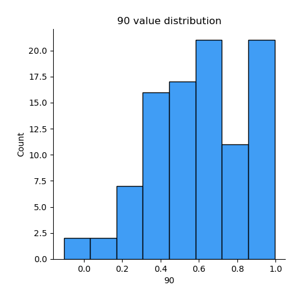
## Feature : 91
- **Feature type** : continous
- **Missing** : 0.0%
- **Unique** : 97
- **Count** :97.0
- **Mean** :0.4929059954789669
- **Std** :0.3055839751603933
- **Min** :-0.26871075127931615
- **25%th Percentile** : 0.27545744042733805
- **50%th Percentile** : 0.4659954913487787
- **75%th Percentile** : 0.6159136920932204
- **Max** :0.9921074320413198

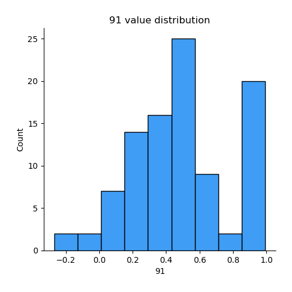
## Feature : 92
- **Feature type** : continous
- **Missing** : 0.0%
- **Unique** : 97
- **Count** :97.0
- **Mean** :0.557372050820875
- **Std** :0.24972826343413448
- **Min** :-0.06321236051936677
- **25%th Percentile** : 0.380605189680399
- **50%th Percentile** : 0.5328513053056408
- **75%th Percentile** : 0.7123323038848606
- **Max** :0.9835490184348845

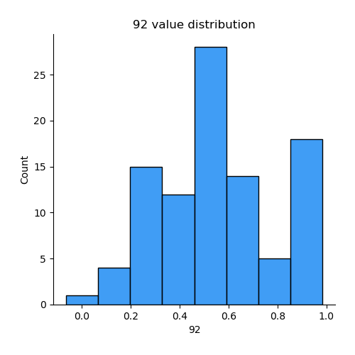
## Feature : 93
- **Feature type** : continous
- **Missing** : 0.0%
- **Unique** : 97
- **Count** :97.0
- **Mean** :0.6258540972832215
- **Std** :0.2542630595683888
- **Min** :0.06259958897546472
- **25%th Percentile** : 0.4397551433807005
- **50%th Percentile** : 0.6361923252035699
- **75%th Percentile** : 0.8181150027818231
- **Max** :0.9958611007324157

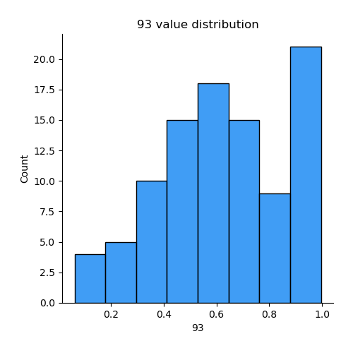
## Feature : 94
- **Feature type** : continous
- **Missing** : 0.0%
- **Unique** : 97
- **Count** :97.0
- **Mean** :0.7640027287536999
- **Std** :0.16835952213295477
- **Min** :0.23794265684388125
- **25%th Percentile** : 0.6677897249818723
- **50%th Percentile** : 0.7639291457562437
- **75%th Percentile** : 0.8867557746584213
- **Max** :0.9955835037733878

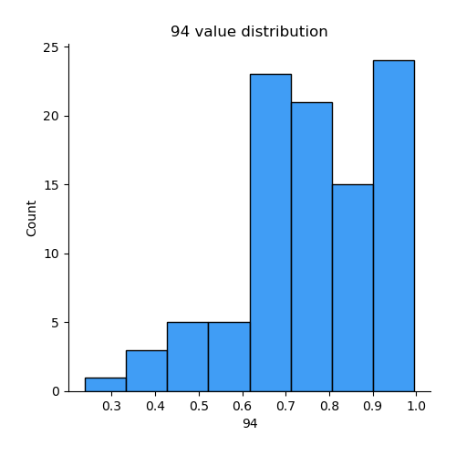
## Feature : 95
- **Feature type** : continous
- **Missing** : 0.0%
- **Unique** : 97
- **Count** :97.0
- **Mean** :0.6884427695047387
- **Std** :0.21814028391605533
- **Min** :0.06921173580172699
- **25%th Percentile** : 0.5523677809405968
- **50%th Percentile** : 0.6813710032596033
- **75%th Percentile** : 0.8616938312923065
- **Max** :0.9973338808190148

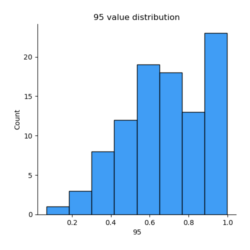
## Feature : 96
- **Feature type** : continous
- **Missing** : 0.0%
- **Unique** : 97
- **Count** :97.0
- **Mean** :0.648070957187665
- **Std** :0.22287439270397702
- **Min** :0.13524519190590287
- **25%th Percentile** : 0.5128371649965785
- **50%th Percentile** : 0.6261889384717745
- **75%th Percentile** : 0.7973815061141856
- **Max** :0.9914601778737407

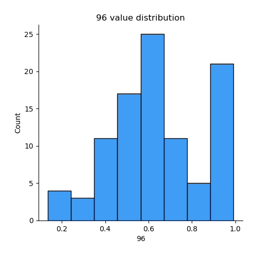
## Feature : 97
- **Feature type** : continous
- **Missing** : 0.0%
- **Unique** : 97
- **Count** :97.0
- **Mean** :0.5893856399751183
- **Std** :0.2596140320728866
- **Min** :0.11956765100505054
- **25%th Percentile** : 0.38590678741804874
- **50%th Percentile** : 0.551854656636619
- **75%th Percentile** : 0.766764010356031
- **Max** :0.9918286584136438

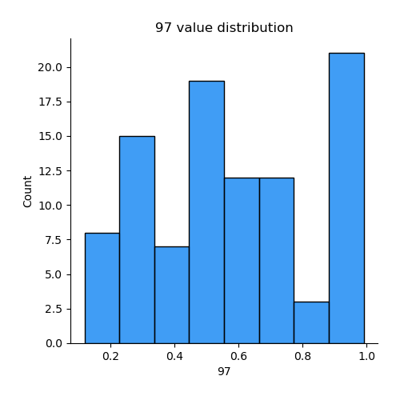
## Feature : 98
- **Feature type** : continous
- **Missing** : 0.0%
- **Unique** : 97
- **Count** :97.0
- **Mean** :0.7510012265317156
- **Std** :0.17503018470838225
- **Min** :0.25103926334488724
- **25%th Percentile** : 0.6502240486750517
- **50%th Percentile** : 0.7621528417632937
- **75%th Percentile** : 0.8778264757384523
- **Max** :0.9968093087650753

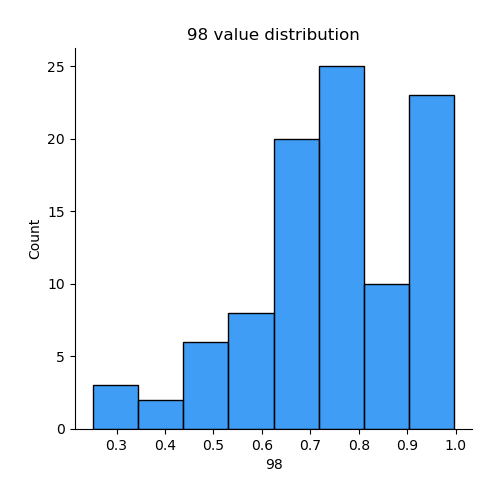
## Feature : 99
- **Feature type** : continous
- **Missing** : 0.0%
- **Unique** : 97
- **Count** :97.0
- **Mean** :0.6277026385123071
- **Std** :0.24089489998106808
- **Min** :0.10998133196257509
- **25%th Percentile** : 0.4692239272504694
- **50%th Percentile** : 0.6077125061699883
- **75%th Percentile** : 0.7911884072458191
- **Max** :0.9949560485999741

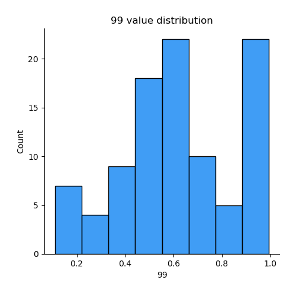
## Feature : 100
- **Feature type** : continous
- **Missing** : 0.0%
- **Unique** : 97
- **Count** :97.0
- **Mean** :0.5812474358979071
- **Std** :0.28657361931331565
- **Min** :-0.1481168183103964
- **25%th Percentile** : 0.39945620340313703
- **50%th Percentile** : 0.5820302269913239
- **75%th Percentile** : 0.7922339081187688
- **Max** :0.9937166111264286

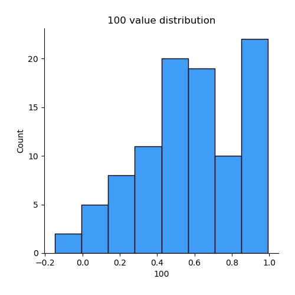
## Feature : 101
- **Feature type** : continous
- **Missing** : 0.0%
- **Unique** : 97
- **Count** :97.0
- **Mean** :0.6793379601691273
- **Std** :0.2152394925064557
- **Min** :0.19821355466212548
- **25%th Percentile** : 0.556009503986018
- **50%th Percentile** : 0.6750623939230149
- **75%th Percentile** : 0.8243104021906704
- **Max** :0.9945302361703542

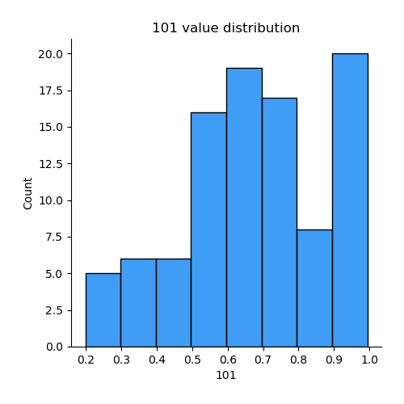
## Feature : 102
- **Feature type** : continous
- **Missing** : 0.0%
- **Unique** : 97
- **Count** :97.0
- **Mean** :0.41583102381154996
- **Std** :0.3214311099765897
- **Min** :-0.3181556073623642
- **25%th Percentile** : 0.19663228196010166
- **50%th Percentile** : 0.34189823233261585
- **75%th Percentile** : 0.6239677381764087
- **Max** :0.9848253656620286

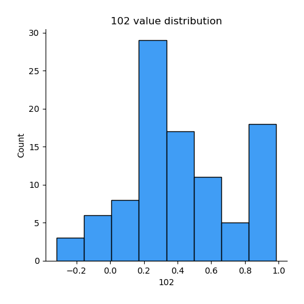
## Feature : 103
- **Feature type** : continous
- **Missing** : 0.0%
- **Unique** : 97
- **Count** :97.0
- **Mean** :0.5404215288870564
- **Std** :0.2926019863216516
- **Min** :-0.1553550956589841
- **25%th Percentile** : 0.3075442506168125
- **50%th Percentile** : 0.5484674430441155
- **75%th Percentile** : 0.7328391943367311
- **Max** :0.9916299962143817

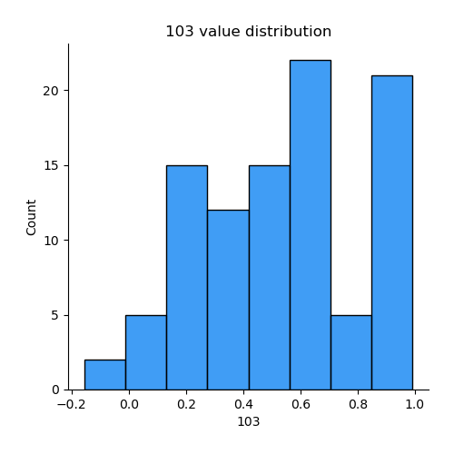
## Feature : 106
- **Feature type** : continous
- **Missing** : 0.0%
- **Unique** : 3
- **Count** :97.0
- **Mean** :1.0
- **Std** :7.076311083754595e-17
- **Min** :0.9999999999999998
- **25%th Percentile** : 1.0
- **50%th Percentile** : 1.0
- **75%th Percentile** : 1.0
- **Max** :1.0

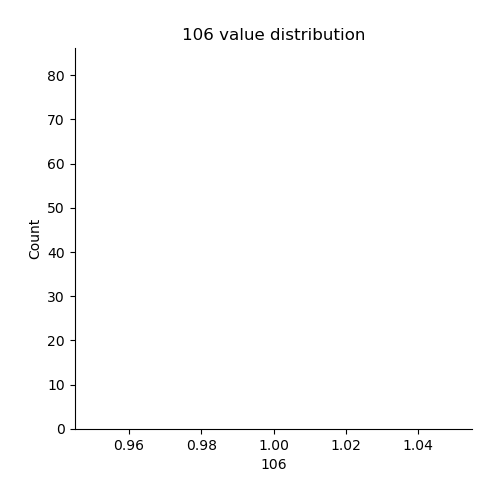
## Feature : 107
- **Feature type** : continous
- **Missing** : 0.0%
- **Unique** : 97
- **Count** :97.0
- **Mean** :0.4054232111383581
- **Std** :0.3242601184642599
- **Min** :-0.3563211161453369
- **25%th Percentile** : 0.18652541508081225
- **50%th Percentile** : 0.343701763440521
- **75%th Percentile** : 0.6463080232112117
- **Max** :0.9833824993605519

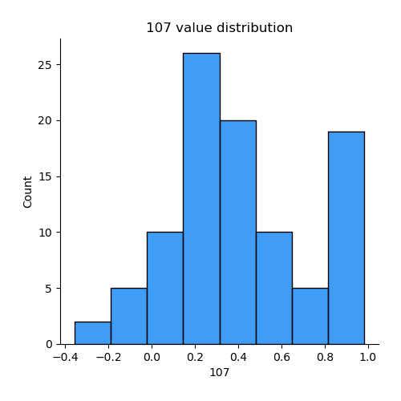
## Feature : 108
- **Feature type** : continous
- **Missing** : 0.0%
- **Unique** : 97
- **Count** :97.0
- **Mean** :0.705000435261234
- **Std** :0.19399452359648606
- **Min** :0.2250519233903834
- **25%th Percentile** : 0.5757941151636681
- **50%th Percentile** : 0.7163491660391608
- **75%th Percentile** : 0.8309485085041992
- **Max** :0.9886251939977215

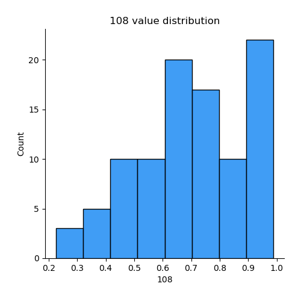
## Feature : 109
- **Feature type** : continous
- **Missing** : 0.0%
- **Unique** : 97
- **Count** :97.0
- **Mean** :0.7116597428686885
- **Std** :0.20335224337885965
- **Min** :0.15782755149457256
- **25%th Percentile** : 0.6016685133354578
- **50%th Percentile** : 0.7363745619200576
- **75%th Percentile** : 0.8796939306185408
- **Max** :0.9905060804974924

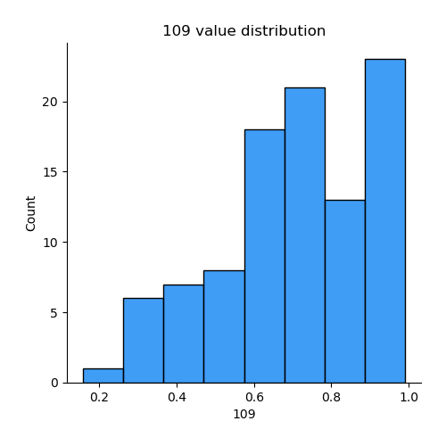
## Feature : 110
- **Feature type** : continous
- **Missing** : 0.0%
- **Unique** : 97
- **Count** :97.0
- **Mean** :0.6128737194959821
- **Std** :0.2525496432714867
- **Min** :0.04717214333645165
- **25%th Percentile** : 0.4510719052383351
- **50%th Percentile** : 0.5913199487014765
- **75%th Percentile** : 0.8120717007103098
- **Max** :0.9866733177110785

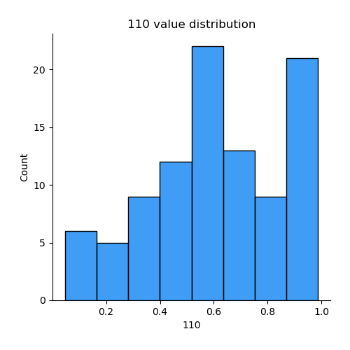
## Feature : 111
- **Feature type** : continous
- **Missing** : 0.0%
- **Unique** : 97
- **Count** :97.0
- **Mean** :0.6454531978528908
- **Std** :0.2298010663879541
- **Min** :0.05927746301910694
- **25%th Percentile** : 0.48802544235848405
- **50%th Percentile** : 0.6414682265242176
- **75%th Percentile** : 0.8090532817861541
- **Max** :0.9891374192000155

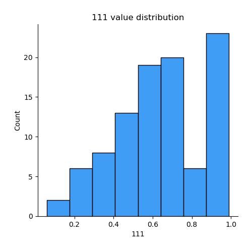
## Feature : 112
- **Feature type** : continous
- **Missing** : 0.0%
- **Unique** : 97
- **Count** :97.0
- **Mean** :0.6814769017217959
- **Std** :0.2135563627844773
- **Min** :0.21781847723514217
- **25%th Percentile** : 0.5342325649048539
- **50%th Percentile** : 0.695961511911912
- **75%th Percentile** : 0.8430496381974557
- **Max** :0.9849787986536174

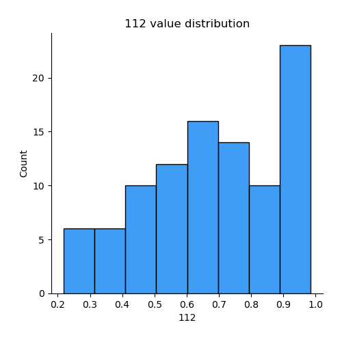
## Feature : 113
- **Feature type** : continous
- **Missing** : 0.0%
- **Unique** : 97
- **Count** :97.0
- **Mean** :0.759280739843264
- **Std** :0.18000138688436615
- **Min** :-0.02888338048284136
- **25%th Percentile** : 0.6571693999024213
- **50%th Percentile** : 0.7753125179144302
- **75%th Percentile** : 0.8979234763027859
- **Max** :0.9941131314596664

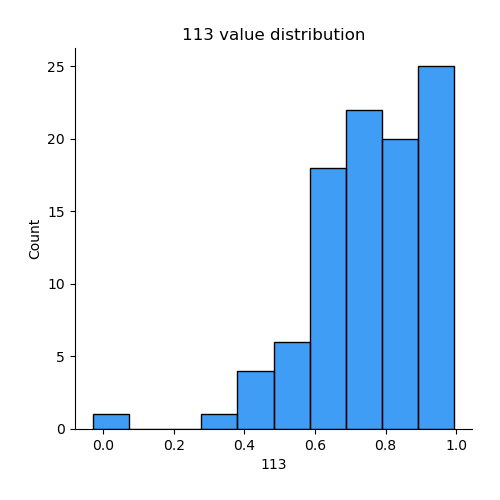
## Feature : 114
- **Feature type** : continous
- **Missing** : 0.0%
- **Unique** : 97
- **Count** :97.0
- **Mean** :0.8373202531776226
- **Std** :0.12363719282662393
- **Min** :0.4891491591256267
- **25%th Percentile** : 0.7682607370897778
- **50%th Percentile** : 0.8562068002051189
- **75%th Percentile** : 0.9300602863414079
- **Max** :0.992784765020327

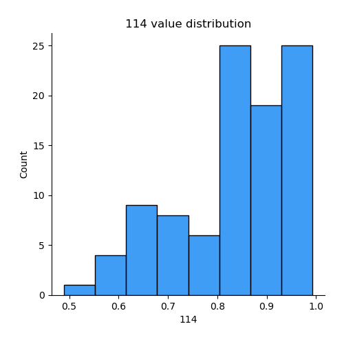
## Feature : 115
- **Feature type** : continous
- **Missing** : 0.0%
- **Unique** : 97
- **Count** :97.0
- **Mean** :0.6029539853652006
- **Std** :0.27107457083681014
- **Min** :-0.030942796546416827
- **25%th Percentile** : 0.43446197194628533
- **50%th Percentile** : 0.5998561427068885
- **75%th Percentile** : 0.8159440383383961
- **Max** :0.9890528422285935

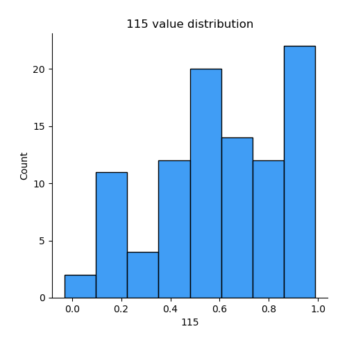
## Feature : 116
- **Feature type** : continous
- **Missing** : 0.0%
- **Unique** : 97
- **Count** :97.0
- **Mean** :0.588235589186581
- **Std** :0.2844718909601626
- **Min** :0.0069547295131249165
- **25%th Percentile** : 0.3658109529601308
- **50%th Percentile** : 0.5982341806531807
- **75%th Percentile** : 0.806790789145049
- **Max** :0.9853720587565615

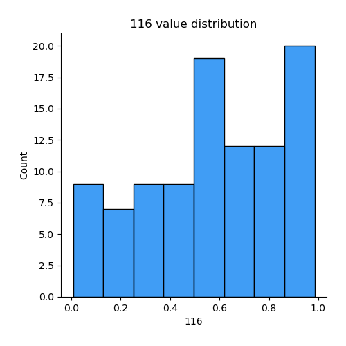
## Feature : 117
- **Feature type** : continous
- **Missing** : 0.0%
- **Unique** : 97
- **Count** :97.0
- **Mean** :0.5797893013189451
- **Std** :0.26306875325834217
- **Min** :-0.06649664425597651
- **25%th Percentile** : 0.39739148481743536
- **50%th Percentile** : 0.5741552885650261
- **75%th Percentile** : 0.7418950940729253
- **Max** :0.9884113522242713

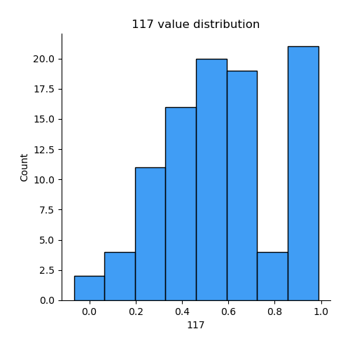
## Feature : 118
- **Feature type** : continous
- **Missing** : 0.0%
- **Unique** : 97
- **Count** :97.0
- **Mean** :0.8225324736747696
- **Std** :0.12781583489648135
- **Min** :0.4405963215043004
- **25%th Percentile** : 0.7528310864345492
- **50%th Percentile** : 0.8435710272403029
- **75%th Percentile** : 0.9216957905294764
- **Max** :0.9928079919257861

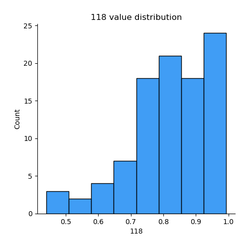
## Feature : 119
- **Feature type** : continous
- **Missing** : 0.0%
- **Unique** : 97
- **Count** :97.0
- **Mean** :0.6449326973203845
- **Std** :0.23146435709948757
- **Min** :0.16271495596752678
- **25%th Percentile** : 0.48208639984618223
- **50%th Percentile** : 0.6430550850905759
- **75%th Percentile** : 0.8150184275553451
- **Max** :0.9913657448125047

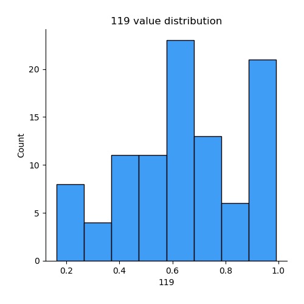
## Feature : 120
- **Feature type** : continous
- **Missing** : 0.0%
- **Unique** : 97
- **Count** :97.0
- **Mean** :0.6469437378434175
- **Std** :0.2247744705619879
- **Min** :0.031913840690560955
- **25%th Percentile** : 0.5146318704698504
- **50%th Percentile** : 0.6298855495110479
- **75%th Percentile** : 0.8113851942545804
- **Max** :0.9849077093971588

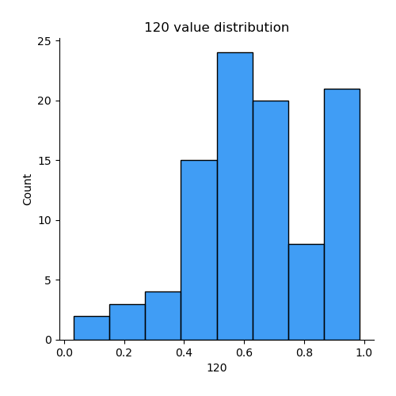
## Feature : 121
- **Feature type** : continous
- **Missing** : 0.0%
- **Unique** : 97
- **Count** :97.0
- **Mean** :0.6500545121954938
- **Std** :0.23210335991400094
- **Min** :0.13374366308420035
- **25%th Percentile** : 0.48647684509640127
- **50%th Percentile** : 0.6556424712917027
- **75%th Percentile** : 0.8207470927770453
- **Max** :0.9899138387535595

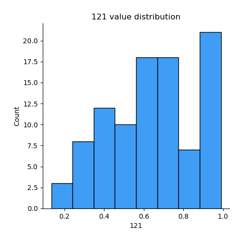
## Feature : 122
- **Feature type** : continous
- **Missing** : 0.0%
- **Unique** : 97
- **Count** :97.0
- **Mean** :0.7691450081421529
- **Std** :0.161619888064625
- **Min** :0.36866158469566335
- **25%th Percentile** : 0.6509178640462117
- **50%th Percentile** : 0.7697912068189791
- **75%th Percentile** : 0.9026034981371507
- **Max** :0.9909699091815869

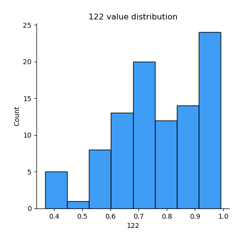
## Feature : 123
- **Feature type** : continous
- **Missing** : 0.0%
- **Unique** : 97
- **Count** :97.0
- **Mean** :0.4826176877658554
- **Std** :0.30131731385087884
- **Min** :-0.24442419869278165
- **25%th Percentile** : 0.2928578607664385
- **50%th Percentile** : 0.4274419423441491
- **75%th Percentile** : 0.6820893523570594
- **Max** :0.9795948577233345

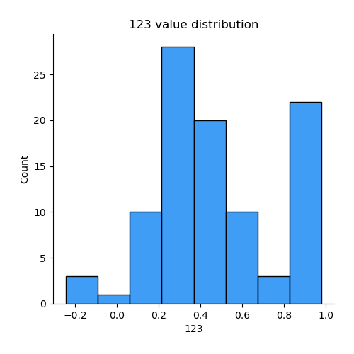
## Feature : 124
- **Feature type** : continous
- **Missing** : 0.0%
- **Unique** : 97
- **Count** :97.0
- **Mean** :0.5486186846783521
- **Std** :0.2993413011631812
- **Min** :-0.3081391521149794
- **25%th Percentile** : 0.34676730401271916
- **50%th Percentile** : 0.5254607055412971
- **75%th Percentile** : 0.7457657910207232
- **Max** :0.9877089987671304

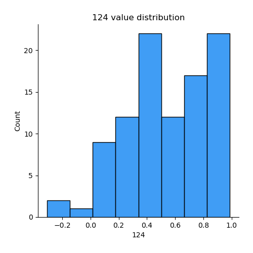
## Feature : 125
- **Feature type** : continous
- **Missing** : 0.0%
- **Unique** : 97
- **Count** :97.0
- **Mean** :0.7788365120292886
- **Std** :0.1546225667877314
- **Min** :0.3307190346510594
- **25%th Percentile** : 0.6765275125526787
- **50%th Percentile** : 0.7934863268533037
- **75%th Percentile** : 0.8809686655917007
- **Max** :0.9922297013411444

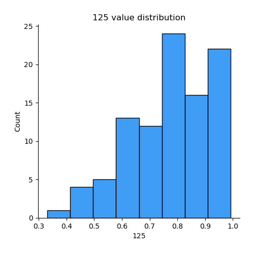
## Feature : 126
- **Feature type** : continous
- **Missing** : 0.0%
- **Unique** : 97
- **Count** :97.0
- **Mean** :0.6668452764821944
- **Std** :0.22976140539039797
- **Min** :-0.03602025301530429
- **25%th Percentile** : 0.5232783004962773
- **50%th Percentile** : 0.6796867464216279
- **75%th Percentile** : 0.85051882327428
- **Max** :0.9872691159540526

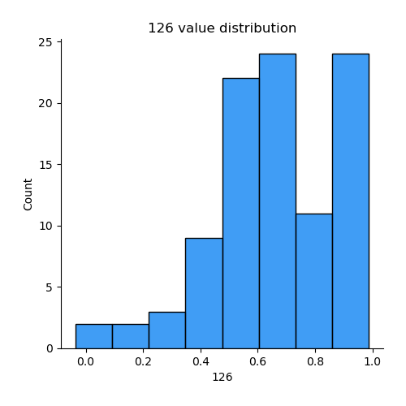
## Feature : 127
- **Feature type** : continous
- **Missing** : 0.0%
- **Unique** : 97
- **Count** :97.0
- **Mean** :0.6678282520881547
- **Std** :0.21145392946306554
- **Min** :0.17295606088504742
- **25%th Percentile** : 0.5334750712757675
- **50%th Percentile** : 0.651222585508409
- **75%th Percentile** : 0.828895052088243
- **Max** :0.9878830466072959

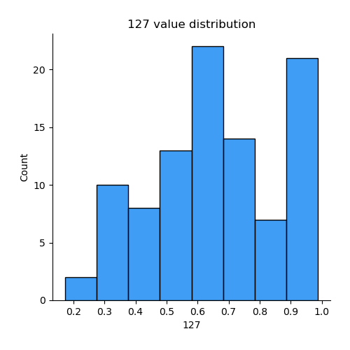
## Feature : 128
- **Feature type** : continous
- **Missing** : 0.0%
- **Unique** : 97
- **Count** :97.0
- **Mean** :0.42007455341019106
- **Std** :0.3195056584020055
- **Min** :-0.21182403670266758
- **25%th Percentile** : 0.21734433179916648
- **50%th Percentile** : 0.34570333734306824
- **75%th Percentile** : 0.5873457723176934
- **Max** :0.9768035556853324

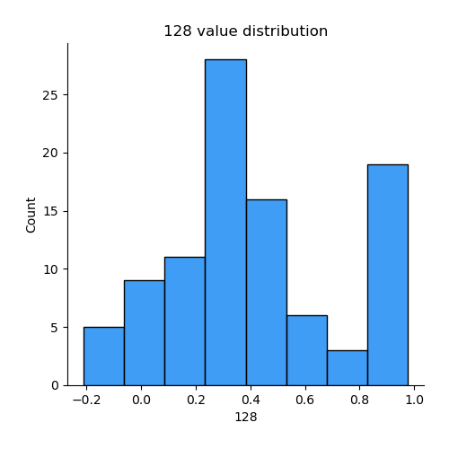
## Feature : 129
- **Feature type** : continous
- **Missing** : 0.0%
- **Unique** : 97
- **Count** :97.0
- **Mean** :0.6135525417301536
- **Std** :0.23385094897326097
- **Min** :0.12164952459048663
- **25%th Percentile** : 0.42077161665600277
- **50%th Percentile** : 0.6019485019592254
- **75%th Percentile** : 0.8110646228246066
- **Max** :0.9853349435376246

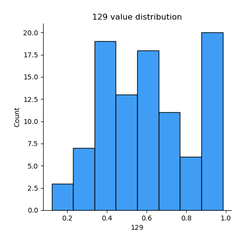
## Feature : 130
- **Feature type** : continous
- **Missing** : 0.0%
- **Unique** : 97
- **Count** :97.0
- **Mean** :0.6178613659365603
- **Std** :0.2583923835801445
- **Min** :-0.14874501721461908
- **25%th Percentile** : 0.4607068274933836
- **50%th Percentile** : 0.6104697715292506
- **75%th Percentile** : 0.8185756726118845
- **Max** :0.9901279477977009

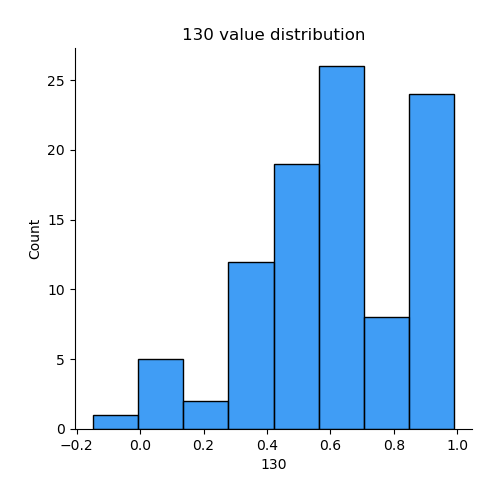
## Feature : 131
- **Feature type** : continous
- **Missing** : 0.0%
- **Unique** : 97
- **Count** :97.0
- **Mean** :0.5626168680669688
- **Std** :0.25664441872547905
- **Min** :0.007537276423855047
- **25%th Percentile** : 0.3799967961650305
- **50%th Percentile** : 0.5332545293977344
- **75%th Percentile** : 0.7090254717869925
- **Max** :0.9852803249869948

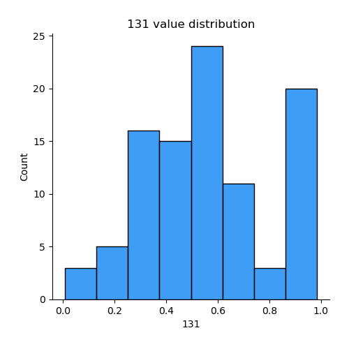
## Feature : 132
- **Feature type** : continous
- **Missing** : 0.0%
- **Unique** : 97
- **Count** :97.0
- **Mean** :0.9251137766548034
- **Std** :0.06451686616013529
- **Min** :0.6917261356144037
- **25%th Percentile** : 0.8961217707542459
- **50%th Percentile** : 0.9387823735817624
- **75%th Percentile** : 0.97608017811194
- **Max** :0.9966385730921984

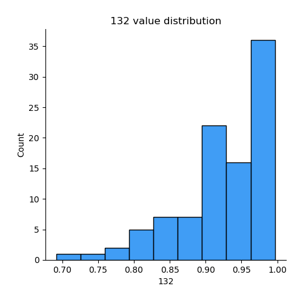
## Feature : 133
- **Feature type** : continous
- **Missing** : 0.0%
- **Unique** : 97
- **Count** :97.0
- **Mean** :0.3853387289089025
- **Std** :0.3425908468682188
- **Min** :-0.5687903319112082
- **25%th Percentile** : 0.13729620899756723
- **50%th Percentile** : 0.3568361250217576
- **75%th Percentile** : 0.6699498196852154
- **Max** :0.9828381908492183

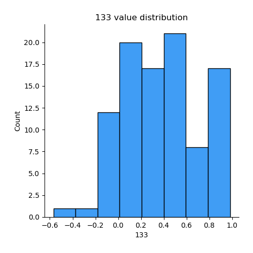
## Feature : 134
- **Feature type** : continous
- **Missing** : 0.0%
- **Unique** : 97
- **Count** :97.0
- **Mean** :0.7047080891302555
- **Std** :0.19654215507901823
- **Min** :0.06639772328961824
- **25%th Percentile** : 0.5769287148838909
- **50%th Percentile** : 0.705188858801695
- **75%th Percentile** : 0.8441760420365181
- **Max** :0.98922534689461

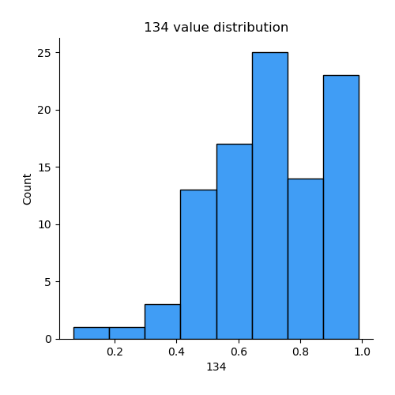
## Feature : 135
- **Feature type** : continous
- **Missing** : 0.0%
- **Unique** : 97
- **Count** :97.0
- **Mean** :0.6941848073075335
- **Std** :0.20399102498458238
- **Min** :0.09806548864393645
- **25%th Percentile** : 0.5484220250468296
- **50%th Percentile** : 0.6900659759885159
- **75%th Percentile** : 0.8510919128382862
- **Max** :0.991084249580612

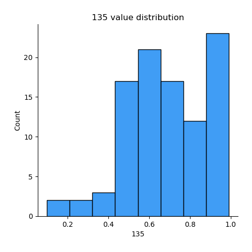
## Feature : 136
- **Feature type** : continous
- **Missing** : 0.0%
- **Unique** : 97
- **Count** :97.0
- **Mean** :0.596511495471054
- **Std** :0.2578641875336566
- **Min** :-0.021601365402084214
- **25%th Percentile** : 0.4615541477494819
- **50%th Percentile** : 0.5664973354696341
- **75%th Percentile** : 0.816620908297221
- **Max** :0.9885572613577966

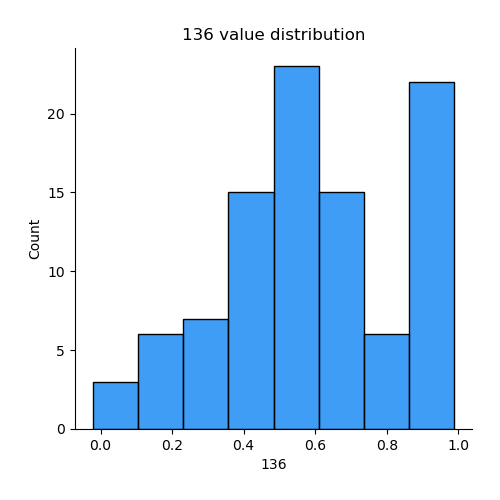
## Feature : 137
- **Feature type** : continous
- **Missing** : 0.0%
- **Unique** : 97
- **Count** :97.0
- **Mean** :0.6481348027279741
- **Std** :0.22161873744741742
- **Min** :0.13416144847203876
- **25%th Percentile** : 0.4921736309382775
- **50%th Percentile** : 0.6467571277496635
- **75%th Percentile** : 0.8209667766060983
- **Max** :0.9895849570441764

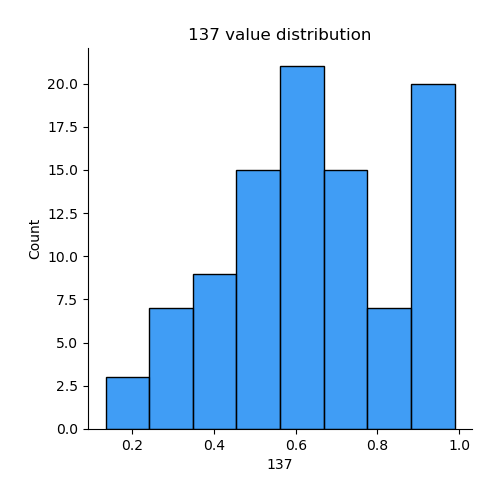
## Feature : 138
- **Feature type** : continous
- **Missing** : 0.0%
- **Unique** : 97
- **Count** :97.0
- **Mean** :0.6988192601577305
- **Std** :0.20350683000625652
- **Min** :0.1595307479886511
- **25%th Percentile** : 0.565392170878376
- **50%th Percentile** : 0.7239553954865084
- **75%th Percentile** : 0.8699182659662571
- **Max** :0.9846974337947282

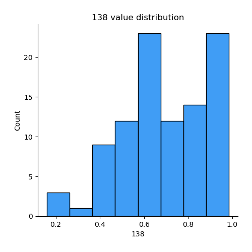
## Feature : 139
- **Feature type** : continous
- **Missing** : 0.0%
- **Unique** : 97
- **Count** :97.0
- **Mean** :0.7443794539795314
- **Std** :0.18739309751271435
- **Min** :-0.011928157542611595
- **25%th Percentile** : 0.6221023077416257
- **50%th Percentile** : 0.7690437009599987
- **75%th Percentile** : 0.8816859969937203
- **Max** :0.9904525591328152

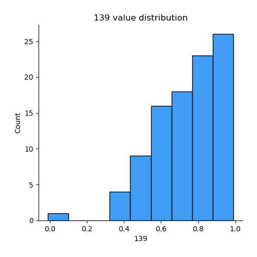
## Feature : 140
- **Feature type** : continous
- **Missing** : 0.0%
- **Unique** : 97
- **Count** :97.0
- **Mean** :0.8300124888301461
- **Std** :0.13844029697941113
- **Min** :0.30699340513138246
- **25%th Percentile** : 0.7654634125249062
- **50%th Percentile** : 0.8475786489285116
- **75%th Percentile** : 0.9368332072697815
- **Max** :0.9945264416633752

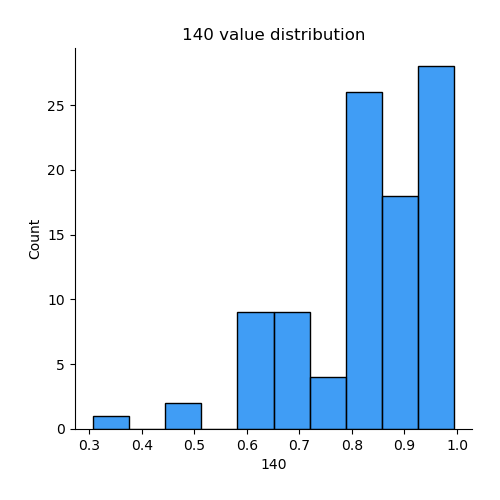
## Feature : 141
- **Feature type** : continous
- **Missing** : 0.0%
- **Unique** : 97
- **Count** :97.0
- **Mean** :0.6086621280865356
- **Std** :0.2676836259736132
- **Min** :-0.12391910252621945
- **25%th Percentile** : 0.45642792648944147
- **50%th Percentile** : 0.6073549684252395
- **75%th Percentile** : 0.8437534958732316
- **Max** :0.9906885057288483

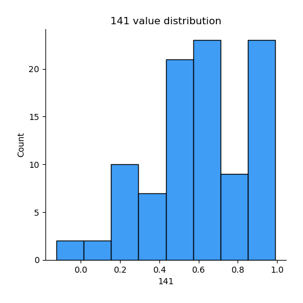
## Feature : 142
- **Feature type** : continous
- **Missing** : 0.0%
- **Unique** : 97
- **Count** :97.0
- **Mean** :0.5891779730558784
- **Std** :0.2859155713817755
- **Min** :-0.08728745627952073
- **25%th Percentile** : 0.36750458225805427
- **50%th Percentile** : 0.6186157129201663
- **75%th Percentile** : 0.8166577040967933
- **Max** :0.9879576096986159

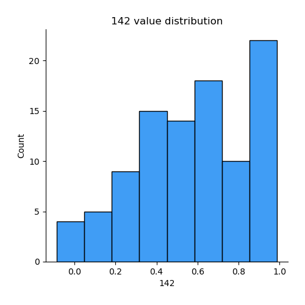
## Feature : 143
- **Feature type** : continous
- **Missing** : 0.0%
- **Unique** : 97
- **Count** :97.0
- **Mean** :0.5992741454840661
- **Std** :0.2540206447081769
- **Min** :0.011152491932820585
- **25%th Percentile** : 0.41385334434624815
- **50%th Percentile** : 0.5973212727767023
- **75%th Percentile** : 0.8001385942209146
- **Max** :0.988188101685754

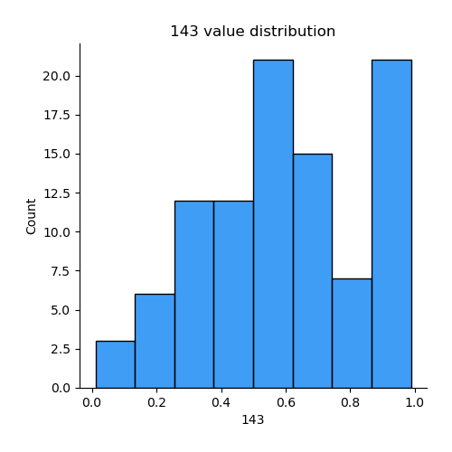
## Feature : 144
- **Feature type** : continous
- **Missing** : 0.0%
- **Unique** : 97
- **Count** :97.0
- **Mean** :0.8016181963070563
- **Std** :0.1492453265591913
- **Min** :0.29004579215694215
- **25%th Percentile** : 0.7130316193463209
- **50%th Percentile** : 0.8317276655902274
- **75%th Percentile** : 0.9083719968669666
- **Max** :0.9921700324828566

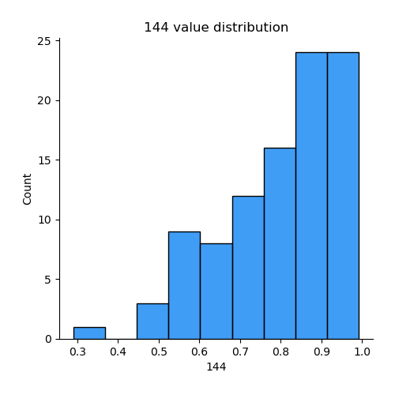
## Feature : 145
- **Feature type** : continous
- **Missing** : 0.0%
- **Unique** : 97
- **Count** :97.0
- **Mean** :0.622748189027934
- **Std** :0.26870266805207765
- **Min** :-0.2605034705184627
- **25%th Percentile** : 0.4375995910559066
- **50%th Percentile** : 0.6253093475674826
- **75%th Percentile** : 0.8062863358654865
- **Max** :0.9907677326462181

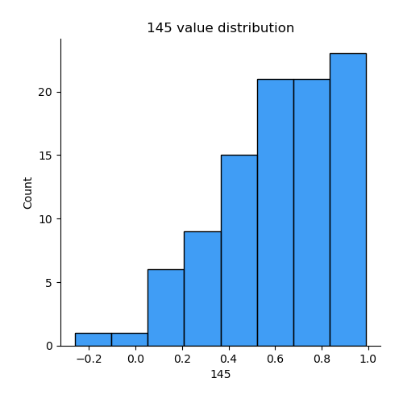
## Feature : 146
- **Feature type** : continous
- **Missing** : 0.0%
- **Unique** : 97
- **Count** :97.0
- **Mean** :0.6294135866724009
- **Std** :0.24360479325210582
- **Min** :-0.05182463754231683
- **25%th Percentile** : 0.47870700551147116
- **50%th Percentile** : 0.61684587865166
- **75%th Percentile** : 0.8140533881623849
- **Max** :0.9885579776436955

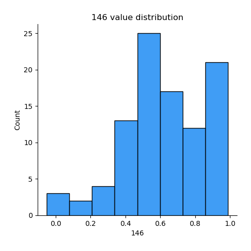
## Feature : 147
- **Feature type** : continous
- **Missing** : 0.0%
- **Unique** : 97
- **Count** :97.0
- **Mean** :0.6353760094346057
- **Std** :0.25743240740698353
- **Min** :-0.09886681893586846
- **25%th Percentile** : 0.49779859179876895
- **50%th Percentile** : 0.6519783331971338
- **75%th Percentile** : 0.8367655945307382
- **Max** :0.9906972181176222

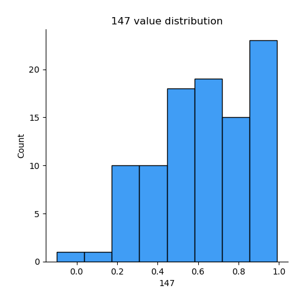
## Feature : 148
- **Feature type** : continous
- **Missing** : 0.0%
- **Unique** : 97
- **Count** :97.0
- **Mean** :0.7674944237712452
- **Std** :0.1612812253998817
- **Min** :0.3905735188859619
- **25%th Percentile** : 0.6436049591613416
- **50%th Percentile** : 0.7750930892162621
- **75%th Percentile** : 0.8929735725856007
- **Max** :0.9894656706022165

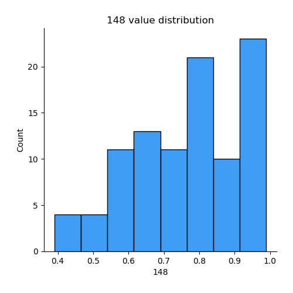
## Feature : 149
- **Feature type** : continous
- **Missing** : 0.0%
- **Unique** : 97
- **Count** :97.0
- **Mean** :0.4428461729995342
- **Std** :0.3147899230906975
- **Min** :-0.4204718001057088
- **25%th Percentile** : 0.23867266110380253
- **50%th Percentile** : 0.35066702525334814
- **75%th Percentile** : 0.6479064251521492
- **Max** :0.9805199315474633

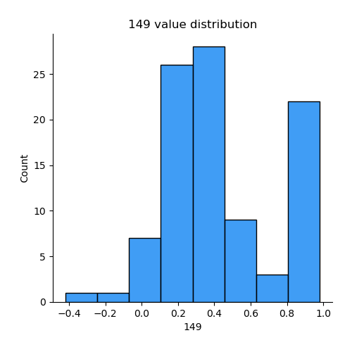
## Feature : 150
- **Feature type** : continous
- **Missing** : 0.0%
- **Unique** : 97
- **Count** :97.0
- **Mean** :0.5630474415422361
- **Std** :0.2935094698104533
- **Min** :-0.31883821964482717
- **25%th Percentile** : 0.3792968108949957
- **50%th Percentile** : 0.542141121359464
- **75%th Percentile** : 0.7711772464845889
- **Max** :0.9878613960826663

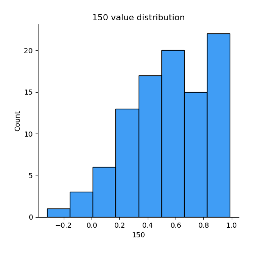
## Feature : 151
- **Feature type** : continous
- **Missing** : 0.0%
- **Unique** : 97
- **Count** :97.0
- **Mean** :0.7565645541541304
- **Std** :0.17251523921228218
- **Min** :0.22390138201411627
- **25%th Percentile** : 0.6408314464689631
- **50%th Percentile** : 0.7644311588900079
- **75%th Percentile** : 0.8842639028938161
- **Max** :0.9919459775670056

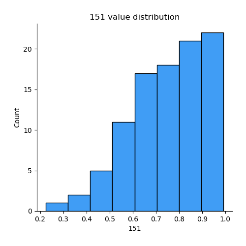
## Feature : 152
- **Feature type** : continous
- **Missing** : 0.0%
- **Unique** : 97
- **Count** :97.0
- **Mean** :0.6552076720344014
- **Std** :0.23133242360376852
- **Min** :-0.00382924720309999
- **25%th Percentile** : 0.5103417592782855
- **50%th Percentile** : 0.6427185077534362
- **75%th Percentile** : 0.8735735281391885
- **Max** :0.9881594169379597

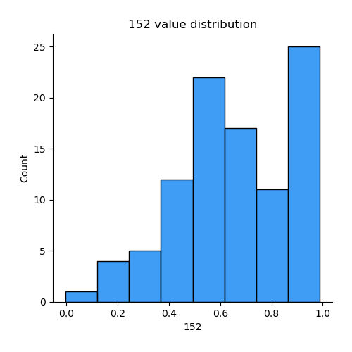
## Feature : 153
- **Feature type** : continous
- **Missing** : 0.0%
- **Unique** : 97
- **Count** :97.0
- **Mean** :0.6625505063009896
- **Std** :0.21538876905752583
- **Min** :0.0879215909737703
- **25%th Percentile** : 0.5090738368240176
- **50%th Percentile** : 0.6522913572997378
- **75%th Percentile** : 0.816089900315107
- **Max** :0.9872167190215324

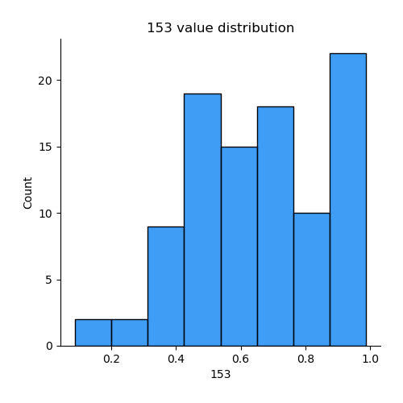
## Feature : 154
- **Feature type** : continous
- **Missing** : 0.0%
- **Unique** : 97
- **Count** :97.0
- **Mean** :0.40433198075331417
- **Std** :0.3247202334098733
- **Min** :-0.17038818947352125
- **25%th Percentile** : 0.1816422163718914
- **50%th Percentile** : 0.3730441157472699
- **75%th Percentile** : 0.6117663114535407
- **Max** :0.9803567261589063

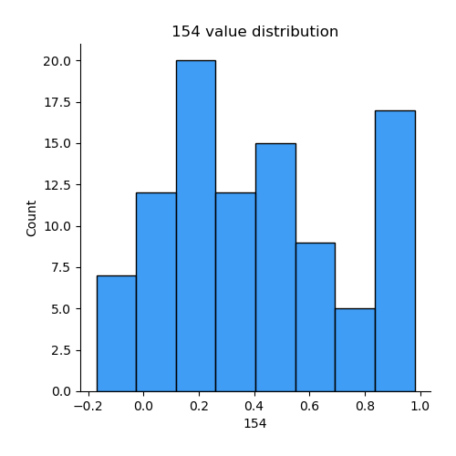
## Feature : 155
- **Feature type** : continous
- **Missing** : 0.0%
- **Unique** : 97
- **Count** :97.0
- **Mean** :0.5636086523541997
- **Std** :0.254456571891071
- **Min** :0.1494188575084005
- **25%th Percentile** : 0.3531566964025494
- **50%th Percentile** : 0.4876190513768353
- **75%th Percentile** : 0.7815431797079314
- **Max** :0.9871945307841579

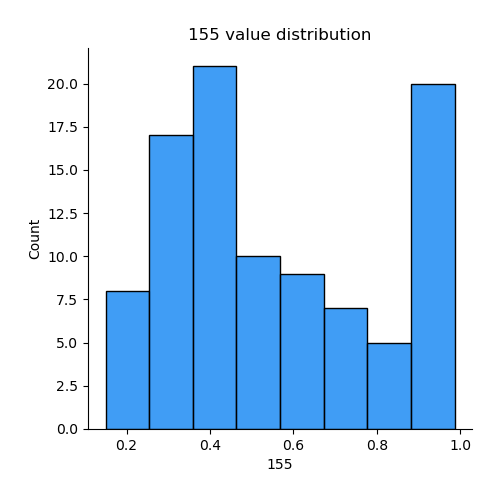
## Feature : 159
- **Feature type** : continous
- **Missing** : 0.0%
- **Unique** : 3
- **Count** :97.0
- **Mean** :1.0
- **Std** :9.274959344886453e-17
- **Min** :0.9999999999999998
- **25%th Percentile** : 0.9999999999999999
- **50%th Percentile** : 1.0
- **75%th Percentile** : 1.0
- **Max** :1.0

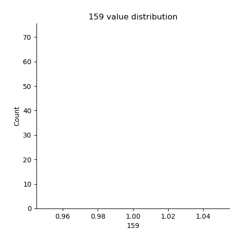
## Feature : 160
- **Feature type** : continous
- **Missing** : 0.0%
- **Unique** : 97
- **Count** :97.0
- **Mean** :0.5628550243330838
- **Std** :0.2594116969791325
- **Min** :-0.06991672576082104
- **25%th Percentile** : 0.33025789911570735
- **50%th Percentile** : 0.5759456016637134
- **75%th Percentile** : 0.7461255403377677
- **Max** :0.9887999687795485

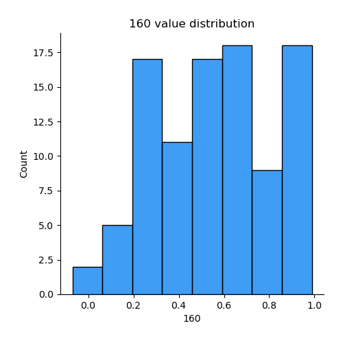
## Feature : 161
- **Feature type** : continous
- **Missing** : 0.0%
- **Unique** : 97
- **Count** :97.0
- **Mean** :0.4160058238358978
- **Std** :0.3263578430883065
- **Min** :-0.3632846857133797
- **25%th Percentile** : 0.21346376022904234
- **50%th Percentile** : 0.38360184035168027
- **75%th Percentile** : 0.604116648344168
- **Max** :0.9828011009621103

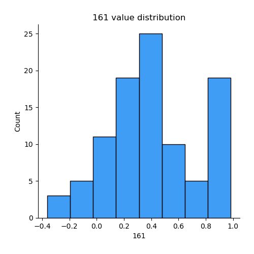
## Feature : 162
- **Feature type** : continous
- **Missing** : 0.0%
- **Unique** : 97
- **Count** :97.0
- **Mean** :0.5443096124149972
- **Std** :0.27698595588156494
- **Min** :-0.23511794501871544
- **25%th Percentile** : 0.3956213409733493
- **50%th Percentile** : 0.5447062421909261
- **75%th Percentile** : 0.7159900676766766
- **Max** :0.9884416019157303

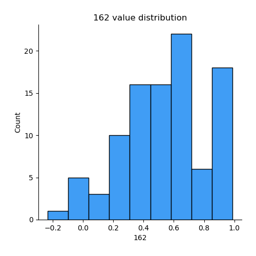
## Feature : 163
- **Feature type** : continous
- **Missing** : 0.0%
- **Unique** : 97
- **Count** :97.0
- **Mean** :0.4765453623097721
- **Std** :0.31358310992053035
- **Min** :-0.43828037147205723
- **25%th Percentile** : 0.2951802618265363
- **50%th Percentile** : 0.47567071219112816
- **75%th Percentile** : 0.7209545808069178
- **Max** :0.988621880777889

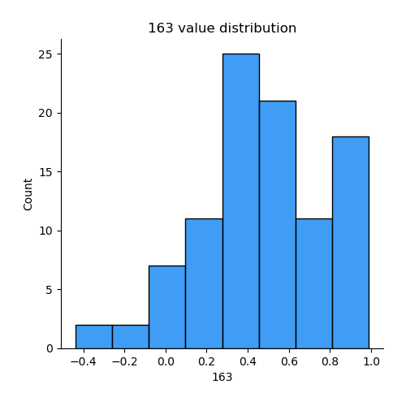
## Feature : 164
- **Feature type** : continous
- **Missing** : 0.0%
- **Unique** : 97
- **Count** :97.0
- **Mean** :0.4365154625701575
- **Std** :0.303392372046887
- **Min** :-0.1538318013873777
- **25%th Percentile** : 0.21969175938040628
- **50%th Percentile** : 0.3929500473424242
- **75%th Percentile** : 0.7038261798344234
- **Max** :0.9706192058007818

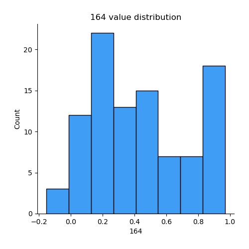
## Feature : 165
- **Feature type** : continous
- **Missing** : 0.0%
- **Unique** : 97
- **Count** :97.0
- **Mean** :0.4183939681834614
- **Std** :0.3090580258063259
- **Min** :-0.30653178889112614
- **25%th Percentile** : 0.20558807848884886
- **50%th Percentile** : 0.3461211385606993
- **75%th Percentile** : 0.6047409917224258
- **Max** :0.9791263232584602

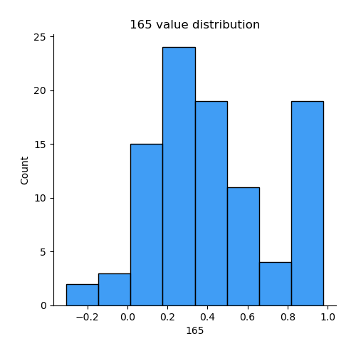
## Feature : 166
- **Feature type** : continous
- **Missing** : 0.0%
- **Unique** : 97
- **Count** :97.0
- **Mean** :0.4374845581635203
- **Std** :0.3110911423537983
- **Min** :-0.39682149374031545
- **25%th Percentile** : 0.21353525355085512
- **50%th Percentile** : 0.41339780051409253
- **75%th Percentile** : 0.6530710173913493
- **Max** :0.9807341512072647

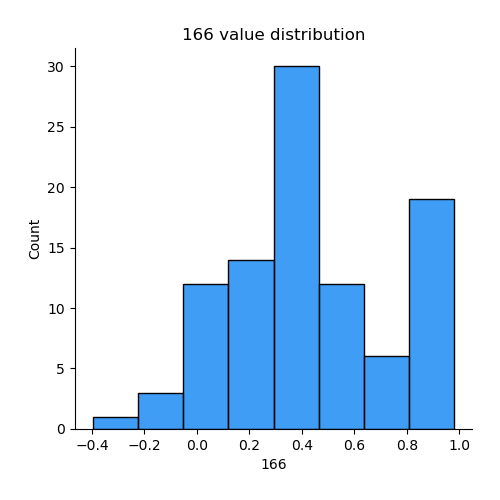
## Feature : 167
- **Feature type** : continous
- **Missing** : 0.0%
- **Unique** : 97
- **Count** :97.0
- **Mean** :0.4883143076856168
- **Std** :0.291126538839408
- **Min** :-0.30982630511213316
- **25%th Percentile** : 0.3074714988059172
- **50%th Percentile** : 0.4532450392219648
- **75%th Percentile** : 0.6914401234273219
- **Max** :0.9892151161531892

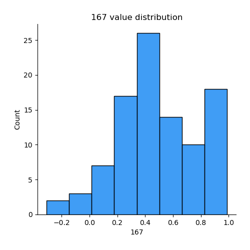
## Feature : 168
- **Feature type** : continous
- **Missing** : 0.0%
- **Unique** : 97
- **Count** :97.0
- **Mean** :0.3403681107061428
- **Std** :0.3564896763166348
- **Min** :-0.5927971055726937
- **25%th Percentile** : 0.09073292236443996
- **50%th Percentile** : 0.30184039171244675
- **75%th Percentile** : 0.5558135413756513
- **Max** :0.9821153163273

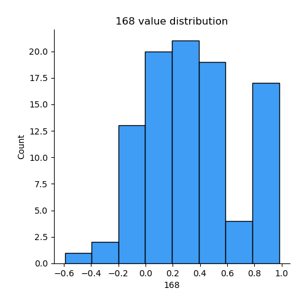
## Feature : 169
- **Feature type** : continous
- **Missing** : 0.0%
- **Unique** : 97
- **Count** :97.0
- **Mean** :0.5078227003209855
- **Std** :0.3059868107388554
- **Min** :-0.34993463154834203
- **25%th Percentile** : 0.30409386654805637
- **50%th Percentile** : 0.507587193030111
- **75%th Percentile** : 0.7183037789047383
- **Max** :0.9907560243386707

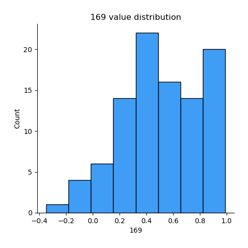
## Feature : 170
- **Feature type** : continous
- **Missing** : 0.0%
- **Unique** : 97
- **Count** :97.0
- **Mean** :0.4101915060007974
- **Std** :0.30928785418920046
- **Min** :-0.3412912197465362
- **25%th Percentile** : 0.20810439943399842
- **50%th Percentile** : 0.3434633605907943
- **75%th Percentile** : 0.6077936367845874
- **Max** :0.9765874240344884

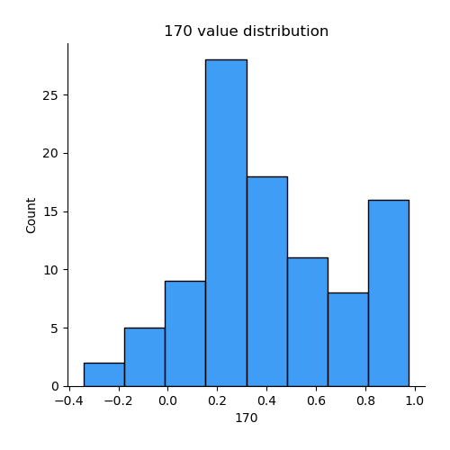
## Feature : 171
- **Feature type** : continous
- **Missing** : 0.0%
- **Unique** : 97
- **Count** :97.0
- **Mean** :0.3818048376998897
- **Std** :0.3383985051779947
- **Min** :-0.33021461069045505
- **25%th Percentile** : 0.14305387502383632
- **50%th Percentile** : 0.3295887880908014
- **75%th Percentile** : 0.5630044218811856
- **Max** :0.9885786140925317

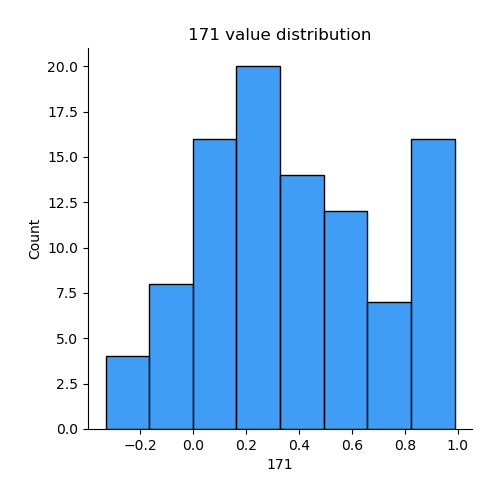
## Feature : 172
- **Feature type** : continous
- **Missing** : 0.0%
- **Unique** : 97
- **Count** :97.0
- **Mean** :0.43623823795051514
- **Std** :0.31260942255186275
- **Min** :-0.14354769946344845
- **25%th Percentile** : 0.20282885315048688
- **50%th Percentile** : 0.40109140136128996
- **75%th Percentile** : 0.6787297589934373
- **Max** :0.9861504764843887

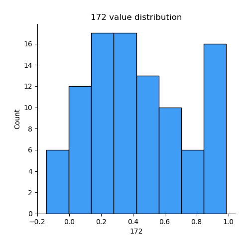
## Feature : 173
- **Feature type** : continous
- **Missing** : 0.0%
- **Unique** : 97
- **Count** :97.0
- **Mean** :0.4019636967813528
- **Std** :0.32452675052966384
- **Min** :-0.3723120128232801
- **25%th Percentile** : 0.17252590160320855
- **50%th Percentile** : 0.3244986282533262
- **75%th Percentile** : 0.6061109412391563
- **Max** :0.9880393899758635

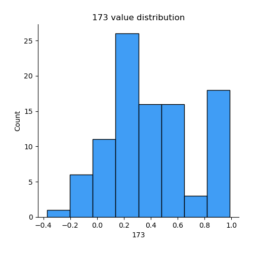
## Feature : 174
- **Feature type** : continous
- **Missing** : 0.0%
- **Unique** : 97
- **Count** :97.0
- **Mean** :0.4316026606483158
- **Std** :0.3112503297609516
- **Min** :-0.38175951280434733
- **25%th Percentile** : 0.2192482717911655
- **50%th Percentile** : 0.3712244799875178
- **75%th Percentile** : 0.6694054069688526
- **Max** :0.9757485328121805

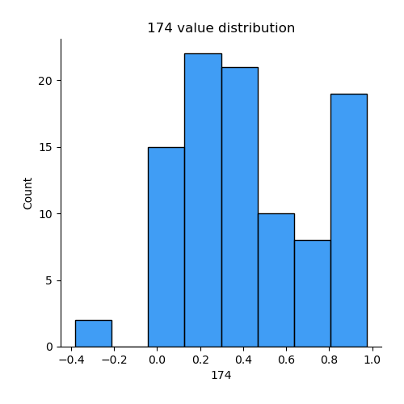
## Feature : 175
- **Feature type** : continous
- **Missing** : 0.0%
- **Unique** : 97
- **Count** :97.0
- **Mean** :0.32602518619394566
- **Std** :0.35979142930756924
- **Min** :-0.4554402424843467
- **25%th Percentile** : 0.10832991059520372
- **50%th Percentile** : 0.25503119917919537
- **75%th Percentile** : 0.5472536354858634
- **Max** :0.9864687176897763

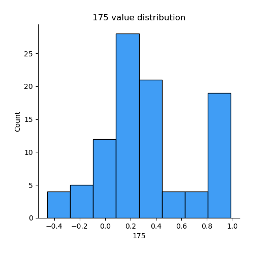
## Feature : 176
- **Feature type** : continous
- **Missing** : 0.0%
- **Unique** : 97
- **Count** :97.0
- **Mean** :0.40491905947766343
- **Std** :0.32246411061395786
- **Min** :-0.264496215201349
- **25%th Percentile** : 0.19630518025504493
- **50%th Percentile** : 0.3648673653348495
- **75%th Percentile** : 0.6068447445113395
- **Max** :0.9857843816404567

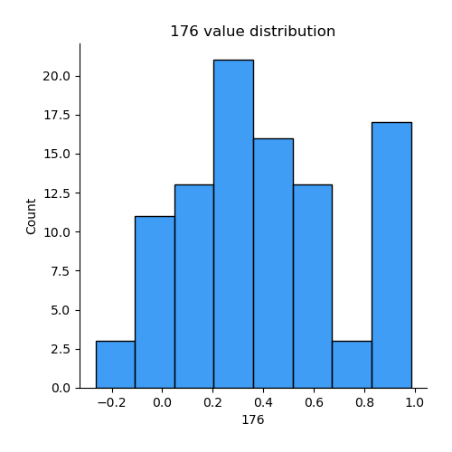
## Feature : 177
- **Feature type** : continous
- **Missing** : 0.0%
- **Unique** : 97
- **Count** :97.0
- **Mean** :0.4035313298438618
- **Std** :0.3202682433080512
- **Min** :-0.18252236836307745
- **25%th Percentile** : 0.1592466429816768
- **50%th Percentile** : 0.33839851683745165
- **75%th Percentile** : 0.6147550870138434
- **Max** :0.9816257040572187

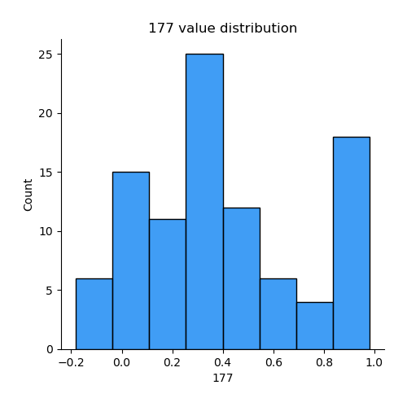
## Feature : 178
- **Feature type** : continous
- **Missing** : 0.0%
- **Unique** : 97
- **Count** :97.0
- **Mean** :0.48210255003791475
- **Std** :0.30014732066393923
- **Min** :-0.20767053557721843
- **25%th Percentile** : 0.2701491314309982
- **50%th Percentile** : 0.45361589826942084
- **75%th Percentile** : 0.6754678572104079
- **Max** :0.9917777525573922

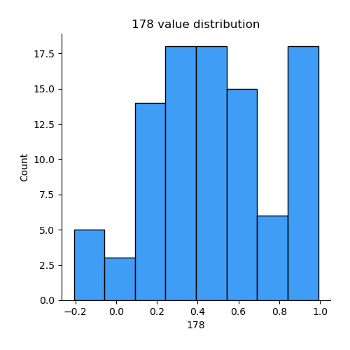
## Feature : 179
- **Feature type** : continous
- **Missing** : 0.0%
- **Unique** : 97
- **Count** :97.0
- **Mean** :0.4346018082070417
- **Std** :0.31079696451165784
- **Min** :-0.22000259515965484
- **25%th Percentile** : 0.19256044737717373
- **50%th Percentile** : 0.3956358891493792
- **75%th Percentile** : 0.6905907911338757
- **Max** :0.9863953405248304

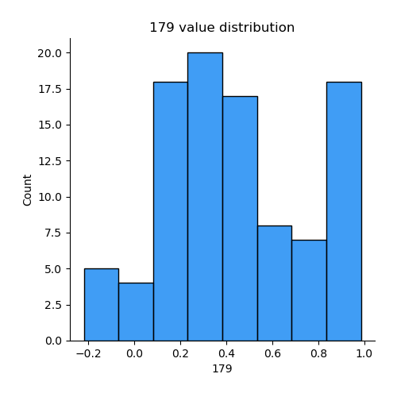
## Feature : 180
- **Feature type** : continous
- **Missing** : 0.0%
- **Unique** : 97
- **Count** :97.0
- **Mean** :0.6215978307264846
- **Std** :0.2784485271836454
- **Min** :-0.09384666965233919
- **25%th Percentile** : 0.4516422299643959
- **50%th Percentile** : 0.6623059062981057
- **75%th Percentile** : 0.8457043038842395
- **Max** :0.9923835452395582

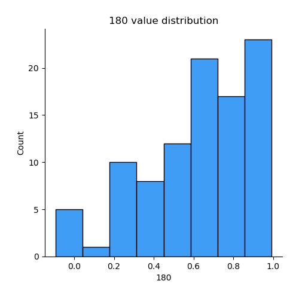
## Feature : 181
- **Feature type** : continous
- **Missing** : 0.0%
- **Unique** : 97
- **Count** :97.0
- **Mean** :0.4412454560170141
- **Std** :0.3101913699525513
- **Min** :-0.2561634781785726
- **25%th Percentile** : 0.25622553068583714
- **50%th Percentile** : 0.42153613939778783
- **75%th Percentile** : 0.6404638024223243
- **Max** :0.9876622504204873

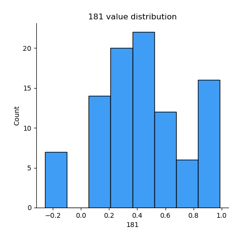
## Feature : 182
- **Feature type** : continous
- **Missing** : 0.0%
- **Unique** : 97
- **Count** :97.0
- **Mean** :0.3692770094292766
- **Std** :0.34019195210056546
- **Min** :-0.3659119653743505
- **25%th Percentile** : 0.12274670733708097
- **50%th Percentile** : 0.28860526052871155
- **75%th Percentile** : 0.6077336766519242
- **Max** :0.9800670308235301

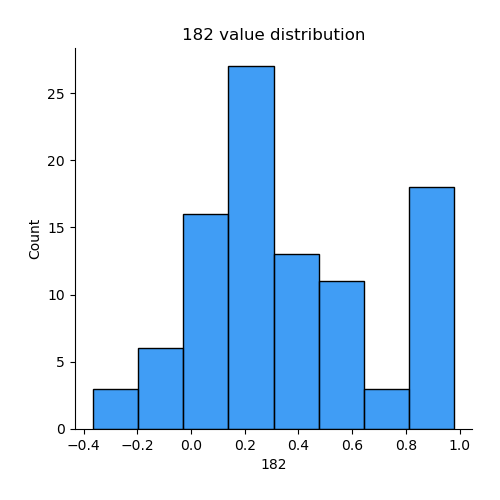
## Feature : 183
- **Feature type** : continous
- **Missing** : 0.0%
- **Unique** : 97
- **Count** :97.0
- **Mean** :0.4061069912484535
- **Std** :0.3110131175069602
- **Min** :-0.3739241534424532
- **25%th Percentile** : 0.18716693756899605
- **50%th Percentile** : 0.3474906749137268
- **75%th Percentile** : 0.5900578497184067
- **Max** :0.983013362570253

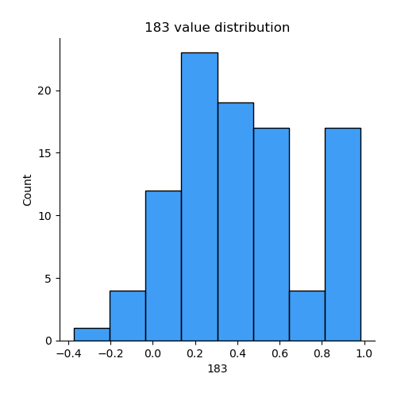
## Feature : 184
- **Feature type** : continous
- **Missing** : 0.0%
- **Unique** : 97
- **Count** :97.0
- **Mean** :0.4077254418176835
- **Std** :0.31907039685522426
- **Min** :-0.3279174981822128
- **25%th Percentile** : 0.1711707212993785
- **50%th Percentile** : 0.3323746958115608
- **75%th Percentile** : 0.6834454244436687
- **Max** :0.9791419452690536

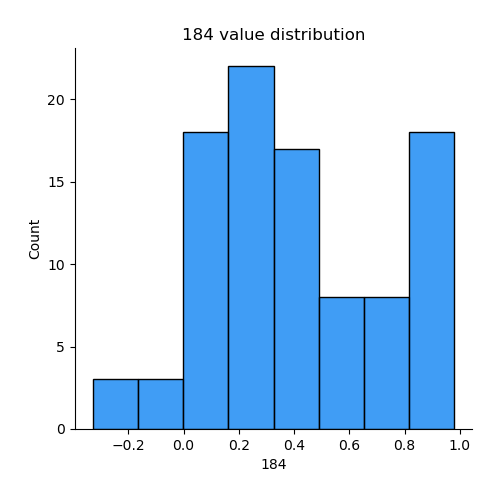
## Feature : 185
- **Feature type** : continous
- **Missing** : 0.0%
- **Unique** : 97
- **Count** :97.0
- **Mean** :0.6184709552976679
- **Std** :0.27431812043224596
- **Min** :-0.08189835760921581
- **25%th Percentile** : 0.4182712170308013
- **50%th Percentile** : 0.6455393991823903
- **75%th Percentile** : 0.8480051119680988
- **Max** :0.9926065662459886

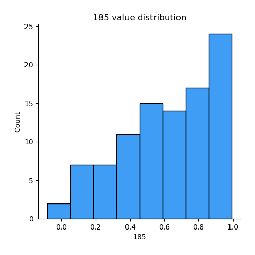
## Feature : 186
- **Feature type** : continous
- **Missing** : 0.0%
- **Unique** : 97
- **Count** :97.0
- **Mean** :0.5347331407316209
- **Std** :0.28638840738881266
- **Min** :-0.16441253768514158
- **25%th Percentile** : 0.3674347003994411
- **50%th Percentile** : 0.567929275928148
- **75%th Percentile** : 0.7468322534792149
- **Max** :0.9869245621260923

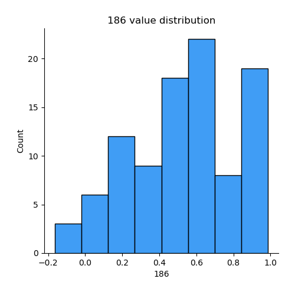
## Feature : 187
- **Feature type** : continous
- **Missing** : 0.0%
- **Unique** : 97
- **Count** :97.0
- **Mean** :0.40907282956455077
- **Std** :0.3278437249630119
- **Min** :-0.317685572492646
- **25%th Percentile** : 0.15631199984510813
- **50%th Percentile** : 0.37778703006281383
- **75%th Percentile** : 0.6410827494833125
- **Max** :0.9786656893085814

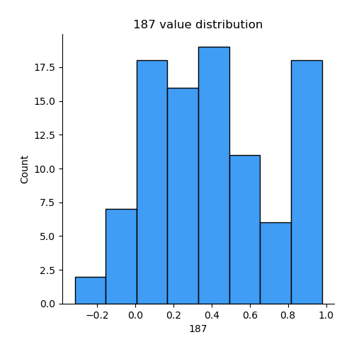
## Feature : 188
- **Feature type** : continous
- **Missing** : 0.0%
- **Unique** : 97
- **Count** :97.0
- **Mean** :0.5217755335626444
- **Std** :0.29767682427692993
- **Min** :-0.18428099165502598
- **25%th Percentile** : 0.2705436726061403
- **50%th Percentile** : 0.5431845040587846
- **75%th Percentile** : 0.7388028493387474
- **Max** :0.9880135648094105

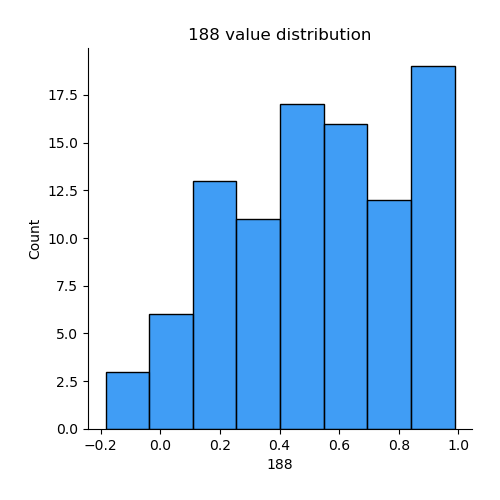
## Feature : 189
- **Feature type** : continous
- **Missing** : 0.0%
- **Unique** : 97
- **Count** :97.0
- **Mean** :0.45641478965331667
- **Std** :0.3150033329903773
- **Min** :-0.3000457185052322
- **25%th Percentile** : 0.2520232351998337
- **50%th Percentile** : 0.4125300610046373
- **75%th Percentile** : 0.6822824594740975
- **Max** :0.9861828403138058

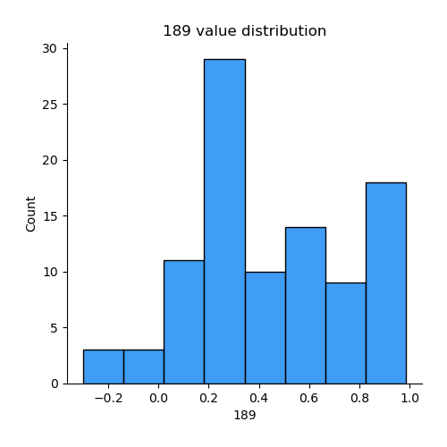
## Feature : 190
- **Feature type** : continous
- **Missing** : 0.0%
- **Unique** : 97
- **Count** :97.0
- **Mean** :0.43691752140832923
- **Std** :0.3121006246665758
- **Min** :-0.24580906573257608
- **25%th Percentile** : 0.2107735441793542
- **50%th Percentile** : 0.41536855060805633
- **75%th Percentile** : 0.6826001625185405
- **Max** :0.9725341556648477

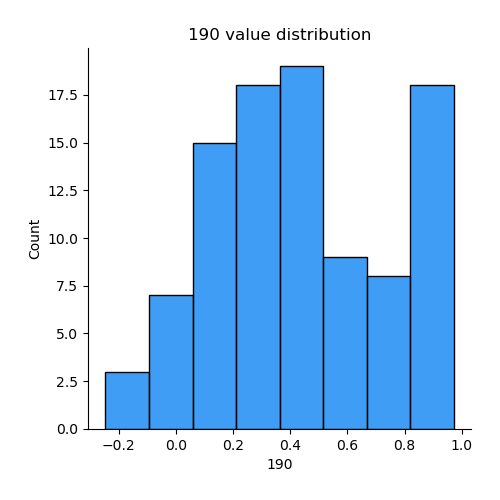
## Feature : 191
- **Feature type** : continous
- **Missing** : 0.0%
- **Unique** : 97
- **Count** :97.0
- **Mean** :0.42032126751377935
- **Std** :0.31292181075693604
- **Min** :-0.4191118922415347
- **25%th Percentile** : 0.21827129854452573
- **50%th Percentile** : 0.3623011035031123
- **75%th Percentile** : 0.5957618828991562
- **Max** :0.9713626701119802

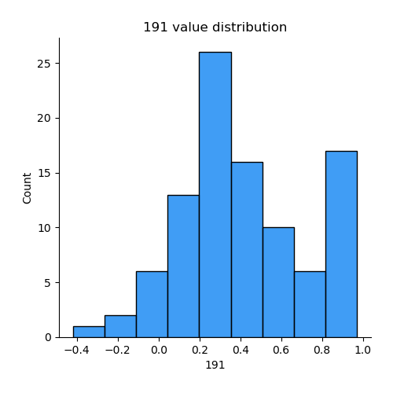
## Feature : 192
- **Feature type** : continous
- **Missing** : 0.0%
- **Unique** : 97
- **Count** :97.0
- **Mean** :0.4309949465019288
- **Std** :0.31328720987334624
- **Min** :-0.26877718388899985
- **25%th Percentile** : 0.1862200475244091
- **50%th Percentile** : 0.3903576437511217
- **75%th Percentile** : 0.6743214584519207
- **Max** :0.9823924229595252

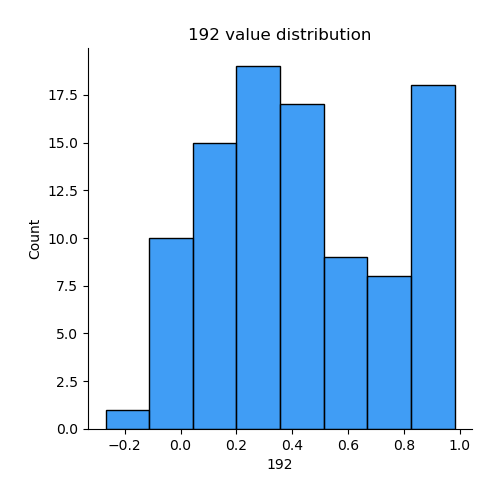
## Feature : 193
- **Feature type** : continous
- **Missing** : 0.0%
- **Unique** : 97
- **Count** :97.0
- **Mean** :0.459976194899091
- **Std** :0.31207251124621227
- **Min** :-0.14837876841236014
- **25%th Percentile** : 0.22917273630223958
- **50%th Percentile** : 0.4271252437675521
- **75%th Percentile** : 0.7099330818600754
- **Max** :0.9889762328811491

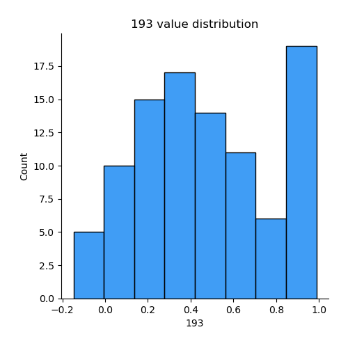
## Feature : 194
- **Feature type** : continous
- **Missing** : 0.0%
- **Unique** : 97
- **Count** :97.0
- **Mean** :0.33291819945310897
- **Std** :0.35921739963827426
- **Min** :-0.45071791534191447
- **25%th Percentile** : 0.08900192909686497
- **50%th Percentile** : 0.2601541650890756
- **75%th Percentile** : 0.5504839058141128
- **Max** :0.9804886158866163

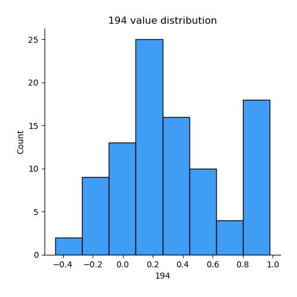
## Feature : 195
- **Feature type** : continous
- **Missing** : 0.0%
- **Unique** : 97
- **Count** :97.0
- **Mean** :0.4955539961102316
- **Std** :0.3043806460993285
- **Min** :-0.3475600046161666
- **25%th Percentile** : 0.24699160816530402
- **50%th Percentile** : 0.496917571261196
- **75%th Percentile** : 0.7261129502020286
- **Max** :0.9876557338805229

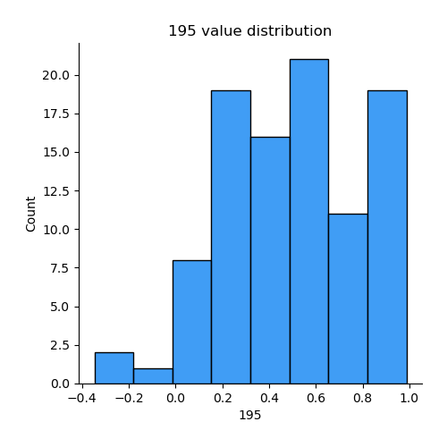
## Feature : 196
- **Feature type** : continous
- **Missing** : 0.0%
- **Unique** : 97
- **Count** :97.0
- **Mean** :0.40628881837029784
- **Std** :0.32263495260799796
- **Min** :-0.3591387364108176
- **25%th Percentile** : 0.2041719173903232
- **50%th Percentile** : 0.31871409900557945
- **75%th Percentile** : 0.6377369880873275
- **Max** :0.9751790746372081

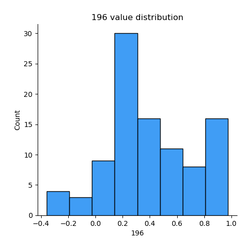
## Feature : 197
- **Feature type** : continous
- **Missing** : 0.0%
- **Unique** : 97
- **Count** :97.0
- **Mean** :0.3660153823512963
- **Std** :0.34282139914172766
- **Min** :-0.2648202613121035
- **25%th Percentile** : 0.1254858305683702
- **50%th Percentile** : 0.31107879540815514
- **75%th Percentile** : 0.5579576955093677
- **Max** :0.9870738455125783

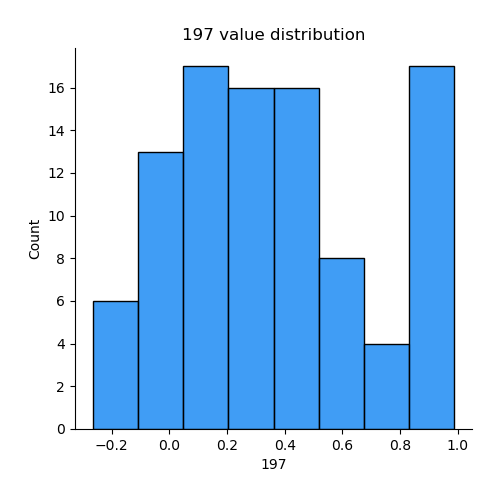
## Feature : 198
- **Feature type** : continous
- **Missing** : 0.0%
- **Unique** : 97
- **Count** :97.0
- **Mean** :0.4198392356212253
- **Std** :0.31721142560739735
- **Min** :-0.4256709871839551
- **25%th Percentile** : 0.17497826679198622
- **50%th Percentile** : 0.34845673608120536
- **75%th Percentile** : 0.632404415093573
- **Max** :0.985243726903342

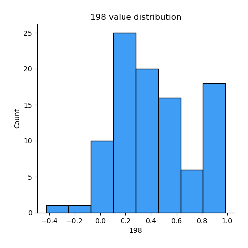
## Feature : 199
- **Feature type** : continous
- **Missing** : 0.0%
- **Unique** : 97
- **Count** :97.0
- **Mean** :0.38186127889502597
- **Std** :0.33235160076997844
- **Min** :-0.22118592596705777
- **25%th Percentile** : 0.13411657019830092
- **50%th Percentile** : 0.3283604569050216
- **75%th Percentile** : 0.5753559650227482
- **Max** :0.9879006195345229

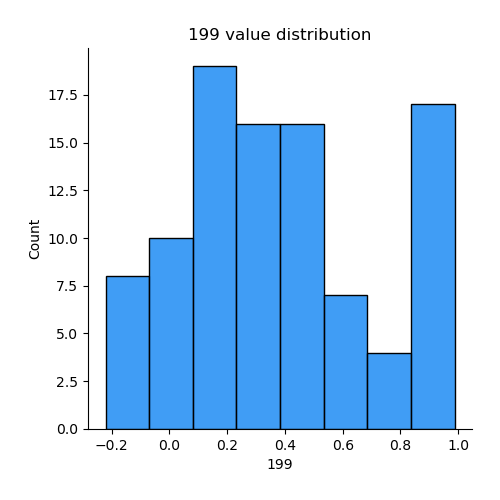
## Feature : 200
- **Feature type** : continous
- **Missing** : 0.0%
- **Unique** : 97
- **Count** :97.0
- **Mean** :0.42643183319242917
- **Std** :0.313282138994673
- **Min** :-0.3263621648387807
- **25%th Percentile** : 0.22764048194032777
- **50%th Percentile** : 0.37181208534384297
- **75%th Percentile** : 0.6802546831459078
- **Max** :0.9752965472539598

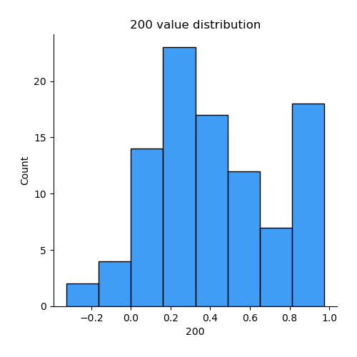
## Feature : 201
- **Feature type** : continous
- **Missing** : 0.0%
- **Unique** : 97
- **Count** :97.0
- **Mean** :0.30617640294785053
- **Std** :0.36981768082673727
- **Min** :-0.4061991259056309
- **25%th Percentile** : 0.07364049192595486
- **50%th Percentile** : 0.2166307336386566
- **75%th Percentile** : 0.5261633557789848
- **Max** :0.9833073753120724

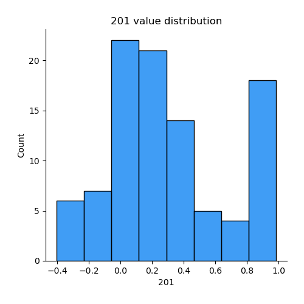
## Feature : 202
- **Feature type** : continous
- **Missing** : 0.0%
- **Unique** : 97
- **Count** :97.0
- **Mean** :0.40026448935107317
- **Std** :0.3298669029627573
- **Min** :-0.358482408467957
- **25%th Percentile** : 0.1935973660951796
- **50%th Percentile** : 0.3758661640390712
- **75%th Percentile** : 0.623284787747199
- **Max** :0.985314603351108

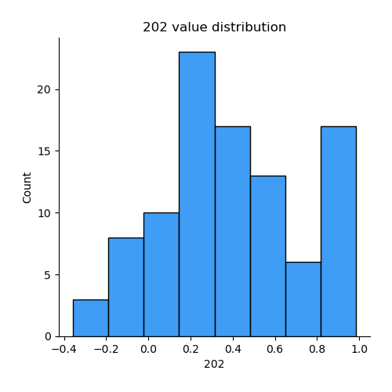
## Feature : 203
- **Feature type** : continous
- **Missing** : 0.0%
- **Unique** : 97
- **Count** :97.0
- **Mean** :0.3989382301639559
- **Std** :0.3217715977617272
- **Min** :-0.31136738039846656
- **25%th Percentile** : 0.19425472252865555
- **50%th Percentile** : 0.36202443820727803
- **75%th Percentile** : 0.5747524691080365
- **Max** :0.9760625320450117

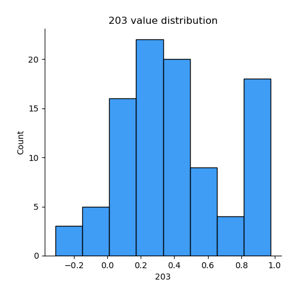
## Feature : 204
- **Feature type** : continous
- **Missing** : 0.0%
- **Unique** : 97
- **Count** :97.0
- **Mean** :0.46425623954556255
- **Std** :0.3068771319080047
- **Min** :-0.23336209232734528
- **25%th Percentile** : 0.24468790664658288
- **50%th Percentile** : 0.44306220335683494
- **75%th Percentile** : 0.6883013690634511
- **Max** :0.9924971085152061

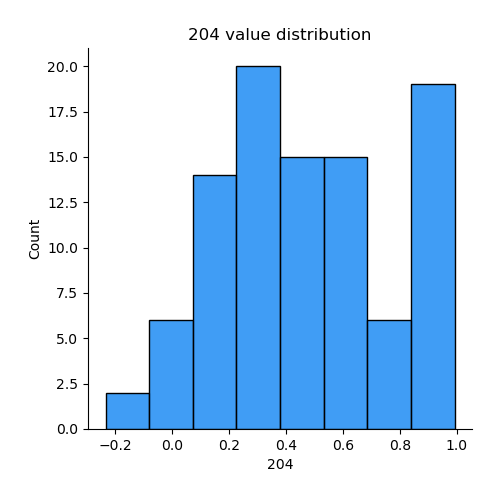
## Feature : 205
- **Feature type** : continous
- **Missing** : 0.0%
- **Unique** : 97
- **Count** :97.0
- **Mean** :0.39656764823409313
- **Std** :0.32794586623256405
- **Min** :-0.15543205628982473
- **25%th Percentile** : 0.13932130916825844
- **50%th Percentile** : 0.3161738776667309
- **75%th Percentile** : 0.6198156784068285
- **Max** :0.9824086670998999

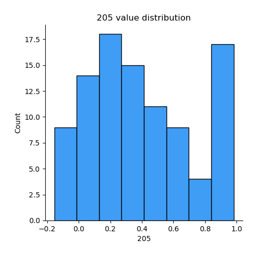
## Feature : 206
- **Feature type** : continous
- **Missing** : 0.0%
- **Unique** : 97
- **Count** :97.0
- **Mean** :0.5484940779528612
- **Std** :0.3210315373464125
- **Min** :-0.5048339533292984
- **25%th Percentile** : 0.3325682785531625
- **50%th Percentile** : 0.593994966572068
- **75%th Percentile** : 0.7856433468354738
- **Max** :0.9928052740394089

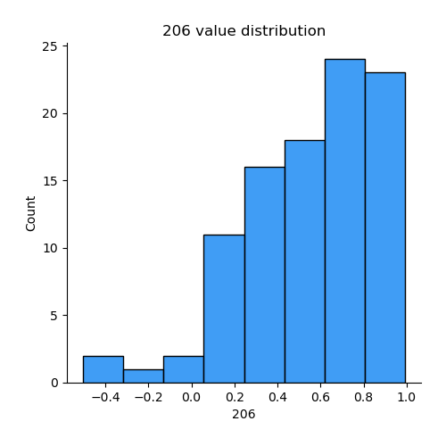
## Feature : 207
- **Feature type** : continous
- **Missing** : 0.0%
- **Unique** : 97
- **Count** :97.0
- **Mean** :0.40378618114972015
- **Std** :0.3140501005114864
- **Min** :-0.19571932082668575
- **25%th Percentile** : 0.16651951508191062
- **50%th Percentile** : 0.3315102777678743
- **75%th Percentile** : 0.6440380752092
- **Max** :0.9778338624423139

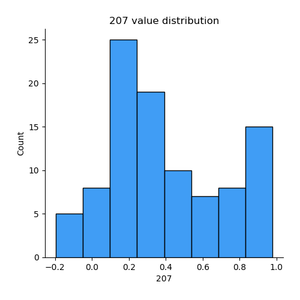
## Feature : 212
- **Feature type** : continous
- **Missing** : 0.0%
- **Unique** : 3
- **Count** :97.0
- **Mean** :1.0
- **Std** :6.892479376940624e-17
- **Min** :0.9999999999999998
- **25%th Percentile** : 1.0
- **50%th Percentile** : 1.0
- **75%th Percentile** : 1.0
- **Max** :1.0

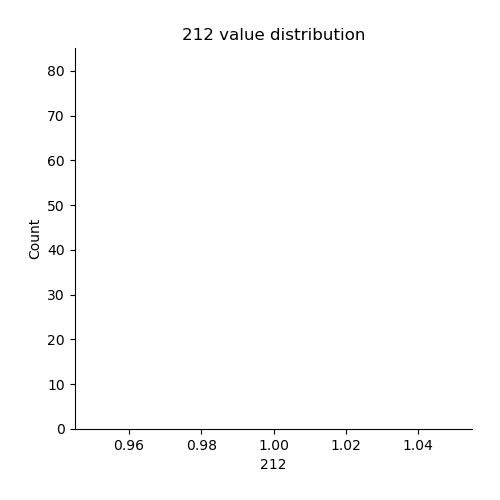
## Feature : 213
- **Feature type** : continous
- **Missing** : 0.0%
- **Unique** : 97
- **Count** :97.0
- **Mean** :0.6882970163383602
- **Std** :0.21695581216126256
- **Min** :0.1612281766987174
- **25%th Percentile** : 0.5574486129593341
- **50%th Percentile** : 0.6941701978148715
- **75%th Percentile** : 0.8593905614319729
- **Max** :0.9908208229689459

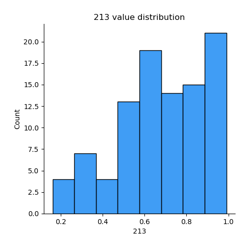
## Feature : 214
- **Feature type** : continous
- **Missing** : 0.0%
- **Unique** : 97
- **Count** :97.0
- **Mean** :0.8324684303616359
- **Std** :0.12106506911312565
- **Min** :0.48184268510129596
- **25%th Percentile** : 0.7483822041810396
- **50%th Percentile** : 0.8390253854869542
- **75%th Percentile** : 0.9331579161369835
- **Max** :0.9959425912516902

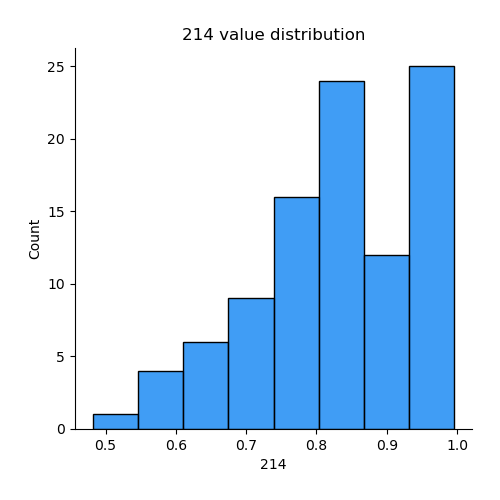
## Feature : 215
- **Feature type** : continous
- **Missing** : 0.0%
- **Unique** : 97
- **Count** :97.0
- **Mean** :0.6504269559695077
- **Std** :0.21851656764877184
- **Min** :0.210856642493618
- **25%th Percentile** : 0.5023249806001948
- **50%th Percentile** : 0.6355894749382874
- **75%th Percentile** : 0.7840833778939761
- **Max** :0.9917711865862138

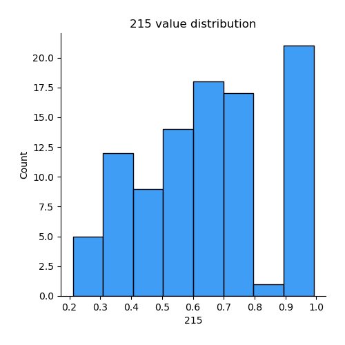
## Feature : 216
- **Feature type** : continous
- **Missing** : 0.0%
- **Unique** : 97
- **Count** :97.0
- **Mean** :0.6590663189584991
- **Std** :0.22607480492374432
- **Min** :0.09736111419594609
- **25%th Percentile** : 0.49776653814943267
- **50%th Percentile** : 0.6723328145605529
- **75%th Percentile** : 0.8164356077985443
- **Max** :0.9863053692240201

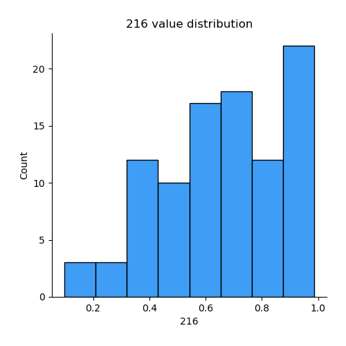
## Feature : 217
- **Feature type** : continous
- **Missing** : 0.0%
- **Unique** : 97
- **Count** :97.0
- **Mean** :0.821494068454168
- **Std** :0.1323395015285124
- **Min** :0.46475159370370894
- **25%th Percentile** : 0.7299236263391828
- **50%th Percentile** : 0.8388289676738838
- **75%th Percentile** : 0.9201986831125412
- **Max** :0.9966351232576708

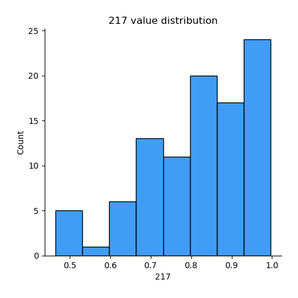
## Feature : 218
- **Feature type** : continous
- **Missing** : 0.0%
- **Unique** : 97
- **Count** :97.0
- **Mean** :0.8179148964877545
- **Std** :0.12628454585054374
- **Min** :0.46706008234180135
- **25%th Percentile** : 0.7401920928970805
- **50%th Percentile** : 0.8287192191716216
- **75%th Percentile** : 0.911137211426467
- **Max** :0.9942759820111057

## Feature : 219
- **Feature type** : continous
- **Missing** : 0.0%
- **Unique** : 97
- **Count** :97.0
- **Mean** :0.725220694052998
- **Std** :0.19687785720836812
- **Min** :0.1485613555059323
- **25%th Percentile** : 0.60310795204504
- **50%th Percentile** : 0.7553578198982787
- **75%th Percentile** : 0.8566906747833487
- **Max** :0.9930832562248736

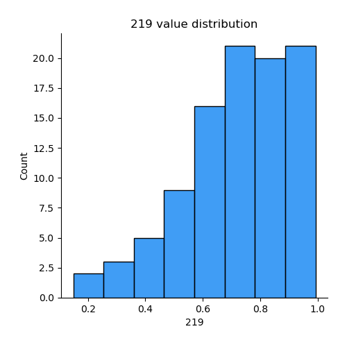
## Feature : 220
- **Feature type** : continous
- **Missing** : 0.0%
- **Unique** : 97
- **Count** :97.0
- **Mean** :0.5215172363216155
- **Std** :0.3309693208244933
- **Min** :-0.39542071572146936
- **25%th Percentile** : 0.31733962540225186
- **50%th Percentile** : 0.5203708391847883
- **75%th Percentile** : 0.787813144452645
- **Max** :0.991878751584957

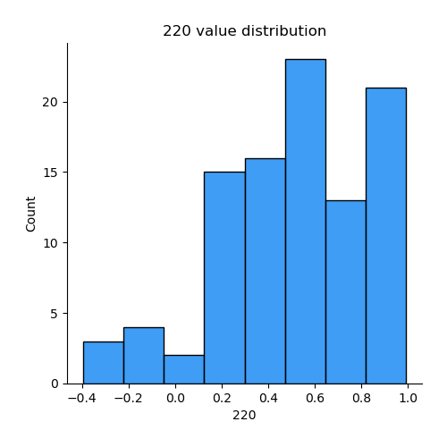
## Feature : 221
- **Feature type** : continous
- **Missing** : 0.0%
- **Unique** : 97
- **Count** :97.0
- **Mean** :0.7597027347177019
- **Std** :0.17578810170714965
- **Min** :0.24144141970870303
- **25%th Percentile** : 0.6812704574263583
- **50%th Percentile** : 0.7667482635252133
- **75%th Percentile** : 0.8876192275162371
- **Max** :0.9957826529404108

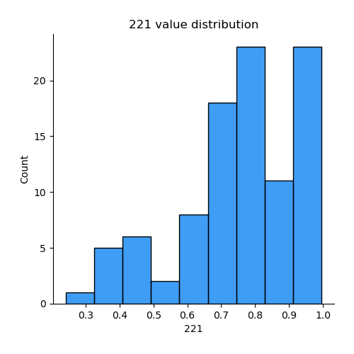
## Feature : 222
- **Feature type** : continous
- **Missing** : 0.0%
- **Unique** : 97
- **Count** :97.0
- **Mean** :0.7313977943674039
- **Std** :0.16295329915498602
- **Min** :0.29484639209446906
- **25%th Percentile** : 0.6275207918925275
- **50%th Percentile** : 0.7215902782118531
- **75%th Percentile** : 0.8536084574267854
- **Max** :0.9900462284954366

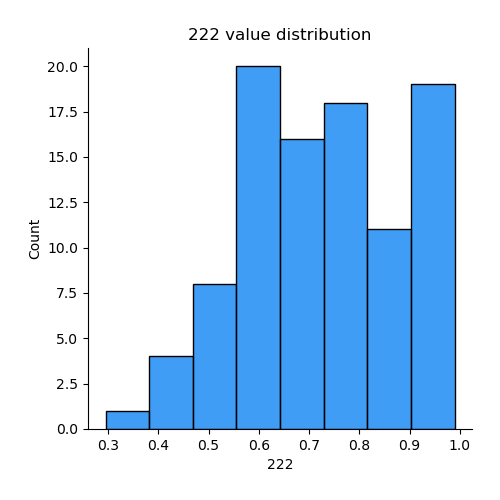
## Feature : 223
- **Feature type** : continous
- **Missing** : 0.0%
- **Unique** : 97
- **Count** :97.0
- **Mean** :0.5806127064948411
- **Std** :0.2795593192694427
- **Min** :-0.31288250476327306
- **25%th Percentile** : 0.4053880661764514
- **50%th Percentile** : 0.5728657395054901
- **75%th Percentile** : 0.7676764562841717
- **Max** :0.9932456350509858

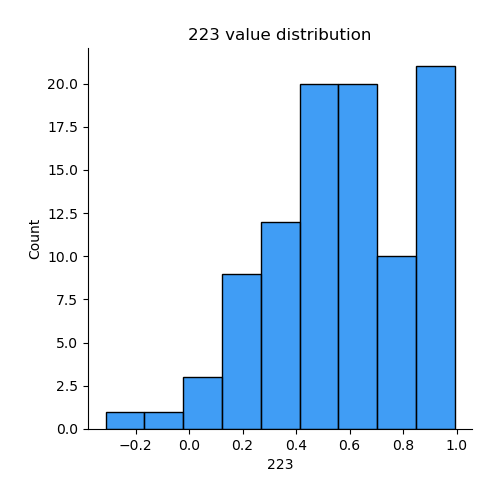
## Feature : 224
- **Feature type** : continous
- **Missing** : 0.0%
- **Unique** : 97
- **Count** :97.0
- **Mean** :0.6164065546550745
- **Std** :0.2661526382719254
- **Min** :-0.256205983864818
- **25%th Percentile** : 0.46988581975535554
- **50%th Percentile** : 0.6065765251551649
- **75%th Percentile** : 0.8102056857992701
- **Max** :0.9897124550695355

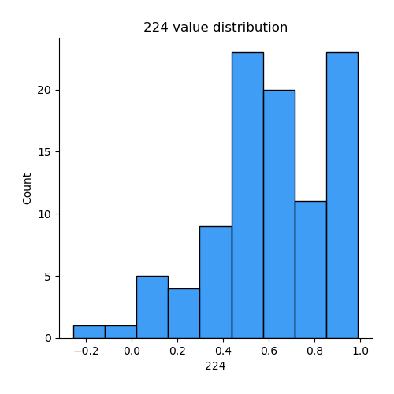
## Feature : 225
- **Feature type** : continous
- **Missing** : 0.0%
- **Unique** : 97
- **Count** :97.0
- **Mean** :0.6105638092040061
- **Std** :0.2699261594901736
- **Min** :-0.2104589895279838
- **25%th Percentile** : 0.48835608866245545
- **50%th Percentile** : 0.6222680517821744
- **75%th Percentile** : 0.7859892035412107
- **Max** :0.995422772663031

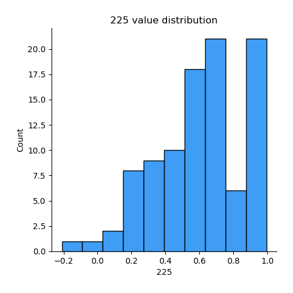
## Feature : 226
- **Feature type** : continous
- **Missing** : 0.0%
- **Unique** : 97
- **Count** :97.0
- **Mean** :0.687124307726581
- **Std** :0.23014728962196293
- **Min** :-0.15150343499378094
- **25%th Percentile** : 0.5446400260937861
- **50%th Percentile** : 0.7093687670870634
- **75%th Percentile** : 0.8536269232354458
- **Max** :0.9880832715749136

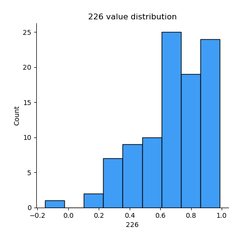
## Feature : 227
- **Feature type** : continous
- **Missing** : 0.0%
- **Unique** : 97
- **Count** :97.0
- **Mean** :0.4420835335255787
- **Std** :0.32936181045882207
- **Min** :-0.3812465367508172
- **25%th Percentile** : 0.2221720119486522
- **50%th Percentile** : 0.38154494291503044
- **75%th Percentile** : 0.6125363742626246
- **Max** :0.9836979245804499

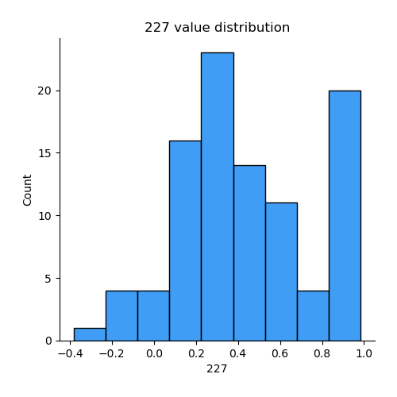
## Feature : 228
- **Feature type** : continous
- **Missing** : 0.0%
- **Unique** : 97
- **Count** :97.0
- **Mean** :0.5525118092283926
- **Std** :0.3163076406579695
- **Min** :-0.44607581461262863
- **25%th Percentile** : 0.3938275914943237
- **50%th Percentile** : 0.5499322499720556
- **75%th Percentile** : 0.7692720472139191
- **Max** :0.9938228422651822

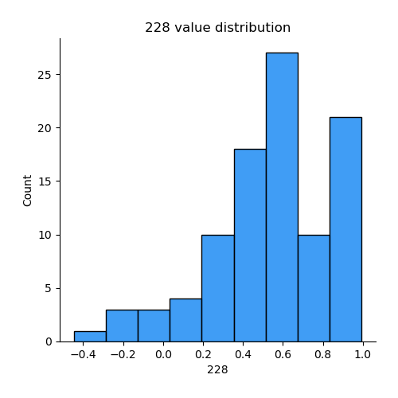
## Feature : 229
- **Feature type** : continous
- **Missing** : 0.0%
- **Unique** : 97
- **Count** :97.0
- **Mean** :0.7073880037716443
- **Std** :0.2409146146457944
- **Min** :-0.2822715853928647
- **25%th Percentile** : 0.6062461469498293
- **50%th Percentile** : 0.7454622154110773
- **75%th Percentile** : 0.8828587222827389
- **Max** :0.9917547645732898

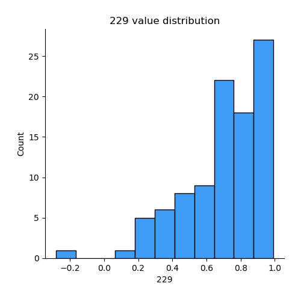
## Feature : 230
- **Feature type** : continous
- **Missing** : 0.0%
- **Unique** : 97
- **Count** :97.0
- **Mean** :0.7083586754155143
- **Std** :0.19301985866335586
- **Min** :0.1924918597977016
- **25%th Percentile** : 0.5819035293005815
- **50%th Percentile** : 0.7051199357425569
- **75%th Percentile** : 0.8541667357323602
- **Max** :0.9915294914532155

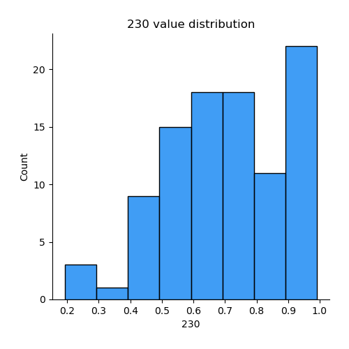
## Feature : 231
- **Feature type** : continous
- **Missing** : 0.0%
- **Unique** : 97
- **Count** :97.0
- **Mean** :0.6468330232870483
- **Std** :0.2449799082105897
- **Min** :0.009313602352455133
- **25%th Percentile** : 0.4968434079944158
- **50%th Percentile** : 0.6609352695382315
- **75%th Percentile** : 0.8296908559207086
- **Max** :0.9937444982962403

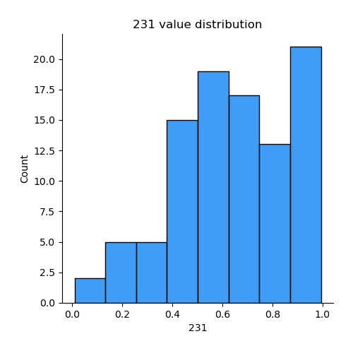
## Feature : 232
- **Feature type** : continous
- **Missing** : 0.0%
- **Unique** : 97
- **Count** :97.0
- **Mean** :0.5659614117173618
- **Std** :0.25491298490076003
- **Min** :-5.173521268917302e-05
- **25%th Percentile** : 0.37632328658609904
- **50%th Percentile** : 0.5330296197592549
- **75%th Percentile** : 0.7480682600945312
- **Max** :0.9842714608989731

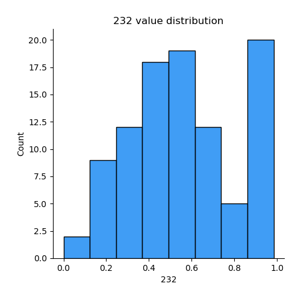
## Feature : 233
- **Feature type** : continous
- **Missing** : 0.0%
- **Unique** : 97
- **Count** :97.0
- **Mean** :0.6156756201933626
- **Std** :0.23547593723407012
- **Min** :0.15363589662042945
- **25%th Percentile** : 0.45823652612579546
- **50%th Percentile** : 0.5625227295937605
- **75%th Percentile** : 0.7782641688669809
- **Max** :0.979587893360532

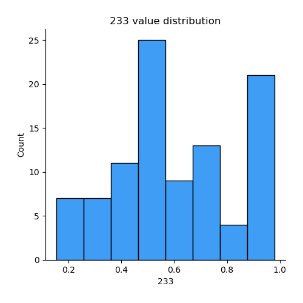
## Feature : 234
- **Feature type** : continous
- **Missing** : 0.0%
- **Unique** : 97
- **Count** :97.0
- **Mean** :0.5922748284396889
- **Std** :0.2817194957029794
- **Min** :-0.23594813635391865
- **25%th Percentile** : 0.3861240583202468
- **50%th Percentile** : 0.5896301020088582
- **75%th Percentile** : 0.7812697832226457
- **Max** :0.9905848771069058

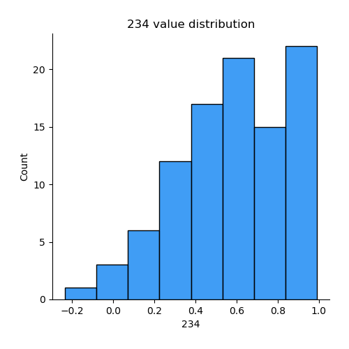
## Feature : 235
- **Feature type** : continous
- **Missing** : 0.0%
- **Unique** : 97
- **Count** :97.0
- **Mean** :0.5284201278218256
- **Std** :0.3064865213929702
- **Min** :-0.3126322373171546
- **25%th Percentile** : 0.3450720937715915
- **50%th Percentile** : 0.5359814991292791
- **75%th Percentile** : 0.6884307628482769
- **Max** :0.9839228011770283

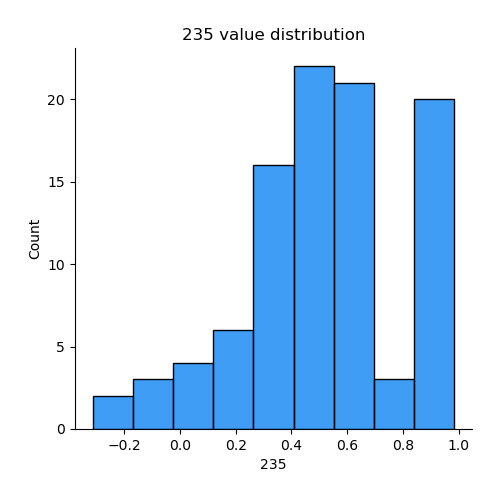
## Feature : 236
- **Feature type** : continous
- **Missing** : 0.0%
- **Unique** : 97
- **Count** :97.0
- **Mean** :0.7017311010195226
- **Std** :0.19722295179657298
- **Min** :0.24220052542173992
- **25%th Percentile** : 0.5596742967549199
- **50%th Percentile** : 0.6957331192372161
- **75%th Percentile** : 0.842470104718496
- **Max** :0.9906309658376903

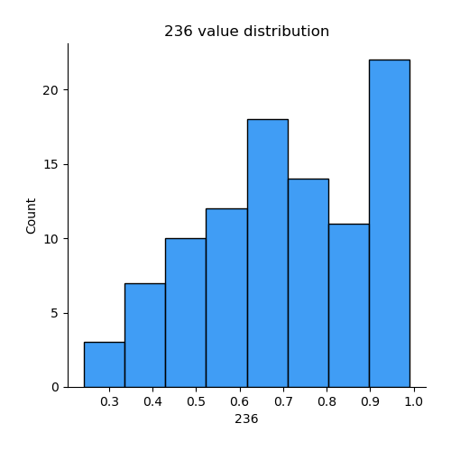
## Feature : 237
- **Feature type** : continous
- **Missing** : 0.0%
- **Unique** : 97
- **Count** :97.0
- **Mean** :0.5060136418345635
- **Std** :0.30884890180390145
- **Min** :-0.28359099757236683
- **25%th Percentile** : 0.3061262301754113
- **50%th Percentile** : 0.5264148563215786
- **75%th Percentile** : 0.6964843821985112
- **Max** :0.985785239150994

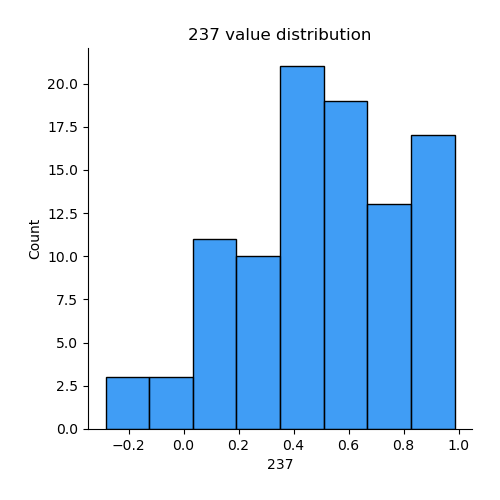
## Feature : 238
- **Feature type** : continous
- **Missing** : 0.0%
- **Unique** : 97
- **Count** :97.0
- **Mean** :0.8582094134766688
- **Std** :0.14597340912398712
- **Min** :0.3240084225192554
- **25%th Percentile** : 0.8179148200590041
- **50%th Percentile** : 0.9079996948878005
- **75%th Percentile** : 0.9456388812427652
- **Max** :0.9983284085609475

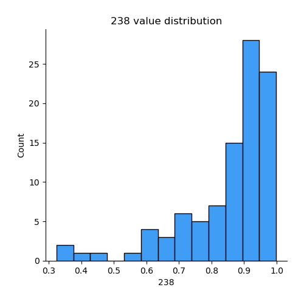
## Feature : 239
- **Feature type** : continous
- **Missing** : 0.0%
- **Unique** : 97
- **Count** :97.0
- **Mean** :0.6527295094538388
- **Std** :0.2587761777514859
- **Min** :-0.040135100779359646
- **25%th Percentile** : 0.4969070373803892
- **50%th Percentile** : 0.6693371075795426
- **75%th Percentile** : 0.8413025107602963
- **Max** :0.9895535040734488

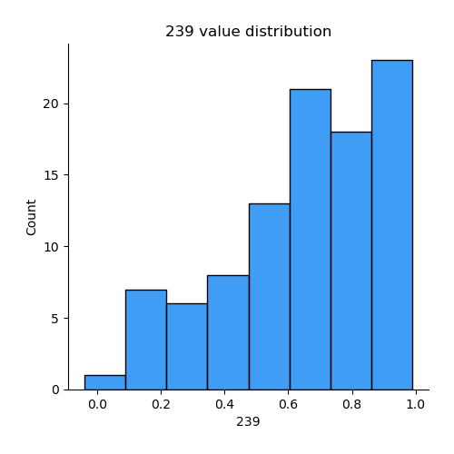
## Feature : 240
- **Feature type** : continous
- **Missing** : 0.0%
- **Unique** : 97
- **Count** :97.0
- **Mean** :0.7282087990789261
- **Std** :0.21866050737987672
- **Min** :0.04468643061358036
- **25%th Percentile** : 0.6350087552721974
- **50%th Percentile** : 0.7525675554648211
- **75%th Percentile** : 0.8642715326856301
- **Max** :0.9954175481509604

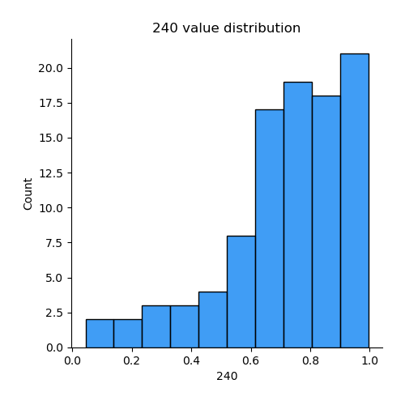
## Feature : 241
- **Feature type** : continous
- **Missing** : 0.0%
- **Unique** : 97
- **Count** :97.0
- **Mean** :0.6206823709533289
- **Std** :0.26066174099208556
- **Min** :-0.2383591127522628
- **25%th Percentile** : 0.465418554065169
- **50%th Percentile** : 0.621546606060821
- **75%th Percentile** : 0.7859485522643535
- **Max** :0.9922255859440214

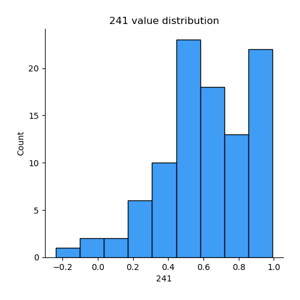
## Feature : 242
- **Feature type** : continous
- **Missing** : 0.0%
- **Unique** : 97
- **Count** :97.0
- **Mean** :0.6689636669798716
- **Std** :0.22791992119807697
- **Min** :0.09190192186001954
- **25%th Percentile** : 0.4856655717477637
- **50%th Percentile** : 0.6865524949050172
- **75%th Percentile** : 0.854575128562507
- **Max** :0.9808008931247926

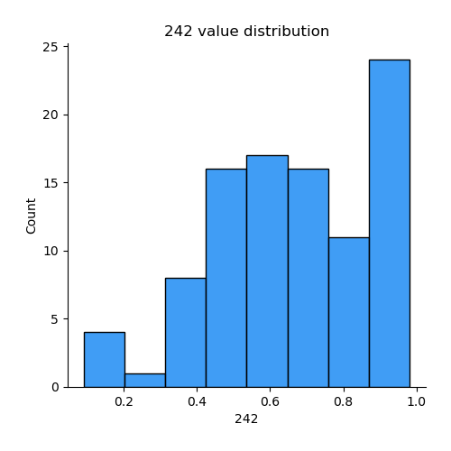
## Feature : 243
- **Feature type** : continous
- **Missing** : 0.0%
- **Unique** : 97
- **Count** :97.0
- **Mean** :0.7784404649381843
- **Std** :0.16663728796660937
- **Min** :0.23173458895395058
- **25%th Percentile** : 0.6629942876297893
- **50%th Percentile** : 0.8097805954790748
- **75%th Percentile** : 0.9081563882315613
- **Max** :0.997645873992803

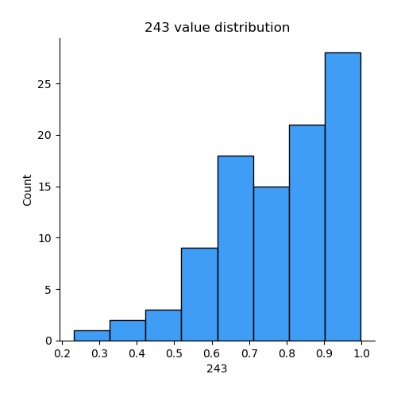
## Feature : 244
- **Feature type** : continous
- **Missing** : 0.0%
- **Unique** : 97
- **Count** :97.0
- **Mean** :0.7982241718604501
- **Std** :0.1418904355809612
- **Min** :0.4530524266039894
- **25%th Percentile** : 0.7039866474002084
- **50%th Percentile** : 0.8264288644526994
- **75%th Percentile** : 0.910529984972035
- **Max** :0.9938039706150148

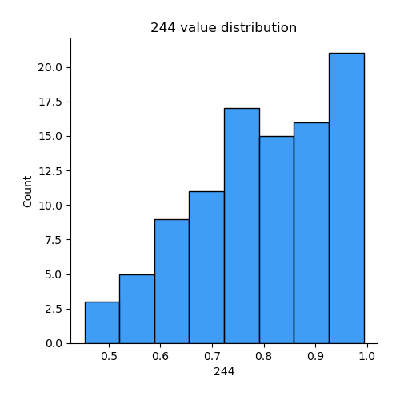
## Feature : 245
- **Feature type** : continous
- **Missing** : 0.0%
- **Unique** : 97
- **Count** :97.0
- **Mean** :0.6522154540213448
- **Std** :0.265606626935866
- **Min** :-0.23995308513491606
- **25%th Percentile** : 0.5029053806215232
- **50%th Percentile** : 0.6824031374860065
- **75%th Percentile** : 0.8297754946081723
- **Max** :0.9944773079296406

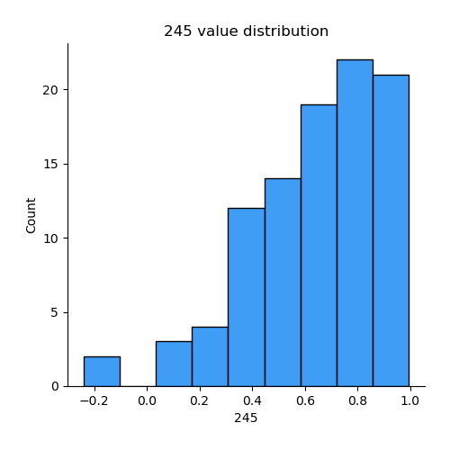
## Feature : 246
- **Feature type** : continous
- **Missing** : 0.0%
- **Unique** : 97
- **Count** :97.0
- **Mean** :0.5151433186323644
- **Std** :0.3433806282621077
- **Min** :-0.4088287198742173
- **25%th Percentile** : 0.2868969873539531
- **50%th Percentile** : 0.5667721462433294
- **75%th Percentile** : 0.7636408199765713
- **Max** :0.9920717456551734

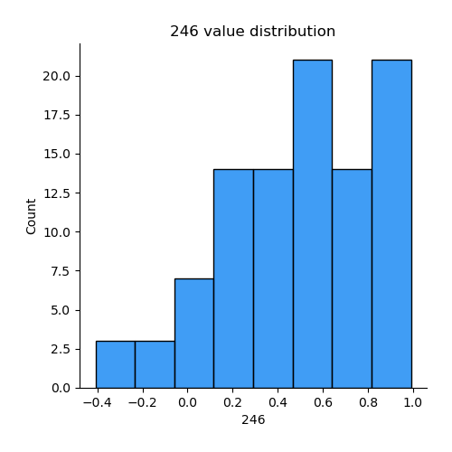
## Feature : 247
- **Feature type** : continous
- **Missing** : 0.0%
- **Unique** : 97
- **Count** :97.0
- **Mean** :0.6883527066032555
- **Std** :0.23038417899285957
- **Min** :-0.04377305712834676
- **25%th Percentile** : 0.5431153755676293
- **50%th Percentile** : 0.7043723579536123
- **75%th Percentile** : 0.8430306401074
- **Max** :0.9963754717253409

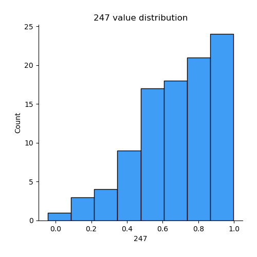
## Feature : 248
- **Feature type** : continous
- **Missing** : 0.0%
- **Unique** : 97
- **Count** :97.0
- **Mean** :0.7196659959449982
- **Std** :0.17743525574167682
- **Min** :0.15475359189727336
- **25%th Percentile** : 0.606759703985741
- **50%th Percentile** : 0.7119131391281506
- **75%th Percentile** : 0.8312274948750255
- **Max** :0.9896330823654073

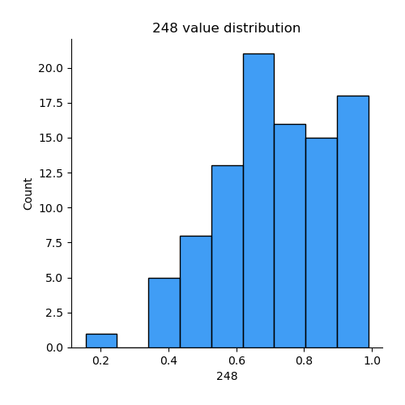
## Feature : 249
- **Feature type** : continous
- **Missing** : 0.0%
- **Unique** : 97
- **Count** :97.0
- **Mean** :0.531274601500324
- **Std** :0.33984960802476105
- **Min** :-0.4020572060979308
- **25%th Percentile** : 0.3455927201076543
- **50%th Percentile** : 0.5615138670006424
- **75%th Percentile** : 0.7907668508987941
- **Max** :0.9920644132600827

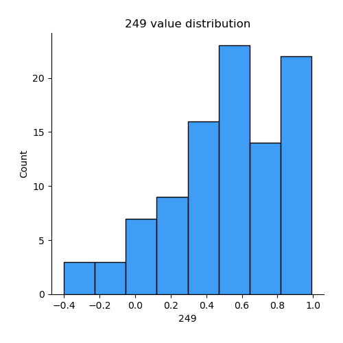
## Feature : 250
- **Feature type** : continous
- **Missing** : 0.0%
- **Unique** : 97
- **Count** :97.0
- **Mean** :0.5904982224438381
- **Std** :0.2847228705944416
- **Min** :-0.23799891666173
- **25%th Percentile** : 0.45888383028119134
- **50%th Percentile** : 0.5820440923401183
- **75%th Percentile** : 0.7868624153334592
- **Max** :0.9901029380589964

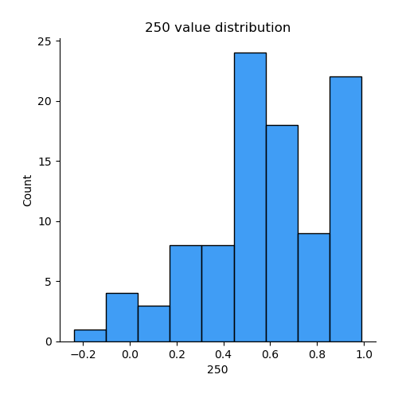
## Feature : 251
- **Feature type** : continous
- **Missing** : 0.0%
- **Unique** : 97
- **Count** :97.0
- **Mean** :0.5735829964390766
- **Std** :0.3157991007470853
- **Min** :-0.26592936488903385
- **25%th Percentile** : 0.3757110406083625
- **50%th Percentile** : 0.6013377099260941
- **75%th Percentile** : 0.7978983284828112
- **Max** :0.9916033513593545

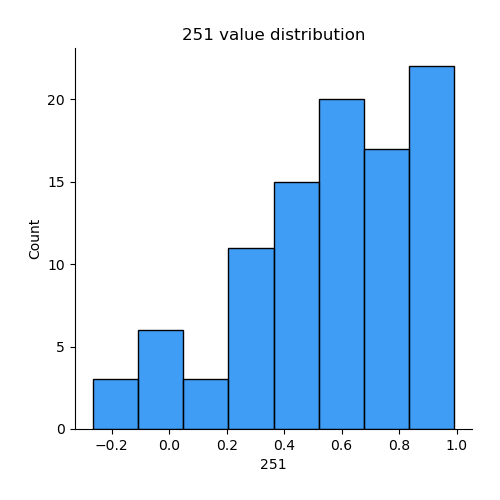
## Feature : 252
- **Feature type** : continous
- **Missing** : 0.0%
- **Unique** : 97
- **Count** :97.0
- **Mean** :0.6791285803281474
- **Std** :0.24221477044756906
- **Min** :-0.19692110170624455
- **25%th Percentile** : 0.5662632279427195
- **50%th Percentile** : 0.698022123499816
- **75%th Percentile** : 0.8513712877274237
- **Max** :0.9889217652820266

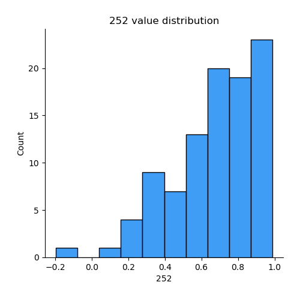
## Feature : 253
- **Feature type** : continous
- **Missing** : 0.0%
- **Unique** : 97
- **Count** :97.0
- **Mean** :0.39322517977481186
- **Std** :0.3505949684178161
- **Min** :-0.48594758638273045
- **25%th Percentile** : 0.1416229117544435
- **50%th Percentile** : 0.31347583296715364
- **75%th Percentile** : 0.5931557041047196
- **Max** :0.9831189080114592

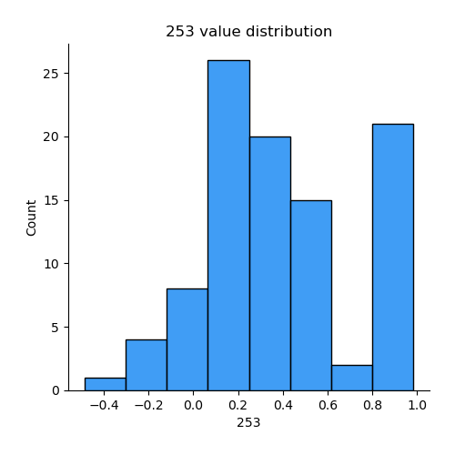
## Feature : 254
- **Feature type** : continous
- **Missing** : 0.0%
- **Unique** : 97
- **Count** :97.0
- **Mean** :0.550944535112824
- **Std** :0.3297732935285616
- **Min** :-0.4042055830257715
- **25%th Percentile** : 0.39516372987338194
- **50%th Percentile** : 0.573180171422853
- **75%th Percentile** : 0.7841508666906478
- **Max** :0.9924758003694826

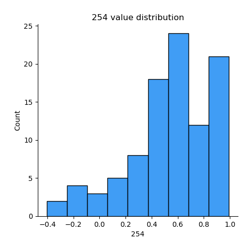
## Feature : 255
- **Feature type** : continous
- **Missing** : 0.0%
- **Unique** : 97
- **Count** :97.0
- **Mean** :0.6780404543259319
- **Std** :0.2614265076403348
- **Min** :-0.3383957065043122
- **25%th Percentile** : 0.5145453757534276
- **50%th Percentile** : 0.7203725719284748
- **75%th Percentile** : 0.8615549623396995
- **Max** :0.9915216725153202

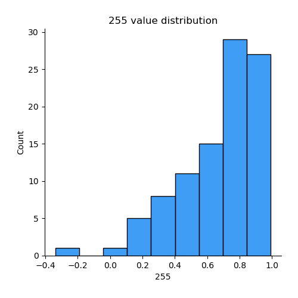
## Feature : 256
- **Feature type** : continous
- **Missing** : 0.0%
- **Unique** : 97
- **Count** :97.0
- **Mean** :0.6366631642751712
- **Std** :0.26782364789388585
- **Min** :-0.21732702202155846
- **25%th Percentile** : 0.46412311236450726
- **50%th Percentile** : 0.6711446754768235
- **75%th Percentile** : 0.819211880945139
- **Max** :0.9907029114248314

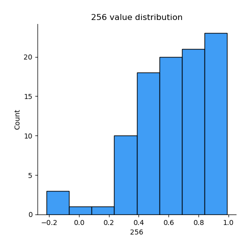
## Feature : 257
- **Feature type** : continous
- **Missing** : 0.0%
- **Unique** : 97
- **Count** :97.0
- **Mean** :0.590641527642111
- **Std** :0.29710822583745833
- **Min** :-0.20935053459336822
- **25%th Percentile** : 0.390556216546346
- **50%th Percentile** : 0.6145025448919611
- **75%th Percentile** : 0.7996276556199176
- **Max** :0.9902076518943911

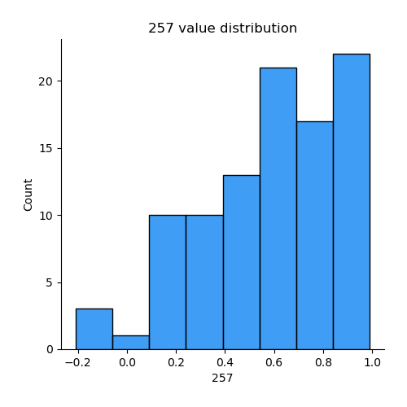
## Feature : 258
- **Feature type** : continous
- **Missing** : 0.0%
- **Unique** : 97
- **Count** :97.0
- **Mean** :0.5145306953679635
- **Std** :0.2932914346898319
- **Min** :-0.17515902584745677
- **25%th Percentile** : 0.29064859077435473
- **50%th Percentile** : 0.5101901878396534
- **75%th Percentile** : 0.7340195959167102
- **Max** :0.9820592737100182

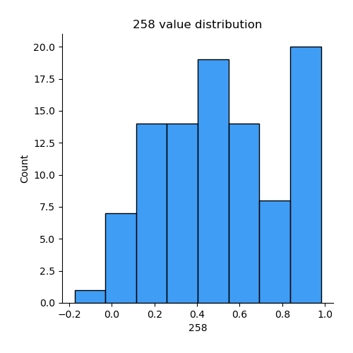
## Feature : 259
- **Feature type** : continous
- **Missing** : 0.0%
- **Unique** : 97
- **Count** :97.0
- **Mean** :0.5092172346048639
- **Std** :0.30625612776895095
- **Min** :-0.1347835167505147
- **25%th Percentile** : 0.2801498237072388
- **50%th Percentile** : 0.4722564336434639
- **75%th Percentile** : 0.745444344102871
- **Max** :0.9840210226323113

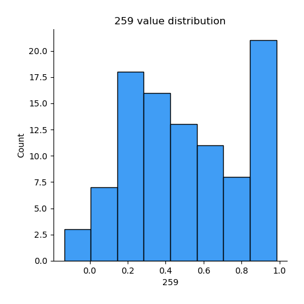
## Feature : 265
- **Feature type** : continous
- **Missing** : 0.0%
- **Unique** : 3
- **Count** :97.0
- **Mean** :1.0
- **Std** :9.135478326654835e-17
- **Min** :0.9999999999999998
- **25%th Percentile** : 0.9999999999999999
- **50%th Percentile** : 1.0
- **75%th Percentile** : 1.0
- **Max** :1.0

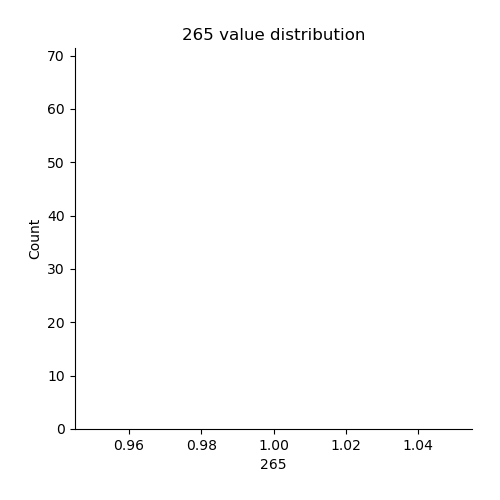
## Feature : 266
- **Feature type** : continous
- **Missing** : 0.0%
- **Unique** : 97
- **Count** :97.0
- **Mean** :0.6879786867121848
- **Std** :0.22866277769196694
- **Min** :-0.0487848149402417
- **25%th Percentile** : 0.5521358212652439
- **50%th Percentile** : 0.6930468047031492
- **75%th Percentile** : 0.8569648463740948
- **Max** :0.9939932309862867

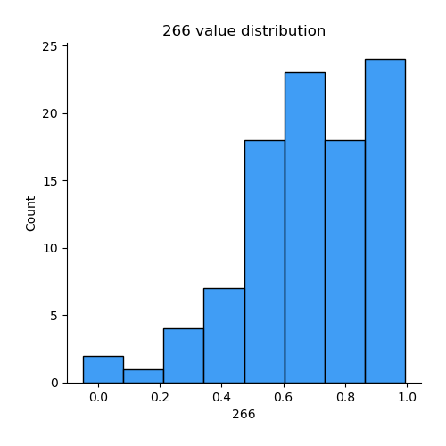
## Feature : 267
- **Feature type** : continous
- **Missing** : 0.0%
- **Unique** : 97
- **Count** :97.0
- **Mean** :0.6497683836169061
- **Std** :0.23190164899644836
- **Min** :0.015183106956501219
- **25%th Percentile** : 0.47918582134634696
- **50%th Percentile** : 0.6320854147931849
- **75%th Percentile** : 0.8226968861764955
- **Max** :0.9910232132646918

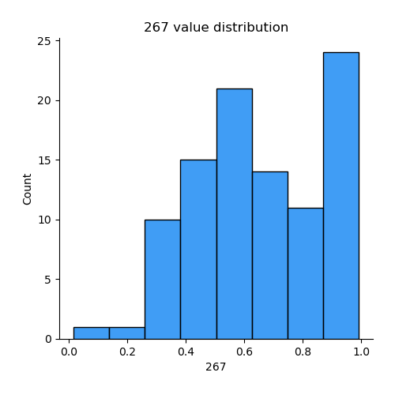
## Feature : 268
- **Feature type** : continous
- **Missing** : 0.0%
- **Unique** : 97
- **Count** :97.0
- **Mean** :0.7895001050133346
- **Std** :0.13570048720598288
- **Min** :0.4462052587959304
- **25%th Percentile** : 0.6889011724089172
- **50%th Percentile** : 0.7961657397943397
- **75%th Percentile** : 0.8789692072666749
- **Max** :0.9918519500716135

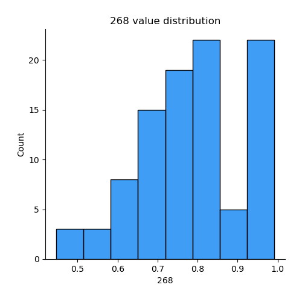
## Feature : 269
- **Feature type** : continous
- **Missing** : 0.0%
- **Unique** : 97
- **Count** :97.0
- **Mean** :0.6925223443210154
- **Std** :0.20409077376003548
- **Min** :0.24490366299162983
- **25%th Percentile** : 0.5608139231331278
- **50%th Percentile** : 0.7047601678804432
- **75%th Percentile** : 0.8331991593680004
- **Max** :0.98737254497132

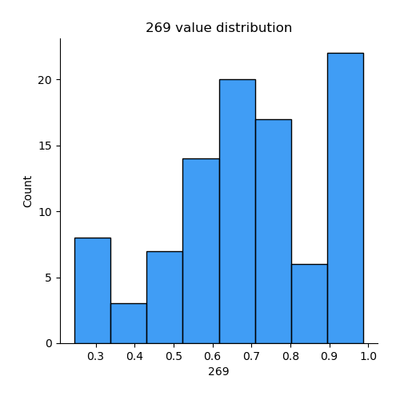
## Feature : 270
- **Feature type** : continous
- **Missing** : 0.0%
- **Unique** : 97
- **Count** :97.0
- **Mean** :0.6745708344900192
- **Std** :0.2124669347038546
- **Min** :0.15717992629276606
- **25%th Percentile** : 0.5212632240233331
- **50%th Percentile** : 0.6920127564234749
- **75%th Percentile** : 0.8387673296281419
- **Max** :0.9920304476225862

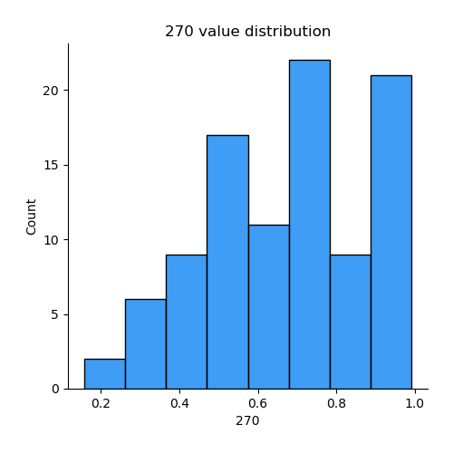
## Feature : 271
- **Feature type** : continous
- **Missing** : 0.0%
- **Unique** : 97
- **Count** :97.0
- **Mean** :0.7516837671137075
- **Std** :0.19315939136139534
- **Min** :-0.020395132662647947
- **25%th Percentile** : 0.655039158086576
- **50%th Percentile** : 0.7723430226981474
- **75%th Percentile** : 0.8837616588342899
- **Max** :0.9954045142537818

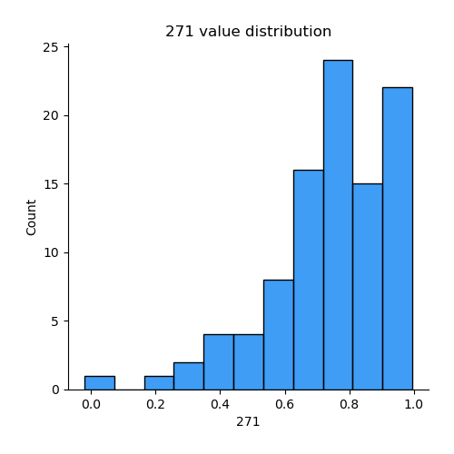
## Feature : 272
- **Feature type** : continous
- **Missing** : 0.0%
- **Unique** : 97
- **Count** :97.0
- **Mean** :0.5888049805085095
- **Std** :0.26811097267625256
- **Min** :-0.06023450400936898
- **25%th Percentile** : 0.4369948072668965
- **50%th Percentile** : 0.5782450820464139
- **75%th Percentile** : 0.755389138197021
- **Max** :0.9916154629511518

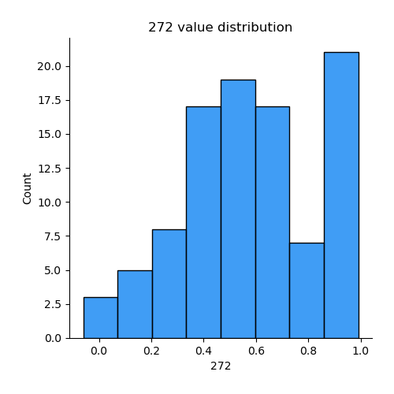
## Feature : 273
- **Feature type** : continous
- **Missing** : 0.0%
- **Unique** : 97
- **Count** :97.0
- **Mean** :0.6051089166244891
- **Std** :0.2512974860347226
- **Min** :-0.009534249046949168
- **25%th Percentile** : 0.4602703066236472
- **50%th Percentile** : 0.5806853530036915
- **75%th Percentile** : 0.7443715766910395
- **Max** :0.9915331251685489

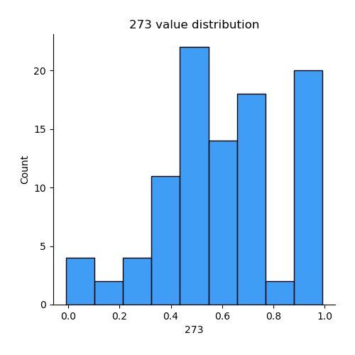
## Feature : 274
- **Feature type** : continous
- **Missing** : 0.0%
- **Unique** : 97
- **Count** :97.0
- **Mean** :0.651539263586931
- **Std** :0.21429927834274387
- **Min** :0.13869808255438712
- **25%th Percentile** : 0.5023655208580212
- **50%th Percentile** : 0.6552755720960608
- **75%th Percentile** : 0.7978980181178752
- **Max** :0.9871191684569469

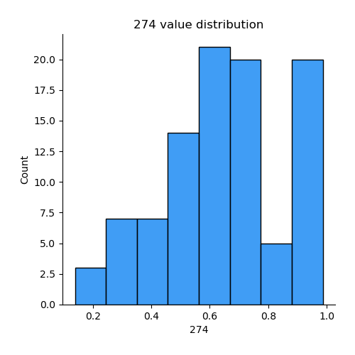
## Feature : 275
- **Feature type** : continous
- **Missing** : 0.0%
- **Unique** : 97
- **Count** :97.0
- **Mean** :0.649746676267316
- **Std** :0.2280251013964351
- **Min** :-0.04588745261653689
- **25%th Percentile** : 0.5163497947318108
- **50%th Percentile** : 0.6288064108926158
- **75%th Percentile** : 0.7914010467903737
- **Max** :0.9929258477829538

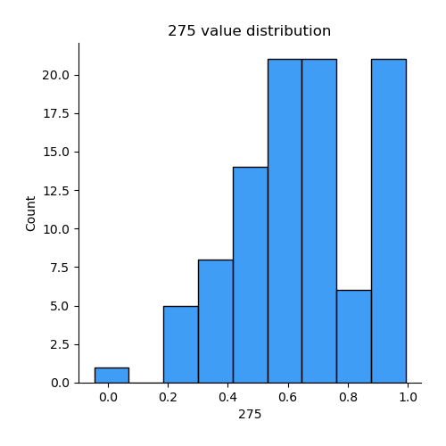
## Feature : 276
- **Feature type** : continous
- **Missing** : 0.0%
- **Unique** : 97
- **Count** :97.0
- **Mean** :0.7103001178784079
- **Std** :0.19341899292346898
- **Min** :0.1773568919236413
- **25%th Percentile** : 0.5822220259559978
- **50%th Percentile** : 0.6975711020116657
- **75%th Percentile** : 0.8462273530550947
- **Max** :0.9924375320459388

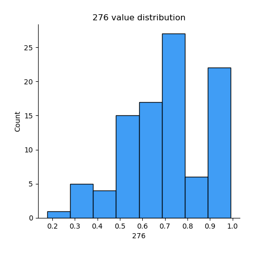
## Feature : 277
- **Feature type** : continous
- **Missing** : 0.0%
- **Unique** : 97
- **Count** :97.0
- **Mean** :0.6606855652204844
- **Std** :0.22492520062589005
- **Min** :0.006206487528770404
- **25%th Percentile** : 0.5234843979893156
- **50%th Percentile** : 0.648761580064527
- **75%th Percentile** : 0.8012833366406916
- **Max** :0.9930567674705612

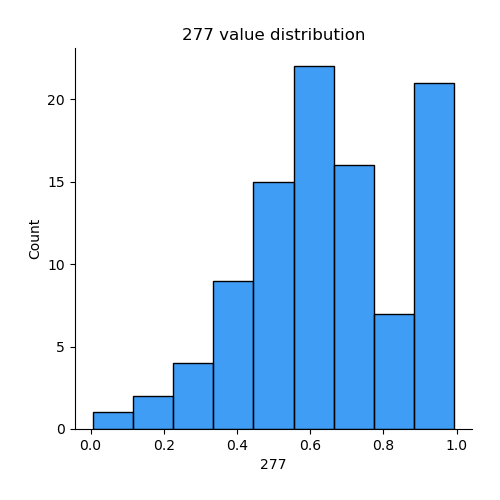
## Feature : 278
- **Feature type** : continous
- **Missing** : 0.0%
- **Unique** : 97
- **Count** :97.0
- **Mean** :0.8625809555929626
- **Std** :0.09923052401652535
- **Min** :0.5715627082869889
- **25%th Percentile** : 0.8172313170025005
- **50%th Percentile** : 0.866389946614328
- **75%th Percentile** : 0.9216307024193615
- **Max** :0.9970848986581574

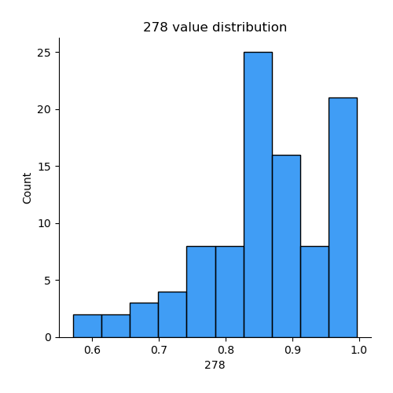
## Feature : 279
- **Feature type** : continous
- **Missing** : 0.0%
- **Unique** : 97
- **Count** :97.0
- **Mean** :0.5459545910096902
- **Std** :0.2811832756387221
- **Min** :-0.053721572749420146
- **25%th Percentile** : 0.3268282055536123
- **50%th Percentile** : 0.4985762676865892
- **75%th Percentile** : 0.7643199979523757
- **Max** :0.9881728699744828

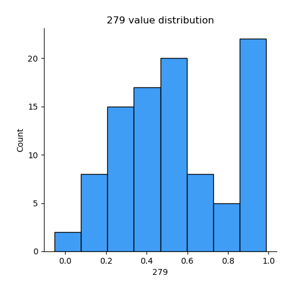
## Feature : 280
- **Feature type** : continous
- **Missing** : 0.0%
- **Unique** : 97
- **Count** :97.0
- **Mean** :0.6831496715565881
- **Std** :0.21920384495975026
- **Min** :0.14685702294011713
- **25%th Percentile** : 0.5318586944772644
- **50%th Percentile** : 0.6921432080687391
- **75%th Percentile** : 0.8185433068663451
- **Max** :0.9945055636010646

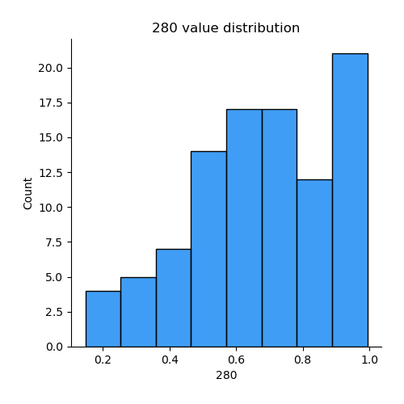
## Feature : 281
- **Feature type** : continous
- **Missing** : 0.0%
- **Unique** : 97
- **Count** :97.0
- **Mean** :0.7730534726985987
- **Std** :0.18651384056171758
- **Min** :0.17103196390879216
- **25%th Percentile** : 0.6690263489191982
- **50%th Percentile** : 0.8023968707585257
- **75%th Percentile** : 0.8991159728529329
- **Max** :0.9950697523569062

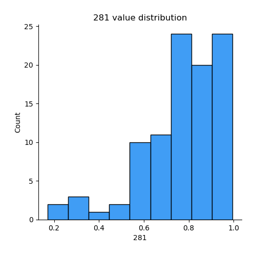
## Feature : 282
- **Feature type** : continous
- **Missing** : 0.0%
- **Unique** : 97
- **Count** :97.0
- **Mean** :0.6924764664860249
- **Std** :0.20130927974128987
- **Min** :0.28673936763445185
- **25%th Percentile** : 0.5506381042253888
- **50%th Percentile** : 0.6824617809789815
- **75%th Percentile** : 0.8535501033608084
- **Max** :0.9938373890448667

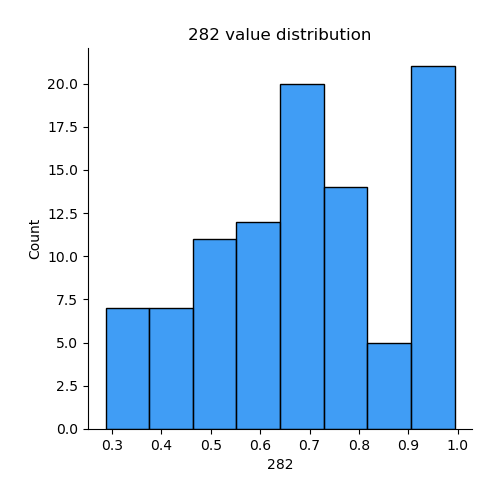
## Feature : 283
- **Feature type** : continous
- **Missing** : 0.0%
- **Unique** : 97
- **Count** :97.0
- **Mean** :0.7856022868854867
- **Std** :0.1734086321667379
- **Min** :0.23502661917141257
- **25%th Percentile** : 0.7094074618394578
- **50%th Percentile** : 0.7950242809992424
- **75%th Percentile** : 0.9354661260841833
- **Max** :0.9960124185725266

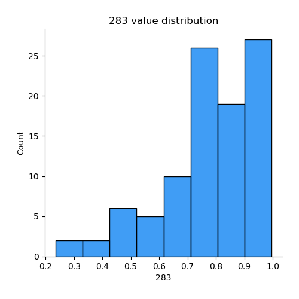
## Feature : 284
- **Feature type** : continous
- **Missing** : 0.0%
- **Unique** : 97
- **Count** :97.0
- **Mean** :0.4473879015267958
- **Std** :0.30696097227149466
- **Min** :-0.13795422061014015
- **25%th Percentile** : 0.25750136121287953
- **50%th Percentile** : 0.40529163835506404
- **75%th Percentile** : 0.5993802175516352
- **Max** :0.9754622601791526

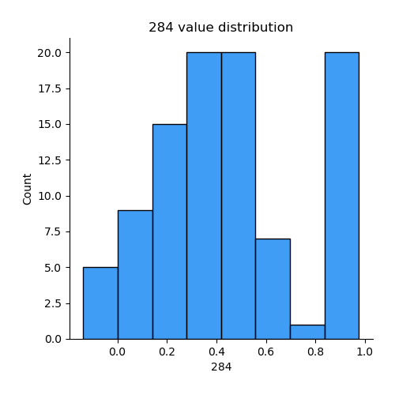
## Feature : 285
- **Feature type** : continous
- **Missing** : 0.0%
- **Unique** : 97
- **Count** :97.0
- **Mean** :0.6209507749625827
- **Std** :0.2261620471236925
- **Min** :0.18780394969441355
- **25%th Percentile** : 0.4551619451633486
- **50%th Percentile** : 0.5961230348626061
- **75%th Percentile** : 0.7825695893235035
- **Max** :0.9851252566477362

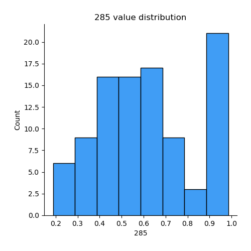
## Feature : 286
- **Feature type** : continous
- **Missing** : 0.0%
- **Unique** : 97
- **Count** :97.0
- **Mean** :0.6181546935158658
- **Std** :0.2752288599482954
- **Min** :-0.15553689569864096
- **25%th Percentile** : 0.43703905922015684
- **50%th Percentile** : 0.6361807554112414
- **75%th Percentile** : 0.8207846924115196
- **Max** :0.9924652400694898

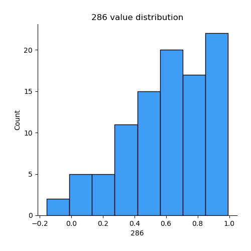
## Feature : 287
- **Feature type** : continous
- **Missing** : 0.0%
- **Unique** : 97
- **Count** :97.0
- **Mean** :0.5566791150135058
- **Std** :0.2670510117188291
- **Min** :-0.033381632489801735
- **25%th Percentile** : 0.3805571463601491
- **50%th Percentile** : 0.5047375106216954
- **75%th Percentile** : 0.7325376294844308
- **Max** :0.9903286515068057

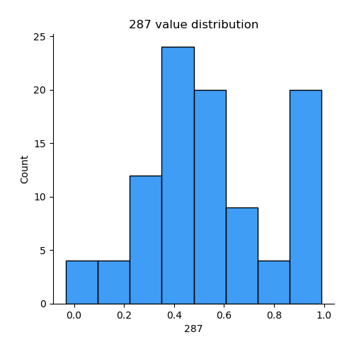
## Feature : 288
- **Feature type** : continous
- **Missing** : 0.0%
- **Unique** : 97
- **Count** :97.0
- **Mean** :0.6924737416573399
- **Std** :0.21813761261504586
- **Min** :0.10767030866963069
- **25%th Percentile** : 0.5357590584369192
- **50%th Percentile** : 0.7074474715493665
- **75%th Percentile** : 0.8739068767971917
- **Max** :0.9891385246795831

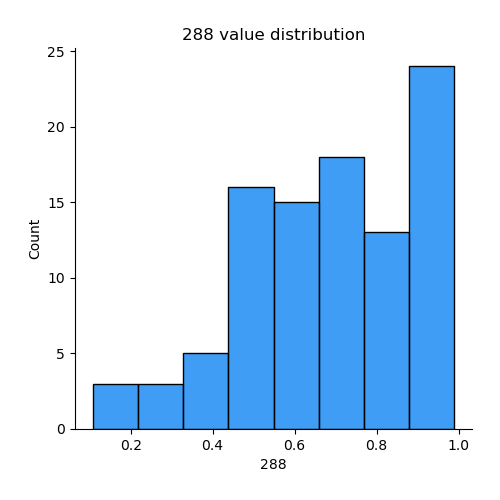
## Feature : 289
- **Feature type** : continous
- **Missing** : 0.0%
- **Unique** : 97
- **Count** :97.0
- **Mean** :0.3890347374911493
- **Std** :0.3315207803871607
- **Min** :-0.459460664708935
- **25%th Percentile** : 0.18188768388155546
- **50%th Percentile** : 0.33541806596002355
- **75%th Percentile** : 0.5851114161603267
- **Max** :0.98168339615319

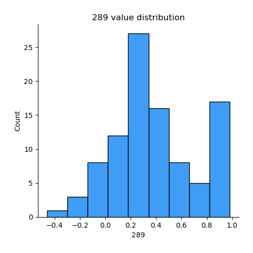
## Feature : 290
- **Feature type** : continous
- **Missing** : 0.0%
- **Unique** : 97
- **Count** :97.0
- **Mean** :0.6443263815116498
- **Std** :0.23993823618646415
- **Min** :0.1254293733490297
- **25%th Percentile** : 0.48632720288805864
- **50%th Percentile** : 0.627796541355757
- **75%th Percentile** : 0.8284871059178469
- **Max** :0.9926493464621101

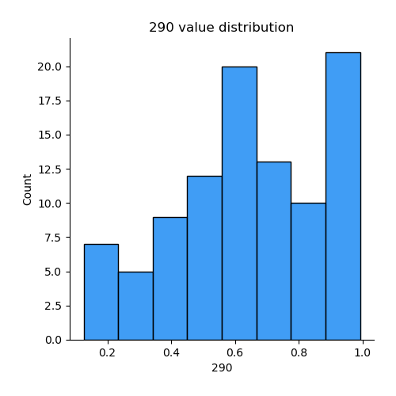
## Feature : 291
- **Feature type** : continous
- **Missing** : 0.0%
- **Unique** : 97
- **Count** :97.0
- **Mean** :0.8240154326723252
- **Std** :0.1456772457817778
- **Min** :0.47705490814108814
- **25%th Percentile** : 0.7348775331237957
- **50%th Percentile** : 0.8471762546213896
- **75%th Percentile** : 0.9503449738929491
- **Max** :0.9980068575976893

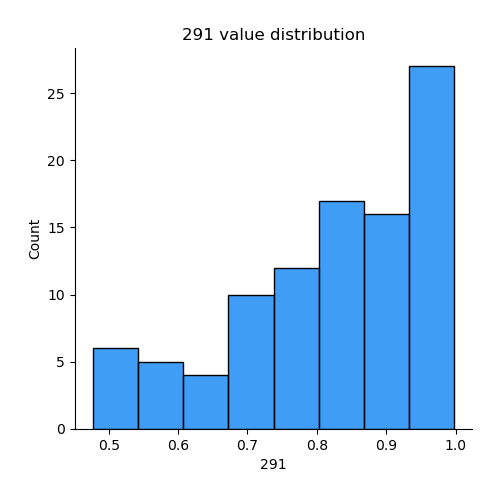
## Feature : 292
- **Feature type** : continous
- **Missing** : 0.0%
- **Unique** : 97
- **Count** :97.0
- **Mean** :0.5957484549772679
- **Std** :0.2776719278642451
- **Min** :-0.07090563775272839
- **25%th Percentile** : 0.42986159213078456
- **50%th Percentile** : 0.5961031434312513
- **75%th Percentile** : 0.797649808191854
- **Max** :0.9929180079255114

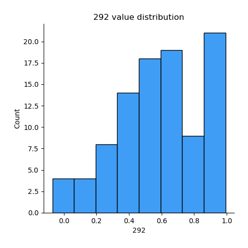
## Feature : 293
- **Feature type** : continous
- **Missing** : 0.0%
- **Unique** : 97
- **Count** :97.0
- **Mean** :0.5929388525621293
- **Std** :0.2731114350766985
- **Min** :-0.1065621276518543
- **25%th Percentile** : 0.38372372708752417
- **50%th Percentile** : 0.5802824959545259
- **75%th Percentile** : 0.7976020958232438
- **Max** :0.9909664535771084

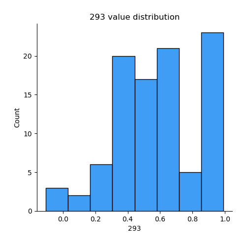
## Feature : 294
- **Feature type** : continous
- **Missing** : 0.0%
- **Unique** : 97
- **Count** :97.0
- **Mean** :0.763851669475606
- **Std** :0.16357023711899008
- **Min** :0.33266071739964215
- **25%th Percentile** : 0.6674953066106103
- **50%th Percentile** : 0.7694221568056342
- **75%th Percentile** : 0.8798651271151168
- **Max** :0.9935667966311268

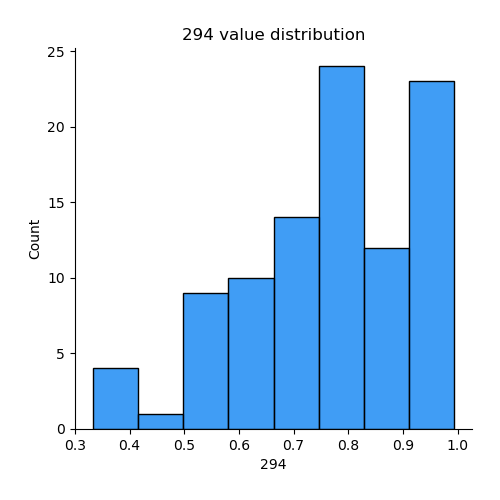
## Feature : 295
- **Feature type** : continous
- **Missing** : 0.0%
- **Unique** : 97
- **Count** :97.0
- **Mean** :0.668460054401813
- **Std** :0.22112242865652043
- **Min** :0.19275478645088032
- **25%th Percentile** : 0.5421003891640394
- **50%th Percentile** : 0.6643683373923686
- **75%th Percentile** : 0.8361737061237573
- **Max** :0.9905569717610534

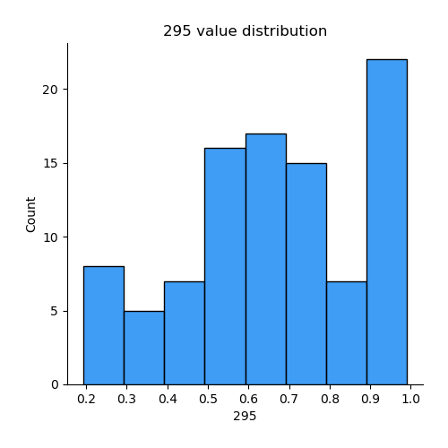
## Feature : 296
- **Feature type** : continous
- **Missing** : 0.0%
- **Unique** : 97
- **Count** :97.0
- **Mean** :0.6639464138460346
- **Std** :0.21885726125694896
- **Min** :0.11007297945825954
- **25%th Percentile** : 0.5112360351997081
- **50%th Percentile** : 0.6614740330594666
- **75%th Percentile** : 0.8373688343251038
- **Max** :0.9934240570107431

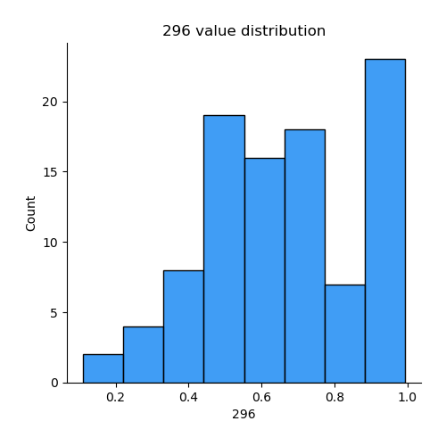
## Feature : 297
- **Feature type** : continous
- **Missing** : 0.0%
- **Unique** : 97
- **Count** :97.0
- **Mean** :0.6581833440029455
- **Std** :0.255883195492497
- **Min** :-0.20410202274390485
- **25%th Percentile** : 0.511896873456198
- **50%th Percentile** : 0.682591931760841
- **75%th Percentile** : 0.8454146352341375
- **Max** :0.9946640420342132

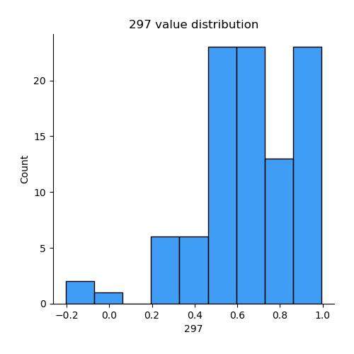
## Feature : 298
- **Feature type** : continous
- **Missing** : 0.0%
- **Unique** : 97
- **Count** :97.0
- **Mean** :0.5640459916890282
- **Std** :0.2826502287946338
- **Min** :-0.09624247019266398
- **25%th Percentile** : 0.3676364601231427
- **50%th Percentile** : 0.5364695584942033
- **75%th Percentile** : 0.770315921727726
- **Max** :0.9943863804147745

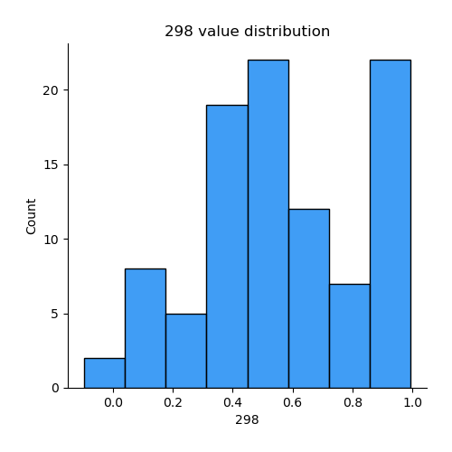
## Feature : 299
- **Feature type** : continous
- **Missing** : 0.0%
- **Unique** : 97
- **Count** :97.0
- **Mean** :0.5628309135439999
- **Std** :0.2718676303226334
- **Min** :-0.1149902747812978
- **25%th Percentile** : 0.4018403680644718
- **50%th Percentile** : 0.5348046142100363
- **75%th Percentile** : 0.7431475520205856
- **Max** :0.99151901945444

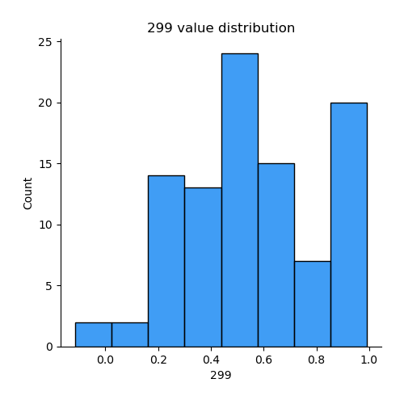
## Feature : 300
- **Feature type** : continous
- **Missing** : 0.0%
- **Unique** : 97
- **Count** :97.0
- **Mean** :0.6516484777657814
- **Std** :0.21924018250878538
- **Min** :0.06025669474048266
- **25%th Percentile** : 0.46754750875756523
- **50%th Percentile** : 0.6354168145658331
- **75%th Percentile** : 0.810887634759133
- **Max** :0.9880948485905593

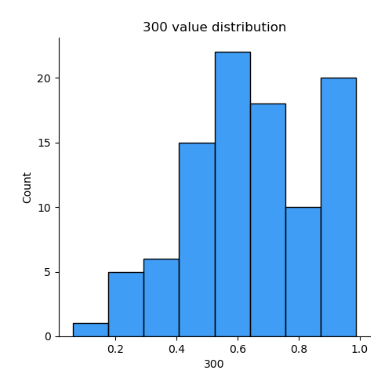
## Feature : 301
- **Feature type** : continous
- **Missing** : 0.0%
- **Unique** : 97
- **Count** :97.0
- **Mean** :0.5863542240782522
- **Std** :0.2785460168379207
- **Min** :-0.06682343324972323
- **25%th Percentile** : 0.4045132264445089
- **50%th Percentile** : 0.5660259056588198
- **75%th Percentile** : 0.7874573339891142
- **Max** :0.9948185071551641

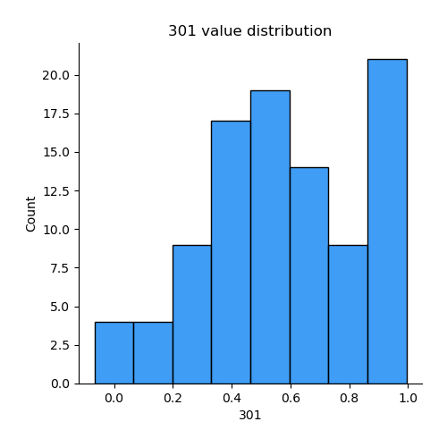
## Feature : 302
- **Feature type** : continous
- **Missing** : 0.0%
- **Unique** : 97
- **Count** :97.0
- **Mean** :0.6603608671487179
- **Std** :0.22881320903257407
- **Min** :0.14904416489931802
- **25%th Percentile** : 0.5184307392490451
- **50%th Percentile** : 0.6604698866973385
- **75%th Percentile** : 0.8100340941613811
- **Max** :0.9936314014523

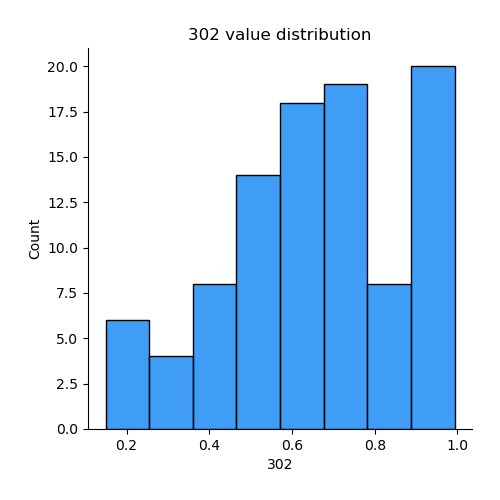
## Feature : 303
- **Feature type** : continous
- **Missing** : 0.0%
- **Unique** : 97
- **Count** :97.0
- **Mean** :0.5929987083666933
- **Std** :0.2754390597680537
- **Min** :-0.09296877690946719
- **25%th Percentile** : 0.4276332735580096
- **50%th Percentile** : 0.5829149387178084
- **75%th Percentile** : 0.7780425513235435
- **Max** :0.9910996831133326

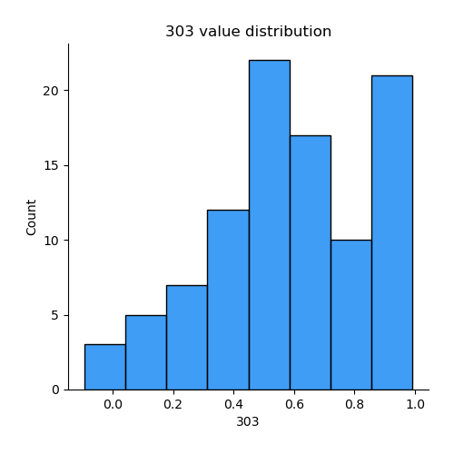
## Feature : 304
- **Feature type** : continous
- **Missing** : 0.0%
- **Unique** : 97
- **Count** :97.0
- **Mean** :0.8128826557784039
- **Std** :0.13228897910194087
- **Min** :0.45342651277840673
- **25%th Percentile** : 0.725198904466292
- **50%th Percentile** : 0.8187936345352378
- **75%th Percentile** : 0.9234274351121391
- **Max** :0.9972566384038714

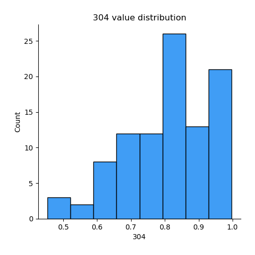
## Feature : 305
- **Feature type** : continous
- **Missing** : 0.0%
- **Unique** : 97
- **Count** :97.0
- **Mean** :0.491698095126149
- **Std** :0.30494912402177937
- **Min** :-0.14885371215364618
- **25%th Percentile** : 0.2639981203445608
- **50%th Percentile** : 0.42057458608029946
- **75%th Percentile** : 0.7054377538632403
- **Max** :0.9895544167221134

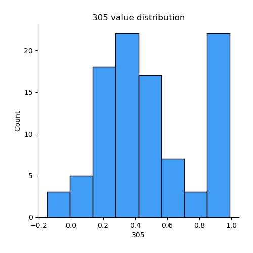
## Feature : 306
- **Feature type** : continous
- **Missing** : 0.0%
- **Unique** : 97
- **Count** :97.0
- **Mean** :0.6230515217859158
- **Std** :0.26470374883580106
- **Min** :-0.0473455545800938
- **25%th Percentile** : 0.44098718318730845
- **50%th Percentile** : 0.6270910211827724
- **75%th Percentile** : 0.8118105663323214
- **Max** :0.9940320848376966

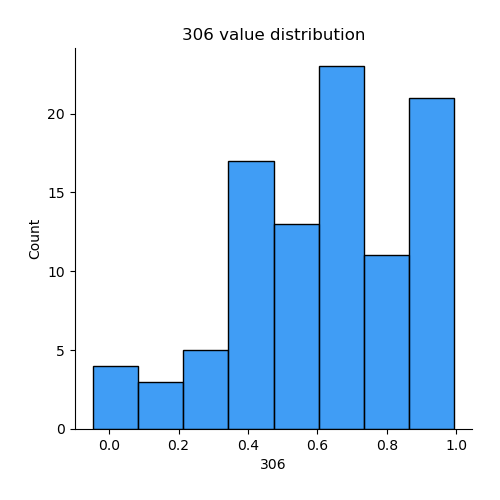
## Feature : 307
- **Feature type** : continous
- **Missing** : 0.0%
- **Unique** : 97
- **Count** :97.0
- **Mean** :0.7070399993133379
- **Std** :0.22102542374551945
- **Min** :0.0671809935956962
- **25%th Percentile** : 0.5779368092400485
- **50%th Percentile** : 0.7240305964098472
- **75%th Percentile** : 0.880592649929878
- **Max** :0.9942515109277342

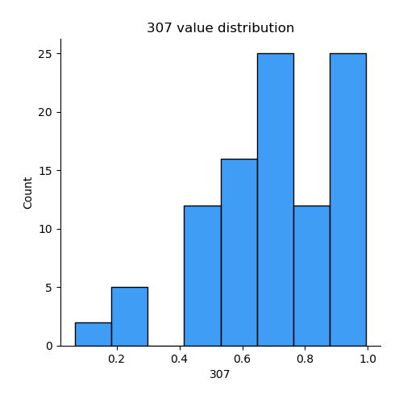
## Feature : 308
- **Feature type** : continous
- **Missing** : 0.0%
- **Unique** : 97
- **Count** :97.0
- **Mean** :0.6228553710015355
- **Std** :0.2637120840239033
- **Min** :-0.17073418890765113
- **25%th Percentile** : 0.4496376612550842
- **50%th Percentile** : 0.6304382206506128
- **75%th Percentile** : 0.8623429629578836
- **Max** :0.9904013050575644

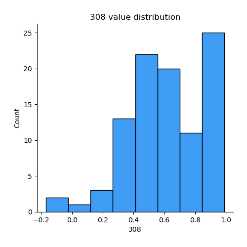
## Feature : 309
- **Feature type** : continous
- **Missing** : 0.0%
- **Unique** : 97
- **Count** :97.0
- **Mean** :0.6387720597011811
- **Std** :0.2691661868909366
- **Min** :-0.018692638879652976
- **25%th Percentile** : 0.47680372207272465
- **50%th Percentile** : 0.672215509164093
- **75%th Percentile** : 0.8928424876923142
- **Max** :0.9951053509122786

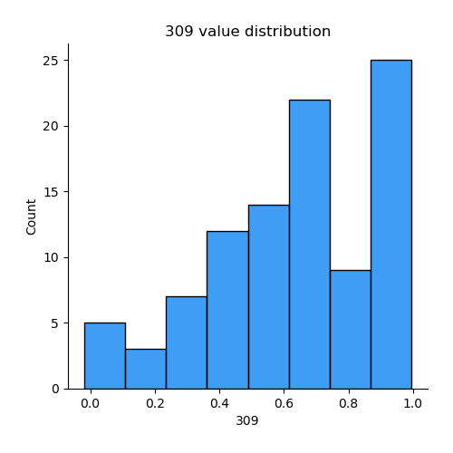
## Feature : 310
- **Feature type** : continous
- **Missing** : 0.0%
- **Unique** : 97
- **Count** :97.0
- **Mean** :0.39768603877570147
- **Std** :0.32195528384500804
- **Min** :-0.3953961818623119
- **25%th Percentile** : 0.16895949943033856
- **50%th Percentile** : 0.3307001357896165
- **75%th Percentile** : 0.5826672869944534
- **Max** :0.9791389637557817

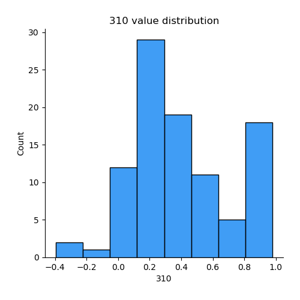
## Feature : 311
- **Feature type** : continous
- **Missing** : 0.0%
- **Unique** : 97
- **Count** :97.0
- **Mean** :0.5348327235515136
- **Std** :0.28154644079817476
- **Min** :-0.021694113257564283
- **25%th Percentile** : 0.310284771911818
- **50%th Percentile** : 0.5047134341461718
- **75%th Percentile** : 0.7989283381203824
- **Max** :0.9873521098640788

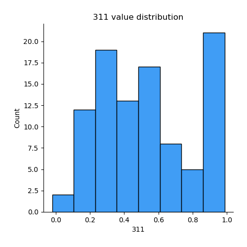
## Feature : 318
- **Feature type** : continous
- **Missing** : 0.0%
- **Unique** : 3
- **Count** :97.0
- **Mean** :1.0
- **Std** :8.171020218150495e-17
- **Min** :0.9999999999999998
- **25%th Percentile** : 1.0
- **50%th Percentile** : 1.0
- **75%th Percentile** : 1.0
- **Max** :1.0

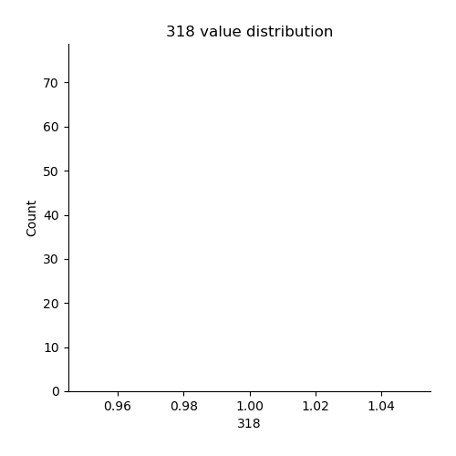
## Feature : 319
- **Feature type** : continous
- **Missing** : 0.0%
- **Unique** : 97
- **Count** :97.0
- **Mean** :0.6210522050957417
- **Std** :0.24082659429270262
- **Min** :-0.0617584046460595
- **25%th Percentile** : 0.4918998709663292
- **50%th Percentile** : 0.5981574879112014
- **75%th Percentile** : 0.7672926394570454
- **Max** :0.9914178993369546

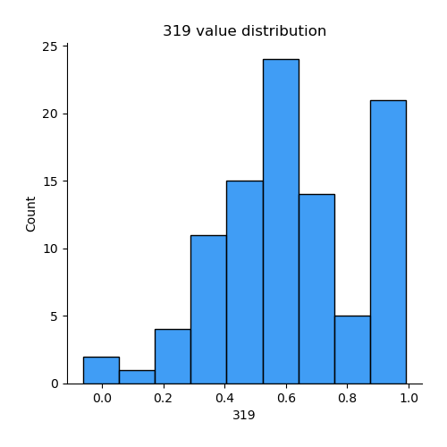
## Feature : 320
- **Feature type** : continous
- **Missing** : 0.0%
- **Unique** : 97
- **Count** :97.0
- **Mean** :0.6034223757912697
- **Std** :0.25604728373481056
- **Min** :-0.05975732546139056
- **25%th Percentile** : 0.4381069283145722
- **50%th Percentile** : 0.5918447901025621
- **75%th Percentile** : 0.7675132642110668
- **Max** :0.9853932322078149

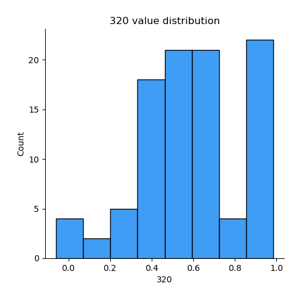
## Feature : 321
- **Feature type** : continous
- **Missing** : 0.0%
- **Unique** : 97
- **Count** :97.0
- **Mean** :0.6953141478528999
- **Std** :0.20516466229662994
- **Min** :0.16517040160915825
- **25%th Percentile** : 0.5832394145478792
- **50%th Percentile** : 0.6877695071378942
- **75%th Percentile** : 0.8511472561889841
- **Max** :0.9908168560430527

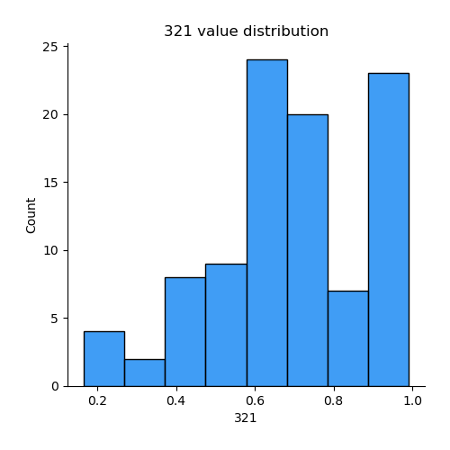
## Feature : 322
- **Feature type** : continous
- **Missing** : 0.0%
- **Unique** : 97
- **Count** :97.0
- **Mean** :0.6724388050227036
- **Std** :0.21532634557027594
- **Min** :0.027987868504930253
- **25%th Percentile** : 0.5293890959626817
- **50%th Percentile** : 0.6573528259785629
- **75%th Percentile** : 0.8328045475165722
- **Max** :0.9913666600647515

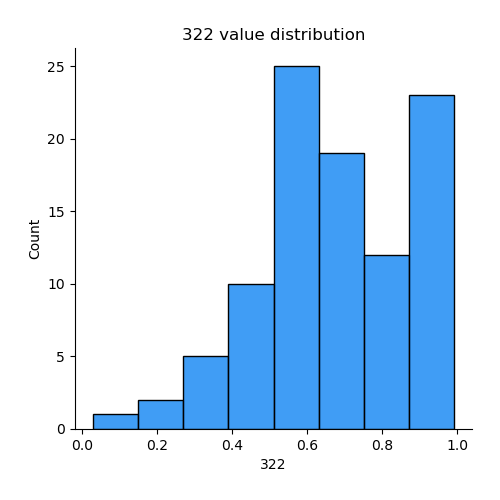
## Feature : 323
- **Feature type** : continous
- **Missing** : 0.0%
- **Unique** : 97
- **Count** :97.0
- **Mean** :0.7937603016547911
- **Std** :0.15220388637955098
- **Min** :0.457521960680344
- **25%th Percentile** : 0.691283741228544
- **50%th Percentile** : 0.7976859990211825
- **75%th Percentile** : 0.9146429731774598
- **Max** :0.9955367171850776

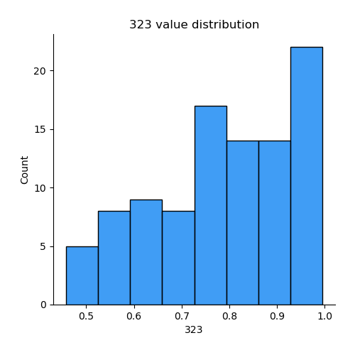
## Feature : 324
- **Feature type** : continous
- **Missing** : 0.0%
- **Unique** : 97
- **Count** :97.0
- **Mean** :0.49570135705012947
- **Std** :0.3423704779735378
- **Min** :-0.32779479807471273
- **25%th Percentile** : 0.3032463421356953
- **50%th Percentile** : 0.4875386326488399
- **75%th Percentile** : 0.7408364907863421
- **Max** :0.9917999341022397

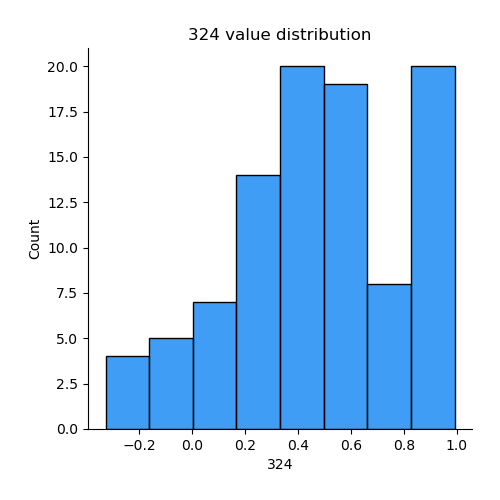
## Feature : 325
- **Feature type** : continous
- **Missing** : 0.0%
- **Unique** : 97
- **Count** :97.0
- **Mean** :0.6811543243692795
- **Std** :0.23198663415247778
- **Min** :-0.0736050826067885
- **25%th Percentile** : 0.563243779120512
- **50%th Percentile** : 0.7000419172377444
- **75%th Percentile** : 0.846552279890233
- **Max** :0.9950337672662427

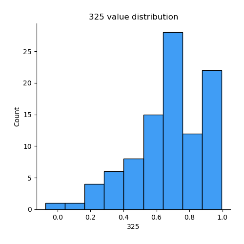
## Feature : 326
- **Feature type** : continous
- **Missing** : 0.0%
- **Unique** : 97
- **Count** :97.0
- **Mean** :0.6107269372514179
- **Std** :0.23425693355449936
- **Min** :0.01706978308496469
- **25%th Percentile** : 0.4291642616092835
- **50%th Percentile** : 0.6015724302474352
- **75%th Percentile** : 0.7599737188765319
- **Max** :0.9847587652949432

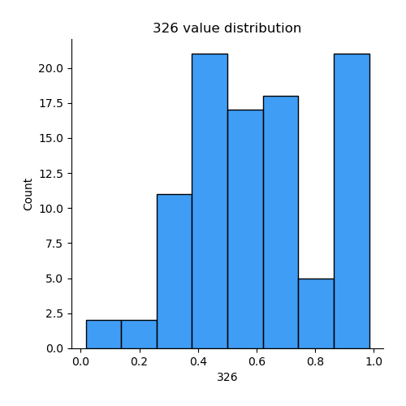
## Feature : 327
- **Feature type** : continous
- **Missing** : 0.0%
- **Unique** : 97
- **Count** :97.0
- **Mean** :0.5620576226416267
- **Std** :0.2945158043276252
- **Min** :-0.31920737603284954
- **25%th Percentile** : 0.37437740848033685
- **50%th Percentile** : 0.5423797269395548
- **75%th Percentile** : 0.7361399354205794
- **Max** :0.9926288806261399

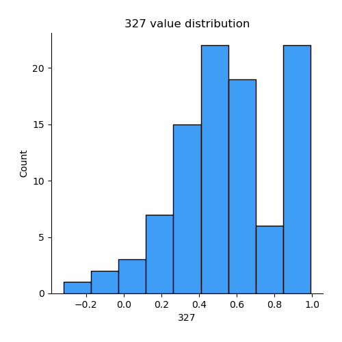
## Feature : 328
- **Feature type** : continous
- **Missing** : 0.0%
- **Unique** : 97
- **Count** :97.0
- **Mean** :0.5973005111876485
- **Std** :0.27842740149815365
- **Min** :-0.09220268235454504
- **25%th Percentile** : 0.46672810430728473
- **50%th Percentile** : 0.5822332522829601
- **75%th Percentile** : 0.8043842595043267
- **Max** :0.988417181803592

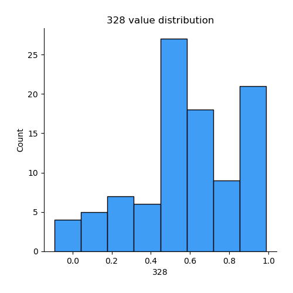
## Feature : 329
- **Feature type** : continous
- **Missing** : 0.0%
- **Unique** : 97
- **Count** :97.0
- **Mean** :0.5984645820418522
- **Std** :0.27337277040010227
- **Min** :-0.1314331144769889
- **25%th Percentile** : 0.42701956892617937
- **50%th Percentile** : 0.6086737278380944
- **75%th Percentile** : 0.7870289403858064
- **Max** :0.9948801455420659

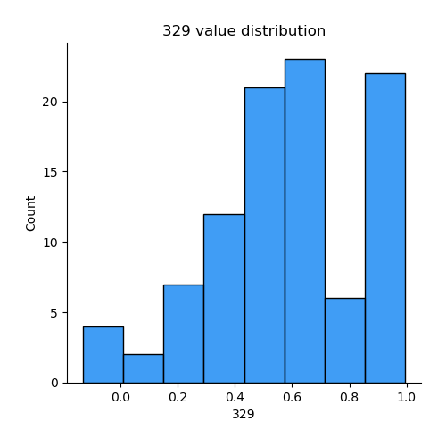
## Feature : 330
- **Feature type** : continous
- **Missing** : 0.0%
- **Unique** : 97
- **Count** :97.0
- **Mean** :0.6331975433748837
- **Std** :0.25740349191640755
- **Min** :-0.12869788273037638
- **25%th Percentile** : 0.4929881485476894
- **50%th Percentile** : 0.6388142571672234
- **75%th Percentile** : 0.8125129325955379
- **Max** :0.9902625144973715

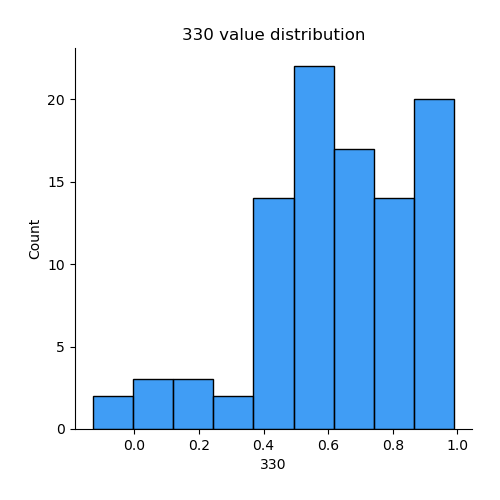
## Feature : 331
- **Feature type** : continous
- **Missing** : 0.0%
- **Unique** : 97
- **Count** :97.0
- **Mean** :0.472605458590255
- **Std** :0.3171242148801779
- **Min** :-0.34513793786949043
- **25%th Percentile** : 0.2869668011193184
- **50%th Percentile** : 0.4178706068261741
- **75%th Percentile** : 0.649315776835694
- **Max** :0.9850833387450845

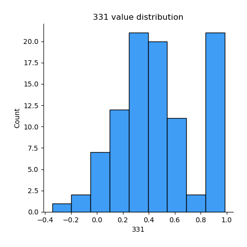
## Feature : 332
- **Feature type** : continous
- **Missing** : 0.0%
- **Unique** : 97
- **Count** :97.0
- **Mean** :0.5746473624486287
- **Std** :0.29947237622331047
- **Min** :-0.2474152793986953
- **25%th Percentile** : 0.4010906515079363
- **50%th Percentile** : 0.5687683388085782
- **75%th Percentile** : 0.7614697705858977
- **Max** :0.9938892681553987

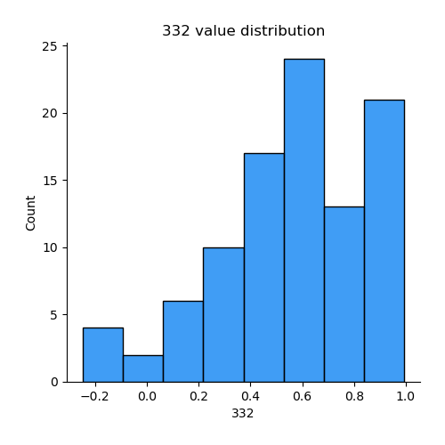
## Feature : 333
- **Feature type** : continous
- **Missing** : 0.0%
- **Unique** : 97
- **Count** :97.0
- **Mean** :0.6666702479693917
- **Std** :0.25359044848705425
- **Min** :-0.10749592151046906
- **25%th Percentile** : 0.5432989340230577
- **50%th Percentile** : 0.6964988440992071
- **75%th Percentile** : 0.8352898293762427
- **Max** :0.9926303327001046

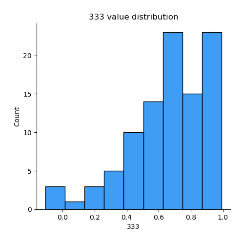
## Feature : 334
- **Feature type** : continous
- **Missing** : 0.0%
- **Unique** : 97
- **Count** :97.0
- **Mean** :0.6902359546446568
- **Std** :0.21239788186111594
- **Min** :0.12396447529155254
- **25%th Percentile** : 0.5559067639567592
- **50%th Percentile** : 0.6657955535048399
- **75%th Percentile** : 0.8261546871893687
- **Max** :0.9923318849427638

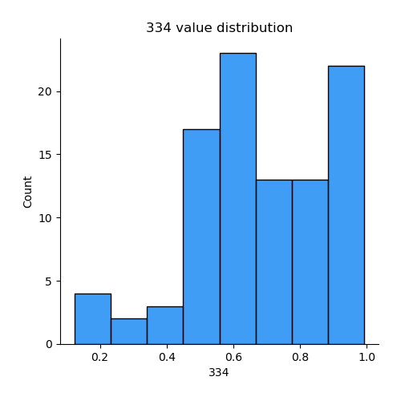
## Feature : 335
- **Feature type** : continous
- **Missing** : 0.0%
- **Unique** : 97
- **Count** :97.0
- **Mean** :0.6697676837730084
- **Std** :0.23930711418274606
- **Min** :-0.0753069668235312
- **25%th Percentile** : 0.539554885286269
- **50%th Percentile** : 0.6666404235627394
- **75%th Percentile** : 0.836656283998867
- **Max** :0.9937734871041142

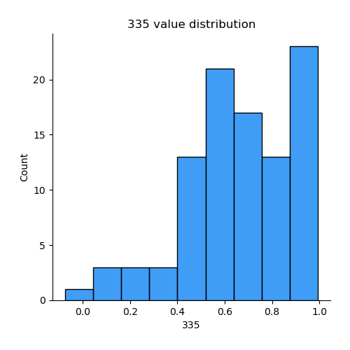
## Feature : 336
- **Feature type** : continous
- **Missing** : 0.0%
- **Unique** : 97
- **Count** :97.0
- **Mean** :0.5754750306254816
- **Std** :0.24624523629825892
- **Min** :0.0159929343187787
- **25%th Percentile** : 0.4069280475220669
- **50%th Percentile** : 0.5471580521622919
- **75%th Percentile** : 0.7488827319574763
- **Max** :0.9870222573191023

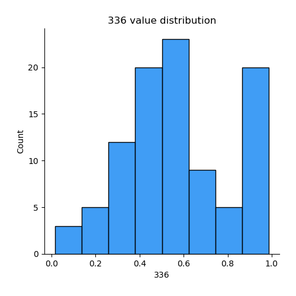
## Feature : 337
- **Feature type** : continous
- **Missing** : 0.0%
- **Unique** : 97
- **Count** :97.0
- **Mean** :0.6064592751874258
- **Std** :0.23661079674776353
- **Min** :0.10188670234642697
- **25%th Percentile** : 0.43547675542157727
- **50%th Percentile** : 0.5843711560324676
- **75%th Percentile** : 0.7474986042010164
- **Max** :0.9842592789400015

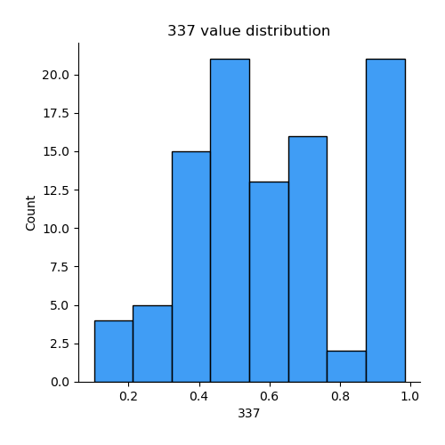
## Feature : 338
- **Feature type** : continous
- **Missing** : 0.0%
- **Unique** : 97
- **Count** :97.0
- **Mean** :0.5265020460470357
- **Std** :0.3205357010209192
- **Min** :-0.3392692786722222
- **25%th Percentile** : 0.3707769957046851
- **50%th Percentile** : 0.501624380800254
- **75%th Percentile** : 0.7732031770982853
- **Max** :0.9899327431792327

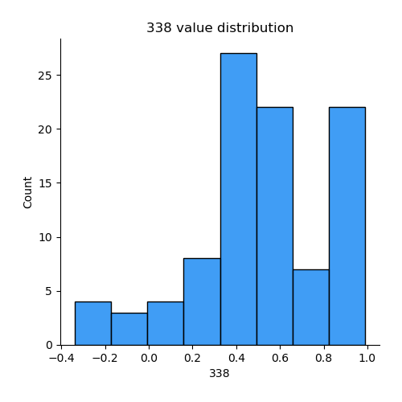
## Feature : 339
- **Feature type** : continous
- **Missing** : 0.0%
- **Unique** : 97
- **Count** :97.0
- **Mean** :0.5108608107623176
- **Std** :0.30691312087783235
- **Min** :-0.324329146275968
- **25%th Percentile** : 0.3305053805233568
- **50%th Percentile** : 0.5108780625655042
- **75%th Percentile** : 0.6501728838404782
- **Max** :0.9889391516181361

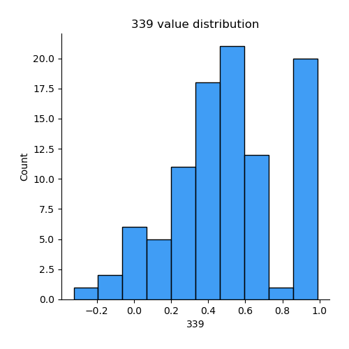
## Feature : 340
- **Feature type** : continous
- **Missing** : 0.0%
- **Unique** : 97
- **Count** :97.0
- **Mean** :0.5948836290582904
- **Std** :0.26214449914176824
- **Min** :0.07883753129218593
- **25%th Percentile** : 0.44031177268318994
- **50%th Percentile** : 0.574872549060438
- **75%th Percentile** : 0.7888484054001901
- **Max** :0.9864070133762448

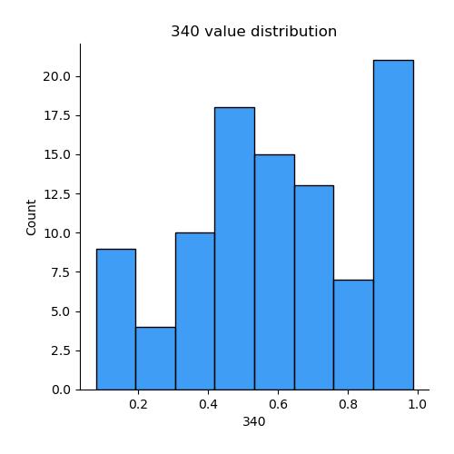
## Feature : 341
- **Feature type** : continous
- **Missing** : 0.0%
- **Unique** : 97
- **Count** :97.0
- **Mean** :0.48167415407885644
- **Std** :0.32480961805562625
- **Min** :-0.3279763312760552
- **25%th Percentile** : 0.28179020474042543
- **50%th Percentile** : 0.5097627982506702
- **75%th Percentile** : 0.703179260384912
- **Max** :0.9829674870358049

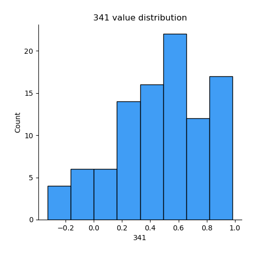
## Feature : 342
- **Feature type** : continous
- **Missing** : 0.0%
- **Unique** : 97
- **Count** :97.0
- **Mean** :0.7380986705173959
- **Std** :0.1935718274393338
- **Min** :0.12212820767064743
- **25%th Percentile** : 0.6196524162521263
- **50%th Percentile** : 0.717783068489723
- **75%th Percentile** : 0.8917342919275921
- **Max** :0.9958554449797394

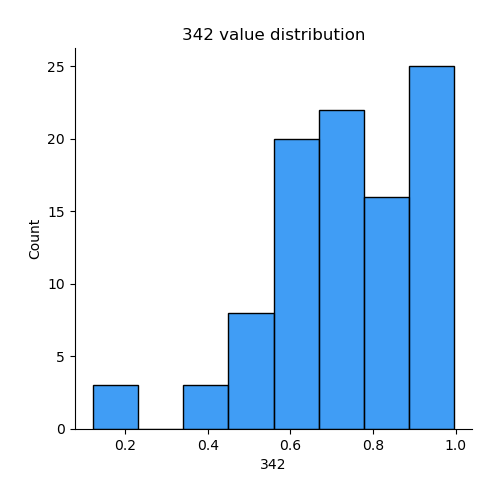
## Feature : 343
- **Feature type** : continous
- **Missing** : 0.0%
- **Unique** : 97
- **Count** :97.0
- **Mean** :0.6068670526423995
- **Std** :0.2838232506194467
- **Min** :-0.13319470491499089
- **25%th Percentile** : 0.4300114843647611
- **50%th Percentile** : 0.6282303241758904
- **75%th Percentile** : 0.8109303226947661
- **Max** :0.9915584856607348

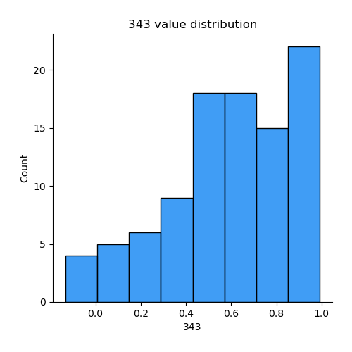
## Feature : 344
- **Feature type** : continous
- **Missing** : 0.0%
- **Unique** : 97
- **Count** :97.0
- **Mean** :0.733159018863422
- **Std** :0.22611894564240406
- **Min** :0.027498716173519646
- **25%th Percentile** : 0.6387980610652786
- **50%th Percentile** : 0.774044760214934
- **75%th Percentile** : 0.8936208504840937
- **Max** :0.9969471031498185

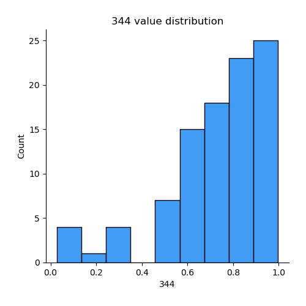
## Feature : 345
- **Feature type** : continous
- **Missing** : 0.0%
- **Unique** : 97
- **Count** :97.0
- **Mean** :0.5768636911477557
- **Std** :0.283672577671382
- **Min** :-0.25678772889114415
- **25%th Percentile** : 0.4207773110797984
- **50%th Percentile** : 0.5446553268051447
- **75%th Percentile** : 0.7472363779517621
- **Max** :0.9911138100208988

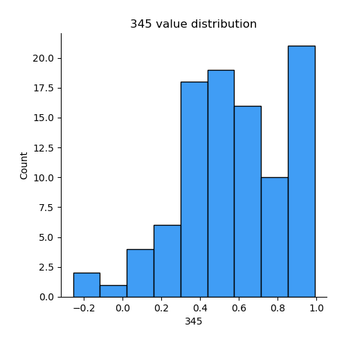
## Feature : 346
- **Feature type** : continous
- **Missing** : 0.0%
- **Unique** : 97
- **Count** :97.0
- **Mean** :0.5992006721466651
- **Std** :0.2657893737160713
- **Min** :-0.23940265675082312
- **25%th Percentile** : 0.4361593452048519
- **50%th Percentile** : 0.5911942847944639
- **75%th Percentile** : 0.807582475128566
- **Max** :0.9846109279333722

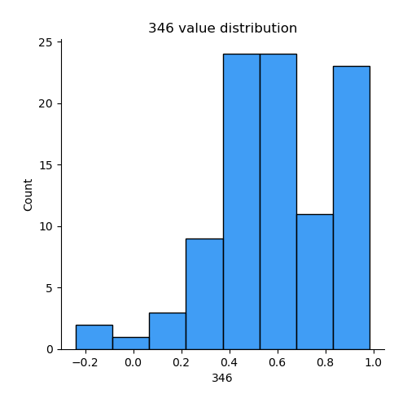
## Feature : 347
- **Feature type** : continous
- **Missing** : 0.0%
- **Unique** : 97
- **Count** :97.0
- **Mean** :0.6402319922724597
- **Std** :0.24708462658533292
- **Min** :-0.11245894721087839
- **25%th Percentile** : 0.468001933363243
- **50%th Percentile** : 0.6514969796449956
- **75%th Percentile** : 0.845055250769078
- **Max** :0.99339722973537

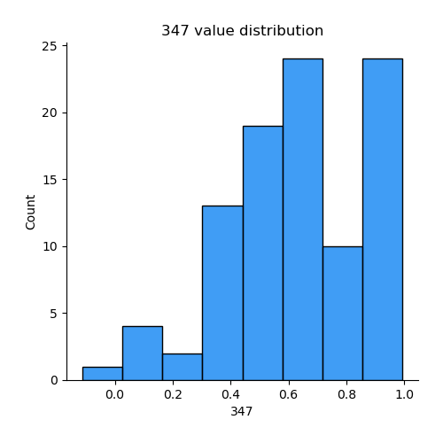
## Feature : 348
- **Feature type** : continous
- **Missing** : 0.0%
- **Unique** : 97
- **Count** :97.0
- **Mean** :0.6530937309006615
- **Std** :0.2303778749798733
- **Min** :0.06357093309356932
- **25%th Percentile** : 0.5102423054279964
- **50%th Percentile** : 0.6400005126316433
- **75%th Percentile** : 0.8066113201525391
- **Max** :0.9920159545829685

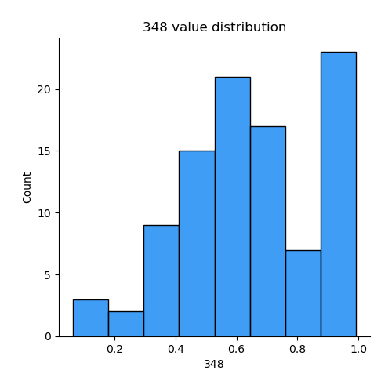
## Feature : 349
- **Feature type** : continous
- **Missing** : 0.0%
- **Unique** : 97
- **Count** :97.0
- **Mean** :0.6404610588056816
- **Std** :0.28525798708948075
- **Min** :-0.3135413295624375
- **25%th Percentile** : 0.49131016830633617
- **50%th Percentile** : 0.6400968430012148
- **75%th Percentile** : 0.8395360557657824
- **Max** :0.9950149604227237

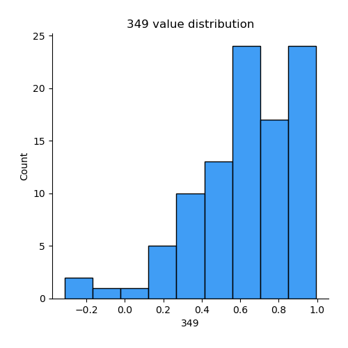
## Feature : 350
- **Feature type** : continous
- **Missing** : 0.0%
- **Unique** : 97
- **Count** :97.0
- **Mean** :0.48059058596172893
- **Std** :0.3490307610211765
- **Min** :-0.244776154802808
- **25%th Percentile** : 0.23101922353636606
- **50%th Percentile** : 0.49226055346241165
- **75%th Percentile** : 0.7470025802957969
- **Max** :0.9924911049143693

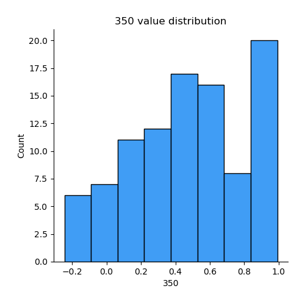
## Feature : 351
- **Feature type** : continous
- **Missing** : 0.0%
- **Unique** : 97
- **Count** :97.0
- **Mean** :0.6175194795112932
- **Std** :0.26384572897454905
- **Min** :-0.1803222062473653
- **25%th Percentile** : 0.4608864613938742
- **50%th Percentile** : 0.6062381274573925
- **75%th Percentile** : 0.8621256733500442
- **Max** :0.992919534881463

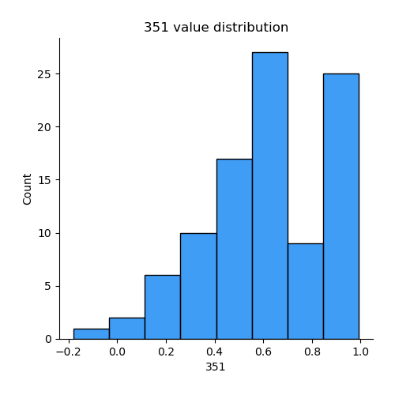
## Feature : 352
- **Feature type** : continous
- **Missing** : 0.0%
- **Unique** : 97
- **Count** :97.0
- **Mean** :0.6023932965250747
- **Std** :0.2465172897245554
- **Min** :-0.13393095229505145
- **25%th Percentile** : 0.44844793172701575
- **50%th Percentile** : 0.5806644318369771
- **75%th Percentile** : 0.7427634649484495
- **Max** :0.9860948619617924

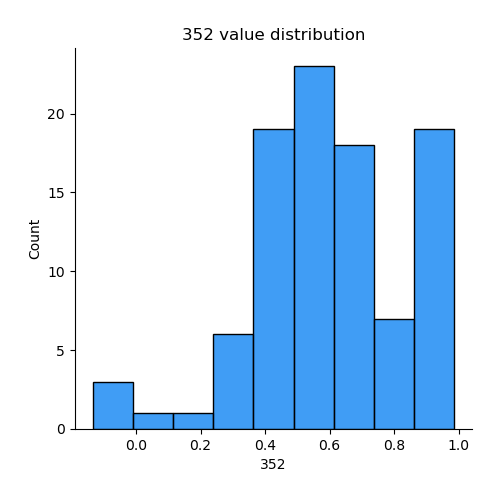
## Feature : 353
- **Feature type** : continous
- **Missing** : 0.0%
- **Unique** : 97
- **Count** :97.0
- **Mean** :0.4951117994574194
- **Std** :0.3573089819621176
- **Min** :-0.39998651355986936
- **25%th Percentile** : 0.2953226222497783
- **50%th Percentile** : 0.5077684806788915
- **75%th Percentile** : 0.7490164999400463
- **Max** :0.9909409674288459

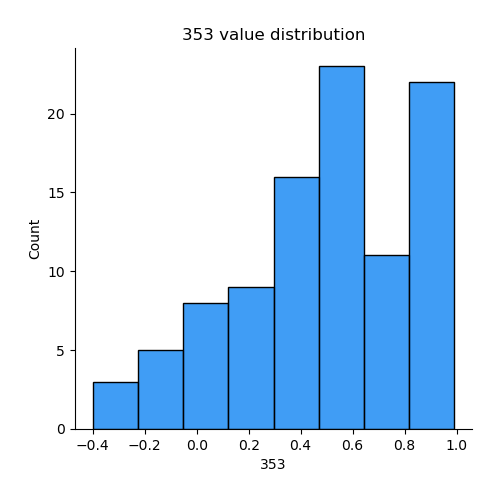
## Feature : 354
- **Feature type** : continous
- **Missing** : 0.0%
- **Unique** : 97
- **Count** :97.0
- **Mean** :0.5634500177251693
- **Std** :0.294249954296954
- **Min** :-0.2665455072177172
- **25%th Percentile** : 0.4111168815568816
- **50%th Percentile** : 0.5390604316616922
- **75%th Percentile** : 0.7684858654604201
- **Max** :0.9877244704235709

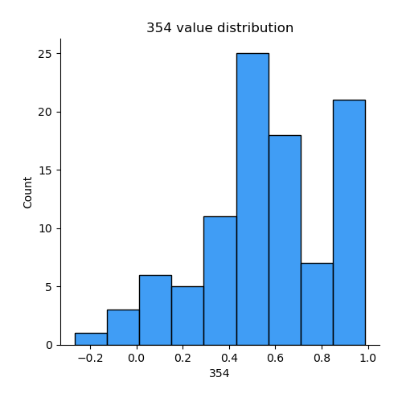
## Feature : 355
- **Feature type** : continous
- **Missing** : 0.0%
- **Unique** : 97
- **Count** :97.0
- **Mean** :0.5347959140250668
- **Std** :0.33376260556207576
- **Min** :-0.3211424368667067
- **25%th Percentile** : 0.35484120587243223
- **50%th Percentile** : 0.5631217748410889
- **75%th Percentile** : 0.767651187395498
- **Max** :0.9917077422003507

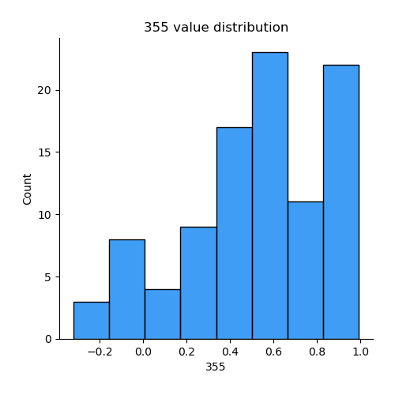
## Feature : 356
- **Feature type** : continous
- **Missing** : 0.0%
- **Unique** : 97
- **Count** :97.0
- **Mean** :0.6129440087761827
- **Std** :0.2602962213941148
- **Min** :0.0006114981183705843
- **25%th Percentile** : 0.43911996045189655
- **50%th Percentile** : 0.5822629595580385
- **75%th Percentile** : 0.8092634480282792
- **Max** :0.9911441386870512

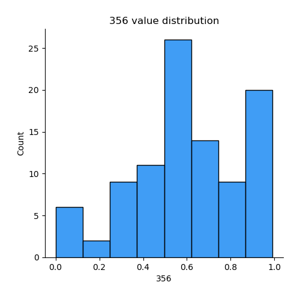
## Feature : 357
- **Feature type** : continous
- **Missing** : 0.0%
- **Unique** : 97
- **Count** :97.0
- **Mean** :0.4080189003439861
- **Std** :0.34489559492418126
- **Min** :-0.44726810555776786
- **25%th Percentile** : 0.16959989014293755
- **50%th Percentile** : 0.3195487230317534
- **75%th Percentile** : 0.6459643894837341
- **Max** :0.9859753900797813

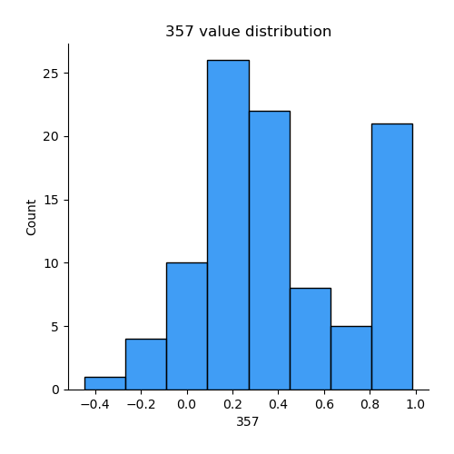
## Feature : 358
- **Feature type** : continous
- **Missing** : 0.0%
- **Unique** : 97
- **Count** :97.0
- **Mean** :0.5396481594571618
- **Std** :0.32506361142339235
- **Min** :-0.2783827540631126
- **25%th Percentile** : 0.3842501858679451
- **50%th Percentile** : 0.5250970950720545
- **75%th Percentile** : 0.7302066778259657
- **Max** :0.9919381188095044

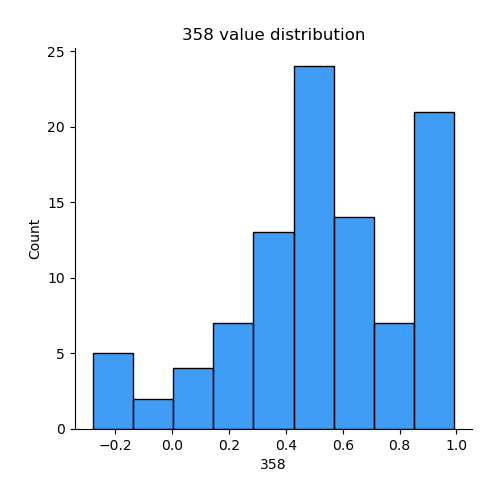
## Feature : 359
- **Feature type** : continous
- **Missing** : 0.0%
- **Unique** : 97
- **Count** :97.0
- **Mean** :0.6200343947357124
- **Std** :0.27614482323950235
- **Min** :-0.287005472821541
- **25%th Percentile** : 0.46910573503998343
- **50%th Percentile** : 0.6236122547605769
- **75%th Percentile** : 0.799907132714996
- **Max** :0.9912633760596986

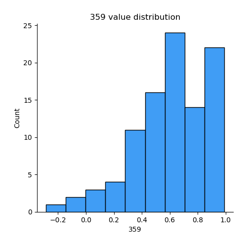
## Feature : 360
- **Feature type** : continous
- **Missing** : 0.0%
- **Unique** : 97
- **Count** :97.0
- **Mean** :0.5932346398574143
- **Std** :0.29690918000756505
- **Min** :-0.29152059602038427
- **25%th Percentile** : 0.4488598385742111
- **50%th Percentile** : 0.5943191564542162
- **75%th Percentile** : 0.7962823327101035
- **Max** :0.989736609780724

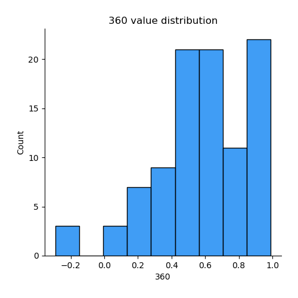
## Feature : 361
- **Feature type** : continous
- **Missing** : 0.0%
- **Unique** : 97
- **Count** :97.0
- **Mean** :0.5551296870909034
- **Std** :0.3136831043488853
- **Min** :-0.23655325865561055
- **25%th Percentile** : 0.3706754984156736
- **50%th Percentile** : 0.5702532488976283
- **75%th Percentile** : 0.795170738015412
- **Max** :0.9909143998518608

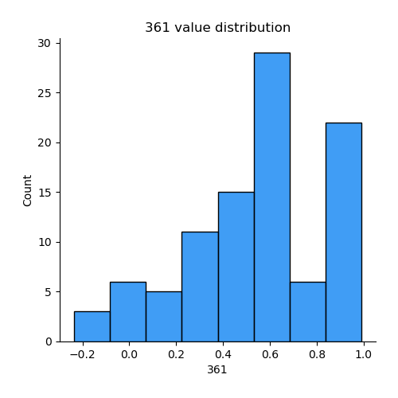
## Feature : 362
- **Feature type** : continous
- **Missing** : 0.0%
- **Unique** : 97
- **Count** :97.0
- **Mean** :0.5114563633039715
- **Std** :0.2914840748591494
- **Min** :-0.1915718864156805
- **25%th Percentile** : 0.34550433746536885
- **50%th Percentile** : 0.4900291715916958
- **75%th Percentile** : 0.7065220840855275
- **Max** :0.9849138101524022

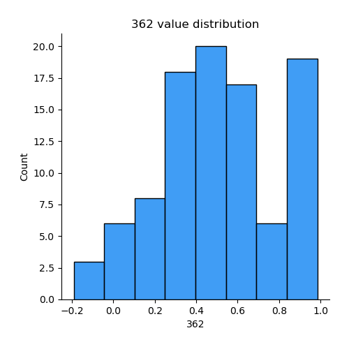
## Feature : 363
- **Feature type** : continous
- **Missing** : 0.0%
- **Unique** : 97
- **Count** :97.0
- **Mean** :0.49188158338923804
- **Std** :0.3111925922624212
- **Min** :-0.10745456664944471
- **25%th Percentile** : 0.28132778348734555
- **50%th Percentile** : 0.4318907965076102
- **75%th Percentile** : 0.7165144632713953
- **Max** :0.9862544070886035

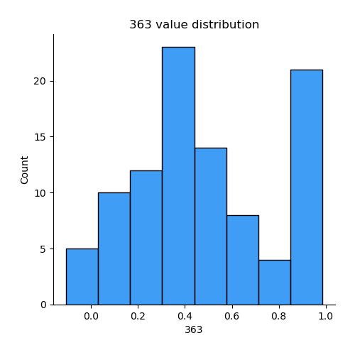
## Feature : 371
- **Feature type** : continous
- **Missing** : 0.0%
- **Unique** : 3
- **Count** :97.0
- **Mean** :1.0
- **Std** :9.681352727116468e-17
- **Min** :0.9999999999999998
- **25%th Percentile** : 0.9999999999999999
- **50%th Percentile** : 1.0
- **75%th Percentile** : 1.0
- **Max** :1.0

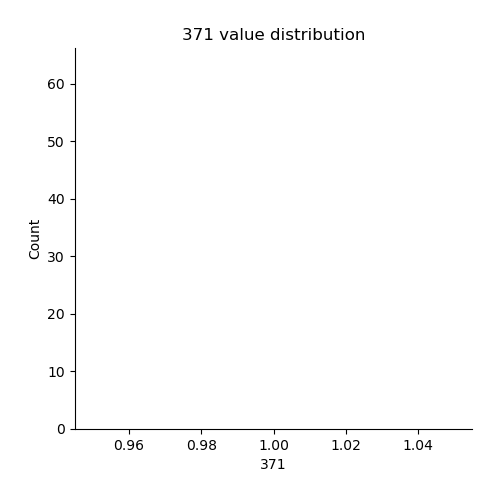
## Feature : 372
- **Feature type** : continous
- **Missing** : 0.0%
- **Unique** : 97
- **Count** :97.0
- **Mean** :0.6251791484744939
- **Std** :0.24610857980155687
- **Min** :0.0381399438656307
- **25%th Percentile** : 0.4608687708033025
- **50%th Percentile** : 0.6226947917965668
- **75%th Percentile** : 0.8270789244754678
- **Max** :0.9838373619376521

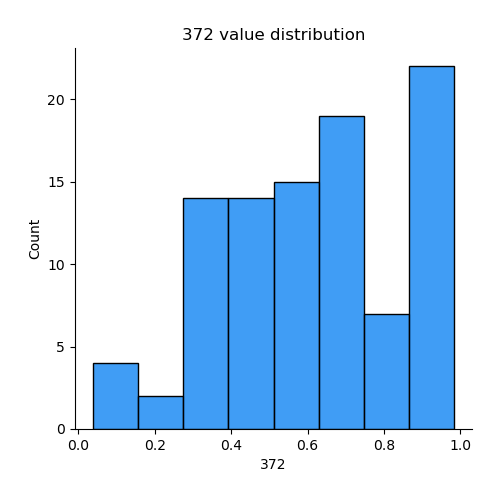
## Feature : 373
- **Feature type** : continous
- **Missing** : 0.0%
- **Unique** : 97
- **Count** :97.0
- **Mean** :0.5973787278420342
- **Std** :0.24511520118411165
- **Min** :-0.02448009377845743
- **25%th Percentile** : 0.43148443254960234
- **50%th Percentile** : 0.5863641124699653
- **75%th Percentile** : 0.7521597719393006
- **Max** :0.9845854365654088

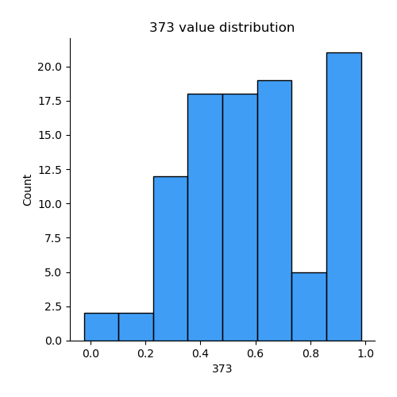
## Feature : 374
- **Feature type** : continous
- **Missing** : 0.0%
- **Unique** : 97
- **Count** :97.0
- **Mean** :0.6587193200523113
- **Std** :0.21971543425149567
- **Min** :0.003370149927760806
- **25%th Percentile** : 0.5207442481054058
- **50%th Percentile** : 0.6559662930843172
- **75%th Percentile** : 0.7945344435026818
- **Max** :0.9924510361732645

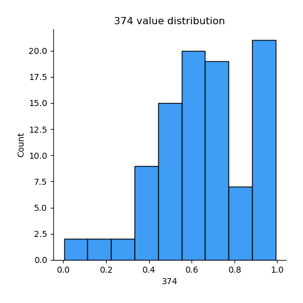
## Feature : 375
- **Feature type** : continous
- **Missing** : 0.0%
- **Unique** : 97
- **Count** :97.0
- **Mean** :0.6145611688452491
- **Std** :0.25906928944846924
- **Min** :-0.019817283941502582
- **25%th Percentile** : 0.438090590927094
- **50%th Percentile** : 0.6025146890737422
- **75%th Percentile** : 0.7805876029491967
- **Max** :0.993061794605735

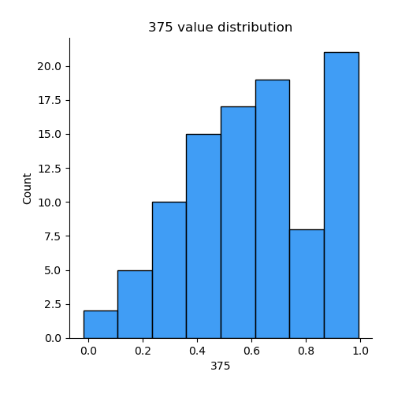
## Feature : 376
- **Feature type** : continous
- **Missing** : 0.0%
- **Unique** : 97
- **Count** :97.0
- **Mean** :0.6372607898724313
- **Std** :0.253050153550895
- **Min** :0.02469160653366993
- **25%th Percentile** : 0.4722451175697181
- **50%th Percentile** : 0.6564855199849478
- **75%th Percentile** : 0.8010532765460704
- **Max** :0.996775712774948

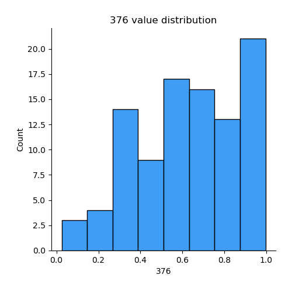
## Feature : 377
- **Feature type** : continous
- **Missing** : 0.0%
- **Unique** : 97
- **Count** :97.0
- **Mean** :0.5845901276399489
- **Std** :0.26348394975195644
- **Min** :0.012443494346793116
- **25%th Percentile** : 0.4173281904846065
- **50%th Percentile** : 0.5353987045340348
- **75%th Percentile** : 0.7699351247901101
- **Max** :0.9931851155440117

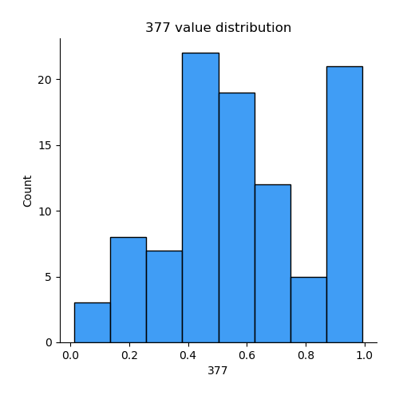
## Feature : 378
- **Feature type** : continous
- **Missing** : 0.0%
- **Unique** : 97
- **Count** :97.0
- **Mean** :0.6350368868571054
- **Std** :0.21989384463538827
- **Min** :-0.044881424985733186
- **25%th Percentile** : 0.4933246710922702
- **50%th Percentile** : 0.6235346444576592
- **75%th Percentile** : 0.7679811670541148
- **Max** :0.9881567346786615

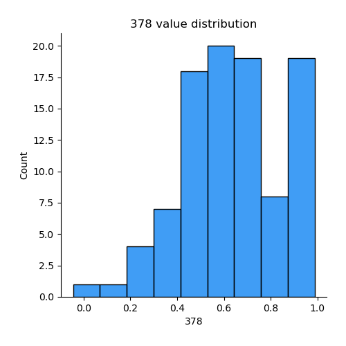
## Feature : 379
- **Feature type** : continous
- **Missing** : 0.0%
- **Unique** : 97
- **Count** :97.0
- **Mean** :0.7361123064488604
- **Std** :0.18014576587983686
- **Min** :0.2742094481908659
- **25%th Percentile** : 0.6121166224773873
- **50%th Percentile** : 0.7338865251904299
- **75%th Percentile** : 0.8591705635580685
- **Max** :0.9960702242510239

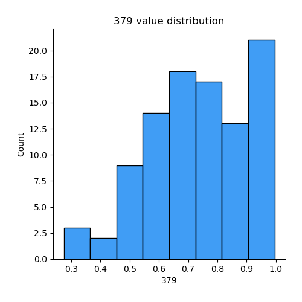
## Feature : 380
- **Feature type** : continous
- **Missing** : 0.0%
- **Unique** : 97
- **Count** :97.0
- **Mean** :0.7168716197342792
- **Std** :0.20745112094812565
- **Min** :0.06813583101016586
- **25%th Percentile** : 0.5862657119356439
- **50%th Percentile** : 0.741160950239003
- **75%th Percentile** : 0.8426455021811956
- **Max** :0.9942129266357963

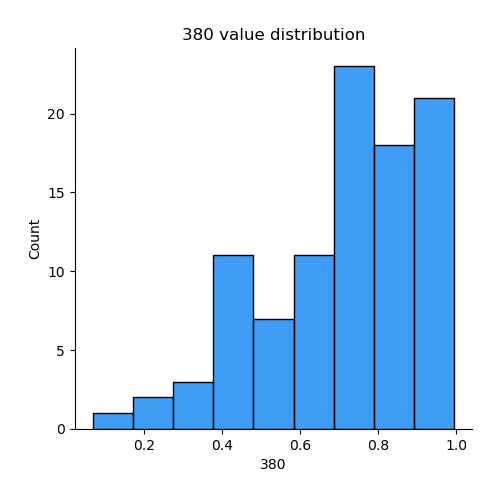
## Feature : 381
- **Feature type** : continous
- **Missing** : 0.0%
- **Unique** : 97
- **Count** :97.0
- **Mean** :0.7624415802389138
- **Std** :0.17322817995932363
- **Min** :0.23819895909727687
- **25%th Percentile** : 0.6646490668018885
- **50%th Percentile** : 0.7828045202898036
- **75%th Percentile** : 0.8763534165135047
- **Max** :0.9974013072289578

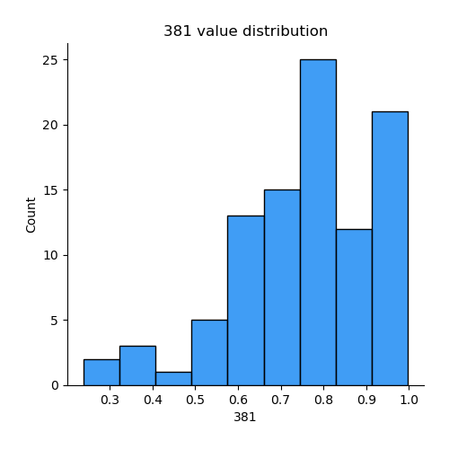
## Feature : 382
- **Feature type** : continous
- **Missing** : 0.0%
- **Unique** : 97
- **Count** :97.0
- **Mean** :0.7010686980818414
- **Std** :0.1981222256231728
- **Min** :0.09466344033152217
- **25%th Percentile** : 0.5745723722475358
- **50%th Percentile** : 0.6793346596976803
- **75%th Percentile** : 0.8445361031374597
- **Max** :0.9902194718196878

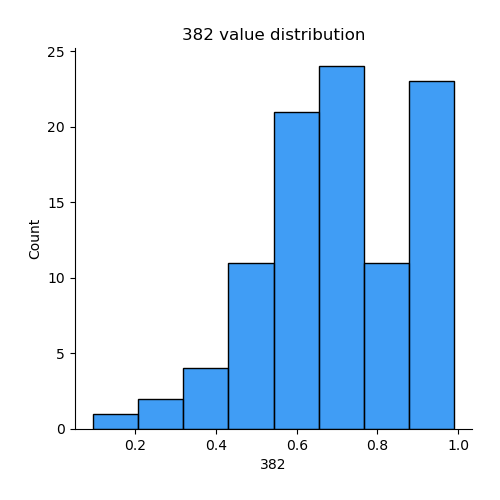
## Feature : 383
- **Feature type** : continous
- **Missing** : 0.0%
- **Unique** : 97
- **Count** :97.0
- **Mean** :0.5956471299815411
- **Std** :0.2744882217627968
- **Min** :0.060701359221162154
- **25%th Percentile** : 0.37186408201247284
- **50%th Percentile** : 0.6317272895729276
- **75%th Percentile** : 0.8131788734235111
- **Max** :0.9926672575071058

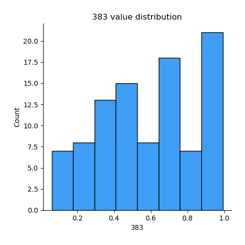
## Feature : 384
- **Feature type** : continous
- **Missing** : 0.0%
- **Unique** : 97
- **Count** :97.0
- **Mean** :0.6472178615552086
- **Std** :0.2519397399435194
- **Min** :-0.21551645696259047
- **25%th Percentile** : 0.496278102161346
- **50%th Percentile** : 0.6398539391529755
- **75%th Percentile** : 0.8233153366457033
- **Max** :0.9965496809941725

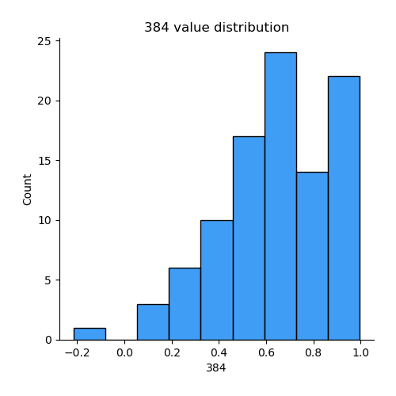
## Feature : 385
- **Feature type** : continous
- **Missing** : 0.0%
- **Unique** : 97
- **Count** :97.0
- **Mean** :0.6765470969800823
- **Std** :0.20876280804220287
- **Min** :0.1377395538311467
- **25%th Percentile** : 0.5297017055577251
- **50%th Percentile** : 0.6743057499907744
- **75%th Percentile** : 0.8029823923742
- **Max** :0.9948481545598618

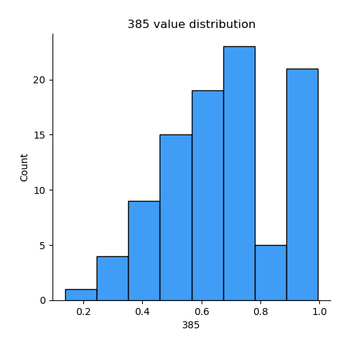
## Feature : 386
- **Feature type** : continous
- **Missing** : 0.0%
- **Unique** : 97
- **Count** :97.0
- **Mean** :0.8005735882155366
- **Std** :0.15667141175695307
- **Min** :0.2208223055443684
- **25%th Percentile** : 0.7043626222177971
- **50%th Percentile** : 0.8004172642508389
- **75%th Percentile** : 0.9294437732857078
- **Max** :0.9970853440201906

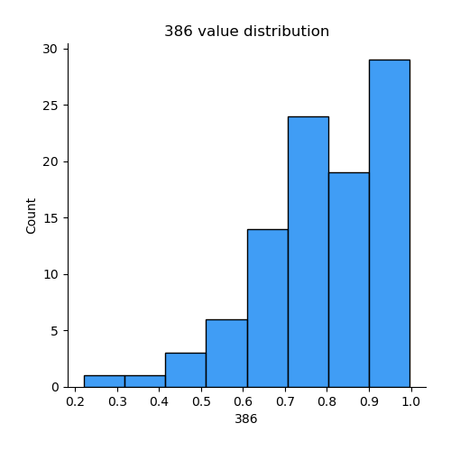
## Feature : 387
- **Feature type** : continous
- **Missing** : 0.0%
- **Unique** : 97
- **Count** :97.0
- **Mean** :0.7902396317279827
- **Std** :0.14063086224947088
- **Min** :0.4037911161933147
- **25%th Percentile** : 0.6789580020837785
- **50%th Percentile** : 0.7854826889662916
- **75%th Percentile** : 0.8834402517973593
- **Max** :0.9961107470528181

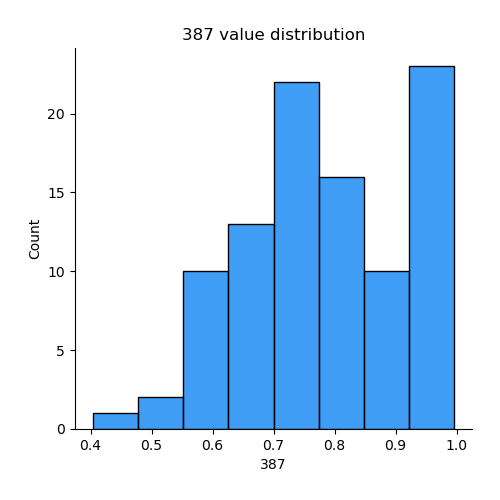
## Feature : 388
- **Feature type** : continous
- **Missing** : 0.0%
- **Unique** : 97
- **Count** :97.0
- **Mean** :0.49804972808345144
- **Std** :0.2920579126549599
- **Min** :-0.13180105219113003
- **25%th Percentile** : 0.2655442473199871
- **50%th Percentile** : 0.4591850544789185
- **75%th Percentile** : 0.7173246424540531
- **Max** :0.9832318424045807

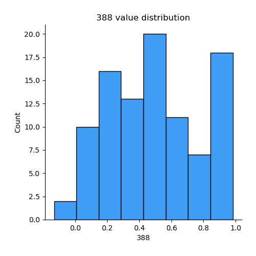
## Feature : 389
- **Feature type** : continous
- **Missing** : 0.0%
- **Unique** : 97
- **Count** :97.0
- **Mean** :0.772284335285871
- **Std** :0.1526193006117137
- **Min** :0.4191057276218154
- **25%th Percentile** : 0.6559965582449205
- **50%th Percentile** : 0.7739215089779504
- **75%th Percentile** : 0.8738142376073705
- **Max** :0.9927422195840456

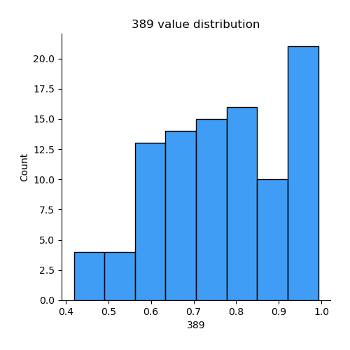
## Feature : 390
- **Feature type** : continous
- **Missing** : 0.0%
- **Unique** : 97
- **Count** :97.0
- **Mean** :0.6179131804635041
- **Std** :0.2703183333197594
- **Min** :-0.10724741294950163
- **25%th Percentile** : 0.4483490750241018
- **50%th Percentile** : 0.6255433944849117
- **75%th Percentile** : 0.7948678940814554
- **Max** :0.9930841097211602

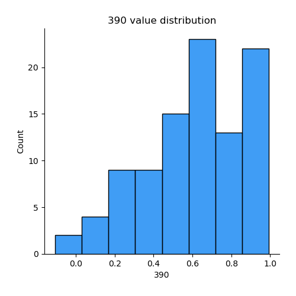
## Feature : 391
- **Feature type** : continous
- **Missing** : 0.0%
- **Unique** : 97
- **Count** :97.0
- **Mean** :0.6964144037129375
- **Std** :0.20762746000229337
- **Min** :0.08105052575198092
- **25%th Percentile** : 0.5802982613169395
- **50%th Percentile** : 0.6986152448705123
- **75%th Percentile** : 0.8319422868416589
- **Max** :0.9942875777523958

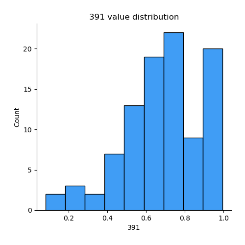
## Feature : 392
- **Feature type** : continous
- **Missing** : 0.0%
- **Unique** : 97
- **Count** :97.0
- **Mean** :0.6358888535120375
- **Std** :0.2342050294960713
- **Min** :-0.030033030897738885
- **25%th Percentile** : 0.47310664612771486
- **50%th Percentile** : 0.6333883514111232
- **75%th Percentile** : 0.785066468681872
- **Max** :0.9901853725098937

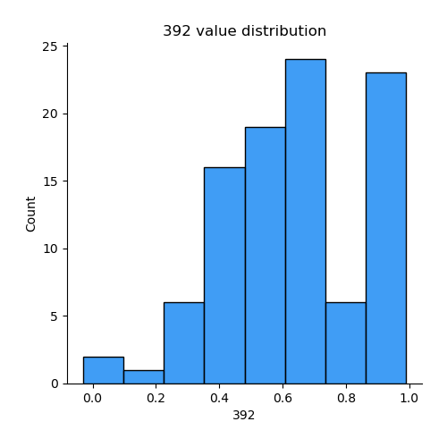
## Feature : 393
- **Feature type** : continous
- **Missing** : 0.0%
- **Unique** : 97
- **Count** :97.0
- **Mean** :0.442678978897709
- **Std** :0.32229603752952707
- **Min** :-0.5345261330107405
- **25%th Percentile** : 0.19128079857579725
- **50%th Percentile** : 0.4493400516180926
- **75%th Percentile** : 0.6669972044865786
- **Max** :0.9874527887018693

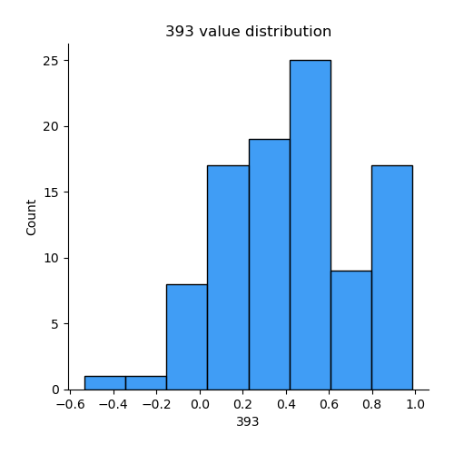
## Feature : 394
- **Feature type** : continous
- **Missing** : 0.0%
- **Unique** : 97
- **Count** :97.0
- **Mean** :0.6171140968564024
- **Std** :0.2517473910412321
- **Min** :-0.14642016494098067
- **25%th Percentile** : 0.4720733337929711
- **50%th Percentile** : 0.5898951791936424
- **75%th Percentile** : 0.7828310885799731
- **Max** :0.9933450638385146

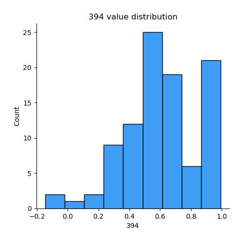
## Feature : 395
- **Feature type** : continous
- **Missing** : 0.0%
- **Unique** : 97
- **Count** :97.0
- **Mean** :0.6222871553427379
- **Std** :0.2648213292587827
- **Min** :-0.18940335562238084
- **25%th Percentile** : 0.4419573711117492
- **50%th Percentile** : 0.6315478317118447
- **75%th Percentile** : 0.8377191308761563
- **Max** :0.9934048226635914

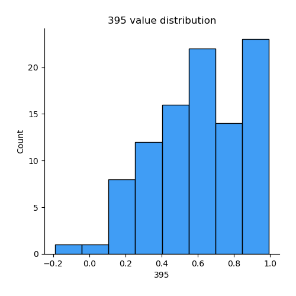
## Feature : 396
- **Feature type** : continous
- **Missing** : 0.0%
- **Unique** : 97
- **Count** :97.0
- **Mean** :0.5527968735186438
- **Std** :0.28945087596198005
- **Min** :-0.17837298152489645
- **25%th Percentile** : 0.39076315937694744
- **50%th Percentile** : 0.5602409980139225
- **75%th Percentile** : 0.7225506015564508
- **Max** :0.9920856391097846

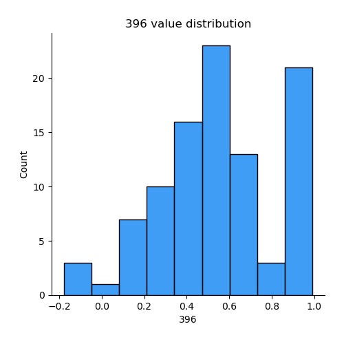
## Feature : 397
- **Feature type** : continous
- **Missing** : 0.0%
- **Unique** : 97
- **Count** :97.0
- **Mean** :0.8344647312888431
- **Std** :0.16743973102868137
- **Min** :0.06858693420442082
- **25%th Percentile** : 0.7721963531104439
- **50%th Percentile** : 0.8641518849295738
- **75%th Percentile** : 0.9496352167827504
- **Max** :0.998216760430386

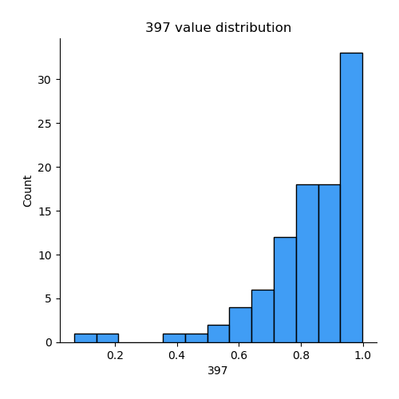
## Feature : 398
- **Feature type** : continous
- **Missing** : 0.0%
- **Unique** : 97
- **Count** :97.0
- **Mean** :0.636685975210975
- **Std** :0.2538319558528465
- **Min** :-0.08322897451153216
- **25%th Percentile** : 0.4531923540773982
- **50%th Percentile** : 0.6429560918623765
- **75%th Percentile** : 0.8314717888227162
- **Max** :0.987887705506032

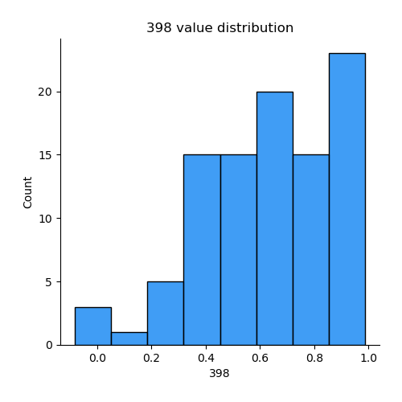
## Feature : 399
- **Feature type** : continous
- **Missing** : 0.0%
- **Unique** : 97
- **Count** :97.0
- **Mean** :0.5840882217562778
- **Std** :0.2525253086458032
- **Min** :0.03495169681579709
- **25%th Percentile** : 0.40539069782692255
- **50%th Percentile** : 0.5545203594058683
- **75%th Percentile** : 0.7401089294881156
- **Max** :0.9879831965050032

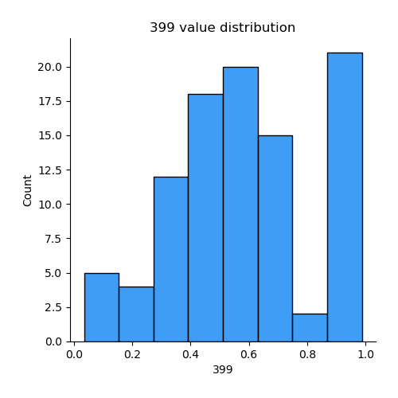
## Feature : 400
- **Feature type** : continous
- **Missing** : 0.0%
- **Unique** : 97
- **Count** :97.0
- **Mean** :0.6508031880700454
- **Std** :0.23364419279098023
- **Min** :-0.15331315604690732
- **25%th Percentile** : 0.5178382029877041
- **50%th Percentile** : 0.6451249509368038
- **75%th Percentile** : 0.7821894623399668
- **Max** :0.9933083066444478

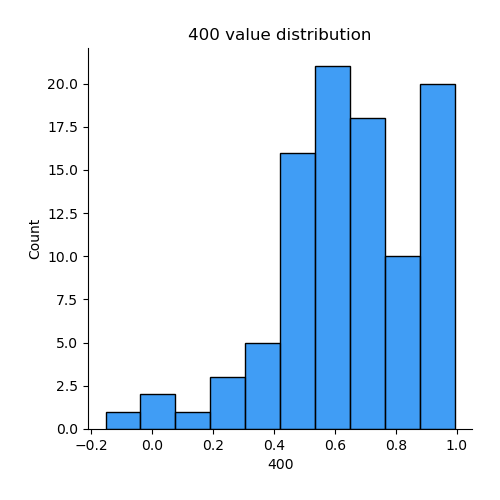
## Feature : 401
- **Feature type** : continous
- **Missing** : 0.0%
- **Unique** : 97
- **Count** :97.0
- **Mean** :0.5824789737467124
- **Std** :0.29766783880698316
- **Min** :-0.243065288504222
- **25%th Percentile** : 0.4104138649170435
- **50%th Percentile** : 0.6062512232700987
- **75%th Percentile** : 0.7785222098858958
- **Max** :0.9946267403778409

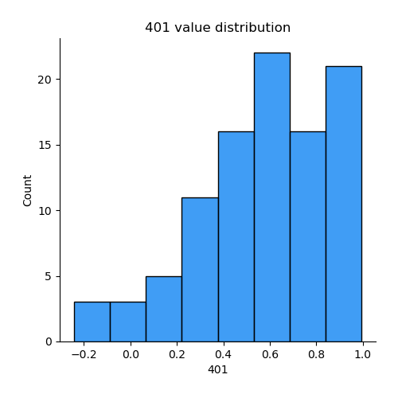
## Feature : 402
- **Feature type** : continous
- **Missing** : 0.0%
- **Unique** : 97
- **Count** :97.0
- **Mean** :0.6296031644436542
- **Std** :0.2610676915657152
- **Min** :-0.004468590754334762
- **25%th Percentile** : 0.4846734460493189
- **50%th Percentile** : 0.6556170500384899
- **75%th Percentile** : 0.8046168713221713
- **Max** :0.9970937349799092

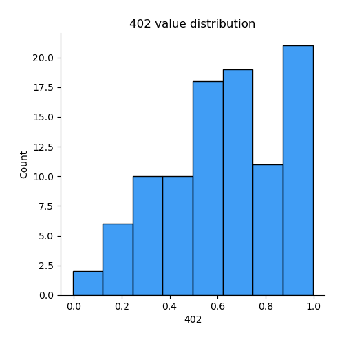
## Feature : 403
- **Feature type** : continous
- **Missing** : 0.0%
- **Unique** : 97
- **Count** :97.0
- **Mean** :0.5540829966691654
- **Std** :0.28845022749566335
- **Min** :-0.19313436828859473
- **25%th Percentile** : 0.39420417428455257
- **50%th Percentile** : 0.49976050718188486
- **75%th Percentile** : 0.7426554444710133
- **Max** :0.9921847041679297

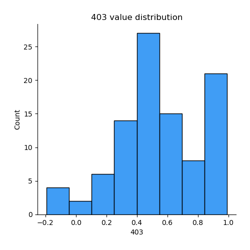
## Feature : 404
- **Feature type** : continous
- **Missing** : 0.0%
- **Unique** : 97
- **Count** :97.0
- **Mean** :0.6368216974856771
- **Std** :0.2187306413564746
- **Min** :-0.06394545468496024
- **25%th Percentile** : 0.5129823868007952
- **50%th Percentile** : 0.6268397609686198
- **75%th Percentile** : 0.765208237174695
- **Max** :0.9883156250697585

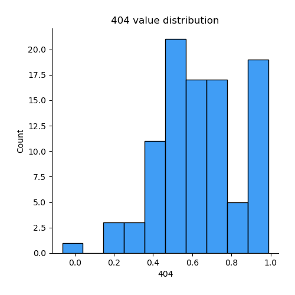
## Feature : 405
- **Feature type** : continous
- **Missing** : 0.0%
- **Unique** : 97
- **Count** :97.0
- **Mean** :0.6620344953352225
- **Std** :0.25150210685867347
- **Min** :-0.061511933707177176
- **25%th Percentile** : 0.49023121793703767
- **50%th Percentile** : 0.6691401961660174
- **75%th Percentile** : 0.851153821928099
- **Max** :0.9965373400784867

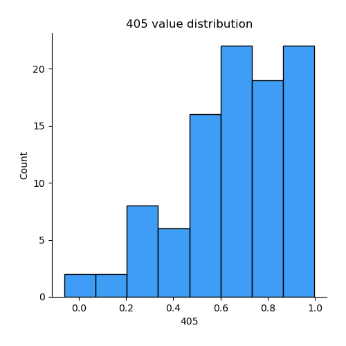
## Feature : 406
- **Feature type** : continous
- **Missing** : 0.0%
- **Unique** : 97
- **Count** :97.0
- **Mean** :0.711708605411733
- **Std** :0.2074161808168761
- **Min** :0.1303201122500868
- **25%th Percentile** : 0.5781581068175135
- **50%th Percentile** : 0.7193513924280576
- **75%th Percentile** : 0.8514097665496415
- **Max** :0.9954565643554594

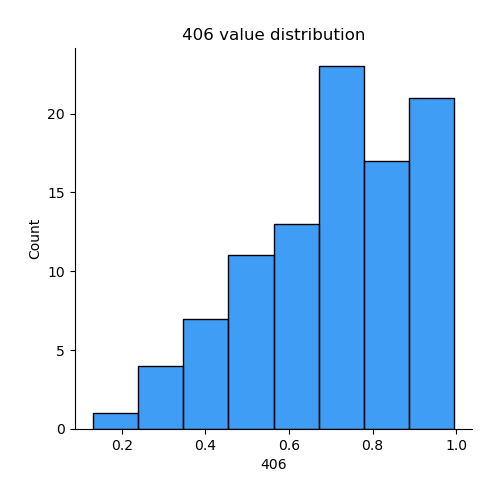
## Feature : 407
- **Feature type** : continous
- **Missing** : 0.0%
- **Unique** : 97
- **Count** :97.0
- **Mean** :0.6781991139260912
- **Std** :0.2454247250083967
- **Min** :-0.10699789832058432
- **25%th Percentile** : 0.5534783714576881
- **50%th Percentile** : 0.7363632794243885
- **75%th Percentile** : 0.8259001704258607
- **Max** :0.9973297193488747

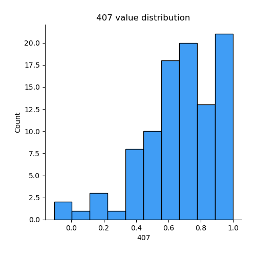
## Feature : 408
- **Feature type** : continous
- **Missing** : 0.0%
- **Unique** : 97
- **Count** :97.0
- **Mean** :0.6926041787323237
- **Std** :0.2084904062015422
- **Min** :0.005834485502973875
- **25%th Percentile** : 0.5227473159350098
- **50%th Percentile** : 0.6810810958866033
- **75%th Percentile** : 0.8312583874407512
- **Max** :0.990351533043342

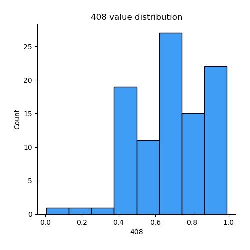
## Feature : 409
- **Feature type** : continous
- **Missing** : 0.0%
- **Unique** : 97
- **Count** :97.0
- **Mean** :0.5649243412247676
- **Std** :0.2847814239137764
- **Min** :-0.07283665157999013
- **25%th Percentile** : 0.32899467790543774
- **50%th Percentile** : 0.5583262056219249
- **75%th Percentile** : 0.8149392662613181
- **Max** :0.991132639689831

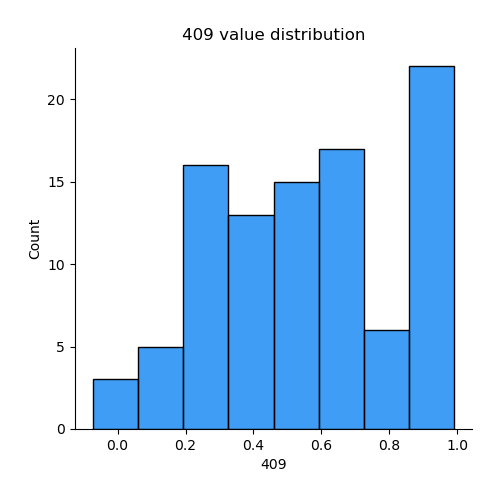
## Feature : 410
- **Feature type** : continous
- **Missing** : 0.0%
- **Unique** : 97
- **Count** :97.0
- **Mean** :0.6408283520989443
- **Std** :0.26928641760029126
- **Min** :-0.1967266218927505
- **25%th Percentile** : 0.4711771296153307
- **50%th Percentile** : 0.6670770801894632
- **75%th Percentile** : 0.8454671949908231
- **Max** :0.9961618388475535

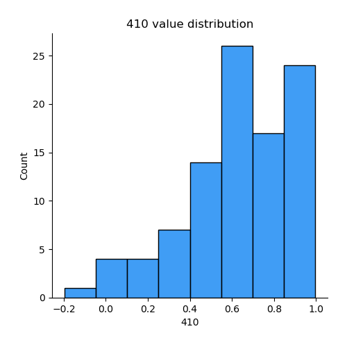
## Feature : 411
- **Feature type** : continous
- **Missing** : 0.0%
- **Unique** : 97
- **Count** :97.0
- **Mean** :0.6431810293713869
- **Std** :0.2370974468323177
- **Min** :-0.09473227900154206
- **25%th Percentile** : 0.47950300742853463
- **50%th Percentile** : 0.6305817826457766
- **75%th Percentile** : 0.7930828155808592
- **Max** :0.99566590586287

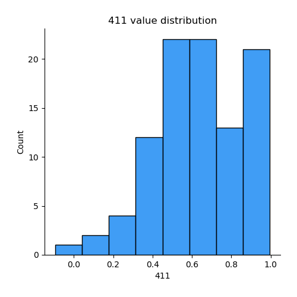
## Feature : 412
- **Feature type** : continous
- **Missing** : 0.0%
- **Unique** : 97
- **Count** :97.0
- **Mean** :0.721200746829063
- **Std** :0.2417252298145823
- **Min** :-0.09949269678757561
- **25%th Percentile** : 0.5968202159146437
- **50%th Percentile** : 0.7785945128464246
- **75%th Percentile** : 0.8901437431590828
- **Max** :0.9956634592626445

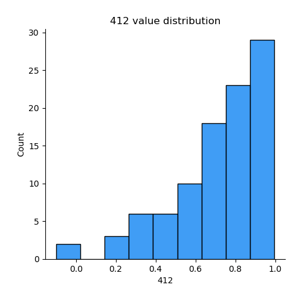
## Feature : 413
- **Feature type** : continous
- **Missing** : 0.0%
- **Unique** : 97
- **Count** :97.0
- **Mean** :0.7444747911024253
- **Std** :0.20314122217800545
- **Min** :-0.09107275755223068
- **25%th Percentile** : 0.642352415444708
- **50%th Percentile** : 0.7605832717880057
- **75%th Percentile** : 0.8904153985720871
- **Max** :0.9946595752163194

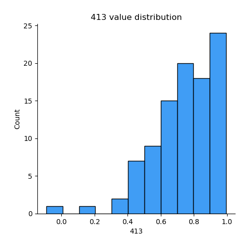
## Feature : 414
- **Feature type** : continous
- **Missing** : 0.0%
- **Unique** : 97
- **Count** :97.0
- **Mean** :0.4650516182434038
- **Std** :0.31981607099398784
- **Min** :-0.38482130455434466
- **25%th Percentile** : 0.24199217005213317
- **50%th Percentile** : 0.46412928850252977
- **75%th Percentile** : 0.6902972274261804
- **Max** :0.9881506968836744

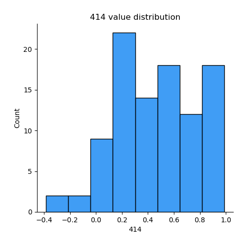
## Feature : 415
- **Feature type** : continous
- **Missing** : 0.0%
- **Unique** : 97
- **Count** :97.0
- **Mean** :0.6648445215427238
- **Std** :0.2427262246538091
- **Min** :0.02844582169344341
- **25%th Percentile** : 0.47250485067364534
- **50%th Percentile** : 0.6841061311226542
- **75%th Percentile** : 0.891944148822652
- **Max** :0.9948310771183857

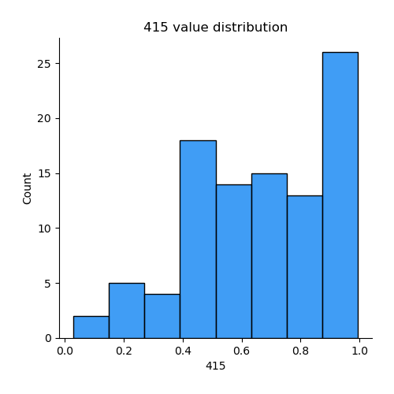
## Feature : 424
- **Feature type** : continous
- **Missing** : 0.0%
- **Unique** : 3
- **Count** :97.0
- **Mean** :1.0
- **Std** :9.878281759274735e-17
- **Min** :0.9999999999999998
- **25%th Percentile** : 0.9999999999999999
- **50%th Percentile** : 1.0
- **75%th Percentile** : 1.0
- **Max** :1.0

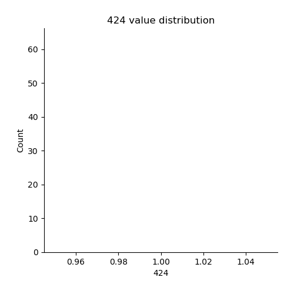
## Feature : 425
- **Feature type** : continous
- **Missing** : 0.0%
- **Unique** : 97
- **Count** :97.0
- **Mean** :0.622183394899597
- **Std** :0.24353332927847401
- **Min** :-0.04589389866134484
- **25%th Percentile** : 0.4968129606261355
- **50%th Percentile** : 0.6199756872262311
- **75%th Percentile** : 0.7930999539250128
- **Max** :0.9844240118727918

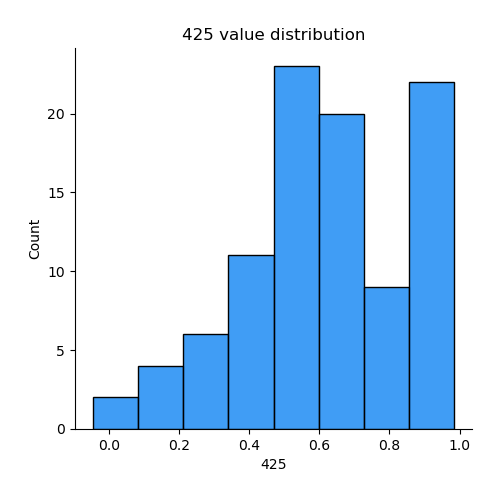
## Feature : 426
- **Feature type** : continous
- **Missing** : 0.0%
- **Unique** : 97
- **Count** :97.0
- **Mean** :0.7212750757655948
- **Std** :0.19133928213996515
- **Min** :0.24609395899119288
- **25%th Percentile** : 0.610194843482107
- **50%th Percentile** : 0.717892163818609
- **75%th Percentile** : 0.8664732636437572
- **Max** :0.9896559490813999

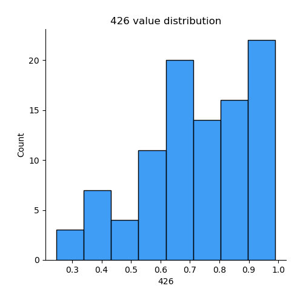
## Feature : 427
- **Feature type** : continous
- **Missing** : 0.0%
- **Unique** : 97
- **Count** :97.0
- **Mean** :0.6614993762290169
- **Std** :0.22770965499006376
- **Min** :-0.1247011330597661
- **25%th Percentile** : 0.5262079301412077
- **50%th Percentile** : 0.6538909487829465
- **75%th Percentile** : 0.8109542945690276
- **Max** :0.9927293442740721

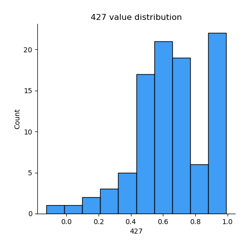
## Feature : 428
- **Feature type** : continous
- **Missing** : 0.0%
- **Unique** : 97
- **Count** :97.0
- **Mean** :0.5750418573136501
- **Std** :0.2718237408246132
- **Min** :-0.2243608217475588
- **25%th Percentile** : 0.3752117773108905
- **50%th Percentile** : 0.5630607877545994
- **75%th Percentile** : 0.749330546296655
- **Max** :0.9841611714987476

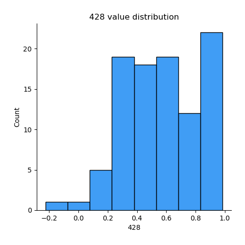
## Feature : 429
- **Feature type** : continous
- **Missing** : 0.0%
- **Unique** : 97
- **Count** :97.0
- **Mean** :0.6331836006375343
- **Std** :0.23082168414547669
- **Min** :0.047618716126930555
- **25%th Percentile** : 0.4755469040499417
- **50%th Percentile** : 0.6298623928864533
- **75%th Percentile** : 0.7726528218831453
- **Max** :0.9872661181350035

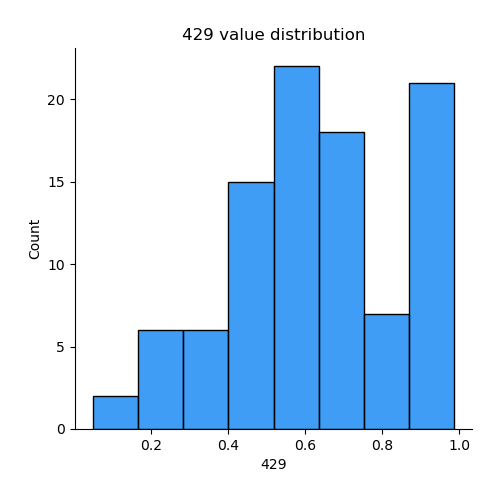
## Feature : 430
- **Feature type** : continous
- **Missing** : 0.0%
- **Unique** : 97
- **Count** :97.0
- **Mean** :0.6736726157891665
- **Std** :0.19829512552684458
- **Min** :0.21028922873306266
- **25%th Percentile** : 0.5419469706323214
- **50%th Percentile** : 0.6541110873431667
- **75%th Percentile** : 0.8353634637421341
- **Max** :0.9858989796996603

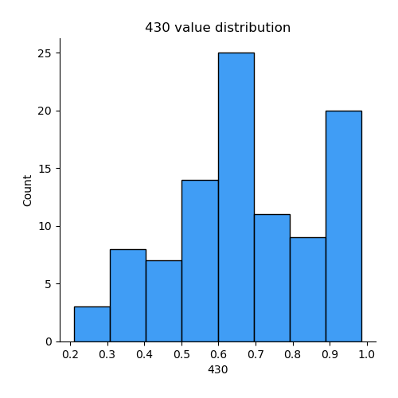
## Feature : 431
- **Feature type** : continous
- **Missing** : 0.0%
- **Unique** : 97
- **Count** :97.0
- **Mean** :0.5995116983982173
- **Std** :0.24494653633569202
- **Min** :0.006714278884430473
- **25%th Percentile** : 0.41672378989044484
- **50%th Percentile** : 0.557485945105328
- **75%th Percentile** : 0.7828944796733868
- **Max** :0.9846035743771383

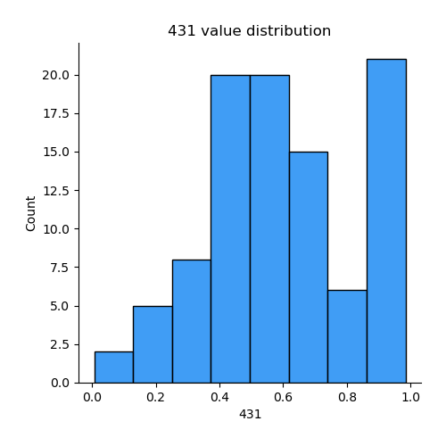
## Feature : 432
- **Feature type** : continous
- **Missing** : 0.0%
- **Unique** : 97
- **Count** :97.0
- **Mean** :0.7092470819993026
- **Std** :0.18383059298030496
- **Min** :0.23898662270073065
- **25%th Percentile** : 0.5717144454345965
- **50%th Percentile** : 0.6866470434289283
- **75%th Percentile** : 0.8477061620027381
- **Max** :0.9893222100952732

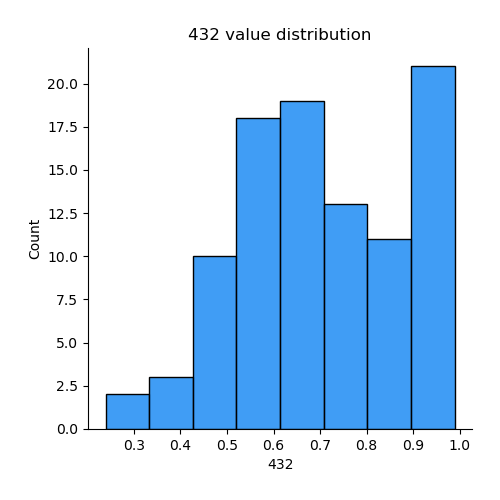
## Feature : 433
- **Feature type** : continous
- **Missing** : 0.0%
- **Unique** : 97
- **Count** :97.0
- **Mean** :0.5999353184504558
- **Std** :0.24999171253136132
- **Min** :0.070704057993562
- **25%th Percentile** : 0.42232609554277756
- **50%th Percentile** : 0.5726291581558783
- **75%th Percentile** : 0.7822610841398926
- **Max** :0.9845197927292287

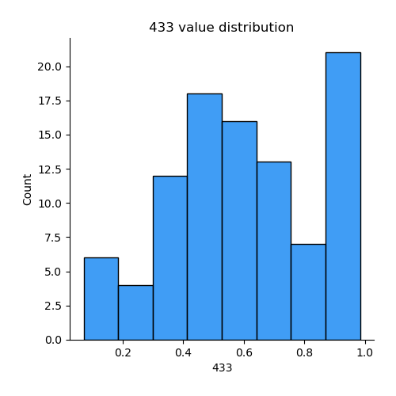
## Feature : 434
- **Feature type** : continous
- **Missing** : 0.0%
- **Unique** : 97
- **Count** :97.0
- **Mean** :0.8570677390939999
- **Std** :0.09592255554136597
- **Min** :0.6139452895754678
- **25%th Percentile** : 0.7781580990460075
- **50%th Percentile** : 0.8634155036150554
- **75%th Percentile** : 0.9229177962861801
- **Max** :0.995775782903399

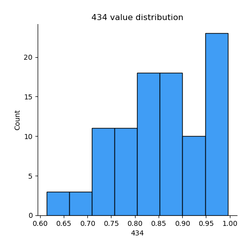
## Feature : 435
- **Feature type** : continous
- **Missing** : 0.0%
- **Unique** : 97
- **Count** :97.0
- **Mean** :0.5679495795271806
- **Std** :0.26555791769577886
- **Min** :-0.06873680902436292
- **25%th Percentile** : 0.39314408762528247
- **50%th Percentile** : 0.5395619563001723
- **75%th Percentile** : 0.7641598191412333
- **Max** :0.983307398034418

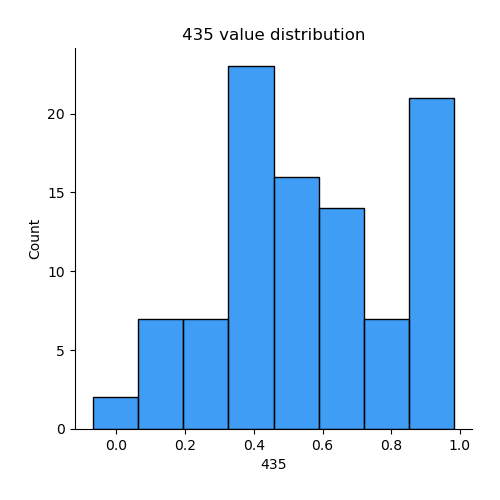
## Feature : 436
- **Feature type** : continous
- **Missing** : 0.0%
- **Unique** : 97
- **Count** :97.0
- **Mean** :0.6464708927432702
- **Std** :0.23091061477885963
- **Min** :0.10800526167964045
- **25%th Percentile** : 0.4879527991775101
- **50%th Percentile** : 0.6368524443432546
- **75%th Percentile** : 0.8161043150140509
- **Max** :0.9903399303809458

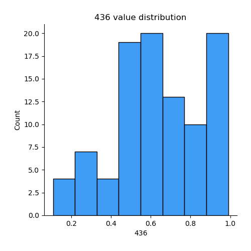
## Feature : 437
- **Feature type** : continous
- **Missing** : 0.0%
- **Unique** : 97
- **Count** :97.0
- **Mean** :0.6445551288407075
- **Std** :0.24286859513727113
- **Min** :-0.007540106261183279
- **25%th Percentile** : 0.5024376707903954
- **50%th Percentile** : 0.640501365048375
- **75%th Percentile** : 0.8065923505488908
- **Max** :0.9875345390301764

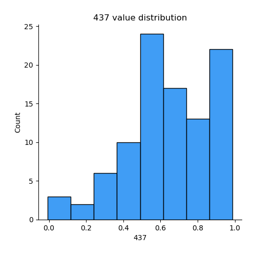
## Feature : 438
- **Feature type** : continous
- **Missing** : 0.0%
- **Unique** : 97
- **Count** :97.0
- **Mean** :0.6320379435618695
- **Std** :0.2451525094823694
- **Min** :-0.03287977162842454
- **25%th Percentile** : 0.4926794946058764
- **50%th Percentile** : 0.6330404381912471
- **75%th Percentile** : 0.8569561296050718
- **Max** :0.9860128041212438

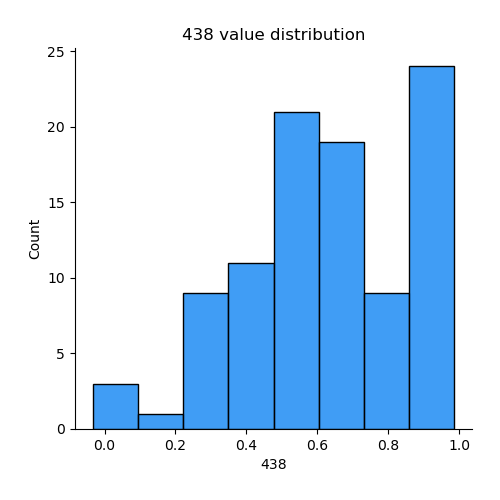
## Feature : 439
- **Feature type** : continous
- **Missing** : 0.0%
- **Unique** : 97
- **Count** :97.0
- **Mean** :0.6421171673224202
- **Std** :0.24337902583974552
- **Min** :0.0009844698183396592
- **25%th Percentile** : 0.46013471980270526
- **50%th Percentile** : 0.6462344631511351
- **75%th Percentile** : 0.8340979220677498
- **Max** :0.9808573464996891

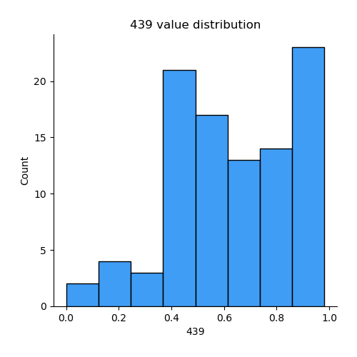
## Feature : 440
- **Feature type** : continous
- **Missing** : 0.0%
- **Unique** : 97
- **Count** :97.0
- **Mean** :0.4663660333552392
- **Std** :0.28811225695354625
- **Min** :-0.10993400405214665
- **25%th Percentile** : 0.25111541055658515
- **50%th Percentile** : 0.4048530324790001
- **75%th Percentile** : 0.6301492651668503
- **Max** :0.9672692359429154

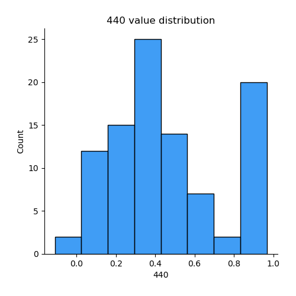
## Feature : 441
- **Feature type** : continous
- **Missing** : 0.0%
- **Unique** : 97
- **Count** :97.0
- **Mean** :0.6003503815018613
- **Std** :0.2465690873758035
- **Min** :0.005765354886162123
- **25%th Percentile** : 0.4284655916087393
- **50%th Percentile** : 0.5751324242003496
- **75%th Percentile** : 0.7547648086761342
- **Max** :0.9782512270012919

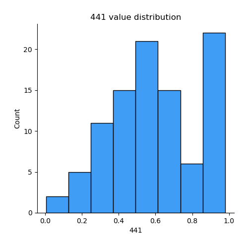
## Feature : 442
- **Feature type** : continous
- **Missing** : 0.0%
- **Unique** : 97
- **Count** :97.0
- **Mean** :0.5714422420531434
- **Std** :0.2908676233711856
- **Min** :-0.08425721995724494
- **25%th Percentile** : 0.3782765665632073
- **50%th Percentile** : 0.566330671346857
- **75%th Percentile** : 0.8132275300382669
- **Max** :0.9809341167860912

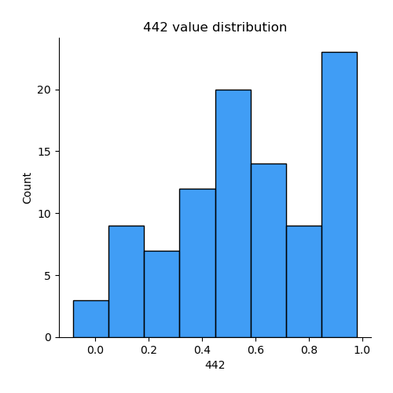
## Feature : 443
- **Feature type** : continous
- **Missing** : 0.0%
- **Unique** : 97
- **Count** :97.0
- **Mean** :0.5489814441136512
- **Std** :0.26267815451322907
- **Min** :-0.09184353292440059
- **25%th Percentile** : 0.35869625881154027
- **50%th Percentile** : 0.5192759995388276
- **75%th Percentile** : 0.6980028036111586
- **Max** :0.980268154966411

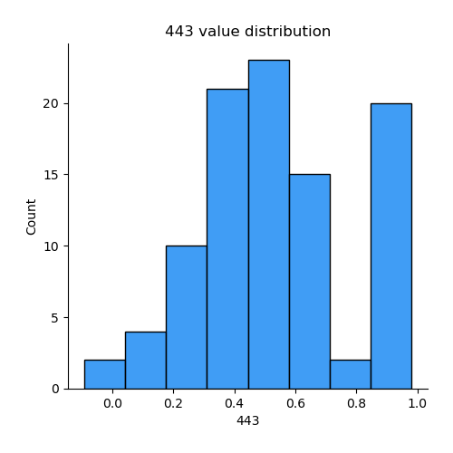
## Feature : 444
- **Feature type** : continous
- **Missing** : 0.0%
- **Unique** : 97
- **Count** :97.0
- **Mean** :0.6725285460770367
- **Std** :0.22661342153027567
- **Min** :0.10047079148008756
- **25%th Percentile** : 0.5067428128028032
- **50%th Percentile** : 0.6858576493865506
- **75%th Percentile** : 0.8607612524406458
- **Max** :0.9821337828143584

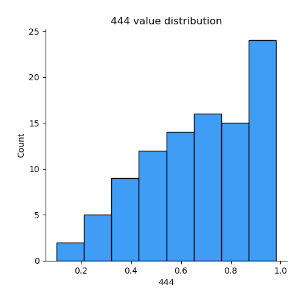
## Feature : 445
- **Feature type** : continous
- **Missing** : 0.0%
- **Unique** : 97
- **Count** :97.0
- **Mean** :0.4161025246411252
- **Std** :0.3136273947101353
- **Min** :-0.3696644738460916
- **25%th Percentile** : 0.16916540757746704
- **50%th Percentile** : 0.33832036190046494
- **75%th Percentile** : 0.6636670600818805
- **Max** :0.9697749758401196

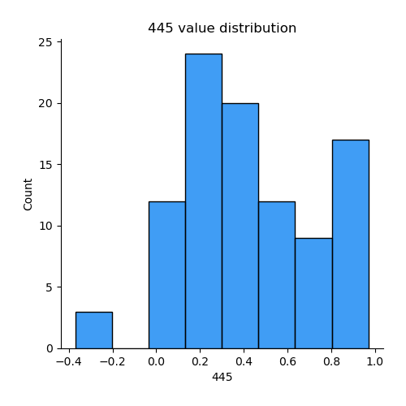
## Feature : 446
- **Feature type** : continous
- **Missing** : 0.0%
- **Unique** : 97
- **Count** :97.0
- **Mean** :0.6424857098685831
- **Std** :0.23744516502685106
- **Min** :0.08396655511754718
- **25%th Percentile** : 0.4616888351121328
- **50%th Percentile** : 0.6401260668968662
- **75%th Percentile** : 0.8112164236299431
- **Max** :0.986915853574341

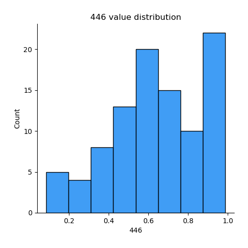
## Feature : 447
- **Feature type** : continous
- **Missing** : 0.0%
- **Unique** : 97
- **Count** :97.0
- **Mean** :0.7167209822267113
- **Std** :0.2074184046819083
- **Min** :0.1359405019202695
- **25%th Percentile** : 0.5825366729144199
- **50%th Percentile** : 0.7283270831973601
- **75%th Percentile** : 0.8863435838313297
- **Max** :0.9895664633516794

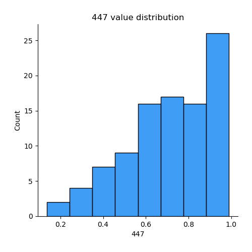
## Feature : 448
- **Feature type** : continous
- **Missing** : 0.0%
- **Unique** : 97
- **Count** :97.0
- **Mean** :0.558657109858183
- **Std** :0.2826581387624594
- **Min** :-0.06136490828333255
- **25%th Percentile** : 0.39077753386902087
- **50%th Percentile** : 0.5209849928394535
- **75%th Percentile** : 0.7730608988170603
- **Max** :0.9835660928427262

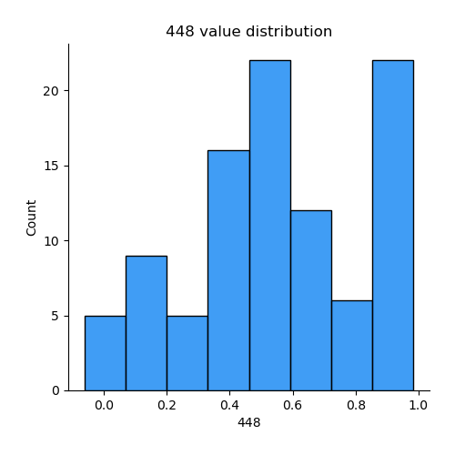
## Feature : 449
- **Feature type** : continous
- **Missing** : 0.0%
- **Unique** : 97
- **Count** :97.0
- **Mean** :0.5975495802908705
- **Std** :0.25979014394070377
- **Min** :0.09075303598556299
- **25%th Percentile** : 0.3860574102516296
- **50%th Percentile** : 0.5905798242775804
- **75%th Percentile** : 0.8165194495421318
- **Max** :0.9837420692977877

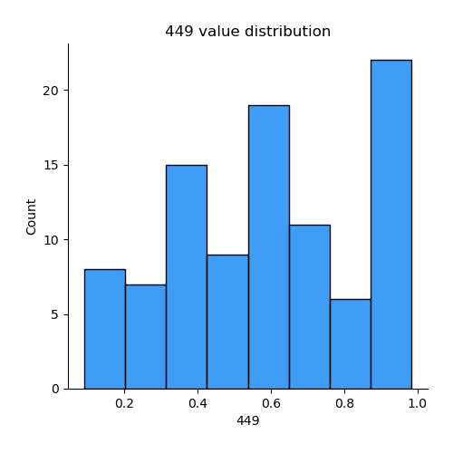
## Feature : 450
- **Feature type** : continous
- **Missing** : 0.0%
- **Unique** : 97
- **Count** :97.0
- **Mean** :0.8764181671123152
- **Std** :0.10672769919175701
- **Min** :0.4396547669488039
- **25%th Percentile** : 0.8231661520051019
- **50%th Percentile** : 0.8871493259016707
- **75%th Percentile** : 0.9532650842276164
- **Max** :0.9953533576551423

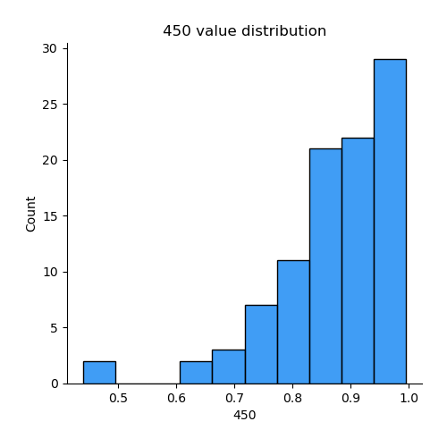
## Feature : 451
- **Feature type** : continous
- **Missing** : 0.0%
- **Unique** : 97
- **Count** :97.0
- **Mean** :0.6125378164470726
- **Std** :0.24622286941008145
- **Min** :-0.027401907206407044
- **25%th Percentile** : 0.4465897342968342
- **50%th Percentile** : 0.5932668243063662
- **75%th Percentile** : 0.771905794846108
- **Max** :0.9862593145683332

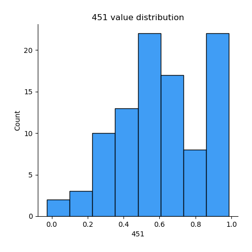
## Feature : 452
- **Feature type** : continous
- **Missing** : 0.0%
- **Unique** : 97
- **Count** :97.0
- **Mean** :0.7052534270280382
- **Std** :0.20178066092295754
- **Min** :0.20899553861020684
- **25%th Percentile** : 0.5807169523636972
- **50%th Percentile** : 0.7056628229581613
- **75%th Percentile** : 0.8764816226542076
- **Max** :0.9910059627029807

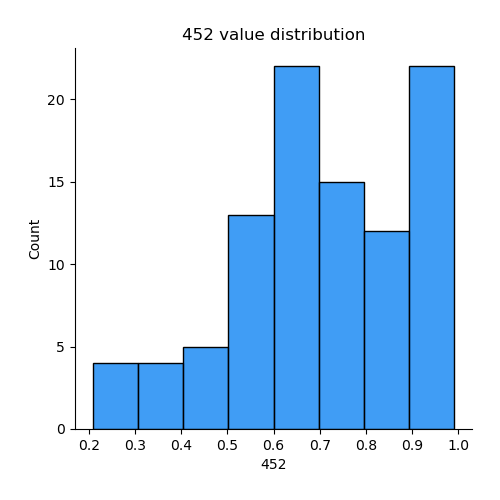
## Feature : 453
- **Feature type** : continous
- **Missing** : 0.0%
- **Unique** : 97
- **Count** :97.0
- **Mean** :0.6228292208080294
- **Std** :0.2602154940014445
- **Min** :0.07913416975868076
- **25%th Percentile** : 0.4980737505832141
- **50%th Percentile** : 0.632452165901668
- **75%th Percentile** : 0.8151888577882617
- **Max** :0.988471798728374

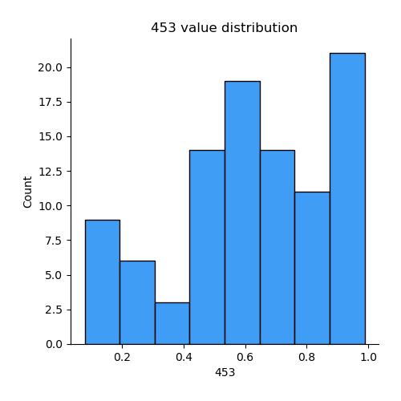
## Feature : 454
- **Feature type** : continous
- **Missing** : 0.0%
- **Unique** : 97
- **Count** :97.0
- **Mean** :0.5523781853284808
- **Std** :0.28293453478722547
- **Min** :-0.22096320622275134
- **25%th Percentile** : 0.34575796357110794
- **50%th Percentile** : 0.5329084852836931
- **75%th Percentile** : 0.7181703511855226
- **Max** :0.9833651001650847

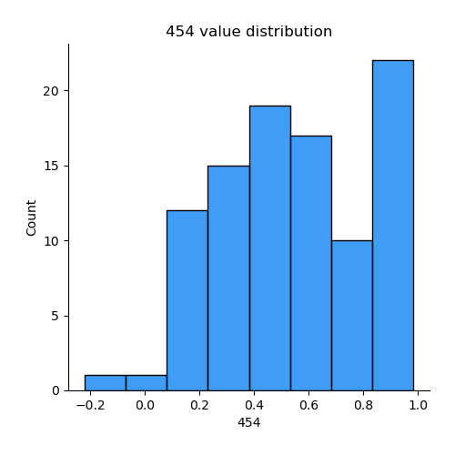
## Feature : 455
- **Feature type** : continous
- **Missing** : 0.0%
- **Unique** : 97
- **Count** :97.0
- **Mean** :0.6114925024406141
- **Std** :0.24920481551027254
- **Min** :0.03795439594634129
- **25%th Percentile** : 0.4375558990916675
- **50%th Percentile** : 0.6288598751663168
- **75%th Percentile** : 0.7868159858603504
- **Max** :0.9841055626074152

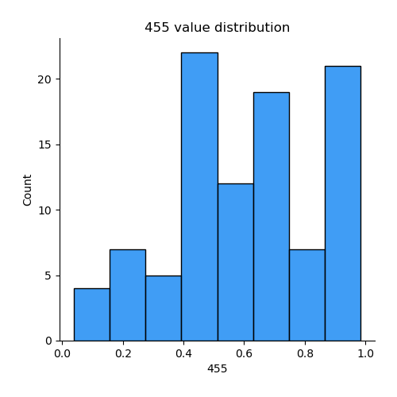
## Feature : 456
- **Feature type** : continous
- **Missing** : 0.0%
- **Unique** : 97
- **Count** :97.0
- **Mean** :0.6702607109319553
- **Std** :0.20213560650448717
- **Min** :0.16582862092590372
- **25%th Percentile** : 0.5508578577293934
- **50%th Percentile** : 0.6450555450094634
- **75%th Percentile** : 0.8438973351036629
- **Max** :0.980719443202065

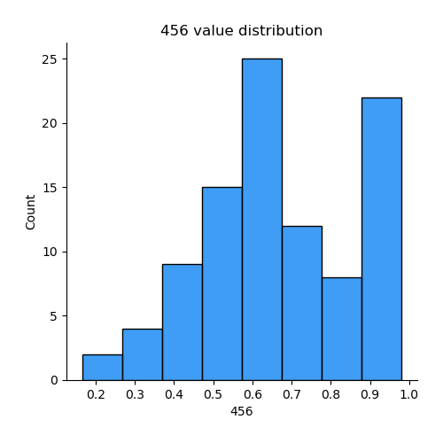
## Feature : 457
- **Feature type** : continous
- **Missing** : 0.0%
- **Unique** : 97
- **Count** :97.0
- **Mean** :0.5643451156603395
- **Std** :0.27747596948859443
- **Min** :-0.016831460853866474
- **25%th Percentile** : 0.3637867757105162
- **50%th Percentile** : 0.5465758906871929
- **75%th Percentile** : 0.7519068052912049
- **Max** :0.9857307589745212

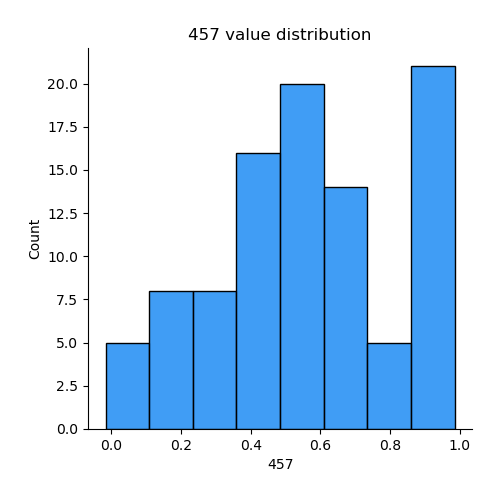
## Feature : 458
- **Feature type** : continous
- **Missing** : 0.0%
- **Unique** : 97
- **Count** :97.0
- **Mean** :0.6670677351292803
- **Std** :0.22094105409992565
- **Min** :0.18571810181352702
- **25%th Percentile** : 0.5068158314864779
- **50%th Percentile** : 0.6597961088498354
- **75%th Percentile** : 0.8254215893188243
- **Max** :0.9867552537306088

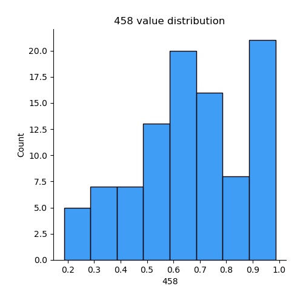
## Feature : 459
- **Feature type** : continous
- **Missing** : 0.0%
- **Unique** : 97
- **Count** :97.0
- **Mean** :0.5661462176301106
- **Std** :0.2797049258517933
- **Min** :-0.15584074178625598
- **25%th Percentile** : 0.3921226368295657
- **50%th Percentile** : 0.5594971246121802
- **75%th Percentile** : 0.7413910337914094
- **Max** :0.9833161033428557

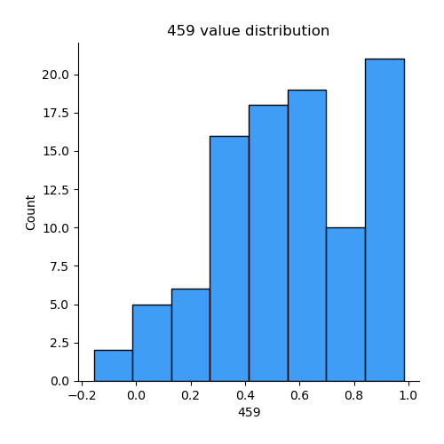
## Feature : 460
- **Feature type** : continous
- **Missing** : 0.0%
- **Unique** : 97
- **Count** :97.0
- **Mean** :0.7997250238559737
- **Std** :0.1492560581502895
- **Min** :0.3873024982609285
- **25%th Percentile** : 0.7175752494416472
- **50%th Percentile** : 0.8169034792968475
- **75%th Percentile** : 0.8943135154978273
- **Max** :0.9945143020156336

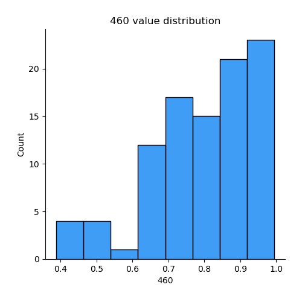
## Feature : 461
- **Feature type** : continous
- **Missing** : 0.0%
- **Unique** : 97
- **Count** :97.0
- **Mean** :0.5248152251360926
- **Std** :0.27707395080005554
- **Min** :-0.042221117609403856
- **25%th Percentile** : 0.3481632613166424
- **50%th Percentile** : 0.46429226634534243
- **75%th Percentile** : 0.7298034416588737
- **Max** :0.9787565994595281

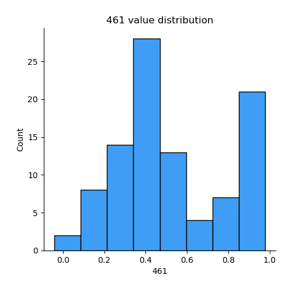
## Feature : 462
- **Feature type** : continous
- **Missing** : 0.0%
- **Unique** : 97
- **Count** :97.0
- **Mean** :0.6097786191037362
- **Std** :0.2598868352977988
- **Min** :-0.09827185795686989
- **25%th Percentile** : 0.4369769331221764
- **50%th Percentile** : 0.6081310298623639
- **75%th Percentile** : 0.7820549183848755
- **Max** :0.9882846110138046

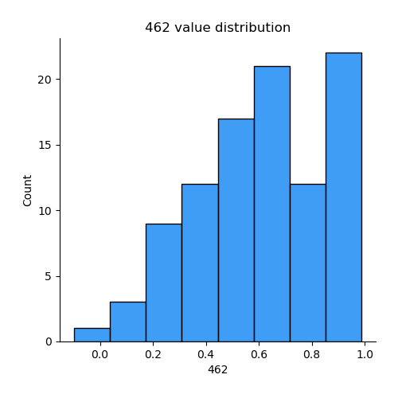
## Feature : 463
- **Feature type** : continous
- **Missing** : 0.0%
- **Unique** : 97
- **Count** :97.0
- **Mean** :0.6174570943050981
- **Std** :0.26859935585527905
- **Min** :-0.17977628246323318
- **25%th Percentile** : 0.4510228987218571
- **50%th Percentile** : 0.6297190158319207
- **75%th Percentile** : 0.8002427746926294
- **Max** :0.9868004818331629

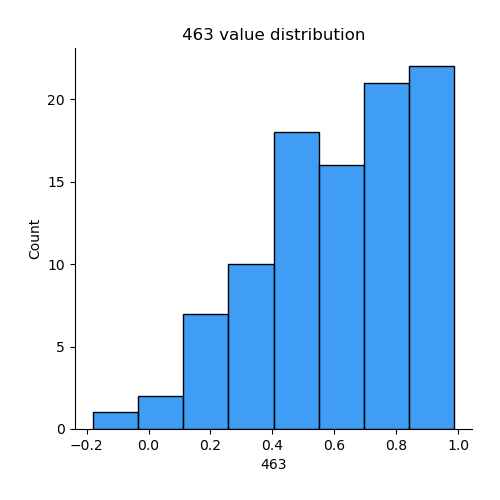
## Feature : 464
- **Feature type** : continous
- **Missing** : 0.0%
- **Unique** : 97
- **Count** :97.0
- **Mean** :0.616261685911384
- **Std** :0.25560372428217004
- **Min** :0.01364187449180939
- **25%th Percentile** : 0.4351609123147966
- **50%th Percentile** : 0.6216873327845561
- **75%th Percentile** : 0.7975828979381271
- **Max** :0.9849777978136808

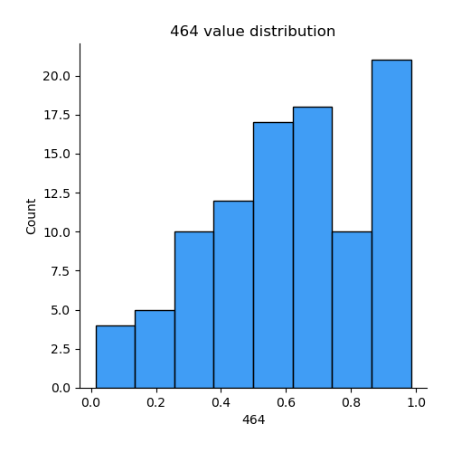
## Feature : 465
- **Feature type** : continous
- **Missing** : 0.0%
- **Unique** : 97
- **Count** :97.0
- **Mean** :0.5796797263559798
- **Std** :0.29453576323869407
- **Min** :-0.09686162726379466
- **25%th Percentile** : 0.3906588652332361
- **50%th Percentile** : 0.6180315523614782
- **75%th Percentile** : 0.7936233570994278
- **Max** :0.985507023258246

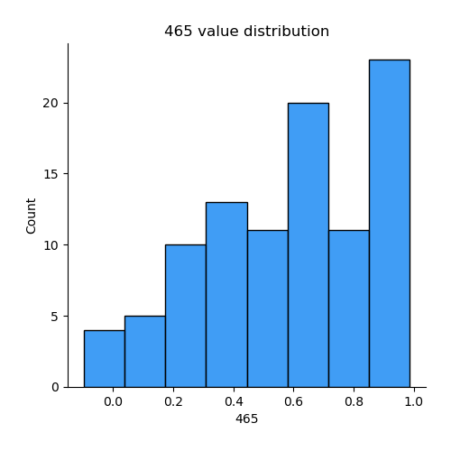
## Feature : 466
- **Feature type** : continous
- **Missing** : 0.0%
- **Unique** : 97
- **Count** :97.0
- **Mean** :0.4222146853958287
- **Std** :0.3186351811704132
- **Min** :-0.2221220082880295
- **25%th Percentile** : 0.18853637896922826
- **50%th Percentile** : 0.42965073891508315
- **75%th Percentile** : 0.6106506075778609
- **Max** :0.9744981871268455

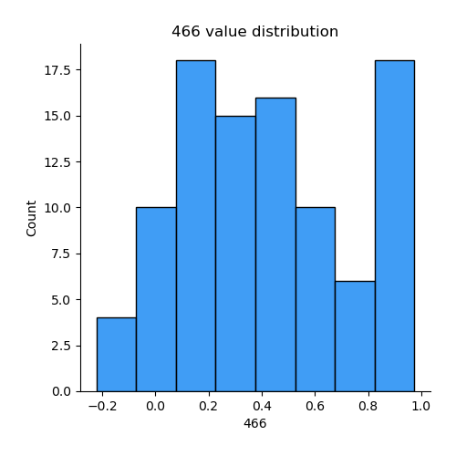
## Feature : 467
- **Feature type** : continous
- **Missing** : 0.0%
- **Unique** : 97
- **Count** :97.0
- **Mean** :0.5326913112228053
- **Std** :0.28082552056202165
- **Min** :-0.04533922683208509
- **25%th Percentile** : 0.29444028582223697
- **50%th Percentile** : 0.48701273956619884
- **75%th Percentile** : 0.7848935093273366
- **Max** :0.979462510908039

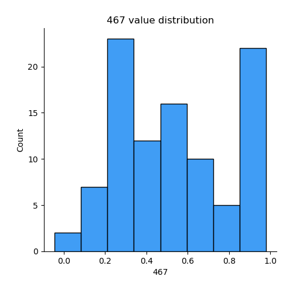
## Feature : 477
- **Feature type** : continous
- **Missing** : 0.0%
- **Unique** : 3
- **Count** :97.0
- **Mean** :1.0
- **Std** :6.409875621278546e-17
- **Min** :0.9999999999999998
- **25%th Percentile** : 1.0
- **50%th Percentile** : 1.0
- **75%th Percentile** : 1.0
- **Max** :1.0

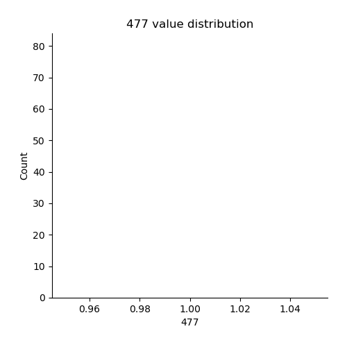
## Feature : 478
- **Feature type** : continous
- **Missing** : 0.0%
- **Unique** : 97
- **Count** :97.0
- **Mean** :0.8199215573191996
- **Std** :0.12802846679750896
- **Min** :0.4356659180534008
- **25%th Percentile** : 0.7502412432054706
- **50%th Percentile** : 0.8321761920367473
- **75%th Percentile** : 0.9097826326436229
- **Max** :0.9916594245728271

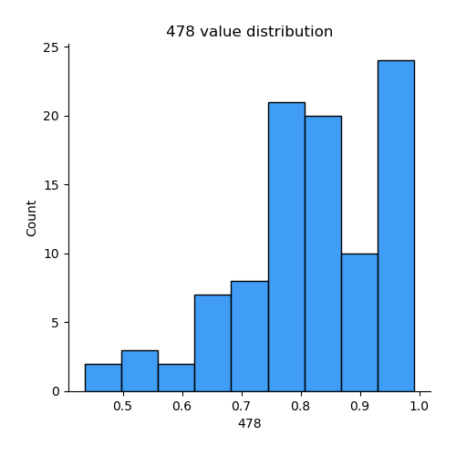
## Feature : 479
- **Feature type** : continous
- **Missing** : 0.0%
- **Unique** : 97
- **Count** :97.0
- **Mean** :0.6341477108477588
- **Std** :0.24440646972116162
- **Min** :-0.20394544356396752
- **25%th Percentile** : 0.47892489977572156
- **50%th Percentile** : 0.6011832353404328
- **75%th Percentile** : 0.865277374265606
- **Max** :0.9860945696171168

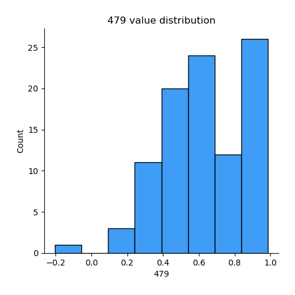
## Feature : 480
- **Feature type** : continous
- **Missing** : 0.0%
- **Unique** : 97
- **Count** :97.0
- **Mean** :0.5283530398034799
- **Std** :0.3095433788939162
- **Min** :-0.27101785541037765
- **25%th Percentile** : 0.33519183992013746
- **50%th Percentile** : 0.5203569728819932
- **75%th Percentile** : 0.7486175768000891
- **Max** :0.9828177268963368

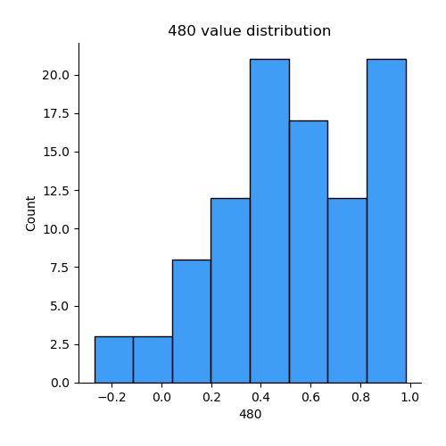
## Feature : 481
- **Feature type** : continous
- **Missing** : 0.0%
- **Unique** : 97
- **Count** :97.0
- **Mean** :0.6029465371165342
- **Std** :0.24383878731556666
- **Min** :0.06645523286328378
- **25%th Percentile** : 0.4215665823290357
- **50%th Percentile** : 0.5731918325054112
- **75%th Percentile** : 0.767498202873685
- **Max** :0.9898300115944328

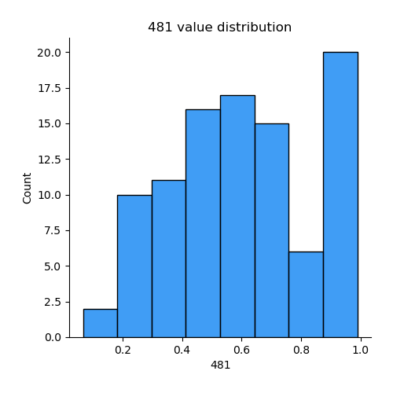
## Feature : 482
- **Feature type** : continous
- **Missing** : 0.0%
- **Unique** : 97
- **Count** :97.0
- **Mean** :0.785287256596209
- **Std** :0.14084249089937065
- **Min** :0.3891485133674738
- **25%th Percentile** : 0.7089672058765853
- **50%th Percentile** : 0.7855716313111205
- **75%th Percentile** : 0.8861683156194328
- **Max** :0.9880490652670533

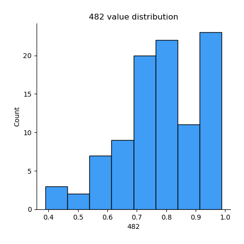
## Feature : 483
- **Feature type** : continous
- **Missing** : 0.0%
- **Unique** : 97
- **Count** :97.0
- **Mean** :0.572913991605672
- **Std** :0.27126835232224056
- **Min** :-0.0822998056116653
- **25%th Percentile** : 0.3979188141109293
- **50%th Percentile** : 0.5458577156106302
- **75%th Percentile** : 0.7762590044120504
- **Max** :0.9872114993659

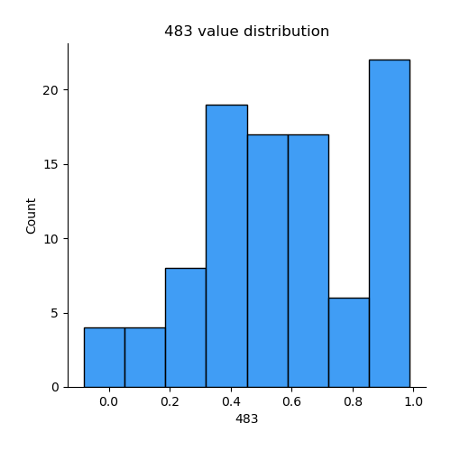
## Feature : 484
- **Feature type** : continous
- **Missing** : 0.0%
- **Unique** : 97
- **Count** :97.0
- **Mean** :0.5887189604341014
- **Std** :0.25695023485308977
- **Min** :-0.20203086532707576
- **25%th Percentile** : 0.4037300539862717
- **50%th Percentile** : 0.562560084287473
- **75%th Percentile** : 0.7929307969629029
- **Max** :0.9772865138161806

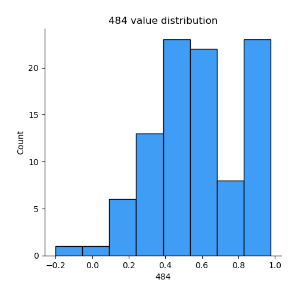
## Feature : 485
- **Feature type** : continous
- **Missing** : 0.0%
- **Unique** : 97
- **Count** :97.0
- **Mean** :0.6015326008121017
- **Std** :0.25740480532343935
- **Min** :-0.08822765317075494
- **25%th Percentile** : 0.44348545125561273
- **50%th Percentile** : 0.5741361132968208
- **75%th Percentile** : 0.7697127085867987
- **Max** :0.9871073789143522

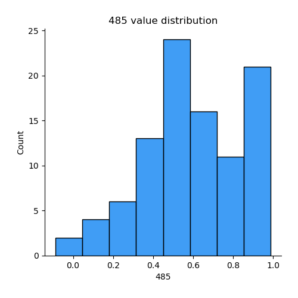
## Feature : 486
- **Feature type** : continous
- **Missing** : 0.0%
- **Unique** : 97
- **Count** :97.0
- **Mean** :0.6812471428114725
- **Std** :0.21350898305185903
- **Min** :-0.01137947430495903
- **25%th Percentile** : 0.5512518595707856
- **50%th Percentile** : 0.6786985542530545
- **75%th Percentile** : 0.8428590270468301
- **Max** :0.9866109891614008

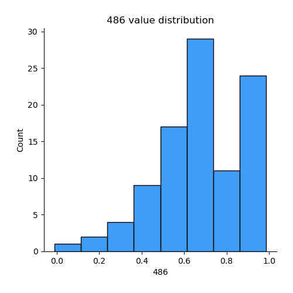
## Feature : 487
- **Feature type** : continous
- **Missing** : 0.0%
- **Unique** : 97
- **Count** :97.0
- **Mean** :0.428721988030169
- **Std** :0.3283549283210749
- **Min** :-0.3675697442333365
- **25%th Percentile** : 0.20081143246157163
- **50%th Percentile** : 0.35486683404480074
- **75%th Percentile** : 0.5888486474458989
- **Max** :0.9752735023177641

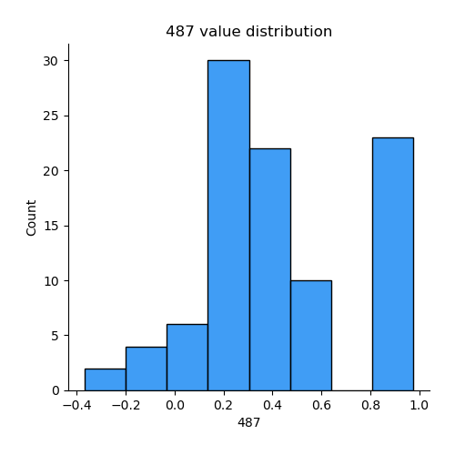
## Feature : 488
- **Feature type** : continous
- **Missing** : 0.0%
- **Unique** : 97
- **Count** :97.0
- **Mean** :0.524145235126376
- **Std** :0.31424864375220524
- **Min** :-0.33922492372250596
- **25%th Percentile** : 0.3450563822639404
- **50%th Percentile** : 0.48596214383911857
- **75%th Percentile** : 0.7741238979269512
- **Max** :0.9814058269738941

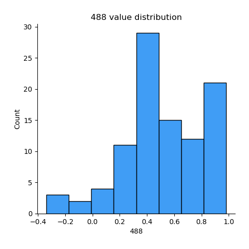
## Feature : 489
- **Feature type** : continous
- **Missing** : 0.0%
- **Unique** : 97
- **Count** :97.0
- **Mean** :0.7339459449855817
- **Std** :0.20125813422168892
- **Min** :0.049476169895874375
- **25%th Percentile** : 0.6201589190882618
- **50%th Percentile** : 0.7548836949825461
- **75%th Percentile** : 0.874028112045755
- **Max** :0.9906745964854972

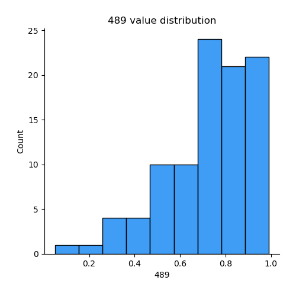
## Feature : 490
- **Feature type** : continous
- **Missing** : 0.0%
- **Unique** : 97
- **Count** :97.0
- **Mean** :0.6336225719391876
- **Std** :0.234848570250998
- **Min** :-0.05888162762630478
- **25%th Percentile** : 0.4848913486342899
- **50%th Percentile** : 0.6051990710386131
- **75%th Percentile** : 0.8467491740487726
- **Max** :0.9849830704662249

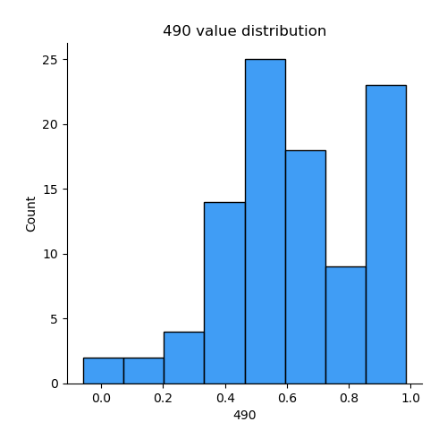
## Feature : 491
- **Feature type** : continous
- **Missing** : 0.0%
- **Unique** : 97
- **Count** :97.0
- **Mean** :0.6222000615891302
- **Std** :0.23291615627510598
- **Min** :0.03556215088336823
- **25%th Percentile** : 0.44232996367001287
- **50%th Percentile** : 0.597383566777297
- **75%th Percentile** : 0.7662287713808376
- **Max** :0.9866336925883441

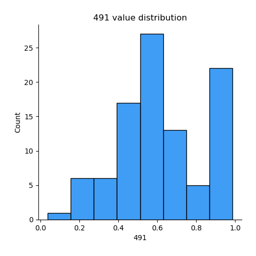
## Feature : 492
- **Feature type** : continous
- **Missing** : 0.0%
- **Unique** : 97
- **Count** :97.0
- **Mean** :0.4102262911555385
- **Std** :0.3073266037259094
- **Min** :-0.24653460547979067
- **25%th Percentile** : 0.20517496217767356
- **50%th Percentile** : 0.3273492620182334
- **75%th Percentile** : 0.5484735041975648
- **Max** :0.9701137508752844

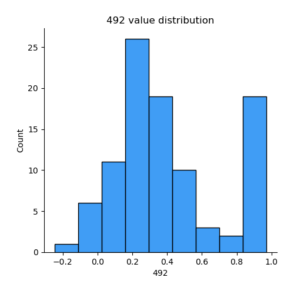
## Feature : 493
- **Feature type** : continous
- **Missing** : 0.0%
- **Unique** : 97
- **Count** :97.0
- **Mean** :0.5644892769311843
- **Std** :0.25073612262541445
- **Min** :0.11219147963457024
- **25%th Percentile** : 0.3897823460274251
- **50%th Percentile** : 0.5059179653084349
- **75%th Percentile** : 0.7381396541533135
- **Max** :0.9770200059761737

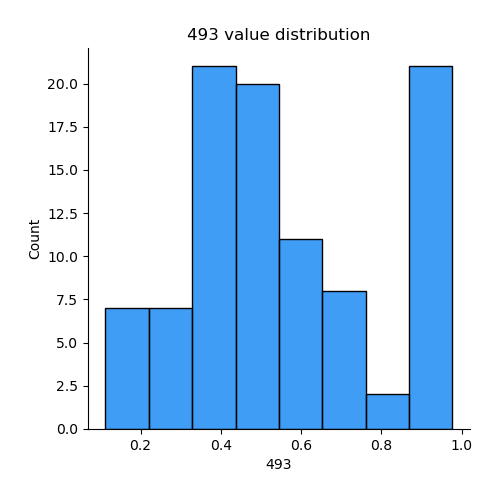
## Feature : 494
- **Feature type** : continous
- **Missing** : 0.0%
- **Unique** : 97
- **Count** :97.0
- **Mean** :0.5886907060851301
- **Std** :0.26868360503150934
- **Min** :-0.021737715458275294
- **25%th Percentile** : 0.39348928127902133
- **50%th Percentile** : 0.5632012609017943
- **75%th Percentile** : 0.825424548412654
- **Max** :0.9879838773731618

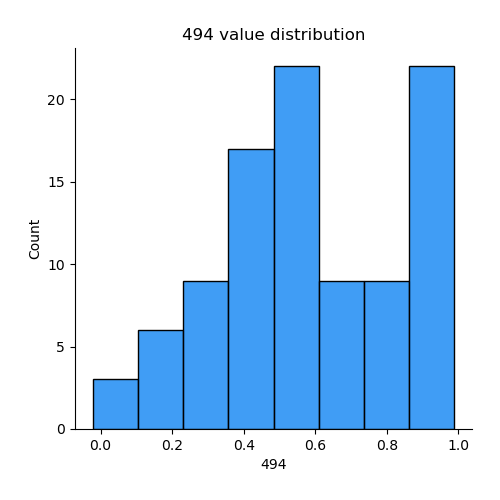
## Feature : 495
- **Feature type** : continous
- **Missing** : 0.0%
- **Unique** : 97
- **Count** :97.0
- **Mean** :0.5091432383831298
- **Std** :0.28542695393386835
- **Min** :-0.14992737705050538
- **25%th Percentile** : 0.3120266567669764
- **50%th Percentile** : 0.4792456535703667
- **75%th Percentile** : 0.6970645747408479
- **Max** :0.9793594981158743

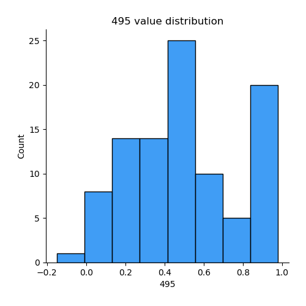
## Feature : 496
- **Feature type** : continous
- **Missing** : 0.0%
- **Unique** : 97
- **Count** :97.0
- **Mean** :0.750957424888347
- **Std** :0.18484787593242072
- **Min** :-0.042454338722542624
- **25%th Percentile** : 0.6600048103074948
- **50%th Percentile** : 0.7736961842561364
- **75%th Percentile** : 0.8828222477473635
- **Max** :0.9926841381069589

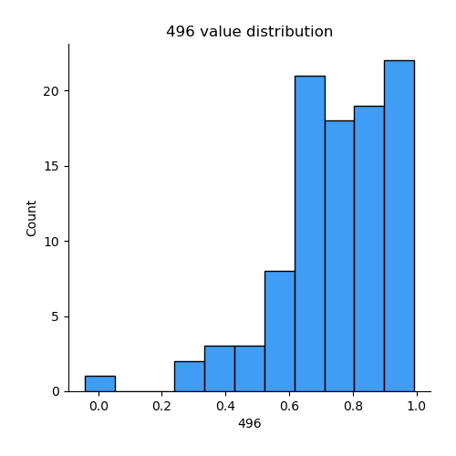
## Feature : 497
- **Feature type** : continous
- **Missing** : 0.0%
- **Unique** : 97
- **Count** :97.0
- **Mean** :0.395377807723302
- **Std** :0.33604830634269517
- **Min** :-0.5792242480938906
- **25%th Percentile** : 0.21492455159754897
- **50%th Percentile** : 0.34801789943457945
- **75%th Percentile** : 0.6515207987493439
- **Max** :0.9753108862359464

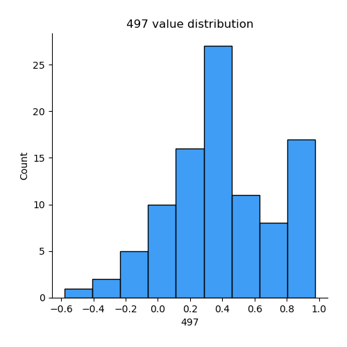
## Feature : 498
- **Feature type** : continous
- **Missing** : 0.0%
- **Unique** : 97
- **Count** :97.0
- **Mean** :0.7802578070621664
- **Std** :0.17515272207719484
- **Min** :0.036432333437872486
- **25%th Percentile** : 0.6752101546464663
- **50%th Percentile** : 0.8119264528081376
- **75%th Percentile** : 0.9192410384597837
- **Max** :0.9950746457786561

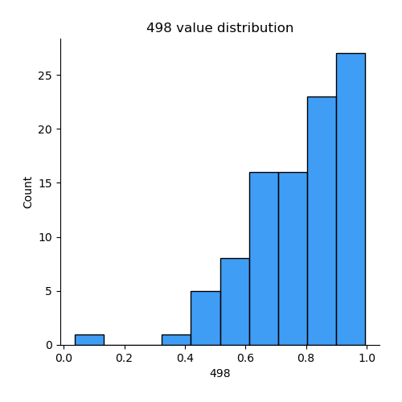
## Feature : 499
- **Feature type** : continous
- **Missing** : 0.0%
- **Unique** : 97
- **Count** :97.0
- **Mean** :0.6640944672655251
- **Std** :0.22518432464034813
- **Min** :0.1581076871230331
- **25%th Percentile** : 0.5014006296232889
- **50%th Percentile** : 0.6623611905951099
- **75%th Percentile** : 0.8604527798694203
- **Max** :0.985372197536969

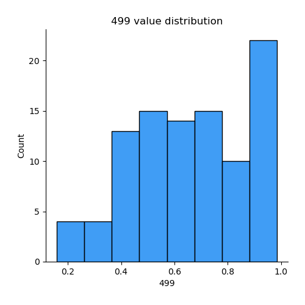
## Feature : 500
- **Feature type** : continous
- **Missing** : 0.0%
- **Unique** : 97
- **Count** :97.0
- **Mean** :0.6371497215809792
- **Std** :0.24193432978200133
- **Min** :0.1274309712800586
- **25%th Percentile** : 0.46876978662274366
- **50%th Percentile** : 0.6478072091273092
- **75%th Percentile** : 0.8196726565999787
- **Max** :0.9887366578398595

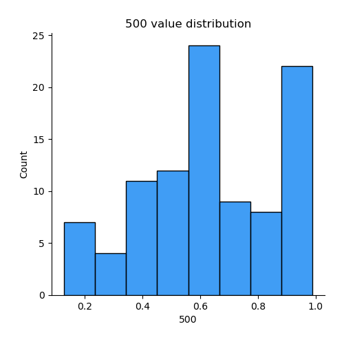
## Feature : 501
- **Feature type** : continous
- **Missing** : 0.0%
- **Unique** : 97
- **Count** :97.0
- **Mean** :0.581300957797437
- **Std** :0.25791275366652944
- **Min** :-0.09655834271907737
- **25%th Percentile** : 0.4166474957590985
- **50%th Percentile** : 0.5191632466368281
- **75%th Percentile** : 0.7835826963197077
- **Max** :0.9849112961574313

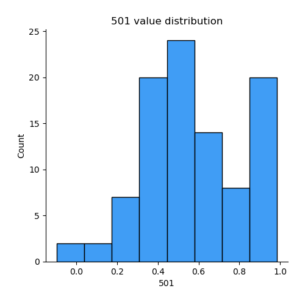
## Feature : 502
- **Feature type** : continous
- **Missing** : 0.0%
- **Unique** : 97
- **Count** :97.0
- **Mean** :0.6435723152346626
- **Std** :0.22798498739679005
- **Min** :-0.0036464950449678654
- **25%th Percentile** : 0.5071530113496002
- **50%th Percentile** : 0.6292644766117153
- **75%th Percentile** : 0.8221145923636312
- **Max** :0.9830602170984166

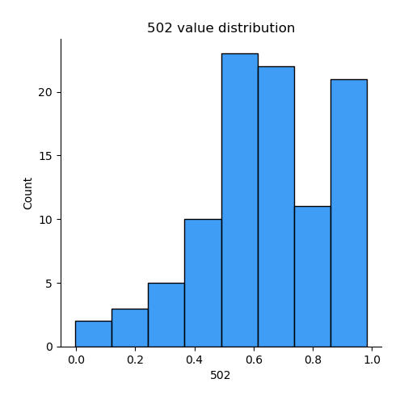
## Feature : 503
- **Feature type** : continous
- **Missing** : 0.0%
- **Unique** : 97
- **Count** :97.0
- **Mean** :0.9112979875562295
- **Std** :0.09666747252791055
- **Min** :0.5446028370824848
- **25%th Percentile** : 0.8878616113617138
- **50%th Percentile** : 0.940236218818474
- **75%th Percentile** : 0.9763366830719498
- **Max** :0.9973029204761716

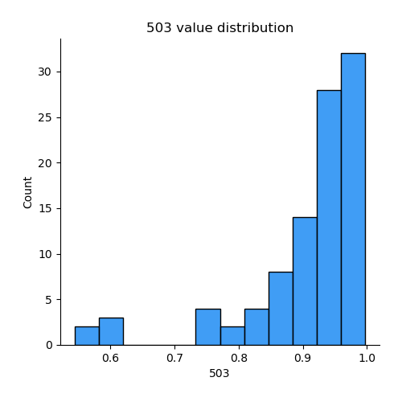
## Feature : 504
- **Feature type** : continous
- **Missing** : 0.0%
- **Unique** : 97
- **Count** :97.0
- **Mean** :0.8173637424490104
- **Std** :0.1288394035828648
- **Min** :0.4005061579767487
- **25%th Percentile** : 0.7288747195833396
- **50%th Percentile** : 0.8257970039957152
- **75%th Percentile** : 0.9091765976884005
- **Max** :0.9920669171077953

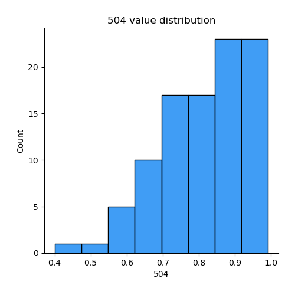
## Feature : 505
- **Feature type** : continous
- **Missing** : 0.0%
- **Unique** : 97
- **Count** :97.0
- **Mean** :0.6098968228072729
- **Std** :0.2667794351358724
- **Min** :-0.028484307770149347
- **25%th Percentile** : 0.4142399255976987
- **50%th Percentile** : 0.6189219775804737
- **75%th Percentile** : 0.8545445086941755
- **Max** :0.9886289523786238

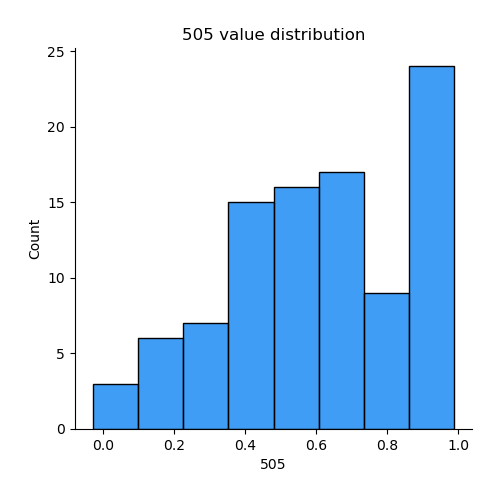
## Feature : 506
- **Feature type** : continous
- **Missing** : 0.0%
- **Unique** : 97
- **Count** :97.0
- **Mean** :0.5200243369441918
- **Std** :0.3284195666475826
- **Min** :-0.34272430741298243
- **25%th Percentile** : 0.31662055533100697
- **50%th Percentile** : 0.5327529675334232
- **75%th Percentile** : 0.7375641987306036
- **Max** :0.9845960778822687

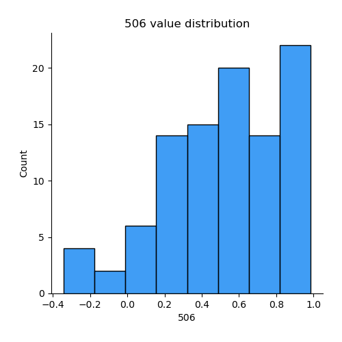
## Feature : 507
- **Feature type** : continous
- **Missing** : 0.0%
- **Unique** : 97
- **Count** :97.0
- **Mean** :0.59170203532135
- **Std** :0.25142569381908847
- **Min** :0.045740181221545106
- **25%th Percentile** : 0.4155486212168236
- **50%th Percentile** : 0.5747066115642523
- **75%th Percentile** : 0.7786121526219587
- **Max** :0.990428353256582

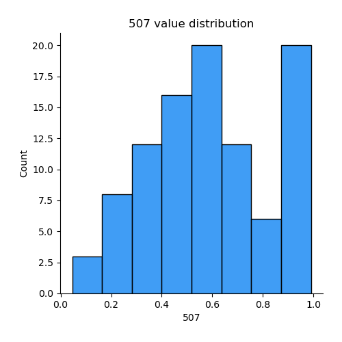
## Feature : 508
- **Feature type** : continous
- **Missing** : 0.0%
- **Unique** : 97
- **Count** :97.0
- **Mean** :0.781736975392046
- **Std** :0.14414924724827127
- **Min** :0.41455830747159766
- **25%th Percentile** : 0.6800240498720067
- **50%th Percentile** : 0.7922203602004622
- **75%th Percentile** : 0.904868177130983
- **Max** :0.9879043397963848

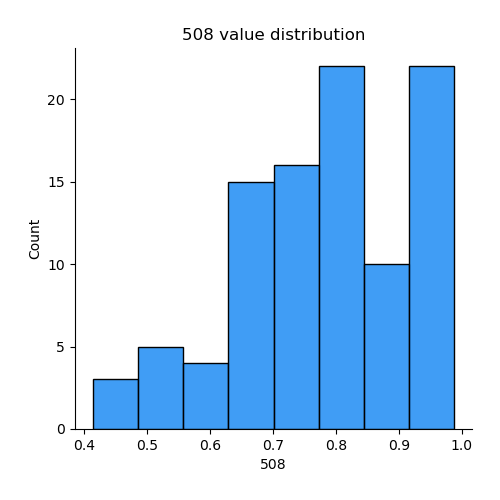
## Feature : 509
- **Feature type** : continous
- **Missing** : 0.0%
- **Unique** : 97
- **Count** :97.0
- **Mean** :0.5300001932359221
- **Std** :0.32621126541625595
- **Min** :-0.3524735097656251
- **25%th Percentile** : 0.31147489509313175
- **50%th Percentile** : 0.5454161377345284
- **75%th Percentile** : 0.7350663492980437
- **Max** :0.9852361408142576

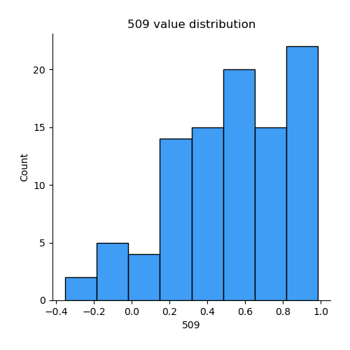
## Feature : 510
- **Feature type** : continous
- **Missing** : 0.0%
- **Unique** : 97
- **Count** :97.0
- **Mean** :0.5708709781634631
- **Std** :0.26819077786338513
- **Min** :-0.14303336599163466
- **25%th Percentile** : 0.39883985017147483
- **50%th Percentile** : 0.546928337651681
- **75%th Percentile** : 0.7833867505493779
- **Max** :0.9804590885039242

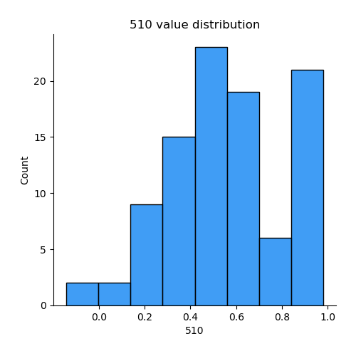
## Feature : 511
- **Feature type** : continous
- **Missing** : 0.0%
- **Unique** : 97
- **Count** :97.0
- **Mean** :0.568599324754401
- **Std** :0.30321547094677825
- **Min** :-0.33214311457205203
- **25%th Percentile** : 0.3390607471706774
- **50%th Percentile** : 0.6048753817777444
- **75%th Percentile** : 0.7843946721653597
- **Max** :0.9883737735853234

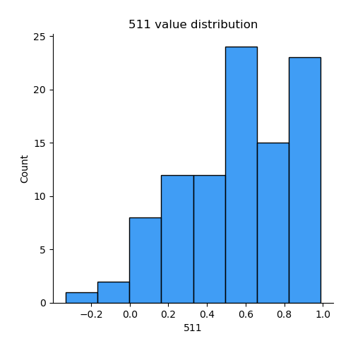
## Feature : 512
- **Feature type** : continous
- **Missing** : 0.0%
- **Unique** : 97
- **Count** :97.0
- **Mean** :0.6771334389494916
- **Std** :0.22141587763403095
- **Min** :0.0873132285396806
- **25%th Percentile** : 0.5470040016214229
- **50%th Percentile** : 0.6802231881266714
- **75%th Percentile** : 0.8347883409768823
- **Max** :0.9874745552655573

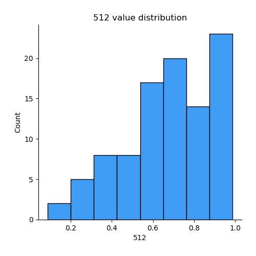
## Feature : 513
- **Feature type** : continous
- **Missing** : 0.0%
- **Unique** : 97
- **Count** :97.0
- **Mean** :0.38280254475515013
- **Std** :0.34750003670052554
- **Min** :-0.3912950515807228
- **25%th Percentile** : 0.1486398403425361
- **50%th Percentile** : 0.28373851225077146
- **75%th Percentile** : 0.6042118594116682
- **Max** :0.9763779342373208

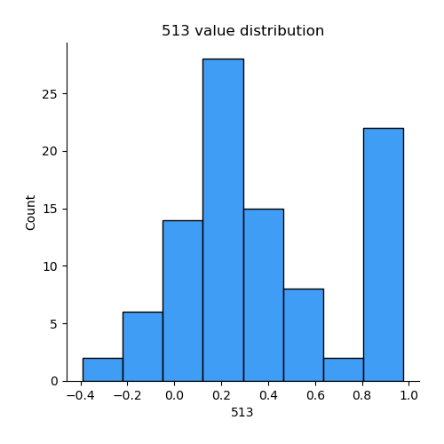
## Feature : 514
- **Feature type** : continous
- **Missing** : 0.0%
- **Unique** : 97
- **Count** :97.0
- **Mean** :0.5356372856363534
- **Std** :0.3191951005417924
- **Min** :-0.25916126775033094
- **25%th Percentile** : 0.3663580700190795
- **50%th Percentile** : 0.5392278120194556
- **75%th Percentile** : 0.7821986715131939
- **Max** :0.9813336291743839

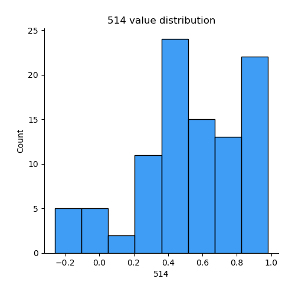
## Feature : 515
- **Feature type** : continous
- **Missing** : 0.0%
- **Unique** : 97
- **Count** :97.0
- **Mean** :0.704032699312845
- **Std** :0.22532465544552588
- **Min** :0.014187848719834684
- **25%th Percentile** : 0.5874909393798603
- **50%th Percentile** : 0.7239114362939376
- **75%th Percentile** : 0.8712034428864339
- **Max** :0.9904032619870676

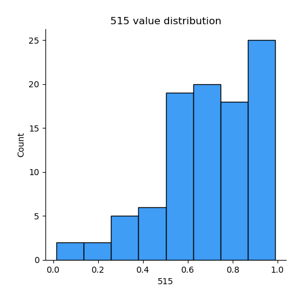
## Feature : 516
- **Feature type** : continous
- **Missing** : 0.0%
- **Unique** : 97
- **Count** :97.0
- **Mean** :0.5935673109078377
- **Std** :0.26967597269179644
- **Min** :-0.047388595373117286
- **25%th Percentile** : 0.4352254472861792
- **50%th Percentile** : 0.566888118304995
- **75%th Percentile** : 0.8088407119262893
- **Max** :0.9842338133687516

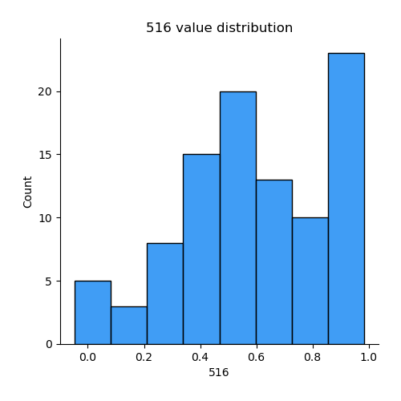
## Feature : 517
- **Feature type** : continous
- **Missing** : 0.0%
- **Unique** : 97
- **Count** :97.0
- **Mean** :0.5957531952394526
- **Std** :0.26126922317682055
- **Min** :-0.01983693262464262
- **25%th Percentile** : 0.423307276616883
- **50%th Percentile** : 0.5803860093743168
- **75%th Percentile** : 0.7833918520646783
- **Max** :0.9877520620883647

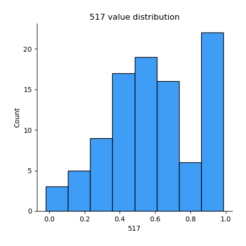
## Feature : 518
- **Feature type** : continous
- **Missing** : 0.0%
- **Unique** : 97
- **Count** :97.0
- **Mean** :0.3875573794517725
- **Std** :0.33350648136331534
- **Min** :-0.3530457940781401
- **25%th Percentile** : 0.16974617247382856
- **50%th Percentile** : 0.3584592104324122
- **75%th Percentile** : 0.5719165158757025
- **Max** :0.9765283839003868

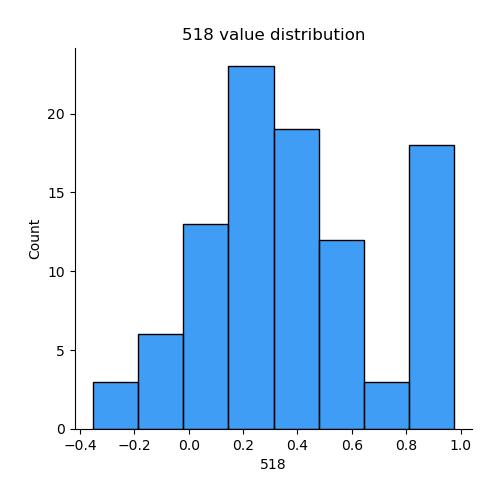
## Feature : 519
- **Feature type** : continous
- **Missing** : 0.0%
- **Unique** : 97
- **Count** :97.0
- **Mean** :0.4923119942290587
- **Std** :0.29656580422973444
- **Min** :-0.11438540707162044
- **25%th Percentile** : 0.27192217754606524
- **50%th Percentile** : 0.4300015914343697
- **75%th Percentile** : 0.7368211066190011
- **Max** :0.9799736898630608

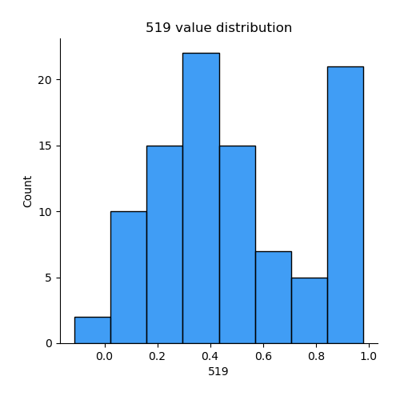
## Feature : 530
- **Feature type** : continous
- **Missing** : 0.0%
- **Unique** : 3
- **Count** :97.0
- **Mean** :1.0
- **Std** :9.135478326654835e-17
- **Min** :0.9999999999999998
- **25%th Percentile** : 0.9999999999999999
- **50%th Percentile** : 1.0
- **75%th Percentile** : 1.0
- **Max** :1.0

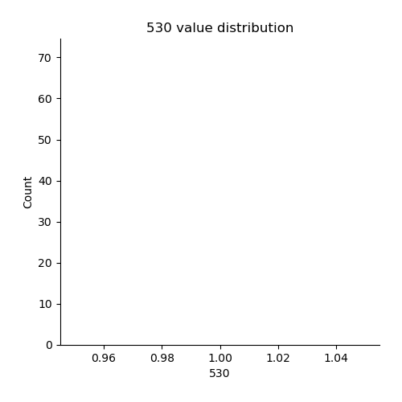
## Feature : 531
- **Feature type** : continous
- **Missing** : 0.0%
- **Unique** : 97
- **Count** :97.0
- **Mean** :0.6188803603810119
- **Std** :0.25559706780855185
- **Min** :-0.0604056330627462
- **25%th Percentile** : 0.432002806701585
- **50%th Percentile** : 0.6217182233993995
- **75%th Percentile** : 0.844058384317301
- **Max** :0.9895523375681382

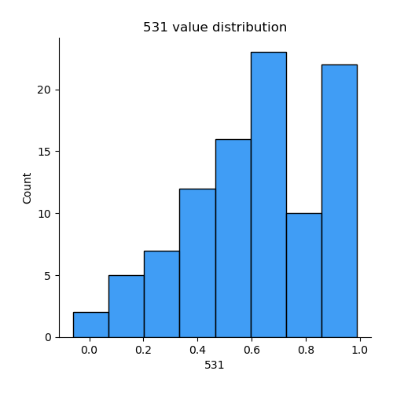
## Feature : 532
- **Feature type** : continous
- **Missing** : 0.0%
- **Unique** : 97
- **Count** :97.0
- **Mean** :0.564596247792458
- **Std** :0.3087655100328376
- **Min** :-0.19263590131914862
- **25%th Percentile** : 0.3825826062335496
- **50%th Percentile** : 0.5913234825342311
- **75%th Percentile** : 0.7947547784370724
- **Max** :0.9901538273894385

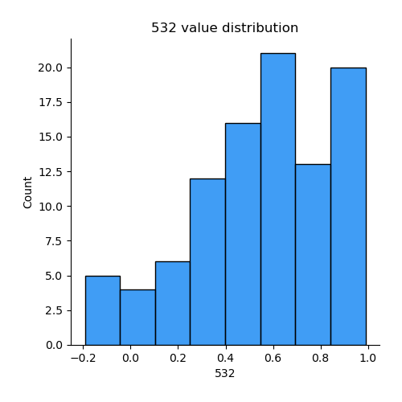
## Feature : 533
- **Feature type** : continous
- **Missing** : 0.0%
- **Unique** : 97
- **Count** :97.0
- **Mean** :0.6674368719441918
- **Std** :0.22347154103644526
- **Min** :0.08372452241039377
- **25%th Percentile** : 0.5131091063512248
- **50%th Percentile** : 0.6767981811361952
- **75%th Percentile** : 0.8132177584821206
- **Max** :0.9909686064764787

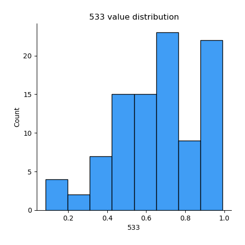
## Feature : 534
- **Feature type** : continous
- **Missing** : 0.0%
- **Unique** : 97
- **Count** :97.0
- **Mean** :0.8994946050215019
- **Std** :0.06749418468383765
- **Min** :0.7009330401018855
- **25%th Percentile** : 0.8605860882035804
- **50%th Percentile** : 0.9069310940222093
- **75%th Percentile** : 0.9440983230250898
- **Max** :0.9952474988839619

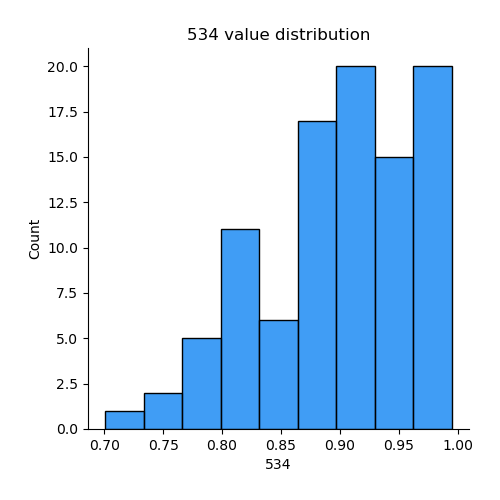
## Feature : 535
- **Feature type** : continous
- **Missing** : 0.0%
- **Unique** : 97
- **Count** :97.0
- **Mean** :0.5953845558319519
- **Std** :0.2657843232984105
- **Min** :-0.015081416825520352
- **25%th Percentile** : 0.39980857529008096
- **50%th Percentile** : 0.6062333853134593
- **75%th Percentile** : 0.782233753558213
- **Max** :0.9912206049320551

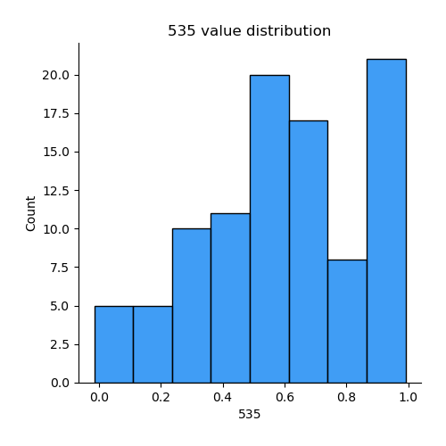
## Feature : 536
- **Feature type** : continous
- **Missing** : 0.0%
- **Unique** : 97
- **Count** :97.0
- **Mean** :0.6386191929219194
- **Std** :0.2443701927000626
- **Min** :-0.16313344720618667
- **25%th Percentile** : 0.4884830152644682
- **50%th Percentile** : 0.6392487678402035
- **75%th Percentile** : 0.8439293758650399
- **Max** :0.9908863180347649

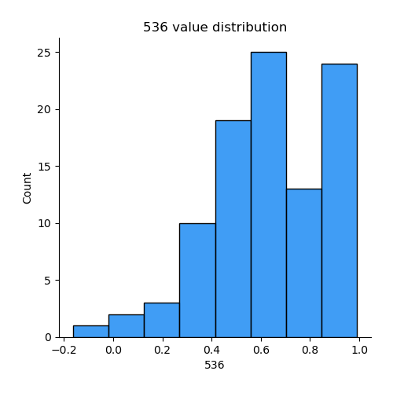
## Feature : 537
- **Feature type** : continous
- **Missing** : 0.0%
- **Unique** : 97
- **Count** :97.0
- **Mean** :0.6231593558660722
- **Std** :0.2532097680576844
- **Min** :-0.01277094256242809
- **25%th Percentile** : 0.44710714546317615
- **50%th Percentile** : 0.6355404391788557
- **75%th Percentile** : 0.7778514405704806
- **Max** :0.9934287976239803

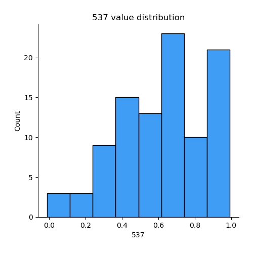
## Feature : 538
- **Feature type** : continous
- **Missing** : 0.0%
- **Unique** : 97
- **Count** :97.0
- **Mean** :0.7456043713163482
- **Std** :0.1902997470122944
- **Min** :0.10833617285317167
- **25%th Percentile** : 0.6560526860365943
- **50%th Percentile** : 0.7544480611350205
- **75%th Percentile** : 0.8970337375891047
- **Max** :0.9889693846071789

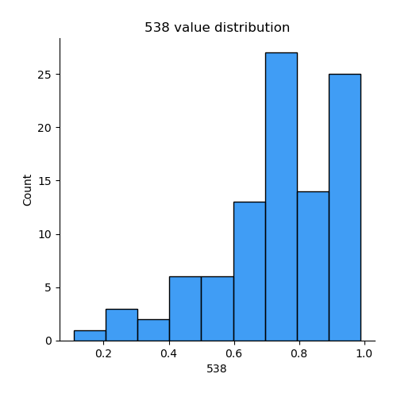
## Feature : 539
- **Feature type** : continous
- **Missing** : 0.0%
- **Unique** : 97
- **Count** :97.0
- **Mean** :0.4368338421475005
- **Std** :0.3300155178875136
- **Min** :-0.43350171151346784
- **25%th Percentile** : 0.21436423388396722
- **50%th Percentile** : 0.3545024802963595
- **75%th Percentile** : 0.7011599820510093
- **Max** :0.9818457388570507

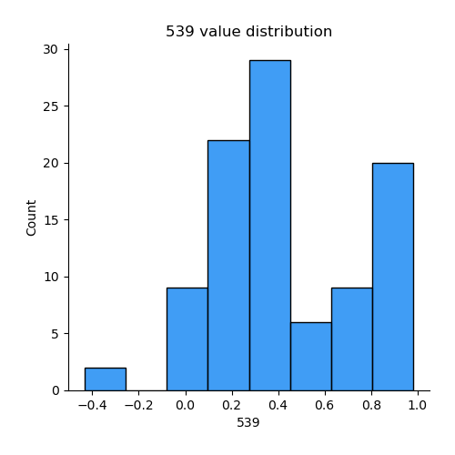
## Feature : 540
- **Feature type** : continous
- **Missing** : 0.0%
- **Unique** : 97
- **Count** :97.0
- **Mean** :0.5356723995396759
- **Std** :0.3146650942953594
- **Min** :-0.2794428536034111
- **25%th Percentile** : 0.31616130472800474
- **50%th Percentile** : 0.5207590157507056
- **75%th Percentile** : 0.7497952677311286
- **Max** :0.9929908700421309

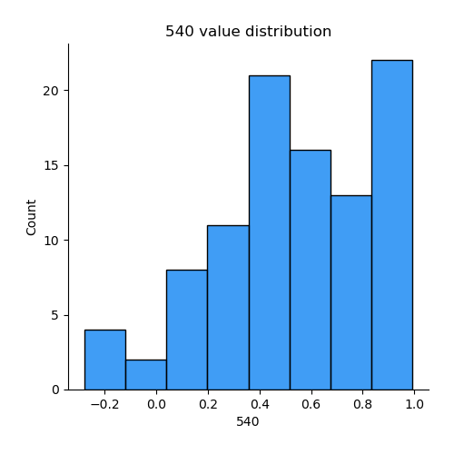
## Feature : 541
- **Feature type** : continous
- **Missing** : 0.0%
- **Unique** : 97
- **Count** :97.0
- **Mean** :0.7387697847184257
- **Std** :0.19883551754888282
- **Min** :0.11951159485574032
- **25%th Percentile** : 0.6605278795384363
- **50%th Percentile** : 0.7687883294757619
- **75%th Percentile** : 0.8607330291813402
- **Max** :0.99305313246904

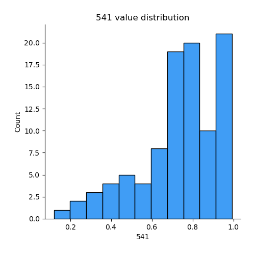
## Feature : 542
- **Feature type** : continous
- **Missing** : 0.0%
- **Unique** : 97
- **Count** :97.0
- **Mean** :0.6653036345702802
- **Std** :0.22277856920319147
- **Min** :-0.047270566684273055
- **25%th Percentile** : 0.5251162081411589
- **50%th Percentile** : 0.6589011963966407
- **75%th Percentile** : 0.8487710972803614
- **Max** :0.9880061533474847

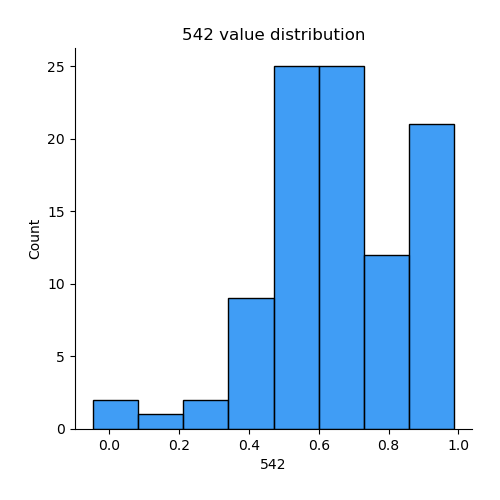
## Feature : 543
- **Feature type** : continous
- **Missing** : 0.0%
- **Unique** : 97
- **Count** :97.0
- **Mean** :0.6434176660281772
- **Std** :0.2243814312891873
- **Min** :-0.03481430264138682
- **25%th Percentile** : 0.48453469699203966
- **50%th Percentile** : 0.616414885486973
- **75%th Percentile** : 0.8072568789061814
- **Max** :0.9935723521815844

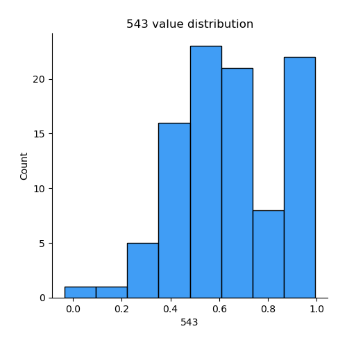
## Feature : 544
- **Feature type** : continous
- **Missing** : 0.0%
- **Unique** : 97
- **Count** :97.0
- **Mean** :0.438353914554754
- **Std** :0.30141361496888486
- **Min** :-0.09233873771546536
- **25%th Percentile** : 0.2540564328273009
- **50%th Percentile** : 0.37773816471210925
- **75%th Percentile** : 0.5839848806861802
- **Max** :0.9695754987998599

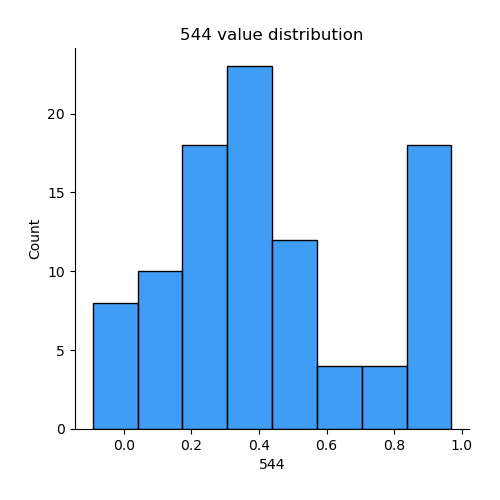
## Feature : 545
- **Feature type** : continous
- **Missing** : 0.0%
- **Unique** : 97
- **Count** :97.0
- **Mean** :0.6157506172219078
- **Std** :0.2324987362648822
- **Min** :0.05958528649578376
- **25%th Percentile** : 0.45564203412250787
- **50%th Percentile** : 0.5796301365180935
- **75%th Percentile** : 0.7866964269221711
- **Max** :0.9818374349315212

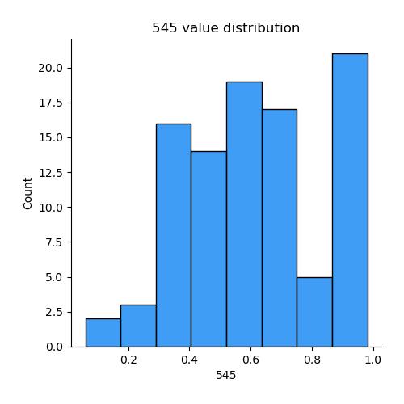
## Feature : 546
- **Feature type** : continous
- **Missing** : 0.0%
- **Unique** : 97
- **Count** :97.0
- **Mean** :0.594166895961936
- **Std** :0.2666058675049831
- **Min** :-0.10624398997696181
- **25%th Percentile** : 0.4046484575130035
- **50%th Percentile** : 0.6025188776108704
- **75%th Percentile** : 0.7915697332131243
- **Max** :0.9887014533793256

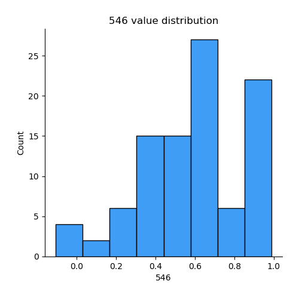
## Feature : 547
- **Feature type** : continous
- **Missing** : 0.0%
- **Unique** : 97
- **Count** :97.0
- **Mean** :0.543625827672295
- **Std** :0.28683067516288785
- **Min** :-0.12317273756018154
- **25%th Percentile** : 0.34797712674904946
- **50%th Percentile** : 0.5507839551488609
- **75%th Percentile** : 0.7256774597884651
- **Max** :0.9911792684322249

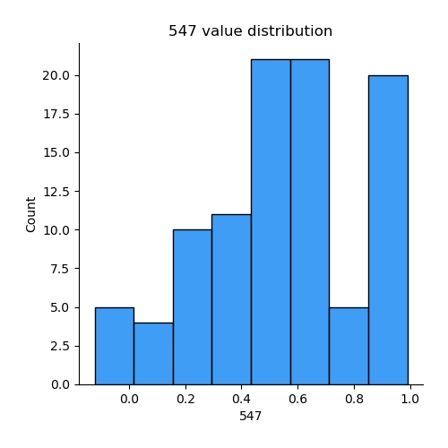
## Feature : 548
- **Feature type** : continous
- **Missing** : 0.0%
- **Unique** : 97
- **Count** :97.0
- **Mean** :0.8276251526671338
- **Std** :0.13539605535444418
- **Min** :0.4725077102612275
- **25%th Percentile** : 0.764080964279504
- **50%th Percentile** : 0.8473101741869175
- **75%th Percentile** : 0.9419103121433784
- **Max** :0.9947302139331119

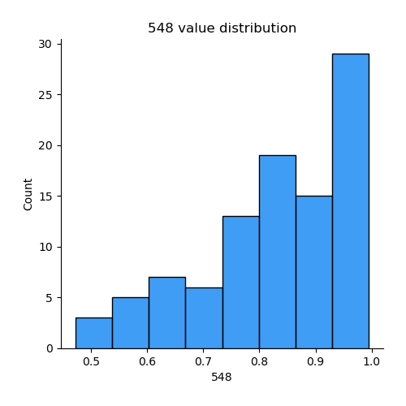
## Feature : 549
- **Feature type** : continous
- **Missing** : 0.0%
- **Unique** : 97
- **Count** :97.0
- **Mean** :0.42224816561155315
- **Std** :0.3317880394945226
- **Min** :-0.4511563704275283
- **25%th Percentile** : 0.21323201725815472
- **50%th Percentile** : 0.39158224958616333
- **75%th Percentile** : 0.6847097118216116
- **Max** :0.9791117351835982

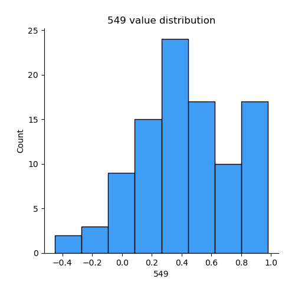
## Feature : 550
- **Feature type** : continous
- **Missing** : 0.0%
- **Unique** : 97
- **Count** :97.0
- **Mean** :0.788243772434444
- **Std** :0.15477444020150455
- **Min** :0.3059694993156657
- **25%th Percentile** : 0.6964461062104749
- **50%th Percentile** : 0.7980584912839619
- **75%th Percentile** : 0.8952174661802622
- **Max** :0.9963479941993085

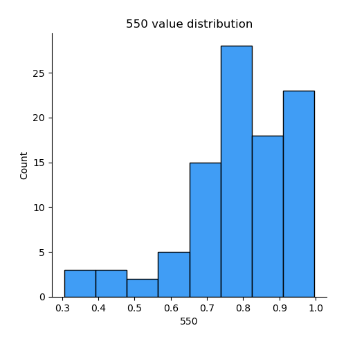
## Feature : 551
- **Feature type** : continous
- **Missing** : 0.0%
- **Unique** : 97
- **Count** :97.0
- **Mean** :0.6609764142742254
- **Std** :0.23063381013025291
- **Min** :0.09032710266205717
- **25%th Percentile** : 0.4645809801929816
- **50%th Percentile** : 0.693826600227634
- **75%th Percentile** : 0.8478189070880597
- **Max** :0.989942242832127

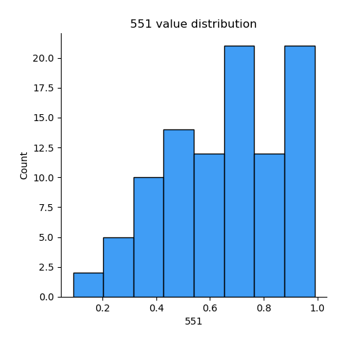
## Feature : 552
- **Feature type** : continous
- **Missing** : 0.0%
- **Unique** : 97
- **Count** :97.0
- **Mean** :0.6225913012717322
- **Std** :0.24476336978189792
- **Min** :-0.014437406776455667
- **25%th Percentile** : 0.4566120160109567
- **50%th Percentile** : 0.6387948419466345
- **75%th Percentile** : 0.7583642031723015
- **Max** :0.9930840617478013

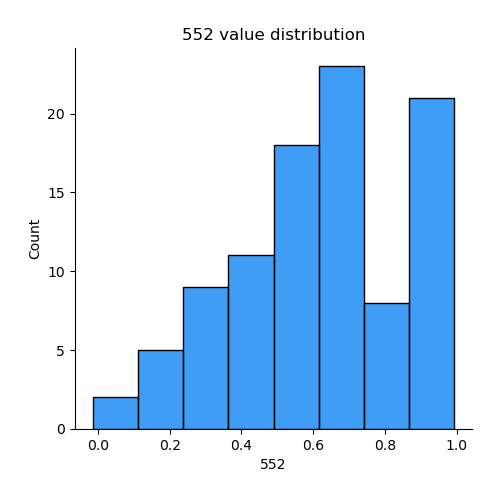
## Feature : 553
- **Feature type** : continous
- **Missing** : 0.0%
- **Unique** : 97
- **Count** :97.0
- **Mean** :0.6411149917874164
- **Std** :0.22928203771299105
- **Min** :-0.06111782912591464
- **25%th Percentile** : 0.47454914891379624
- **50%th Percentile** : 0.6254337420724055
- **75%th Percentile** : 0.795734508271934
- **Max** :0.9910712895783194

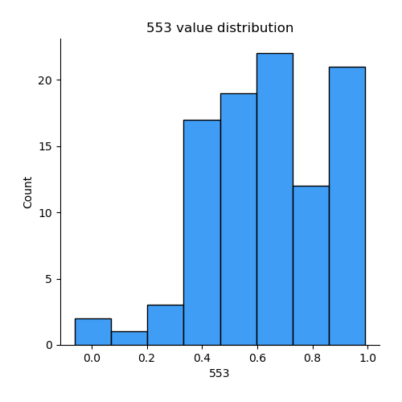
## Feature : 554
- **Feature type** : continous
- **Missing** : 0.0%
- **Unique** : 97
- **Count** :97.0
- **Mean** :0.7296381764428709
- **Std** :0.19612009355789947
- **Min** :0.05643749467438161
- **25%th Percentile** : 0.5966298833928342
- **50%th Percentile** : 0.7360367893942757
- **75%th Percentile** : 0.8955145551684672
- **Max** :0.9926697194072182

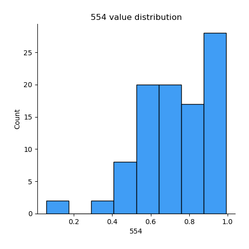
## Feature : 555
- **Feature type** : continous
- **Missing** : 0.0%
- **Unique** : 97
- **Count** :97.0
- **Mean** :0.785921674639357
- **Std** :0.15227661191449157
- **Min** :0.274643707305218
- **25%th Percentile** : 0.6947770898787654
- **50%th Percentile** : 0.7991490456522279
- **75%th Percentile** : 0.9122961445617738
- **Max** :0.9909886115388715

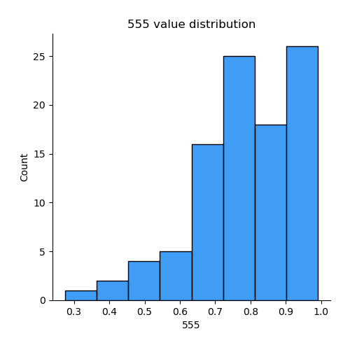
## Feature : 556
- **Feature type** : continous
- **Missing** : 0.0%
- **Unique** : 97
- **Count** :97.0
- **Mean** :0.9313987441895621
- **Std** :0.07528437596150582
- **Min** :0.4614794704255963
- **25%th Percentile** : 0.9110772773397185
- **50%th Percentile** : 0.9451700486101794
- **75%th Percentile** : 0.9788725541045281
- **Max** :0.9983252441033909

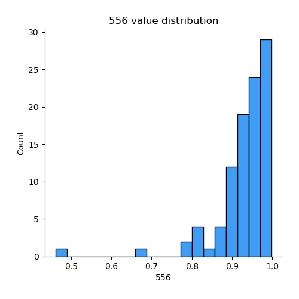
## Feature : 557
- **Feature type** : continous
- **Missing** : 0.0%
- **Unique** : 97
- **Count** :97.0
- **Mean** :0.6038828237956085
- **Std** :0.2656447839885649
- **Min** :-0.06256713111088193
- **25%th Percentile** : 0.42246890663360764
- **50%th Percentile** : 0.6224145686302583
- **75%th Percentile** : 0.8025803139118097
- **Max** :0.9901546159973005

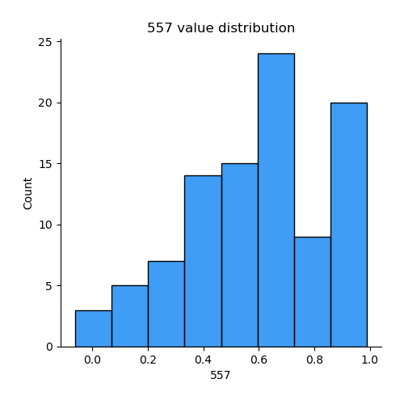
## Feature : 558
- **Feature type** : continous
- **Missing** : 0.0%
- **Unique** : 97
- **Count** :97.0
- **Mean** :0.5581191144964909
- **Std** :0.31703942226502096
- **Min** :-0.23953419790417765
- **25%th Percentile** : 0.3335272349489351
- **50%th Percentile** : 0.5906316722910062
- **75%th Percentile** : 0.7953154648224947
- **Max** :0.992001528623916

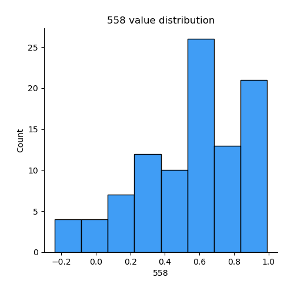
## Feature : 559
- **Feature type** : continous
- **Missing** : 0.0%
- **Unique** : 97
- **Count** :97.0
- **Mean** :0.660663593466936
- **Std** :0.2210869765512755
- **Min** :0.16896829700369437
- **25%th Percentile** : 0.518270943847443
- **50%th Percentile** : 0.64599262769931
- **75%th Percentile** : 0.8213404215897467
- **Max** :0.991432554123324

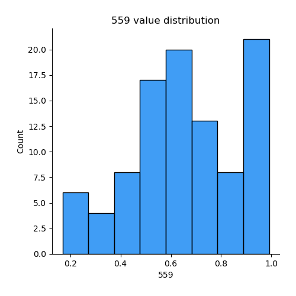
## Feature : 560
- **Feature type** : continous
- **Missing** : 0.0%
- **Unique** : 97
- **Count** :97.0
- **Mean** :0.8722096805717672
- **Std** :0.10334029814919422
- **Min** :0.2469211860581759
- **25%th Percentile** : 0.8281581835565748
- **50%th Percentile** : 0.8873568428601365
- **75%th Percentile** : 0.9378612519248533
- **Max** :0.9943242319223734

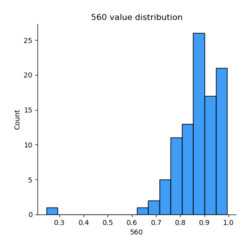
## Feature : 561
- **Feature type** : continous
- **Missing** : 0.0%
- **Unique** : 97
- **Count** :97.0
- **Mean** :0.559632462381087
- **Std** :0.3216005674362189
- **Min** :-0.2904894068232131
- **25%th Percentile** : 0.379187720834889
- **50%th Percentile** : 0.6098868642965328
- **75%th Percentile** : 0.7881768844694916
- **Max** :0.9906355916321836

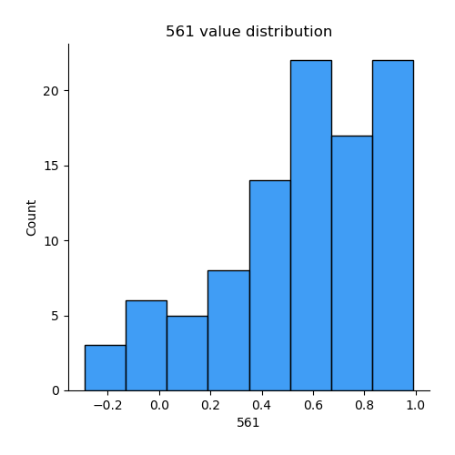
## Feature : 562
- **Feature type** : continous
- **Missing** : 0.0%
- **Unique** : 97
- **Count** :97.0
- **Mean** :0.620724874996597
- **Std** :0.2585166414089801
- **Min** :-0.08732856764617944
- **25%th Percentile** : 0.4610437997737471
- **50%th Percentile** : 0.6047319504799852
- **75%th Percentile** : 0.8285112757406152
- **Max** :0.9925840380901079

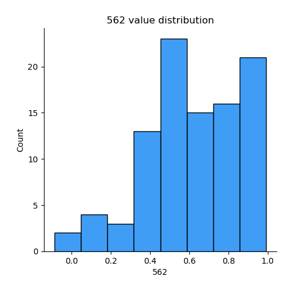
## Feature : 563
- **Feature type** : continous
- **Missing** : 0.0%
- **Unique** : 97
- **Count** :97.0
- **Mean** :0.6004682077590985
- **Std** :0.29173060040429505
- **Min** :-0.12107754838900206
- **25%th Percentile** : 0.3982179786305388
- **50%th Percentile** : 0.6380525823844365
- **75%th Percentile** : 0.7947029016839103
- **Max** :0.9917825505738842

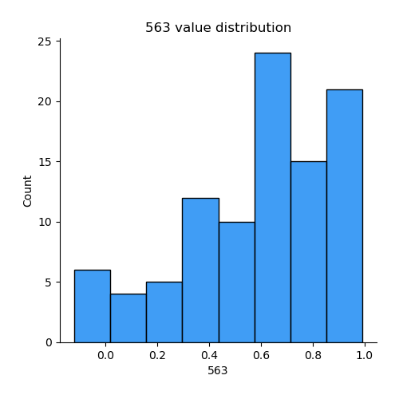
## Feature : 564
- **Feature type** : continous
- **Missing** : 0.0%
- **Unique** : 97
- **Count** :97.0
- **Mean** :0.7423860295164069
- **Std** :0.18767077489330908
- **Min** :0.22300885638544227
- **25%th Percentile** : 0.6449469545685456
- **50%th Percentile** : 0.7751092044718204
- **75%th Percentile** : 0.882292389801225
- **Max** :0.9890887612294654

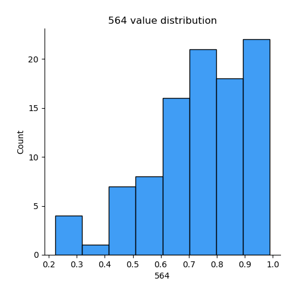
## Feature : 565
- **Feature type** : continous
- **Missing** : 0.0%
- **Unique** : 97
- **Count** :97.0
- **Mean** :0.3923387969267827
- **Std** :0.34727848550150703
- **Min** :-0.5747080466004911
- **25%th Percentile** : 0.17047814530302863
- **50%th Percentile** : 0.30252361725718074
- **75%th Percentile** : 0.6517071209693297
- **Max** :0.9846768850581578

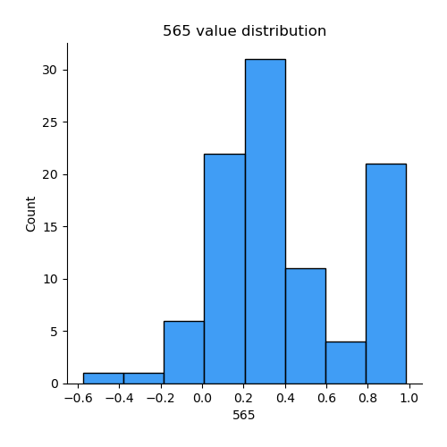
## Feature : 566
- **Feature type** : continous
- **Missing** : 0.0%
- **Unique** : 97
- **Count** :97.0
- **Mean** :0.5530590972907717
- **Std** :0.31954467198876385
- **Min** :-0.3220707134908618
- **25%th Percentile** : 0.36232129141336616
- **50%th Percentile** : 0.5618244891204601
- **75%th Percentile** : 0.7861544075751944
- **Max** :0.9932278965189834

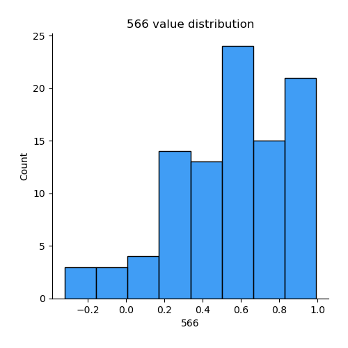
## Feature : 567
- **Feature type** : continous
- **Missing** : 0.0%
- **Unique** : 97
- **Count** :97.0
- **Mean** :0.7155529925876153
- **Std** :0.22056431436531715
- **Min** :-0.03498587729885135
- **25%th Percentile** : 0.5995211243921975
- **50%th Percentile** : 0.7617149790878381
- **75%th Percentile** : 0.8568724281450607
- **Max** :0.9937346131437992

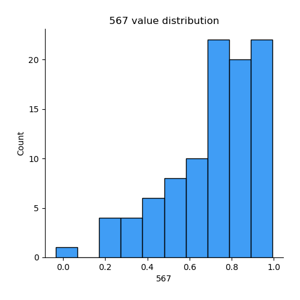
## Feature : 568
- **Feature type** : continous
- **Missing** : 0.0%
- **Unique** : 97
- **Count** :97.0
- **Mean** :0.6279990540050157
- **Std** :0.24984084226045894
- **Min** :-0.02206248340217992
- **25%th Percentile** : 0.48646655227381475
- **50%th Percentile** : 0.6378598914052724
- **75%th Percentile** : 0.8050635843664389
- **Max** :0.99059909826321

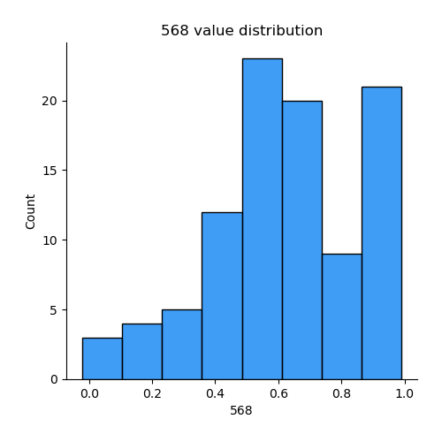
## Feature : 569
- **Feature type** : continous
- **Missing** : 0.0%
- **Unique** : 97
- **Count** :97.0
- **Mean** :0.6285870534929486
- **Std** :0.25221727897383933
- **Min** :-0.12500785186866456
- **25%th Percentile** : 0.4649085845550037
- **50%th Percentile** : 0.6222701749033988
- **75%th Percentile** : 0.7984535026648178
- **Max** :0.987724418841658

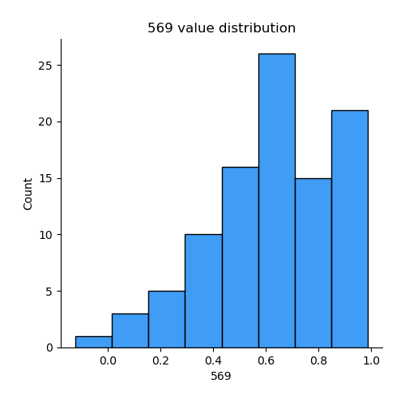
## Feature : 570
- **Feature type** : continous
- **Missing** : 0.0%
- **Unique** : 97
- **Count** :97.0
- **Mean** :0.4252923431169405
- **Std** :0.3183554598354631
- **Min** :-0.27484123467277005
- **25%th Percentile** : 0.20597576935377743
- **50%th Percentile** : 0.3894543609211434
- **75%th Percentile** : 0.6216911096471679
- **Max** :0.9738209693266389

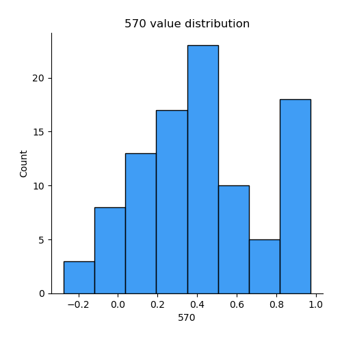
## Feature : 571
- **Feature type** : continous
- **Missing** : 0.0%
- **Unique** : 97
- **Count** :97.0
- **Mean** :0.5337671195021874
- **Std** :0.2857118144527575
- **Min** :-0.1152040599932824
- **25%th Percentile** : 0.33152655088864685
- **50%th Percentile** : 0.5027102716631707
- **75%th Percentile** : 0.7626635760946023
- **Max** :0.9809412988216195

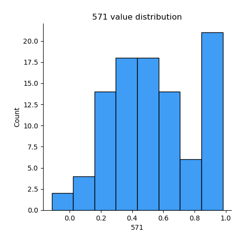
## Feature : 583
- **Feature type** : continous
- **Missing** : 0.0%
- **Unique** : 3
- **Count** :97.0
- **Mean** :1.0
- **Std** :7.430342639414468e-17
- **Min** :0.9999999999999998
- **25%th Percentile** : 1.0
- **50%th Percentile** : 1.0
- **75%th Percentile** : 1.0
- **Max** :1.0

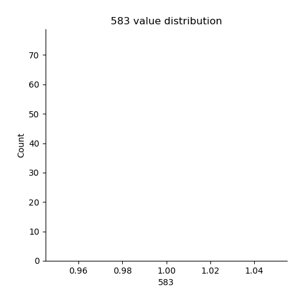
## Feature : 584
- **Feature type** : continous
- **Missing** : 0.0%
- **Unique** : 97
- **Count** :97.0
- **Mean** :0.4779616598014534
- **Std** :0.3461525071636979
- **Min** :-0.3682359747873041
- **25%th Percentile** : 0.24414689041616752
- **50%th Percentile** : 0.47414540703837993
- **75%th Percentile** : 0.6758680331307162
- **Max** :0.9919009639007269

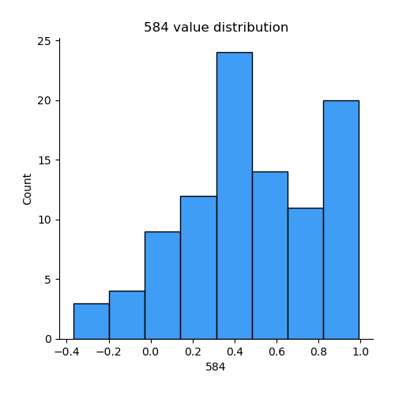
## Feature : 585
- **Feature type** : continous
- **Missing** : 0.0%
- **Unique** : 97
- **Count** :97.0
- **Mean** :0.6515638939916282
- **Std** :0.23342864806192423
- **Min** :-0.04372960579639625
- **25%th Percentile** : 0.46091658696107096
- **50%th Percentile** : 0.6629280107633724
- **75%th Percentile** : 0.8030431795072027
- **Max** :0.9941594322909205

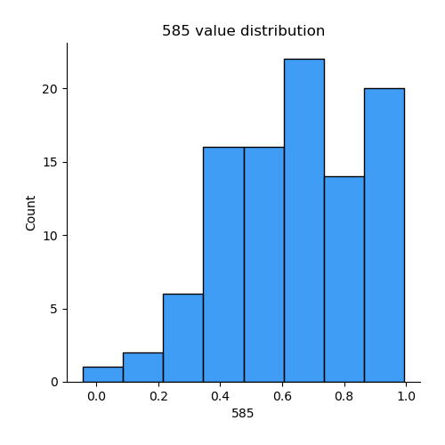
## Feature : 586
- **Feature type** : continous
- **Missing** : 0.0%
- **Unique** : 97
- **Count** :97.0
- **Mean** :0.5633259060675245
- **Std** :0.2703254212040506
- **Min** :-0.05658828437691086
- **25%th Percentile** : 0.3608875280045854
- **50%th Percentile** : 0.5614724043242444
- **75%th Percentile** : 0.7556655763574213
- **Max** :0.9842397969784608

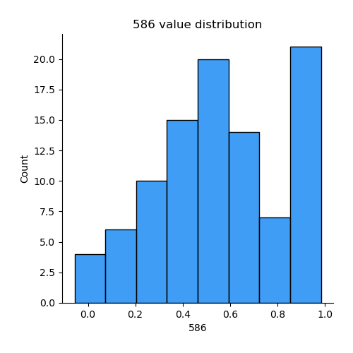
## Feature : 587
- **Feature type** : continous
- **Missing** : 0.0%
- **Unique** : 97
- **Count** :97.0
- **Mean** :0.5668074660745483
- **Std** :0.28823806725938556
- **Min** :-0.19698934118227143
- **25%th Percentile** : 0.3781757012386983
- **50%th Percentile** : 0.5507250894645109
- **75%th Percentile** : 0.779819422473298
- **Max** :0.9925040675034552

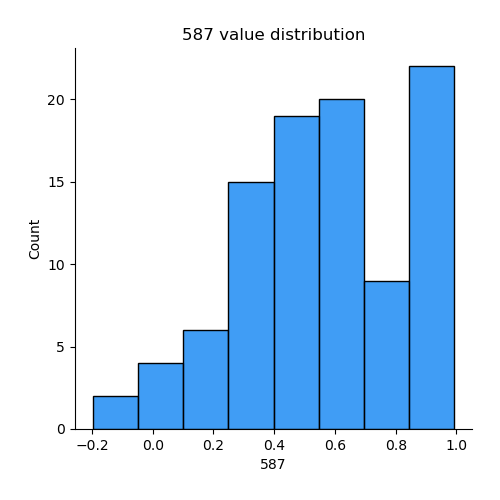
## Feature : 588
- **Feature type** : continous
- **Missing** : 0.0%
- **Unique** : 97
- **Count** :97.0
- **Mean** :0.6081735057178963
- **Std** :0.26186936893134205
- **Min** :0.013119373197705174
- **25%th Percentile** : 0.4458867364777317
- **50%th Percentile** : 0.5747156131337314
- **75%th Percentile** : 0.8171416139959513
- **Max** :0.9918534473970645

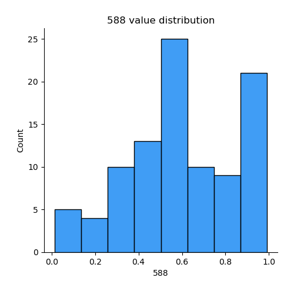
## Feature : 589
- **Feature type** : continous
- **Missing** : 0.0%
- **Unique** : 97
- **Count** :97.0
- **Mean** :0.5770356508438462
- **Std** :0.28511679193245604
- **Min** :-0.24987136468715318
- **25%th Percentile** : 0.3776080120654566
- **50%th Percentile** : 0.5699520835602593
- **75%th Percentile** : 0.7522094118473458
- **Max** :0.9935005273334925

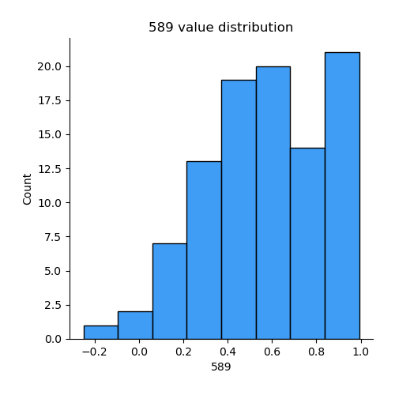
## Feature : 590
- **Feature type** : continous
- **Missing** : 0.0%
- **Unique** : 97
- **Count** :97.0
- **Mean** :0.6599619711219138
- **Std** :0.23833192020097133
- **Min** :-0.15258860220296447
- **25%th Percentile** : 0.5391201376464454
- **50%th Percentile** : 0.6867120897264245
- **75%th Percentile** : 0.8097647992927354
- **Max** :0.9901260885639455

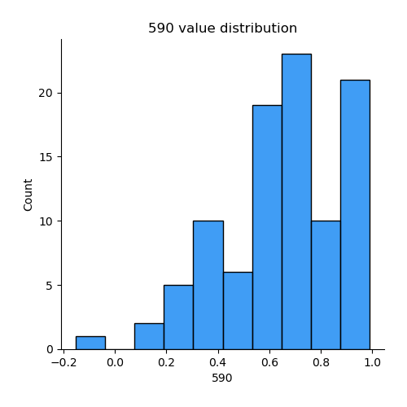
## Feature : 591
- **Feature type** : continous
- **Missing** : 0.0%
- **Unique** : 97
- **Count** :97.0
- **Mean** :0.5345328941683157
- **Std** :0.29384929145553046
- **Min** :-0.22043186437405282
- **25%th Percentile** : 0.3294354038896739
- **50%th Percentile** : 0.49045121886097476
- **75%th Percentile** : 0.7273751106573659
- **Max** :0.9893371832792239

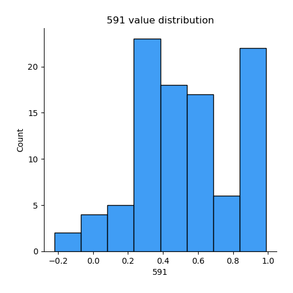
## Feature : 592
- **Feature type** : continous
- **Missing** : 0.0%
- **Unique** : 97
- **Count** :97.0
- **Mean** :0.6175398526478216
- **Std** :0.2873562248713
- **Min** :-0.310839002026737
- **25%th Percentile** : 0.4882178265504465
- **50%th Percentile** : 0.6298139612110419
- **75%th Percentile** : 0.8390096249114339
- **Max** :0.9948389730376695

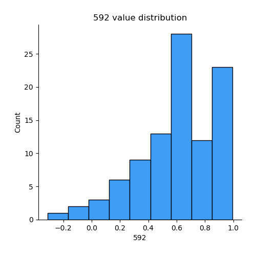
## Feature : 593
- **Feature type** : continous
- **Missing** : 0.0%
- **Unique** : 97
- **Count** :97.0
- **Mean** :0.5837950760769949
- **Std** :0.2934235352622632
- **Min** :-0.17342222594868534
- **25%th Percentile** : 0.36275119975237674
- **50%th Percentile** : 0.587569123146173
- **75%th Percentile** : 0.7805723247644976
- **Max** :0.9915731232433085

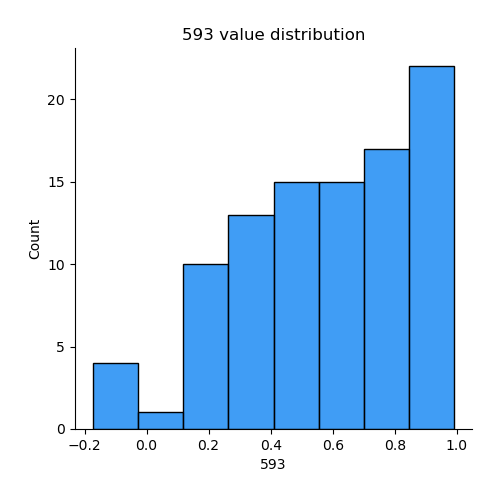
## Feature : 594
- **Feature type** : continous
- **Missing** : 0.0%
- **Unique** : 97
- **Count** :97.0
- **Mean** :0.7816123906849426
- **Std** :0.1634415930345082
- **Min** :0.24602911063931082
- **25%th Percentile** : 0.6904410252152764
- **50%th Percentile** : 0.7904750306049971
- **75%th Percentile** : 0.9085984544739237
- **Max** :0.9956981871718781

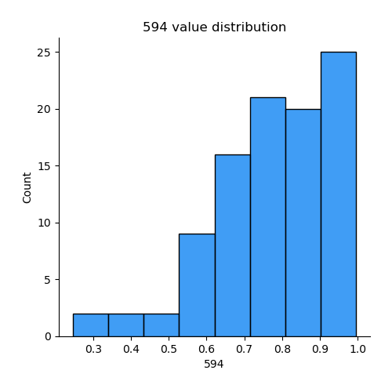
## Feature : 595
- **Feature type** : continous
- **Missing** : 0.0%
- **Unique** : 97
- **Count** :97.0
- **Mean** :0.6731533888259635
- **Std** :0.23453185107382615
- **Min** :0.13957478751401378
- **25%th Percentile** : 0.5219765676762385
- **50%th Percentile** : 0.6939572835847647
- **75%th Percentile** : 0.8550001805421427
- **Max** :0.99363957317789

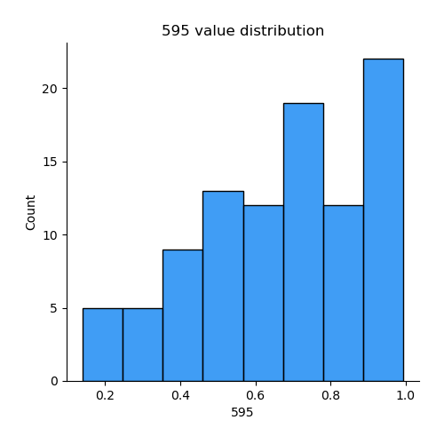
## Feature : 596
- **Feature type** : continous
- **Missing** : 0.0%
- **Unique** : 97
- **Count** :97.0
- **Mean** :0.5548624756654063
- **Std** :0.2636671431036291
- **Min** :-0.306901687176332
- **25%th Percentile** : 0.3731441541989025
- **50%th Percentile** : 0.5276103336517254
- **75%th Percentile** : 0.756683411135138
- **Max** :0.9867835406960724

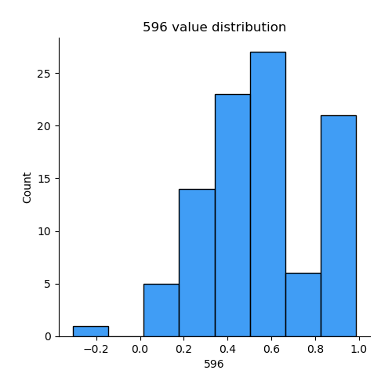
## Feature : 597
- **Feature type** : continous
- **Missing** : 0.0%
- **Unique** : 97
- **Count** :97.0
- **Mean** :0.6408406547768067
- **Std** :0.23061749898842235
- **Min** :0.026359760731583547
- **25%th Percentile** : 0.5051360189286473
- **50%th Percentile** : 0.6288108087623022
- **75%th Percentile** : 0.7872702948804994
- **Max** :0.9859643191642068

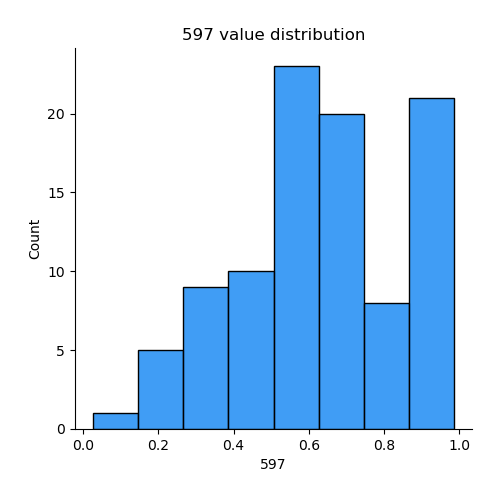
## Feature : 598
- **Feature type** : continous
- **Missing** : 0.0%
- **Unique** : 97
- **Count** :97.0
- **Mean** :0.5993642834200811
- **Std** :0.3037299046066794
- **Min** :-0.328993801387694
- **25%th Percentile** : 0.41568487021809103
- **50%th Percentile** : 0.6417033010995761
- **75%th Percentile** : 0.8511080614212767
- **Max** :0.992073534750854

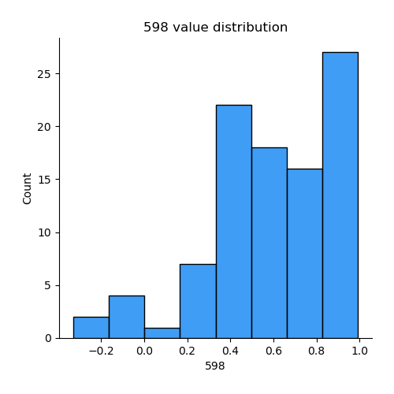
## Feature : 599
- **Feature type** : continous
- **Missing** : 0.0%
- **Unique** : 97
- **Count** :97.0
- **Mean** :0.4814916067306066
- **Std** :0.32742256687288124
- **Min** :-0.25612529342491874
- **25%th Percentile** : 0.2420210565293565
- **50%th Percentile** : 0.43970808539666484
- **75%th Percentile** : 0.7020017349833483
- **Max** :0.988199098504199

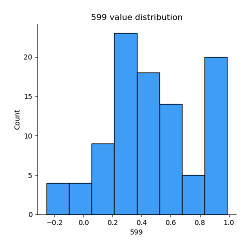
## Feature : 600
- **Feature type** : continous
- **Missing** : 0.0%
- **Unique** : 97
- **Count** :97.0
- **Mean** :0.5814196842682889
- **Std** :0.2762673454328641
- **Min** :-0.06120569213293783
- **25%th Percentile** : 0.37945118968495845
- **50%th Percentile** : 0.5742470963721659
- **75%th Percentile** : 0.7911158577205176
- **Max** :0.9866843037362625

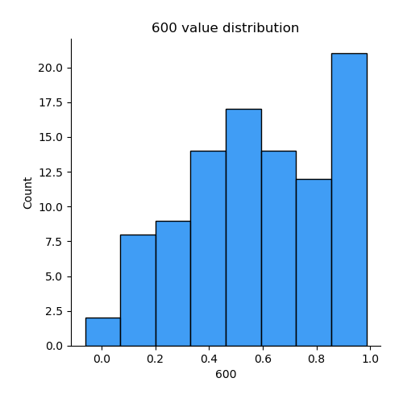
## Feature : 601
- **Feature type** : continous
- **Missing** : 0.0%
- **Unique** : 97
- **Count** :97.0
- **Mean** :0.44275271721860077
- **Std** :0.3300025301920035
- **Min** :-0.6021181594627237
- **25%th Percentile** : 0.21977883450805455
- **50%th Percentile** : 0.4413230673778682
- **75%th Percentile** : 0.677750450821253
- **Max** :0.9812279833234961

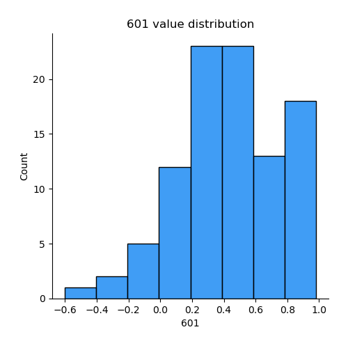
## Feature : 602
- **Feature type** : continous
- **Missing** : 0.0%
- **Unique** : 97
- **Count** :97.0
- **Mean** :0.6473195437214343
- **Std** :0.25446783565659026
- **Min** :-0.13910542522008484
- **25%th Percentile** : 0.47630026618571647
- **50%th Percentile** : 0.6769623384980803
- **75%th Percentile** : 0.8434774223312971
- **Max** :0.994267349741425

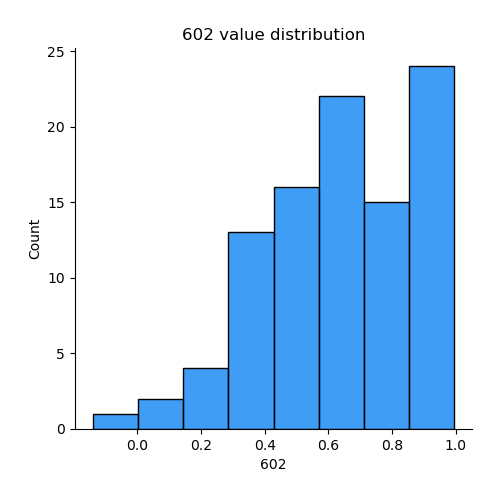
## Feature : 603
- **Feature type** : continous
- **Missing** : 0.0%
- **Unique** : 97
- **Count** :97.0
- **Mean** :0.6217156462946627
- **Std** :0.28589224686332265
- **Min** :-0.09650999614641508
- **25%th Percentile** : 0.42218846500459145
- **50%th Percentile** : 0.6556104520723507
- **75%th Percentile** : 0.8370453722007257
- **Max** :0.9942356447577659

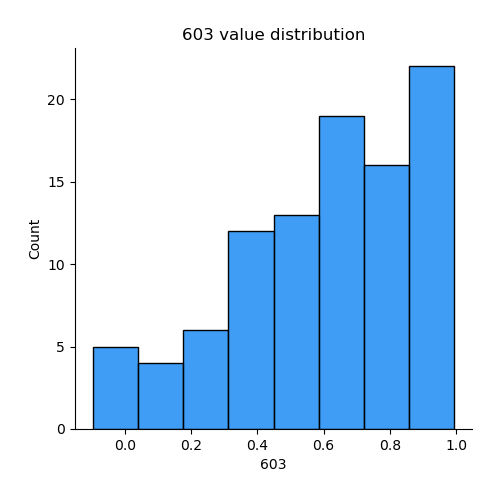
## Feature : 604
- **Feature type** : continous
- **Missing** : 0.0%
- **Unique** : 97
- **Count** :97.0
- **Mean** :0.6421114971108914
- **Std** :0.2702240189150655
- **Min** :-0.2086547587817152
- **25%th Percentile** : 0.47662966034581333
- **50%th Percentile** : 0.6609289402333705
- **75%th Percentile** : 0.8661334263792192
- **Max** :0.995113968776644

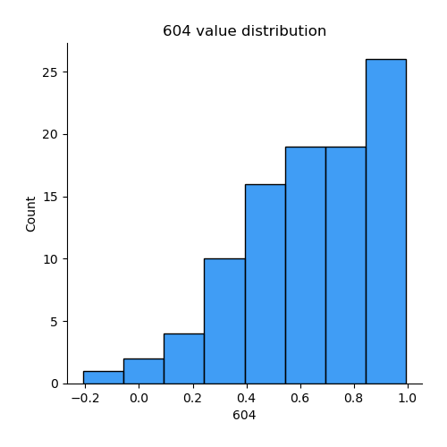
## Feature : 605
- **Feature type** : continous
- **Missing** : 0.0%
- **Unique** : 97
- **Count** :97.0
- **Mean** :0.5558893886453733
- **Std** :0.3099606255773904
- **Min** :-0.36564808322227565
- **25%th Percentile** : 0.3173222660759297
- **50%th Percentile** : 0.5768275042430124
- **75%th Percentile** : 0.7575645578708656
- **Max** :0.9919939325947796

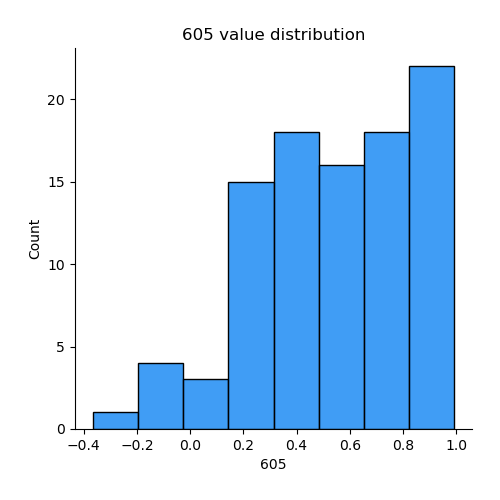
## Feature : 606
- **Feature type** : continous
- **Missing** : 0.0%
- **Unique** : 97
- **Count** :97.0
- **Mean** :0.6299824911208287
- **Std** :0.2416159299336817
- **Min** :0.07439453753656643
- **25%th Percentile** : 0.4616241825937166
- **50%th Percentile** : 0.6207347097061567
- **75%th Percentile** : 0.7792080536875184
- **Max** :0.9873989491961674

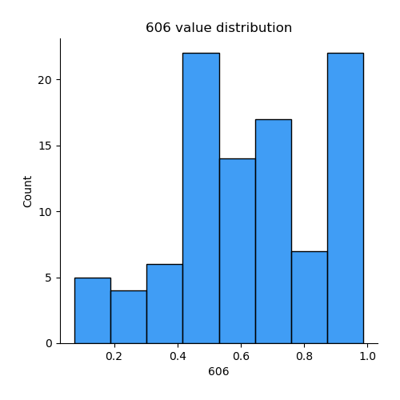
## Feature : 607
- **Feature type** : continous
- **Missing** : 0.0%
- **Unique** : 97
- **Count** :97.0
- **Mean** :0.5778877032041762
- **Std** :0.28465652449668455
- **Min** :-0.21705346200425238
- **25%th Percentile** : 0.3828738917548269
- **50%th Percentile** : 0.5706529859843855
- **75%th Percentile** : 0.8459911437339634
- **Max** :0.991710697932955

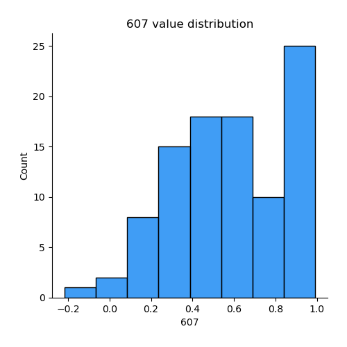
## Feature : 608
- **Feature type** : continous
- **Missing** : 0.0%
- **Unique** : 97
- **Count** :97.0
- **Mean** :0.5953971415222228
- **Std** :0.27195446850317273
- **Min** :-0.09307612607317771
- **25%th Percentile** : 0.3992331424043974
- **50%th Percentile** : 0.5918121719684815
- **75%th Percentile** : 0.8364125419767393
- **Max** :0.9904119445150973

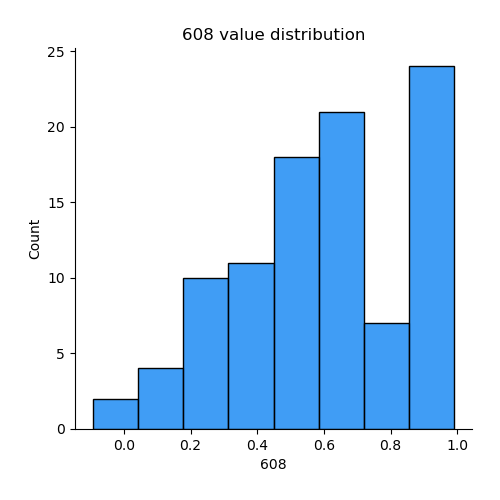
## Feature : 609
- **Feature type** : continous
- **Missing** : 0.0%
- **Unique** : 97
- **Count** :97.0
- **Mean** :0.7126085003593287
- **Std** :0.2776372335932429
- **Min** :-0.3976519827740061
- **25%th Percentile** : 0.6162671254818888
- **50%th Percentile** : 0.7835514960759278
- **75%th Percentile** : 0.9013032341528866
- **Max** :0.9974961096076713

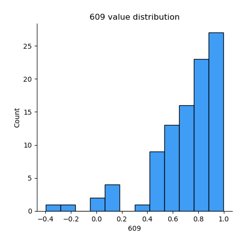
## Feature : 610
- **Feature type** : continous
- **Missing** : 0.0%
- **Unique** : 97
- **Count** :97.0
- **Mean** :0.4435232710211191
- **Std** :0.3639818581257294
- **Min** :-0.36953835143376296
- **25%th Percentile** : 0.2099740849287013
- **50%th Percentile** : 0.40187960600341716
- **75%th Percentile** : 0.6971207725251789
- **Max** :0.9923736835907532

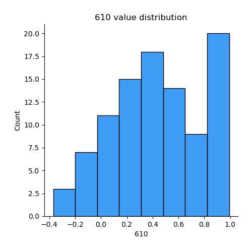
## Feature : 611
- **Feature type** : continous
- **Missing** : 0.0%
- **Unique** : 97
- **Count** :97.0
- **Mean** :0.5651640061896954
- **Std** :0.2973765675679593
- **Min** :-0.3112876712263429
- **25%th Percentile** : 0.3286629256421412
- **50%th Percentile** : 0.5700914377104964
- **75%th Percentile** : 0.7689488661043378
- **Max** :0.9933800601710574

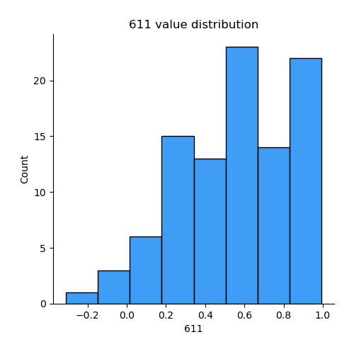
## Feature : 612
- **Feature type** : continous
- **Missing** : 0.0%
- **Unique** : 97
- **Count** :97.0
- **Mean** :0.551293021194436
- **Std** :0.2790329912114336
- **Min** :-0.1303967796403924
- **25%th Percentile** : 0.3464648242864739
- **50%th Percentile** : 0.550075613416735
- **75%th Percentile** : 0.7506078692946672
- **Max** :0.9821503655005904

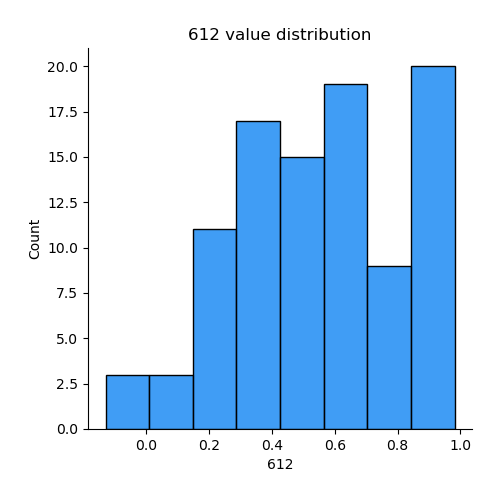
## Feature : 613
- **Feature type** : continous
- **Missing** : 0.0%
- **Unique** : 97
- **Count** :97.0
- **Mean** :0.4835953567557542
- **Std** :0.3618039976177895
- **Min** :-0.41341848713704177
- **25%th Percentile** : 0.24120462103118195
- **50%th Percentile** : 0.5190669294139987
- **75%th Percentile** : 0.7389947616559723
- **Max** :0.9919466252214376

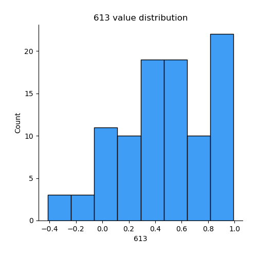
## Feature : 614
- **Feature type** : continous
- **Missing** : 0.0%
- **Unique** : 97
- **Count** :97.0
- **Mean** :0.5554270259870804
- **Std** :0.2897650800246178
- **Min** :-0.02008787216173443
- **25%th Percentile** : 0.32665617781455514
- **50%th Percentile** : 0.5222712755651304
- **75%th Percentile** : 0.771818196067149
- **Max** :0.9910774100002236

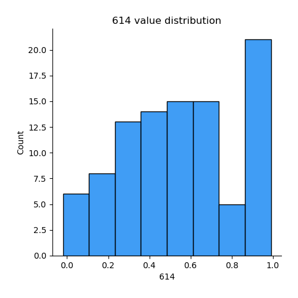
## Feature : 615
- **Feature type** : continous
- **Missing** : 0.0%
- **Unique** : 97
- **Count** :97.0
- **Mean** :0.49742144294037277
- **Std** :0.3501895145255758
- **Min** :-0.2928852201136601
- **25%th Percentile** : 0.23826646963717274
- **50%th Percentile** : 0.5122980026398735
- **75%th Percentile** : 0.7546633625786303
- **Max** :0.9930081621858375

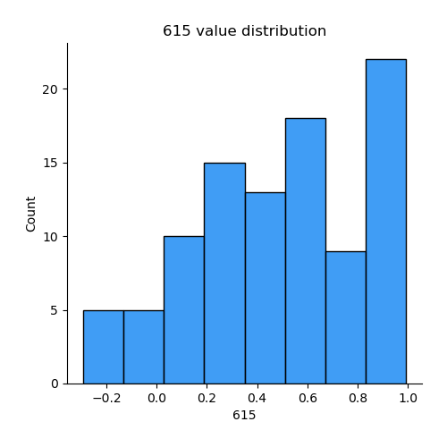
## Feature : 616
- **Feature type** : continous
- **Missing** : 0.0%
- **Unique** : 97
- **Count** :97.0
- **Mean** :0.6138965963986877
- **Std** :0.25924545012864136
- **Min** :0.01291722693399746
- **25%th Percentile** : 0.45358899990034074
- **50%th Percentile** : 0.6288412873479956
- **75%th Percentile** : 0.7892537743946423
- **Max** :0.9896737119089654

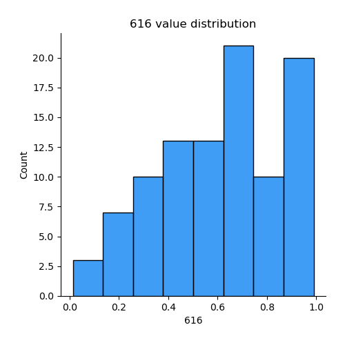
## Feature : 617
- **Feature type** : continous
- **Missing** : 0.0%
- **Unique** : 97
- **Count** :97.0
- **Mean** :0.4568971302550322
- **Std** :0.33371366867328667
- **Min** :-0.31890284110421396
- **25%th Percentile** : 0.2321182553277435
- **50%th Percentile** : 0.3800993695626931
- **75%th Percentile** : 0.6699425189811025
- **Max** :0.9890219805578717

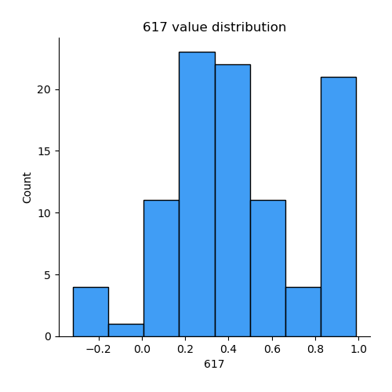
## Feature : 618
- **Feature type** : continous
- **Missing** : 0.0%
- **Unique** : 97
- **Count** :97.0
- **Mean** :0.5465757517750092
- **Std** :0.3287055417139434
- **Min** :-0.349069881473063
- **25%th Percentile** : 0.3308106170303631
- **50%th Percentile** : 0.5702182244770126
- **75%th Percentile** : 0.7625699343796561
- **Max** :0.9932521227211528

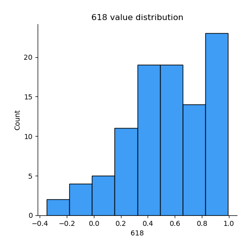
## Feature : 619
- **Feature type** : continous
- **Missing** : 0.0%
- **Unique** : 97
- **Count** :97.0
- **Mean** :0.5327656873540613
- **Std** :0.3277452854346709
- **Min** :-0.256312841498468
- **25%th Percentile** : 0.28167525373450303
- **50%th Percentile** : 0.5206026096198595
- **75%th Percentile** : 0.8045431236284946
- **Max** :0.991595252846374

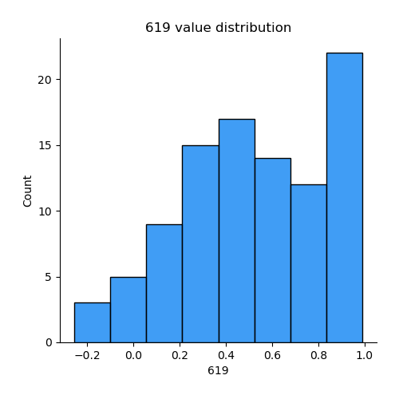
## Feature : 620
- **Feature type** : continous
- **Missing** : 0.0%
- **Unique** : 97
- **Count** :97.0
- **Mean** :0.6355267139043929
- **Std** :0.2995724864262083
- **Min** :-0.4606466240136562
- **25%th Percentile** : 0.49810591304805507
- **50%th Percentile** : 0.6994859059795626
- **75%th Percentile** : 0.852774534039583
- **Max** :0.9943744447345307

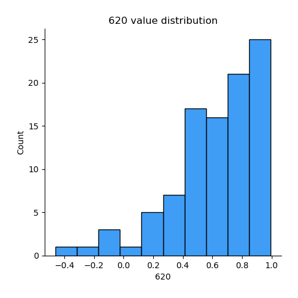
## Feature : 621
- **Feature type** : continous
- **Missing** : 0.0%
- **Unique** : 97
- **Count** :97.0
- **Mean** :0.5075419085369925
- **Std** :0.35392166453369983
- **Min** :-0.3942089466342647
- **25%th Percentile** : 0.1897659196347656
- **50%th Percentile** : 0.538366008879433
- **75%th Percentile** : 0.7753072867194882
- **Max** :0.9924711729650831

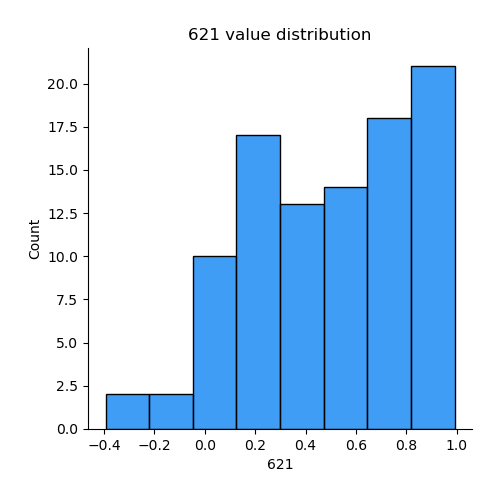
## Feature : 622
- **Feature type** : continous
- **Missing** : 0.0%
- **Unique** : 97
- **Count** :97.0
- **Mean** :0.48675333856781067
- **Std** :0.29880932954318995
- **Min** :-0.19238149286969305
- **25%th Percentile** : 0.29371130879664237
- **50%th Percentile** : 0.45168875666121994
- **75%th Percentile** : 0.6835930346896377
- **Max** :0.9842893387163563

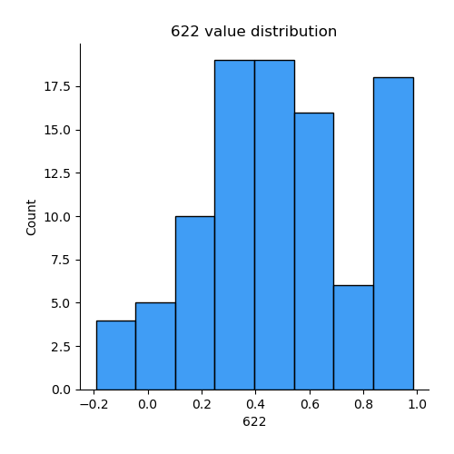
## Feature : 623
- **Feature type** : continous
- **Missing** : 0.0%
- **Unique** : 97
- **Count** :97.0
- **Mean** :0.509330910464645
- **Std** :0.31761529340888595
- **Min** :-0.21154885373833954
- **25%th Percentile** : 0.31529310707395003
- **50%th Percentile** : 0.4829616981200683
- **75%th Percentile** : 0.769760464182347
- **Max** :0.9898857938963331

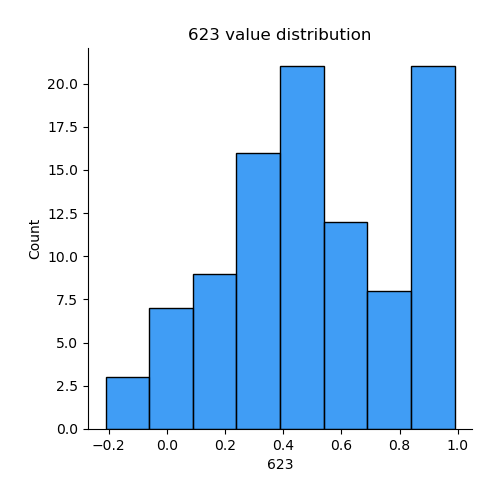
## Feature : 636
- **Feature type** : continous
- **Missing** : 0.0%
- **Unique** : 3
- **Count** :97.0
- **Mean** :1.0
- **Std** :8.012344526598184e-17
- **Min** :0.9999999999999998
- **25%th Percentile** : 1.0
- **50%th Percentile** : 1.0
- **75%th Percentile** : 1.0
- **Max** :1.0

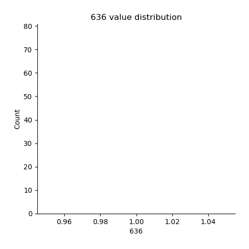
## Feature : 637
- **Feature type** : continous
- **Missing** : 0.0%
- **Unique** : 97
- **Count** :97.0
- **Mean** :0.4493139374653953
- **Std** :0.3491650221051446
- **Min** :-0.5523604552311852
- **25%th Percentile** : 0.2124969194456903
- **50%th Percentile** : 0.43114024239424953
- **75%th Percentile** : 0.6432481415115207
- **Max** :0.990630327956367

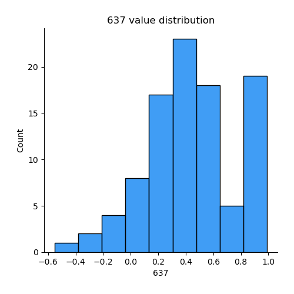
## Feature : 638
- **Feature type** : continous
- **Missing** : 0.0%
- **Unique** : 97
- **Count** :97.0
- **Mean** :0.5149180225005053
- **Std** :0.3075399817133798
- **Min** :-0.18190347535557735
- **25%th Percentile** : 0.29921972919700834
- **50%th Percentile** : 0.5155359488375365
- **75%th Percentile** : 0.7764899811191531
- **Max** :0.9868335530857564

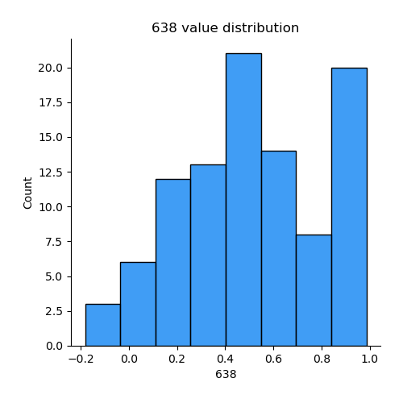
## Feature : 639
- **Feature type** : continous
- **Missing** : 0.0%
- **Unique** : 97
- **Count** :97.0
- **Mean** :0.8450824075180979
- **Std** :0.11542840160264471
- **Min** :0.5659524881959586
- **25%th Percentile** : 0.7580190656643849
- **50%th Percentile** : 0.8635401831468037
- **75%th Percentile** : 0.9283172387813571
- **Max** :0.9977370072371851

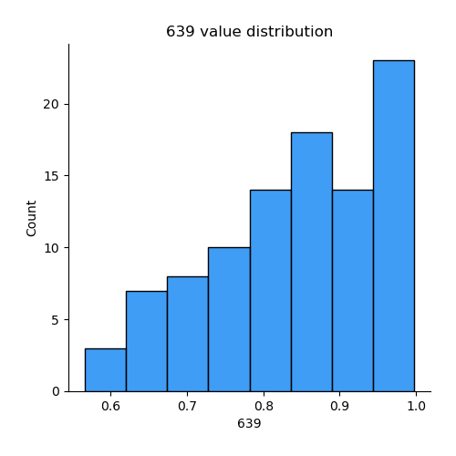
## Feature : 640
- **Feature type** : continous
- **Missing** : 0.0%
- **Unique** : 97
- **Count** :97.0
- **Mean** :0.7101385024198669
- **Std** :0.22161562359386927
- **Min** :-0.1508759809720259
- **25%th Percentile** : 0.5699066447745209
- **50%th Percentile** : 0.7440835434447687
- **75%th Percentile** : 0.8603705161637158
- **Max** :0.9948903776156005

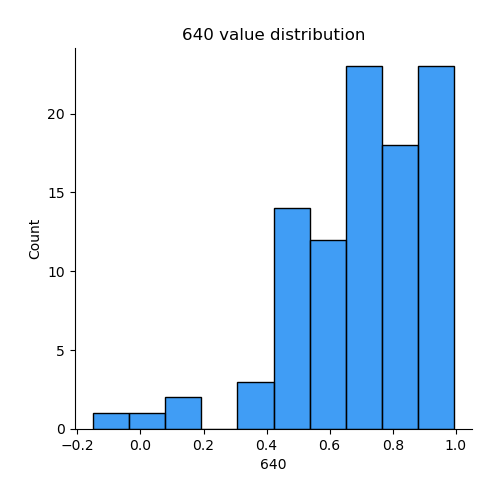
## Feature : 641
- **Feature type** : continous
- **Missing** : 0.0%
- **Unique** : 97
- **Count** :97.0
- **Mean** :0.8410371506597033
- **Std** :0.1281145655012795
- **Min** :0.28489138538535885
- **25%th Percentile** : 0.7561120347129583
- **50%th Percentile** : 0.8605806329632814
- **75%th Percentile** : 0.9219797650091583
- **Max** :0.9983848279458198

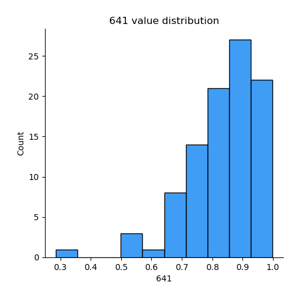
## Feature : 642
- **Feature type** : continous
- **Missing** : 0.0%
- **Unique** : 97
- **Count** :97.0
- **Mean** :0.7107044762972788
- **Std** :0.20643087660839557
- **Min** :0.0009726611638006865
- **25%th Percentile** : 0.5700833668081325
- **50%th Percentile** : 0.7282863637450413
- **75%th Percentile** : 0.8429368344890499
- **Max** :0.990945675737881

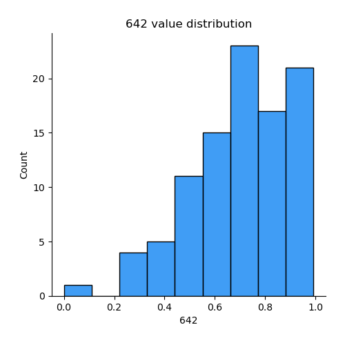
## Feature : 643
- **Feature type** : continous
- **Missing** : 0.0%
- **Unique** : 97
- **Count** :97.0
- **Mean** :0.4820184611431733
- **Std** :0.3332648030261052
- **Min** :-0.19703147145743638
- **25%th Percentile** : 0.23236803563908515
- **50%th Percentile** : 0.49220613403759017
- **75%th Percentile** : 0.6894150255631963
- **Max** :0.9920518724257068

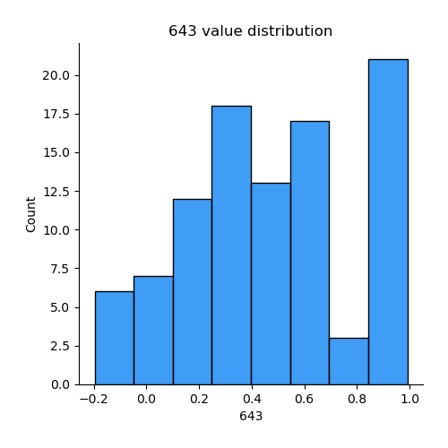
## Feature : 644
- **Feature type** : continous
- **Missing** : 0.0%
- **Unique** : 97
- **Count** :97.0
- **Mean** :0.709313054398595
- **Std** :0.21358737096276104
- **Min** :0.11587026444038456
- **25%th Percentile** : 0.5909171510118097
- **50%th Percentile** : 0.7313104893426576
- **75%th Percentile** : 0.8620541725104853
- **Max** :0.9965327828217282

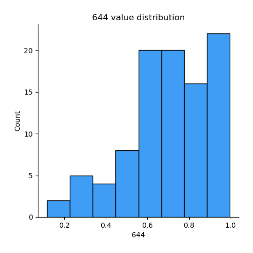
## Feature : 645
- **Feature type** : continous
- **Missing** : 0.0%
- **Unique** : 97
- **Count** :97.0
- **Mean** :0.7519597079754873
- **Std** :0.17953352228963979
- **Min** :0.21420562202205312
- **25%th Percentile** : 0.6275527254457084
- **50%th Percentile** : 0.7654837290281299
- **75%th Percentile** : 0.8734517987802648
- **Max** :0.9949562047135694

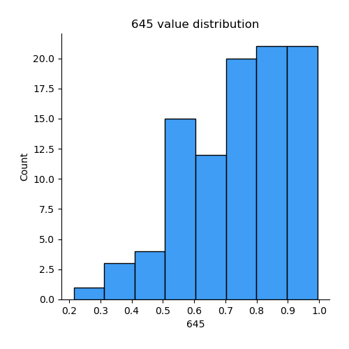
## Feature : 646
- **Feature type** : continous
- **Missing** : 0.0%
- **Unique** : 97
- **Count** :97.0
- **Mean** :0.5611902075927346
- **Std** :0.3110921232211919
- **Min** :-0.27929730397152186
- **25%th Percentile** : 0.37332375523852757
- **50%th Percentile** : 0.5530121973584878
- **75%th Percentile** : 0.7811955065937601
- **Max** :0.9924627835208705

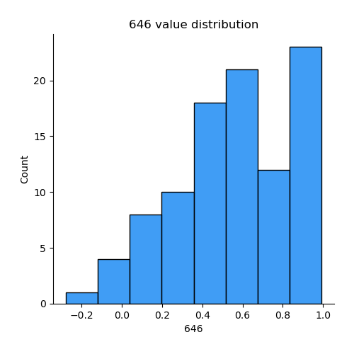
## Feature : 647
- **Feature type** : continous
- **Missing** : 0.0%
- **Unique** : 97
- **Count** :97.0
- **Mean** :0.6802017233164888
- **Std** :0.21419652018820895
- **Min** :0.020313288930181608
- **25%th Percentile** : 0.5525603575906414
- **50%th Percentile** : 0.6620525086157101
- **75%th Percentile** : 0.8294803549531672
- **Max** :0.9937620926768899

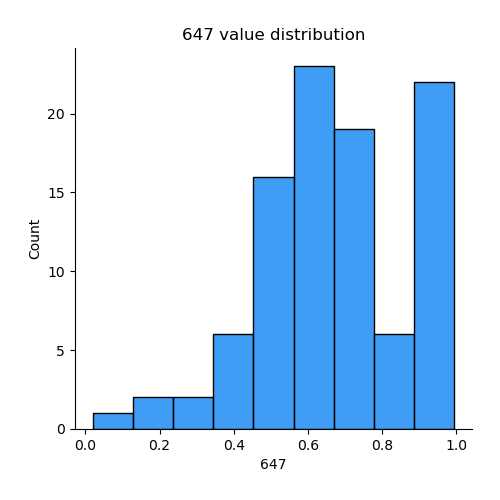
## Feature : 648
- **Feature type** : continous
- **Missing** : 0.0%
- **Unique** : 97
- **Count** :97.0
- **Mean** :0.37127666827222605
- **Std** :0.34857605600428665
- **Min** :-0.4810501640109155
- **25%th Percentile** : 0.1173206651765483
- **50%th Percentile** : 0.32442850413919194
- **75%th Percentile** : 0.5884537183673633
- **Max** :0.9706151983086602

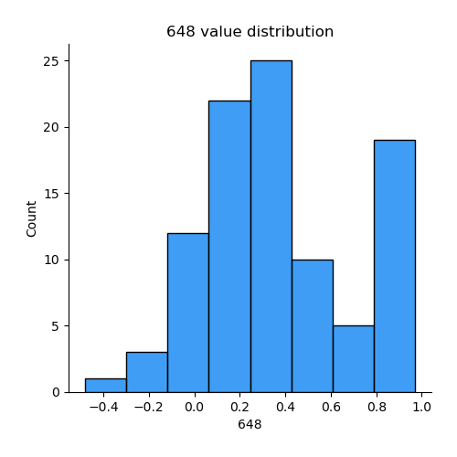
## Feature : 649
- **Feature type** : continous
- **Missing** : 0.0%
- **Unique** : 97
- **Count** :97.0
- **Mean** :0.5095940323810094
- **Std** :0.31232525913971493
- **Min** :-0.19568082404171117
- **25%th Percentile** : 0.2553657905904953
- **50%th Percentile** : 0.4874574904204754
- **75%th Percentile** : 0.7273716801998786
- **Max** :0.9917729184702693

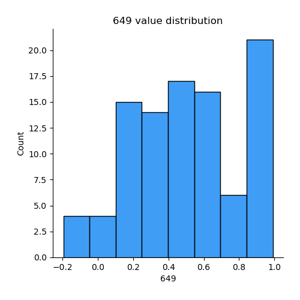
## Feature : 650
- **Feature type** : continous
- **Missing** : 0.0%
- **Unique** : 97
- **Count** :97.0
- **Mean** :0.5410899849850627
- **Std** :0.3124895607021756
- **Min** :-0.24914163731231298
- **25%th Percentile** : 0.2954810002994911
- **50%th Percentile** : 0.5460512548603318
- **75%th Percentile** : 0.7746342024551146
- **Max** :0.9928222679133013

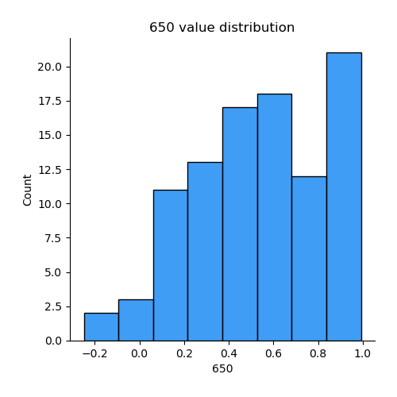
## Feature : 651
- **Feature type** : continous
- **Missing** : 0.0%
- **Unique** : 97
- **Count** :97.0
- **Mean** :0.6161071831626788
- **Std** :0.24281480923767831
- **Min** :0.07925127895971174
- **25%th Percentile** : 0.4396300506886911
- **50%th Percentile** : 0.5945765062823005
- **75%th Percentile** : 0.7768944138533744
- **Max** :0.9942552001741707

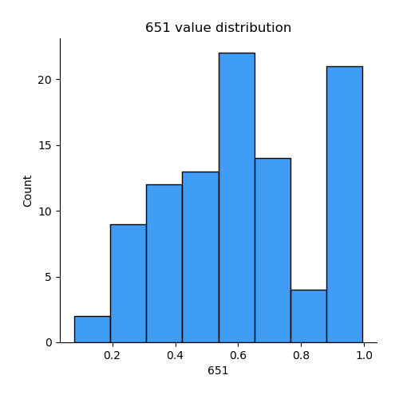
## Feature : 652
- **Feature type** : continous
- **Missing** : 0.0%
- **Unique** : 97
- **Count** :97.0
- **Mean** :0.5951580847746457
- **Std** :0.27480815126533464
- **Min** :-0.012829447104217
- **25%th Percentile** : 0.3868284061801161
- **50%th Percentile** : 0.6088691061852803
- **75%th Percentile** : 0.7920884551727638
- **Max** :0.9879649380165232

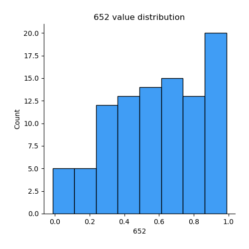
## Feature : 653
- **Feature type** : continous
- **Missing** : 0.0%
- **Unique** : 97
- **Count** :97.0
- **Mean** :0.3383259733529153
- **Std** :0.3622772748015079
- **Min** :-0.5353183188108593
- **25%th Percentile** : 0.05072483243778033
- **50%th Percentile** : 0.28861806427236575
- **75%th Percentile** : 0.5653066899939203
- **Max** :0.9795309086589338

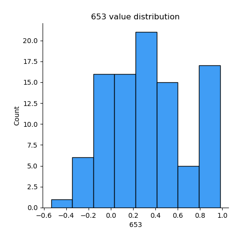
## Feature : 654
- **Feature type** : continous
- **Missing** : 0.0%
- **Unique** : 97
- **Count** :97.0
- **Mean** :0.5314714809116469
- **Std** :0.3256680203311053
- **Min** :-0.4213995048343422
- **25%th Percentile** : 0.2992428994685565
- **50%th Percentile** : 0.559856383029659
- **75%th Percentile** : 0.7745152621962073
- **Max** :0.9923040767035552

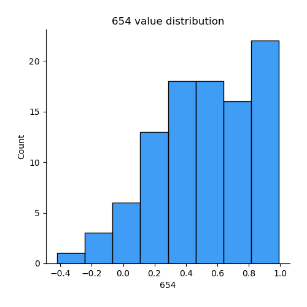
## Feature : 655
- **Feature type** : continous
- **Missing** : 0.0%
- **Unique** : 97
- **Count** :97.0
- **Mean** :0.5829305773448774
- **Std** :0.2778389722213986
- **Min** :-0.205792173653833
- **25%th Percentile** : 0.4292702824212158
- **50%th Percentile** : 0.5739309299172181
- **75%th Percentile** : 0.7645326684607949
- **Max** :0.9928330907631163

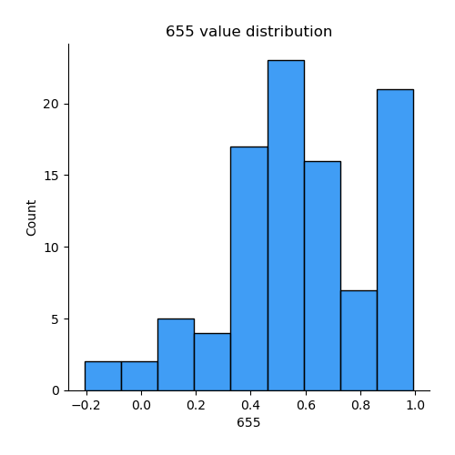
## Feature : 656
- **Feature type** : continous
- **Missing** : 0.0%
- **Unique** : 97
- **Count** :97.0
- **Mean** :0.47015640894004085
- **Std** :0.34557717970207624
- **Min** :-0.5525779366162398
- **25%th Percentile** : 0.2727945585445442
- **50%th Percentile** : 0.4704515870215196
- **75%th Percentile** : 0.6713949485671792
- **Max** :0.9938525934951895

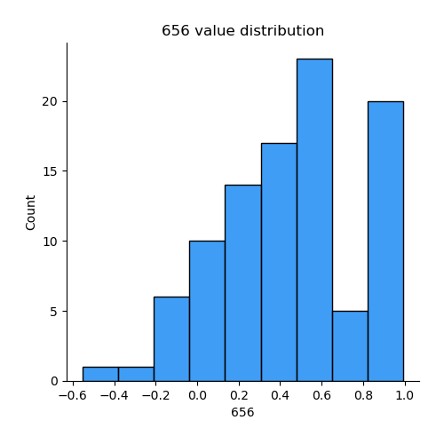
## Feature : 657
- **Feature type** : continous
- **Missing** : 0.0%
- **Unique** : 97
- **Count** :97.0
- **Mean** :0.623508648163316
- **Std** :0.25479894040540435
- **Min** :0.10539154864845338
- **25%th Percentile** : 0.4184255684258597
- **50%th Percentile** : 0.6233654539184657
- **75%th Percentile** : 0.8318559326138233
- **Max** :0.9970399491989714

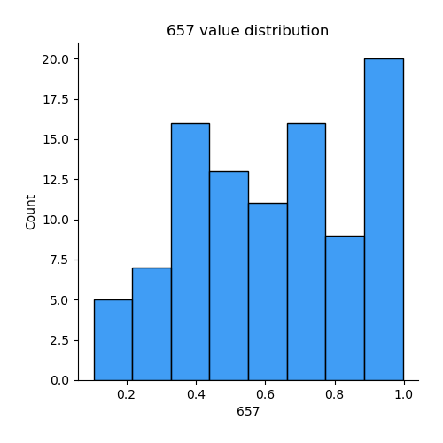
## Feature : 658
- **Feature type** : continous
- **Missing** : 0.0%
- **Unique** : 97
- **Count** :97.0
- **Mean** :0.5900841815476148
- **Std** :0.2742721933808316
- **Min** :-0.22539240462271387
- **25%th Percentile** : 0.4329555101616895
- **50%th Percentile** : 0.5773676264241031
- **75%th Percentile** : 0.8105166230125361
- **Max** :0.9865141245877738

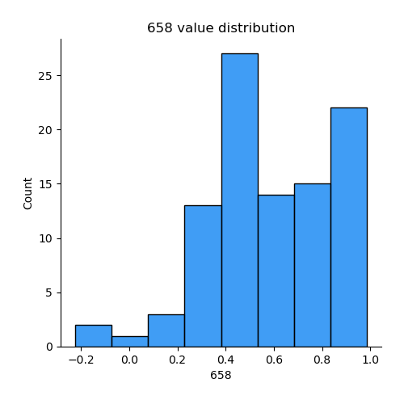
## Feature : 659
- **Feature type** : continous
- **Missing** : 0.0%
- **Unique** : 97
- **Count** :97.0
- **Mean** :0.5317449609381132
- **Std** :0.2960337340576848
- **Min** :-0.10941628908935846
- **25%th Percentile** : 0.3263654438723066
- **50%th Percentile** : 0.5234130757191391
- **75%th Percentile** : 0.7351990064122914
- **Max** :0.9872596627040704

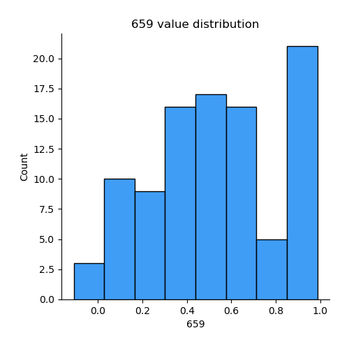
## Feature : 660
- **Feature type** : continous
- **Missing** : 0.0%
- **Unique** : 97
- **Count** :97.0
- **Mean** :0.5692716269343435
- **Std** :0.29774157621452135
- **Min** :-0.13847224055648694
- **25%th Percentile** : 0.3695643125392813
- **50%th Percentile** : 0.5929775453127482
- **75%th Percentile** : 0.7768886311628026
- **Max** :0.9925821086102834

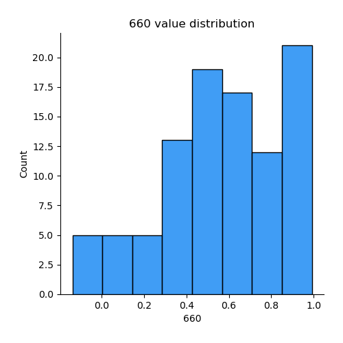
## Feature : 661
- **Feature type** : continous
- **Missing** : 0.0%
- **Unique** : 97
- **Count** :97.0
- **Mean** :0.4768613939996179
- **Std** :0.34337995009875255
- **Min** :-0.28202231439218683
- **25%th Percentile** : 0.23529109947226223
- **50%th Percentile** : 0.4848010014369124
- **75%th Percentile** : 0.6909801305995118
- **Max** :0.993900131132973

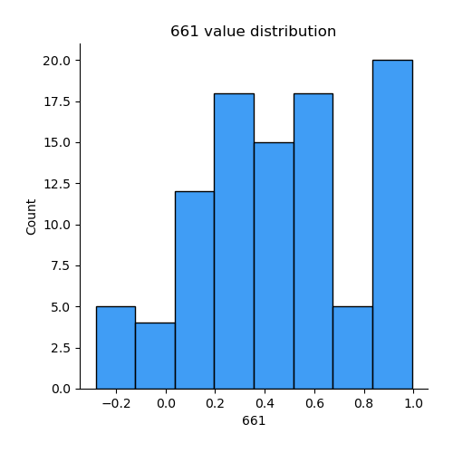
## Feature : 662
- **Feature type** : continous
- **Missing** : 0.0%
- **Unique** : 97
- **Count** :97.0
- **Mean** :0.9083015810064139
- **Std** :0.093105757806193
- **Min** :0.44979915103191953
- **25%th Percentile** : 0.8514387890421073
- **50%th Percentile** : 0.937231150211771
- **75%th Percentile** : 0.9695471613209985
- **Max** :0.9990703839798956

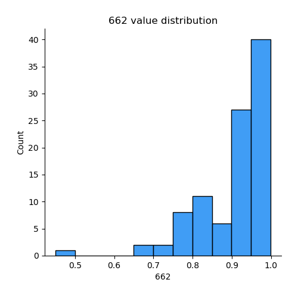
## Feature : 663
- **Feature type** : continous
- **Missing** : 0.0%
- **Unique** : 97
- **Count** :97.0
- **Mean** :0.46033035716631576
- **Std** :0.3381955147606968
- **Min** :-0.38287663697004987
- **25%th Percentile** : 0.21845480424128255
- **50%th Percentile** : 0.41059978544201536
- **75%th Percentile** : 0.6764279096058683
- **Max** :0.9909801783314854

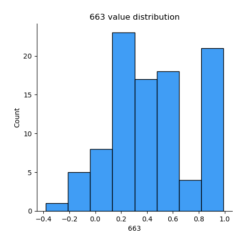
## Feature : 664
- **Feature type** : continous
- **Missing** : 0.0%
- **Unique** : 97
- **Count** :97.0
- **Mean** :0.5197066423976578
- **Std** :0.2976455802841817
- **Min** :-0.16179361057276392
- **25%th Percentile** : 0.28377326229076333
- **50%th Percentile** : 0.4890455541520734
- **75%th Percentile** : 0.7708945446822195
- **Max** :0.9873363506318551

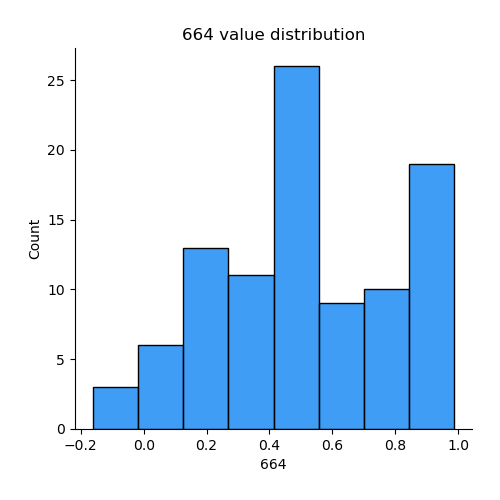
## Feature : 665
- **Feature type** : continous
- **Missing** : 0.0%
- **Unique** : 97
- **Count** :97.0
- **Mean** :0.8077227549997206
- **Std** :0.1628382537794778
- **Min** :0.24020367828094186
- **25%th Percentile** : 0.7210933477943405
- **50%th Percentile** : 0.8239660841206274
- **75%th Percentile** : 0.951677955004881
- **Max** :0.9978014104720181

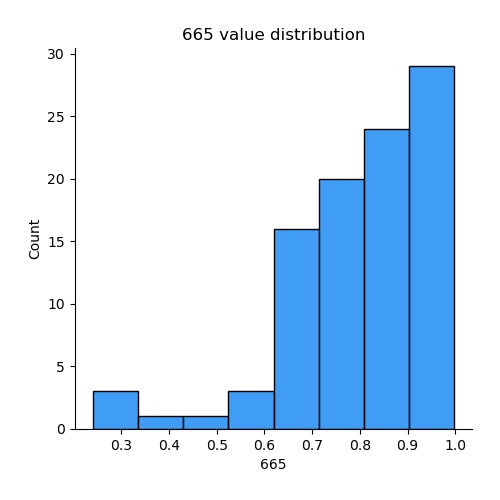
## Feature : 666
- **Feature type** : continous
- **Missing** : 0.0%
- **Unique** : 97
- **Count** :97.0
- **Mean** :0.6927023874937474
- **Std** :0.21725481091376778
- **Min** :-0.0014743716138540725
- **25%th Percentile** : 0.5802421769826193
- **50%th Percentile** : 0.7073550979701113
- **75%th Percentile** : 0.8259913635712485
- **Max** :0.9948640142872232

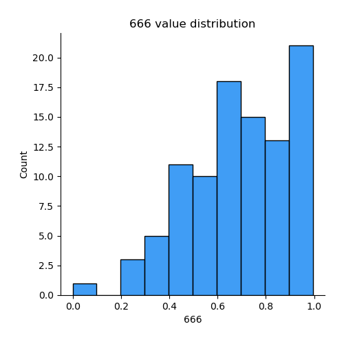
## Feature : 667
- **Feature type** : continous
- **Missing** : 0.0%
- **Unique** : 97
- **Count** :97.0
- **Mean** :0.8155919363861168
- **Std** :0.14786617852663939
- **Min** :0.3336466203368084
- **25%th Percentile** : 0.7175131074065195
- **50%th Percentile** : 0.8268101302341838
- **75%th Percentile** : 0.9162608646459977
- **Max** :0.9977688925452463

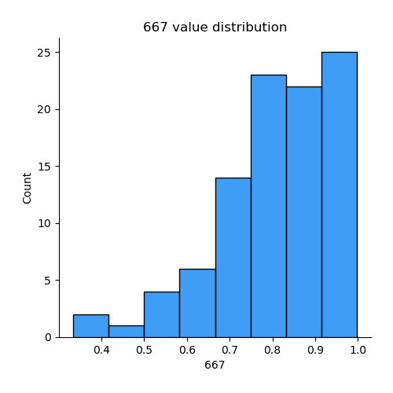
## Feature : 668
- **Feature type** : continous
- **Missing** : 0.0%
- **Unique** : 97
- **Count** :97.0
- **Mean** :0.7032244453212513
- **Std** :0.21571038514673824
- **Min** :0.04936730433864576
- **25%th Percentile** : 0.5683193488054132
- **50%th Percentile** : 0.7152227166194185
- **75%th Percentile** : 0.8598183449047068
- **Max** :0.9942589994854413

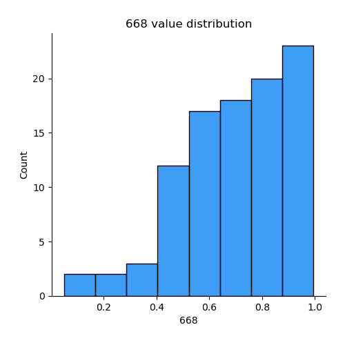
## Feature : 669
- **Feature type** : continous
- **Missing** : 0.0%
- **Unique** : 97
- **Count** :97.0
- **Mean** :0.4627774643088139
- **Std** :0.33189845854961186
- **Min** :-0.23881934049618758
- **25%th Percentile** : 0.2465653518276829
- **50%th Percentile** : 0.4322286343483715
- **75%th Percentile** : 0.6379886634842918
- **Max** :0.9908545318865356

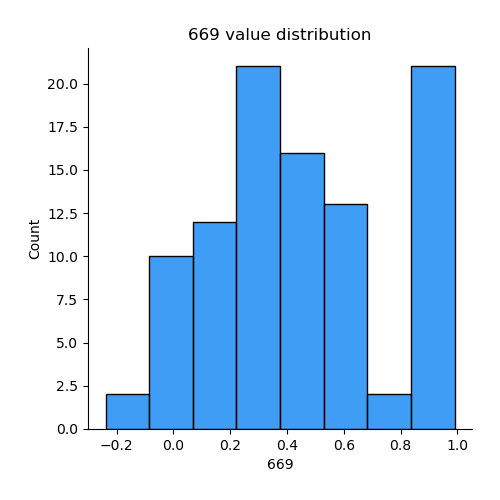
## Feature : 670
- **Feature type** : continous
- **Missing** : 0.0%
- **Unique** : 97
- **Count** :97.0
- **Mean** :0.692772182763808
- **Std** :0.22306004318232656
- **Min** :0.045635031842482736
- **25%th Percentile** : 0.5385039165947277
- **50%th Percentile** : 0.6989400202348325
- **75%th Percentile** : 0.8444900127016645
- **Max** :0.9964838723270776

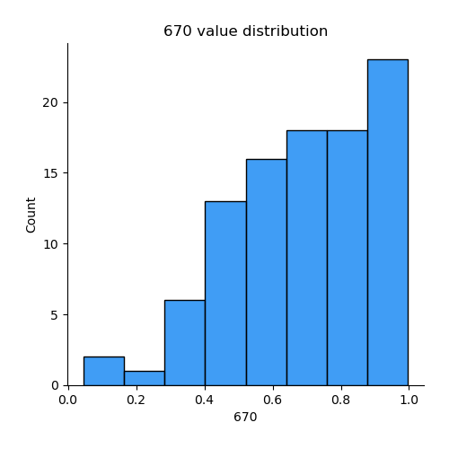
## Feature : 671
- **Feature type** : continous
- **Missing** : 0.0%
- **Unique** : 97
- **Count** :97.0
- **Mean** :0.7502200368471823
- **Std** :0.1859613605039642
- **Min** :0.11490884521320391
- **25%th Percentile** : 0.6542893633046243
- **50%th Percentile** : 0.7611937074916009
- **75%th Percentile** : 0.899913787594202
- **Max** :0.9952630622182504

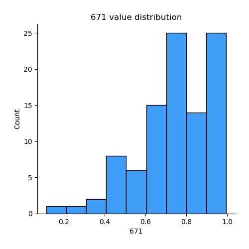
## Feature : 672
- **Feature type** : continous
- **Missing** : 0.0%
- **Unique** : 97
- **Count** :97.0
- **Mean** :0.5498321742236473
- **Std** :0.31705061347437435
- **Min** :-0.19203390261070807
- **25%th Percentile** : 0.3008624299856515
- **50%th Percentile** : 0.5196507053828578
- **75%th Percentile** : 0.8385841671482479
- **Max** :0.9949040639260542

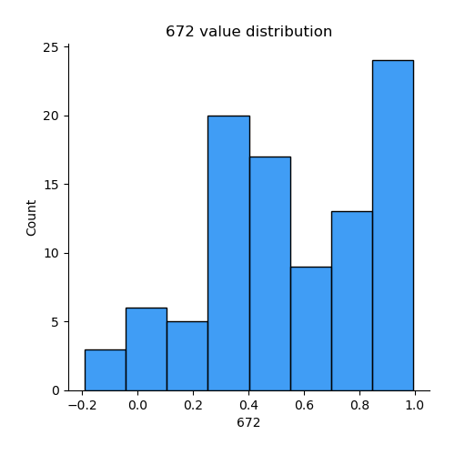
## Feature : 673
- **Feature type** : continous
- **Missing** : 0.0%
- **Unique** : 97
- **Count** :97.0
- **Mean** :0.7004748489379823
- **Std** :0.2053916438349505
- **Min** :0.16253442726756107
- **25%th Percentile** : 0.5609005462429889
- **50%th Percentile** : 0.7037950421233674
- **75%th Percentile** : 0.8285133387759308
- **Max** :0.9938628925168587

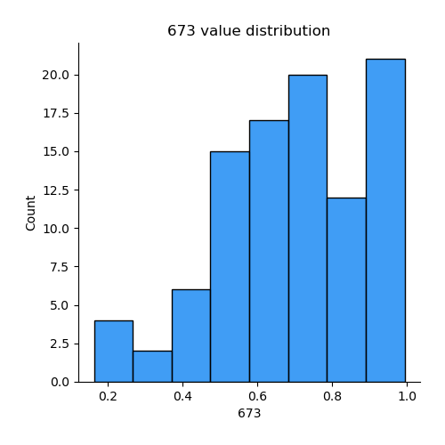
## Feature : 674
- **Feature type** : continous
- **Missing** : 0.0%
- **Unique** : 97
- **Count** :97.0
- **Mean** :0.3535207948350477
- **Std** :0.35403333266782766
- **Min** :-0.6139520171938379
- **25%th Percentile** : 0.13065645715720858
- **50%th Percentile** : 0.3017037436101255
- **75%th Percentile** : 0.532668685358706
- **Max** :0.9814530019208717

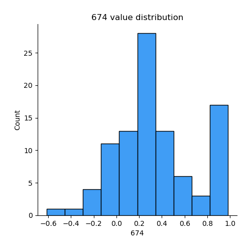
## Feature : 675
- **Feature type** : continous
- **Missing** : 0.0%
- **Unique** : 97
- **Count** :97.0
- **Mean** :0.46332692890468546
- **Std** :0.32622179137406504
- **Min** :-0.41932250053006104
- **25%th Percentile** : 0.22465943804231842
- **50%th Percentile** : 0.3921741102494649
- **75%th Percentile** : 0.7172448579080306
- **Max** :0.9905308064236702

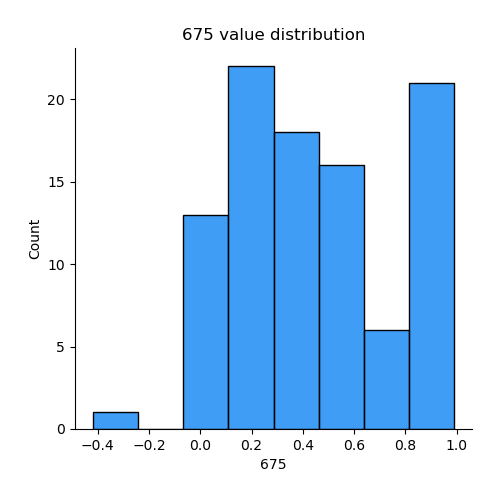
## Feature : 689
- **Feature type** : continous
- **Missing** : 0.0%
- **Unique** : 3
- **Count** :97.0
- **Mean** :1.0
- **Std** :8.092071311423672e-17
- **Min** :0.9999999999999998
- **25%th Percentile** : 1.0
- **50%th Percentile** : 1.0
- **75%th Percentile** : 1.0
- **Max** :1.0

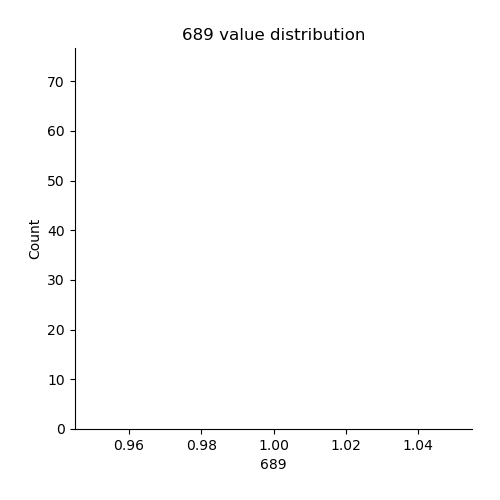
## Feature : 690
- **Feature type** : continous
- **Missing** : 0.0%
- **Unique** : 97
- **Count** :97.0
- **Mean** :0.594510804695891
- **Std** :0.238803267227591
- **Min** :0.006078378932824212
- **25%th Percentile** : 0.42728466857040887
- **50%th Percentile** : 0.5692842004338523
- **75%th Percentile** : 0.7452480667688318
- **Max** :0.9862249477496332

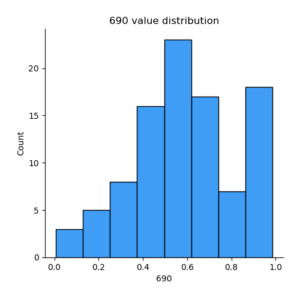
## Feature : 691
- **Feature type** : continous
- **Missing** : 0.0%
- **Unique** : 97
- **Count** :97.0
- **Mean** :0.4991272895117654
- **Std** :0.30595822105759746
- **Min** :-0.44446973568081366
- **25%th Percentile** : 0.3063214486514639
- **50%th Percentile** : 0.45919578037901015
- **75%th Percentile** : 0.6540978414634807
- **Max** :0.989547837206291

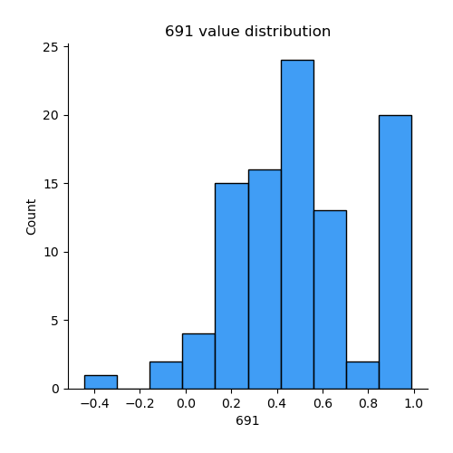
## Feature : 692
- **Feature type** : continous
- **Missing** : 0.0%
- **Unique** : 97
- **Count** :97.0
- **Mean** :0.546957340492444
- **Std** :0.297777670868431
- **Min** :-0.311418340781301
- **25%th Percentile** : 0.35613739124478283
- **50%th Percentile** : 0.5165998402566643
- **75%th Percentile** : 0.7437880573497188
- **Max** :0.9904405971912934

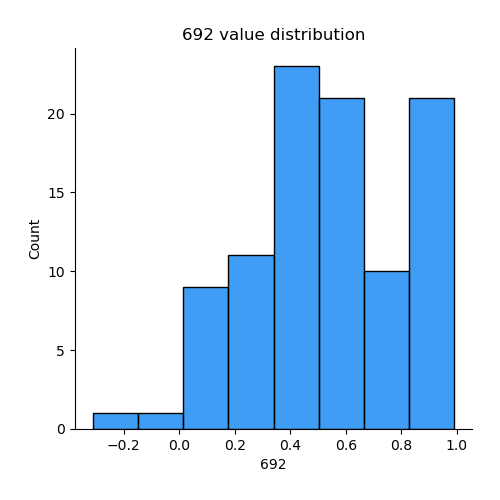
## Feature : 693
- **Feature type** : continous
- **Missing** : 0.0%
- **Unique** : 97
- **Count** :97.0
- **Mean** :0.5188541848756774
- **Std** :0.30057600552919256
- **Min** :-0.36683957241611176
- **25%th Percentile** : 0.29706504774531467
- **50%th Percentile** : 0.4893272813531032
- **75%th Percentile** : 0.6587895043388705
- **Max** :0.9905837066652694

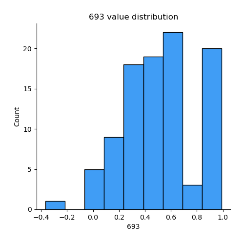
## Feature : 694
- **Feature type** : continous
- **Missing** : 0.0%
- **Unique** : 97
- **Count** :97.0
- **Mean** :0.6221325266190438
- **Std** :0.25231777248859444
- **Min** :-0.2621877140893312
- **25%th Percentile** : 0.4816010995207462
- **50%th Percentile** : 0.6061996502703819
- **75%th Percentile** : 0.7673848025698704
- **Max** :0.9913460875908591

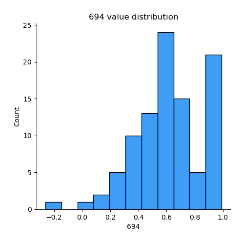
## Feature : 695
- **Feature type** : continous
- **Missing** : 0.0%
- **Unique** : 97
- **Count** :97.0
- **Mean** :0.44464782751188314
- **Std** :0.328828436723662
- **Min** :-0.3909051310384621
- **25%th Percentile** : 0.2159615101969153
- **50%th Percentile** : 0.37802049337653665
- **75%th Percentile** : 0.6136697014373341
- **Max** :0.9846083839833852

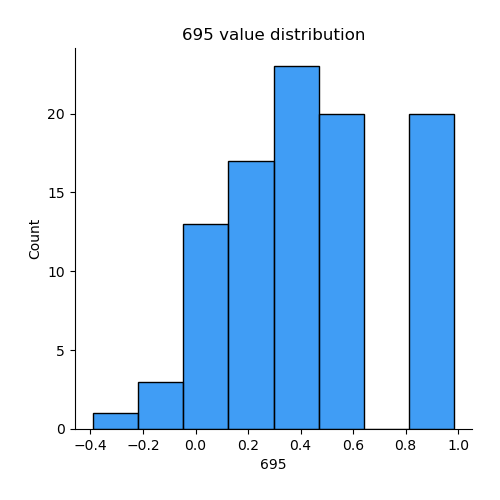
## Feature : 696
- **Feature type** : continous
- **Missing** : 0.0%
- **Unique** : 97
- **Count** :97.0
- **Mean** :0.4887620115284073
- **Std** :0.3328102818175102
- **Min** :-0.49532017453519506
- **25%th Percentile** : 0.28780120536185383
- **50%th Percentile** : 0.476466762892239
- **75%th Percentile** : 0.6451239684076656
- **Max** :0.9924914565622172

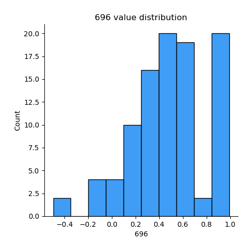
## Feature : 697
- **Feature type** : continous
- **Missing** : 0.0%
- **Unique** : 97
- **Count** :97.0
- **Mean** :0.5554435868208439
- **Std** :0.2903218082207498
- **Min** :-0.3942763585690459
- **25%th Percentile** : 0.40036769551852036
- **50%th Percentile** : 0.5543788206700445
- **75%th Percentile** : 0.7282010312576254
- **Max** :0.9911440498299705

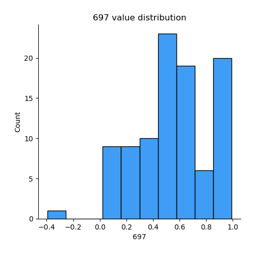
## Feature : 698
- **Feature type** : continous
- **Missing** : 0.0%
- **Unique** : 97
- **Count** :97.0
- **Mean** :0.6307880730762331
- **Std** :0.25139279789884517
- **Min** :-0.21495665083635201
- **25%th Percentile** : 0.4741896747034755
- **50%th Percentile** : 0.6279894448399952
- **75%th Percentile** : 0.7739818789012882
- **Max** :0.9936032990788894

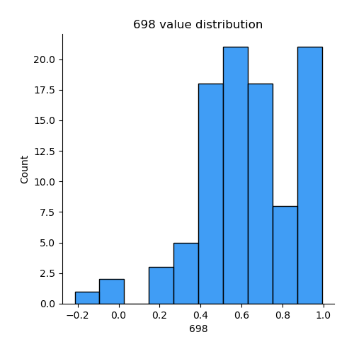
## Feature : 699
- **Feature type** : continous
- **Missing** : 0.0%
- **Unique** : 97
- **Count** :97.0
- **Mean** :0.5444210928193155
- **Std** :0.283575691005859
- **Min** :-0.036624839000911846
- **25%th Percentile** : 0.345396860900004
- **50%th Percentile** : 0.5417435981741497
- **75%th Percentile** : 0.7265526932363594
- **Max** :0.9898896529820193

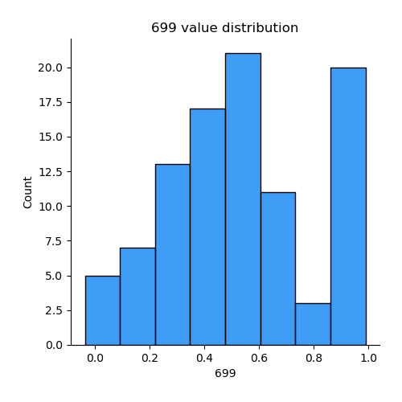
## Feature : 700
- **Feature type** : continous
- **Missing** : 0.0%
- **Unique** : 97
- **Count** :97.0
- **Mean** :0.5016168838195572
- **Std** :0.3147792952769962
- **Min** :-0.45111409157616145
- **25%th Percentile** : 0.30657870193034636
- **50%th Percentile** : 0.5121351179214133
- **75%th Percentile** : 0.6783622141073429
- **Max** :0.9839270884701589

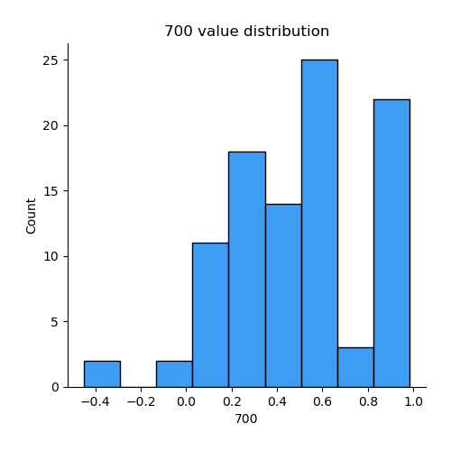
## Feature : 701
- **Feature type** : continous
- **Missing** : 0.0%
- **Unique** : 97
- **Count** :97.0
- **Mean** :0.5691938379918522
- **Std** :0.26430979713433955
- **Min** :-0.18709143280854018
- **25%th Percentile** : 0.4156674577275368
- **50%th Percentile** : 0.536003427764717
- **75%th Percentile** : 0.712943163744907
- **Max** :0.9870533023224902

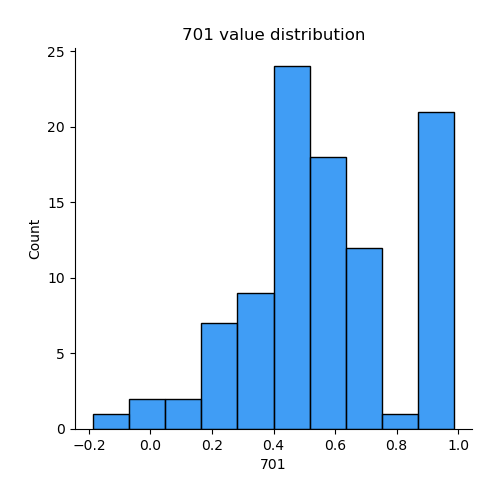
## Feature : 702
- **Feature type** : continous
- **Missing** : 0.0%
- **Unique** : 97
- **Count** :97.0
- **Mean** :0.5018362513020469
- **Std** :0.3057635119796594
- **Min** :-0.12249855609225824
- **25%th Percentile** : 0.2825004819485597
- **50%th Percentile** : 0.4848413665937332
- **75%th Percentile** : 0.6850982897778121
- **Max** :0.988568304673824

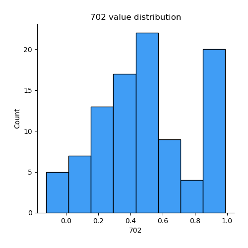
## Feature : 703
- **Feature type** : continous
- **Missing** : 0.0%
- **Unique** : 97
- **Count** :97.0
- **Mean** :0.4557415885915223
- **Std** :0.33318115336667387
- **Min** :-0.41347560125512534
- **25%th Percentile** : 0.2622882734132535
- **50%th Percentile** : 0.4149037328355261
- **75%th Percentile** : 0.6010771784737295
- **Max** :0.9896458791298864

## Feature : 704
- **Feature type** : continous
- **Missing** : 0.0%
- **Unique** : 97
- **Count** :97.0
- **Mean** :0.571528953930806
- **Std** :0.26691228665717626
- **Min** :-0.04316204428493847
- **25%th Percentile** : 0.3862450603409585
- **50%th Percentile** : 0.5534766258401259
- **75%th Percentile** : 0.7397709071176264
- **Max** :0.9879347125860904

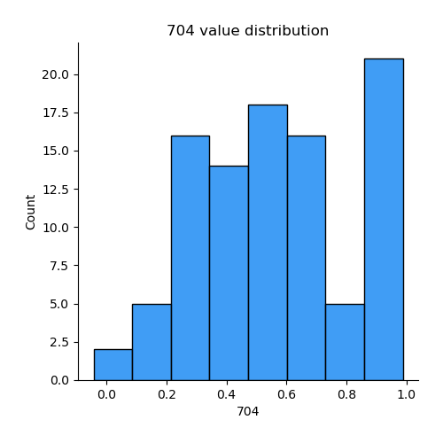
## Feature : 705
- **Feature type** : continous
- **Missing** : 0.0%
- **Unique** : 97
- **Count** :97.0
- **Mean** :0.45518025712921756
- **Std** :0.3371675833428497
- **Min** :-0.4556846248489699
- **25%th Percentile** : 0.22154713934319328
- **50%th Percentile** : 0.4580205121762844
- **75%th Percentile** : 0.6506062434186052
- **Max** :0.9884547895271589

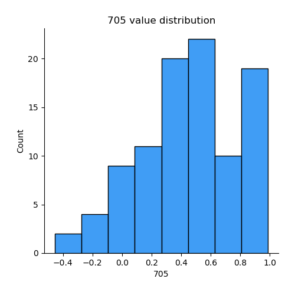
## Feature : 706
- **Feature type** : continous
- **Missing** : 0.0%
- **Unique** : 97
- **Count** :97.0
- **Mean** :0.6872182962053623
- **Std** :0.228544913052873
- **Min** :0.0436220011008152
- **25%th Percentile** : 0.5751469232688644
- **50%th Percentile** : 0.7088949405095734
- **75%th Percentile** : 0.8534814065162335
- **Max** :0.995424097861189

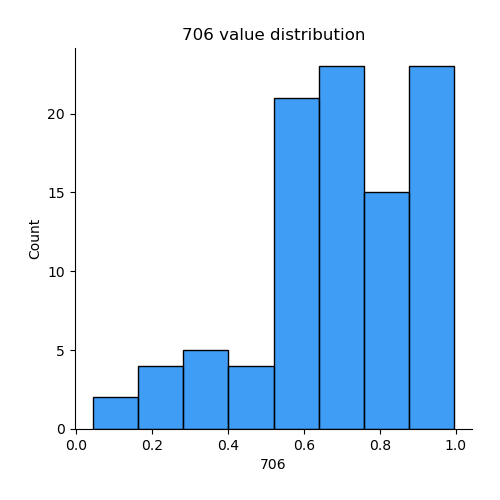
## Feature : 707
- **Feature type** : continous
- **Missing** : 0.0%
- **Unique** : 97
- **Count** :97.0
- **Mean** :0.558250213822301
- **Std** :0.2904658011117369
- **Min** :-0.13818192862209372
- **25%th Percentile** : 0.36711024989777474
- **50%th Percentile** : 0.5374572358274265
- **75%th Percentile** : 0.7350906381625248
- **Max** :0.9912194629856256

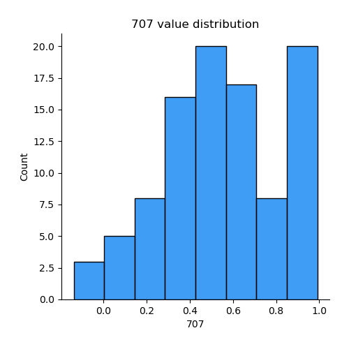
## Feature : 708
- **Feature type** : continous
- **Missing** : 0.0%
- **Unique** : 97
- **Count** :97.0
- **Mean** :0.6083839216698007
- **Std** :0.2565520718818785
- **Min** :-0.01613095115184449
- **25%th Percentile** : 0.4735300547232592
- **50%th Percentile** : 0.6033400208826323
- **75%th Percentile** : 0.7581198713652467
- **Max** :0.9940748536379322

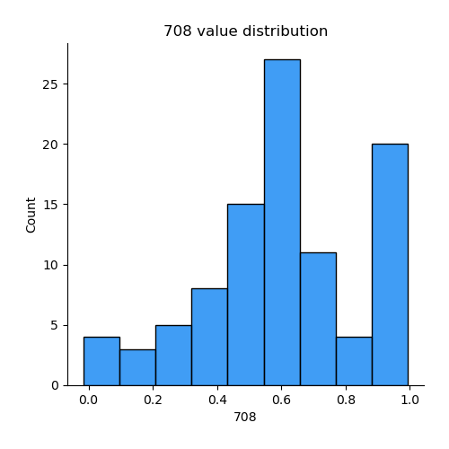
## Feature : 709
- **Feature type** : continous
- **Missing** : 0.0%
- **Unique** : 97
- **Count** :97.0
- **Mean** :0.5477623278831074
- **Std** :0.29119025562230405
- **Min** :-0.0514643500531695
- **25%th Percentile** : 0.3288763150638087
- **50%th Percentile** : 0.5225330276273874
- **75%th Percentile** : 0.713289068354385
- **Max** :0.9919093019616803

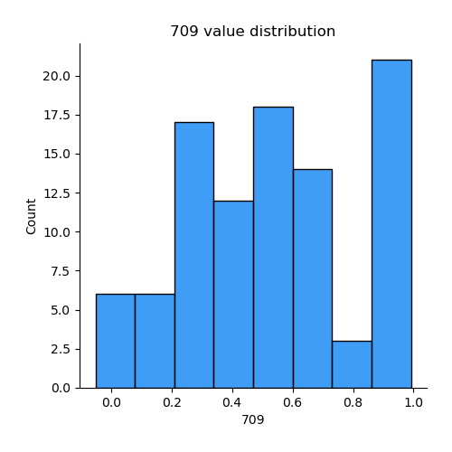
## Feature : 710
- **Feature type** : continous
- **Missing** : 0.0%
- **Unique** : 97
- **Count** :97.0
- **Mean** :0.6409336521840776
- **Std** :0.23242612676989444
- **Min** :0.05196067666865653
- **25%th Percentile** : 0.49312529883290585
- **50%th Percentile** : 0.6361931075839641
- **75%th Percentile** : 0.7853394498552965
- **Max** :0.9864547850861645

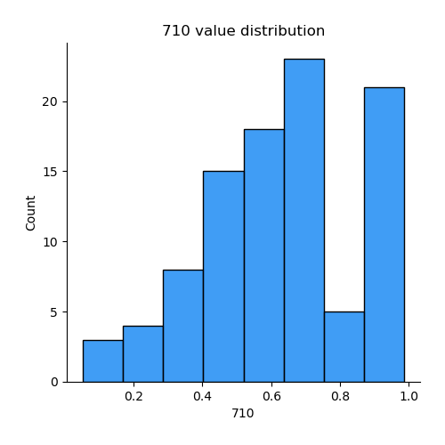
## Feature : 711
- **Feature type** : continous
- **Missing** : 0.0%
- **Unique** : 97
- **Count** :97.0
- **Mean** :0.5739757066278368
- **Std** :0.2610669950592841
- **Min** :0.030616733674187022
- **25%th Percentile** : 0.3864025084164636
- **50%th Percentile** : 0.5499061267411632
- **75%th Percentile** : 0.7422357449507849
- **Max** :0.9920969671499762

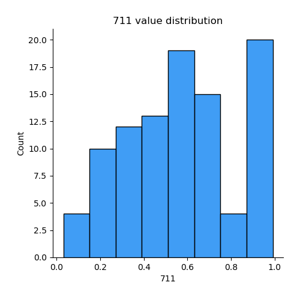
## Feature : 712
- **Feature type** : continous
- **Missing** : 0.0%
- **Unique** : 97
- **Count** :97.0
- **Mean** :0.6416052913645905
- **Std** :0.23427522291607097
- **Min** :0.07326504593910822
- **25%th Percentile** : 0.4995778539897507
- **50%th Percentile** : 0.6351870347407638
- **75%th Percentile** : 0.8079706954979325
- **Max** :0.9921739858092277

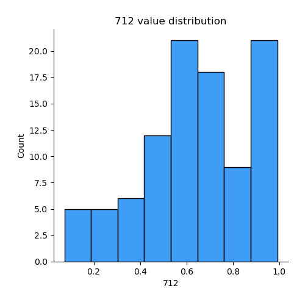
## Feature : 713
- **Feature type** : continous
- **Missing** : 0.0%
- **Unique** : 97
- **Count** :97.0
- **Mean** :0.5724338196777441
- **Std** :0.28921024019838876
- **Min** :-0.12104032384038542
- **25%th Percentile** : 0.3930375829810771
- **50%th Percentile** : 0.5750015930998211
- **75%th Percentile** : 0.7418228153129967
- **Max** :0.9955270697320107

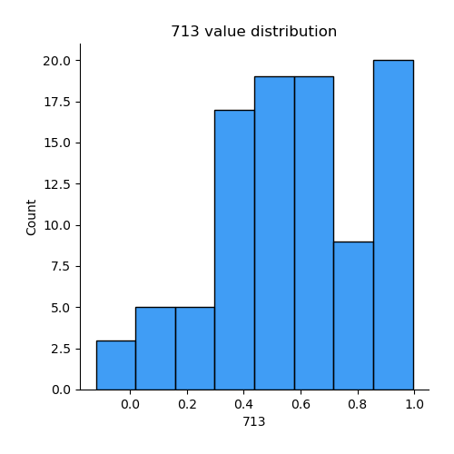
## Feature : 714
- **Feature type** : continous
- **Missing** : 0.0%
- **Unique** : 97
- **Count** :97.0
- **Mean** :0.43428347698012004
- **Std** :0.3611206509425549
- **Min** :-0.6016015996627777
- **25%th Percentile** : 0.20547562972410777
- **50%th Percentile** : 0.39841260352606894
- **75%th Percentile** : 0.632938477054102
- **Max** :0.9914834561083721

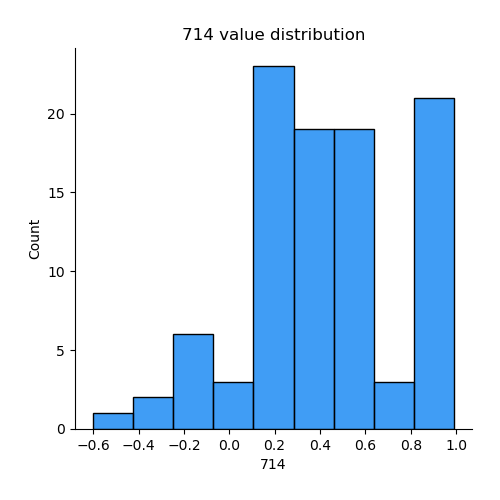
## Feature : 715
- **Feature type** : continous
- **Missing** : 0.0%
- **Unique** : 97
- **Count** :97.0
- **Mean** :0.6842543920945444
- **Std** :0.2433590735025208
- **Min** :-0.137527923939873
- **25%th Percentile** : 0.5753893814204218
- **50%th Percentile** : 0.6990990906188089
- **75%th Percentile** : 0.8434525333936498
- **Max** :0.995616149842045

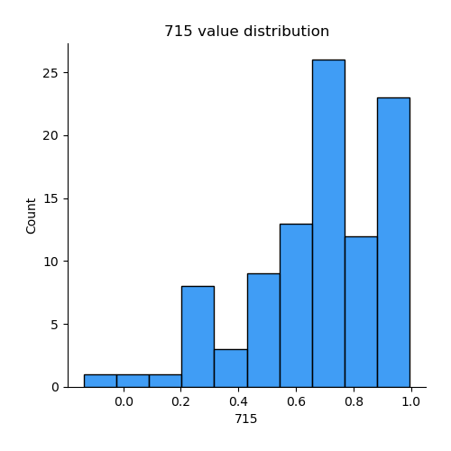
## Feature : 716
- **Feature type** : continous
- **Missing** : 0.0%
- **Unique** : 97
- **Count** :97.0
- **Mean** :0.5801691087667427
- **Std** :0.25041330137898415
- **Min** :-0.013557220261204359
- **25%th Percentile** : 0.39490177186728626
- **50%th Percentile** : 0.5649385179505194
- **75%th Percentile** : 0.778960554544466
- **Max** :0.986468841295351

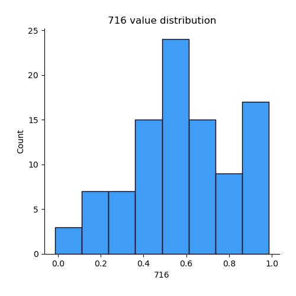
## Feature : 717
- **Feature type** : continous
- **Missing** : 0.0%
- **Unique** : 97
- **Count** :97.0
- **Mean** :0.4505707360295574
- **Std** :0.3498634959427118
- **Min** :-0.5274592200342118
- **25%th Percentile** : 0.22857268611498274
- **50%th Percentile** : 0.4471977548922543
- **75%th Percentile** : 0.6196460324913753
- **Max** :0.9904982563529757

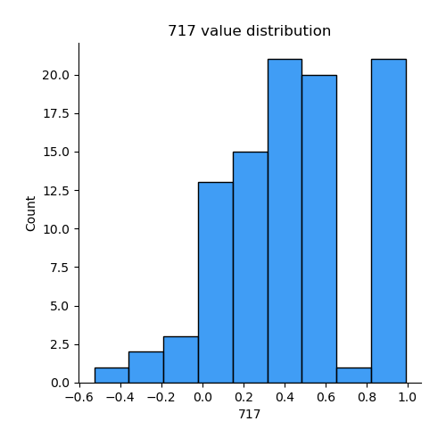
## Feature : 718
- **Feature type** : continous
- **Missing** : 0.0%
- **Unique** : 97
- **Count** :97.0
- **Mean** :0.520789734484087
- **Std** :0.3145140928726323
- **Min** :-0.31246509266534034
- **25%th Percentile** : 0.3342059938830337
- **50%th Percentile** : 0.5200445741792658
- **75%th Percentile** : 0.7139505738686777
- **Max** :0.9891637875418925

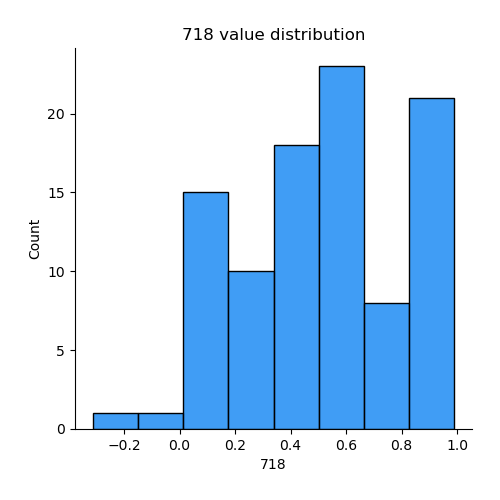
## Feature : 719
- **Feature type** : continous
- **Missing** : 0.0%
- **Unique** : 97
- **Count** :97.0
- **Mean** :0.4816933021268345
- **Std** :0.33285068262029044
- **Min** :-0.44440550624892317
- **25%th Percentile** : 0.237298704905698
- **50%th Percentile** : 0.48677752573211
- **75%th Percentile** : 0.6305341247783582
- **Max** :0.9908206073204321

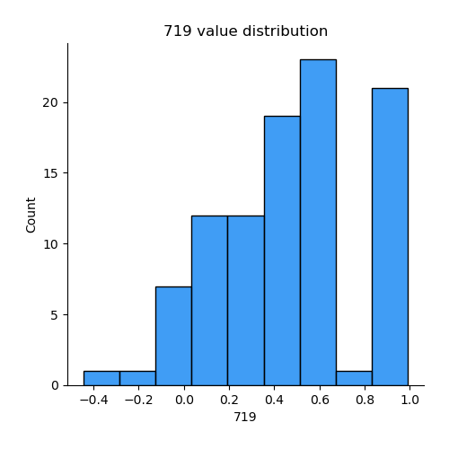
## Feature : 720
- **Feature type** : continous
- **Missing** : 0.0%
- **Unique** : 97
- **Count** :97.0
- **Mean** :0.6020852595489401
- **Std** :0.2666909145838605
- **Min** :-0.30478778884751206
- **25%th Percentile** : 0.44283431221132485
- **50%th Percentile** : 0.5949137799727111
- **75%th Percentile** : 0.7749576577829023
- **Max** :0.9924389113014789

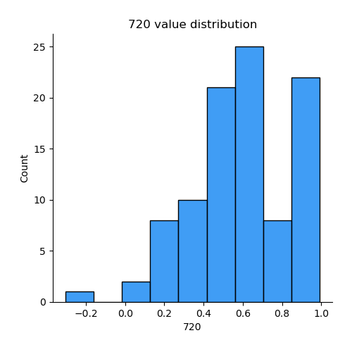
## Feature : 721
- **Feature type** : continous
- **Missing** : 0.0%
- **Unique** : 97
- **Count** :97.0
- **Mean** :0.3971892678412165
- **Std** :0.34453567476101105
- **Min** :-0.476248619867757
- **25%th Percentile** : 0.1561203538408045
- **50%th Percentile** : 0.320664434235952
- **75%th Percentile** : 0.5690968035204692
- **Max** :0.9838446574783721

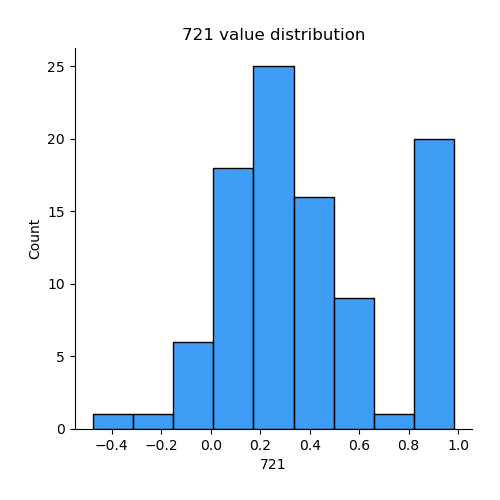
## Feature : 722
- **Feature type** : continous
- **Missing** : 0.0%
- **Unique** : 97
- **Count** :97.0
- **Mean** :0.4772626055814105
- **Std** :0.3437206159580625
- **Min** :-0.4738624483501454
- **25%th Percentile** : 0.2508903931122391
- **50%th Percentile** : 0.46631975258437647
- **75%th Percentile** : 0.6655844119103623
- **Max** :0.991366839047191

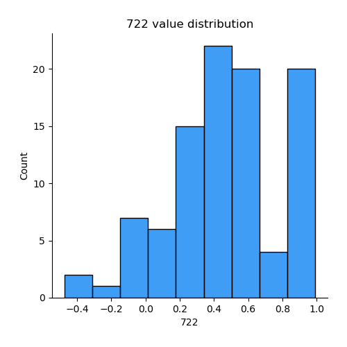
## Feature : 723
- **Feature type** : continous
- **Missing** : 0.0%
- **Unique** : 97
- **Count** :97.0
- **Mean** :0.5281487684011414
- **Std** :0.30479968544352254
- **Min** :-0.47321800286771026
- **25%th Percentile** : 0.32727764197300263
- **50%th Percentile** : 0.5135183115976484
- **75%th Percentile** : 0.6795525413854153
- **Max** :0.9915770341127046

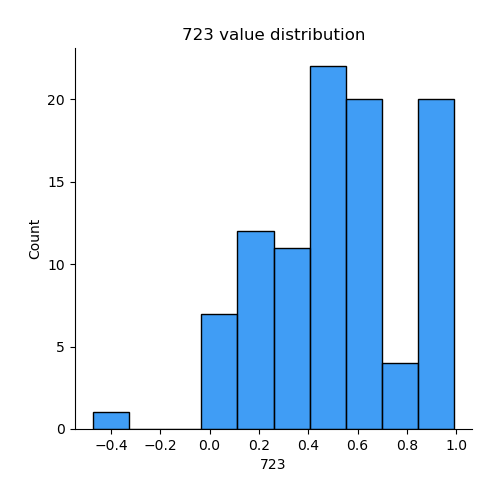
## Feature : 724
- **Feature type** : continous
- **Missing** : 0.0%
- **Unique** : 97
- **Count** :97.0
- **Mean** :0.5559394215053158
- **Std** :0.2994707765393605
- **Min** :-0.22752899306230623
- **25%th Percentile** : 0.38306405781168923
- **50%th Percentile** : 0.5609770411616294
- **75%th Percentile** : 0.7575975542224379
- **Max** :0.9931761374094003

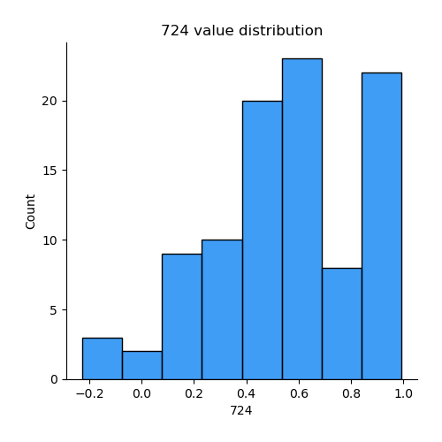
## Feature : 725
- **Feature type** : continous
- **Missing** : 0.0%
- **Unique** : 97
- **Count** :97.0
- **Mean** :0.4803130980215175
- **Std** :0.33509272948201274
- **Min** :-0.3540967511298649
- **25%th Percentile** : 0.23920360279526254
- **50%th Percentile** : 0.48090759682054923
- **75%th Percentile** : 0.6908761474326819
- **Max** :0.9898977917972673

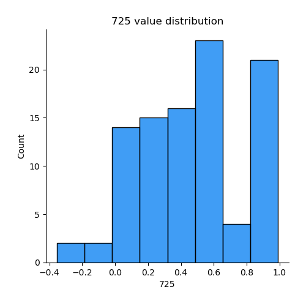
## Feature : 726
- **Feature type** : continous
- **Missing** : 0.0%
- **Unique** : 97
- **Count** :97.0
- **Mean** :0.48579320467530446
- **Std** :0.30669050335918113
- **Min** :-0.20719447818828782
- **25%th Percentile** : 0.26574701666498063
- **50%th Percentile** : 0.4725919347847176
- **75%th Percentile** : 0.7073166057468077
- **Max** :0.9863319468675568

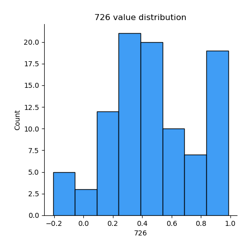
## Feature : 727
- **Feature type** : continous
- **Missing** : 0.0%
- **Unique** : 97
- **Count** :97.0
- **Mean** :0.463275046754358
- **Std** :0.33912821548957395
- **Min** :-0.3729040143798611
- **25%th Percentile** : 0.22126326437163457
- **50%th Percentile** : 0.4163810683850515
- **75%th Percentile** : 0.6705818697623751
- **Max** :0.9868562766334686

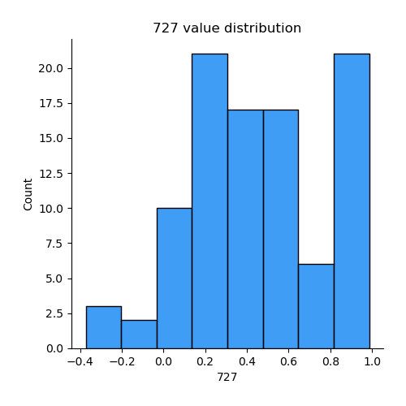
## Feature : 742
- **Feature type** : continous
- **Missing** : 0.0%
- **Unique** : 3
- **Count** :97.0
- **Mean** :1.0
- **Std** :8.849923789036128e-17
- **Min** :0.9999999999999998
- **25%th Percentile** : 0.9999999999999999
- **50%th Percentile** : 1.0
- **75%th Percentile** : 1.0
- **Max** :1.0

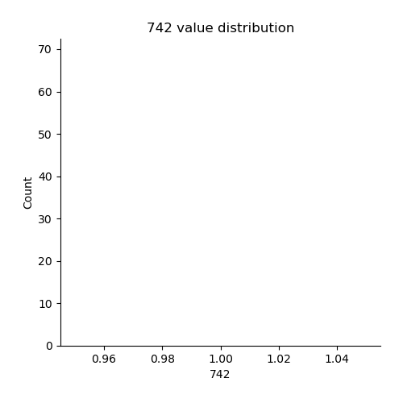
## Feature : 743
- **Feature type** : continous
- **Missing** : 0.0%
- **Unique** : 97
- **Count** :97.0
- **Mean** :0.534419145973103
- **Std** :0.28094430445262786
- **Min** :0.022398376297861945
- **25%th Percentile** : 0.3260445920744501
- **50%th Percentile** : 0.5357109445925281
- **75%th Percentile** : 0.7465833373785592
- **Max** :0.9868901066557317

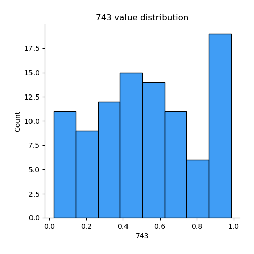
## Feature : 744
- **Feature type** : continous
- **Missing** : 0.0%
- **Unique** : 97
- **Count** :97.0
- **Mean** :0.6131315883538199
- **Std** :0.23260508082171316
- **Min** :0.03550549328126427
- **25%th Percentile** : 0.4536851971116537
- **50%th Percentile** : 0.5882151143457821
- **75%th Percentile** : 0.8193983033428062
- **Max** :0.9899376017374658

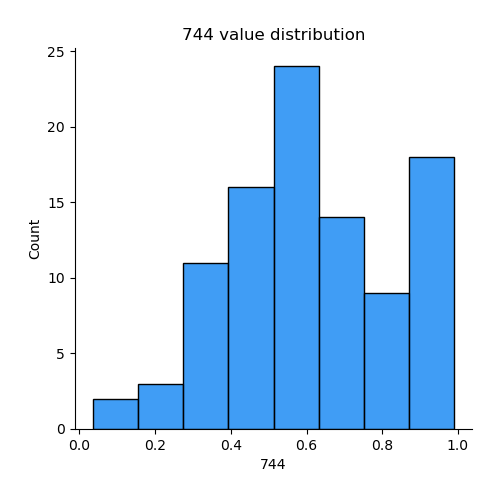
## Feature : 745
- **Feature type** : continous
- **Missing** : 0.0%
- **Unique** : 97
- **Count** :97.0
- **Mean** :0.569735054587291
- **Std** :0.26199570870258815
- **Min** :-0.011458521860963914
- **25%th Percentile** : 0.3972899224503154
- **50%th Percentile** : 0.5634310354293784
- **75%th Percentile** : 0.7571265759161633
- **Max** :0.9895454218235179

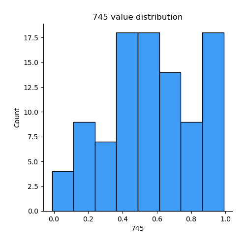
## Feature : 746
- **Feature type** : continous
- **Missing** : 0.0%
- **Unique** : 97
- **Count** :97.0
- **Mean** :0.7229051911906973
- **Std** :0.16947794737902827
- **Min** :0.23331634554267158
- **25%th Percentile** : 0.6236353894980289
- **50%th Percentile** : 0.7054373493999746
- **75%th Percentile** : 0.8484535836218999
- **Max** :0.989088223210568

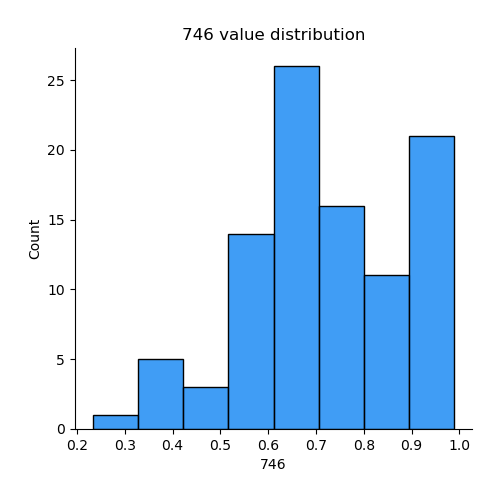
## Feature : 747
- **Feature type** : continous
- **Missing** : 0.0%
- **Unique** : 97
- **Count** :97.0
- **Mean** :0.4430391587676667
- **Std** :0.31267261460833023
- **Min** :-0.3423004443651521
- **25%th Percentile** : 0.22413639641664823
- **50%th Percentile** : 0.3614605892225589
- **75%th Percentile** : 0.6867792981364925
- **Max** :0.9806575379189232

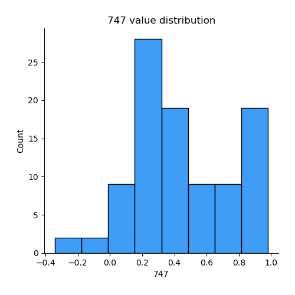
## Feature : 748
- **Feature type** : continous
- **Missing** : 0.0%
- **Unique** : 97
- **Count** :97.0
- **Mean** :0.512994709117319
- **Std** :0.29685536382019606
- **Min** :-0.21890302718011656
- **25%th Percentile** : 0.3209656676455823
- **50%th Percentile** : 0.4805768352182245
- **75%th Percentile** : 0.7301318841556519
- **Max** :0.9904832634242609

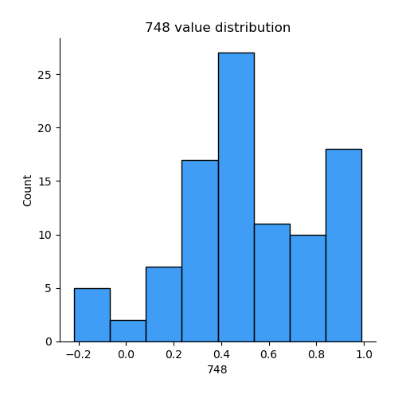
## Feature : 749
- **Feature type** : continous
- **Missing** : 0.0%
- **Unique** : 97
- **Count** :97.0
- **Mean** :0.6865317837011504
- **Std** :0.19834803482618385
- **Min** :0.1662304934468005
- **25%th Percentile** : 0.5562623678468083
- **50%th Percentile** : 0.6841230241769508
- **75%th Percentile** : 0.8196231463260981
- **Max** :0.9872250737945976

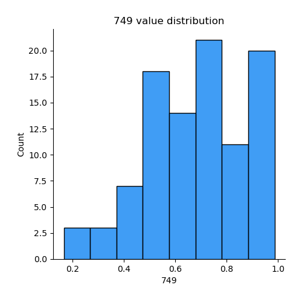
## Feature : 750
- **Feature type** : continous
- **Missing** : 0.0%
- **Unique** : 97
- **Count** :97.0
- **Mean** :0.6146052010397387
- **Std** :0.23235628105605244
- **Min** :-0.0008424501009627907
- **25%th Percentile** : 0.47123200511792007
- **50%th Percentile** : 0.5778168101619929
- **75%th Percentile** : 0.7931900911048673
- **Max** :0.980633043692859

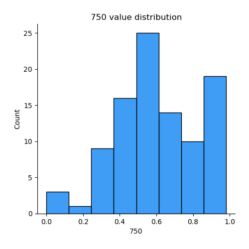
## Feature : 751
- **Feature type** : continous
- **Missing** : 0.0%
- **Unique** : 97
- **Count** :97.0
- **Mean** :0.6271727300592809
- **Std** :0.21556873912484287
- **Min** :0.11065991335911446
- **25%th Percentile** : 0.474363908127254
- **50%th Percentile** : 0.5971434920523605
- **75%th Percentile** : 0.7828242692451803
- **Max** :0.9903264303223573

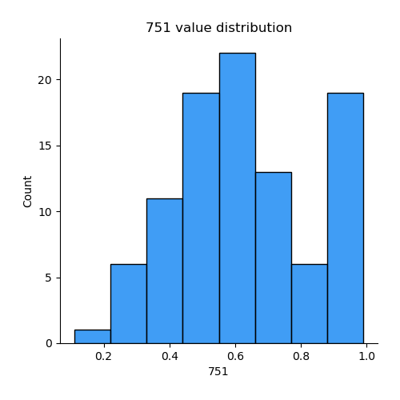
## Feature : 752
- **Feature type** : continous
- **Missing** : 0.0%
- **Unique** : 97
- **Count** :97.0
- **Mean** :0.40528267633260917
- **Std** :0.3076588272771512
- **Min** :-0.20605138250525443
- **25%th Percentile** : 0.1804377259830758
- **50%th Percentile** : 0.323235638322773
- **75%th Percentile** : 0.5895864903908955
- **Max** :0.9679388524682547

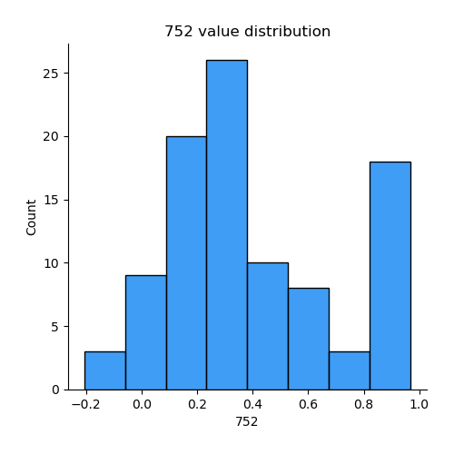
## Feature : 753
- **Feature type** : continous
- **Missing** : 0.0%
- **Unique** : 97
- **Count** :97.0
- **Mean** :0.5913843367053058
- **Std** :0.23117722297851442
- **Min** :0.03410513643859543
- **25%th Percentile** : 0.42195819113721456
- **50%th Percentile** : 0.5391757398481533
- **75%th Percentile** : 0.7724379042180459
- **Max** :0.9812743111348521

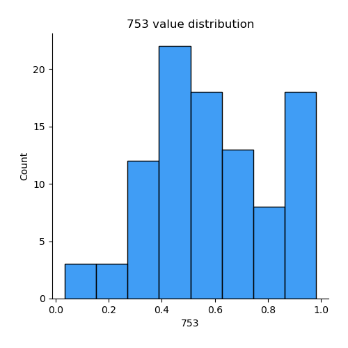
## Feature : 754
- **Feature type** : continous
- **Missing** : 0.0%
- **Unique** : 97
- **Count** :97.0
- **Mean** :0.5596883467240023
- **Std** :0.2719852529755673
- **Min** :-0.2208726829673271
- **25%th Percentile** : 0.38743514938975443
- **50%th Percentile** : 0.5276052623044483
- **75%th Percentile** : 0.7435772079048851
- **Max** :0.9787105083532402

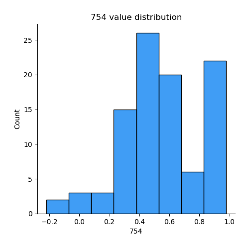
## Feature : 755
- **Feature type** : continous
- **Missing** : 0.0%
- **Unique** : 97
- **Count** :97.0
- **Mean** :0.5524149197231264
- **Std** :0.264042034074831
- **Min** :-0.14330998945489143
- **25%th Percentile** : 0.3723712443199576
- **50%th Percentile** : 0.5406417451765613
- **75%th Percentile** : 0.7163445280880377
- **Max** :0.9852575500550438

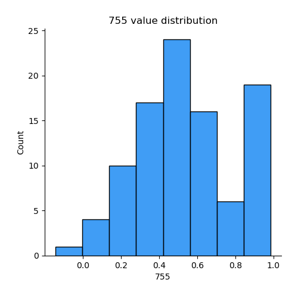
## Feature : 756
- **Feature type** : continous
- **Missing** : 0.0%
- **Unique** : 97
- **Count** :97.0
- **Mean** :0.8109866760857369
- **Std** :0.13773352470569755
- **Min** :0.20833001406585747
- **25%th Percentile** : 0.7296302371672444
- **50%th Percentile** : 0.8254875119416604
- **75%th Percentile** : 0.9119826939266874
- **Max** :0.9920001105638016

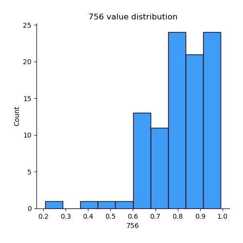
## Feature : 757
- **Feature type** : continous
- **Missing** : 0.0%
- **Unique** : 97
- **Count** :97.0
- **Mean** :0.3869489042380258
- **Std** :0.33545162182562305
- **Min** :-0.5242395687666703
- **25%th Percentile** : 0.17298561111560656
- **50%th Percentile** : 0.3372408343760685
- **75%th Percentile** : 0.6387535792827489
- **Max** :0.9754540360393608

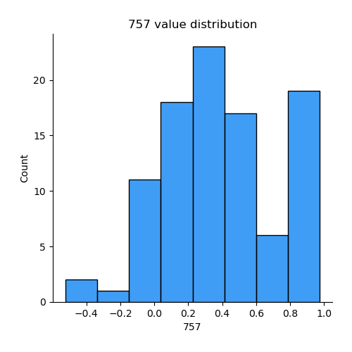
## Feature : 758
- **Feature type** : continous
- **Missing** : 0.0%
- **Unique** : 97
- **Count** :97.0
- **Mean** :0.7084394143108877
- **Std** :0.1836546495005304
- **Min** :0.19906903379249943
- **25%th Percentile** : 0.6042547708824452
- **50%th Percentile** : 0.6854604457617032
- **75%th Percentile** : 0.8618729145960363
- **Max** :0.9900479798822929

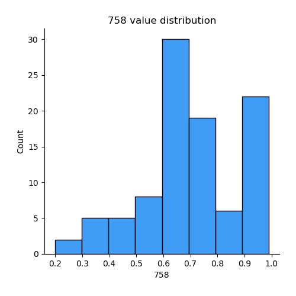
## Feature : 759
- **Feature type** : continous
- **Missing** : 0.0%
- **Unique** : 97
- **Count** :97.0
- **Mean** :0.6453452302410904
- **Std** :0.2154888318863275
- **Min** :0.1226972929997562
- **25%th Percentile** : 0.5040488916443316
- **50%th Percentile** : 0.6236445613778381
- **75%th Percentile** : 0.8201443393923641
- **Max** :0.9886137351903737

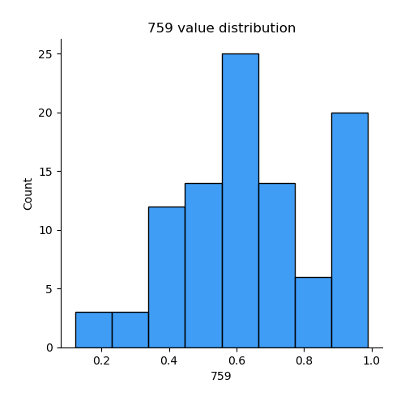
## Feature : 760
- **Feature type** : continous
- **Missing** : 0.0%
- **Unique** : 97
- **Count** :97.0
- **Mean** :0.5649172249511021
- **Std** :0.25503642148122874
- **Min** :-0.11478358657391985
- **25%th Percentile** : 0.39880064875094673
- **50%th Percentile** : 0.5258990925369237
- **75%th Percentile** : 0.7038416453828957
- **Max** :0.988090313902204

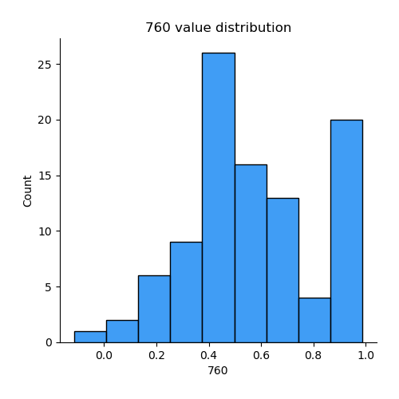
## Feature : 761
- **Feature type** : continous
- **Missing** : 0.0%
- **Unique** : 97
- **Count** :97.0
- **Mean** :0.6195432870728863
- **Std** :0.22457296929105383
- **Min** :-0.15321681854787178
- **25%th Percentile** : 0.47099041363953836
- **50%th Percentile** : 0.5820313571965752
- **75%th Percentile** : 0.7725282813819214
- **Max** :0.9883351561423408

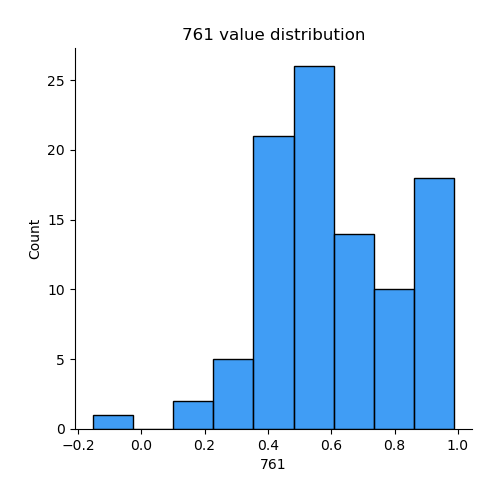
## Feature : 762
- **Feature type** : continous
- **Missing** : 0.0%
- **Unique** : 97
- **Count** :97.0
- **Mean** :0.6931485812624069
- **Std** :0.1907626068146416
- **Min** :0.17019582018847587
- **25%th Percentile** : 0.5693233019581658
- **50%th Percentile** : 0.6869542668532721
- **75%th Percentile** : 0.8754117764074063
- **Max** :0.9886053468583765

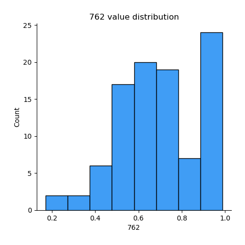
## Feature : 763
- **Feature type** : continous
- **Missing** : 0.0%
- **Unique** : 97
- **Count** :97.0
- **Mean** :0.7529898289400403
- **Std** :0.16210552133548561
- **Min** :0.232803566533955
- **25%th Percentile** : 0.6401051505269807
- **50%th Percentile** : 0.7509504593019283
- **75%th Percentile** : 0.8719550727376941
- **Max** :0.9852071080267504

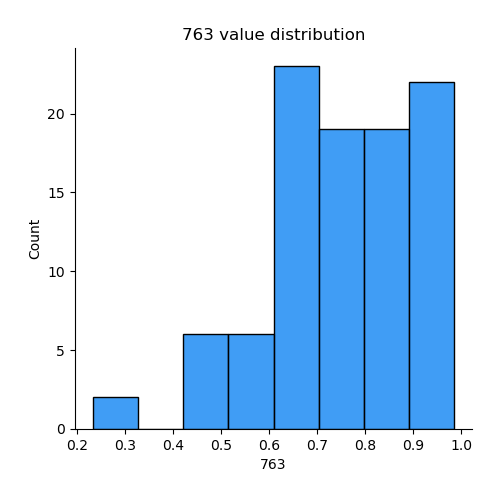
## Feature : 764
- **Feature type** : continous
- **Missing** : 0.0%
- **Unique** : 97
- **Count** :97.0
- **Mean** :0.8796059822176809
- **Std** :0.09199998605961014
- **Min** :0.5585502638656432
- **25%th Percentile** : 0.8485372157665496
- **50%th Percentile** : 0.8929775158681863
- **75%th Percentile** : 0.9513731405034185
- **Max** :0.9944975713914016

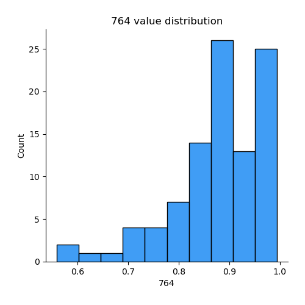
## Feature : 765
- **Feature type** : continous
- **Missing** : 0.0%
- **Unique** : 97
- **Count** :97.0
- **Mean** :0.5615532096896759
- **Std** :0.2671962988860305
- **Min** :-0.21783883556388017
- **25%th Percentile** : 0.37846254802331253
- **50%th Percentile** : 0.5374712080230742
- **75%th Percentile** : 0.734602146508085
- **Max** :0.9857445675665286

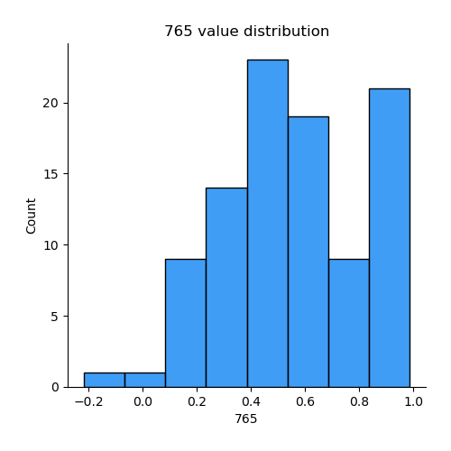
## Feature : 766
- **Feature type** : continous
- **Missing** : 0.0%
- **Unique** : 97
- **Count** :97.0
- **Mean** :0.5052743962771512
- **Std** :0.32146200508706024
- **Min** :-0.20266855612288023
- **25%th Percentile** : 0.23267784349670534
- **50%th Percentile** : 0.5327873275475726
- **75%th Percentile** : 0.7456368424493757
- **Max** :0.9879704637841348

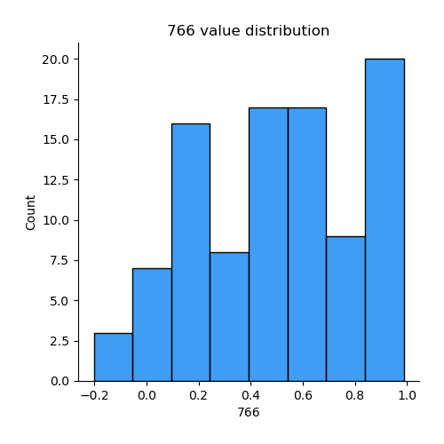
## Feature : 767
- **Feature type** : continous
- **Missing** : 0.0%
- **Unique** : 97
- **Count** :97.0
- **Mean** :0.6036746112910777
- **Std** :0.22579087005283396
- **Min** :0.09542199254885536
- **25%th Percentile** : 0.4261081874017429
- **50%th Percentile** : 0.5857844354539432
- **75%th Percentile** : 0.7828655050851784
- **Max** :0.9865263430394604

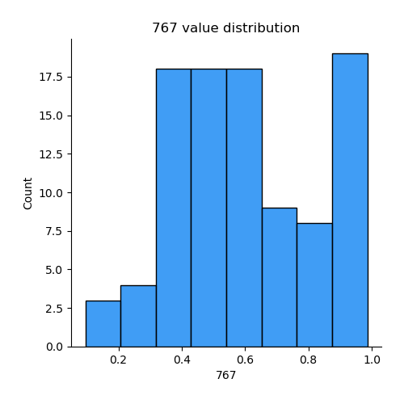
## Feature : 768
- **Feature type** : continous
- **Missing** : 0.0%
- **Unique** : 97
- **Count** :97.0
- **Mean** :0.9301942475476553
- **Std** :0.08022485653756459
- **Min** :0.35047895452017563
- **25%th Percentile** : 0.9149785985224285
- **50%th Percentile** : 0.9441570975192102
- **75%th Percentile** : 0.9731563601769516
- **Max** :0.9973510527378456

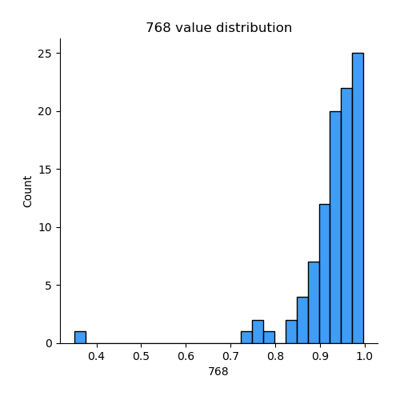
## Feature : 769
- **Feature type** : continous
- **Missing** : 0.0%
- **Unique** : 97
- **Count** :97.0
- **Mean** :0.5025554000403324
- **Std** :0.3309273976507714
- **Min** :-0.28772666874530645
- **25%th Percentile** : 0.2553378657544072
- **50%th Percentile** : 0.5331067801853188
- **75%th Percentile** : 0.7356794881153523
- **Max** :0.9868718683858305

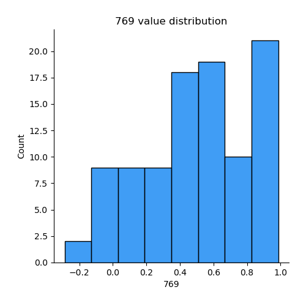
## Feature : 770
- **Feature type** : continous
- **Missing** : 0.0%
- **Unique** : 97
- **Count** :97.0
- **Mean** :0.6075418060235792
- **Std** :0.23899491438075993
- **Min** :0.06712675896262879
- **25%th Percentile** : 0.45646952120435674
- **50%th Percentile** : 0.5936869822252526
- **75%th Percentile** : 0.8041291012503672
- **Max** :0.9926693961273023

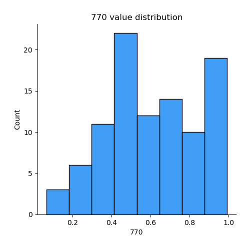
## Feature : 771
- **Feature type** : continous
- **Missing** : 0.0%
- **Unique** : 97
- **Count** :97.0
- **Mean** :0.5441460701839479
- **Std** :0.2999637610769987
- **Min** :-0.2335352686842766
- **25%th Percentile** : 0.3584922883742778
- **50%th Percentile** : 0.5425554037184583
- **75%th Percentile** : 0.7854923932329201
- **Max** :0.9886830517686431

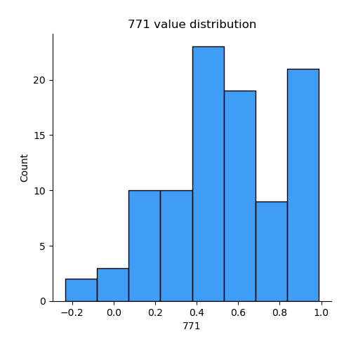
## Feature : 772
- **Feature type** : continous
- **Missing** : 0.0%
- **Unique** : 97
- **Count** :97.0
- **Mean** :0.7143419812632724
- **Std** :0.17242686804570354
- **Min** :0.3288270924108847
- **25%th Percentile** : 0.5910768404397073
- **50%th Percentile** : 0.7060290605816392
- **75%th Percentile** : 0.8464437519112852
- **Max** :0.9906296271287922

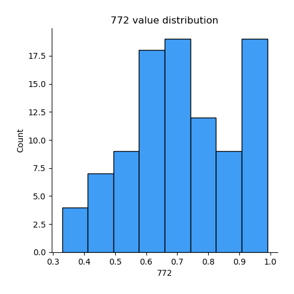
## Feature : 773
- **Feature type** : continous
- **Missing** : 0.0%
- **Unique** : 97
- **Count** :97.0
- **Mean** :0.40553308979698294
- **Std** :0.33170649573045446
- **Min** :-0.48430300608852367
- **25%th Percentile** : 0.1731276132564385
- **50%th Percentile** : 0.3264182508996507
- **75%th Percentile** : 0.6455978108986608
- **Max** :0.9782580524981991

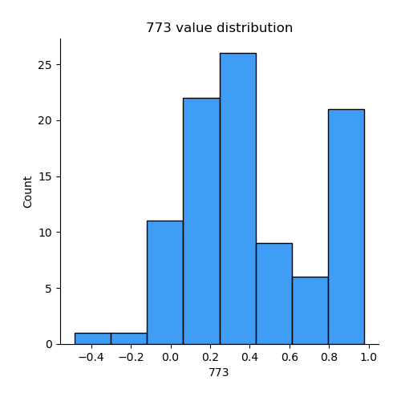
## Feature : 774
- **Feature type** : continous
- **Missing** : 0.0%
- **Unique** : 97
- **Count** :97.0
- **Mean** :0.5353809958385586
- **Std** :0.3021197244772772
- **Min** :-0.269964427564598
- **25%th Percentile** : 0.3359497561556062
- **50%th Percentile** : 0.5420250373768245
- **75%th Percentile** : 0.7565696467585912
- **Max** :0.9910283101616063

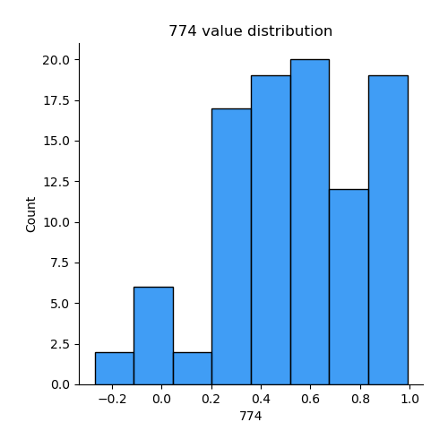
## Feature : 775
- **Feature type** : continous
- **Missing** : 0.0%
- **Unique** : 97
- **Count** :97.0
- **Mean** :0.6593044119620495
- **Std** :0.21887866338796444
- **Min** :0.11394315450403258
- **25%th Percentile** : 0.47758719222289747
- **50%th Percentile** : 0.6483840881255065
- **75%th Percentile** : 0.8192814547126012
- **Max** :0.9884788453474956

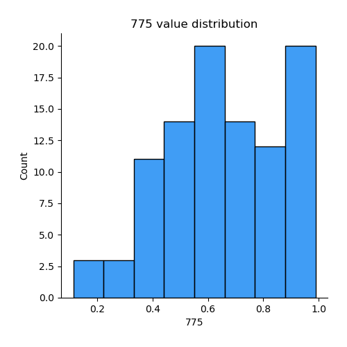
## Feature : 776
- **Feature type** : continous
- **Missing** : 0.0%
- **Unique** : 97
- **Count** :97.0
- **Mean** :0.5866486893314761
- **Std** :0.2516238420293315
- **Min** :-0.180038863333643
- **25%th Percentile** : 0.40351957065027627
- **50%th Percentile** : 0.5869353686363389
- **75%th Percentile** : 0.7813179362512896
- **Max** :0.9852269893719202

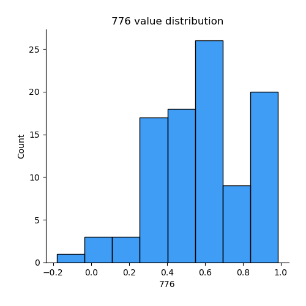
## Feature : 777
- **Feature type** : continous
- **Missing** : 0.0%
- **Unique** : 97
- **Count** :97.0
- **Mean** :0.6057066260360169
- **Std** :0.24485757708449526
- **Min** :-0.0709093695761298
- **25%th Percentile** : 0.45943340357876683
- **50%th Percentile** : 0.5858163636563946
- **75%th Percentile** : 0.779485569303489
- **Max** :0.9857363986658152

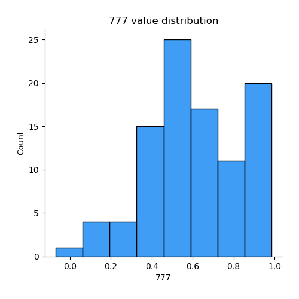
## Feature : 778
- **Feature type** : continous
- **Missing** : 0.0%
- **Unique** : 97
- **Count** :97.0
- **Mean** :0.3911101792444857
- **Std** :0.3166237009851057
- **Min** :-0.24447514441196438
- **25%th Percentile** : 0.14731456977496693
- **50%th Percentile** : 0.3324076621548895
- **75%th Percentile** : 0.6008642498181881
- **Max** :0.972619539632454

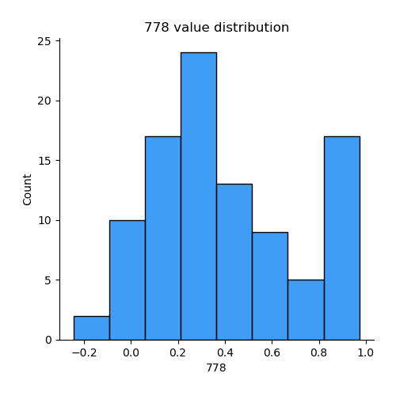
## Feature : 779
- **Feature type** : continous
- **Missing** : 0.0%
- **Unique** : 97
- **Count** :97.0
- **Mean** :0.5234521234672602
- **Std** :0.27955039382924957
- **Min** :-0.017409646091011675
- **25%th Percentile** : 0.2988073290561546
- **50%th Percentile** : 0.5112943269134911
- **75%th Percentile** : 0.7303685771813195
- **Max** :0.9778465171345364

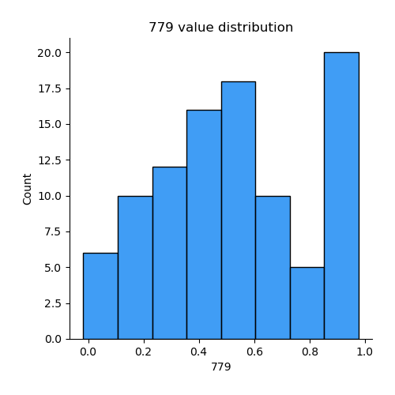
## Feature : 795
- **Feature type** : continous
- **Missing** : 0.0%
- **Unique** : 3
- **Count** :97.0
- **Mean** :1.0
- **Std** :7.601177430610147e-17
- **Min** :0.9999999999999998
- **25%th Percentile** : 1.0
- **50%th Percentile** : 1.0
- **75%th Percentile** : 1.0
- **Max** :1.0

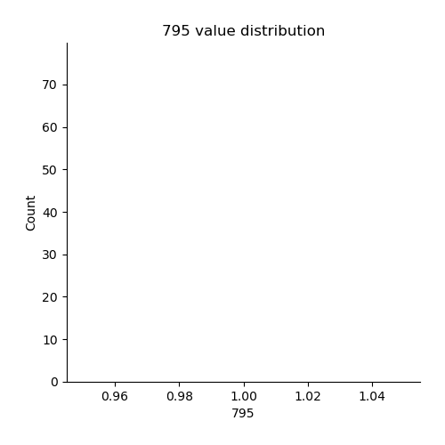
## Feature : 796
- **Feature type** : continous
- **Missing** : 0.0%
- **Unique** : 97
- **Count** :97.0
- **Mean** :0.7286195133408458
- **Std** :0.1897789676899777
- **Min** :0.32693729843072133
- **25%th Percentile** : 0.6033476883212853
- **50%th Percentile** : 0.7415421447144568
- **75%th Percentile** : 0.8884287969559753
- **Max** :0.9938692762538607

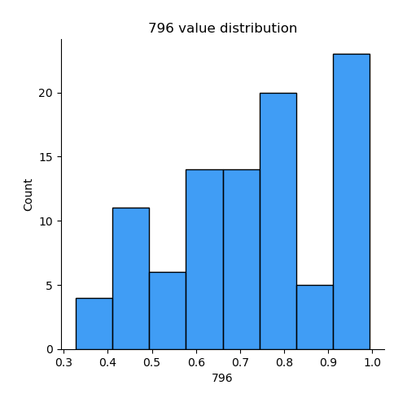
## Feature : 797
- **Feature type** : continous
- **Missing** : 0.0%
- **Unique** : 97
- **Count** :97.0
- **Mean** :0.9395103559937256
- **Std** :0.05141460995123533
- **Min** :0.7908162966675133
- **25%th Percentile** : 0.9172405980413784
- **50%th Percentile** : 0.9486611218020947
- **75%th Percentile** : 0.9738986853713668
- **Max** :0.9986666426041562

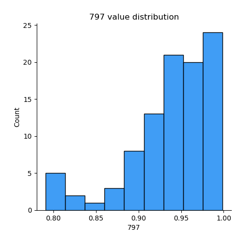
## Feature : 798
- **Feature type** : continous
- **Missing** : 0.0%
- **Unique** : 97
- **Count** :97.0
- **Mean** :0.7234816635650496
- **Std** :0.1843331586091476
- **Min** :0.2009929806819736
- **25%th Percentile** : 0.5909204835687929
- **50%th Percentile** : 0.7231434849827353
- **75%th Percentile** : 0.8480695007605047
- **Max** :0.9921372914003239

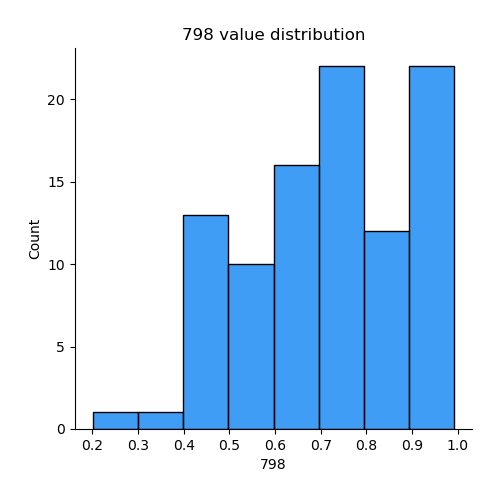
## Feature : 799
- **Feature type** : continous
- **Missing** : 0.0%
- **Unique** : 97
- **Count** :97.0
- **Mean** :0.5268718428169529
- **Std** :0.3121470370507323
- **Min** :-0.1515365543789774
- **25%th Percentile** : 0.3061260303698382
- **50%th Percentile** : 0.508660903694034
- **75%th Percentile** : 0.7697809369265283
- **Max** :0.9905572656737119

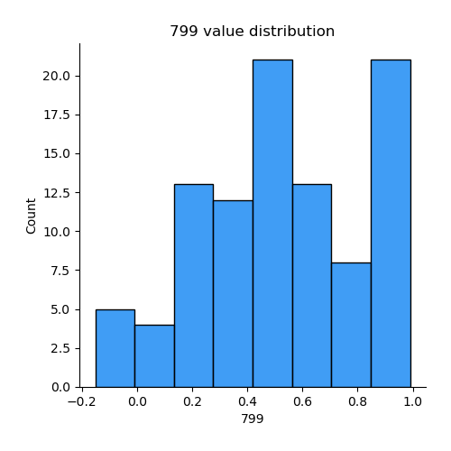
## Feature : 800
- **Feature type** : continous
- **Missing** : 0.0%
- **Unique** : 97
- **Count** :97.0
- **Mean** :0.7291875927580602
- **Std** :0.19358830521889644
- **Min** :0.20820962158398443
- **25%th Percentile** : 0.6146665887487426
- **50%th Percentile** : 0.7527860753764941
- **75%th Percentile** : 0.857870392614063
- **Max** :0.9966064067873706

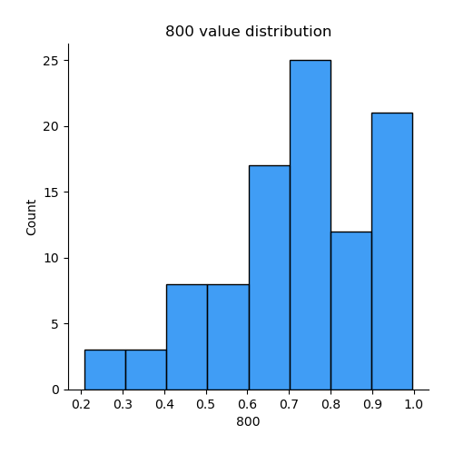
## Feature : 801
- **Feature type** : continous
- **Missing** : 0.0%
- **Unique** : 97
- **Count** :97.0
- **Mean** :0.7972188280131988
- **Std** :0.14398361545181512
- **Min** :0.29137938148063713
- **25%th Percentile** : 0.7171861978703343
- **50%th Percentile** : 0.7974838900768592
- **75%th Percentile** : 0.9021992716853375
- **Max** :0.9967913228695976

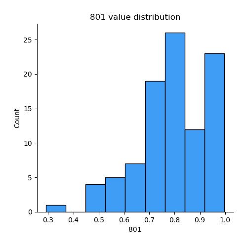
## Feature : 802
- **Feature type** : continous
- **Missing** : 0.0%
- **Unique** : 97
- **Count** :97.0
- **Mean** :0.6715782123758354
- **Std** :0.23454538780723644
- **Min** :-0.08232957612276981
- **25%th Percentile** : 0.5128717622795199
- **50%th Percentile** : 0.6980118934054719
- **75%th Percentile** : 0.8541789295761467
- **Max** :0.9944999622855334

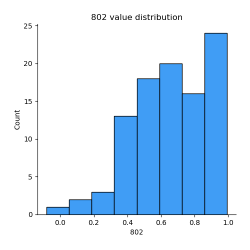
## Feature : 803
- **Feature type** : continous
- **Missing** : 0.0%
- **Unique** : 97
- **Count** :97.0
- **Mean** :0.7778169186051229
- **Std** :0.14941752657322188
- **Min** :0.3381392210205425
- **25%th Percentile** : 0.6957566520894934
- **50%th Percentile** : 0.7602636650373773
- **75%th Percentile** : 0.8617717234476509
- **Max** :0.9968664932087291

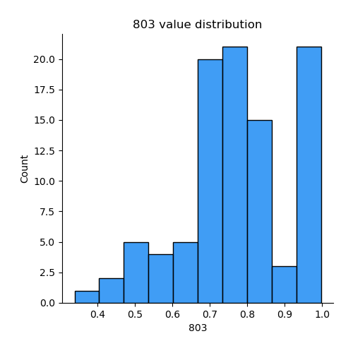
## Feature : 804
- **Feature type** : continous
- **Missing** : 0.0%
- **Unique** : 97
- **Count** :97.0
- **Mean** :0.41579515635086
- **Std** :0.32295954830276763
- **Min** :-0.1730127875012813
- **25%th Percentile** : 0.16735884908412582
- **50%th Percentile** : 0.3552595602440995
- **75%th Percentile** : 0.6577483040027842
- **Max** :0.9854881628184572

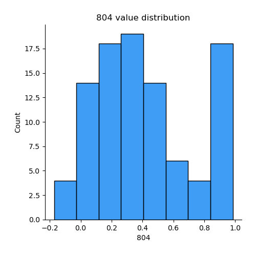
## Feature : 805
- **Feature type** : continous
- **Missing** : 0.0%
- **Unique** : 97
- **Count** :97.0
- **Mean** :0.6202746254127516
- **Std** :0.2407112774930421
- **Min** :0.028027861200021768
- **25%th Percentile** : 0.45344489792656756
- **50%th Percentile** : 0.6079025719844932
- **75%th Percentile** : 0.7676035728570236
- **Max** :0.9917573286012138

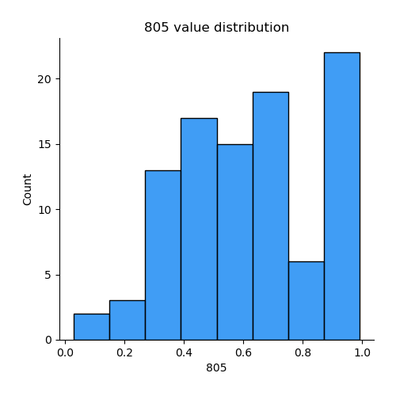
## Feature : 806
- **Feature type** : continous
- **Missing** : 0.0%
- **Unique** : 97
- **Count** :97.0
- **Mean** :0.5711808973865126
- **Std** :0.2885094595625708
- **Min** :-0.1850151979815033
- **25%th Percentile** : 0.3853365025098048
- **50%th Percentile** : 0.5557519674797815
- **75%th Percentile** : 0.8189861374085241
- **Max** :0.9949761467841844

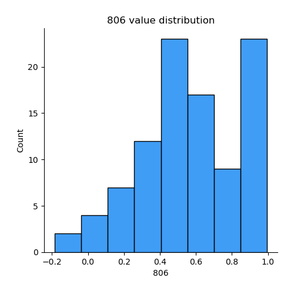
## Feature : 807
- **Feature type** : continous
- **Missing** : 0.0%
- **Unique** : 97
- **Count** :97.0
- **Mean** :0.6457995805065787
- **Std** :0.225158939346843
- **Min** :0.043033419763137556
- **25%th Percentile** : 0.4680410536292492
- **50%th Percentile** : 0.6242585004369691
- **75%th Percentile** : 0.7925517232092288
- **Max** :0.9935903949929907

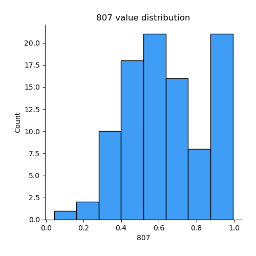
## Feature : 808
- **Feature type** : continous
- **Missing** : 0.0%
- **Unique** : 97
- **Count** :97.0
- **Mean** :0.6361159230165622
- **Std** :0.23294838045199479
- **Min** :0.12819109821748492
- **25%th Percentile** : 0.477120609045379
- **50%th Percentile** : 0.6254057053237791
- **75%th Percentile** : 0.7895830812749614
- **Max** :0.9905189618978375

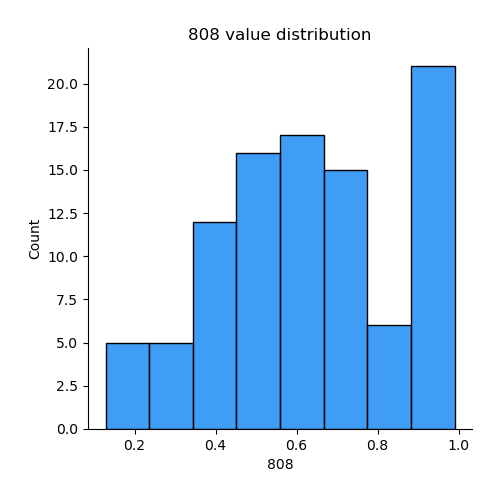
## Feature : 809
- **Feature type** : continous
- **Missing** : 0.0%
- **Unique** : 97
- **Count** :97.0
- **Mean** :0.379795108975882
- **Std** :0.33836316582021686
- **Min** :-0.28009423608771056
- **25%th Percentile** : 0.10584417805663021
- **50%th Percentile** : 0.350549814399025
- **75%th Percentile** : 0.6035846022414105
- **Max** :0.9842308314325205

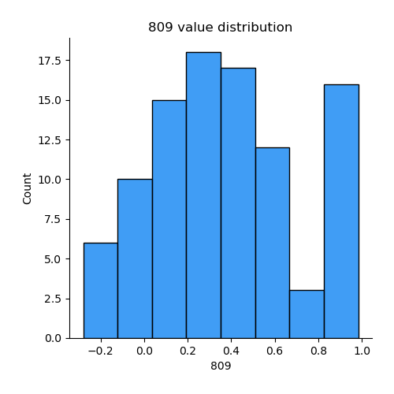
## Feature : 810
- **Feature type** : continous
- **Missing** : 0.0%
- **Unique** : 97
- **Count** :97.0
- **Mean** :0.5648504968067325
- **Std** :0.28307303709560305
- **Min** :-0.08196868391984255
- **25%th Percentile** : 0.38846019670527554
- **50%th Percentile** : 0.5294967681188739
- **75%th Percentile** : 0.801891174896309
- **Max** :0.9929402862846272

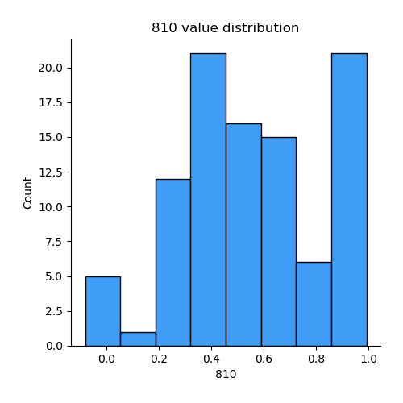
## Feature : 811
- **Feature type** : continous
- **Missing** : 0.0%
- **Unique** : 97
- **Count** :97.0
- **Mean** :0.6055419875672018
- **Std** :0.26508017963715125
- **Min** :-0.17452607890252483
- **25%th Percentile** : 0.44385937872350173
- **50%th Percentile** : 0.5681857381058296
- **75%th Percentile** : 0.8056105834401416
- **Max** :0.994488582198996

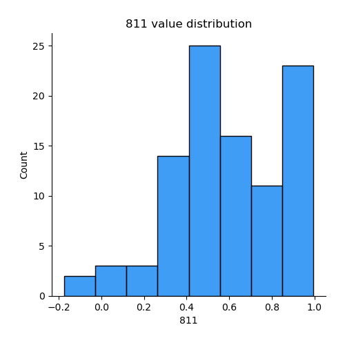
## Feature : 812
- **Feature type** : continous
- **Missing** : 0.0%
- **Unique** : 97
- **Count** :97.0
- **Mean** :0.5166260404919054
- **Std** :0.31168220754234127
- **Min** :-0.25105271483404484
- **25%th Percentile** : 0.3543283638838086
- **50%th Percentile** : 0.48395336792568105
- **75%th Percentile** : 0.7059197854305758
- **Max** :0.992981895804871

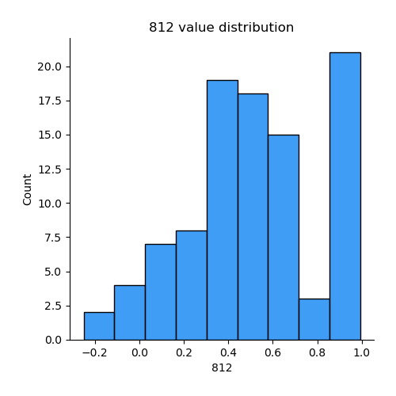
## Feature : 813
- **Feature type** : continous
- **Missing** : 0.0%
- **Unique** : 97
- **Count** :97.0
- **Mean** :0.6854811659585818
- **Std** :0.21137615680135508
- **Min** :0.20413737271138596
- **25%th Percentile** : 0.5141904358976926
- **50%th Percentile** : 0.6788481457293928
- **75%th Percentile** : 0.8395154694170348
- **Max** :0.9955821085413763

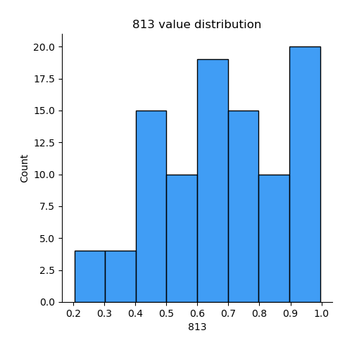
## Feature : 814
- **Feature type** : continous
- **Missing** : 0.0%
- **Unique** : 97
- **Count** :97.0
- **Mean** :0.6101252170483148
- **Std** :0.2498668279669677
- **Min** :-0.08075213463673282
- **25%th Percentile** : 0.4288984562437079
- **50%th Percentile** : 0.5816201189920363
- **75%th Percentile** : 0.7933573822073814
- **Max** :0.9893393316977822

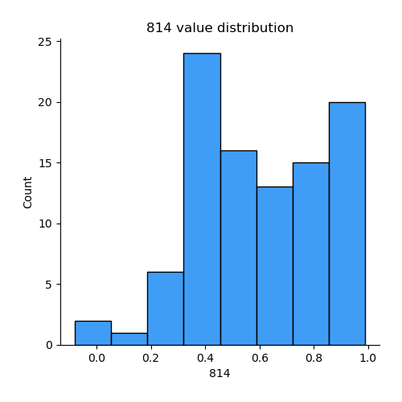
## Feature : 815
- **Feature type** : continous
- **Missing** : 0.0%
- **Unique** : 97
- **Count** :97.0
- **Mean** :0.5550018963833657
- **Std** :0.277797673457251
- **Min** :-0.0953126731717199
- **25%th Percentile** : 0.3347084042663402
- **50%th Percentile** : 0.5400821674563219
- **75%th Percentile** : 0.7569461694072459
- **Max** :0.9896037697314886

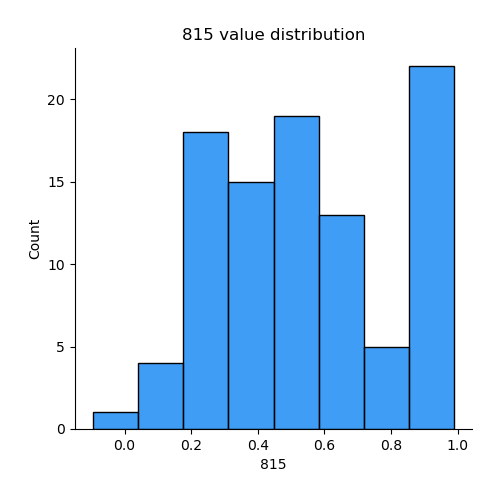
## Feature : 816
- **Feature type** : continous
- **Missing** : 0.0%
- **Unique** : 97
- **Count** :97.0
- **Mean** :0.5915831330690546
- **Std** :0.26298117959017053
- **Min** :0.06588975837154644
- **25%th Percentile** : 0.398243013177399
- **50%th Percentile** : 0.5730877310298166
- **75%th Percentile** : 0.7988348516457728
- **Max** :0.992939954963768

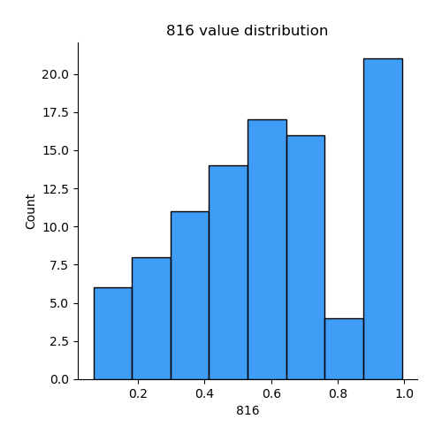
## Feature : 817
- **Feature type** : continous
- **Missing** : 0.0%
- **Unique** : 97
- **Count** :97.0
- **Mean** :0.5114153275048446
- **Std** :0.3280871036046262
- **Min** :-0.3265187286426963
- **25%th Percentile** : 0.29987905659309805
- **50%th Percentile** : 0.4885850488535163
- **75%th Percentile** : 0.7473065501513946
- **Max** :0.9926826222945262

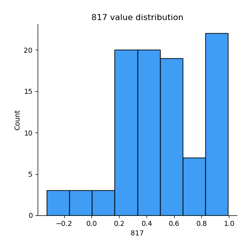
## Feature : 818
- **Feature type** : continous
- **Missing** : 0.0%
- **Unique** : 97
- **Count** :97.0
- **Mean** :0.8200203025874014
- **Std** :0.14150051071950878
- **Min** :0.4387936263088831
- **25%th Percentile** : 0.7380480921008433
- **50%th Percentile** : 0.8398295786357319
- **75%th Percentile** : 0.9211609233027703
- **Max** :0.9972048225725024

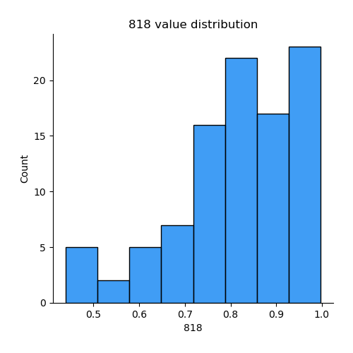
## Feature : 819
- **Feature type** : continous
- **Missing** : 0.0%
- **Unique** : 97
- **Count** :97.0
- **Mean** :0.4679745008709322
- **Std** :0.3204574190760351
- **Min** :-0.08135254568338368
- **25%th Percentile** : 0.22925250237010458
- **50%th Percentile** : 0.4031619272568681
- **75%th Percentile** : 0.6669989102536633
- **Max** :0.9907036332461598

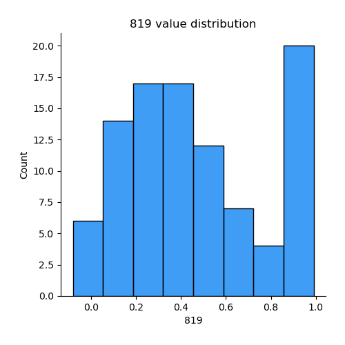
## Feature : 820
- **Feature type** : continous
- **Missing** : 0.0%
- **Unique** : 97
- **Count** :97.0
- **Mean** :0.5366230855436191
- **Std** :0.274236799461961
- **Min** :-0.050052823500102914
- **25%th Percentile** : 0.33512875279067694
- **50%th Percentile** : 0.5182225502954393
- **75%th Percentile** : 0.7630833153826242
- **Max** :0.9873031478560138

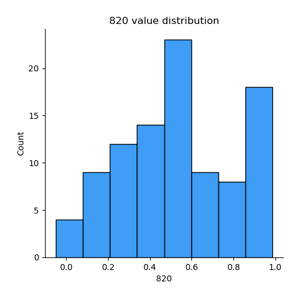
## Feature : 821
- **Feature type** : continous
- **Missing** : 0.0%
- **Unique** : 97
- **Count** :97.0
- **Mean** :0.8815016994825673
- **Std** :0.15498371179408618
- **Min** :0.10834944516315702
- **25%th Percentile** : 0.8709798318607923
- **50%th Percentile** : 0.927515367329873
- **75%th Percentile** : 0.9654774727930199
- **Max** :0.9992137939548366

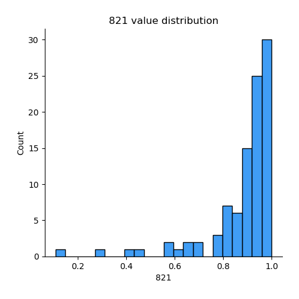
## Feature : 822
- **Feature type** : continous
- **Missing** : 0.0%
- **Unique** : 97
- **Count** :97.0
- **Mean** :0.712430845282187
- **Std** :0.19650038388944543
- **Min** :0.29008010619742275
- **25%th Percentile** : 0.5810996360846926
- **50%th Percentile** : 0.7003635849354852
- **75%th Percentile** : 0.8725579732095102
- **Max** :0.9951039704202753

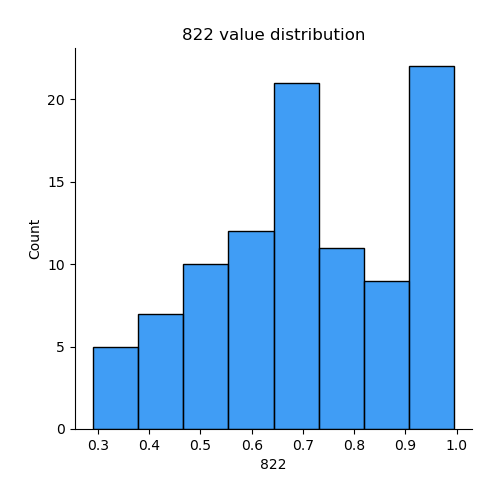
## Feature : 823
- **Feature type** : continous
- **Missing** : 0.0%
- **Unique** : 97
- **Count** :97.0
- **Mean** :0.8571971777430839
- **Std** :0.15214478579671778
- **Min** :0.1969794548826349
- **25%th Percentile** : 0.8247941891808037
- **50%th Percentile** : 0.8922717297157043
- **75%th Percentile** : 0.9431313449192529
- **Max** :0.9980449769822207

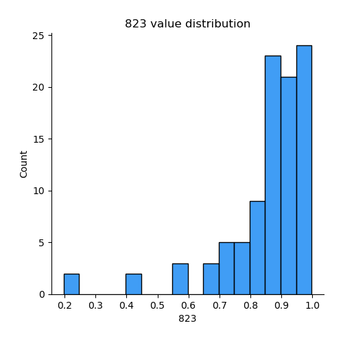
## Feature : 824
- **Feature type** : continous
- **Missing** : 0.0%
- **Unique** : 97
- **Count** :97.0
- **Mean** :0.711937063727838
- **Std** :0.19526343663029316
- **Min** :0.177318466886834
- **25%th Percentile** : 0.5594024420110154
- **50%th Percentile** : 0.7052841672334874
- **75%th Percentile** : 0.8648313432117972
- **Max** :0.9919071485606775

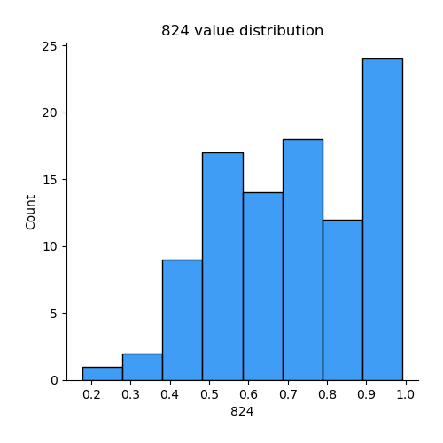
## Feature : 825
- **Feature type** : continous
- **Missing** : 0.0%
- **Unique** : 97
- **Count** :97.0
- **Mean** :0.4910884623183057
- **Std** :0.3237582763483955
- **Min** :-0.23780060335899902
- **25%th Percentile** : 0.26078992703351894
- **50%th Percentile** : 0.45389886420448844
- **75%th Percentile** : 0.7309796873073368
- **Max** :0.9901271192164195

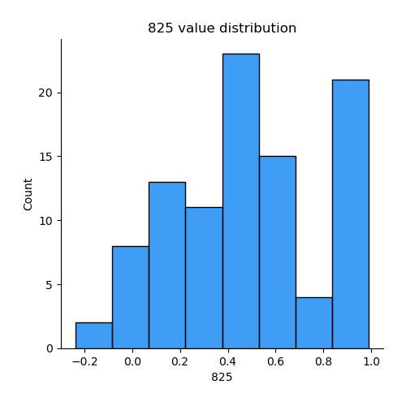
## Feature : 826
- **Feature type** : continous
- **Missing** : 0.0%
- **Unique** : 97
- **Count** :97.0
- **Mean** :0.6929032275804885
- **Std** :0.2188121340093064
- **Min** :0.12680064290517115
- **25%th Percentile** : 0.54685985971598
- **50%th Percentile** : 0.6903329257757496
- **75%th Percentile** : 0.8560877883566501
- **Max** :0.9969058586237342

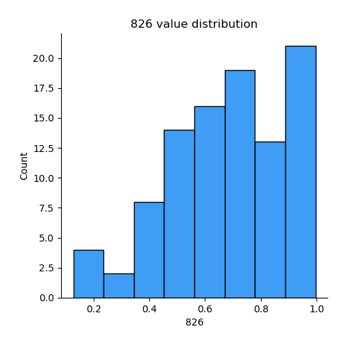
## Feature : 827
- **Feature type** : continous
- **Missing** : 0.0%
- **Unique** : 97
- **Count** :97.0
- **Mean** :0.7685776738902963
- **Std** :0.17087273109542905
- **Min** :0.25998375387816824
- **25%th Percentile** : 0.6580604644262151
- **50%th Percentile** : 0.7761694093032243
- **75%th Percentile** : 0.9089758467703105
- **Max** :0.9973811300690879

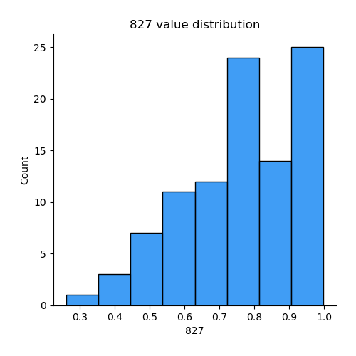
## Feature : 828
- **Feature type** : continous
- **Missing** : 0.0%
- **Unique** : 97
- **Count** :97.0
- **Mean** :0.6176524254278779
- **Std** :0.27807485170232943
- **Min** :-0.2550234898437783
- **25%th Percentile** : 0.4492828215890629
- **50%th Percentile** : 0.6459583874399301
- **75%th Percentile** : 0.858921575475166
- **Max** :0.9947545682873087

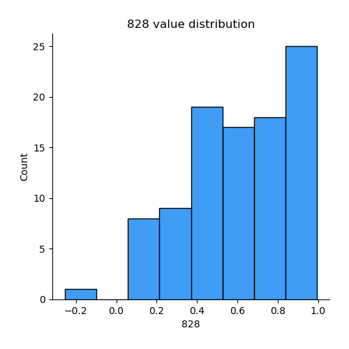
## Feature : 829
- **Feature type** : continous
- **Missing** : 0.0%
- **Unique** : 97
- **Count** :97.0
- **Mean** :0.7481762439629925
- **Std** :0.18070784182609295
- **Min** :0.08663048343512166
- **25%th Percentile** : 0.6604006267566146
- **50%th Percentile** : 0.7529180644812489
- **75%th Percentile** : 0.8842759452581103
- **Max** :0.99618315175824

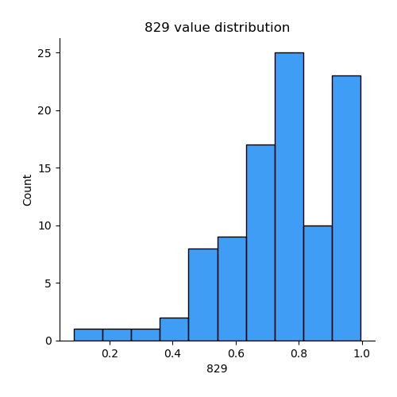
## Feature : 830
- **Feature type** : continous
- **Missing** : 0.0%
- **Unique** : 97
- **Count** :97.0
- **Mean** :0.3939019273127051
- **Std** :0.33577785556864703
- **Min** :-0.4454402453950323
- **25%th Percentile** : 0.18868485232184073
- **50%th Percentile** : 0.32658752915659783
- **75%th Percentile** : 0.6263804975006804
- **Max** :0.9862950717905841

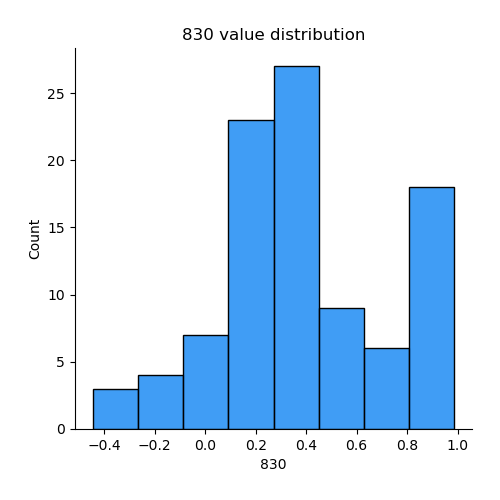
## Feature : 831
- **Feature type** : continous
- **Missing** : 0.0%
- **Unique** : 97
- **Count** :97.0
- **Mean** :0.5296765899606727
- **Std** :0.2926267325336186
- **Min** :-0.1731024533471133
- **25%th Percentile** : 0.32209470962421466
- **50%th Percentile** : 0.5180494972084193
- **75%th Percentile** : 0.7572484587237538
- **Max** :0.989858338411886

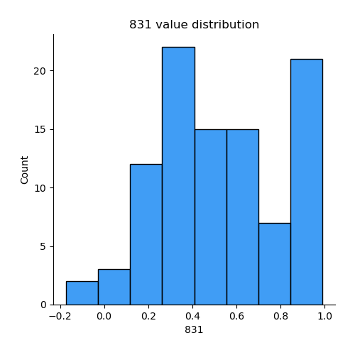
## Feature : 848
- **Feature type** : continous
- **Missing** : 0.0%
- **Unique** : 3
- **Count** :97.0
- **Mean** :1.0
- **Std** :9.547810431419822e-17
- **Min** :0.9999999999999998
- **25%th Percentile** : 0.9999999999999999
- **50%th Percentile** : 1.0
- **75%th Percentile** : 1.0
- **Max** :1.0

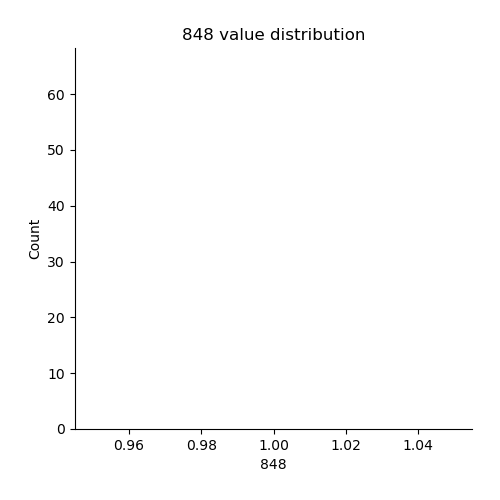
## Feature : 849
- **Feature type** : continous
- **Missing** : 0.0%
- **Unique** : 97
- **Count** :97.0
- **Mean** :0.7608968559840155
- **Std** :0.168071887333056
- **Min** :0.3794738377574459
- **25%th Percentile** : 0.6241862388686447
- **50%th Percentile** : 0.7781200903658604
- **75%th Percentile** : 0.8842778359584518
- **Max** :0.9936366533366064

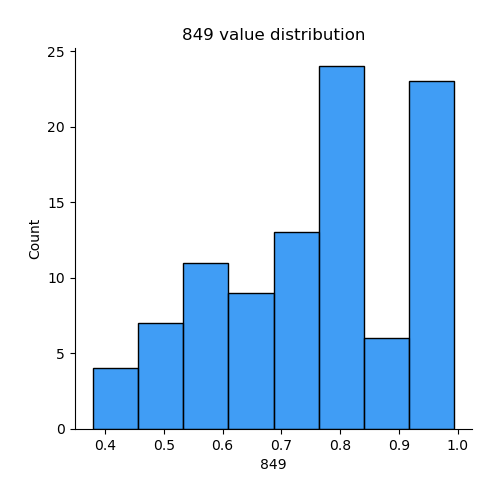
## Feature : 850
- **Feature type** : continous
- **Missing** : 0.0%
- **Unique** : 97
- **Count** :97.0
- **Mean** :0.8028161112734505
- **Std** :0.13561627376285212
- **Min** :0.45420775607074926
- **25%th Percentile** : 0.7216245708356571
- **50%th Percentile** : 0.8100840551753081
- **75%th Percentile** : 0.9028695490549327
- **Max** :0.9938839643033676

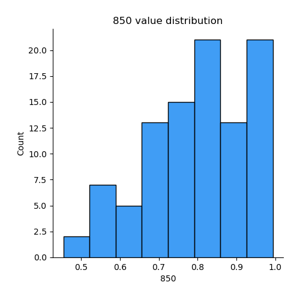
## Feature : 851
- **Feature type** : continous
- **Missing** : 0.0%
- **Unique** : 97
- **Count** :97.0
- **Mean** :0.5932566561488962
- **Std** :0.26879389381484176
- **Min** :-0.022803877711952338
- **25%th Percentile** : 0.3977974883918332
- **50%th Percentile** : 0.5538960257509894
- **75%th Percentile** : 0.84619025581785
- **Max** :0.990243534780413

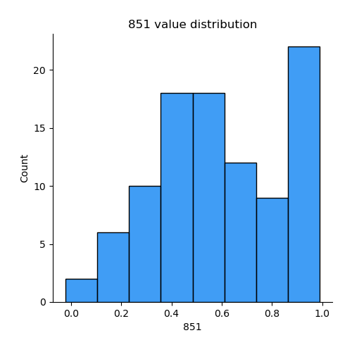
## Feature : 852
- **Feature type** : continous
- **Missing** : 0.0%
- **Unique** : 97
- **Count** :97.0
- **Mean** :0.7493640861707932
- **Std** :0.17719781329557474
- **Min** :0.3088169119434483
- **25%th Percentile** : 0.645806381830597
- **50%th Percentile** : 0.7597642270097603
- **75%th Percentile** : 0.8589847663605221
- **Max** :0.9963532430919638

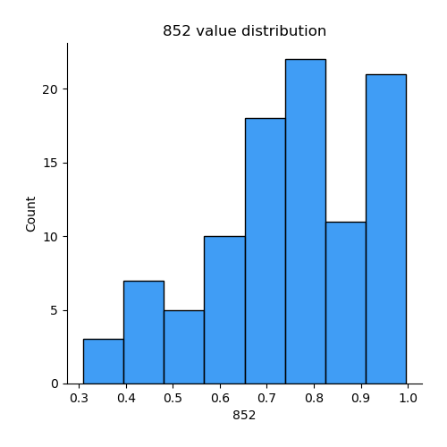
## Feature : 853
- **Feature type** : continous
- **Missing** : 0.0%
- **Unique** : 97
- **Count** :97.0
- **Mean** :0.7391752849594233
- **Std** :0.18678542670806533
- **Min** :0.09771056453136165
- **25%th Percentile** : 0.6200751990400151
- **50%th Percentile** : 0.7463336434879672
- **75%th Percentile** : 0.8933555719697233
- **Max** :0.9934194209350391

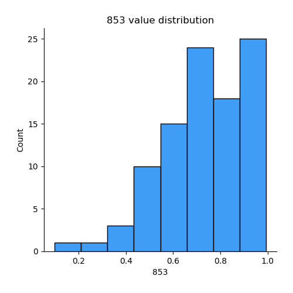
## Feature : 854
- **Feature type** : continous
- **Missing** : 0.0%
- **Unique** : 97
- **Count** :97.0
- **Mean** :0.6523591732437707
- **Std** :0.24703620775571847
- **Min** :0.0009457593371272423
- **25%th Percentile** : 0.5050663975003956
- **50%th Percentile** : 0.6572663784540542
- **75%th Percentile** : 0.8347395949706418
- **Max** :0.9913436058988573

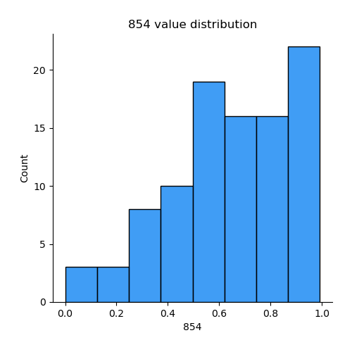
## Feature : 855
- **Feature type** : continous
- **Missing** : 0.0%
- **Unique** : 97
- **Count** :97.0
- **Mean** :0.7896074392362287
- **Std** :0.1468429711728136
- **Min** :0.40974626891013305
- **25%th Percentile** : 0.7039920867530148
- **50%th Percentile** : 0.7948792434389654
- **75%th Percentile** : 0.9011201063717035
- **Max** :0.9935730810813782

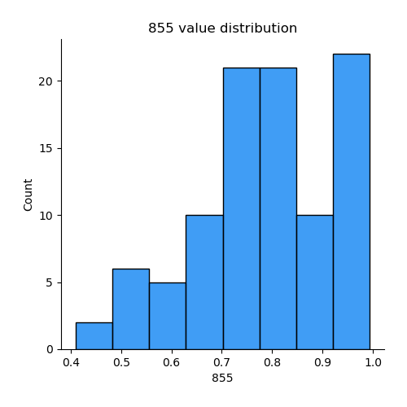
## Feature : 856
- **Feature type** : continous
- **Missing** : 0.0%
- **Unique** : 97
- **Count** :97.0
- **Mean** :0.4712689304802617
- **Std** :0.2937259516741702
- **Min** :-0.12065226022334144
- **25%th Percentile** : 0.2440937833007906
- **50%th Percentile** : 0.43258948323661384
- **75%th Percentile** : 0.6128893285174912
- **Max** :0.9837112780513991

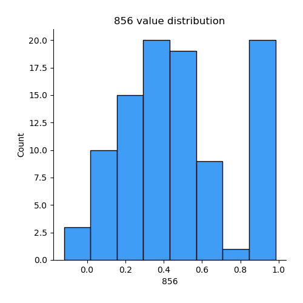
## Feature : 857
- **Feature type** : continous
- **Missing** : 0.0%
- **Unique** : 97
- **Count** :97.0
- **Mean** :0.6424843179944558
- **Std** :0.23217490424090773
- **Min** :0.11223875180618437
- **25%th Percentile** : 0.4794960005702737
- **50%th Percentile** : 0.6137562599007633
- **75%th Percentile** : 0.8188326002163748
- **Max** :0.9912635979511266

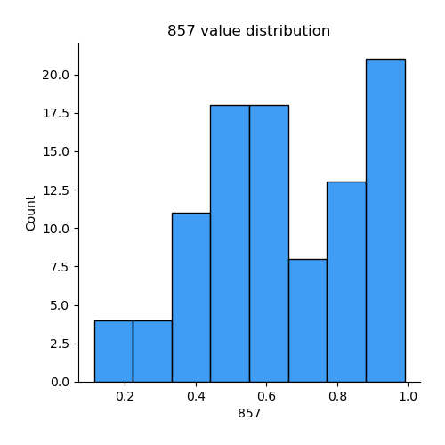
## Feature : 858
- **Feature type** : continous
- **Missing** : 0.0%
- **Unique** : 97
- **Count** :97.0
- **Mean** :0.5699657568409977
- **Std** :0.29281473782545503
- **Min** :-0.12098480474368489
- **25%th Percentile** : 0.38042070373046855
- **50%th Percentile** : 0.5892445477148801
- **75%th Percentile** : 0.765472473528534
- **Max** :0.9886001336152932

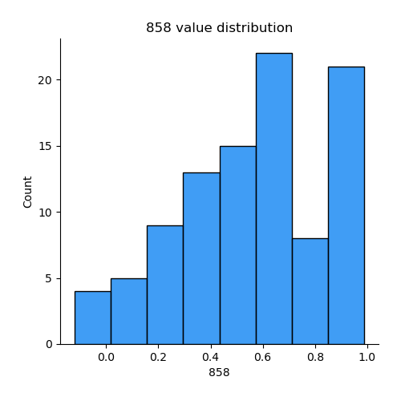
## Feature : 859
- **Feature type** : continous
- **Missing** : 0.0%
- **Unique** : 97
- **Count** :97.0
- **Mean** :0.7500272885571709
- **Std** :0.17717597075288308
- **Min** :0.26981836270079385
- **25%th Percentile** : 0.6292671668595707
- **50%th Percentile** : 0.7685971343220487
- **75%th Percentile** : 0.8687404681401791
- **Max** :0.9942172973639484

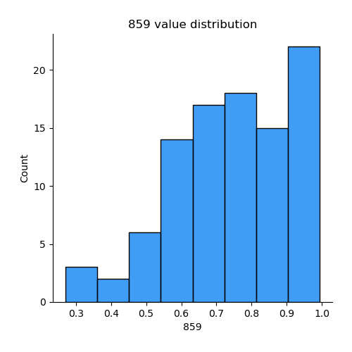
## Feature : 860
- **Feature type** : continous
- **Missing** : 0.0%
- **Unique** : 97
- **Count** :97.0
- **Mean** :0.6541782620084972
- **Std** :0.2157066849429688
- **Min** :0.08325168446935494
- **25%th Percentile** : 0.5077491762985958
- **50%th Percentile** : 0.6213355980059084
- **75%th Percentile** : 0.8070076043327226
- **Max** :0.9871032907947823

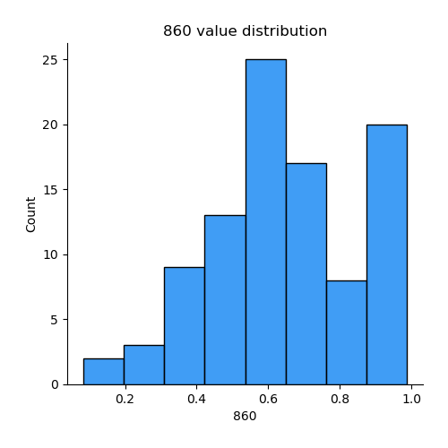
## Feature : 861
- **Feature type** : continous
- **Missing** : 0.0%
- **Unique** : 97
- **Count** :97.0
- **Mean** :0.4444429643591215
- **Std** :0.3025131258137812
- **Min** :-0.0768436563354637
- **25%th Percentile** : 0.18464481883112382
- **50%th Percentile** : 0.42705473815749767
- **75%th Percentile** : 0.6457638707440819
- **Max** :0.9809266309646674

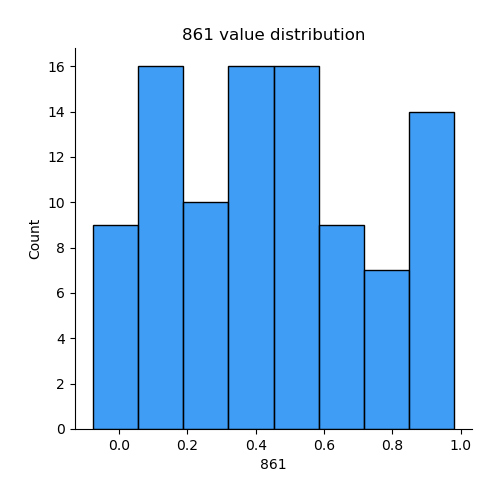
## Feature : 862
- **Feature type** : continous
- **Missing** : 0.0%
- **Unique** : 97
- **Count** :97.0
- **Mean** :0.6049894084705308
- **Std** :0.26671141481149374
- **Min** :-0.03939735788270222
- **25%th Percentile** : 0.42331224175649684
- **50%th Percentile** : 0.6065245767344236
- **75%th Percentile** : 0.7785694386448776
- **Max** :0.9909341119434896

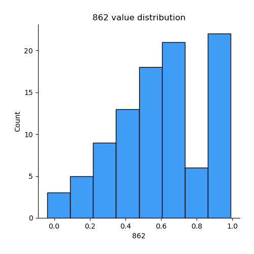
## Feature : 863
- **Feature type** : continous
- **Missing** : 0.0%
- **Unique** : 97
- **Count** :97.0
- **Mean** :0.7010186828191278
- **Std** :0.20706366864326983
- **Min** :0.18839674882644494
- **25%th Percentile** : 0.5406673926566448
- **50%th Percentile** : 0.6955876464145162
- **75%th Percentile** : 0.8378549628665201
- **Max** :0.9929272767399407

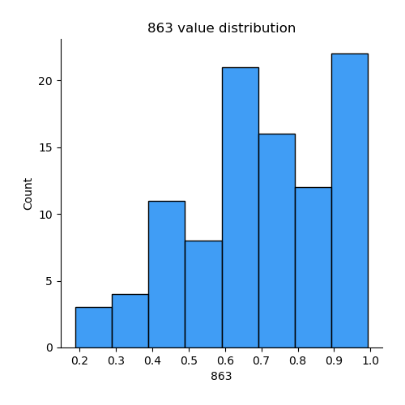
## Feature : 864
- **Feature type** : continous
- **Missing** : 0.0%
- **Unique** : 97
- **Count** :97.0
- **Mean** :0.570741322322128
- **Std** :0.28358992063483895
- **Min** :-0.21925013297055143
- **25%th Percentile** : 0.37537298959828214
- **50%th Percentile** : 0.5571156505702819
- **75%th Percentile** : 0.7673701558654475
- **Max** :0.9903176461675726

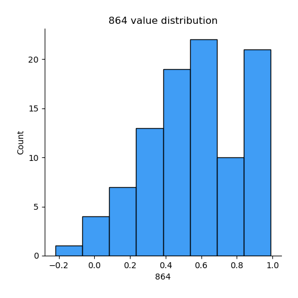
## Feature : 865
- **Feature type** : continous
- **Missing** : 0.0%
- **Unique** : 97
- **Count** :97.0
- **Mean** :0.7006230152882624
- **Std** :0.21551299393432227
- **Min** :0.13939224453694005
- **25%th Percentile** : 0.5049229683084513
- **50%th Percentile** : 0.753045834284108
- **75%th Percentile** : 0.8512733298175905
- **Max** :0.9932595978869991

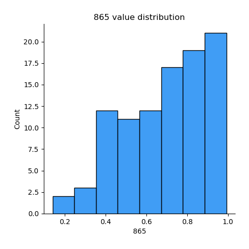
## Feature : 866
- **Feature type** : continous
- **Missing** : 0.0%
- **Unique** : 97
- **Count** :97.0
- **Mean** :0.7255280465641245
- **Std** :0.1817371026740771
- **Min** :0.29650581530096054
- **25%th Percentile** : 0.5951575369268285
- **50%th Percentile** : 0.7248915818607485
- **75%th Percentile** : 0.8760412338471929
- **Max** :0.9895002371615679

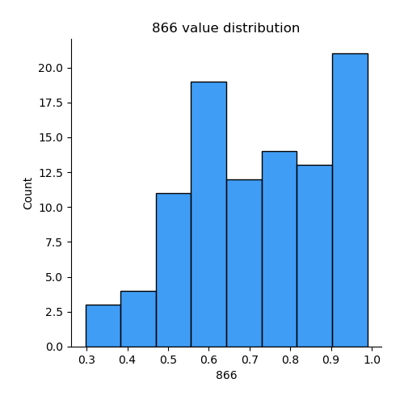
## Feature : 867
- **Feature type** : continous
- **Missing** : 0.0%
- **Unique** : 97
- **Count** :97.0
- **Mean** :0.5760157278398501
- **Std** :0.2658871298076474
- **Min** :-0.1921476575753514
- **25%th Percentile** : 0.3980651915208947
- **50%th Percentile** : 0.5479430674066937
- **75%th Percentile** : 0.7743032960484525
- **Max** :0.9841387999685037

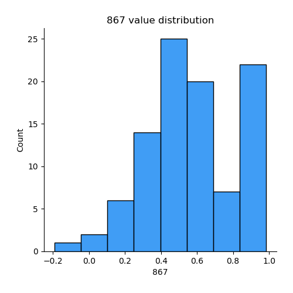
## Feature : 868
- **Feature type** : continous
- **Missing** : 0.0%
- **Unique** : 97
- **Count** :97.0
- **Mean** :0.6418788556246298
- **Std** :0.23662796630904825
- **Min** :-0.07433454110388155
- **25%th Percentile** : 0.4888031479217807
- **50%th Percentile** : 0.6349448749778243
- **75%th Percentile** : 0.8346284938103861
- **Max** :0.992670328198691

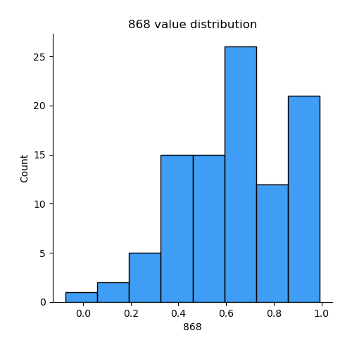
## Feature : 869
- **Feature type** : continous
- **Missing** : 0.0%
- **Unique** : 97
- **Count** :97.0
- **Mean** :0.5917643586825996
- **Std** :0.2820336407206391
- **Min** :-0.1990773602366453
- **25%th Percentile** : 0.4235688538728893
- **50%th Percentile** : 0.5860004214978539
- **75%th Percentile** : 0.7776494364783612
- **Max** :0.9918958481509691

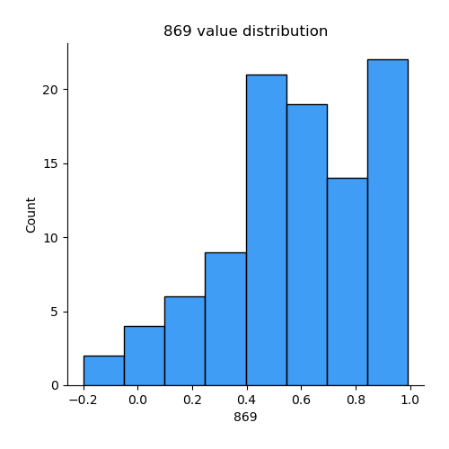
## Feature : 870
- **Feature type** : continous
- **Missing** : 0.0%
- **Unique** : 97
- **Count** :97.0
- **Mean** :0.6818613501386067
- **Std** :0.23225140698631827
- **Min** :-0.049557644777936456
- **25%th Percentile** : 0.5283253508306942
- **50%th Percentile** : 0.6919078601862122
- **75%th Percentile** : 0.8421010014279574
- **Max** :0.9935978012068909

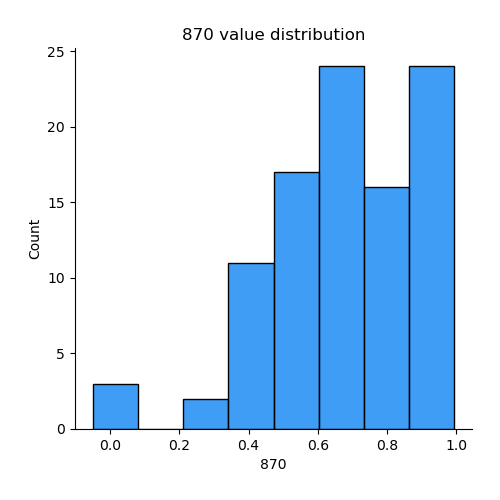
## Feature : 871
- **Feature type** : continous
- **Missing** : 0.0%
- **Unique** : 97
- **Count** :97.0
- **Mean** :0.5302436765201615
- **Std** :0.2949490272319799
- **Min** :-0.08245456768258456
- **25%th Percentile** : 0.28871023367086474
- **50%th Percentile** : 0.5069352538088591
- **75%th Percentile** : 0.7162743907735698
- **Max** :0.9886830339315126

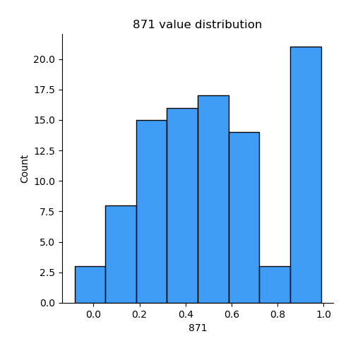
## Feature : 872
- **Feature type** : continous
- **Missing** : 0.0%
- **Unique** : 97
- **Count** :97.0
- **Mean** :0.628419681479031
- **Std** :0.21877934278640382
- **Min** :0.11803307757025054
- **25%th Percentile** : 0.4682662178155632
- **50%th Percentile** : 0.6245552784981404
- **75%th Percentile** : 0.7821081534859058
- **Max** :0.9910648884112992

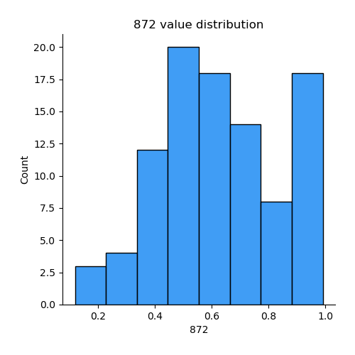
## Feature : 873
- **Feature type** : continous
- **Missing** : 0.0%
- **Unique** : 97
- **Count** :97.0
- **Mean** :0.6762805576288363
- **Std** :0.23251519748173488
- **Min** :0.1311424946648773
- **25%th Percentile** : 0.512124433680678
- **50%th Percentile** : 0.688128663910978
- **75%th Percentile** : 0.8649233884693431
- **Max** :0.9930804909164364

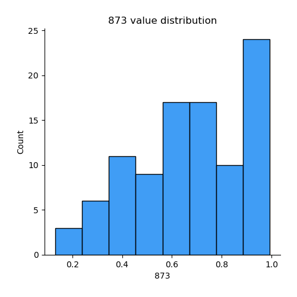
## Feature : 874
- **Feature type** : continous
- **Missing** : 0.0%
- **Unique** : 97
- **Count** :97.0
- **Mean** :0.9050213688823792
- **Std** :0.08526009461750113
- **Min** :0.5956301412882798
- **25%th Percentile** : 0.8592377099460463
- **50%th Percentile** : 0.9232690293983096
- **75%th Percentile** : 0.96185207808481
- **Max** :0.9982438801711344

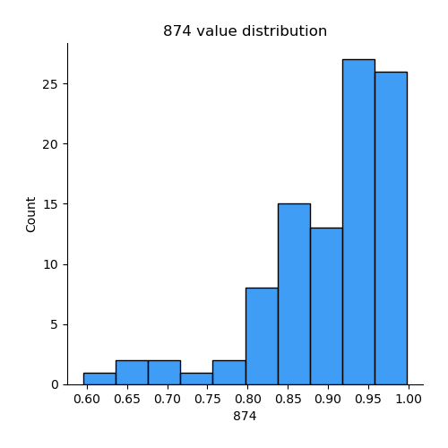
## Feature : 875
- **Feature type** : continous
- **Missing** : 0.0%
- **Unique** : 97
- **Count** :97.0
- **Mean** :0.7216353086150405
- **Std** :0.20265372492022612
- **Min** :0.09503507102223946
- **25%th Percentile** : 0.5642065341493901
- **50%th Percentile** : 0.7329229436129873
- **75%th Percentile** : 0.8748721375175463
- **Max** :0.994679463244651

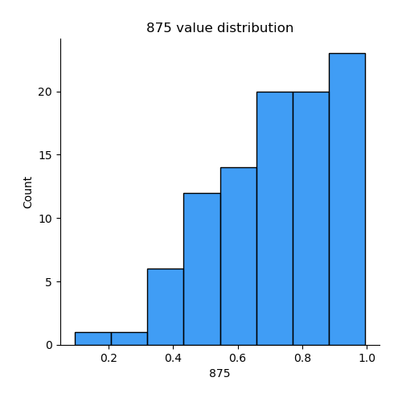
## Feature : 876
- **Feature type** : continous
- **Missing** : 0.0%
- **Unique** : 97
- **Count** :97.0
- **Mean** :0.7834072665713692
- **Std** :0.15539806074022625
- **Min** :0.3499403787071443
- **25%th Percentile** : 0.692590849138647
- **50%th Percentile** : 0.8028105224911408
- **75%th Percentile** : 0.8832032128812985
- **Max** :0.9935006545889087

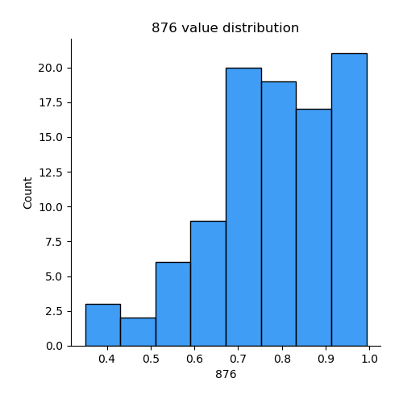
## Feature : 877
- **Feature type** : continous
- **Missing** : 0.0%
- **Unique** : 97
- **Count** :97.0
- **Mean** :0.5649362954591441
- **Std** :0.2764723428316252
- **Min** :-0.006420825111965848
- **25%th Percentile** : 0.3347465988622256
- **50%th Percentile** : 0.5016387182711094
- **75%th Percentile** : 0.7810827685221652
- **Max** :0.9893888560252327

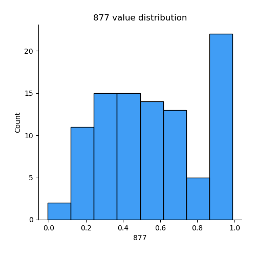
## Feature : 878
- **Feature type** : continous
- **Missing** : 0.0%
- **Unique** : 97
- **Count** :97.0
- **Mean** :0.74107790848713
- **Std** :0.18929500139750743
- **Min** :0.19471678743351273
- **25%th Percentile** : 0.6631659676697969
- **50%th Percentile** : 0.7522579611460048
- **75%th Percentile** : 0.8509910628184024
- **Max** :0.9958446947304579

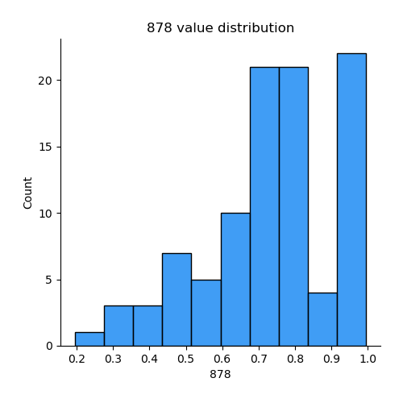
## Feature : 879
- **Feature type** : continous
- **Missing** : 0.0%
- **Unique** : 97
- **Count** :97.0
- **Mean** :0.7193198703378215
- **Std** :0.20292277338917436
- **Min** :-0.0733422945121022
- **25%th Percentile** : 0.5996457966808989
- **50%th Percentile** : 0.7332729106676192
- **75%th Percentile** : 0.8696742046832104
- **Max** :0.9930814980193107

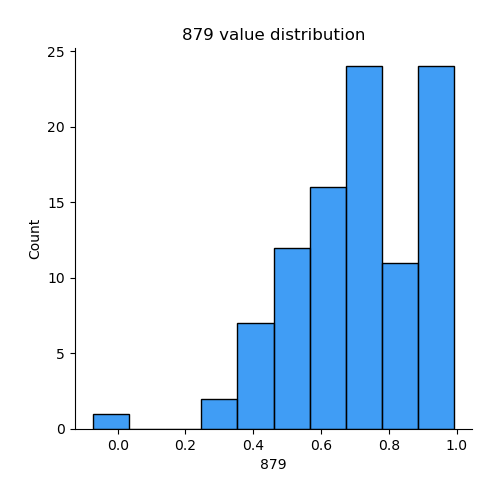
## Feature : 880
- **Feature type** : continous
- **Missing** : 0.0%
- **Unique** : 97
- **Count** :97.0
- **Mean** :0.6311618522014144
- **Std** :0.25595480306195945
- **Min** :0.007613259183257098
- **25%th Percentile** : 0.45213522910919496
- **50%th Percentile** : 0.6270083068873906
- **75%th Percentile** : 0.8548364318660713
- **Max** :0.991989168518647

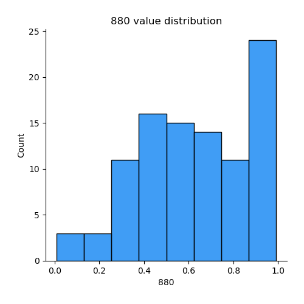
## Feature : 881
- **Feature type** : continous
- **Missing** : 0.0%
- **Unique** : 97
- **Count** :97.0
- **Mean** :0.7480102668187953
- **Std** :0.18801557558332554
- **Min** :0.17937275180099319
- **25%th Percentile** : 0.6290028529920205
- **50%th Percentile** : 0.7558782819083603
- **75%th Percentile** : 0.8960516323230391
- **Max** :0.9920742049317545

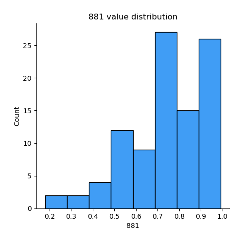
## Feature : 882
- **Feature type** : continous
- **Missing** : 0.0%
- **Unique** : 97
- **Count** :97.0
- **Mean** :0.4455258089000687
- **Std** :0.30563982858990935
- **Min** :-0.19300994852862205
- **25%th Percentile** : 0.22231260709991102
- **50%th Percentile** : 0.4168702112602326
- **75%th Percentile** : 0.5929329191960733
- **Max** :0.9840317716619368

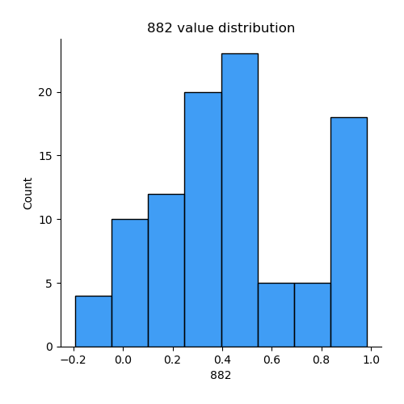
## Feature : 883
- **Feature type** : continous
- **Missing** : 0.0%
- **Unique** : 97
- **Count** :97.0
- **Mean** :0.5729298620462929
- **Std** :0.27850624329199347
- **Min** :-0.13508561085895646
- **25%th Percentile** : 0.33990594684767245
- **50%th Percentile** : 0.5622540889268419
- **75%th Percentile** : 0.7955920068175437
- **Max** :0.99032251304908

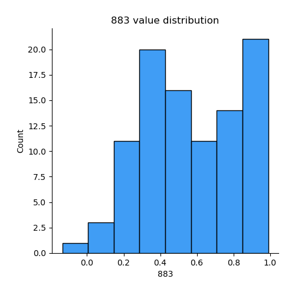
## Feature : 901
- **Feature type** : continous
- **Missing** : 0.0%
- **Unique** : 3
- **Count** :97.0
- **Mean** :1.0
- **Std** :8.62955915345466e-17
- **Min** :0.9999999999999998
- **25%th Percentile** : 0.9999999999999999
- **50%th Percentile** : 1.0
- **75%th Percentile** : 1.0
- **Max** :1.0

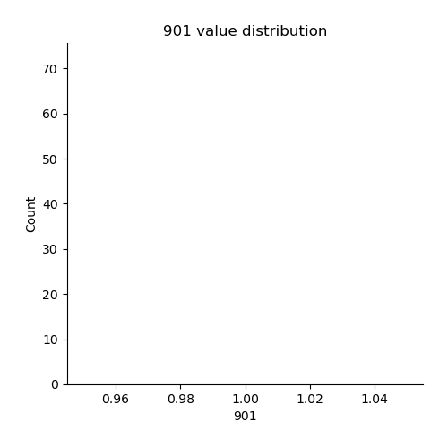
## Feature : 902
- **Feature type** : continous
- **Missing** : 0.0%
- **Unique** : 97
- **Count** :97.0
- **Mean** :0.7279745573183554
- **Std** :0.18025874735862457
- **Min** :0.25981399142889644
- **25%th Percentile** : 0.6114155719135371
- **50%th Percentile** : 0.7197794921005091
- **75%th Percentile** : 0.8596598223343462
- **Max** :0.992629917667216

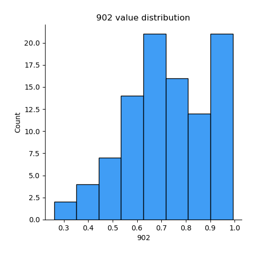
## Feature : 903
- **Feature type** : continous
- **Missing** : 0.0%
- **Unique** : 97
- **Count** :97.0
- **Mean** :0.5416358537673776
- **Std** :0.3066746778953803
- **Min** :-0.19630636540819058
- **25%th Percentile** : 0.32546096865184426
- **50%th Percentile** : 0.5257230360727023
- **75%th Percentile** : 0.780032542455404
- **Max** :0.9914820087589616

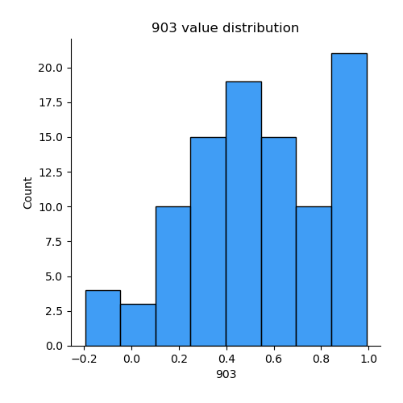
## Feature : 904
- **Feature type** : continous
- **Missing** : 0.0%
- **Unique** : 97
- **Count** :97.0
- **Mean** :0.795494708911877
- **Std** :0.15818465173102153
- **Min** :0.30969416866328126
- **25%th Percentile** : 0.7160237016847886
- **50%th Percentile** : 0.8102067711511113
- **75%th Percentile** : 0.8905136558822594
- **Max** :0.9976887646094286

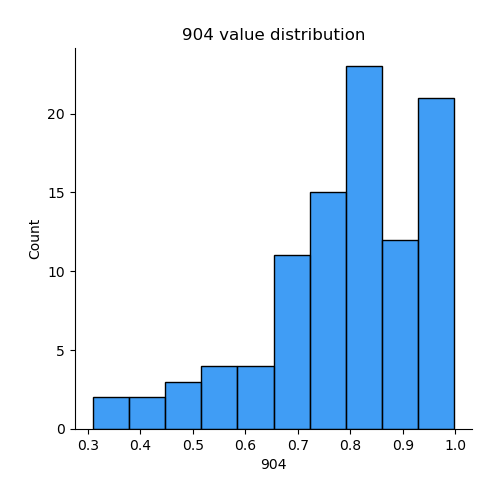
## Feature : 905
- **Feature type** : continous
- **Missing** : 0.0%
- **Unique** : 97
- **Count** :97.0
- **Mean** :0.8190424174157861
- **Std** :0.13129919193562947
- **Min** :0.39737730756892325
- **25%th Percentile** : 0.7432226075757605
- **50%th Percentile** : 0.8306006615804251
- **75%th Percentile** : 0.9098339814770527
- **Max** :0.9972516936908961

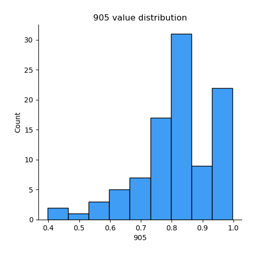
## Feature : 906
- **Feature type** : continous
- **Missing** : 0.0%
- **Unique** : 97
- **Count** :97.0
- **Mean** :0.6692724322979299
- **Std** :0.24502538333679746
- **Min** :0.018790779655123567
- **25%th Percentile** : 0.4926288633501001
- **50%th Percentile** : 0.7096788159744879
- **75%th Percentile** : 0.8588148839413621
- **Max** :0.9934091312480976

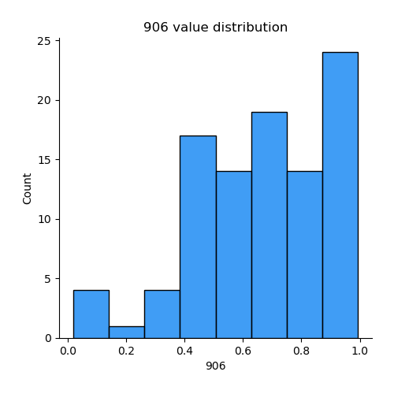
## Feature : 907
- **Feature type** : continous
- **Missing** : 0.0%
- **Unique** : 97
- **Count** :97.0
- **Mean** :0.8058041682546097
- **Std** :0.13071444563767268
- **Min** :0.4262962380498408
- **25%th Percentile** : 0.7104092327147173
- **50%th Percentile** : 0.8029362753302599
- **75%th Percentile** : 0.887671297295781
- **Max** :0.9970113131773118

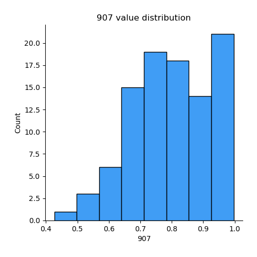
## Feature : 908
- **Feature type** : continous
- **Missing** : 0.0%
- **Unique** : 97
- **Count** :97.0
- **Mean** :0.4159043480314954
- **Std** :0.32256654975820487
- **Min** :-0.1736606368838544
- **25%th Percentile** : 0.1806035530378944
- **50%th Percentile** : 0.356832245314188
- **75%th Percentile** : 0.6282338312194667
- **Max** :0.9854491551303618

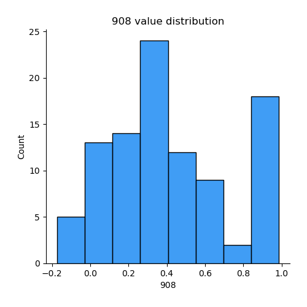
## Feature : 909
- **Feature type** : continous
- **Missing** : 0.0%
- **Unique** : 97
- **Count** :97.0
- **Mean** :0.6277719323852948
- **Std** :0.2427230950143449
- **Min** :0.030489844110858567
- **25%th Percentile** : 0.46841902981368183
- **50%th Percentile** : 0.6126594857428342
- **75%th Percentile** : 0.7661072710503463
- **Max** :0.9909237633036934

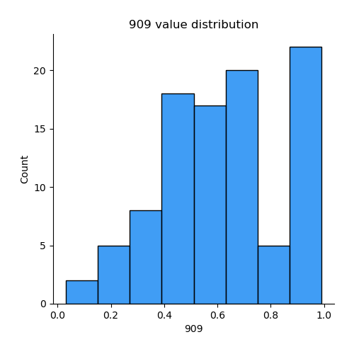
## Feature : 910
- **Feature type** : continous
- **Missing** : 0.0%
- **Unique** : 97
- **Count** :97.0
- **Mean** :0.5624994083383092
- **Std** :0.30238984447387324
- **Min** :-0.15676658499319104
- **25%th Percentile** : 0.35808011437183085
- **50%th Percentile** : 0.545458129851743
- **75%th Percentile** : 0.7913992559179827
- **Max** :0.9957804078914165

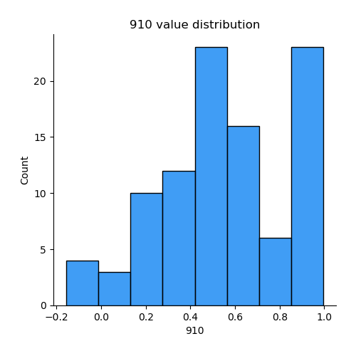
## Feature : 911
- **Feature type** : continous
- **Missing** : 0.0%
- **Unique** : 97
- **Count** :97.0
- **Mean** :0.7032673903241143
- **Std** :0.19506079286640812
- **Min** :0.20171008857447478
- **25%th Percentile** : 0.5849594767689708
- **50%th Percentile** : 0.6948839982285466
- **75%th Percentile** : 0.8316486908713239
- **Max** :0.9951634126449938

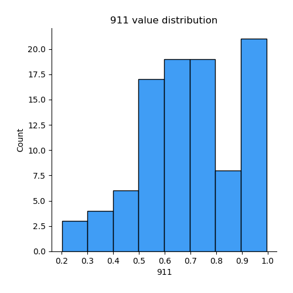
## Feature : 912
- **Feature type** : continous
- **Missing** : 0.0%
- **Unique** : 97
- **Count** :97.0
- **Mean** :0.6443075565742502
- **Std** :0.23777062910166255
- **Min** :0.05613102523302117
- **25%th Percentile** : 0.48336664588339284
- **50%th Percentile** : 0.6589215311426491
- **75%th Percentile** : 0.8051776546756677
- **Max** :0.9924544240195585

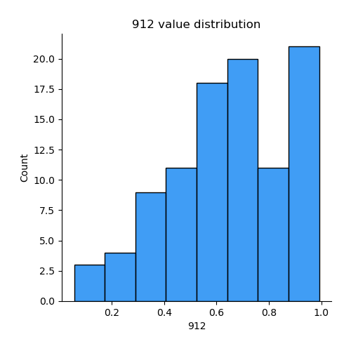
## Feature : 913
- **Feature type** : continous
- **Missing** : 0.0%
- **Unique** : 97
- **Count** :97.0
- **Mean** :0.4049515902678414
- **Std** :0.32469311429704206
- **Min** :-0.20751701301355888
- **25%th Percentile** : 0.12382226541942089
- **50%th Percentile** : 0.3972279745644592
- **75%th Percentile** : 0.5932934699334214
- **Max** :0.9833629080760755

## Feature : 914
- **Feature type** : continous
- **Missing** : 0.0%
- **Unique** : 97
- **Count** :97.0
- **Mean** :0.5850108246377381
- **Std** :0.28065754833537343
- **Min** :-0.0023443462260288573
- **25%th Percentile** : 0.38509580866367993
- **50%th Percentile** : 0.605984891635894
- **75%th Percentile** : 0.8191639462583425
- **Max** :0.9947697392287042

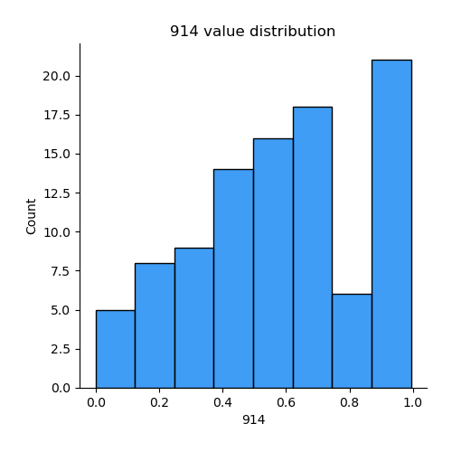
## Feature : 915
- **Feature type** : continous
- **Missing** : 0.0%
- **Unique** : 97
- **Count** :97.0
- **Mean** :0.6192567027646361
- **Std** :0.2626647210976525
- **Min** :-0.1662351322424255
- **25%th Percentile** : 0.42633935505186554
- **50%th Percentile** : 0.6374022581098261
- **75%th Percentile** : 0.8185375210676893
- **Max** :0.9949208757229856

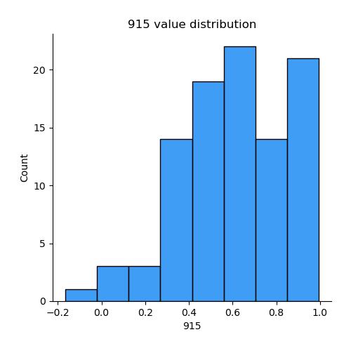
## Feature : 916
- **Feature type** : continous
- **Missing** : 0.0%
- **Unique** : 97
- **Count** :97.0
- **Mean** :0.5369700710568671
- **Std** :0.30751384032157725
- **Min** :-0.15637168526490217
- **25%th Percentile** : 0.33353893021516606
- **50%th Percentile** : 0.5414495481247095
- **75%th Percentile** : 0.7284995559007921
- **Max** :0.9949670594178429

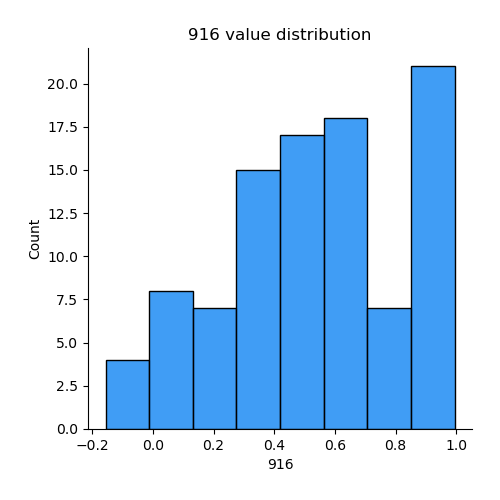
## Feature : 917
- **Feature type** : continous
- **Missing** : 0.0%
- **Unique** : 97
- **Count** :97.0
- **Mean** :0.7068375740310195
- **Std** :0.21090449023256364
- **Min** :0.11624793073811487
- **25%th Percentile** : 0.5725773390111697
- **50%th Percentile** : 0.7241796524430859
- **75%th Percentile** : 0.8585704976771894
- **Max** :0.9969771091308431

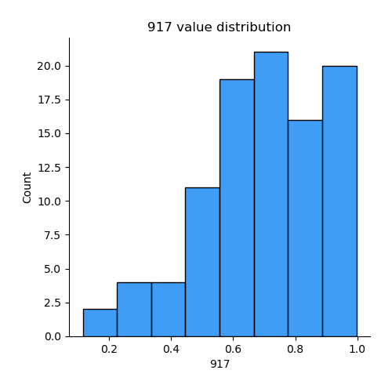
## Feature : 918
- **Feature type** : continous
- **Missing** : 0.0%
- **Unique** : 97
- **Count** :97.0
- **Mean** :0.6194132901945658
- **Std** :0.24204864689268898
- **Min** :-0.00022204833684044453
- **25%th Percentile** : 0.4600026859548719
- **50%th Percentile** : 0.5819444330517418
- **75%th Percentile** : 0.7905280354736685
- **Max** :0.9894016821040356

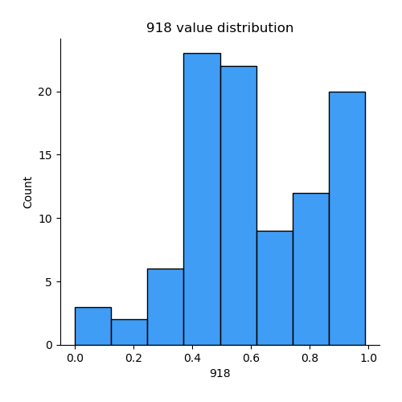
## Feature : 919
- **Feature type** : continous
- **Missing** : 0.0%
- **Unique** : 97
- **Count** :97.0
- **Mean** :0.575691274295303
- **Std** :0.2701312869727696
- **Min** :-0.11256275599655757
- **25%th Percentile** : 0.37149392914021145
- **50%th Percentile** : 0.5643891836820044
- **75%th Percentile** : 0.7644154564454553
- **Max** :0.9887345725678646

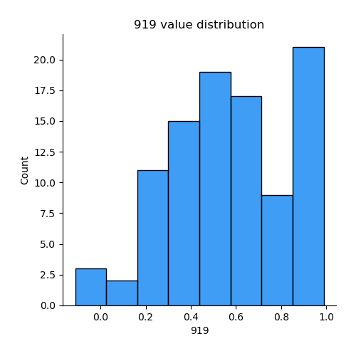
## Feature : 920
- **Feature type** : continous
- **Missing** : 0.0%
- **Unique** : 97
- **Count** :97.0
- **Mean** :0.6154590650870717
- **Std** :0.2554931140480132
- **Min** :0.062287725881543785
- **25%th Percentile** : 0.44336395291728425
- **50%th Percentile** : 0.6108032040642762
- **75%th Percentile** : 0.7909539998839059
- **Max** :0.9947579997071688

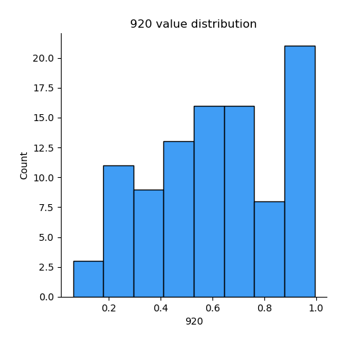
## Feature : 921
- **Feature type** : continous
- **Missing** : 0.0%
- **Unique** : 97
- **Count** :97.0
- **Mean** :0.5119468262152005
- **Std** :0.3378764207261958
- **Min** :-0.28496445533310355
- **25%th Percentile** : 0.28323698265587033
- **50%th Percentile** : 0.5281747242995412
- **75%th Percentile** : 0.7472840190633775
- **Max** :0.9943774739957001

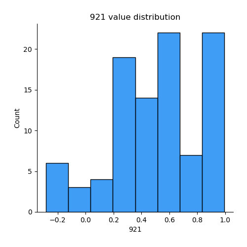
## Feature : 922
- **Feature type** : continous
- **Missing** : 0.0%
- **Unique** : 97
- **Count** :97.0
- **Mean** :0.8263047466394006
- **Std** :0.1462890596771192
- **Min** :0.19189016037091058
- **25%th Percentile** : 0.7433999090309261
- **50%th Percentile** : 0.8522983843050732
- **75%th Percentile** : 0.9233178953027332
- **Max** :0.9977994614265715

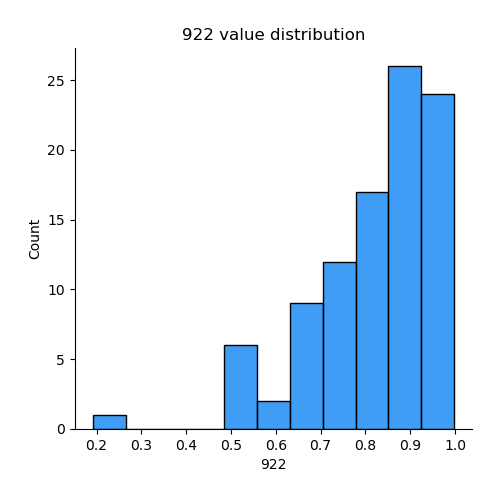
## Feature : 923
- **Feature type** : continous
- **Missing** : 0.0%
- **Unique** : 97
- **Count** :97.0
- **Mean** :0.48939154204731494
- **Std** :0.31526467850149414
- **Min** :-0.10061736438961436
- **25%th Percentile** : 0.2468900532478885
- **50%th Percentile** : 0.44752530527385925
- **75%th Percentile** : 0.7010514966269498
- **Max** :0.9927070831606343

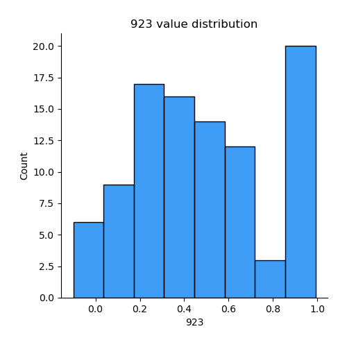
## Feature : 924
- **Feature type** : continous
- **Missing** : 0.0%
- **Unique** : 97
- **Count** :97.0
- **Mean** :0.5735461952016538
- **Std** :0.2587942236484597
- **Min** :-0.031049478214614158
- **25%th Percentile** : 0.3860433378838418
- **50%th Percentile** : 0.5654344261267713
- **75%th Percentile** : 0.7668344802279614
- **Max** :0.989178193022039

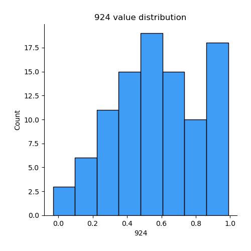
## Feature : 925
- **Feature type** : continous
- **Missing** : 0.0%
- **Unique** : 97
- **Count** :97.0
- **Mean** :0.841284870081519
- **Std** :0.17984384402300618
- **Min** :0.1159446927856796
- **25%th Percentile** : 0.8051831430168581
- **50%th Percentile** : 0.8933896156904049
- **75%th Percentile** : 0.9436271647033858
- **Max** :0.9980691689285877

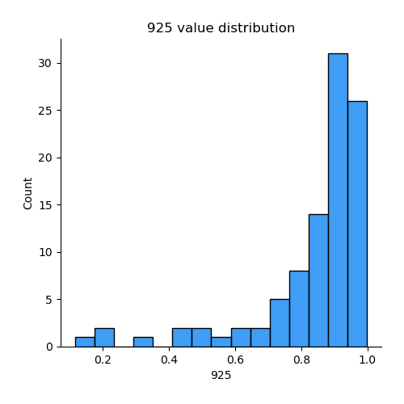
## Feature : 926
- **Feature type** : continous
- **Missing** : 0.0%
- **Unique** : 97
- **Count** :97.0
- **Mean** :0.748860954361682
- **Std** :0.16980414262119928
- **Min** :0.2603170608136681
- **25%th Percentile** : 0.6322086746063222
- **50%th Percentile** : 0.7348633077358724
- **75%th Percentile** : 0.8793372991402032
- **Max** :0.9966431951820822

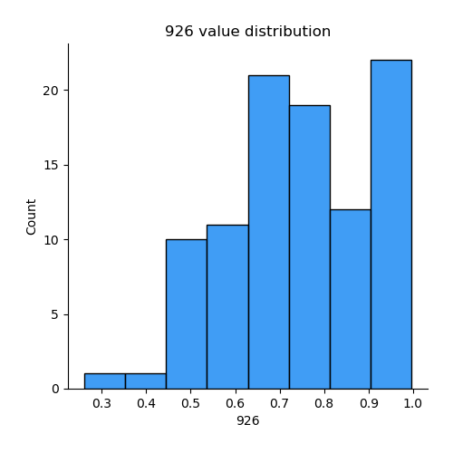
## Feature : 927
- **Feature type** : continous
- **Missing** : 0.0%
- **Unique** : 97
- **Count** :97.0
- **Mean** :0.885042000829495
- **Std** :0.15250962952940958
- **Min** :0.16106569004359939
- **25%th Percentile** : 0.8699451984433484
- **50%th Percentile** : 0.9362434217650412
- **75%th Percentile** : 0.9684047453482362
- **Max** :0.9994572938364124

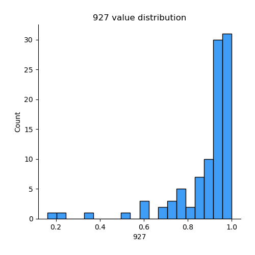
## Feature : 928
- **Feature type** : continous
- **Missing** : 0.0%
- **Unique** : 97
- **Count** :97.0
- **Mean** :0.7197665143269774
- **Std** :0.18801328371464535
- **Min** :0.23851126178287563
- **25%th Percentile** : 0.5753804686616094
- **50%th Percentile** : 0.7278395487744832
- **75%th Percentile** : 0.8588924131490693
- **Max** :0.9912019694615186

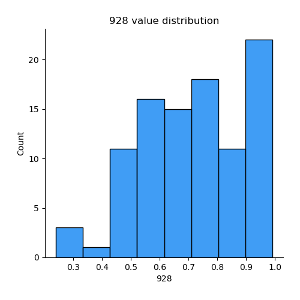
## Feature : 929
- **Feature type** : continous
- **Missing** : 0.0%
- **Unique** : 97
- **Count** :97.0
- **Mean** :0.50750345246067
- **Std** :0.3176303881569462
- **Min** :-0.263102303383592
- **25%th Percentile** : 0.27075387865193135
- **50%th Percentile** : 0.4822747673025641
- **75%th Percentile** : 0.7438313667518169
- **Max** :0.9900966564853322

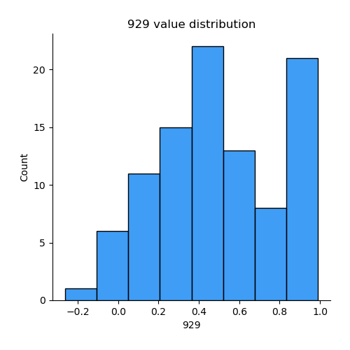
## Feature : 930
- **Feature type** : continous
- **Missing** : 0.0%
- **Unique** : 97
- **Count** :97.0
- **Mean** :0.7588004108324079
- **Std** :0.18986282843283833
- **Min** :0.026127303356849336
- **25%th Percentile** : 0.6523970983859231
- **50%th Percentile** : 0.7616455023656753
- **75%th Percentile** : 0.8848201221785302
- **Max** :0.9975030094681927

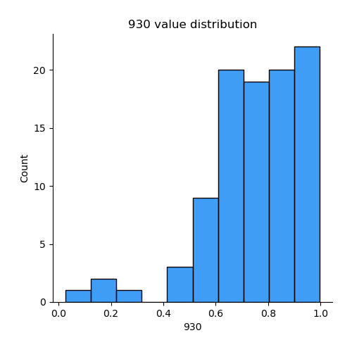
## Feature : 931
- **Feature type** : continous
- **Missing** : 0.0%
- **Unique** : 97
- **Count** :97.0
- **Mean** :0.7835438141434409
- **Std** :0.16621445205551727
- **Min** :0.2927078255781025
- **25%th Percentile** : 0.6981423637122718
- **50%th Percentile** : 0.8112283445314405
- **75%th Percentile** : 0.909224756407673
- **Max** :0.9977970386291297

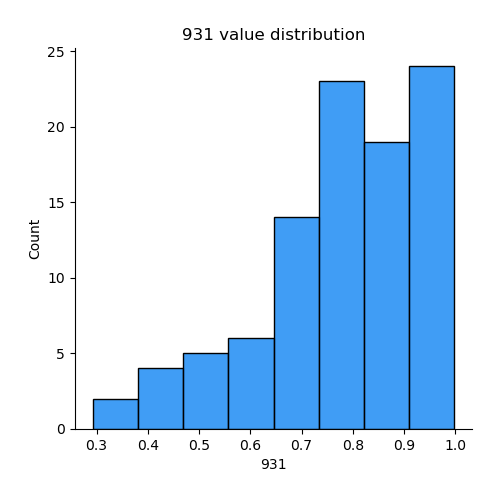
## Feature : 932
- **Feature type** : continous
- **Missing** : 0.0%
- **Unique** : 97
- **Count** :97.0
- **Mean** :0.6101860556783014
- **Std** :0.294654208568452
- **Min** :-0.2290910416705948
- **25%th Percentile** : 0.42643303010399025
- **50%th Percentile** : 0.645803698571287
- **75%th Percentile** : 0.8546728213143215
- **Max** :0.9943585465967407

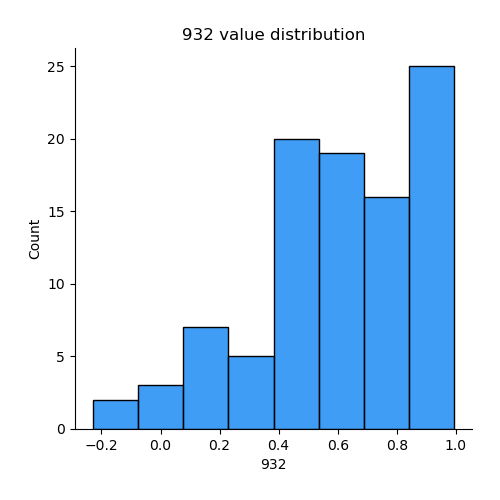
## Feature : 933
- **Feature type** : continous
- **Missing** : 0.0%
- **Unique** : 97
- **Count** :97.0
- **Mean** :0.7695325132177598
- **Std** :0.18056202712061112
- **Min** :0.10204473083416582
- **25%th Percentile** : 0.6955925235108847
- **50%th Percentile** : 0.783775542337404
- **75%th Percentile** : 0.8714961382994243
- **Max** :0.9973418298205897

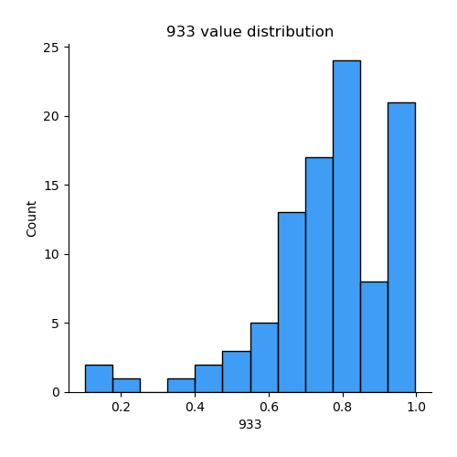
## Feature : 934
- **Feature type** : continous
- **Missing** : 0.0%
- **Unique** : 97
- **Count** :97.0
- **Mean** :0.39595560581931166
- **Std** :0.32729903111120484
- **Min** :-0.3085656049391447
- **25%th Percentile** : 0.19174109168385345
- **50%th Percentile** : 0.29795173385170454
- **75%th Percentile** : 0.6108019336898236
- **Max** :0.9846358875866789

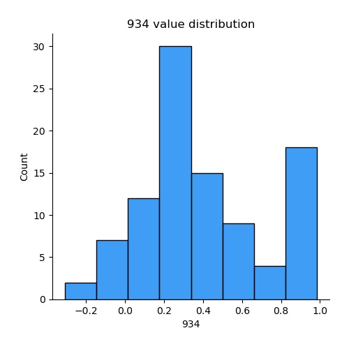
## Feature : 935
- **Feature type** : continous
- **Missing** : 0.0%
- **Unique** : 97
- **Count** :97.0
- **Mean** :0.5322983628845311
- **Std** :0.2965602586519411
- **Min** :-0.24873087057707371
- **25%th Percentile** : 0.3220869269415073
- **50%th Percentile** : 0.5003712270354913
- **75%th Percentile** : 0.7553675409529003
- **Max** :0.9910733253227485

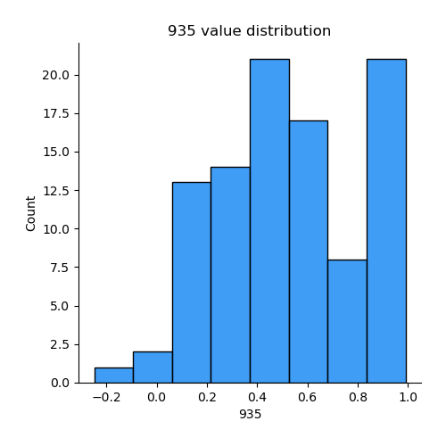
## Feature : 954
- **Feature type** : continous
- **Missing** : 0.0%
- **Unique** : 3
- **Count** :97.0
- **Mean** :1.0
- **Std** :6.892479376940624e-17
- **Min** :0.9999999999999998
- **25%th Percentile** : 1.0
- **50%th Percentile** : 1.0
- **75%th Percentile** : 1.0
- **Max** :1.0

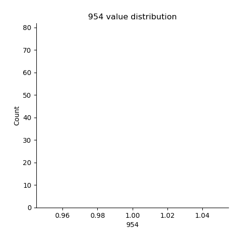
## Feature : 955
- **Feature type** : continous
- **Missing** : 0.0%
- **Unique** : 97
- **Count** :97.0
- **Mean** :0.5688909221571367
- **Std** :0.26978615840013404
- **Min** :0.007623937513827623
- **25%th Percentile** : 0.3810107174375673
- **50%th Percentile** : 0.5498109903205662
- **75%th Percentile** : 0.7689215811217781
- **Max** :0.9888297892081973

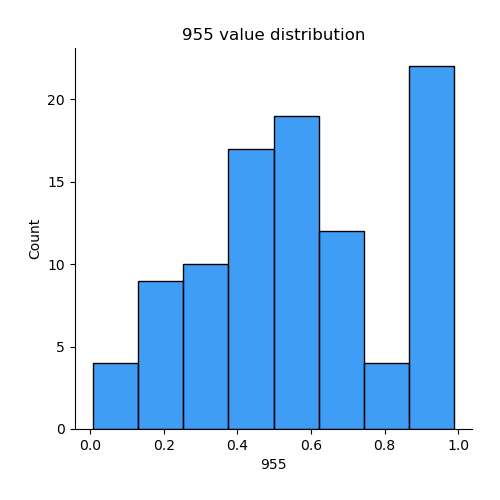
## Feature : 956
- **Feature type** : continous
- **Missing** : 0.0%
- **Unique** : 97
- **Count** :97.0
- **Mean** :0.7119913070873571
- **Std** :0.190386242054124
- **Min** :0.26586344519682964
- **25%th Percentile** : 0.5926161026437171
- **50%th Percentile** : 0.7029387236673694
- **75%th Percentile** : 0.8425140477863083
- **Max** :0.9944273458278319

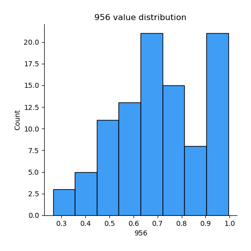
## Feature : 957
- **Feature type** : continous
- **Missing** : 0.0%
- **Unique** : 97
- **Count** :97.0
- **Mean** :0.8229717857919281
- **Std** :0.15149404429321717
- **Min** :0.24756802329491892
- **25%th Percentile** : 0.7434327159299022
- **50%th Percentile** : 0.8547195458492002
- **75%th Percentile** : 0.9456424537095064
- **Max** :0.994392810241792

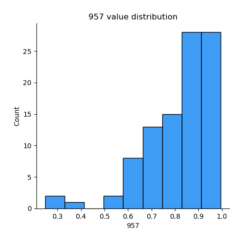
## Feature : 958
- **Feature type** : continous
- **Missing** : 0.0%
- **Unique** : 97
- **Count** :97.0
- **Mean** :0.6668581331088265
- **Std** :0.2304231879489118
- **Min** :0.04314814526837529
- **25%th Percentile** : 0.47326692614955435
- **50%th Percentile** : 0.6821954833142131
- **75%th Percentile** : 0.8166801078230069
- **Max** :0.9908546366265317

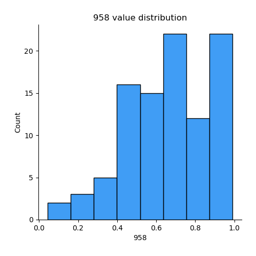
## Feature : 959
- **Feature type** : continous
- **Missing** : 0.0%
- **Unique** : 97
- **Count** :97.0
- **Mean** :0.7820630645841402
- **Std** :0.15537510730680643
- **Min** :0.40128088984916055
- **25%th Percentile** : 0.6789293822516858
- **50%th Percentile** : 0.7716622392642236
- **75%th Percentile** : 0.9015901747362174
- **Max** :0.992989121578799

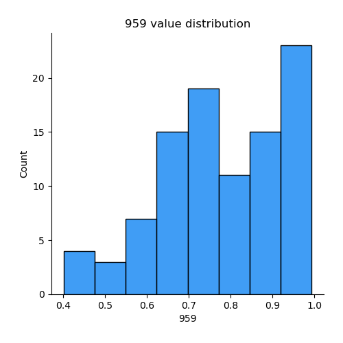
## Feature : 960
- **Feature type** : continous
- **Missing** : 0.0%
- **Unique** : 97
- **Count** :97.0
- **Mean** :0.46230018527163597
- **Std** :0.2922961046263557
- **Min** :-0.11235289585103837
- **25%th Percentile** : 0.25138068376814415
- **50%th Percentile** : 0.40887199347032144
- **75%th Percentile** : 0.6026340094689793
- **Max** :0.9694680020746091

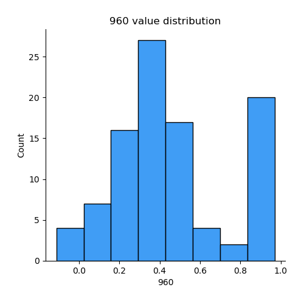
## Feature : 961
- **Feature type** : continous
- **Missing** : 0.0%
- **Unique** : 97
- **Count** :97.0
- **Mean** :0.6351341844512847
- **Std** :0.22360057639484576
- **Min** :0.16368009564951144
- **25%th Percentile** : 0.46776747829332976
- **50%th Percentile** : 0.6225547022433322
- **75%th Percentile** : 0.766003201428766
- **Max** :0.9878601385899816

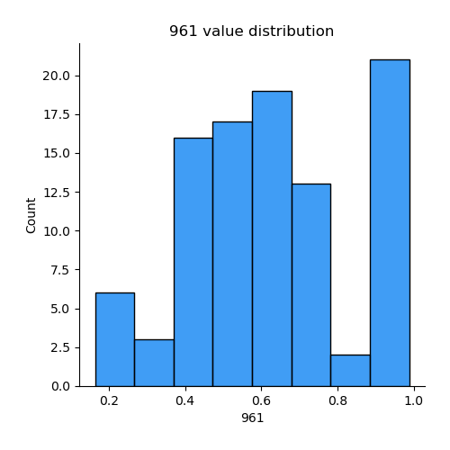
## Feature : 962
- **Feature type** : continous
- **Missing** : 0.0%
- **Unique** : 97
- **Count** :97.0
- **Mean** :0.635598927639639
- **Std** :0.2603064711762907
- **Min** :0.02171849959280929
- **25%th Percentile** : 0.4666607254911897
- **50%th Percentile** : 0.6608144866973681
- **75%th Percentile** : 0.8108403600517909
- **Max** :0.9927020666508208

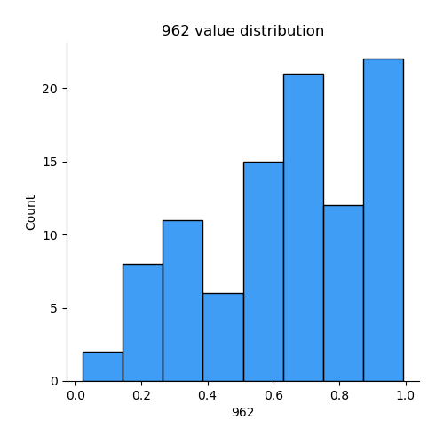
## Feature : 963
- **Feature type** : continous
- **Missing** : 0.0%
- **Unique** : 97
- **Count** :97.0
- **Mean** :0.6562055719216553
- **Std** :0.21170019998924347
- **Min** :0.12004690538171549
- **25%th Percentile** : 0.5173144390156958
- **50%th Percentile** : 0.6361293197280025
- **75%th Percentile** : 0.7870949123877916
- **Max** :0.992207145750892

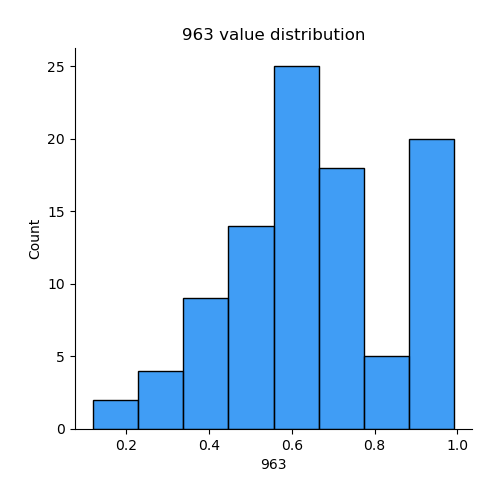
## Feature : 964
- **Feature type** : continous
- **Missing** : 0.0%
- **Unique** : 97
- **Count** :97.0
- **Mean** :0.7620518369641442
- **Std** :0.16994745621706087
- **Min** :0.21377184970475718
- **25%th Percentile** : 0.6581580870375761
- **50%th Percentile** : 0.765024264091731
- **75%th Percentile** : 0.9128786368086271
- **Max** :0.9885931842674409

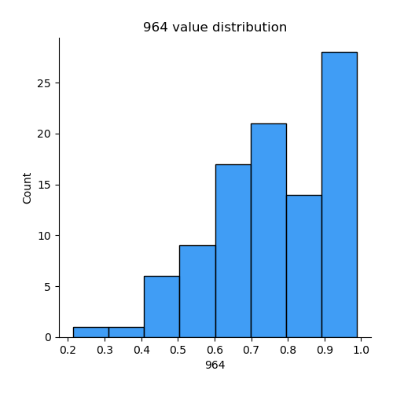
## Feature : 965
- **Feature type** : continous
- **Missing** : 0.0%
- **Unique** : 97
- **Count** :97.0
- **Mean** :0.420959587035482
- **Std** :0.31075074021266097
- **Min** :-0.265237721511726
- **25%th Percentile** : 0.1964900913773962
- **50%th Percentile** : 0.38403076804340264
- **75%th Percentile** : 0.6375559707773851
- **Max** :0.9761624002935115

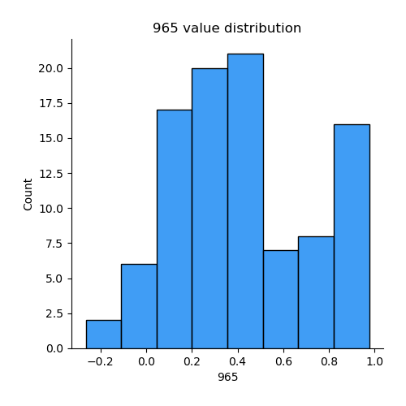
## Feature : 966
- **Feature type** : continous
- **Missing** : 0.0%
- **Unique** : 97
- **Count** :97.0
- **Mean** :0.6747768420186598
- **Std** :0.22939812104845703
- **Min** :0.07217013787923282
- **25%th Percentile** : 0.5283154575679905
- **50%th Percentile** : 0.6831597804204185
- **75%th Percentile** : 0.8500164344910246
- **Max** :0.9892174719214561

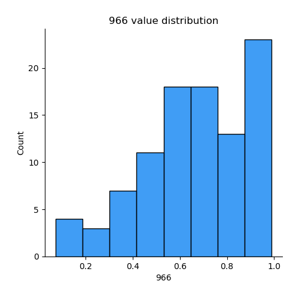
## Feature : 967
- **Feature type** : continous
- **Missing** : 0.0%
- **Unique** : 97
- **Count** :97.0
- **Mean** :0.8214636263624859
- **Std** :0.14445110837517197
- **Min** :0.461376365612925
- **25%th Percentile** : 0.7393278365114637
- **50%th Percentile** : 0.8379958138509493
- **75%th Percentile** : 0.9439482774252264
- **Max** :0.9971790299660388

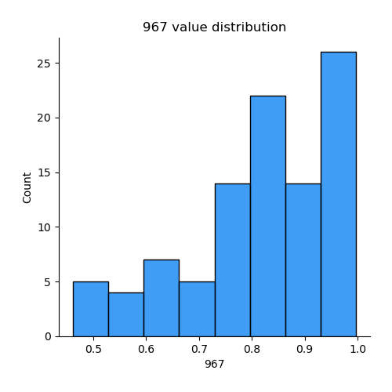
## Feature : 968
- **Feature type** : continous
- **Missing** : 0.0%
- **Unique** : 97
- **Count** :97.0
- **Mean** :0.5941426232922589
- **Std** :0.2676135353310972
- **Min** :0.012428705291972058
- **25%th Percentile** : 0.4224235650709738
- **50%th Percentile** : 0.5645979435347463
- **75%th Percentile** : 0.7950436449172358
- **Max** :0.9895068524467856

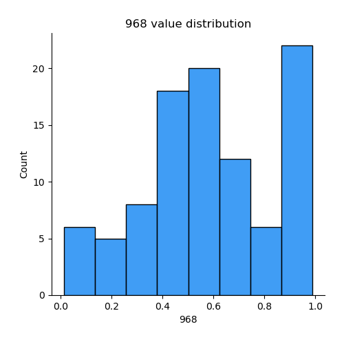
## Feature : 969
- **Feature type** : continous
- **Missing** : 0.0%
- **Unique** : 97
- **Count** :97.0
- **Mean** :0.6771064430020695
- **Std** :0.21325472913113622
- **Min** :0.17011014181546238
- **25%th Percentile** : 0.5327677691389499
- **50%th Percentile** : 0.6644128641013426
- **75%th Percentile** : 0.8560385591418378
- **Max** :0.9897541075604416

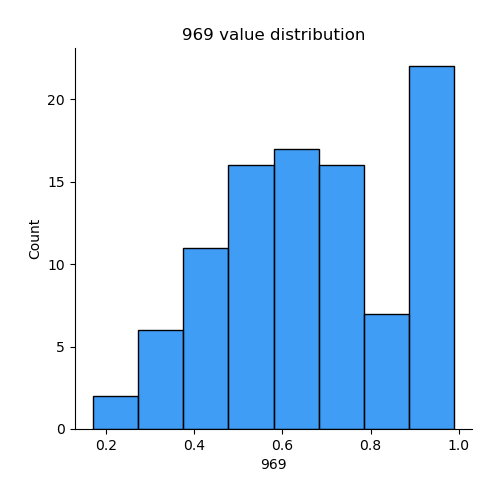
## Feature : 970
- **Feature type** : continous
- **Missing** : 0.0%
- **Unique** : 97
- **Count** :97.0
- **Mean** :0.8497303517736551
- **Std** :0.1147550985340451
- **Min** :0.36026625177724875
- **25%th Percentile** : 0.7746936249003832
- **50%th Percentile** : 0.856757024435845
- **75%th Percentile** : 0.9372300675031074
- **Max** :0.995817576461397

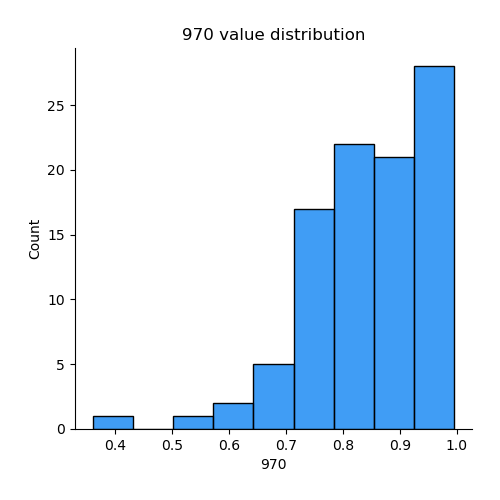
## Feature : 971
- **Feature type** : continous
- **Missing** : 0.0%
- **Unique** : 97
- **Count** :97.0
- **Mean** :0.6714771827745036
- **Std** :0.21509299943965984
- **Min** :-0.0024662031260112467
- **25%th Percentile** : 0.5327552653528145
- **50%th Percentile** : 0.6665665071582723
- **75%th Percentile** : 0.8383334981400065
- **Max** :0.9892072249551784

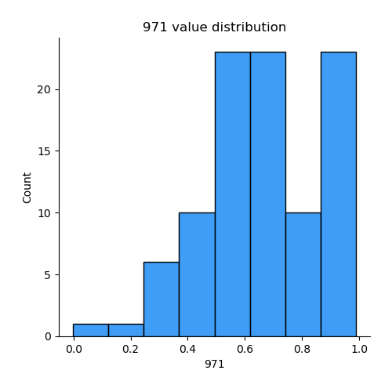
## Feature : 972
- **Feature type** : continous
- **Missing** : 0.0%
- **Unique** : 97
- **Count** :97.0
- **Mean** :0.7456826981805164
- **Std** :0.1810190765396334
- **Min** :0.18226235112515562
- **25%th Percentile** : 0.6301012531784613
- **50%th Percentile** : 0.7570964922108455
- **75%th Percentile** : 0.9088065333809615
- **Max** :0.9922319983786034

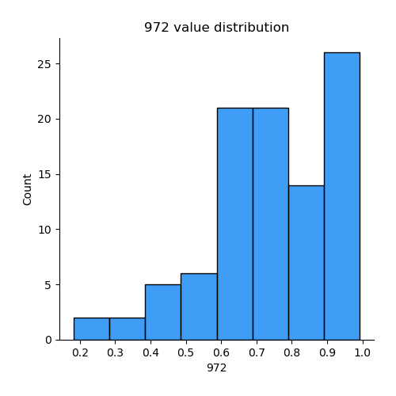
## Feature : 973
- **Feature type** : continous
- **Missing** : 0.0%
- **Unique** : 97
- **Count** :97.0
- **Mean** :0.6490546082630693
- **Std** :0.24633963016923574
- **Min** :-0.06763317261050801
- **25%th Percentile** : 0.4886260035902258
- **50%th Percentile** : 0.6670464127310245
- **75%th Percentile** : 0.8025839500606087
- **Max** :0.9920158654158097

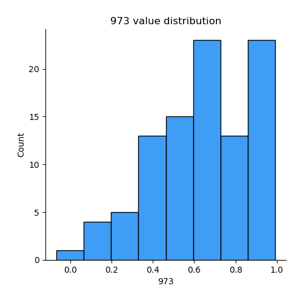
## Feature : 974
- **Feature type** : continous
- **Missing** : 0.0%
- **Unique** : 97
- **Count** :97.0
- **Mean** :0.6895529336967535
- **Std** :0.2174248248991908
- **Min** :0.026965181900239617
- **25%th Percentile** : 0.5680514158731467
- **50%th Percentile** : 0.6613233608750785
- **75%th Percentile** : 0.8742398678060932
- **Max** :0.9918759563187884

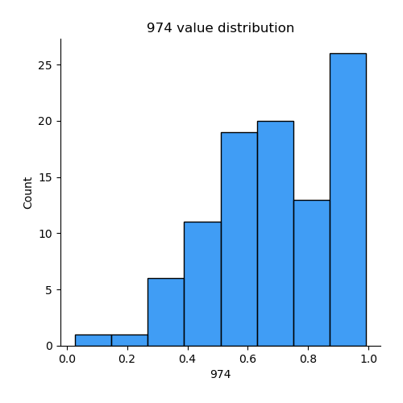
## Feature : 975
- **Feature type** : continous
- **Missing** : 0.0%
- **Unique** : 97
- **Count** :97.0
- **Mean** :0.610521868814145
- **Std** :0.2547276292325921
- **Min** :0.014109119255923728
- **25%th Percentile** : 0.44055883622135417
- **50%th Percentile** : 0.614004650919679
- **75%th Percentile** : 0.7947448314012302
- **Max** :0.9893821079871439

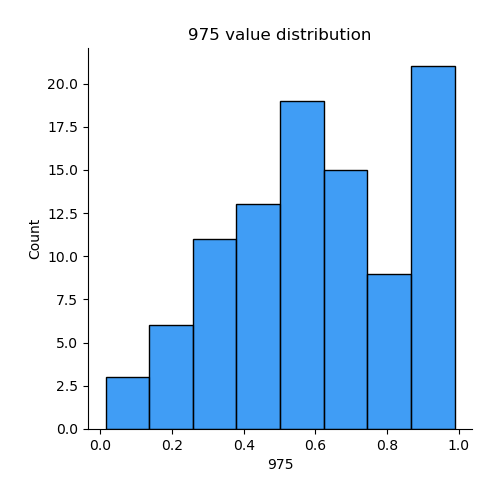
## Feature : 976
- **Feature type** : continous
- **Missing** : 0.0%
- **Unique** : 97
- **Count** :97.0
- **Mean** :0.7287053019872995
- **Std** :0.16325561847529485
- **Min** :0.27115910318316755
- **25%th Percentile** : 0.6097161895211317
- **50%th Percentile** : 0.7072420664600733
- **75%th Percentile** : 0.8429283152920525
- **Max** :0.9899742630882177

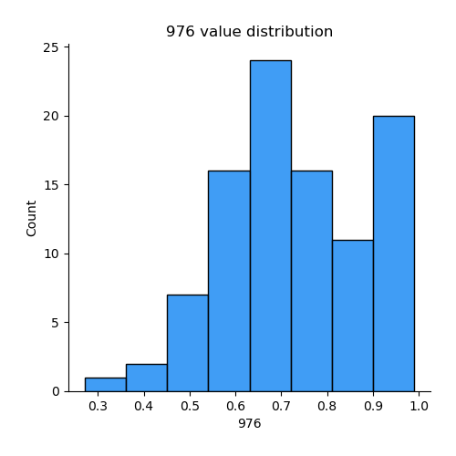
## Feature : 977
- **Feature type** : continous
- **Missing** : 0.0%
- **Unique** : 97
- **Count** :97.0
- **Mean** :0.6814707283734457
- **Std** :0.2279526638222566
- **Min** :0.14770762132011642
- **25%th Percentile** : 0.5089685603152541
- **50%th Percentile** : 0.6923767842478346
- **75%th Percentile** : 0.8642030781685037
- **Max** :0.9907885466295859

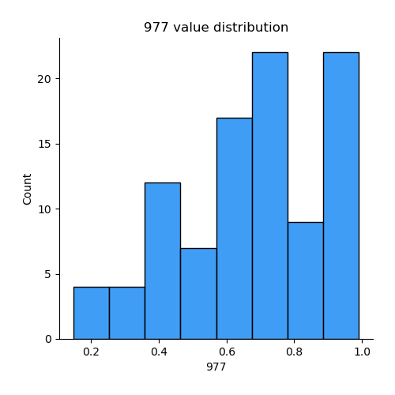
## Feature : 978
- **Feature type** : continous
- **Missing** : 0.0%
- **Unique** : 97
- **Count** :97.0
- **Mean** :0.7750841089453395
- **Std** :0.1566752697517103
- **Min** :0.3620886706491565
- **25%th Percentile** : 0.6824359993636494
- **50%th Percentile** : 0.7747535875873506
- **75%th Percentile** : 0.8870955761444015
- **Max** :0.992985546846603

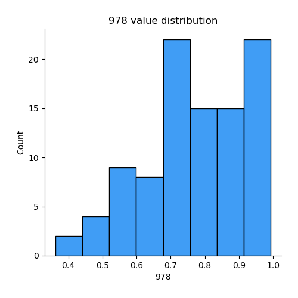
## Feature : 979
- **Feature type** : continous
- **Missing** : 0.0%
- **Unique** : 97
- **Count** :97.0
- **Mean** :0.6934298082169036
- **Std** :0.21642432219311544
- **Min** :0.10899598449624344
- **25%th Percentile** : 0.5567188610895865
- **50%th Percentile** : 0.6981348418620852
- **75%th Percentile** : 0.8381219504919751
- **Max** :0.9917165079403591

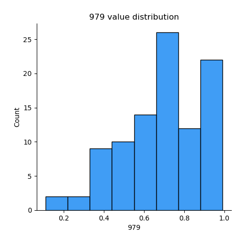
## Feature : 980
- **Feature type** : continous
- **Missing** : 0.0%
- **Unique** : 97
- **Count** :97.0
- **Mean** :0.9365292645573416
- **Std** :0.061029957827260034
- **Min** :0.6188760678296383
- **25%th Percentile** : 0.906820044004661
- **50%th Percentile** : 0.9506356736481967
- **75%th Percentile** : 0.9759150759333998
- **Max** :0.9990939242480752

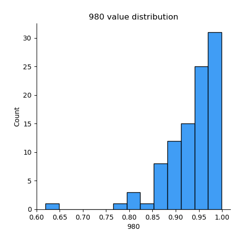
## Feature : 981
- **Feature type** : continous
- **Missing** : 0.0%
- **Unique** : 97
- **Count** :97.0
- **Mean** :0.534842177490682
- **Std** :0.28066053376251326
- **Min** :-0.027908244588238894
- **25%th Percentile** : 0.30044899921957136
- **50%th Percentile** : 0.5111629033491635
- **75%th Percentile** : 0.7014770250972183
- **Max** :0.9872750406955161

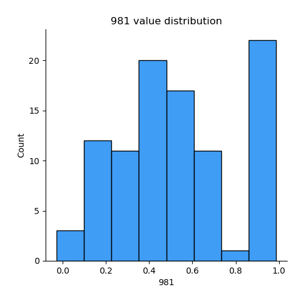
## Feature : 982
- **Feature type** : continous
- **Missing** : 0.0%
- **Unique** : 97
- **Count** :97.0
- **Mean** :0.701392572539345
- **Std** :0.21374359396441536
- **Min** :0.0815473163940796
- **25%th Percentile** : 0.5663579152186059
- **50%th Percentile** : 0.7090570266491657
- **75%th Percentile** : 0.8409424344574058
- **Max** :0.9942013481682249

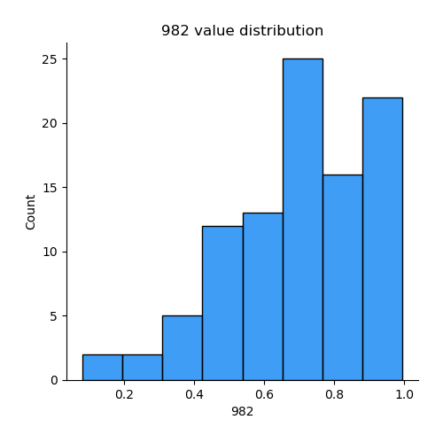
## Feature : 983
- **Feature type** : continous
- **Missing** : 0.0%
- **Unique** : 97
- **Count** :97.0
- **Mean** :0.7887957206708772
- **Std** :0.17481174894122722
- **Min** :0.14915818103458303
- **25%th Percentile** : 0.6784422567188583
- **50%th Percentile** : 0.8108008683681067
- **75%th Percentile** : 0.9123628293035126
- **Max** :0.9936329019681018

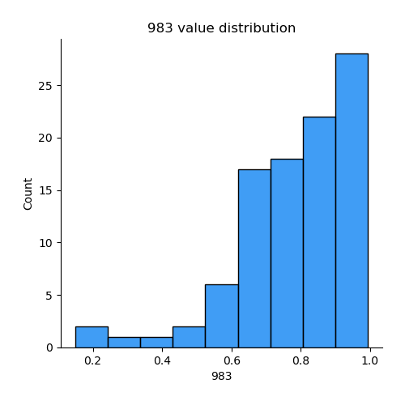
## Feature : 984
- **Feature type** : continous
- **Missing** : 0.0%
- **Unique** : 97
- **Count** :97.0
- **Mean** :0.6552358477810599
- **Std** :0.2352806615972045
- **Min** :0.0591200168081886
- **25%th Percentile** : 0.4999400148344519
- **50%th Percentile** : 0.6730899058896725
- **75%th Percentile** : 0.8355793527166089
- **Max** :0.9902778686917499

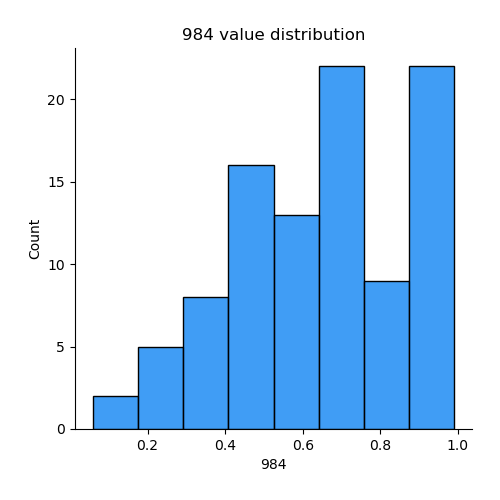
## Feature : 985
- **Feature type** : continous
- **Missing** : 0.0%
- **Unique** : 97
- **Count** :97.0
- **Mean** :0.7314053581048658
- **Std** :0.2025696975386149
- **Min** :0.21185944440912968
- **25%th Percentile** : 0.6144126315213511
- **50%th Percentile** : 0.7459183334138332
- **75%th Percentile** : 0.9108679976707741
- **Max** :0.9931193861331602

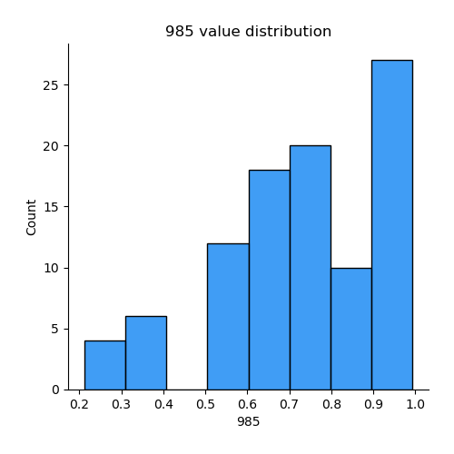
## Feature : 986
- **Feature type** : continous
- **Missing** : 0.0%
- **Unique** : 97
- **Count** :97.0
- **Mean** :0.4186943697971585
- **Std** :0.3140588001044098
- **Min** :-0.32102308127063645
- **25%th Percentile** : 0.18715599401755753
- **50%th Percentile** : 0.36504363103853443
- **75%th Percentile** : 0.617122338688519
- **Max** :0.9780120018697595

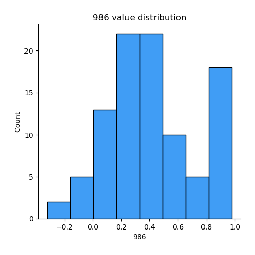
## Feature : 987
- **Feature type** : continous
- **Missing** : 0.0%
- **Unique** : 97
- **Count** :97.0
- **Mean** :0.5673694055424676
- **Std** :0.2679987786231354
- **Min** :-0.05537585030383334
- **25%th Percentile** : 0.37677719997185644
- **50%th Percentile** : 0.5258300119738877
- **75%th Percentile** : 0.8020461254812958
- **Max** :0.9855909298327364

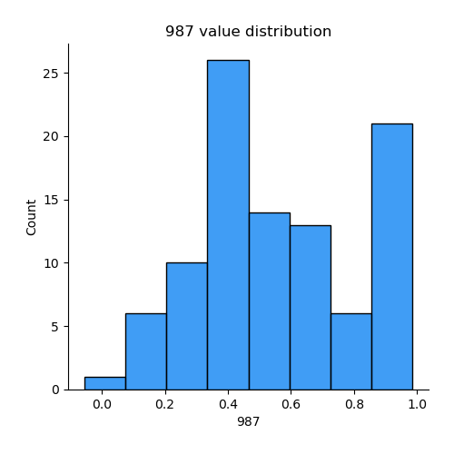
## Feature : 1007
- **Feature type** : continous
- **Missing** : 0.0%
- **Unique** : 3
- **Count** :97.0
- **Mean** :1.0
- **Std** :6.607148558400768e-17
- **Min** :0.9999999999999998
- **25%th Percentile** : 1.0
- **50%th Percentile** : 1.0
- **75%th Percentile** : 1.0
- **Max** :1.0

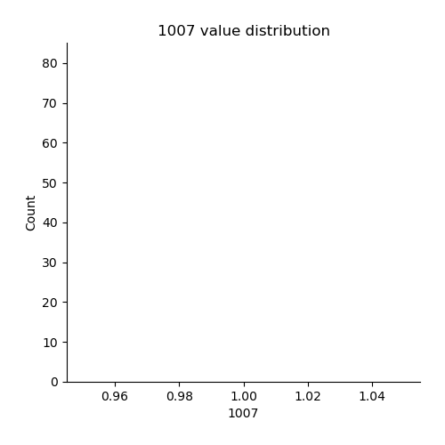
## Feature : 1008
- **Feature type** : continous
- **Missing** : 0.0%
- **Unique** : 97
- **Count** :97.0
- **Mean** :0.6640398160748829
- **Std** :0.22785267784305863
- **Min** :0.0897190166051235
- **25%th Percentile** : 0.5074242841157504
- **50%th Percentile** : 0.6669653281094374
- **75%th Percentile** : 0.8389197229878675
- **Max** :0.9916245101639707

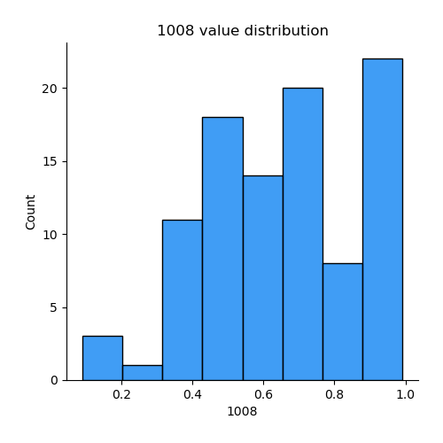
## Feature : 1009
- **Feature type** : continous
- **Missing** : 0.0%
- **Unique** : 97
- **Count** :97.0
- **Mean** :0.47234647311041805
- **Std** :0.33200277460045013
- **Min** :-0.4057707695474946
- **25%th Percentile** : 0.2458393953486206
- **50%th Percentile** : 0.4207064011686457
- **75%th Percentile** : 0.7406388575542058
- **Max** :0.9881389276920158

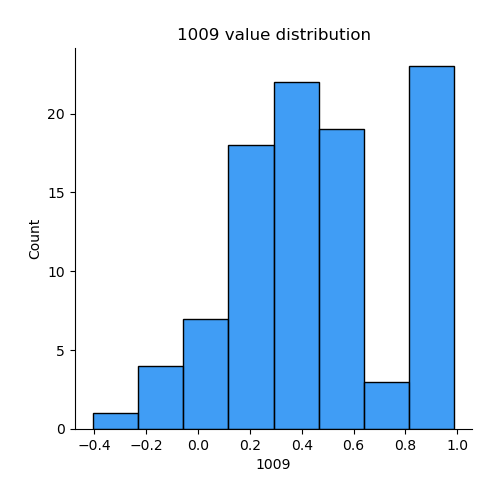
## Feature : 1010
- **Feature type** : continous
- **Missing** : 0.0%
- **Unique** : 97
- **Count** :97.0
- **Mean** :0.5621211652746113
- **Std** :0.2859459653027616
- **Min** :-0.23086655478341472
- **25%th Percentile** : 0.38539168656432177
- **50%th Percentile** : 0.5310135682669138
- **75%th Percentile** : 0.7925193362380839
- **Max** :0.9884017723123947

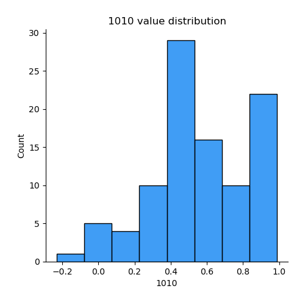
## Feature : 1011
- **Feature type** : continous
- **Missing** : 0.0%
- **Unique** : 97
- **Count** :97.0
- **Mean** :0.5444082956892331
- **Std** :0.29812595880366716
- **Min** :-0.1671834578634926
- **25%th Percentile** : 0.30831050338571864
- **50%th Percentile** : 0.5491260024011675
- **75%th Percentile** : 0.8335559750903232
- **Max** :0.9915744042438551

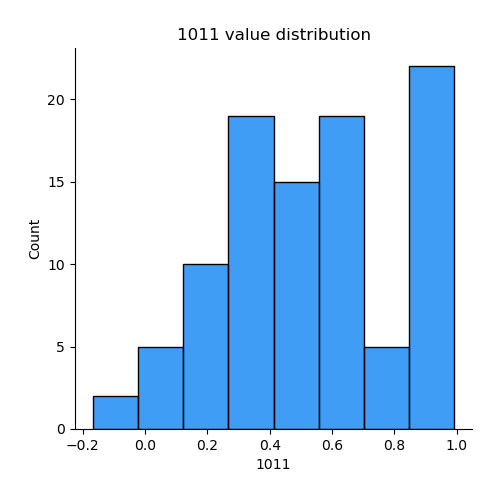
## Feature : 1012
- **Feature type** : continous
- **Missing** : 0.0%
- **Unique** : 97
- **Count** :97.0
- **Mean** :0.3767420410723564
- **Std** :0.35162308580098633
- **Min** :-0.37529782901494163
- **25%th Percentile** : 0.13233105370086776
- **50%th Percentile** : 0.30160373914606536
- **75%th Percentile** : 0.6283585920292065
- **Max** :0.9830368812355382

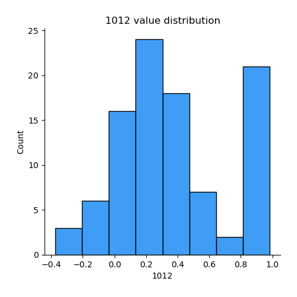
## Feature : 1013
- **Feature type** : continous
- **Missing** : 0.0%
- **Unique** : 97
- **Count** :97.0
- **Mean** :0.5329116765612336
- **Std** :0.27562722551719276
- **Min** :-0.08381817108846135
- **25%th Percentile** : 0.34663089408886355
- **50%th Percentile** : 0.4945634424806307
- **75%th Percentile** : 0.7508652064947455
- **Max** :0.9864368282862798

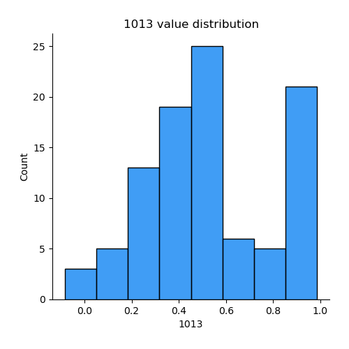
## Feature : 1014
- **Feature type** : continous
- **Missing** : 0.0%
- **Unique** : 97
- **Count** :97.0
- **Mean** :0.4705167780321214
- **Std** :0.3330632015943339
- **Min** :-0.2375515810134635
- **25%th Percentile** : 0.22711188347839645
- **50%th Percentile** : 0.45895193091894226
- **75%th Percentile** : 0.6941534403300821
- **Max** :0.9887850585900219

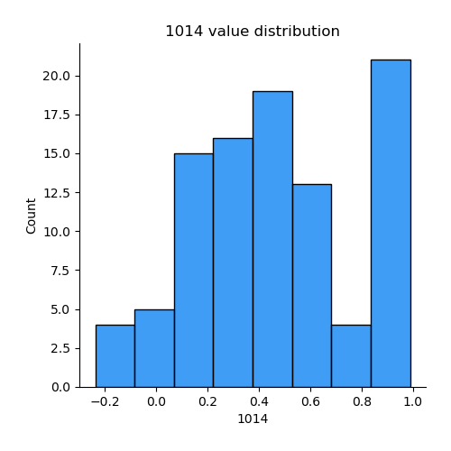
## Feature : 1015
- **Feature type** : continous
- **Missing** : 0.0%
- **Unique** : 97
- **Count** :97.0
- **Mean** :0.6157915003872169
- **Std** :0.24404424928819687
- **Min** :0.169740108659535
- **25%th Percentile** : 0.4215040838224736
- **50%th Percentile** : 0.5913129803072009
- **75%th Percentile** : 0.8053501264501489
- **Max** :0.9918135390440934

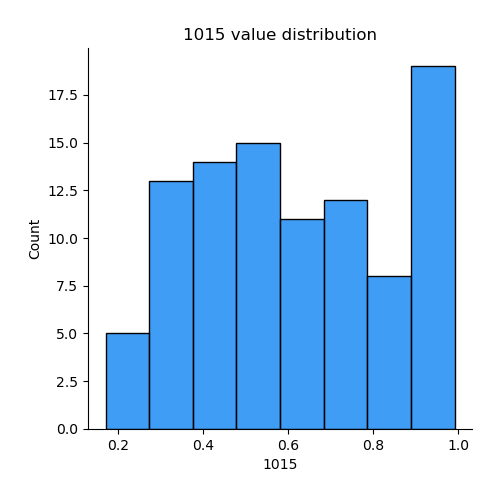
## Feature : 1016
- **Feature type** : continous
- **Missing** : 0.0%
- **Unique** : 97
- **Count** :97.0
- **Mean** :0.4697671395354688
- **Std** :0.3075829723899845
- **Min** :-0.2923775570539195
- **25%th Percentile** : 0.24909251219109907
- **50%th Percentile** : 0.406436831506548
- **75%th Percentile** : 0.6877630361202118
- **Max** :0.9813324830036569

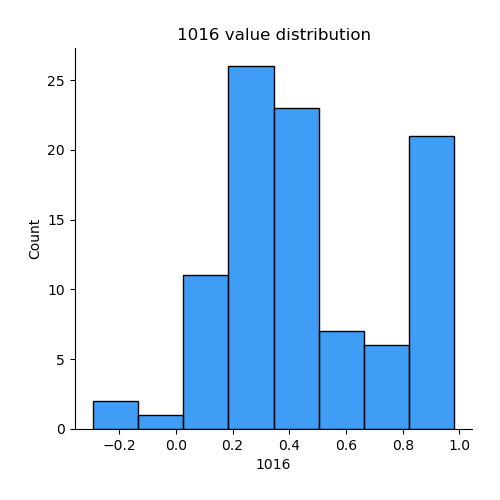
## Feature : 1017
- **Feature type** : continous
- **Missing** : 0.0%
- **Unique** : 97
- **Count** :97.0
- **Mean** :0.31428075970882613
- **Std** :0.3614753841807158
- **Min** :-0.4855283778648721
- **25%th Percentile** : 0.08810614611778776
- **50%th Percentile** : 0.2574475686558605
- **75%th Percentile** : 0.5371262673050875
- **Max** :0.986389273496565

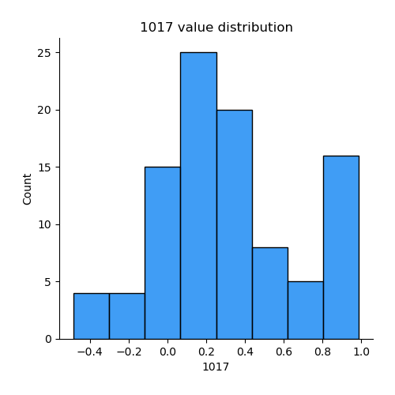
## Feature : 1018
- **Feature type** : continous
- **Missing** : 0.0%
- **Unique** : 97
- **Count** :97.0
- **Mean** :0.43517677535102123
- **Std** :0.33389735442757046
- **Min** :-0.30034490506630523
- **25%th Percentile** : 0.19334420460655946
- **50%th Percentile** : 0.36528710457739466
- **75%th Percentile** : 0.6655745903466587
- **Max** :0.9849261091366095

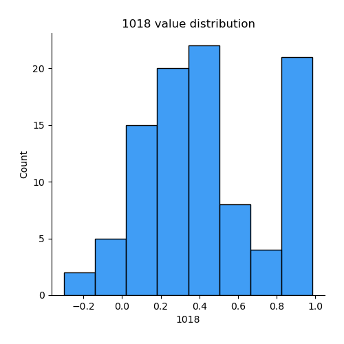
## Feature : 1019
- **Feature type** : continous
- **Missing** : 0.0%
- **Unique** : 97
- **Count** :97.0
- **Mean** :0.5214523248633005
- **Std** :0.2956697548863377
- **Min** :-0.02768878707541288
- **25%th Percentile** : 0.3226680304956601
- **50%th Percentile** : 0.4981863422454051
- **75%th Percentile** : 0.7293508029833006
- **Max** :0.9900022976319165

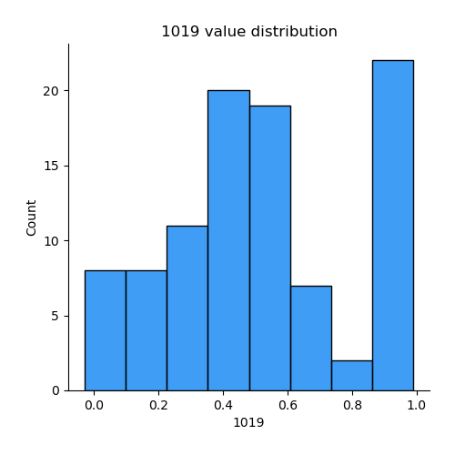
## Feature : 1020
- **Feature type** : continous
- **Missing** : 0.0%
- **Unique** : 97
- **Count** :97.0
- **Mean** :0.4496814162182661
- **Std** :0.3294824275946684
- **Min** :-0.2556998487796999
- **25%th Percentile** : 0.2654945433441735
- **50%th Percentile** : 0.37678127650737053
- **75%th Percentile** : 0.6366160417852448
- **Max** :0.9888273727358887

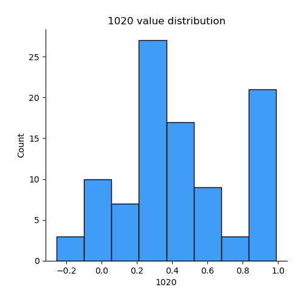
## Feature : 1021
- **Feature type** : continous
- **Missing** : 0.0%
- **Unique** : 97
- **Count** :97.0
- **Mean** :0.5806590158316155
- **Std** :0.2726507327910177
- **Min** :-0.037804438150977206
- **25%th Percentile** : 0.36180701771769086
- **50%th Percentile** : 0.5838936900747985
- **75%th Percentile** : 0.7670492177715241
- **Max** :0.9917675134813602

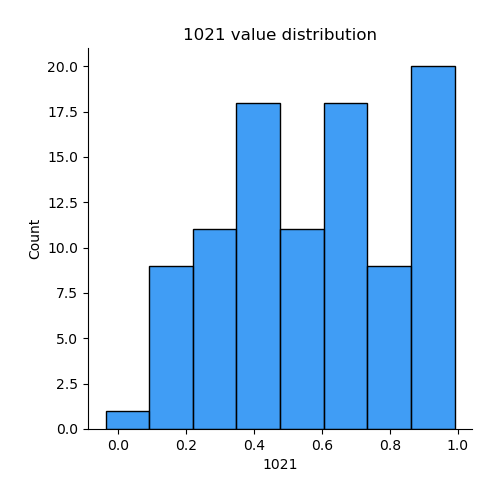
## Feature : 1022
- **Feature type** : continous
- **Missing** : 0.0%
- **Unique** : 97
- **Count** :97.0
- **Mean** :0.5683971688029366
- **Std** :0.263569753113416
- **Min** :-0.05245966294016858
- **25%th Percentile** : 0.38822473517006145
- **50%th Percentile** : 0.546100084493722
- **75%th Percentile** : 0.7405921740741752
- **Max** :0.983459883934461

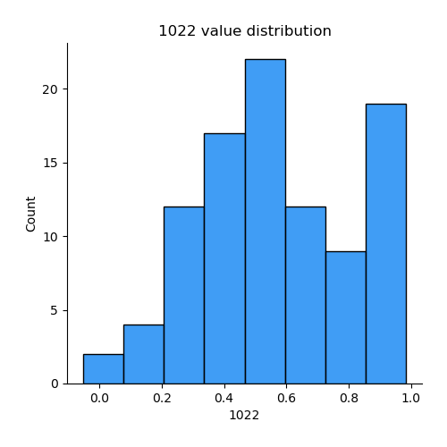
## Feature : 1023
- **Feature type** : continous
- **Missing** : 0.0%
- **Unique** : 97
- **Count** :97.0
- **Mean** :0.4229977165819164
- **Std** :0.3362565513985822
- **Min** :-0.41816433487418786
- **25%th Percentile** : 0.19637598185841365
- **50%th Percentile** : 0.3625525605917492
- **75%th Percentile** : 0.6011123223038183
- **Max** :0.9840070599062426

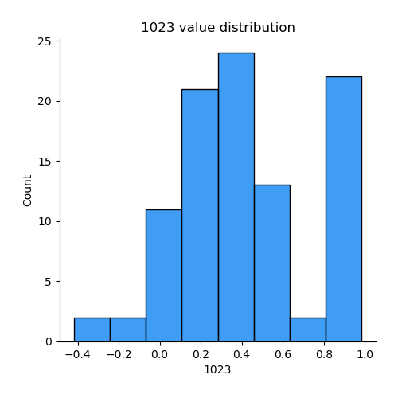
## Feature : 1024
- **Feature type** : continous
- **Missing** : 0.0%
- **Unique** : 97
- **Count** :97.0
- **Mean** :0.4401337468553645
- **Std** :0.3267341587199885
- **Min** :-0.3698760082711688
- **25%th Percentile** : 0.21453637038063877
- **50%th Percentile** : 0.38725482297698355
- **75%th Percentile** : 0.6869401232503577
- **Max** :0.9816290385929668

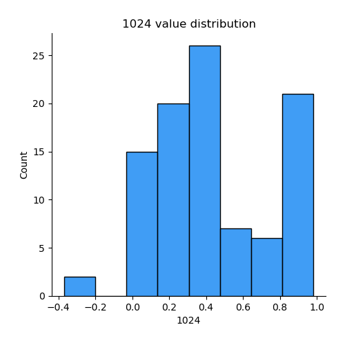
## Feature : 1025
- **Feature type** : continous
- **Missing** : 0.0%
- **Unique** : 97
- **Count** :97.0
- **Mean** :0.5140949258175765
- **Std** :0.30633933358538784
- **Min** :-0.18743106617634464
- **25%th Percentile** : 0.27596061415851136
- **50%th Percentile** : 0.4883260112401108
- **75%th Percentile** : 0.6993786972351406
- **Max** :0.9891103888126047

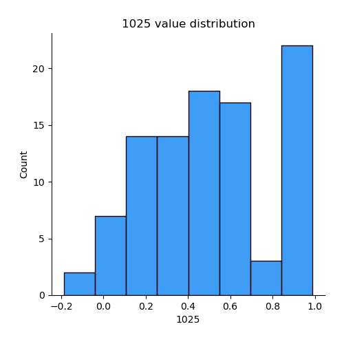
## Feature : 1026
- **Feature type** : continous
- **Missing** : 0.0%
- **Unique** : 97
- **Count** :97.0
- **Mean** :0.4691223119796224
- **Std** :0.33452086046014046
- **Min** :-0.15654116698724183
- **25%th Percentile** : 0.21521067093544027
- **50%th Percentile** : 0.42793692936187283
- **75%th Percentile** : 0.7220314918174565
- **Max** :0.9908231901480078

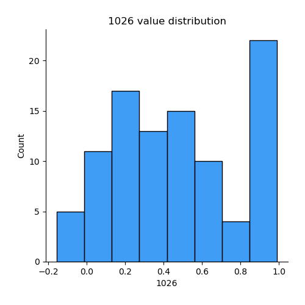
## Feature : 1027
- **Feature type** : continous
- **Missing** : 0.0%
- **Unique** : 97
- **Count** :97.0
- **Mean** :0.4303067239399178
- **Std** :0.32970949218265394
- **Min** :-0.1290770484648493
- **25%th Percentile** : 0.18239996081768878
- **50%th Percentile** : 0.367009642155654
- **75%th Percentile** : 0.6583031920412219
- **Max** :0.9896164350000761

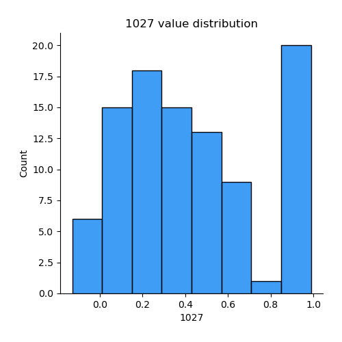
## Feature : 1028
- **Feature type** : continous
- **Missing** : 0.0%
- **Unique** : 97
- **Count** :97.0
- **Mean** :0.4417638064905767
- **Std** :0.31046642909576216
- **Min** :-0.2839120008810334
- **25%th Percentile** : 0.23861310419933454
- **50%th Percentile** : 0.3829399858899205
- **75%th Percentile** : 0.6717150686988118
- **Max** :0.9781473240603431

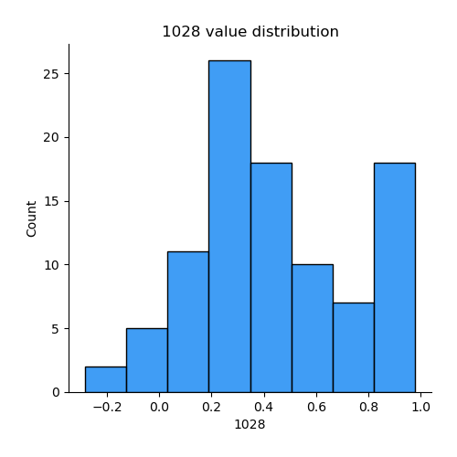
## Feature : 1029
- **Feature type** : continous
- **Missing** : 0.0%
- **Unique** : 97
- **Count** :97.0
- **Mean** :0.495244729105946
- **Std** :0.324973231328225
- **Min** :-0.19990332314941495
- **25%th Percentile** : 0.27009868260135383
- **50%th Percentile** : 0.47614197767144273
- **75%th Percentile** : 0.7676604981666075
- **Max** :0.9894691895546731

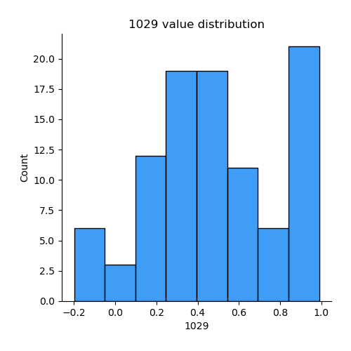
## Feature : 1030
- **Feature type** : continous
- **Missing** : 0.0%
- **Unique** : 97
- **Count** :97.0
- **Mean** :0.580877230142968
- **Std** :0.2727649884683496
- **Min** :-0.10287130412204515
- **25%th Percentile** : 0.3749065957652958
- **50%th Percentile** : 0.5633238249234963
- **75%th Percentile** : 0.8211271497538091
- **Max** :0.9904407039705866

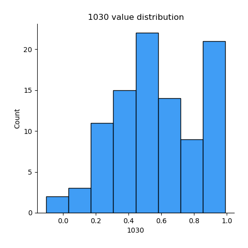
## Feature : 1031
- **Feature type** : continous
- **Missing** : 0.0%
- **Unique** : 97
- **Count** :97.0
- **Mean** :0.5130127382276356
- **Std** :0.3092669338590612
- **Min** :-0.1732598972851728
- **25%th Percentile** : 0.3081150099154044
- **50%th Percentile** : 0.49299998435401304
- **75%th Percentile** : 0.7866761644489706
- **Max** :0.9902372112008377

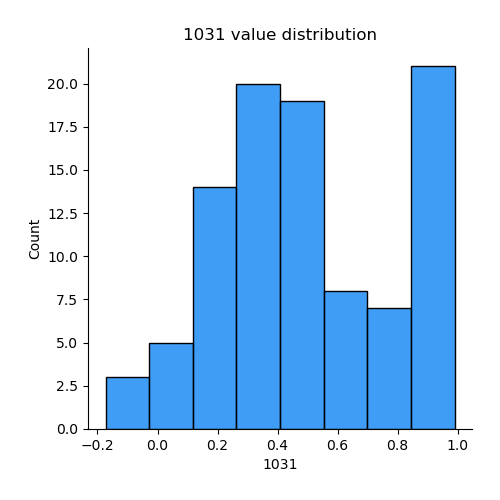
## Feature : 1032
- **Feature type** : continous
- **Missing** : 0.0%
- **Unique** : 97
- **Count** :97.0
- **Mean** :0.5469619355645338
- **Std** :0.2786002879336049
- **Min** :-0.024971351161189728
- **25%th Percentile** : 0.3380597363218497
- **50%th Percentile** : 0.5203718479446949
- **75%th Percentile** : 0.7117408350919913
- **Max** :0.9896129362487122

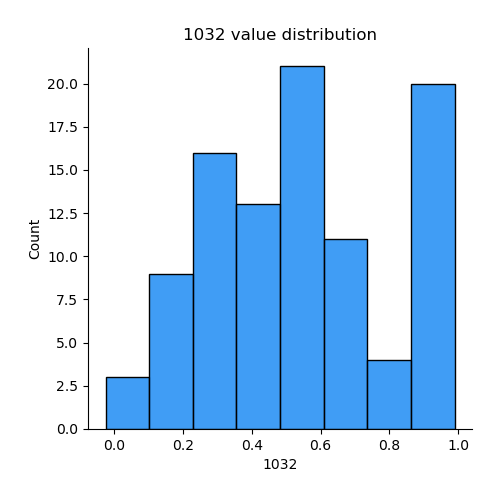
## Feature : 1033
- **Feature type** : continous
- **Missing** : 0.0%
- **Unique** : 97
- **Count** :97.0
- **Mean** :0.7797226313020004
- **Std** :0.1802893117689013
- **Min** :0.2807297142811452
- **25%th Percentile** : 0.6665310725814307
- **50%th Percentile** : 0.8016616566381304
- **75%th Percentile** : 0.9377932612351817
- **Max** :0.9959961011178062

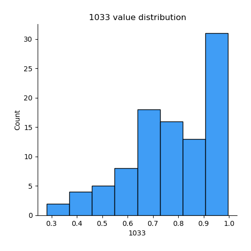
## Feature : 1034
- **Feature type** : continous
- **Missing** : 0.0%
- **Unique** : 97
- **Count** :97.0
- **Mean** :0.6377418533628744
- **Std** :0.23248268836296107
- **Min** :0.10416944904902131
- **25%th Percentile** : 0.46407025822287773
- **50%th Percentile** : 0.6064512230918196
- **75%th Percentile** : 0.7862681520431242
- **Max** :0.9933389582104357

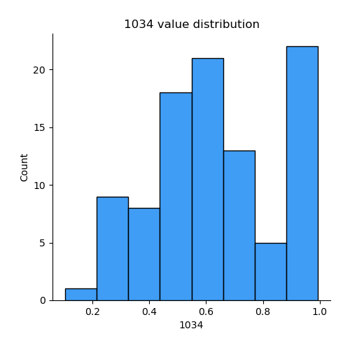
## Feature : 1035
- **Feature type** : continous
- **Missing** : 0.0%
- **Unique** : 97
- **Count** :97.0
- **Mean** :0.45828752801177775
- **Std** :0.33733171283735636
- **Min** :-0.2976325666066667
- **25%th Percentile** : 0.23005057747873428
- **50%th Percentile** : 0.3926044585570317
- **75%th Percentile** : 0.7308475181595093
- **Max** :0.9876369238814491

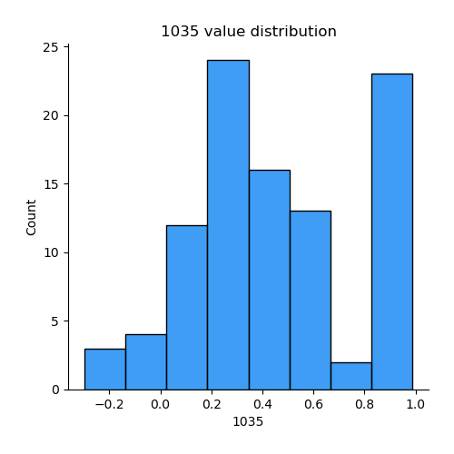
## Feature : 1036
- **Feature type** : continous
- **Missing** : 0.0%
- **Unique** : 97
- **Count** :97.0
- **Mean** :0.5471007850987384
- **Std** :0.2822983297422024
- **Min** :-0.04643653487056964
- **25%th Percentile** : 0.3743994438979314
- **50%th Percentile** : 0.5103206248349312
- **75%th Percentile** : 0.727107401507933
- **Max** :0.9887926046021694

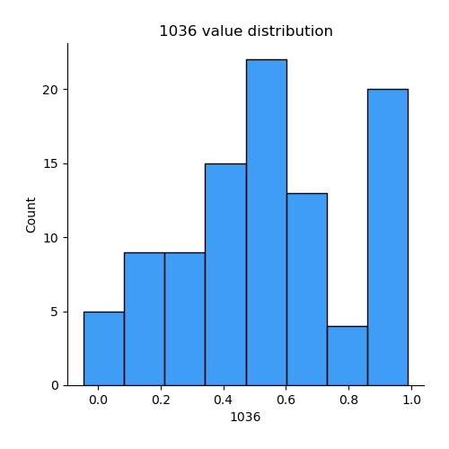
## Feature : 1037
- **Feature type** : continous
- **Missing** : 0.0%
- **Unique** : 97
- **Count** :97.0
- **Mean** :0.5124234948403562
- **Std** :0.3165323725749809
- **Min** :-0.27755973851042093
- **25%th Percentile** : 0.2705520373757886
- **50%th Percentile** : 0.45549234784983744
- **75%th Percentile** : 0.7713311372726073
- **Max** :0.9897591538227773

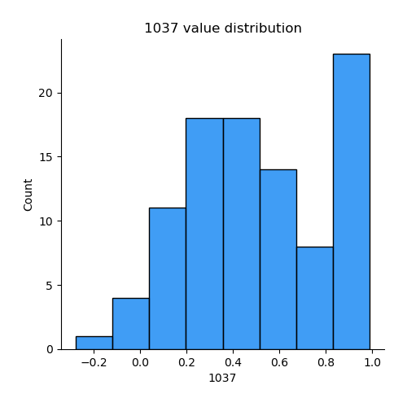
## Feature : 1038
- **Feature type** : continous
- **Missing** : 0.0%
- **Unique** : 97
- **Count** :97.0
- **Mean** :0.3660228323664747
- **Std** :0.3612660570745666
- **Min** :-0.6347634377664411
- **25%th Percentile** : 0.12266966785707868
- **50%th Percentile** : 0.32881869863462726
- **75%th Percentile** : 0.6168358445154565
- **Max** :0.9847179894913416

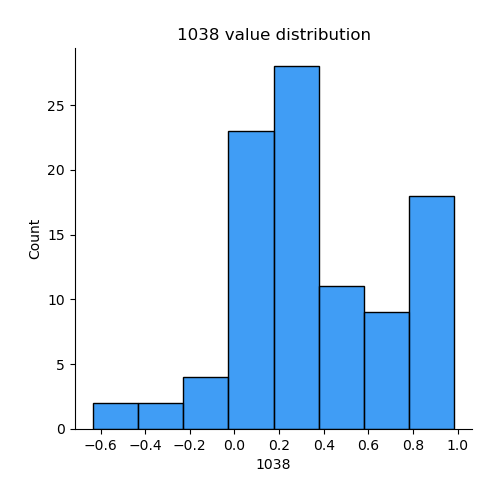
## Feature : 1039
- **Feature type** : continous
- **Missing** : 0.0%
- **Unique** : 97
- **Count** :97.0
- **Mean** :0.5071886929248657
- **Std** :0.2915991170002154
- **Min** :-0.14849190837333853
- **25%th Percentile** : 0.26800340197500555
- **50%th Percentile** : 0.4864117968057564
- **75%th Percentile** : 0.701129313767895
- **Max** :0.9851866083174757

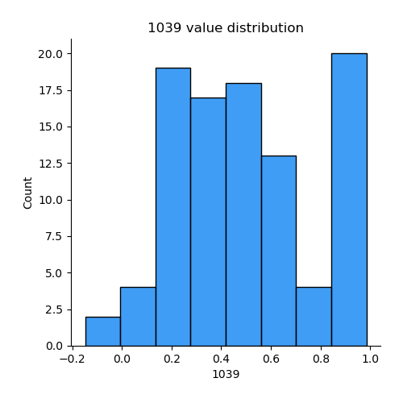
## Feature : 1060
- **Feature type** : continous
- **Missing** : 0.0%
- **Unique** : 3
- **Count** :97.0
- **Mean** :1.0
- **Std** :8.326672684688674e-17
- **Min** :0.9999999999999998
- **25%th Percentile** : 1.0
- **50%th Percentile** : 1.0
- **75%th Percentile** : 1.0
- **Max** :1.0

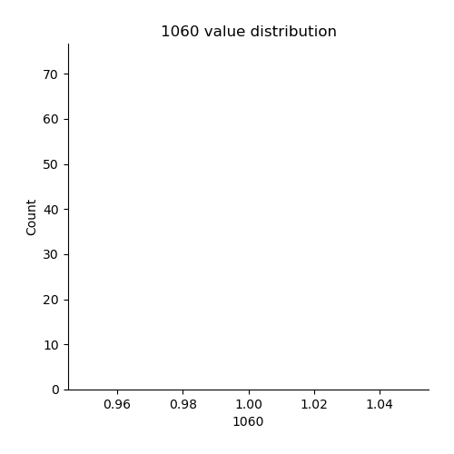
## Feature : 1061
- **Feature type** : continous
- **Missing** : 0.0%
- **Unique** : 97
- **Count** :97.0
- **Mean** :0.6771328489347982
- **Std** :0.22999798222665227
- **Min** :-0.19861822892279804
- **25%th Percentile** : 0.5576748769880369
- **50%th Percentile** : 0.6790928792290528
- **75%th Percentile** : 0.8153909983236453
- **Max** :0.9936024668503061

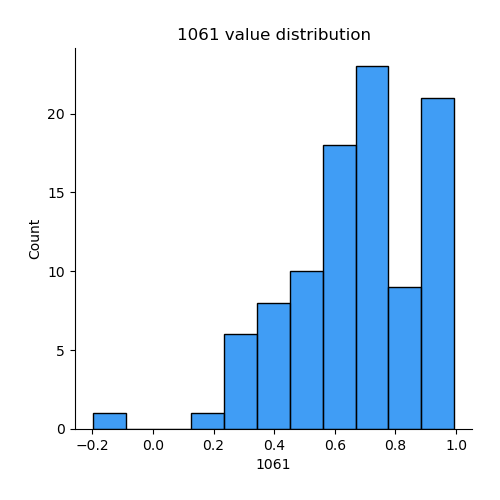
## Feature : 1062
- **Feature type** : continous
- **Missing** : 0.0%
- **Unique** : 97
- **Count** :97.0
- **Mean** :0.591577673072138
- **Std** :0.3001796263307445
- **Min** :-0.2574487197838418
- **25%th Percentile** : 0.36787915943650856
- **50%th Percentile** : 0.6039991837764495
- **75%th Percentile** : 0.8193798226716572
- **Max** :0.9911182593693083

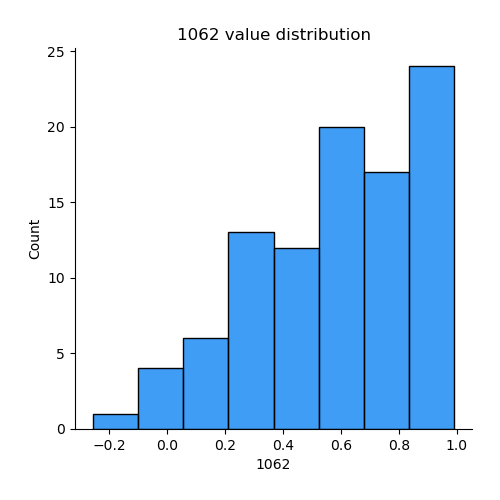
## Feature : 1063
- **Feature type** : continous
- **Missing** : 0.0%
- **Unique** : 97
- **Count** :97.0
- **Mean** :0.6982643491181642
- **Std** :0.22270475760160763
- **Min** :-0.08464655645112384
- **25%th Percentile** : 0.5492566356691231
- **50%th Percentile** : 0.6954631754695317
- **75%th Percentile** : 0.8518940970267023
- **Max** :0.9959846193361913

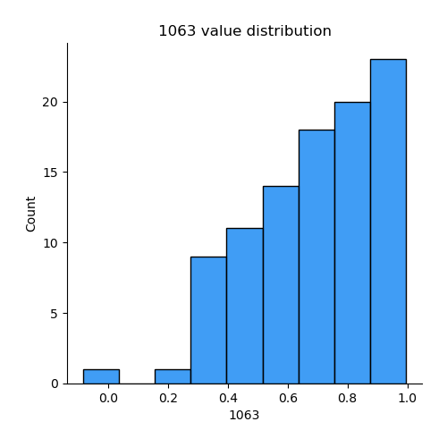
## Feature : 1064
- **Feature type** : continous
- **Missing** : 0.0%
- **Unique** : 97
- **Count** :97.0
- **Mean** :0.4448045975995744
- **Std** :0.30543736854233716
- **Min** :-0.09539444348002653
- **25%th Percentile** : 0.22363206935565338
- **50%th Percentile** : 0.3716688058693632
- **75%th Percentile** : 0.6050701362547681
- **Max** :0.9823811136065365

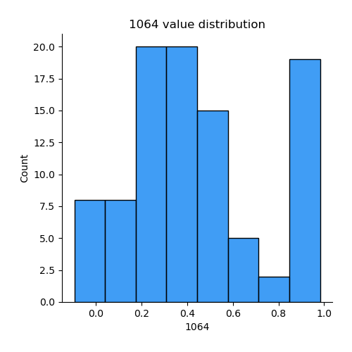
## Feature : 1065
- **Feature type** : continous
- **Missing** : 0.0%
- **Unique** : 97
- **Count** :97.0
- **Mean** :0.5572731688617132
- **Std** :0.28476332214351324
- **Min** :-0.1743107230413044
- **25%th Percentile** : 0.3384976058926089
- **50%th Percentile** : 0.5460380604428904
- **75%th Percentile** : 0.7701260574249712
- **Max** :0.989255053523812

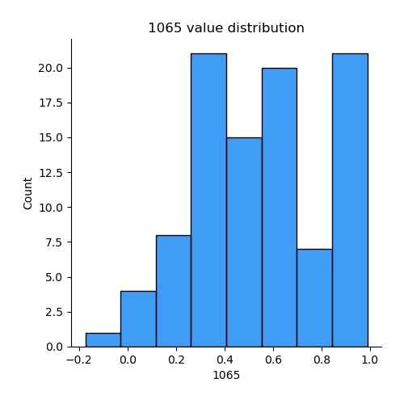
## Feature : 1066
- **Feature type** : continous
- **Missing** : 0.0%
- **Unique** : 97
- **Count** :97.0
- **Mean** :0.5050454939096856
- **Std** :0.3319407954725463
- **Min** :-0.3184149040660609
- **25%th Percentile** : 0.2455249635364181
- **50%th Percentile** : 0.5058496822530146
- **75%th Percentile** : 0.7791972865449954
- **Max** :0.9923192402473369

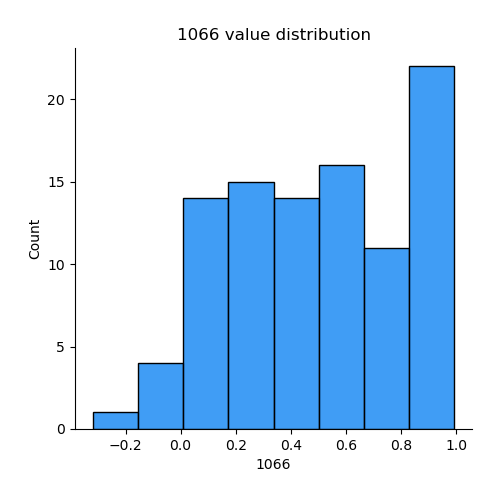
## Feature : 1067
- **Feature type** : continous
- **Missing** : 0.0%
- **Unique** : 97
- **Count** :97.0
- **Mean** :0.7467633595794876
- **Std** :0.18595387047103198
- **Min** :-0.023607422579103424
- **25%th Percentile** : 0.64254864401518
- **50%th Percentile** : 0.7582742693345597
- **75%th Percentile** : 0.8773967267070638
- **Max** :0.9964089383419471

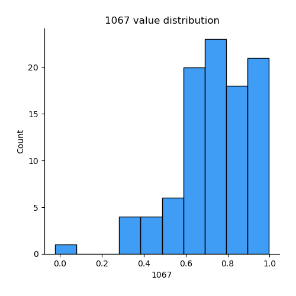
## Feature : 1068
- **Feature type** : continous
- **Missing** : 0.0%
- **Unique** : 97
- **Count** :97.0
- **Mean** :0.5542349576757614
- **Std** :0.29536724340359366
- **Min** :-0.26336147921555964
- **25%th Percentile** : 0.361302703450351
- **50%th Percentile** : 0.5321908686300254
- **75%th Percentile** : 0.7670407106104301
- **Max** :0.9912362799590458

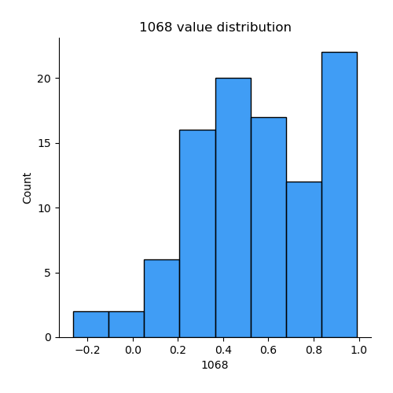
## Feature : 1069
- **Feature type** : continous
- **Missing** : 0.0%
- **Unique** : 97
- **Count** :97.0
- **Mean** :0.409908765926656
- **Std** :0.3183855205072847
- **Min** :-0.2093483593832222
- **25%th Percentile** : 0.160212149439344
- **50%th Percentile** : 0.38360905036044324
- **75%th Percentile** : 0.6079718046134698
- **Max** :0.9823488588863429

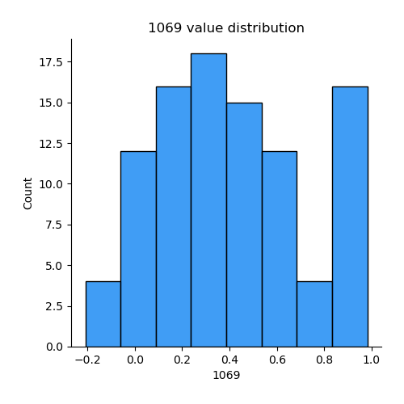
## Feature : 1070
- **Feature type** : continous
- **Missing** : 0.0%
- **Unique** : 97
- **Count** :97.0
- **Mean** :0.5427113758450227
- **Std** :0.31734082673223696
- **Min** :-0.2621058111989661
- **25%th Percentile** : 0.3370998455514243
- **50%th Percentile** : 0.5490508217819463
- **75%th Percentile** : 0.7715949900255157
- **Max** :0.9942767179969294

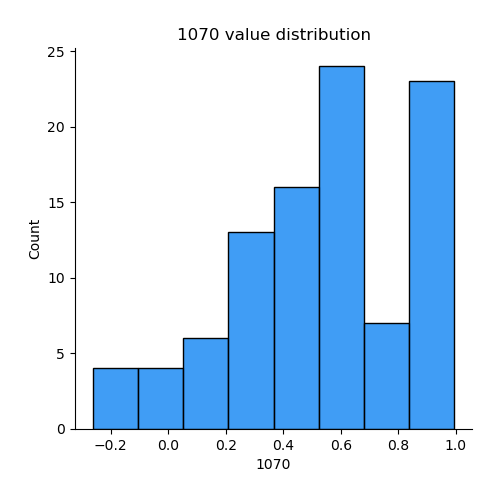
## Feature : 1071
- **Feature type** : continous
- **Missing** : 0.0%
- **Unique** : 97
- **Count** :97.0
- **Mean** :0.6142751946602151
- **Std** :0.26498513456934253
- **Min** :-0.2378696882951877
- **25%th Percentile** : 0.41026536168767913
- **50%th Percentile** : 0.6115198945544429
- **75%th Percentile** : 0.8186192032986331
- **Max** :0.9942298710911135

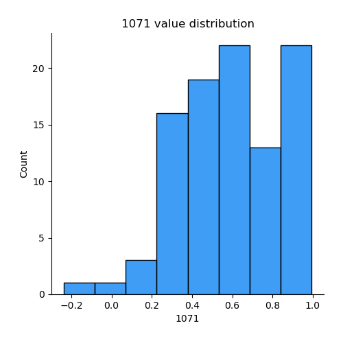
## Feature : 1072
- **Feature type** : continous
- **Missing** : 0.0%
- **Unique** : 97
- **Count** :97.0
- **Mean** :0.5427228141637567
- **Std** :0.30876360071988845
- **Min** :-0.2035222884855346
- **25%th Percentile** : 0.33132252860913874
- **50%th Percentile** : 0.5373114371220395
- **75%th Percentile** : 0.7232101051509092
- **Max** :0.9943755421909043

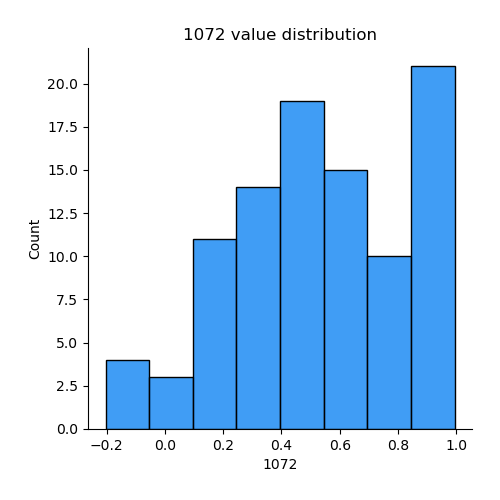
## Feature : 1073
- **Feature type** : continous
- **Missing** : 0.0%
- **Unique** : 97
- **Count** :97.0
- **Mean** :0.6246477119479152
- **Std** :0.25089255798708116
- **Min** :-0.12476895966702223
- **25%th Percentile** : 0.47649409493840655
- **50%th Percentile** : 0.6046253614806727
- **75%th Percentile** : 0.8008897676735852
- **Max** :0.9952189295027803

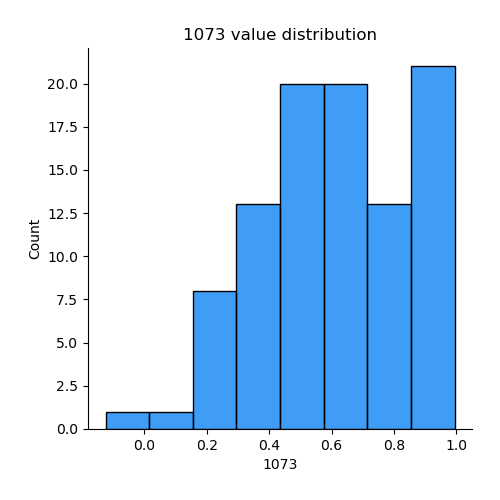
## Feature : 1074
- **Feature type** : continous
- **Missing** : 0.0%
- **Unique** : 97
- **Count** :97.0
- **Mean** :0.6427182420109924
- **Std** :0.23258285144046212
- **Min** :0.04880615192687765
- **25%th Percentile** : 0.4999123104722815
- **50%th Percentile** : 0.628624649686288
- **75%th Percentile** : 0.8150511901609423
- **Max** :0.9923222993588259

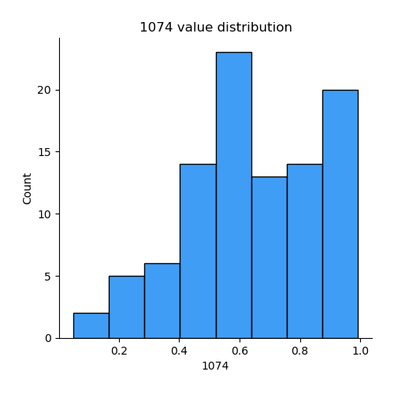
## Feature : 1075
- **Feature type** : continous
- **Missing** : 0.0%
- **Unique** : 97
- **Count** :97.0
- **Mean** :0.5219959209530264
- **Std** :0.3069468436472574
- **Min** :-0.3482713055572963
- **25%th Percentile** : 0.3290657194723013
- **50%th Percentile** : 0.4949741145602465
- **75%th Percentile** : 0.7456767525641713
- **Max** :0.9852441934955459

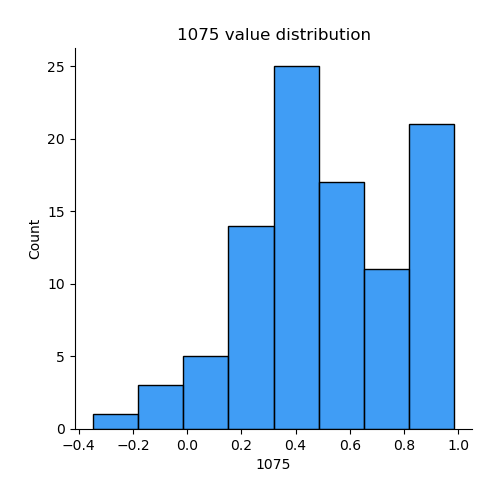
## Feature : 1076
- **Feature type** : continous
- **Missing** : 0.0%
- **Unique** : 97
- **Count** :97.0
- **Mean** :0.540273575261101
- **Std** :0.3091633438999589
- **Min** :-0.20289156854245582
- **25%th Percentile** : 0.3426510305187732
- **50%th Percentile** : 0.5339626840743029
- **75%th Percentile** : 0.7584242642272065
- **Max** :0.9944669660737004

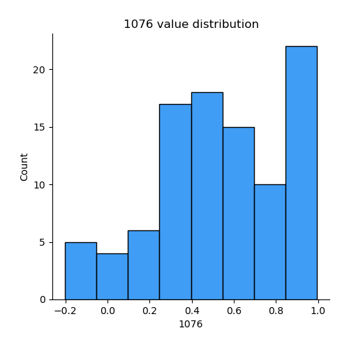
## Feature : 1077
- **Feature type** : continous
- **Missing** : 0.0%
- **Unique** : 97
- **Count** :97.0
- **Mean** :0.5478685468892078
- **Std** :0.32066416626376815
- **Min** :-0.2714865372231157
- **25%th Percentile** : 0.3305294811131699
- **50%th Percentile** : 0.5535098921581821
- **75%th Percentile** : 0.7981150879148075
- **Max** :0.9960738599561338

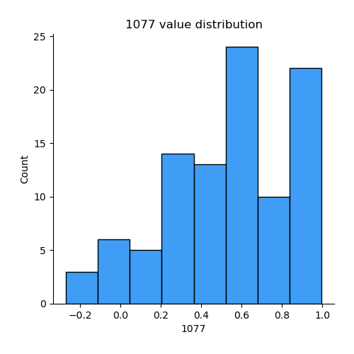
## Feature : 1078
- **Feature type** : continous
- **Missing** : 0.0%
- **Unique** : 97
- **Count** :97.0
- **Mean** :0.705740857570317
- **Std** :0.21804587424591856
- **Min** :-0.06150075529757872
- **25%th Percentile** : 0.5802709192811709
- **50%th Percentile** : 0.7348056687977906
- **75%th Percentile** : 0.8626801071749602
- **Max** :0.9965845411387021

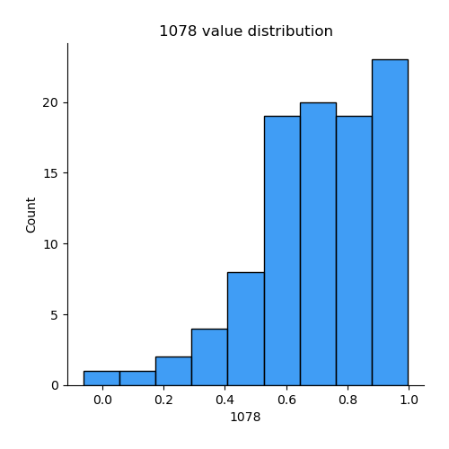
## Feature : 1079
- **Feature type** : continous
- **Missing** : 0.0%
- **Unique** : 97
- **Count** :97.0
- **Mean** :0.4825336836001659
- **Std** :0.3271201916400872
- **Min** :-0.28169780813847917
- **25%th Percentile** : 0.26176532850031675
- **50%th Percentile** : 0.44871359681006395
- **75%th Percentile** : 0.7148530617185419
- **Max** :0.9909751152495343

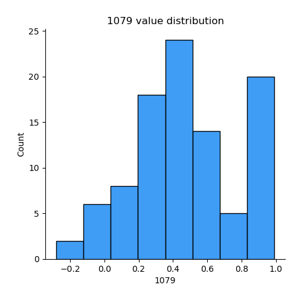
## Feature : 1080
- **Feature type** : continous
- **Missing** : 0.0%
- **Unique** : 97
- **Count** :97.0
- **Mean** :0.5275297055911193
- **Std** :0.28396698016077165
- **Min** :-0.20089570195276304
- **25%th Percentile** : 0.341142279875528
- **50%th Percentile** : 0.48400766015186014
- **75%th Percentile** : 0.7318033793240897
- **Max** :0.9894413792136566

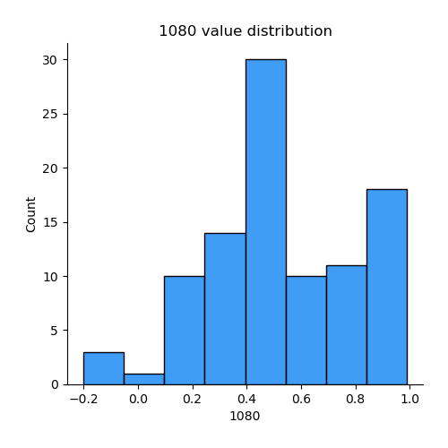
## Feature : 1081
- **Feature type** : continous
- **Missing** : 0.0%
- **Unique** : 97
- **Count** :97.0
- **Mean** :0.6962584146308065
- **Std** :0.22119097384534894
- **Min** :-0.08715168096904628
- **25%th Percentile** : 0.5790182666766165
- **50%th Percentile** : 0.6977299023684793
- **75%th Percentile** : 0.8292044303855428
- **Max** :0.9969558294384893

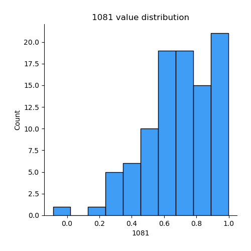
## Feature : 1082
- **Feature type** : continous
- **Missing** : 0.0%
- **Unique** : 97
- **Count** :97.0
- **Mean** :0.7225396248988222
- **Std** :0.1932068724830255
- **Min** :0.21358775285980783
- **25%th Percentile** : 0.6190833484261964
- **50%th Percentile** : 0.7239411845411318
- **75%th Percentile** : 0.8563265684131841
- **Max** :0.9960050157682533

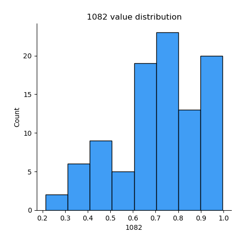
## Feature : 1083
- **Feature type** : continous
- **Missing** : 0.0%
- **Unique** : 97
- **Count** :97.0
- **Mean** :0.7529077022882179
- **Std** :0.1966384900610864
- **Min** :-0.06283827178134571
- **25%th Percentile** : 0.6445710452947918
- **50%th Percentile** : 0.7770665670112925
- **75%th Percentile** : 0.8697860392926001
- **Max** :0.9965082763608021

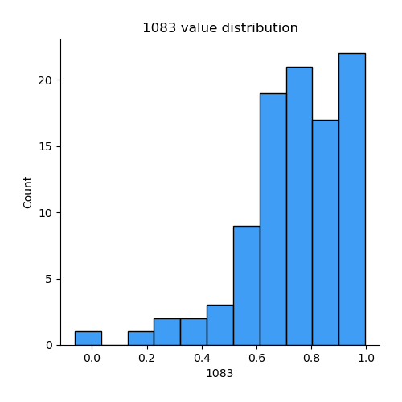
## Feature : 1084
- **Feature type** : continous
- **Missing** : 0.0%
- **Unique** : 97
- **Count** :97.0
- **Mean** :0.6778108573008532
- **Std** :0.2134752266272494
- **Min** :0.017968687223707636
- **25%th Percentile** : 0.5264461518193893
- **50%th Percentile** : 0.6730444118382838
- **75%th Percentile** : 0.8177630409535519
- **Max** :0.992434250329724

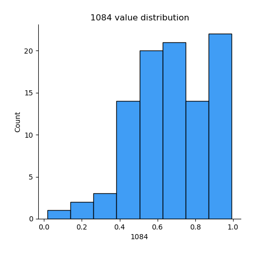
## Feature : 1085
- **Feature type** : continous
- **Missing** : 0.0%
- **Unique** : 97
- **Count** :97.0
- **Mean** :0.6205711862423932
- **Std** :0.24457431728712622
- **Min** :0.1740271991403257
- **25%th Percentile** : 0.4576795430398885
- **50%th Percentile** : 0.5997262472402661
- **75%th Percentile** : 0.7842362551782249
- **Max** :0.991537970447563

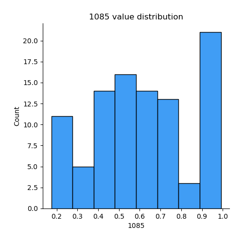
## Feature : 1086
- **Feature type** : continous
- **Missing** : 0.0%
- **Unique** : 97
- **Count** :97.0
- **Mean** :0.900733709893459
- **Std** :0.09742097685132296
- **Min** :0.5403790127159943
- **25%th Percentile** : 0.8493015968282291
- **50%th Percentile** : 0.9291168124096052
- **75%th Percentile** : 0.9713915481819274
- **Max** :0.9990495550489766

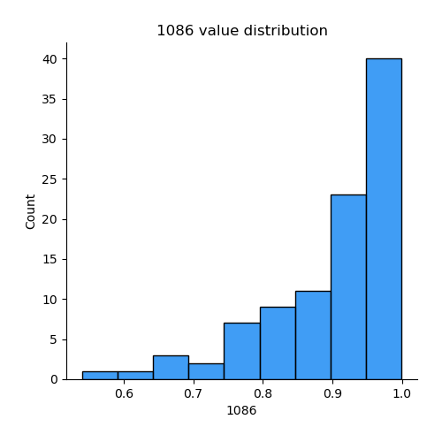
## Feature : 1087
- **Feature type** : continous
- **Missing** : 0.0%
- **Unique** : 97
- **Count** :97.0
- **Mean** :0.6551310641792829
- **Std** :0.2513800221250626
- **Min** :-0.4150984115270885
- **25%th Percentile** : 0.5094657177014499
- **50%th Percentile** : 0.6662004588501178
- **75%th Percentile** : 0.8052078709912239
- **Max** :0.9939803375130417

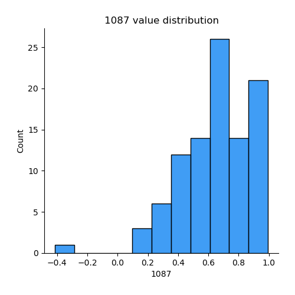
## Feature : 1088
- **Feature type** : continous
- **Missing** : 0.0%
- **Unique** : 97
- **Count** :97.0
- **Mean** :0.5697877892147396
- **Std** :0.30566178560668694
- **Min** :-0.12833394954865368
- **25%th Percentile** : 0.346009506915036
- **50%th Percentile** : 0.5695427580970689
- **75%th Percentile** : 0.7958221224961858
- **Max** :0.9941121451277231

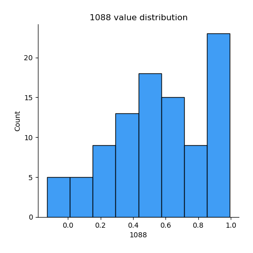
## Feature : 1089
- **Feature type** : continous
- **Missing** : 0.0%
- **Unique** : 97
- **Count** :97.0
- **Mean** :0.6461334606290483
- **Std** :0.25747167688936984
- **Min** :-0.4094148244819579
- **25%th Percentile** : 0.5055195006042317
- **50%th Percentile** : 0.6672283961938236
- **75%th Percentile** : 0.8241443215235079
- **Max** :0.9952498463580467

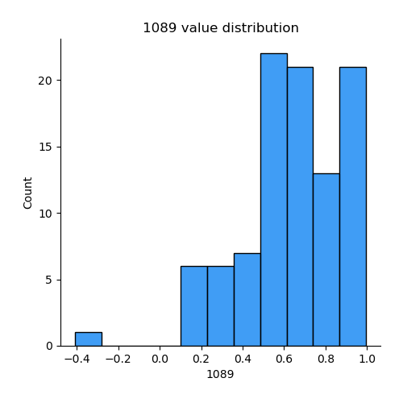
## Feature : 1090
- **Feature type** : continous
- **Missing** : 0.0%
- **Unique** : 97
- **Count** :97.0
- **Mean** :0.4185507321806601
- **Std** :0.3224198761935236
- **Min** :-0.4414196279685645
- **25%th Percentile** : 0.17508792877252993
- **50%th Percentile** : 0.3900921879821208
- **75%th Percentile** : 0.6242385228018343
- **Max** :0.9841073980380968

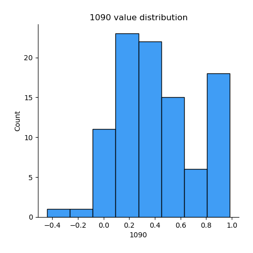
## Feature : 1091
- **Feature type** : continous
- **Missing** : 0.0%
- **Unique** : 97
- **Count** :97.0
- **Mean** :0.5012788630523402
- **Std** :0.31221445839106343
- **Min** :-0.3821485201854459
- **25%th Percentile** : 0.2997214845824389
- **50%th Percentile** : 0.4379360667809881
- **75%th Percentile** : 0.6862316168059516
- **Max** :0.9911439971746093

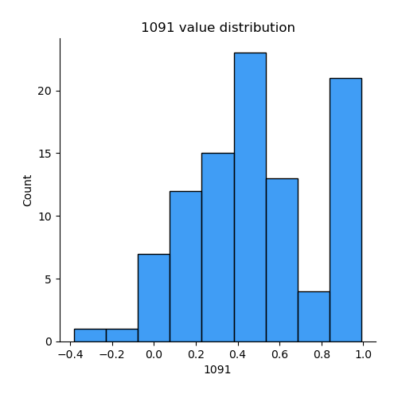
## Feature : 1113
- **Feature type** : continous
- **Missing** : 0.0%
- **Unique** : 3
- **Count** :97.0
- **Mean** :1.0
- **Std** :6.607148558400768e-17
- **Min** :0.9999999999999998
- **25%th Percentile** : 1.0
- **50%th Percentile** : 1.0
- **75%th Percentile** : 1.0
- **Max** :1.0

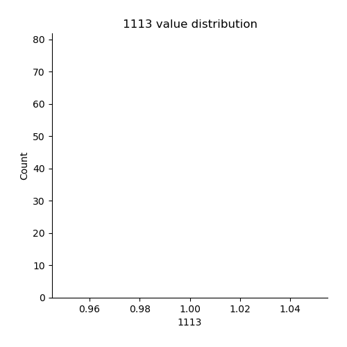
## Feature : 1114
- **Feature type** : continous
- **Missing** : 0.0%
- **Unique** : 97
- **Count** :97.0
- **Mean** :0.6276351253139061
- **Std** :0.25503496334915904
- **Min** :-0.034546126354187516
- **25%th Percentile** : 0.4632389218150648
- **50%th Percentile** : 0.6236420545893693
- **75%th Percentile** : 0.8105135053918717
- **Max** :0.9908842424013703

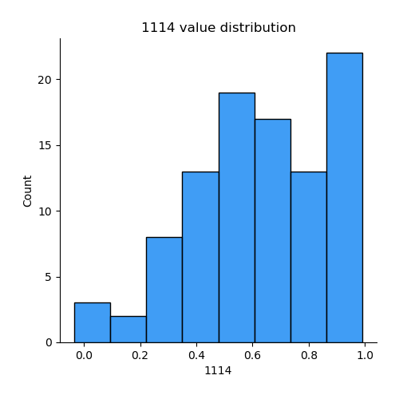
## Feature : 1115
- **Feature type** : continous
- **Missing** : 0.0%
- **Unique** : 97
- **Count** :97.0
- **Mean** :0.8066034086631957
- **Std** :0.14435061567223026
- **Min** :0.32619455406677494
- **25%th Percentile** : 0.7260767261368534
- **50%th Percentile** : 0.8129252395698632
- **75%th Percentile** : 0.9252952397349149
- **Max** :0.9977549529856231

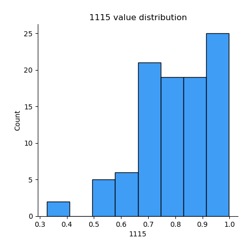
## Feature : 1116
- **Feature type** : continous
- **Missing** : 0.0%
- **Unique** : 97
- **Count** :97.0
- **Mean** :0.4129304194874248
- **Std** :0.316123118423753
- **Min** :-0.11569121700791764
- **25%th Percentile** : 0.15586386691021611
- **50%th Percentile** : 0.33865957208813585
- **75%th Percentile** : 0.5914571837394946
- **Max** :0.9763831490501335

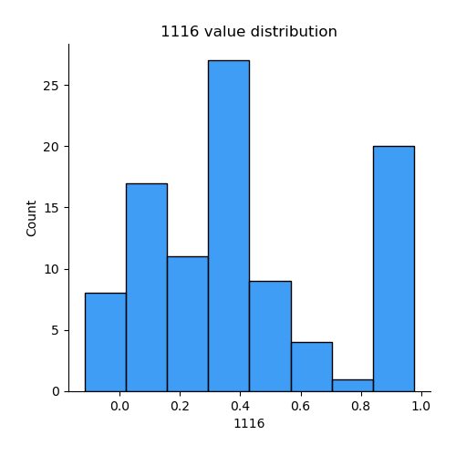
## Feature : 1117
- **Feature type** : continous
- **Missing** : 0.0%
- **Unique** : 97
- **Count** :97.0
- **Mean** :0.584659936677744
- **Std** :0.24753385661225932
- **Min** :0.1124611054931161
- **25%th Percentile** : 0.42944629419248165
- **50%th Percentile** : 0.5518247447063257
- **75%th Percentile** : 0.719177710145232
- **Max** :0.9884952134162953

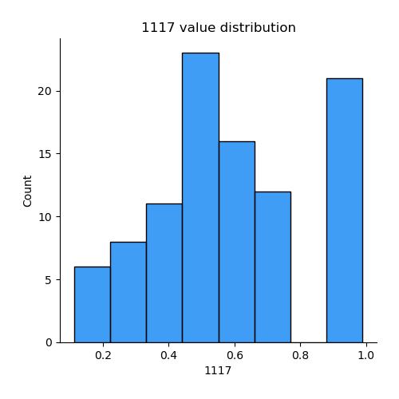
## Feature : 1118
- **Feature type** : continous
- **Missing** : 0.0%
- **Unique** : 97
- **Count** :97.0
- **Mean** :0.5915661662948511
- **Std** :0.2855011268670219
- **Min** :-0.2879867769188224
- **25%th Percentile** : 0.4096055631226575
- **50%th Percentile** : 0.6099726542395882
- **75%th Percentile** : 0.760033181973767
- **Max** :0.9939758568128114

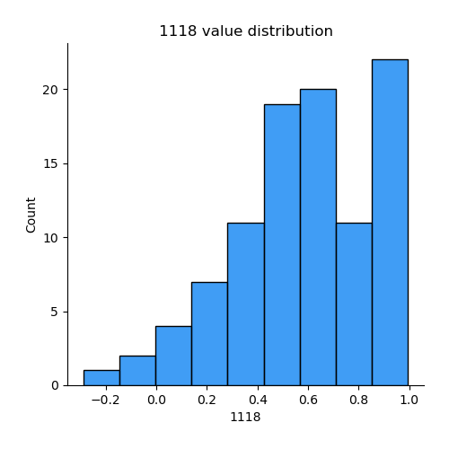
## Feature : 1119
- **Feature type** : continous
- **Missing** : 0.0%
- **Unique** : 97
- **Count** :97.0
- **Mean** :0.6404497485492521
- **Std** :0.2252641044859984
- **Min** :0.03732914105737305
- **25%th Percentile** : 0.505948998492503
- **50%th Percentile** : 0.6130087573697449
- **75%th Percentile** : 0.7538806952020485
- **Max** :0.9940464722930328

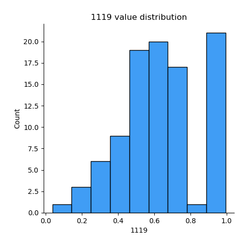
## Feature : 1120
- **Feature type** : continous
- **Missing** : 0.0%
- **Unique** : 97
- **Count** :97.0
- **Mean** :0.7747562247297652
- **Std** :0.1558166796605442
- **Min** :0.2717477506930258
- **25%th Percentile** : 0.6733599445677569
- **50%th Percentile** : 0.7881167196909822
- **75%th Percentile** : 0.8797937831925351
- **Max** :0.9909940023965736

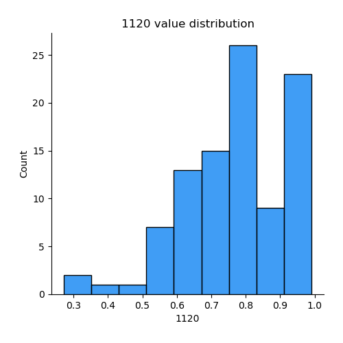
## Feature : 1121
- **Feature type** : continous
- **Missing** : 0.0%
- **Unique** : 97
- **Count** :97.0
- **Mean** :0.4072605852315416
- **Std** :0.31805204459628583
- **Min** :-0.14302690852285718
- **25%th Percentile** : 0.18226839190439234
- **50%th Percentile** : 0.36179433057432764
- **75%th Percentile** : 0.6271573942462173
- **Max** :0.9795816395000926

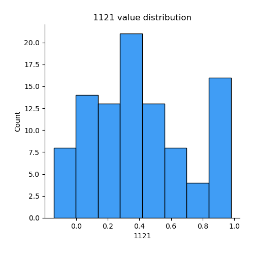
## Feature : 1122
- **Feature type** : continous
- **Missing** : 0.0%
- **Unique** : 97
- **Count** :97.0
- **Mean** :0.6986861417812618
- **Std** :0.2329022944389231
- **Min** :-0.036122829341912466
- **25%th Percentile** : 0.5481659282765622
- **50%th Percentile** : 0.7438100726507721
- **75%th Percentile** : 0.8810615270388839
- **Max** :0.9950402529277249

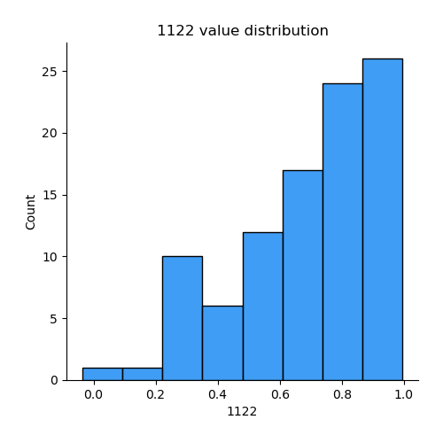
## Feature : 1123
- **Feature type** : continous
- **Missing** : 0.0%
- **Unique** : 97
- **Count** :97.0
- **Mean** :0.7505255903042249
- **Std** :0.2046810364131806
- **Min** :-0.023484133676772417
- **25%th Percentile** : 0.6632633049523398
- **50%th Percentile** : 0.7633847566719677
- **75%th Percentile** : 0.9232910902774606
- **Max** :0.9954058058776475

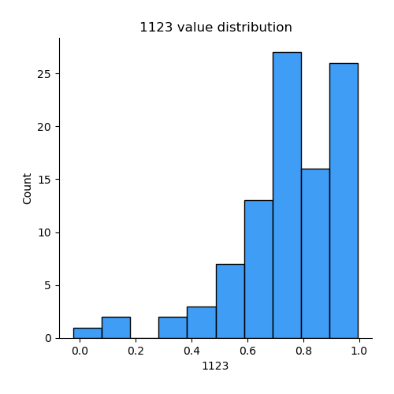
## Feature : 1124
- **Feature type** : continous
- **Missing** : 0.0%
- **Unique** : 97
- **Count** :97.0
- **Mean** :0.6300443097940822
- **Std** :0.25783908349198364
- **Min** :-0.0007846006071388732
- **25%th Percentile** : 0.4595850852151059
- **50%th Percentile** : 0.6393188741514323
- **75%th Percentile** : 0.8133222189806798
- **Max** :0.9943228903161349

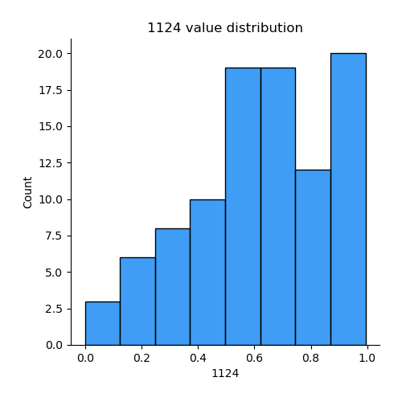
## Feature : 1125
- **Feature type** : continous
- **Missing** : 0.0%
- **Unique** : 97
- **Count** :97.0
- **Mean** :0.6595045469762193
- **Std** :0.2262703374342496
- **Min** :0.051142038196798204
- **25%th Percentile** : 0.49358120929683486
- **50%th Percentile** : 0.6352008208610613
- **75%th Percentile** : 0.8275560238154659
- **Max** :0.9934016342701912

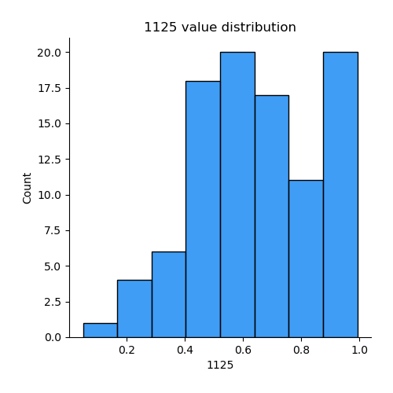
## Feature : 1126
- **Feature type** : continous
- **Missing** : 0.0%
- **Unique** : 97
- **Count** :97.0
- **Mean** :0.670571588480574
- **Std** :0.23602685789898373
- **Min** :-0.08550190085584057
- **25%th Percentile** : 0.5388928823920354
- **50%th Percentile** : 0.6770428981866551
- **75%th Percentile** : 0.8585179190902388
- **Max** :0.9870033675130675

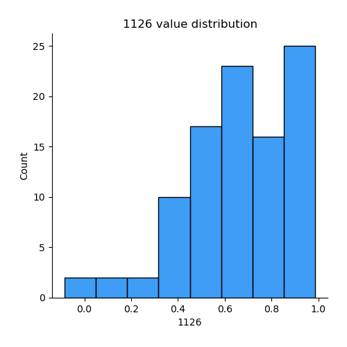
## Feature : 1127
- **Feature type** : continous
- **Missing** : 0.0%
- **Unique** : 97
- **Count** :97.0
- **Mean** :0.7156365286741927
- **Std** :0.19582594169220208
- **Min** :0.18849202920009783
- **25%th Percentile** : 0.6003014308217747
- **50%th Percentile** : 0.7226816798724811
- **75%th Percentile** : 0.8635219170125799
- **Max** :0.9932025503332073

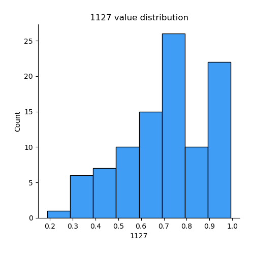
## Feature : 1128
- **Feature type** : continous
- **Missing** : 0.0%
- **Unique** : 97
- **Count** :97.0
- **Mean** :0.7368929915830912
- **Std** :0.19182959400619282
- **Min** :0.22461178991779768
- **25%th Percentile** : 0.620648986585982
- **50%th Percentile** : 0.7493415028205
- **75%th Percentile** : 0.8738783351211364
- **Max** :0.9944250446889423

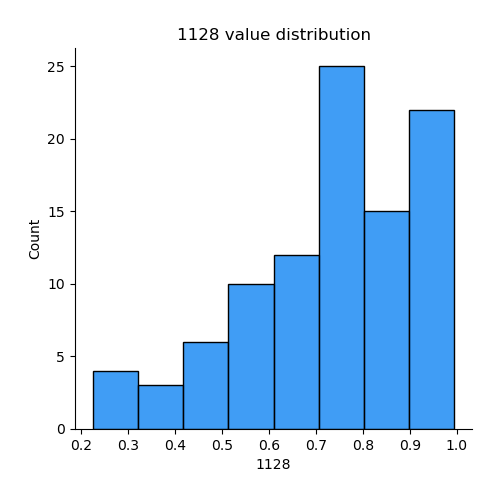
## Feature : 1129
- **Feature type** : continous
- **Missing** : 0.0%
- **Unique** : 97
- **Count** :97.0
- **Mean** :0.5772767131899403
- **Std** :0.29781771525597284
- **Min** :-0.22556141359437448
- **25%th Percentile** : 0.3913950927459623
- **50%th Percentile** : 0.5869023903903564
- **75%th Percentile** : 0.8105818064628809
- **Max** :0.9926256477566193

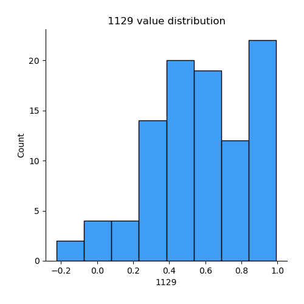
## Feature : 1130
- **Feature type** : continous
- **Missing** : 0.0%
- **Unique** : 97
- **Count** :97.0
- **Mean** :0.7529610940120717
- **Std** :0.1730156698513447
- **Min** :0.3074916414044222
- **25%th Percentile** : 0.6266282259353461
- **50%th Percentile** : 0.7483734287267
- **75%th Percentile** : 0.8792999251648911
- **Max** :0.9955995697284361

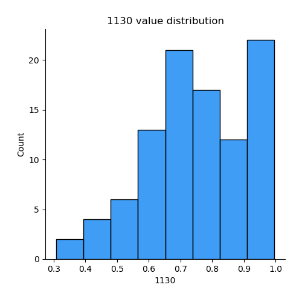
## Feature : 1131
- **Feature type** : continous
- **Missing** : 0.0%
- **Unique** : 97
- **Count** :97.0
- **Mean** :0.5673665013238675
- **Std** :0.27699858961126705
- **Min** :0.04612332589509926
- **25%th Percentile** : 0.347431691910239
- **50%th Percentile** : 0.5370524135066604
- **75%th Percentile** : 0.7448784911154757
- **Max** :0.9911733003155399

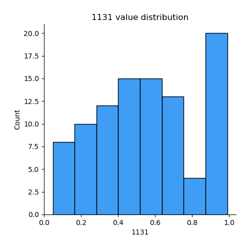
## Feature : 1132
- **Feature type** : continous
- **Missing** : 0.0%
- **Unique** : 97
- **Count** :97.0
- **Mean** :0.6961204904228131
- **Std** :0.18922133659683094
- **Min** :0.25085932932059285
- **25%th Percentile** : 0.5719379869708584
- **50%th Percentile** : 0.6843104004540567
- **75%th Percentile** : 0.8259115392116885
- **Max** :0.9870671054068938

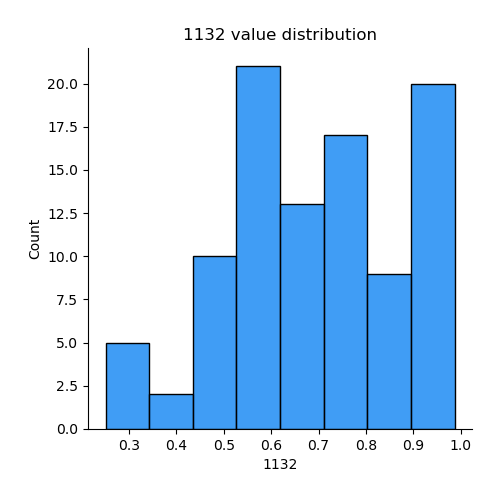
## Feature : 1133
- **Feature type** : continous
- **Missing** : 0.0%
- **Unique** : 97
- **Count** :97.0
- **Mean** :0.7512864351692641
- **Std** :0.19326508151523603
- **Min** :0.05203354354979756
- **25%th Percentile** : 0.6301132777804747
- **50%th Percentile** : 0.7544783250192978
- **75%th Percentile** : 0.884267421892216
- **Max** :0.99503896918122

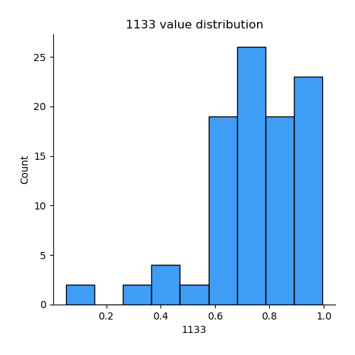
## Feature : 1134
- **Feature type** : continous
- **Missing** : 0.0%
- **Unique** : 97
- **Count** :97.0
- **Mean** :0.7307178235694038
- **Std** :0.18828301101395106
- **Min** :0.19397359077363843
- **25%th Percentile** : 0.6114894289662545
- **50%th Percentile** : 0.7228472649618995
- **75%th Percentile** : 0.864705365926911
- **Max** :0.9948198203285447

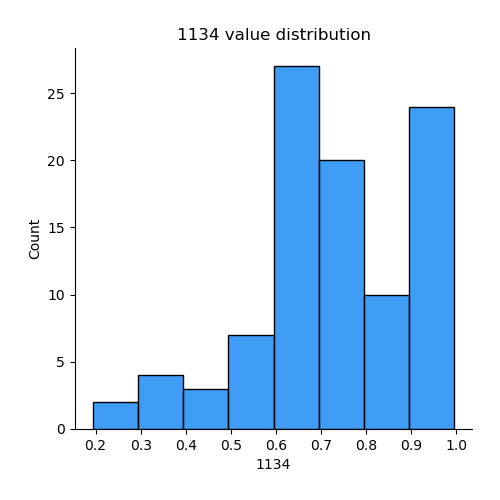
## Feature : 1135
- **Feature type** : continous
- **Missing** : 0.0%
- **Unique** : 97
- **Count** :97.0
- **Mean** :0.7836847244602204
- **Std** :0.1744738478678989
- **Min** :0.008007099623380545
- **25%th Percentile** : 0.7148857121583856
- **50%th Percentile** : 0.8012413804082561
- **75%th Percentile** : 0.8838451436256565
- **Max** :0.997571360366392

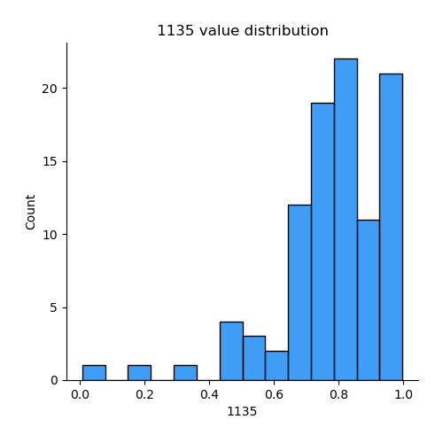
## Feature : 1136
- **Feature type** : continous
- **Missing** : 0.0%
- **Unique** : 97
- **Count** :97.0
- **Mean** :0.8263003171835416
- **Std** :0.14131278626591173
- **Min** :0.2703190371981595
- **25%th Percentile** : 0.7316826673311709
- **50%th Percentile** : 0.8476112317661376
- **75%th Percentile** : 0.9437468128145476
- **Max** :0.9960268130985228

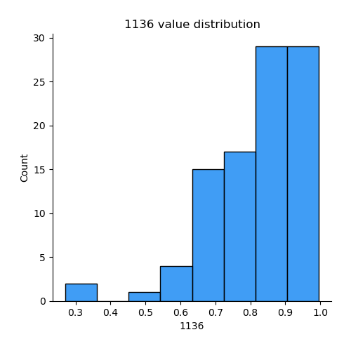
## Feature : 1137
- **Feature type** : continous
- **Missing** : 0.0%
- **Unique** : 97
- **Count** :97.0
- **Mean** :0.4453586446671084
- **Std** :0.33772595041115877
- **Min** :-0.4046329323574258
- **25%th Percentile** : 0.19559697128555018
- **50%th Percentile** : 0.3768446021615691
- **75%th Percentile** : 0.6747439783015371
- **Max** :0.988089038962417

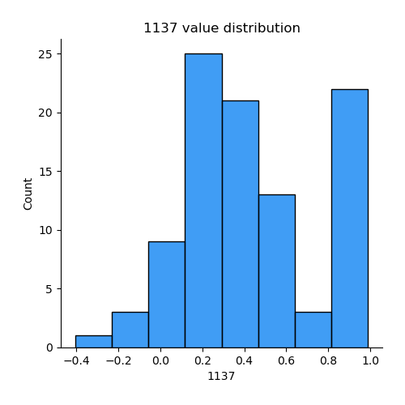
## Feature : 1138
- **Feature type** : continous
- **Missing** : 0.0%
- **Unique** : 97
- **Count** :97.0
- **Mean** :0.6764369324657252
- **Std** :0.22967685055700895
- **Min** :0.001292720316272092
- **25%th Percentile** : 0.5452258594235844
- **50%th Percentile** : 0.6711393225136959
- **75%th Percentile** : 0.8526823398046426
- **Max** :0.994604917516526

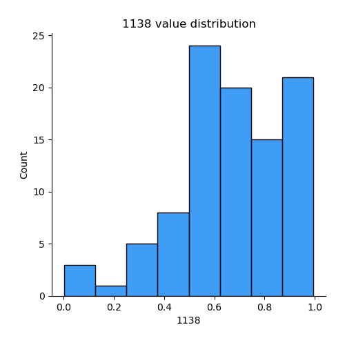
## Feature : 1139
- **Feature type** : continous
- **Missing** : 0.0%
- **Unique** : 97
- **Count** :97.0
- **Mean** :0.9334689816144062
- **Std** :0.05903142250817126
- **Min** :0.6560783486646374
- **25%th Percentile** : 0.9017704843688333
- **50%th Percentile** : 0.9457154876886132
- **75%th Percentile** : 0.9761424771095633
- **Max** :0.9993209381047726

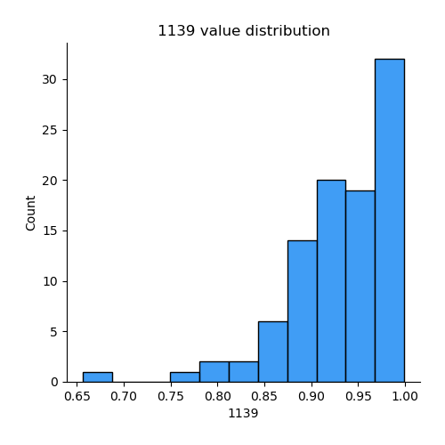
## Feature : 1140
- **Feature type** : continous
- **Missing** : 0.0%
- **Unique** : 97
- **Count** :97.0
- **Mean** :0.6141004930969138
- **Std** :0.2618234649927535
- **Min** :-0.01803703498371818
- **25%th Percentile** : 0.4406124202641362
- **50%th Percentile** : 0.6048425054836634
- **75%th Percentile** : 0.8339759348089846
- **Max** :0.9916204213323768

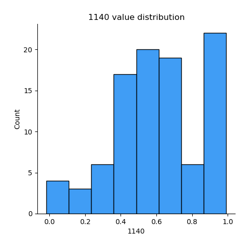
## Feature : 1141
- **Feature type** : continous
- **Missing** : 0.0%
- **Unique** : 97
- **Count** :97.0
- **Mean** :0.789403215203449
- **Std** :0.1579877896057251
- **Min** :0.17641208314060325
- **25%th Percentile** : 0.6981527987661144
- **50%th Percentile** : 0.790608651085999
- **75%th Percentile** : 0.9261236908312391
- **Max** :0.9964745021522624

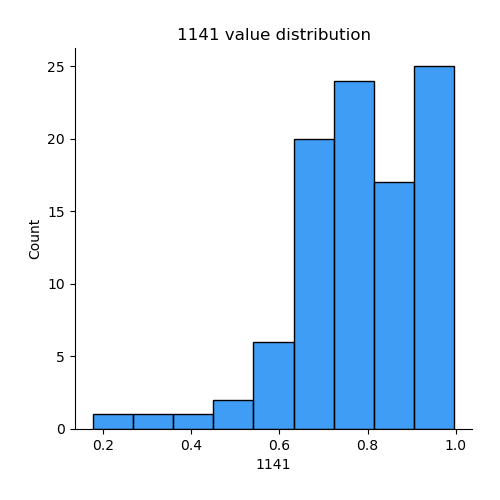
## Feature : 1142
- **Feature type** : continous
- **Missing** : 0.0%
- **Unique** : 97
- **Count** :97.0
- **Mean** :0.39747210521370885
- **Std** :0.3241302229024297
- **Min** :-0.3147460786656435
- **25%th Percentile** : 0.1456287397608014
- **50%th Percentile** : 0.3431629952805863
- **75%th Percentile** : 0.5676286231729292
- **Max** :0.9775036246296128

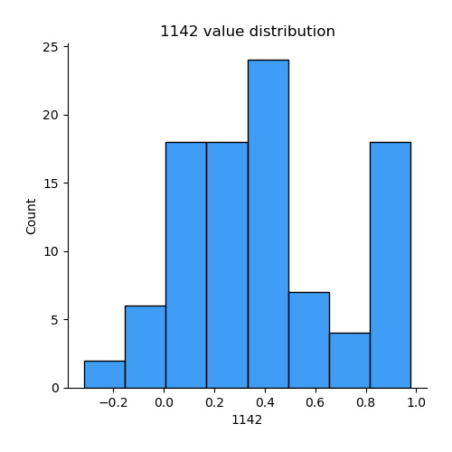
## Feature : 1143
- **Feature type** : continous
- **Missing** : 0.0%
- **Unique** : 97
- **Count** :97.0
- **Mean** :0.5156482908622669
- **Std** :0.2879420600007736
- **Min** :-0.015388857770740257
- **25%th Percentile** : 0.3001374033604049
- **50%th Percentile** : 0.4340877543494966
- **75%th Percentile** : 0.7428436072648168
- **Max** :0.9886425999925122

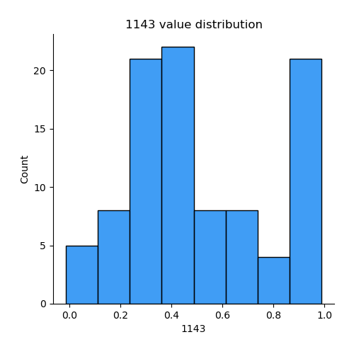
## Feature : 1166
- **Feature type** : continous
- **Missing** : 0.0%
- **Unique** : 3
- **Count** :97.0
- **Mean** :1.0
- **Std** :8.993834424997155e-17
- **Min** :0.9999999999999998
- **25%th Percentile** : 1.0
- **50%th Percentile** : 1.0
- **75%th Percentile** : 1.0
- **Max** :1.0

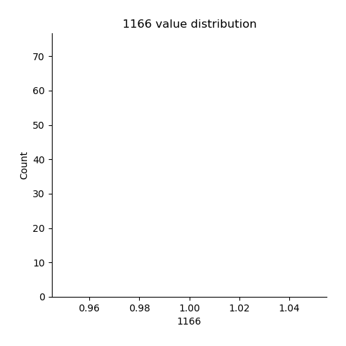
## Feature : 1167
- **Feature type** : continous
- **Missing** : 0.0%
- **Unique** : 97
- **Count** :97.0
- **Mean** :0.7226964984504448
- **Std** :0.20359564018202816
- **Min** :0.20953177614932658
- **25%th Percentile** : 0.5717605629804307
- **50%th Percentile** : 0.7103414470015695
- **75%th Percentile** : 0.8910172574325484
- **Max** :0.9949430516507205

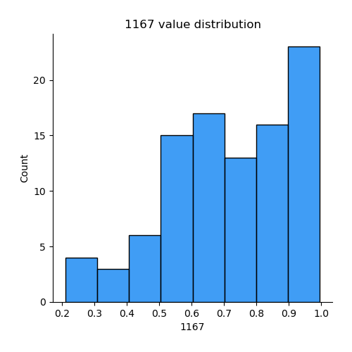
## Feature : 1168
- **Feature type** : continous
- **Missing** : 0.0%
- **Unique** : 97
- **Count** :97.0
- **Mean** :0.5380366594727135
- **Std** :0.2770894551535447
- **Min** :-0.11147206783192735
- **25%th Percentile** : 0.3452657541689605
- **50%th Percentile** : 0.5187852781880116
- **75%th Percentile** : 0.7536634263808655
- **Max** :0.9883239850248631

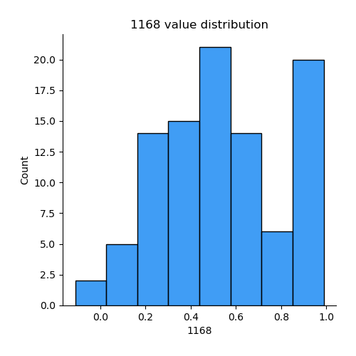
## Feature : 1169
- **Feature type** : continous
- **Missing** : 0.0%
- **Unique** : 97
- **Count** :97.0
- **Mean** :0.8147346118195417
- **Std** :0.12761105679656046
- **Min** :0.48471615719604483
- **25%th Percentile** : 0.7247834469327694
- **50%th Percentile** : 0.8146704268636007
- **75%th Percentile** : 0.9056313498782768
- **Max** :0.995541505346692

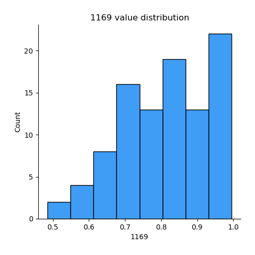
## Feature : 1170
- **Feature type** : continous
- **Missing** : 0.0%
- **Unique** : 97
- **Count** :97.0
- **Mean** :0.6918364089167227
- **Std** :0.25248250944847545
- **Min** :-0.20273002359421718
- **25%th Percentile** : 0.5516569170523827
- **50%th Percentile** : 0.7145008507114202
- **75%th Percentile** : 0.8861552576951953
- **Max** :0.994082340048735

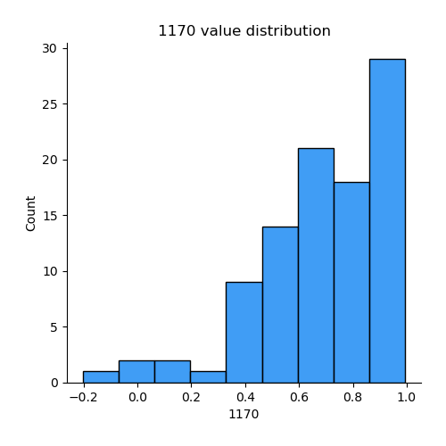
## Feature : 1171
- **Feature type** : continous
- **Missing** : 0.0%
- **Unique** : 97
- **Count** :97.0
- **Mean** :0.5771752734972944
- **Std** :0.2768310988668712
- **Min** :-0.1790697397586855
- **25%th Percentile** : 0.41878525090495405
- **50%th Percentile** : 0.5712205856438647
- **75%th Percentile** : 0.7489067752549078
- **Max** :0.9914053975309408

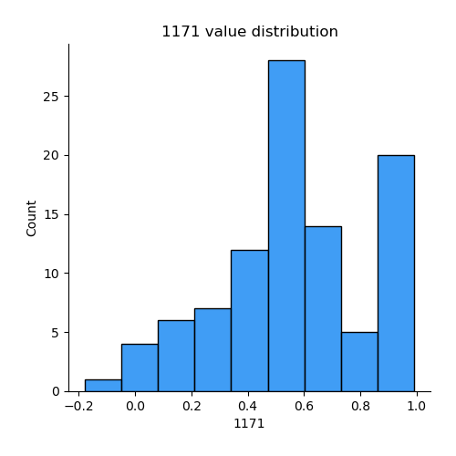
## Feature : 1172
- **Feature type** : continous
- **Missing** : 0.0%
- **Unique** : 97
- **Count** :97.0
- **Mean** :0.6404153259753778
- **Std** :0.246600461203806
- **Min** :-0.09488706134614826
- **25%th Percentile** : 0.4841629821791278
- **50%th Percentile** : 0.6258252022706428
- **75%th Percentile** : 0.824203515939833
- **Max** :0.9857587468139004

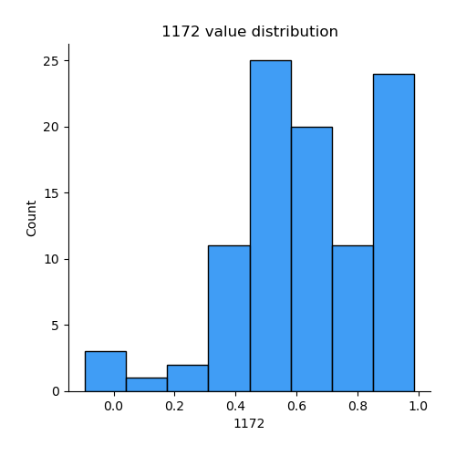
## Feature : 1173
- **Feature type** : continous
- **Missing** : 0.0%
- **Unique** : 97
- **Count** :97.0
- **Mean** :0.4536612506343087
- **Std** :0.31736688712757904
- **Min** :-0.5380354633641731
- **25%th Percentile** : 0.21068799202914656
- **50%th Percentile** : 0.4477271888247466
- **75%th Percentile** : 0.6906962671825877
- **Max** :0.9885962907079273

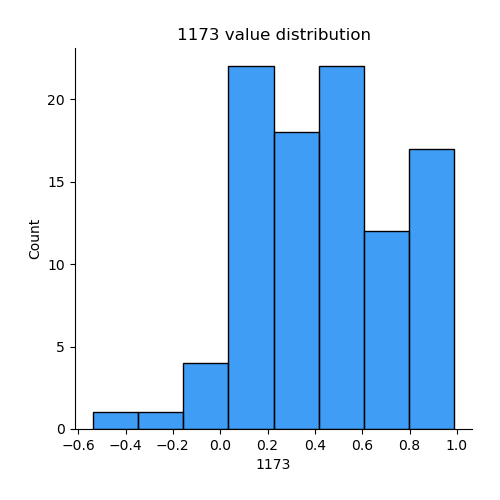
## Feature : 1174
- **Feature type** : continous
- **Missing** : 0.0%
- **Unique** : 97
- **Count** :97.0
- **Mean** :0.6530223375542148
- **Std** :0.23991394394954277
- **Min** :-0.09175419342715553
- **25%th Percentile** : 0.49329759261561584
- **50%th Percentile** : 0.6514697697047416
- **75%th Percentile** : 0.8536205524696602
- **Max** :0.9916474571956735

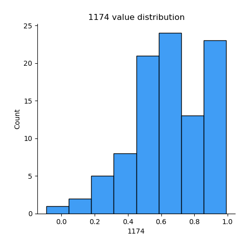
## Feature : 1175
- **Feature type** : continous
- **Missing** : 0.0%
- **Unique** : 97
- **Count** :97.0
- **Mean** :0.6181605820307617
- **Std** :0.2764666386626703
- **Min** :-0.21462242990427025
- **25%th Percentile** : 0.4419488388542414
- **50%th Percentile** : 0.6245503725811438
- **75%th Percentile** : 0.8342153268571282
- **Max** :0.9939399693248948

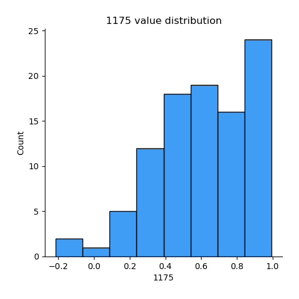
## Feature : 1176
- **Feature type** : continous
- **Missing** : 0.0%
- **Unique** : 97
- **Count** :97.0
- **Mean** :0.5895491397666311
- **Std** :0.2838537823638067
- **Min** :-0.19360995820688093
- **25%th Percentile** : 0.4207029917613638
- **50%th Percentile** : 0.5915793147097717
- **75%th Percentile** : 0.7874835471126839
- **Max** :0.9920359211601957

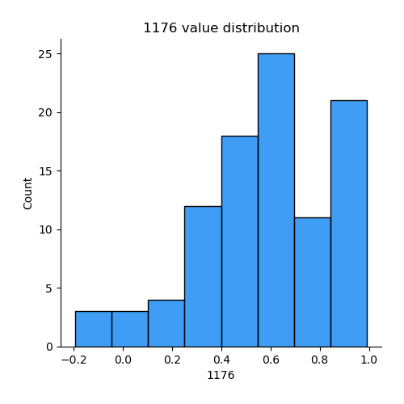
## Feature : 1177
- **Feature type** : continous
- **Missing** : 0.0%
- **Unique** : 97
- **Count** :97.0
- **Mean** :0.7227189570038619
- **Std** :0.23764899342669152
- **Min** :-0.020789397184249245
- **25%th Percentile** : 0.6117197788573561
- **50%th Percentile** : 0.7797038901702505
- **75%th Percentile** : 0.8851627662670531
- **Max** :0.9953183738831518

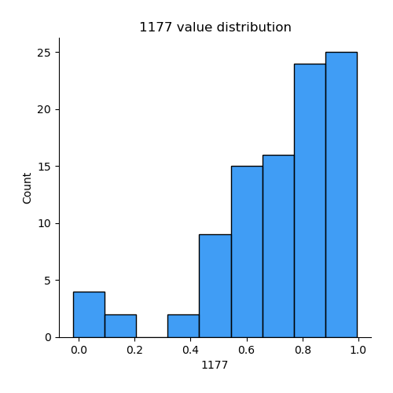
## Feature : 1178
- **Feature type** : continous
- **Missing** : 0.0%
- **Unique** : 97
- **Count** :97.0
- **Mean** :0.6255205963560561
- **Std** :0.2582652961671369
- **Min** :-0.24249726027765092
- **25%th Percentile** : 0.43389956359749926
- **50%th Percentile** : 0.6246636299690439
- **75%th Percentile** : 0.8096377632360804
- **Max** :0.9826980839329932

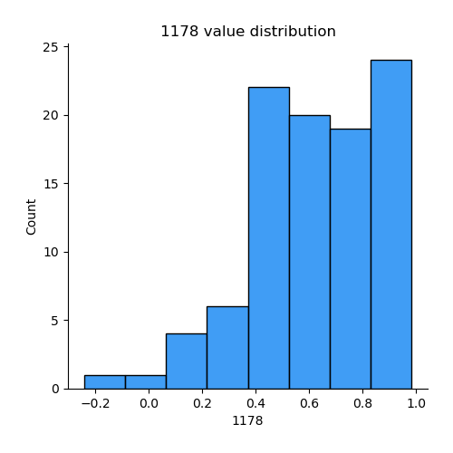
## Feature : 1179
- **Feature type** : continous
- **Missing** : 0.0%
- **Unique** : 97
- **Count** :97.0
- **Mean** :0.6038211888269541
- **Std** :0.25284649926134334
- **Min** :0.02213595058839772
- **25%th Percentile** : 0.4432203333903524
- **50%th Percentile** : 0.5930856356730779
- **75%th Percentile** : 0.8024910502332295
- **Max** :0.9897344992732385

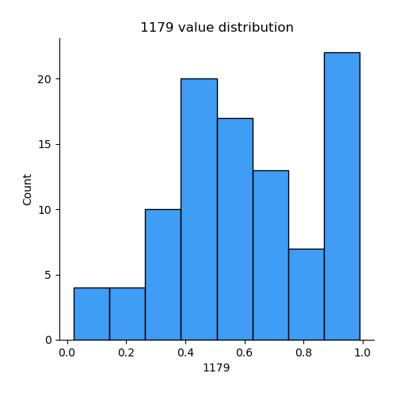
## Feature : 1180
- **Feature type** : continous
- **Missing** : 0.0%
- **Unique** : 97
- **Count** :97.0
- **Mean** :0.6420810969845849
- **Std** :0.24321804380183118
- **Min** :-0.08801172013160083
- **25%th Percentile** : 0.47654590008298375
- **50%th Percentile** : 0.6159168827800617
- **75%th Percentile** : 0.853666489484838
- **Max** :0.9892386493030639

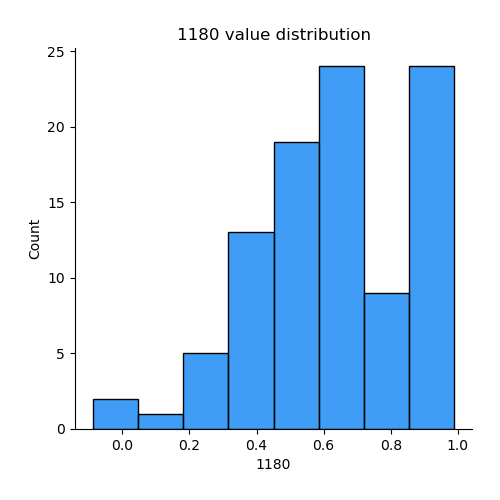
## Feature : 1181
- **Feature type** : continous
- **Missing** : 0.0%
- **Unique** : 97
- **Count** :97.0
- **Mean** :0.6690459161999257
- **Std** :0.28345095926401276
- **Min** :-0.32973895201791953
- **25%th Percentile** : 0.5387986308158548
- **50%th Percentile** : 0.7277682883930537
- **75%th Percentile** : 0.8666412778688634
- **Max** :0.9967090590088635

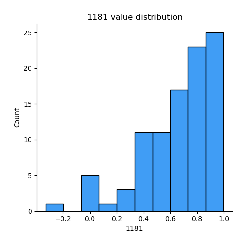
## Feature : 1182
- **Feature type** : continous
- **Missing** : 0.0%
- **Unique** : 97
- **Count** :97.0
- **Mean** :0.5307575164298493
- **Std** :0.3289180308481062
- **Min** :-0.31782098227759015
- **25%th Percentile** : 0.3222946941149578
- **50%th Percentile** : 0.5708410872488773
- **75%th Percentile** : 0.7743686392418407
- **Max** :0.9949729755037915

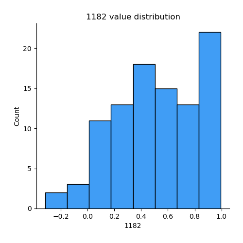
## Feature : 1183
- **Feature type** : continous
- **Missing** : 0.0%
- **Unique** : 97
- **Count** :97.0
- **Mean** :0.5602974822590426
- **Std** :0.2950868494366925
- **Min** :-0.25199230252149274
- **25%th Percentile** : 0.38760291711283174
- **50%th Percentile** : 0.5330171412288397
- **75%th Percentile** : 0.7394546129560157
- **Max** :0.9928497058307191

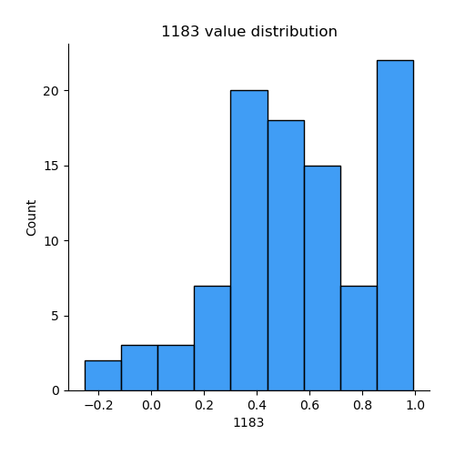
## Feature : 1184
- **Feature type** : continous
- **Missing** : 0.0%
- **Unique** : 97
- **Count** :97.0
- **Mean** :0.5990979799367873
- **Std** :0.2449414879433809
- **Min** :-0.0444080547831978
- **25%th Percentile** : 0.4433960401068087
- **50%th Percentile** : 0.5774969730810825
- **75%th Percentile** : 0.7900035927453164
- **Max** :0.9802513272464703

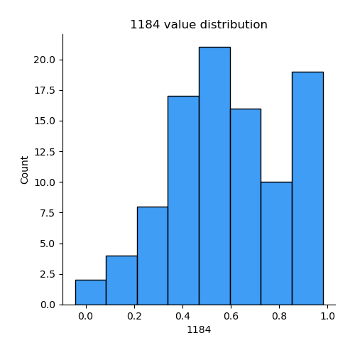
## Feature : 1185
- **Feature type** : continous
- **Missing** : 0.0%
- **Unique** : 97
- **Count** :97.0
- **Mean** :0.5868632246002248
- **Std** :0.3174674246092532
- **Min** :-0.3738699965337744
- **25%th Percentile** : 0.4406579290179742
- **50%th Percentile** : 0.5999628711303207
- **75%th Percentile** : 0.8176557807336382
- **Max** :0.994441255564983

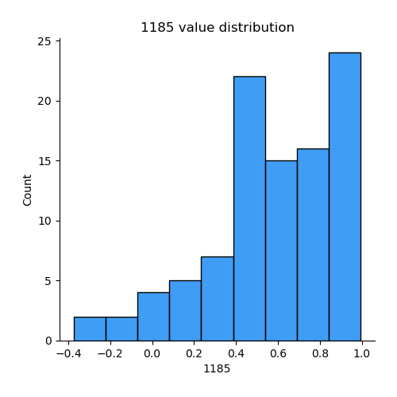
## Feature : 1186
- **Feature type** : continous
- **Missing** : 0.0%
- **Unique** : 97
- **Count** :97.0
- **Mean** :0.6266112576009198
- **Std** :0.2578933745406436
- **Min** :-0.084575397695843
- **25%th Percentile** : 0.4491645011812668
- **50%th Percentile** : 0.6253160762957899
- **75%th Percentile** : 0.8030137826892774
- **Max** :0.9924330629945595

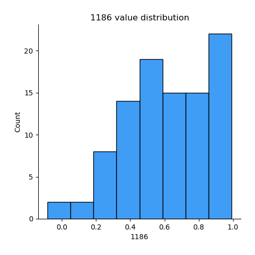
## Feature : 1187
- **Feature type** : continous
- **Missing** : 0.0%
- **Unique** : 97
- **Count** :97.0
- **Mean** :0.5857535920945676
- **Std** :0.3133855583204062
- **Min** :-0.18438961413800348
- **25%th Percentile** : 0.42414102538283066
- **50%th Percentile** : 0.5968873464665218
- **75%th Percentile** : 0.8207601768313734
- **Max** :0.9942405562878139

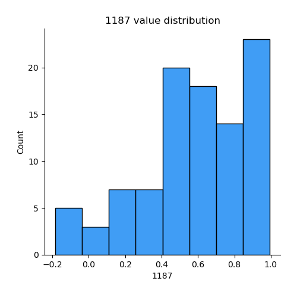
## Feature : 1188
- **Feature type** : continous
- **Missing** : 0.0%
- **Unique** : 97
- **Count** :97.0
- **Mean** :0.650133718469278
- **Std** :0.23941718072832419
- **Min** :-0.0729610816808713
- **25%th Percentile** : 0.4865233810050355
- **50%th Percentile** : 0.6403857699403324
- **75%th Percentile** : 0.8162269816531441
- **Max** :0.9907650459690239

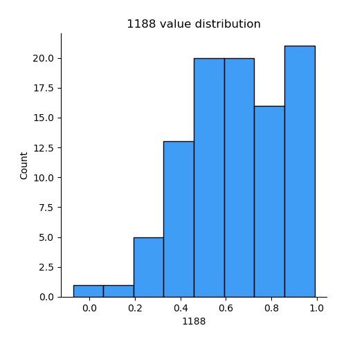
## Feature : 1189
- **Feature type** : continous
- **Missing** : 0.0%
- **Unique** : 97
- **Count** :97.0
- **Mean** :0.4924541854244318
- **Std** :0.32628152742207883
- **Min** :-0.40667733664767447
- **25%th Percentile** : 0.25210555244462196
- **50%th Percentile** : 0.4607140880117688
- **75%th Percentile** : 0.7317121865210309
- **Max** :0.9907513266145136

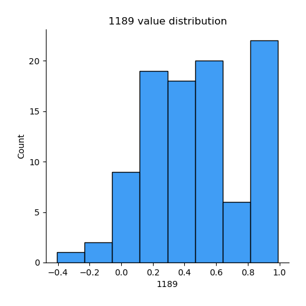
## Feature : 1190
- **Feature type** : continous
- **Missing** : 0.0%
- **Unique** : 97
- **Count** :97.0
- **Mean** :0.5596634241049167
- **Std** :0.33189112154647943
- **Min** :-0.28046353532001134
- **25%th Percentile** : 0.37521546775123116
- **50%th Percentile** : 0.5585992961382088
- **75%th Percentile** : 0.8053215978538861
- **Max** :0.9923556418108264

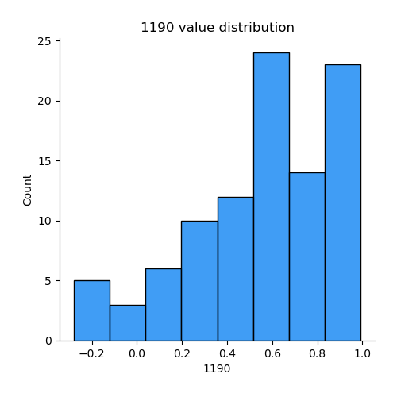
## Feature : 1191
- **Feature type** : continous
- **Missing** : 0.0%
- **Unique** : 97
- **Count** :97.0
- **Mean** :0.5827505385859747
- **Std** :0.2940242348793667
- **Min** :-0.17808976179968702
- **25%th Percentile** : 0.43257163190466524
- **50%th Percentile** : 0.5643121691910674
- **75%th Percentile** : 0.7818009379748165
- **Max** :0.9916402569979426

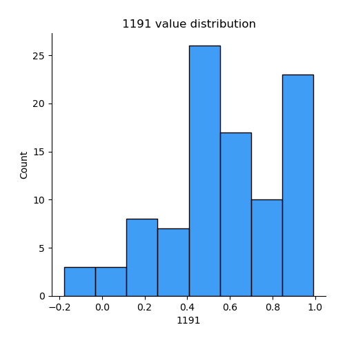
## Feature : 1192
- **Feature type** : continous
- **Missing** : 0.0%
- **Unique** : 97
- **Count** :97.0
- **Mean** :0.7859111636726803
- **Std** :0.2526244066337408
- **Min** :-0.21293379883663757
- **25%th Percentile** : 0.7573414926139317
- **50%th Percentile** : 0.8531988756275009
- **75%th Percentile** : 0.953457036037529
- **Max** :0.9979128678710405

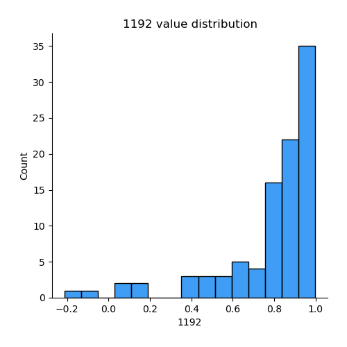
## Feature : 1193
- **Feature type** : continous
- **Missing** : 0.0%
- **Unique** : 97
- **Count** :97.0
- **Mean** :0.6181510963498565
- **Std** :0.3009009726330453
- **Min** :-0.4507081485555219
- **25%th Percentile** : 0.43004274726088626
- **50%th Percentile** : 0.6498031483871672
- **75%th Percentile** : 0.8629563522550561
- **Max** :0.9947530875311223

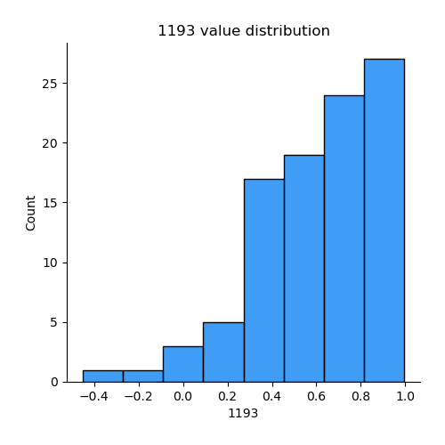
## Feature : 1194
- **Feature type** : continous
- **Missing** : 0.0%
- **Unique** : 97
- **Count** :97.0
- **Mean** :0.5133841441822807
- **Std** :0.299378528179709
- **Min** :-0.2974044266198436
- **25%th Percentile** : 0.29297079178506275
- **50%th Percentile** : 0.5138960380917422
- **75%th Percentile** : 0.7197880584376678
- **Max** :0.991494286401027

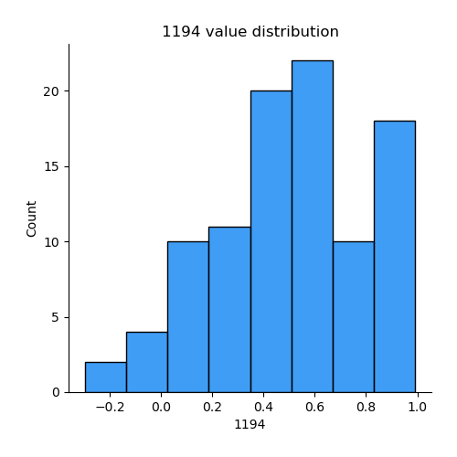
## Feature : 1195
- **Feature type** : continous
- **Missing** : 0.0%
- **Unique** : 97
- **Count** :97.0
- **Mean** :0.6515029057496956
- **Std** :0.266808191451314
- **Min** :-0.044261861354220354
- **25%th Percentile** : 0.47712510329415964
- **50%th Percentile** : 0.6829483594243961
- **75%th Percentile** : 0.8750572385429931
- **Max** :0.994421877262464

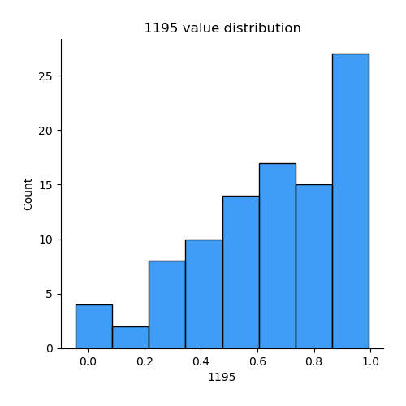
## Feature : 1219
- **Feature type** : continous
- **Missing** : 0.0%
- **Unique** : 3
- **Count** :97.0
- **Mean** :1.0
- **Std** :1.013490324081353e-16
- **Min** :0.9999999999999998
- **25%th Percentile** : 0.9999999999999999
- **50%th Percentile** : 1.0
- **75%th Percentile** : 1.0
- **Max** :1.0

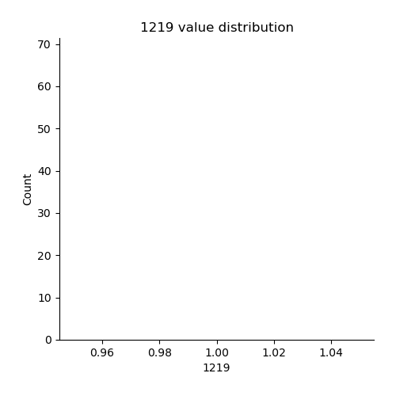
## Feature : 1220
- **Feature type** : continous
- **Missing** : 0.0%
- **Unique** : 97
- **Count** :97.0
- **Mean** :0.43025660537394295
- **Std** :0.31247239296702783
- **Min** :-0.17851296029869163
- **25%th Percentile** : 0.1868022624557302
- **50%th Percentile** : 0.39220577026707265
- **75%th Percentile** : 0.6170850107883478
- **Max** :0.9798258209964208

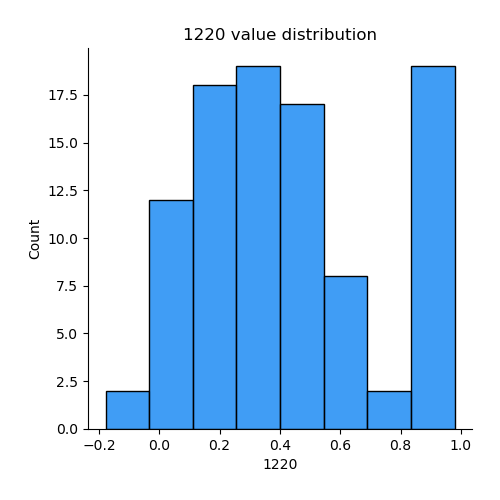
## Feature : 1221
- **Feature type** : continous
- **Missing** : 0.0%
- **Unique** : 97
- **Count** :97.0
- **Mean** :0.6830730497227782
- **Std** :0.201935480562507
- **Min** :0.22778900813066247
- **25%th Percentile** : 0.5396495322989372
- **50%th Percentile** : 0.6593418968531515
- **75%th Percentile** : 0.8333087220654152
- **Max** :0.9875752385448072

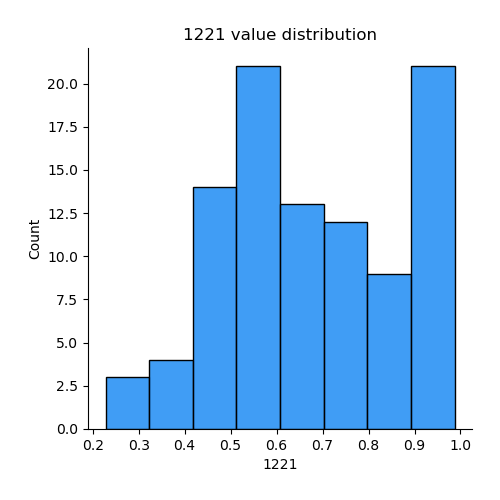
## Feature : 1222
- **Feature type** : continous
- **Missing** : 0.0%
- **Unique** : 97
- **Count** :97.0
- **Mean** :0.6088219394633846
- **Std** :0.2824695892357333
- **Min** :-0.26797519320529467
- **25%th Percentile** : 0.3990601705295252
- **50%th Percentile** : 0.6393431310607153
- **75%th Percentile** : 0.826960622596867
- **Max** :0.9937410108543374

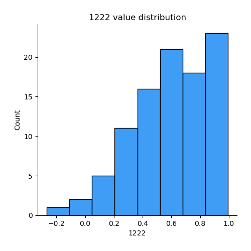
## Feature : 1223
- **Feature type** : continous
- **Missing** : 0.0%
- **Unique** : 97
- **Count** :97.0
- **Mean** :0.6718056569932828
- **Std** :0.22475865583893442
- **Min** :-0.061688966905252995
- **25%th Percentile** : 0.5475361402968947
- **50%th Percentile** : 0.6776831265228939
- **75%th Percentile** : 0.8036674195872932
- **Max** :0.9951578502809982

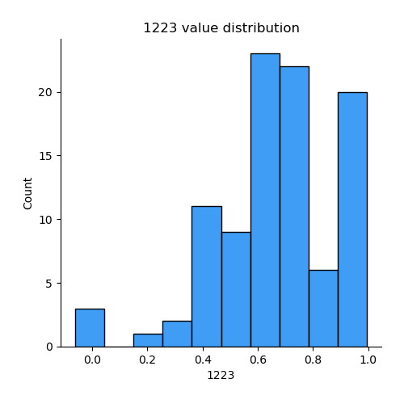
## Feature : 1224
- **Feature type** : continous
- **Missing** : 0.0%
- **Unique** : 97
- **Count** :97.0
- **Mean** :0.654968629772498
- **Std** :0.2178996941663511
- **Min** :0.12516358707283257
- **25%th Percentile** : 0.511067838850467
- **50%th Percentile** : 0.6204607775973804
- **75%th Percentile** : 0.8417308349894765
- **Max** :0.9900802332721935

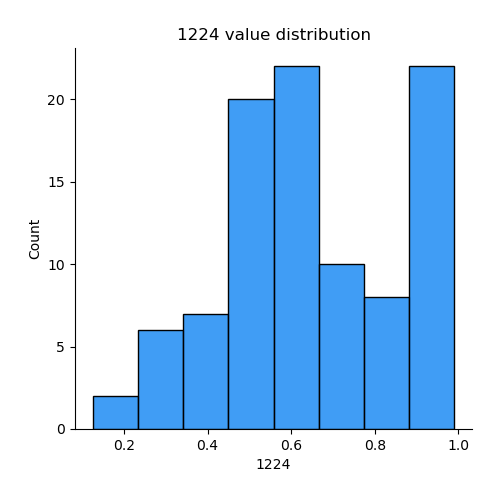
## Feature : 1225
- **Feature type** : continous
- **Missing** : 0.0%
- **Unique** : 97
- **Count** :97.0
- **Mean** :0.41470977850994883
- **Std** :0.31734495375836225
- **Min** :-0.32698180190614673
- **25%th Percentile** : 0.1929879637319937
- **50%th Percentile** : 0.3692493912025472
- **75%th Percentile** : 0.6322089707311839
- **Max** :0.9836302344713391

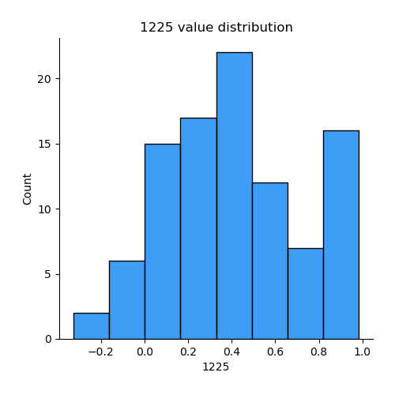
## Feature : 1226
- **Feature type** : continous
- **Missing** : 0.0%
- **Unique** : 97
- **Count** :97.0
- **Mean** :0.5969369869811016
- **Std** :0.2695687261607279
- **Min** :0.0450421572535316
- **25%th Percentile** : 0.41379610495860114
- **50%th Percentile** : 0.5941738474813522
- **75%th Percentile** : 0.8198883451142847
- **Max** :0.9946356081934964

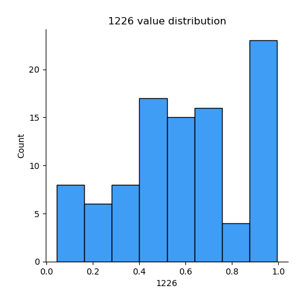
## Feature : 1227
- **Feature type** : continous
- **Missing** : 0.0%
- **Unique** : 97
- **Count** :97.0
- **Mean** :0.7162204803994536
- **Std** :0.22049104096081948
- **Min** :0.13233095486460805
- **25%th Percentile** : 0.5449179672112023
- **50%th Percentile** : 0.7432159717532679
- **75%th Percentile** : 0.9350253771908835
- **Max** :0.9962735778547728

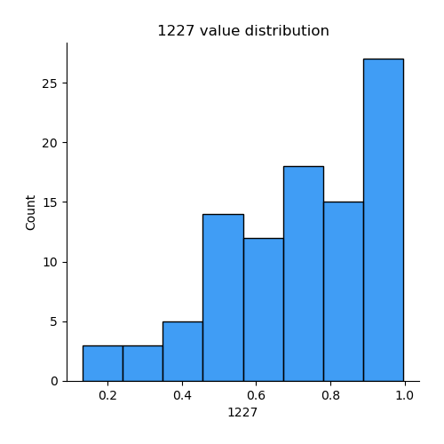
## Feature : 1228
- **Feature type** : continous
- **Missing** : 0.0%
- **Unique** : 97
- **Count** :97.0
- **Mean** :0.5699108713135073
- **Std** :0.29301327429285884
- **Min** :-0.08893178342381432
- **25%th Percentile** : 0.41069888917165215
- **50%th Percentile** : 0.5868768936612664
- **75%th Percentile** : 0.8048848444644098
- **Max** :0.9939530403230135

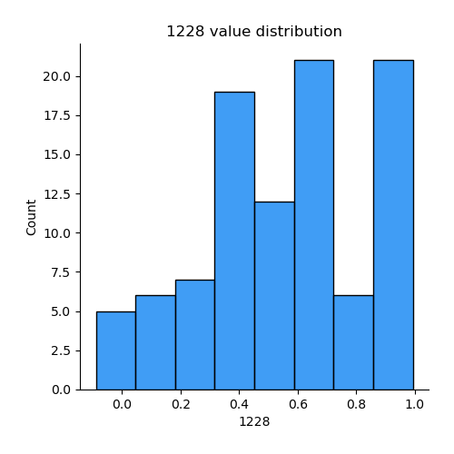
## Feature : 1229
- **Feature type** : continous
- **Missing** : 0.0%
- **Unique** : 97
- **Count** :97.0
- **Mean** :0.7184399645141463
- **Std** :0.21574229707025025
- **Min** :-0.0716225776067419
- **25%th Percentile** : 0.6024236017288414
- **50%th Percentile** : 0.7298935762378785
- **75%th Percentile** : 0.8543214359072709
- **Max** :0.995459584103132

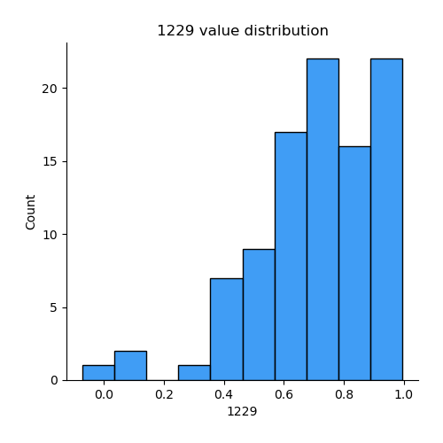
## Feature : 1230
- **Feature type** : continous
- **Missing** : 0.0%
- **Unique** : 97
- **Count** :97.0
- **Mean** :0.6454642101872751
- **Std** :0.2430921153265198
- **Min** :0.0785382044162449
- **25%th Percentile** : 0.4478079765841481
- **50%th Percentile** : 0.6498669457867328
- **75%th Percentile** : 0.8581156906019827
- **Max** :0.9862626974972676

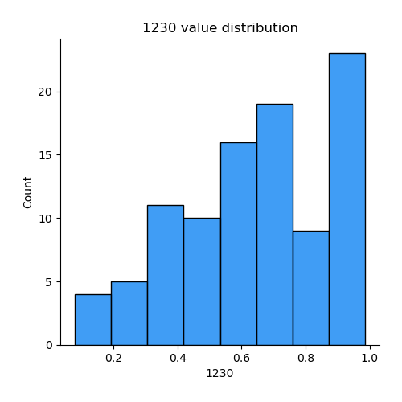
## Feature : 1231
- **Feature type** : continous
- **Missing** : 0.0%
- **Unique** : 97
- **Count** :97.0
- **Mean** :0.5942002187044365
- **Std** :0.24967384827015274
- **Min** :-0.012086719282663924
- **25%th Percentile** : 0.4188580380976846
- **50%th Percentile** : 0.5748225580922581
- **75%th Percentile** : 0.7679465226496215
- **Max** :0.9863830129699708

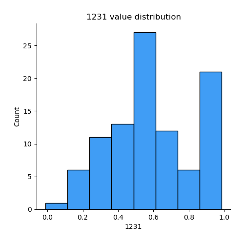
## Feature : 1232
- **Feature type** : continous
- **Missing** : 0.0%
- **Unique** : 97
- **Count** :97.0
- **Mean** :0.6335105837154406
- **Std** :0.22781086133480843
- **Min** :0.033791298876070304
- **25%th Percentile** : 0.482891831577078
- **50%th Percentile** : 0.6019045982671186
- **75%th Percentile** : 0.8388188407007192
- **Max** :0.9946795431472257

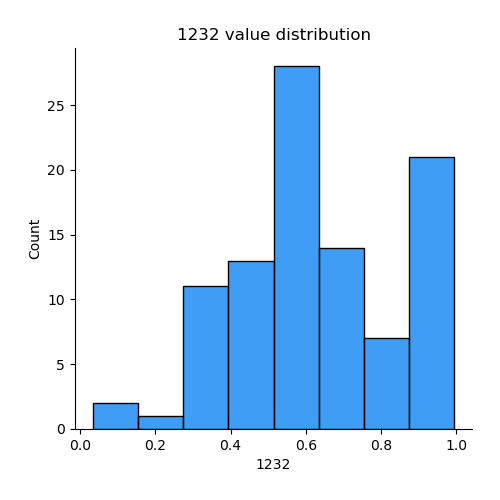
## Feature : 1233
- **Feature type** : continous
- **Missing** : 0.0%
- **Unique** : 97
- **Count** :97.0
- **Mean** :0.5823774449929356
- **Std** :0.31083489243836554
- **Min** :-0.32161155110398715
- **25%th Percentile** : 0.4105641752861894
- **50%th Percentile** : 0.6159298034765572
- **75%th Percentile** : 0.8256183404058179
- **Max** :0.9936406337486108

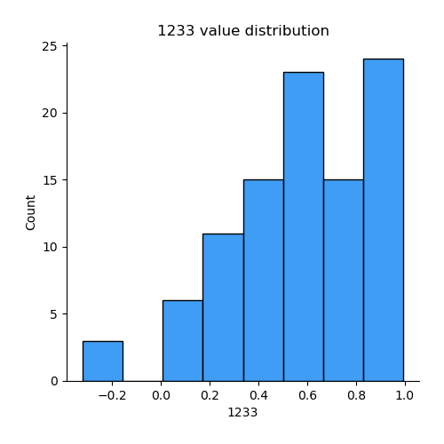
## Feature : 1234
- **Feature type** : continous
- **Missing** : 0.0%
- **Unique** : 97
- **Count** :97.0
- **Mean** :0.6487980858441009
- **Std** :0.2432099842871347
- **Min** :-0.015539380091353073
- **25%th Percentile** : 0.5030334654541403
- **50%th Percentile** : 0.6362585721439146
- **75%th Percentile** : 0.8042461609911888
- **Max** :0.9949409214565987

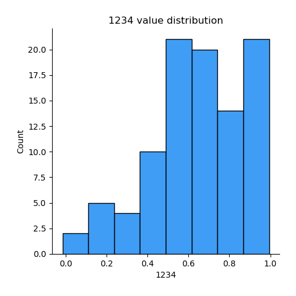
## Feature : 1235
- **Feature type** : continous
- **Missing** : 0.0%
- **Unique** : 97
- **Count** :97.0
- **Mean** :0.4955906030908831
- **Std** :0.3121494308929129
- **Min** :-0.29700993785736646
- **25%th Percentile** : 0.2708238234350682
- **50%th Percentile** : 0.4635952137990445
- **75%th Percentile** : 0.7221965935597965
- **Max** :0.9910203188362874

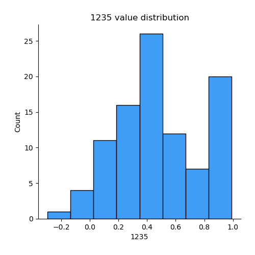
## Feature : 1236
- **Feature type** : continous
- **Missing** : 0.0%
- **Unique** : 97
- **Count** :97.0
- **Mean** :0.6338107320500787
- **Std** :0.20931993957140058
- **Min** :0.1429680262825846
- **25%th Percentile** : 0.4895401200576918
- **50%th Percentile** : 0.598441324801751
- **75%th Percentile** : 0.7998395814683297
- **Max** :0.9903325852802398

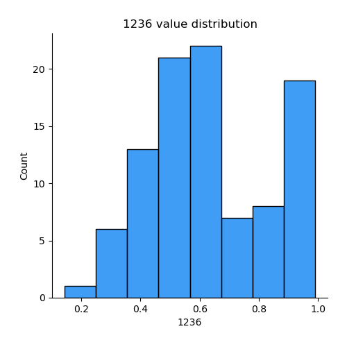
## Feature : 1237
- **Feature type** : continous
- **Missing** : 0.0%
- **Unique** : 97
- **Count** :97.0
- **Mean** :0.6655698894935885
- **Std** :0.2604854206490926
- **Min** :-0.3244567143245025
- **25%th Percentile** : 0.5311560463129481
- **50%th Percentile** : 0.6847393245978115
- **75%th Percentile** : 0.8528471023866033
- **Max** :0.9964465647887647

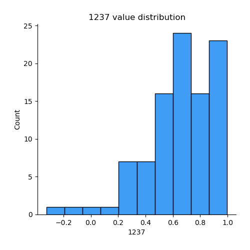
## Feature : 1238
- **Feature type** : continous
- **Missing** : 0.0%
- **Unique** : 97
- **Count** :97.0
- **Mean** :0.7610618457122013
- **Std** :0.16710063322425908
- **Min** :0.14766569766886908
- **25%th Percentile** : 0.6560141183395379
- **50%th Percentile** : 0.7588850141521728
- **75%th Percentile** : 0.8873863066459068
- **Max** :0.9954452780813257

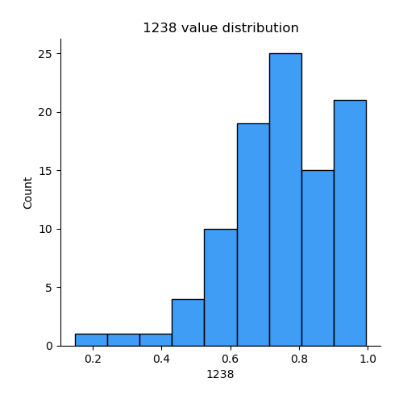
## Feature : 1239
- **Feature type** : continous
- **Missing** : 0.0%
- **Unique** : 97
- **Count** :97.0
- **Mean** :0.6992534109171965
- **Std** :0.23817819662537087
- **Min** :-0.16718636735309325
- **25%th Percentile** : 0.5935949468783778
- **50%th Percentile** : 0.7148450589507774
- **75%th Percentile** : 0.8352410395308394
- **Max** :0.9964819880600438

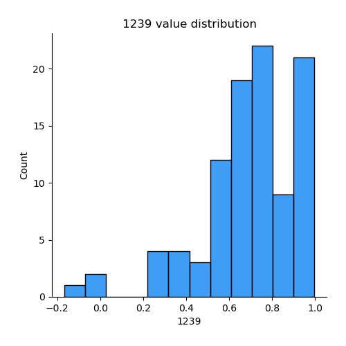
## Feature : 1240
- **Feature type** : continous
- **Missing** : 0.0%
- **Unique** : 97
- **Count** :97.0
- **Mean** :0.7563037496924562
- **Std** :0.17267162922322254
- **Min** :0.35960095323194846
- **25%th Percentile** : 0.63696635642524
- **50%th Percentile** : 0.7451371886276054
- **75%th Percentile** : 0.913006113030899
- **Max** :0.9928567803584183

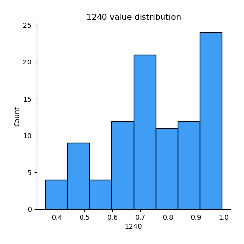
## Feature : 1241
- **Feature type** : continous
- **Missing** : 0.0%
- **Unique** : 97
- **Count** :97.0
- **Mean** :0.4939140994026384
- **Std** :0.3182301133252317
- **Min** :-0.28373463665620635
- **25%th Percentile** : 0.2493488850067891
- **50%th Percentile** : 0.44452560414739306
- **75%th Percentile** : 0.7237280251415791
- **Max** :0.9914789723157293

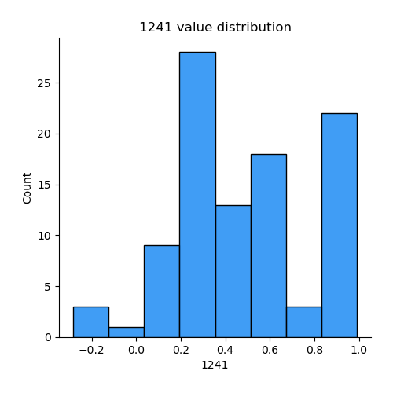
## Feature : 1242
- **Feature type** : continous
- **Missing** : 0.0%
- **Unique** : 97
- **Count** :97.0
- **Mean** :0.6630767233177972
- **Std** :0.26300155412721443
- **Min** :-0.2689796549432512
- **25%th Percentile** : 0.4995978915952907
- **50%th Percentile** : 0.6760819550976764
- **75%th Percentile** : 0.8613634427237452
- **Max** :0.9957876361065107

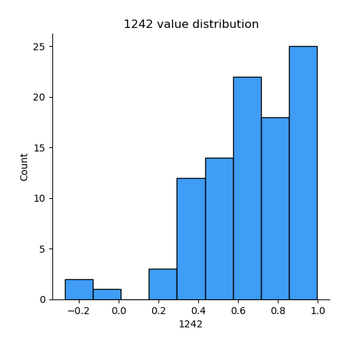
## Feature : 1243
- **Feature type** : continous
- **Missing** : 0.0%
- **Unique** : 97
- **Count** :97.0
- **Mean** :0.7388603932302179
- **Std** :0.19353351699474533
- **Min** :0.1392418437802179
- **25%th Percentile** : 0.6172865684844421
- **50%th Percentile** : 0.7614620715482793
- **75%th Percentile** : 0.8736249298199767
- **Max** :0.9959034389209719

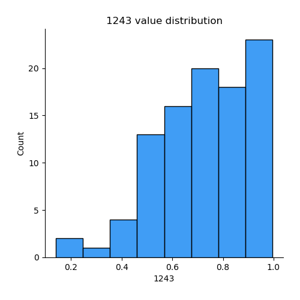
## Feature : 1244
- **Feature type** : continous
- **Missing** : 0.0%
- **Unique** : 97
- **Count** :97.0
- **Mean** :0.6330504657642145
- **Std** :0.27791616480881476
- **Min** :-0.2772483051730515
- **25%th Percentile** : 0.45812013580871813
- **50%th Percentile** : 0.6439160902444637
- **75%th Percentile** : 0.834201269244375
- **Max** :0.9924830303676654

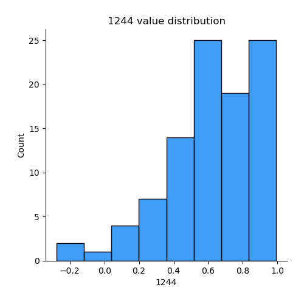
## Feature : 1245
- **Feature type** : continous
- **Missing** : 0.0%
- **Unique** : 97
- **Count** :97.0
- **Mean** :0.7990133159307817
- **Std** :0.20209004283187876
- **Min** :-0.015771897622736387
- **25%th Percentile** : 0.7454387867480881
- **50%th Percentile** : 0.846967601957217
- **75%th Percentile** : 0.9278100443308147
- **Max** :0.9972368580079748

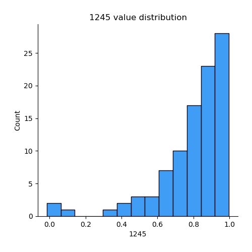
## Feature : 1246
- **Feature type** : continous
- **Missing** : 0.0%
- **Unique** : 97
- **Count** :97.0
- **Mean** :0.3898610329143434
- **Std** :0.3350999426385432
- **Min** :-0.4953488304088143
- **25%th Percentile** : 0.14445596368242858
- **50%th Percentile** : 0.33812828932746186
- **75%th Percentile** : 0.5626535045010536
- **Max** :0.9824751015864382

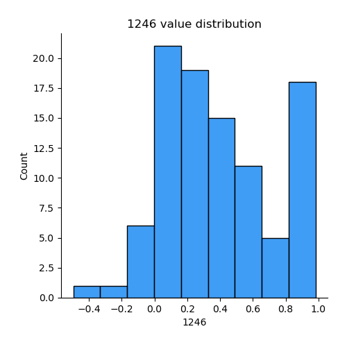
## Feature : 1247
- **Feature type** : continous
- **Missing** : 0.0%
- **Unique** : 97
- **Count** :97.0
- **Mean** :0.561439046593768
- **Std** :0.278672769895897
- **Min** :0.04729240964787356
- **25%th Percentile** : 0.35313552954692107
- **50%th Percentile** : 0.5486828538644812
- **75%th Percentile** : 0.7957747707394975
- **Max** :0.9929506245845039

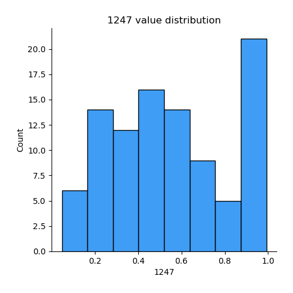
## Feature : 1272
- **Feature type** : continous
- **Missing** : 0.0%
- **Unique** : 3
- **Count** :97.0
- **Mean** :1.0
- **Std** :7.601177430610147e-17
- **Min** :0.9999999999999998
- **25%th Percentile** : 0.9999999999999999
- **50%th Percentile** : 1.0
- **75%th Percentile** : 1.0
- **Max** :1.0

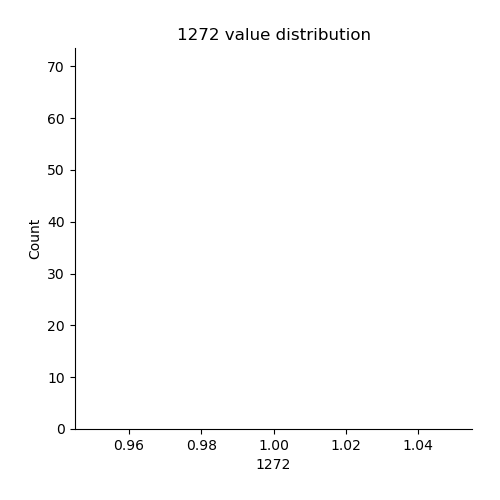
## Feature : 1273
- **Feature type** : continous
- **Missing** : 0.0%
- **Unique** : 97
- **Count** :97.0
- **Mean** :0.4675468847325682
- **Std** :0.29612910043639507
- **Min** :-0.08697690576797752
- **25%th Percentile** : 0.27872654305727623
- **50%th Percentile** : 0.40788728685771564
- **75%th Percentile** : 0.6873585387354287
- **Max** :0.9886788799163349

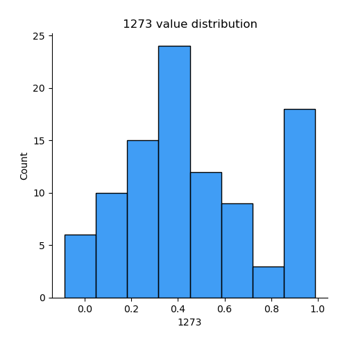
## Feature : 1274
- **Feature type** : continous
- **Missing** : 0.0%
- **Unique** : 97
- **Count** :97.0
- **Mean** :0.43365579210129246
- **Std** :0.3127732430636286
- **Min** :-0.2491066979583375
- **25%th Percentile** : 0.19715086765718953
- **50%th Percentile** : 0.37836825116374423
- **75%th Percentile** : 0.6194429466210598
- **Max** :0.9733196270026303

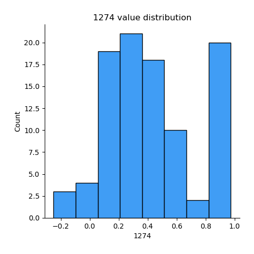
## Feature : 1275
- **Feature type** : continous
- **Missing** : 0.0%
- **Unique** : 97
- **Count** :97.0
- **Mean** :0.4355716704582954
- **Std** :0.29660324744812216
- **Min** :-0.06911218717407014
- **25%th Percentile** : 0.22031075829628163
- **50%th Percentile** : 0.35001730277640225
- **75%th Percentile** : 0.5749727447854983
- **Max** :0.9794204008833831

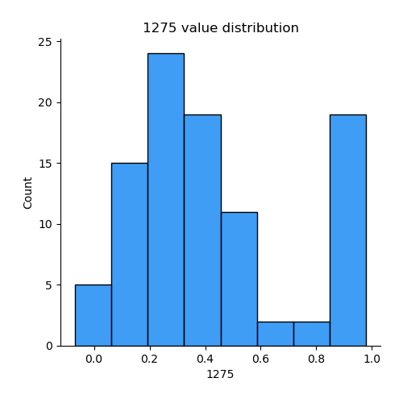
## Feature : 1276
- **Feature type** : continous
- **Missing** : 0.0%
- **Unique** : 97
- **Count** :97.0
- **Mean** :0.43191669916194514
- **Std** :0.3054722922589857
- **Min** :-0.13282603377599703
- **25%th Percentile** : 0.2232882416943247
- **50%th Percentile** : 0.3681379904588245
- **75%th Percentile** : 0.6151414146169079
- **Max** :0.9725785626003993

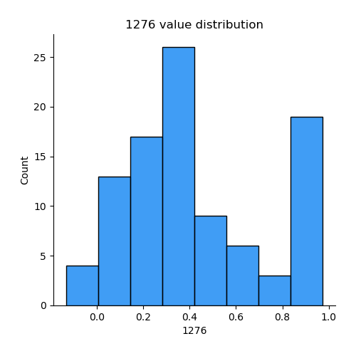
## Feature : 1277
- **Feature type** : continous
- **Missing** : 0.0%
- **Unique** : 97
- **Count** :97.0
- **Mean** :0.5629394390097625
- **Std** :0.31506174248324
- **Min** :-0.18703136408354895
- **25%th Percentile** : 0.32678417220086275
- **50%th Percentile** : 0.6266918995909274
- **75%th Percentile** : 0.832001611349884
- **Max** :0.9850503634824532

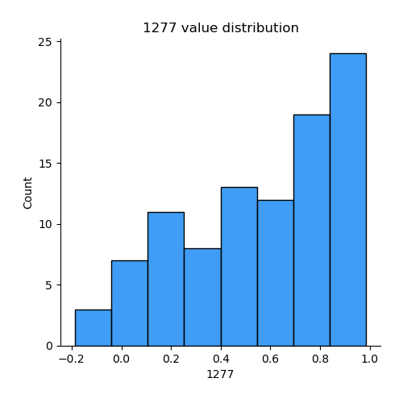
## Feature : 1278
- **Feature type** : continous
- **Missing** : 0.0%
- **Unique** : 97
- **Count** :97.0
- **Mean** :0.5505606710657974
- **Std** :0.26470694335472694
- **Min** :-0.3379218970046118
- **25%th Percentile** : 0.37350847312108015
- **50%th Percentile** : 0.5179032920481924
- **75%th Percentile** : 0.7365532856663606
- **Max** :0.9813765757510177

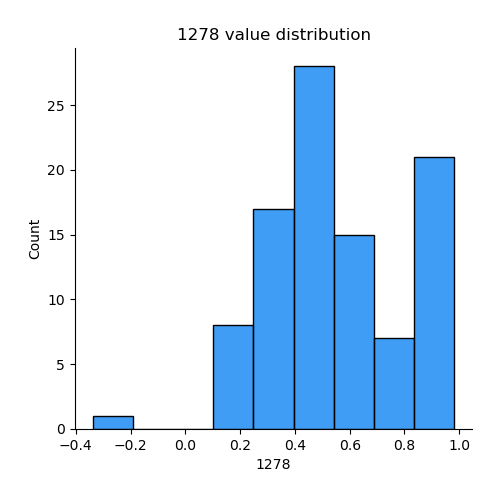
## Feature : 1279
- **Feature type** : continous
- **Missing** : 0.0%
- **Unique** : 97
- **Count** :97.0
- **Mean** :0.44922972245827747
- **Std** :0.30031863419779586
- **Min** :-0.18142197046837372
- **25%th Percentile** : 0.2574911495020216
- **50%th Percentile** : 0.3829446697712519
- **75%th Percentile** : 0.6151777975850528
- **Max** :0.9704237577356838

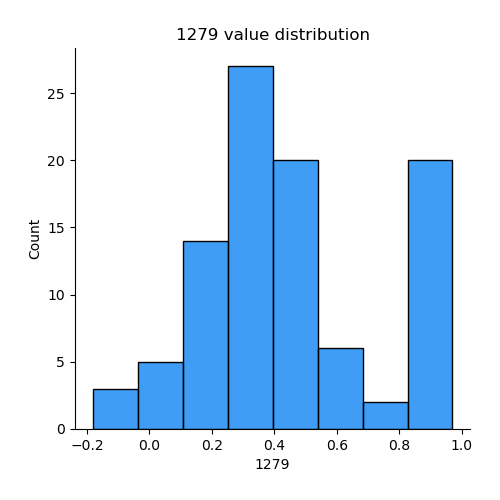
## Feature : 1280
- **Feature type** : continous
- **Missing** : 0.0%
- **Unique** : 97
- **Count** :97.0
- **Mean** :0.558824992981564
- **Std** :0.2635278071146456
- **Min** :-0.03491946604100573
- **25%th Percentile** : 0.38146742011715534
- **50%th Percentile** : 0.5309479197953502
- **75%th Percentile** : 0.7021136399577597
- **Max** :0.9844778734263632

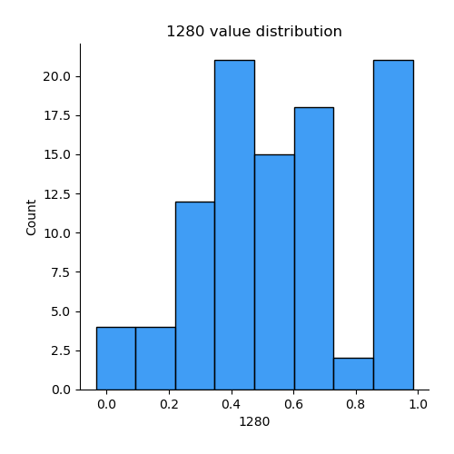
## Feature : 1281
- **Feature type** : continous
- **Missing** : 0.0%
- **Unique** : 97
- **Count** :97.0
- **Mean** :0.4958206858766958
- **Std** :0.2861699668427901
- **Min** :-0.0888127641678143
- **25%th Percentile** : 0.27897152277469245
- **50%th Percentile** : 0.44983402549983575
- **75%th Percentile** : 0.6908014989817434
- **Max** :0.9792672372236462

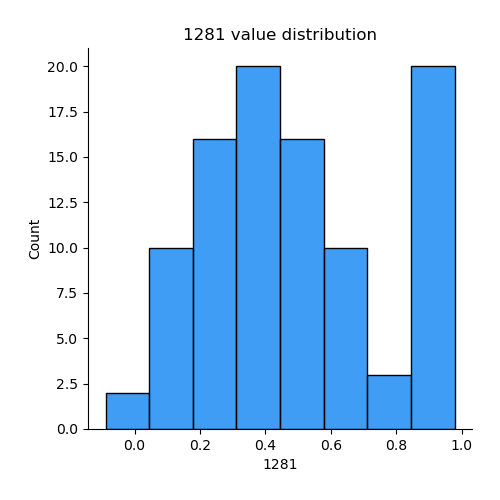
## Feature : 1282
- **Feature type** : continous
- **Missing** : 0.0%
- **Unique** : 97
- **Count** :97.0
- **Mean** :0.4598826807744394
- **Std** :0.3028442570180444
- **Min** :-0.20240971941050673
- **25%th Percentile** : 0.24530300886536327
- **50%th Percentile** : 0.39790150883041986
- **75%th Percentile** : 0.6636628487331072
- **Max** :0.9677148514627394

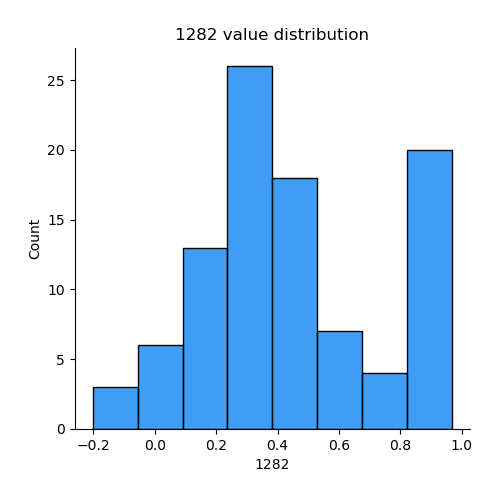
## Feature : 1283
- **Feature type** : continous
- **Missing** : 0.0%
- **Unique** : 97
- **Count** :97.0
- **Mean** :0.41556515924337223
- **Std** :0.3099440972453252
- **Min** :-0.21775250530687332
- **25%th Percentile** : 0.2144277873316909
- **50%th Percentile** : 0.3474529506428413
- **75%th Percentile** : 0.5693077456061348
- **Max** :0.9719516419044804

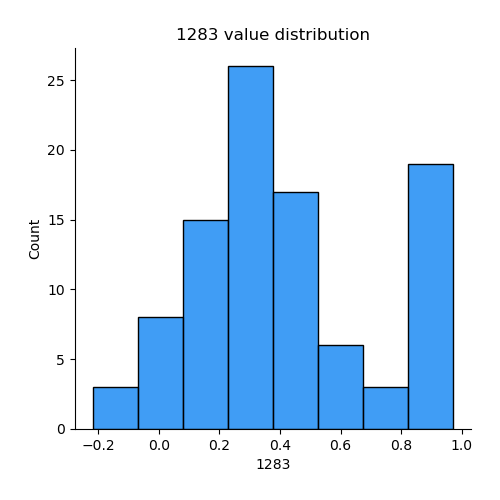
## Feature : 1284
- **Feature type** : continous
- **Missing** : 0.0%
- **Unique** : 97
- **Count** :97.0
- **Mean** :0.4471157907632569
- **Std** :0.29800136602138594
- **Min** :-0.04658725527669515
- **25%th Percentile** : 0.24840650517079227
- **50%th Percentile** : 0.3644894104448401
- **75%th Percentile** : 0.6110783505416882
- **Max** :0.9787604010509331

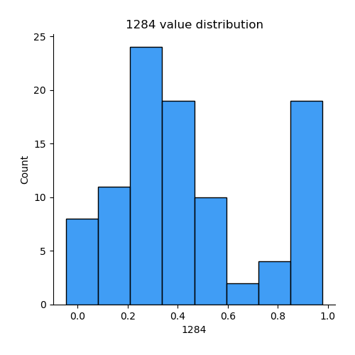
## Feature : 1285
- **Feature type** : continous
- **Missing** : 0.0%
- **Unique** : 97
- **Count** :97.0
- **Mean** :0.544585442466087
- **Std** :0.2611212847841006
- **Min** :-0.051693120082090004
- **25%th Percentile** : 0.36965952294612375
- **50%th Percentile** : 0.5046627212204926
- **75%th Percentile** : 0.6962220048301935
- **Max** :0.9856683091728319

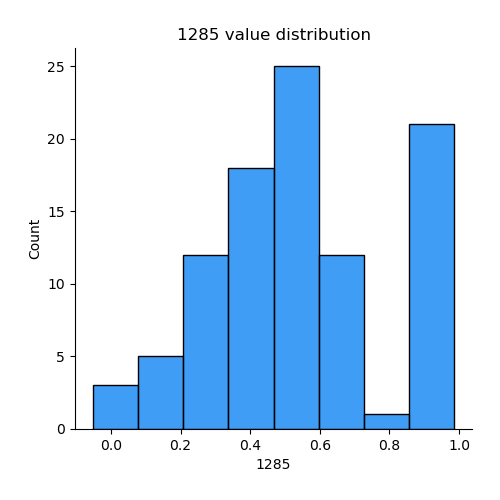
## Feature : 1286
- **Feature type** : continous
- **Missing** : 0.0%
- **Unique** : 97
- **Count** :97.0
- **Mean** :0.3686606794981518
- **Std** :0.3501769176657151
- **Min** :-0.5015633247248674
- **25%th Percentile** : 0.1124400130197728
- **50%th Percentile** : 0.2951144379983806
- **75%th Percentile** : 0.5818684957193164
- **Max** :0.9702203605406915

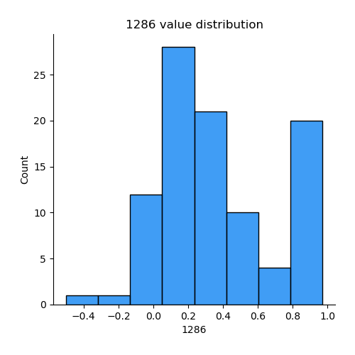
## Feature : 1287
- **Feature type** : continous
- **Missing** : 0.0%
- **Unique** : 97
- **Count** :97.0
- **Mean** :0.48754046679547436
- **Std** :0.31255984850782015
- **Min** :-0.461102826117666
- **25%th Percentile** : 0.27031486041848746
- **50%th Percentile** : 0.5100013092781619
- **75%th Percentile** : 0.6924405671440444
- **Max** :0.9788954835576807

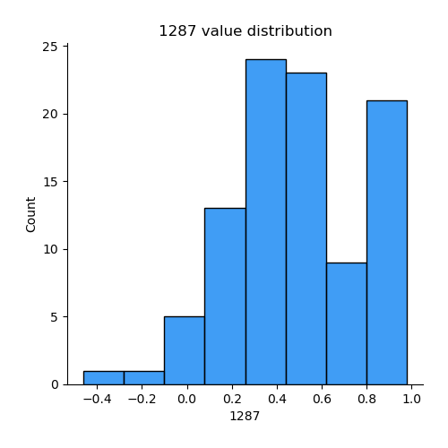
## Feature : 1288
- **Feature type** : continous
- **Missing** : 0.0%
- **Unique** : 97
- **Count** :97.0
- **Mean** :0.41199022742571756
- **Std** :0.3065067483984467
- **Min** :-0.19591885252504007
- **25%th Percentile** : 0.1955472187578715
- **50%th Percentile** : 0.33759784996711095
- **75%th Percentile** : 0.613719946680751
- **Max** :0.973236148161704

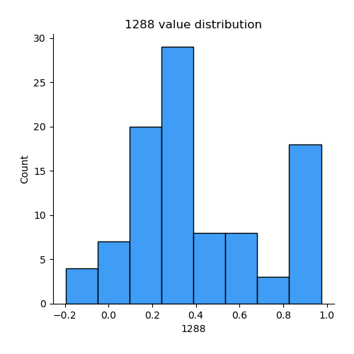
## Feature : 1289
- **Feature type** : continous
- **Missing** : 0.0%
- **Unique** : 97
- **Count** :97.0
- **Mean** :0.4147007878517632
- **Std** :0.32059176273806206
- **Min** :-0.19217853932852338
- **25%th Percentile** : 0.19946641426594344
- **50%th Percentile** : 0.3494544350522836
- **75%th Percentile** : 0.626848658775019
- **Max** :0.9833370114318126

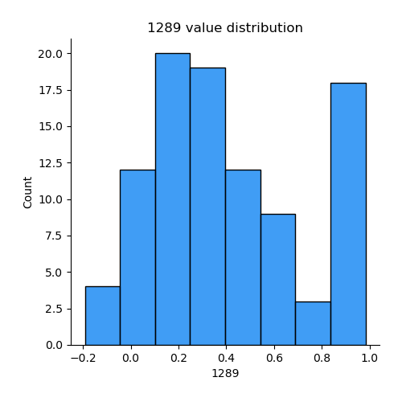
## Feature : 1290
- **Feature type** : continous
- **Missing** : 0.0%
- **Unique** : 97
- **Count** :97.0
- **Mean** :0.44786211388868136
- **Std** :0.30667649677793896
- **Min** :-0.4591291705029837
- **25%th Percentile** : 0.22717629916223178
- **50%th Percentile** : 0.3805015166944422
- **75%th Percentile** : 0.5917443958616238
- **Max** :0.9834695921747452

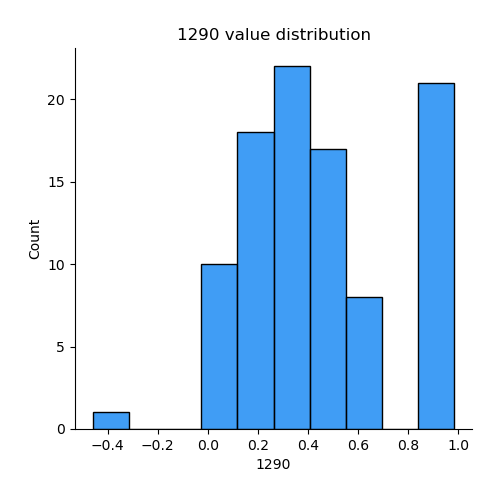
## Feature : 1291
- **Feature type** : continous
- **Missing** : 0.0%
- **Unique** : 97
- **Count** :97.0
- **Mean** :0.41532513038404956
- **Std** :0.3239521280361513
- **Min** :-0.2987876366194733
- **25%th Percentile** : 0.2173353771428861
- **50%th Percentile** : 0.3527641404786481
- **75%th Percentile** : 0.5970659305023954
- **Max** :0.9852362770520616

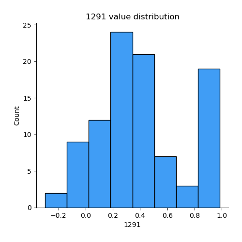
## Feature : 1292
- **Feature type** : continous
- **Missing** : 0.0%
- **Unique** : 97
- **Count** :97.0
- **Mean** :0.45718546630008233
- **Std** :0.30067338051827064
- **Min** :-0.2014983602839291
- **25%th Percentile** : 0.2548663921937324
- **50%th Percentile** : 0.4173624725257888
- **75%th Percentile** : 0.606776769899641
- **Max** :0.9684448252534981

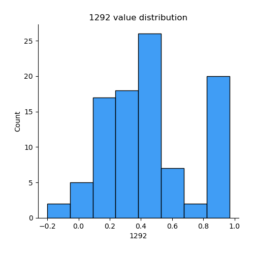
## Feature : 1293
- **Feature type** : continous
- **Missing** : 0.0%
- **Unique** : 97
- **Count** :97.0
- **Mean** :0.37682187898108904
- **Std** :0.3426618630526437
- **Min** :-0.33757770489530053
- **25%th Percentile** : 0.15161405514627938
- **50%th Percentile** : 0.2745073882483024
- **75%th Percentile** : 0.6204984953717743
- **Max** :0.9803772592435617

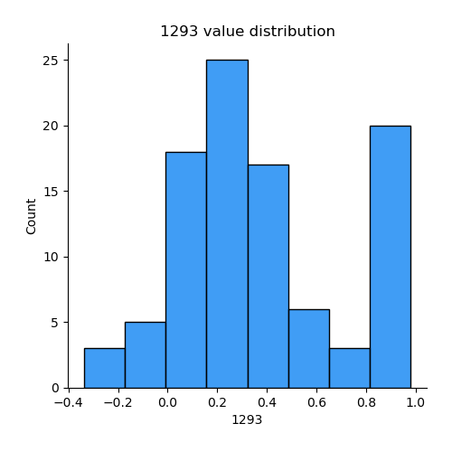
## Feature : 1294
- **Feature type** : continous
- **Missing** : 0.0%
- **Unique** : 97
- **Count** :97.0
- **Mean** :0.4463803390522921
- **Std** :0.3009463368876795
- **Min** :-0.11649358602621167
- **25%th Percentile** : 0.2288827507813047
- **50%th Percentile** : 0.38747930600510705
- **75%th Percentile** : 0.5810139459637832
- **Max** :0.9819414636387047

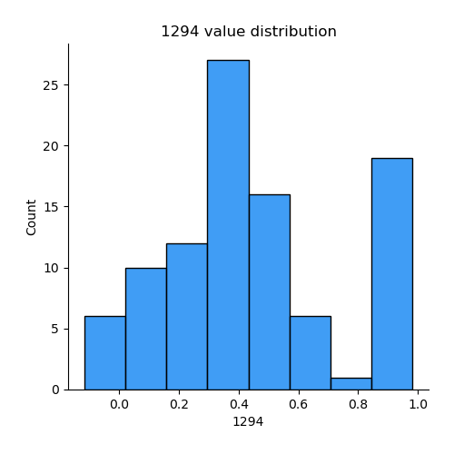
## Feature : 1295
- **Feature type** : continous
- **Missing** : 0.0%
- **Unique** : 97
- **Count** :97.0
- **Mean** :0.41834723313624017
- **Std** :0.31456090219463717
- **Min** :-0.13105769710010073
- **25%th Percentile** : 0.21059993040784158
- **50%th Percentile** : 0.34109425565256923
- **75%th Percentile** : 0.5830653165627669
- **Max** :0.9691406385371932

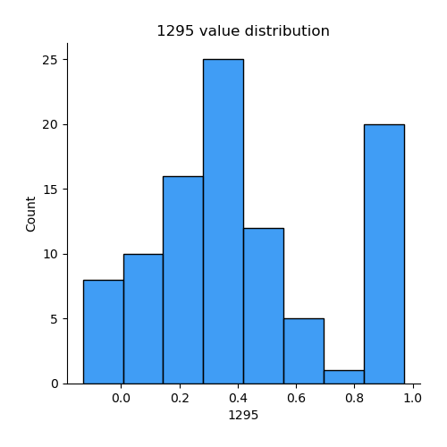
## Feature : 1296
- **Feature type** : continous
- **Missing** : 0.0%
- **Unique** : 97
- **Count** :97.0
- **Mean** :0.5480359282165516
- **Std** :0.2637060255141926
- **Min** :-0.09633894726996253
- **25%th Percentile** : 0.3304740198765036
- **50%th Percentile** : 0.5202764585258854
- **75%th Percentile** : 0.7025161415063206
- **Max** :0.9885517980667957

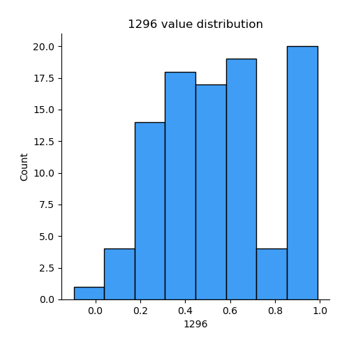
## Feature : 1297
- **Feature type** : continous
- **Missing** : 0.0%
- **Unique** : 97
- **Count** :97.0
- **Mean** :0.4203707447387598
- **Std** :0.31686249153455825
- **Min** :-0.11291254718820491
- **25%th Percentile** : 0.1838527333834781
- **50%th Percentile** : 0.35801973025150213
- **75%th Percentile** : 0.6030598036774432
- **Max** :0.9755503940710647

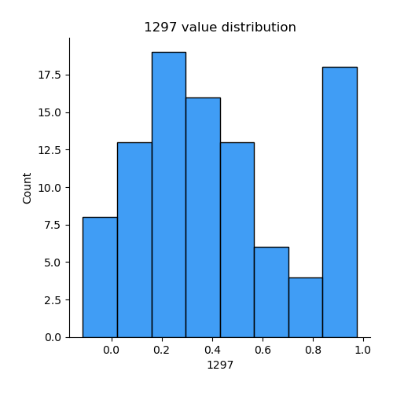
## Feature : 1298
- **Feature type** : continous
- **Missing** : 0.0%
- **Unique** : 97
- **Count** :97.0
- **Mean** :0.6237601659915433
- **Std** :0.3087875366443498
- **Min** :-0.5299311841560969
- **25%th Percentile** : 0.452016270051351
- **50%th Percentile** : 0.7031644936995358
- **75%th Percentile** : 0.8469444596455408
- **Max** :0.9904640683366823

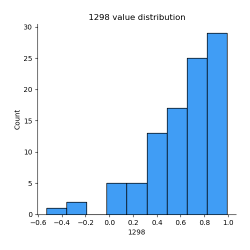
## Feature : 1299
- **Feature type** : continous
- **Missing** : 0.0%
- **Unique** : 97
- **Count** :97.0
- **Mean** :0.41882126914136675
- **Std** :0.3245178377275142
- **Min** :-0.16639278391160678
- **25%th Percentile** : 0.1769865837030916
- **50%th Percentile** : 0.35646489962065464
- **75%th Percentile** : 0.6506569551766499
- **Max** :0.9796670152351036

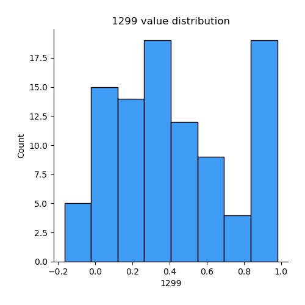
## Feature : 1325
- **Feature type** : continous
- **Missing** : 0.0%
- **Unique** : 3
- **Count** :97.0
- **Mean** :1.0
- **Std** :7.68517089126034e-17
- **Min** :0.9999999999999998
- **25%th Percentile** : 1.0
- **50%th Percentile** : 1.0
- **75%th Percentile** : 1.0
- **Max** :1.0

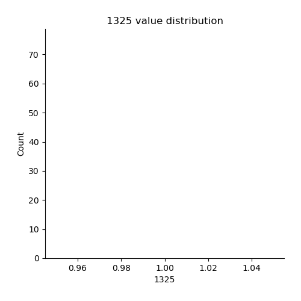
## Feature : 1326
- **Feature type** : continous
- **Missing** : 0.0%
- **Unique** : 97
- **Count** :97.0
- **Mean** :0.579363116233385
- **Std** :0.2655434740652821
- **Min** :-0.2074157478427533
- **25%th Percentile** : 0.441889184858296
- **50%th Percentile** : 0.5589668846138254
- **75%th Percentile** : 0.7323485482659321
- **Max** :0.9842888416266778

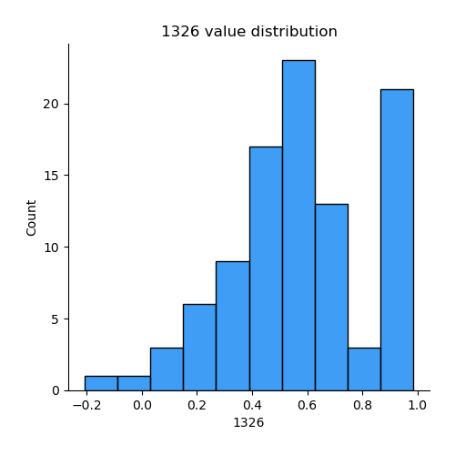
## Feature : 1327
- **Feature type** : continous
- **Missing** : 0.0%
- **Unique** : 97
- **Count** :97.0
- **Mean** :0.5709795210708187
- **Std** :0.2675242730650647
- **Min** :-0.10002884211355362
- **25%th Percentile** : 0.39153994843529355
- **50%th Percentile** : 0.5548109410695873
- **75%th Percentile** : 0.7543535062019948
- **Max** :0.9904993195361321

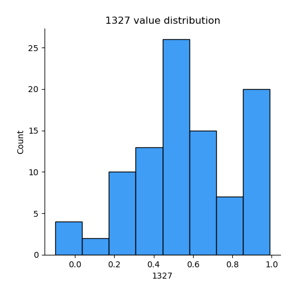
## Feature : 1328
- **Feature type** : continous
- **Missing** : 0.0%
- **Unique** : 97
- **Count** :97.0
- **Mean** :0.5843788483909406
- **Std** :0.2553571886512913
- **Min** :0.05847250781088162
- **25%th Percentile** : 0.4176873824382235
- **50%th Percentile** : 0.57182835568207
- **75%th Percentile** : 0.7657082699654579
- **Max** :0.9812904160546199

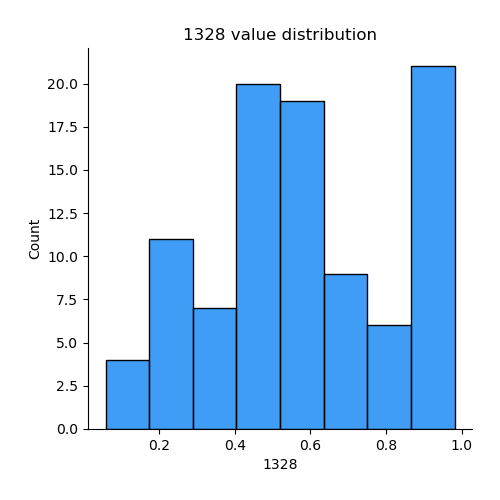
## Feature : 1329
- **Feature type** : continous
- **Missing** : 0.0%
- **Unique** : 97
- **Count** :97.0
- **Mean** :0.43978772291709356
- **Std** :0.30107135222208675
- **Min** :-0.5959227250191899
- **25%th Percentile** : 0.22914131705010204
- **50%th Percentile** : 0.3819205267639916
- **75%th Percentile** : 0.6068744284837154
- **Max** :0.9799147273165099

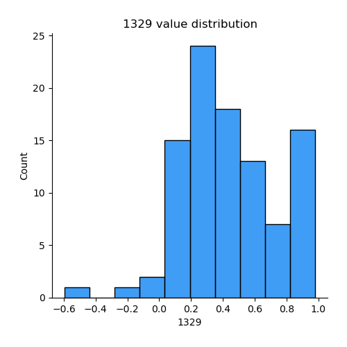
## Feature : 1330
- **Feature type** : continous
- **Missing** : 0.0%
- **Unique** : 97
- **Count** :97.0
- **Mean** :0.5778476724014768
- **Std** :0.254744544799611
- **Min** :0.057120866915480746
- **25%th Percentile** : 0.399042185801675
- **50%th Percentile** : 0.5297971258858224
- **75%th Percentile** : 0.780556016900402
- **Max** :0.9824631562392797

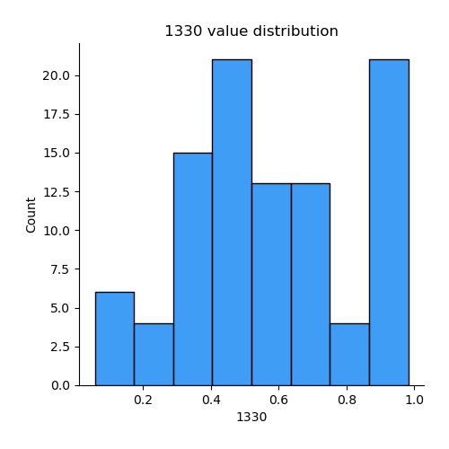
## Feature : 1331
- **Feature type** : continous
- **Missing** : 0.0%
- **Unique** : 97
- **Count** :97.0
- **Mean** :0.5673638913900413
- **Std** :0.270523612832247
- **Min** :-0.08357721635125977
- **25%th Percentile** : 0.37761246078847605
- **50%th Percentile** : 0.5317925758757058
- **75%th Percentile** : 0.7666442873258914
- **Max** :0.9868408613597122

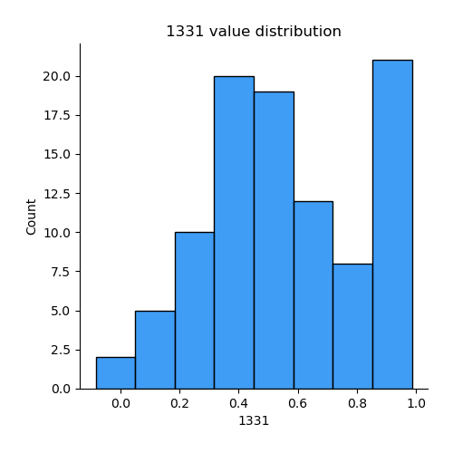
## Feature : 1332
- **Feature type** : continous
- **Missing** : 0.0%
- **Unique** : 97
- **Count** :97.0
- **Mean** :0.5272547647968272
- **Std** :0.28342136629742576
- **Min** :-0.10455185063218886
- **25%th Percentile** : 0.3276387228044038
- **50%th Percentile** : 0.49807471657509156
- **75%th Percentile** : 0.6833112489127217
- **Max** :0.9843264883222125

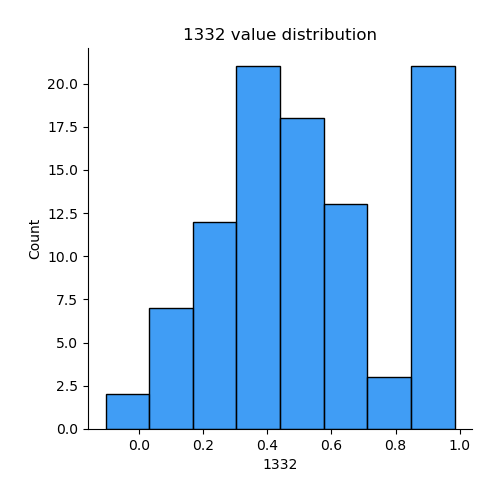
## Feature : 1333
- **Feature type** : continous
- **Missing** : 0.0%
- **Unique** : 97
- **Count** :97.0
- **Mean** :0.7055651627342712
- **Std** :0.21865690915650507
- **Min** :0.07867766976016569
- **25%th Percentile** : 0.5603766360807739
- **50%th Percentile** : 0.7232889423778384
- **75%th Percentile** : 0.8705484577235245
- **Max** :0.992297292692522

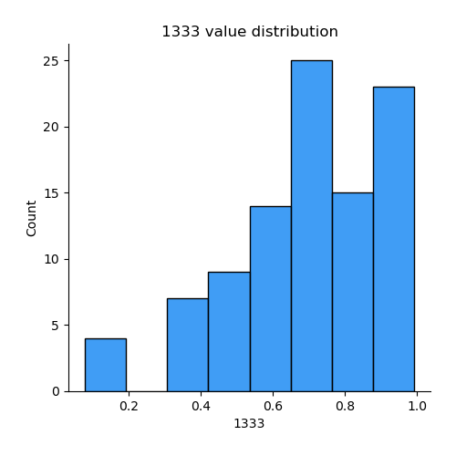
## Feature : 1334
- **Feature type** : continous
- **Missing** : 0.0%
- **Unique** : 97
- **Count** :97.0
- **Mean** :0.594723269372802
- **Std** :0.25553975670729256
- **Min** :-0.14345245902802564
- **25%th Percentile** : 0.4146222644978407
- **50%th Percentile** : 0.5658020910144834
- **75%th Percentile** : 0.7873297830411291
- **Max** :0.9785442665114811

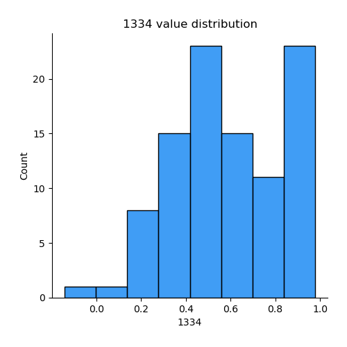
## Feature : 1335
- **Feature type** : continous
- **Missing** : 0.0%
- **Unique** : 97
- **Count** :97.0
- **Mean** :0.5355537653296663
- **Std** :0.26428914632366346
- **Min** :0.11374031295834712
- **25%th Percentile** : 0.34195385670367384
- **50%th Percentile** : 0.45586078523627044
- **75%th Percentile** : 0.7294377979124262
- **Max** :0.9848565557176058

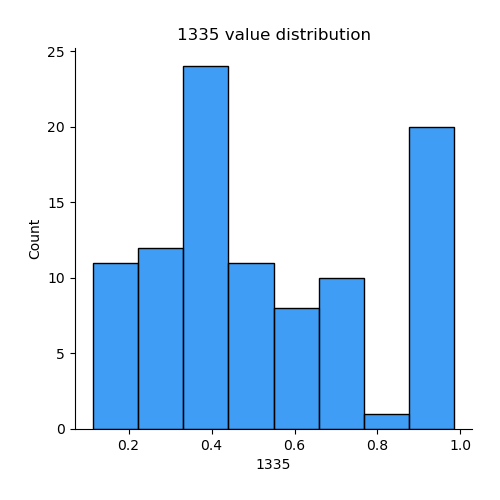
## Feature : 1336
- **Feature type** : continous
- **Missing** : 0.0%
- **Unique** : 97
- **Count** :97.0
- **Mean** :0.5996363826914874
- **Std** :0.23783489530570961
- **Min** :0.0473608588395358
- **25%th Percentile** : 0.41227515162271494
- **50%th Percentile** : 0.5466580986744011
- **75%th Percentile** : 0.7847679021109489
- **Max** :0.9835543893851811

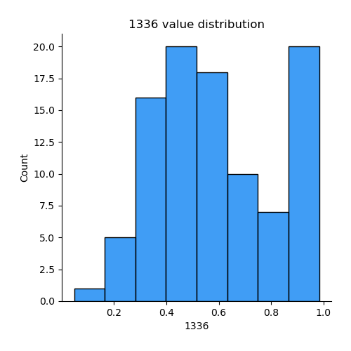
## Feature : 1337
- **Feature type** : continous
- **Missing** : 0.0%
- **Unique** : 97
- **Count** :97.0
- **Mean** :0.5683920033334542
- **Std** :0.28788746923297504
- **Min** :-0.2979861139699598
- **25%th Percentile** : 0.4014091602454239
- **50%th Percentile** : 0.5430676157235432
- **75%th Percentile** : 0.7632835832591387
- **Max** :0.9869693732249635

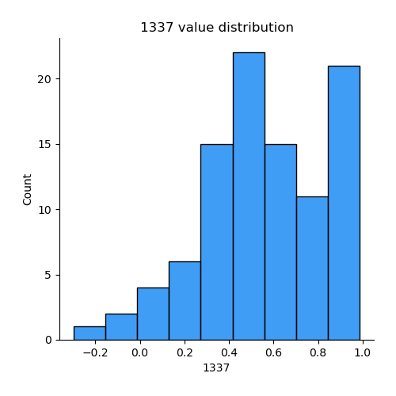
## Feature : 1338
- **Feature type** : continous
- **Missing** : 0.0%
- **Unique** : 97
- **Count** :97.0
- **Mean** :0.48636807765902373
- **Std** :0.321698173666367
- **Min** :-0.2705011829007042
- **25%th Percentile** : 0.25281008085522094
- **50%th Percentile** : 0.4579649352209281
- **75%th Percentile** : 0.6884049109605334
- **Max** :0.9931959010975281

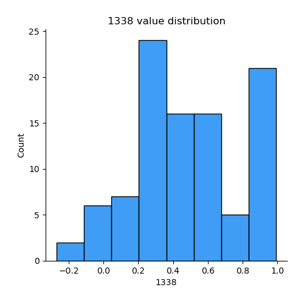
## Feature : 1339
- **Feature type** : continous
- **Missing** : 0.0%
- **Unique** : 97
- **Count** :97.0
- **Mean** :0.5262116036235251
- **Std** :0.2956457055884695
- **Min** :-0.18312877576202066
- **25%th Percentile** : 0.32212165529099335
- **50%th Percentile** : 0.4984732171397733
- **75%th Percentile** : 0.7250637342889636
- **Max** :0.9825361483715344

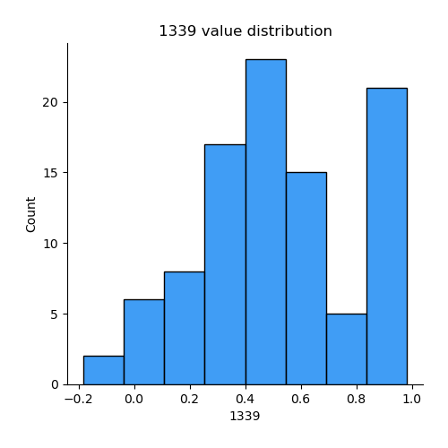
## Feature : 1340
- **Feature type** : continous
- **Missing** : 0.0%
- **Unique** : 97
- **Count** :97.0
- **Mean** :0.5838256778583797
- **Std** :0.2344539341457825
- **Min** :0.07604260471814836
- **25%th Percentile** : 0.41551302152448816
- **50%th Percentile** : 0.5462503809200447
- **75%th Percentile** : 0.747809368083745
- **Max** :0.9784966817853105

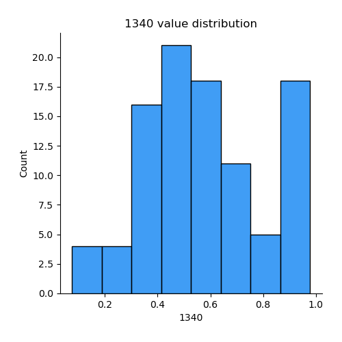
## Feature : 1341
- **Feature type** : continous
- **Missing** : 0.0%
- **Unique** : 97
- **Count** :97.0
- **Mean** :0.5432092146885056
- **Std** :0.3054519474755569
- **Min** :-0.25907602057777224
- **25%th Percentile** : 0.32457368908235734
- **50%th Percentile** : 0.5221224904448862
- **75%th Percentile** : 0.7702343297343013
- **Max** :0.9926734446852452

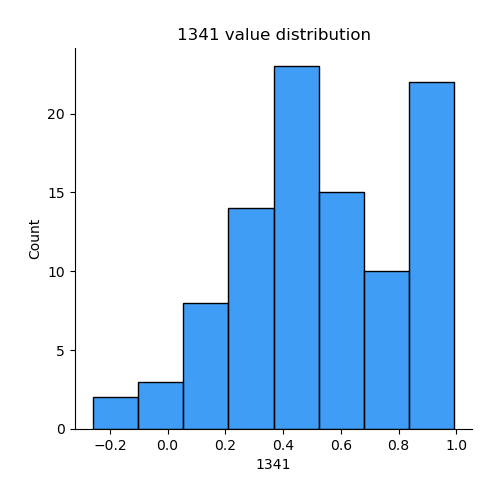
## Feature : 1342
- **Feature type** : continous
- **Missing** : 0.0%
- **Unique** : 97
- **Count** :97.0
- **Mean** :0.6188741347190068
- **Std** :0.24782416304519345
- **Min** :-0.07644104936353811
- **25%th Percentile** : 0.44747745383776333
- **50%th Percentile** : 0.6154919785492495
- **75%th Percentile** : 0.7981954422410795
- **Max** :0.9929994226629263

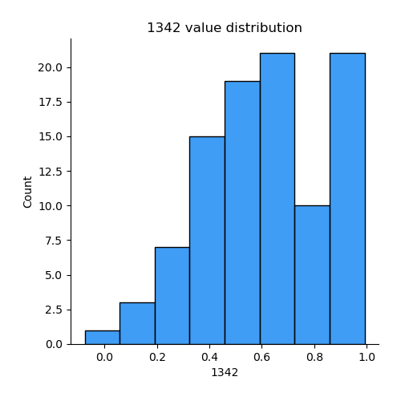
## Feature : 1343
- **Feature type** : continous
- **Missing** : 0.0%
- **Unique** : 97
- **Count** :97.0
- **Mean** :0.5513404932433478
- **Std** :0.2993043254216528
- **Min** :-0.10735751688934903
- **25%th Percentile** : 0.35007493090236025
- **50%th Percentile** : 0.5329991226960153
- **75%th Percentile** : 0.7407557839792778
- **Max** :0.992394372581977

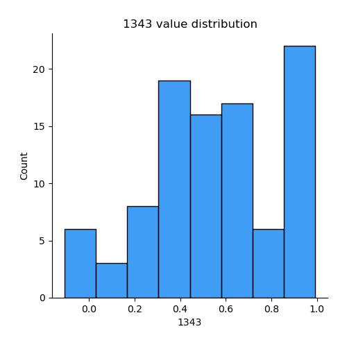
## Feature : 1344
- **Feature type** : continous
- **Missing** : 0.0%
- **Unique** : 97
- **Count** :97.0
- **Mean** :0.6156797688008411
- **Std** :0.2338305019790779
- **Min** :0.09757288860351959
- **25%th Percentile** : 0.4462825520424687
- **50%th Percentile** : 0.5766449844233149
- **75%th Percentile** : 0.7716871057607757
- **Max** :0.9879653790390468

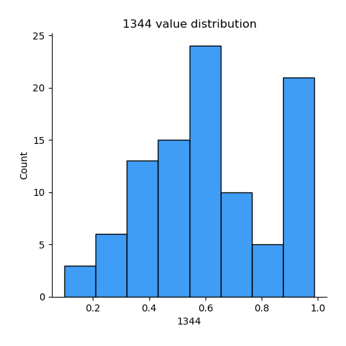
## Feature : 1345
- **Feature type** : continous
- **Missing** : 0.0%
- **Unique** : 97
- **Count** :97.0
- **Mean** :0.4720786553508214
- **Std** :0.3083797995974127
- **Min** :-0.2786433027454743
- **25%th Percentile** : 0.23558064522663663
- **50%th Percentile** : 0.42006467426724825
- **75%th Percentile** : 0.6816305761886129
- **Max** :0.9874078614292803

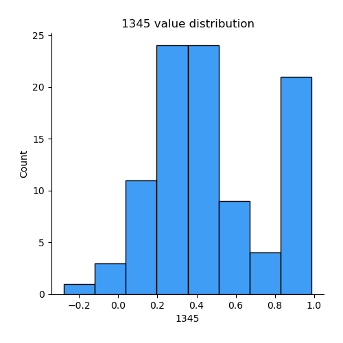
## Feature : 1346
- **Feature type** : continous
- **Missing** : 0.0%
- **Unique** : 97
- **Count** :97.0
- **Mean** :0.5374995048534601
- **Std** :0.3094655918395844
- **Min** :-0.20871153031391756
- **25%th Percentile** : 0.3702765899579486
- **50%th Percentile** : 0.5227086947956735
- **75%th Percentile** : 0.7384192728366769
- **Max** :0.990819191218002

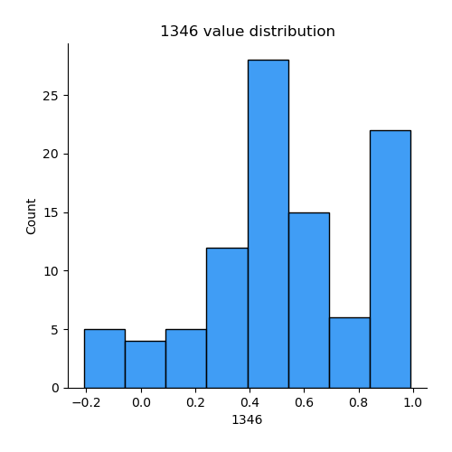
## Feature : 1347
- **Feature type** : continous
- **Missing** : 0.0%
- **Unique** : 97
- **Count** :97.0
- **Mean** :0.5372652786143086
- **Std** :0.2773567316236021
- **Min** :-0.055870481933061523
- **25%th Percentile** : 0.34354604584368703
- **50%th Percentile** : 0.502672515556081
- **75%th Percentile** : 0.7026522060865805
- **Max** :0.989134049042192

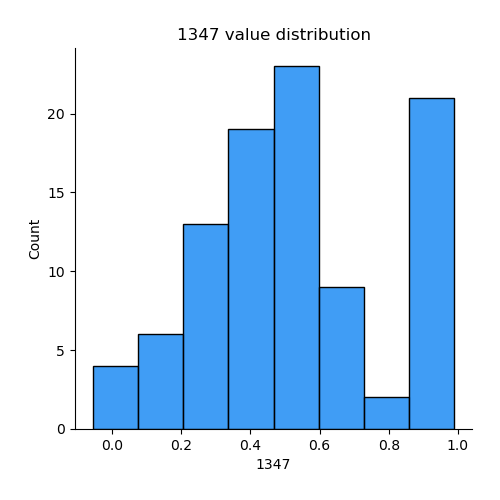
## Feature : 1348
- **Feature type** : continous
- **Missing** : 0.0%
- **Unique** : 97
- **Count** :97.0
- **Mean** :0.7074689051269893
- **Std** :0.24283231981514147
- **Min** :-0.1496327293536561
- **25%th Percentile** : 0.606827250235896
- **50%th Percentile** : 0.7469224733483648
- **75%th Percentile** : 0.8794309562699333
- **Max** :0.9924093180879795

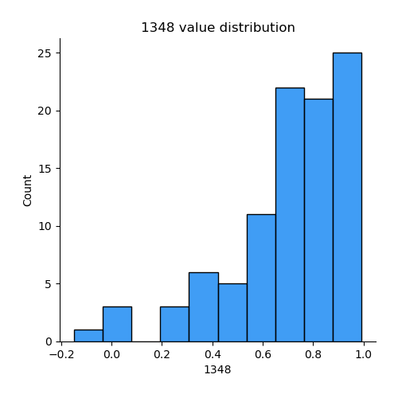
## Feature : 1349
- **Feature type** : continous
- **Missing** : 0.0%
- **Unique** : 97
- **Count** :97.0
- **Mean** :0.6019041846074414
- **Std** :0.27422264159045606
- **Min** :-0.17817344130408327
- **25%th Percentile** : 0.41520167757062315
- **50%th Percentile** : 0.6072104226372759
- **75%th Percentile** : 0.8015643249539087
- **Max** :0.9904363558216375

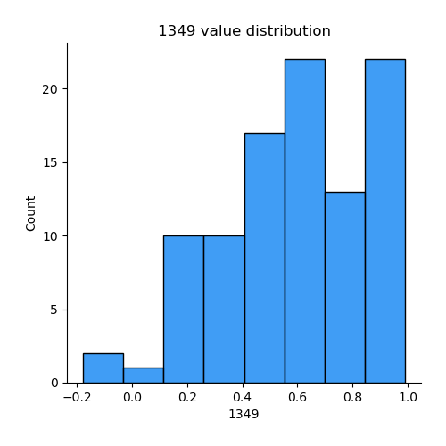
## Feature : 1350
- **Feature type** : continous
- **Missing** : 0.0%
- **Unique** : 97
- **Count** :97.0
- **Mean** :0.44910785763607297
- **Std** :0.3108725196722778
- **Min** :-0.2911348674463645
- **25%th Percentile** : 0.23066019447736583
- **50%th Percentile** : 0.42669179233837307
- **75%th Percentile** : 0.6429542399086791
- **Max** :0.9863830381265535

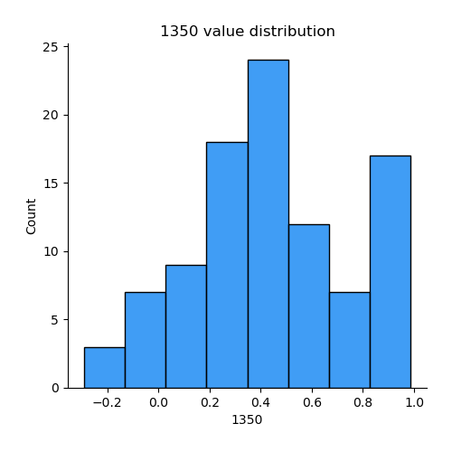
## Feature : 1351
- **Feature type** : continous
- **Missing** : 0.0%
- **Unique** : 97
- **Count** :97.0
- **Mean** :0.6980461411719404
- **Std** :0.24169647190423396
- **Min** :-0.12597217390941462
- **25%th Percentile** : 0.5873930904787626
- **50%th Percentile** : 0.7167506264921186
- **75%th Percentile** : 0.9075372228665719
- **Max** :0.9940195979428886

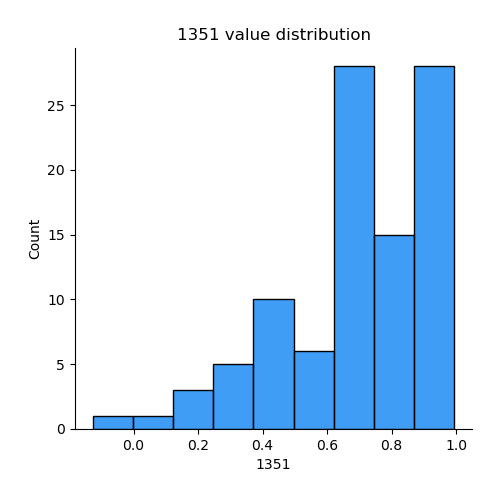
## Feature : 1378
- **Feature type** : continous
- **Missing** : 0.0%
- **Unique** : 3
- **Count** :97.0
- **Mean** :1.0
- **Std** :7.768256234453996e-17
- **Min** :0.9999999999999998
- **25%th Percentile** : 1.0
- **50%th Percentile** : 1.0
- **75%th Percentile** : 1.0
- **Max** :1.0

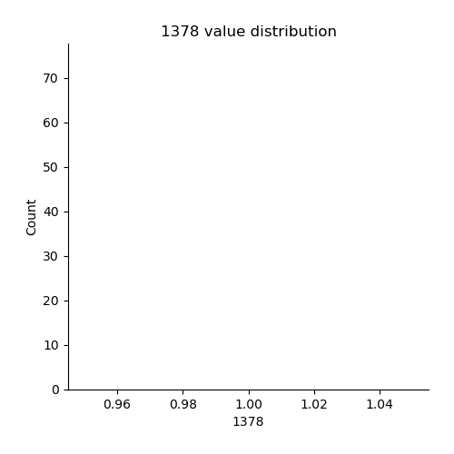
## Feature : 1379
- **Feature type** : continous
- **Missing** : 0.0%
- **Unique** : 97
- **Count** :97.0
- **Mean** :0.5532249051877383
- **Std** :0.27914007244669564
- **Min** :-0.11076731809342068
- **25%th Percentile** : 0.363455567170016
- **50%th Percentile** : 0.5404682281719502
- **75%th Percentile** : 0.7489621821262669
- **Max** :0.9913456603524025

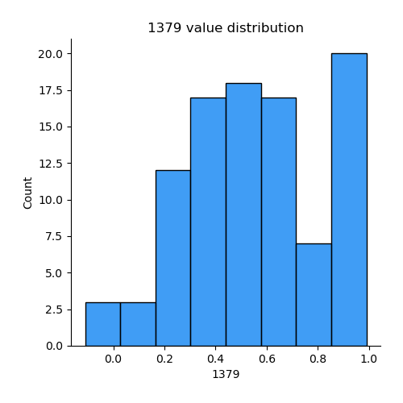
## Feature : 1380
- **Feature type** : continous
- **Missing** : 0.0%
- **Unique** : 97
- **Count** :97.0
- **Mean** :0.630984105301858
- **Std** :0.2503604576999659
- **Min** :-0.16099931856533628
- **25%th Percentile** : 0.4865915149908239
- **50%th Percentile** : 0.6098863501085374
- **75%th Percentile** : 0.8560713291541617
- **Max** :0.9915149129238343

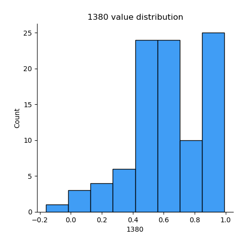
## Feature : 1381
- **Feature type** : continous
- **Missing** : 0.0%
- **Unique** : 97
- **Count** :97.0
- **Mean** :0.3669174736720536
- **Std** :0.3432925577885606
- **Min** :-0.5654307346426141
- **25%th Percentile** : 0.16066062565905093
- **50%th Percentile** : 0.26914710072798875
- **75%th Percentile** : 0.5928836437921657
- **Max** :0.9839576576612001

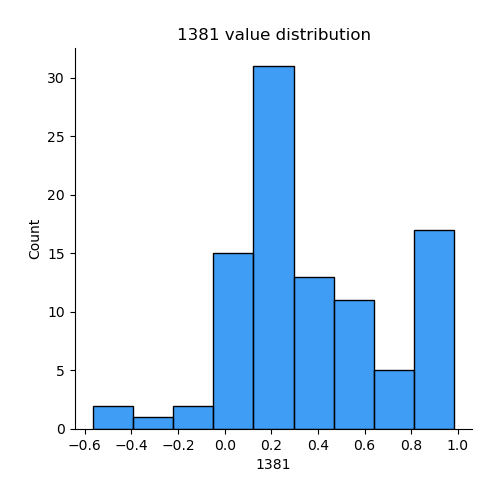
## Feature : 1382
- **Feature type** : continous
- **Missing** : 0.0%
- **Unique** : 97
- **Count** :97.0
- **Mean** :0.6467135957646576
- **Std** :0.2345907868999637
- **Min** :0.017633392708484807
- **25%th Percentile** : 0.46636055894318307
- **50%th Percentile** : 0.6405281306222246
- **75%th Percentile** : 0.8109871281321737
- **Max** :0.9906122563432121

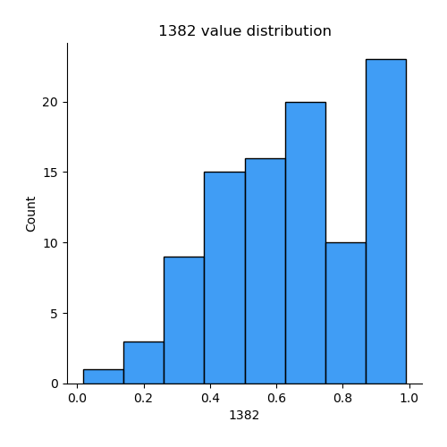
## Feature : 1383
- **Feature type** : continous
- **Missing** : 0.0%
- **Unique** : 97
- **Count** :97.0
- **Mean** :0.7127181098380239
- **Std** :0.20724209635003082
- **Min** :0.23634012367640772
- **25%th Percentile** : 0.5618899522100336
- **50%th Percentile** : 0.7225459417101986
- **75%th Percentile** : 0.8604235659920191
- **Max** :0.9939658101683138

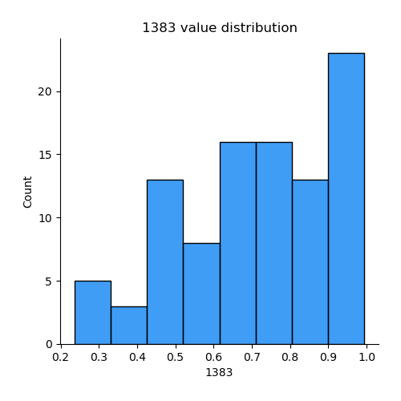
## Feature : 1384
- **Feature type** : continous
- **Missing** : 0.0%
- **Unique** : 97
- **Count** :97.0
- **Mean** :0.604720994455701
- **Std** :0.25303396884770163
- **Min** :0.09274166004227924
- **25%th Percentile** : 0.42830800125248664
- **50%th Percentile** : 0.5822836717237103
- **75%th Percentile** : 0.7865363308257983
- **Max** :0.990149148165573

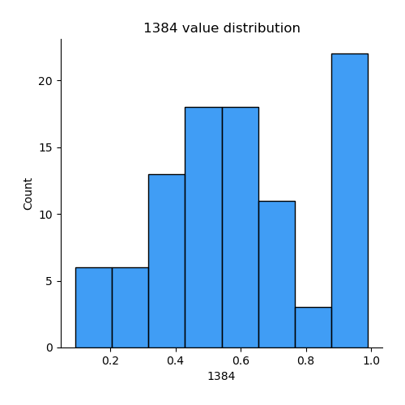
## Feature : 1385
- **Feature type** : continous
- **Missing** : 0.0%
- **Unique** : 97
- **Count** :97.0
- **Mean** :0.6935471151808441
- **Std** :0.21933622550984264
- **Min** :-0.10575404050767544
- **25%th Percentile** : 0.5720818266949351
- **50%th Percentile** : 0.6790286386986778
- **75%th Percentile** : 0.8398416718078383
- **Max** :0.9935830404848573

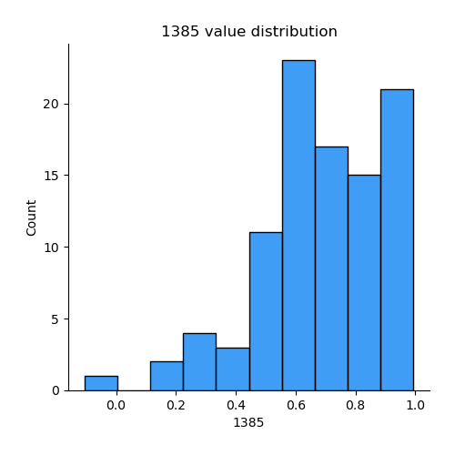
## Feature : 1386
- **Feature type** : continous
- **Missing** : 0.0%
- **Unique** : 97
- **Count** :97.0
- **Mean** :0.5954611682459381
- **Std** :0.28884248384159683
- **Min** :-0.27966105466536273
- **25%th Percentile** : 0.413463942661115
- **50%th Percentile** : 0.6261312122030146
- **75%th Percentile** : 0.7981487966509485
- **Max** :0.9847703129442298

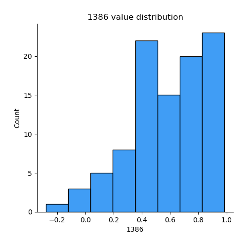
## Feature : 1387
- **Feature type** : continous
- **Missing** : 0.0%
- **Unique** : 97
- **Count** :97.0
- **Mean** :0.6298303640818069
- **Std** :0.2366561712319152
- **Min** :-0.04440289539658693
- **25%th Percentile** : 0.4499002313645659
- **50%th Percentile** : 0.61714318089112
- **75%th Percentile** : 0.8080314939785529
- **Max** :0.9913785924911693

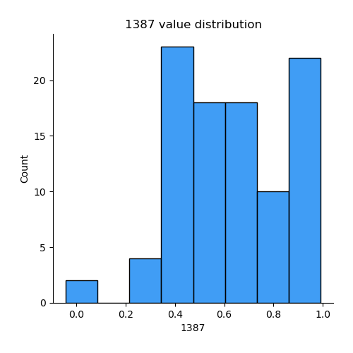
## Feature : 1388
- **Feature type** : continous
- **Missing** : 0.0%
- **Unique** : 97
- **Count** :97.0
- **Mean** :0.6215498233587283
- **Std** :0.24890523529053465
- **Min** :-0.033434145037376004
- **25%th Percentile** : 0.44784890435960706
- **50%th Percentile** : 0.623873116607233
- **75%th Percentile** : 0.8264565645452939
- **Max** :0.987361678186684

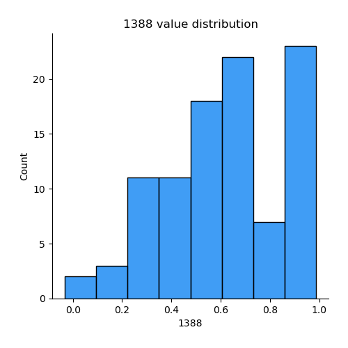
## Feature : 1389
- **Feature type** : continous
- **Missing** : 0.0%
- **Unique** : 97
- **Count** :97.0
- **Mean** :0.7627170845244338
- **Std** :0.17170429592986508
- **Min** :0.22561952433233978
- **25%th Percentile** : 0.6609777335650656
- **50%th Percentile** : 0.7550967040735841
- **75%th Percentile** : 0.9118361947063248
- **Max** :0.995175249160928

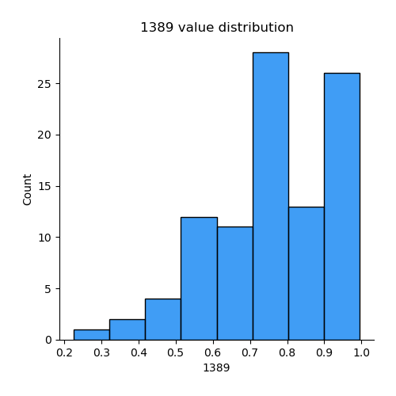
## Feature : 1390
- **Feature type** : continous
- **Missing** : 0.0%
- **Unique** : 97
- **Count** :97.0
- **Mean** :0.5539462555256379
- **Std** :0.30387680620302626
- **Min** :-0.23586972908280535
- **25%th Percentile** : 0.3569867219279499
- **50%th Percentile** : 0.5628147669143754
- **75%th Percentile** : 0.8393965159179706
- **Max** :0.993193654883006

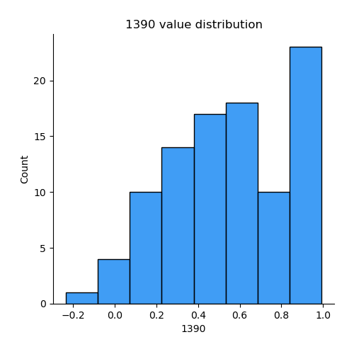
## Feature : 1391
- **Feature type** : continous
- **Missing** : 0.0%
- **Unique** : 97
- **Count** :97.0
- **Mean** :0.546826422433678
- **Std** :0.28044196105713176
- **Min** :-0.008977497886790678
- **25%th Percentile** : 0.3469176458795181
- **50%th Percentile** : 0.5033807920603016
- **75%th Percentile** : 0.7533455413008939
- **Max** :0.9906725553142264

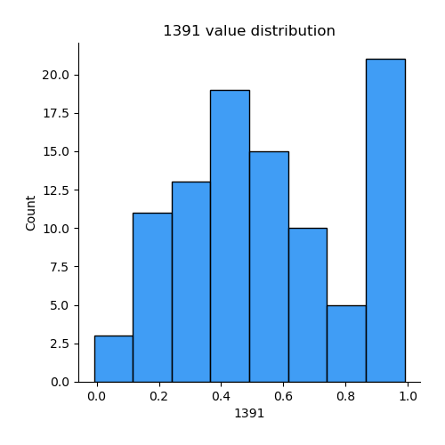
## Feature : 1392
- **Feature type** : continous
- **Missing** : 0.0%
- **Unique** : 97
- **Count** :97.0
- **Mean** :0.5712640152797093
- **Std** :0.2751971309019588
- **Min** :-0.15795425611810116
- **25%th Percentile** : 0.415290750376559
- **50%th Percentile** : 0.5654410217573855
- **75%th Percentile** : 0.8046911600795079
- **Max** :0.9815518180203467

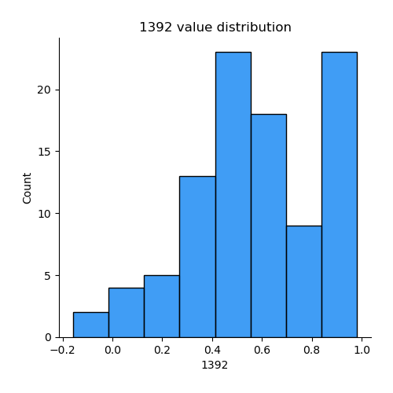
## Feature : 1393
- **Feature type** : continous
- **Missing** : 0.0%
- **Unique** : 97
- **Count** :97.0
- **Mean** :0.6123791133503415
- **Std** :0.2745342526468267
- **Min** :-0.2594369068461429
- **25%th Percentile** : 0.4471004293829803
- **50%th Percentile** : 0.6094754573967952
- **75%th Percentile** : 0.8383503314741598
- **Max** :0.9942027532316073

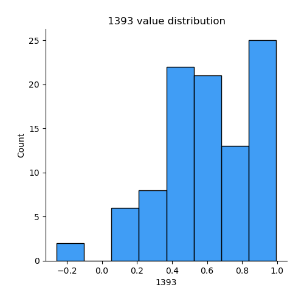
## Feature : 1394
- **Feature type** : continous
- **Missing** : 0.0%
- **Unique** : 97
- **Count** :97.0
- **Mean** :0.5898690721975941
- **Std** :0.27160496439730103
- **Min** :-0.016113103733834726
- **25%th Percentile** : 0.41589055803491104
- **50%th Percentile** : 0.5871379230835152
- **75%th Percentile** : 0.7953687983508172
- **Max** :0.9907849769265086

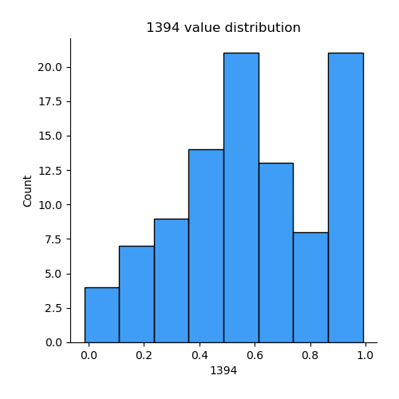
## Feature : 1395
- **Feature type** : continous
- **Missing** : 0.0%
- **Unique** : 97
- **Count** :97.0
- **Mean** :0.6105880711830748
- **Std** :0.28233065020784176
- **Min** :-0.2498842811207459
- **25%th Percentile** : 0.43891024325739036
- **50%th Percentile** : 0.62991884621113
- **75%th Percentile** : 0.8229057894500448
- **Max** :0.9952957209474842

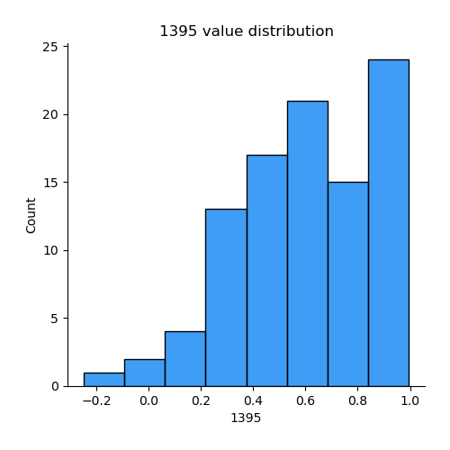
## Feature : 1396
- **Feature type** : continous
- **Missing** : 0.0%
- **Unique** : 97
- **Count** :97.0
- **Mean** :0.665465246105129
- **Std** :0.2343347090075164
- **Min** :0.08718313721409167
- **25%th Percentile** : 0.512214090241194
- **50%th Percentile** : 0.6740517904845902
- **75%th Percentile** : 0.8306187404185383
- **Max** :0.9933060766592328

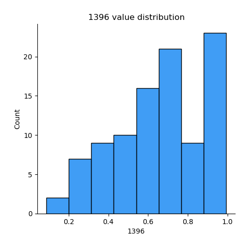
## Feature : 1397
- **Feature type** : continous
- **Missing** : 0.0%
- **Unique** : 97
- **Count** :97.0
- **Mean** :0.46196559350966127
- **Std** :0.3358669621990709
- **Min** :-0.3238671315414497
- **25%th Percentile** : 0.23350639957046762
- **50%th Percentile** : 0.4010136993588727
- **75%th Percentile** : 0.7057720971692835
- **Max** :0.9883342469511884

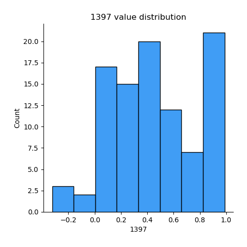
## Feature : 1398
- **Feature type** : continous
- **Missing** : 0.0%
- **Unique** : 97
- **Count** :97.0
- **Mean** :0.5611734461857179
- **Std** :0.30733222466629734
- **Min** :-0.19282097959422975
- **25%th Percentile** : 0.3204726422220054
- **50%th Percentile** : 0.5670643879867374
- **75%th Percentile** : 0.7931979104549182
- **Max** :0.9944402081367968

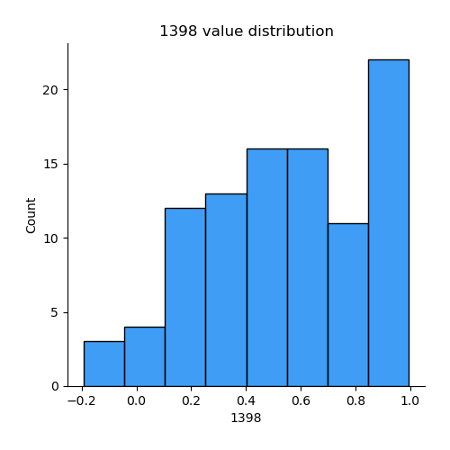
## Feature : 1399
- **Feature type** : continous
- **Missing** : 0.0%
- **Unique** : 97
- **Count** :97.0
- **Mean** :0.6174834227291593
- **Std** :0.27295244126292445
- **Min** :-0.32328531982865477
- **25%th Percentile** : 0.4439841397669615
- **50%th Percentile** : 0.6090900775368684
- **75%th Percentile** : 0.8285524489051862
- **Max** :0.995105772979764

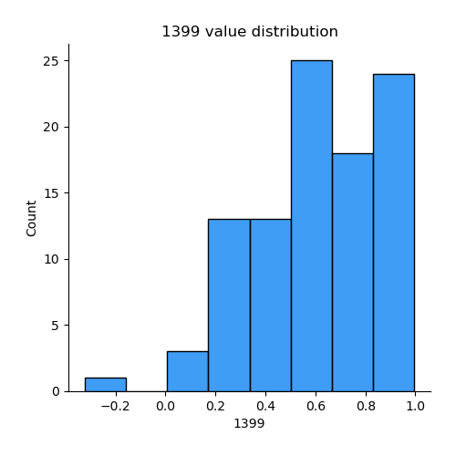
## Feature : 1400
- **Feature type** : continous
- **Missing** : 0.0%
- **Unique** : 97
- **Count** :97.0
- **Mean** :0.7962882605740796
- **Std** :0.1530019714050371
- **Min** :0.4055193211124191
- **25%th Percentile** : 0.7110232753055947
- **50%th Percentile** : 0.8152464394371917
- **75%th Percentile** : 0.9115392420623266
- **Max** :0.9949242976764976

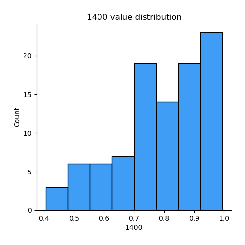
## Feature : 1401
- **Feature type** : continous
- **Missing** : 0.0%
- **Unique** : 97
- **Count** :97.0
- **Mean** :0.6787665835179231
- **Std** :0.23729875265355213
- **Min** :-0.2160302948462513
- **25%th Percentile** : 0.5382585578492333
- **50%th Percentile** : 0.6724728992948212
- **75%th Percentile** : 0.8598509387083338
- **Max** :0.9957465759079557

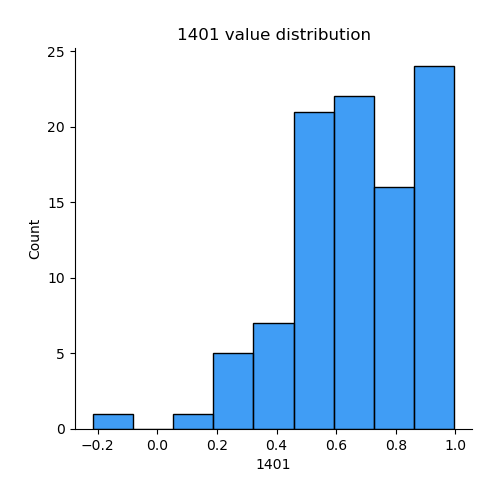
## Feature : 1402
- **Feature type** : continous
- **Missing** : 0.0%
- **Unique** : 97
- **Count** :97.0
- **Mean** :0.4010491911591489
- **Std** :0.3334724375576169
- **Min** :-0.2377161229859371
- **25%th Percentile** : 0.1381149828365849
- **50%th Percentile** : 0.3713695927712655
- **75%th Percentile** : 0.6406618874539534
- **Max** :0.9781118487526108

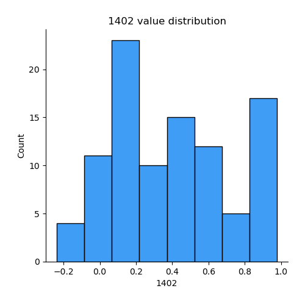
## Feature : 1403
- **Feature type** : continous
- **Missing** : 0.0%
- **Unique** : 97
- **Count** :97.0
- **Mean** :0.6054414959963894
- **Std** :0.2621375282806967
- **Min** :-0.1266566137177769
- **25%th Percentile** : 0.4129805721556949
- **50%th Percentile** : 0.5891509844649024
- **75%th Percentile** : 0.8053309953514807
- **Max** :0.9883136064557934

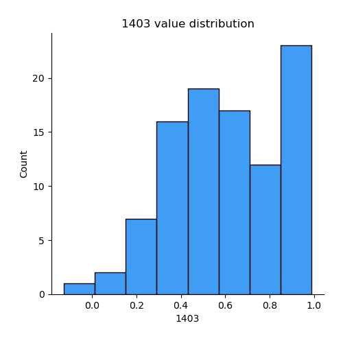
## Feature : 1431
- **Feature type** : continous
- **Missing** : 0.0%
- **Unique** : 3
- **Count** :97.0
- **Mean** :1.0
- **Std** :8.62955915345466e-17
- **Min** :0.9999999999999998
- **25%th Percentile** : 0.9999999999999999
- **50%th Percentile** : 1.0
- **75%th Percentile** : 1.0
- **Max** :1.0

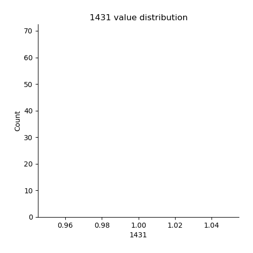
## Feature : 1432
- **Feature type** : continous
- **Missing** : 0.0%
- **Unique** : 97
- **Count** :97.0
- **Mean** :0.5845980549963213
- **Std** :0.2438648168579804
- **Min** :-0.02721557056566686
- **25%th Percentile** : 0.4139488066088587
- **50%th Percentile** : 0.5677399707884895
- **75%th Percentile** : 0.7402898812237849
- **Max** :0.9848203793187794

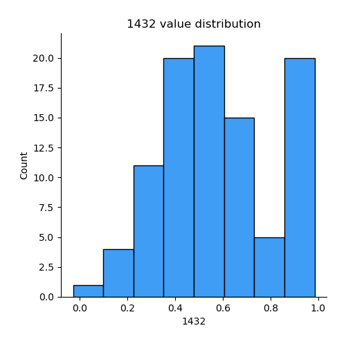
## Feature : 1433
- **Feature type** : continous
- **Missing** : 0.0%
- **Unique** : 97
- **Count** :97.0
- **Mean** :0.4102084772858854
- **Std** :0.3053032521701953
- **Min** :-0.1702420373576127
- **25%th Percentile** : 0.1790826145500093
- **50%th Percentile** : 0.35987691527164256
- **75%th Percentile** : 0.581201607324769
- **Max** :0.9845504720096252

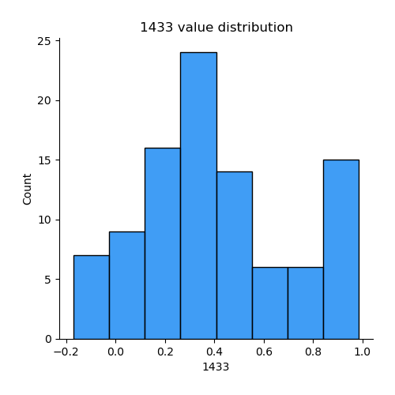
## Feature : 1434
- **Feature type** : continous
- **Missing** : 0.0%
- **Unique** : 97
- **Count** :97.0
- **Mean** :0.5547529633381574
- **Std** :0.2733686597636449
- **Min** :-0.11584529630081179
- **25%th Percentile** : 0.40967806562433845
- **50%th Percentile** : 0.5335040231094218
- **75%th Percentile** : 0.7192586493355042
- **Max** :0.9852692778228477

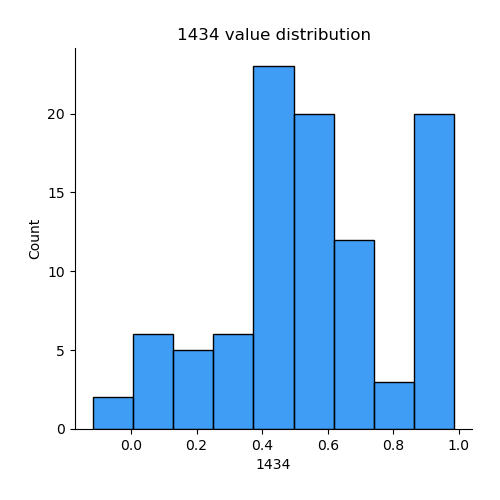
## Feature : 1435
- **Feature type** : continous
- **Missing** : 0.0%
- **Unique** : 97
- **Count** :97.0
- **Mean** :0.6257951140409985
- **Std** :0.2278432327792089
- **Min** :0.1878809517222549
- **25%th Percentile** : 0.47389637693964415
- **50%th Percentile** : 0.608679048337026
- **75%th Percentile** : 0.7633795098369427
- **Max** :0.9923353294428513

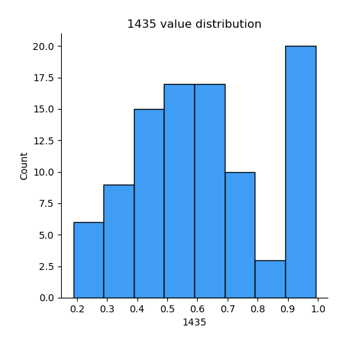
## Feature : 1436
- **Feature type** : continous
- **Missing** : 0.0%
- **Unique** : 97
- **Count** :97.0
- **Mean** :0.5573137904393778
- **Std** :0.27672698684305064
- **Min** :-0.3377074430333852
- **25%th Percentile** : 0.3609437801284964
- **50%th Percentile** : 0.5388275685214704
- **75%th Percentile** : 0.6890719632379795
- **Max** :0.9901361328976848

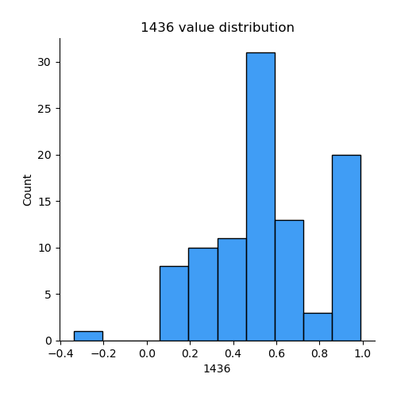
## Feature : 1437
- **Feature type** : continous
- **Missing** : 0.0%
- **Unique** : 97
- **Count** :97.0
- **Mean** :0.7262041136911199
- **Std** :0.1802194227091904
- **Min** :0.2673104780965118
- **25%th Percentile** : 0.6201105513108379
- **50%th Percentile** : 0.7141701610414083
- **75%th Percentile** : 0.8528138438370473
- **Max** :0.9949566086064944

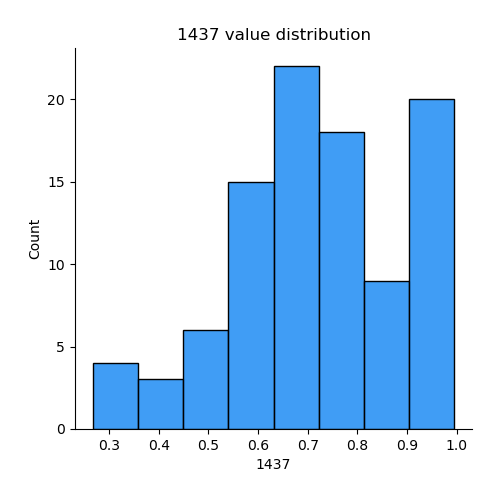
## Feature : 1438
- **Feature type** : continous
- **Missing** : 0.0%
- **Unique** : 97
- **Count** :97.0
- **Mean** :0.5948982633213056
- **Std** :0.23544256818279408
- **Min** :0.05040067112383894
- **25%th Percentile** : 0.4339679407717548
- **50%th Percentile** : 0.5540163845877327
- **75%th Percentile** : 0.7262521502946484
- **Max** :0.9832772099391954

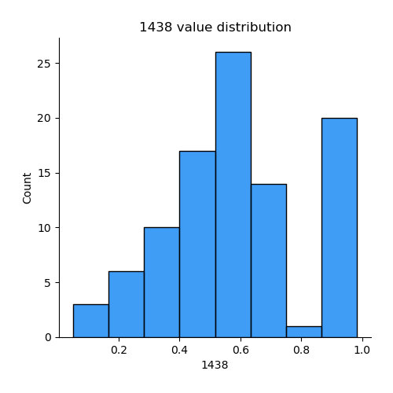
## Feature : 1439
- **Feature type** : continous
- **Missing** : 0.0%
- **Unique** : 97
- **Count** :97.0
- **Mean** :0.5264671614976274
- **Std** :0.26454840541880276
- **Min** :0.027789826399425576
- **25%th Percentile** : 0.3400540774031327
- **50%th Percentile** : 0.483989739203158
- **75%th Percentile** : 0.6495774981042328
- **Max** :0.9829737153355589

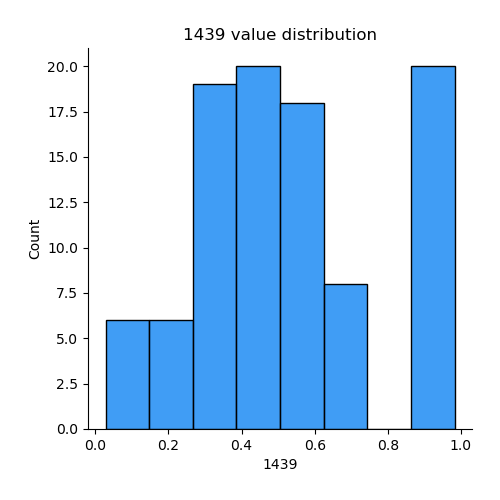
## Feature : 1440
- **Feature type** : continous
- **Missing** : 0.0%
- **Unique** : 97
- **Count** :97.0
- **Mean** :0.5658820441584607
- **Std** :0.2623502450040038
- **Min** :0.056145784453918664
- **25%th Percentile** : 0.3787610522382326
- **50%th Percentile** : 0.5700894771730104
- **75%th Percentile** : 0.7131685392546767
- **Max** :0.9911067641773366

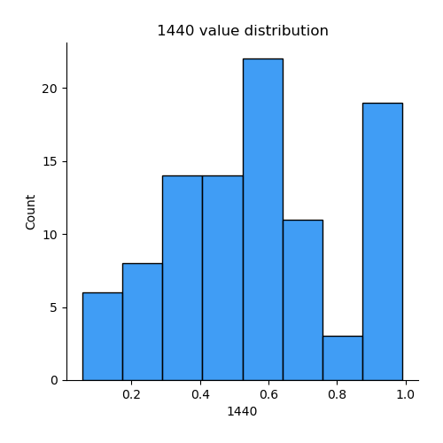
## Feature : 1441
- **Feature type** : continous
- **Missing** : 0.0%
- **Unique** : 97
- **Count** :97.0
- **Mean** :0.5675932999705476
- **Std** :0.2764729541224342
- **Min** :-0.37998048269070217
- **25%th Percentile** : 0.38543361107667984
- **50%th Percentile** : 0.5647538794614891
- **75%th Percentile** : 0.7322905633769792
- **Max** :0.9913439959324779

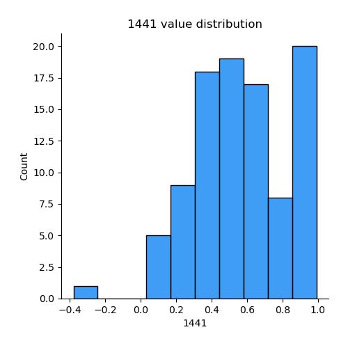
## Feature : 1442
- **Feature type** : continous
- **Missing** : 0.0%
- **Unique** : 97
- **Count** :97.0
- **Mean** :0.6415050299409158
- **Std** :0.2299337746028162
- **Min** :0.07091587258940404
- **25%th Percentile** : 0.4662238488856826
- **50%th Percentile** : 0.622858460395726
- **75%th Percentile** : 0.7999961022923449
- **Max** :0.9937929713347369

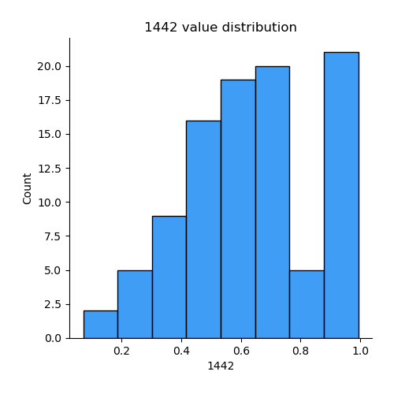
## Feature : 1443
- **Feature type** : continous
- **Missing** : 0.0%
- **Unique** : 97
- **Count** :97.0
- **Mean** :0.49959086800460084
- **Std** :0.29735159037652337
- **Min** :-0.12880741187146147
- **25%th Percentile** : 0.30239203636943784
- **50%th Percentile** : 0.45695925577230856
- **75%th Percentile** : 0.661386995351604
- **Max** :0.990120482942905

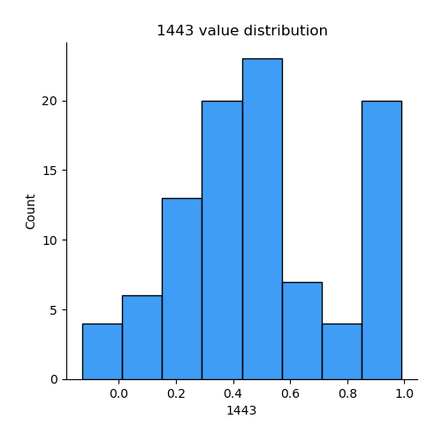
## Feature : 1444
- **Feature type** : continous
- **Missing** : 0.0%
- **Unique** : 97
- **Count** :97.0
- **Mean** :0.5671415944510273
- **Std** :0.24368529153987448
- **Min** :-0.04086296600367955
- **25%th Percentile** : 0.401670575679695
- **50%th Percentile** : 0.547388150720096
- **75%th Percentile** : 0.7164622335093321
- **Max** :0.9844874359806551

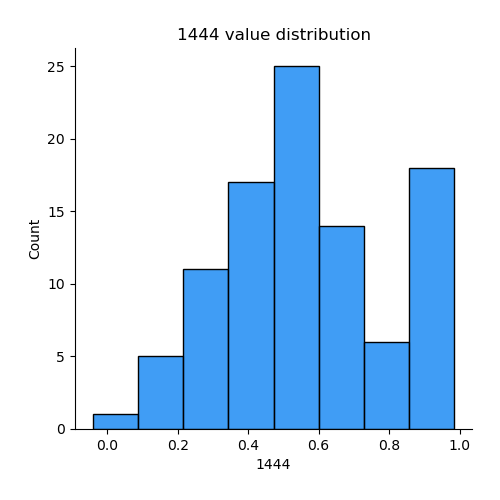
## Feature : 1445
- **Feature type** : continous
- **Missing** : 0.0%
- **Unique** : 97
- **Count** :97.0
- **Mean** :0.6640043507932476
- **Std** :0.21614974339768459
- **Min** :0.17502678645404496
- **25%th Percentile** : 0.5105090950102423
- **50%th Percentile** : 0.6605877904845014
- **75%th Percentile** : 0.8029471016361079
- **Max** :0.9940662526789847

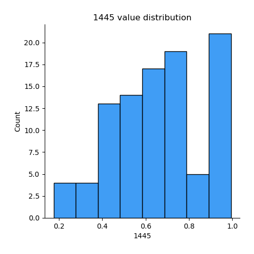
## Feature : 1446
- **Feature type** : continous
- **Missing** : 0.0%
- **Unique** : 97
- **Count** :97.0
- **Mean** :0.7924134038140815
- **Std** :0.13944628814249968
- **Min** :0.42426363085937985
- **25%th Percentile** : 0.6899522415453642
- **50%th Percentile** : 0.8006304761385358
- **75%th Percentile** : 0.8827075038057712
- **Max** :0.99681786421902

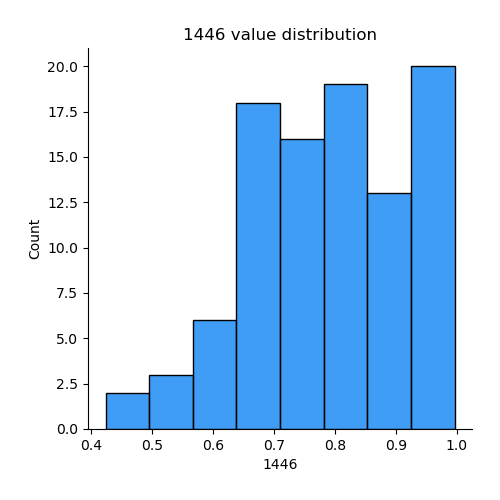
## Feature : 1447
- **Feature type** : continous
- **Missing** : 0.0%
- **Unique** : 97
- **Count** :97.0
- **Mean** :0.7219950554050414
- **Std** :0.1832007074914564
- **Min** :0.2929476467681299
- **25%th Percentile** : 0.5988405137960994
- **50%th Percentile** : 0.7245594458513425
- **75%th Percentile** : 0.8446564746321091
- **Max** :0.9966757274545747

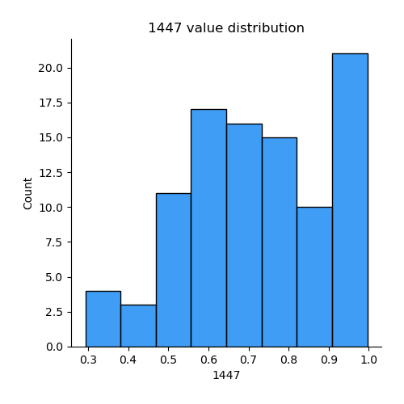
## Feature : 1448
- **Feature type** : continous
- **Missing** : 0.0%
- **Unique** : 97
- **Count** :97.0
- **Mean** :0.6757645324538833
- **Std** :0.19738008211246466
- **Min** :0.27138428084189264
- **25%th Percentile** : 0.5439476189659626
- **50%th Percentile** : 0.6665149883832888
- **75%th Percentile** : 0.8003958828853207
- **Max** :0.9934687877729158

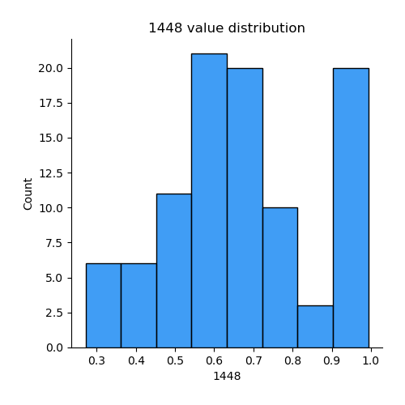
## Feature : 1449
- **Feature type** : continous
- **Missing** : 0.0%
- **Unique** : 97
- **Count** :97.0
- **Mean** :0.6535602124589738
- **Std** :0.2299480109622436
- **Min** :0.18005594464838967
- **25%th Percentile** : 0.4695589607325429
- **50%th Percentile** : 0.6757657304332046
- **75%th Percentile** : 0.8336132803648791
- **Max** :0.9919134808812166

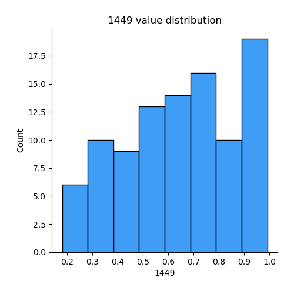
## Feature : 1450
- **Feature type** : continous
- **Missing** : 0.0%
- **Unique** : 97
- **Count** :97.0
- **Mean** :0.8089181484469342
- **Std** :0.13595467189455832
- **Min** :0.31362169237109494
- **25%th Percentile** : 0.7354929104816325
- **50%th Percentile** : 0.8191723904652185
- **75%th Percentile** : 0.8922259014226666
- **Max** :0.9966799140345902

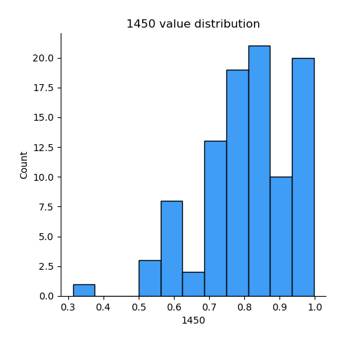
## Feature : 1451
- **Feature type** : continous
- **Missing** : 0.0%
- **Unique** : 97
- **Count** :97.0
- **Mean** :0.6589664849538936
- **Std** :0.2120431336019296
- **Min** :0.2000807933264258
- **25%th Percentile** : 0.4955422333147196
- **50%th Percentile** : 0.6594870425726038
- **75%th Percentile** : 0.8032557590496442
- **Max** :0.9946992913409725

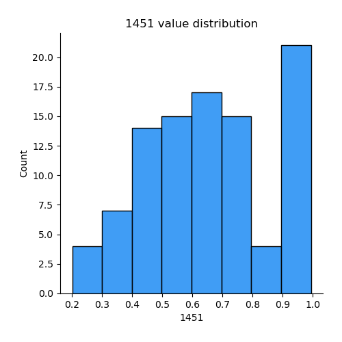
## Feature : 1452
- **Feature type** : continous
- **Missing** : 0.0%
- **Unique** : 97
- **Count** :97.0
- **Mean** :0.6312160463116344
- **Std** :0.23969527910363575
- **Min** :-0.15888231010889664
- **25%th Percentile** : 0.4710924800032159
- **50%th Percentile** : 0.6137369104624876
- **75%th Percentile** : 0.8076139454558314
- **Max** :0.9935483726010917

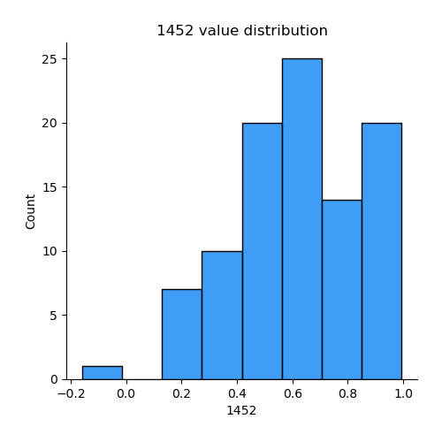
## Feature : 1453
- **Feature type** : continous
- **Missing** : 0.0%
- **Unique** : 97
- **Count** :97.0
- **Mean** :0.7303581268724891
- **Std** :0.17136236986769735
- **Min** :0.343478288998162
- **25%th Percentile** : 0.6219911359106753
- **50%th Percentile** : 0.7280017340105852
- **75%th Percentile** : 0.8258103913248124
- **Max** :0.9952623800258535

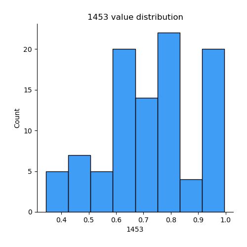
## Feature : 1454
- **Feature type** : continous
- **Missing** : 0.0%
- **Unique** : 97
- **Count** :97.0
- **Mean** :0.40844856416236985
- **Std** :0.3117366110844932
- **Min** :-0.1827861593723425
- **25%th Percentile** : 0.16949877241590508
- **50%th Percentile** : 0.3388418223008452
- **75%th Percentile** : 0.5852827125600357
- **Max** :0.9826332596574162

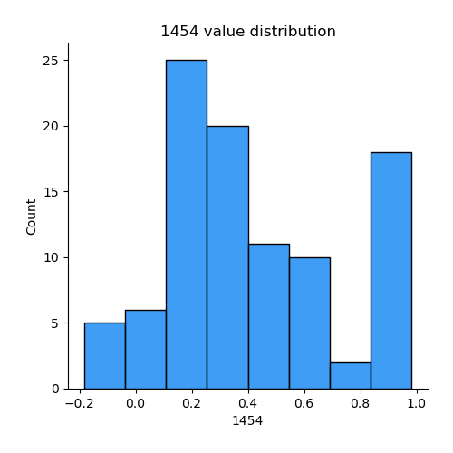
## Feature : 1455
- **Feature type** : continous
- **Missing** : 0.0%
- **Unique** : 97
- **Count** :97.0
- **Mean** :0.5706333907428089
- **Std** :0.26867488689857083
- **Min** :-0.02278628473279499
- **25%th Percentile** : 0.38980416695674885
- **50%th Percentile** : 0.5674072387779063
- **75%th Percentile** : 0.7715388237051978
- **Max** :0.9901396946753301

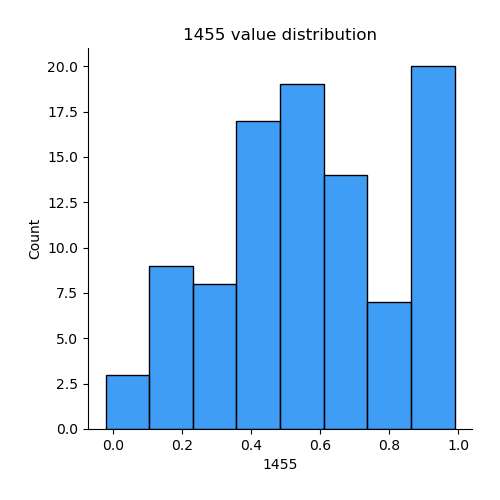
## Feature : 1484
- **Feature type** : continous
- **Missing** : 0.0%
- **Unique** : 3
- **Count** :97.0
- **Mean** :1.0
- **Std** :8.849923789036128e-17
- **Min** :0.9999999999999998
- **25%th Percentile** : 0.9999999999999999
- **50%th Percentile** : 1.0
- **75%th Percentile** : 1.0
- **Max** :1.0

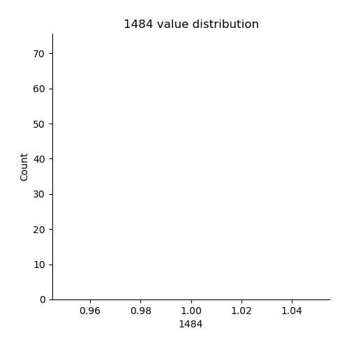
## Feature : 1485
- **Feature type** : continous
- **Missing** : 0.0%
- **Unique** : 97
- **Count** :97.0
- **Mean** :0.3935115295179599
- **Std** :0.33386663606272643
- **Min** :-0.4353399774223179
- **25%th Percentile** : 0.15859948028743576
- **50%th Percentile** : 0.3642096607607862
- **75%th Percentile** : 0.6875324171571907
- **Max** :0.9776316082732844

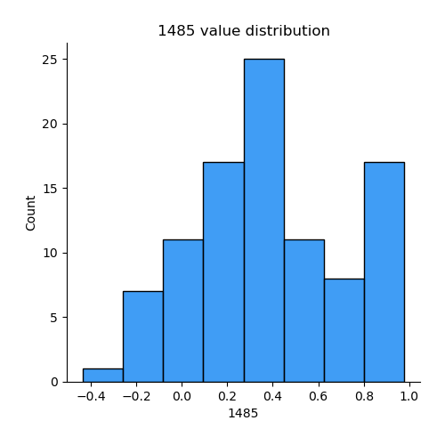
## Feature : 1486
- **Feature type** : continous
- **Missing** : 0.0%
- **Unique** : 97
- **Count** :97.0
- **Mean** :0.7172006811927861
- **Std** :0.19461025671442456
- **Min** :0.10752706989843049
- **25%th Percentile** : 0.6127484361953563
- **50%th Percentile** : 0.7141707027081238
- **75%th Percentile** : 0.884194250225812
- **Max** :0.9918255922415483

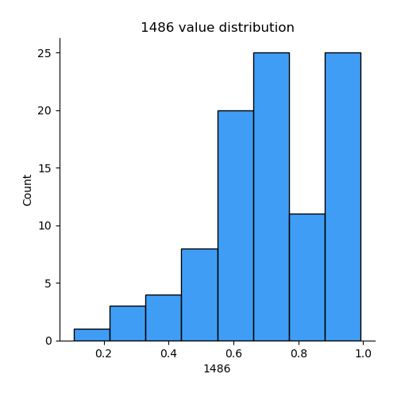
## Feature : 1487
- **Feature type** : continous
- **Missing** : 0.0%
- **Unique** : 97
- **Count** :97.0
- **Mean** :0.7199905707276415
- **Std** :0.1953293690390154
- **Min** :0.10739430965208172
- **25%th Percentile** : 0.5967902716779179
- **50%th Percentile** : 0.7113208315963104
- **75%th Percentile** : 0.886529252189108
- **Max** :0.9901740471761882

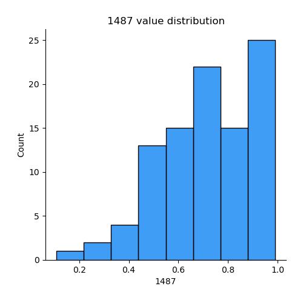
## Feature : 1488
- **Feature type** : continous
- **Missing** : 0.0%
- **Unique** : 97
- **Count** :97.0
- **Mean** :0.6050280116253637
- **Std** :0.2489470483371211
- **Min** :0.02148969320804566
- **25%th Percentile** : 0.4488364764979065
- **50%th Percentile** : 0.5661653287021249
- **75%th Percentile** : 0.7783394840448278
- **Max** :0.9885501478559083

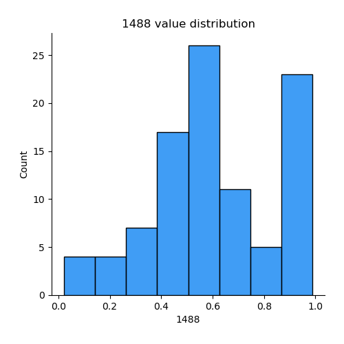
## Feature : 1489
- **Feature type** : continous
- **Missing** : 0.0%
- **Unique** : 97
- **Count** :97.0
- **Mean** :0.6616094955140301
- **Std** :0.21366290532010498
- **Min** :0.11500447215579943
- **25%th Percentile** : 0.5191714223223566
- **50%th Percentile** : 0.645091903485747
- **75%th Percentile** : 0.8181191988707955
- **Max** :0.9914438517158577

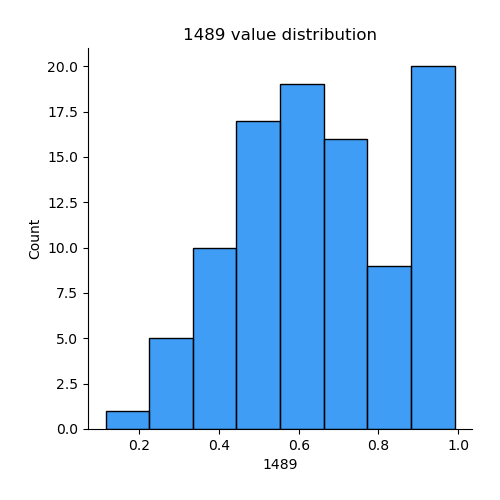
## Feature : 1490
- **Feature type** : continous
- **Missing** : 0.0%
- **Unique** : 97
- **Count** :97.0
- **Mean** :0.7039352734682761
- **Std** :0.20801421848885834
- **Min** :0.054792933759261864
- **25%th Percentile** : 0.5545787318225829
- **50%th Percentile** : 0.7021184468211072
- **75%th Percentile** : 0.8702130352080256
- **Max** :0.9862088802871336

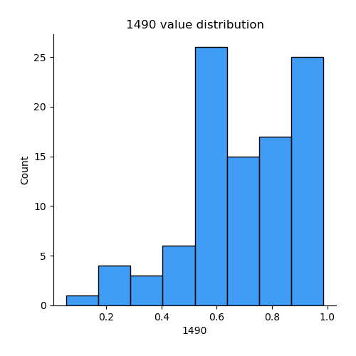
## Feature : 1491
- **Feature type** : continous
- **Missing** : 0.0%
- **Unique** : 97
- **Count** :97.0
- **Mean** :0.7631626772033062
- **Std** :0.17206154632784812
- **Min** :-0.026902958339854014
- **25%th Percentile** : 0.6720192064299336
- **50%th Percentile** : 0.7694729613901737
- **75%th Percentile** : 0.8826029283923246
- **Max** :0.9908346518980111

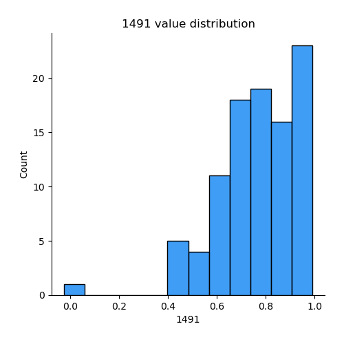
## Feature : 1492
- **Feature type** : continous
- **Missing** : 0.0%
- **Unique** : 97
- **Count** :97.0
- **Mean** :0.8425984965877713
- **Std** :0.12655519048761105
- **Min** :0.4781126386809497
- **25%th Percentile** : 0.7515673637183101
- **50%th Percentile** : 0.8636120573411905
- **75%th Percentile** : 0.9540065628544694
- **Max** :0.9953135256232517

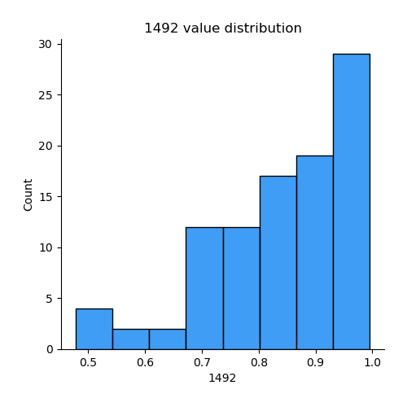
## Feature : 1493
- **Feature type** : continous
- **Missing** : 0.0%
- **Unique** : 97
- **Count** :97.0
- **Mean** :0.6257232196098513
- **Std** :0.25285980859353746
- **Min** :-0.07069888321577271
- **25%th Percentile** : 0.4886129606179085
- **50%th Percentile** : 0.6064361025408153
- **75%th Percentile** : 0.8280835791174268
- **Max** :0.99033613981922

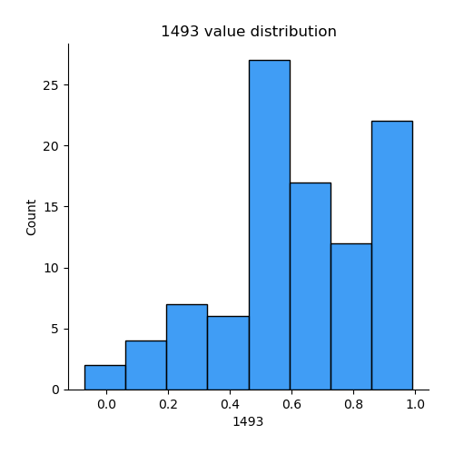
## Feature : 1494
- **Feature type** : continous
- **Missing** : 0.0%
- **Unique** : 97
- **Count** :97.0
- **Mean** :0.6057121854567864
- **Std** :0.2765927464125738
- **Min** :-0.07784088573517378
- **25%th Percentile** : 0.40472101250710873
- **50%th Percentile** : 0.6297332338568794
- **75%th Percentile** : 0.8101467388157095
- **Max** :0.9891634041558481

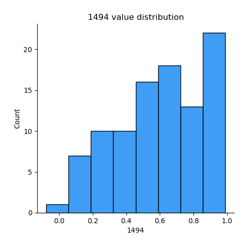
## Feature : 1495
- **Feature type** : continous
- **Missing** : 0.0%
- **Unique** : 97
- **Count** :97.0
- **Mean** :0.6085925566132997
- **Std** :0.24634730985787798
- **Min** :-0.09032844225419828
- **25%th Percentile** : 0.4430322518413845
- **50%th Percentile** : 0.5845791515093028
- **75%th Percentile** : 0.8042220626284939
- **Max** :0.9893126273295343

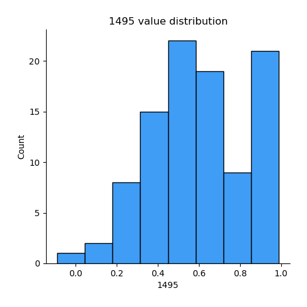
## Feature : 1496
- **Feature type** : continous
- **Missing** : 0.0%
- **Unique** : 97
- **Count** :97.0
- **Mean** :0.8212719607399056
- **Std** :0.13595920963791636
- **Min** :0.35914069367666285
- **25%th Percentile** : 0.7386999285015319
- **50%th Percentile** : 0.8460287090540275
- **75%th Percentile** : 0.9273522311744186
- **Max** :0.992620939168287

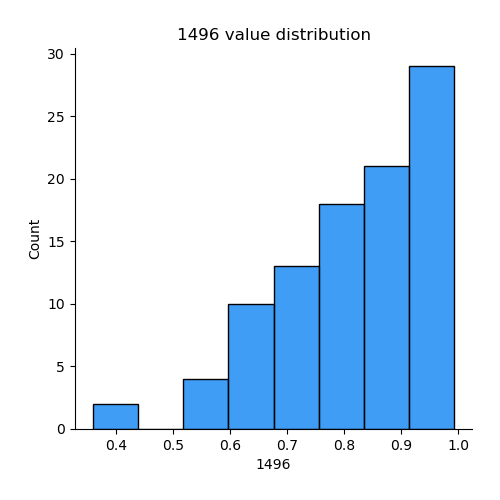
## Feature : 1497
- **Feature type** : continous
- **Missing** : 0.0%
- **Unique** : 97
- **Count** :97.0
- **Mean** :0.6430029642352177
- **Std** :0.24792245007751051
- **Min** :-0.014798714220024132
- **25%th Percentile** : 0.4744918260653253
- **50%th Percentile** : 0.6653640729110529
- **75%th Percentile** : 0.7886979456595459
- **Max** :0.9916361993437947

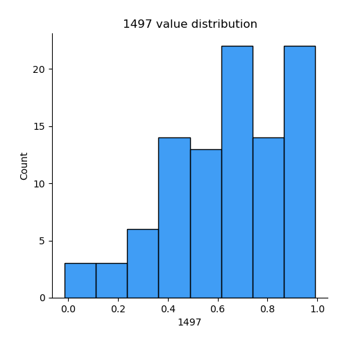
## Feature : 1498
- **Feature type** : continous
- **Missing** : 0.0%
- **Unique** : 97
- **Count** :97.0
- **Mean** :0.649948924661326
- **Std** :0.22753274670771856
- **Min** :-0.06019224998693364
- **25%th Percentile** : 0.5011973491551049
- **50%th Percentile** : 0.6470903027081508
- **75%th Percentile** : 0.8157924316377602
- **Max** :0.9903883081102551

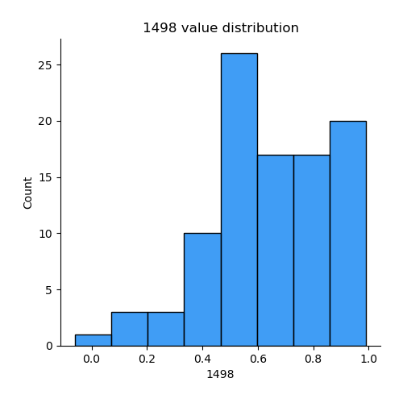
## Feature : 1499
- **Feature type** : continous
- **Missing** : 0.0%
- **Unique** : 97
- **Count** :97.0
- **Mean** :0.6600084607084857
- **Std** :0.2353161650509057
- **Min** :0.0918365438256939
- **25%th Percentile** : 0.5162941357684204
- **50%th Percentile** : 0.6793166901370473
- **75%th Percentile** : 0.8314129377964918
- **Max** :0.9926488938458199

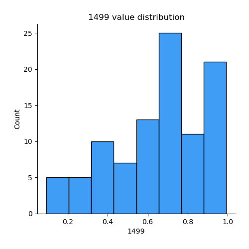
## Feature : 1500
- **Feature type** : continous
- **Missing** : 0.0%
- **Unique** : 97
- **Count** :97.0
- **Mean** :0.7784771492806101
- **Std** :0.1547833574427005
- **Min** :0.33124903727046934
- **25%th Percentile** : 0.6735000934605628
- **50%th Percentile** : 0.7860944125447531
- **75%th Percentile** : 0.9196753412524032
- **Max** :0.9902414659543619

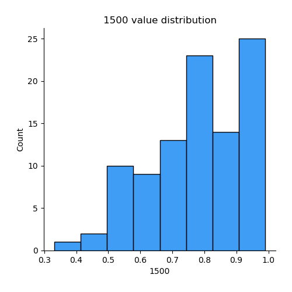
## Feature : 1501
- **Feature type** : continous
- **Missing** : 0.0%
- **Unique** : 97
- **Count** :97.0
- **Mean** :0.4590435219022976
- **Std** :0.30905014565444877
- **Min** :-0.34207230284982393
- **25%th Percentile** : 0.22734742330091812
- **50%th Percentile** : 0.3976505850658568
- **75%th Percentile** : 0.6931417594632113
- **Max** :0.9806027179141598

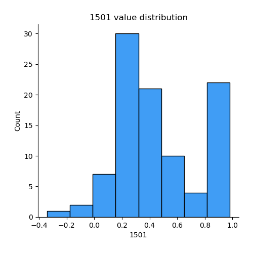
## Feature : 1502
- **Feature type** : continous
- **Missing** : 0.0%
- **Unique** : 97
- **Count** :97.0
- **Mean** :0.5869381416199521
- **Std** :0.27641334716291466
- **Min** :-0.13666662127509568
- **25%th Percentile** : 0.43124682146036364
- **50%th Percentile** : 0.5861335076705071
- **75%th Percentile** : 0.7699191873233039
- **Max** :0.9902367198038853

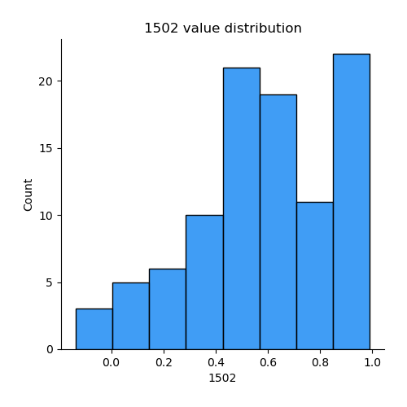
## Feature : 1503
- **Feature type** : continous
- **Missing** : 0.0%
- **Unique** : 97
- **Count** :97.0
- **Mean** :0.7820323371803494
- **Std** :0.1539113581641979
- **Min** :0.21242389806681858
- **25%th Percentile** : 0.6699937852277037
- **50%th Percentile** : 0.7833887297878719
- **75%th Percentile** : 0.8989946982972563
- **Max** :0.9923675706157921

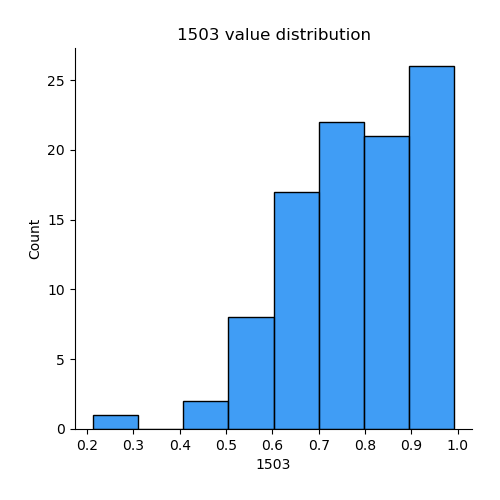
## Feature : 1504
- **Feature type** : continous
- **Missing** : 0.0%
- **Unique** : 97
- **Count** :97.0
- **Mean** :0.6675685093435542
- **Std** :0.22632806629645227
- **Min** :-0.08187377514813747
- **25%th Percentile** : 0.5483989026835738
- **50%th Percentile** : 0.6467520503561509
- **75%th Percentile** : 0.8675781313288591
- **Max** :0.9905176563837277

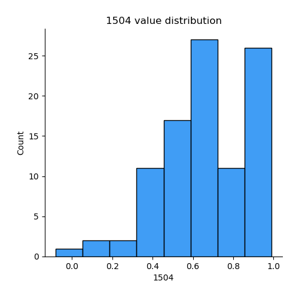
## Feature : 1505
- **Feature type** : continous
- **Missing** : 0.0%
- **Unique** : 97
- **Count** :97.0
- **Mean** :0.6928645274602345
- **Std** :0.19110239211803917
- **Min** :0.27525195222286897
- **25%th Percentile** : 0.5531282831317209
- **50%th Percentile** : 0.6899234805972034
- **75%th Percentile** : 0.8243079413392865
- **Max** :0.9908425213542186

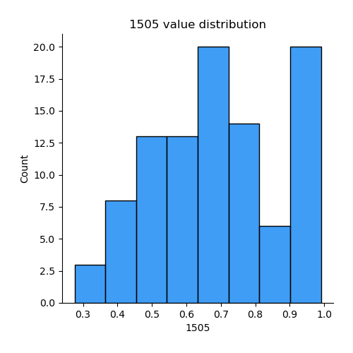
## Feature : 1506
- **Feature type** : continous
- **Missing** : 0.0%
- **Unique** : 97
- **Count** :97.0
- **Mean** :0.39978586717486175
- **Std** :0.3257172724230557
- **Min** :-0.16588859588200489
- **25%th Percentile** : 0.17038942824176
- **50%th Percentile** : 0.3539837701801413
- **75%th Percentile** : 0.5971867908234477
- **Max** :0.9716728728818887

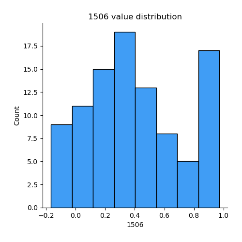
## Feature : 1507
- **Feature type** : continous
- **Missing** : 0.0%
- **Unique** : 97
- **Count** :97.0
- **Mean** :0.5696324793865819
- **Std** :0.2649321568688374
- **Min** :-0.046358198316670006
- **25%th Percentile** : 0.36894816098609057
- **50%th Percentile** : 0.5384288117408926
- **75%th Percentile** : 0.7756605315441495
- **Max** :0.9855595871380128

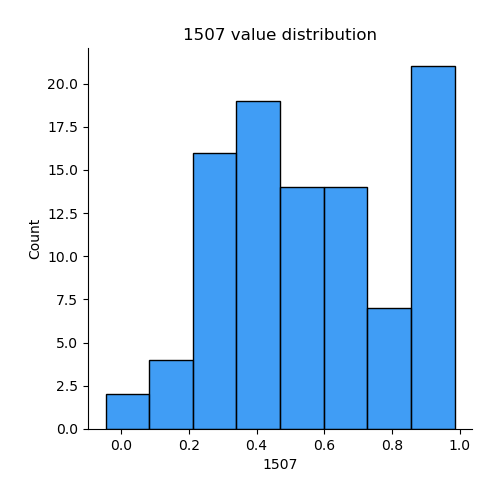
## Feature : 1537
- **Feature type** : continous
- **Missing** : 0.0%
- **Unique** : 3
- **Count** :97.0
- **Mean** :1.0
- **Std** :8.62955915345466e-17
- **Min** :0.9999999999999998
- **25%th Percentile** : 1.0
- **50%th Percentile** : 1.0
- **75%th Percentile** : 1.0
- **Max** :1.0

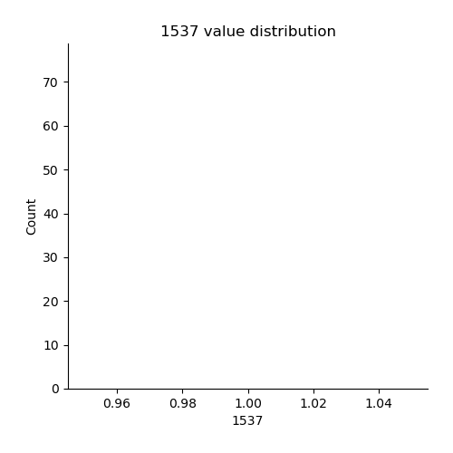
## Feature : 1538
- **Feature type** : continous
- **Missing** : 0.0%
- **Unique** : 97
- **Count** :97.0
- **Mean** :0.5230512386156442
- **Std** :0.3064239779343368
- **Min** :-0.31472474299896713
- **25%th Percentile** : 0.3343888182479936
- **50%th Percentile** : 0.5221679994652049
- **75%th Percentile** : 0.7617288796505828
- **Max** :0.9807277981789785

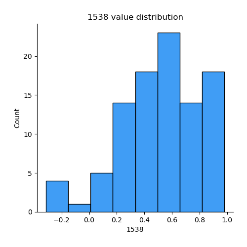
## Feature : 1539
- **Feature type** : continous
- **Missing** : 0.0%
- **Unique** : 97
- **Count** :97.0
- **Mean** :0.41468832409538425
- **Std** :0.31931808195840167
- **Min** :-0.23956391833609397
- **25%th Percentile** : 0.1539960003759035
- **50%th Percentile** : 0.39254288288555156
- **75%th Percentile** : 0.6548666422882968
- **Max** :0.9823231940088641

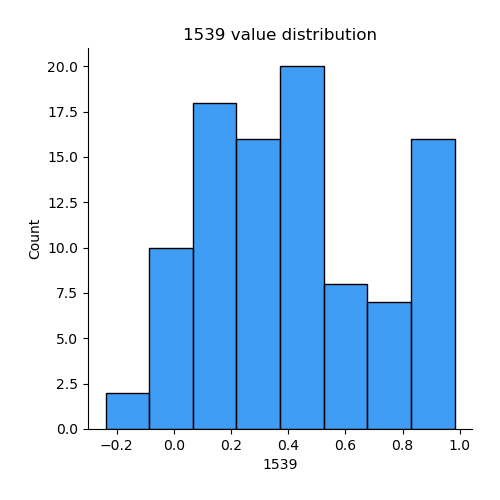
## Feature : 1540
- **Feature type** : continous
- **Missing** : 0.0%
- **Unique** : 97
- **Count** :97.0
- **Mean** :0.5255439779404523
- **Std** :0.28964811107868654
- **Min** :-0.23561624396121558
- **25%th Percentile** : 0.3077999612220507
- **50%th Percentile** : 0.5462372473831131
- **75%th Percentile** : 0.765526033801086
- **Max** :0.9853763651461265

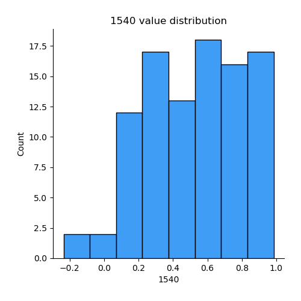
## Feature : 1541
- **Feature type** : continous
- **Missing** : 0.0%
- **Unique** : 97
- **Count** :97.0
- **Mean** :0.46262672163641266
- **Std** :0.3041895942036113
- **Min** :-0.23956968031124123
- **25%th Percentile** : 0.28003304307369264
- **50%th Percentile** : 0.4245283849397647
- **75%th Percentile** : 0.7155999421659123
- **Max** :0.9880816148402372

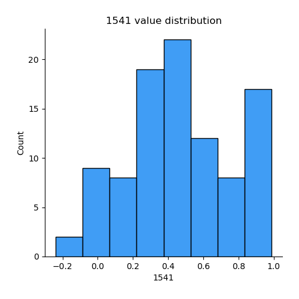
## Feature : 1542
- **Feature type** : continous
- **Missing** : 0.0%
- **Unique** : 97
- **Count** :97.0
- **Mean** :0.434312307955456
- **Std** :0.30736901251820126
- **Min** :-0.17175907483460112
- **25%th Percentile** : 0.21518338557730193
- **50%th Percentile** : 0.35858478622548035
- **75%th Percentile** : 0.6821159406365073
- **Max** :0.9691562436646192

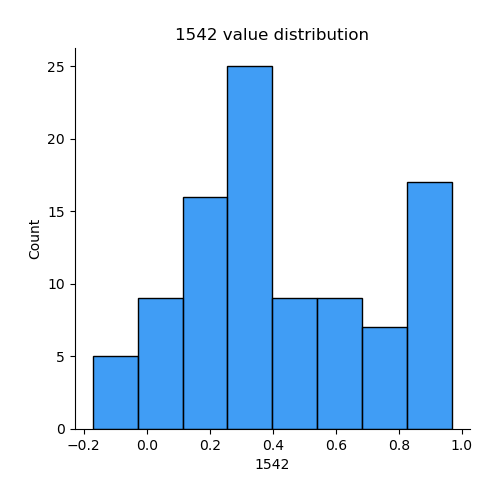
## Feature : 1543
- **Feature type** : continous
- **Missing** : 0.0%
- **Unique** : 97
- **Count** :97.0
- **Mean** :0.39283956770988393
- **Std** :0.3340281222563305
- **Min** :-0.49513508796926536
- **25%th Percentile** : 0.1655479769105323
- **50%th Percentile** : 0.3540422048050692
- **75%th Percentile** : 0.6711812143380721
- **Max** :0.974317172226956

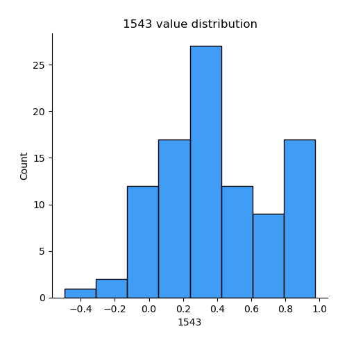
## Feature : 1544
- **Feature type** : continous
- **Missing** : 0.0%
- **Unique** : 97
- **Count** :97.0
- **Mean** :0.4222784907884754
- **Std** :0.33264203501730566
- **Min** :-0.4540062350328058
- **25%th Percentile** : 0.1567452417574364
- **50%th Percentile** : 0.4009299082955728
- **75%th Percentile** : 0.7157631685879431
- **Max** :0.9845762494510814

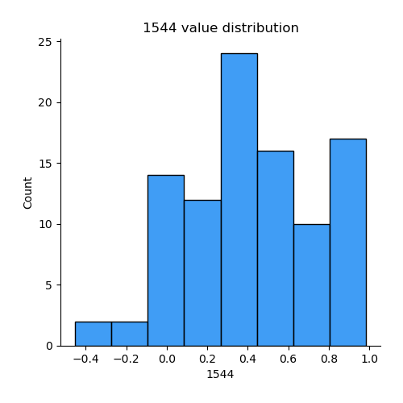
## Feature : 1545
- **Feature type** : continous
- **Missing** : 0.0%
- **Unique** : 97
- **Count** :97.0
- **Mean** :0.46170896573880416
- **Std** :0.32130188658409886
- **Min** :-0.5326719804789631
- **25%th Percentile** : 0.24162685441137985
- **50%th Percentile** : 0.436843729485688
- **75%th Percentile** : 0.7328901302682812
- **Max** :0.9816930298663843

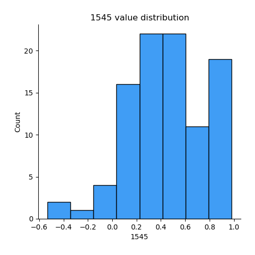
## Feature : 1546
- **Feature type** : continous
- **Missing** : 0.0%
- **Unique** : 97
- **Count** :97.0
- **Mean** :0.34578520477538366
- **Std** :0.35614676669685563
- **Min** :-0.5174183348667301
- **25%th Percentile** : 0.0771698561883417
- **50%th Percentile** : 0.2923640625151545
- **75%th Percentile** : 0.5724103281135169
- **Max** :0.9789862388721524

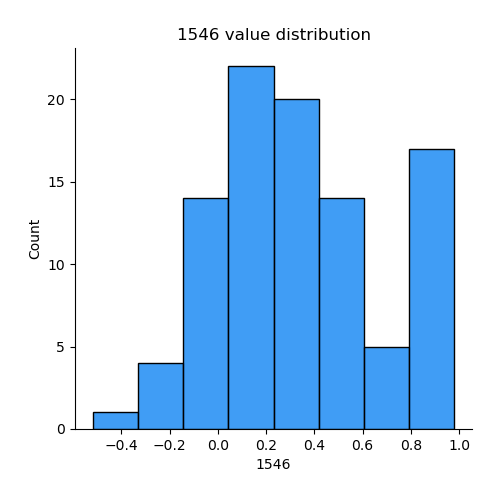
## Feature : 1547
- **Feature type** : continous
- **Missing** : 0.0%
- **Unique** : 97
- **Count** :97.0
- **Mean** :0.4555247018510631
- **Std** :0.3244461795026473
- **Min** :-0.3093280039661313
- **25%th Percentile** : 0.2585713531083841
- **50%th Percentile** : 0.40892715760503484
- **75%th Percentile** : 0.7341631841101469
- **Max** :0.9920448118130221

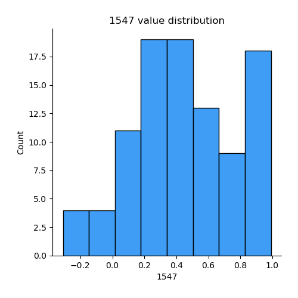
## Feature : 1548
- **Feature type** : continous
- **Missing** : 0.0%
- **Unique** : 97
- **Count** :97.0
- **Mean** :0.3892152912630031
- **Std** :0.3420077317729083
- **Min** :-0.5214110841044404
- **25%th Percentile** : 0.1772553073003371
- **50%th Percentile** : 0.3471404454575666
- **75%th Percentile** : 0.6727754320257401
- **Max** :0.9765014902802175

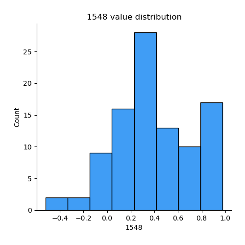
## Feature : 1549
- **Feature type** : continous
- **Missing** : 0.0%
- **Unique** : 97
- **Count** :97.0
- **Mean** :0.37599239533128903
- **Std** :0.3402707000586315
- **Min** :-0.3667845066572494
- **25%th Percentile** : 0.14093621564241662
- **50%th Percentile** : 0.3300721539869642
- **75%th Percentile** : 0.5787987352218358
- **Max** :0.984230174790305

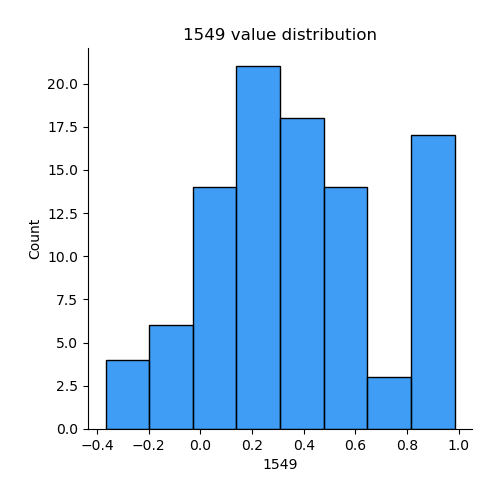
## Feature : 1550
- **Feature type** : continous
- **Missing** : 0.0%
- **Unique** : 97
- **Count** :97.0
- **Mean** :0.4313413846448079
- **Std** :0.30608491637410734
- **Min** :-0.09042396039268248
- **25%th Percentile** : 0.17394096826387806
- **50%th Percentile** : 0.4090956187568459
- **75%th Percentile** : 0.6041219801024823
- **Max** :0.981124160744745

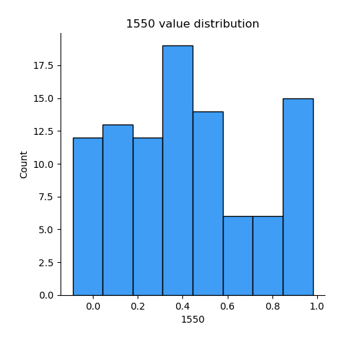
## Feature : 1551
- **Feature type** : continous
- **Missing** : 0.0%
- **Unique** : 97
- **Count** :97.0
- **Mean** :0.4021109926248166
- **Std** :0.3243101747099035
- **Min** :-0.29472238137481416
- **25%th Percentile** : 0.21484786323847138
- **50%th Percentile** : 0.37928823329750133
- **75%th Percentile** : 0.5751670287463182
- **Max** :0.9835068159898975

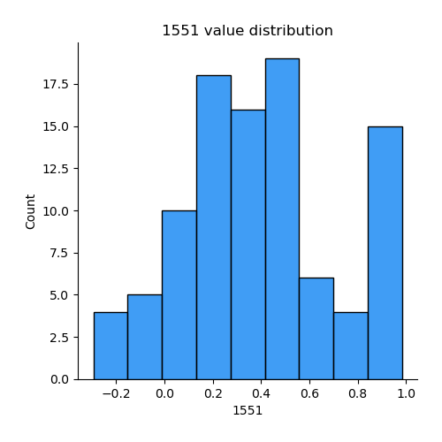
## Feature : 1552
- **Feature type** : continous
- **Missing** : 0.0%
- **Unique** : 97
- **Count** :97.0
- **Mean** :0.42752761970124514
- **Std** :0.3113352015373192
- **Min** :-0.23952329521130783
- **25%th Percentile** : 0.19242711762004966
- **50%th Percentile** : 0.4063784819566166
- **75%th Percentile** : 0.6417403292204515
- **Max** :0.9739437560990332

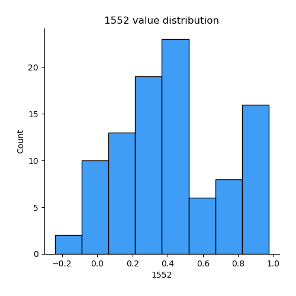
## Feature : 1553
- **Feature type** : continous
- **Missing** : 0.0%
- **Unique** : 97
- **Count** :97.0
- **Mean** :0.3089398869216933
- **Std** :0.3657956417845878
- **Min** :-0.40833659052328275
- **25%th Percentile** : 0.05524326432393242
- **50%th Percentile** : 0.24767521519967425
- **75%th Percentile** : 0.5338677110594123
- **Max** :0.9825030144270557

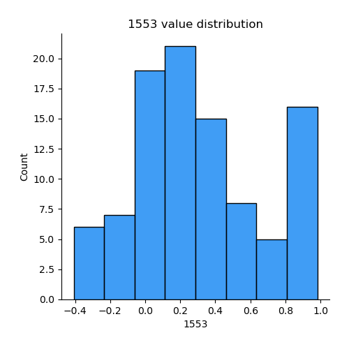
## Feature : 1554
- **Feature type** : continous
- **Missing** : 0.0%
- **Unique** : 97
- **Count** :97.0
- **Mean** :0.4213369638074274
- **Std** :0.3235729470075233
- **Min** :-0.2823975587693327
- **25%th Percentile** : 0.1903204060007674
- **50%th Percentile** : 0.41386357506796956
- **75%th Percentile** : 0.6132196511277769
- **Max** :0.982609412136526

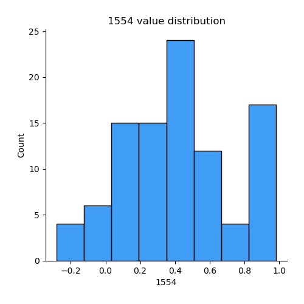
## Feature : 1555
- **Feature type** : continous
- **Missing** : 0.0%
- **Unique** : 97
- **Count** :97.0
- **Mean** :0.40145116321496666
- **Std** :0.3220002044274473
- **Min** :-0.18603125896772812
- **25%th Percentile** : 0.16419495966853115
- **50%th Percentile** : 0.39031543990666945
- **75%th Percentile** : 0.6105444558859738
- **Max** :0.9782206858882473

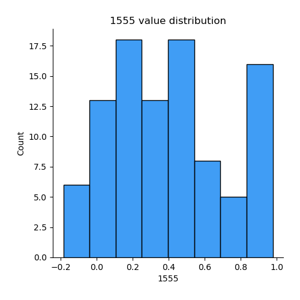
## Feature : 1556
- **Feature type** : continous
- **Missing** : 0.0%
- **Unique** : 97
- **Count** :97.0
- **Mean** :0.46105856281131746
- **Std** :0.3196427938403458
- **Min** :-0.6100328373704575
- **25%th Percentile** : 0.25313122660136483
- **50%th Percentile** : 0.43916653231982195
- **75%th Percentile** : 0.6884675613668622
- **Max** :0.9899506997951351

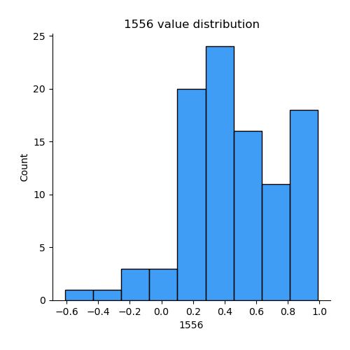
## Feature : 1557
- **Feature type** : continous
- **Missing** : 0.0%
- **Unique** : 97
- **Count** :97.0
- **Mean** :0.40250937286292465
- **Std** :0.3211168432860861
- **Min** :-0.22438017567208104
- **25%th Percentile** : 0.15960415289672855
- **50%th Percentile** : 0.3860347372067567
- **75%th Percentile** : 0.6229678992015605
- **Max** :0.9848641822985508

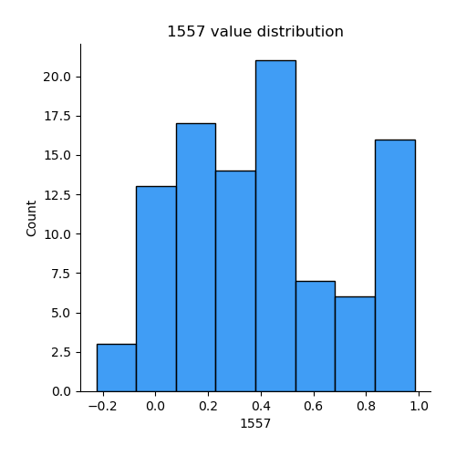
## Feature : 1558
- **Feature type** : continous
- **Missing** : 0.0%
- **Unique** : 97
- **Count** :97.0
- **Mean** :0.6172164369074877
- **Std** :0.2739775164722392
- **Min** :-0.23668302296475704
- **25%th Percentile** : 0.4573988757703162
- **50%th Percentile** : 0.6696778846820605
- **75%th Percentile** : 0.8362197261781662
- **Max** :0.9905432618261113

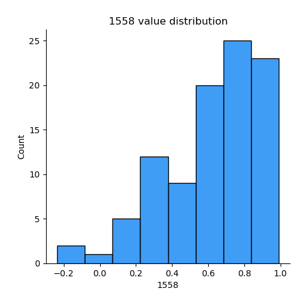
## Feature : 1559
- **Feature type** : continous
- **Missing** : 0.0%
- **Unique** : 97
- **Count** :97.0
- **Mean** :0.39091557813633876
- **Std** :0.325511076685253
- **Min** :-0.22334056737485602
- **25%th Percentile** : 0.13305555252887477
- **50%th Percentile** : 0.34065779125025525
- **75%th Percentile** : 0.6781285049828244
- **Max** :0.9766003687702551

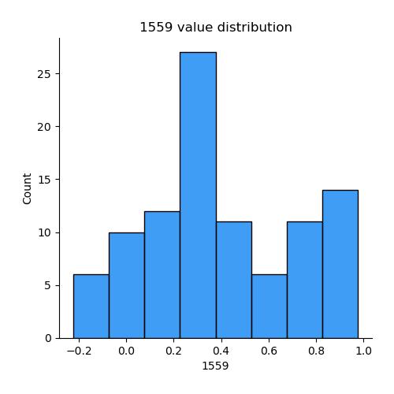
## Feature : 1590
- **Feature type** : continous
- **Missing** : 0.0%
- **Unique** : 3
- **Count** :97.0
- **Mean** :1.0
- **Std** :8.403417834083859e-17
- **Min** :0.9999999999999998
- **25%th Percentile** : 0.9999999999999999
- **50%th Percentile** : 1.0
- **75%th Percentile** : 1.0
- **Max** :1.0

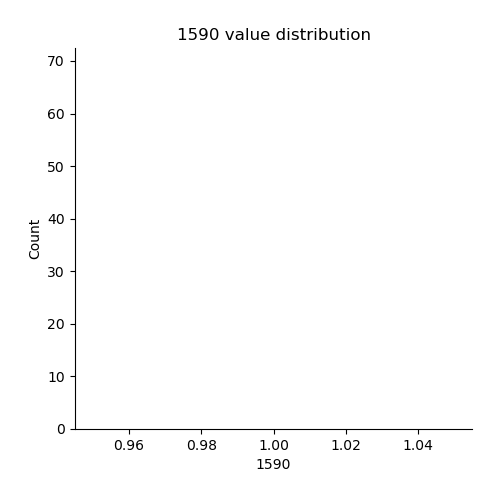
## Feature : 1591
- **Feature type** : continous
- **Missing** : 0.0%
- **Unique** : 97
- **Count** :97.0
- **Mean** :0.6980877788442943
- **Std** :0.22287698488917182
- **Min** :0.12756283361579818
- **25%th Percentile** : 0.5577255476490767
- **50%th Percentile** : 0.7302781639737926
- **75%th Percentile** : 0.8739469694006436
- **Max** :0.9907145870280452

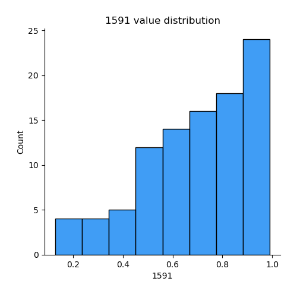
## Feature : 1592
- **Feature type** : continous
- **Missing** : 0.0%
- **Unique** : 97
- **Count** :97.0
- **Mean** :0.8258742700893468
- **Std** :0.12124845018953899
- **Min** :0.5330155658640368
- **25%th Percentile** : 0.7458716449214892
- **50%th Percentile** : 0.8270980777507433
- **75%th Percentile** : 0.9142821092564589
- **Max** :0.9968727608069201

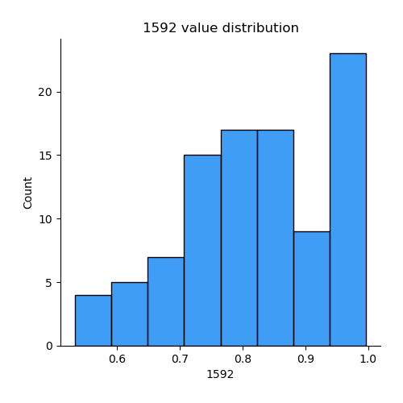
## Feature : 1593
- **Feature type** : continous
- **Missing** : 0.0%
- **Unique** : 97
- **Count** :97.0
- **Mean** :0.6603010707533348
- **Std** :0.21786765707161512
- **Min** :0.16352685068157125
- **25%th Percentile** : 0.49375742070706147
- **50%th Percentile** : 0.6580008568182432
- **75%th Percentile** : 0.8011838592627021
- **Max** :0.992647026851864

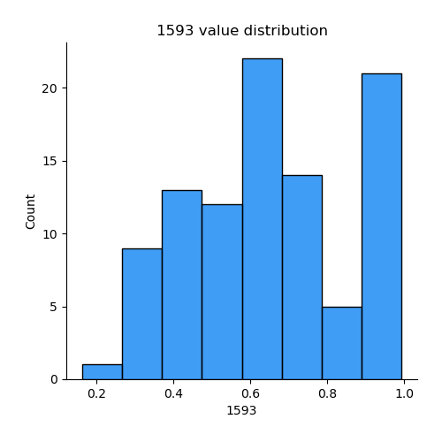
## Feature : 1594
- **Feature type** : continous
- **Missing** : 0.0%
- **Unique** : 97
- **Count** :97.0
- **Mean** :0.6631421037511296
- **Std** :0.24129777040560402
- **Min** :-0.1113241909864191
- **25%th Percentile** : 0.5002573266209912
- **50%th Percentile** : 0.684858178811766
- **75%th Percentile** : 0.8690015690846528
- **Max** :0.9828250170570377

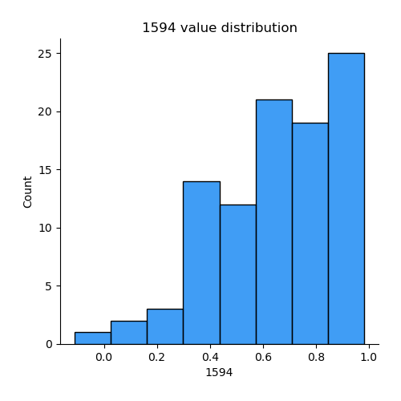
## Feature : 1595
- **Feature type** : continous
- **Missing** : 0.0%
- **Unique** : 97
- **Count** :97.0
- **Mean** :0.8121146134590338
- **Std** :0.15428097260040405
- **Min** :0.08493686896467101
- **25%th Percentile** : 0.7230212946828679
- **50%th Percentile** : 0.8387305191381281
- **75%th Percentile** : 0.9177305890588072
- **Max** :0.9980719976619623

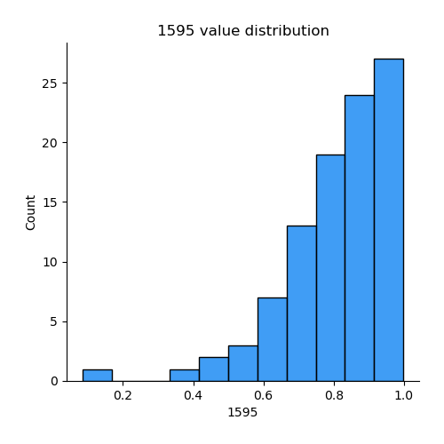
## Feature : 1596
- **Feature type** : continous
- **Missing** : 0.0%
- **Unique** : 97
- **Count** :97.0
- **Mean** :0.8155460027427556
- **Std** :0.13731937544465916
- **Min** :0.39836259596095963
- **25%th Percentile** : 0.7382965559165708
- **50%th Percentile** : 0.8300949157465731
- **75%th Percentile** : 0.9349043986214296
- **Max** :0.9970614694446195

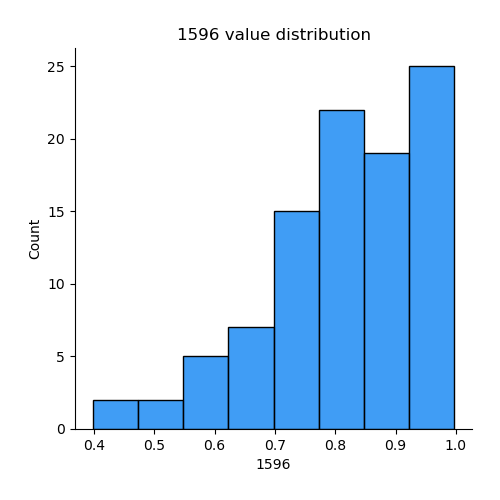
## Feature : 1597
- **Feature type** : continous
- **Missing** : 0.0%
- **Unique** : 97
- **Count** :97.0
- **Mean** :0.7429999198734146
- **Std** :0.1821916361307894
- **Min** :0.19486283181335737
- **25%th Percentile** : 0.6362104834489568
- **50%th Percentile** : 0.7510666527841343
- **75%th Percentile** : 0.8675334731075034
- **Max** :0.9948996645421414

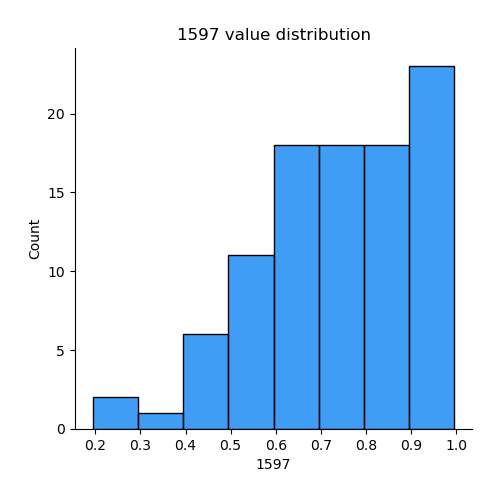
## Feature : 1598
- **Feature type** : continous
- **Missing** : 0.0%
- **Unique** : 97
- **Count** :97.0
- **Mean** :0.5481193366776913
- **Std** :0.32375734483770297
- **Min** :-0.34861242140208526
- **25%th Percentile** : 0.32047587413886613
- **50%th Percentile** : 0.5842123438992171
- **75%th Percentile** : 0.7794850733686024
- **Max** :0.9936644171477146

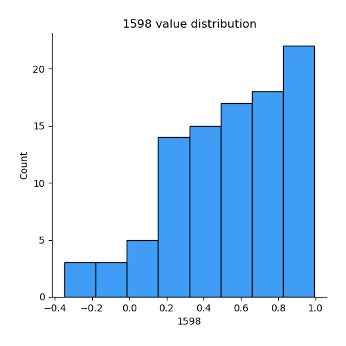
## Feature : 1599
- **Feature type** : continous
- **Missing** : 0.0%
- **Unique** : 97
- **Count** :97.0
- **Mean** :0.7595102787161833
- **Std** :0.17317926045919038
- **Min** :0.2639638521366085
- **25%th Percentile** : 0.6433325092204728
- **50%th Percentile** : 0.7568393030959176
- **75%th Percentile** : 0.898154122053924
- **Max** :0.995925102010856

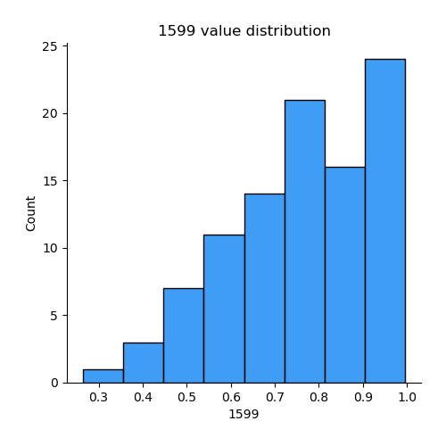
## Feature : 1600
- **Feature type** : continous
- **Missing** : 0.0%
- **Unique** : 97
- **Count** :97.0
- **Mean** :0.7103004938115398
- **Std** :0.1901595367363082
- **Min** :0.06835829707200086
- **25%th Percentile** : 0.6014336951483054
- **50%th Percentile** : 0.7068386125122611
- **75%th Percentile** : 0.8400997304515008
- **Max** :0.9914911487151876

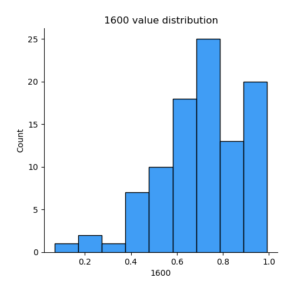
## Feature : 1601
- **Feature type** : continous
- **Missing** : 0.0%
- **Unique** : 97
- **Count** :97.0
- **Mean** :0.5877844632805361
- **Std** :0.28597105900945924
- **Min** :-0.2016332010839226
- **25%th Percentile** : 0.39817775327667415
- **50%th Percentile** : 0.5879826591347946
- **75%th Percentile** : 0.7969060512704752
- **Max** :0.9925309321174547

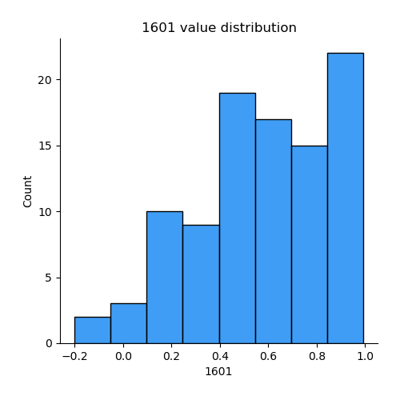
## Feature : 1602
- **Feature type** : continous
- **Missing** : 0.0%
- **Unique** : 97
- **Count** :97.0
- **Mean** :0.6041597296636677
- **Std** :0.26166485148041146
- **Min** :-0.00836823526293231
- **25%th Percentile** : 0.441806663124016
- **50%th Percentile** : 0.5844575492836398
- **75%th Percentile** : 0.7902005287064385
- **Max** :0.9905129620282987

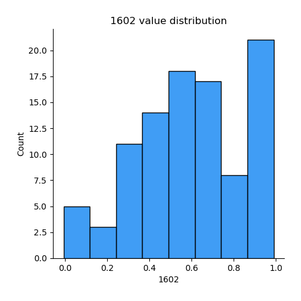
## Feature : 1603
- **Feature type** : continous
- **Missing** : 0.0%
- **Unique** : 97
- **Count** :97.0
- **Mean** :0.6194448586258796
- **Std** :0.2773134181126072
- **Min** :-0.06712094977035152
- **25%th Percentile** : 0.4501138164678535
- **50%th Percentile** : 0.6489612755055403
- **75%th Percentile** : 0.7856242661989395
- **Max** :0.9927745263598445

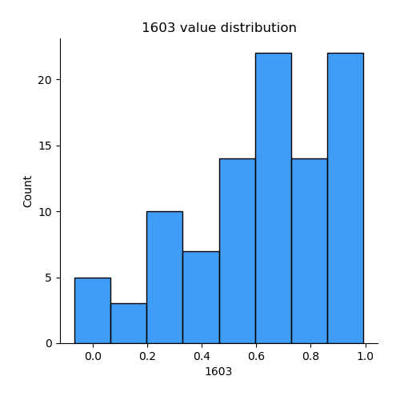
## Feature : 1604
- **Feature type** : continous
- **Missing** : 0.0%
- **Unique** : 97
- **Count** :97.0
- **Mean** :0.6963472644494338
- **Std** :0.22395577580967843
- **Min** :0.05327034016564705
- **25%th Percentile** : 0.5811378062426771
- **50%th Percentile** : 0.7373148804462728
- **75%th Percentile** : 0.8677795507588564
- **Max** :0.9905599222554766

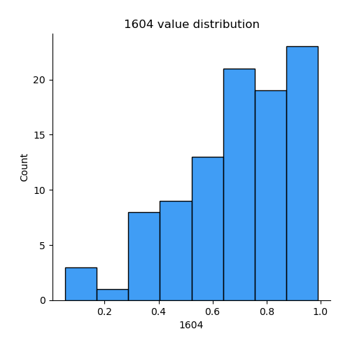
## Feature : 1605
- **Feature type** : continous
- **Missing** : 0.0%
- **Unique** : 97
- **Count** :97.0
- **Mean** :0.4271762170990712
- **Std** :0.33443716784988625
- **Min** :-0.40808169039568665
- **25%th Percentile** : 0.18816731749043694
- **50%th Percentile** : 0.3456602617239497
- **75%th Percentile** : 0.6480660836125144
- **Max** :0.9849943428440352

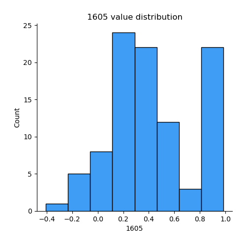
## Feature : 1606
- **Feature type** : continous
- **Missing** : 0.0%
- **Unique** : 97
- **Count** :97.0
- **Mean** :0.5841102644129356
- **Std** :0.2990669287629788
- **Min** :-0.2444547180016075
- **25%th Percentile** : 0.41416525097121876
- **50%th Percentile** : 0.5962150410749516
- **75%th Percentile** : 0.7784063705288432
- **Max** :0.993233128184701

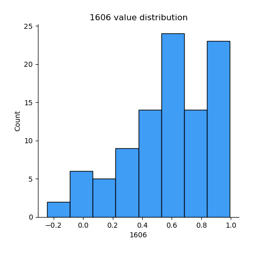
## Feature : 1607
- **Feature type** : continous
- **Missing** : 0.0%
- **Unique** : 97
- **Count** :97.0
- **Mean** :0.71916746322353
- **Std** :0.2301287049257242
- **Min** :-0.12042346339993518
- **25%th Percentile** : 0.5795979984623377
- **50%th Percentile** : 0.7691836877322644
- **75%th Percentile** : 0.8763044302352325
- **Max** :0.9944540421212372

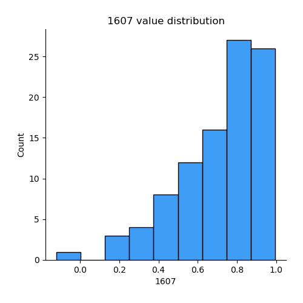
## Feature : 1608
- **Feature type** : continous
- **Missing** : 0.0%
- **Unique** : 97
- **Count** :97.0
- **Mean** :0.7105356714560482
- **Std** :0.1946295236489001
- **Min** :0.04916515061309375
- **25%th Percentile** : 0.5969745840662074
- **50%th Percentile** : 0.6997386861890162
- **75%th Percentile** : 0.8425458182269143
- **Max** :0.9912418042426732

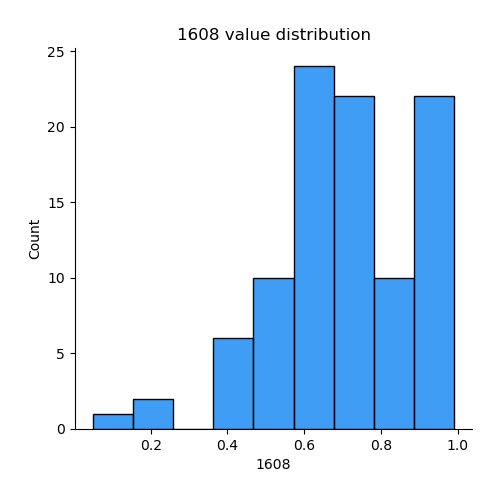
## Feature : 1609
- **Feature type** : continous
- **Missing** : 0.0%
- **Unique** : 97
- **Count** :97.0
- **Mean** :0.6475693982414955
- **Std** :0.2477384305675473
- **Min** :0.04161957932171447
- **25%th Percentile** : 0.4811695205191789
- **50%th Percentile** : 0.6709960047495861
- **75%th Percentile** : 0.8348745669783384
- **Max** :0.9911510740804632

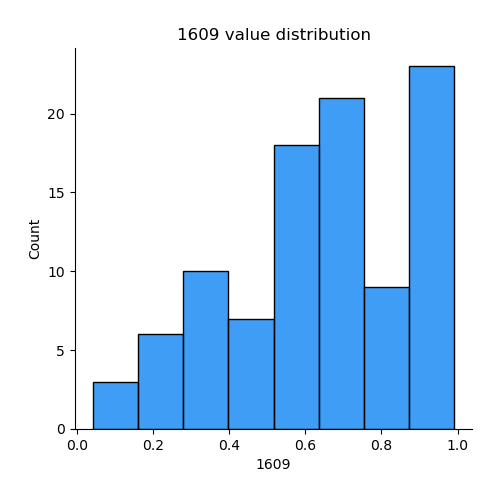
## Feature : 1610
- **Feature type** : continous
- **Missing** : 0.0%
- **Unique** : 97
- **Count** :97.0
- **Mean** :0.5472177965106761
- **Std** :0.274971423601633
- **Min** :-0.38149176096485066
- **25%th Percentile** : 0.3830120965280291
- **50%th Percentile** : 0.5356664643304319
- **75%th Percentile** : 0.705920260496722
- **Max** :0.9819797030655693

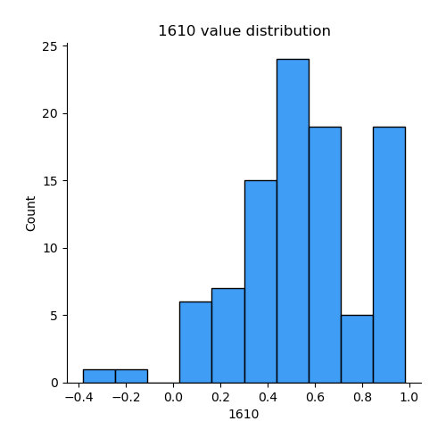
## Feature : 1611
- **Feature type** : continous
- **Missing** : 0.0%
- **Unique** : 97
- **Count** :97.0
- **Mean** :0.557305057262275
- **Std** :0.2745363929930606
- **Min** :0.07322747626554284
- **25%th Percentile** : 0.33292547341269096
- **50%th Percentile** : 0.5289719203474512
- **75%th Percentile** : 0.7948326556005908
- **Max** :0.9850421955377275

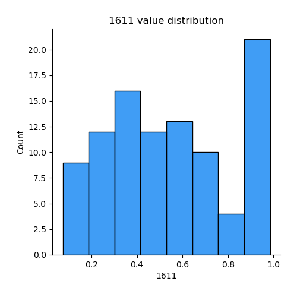
## Feature : 1643
- **Feature type** : continous
- **Missing** : 0.0%
- **Unique** : 3
- **Count** :97.0
- **Mean** :1.0
- **Std** :8.326672684688674e-17
- **Min** :0.9999999999999998
- **25%th Percentile** : 0.9999999999999999
- **50%th Percentile** : 1.0
- **75%th Percentile** : 1.0
- **Max** :1.0

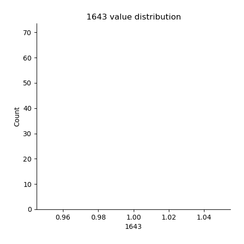
## Feature : 1644
- **Feature type** : continous
- **Missing** : 0.0%
- **Unique** : 97
- **Count** :97.0
- **Mean** :0.6851885346196508
- **Std** :0.22671580374930106
- **Min** :0.06527292425031486
- **25%th Percentile** : 0.5658786428077172
- **50%th Percentile** : 0.6900368307810186
- **75%th Percentile** : 0.8704962028450792
- **Max** :0.9913790887720196

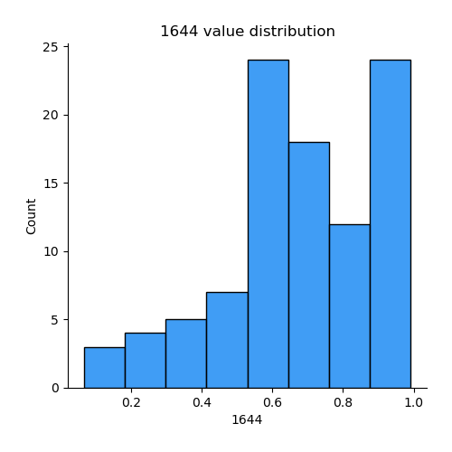
## Feature : 1645
- **Feature type** : continous
- **Missing** : 0.0%
- **Unique** : 97
- **Count** :97.0
- **Mean** :0.6743631703460738
- **Std** :0.22659111642531535
- **Min** :0.1125020326899898
- **25%th Percentile** : 0.5544548679026887
- **50%th Percentile** : 0.664862311805709
- **75%th Percentile** : 0.8662115814407999
- **Max** :0.9925003436753385

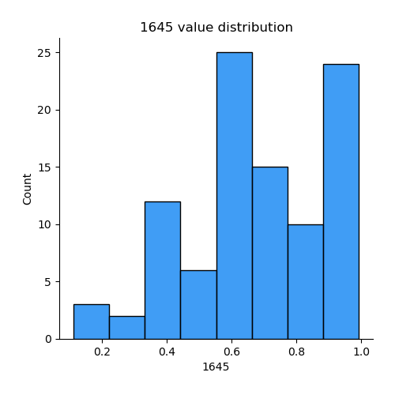
## Feature : 1646
- **Feature type** : continous
- **Missing** : 0.0%
- **Unique** : 97
- **Count** :97.0
- **Mean** :0.776392296567589
- **Std** :0.1604842232787888
- **Min** :0.3429210413109818
- **25%th Percentile** : 0.6638997741193299
- **50%th Percentile** : 0.7703448069574907
- **75%th Percentile** : 0.9101627803262083
- **Max** :0.9928155191160295

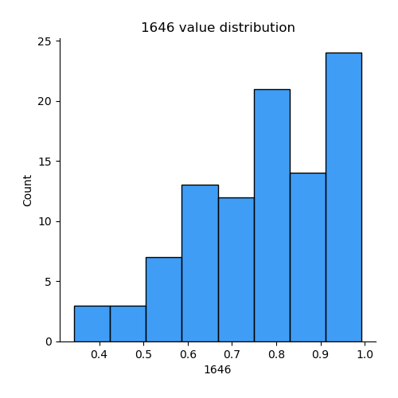
## Feature : 1647
- **Feature type** : continous
- **Missing** : 0.0%
- **Unique** : 97
- **Count** :97.0
- **Mean** :0.7012057816323107
- **Std** :0.20106159615798327
- **Min** :0.23134834104796773
- **25%th Percentile** : 0.5504801776497871
- **50%th Percentile** : 0.7068829239829648
- **75%th Percentile** : 0.8486329250737332
- **Max** :0.9894049581943792

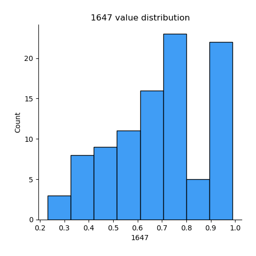
## Feature : 1648
- **Feature type** : continous
- **Missing** : 0.0%
- **Unique** : 97
- **Count** :97.0
- **Mean** :0.6931718862257256
- **Std** :0.21003096466107168
- **Min** :0.12945604948418551
- **25%th Percentile** : 0.531868656155087
- **50%th Percentile** : 0.7231855279666866
- **75%th Percentile** : 0.8793977604272711
- **Max** :0.9923573515322316

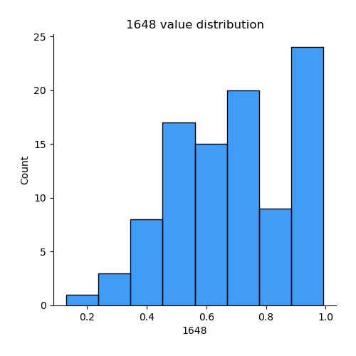
## Feature : 1649
- **Feature type** : continous
- **Missing** : 0.0%
- **Unique** : 97
- **Count** :97.0
- **Mean** :0.7743329044449611
- **Std** :0.1739542439836454
- **Min** :0.21853221394111869
- **25%th Percentile** : 0.6681279122208506
- **50%th Percentile** : 0.7713533505786367
- **75%th Percentile** : 0.9073079352135496
- **Max** :0.9961287221483012

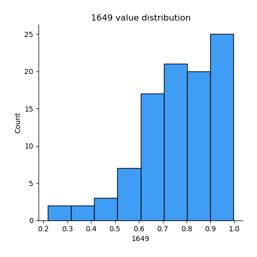
## Feature : 1650
- **Feature type** : continous
- **Missing** : 0.0%
- **Unique** : 97
- **Count** :97.0
- **Mean** :0.6034097159675209
- **Std** :0.26344797662625236
- **Min** :-0.11741857307088348
- **25%th Percentile** : 0.4491379450896273
- **50%th Percentile** : 0.5635842653380737
- **75%th Percentile** : 0.7967619231406645
- **Max** :0.9931363717008017

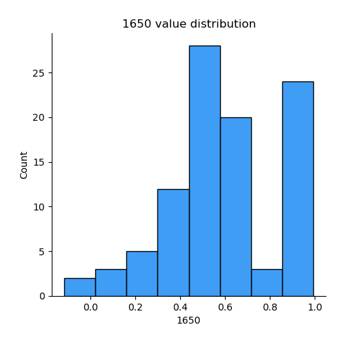
## Feature : 1651
- **Feature type** : continous
- **Missing** : 0.0%
- **Unique** : 97
- **Count** :97.0
- **Mean** :0.6114579222921155
- **Std** :0.2514972434739165
- **Min** :0.07168941713805983
- **25%th Percentile** : 0.45340041451836305
- **50%th Percentile** : 0.613122080251883
- **75%th Percentile** : 0.7880665852633715
- **Max** :0.9912152499932388

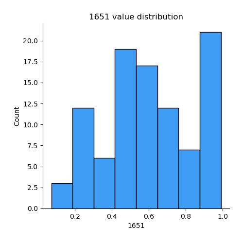
## Feature : 1652
- **Feature type** : continous
- **Missing** : 0.0%
- **Unique** : 97
- **Count** :97.0
- **Mean** :0.6685412498745905
- **Std** :0.2082748867185756
- **Min** :0.13063674487538798
- **25%th Percentile** : 0.5237049031361602
- **50%th Percentile** : 0.6613350010862146
- **75%th Percentile** : 0.814336301181249
- **Max** :0.9898366373762822

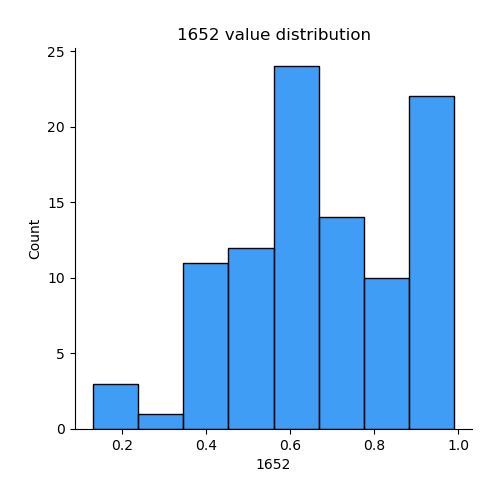
## Feature : 1653
- **Feature type** : continous
- **Missing** : 0.0%
- **Unique** : 97
- **Count** :97.0
- **Mean** :0.6502494713438227
- **Std** :0.24538016050316402
- **Min** :-0.17510314401855587
- **25%th Percentile** : 0.5012228584153183
- **50%th Percentile** : 0.6506076953299583
- **75%th Percentile** : 0.8080042925756291
- **Max** :0.9943860606556868

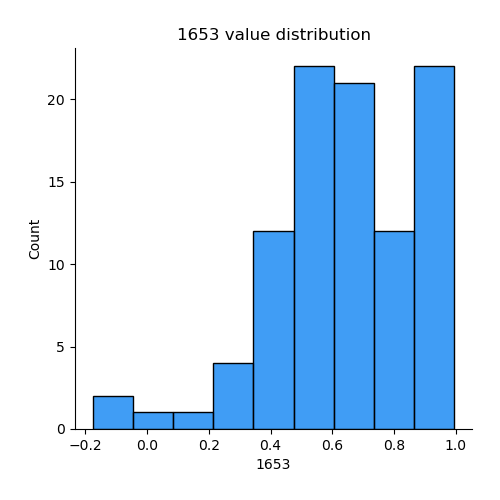
## Feature : 1654
- **Feature type** : continous
- **Missing** : 0.0%
- **Unique** : 97
- **Count** :97.0
- **Mean** :0.7207134222110787
- **Std** :0.19646634616847003
- **Min** :0.1992782473683054
- **25%th Percentile** : 0.6068074522743694
- **50%th Percentile** : 0.7364268037189915
- **75%th Percentile** : 0.8478654200980127
- **Max** :0.9954052573625595

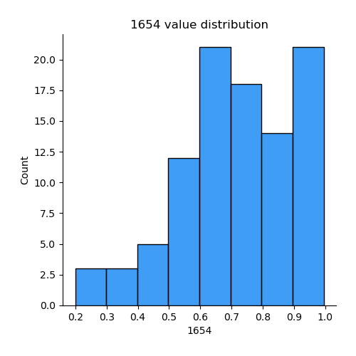
## Feature : 1655
- **Feature type** : continous
- **Missing** : 0.0%
- **Unique** : 97
- **Count** :97.0
- **Mean** :0.6705083646536493
- **Std** :0.2301320177472194
- **Min** :-0.11892382932550348
- **25%th Percentile** : 0.5218281682423594
- **50%th Percentile** : 0.6738046199850337
- **75%th Percentile** : 0.8093936409855329
- **Max** :0.9946895081776045

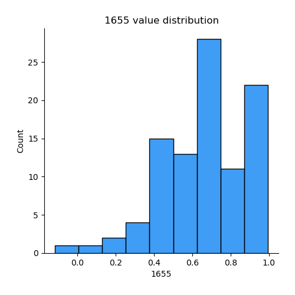
## Feature : 1656
- **Feature type** : continous
- **Missing** : 0.0%
- **Unique** : 97
- **Count** :97.0
- **Mean** :0.879790095383373
- **Std** :0.09196514111355895
- **Min** :0.6080208253310638
- **25%th Percentile** : 0.834666643619626
- **50%th Percentile** : 0.8869485561235939
- **75%th Percentile** : 0.9544413457212519
- **Max** :0.9978079054178907

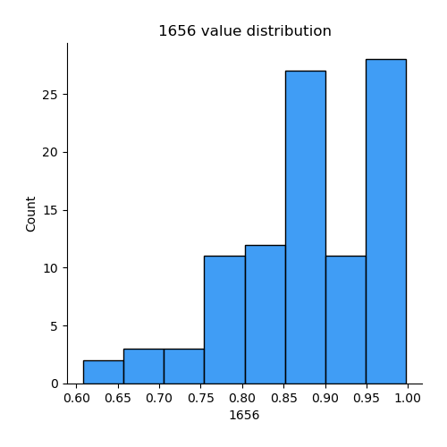
## Feature : 1657
- **Feature type** : continous
- **Missing** : 0.0%
- **Unique** : 97
- **Count** :97.0
- **Mean** :0.5478972899737824
- **Std** :0.27649280752035177
- **Min** :0.013045312326906035
- **25%th Percentile** : 0.3434704227815655
- **50%th Percentile** : 0.5139184582858684
- **75%th Percentile** : 0.7046587638941821
- **Max** :0.9906788611146186

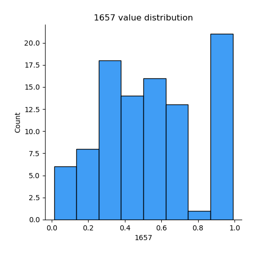
## Feature : 1658
- **Feature type** : continous
- **Missing** : 0.0%
- **Unique** : 97
- **Count** :97.0
- **Mean** :0.704405466353007
- **Std** :0.20934416677030931
- **Min** :0.1893894477223107
- **25%th Percentile** : 0.598329707440548
- **50%th Percentile** : 0.7070007653358823
- **75%th Percentile** : 0.8592476273505075
- **Max** :0.9955765293338467

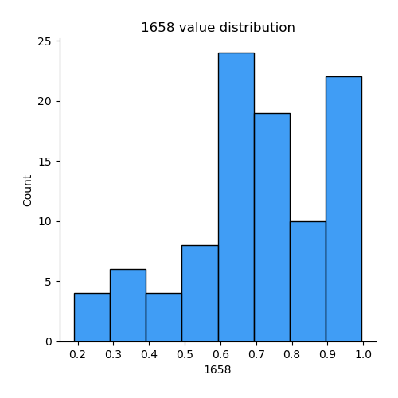
## Feature : 1659
- **Feature type** : continous
- **Missing** : 0.0%
- **Unique** : 97
- **Count** :97.0
- **Mean** :0.7863371030333196
- **Std** :0.18307585322330566
- **Min** :0.08030784123715021
- **25%th Percentile** : 0.7109608343959928
- **50%th Percentile** : 0.8096054476771254
- **75%th Percentile** : 0.9308469643383234
- **Max** :0.9965614068752432

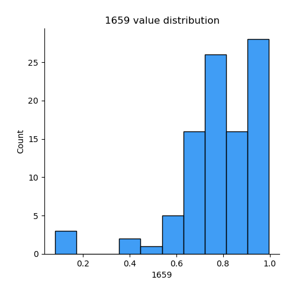
## Feature : 1660
- **Feature type** : continous
- **Missing** : 0.0%
- **Unique** : 97
- **Count** :97.0
- **Mean** :0.698313807418912
- **Std** :0.2151142327347503
- **Min** :0.16663853509777404
- **25%th Percentile** : 0.5726123458716502
- **50%th Percentile** : 0.6877965377380222
- **75%th Percentile** : 0.8777247106241083
- **Max** :0.9922571101231837

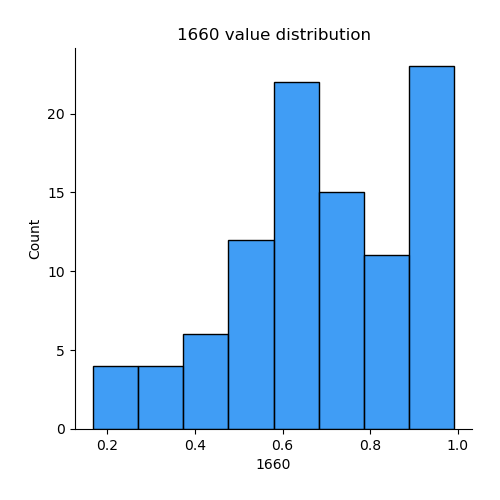
## Feature : 1661
- **Feature type** : continous
- **Missing** : 0.0%
- **Unique** : 97
- **Count** :97.0
- **Mean** :0.7785328747377637
- **Std** :0.19136390082123456
- **Min** :0.10721487158241011
- **25%th Percentile** : 0.6982459823558346
- **50%th Percentile** : 0.8056431274189911
- **75%th Percentile** : 0.9248712951229846
- **Max** :0.9975112590625642

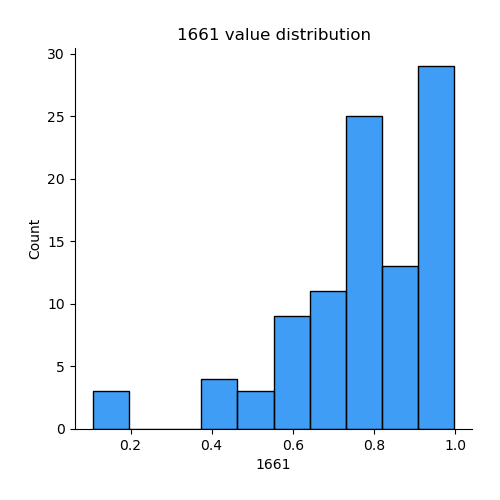
## Feature : 1662
- **Feature type** : continous
- **Missing** : 0.0%
- **Unique** : 97
- **Count** :97.0
- **Mean** :0.40938162603643563
- **Std** :0.32548089734299035
- **Min** :-0.16844097330428878
- **25%th Percentile** : 0.18942853871854876
- **50%th Percentile** : 0.3764672774689585
- **75%th Percentile** : 0.5995744536686042
- **Max** :0.9789361390503221

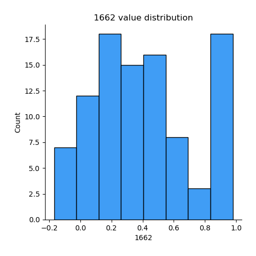
## Feature : 1663
- **Feature type** : continous
- **Missing** : 0.0%
- **Unique** : 97
- **Count** :97.0
- **Mean** :0.5811926393752197
- **Std** :0.2733663027322603
- **Min** :-0.03465918736443054
- **25%th Percentile** : 0.3889339119252165
- **50%th Percentile** : 0.5514219489714309
- **75%th Percentile** : 0.8031773672401616
- **Max** :0.9891719257967078

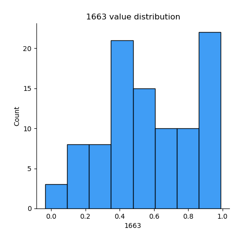
## Feature : 1696
- **Feature type** : continous
- **Missing** : 0.0%
- **Unique** : 3
- **Count** :97.0
- **Mean** :1.0
- **Std** :7.430342639414468e-17
- **Min** :0.9999999999999998
- **25%th Percentile** : 0.9999999999999999
- **50%th Percentile** : 1.0
- **75%th Percentile** : 1.0
- **Max** :1.0

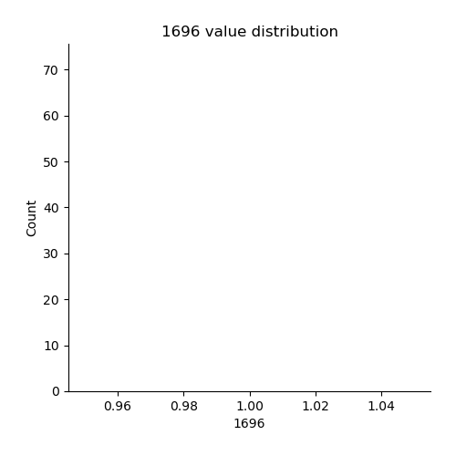
## Feature : 1697
- **Feature type** : continous
- **Missing** : 0.0%
- **Unique** : 97
- **Count** :97.0
- **Mean** :0.6259247831634133
- **Std** :0.23460016384910454
- **Min** :0.08989142250808296
- **25%th Percentile** : 0.47537864469955776
- **50%th Percentile** : 0.6093543572518934
- **75%th Percentile** : 0.7631834828740987
- **Max** :0.992085093760219

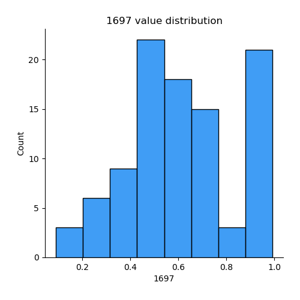
## Feature : 1698
- **Feature type** : continous
- **Missing** : 0.0%
- **Unique** : 97
- **Count** :97.0
- **Mean** :0.5906055370862306
- **Std** :0.2667088480435202
- **Min** :-0.032663538414793726
- **25%th Percentile** : 0.4288997794708991
- **50%th Percentile** : 0.5677819619761416
- **75%th Percentile** : 0.7908162503316918
- **Max** :0.98624888628456

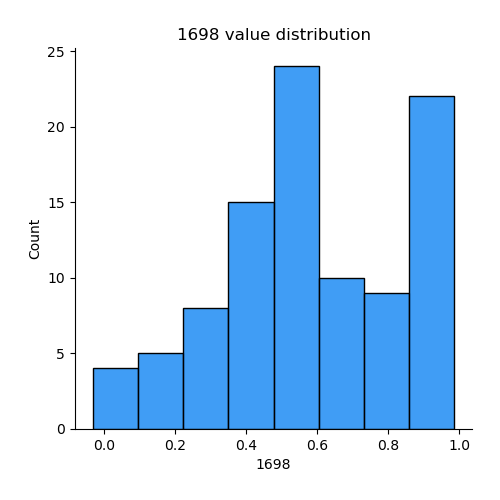
## Feature : 1699
- **Feature type** : continous
- **Missing** : 0.0%
- **Unique** : 97
- **Count** :97.0
- **Mean** :0.6788108441256561
- **Std** :0.21321655580213583
- **Min** :0.0530732573689033
- **25%th Percentile** : 0.5340022749559226
- **50%th Percentile** : 0.69358693929869
- **75%th Percentile** : 0.8311199276844397
- **Max** :0.993428777500404

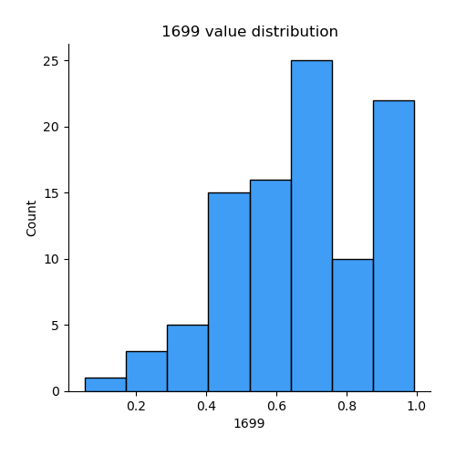
## Feature : 1700
- **Feature type** : continous
- **Missing** : 0.0%
- **Unique** : 97
- **Count** :97.0
- **Mean** :0.6563748283473598
- **Std** :0.2240898148184042
- **Min** :0.15096628090493097
- **25%th Percentile** : 0.5156882601075576
- **50%th Percentile** : 0.6641993451953516
- **75%th Percentile** : 0.7778433666290978
- **Max** :0.9944332643149874

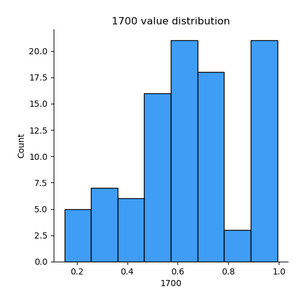
## Feature : 1701
- **Feature type** : continous
- **Missing** : 0.0%
- **Unique** : 97
- **Count** :97.0
- **Mean** :0.8129311345771767
- **Std** :0.1312344361888483
- **Min** :0.41981554829070666
- **25%th Percentile** : 0.7175653129974451
- **50%th Percentile** : 0.8126223236317609
- **75%th Percentile** : 0.905908231534576
- **Max** :0.9962166258940168

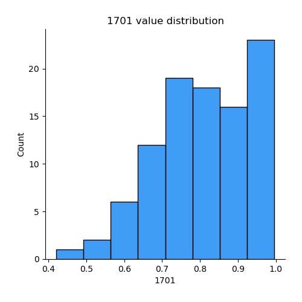
## Feature : 1702
- **Feature type** : continous
- **Missing** : 0.0%
- **Unique** : 97
- **Count** :97.0
- **Mean** :0.5028856934797344
- **Std** :0.32876599415767027
- **Min** :-0.5165970451192599
- **25%th Percentile** : 0.2884876562234354
- **50%th Percentile** : 0.49643916801776977
- **75%th Percentile** : 0.7045814318606779
- **Max** :0.9936117092121284

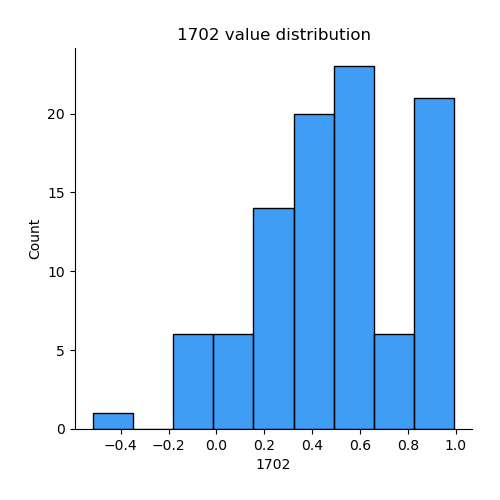
## Feature : 1703
- **Feature type** : continous
- **Missing** : 0.0%
- **Unique** : 97
- **Count** :97.0
- **Mean** :0.6919687611165585
- **Std** :0.20481348658001822
- **Min** :0.1701029482851331
- **25%th Percentile** : 0.5419822338816485
- **50%th Percentile** : 0.6981541045405221
- **75%th Percentile** : 0.857625834830641
- **Max** :0.9938678288416302

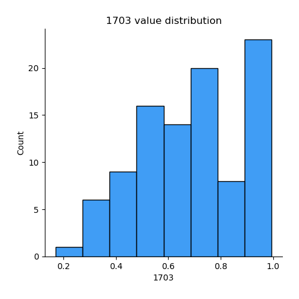
## Feature : 1704
- **Feature type** : continous
- **Missing** : 0.0%
- **Unique** : 97
- **Count** :97.0
- **Mean** :0.5707117852530653
- **Std** :0.2564541860502478
- **Min** :-0.2552598035344969
- **25%th Percentile** : 0.413103067637307
- **50%th Percentile** : 0.538724378961615
- **75%th Percentile** : 0.7389361424373192
- **Max** :0.986169551505122

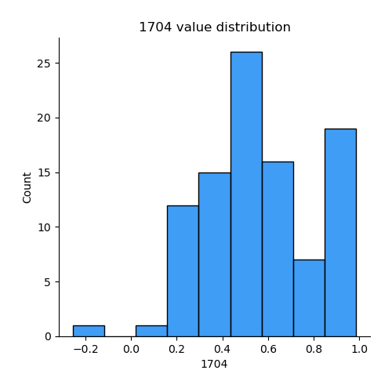
## Feature : 1705
- **Feature type** : continous
- **Missing** : 0.0%
- **Unique** : 97
- **Count** :97.0
- **Mean** :0.5651320599545895
- **Std** :0.28239771480715686
- **Min** :-0.11160609426802928
- **25%th Percentile** : 0.3986277690981454
- **50%th Percentile** : 0.5403589169518729
- **75%th Percentile** : 0.7234579051455956
- **Max** :0.9916085226649625

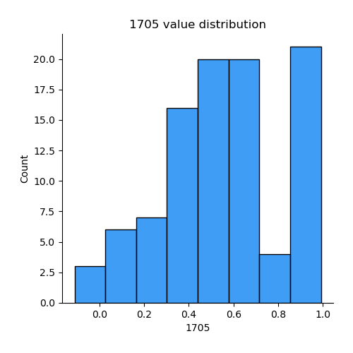
## Feature : 1706
- **Feature type** : continous
- **Missing** : 0.0%
- **Unique** : 97
- **Count** :97.0
- **Mean** :0.5789943458202206
- **Std** :0.2681638849114101
- **Min** :-0.16428991957701963
- **25%th Percentile** : 0.41912113395037687
- **50%th Percentile** : 0.5670167660384053
- **75%th Percentile** : 0.7437843840407501
- **Max** :0.9893880286140879

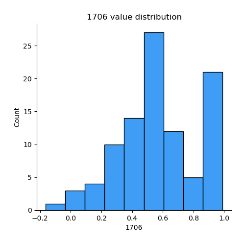
## Feature : 1707
- **Feature type** : continous
- **Missing** : 0.0%
- **Unique** : 97
- **Count** :97.0
- **Mean** :0.5962878321887584
- **Std** :0.27006363175983605
- **Min** :-0.06361731367845352
- **25%th Percentile** : 0.4216514225907084
- **50%th Percentile** : 0.5926378750589285
- **75%th Percentile** : 0.7683367158680054
- **Max** :0.9916357680342422

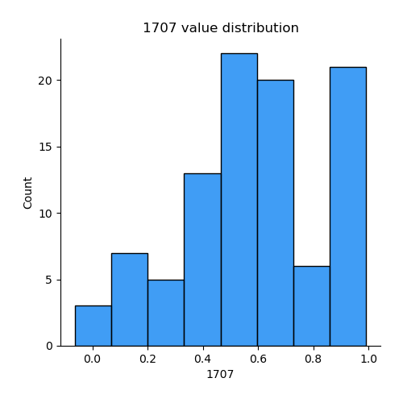
## Feature : 1708
- **Feature type** : continous
- **Missing** : 0.0%
- **Unique** : 97
- **Count** :97.0
- **Mean** :0.6306199979633595
- **Std** :0.25066970393240956
- **Min** :-0.15513467710607748
- **25%th Percentile** : 0.4788553461895603
- **50%th Percentile** : 0.6160094590878694
- **75%th Percentile** : 0.8147304457500114
- **Max** :0.9908713866685698

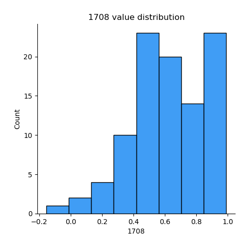
## Feature : 1709
- **Feature type** : continous
- **Missing** : 0.0%
- **Unique** : 97
- **Count** :97.0
- **Mean** :0.4707436984537049
- **Std** :0.3119196358848812
- **Min** :-0.10772670018172616
- **25%th Percentile** : 0.2156472936741728
- **50%th Percentile** : 0.4319640746506217
- **75%th Percentile** : 0.6304294089077198
- **Max** :0.988867374866223

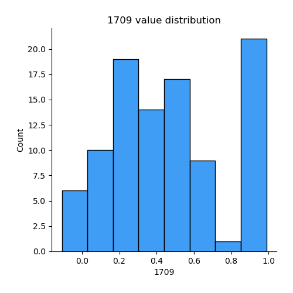
## Feature : 1710
- **Feature type** : continous
- **Missing** : 0.0%
- **Unique** : 97
- **Count** :97.0
- **Mean** :0.6028743624365384
- **Std** :0.2757029245770238
- **Min** :-0.2291290437483754
- **25%th Percentile** : 0.43686331423668834
- **50%th Percentile** : 0.6006801953463277
- **75%th Percentile** : 0.7868363430292737
- **Max** :0.9941818910126229

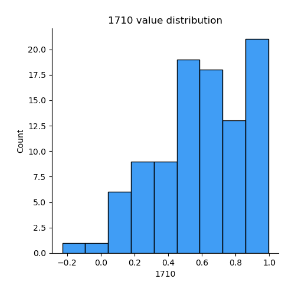
## Feature : 1711
- **Feature type** : continous
- **Missing** : 0.0%
- **Unique** : 97
- **Count** :97.0
- **Mean** :0.6586003799341489
- **Std** :0.24371550382465693
- **Min** :-0.0868410757347129
- **25%th Percentile** : 0.5187714915134599
- **50%th Percentile** : 0.6682535647779088
- **75%th Percentile** : 0.8510147555598483
- **Max** :0.9939375924181141

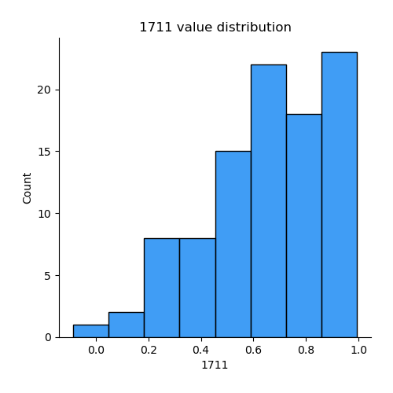
## Feature : 1712
- **Feature type** : continous
- **Missing** : 0.0%
- **Unique** : 97
- **Count** :97.0
- **Mean** :0.6942090577652632
- **Std** :0.19779793856783195
- **Min** :0.18807100659929227
- **25%th Percentile** : 0.5595853824026185
- **50%th Percentile** : 0.6995045101416474
- **75%th Percentile** : 0.831465162991218
- **Max** :0.9915651620251127

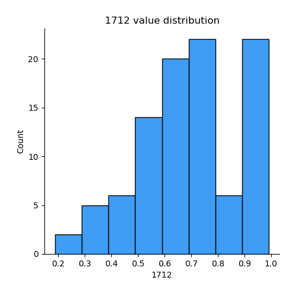
## Feature : 1713
- **Feature type** : continous
- **Missing** : 0.0%
- **Unique** : 97
- **Count** :97.0
- **Mean** :0.6347645211164957
- **Std** :0.25367801325639255
- **Min** :-0.06750462626408747
- **25%th Percentile** : 0.4938071703948688
- **50%th Percentile** : 0.6313254715165812
- **75%th Percentile** : 0.8089918970290471
- **Max** :0.9910585517178364

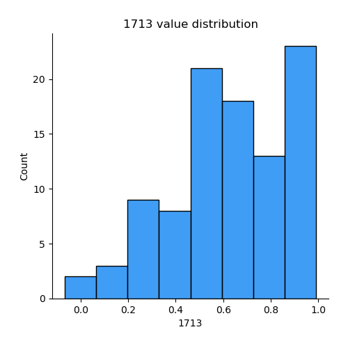
## Feature : 1714
- **Feature type** : continous
- **Missing** : 0.0%
- **Unique** : 97
- **Count** :97.0
- **Mean** :0.5635950404381929
- **Std** :0.26121016530929564
- **Min** :-0.15403405212631094
- **25%th Percentile** : 0.41615768655212326
- **50%th Percentile** : 0.5730068413613904
- **75%th Percentile** : 0.711188389619268
- **Max** :0.9846810146896833

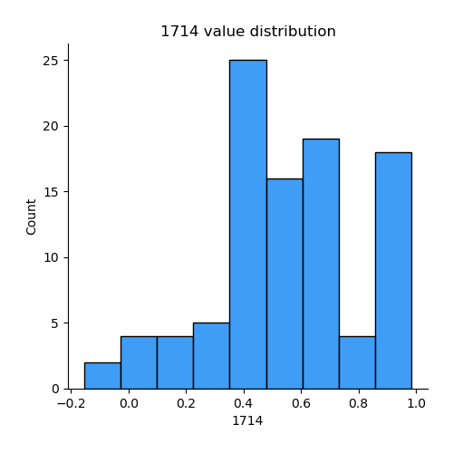
## Feature : 1715
- **Feature type** : continous
- **Missing** : 0.0%
- **Unique** : 97
- **Count** :97.0
- **Mean** :0.5464591516578955
- **Std** :0.26872005626755885
- **Min** :-0.023773426296605605
- **25%th Percentile** : 0.3391294913660841
- **50%th Percentile** : 0.521042312471821
- **75%th Percentile** : 0.7443889659175998
- **Max** :0.9871894708238348

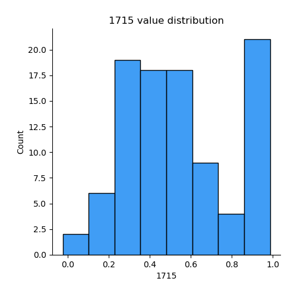
## Feature : 1749
- **Feature type** : continous
- **Missing** : 0.0%
- **Unique** : 3
- **Count** :97.0
- **Mean** :1.0
- **Std** :7.93181640714469e-17
- **Min** :0.9999999999999998
- **25%th Percentile** : 0.9999999999999999
- **50%th Percentile** : 1.0
- **75%th Percentile** : 1.0
- **Max** :1.0

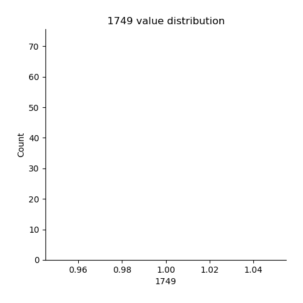
## Feature : 1750
- **Feature type** : continous
- **Missing** : 0.0%
- **Unique** : 97
- **Count** :97.0
- **Mean** :0.6328741950398407
- **Std** :0.2514903330855631
- **Min** :-0.078163596786334
- **25%th Percentile** : 0.4612629607925176
- **50%th Percentile** : 0.6401999960111272
- **75%th Percentile** : 0.8218705406147304
- **Max** :0.986184314140132

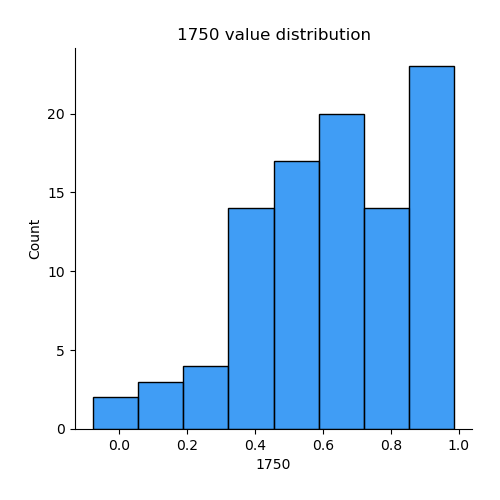
## Feature : 1751
- **Feature type** : continous
- **Missing** : 0.0%
- **Unique** : 97
- **Count** :97.0
- **Mean** :0.6132918506665356
- **Std** :0.22484029385718676
- **Min** :0.136859543025709
- **25%th Percentile** : 0.453414306121951
- **50%th Percentile** : 0.5736896136378212
- **75%th Percentile** : 0.7609275765957392
- **Max** :0.9889434740423889

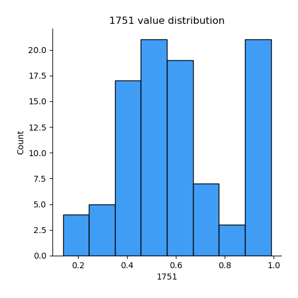
## Feature : 1752
- **Feature type** : continous
- **Missing** : 0.0%
- **Unique** : 97
- **Count** :97.0
- **Mean** :0.6672645450036518
- **Std** :0.20653600400034633
- **Min** :0.14224571570158465
- **25%th Percentile** : 0.5357336834022595
- **50%th Percentile** : 0.6379202734114956
- **75%th Percentile** : 0.8027488979886124
- **Max** :0.9927161827817101

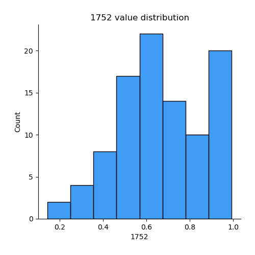
## Feature : 1753
- **Feature type** : continous
- **Missing** : 0.0%
- **Unique** : 97
- **Count** :97.0
- **Mean** :0.662391626591788
- **Std** :0.24006796204162165
- **Min** :-0.04097853014303201
- **25%th Percentile** : 0.5240111702011186
- **50%th Percentile** : 0.6690111936372392
- **75%th Percentile** : 0.8480888536460154
- **Max** :0.9933193504102821

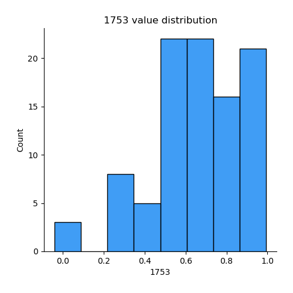
## Feature : 1754
- **Feature type** : continous
- **Missing** : 0.0%
- **Unique** : 97
- **Count** :97.0
- **Mean** :0.6421555114391546
- **Std** :0.24718583827790525
- **Min** :0.10939554344473124
- **25%th Percentile** : 0.4608717903719407
- **50%th Percentile** : 0.65151187542582
- **75%th Percentile** : 0.8237691105455326
- **Max** :0.9974452727672588

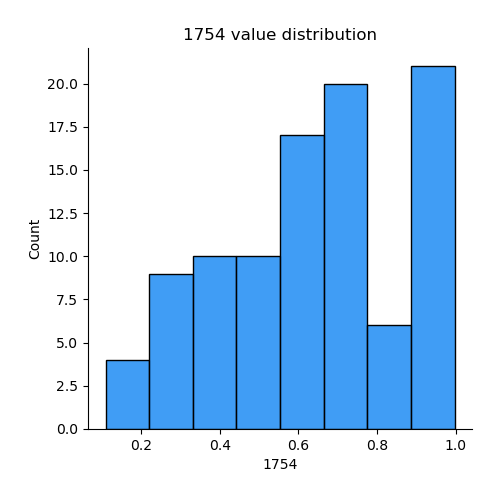
## Feature : 1755
- **Feature type** : continous
- **Missing** : 0.0%
- **Unique** : 97
- **Count** :97.0
- **Mean** :0.5911794601046076
- **Std** :0.2542961685851857
- **Min** :0.10406423064328986
- **25%th Percentile** : 0.3788397679008996
- **50%th Percentile** : 0.5663398725856637
- **75%th Percentile** : 0.7592280615911929
- **Max** :0.9923634367854907

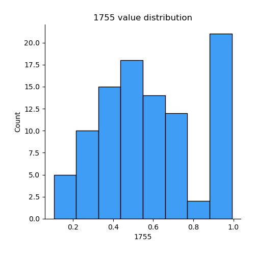
## Feature : 1756
- **Feature type** : continous
- **Missing** : 0.0%
- **Unique** : 97
- **Count** :97.0
- **Mean** :0.6393497007786056
- **Std** :0.2069514337175627
- **Min** :0.03145548853449917
- **25%th Percentile** : 0.5040384139835266
- **50%th Percentile** : 0.5961696472053979
- **75%th Percentile** : 0.7665386617872664
- **Max** :0.9867088476372068

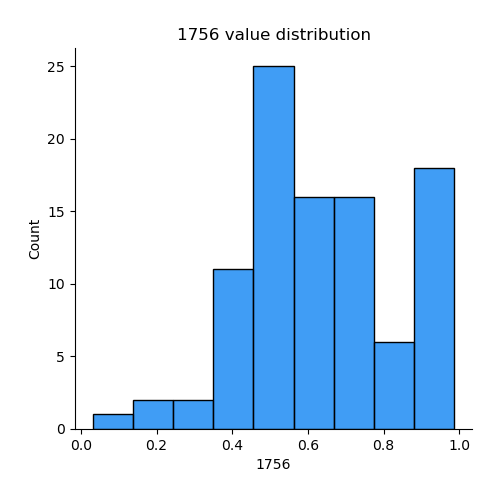
## Feature : 1757
- **Feature type** : continous
- **Missing** : 0.0%
- **Unique** : 97
- **Count** :97.0
- **Mean** :0.718743808465827
- **Std** :0.19581994774957137
- **Min** :0.18565951404410175
- **25%th Percentile** : 0.6125340129322863
- **50%th Percentile** : 0.7146641138837758
- **75%th Percentile** : 0.8729592187115361
- **Max** :0.9966599212106876

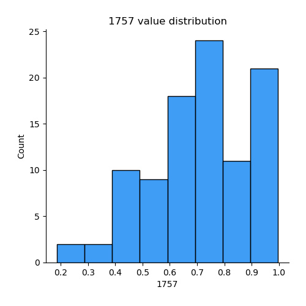
## Feature : 1758
- **Feature type** : continous
- **Missing** : 0.0%
- **Unique** : 97
- **Count** :97.0
- **Mean** :0.721702484239925
- **Std** :0.19954796032595376
- **Min** :0.24184636782312172
- **25%th Percentile** : 0.5736537001568882
- **50%th Percentile** : 0.7377177519483445
- **75%th Percentile** : 0.8719059667764398
- **Max** :0.9940186311028225

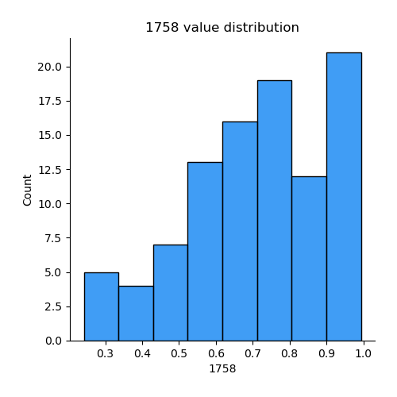
## Feature : 1759
- **Feature type** : continous
- **Missing** : 0.0%
- **Unique** : 97
- **Count** :97.0
- **Mean** :0.7412146454132867
- **Std** :0.18891015520388338
- **Min** :0.10788306338980175
- **25%th Percentile** : 0.6318065058633547
- **50%th Percentile** : 0.7459015660308106
- **75%th Percentile** : 0.8884588220710014
- **Max** :0.9963076323470034

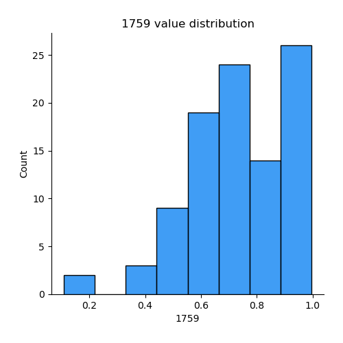
## Feature : 1760
- **Feature type** : continous
- **Missing** : 0.0%
- **Unique** : 97
- **Count** :97.0
- **Mean** :0.6987196014987729
- **Std** :0.19989589407041772
- **Min** :0.10281402521483483
- **25%th Percentile** : 0.5514224552224427
- **50%th Percentile** : 0.6789597408248447
- **75%th Percentile** : 0.8655681970288196
- **Max** :0.9919263018796975

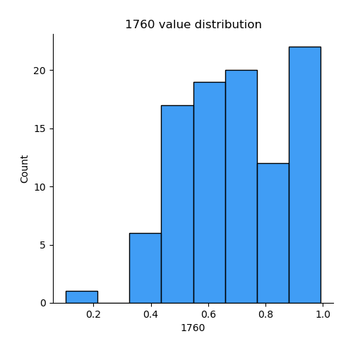
## Feature : 1761
- **Feature type** : continous
- **Missing** : 0.0%
- **Unique** : 97
- **Count** :97.0
- **Mean** :0.5860837754205791
- **Std** :0.27071424037880293
- **Min** :-0.11364677309375538
- **25%th Percentile** : 0.39687858713936264
- **50%th Percentile** : 0.565196413938575
- **75%th Percentile** : 0.7812419469599987
- **Max** :0.9904837994047248

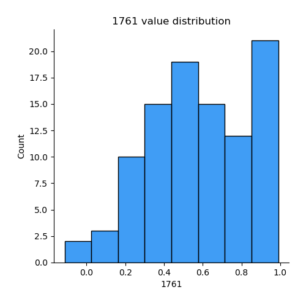
## Feature : 1762
- **Feature type** : continous
- **Missing** : 0.0%
- **Unique** : 97
- **Count** :97.0
- **Mean** :0.6759005333976326
- **Std** :0.22951671328470527
- **Min** :0.08030848775032773
- **25%th Percentile** : 0.5219620202708315
- **50%th Percentile** : 0.6912764082994199
- **75%th Percentile** : 0.8516071918024554
- **Max** :0.995220997054064

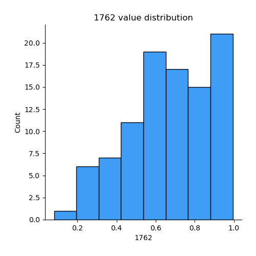
## Feature : 1763
- **Feature type** : continous
- **Missing** : 0.0%
- **Unique** : 97
- **Count** :97.0
- **Mean** :0.6800671404754429
- **Std** :0.2143191406345117
- **Min** :0.22382543771072372
- **25%th Percentile** : 0.5086550392632992
- **50%th Percentile** : 0.6765604103503087
- **75%th Percentile** : 0.839112799929855
- **Max** :0.9950850798115942

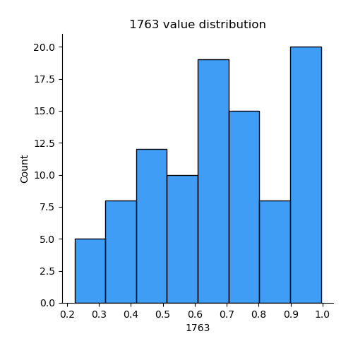
## Feature : 1764
- **Feature type** : continous
- **Missing** : 0.0%
- **Unique** : 97
- **Count** :97.0
- **Mean** :0.8163408951828124
- **Std** :0.14653466384086206
- **Min** :0.22755707569153324
- **25%th Percentile** : 0.7288007453162122
- **50%th Percentile** : 0.8266702187511625
- **75%th Percentile** : 0.9156070843718649
- **Max** :0.9968255793136414

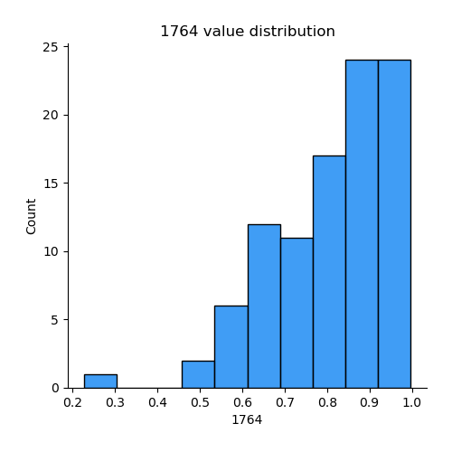
## Feature : 1765
- **Feature type** : continous
- **Missing** : 0.0%
- **Unique** : 97
- **Count** :97.0
- **Mean** :0.8127350597638597
- **Std** :0.13914205863117932
- **Min** :0.3831565887567971
- **25%th Percentile** : 0.7364045879175466
- **50%th Percentile** : 0.8191938893968087
- **75%th Percentile** : 0.9183903265380671
- **Max** :0.9961776066874019

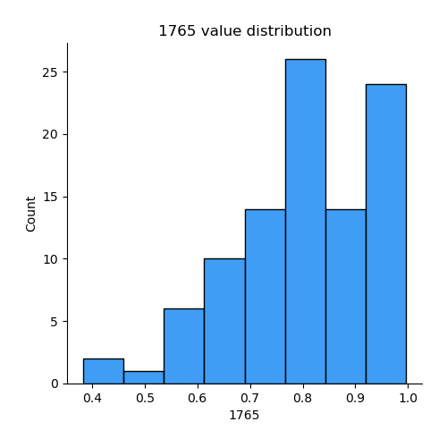
## Feature : 1766
- **Feature type** : continous
- **Missing** : 0.0%
- **Unique** : 97
- **Count** :97.0
- **Mean** :0.47800599546635425
- **Std** :0.2986683554918129
- **Min** :-0.13157635701704534
- **25%th Percentile** : 0.26980694107171316
- **50%th Percentile** : 0.42433343949885827
- **75%th Percentile** : 0.6629468792411227
- **Max** :0.9855897692879498

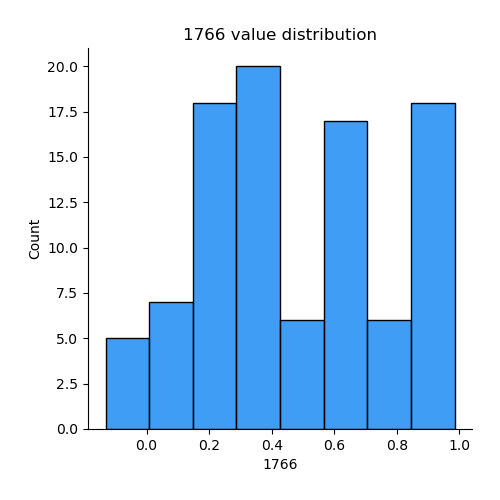
## Feature : 1767
- **Feature type** : continous
- **Missing** : 0.0%
- **Unique** : 97
- **Count** :97.0
- **Mean** :0.7343436342142067
- **Std** :0.19298714666140734
- **Min** :0.28900186432718106
- **25%th Percentile** : 0.6033323877398996
- **50%th Percentile** : 0.7532534964079837
- **75%th Percentile** : 0.9054086848462023
- **Max** :0.9930466969189649

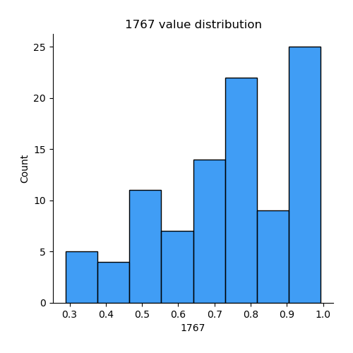
## Feature : 1802
- **Feature type** : continous
- **Missing** : 0.0%
- **Unique** : 3
- **Count** :97.0
- **Mean** :1.0
- **Std** :6.985000018454543e-17
- **Min** :0.9999999999999998
- **25%th Percentile** : 1.0
- **50%th Percentile** : 1.0
- **75%th Percentile** : 1.0
- **Max** :1.0

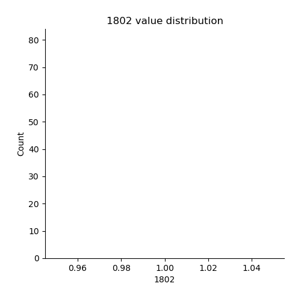
## Feature : 1803
- **Feature type** : continous
- **Missing** : 0.0%
- **Unique** : 97
- **Count** :97.0
- **Mean** :0.6372601158259996
- **Std** :0.23834354114541106
- **Min** :-0.09489250022531709
- **25%th Percentile** : 0.5016870450343881
- **50%th Percentile** : 0.6138535429199088
- **75%th Percentile** : 0.8220096109079614
- **Max** :0.9829550639437475

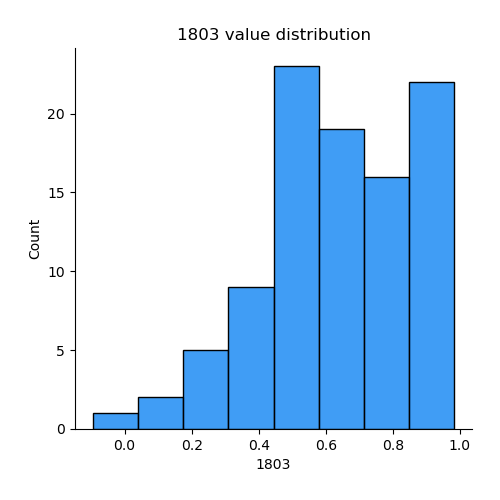
## Feature : 1804
- **Feature type** : continous
- **Missing** : 0.0%
- **Unique** : 97
- **Count** :97.0
- **Mean** :0.7431674120663291
- **Std** :0.18409860325839625
- **Min** :0.19684605215166986
- **25%th Percentile** : 0.6007911637678139
- **50%th Percentile** : 0.7541931990748133
- **75%th Percentile** : 0.9043049325257689
- **Max** :0.9901176442021234

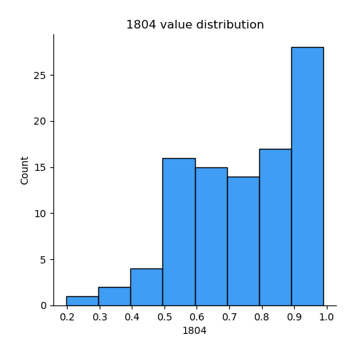
## Feature : 1805
- **Feature type** : continous
- **Missing** : 0.0%
- **Unique** : 97
- **Count** :97.0
- **Mean** :0.6551037121576534
- **Std** :0.2362057439813396
- **Min** :0.009849571692580252
- **25%th Percentile** : 0.5122318528050446
- **50%th Percentile** : 0.6496048771559866
- **75%th Percentile** : 0.847689735394137
- **Max** :0.9876550178741121

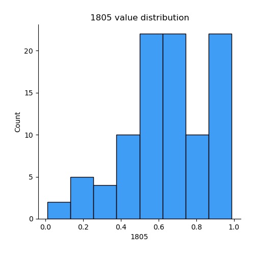
## Feature : 1806
- **Feature type** : continous
- **Missing** : 0.0%
- **Unique** : 97
- **Count** :97.0
- **Mean** :0.5840150234289255
- **Std** :0.2703419605904778
- **Min** :-0.17409005886796725
- **25%th Percentile** : 0.38003793127796837
- **50%th Percentile** : 0.5715328422668516
- **75%th Percentile** : 0.7899875485080249
- **Max** :0.9878227348883621

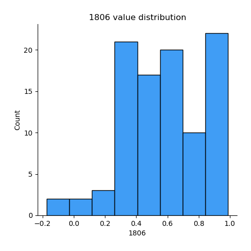
## Feature : 1807
- **Feature type** : continous
- **Missing** : 0.0%
- **Unique** : 97
- **Count** :97.0
- **Mean** :0.6463554787249209
- **Std** :0.22663142444099665
- **Min** :0.048159307025674614
- **25%th Percentile** : 0.4767102058187599
- **50%th Percentile** : 0.6276497483275523
- **75%th Percentile** : 0.8143506650007019
- **Max** :0.9866130928655994

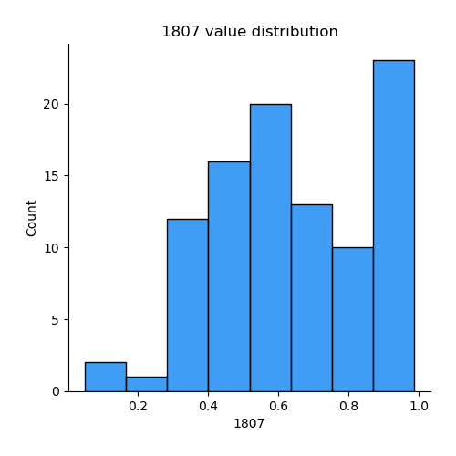
## Feature : 1808
- **Feature type** : continous
- **Missing** : 0.0%
- **Unique** : 97
- **Count** :97.0
- **Mean** :0.6941512099653485
- **Std** :0.19176442597062923
- **Min** :0.18920962839999664
- **25%th Percentile** : 0.5656139348433978
- **50%th Percentile** : 0.677279972475203
- **75%th Percentile** : 0.878515774123041
- **Max** :0.9844437819899465

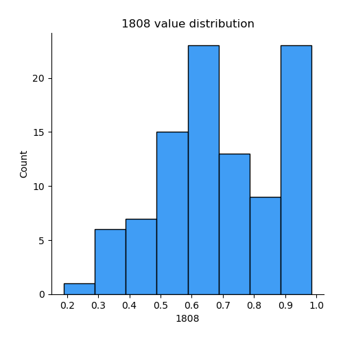
## Feature : 1809
- **Feature type** : continous
- **Missing** : 0.0%
- **Unique** : 97
- **Count** :97.0
- **Mean** :0.5999949061256481
- **Std** :0.2682296875382563
- **Min** :-0.10923857705506551
- **25%th Percentile** : 0.4143230077184705
- **50%th Percentile** : 0.583368429157954
- **75%th Percentile** : 0.7845646514431812
- **Max** :0.9888948297814387

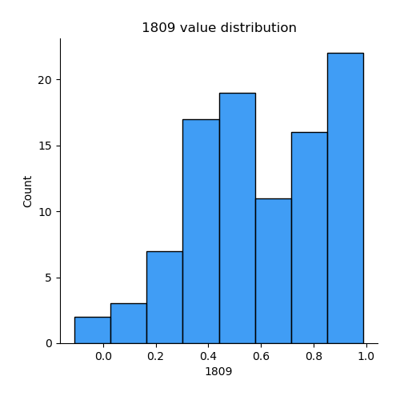
## Feature : 1810
- **Feature type** : continous
- **Missing** : 0.0%
- **Unique** : 97
- **Count** :97.0
- **Mean** :0.7126632180729777
- **Std** :0.19369162932004994
- **Min** :0.23041020476277654
- **25%th Percentile** : 0.5436620821231309
- **50%th Percentile** : 0.7281816141657712
- **75%th Percentile** : 0.8504386393838691
- **Max** :0.9896937061108566

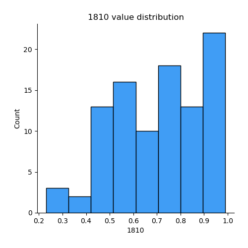
## Feature : 1811
- **Feature type** : continous
- **Missing** : 0.0%
- **Unique** : 97
- **Count** :97.0
- **Mean** :0.6182453020710428
- **Std** :0.24937917428577883
- **Min** :-0.0875602026778596
- **25%th Percentile** : 0.46115102091060717
- **50%th Percentile** : 0.5745873470003715
- **75%th Percentile** : 0.776041469827842
- **Max** :0.9861876438263248

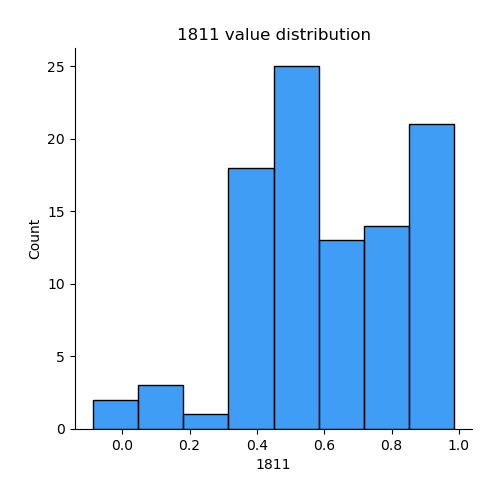
## Feature : 1812
- **Feature type** : continous
- **Missing** : 0.0%
- **Unique** : 97
- **Count** :97.0
- **Mean** :0.8544406019215075
- **Std** :0.10756294962798495
- **Min** :0.5575695218944446
- **25%th Percentile** : 0.7859296896298091
- **50%th Percentile** : 0.8684813311586997
- **75%th Percentile** : 0.9360078087121916
- **Max** :0.9955046005660894

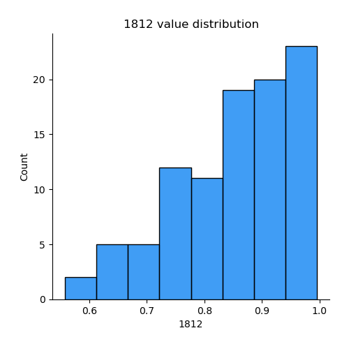
## Feature : 1813
- **Feature type** : continous
- **Missing** : 0.0%
- **Unique** : 97
- **Count** :97.0
- **Mean** :0.5439953215779804
- **Std** :0.26786415543288583
- **Min** :-0.052806642660722575
- **25%th Percentile** : 0.36869804540650225
- **50%th Percentile** : 0.49807655329466655
- **75%th Percentile** : 0.7176797723016423
- **Max** :0.9845004258284892

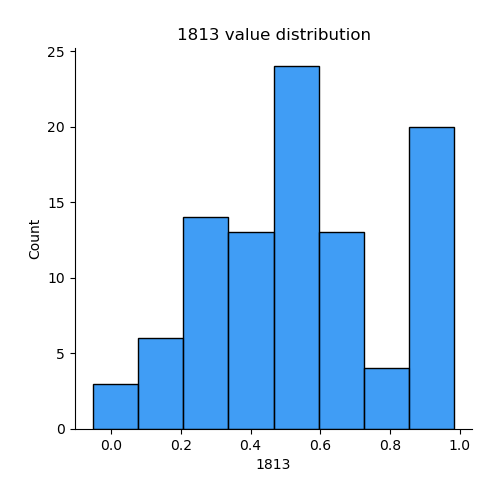
## Feature : 1814
- **Feature type** : continous
- **Missing** : 0.0%
- **Unique** : 97
- **Count** :97.0
- **Mean** :0.6621610910791901
- **Std** :0.2310974966391817
- **Min** :0.04055565187977248
- **25%th Percentile** : 0.5388926345092911
- **50%th Percentile** : 0.6619975582491552
- **75%th Percentile** : 0.8313462820880232
- **Max** :0.9926882057534427

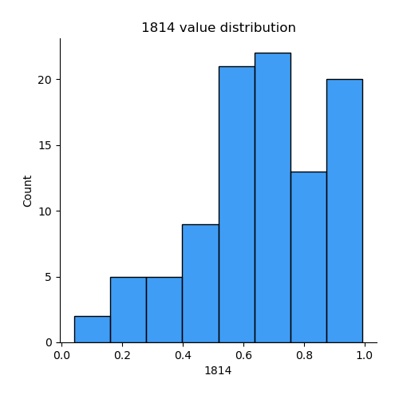
## Feature : 1815
- **Feature type** : continous
- **Missing** : 0.0%
- **Unique** : 97
- **Count** :97.0
- **Mean** :0.668452078658505
- **Std** :0.23517104561680424
- **Min** :0.00917890208253076
- **25%th Percentile** : 0.5032907984536227
- **50%th Percentile** : 0.689166554740371
- **75%th Percentile** : 0.8773900458354436
- **Max** :0.9889541344662178

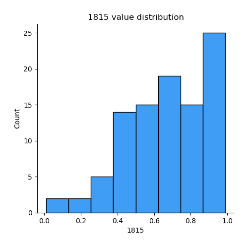
## Feature : 1816
- **Feature type** : continous
- **Missing** : 0.0%
- **Unique** : 97
- **Count** :97.0
- **Mean** :0.635341610191604
- **Std** :0.25159157436468804
- **Min** :-0.2449338747790355
- **25%th Percentile** : 0.469964561510981
- **50%th Percentile** : 0.6335139857073246
- **75%th Percentile** : 0.8323687474199372
- **Max** :0.9845832592852118

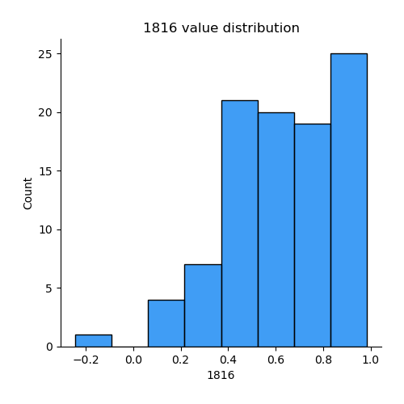
## Feature : 1817
- **Feature type** : continous
- **Missing** : 0.0%
- **Unique** : 97
- **Count** :97.0
- **Mean** :0.6340724490971451
- **Std** :0.2598505388208464
- **Min** :0.03659891925775566
- **25%th Percentile** : 0.45217041823810145
- **50%th Percentile** : 0.6622493046672702
- **75%th Percentile** : 0.851236677647116
- **Max** :0.9872148016591312

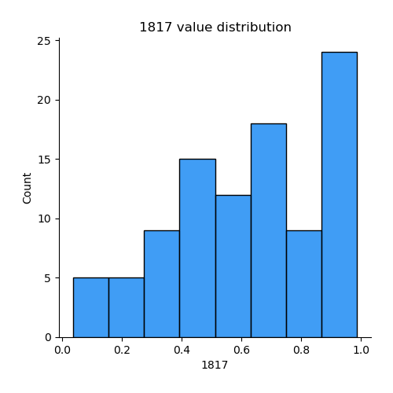
## Feature : 1818
- **Feature type** : continous
- **Missing** : 0.0%
- **Unique** : 97
- **Count** :97.0
- **Mean** :0.4309197887010188
- **Std** :0.32663000092485545
- **Min** :-0.2994864558821874
- **25%th Percentile** : 0.175180877133904
- **50%th Percentile** : 0.4077996032188916
- **75%th Percentile** : 0.6966649465679002
- **Max** :0.9778028940631022

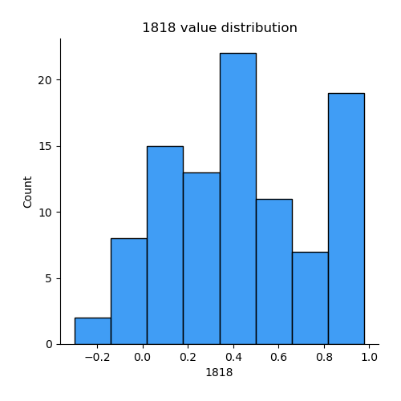
## Feature : 1819
- **Feature type** : continous
- **Missing** : 0.0%
- **Unique** : 97
- **Count** :97.0
- **Mean** :0.5500017421225379
- **Std** :0.28557118902715395
- **Min** :-0.07154136311813362
- **25%th Percentile** : 0.33984479291245884
- **50%th Percentile** : 0.523243334739927
- **75%th Percentile** : 0.7897719250455747
- **Max** :0.9840785065362649

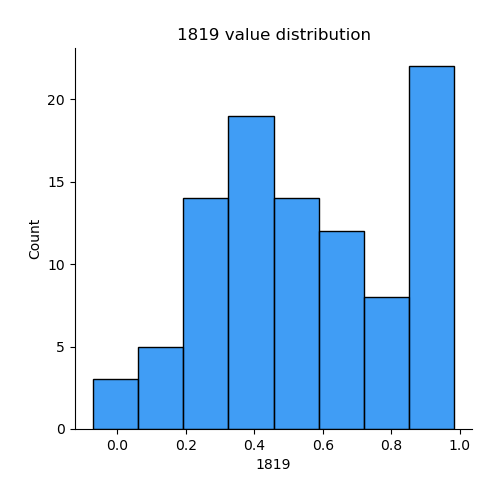
## Feature : 1855
- **Feature type** : continous
- **Missing** : 0.0%
- **Unique** : 3
- **Count** :97.0
- **Mean** :1.0
- **Std** :7.768256234453996e-17
- **Min** :0.9999999999999998
- **25%th Percentile** : 1.0
- **50%th Percentile** : 1.0
- **75%th Percentile** : 1.0
- **Max** :1.0

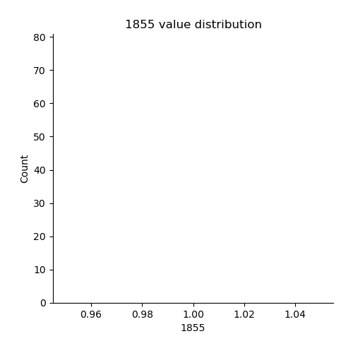
## Feature : 1856
- **Feature type** : continous
- **Missing** : 0.0%
- **Unique** : 97
- **Count** :97.0
- **Mean** :0.8269857210444335
- **Std** :0.12291271745295103
- **Min** :0.4063377521382747
- **25%th Percentile** : 0.7643243788992924
- **50%th Percentile** : 0.8432463087255343
- **75%th Percentile** : 0.9281926909864793
- **Max** :0.9916326475185534

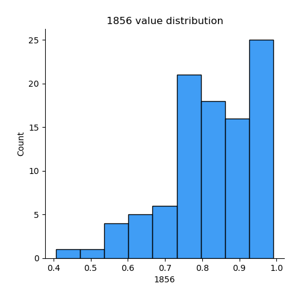
## Feature : 1857
- **Feature type** : continous
- **Missing** : 0.0%
- **Unique** : 97
- **Count** :97.0
- **Mean** :0.6633274580933533
- **Std** :0.22829893213217395
- **Min** :0.08067566569748522
- **25%th Percentile** : 0.5118411288786436
- **50%th Percentile** : 0.6697318833416572
- **75%th Percentile** : 0.8829998716172677
- **Max** :0.9929581028201259

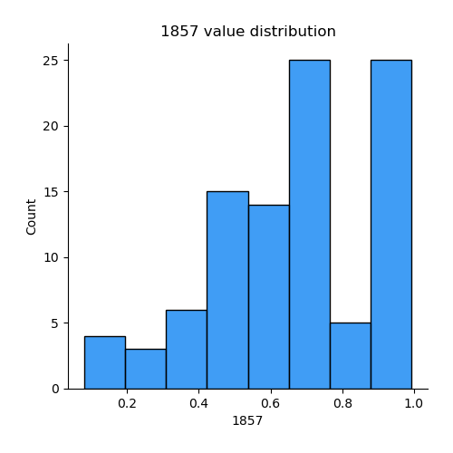
## Feature : 1858
- **Feature type** : continous
- **Missing** : 0.0%
- **Unique** : 97
- **Count** :97.0
- **Mean** :0.5390648236782571
- **Std** :0.3003044741756546
- **Min** :-0.3375383829817177
- **25%th Percentile** : 0.33294282186433666
- **50%th Percentile** : 0.5273114954739186
- **75%th Percentile** : 0.7247300688631003
- **Max** :0.9865715977706362

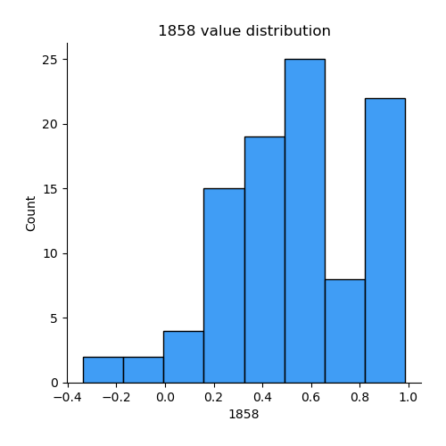
## Feature : 1859
- **Feature type** : continous
- **Missing** : 0.0%
- **Unique** : 97
- **Count** :97.0
- **Mean** :0.6225266155992849
- **Std** :0.23047284089174844
- **Min** :0.07410204050007509
- **25%th Percentile** : 0.46011021693727033
- **50%th Percentile** : 0.6146894907738583
- **75%th Percentile** : 0.7965165297011558
- **Max** :0.9935256252587009

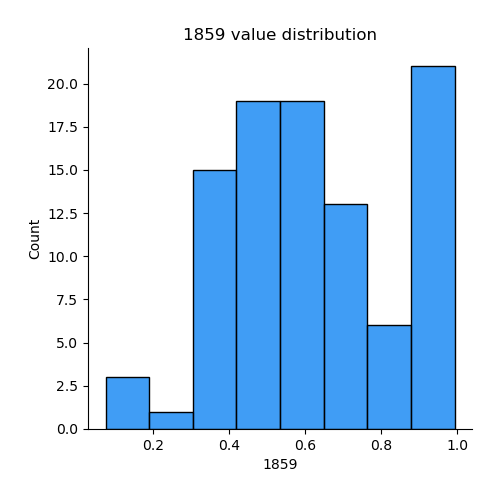
## Feature : 1860
- **Feature type** : continous
- **Missing** : 0.0%
- **Unique** : 97
- **Count** :97.0
- **Mean** :0.784496509494745
- **Std** :0.14240010307636816
- **Min** :0.27030259265205164
- **25%th Percentile** : 0.6818548488539632
- **50%th Percentile** : 0.78253449071478
- **75%th Percentile** : 0.8897634269649743
- **Max** :0.9886146855700252

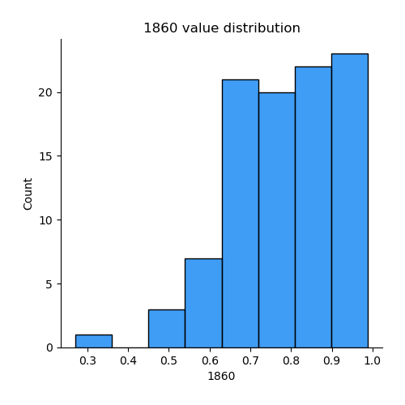
## Feature : 1861
- **Feature type** : continous
- **Missing** : 0.0%
- **Unique** : 97
- **Count** :97.0
- **Mean** :0.5654101087597497
- **Std** :0.2868927102331991
- **Min** :-0.36518990185741895
- **25%th Percentile** : 0.3856586389982992
- **50%th Percentile** : 0.5498703934841557
- **75%th Percentile** : 0.7345328770624296
- **Max** :0.9879382871662961

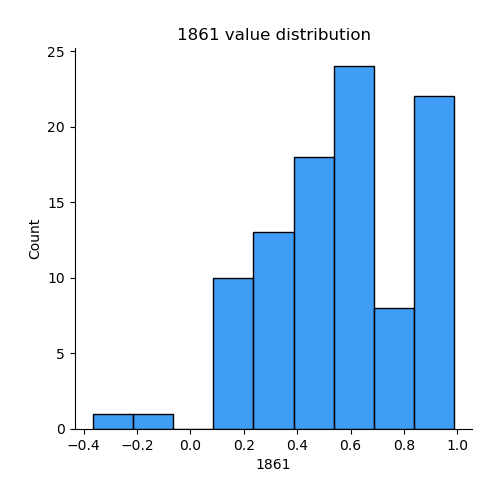
## Feature : 1862
- **Feature type** : continous
- **Missing** : 0.0%
- **Unique** : 97
- **Count** :97.0
- **Mean** :0.5719971892966652
- **Std** :0.2640934075502296
- **Min** :-0.17526247093359004
- **25%th Percentile** : 0.4133255197026488
- **50%th Percentile** : 0.5434531608498069
- **75%th Percentile** : 0.7628129942691415
- **Max** :0.9836948574142608

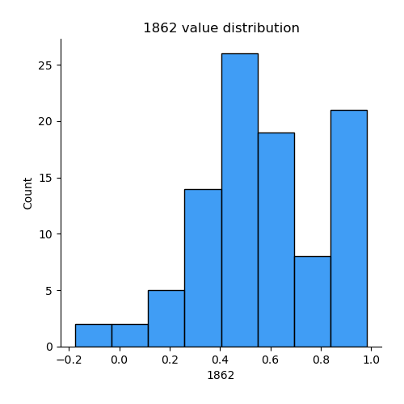
## Feature : 1863
- **Feature type** : continous
- **Missing** : 0.0%
- **Unique** : 97
- **Count** :97.0
- **Mean** :0.5912140857856323
- **Std** :0.26787581669706445
- **Min** :-0.3543312744879436
- **25%th Percentile** : 0.42738182608320585
- **50%th Percentile** : 0.6011243615926372
- **75%th Percentile** : 0.7606649160143153
- **Max** :0.9878344030815727

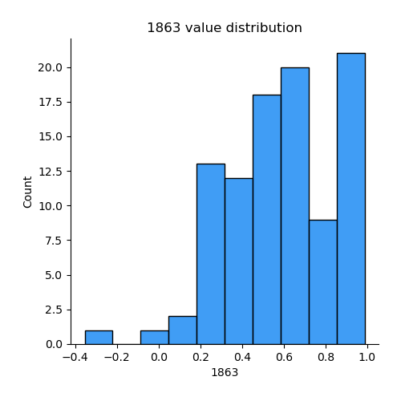
## Feature : 1864
- **Feature type** : continous
- **Missing** : 0.0%
- **Unique** : 97
- **Count** :97.0
- **Mean** :0.6880032062601235
- **Std** :0.20787214150883412
- **Min** :0.06895857843332555
- **25%th Percentile** : 0.5800978865216855
- **50%th Percentile** : 0.6860071072776901
- **75%th Percentile** : 0.8168813580440228
- **Max** :0.9902128814771375

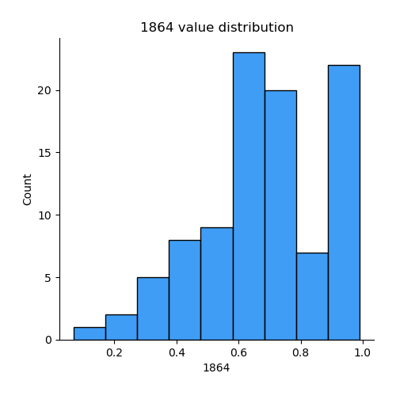
## Feature : 1865
- **Feature type** : continous
- **Missing** : 0.0%
- **Unique** : 97
- **Count** :97.0
- **Mean** :0.40314071546044555
- **Std** :0.33926595796982106
- **Min** :-0.36135769377263816
- **25%th Percentile** : 0.18464124178375438
- **50%th Percentile** : 0.3265660373780259
- **75%th Percentile** : 0.6302467402367933
- **Max** :0.9840782859466675

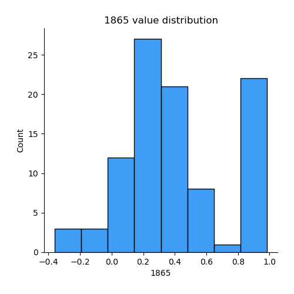
## Feature : 1866
- **Feature type** : continous
- **Missing** : 0.0%
- **Unique** : 97
- **Count** :97.0
- **Mean** :0.5519933939135075
- **Std** :0.2914099277638567
- **Min** :-0.12399257312603224
- **25%th Percentile** : 0.4125689024067163
- **50%th Percentile** : 0.527180878047758
- **75%th Percentile** : 0.7696093868435061
- **Max** :0.9858128580944551

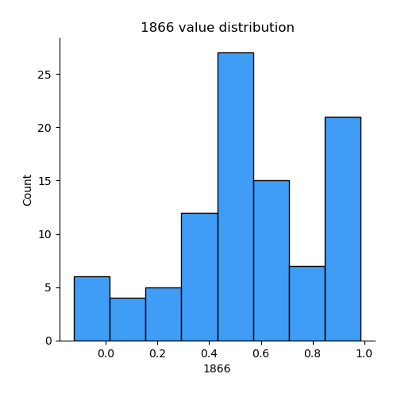
## Feature : 1867
- **Feature type** : continous
- **Missing** : 0.0%
- **Unique** : 97
- **Count** :97.0
- **Mean** :0.7263408514859077
- **Std** :0.195824210275157
- **Min** :0.1780007743222428
- **25%th Percentile** : 0.6141278647308068
- **50%th Percentile** : 0.7403298289675149
- **75%th Percentile** : 0.8728444232371386
- **Max** :0.9936604364383067

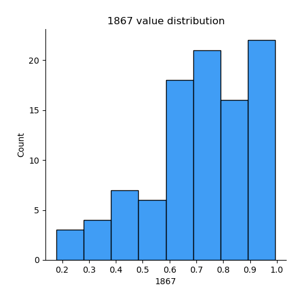
## Feature : 1868
- **Feature type** : continous
- **Missing** : 0.0%
- **Unique** : 97
- **Count** :97.0
- **Mean** :0.6374315138908417
- **Std** :0.22277899342153887
- **Min** :0.051578277641592694
- **25%th Percentile** : 0.45844174828363926
- **50%th Percentile** : 0.6183638547638988
- **75%th Percentile** : 0.8289106109597388
- **Max** :0.989608407389517

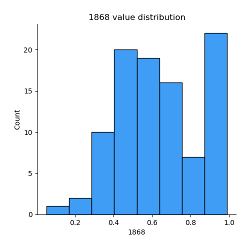
## Feature : 1869
- **Feature type** : continous
- **Missing** : 0.0%
- **Unique** : 97
- **Count** :97.0
- **Mean** :0.6314611988041477
- **Std** :0.22520107191912322
- **Min** :-0.025462712967607208
- **25%th Percentile** : 0.47789627955229746
- **50%th Percentile** : 0.6018544600745824
- **75%th Percentile** : 0.764381985104555
- **Max** :0.9906412637609808

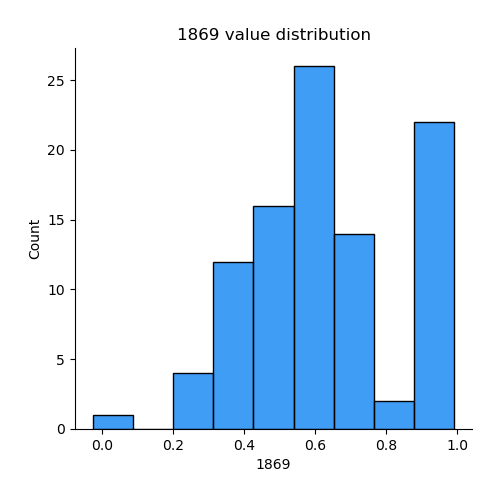
## Feature : 1870
- **Feature type** : continous
- **Missing** : 0.0%
- **Unique** : 97
- **Count** :97.0
- **Mean** :0.4067061817008481
- **Std** :0.324708492088153
- **Min** :-0.2857870402085351
- **25%th Percentile** : 0.17830047124378204
- **50%th Percentile** : 0.37728778658923384
- **75%th Percentile** : 0.6222055485158595
- **Max** :0.9780622274030145

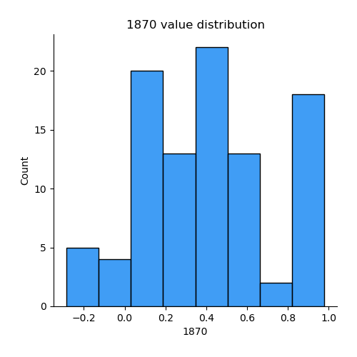
## Feature : 1871
- **Feature type** : continous
- **Missing** : 0.0%
- **Unique** : 97
- **Count** :97.0
- **Mean** :0.519888878571959
- **Std** :0.28555936196542386
- **Min** :-0.1579283860584936
- **25%th Percentile** : 0.29558535013026915
- **50%th Percentile** : 0.48175821004290365
- **75%th Percentile** : 0.7107572480076533
- **Max** :0.9844612380337627

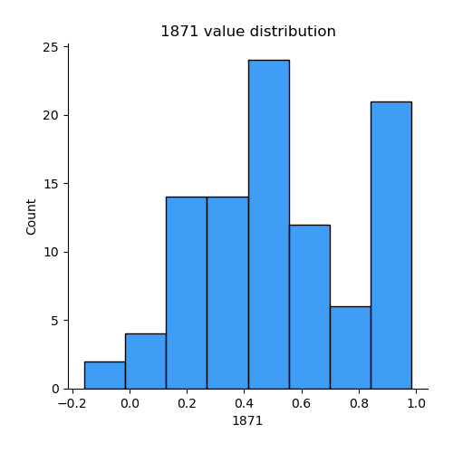
## Feature : 1908
- **Feature type** : continous
- **Missing** : 0.0%
- **Unique** : 3
- **Count** :97.0
- **Mean** :1.0
- **Std** :8.993834424997155e-17
- **Min** :0.9999999999999998
- **25%th Percentile** : 0.9999999999999999
- **50%th Percentile** : 1.0
- **75%th Percentile** : 1.0
- **Max** :1.0

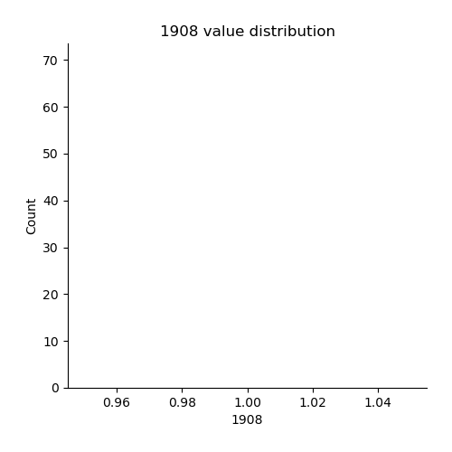
## Feature : 1909
- **Feature type** : continous
- **Missing** : 0.0%
- **Unique** : 97
- **Count** :97.0
- **Mean** :0.6416878333711106
- **Std** :0.24080264671877372
- **Min** :-0.03327733703103676
- **25%th Percentile** : 0.47958041931300965
- **50%th Percentile** : 0.6372236876406202
- **75%th Percentile** : 0.8126433105012442
- **Max** :0.9929691568397223

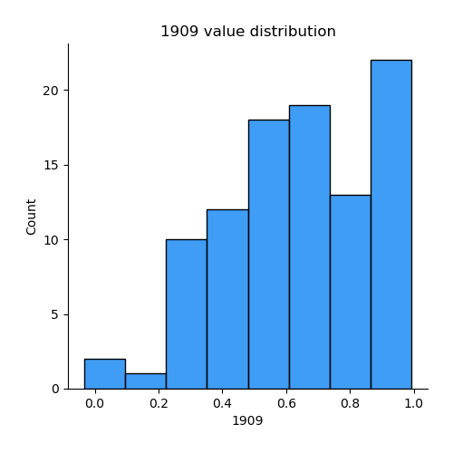
## Feature : 1910
- **Feature type** : continous
- **Missing** : 0.0%
- **Unique** : 97
- **Count** :97.0
- **Mean** :0.5709532486517357
- **Std** :0.30307499306334934
- **Min** :-0.17049022597600524
- **25%th Percentile** : 0.3337682894032644
- **50%th Percentile** : 0.6207170434577952
- **75%th Percentile** : 0.8105940509831125
- **Max** :0.9940772957666437

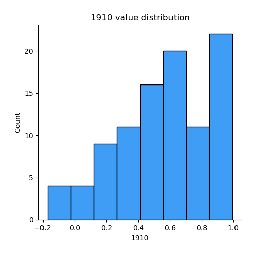
## Feature : 1911
- **Feature type** : continous
- **Missing** : 0.0%
- **Unique** : 97
- **Count** :97.0
- **Mean** :0.691040667185942
- **Std** :0.19922100964593453
- **Min** :0.1030980632590211
- **25%th Percentile** : 0.5325121232117087
- **50%th Percentile** : 0.6979321397941778
- **75%th Percentile** : 0.8306338472691291
- **Max** :0.9933721570335435

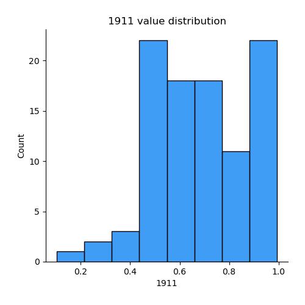
## Feature : 1912
- **Feature type** : continous
- **Missing** : 0.0%
- **Unique** : 97
- **Count** :97.0
- **Mean** :0.8987127643635696
- **Std** :0.067838274978812
- **Min** :0.7125582425057003
- **25%th Percentile** : 0.8475170973520754
- **50%th Percentile** : 0.9093348929439286
- **75%th Percentile** : 0.9486377119314394
- **Max** :0.9954985944655153

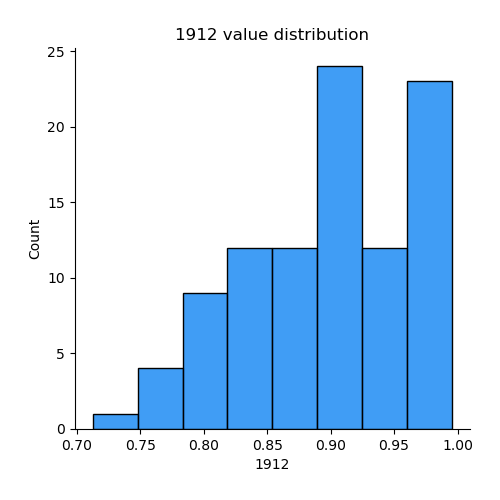
## Feature : 1913
- **Feature type** : continous
- **Missing** : 0.0%
- **Unique** : 97
- **Count** :97.0
- **Mean** :0.587402256659328
- **Std** :0.2918311152328836
- **Min** :-0.07773037767699655
- **25%th Percentile** : 0.37256918258705535
- **50%th Percentile** : 0.6245060145933644
- **75%th Percentile** : 0.8139580324176273
- **Max** :0.9922797433705196

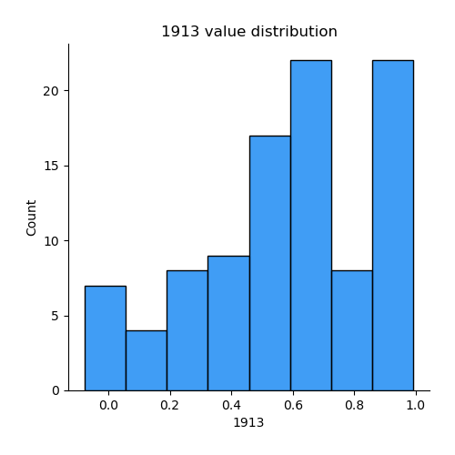
## Feature : 1914
- **Feature type** : continous
- **Missing** : 0.0%
- **Unique** : 97
- **Count** :97.0
- **Mean** :0.6319727098997254
- **Std** :0.24558491450457276
- **Min** :0.0227819328774932
- **25%th Percentile** : 0.4787944600107489
- **50%th Percentile** : 0.6098601169376973
- **75%th Percentile** : 0.8300536683772836
- **Max** :0.9941963574938896

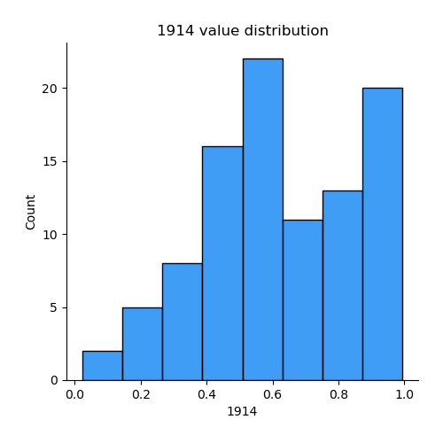
## Feature : 1915
- **Feature type** : continous
- **Missing** : 0.0%
- **Unique** : 97
- **Count** :97.0
- **Mean** :0.6251566987673155
- **Std** :0.26443548355966784
- **Min** :-0.01530910359623082
- **25%th Percentile** : 0.4669351440579947
- **50%th Percentile** : 0.6568277639748181
- **75%th Percentile** : 0.797103693945424
- **Max** :0.9935106791818158

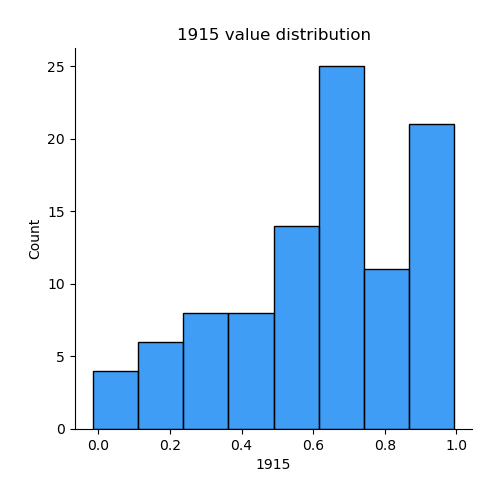
## Feature : 1916
- **Feature type** : continous
- **Missing** : 0.0%
- **Unique** : 97
- **Count** :97.0
- **Mean** :0.7544475050312913
- **Std** :0.17455737223005313
- **Min** :0.33233118796638683
- **25%th Percentile** : 0.6470803684495852
- **50%th Percentile** : 0.7735495980367447
- **75%th Percentile** : 0.895042801012202
- **Max** :0.9922416116641547

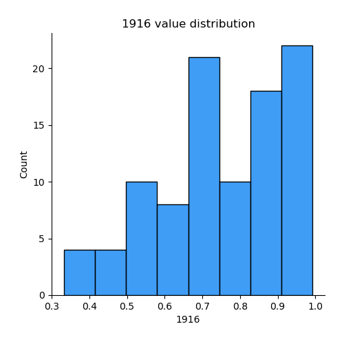
## Feature : 1917
- **Feature type** : continous
- **Missing** : 0.0%
- **Unique** : 97
- **Count** :97.0
- **Mean** :0.42354001681621384
- **Std** :0.32801354018817286
- **Min** :-0.4866447871641423
- **25%th Percentile** : 0.19781361076622653
- **50%th Percentile** : 0.3388169483190383
- **75%th Percentile** : 0.6031453089671186
- **Max** :0.9803221742176847

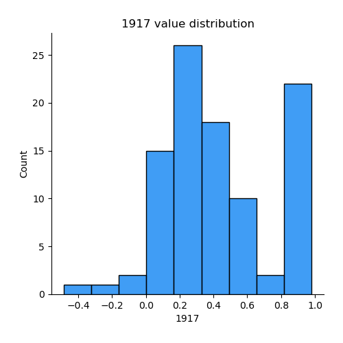
## Feature : 1918
- **Feature type** : continous
- **Missing** : 0.0%
- **Unique** : 97
- **Count** :97.0
- **Mean** :0.5737230447192686
- **Std** :0.29829247052459446
- **Min** :-0.23032677258075762
- **25%th Percentile** : 0.4028445957717198
- **50%th Percentile** : 0.5808259150847881
- **75%th Percentile** : 0.787053857517778
- **Max** :0.9938705978713451

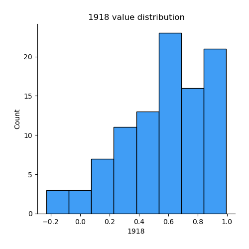
## Feature : 1919
- **Feature type** : continous
- **Missing** : 0.0%
- **Unique** : 97
- **Count** :97.0
- **Mean** :0.7383810247336767
- **Std** :0.20284773964888864
- **Min** :0.05128297383166812
- **25%th Percentile** : 0.6396790836007535
- **50%th Percentile** : 0.7828221137684973
- **75%th Percentile** : 0.8610602383388987
- **Max** :0.9943291773760781

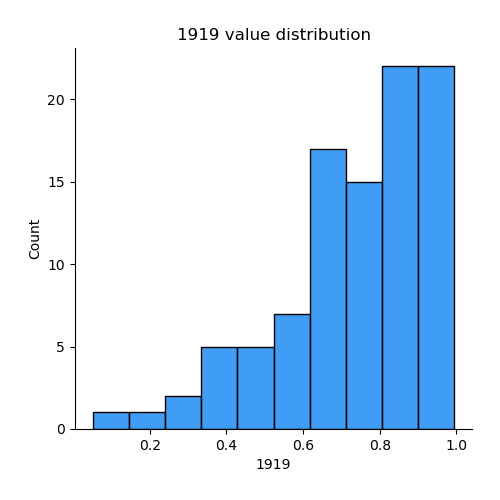
## Feature : 1920
- **Feature type** : continous
- **Missing** : 0.0%
- **Unique** : 97
- **Count** :97.0
- **Mean** :0.6517987061535602
- **Std** :0.2229768109306928
- **Min** :0.0629180767755396
- **25%th Percentile** : 0.5032669255122659
- **50%th Percentile** : 0.6217124225288815
- **75%th Percentile** : 0.8394348843571658
- **Max** :0.9919213147209589

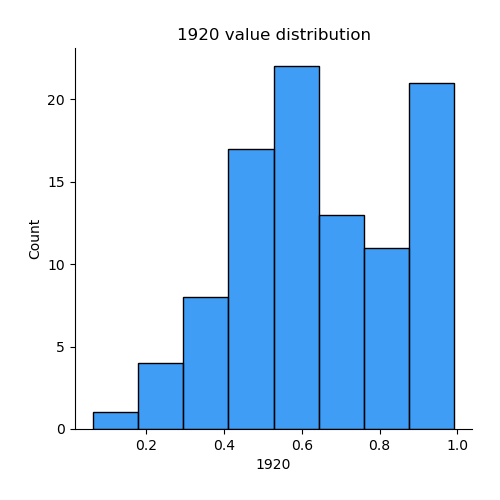
## Feature : 1921
- **Feature type** : continous
- **Missing** : 0.0%
- **Unique** : 97
- **Count** :97.0
- **Mean** :0.6606330112902573
- **Std** :0.22094417221106766
- **Min** :0.1278729850433266
- **25%th Percentile** : 0.4989576801521289
- **50%th Percentile** : 0.6601794872047635
- **75%th Percentile** : 0.8106989278581959
- **Max** :0.9895138852380172

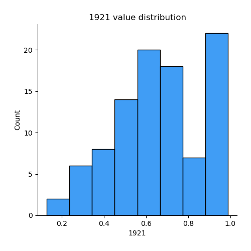
## Feature : 1922
- **Feature type** : continous
- **Missing** : 0.0%
- **Unique** : 97
- **Count** :97.0
- **Mean** :0.43168981931017036
- **Std** :0.31330999019402567
- **Min** :-0.23862784160150233
- **25%th Percentile** : 0.19323830357766172
- **50%th Percentile** : 0.40602056482876486
- **75%th Percentile** : 0.6739443468958882
- **Max** :0.981067183997349

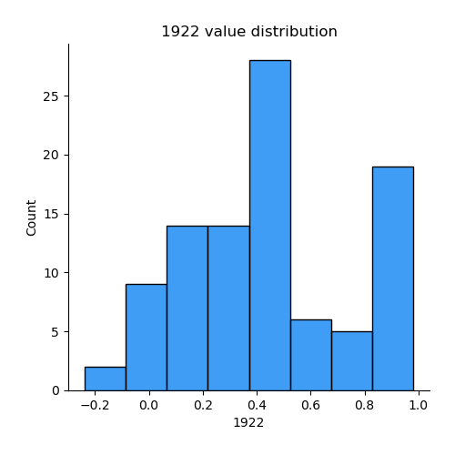
## Feature : 1923
- **Feature type** : continous
- **Missing** : 0.0%
- **Unique** : 97
- **Count** :97.0
- **Mean** :0.5522230205542739
- **Std** :0.27618193269302876
- **Min** :-0.0629119054050122
- **25%th Percentile** : 0.3447700399123264
- **50%th Percentile** : 0.5101291215976976
- **75%th Percentile** : 0.7551121009663755
- **Max** :0.9817271505109844

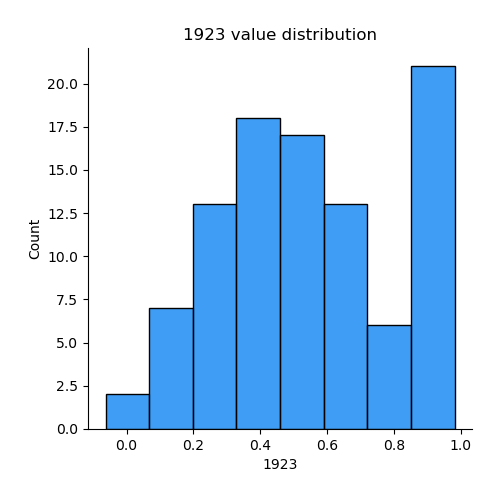
## Feature : 1961
- **Feature type** : continous
- **Missing** : 0.0%
- **Unique** : 3
- **Count** :97.0
- **Mean** :1.0
- **Std** :7.68517089126034e-17
- **Min** :0.9999999999999998
- **25%th Percentile** : 1.0
- **50%th Percentile** : 1.0
- **75%th Percentile** : 1.0
- **Max** :1.0

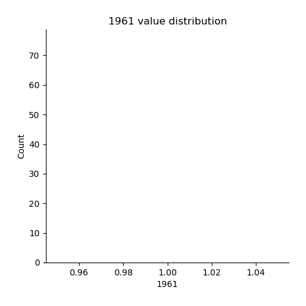
## Feature : 1962
- **Feature type** : continous
- **Missing** : 0.0%
- **Unique** : 97
- **Count** :97.0
- **Mean** :0.5034055322035492
- **Std** :0.33149828199648224
- **Min** :-0.2194886633293608
- **25%th Percentile** : 0.27396699796365026
- **50%th Percentile** : 0.47231920014207623
- **75%th Percentile** : 0.778902733234535
- **Max** :0.9933234808348148

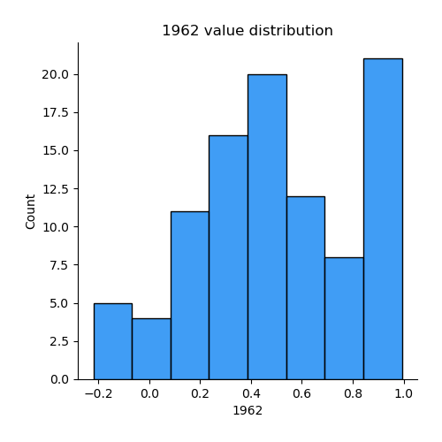
## Feature : 1963
- **Feature type** : continous
- **Missing** : 0.0%
- **Unique** : 97
- **Count** :97.0
- **Mean** :0.6557062782166523
- **Std** :0.23382464623581006
- **Min** :0.042648738789103566
- **25%th Percentile** : 0.47465669315208897
- **50%th Percentile** : 0.6362305341950132
- **75%th Percentile** : 0.7953076445251509
- **Max** :0.9947988617986859

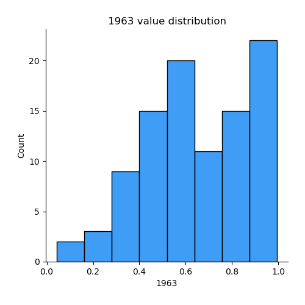
## Feature : 1964
- **Feature type** : continous
- **Missing** : 0.0%
- **Unique** : 97
- **Count** :97.0
- **Mean** :0.5713212318495342
- **Std** :0.26581870685562636
- **Min** :-0.09230806858081017
- **25%th Percentile** : 0.36564874084053267
- **50%th Percentile** : 0.5653037996954569
- **75%th Percentile** : 0.7501405385917019
- **Max** :0.9855781667166987

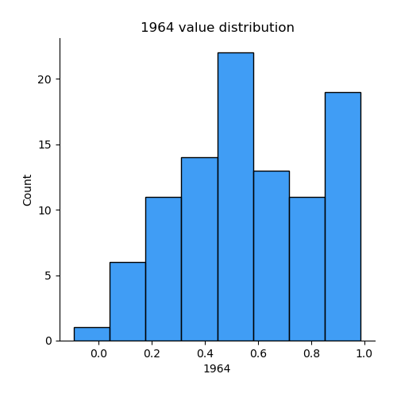
## Feature : 1965
- **Feature type** : continous
- **Missing** : 0.0%
- **Unique** : 97
- **Count** :97.0
- **Mean** :0.5774909737587154
- **Std** :0.2987319409756004
- **Min** :-0.334017051957001
- **25%th Percentile** : 0.4025924648952224
- **50%th Percentile** : 0.583582776137464
- **75%th Percentile** : 0.8207905101067553
- **Max** :0.9934550761074195

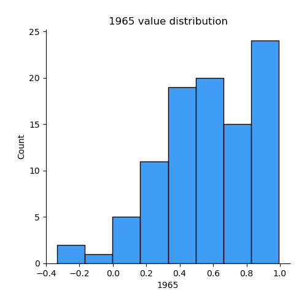
## Feature : 1966
- **Feature type** : continous
- **Missing** : 0.0%
- **Unique** : 97
- **Count** :97.0
- **Mean** :0.610755370968234
- **Std** :0.263698036882635
- **Min** :-0.15922962910385907
- **25%th Percentile** : 0.4339719321176627
- **50%th Percentile** : 0.5997529978594349
- **75%th Percentile** : 0.7820306419145423
- **Max** :0.9933167742626542

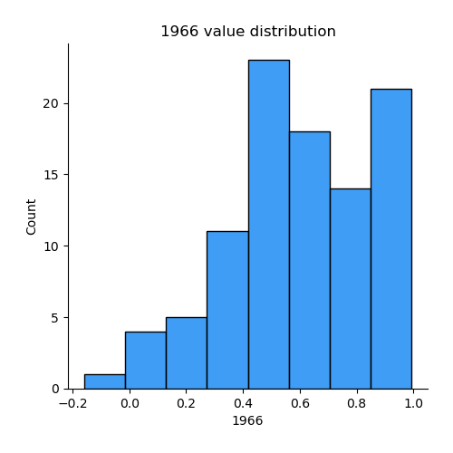
## Feature : 1967
- **Feature type** : continous
- **Missing** : 0.0%
- **Unique** : 97
- **Count** :97.0
- **Mean** :0.5868749456589654
- **Std** :0.29813083560532094
- **Min** :-0.25251436835744556
- **25%th Percentile** : 0.38519209634702084
- **50%th Percentile** : 0.6086538258414541
- **75%th Percentile** : 0.8267577127308365
- **Max** :0.9946876761578297

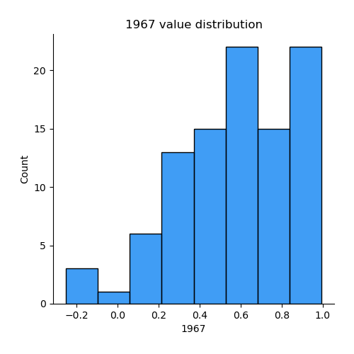
## Feature : 1968
- **Feature type** : continous
- **Missing** : 0.0%
- **Unique** : 97
- **Count** :97.0
- **Mean** :0.6892626713843638
- **Std** :0.21665479143084737
- **Min** :0.1406906613657883
- **25%th Percentile** : 0.5485587252476978
- **50%th Percentile** : 0.6932282170015011
- **75%th Percentile** : 0.8503833710456312
- **Max** :0.9927155569754496

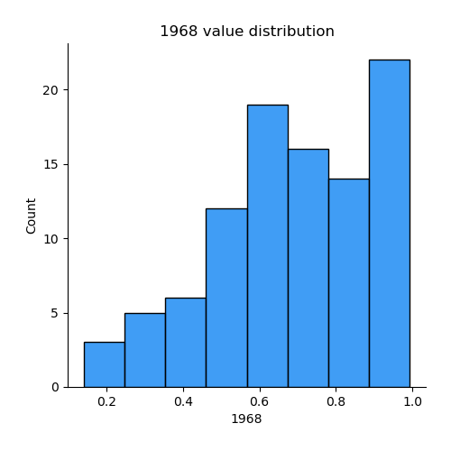
## Feature : 1969
- **Feature type** : continous
- **Missing** : 0.0%
- **Unique** : 97
- **Count** :97.0
- **Mean** :0.5429275386088476
- **Std** :0.2809083367880634
- **Min** :-0.10743661190128152
- **25%th Percentile** : 0.32875905380495696
- **50%th Percentile** : 0.5261350353280432
- **75%th Percentile** : 0.7106171850568631
- **Max** :0.9895806162706948

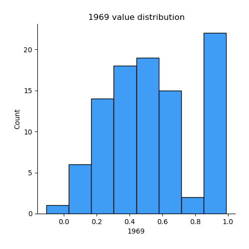
## Feature : 1970
- **Feature type** : continous
- **Missing** : 0.0%
- **Unique** : 97
- **Count** :97.0
- **Mean** :0.6335298628281856
- **Std** :0.27830832507184045
- **Min** :-0.2914752231127659
- **25%th Percentile** : 0.4798596318418334
- **50%th Percentile** : 0.6555979757644814
- **75%th Percentile** : 0.8339650535817158
- **Max** :0.9957364817161322

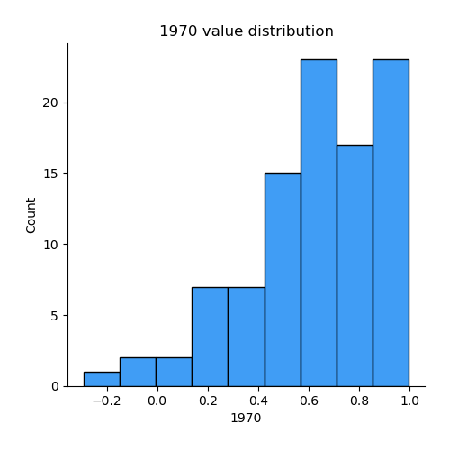
## Feature : 1971
- **Feature type** : continous
- **Missing** : 0.0%
- **Unique** : 97
- **Count** :97.0
- **Mean** :0.6134722961987396
- **Std** :0.2744682082122233
- **Min** :-0.12569089052685928
- **25%th Percentile** : 0.4059858760028851
- **50%th Percentile** : 0.6564749146779723
- **75%th Percentile** : 0.8058854079961898
- **Max** :0.9934044052132586

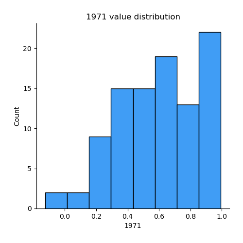
## Feature : 1972
- **Feature type** : continous
- **Missing** : 0.0%
- **Unique** : 97
- **Count** :97.0
- **Mean** :0.8037615071841508
- **Std** :0.1551166794672744
- **Min** :0.29575954575160907
- **25%th Percentile** : 0.7260485530614333
- **50%th Percentile** : 0.8161285179313749
- **75%th Percentile** : 0.9227988726574947
- **Max** :0.995833882045399

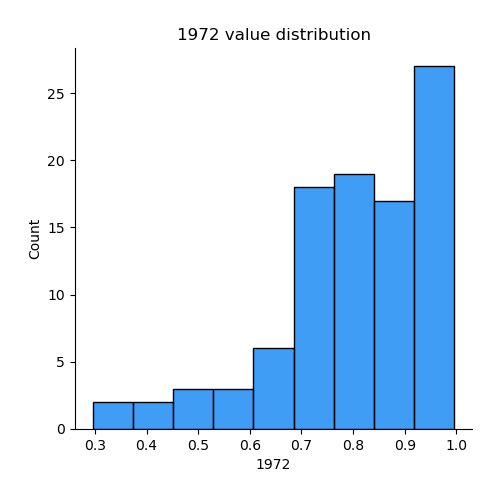
## Feature : 1973
- **Feature type** : continous
- **Missing** : 0.0%
- **Unique** : 97
- **Count** :97.0
- **Mean** :0.6485099732654894
- **Std** :0.26748265821047434
- **Min** :-0.12195269685105495
- **25%th Percentile** : 0.47936134475068176
- **50%th Percentile** : 0.6910497297363304
- **75%th Percentile** : 0.841467066236666
- **Max** :0.9944374010399412

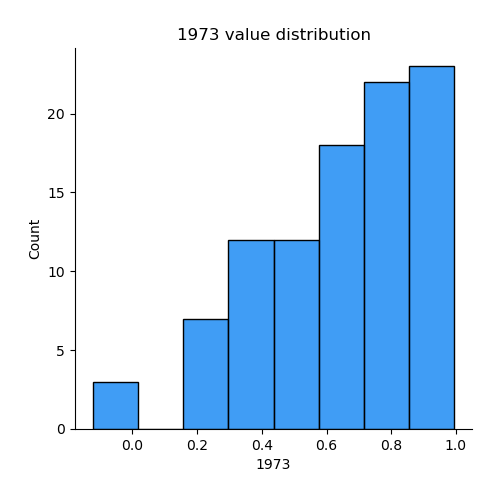
## Feature : 1974
- **Feature type** : continous
- **Missing** : 0.0%
- **Unique** : 97
- **Count** :97.0
- **Mean** :0.5357911771311946
- **Std** :0.2763320680667838
- **Min** :-0.10074132210705034
- **25%th Percentile** : 0.32607088638346055
- **50%th Percentile** : 0.535930168049219
- **75%th Percentile** : 0.7122642752245116
- **Max** :0.9882331927944543

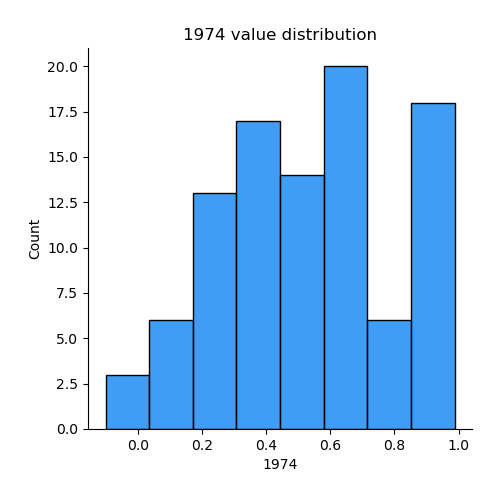
## Feature : 1975
- **Feature type** : continous
- **Missing** : 0.0%
- **Unique** : 97
- **Count** :97.0
- **Mean** :0.6115356738982916
- **Std** :0.25631592603640024
- **Min** :-0.06444189477127199
- **25%th Percentile** : 0.44784983862324024
- **50%th Percentile** : 0.6190493724221474
- **75%th Percentile** : 0.8128855062886018
- **Max** :0.9914595660319806

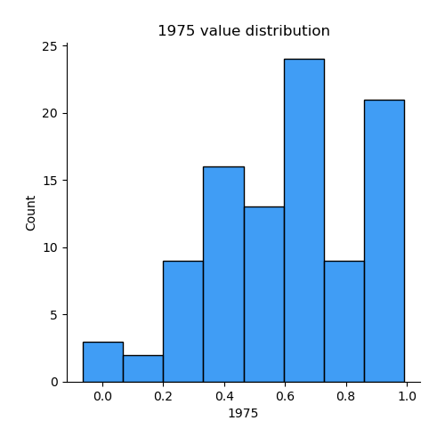
## Feature : 2014
- **Feature type** : continous
- **Missing** : 0.0%
- **Unique** : 3
- **Count** :97.0
- **Mean** :1.0
- **Std** :7.850462293418876e-17
- **Min** :0.9999999999999998
- **25%th Percentile** : 1.0
- **50%th Percentile** : 1.0
- **75%th Percentile** : 1.0
- **Max** :1.0

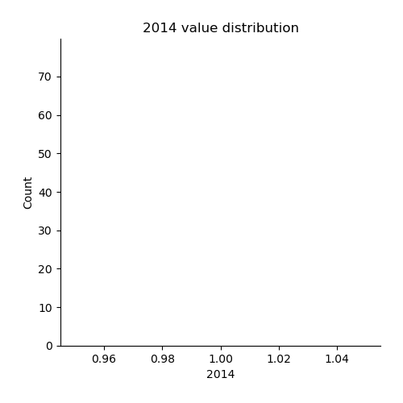
## Feature : 2015
- **Feature type** : continous
- **Missing** : 0.0%
- **Unique** : 97
- **Count** :97.0
- **Mean** :0.4724646810185817
- **Std** :0.33062701693596824
- **Min** :-0.3348992245255886
- **25%th Percentile** : 0.24571354969944378
- **50%th Percentile** : 0.42983955853236994
- **75%th Percentile** : 0.6888692034500373
- **Max** :0.9913103411130211

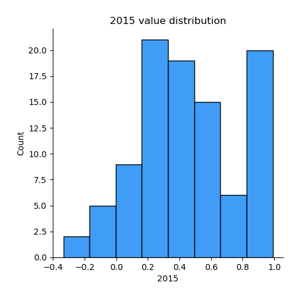
## Feature : 2016
- **Feature type** : continous
- **Missing** : 0.0%
- **Unique** : 97
- **Count** :97.0
- **Mean** :0.5154867259324888
- **Std** :0.31281769128822406
- **Min** :-0.2947801630471996
- **25%th Percentile** : 0.26984511766577696
- **50%th Percentile** : 0.5149674274221274
- **75%th Percentile** : 0.7709189487402436
- **Max** :0.9877643676216815

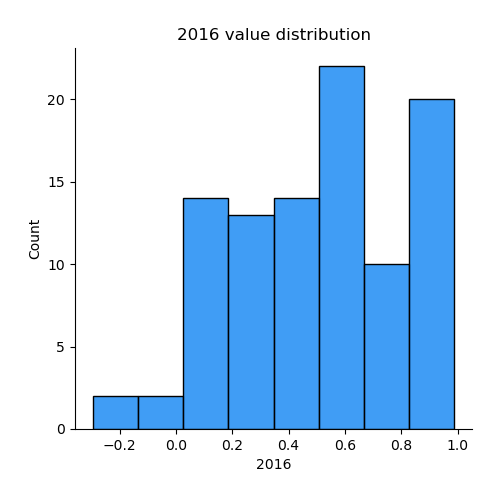
## Feature : 2017
- **Feature type** : continous
- **Missing** : 0.0%
- **Unique** : 97
- **Count** :97.0
- **Mean** :0.8516658198524035
- **Std** :0.1188631103297951
- **Min** :0.39307259014207463
- **25%th Percentile** : 0.772175201905269
- **50%th Percentile** : 0.850602794940377
- **75%th Percentile** : 0.9515702882542506
- **Max** :0.9977412866696246

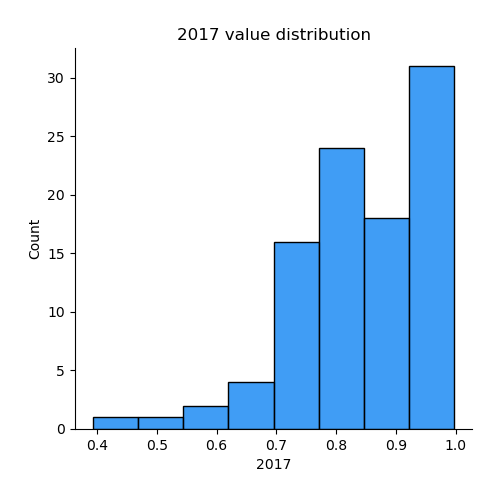
## Feature : 2018
- **Feature type** : continous
- **Missing** : 0.0%
- **Unique** : 97
- **Count** :97.0
- **Mean** :0.7138770389973538
- **Std** :0.20498596754448095
- **Min** :0.050524330464922676
- **25%th Percentile** : 0.578321911531917
- **50%th Percentile** : 0.7236433193348818
- **75%th Percentile** : 0.8449435640676193
- **Max** :0.9943120384513968

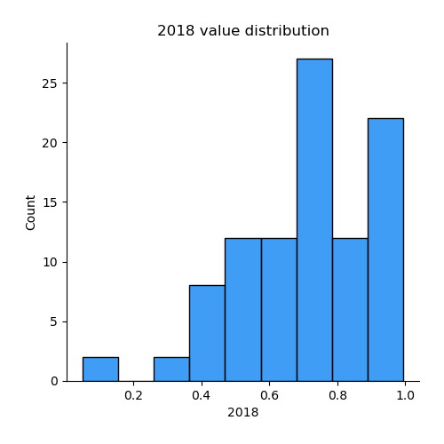
## Feature : 2019
- **Feature type** : continous
- **Missing** : 0.0%
- **Unique** : 97
- **Count** :97.0
- **Mean** :0.8572633571034267
- **Std** :0.11873855042442134
- **Min** :0.34973694215542456
- **25%th Percentile** : 0.7997265369504267
- **50%th Percentile** : 0.8718193884769535
- **75%th Percentile** : 0.9439895561148868
- **Max** :0.9976266045228762

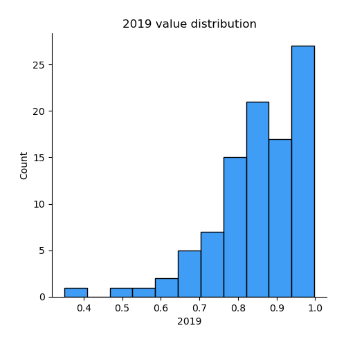
## Feature : 2020
- **Feature type** : continous
- **Missing** : 0.0%
- **Unique** : 97
- **Count** :97.0
- **Mean** :0.7171127743397944
- **Std** :0.20153222787870642
- **Min** :0.0940691570685642
- **25%th Percentile** : 0.5888221977238995
- **50%th Percentile** : 0.7262139415671429
- **75%th Percentile** : 0.8718581879521611
- **Max** :0.9928294793938044

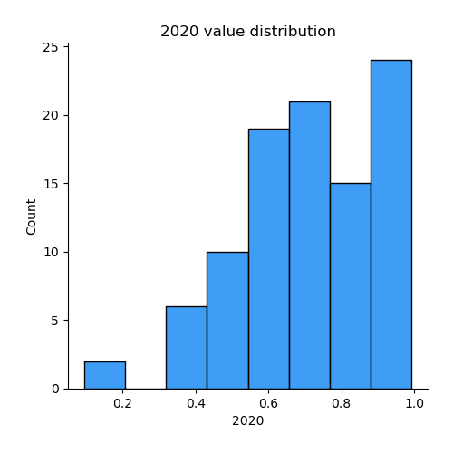
## Feature : 2021
- **Feature type** : continous
- **Missing** : 0.0%
- **Unique** : 97
- **Count** :97.0
- **Mean** :0.4785160634173034
- **Std** :0.3293779073822146
- **Min** :-0.16540120421530016
- **25%th Percentile** : 0.2221971485834003
- **50%th Percentile** : 0.43145572667773857
- **75%th Percentile** : 0.7620928919756704
- **Max** :0.9896273554682568

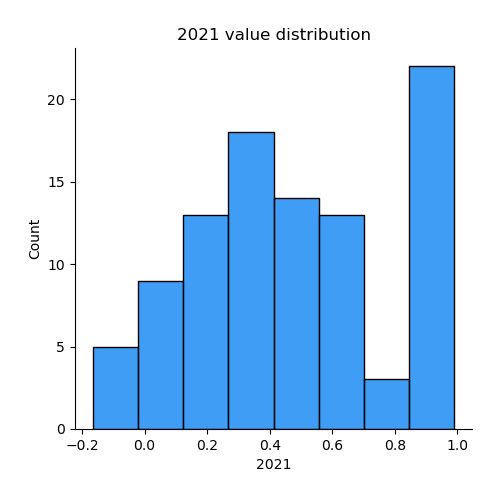
## Feature : 2022
- **Feature type** : continous
- **Missing** : 0.0%
- **Unique** : 97
- **Count** :97.0
- **Mean** :0.7225733977936316
- **Std** :0.20176712888197082
- **Min** :0.05039754318085955
- **25%th Percentile** : 0.61767608026753
- **50%th Percentile** : 0.7265814164900065
- **75%th Percentile** : 0.8571804860275926
- **Max** :0.9957607344890514

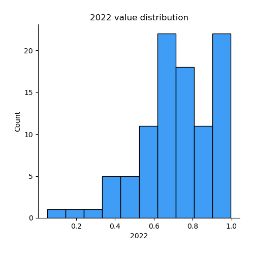
## Feature : 2023
- **Feature type** : continous
- **Missing** : 0.0%
- **Unique** : 97
- **Count** :97.0
- **Mean** :0.7786337747969125
- **Std** :0.15878448736304182
- **Min** :0.3424041237088261
- **25%th Percentile** : 0.6931582192023055
- **50%th Percentile** : 0.7895155235590738
- **75%th Percentile** : 0.8924566021402297
- **Max** :0.9961217616322597

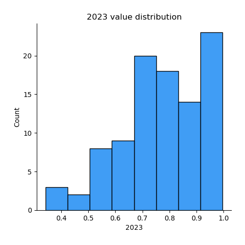
## Feature : 2024
- **Feature type** : continous
- **Missing** : 0.0%
- **Unique** : 97
- **Count** :97.0
- **Mean** :0.5770888328910604
- **Std** :0.30173654433796326
- **Min** :-0.028768981780068606
- **25%th Percentile** : 0.3156045246552992
- **50%th Percentile** : 0.5701806495738391
- **75%th Percentile** : 0.854143151181834
- **Max** :0.9953541682423227

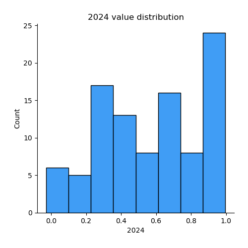
## Feature : 2025
- **Feature type** : continous
- **Missing** : 0.0%
- **Unique** : 97
- **Count** :97.0
- **Mean** :0.7442248474175139
- **Std** :0.1705693440237974
- **Min** :0.38017850345335963
- **25%th Percentile** : 0.6385489004902759
- **50%th Percentile** : 0.7263710082860717
- **75%th Percentile** : 0.8646298492073492
- **Max** :0.9941760771694979

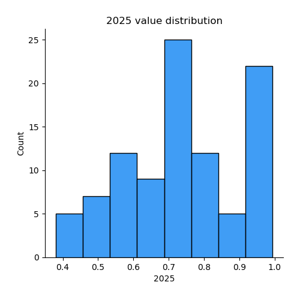
## Feature : 2026
- **Feature type** : continous
- **Missing** : 0.0%
- **Unique** : 97
- **Count** :97.0
- **Mean** :0.36135790733470385
- **Std** :0.35461389608660104
- **Min** :-0.4415584761619546
- **25%th Percentile** : 0.12941165974483282
- **50%th Percentile** : 0.31636980524261643
- **75%th Percentile** : 0.5825098585250572
- **Max** :0.9772731383848495

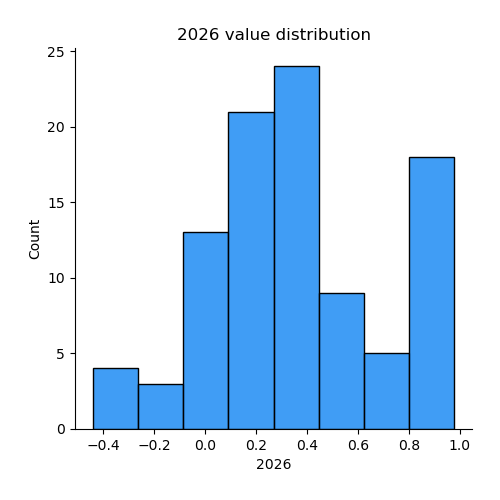
## Feature : 2027
- **Feature type** : continous
- **Missing** : 0.0%
- **Unique** : 97
- **Count** :97.0
- **Mean** :0.48256507354640327
- **Std** :0.32380006332413513
- **Min** :-0.3368195607008905
- **25%th Percentile** : 0.2339209060493153
- **50%th Percentile** : 0.4404346257674354
- **75%th Percentile** : 0.7419483311256885
- **Max** :0.9904594276023174

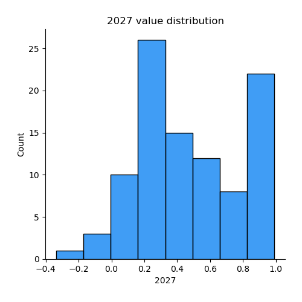
## Feature : 2067
- **Feature type** : continous
- **Missing** : 0.0%
- **Unique** : 3
- **Count** :97.0
- **Mean** :1.0
- **Std** :7.516245408138222e-17
- **Min** :0.9999999999999998
- **25%th Percentile** : 1.0
- **50%th Percentile** : 1.0
- **75%th Percentile** : 1.0
- **Max** :1.0

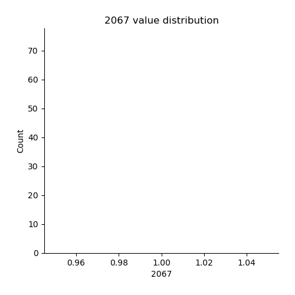
## Feature : 2068
- **Feature type** : continous
- **Missing** : 0.0%
- **Unique** : 97
- **Count** :97.0
- **Mean** :0.6052723214002673
- **Std** :0.2316498281624677
- **Min** :0.05223010896198738
- **25%th Percentile** : 0.44098125740952393
- **50%th Percentile** : 0.5785483037048151
- **75%th Percentile** : 0.7932248308713683
- **Max** :0.986730758863304

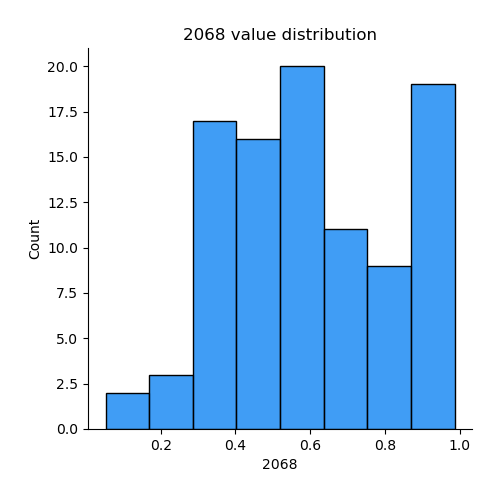
## Feature : 2069
- **Feature type** : continous
- **Missing** : 0.0%
- **Unique** : 97
- **Count** :97.0
- **Mean** :0.5036053382851186
- **Std** :0.3073804792154711
- **Min** :-0.13610694599948087
- **25%th Percentile** : 0.2672239280272522
- **50%th Percentile** : 0.4263184994705225
- **75%th Percentile** : 0.7235953821274098
- **Max** :0.9904544385403198

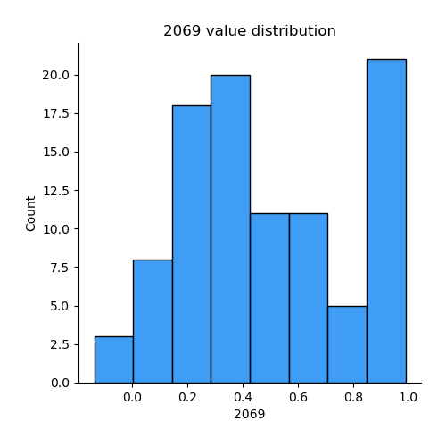
## Feature : 2070
- **Feature type** : continous
- **Missing** : 0.0%
- **Unique** : 97
- **Count** :97.0
- **Mean** :0.5295259602624328
- **Std** :0.2992599615776126
- **Min** :-0.06674655412809982
- **25%th Percentile** : 0.2977804295939799
- **50%th Percentile** : 0.5172048870451578
- **75%th Percentile** : 0.7257861756805023
- **Max** :0.9885061563696964

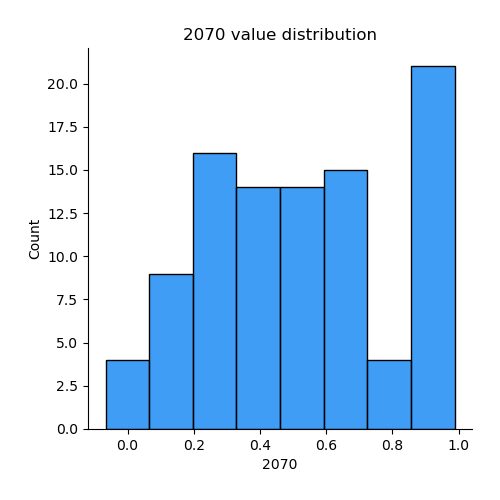
## Feature : 2071
- **Feature type** : continous
- **Missing** : 0.0%
- **Unique** : 97
- **Count** :97.0
- **Mean** :0.5328493450926732
- **Std** :0.29617806520427264
- **Min** :-0.02722601986198518
- **25%th Percentile** : 0.30869096896245213
- **50%th Percentile** : 0.5102654594099834
- **75%th Percentile** : 0.7506719983887458
- **Max** :0.9922908940265769

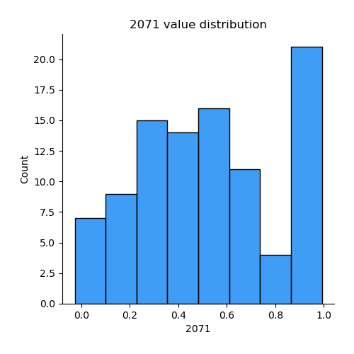
## Feature : 2072
- **Feature type** : continous
- **Missing** : 0.0%
- **Unique** : 97
- **Count** :97.0
- **Mean** :0.6230091655177042
- **Std** :0.2559841442029497
- **Min** :-0.027439961587730575
- **25%th Percentile** : 0.4616437684144953
- **50%th Percentile** : 0.6205651008510508
- **75%th Percentile** : 0.8355795057976215
- **Max** :0.9906035544140227

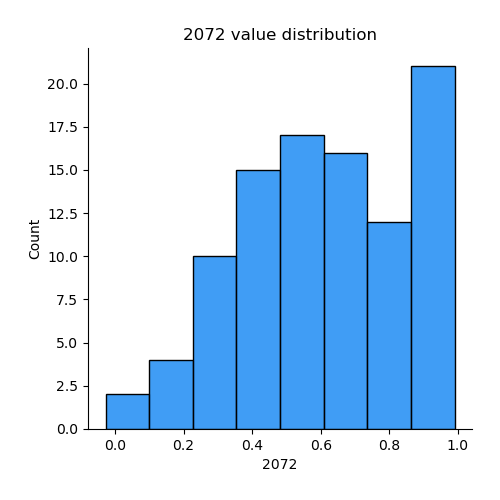
## Feature : 2073
- **Feature type** : continous
- **Missing** : 0.0%
- **Unique** : 97
- **Count** :97.0
- **Mean** :0.4335484376544714
- **Std** :0.3197676108819307
- **Min** :-0.11952266447659038
- **25%th Percentile** : 0.19571166351537875
- **50%th Percentile** : 0.33861127653221623
- **75%th Percentile** : 0.6214624084999344
- **Max** :0.984474220879963

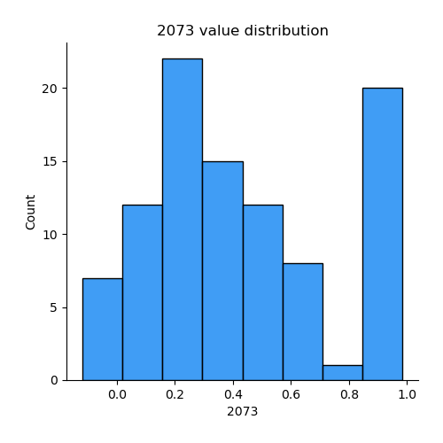
## Feature : 2074
- **Feature type** : continous
- **Missing** : 0.0%
- **Unique** : 97
- **Count** :97.0
- **Mean** :0.5159273830469598
- **Std** :0.31715664507425234
- **Min** :-0.29333746493756857
- **25%th Percentile** : 0.3292872119746354
- **50%th Percentile** : 0.4863661266814922
- **75%th Percentile** : 0.699175320195175
- **Max** :0.9917003437770119

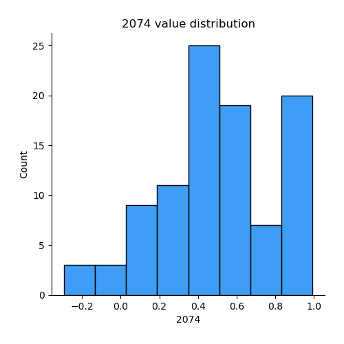
## Feature : 2075
- **Feature type** : continous
- **Missing** : 0.0%
- **Unique** : 97
- **Count** :97.0
- **Mean** :0.5827371990371636
- **Std** :0.2694525412510314
- **Min** :-0.025605223870494815
- **25%th Percentile** : 0.3757269678596729
- **50%th Percentile** : 0.5473154331159195
- **75%th Percentile** : 0.7830781297624355
- **Max** :0.9903497027746044

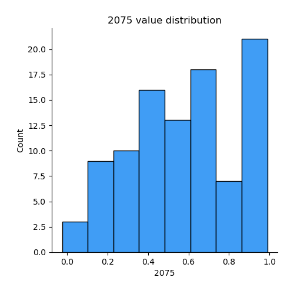
## Feature : 2076
- **Feature type** : continous
- **Missing** : 0.0%
- **Unique** : 97
- **Count** :97.0
- **Mean** :0.6124569389473873
- **Std** :0.2619898594643231
- **Min** :-0.1270819134210374
- **25%th Percentile** : 0.41633792316762136
- **50%th Percentile** : 0.5989615812466569
- **75%th Percentile** : 0.785852306449848
- **Max** :0.9923338554438006

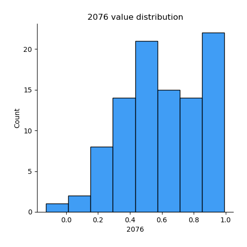
## Feature : 2077
- **Feature type** : continous
- **Missing** : 0.0%
- **Unique** : 97
- **Count** :97.0
- **Mean** :0.5435398685094776
- **Std** :0.28902512100522504
- **Min** :0.019929582245362273
- **25%th Percentile** : 0.3257609121932046
- **50%th Percentile** : 0.5144245899064838
- **75%th Percentile** : 0.7650336844706208
- **Max** :0.9907673366385169

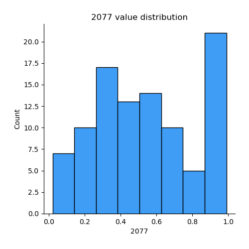
## Feature : 2078
- **Feature type** : continous
- **Missing** : 0.0%
- **Unique** : 97
- **Count** :97.0
- **Mean** :0.487347185839051
- **Std** :0.29785501956709587
- **Min** :-0.18600387982697975
- **25%th Percentile** : 0.28149762751542323
- **50%th Percentile** : 0.436631082132754
- **75%th Percentile** : 0.714551730673041
- **Max** :0.9849388081559686

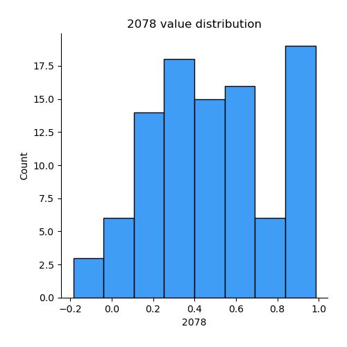
## Feature : 2079
- **Feature type** : continous
- **Missing** : 0.0%
- **Unique** : 97
- **Count** :97.0
- **Mean** :0.52073362778651
- **Std** :0.29297077754323686
- **Min** :-0.03547720516592404
- **25%th Percentile** : 0.310319443951092
- **50%th Percentile** : 0.4820492403926288
- **75%th Percentile** : 0.7253082840339619
- **Max** :0.9862213235327746

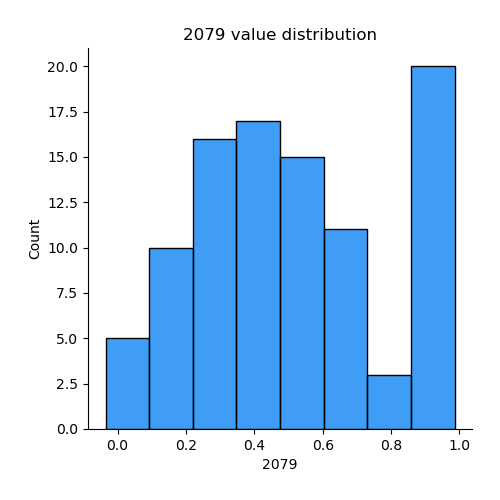
## Feature : 2120
- **Feature type** : continous
- **Missing** : 0.0%
- **Unique** : 3
- **Count** :97.0
- **Mean** :1.0
- **Std** :8.479468414379336e-17
- **Min** :0.9999999999999998
- **25%th Percentile** : 1.0
- **50%th Percentile** : 1.0
- **75%th Percentile** : 1.0
- **Max** :1.0

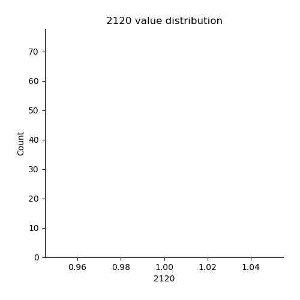
## Feature : 2121
- **Feature type** : continous
- **Missing** : 0.0%
- **Unique** : 97
- **Count** :97.0
- **Mean** :0.5137483898749371
- **Std** :0.3172863753450977
- **Min** :-0.3366131202196782
- **25%th Percentile** : 0.2930902114139168
- **50%th Percentile** : 0.5351208246447822
- **75%th Percentile** : 0.7718785529163995
- **Max** :0.9856363849920463

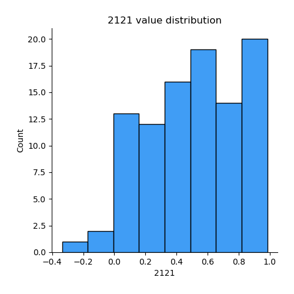
## Feature : 2122
- **Feature type** : continous
- **Missing** : 0.0%
- **Unique** : 97
- **Count** :97.0
- **Mean** :0.6231208749259517
- **Std** :0.2281053804261457
- **Min** :0.1176883118510502
- **25%th Percentile** : 0.4662947258695295
- **50%th Percentile** : 0.6046328079800065
- **75%th Percentile** : 0.7862548100830289
- **Max** :0.9937267872523436

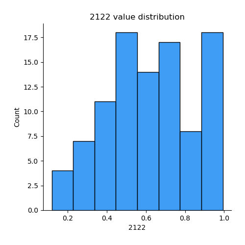
## Feature : 2123
- **Feature type** : continous
- **Missing** : 0.0%
- **Unique** : 97
- **Count** :97.0
- **Mean** :0.5571312804666388
- **Std** :0.2890944511345139
- **Min** :-0.30721045354367904
- **25%th Percentile** : 0.3610949299612992
- **50%th Percentile** : 0.5627140219495305
- **75%th Percentile** : 0.7959179096498565
- **Max** :0.9881685059346552

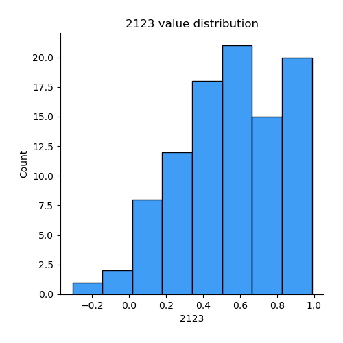
## Feature : 2124
- **Feature type** : continous
- **Missing** : 0.0%
- **Unique** : 97
- **Count** :97.0
- **Mean** :0.7288348446172607
- **Std** :0.1642876742419153
- **Min** :0.33472136872398234
- **25%th Percentile** : 0.6073255178799878
- **50%th Percentile** : 0.7252329243675572
- **75%th Percentile** : 0.8530307741946123
- **Max** :0.9906297327139518

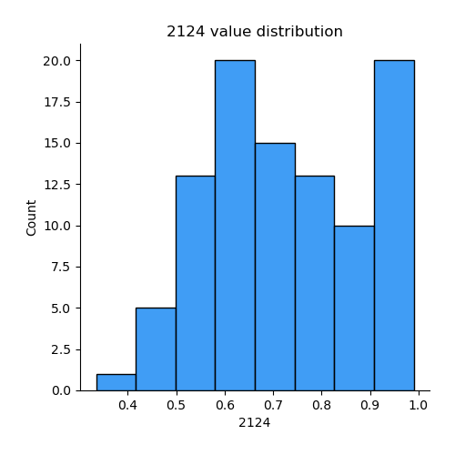
## Feature : 2125
- **Feature type** : continous
- **Missing** : 0.0%
- **Unique** : 97
- **Count** :97.0
- **Mean** :0.41398803078888335
- **Std** :0.3225583574461218
- **Min** :-0.3200835877825282
- **25%th Percentile** : 0.18967206615832521
- **50%th Percentile** : 0.3415826562707186
- **75%th Percentile** : 0.6261474591011645
- **Max** :0.9760997380976842

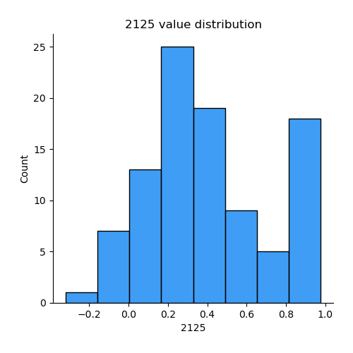
## Feature : 2126
- **Feature type** : continous
- **Missing** : 0.0%
- **Unique** : 97
- **Count** :97.0
- **Mean** :0.5502973365630932
- **Std** :0.2879617234277641
- **Min** :-0.20047224021602889
- **25%th Percentile** : 0.3816301170366514
- **50%th Percentile** : 0.5484859161609972
- **75%th Percentile** : 0.7382994466231083
- **Max** :0.9902675524449445

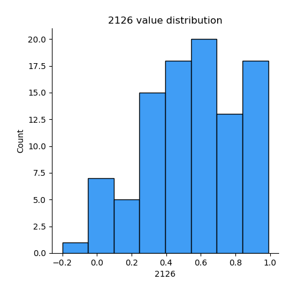
## Feature : 2127
- **Feature type** : continous
- **Missing** : 0.0%
- **Unique** : 97
- **Count** :97.0
- **Mean** :0.6778765463455674
- **Std** :0.21114608495652779
- **Min** :0.2096178232926273
- **25%th Percentile** : 0.5266634387600295
- **50%th Percentile** : 0.6888508499238617
- **75%th Percentile** : 0.8380201559451409
- **Max** :0.9884513167575807

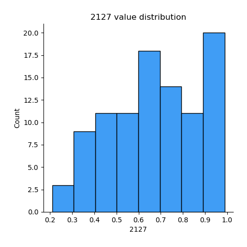
## Feature : 2128
- **Feature type** : continous
- **Missing** : 0.0%
- **Unique** : 97
- **Count** :97.0
- **Mean** :0.5905886916372489
- **Std** :0.2490783168610602
- **Min** :0.08513046765356706
- **25%th Percentile** : 0.39946763918756995
- **50%th Percentile** : 0.5741007012380347
- **75%th Percentile** : 0.8099901396578982
- **Max** :0.9838447186763241

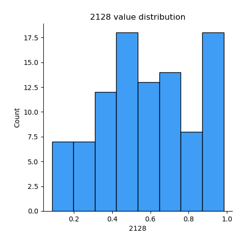
## Feature : 2129
- **Feature type** : continous
- **Missing** : 0.0%
- **Unique** : 97
- **Count** :97.0
- **Mean** :0.6294619882123658
- **Std** :0.22886519382931175
- **Min** :-0.03410957149130903
- **25%th Percentile** : 0.4639978445995531
- **50%th Percentile** : 0.6183447512081773
- **75%th Percentile** : 0.8075969457278489
- **Max** :0.9846233643562521

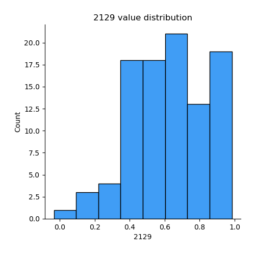
## Feature : 2130
- **Feature type** : continous
- **Missing** : 0.0%
- **Unique** : 97
- **Count** :97.0
- **Mean** :0.3842442194716973
- **Std** :0.3250970178896432
- **Min** :-0.35095179404880356
- **25%th Percentile** : 0.17963897271067805
- **50%th Percentile** : 0.3410730223029965
- **75%th Percentile** : 0.6175694985783193
- **Max** :0.9653871488416964

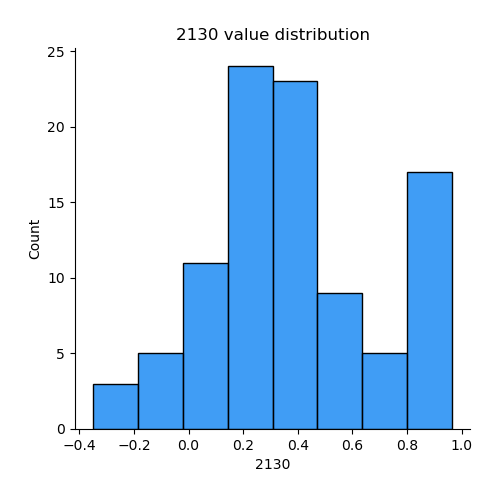
## Feature : 2131
- **Feature type** : continous
- **Missing** : 0.0%
- **Unique** : 97
- **Count** :97.0
- **Mean** :0.53446156789853
- **Std** :0.2736506241144309
- **Min** :-0.08623825099300927
- **25%th Percentile** : 0.3380795549637704
- **50%th Percentile** : 0.5117680451665264
- **75%th Percentile** : 0.7448229853573954
- **Max** :0.976970413160464

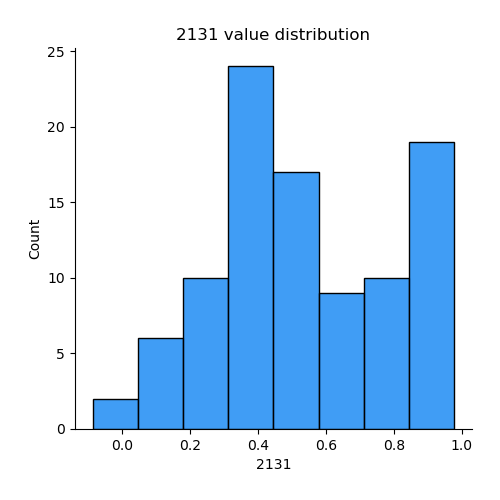
## Feature : 2173
- **Feature type** : continous
- **Missing** : 0.0%
- **Unique** : 3
- **Count** :97.0
- **Mean** :1.0
- **Std** :8.554842949272357e-17
- **Min** :0.9999999999999998
- **25%th Percentile** : 0.9999999999999999
- **50%th Percentile** : 1.0
- **75%th Percentile** : 1.0
- **Max** :1.0

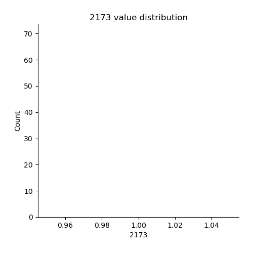
## Feature : 2174
- **Feature type** : continous
- **Missing** : 0.0%
- **Unique** : 97
- **Count** :97.0
- **Mean** :0.7043220042031181
- **Std** :0.21927353736310712
- **Min** :0.16804563342138634
- **25%th Percentile** : 0.5439147835677565
- **50%th Percentile** : 0.7130642556760576
- **75%th Percentile** : 0.9090937892525858
- **Max** :0.9929617320663572

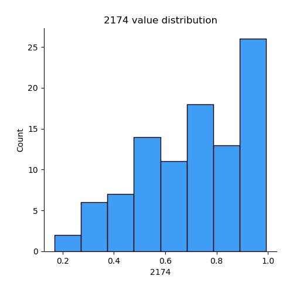
## Feature : 2175
- **Feature type** : continous
- **Missing** : 0.0%
- **Unique** : 97
- **Count** :97.0
- **Mean** :0.9361604206913539
- **Std** :0.05954470595389901
- **Min** :0.6736152325118406
- **25%th Percentile** : 0.9141292391320067
- **50%th Percentile** : 0.9450664028488711
- **75%th Percentile** : 0.9786708514101192
- **Max** :0.9989189472311846

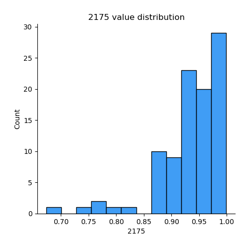
## Feature : 2176
- **Feature type** : continous
- **Missing** : 0.0%
- **Unique** : 97
- **Count** :97.0
- **Mean** :0.7104224088046094
- **Std** :0.2103559097335482
- **Min** :0.1295997047112632
- **25%th Percentile** : 0.5680585575166012
- **50%th Percentile** : 0.7195903235385739
- **75%th Percentile** : 0.8710814710067043
- **Max** :0.9915264513644567

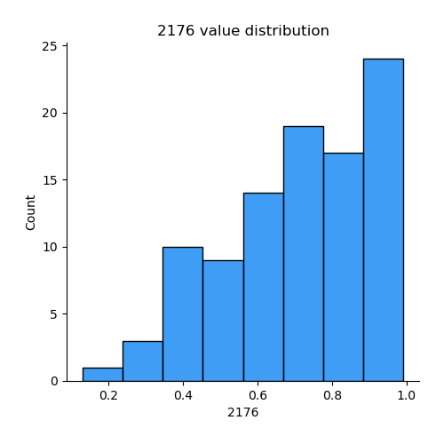
## Feature : 2177
- **Feature type** : continous
- **Missing** : 0.0%
- **Unique** : 97
- **Count** :97.0
- **Mean** :0.5231917799130218
- **Std** :0.3107462219914893
- **Min** :-0.17555716012848174
- **25%th Percentile** : 0.2976504547941686
- **50%th Percentile** : 0.5161366661337681
- **75%th Percentile** : 0.7609499412195582
- **Max** :0.9914120435997577

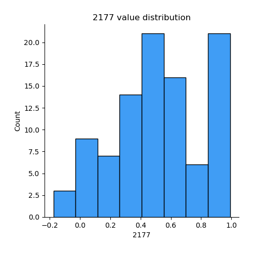
## Feature : 2178
- **Feature type** : continous
- **Missing** : 0.0%
- **Unique** : 97
- **Count** :97.0
- **Mean** :0.7272964119736002
- **Std** :0.19518697749597871
- **Min** :0.11746921743557018
- **25%th Percentile** : 0.6302567500317143
- **50%th Percentile** : 0.7320786343644813
- **75%th Percentile** : 0.8711571754972588
- **Max** :0.9974661891400951

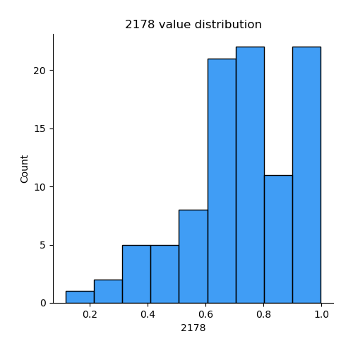
## Feature : 2179
- **Feature type** : continous
- **Missing** : 0.0%
- **Unique** : 97
- **Count** :97.0
- **Mean** :0.8055117841741686
- **Std** :0.15017369367314234
- **Min** :0.3979710364558311
- **25%th Percentile** : 0.7286449616786065
- **50%th Percentile** : 0.8184160494748619
- **75%th Percentile** : 0.929211486015306
- **Max** :0.99681608834276

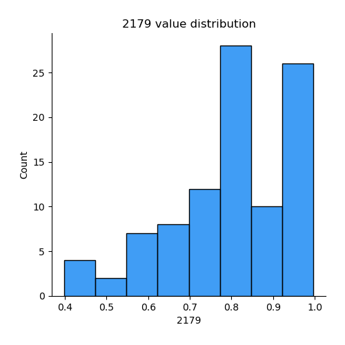
## Feature : 2180
- **Feature type** : continous
- **Missing** : 0.0%
- **Unique** : 97
- **Count** :97.0
- **Mean** :0.6776407846443254
- **Std** :0.2353818833779555
- **Min** :0.11917211839973754
- **25%th Percentile** : 0.5211031649291982
- **50%th Percentile** : 0.6844871095485742
- **75%th Percentile** : 0.8752283513292148
- **Max** :0.995822246686268

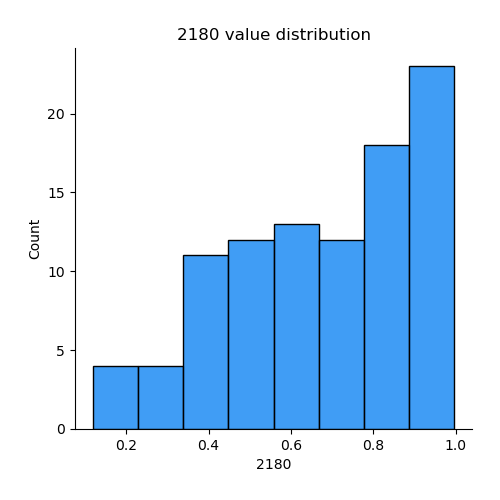
## Feature : 2181
- **Feature type** : continous
- **Missing** : 0.0%
- **Unique** : 97
- **Count** :97.0
- **Mean** :0.8143609838193059
- **Std** :0.13208772369681276
- **Min** :0.5028620605348334
- **25%th Percentile** : 0.7329978610360353
- **50%th Percentile** : 0.8257864018705904
- **75%th Percentile** : 0.908743992397114
- **Max** :0.9961521880501909

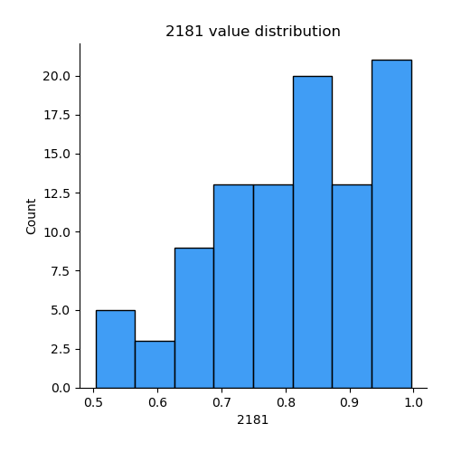
## Feature : 2182
- **Feature type** : continous
- **Missing** : 0.0%
- **Unique** : 97
- **Count** :97.0
- **Mean** :0.3935243064630459
- **Std** :0.3429447429210728
- **Min** :-0.4953799458148984
- **25%th Percentile** : 0.14330797825112881
- **50%th Percentile** : 0.3531107986158428
- **75%th Percentile** : 0.6267134022913471
- **Max** :0.9843811888348277

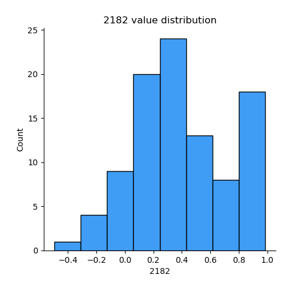
## Feature : 2183
- **Feature type** : continous
- **Missing** : 0.0%
- **Unique** : 97
- **Count** :97.0
- **Mean** :0.5728985731368583
- **Std** :0.2761746292565952
- **Min** :-0.12616528464987883
- **25%th Percentile** : 0.36701176925970697
- **50%th Percentile** : 0.5360299241304212
- **75%th Percentile** : 0.7939942679779618
- **Max** :0.9908308118074618

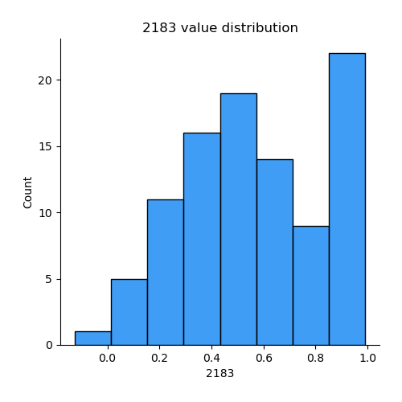
## Feature : 2226
- **Feature type** : continous
- **Missing** : 0.0%
- **Unique** : 3
- **Count** :97.0
- **Mean** :1.0
- **Std** :9.205483015737869e-17
- **Min** :0.9999999999999998
- **25%th Percentile** : 1.0
- **50%th Percentile** : 1.0
- **75%th Percentile** : 1.0
- **Max** :1.0

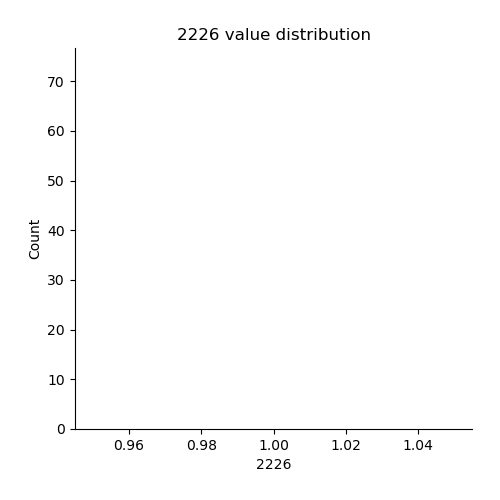
## Feature : 2227
- **Feature type** : continous
- **Missing** : 0.0%
- **Unique** : 97
- **Count** :97.0
- **Mean** :0.7497367601066415
- **Std** :0.1879602126404402
- **Min** :0.2128481152785716
- **25%th Percentile** : 0.6170500200027877
- **50%th Percentile** : 0.7625132205900746
- **75%th Percentile** : 0.8921440253074477
- **Max** :0.9959357504518941

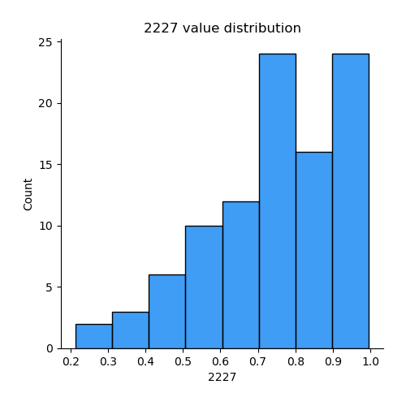
## Feature : 2228
- **Feature type** : continous
- **Missing** : 0.0%
- **Unique** : 97
- **Count** :97.0
- **Mean** :0.7970623858191731
- **Std** :0.14858680996058185
- **Min** :0.44275438185950255
- **25%th Percentile** : 0.7167250909160605
- **50%th Percentile** : 0.8103725786982314
- **75%th Percentile** : 0.903216126571094
- **Max** :0.9938029028354297

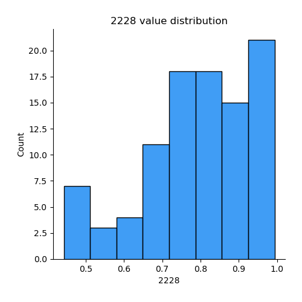
## Feature : 2229
- **Feature type** : continous
- **Missing** : 0.0%
- **Unique** : 97
- **Count** :97.0
- **Mean** :0.5839507149318152
- **Std** :0.27135475177438106
- **Min** :-0.08057689325398187
- **25%th Percentile** : 0.4043774289296824
- **50%th Percentile** : 0.5628535894986354
- **75%th Percentile** : 0.7886857766143336
- **Max** :0.9911948155513076

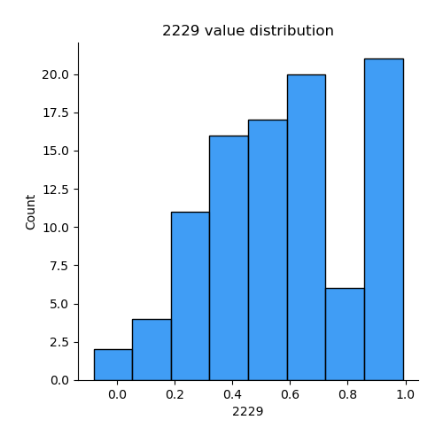
## Feature : 2230
- **Feature type** : continous
- **Missing** : 0.0%
- **Unique** : 97
- **Count** :97.0
- **Mean** :0.7709734821786757
- **Std** :0.1673234852089149
- **Min** :0.21611847578436513
- **25%th Percentile** : 0.6902270716305192
- **50%th Percentile** : 0.7847580366066955
- **75%th Percentile** : 0.8884114244517547
- **Max** :0.9968630509449659

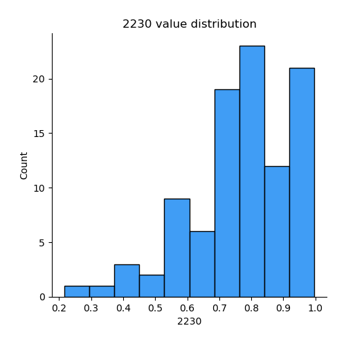
## Feature : 2231
- **Feature type** : continous
- **Missing** : 0.0%
- **Unique** : 97
- **Count** :97.0
- **Mean** :0.7363445349920704
- **Std** :0.19545627064703944
- **Min** :0.08888367191680842
- **25%th Percentile** : 0.626417408017605
- **50%th Percentile** : 0.7466003148947543
- **75%th Percentile** : 0.8801924773438
- **Max** :0.9956329830641047

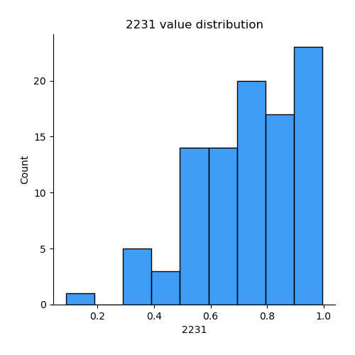
## Feature : 2232
- **Feature type** : continous
- **Missing** : 0.0%
- **Unique** : 97
- **Count** :97.0
- **Mean** :0.6441574220526533
- **Std** :0.24640118232084687
- **Min** :-0.0713727041866411
- **25%th Percentile** : 0.48598237578308184
- **50%th Percentile** : 0.6080945894483567
- **75%th Percentile** : 0.8302970460891255
- **Max** :0.9922310833499925

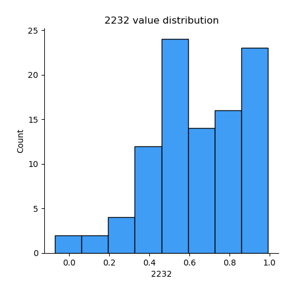
## Feature : 2233
- **Feature type** : continous
- **Missing** : 0.0%
- **Unique** : 97
- **Count** :97.0
- **Mean** :0.7901467348328989
- **Std** :0.15913729980675428
- **Min** :0.37569054291270365
- **25%th Percentile** : 0.7066767330820402
- **50%th Percentile** : 0.7986256950676315
- **75%th Percentile** : 0.9102413163394667
- **Max** :0.9956837067007338

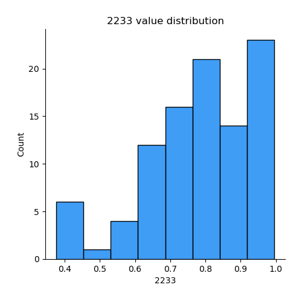
## Feature : 2234
- **Feature type** : continous
- **Missing** : 0.0%
- **Unique** : 97
- **Count** :97.0
- **Mean** :0.43075421820230614
- **Std** :0.31669497719425443
- **Min** :-0.24481936080636582
- **25%th Percentile** : 0.21393641994387577
- **50%th Percentile** : 0.3880714066129719
- **75%th Percentile** : 0.6290891697227026
- **Max** :0.9826206924185172

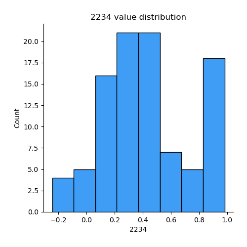
## Feature : 2235
- **Feature type** : continous
- **Missing** : 0.0%
- **Unique** : 97
- **Count** :97.0
- **Mean** :0.5762778200007862
- **Std** :0.2848747538388437
- **Min** :-0.2584495542914717
- **25%th Percentile** : 0.37097985349777707
- **50%th Percentile** : 0.5809296828874865
- **75%th Percentile** : 0.7655513301880068
- **Max** :0.9904767855853849

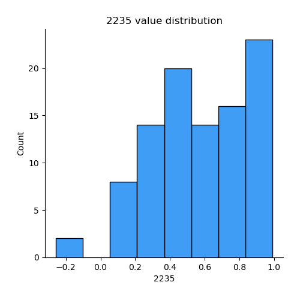
## Feature : 2279
- **Feature type** : continous
- **Missing** : 0.0%
- **Unique** : 3
- **Count** :97.0
- **Mean** :1.0
- **Std** :8.403417834083859e-17
- **Min** :0.9999999999999998
- **25%th Percentile** : 0.9999999999999999
- **50%th Percentile** : 1.0
- **75%th Percentile** : 1.0
- **Max** :1.0

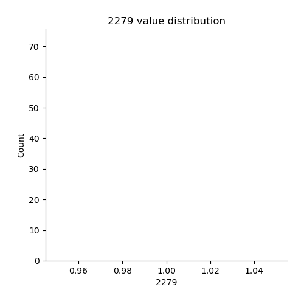
## Feature : 2280
- **Feature type** : continous
- **Missing** : 0.0%
- **Unique** : 97
- **Count** :97.0
- **Mean** :0.7270718440849325
- **Std** :0.19174642977778775
- **Min** :0.22800646812950226
- **25%th Percentile** : 0.6102486175300413
- **50%th Percentile** : 0.7455631955740454
- **75%th Percentile** : 0.8519649263811423
- **Max** :0.9917981060589525

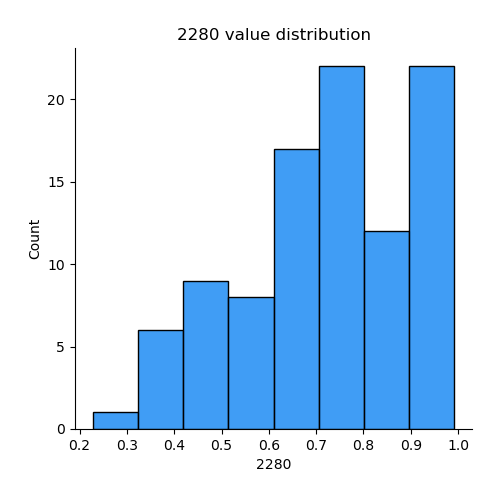
## Feature : 2281
- **Feature type** : continous
- **Missing** : 0.0%
- **Unique** : 97
- **Count** :97.0
- **Mean** :0.5365493099933705
- **Std** :0.2951698900192776
- **Min** :-0.2011038652168122
- **25%th Percentile** : 0.3061355293105147
- **50%th Percentile** : 0.5135023054332549
- **75%th Percentile** : 0.7847527289879725
- **Max** :0.9890483922510521

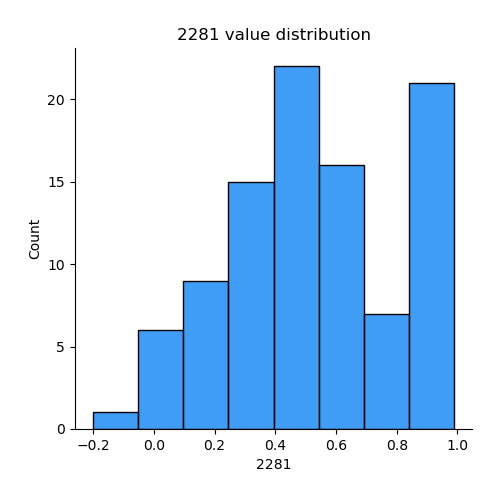
## Feature : 2282
- **Feature type** : continous
- **Missing** : 0.0%
- **Unique** : 97
- **Count** :97.0
- **Mean** :0.803170630753618
- **Std** :0.14436721755678306
- **Min** :0.35816828238183956
- **25%th Percentile** : 0.7339407238729672
- **50%th Percentile** : 0.8115957321842626
- **75%th Percentile** : 0.8876179703094669
- **Max** :0.9967324746678263

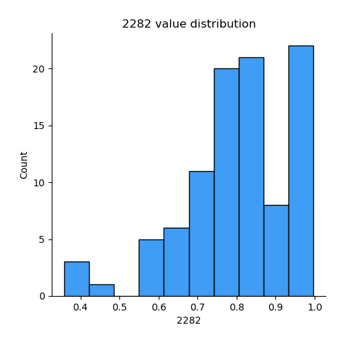
## Feature : 2283
- **Feature type** : continous
- **Missing** : 0.0%
- **Unique** : 97
- **Count** :97.0
- **Mean** :0.8360268615472548
- **Std** :0.12345968662085632
- **Min** :0.4068474995298158
- **25%th Percentile** : 0.7743916643658773
- **50%th Percentile** : 0.8428430558914884
- **75%th Percentile** : 0.918326256240055
- **Max** :0.9979436932519702

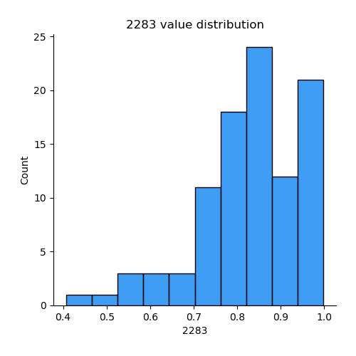
## Feature : 2284
- **Feature type** : continous
- **Missing** : 0.0%
- **Unique** : 97
- **Count** :97.0
- **Mean** :0.6706760545697199
- **Std** :0.25372532926949914
- **Min** :-0.12696092828289324
- **25%th Percentile** : 0.5169694960579491
- **50%th Percentile** : 0.6932537281258951
- **75%th Percentile** : 0.8698258958818955
- **Max** :0.995499743214143

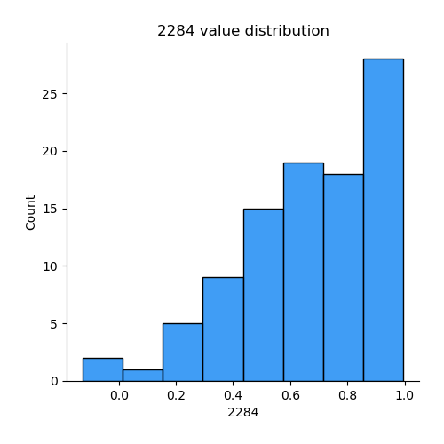
## Feature : 2285
- **Feature type** : continous
- **Missing** : 0.0%
- **Unique** : 97
- **Count** :97.0
- **Mean** :0.8419322797146842
- **Std** :0.10796681720845827
- **Min** :0.5459350938431271
- **25%th Percentile** : 0.7775943930206703
- **50%th Percentile** : 0.8440666954059909
- **75%th Percentile** : 0.9126401585173217
- **Max** :0.9962449375122293

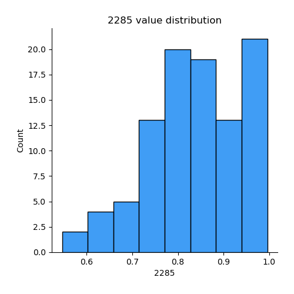
## Feature : 2286
- **Feature type** : continous
- **Missing** : 0.0%
- **Unique** : 97
- **Count** :97.0
- **Mean** :0.397412127710252
- **Std** :0.3362905098607513
- **Min** :-0.4065769834114999
- **25%th Percentile** : 0.20423383083362928
- **50%th Percentile** : 0.3549870157215404
- **75%th Percentile** : 0.586997964169217
- **Max** :0.9839204116307464

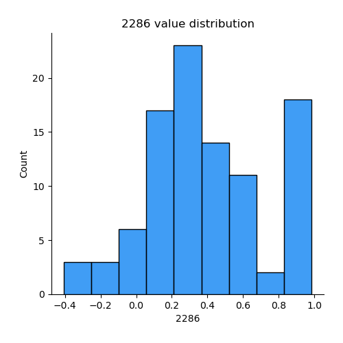
## Feature : 2287
- **Feature type** : continous
- **Missing** : 0.0%
- **Unique** : 97
- **Count** :97.0
- **Mean** :0.5649327606246431
- **Std** :0.29162495565744656
- **Min** :-0.2672019844323355
- **25%th Percentile** : 0.36342786654119846
- **50%th Percentile** : 0.5583826775990616
- **75%th Percentile** : 0.7789955026318108
- **Max** :0.9913469565361045

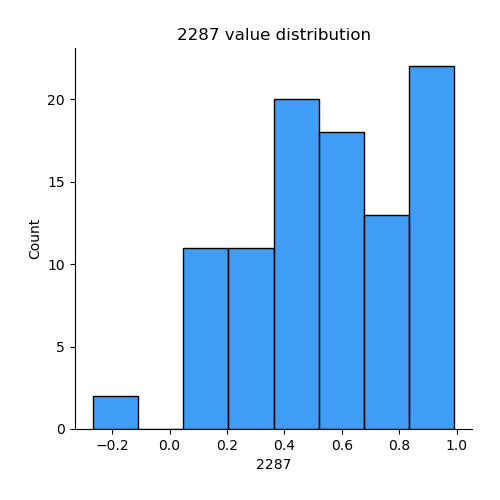
## Feature : 2332
- **Feature type** : continous
- **Missing** : 0.0%
- **Unique** : 3
- **Count** :97.0
- **Mean** :1.0
- **Std** :8.012344526598184e-17
- **Min** :0.9999999999999998
- **25%th Percentile** : 1.0
- **50%th Percentile** : 1.0
- **75%th Percentile** : 1.0
- **Max** :1.0

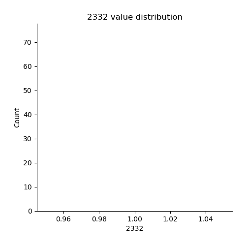
## Feature : 2333
- **Feature type** : continous
- **Missing** : 0.0%
- **Unique** : 97
- **Count** :97.0
- **Mean** :0.5413885190100518
- **Std** :0.2814043577790915
- **Min** :-0.017924900998913505
- **25%th Percentile** : 0.35108975718137597
- **50%th Percentile** : 0.519194192334387
- **75%th Percentile** : 0.7029240119622799
- **Max** :0.9906028496876784

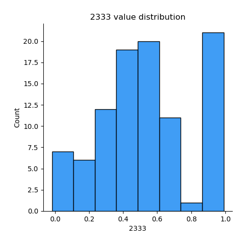
## Feature : 2334
- **Feature type** : continous
- **Missing** : 0.0%
- **Unique** : 97
- **Count** :97.0
- **Mean** :0.7338367943222933
- **Std** :0.18802896382517476
- **Min** :0.20597273812672132
- **25%th Percentile** : 0.6303950992465307
- **50%th Percentile** : 0.7258988124998997
- **75%th Percentile** : 0.854378074042562
- **Max** :0.9947133101600929

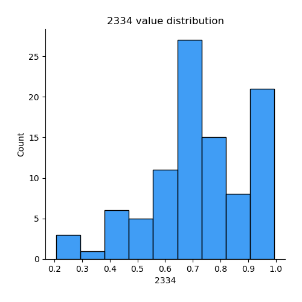
## Feature : 2335
- **Feature type** : continous
- **Missing** : 0.0%
- **Unique** : 97
- **Count** :97.0
- **Mean** :0.833811442878731
- **Std** :0.13885839359533866
- **Min** :0.32424909859215484
- **25%th Percentile** : 0.739264419560197
- **50%th Percentile** : 0.8645319443183603
- **75%th Percentile** : 0.939896828088861
- **Max** :0.9963947498714334

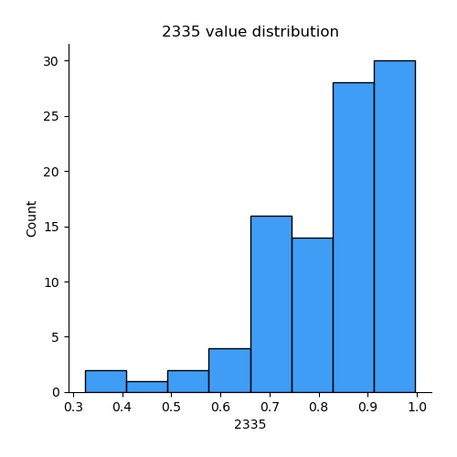
## Feature : 2336
- **Feature type** : continous
- **Missing** : 0.0%
- **Unique** : 97
- **Count** :97.0
- **Mean** :0.6824185880683863
- **Std** :0.20987248784613016
- **Min** :0.23633869332515978
- **25%th Percentile** : 0.5225080510528692
- **50%th Percentile** : 0.6892436994832327
- **75%th Percentile** : 0.837400304777611
- **Max** :0.9915334098259586

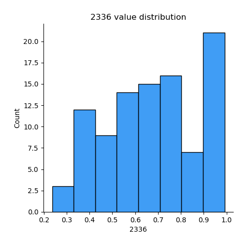
## Feature : 2337
- **Feature type** : continous
- **Missing** : 0.0%
- **Unique** : 97
- **Count** :97.0
- **Mean** :0.7799024077404285
- **Std** :0.1675319160476429
- **Min** :0.3333679633530424
- **25%th Percentile** : 0.6699896918985353
- **50%th Percentile** : 0.7859500471641575
- **75%th Percentile** : 0.9425886194088474
- **Max** :0.9942671211140842

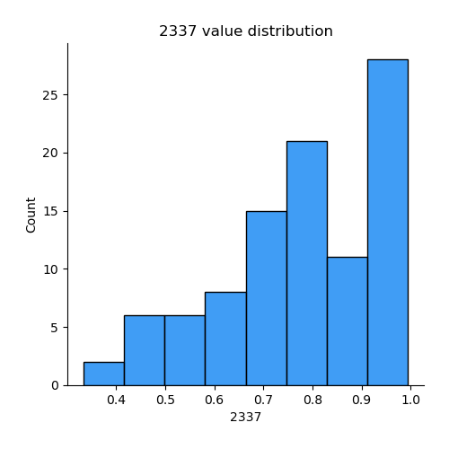
## Feature : 2338
- **Feature type** : continous
- **Missing** : 0.0%
- **Unique** : 97
- **Count** :97.0
- **Mean** :0.427898799613149
- **Std** :0.3129016636202268
- **Min** :-0.29164969715371913
- **25%th Percentile** : 0.21977329945695917
- **50%th Percentile** : 0.3859961370212983
- **75%th Percentile** : 0.6066707097030439
- **Max** :0.97858643486643

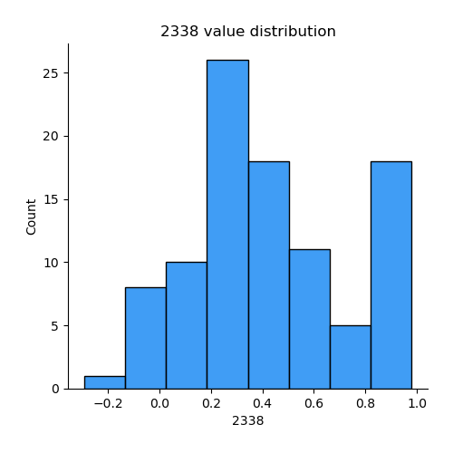
## Feature : 2339
- **Feature type** : continous
- **Missing** : 0.0%
- **Unique** : 97
- **Count** :97.0
- **Mean** :0.5879057845823353
- **Std** :0.2570298614994834
- **Min** :0.0772182485100761
- **25%th Percentile** : 0.3967731267967158
- **50%th Percentile** : 0.5453625052407071
- **75%th Percentile** : 0.7970395320419551
- **Max** :0.9843737272101705

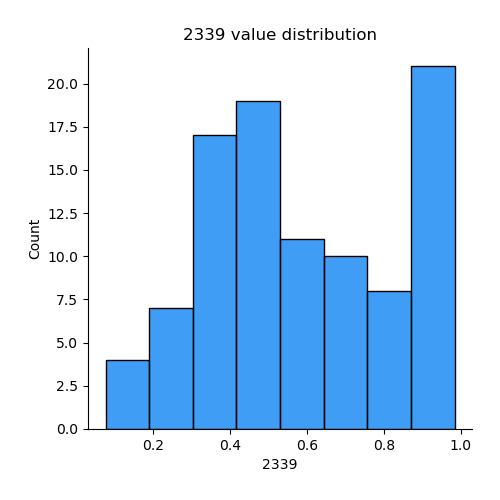
## Feature : 2385
- **Feature type** : continous
- **Missing** : 0.0%
- **Unique** : 3
- **Count** :97.0
- **Mean** :1.0
- **Std** :7.166458808248763e-17
- **Min** :0.9999999999999998
- **25%th Percentile** : 1.0
- **50%th Percentile** : 1.0
- **75%th Percentile** : 1.0
- **Max** :1.0

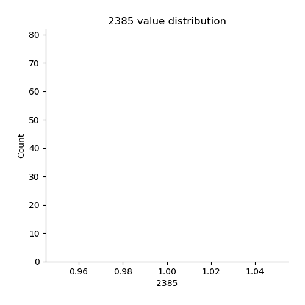
## Feature : 2386
- **Feature type** : continous
- **Missing** : 0.0%
- **Unique** : 97
- **Count** :97.0
- **Mean** :0.6671932574868258
- **Std** :0.21985725075421214
- **Min** :0.16275196777570516
- **25%th Percentile** : 0.5358450850189578
- **50%th Percentile** : 0.6576941596943852
- **75%th Percentile** : 0.8053179061015971
- **Max** :0.9928257141972565

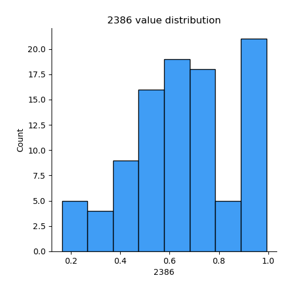
## Feature : 2387
- **Feature type** : continous
- **Missing** : 0.0%
- **Unique** : 97
- **Count** :97.0
- **Mean** :0.4734316433310548
- **Std** :0.32418638778825365
- **Min** :-0.22203043698879077
- **25%th Percentile** : 0.2539599591695974
- **50%th Percentile** : 0.4383031521831337
- **75%th Percentile** : 0.7125059365171422
- **Max** :0.9889397375368375

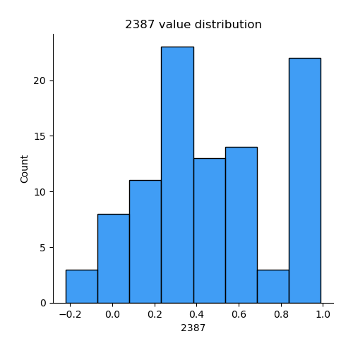
## Feature : 2388
- **Feature type** : continous
- **Missing** : 0.0%
- **Unique** : 97
- **Count** :97.0
- **Mean** :0.5497944330398491
- **Std** :0.28828162478868374
- **Min** :-0.11405037622718409
- **25%th Percentile** : 0.3677761903426689
- **50%th Percentile** : 0.5215588167701892
- **75%th Percentile** : 0.7381939774203643
- **Max** :0.9905489820459508

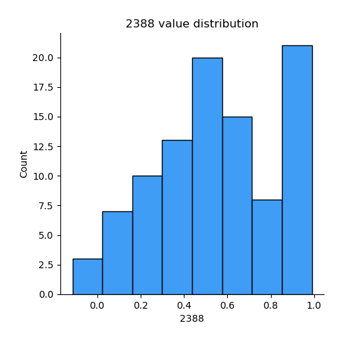
## Feature : 2389
- **Feature type** : continous
- **Missing** : 0.0%
- **Unique** : 97
- **Count** :97.0
- **Mean** :0.544110317400476
- **Std** :0.29614777998526487
- **Min** :-0.2751021983745546
- **25%th Percentile** : 0.3183960054329119
- **50%th Percentile** : 0.5459146967563147
- **75%th Percentile** : 0.7456964146093202
- **Max** :0.9898834169725467

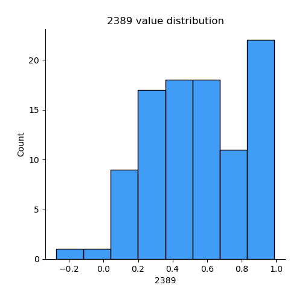
## Feature : 2390
- **Feature type** : continous
- **Missing** : 0.0%
- **Unique** : 97
- **Count** :97.0
- **Mean** :0.352213434061525
- **Std** :0.36249287581990297
- **Min** :-0.5152483251031547
- **25%th Percentile** : 0.10778125946263487
- **50%th Percentile** : 0.2945255715489413
- **75%th Percentile** : 0.5860934588855786
- **Max** :0.9847278200074007

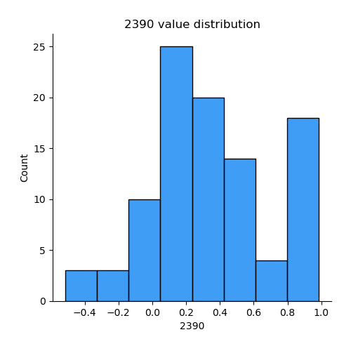
## Feature : 2391
- **Feature type** : continous
- **Missing** : 0.0%
- **Unique** : 97
- **Count** :97.0
- **Mean** :0.5076609368358673
- **Std** :0.2989159965651335
- **Min** :-0.22248975613714073
- **25%th Percentile** : 0.3101343377080806
- **50%th Percentile** : 0.5001915026167554
- **75%th Percentile** : 0.6978864577892108
- **Max** :0.9854016639988344

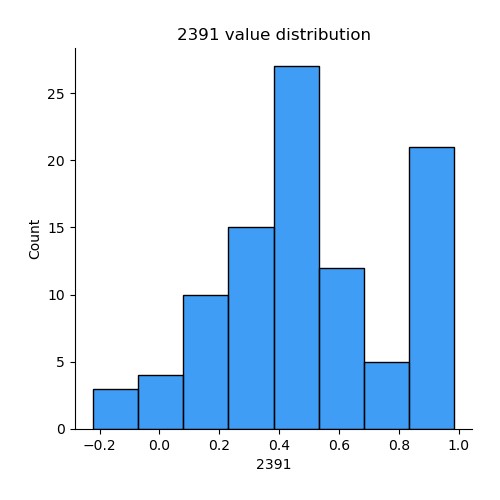
## Feature : 2438
- **Feature type** : continous
- **Missing** : 0.0%
- **Unique** : 3
- **Count** :97.0
- **Mean** :1.0
- **Std** :9.480333893807275e-17
- **Min** :0.9999999999999998
- **25%th Percentile** : 0.9999999999999999
- **50%th Percentile** : 1.0
- **75%th Percentile** : 1.0
- **Max** :1.0

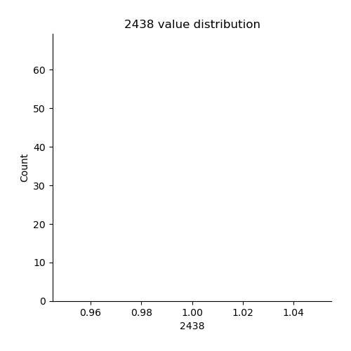
## Feature : 2439
- **Feature type** : continous
- **Missing** : 0.0%
- **Unique** : 97
- **Count** :97.0
- **Mean** :0.7072268723864252
- **Std** :0.20349900881586516
- **Min** :0.14017089799610816
- **25%th Percentile** : 0.6059463755060268
- **50%th Percentile** : 0.6961991527902731
- **75%th Percentile** : 0.8554124163419095
- **Max** :0.9959891926918792

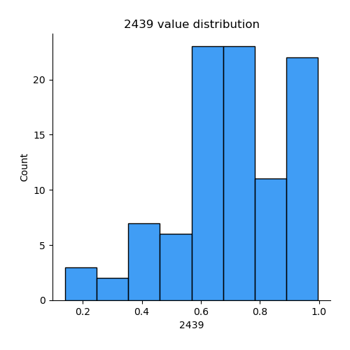
## Feature : 2440
- **Feature type** : continous
- **Missing** : 0.0%
- **Unique** : 97
- **Count** :97.0
- **Mean** :0.6207265346183091
- **Std** :0.28393024246908327
- **Min** :-0.18992894223235776
- **25%th Percentile** : 0.4481907055328135
- **50%th Percentile** : 0.6311248217580853
- **75%th Percentile** : 0.8368417160567247
- **Max** :0.994467560556048

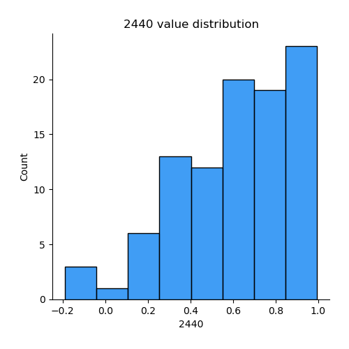
## Feature : 2441
- **Feature type** : continous
- **Missing** : 0.0%
- **Unique** : 97
- **Count** :97.0
- **Mean** :0.7309381346698054
- **Std** :0.1953475582362459
- **Min** :0.1679485306394271
- **25%th Percentile** : 0.619580456198541
- **50%th Percentile** : 0.7462281005327679
- **75%th Percentile** : 0.8594567159104604
- **Max** :0.9958447919138088

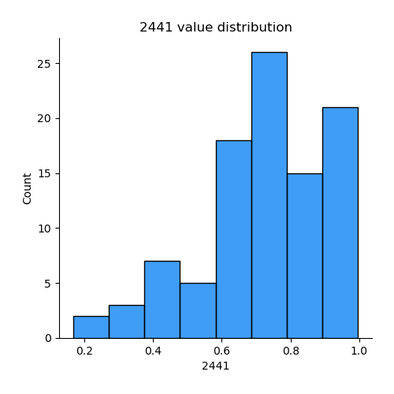
## Feature : 2442
- **Feature type** : continous
- **Missing** : 0.0%
- **Unique** : 97
- **Count** :97.0
- **Mean** :0.4243955689267319
- **Std** :0.3258011508662407
- **Min** :-0.4190348916053048
- **25%th Percentile** : 0.22005236946019524
- **50%th Percentile** : 0.40065369787627864
- **75%th Percentile** : 0.6269912030176782
- **Max** :0.9859755753341628

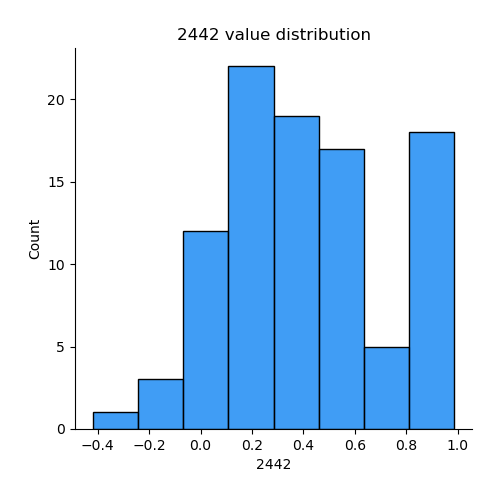
## Feature : 2443
- **Feature type** : continous
- **Missing** : 0.0%
- **Unique** : 97
- **Count** :97.0
- **Mean** :0.5327998443056229
- **Std** :0.30594200498977864
- **Min** :-0.32756656770166154
- **25%th Percentile** : 0.33652068466416696
- **50%th Percentile** : 0.4986330843011563
- **75%th Percentile** : 0.7838003654235904
- **Max** :0.9904115158887641

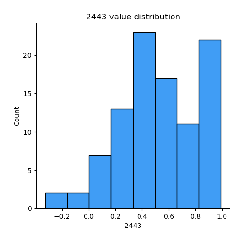
## Feature : 2491
- **Feature type** : continous
- **Missing** : 0.0%
- **Unique** : 3
- **Count** :97.0
- **Mean** :1.0
- **Std** :8.92216926358191e-17
- **Min** :0.9999999999999998
- **25%th Percentile** : 1.0
- **50%th Percentile** : 1.0
- **75%th Percentile** : 1.0
- **Max** :1.0

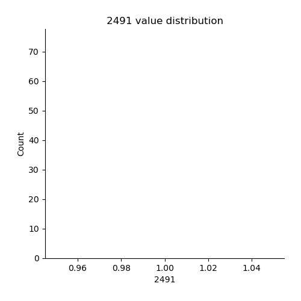
## Feature : 2492
- **Feature type** : continous
- **Missing** : 0.0%
- **Unique** : 97
- **Count** :97.0
- **Mean** :0.6406075865909041
- **Std** :0.2499977228193055
- **Min** :0.006170210636917825
- **25%th Percentile** : 0.48412092510562316
- **50%th Percentile** : 0.643088402611857
- **75%th Percentile** : 0.8318001398898586
- **Max** :0.9925428836986

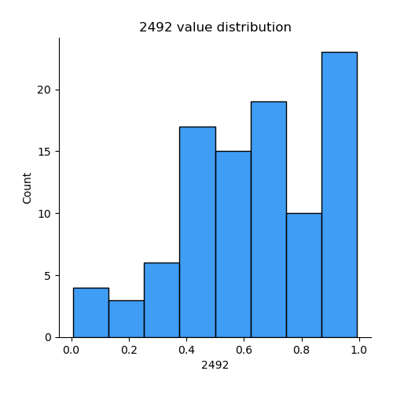
## Feature : 2493
- **Feature type** : continous
- **Missing** : 0.0%
- **Unique** : 97
- **Count** :97.0
- **Mean** :0.8423878586912245
- **Std** :0.1124721649453654
- **Min** :0.5596166328866727
- **25%th Percentile** : 0.7567839389536793
- **50%th Percentile** : 0.8433316670441209
- **75%th Percentile** : 0.9365745502436587
- **Max** :0.9972063745088527

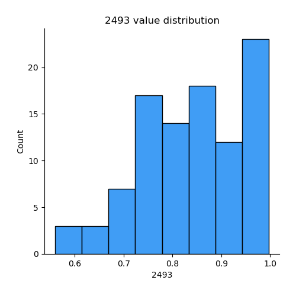
## Feature : 2494
- **Feature type** : continous
- **Missing** : 0.0%
- **Unique** : 97
- **Count** :97.0
- **Mean** :0.3882451913680295
- **Std** :0.3340449232029382
- **Min** :-0.3854089221846659
- **25%th Percentile** : 0.13937736175728663
- **50%th Percentile** : 0.3451487197075403
- **75%th Percentile** : 0.5811024561242231
- **Max** :0.9785053064325366

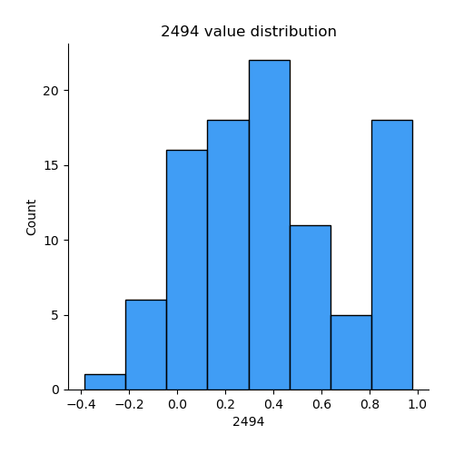
## Feature : 2495
- **Feature type** : continous
- **Missing** : 0.0%
- **Unique** : 97
- **Count** :97.0
- **Mean** :0.5271929778591273
- **Std** :0.29315638812092115
- **Min** :-0.1540382736415621
- **25%th Percentile** : 0.30982775183550976
- **50%th Percentile** : 0.44944509853940506
- **75%th Percentile** : 0.7645526013755584
- **Max** :0.989162797713004

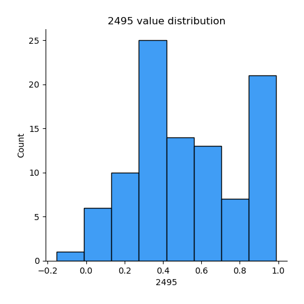
## Feature : 2544
- **Feature type** : continous
- **Missing** : 0.0%
- **Unique** : 3
- **Count** :97.0
- **Mean** :1.0
- **Std** :9.34391909990421e-17
- **Min** :0.9999999999999998
- **25%th Percentile** : 0.9999999999999999
- **50%th Percentile** : 1.0
- **75%th Percentile** : 1.0
- **Max** :1.0

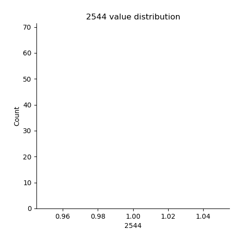
## Feature : 2545
- **Feature type** : continous
- **Missing** : 0.0%
- **Unique** : 97
- **Count** :97.0
- **Mean** :0.7193831264730486
- **Std** :0.218268941239915
- **Min** :-0.1009050380399714
- **25%th Percentile** : 0.5592114563914317
- **50%th Percentile** : 0.7406587769455952
- **75%th Percentile** : 0.8875458042694329
- **Max** :0.9927116750633126

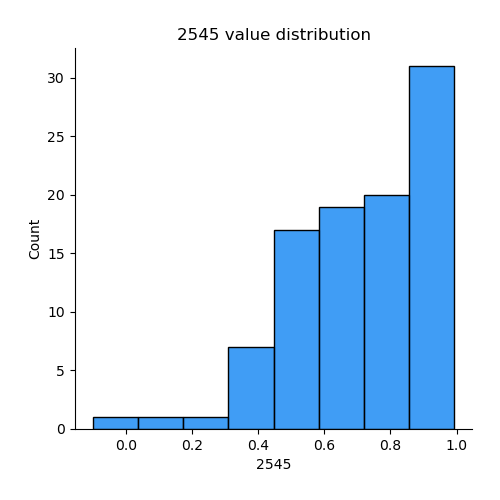
## Feature : 2546
- **Feature type** : continous
- **Missing** : 0.0%
- **Unique** : 97
- **Count** :97.0
- **Mean** :0.527126720172668
- **Std** :0.28400952955122855
- **Min** :-0.0321251752786695
- **25%th Percentile** : 0.3007955558870203
- **50%th Percentile** : 0.5417717794570693
- **75%th Percentile** : 0.7382814343139784
- **Max** :0.9921740023440989

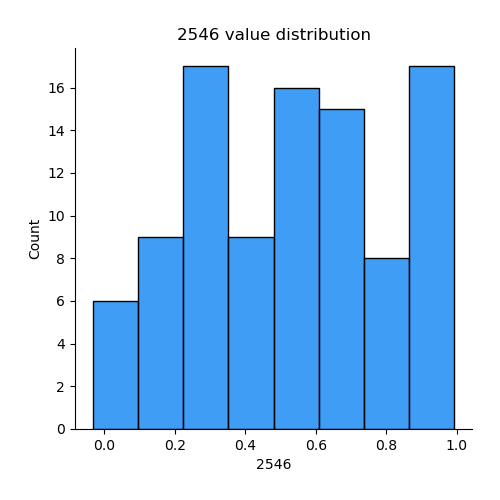
## Feature : 2547
- **Feature type** : continous
- **Missing** : 0.0%
- **Unique** : 97
- **Count** :97.0
- **Mean** :0.7664513187693976
- **Std** :0.16482167973569994
- **Min** :0.3437836248777745
- **25%th Percentile** : 0.654890546785693
- **50%th Percentile** : 0.7691161433711102
- **75%th Percentile** : 0.9121517882518558
- **Max** :0.9934756262805555

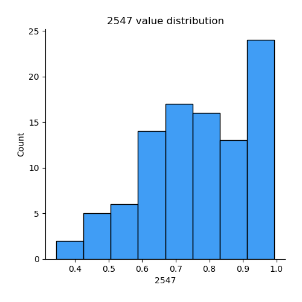
## Feature : 2597
- **Feature type** : continous
- **Missing** : 0.0%
- **Unique** : 3
- **Count** :97.0
- **Mean** :1.0
- **Std** :9.614813431917819e-17
- **Min** :0.9999999999999998
- **25%th Percentile** : 0.9999999999999999
- **50%th Percentile** : 1.0
- **75%th Percentile** : 1.0
- **Max** :1.0

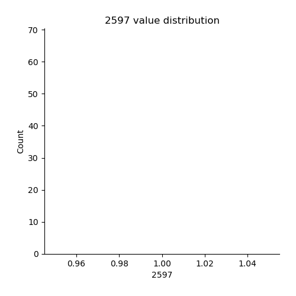
## Feature : 2598
- **Feature type** : continous
- **Missing** : 0.0%
- **Unique** : 97
- **Count** :97.0
- **Mean** :0.39098354514456
- **Std** :0.3374665039726518
- **Min** :-0.21164164790501466
- **25%th Percentile** : 0.1294645806273032
- **50%th Percentile** : 0.3569590528860108
- **75%th Percentile** : 0.6588938201274726
- **Max** :0.9794908443933238

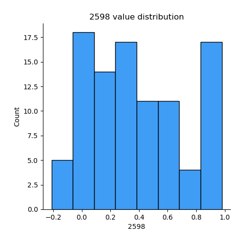
## Feature : 2599
- **Feature type** : continous
- **Missing** : 0.0%
- **Unique** : 97
- **Count** :97.0
- **Mean** :0.6361203912493462
- **Std** :0.24504637829826284
- **Min** :0.05707412640993466
- **25%th Percentile** : 0.43681216725362537
- **50%th Percentile** : 0.6387963726366969
- **75%th Percentile** : 0.8355398004014474
- **Max** :0.9903552212119293

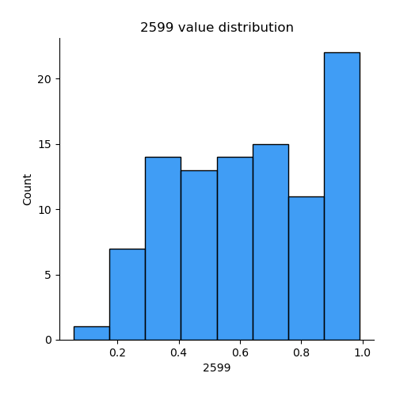
## Feature : 2650
- **Feature type** : continous
- **Missing** : 0.0%
- **Unique** : 3
- **Count** :97.0
- **Mean** :1.0
- **Std** :9.547810431419822e-17
- **Min** :0.9999999999999998
- **25%th Percentile** : 1.0
- **50%th Percentile** : 1.0
- **75%th Percentile** : 1.0
- **Max** :1.0

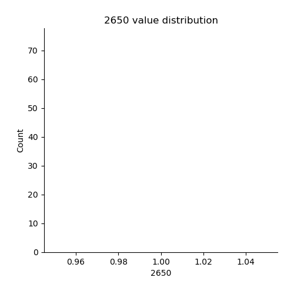
## Feature : 2651
- **Feature type** : continous
- **Missing** : 0.0%
- **Unique** : 97
- **Count** :97.0
- **Mean** :0.4286942381050057
- **Std** :0.3214737341757204
- **Min** :-0.20587989143878233
- **25%th Percentile** : 0.18024530232574673
- **50%th Percentile** : 0.41343921455823246
- **75%th Percentile** : 0.6427517545531087
- **Max** :0.9801341792757496

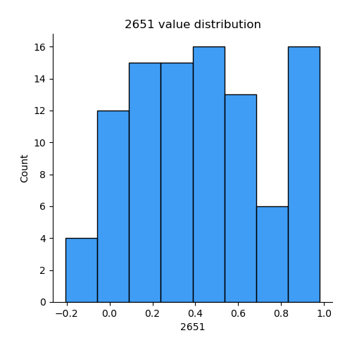
## Feature : 2703
- **Feature type** : continous
- **Missing** : 0.0%
- **Unique** : 3
- **Count** :97.0
- **Mean** :1.0
- **Std** :9.34391909990421e-17
- **Min** :0.9999999999999998
- **25%th Percentile** : 0.9999999999999999
- **50%th Percentile** : 1.0
- **75%th Percentile** : 1.0
- **Max** :1.0

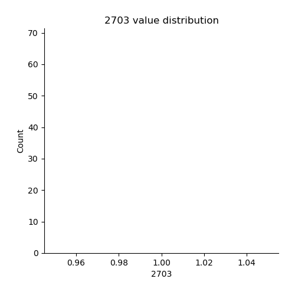

[<< Go back](../README.md)
