# Exploratory Data Analysis

[<< Go back](../README.md)
## Feature : target
- **Feature type** : discrete
- **Missing** : 0.0%
- **Unique** : 2
- **Count** :135.0
- **Mean** :0.37037037037037035
- **Std** :0.4847024127918899
- **Min** :0.0
- **25%th Percentile** : 0.0
- **50%th Percentile** : 0.0
- **75%th Percentile** : 1.0
- **Max** :1.0

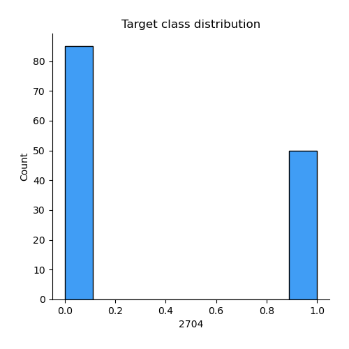
## Feature : 0
- **Feature type** : continous
- **Missing** : 0.0%
- **Unique** : 3
- **Count** :135.0
- **Mean** :1.0
- **Std** :8.737694914694383e-17
- **Min** :0.9999999999999998
- **25%th Percentile** : 0.9999999999999999
- **50%th Percentile** : 1.0
- **75%th Percentile** : 1.0
- **Max** :1.0

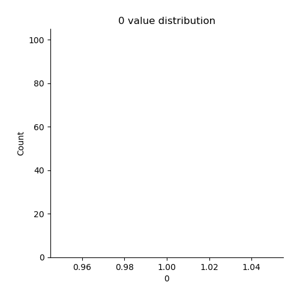
## Feature : 1
- **Feature type** : continous
- **Missing** : 0.0%
- **Unique** : 135
- **Count** :135.0
- **Mean** :0.4779286445683879
- **Std** :0.2837695377741157
- **Min** :-0.14235048086219396
- **25%th Percentile** : 0.2808563338355059
- **50%th Percentile** : 0.43841710704328896
- **75%th Percentile** : 0.6472826626545432
- **Max** :0.9902209690765202

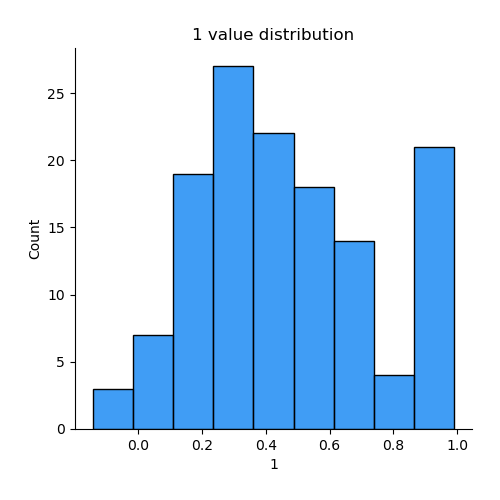
## Feature : 2
- **Feature type** : continous
- **Missing** : 0.0%
- **Unique** : 135
- **Count** :135.0
- **Mean** :0.5912371261132313
- **Std** :0.2404381282582491
- **Min** :-0.17596519230503263
- **25%th Percentile** : 0.4415858423390553
- **50%th Percentile** : 0.5882011559396197
- **75%th Percentile** : 0.7656965122643872
- **Max** :0.9910456737741862

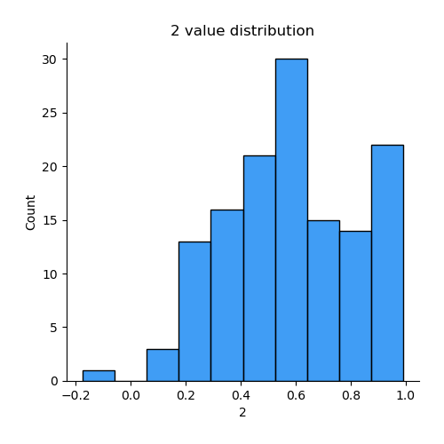
## Feature : 3
- **Feature type** : continous
- **Missing** : 0.0%
- **Unique** : 135
- **Count** :135.0
- **Mean** :0.374823290882797
- **Std** :0.31724709306963095
- **Min** :-0.3851329887345158
- **25%th Percentile** : 0.16363546556586306
- **50%th Percentile** : 0.32932670528959174
- **75%th Percentile** : 0.5428489317381173
- **Max** :0.9843908523865255

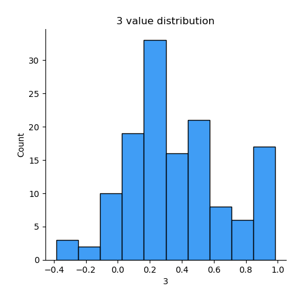
## Feature : 4
- **Feature type** : continous
- **Missing** : 0.0%
- **Unique** : 135
- **Count** :135.0
- **Mean** :0.6098596336167759
- **Std** :0.2364463063722467
- **Min** :-0.11541133137762925
- **25%th Percentile** : 0.45087154816628894
- **50%th Percentile** : 0.6159547491915418
- **75%th Percentile** : 0.7588155670317192
- **Max** :0.9930625327345778

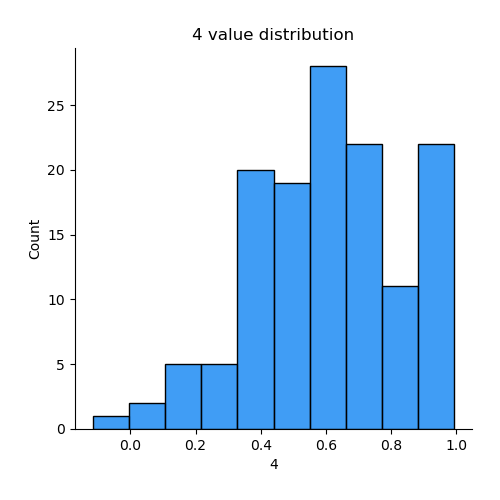
## Feature : 5
- **Feature type** : continous
- **Missing** : 0.0%
- **Unique** : 135
- **Count** :135.0
- **Mean** :0.6811482089359204
- **Std** :0.19115155482515409
- **Min** :0.16919039556108073
- **25%th Percentile** : 0.5619101847290899
- **50%th Percentile** : 0.6746577486331025
- **75%th Percentile** : 0.778220511556907
- **Max** :0.9949821986898075

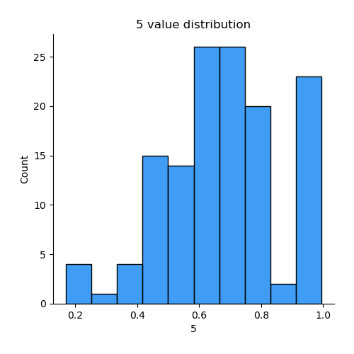
## Feature : 6
- **Feature type** : continous
- **Missing** : 0.0%
- **Unique** : 135
- **Count** :135.0
- **Mean** :0.5738739932519138
- **Std** :0.25291983848769495
- **Min** :-0.10155562478606499
- **25%th Percentile** : 0.40128335431918793
- **50%th Percentile** : 0.5618359843995195
- **75%th Percentile** : 0.7433451514268354
- **Max** :0.9931203068778985

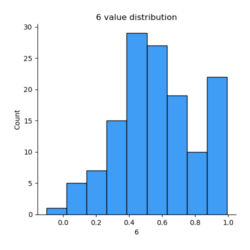
## Feature : 7
- **Feature type** : continous
- **Missing** : 0.0%
- **Unique** : 135
- **Count** :135.0
- **Mean** :0.6117499144633758
- **Std** :0.2455783527713044
- **Min** :-0.09384278583954714
- **25%th Percentile** : 0.46380818195557977
- **50%th Percentile** : 0.6263600162435407
- **75%th Percentile** : 0.7548687189862493
- **Max** :0.9945456846981265

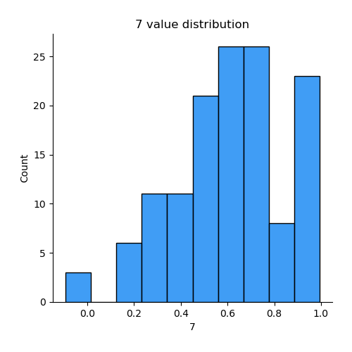
## Feature : 8
- **Feature type** : continous
- **Missing** : 0.0%
- **Unique** : 135
- **Count** :135.0
- **Mean** :0.5784646185548057
- **Std** :0.24771721399205823
- **Min** :-0.03084443265451733
- **25%th Percentile** : 0.40241440262568984
- **50%th Percentile** : 0.5767985655558753
- **75%th Percentile** : 0.7204584124535263
- **Max** :0.9872375702416932

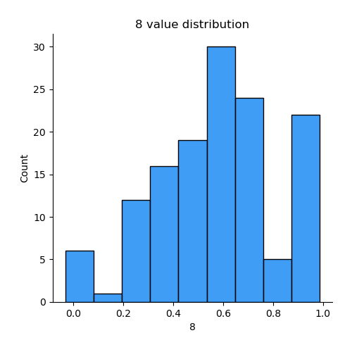
## Feature : 9
- **Feature type** : continous
- **Missing** : 0.0%
- **Unique** : 135
- **Count** :135.0
- **Mean** :0.5888953119862631
- **Std** :0.24046898312450993
- **Min** :-0.0427021976169515
- **25%th Percentile** : 0.42133359216355176
- **50%th Percentile** : 0.5896602764719125
- **75%th Percentile** : 0.7448780488965558
- **Max** :0.9886776625391764

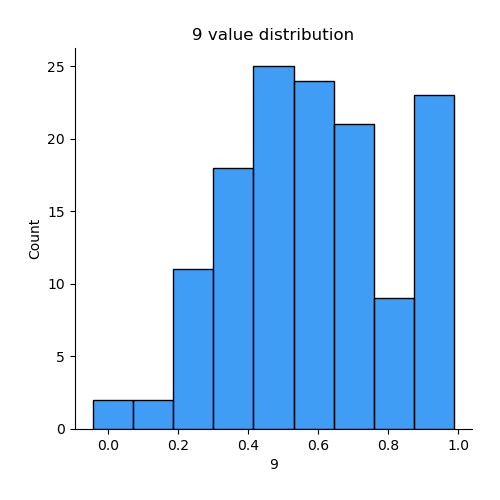
## Feature : 10
- **Feature type** : continous
- **Missing** : 0.0%
- **Unique** : 135
- **Count** :135.0
- **Mean** :0.5915734680288542
- **Std** :0.24181105264278857
- **Min** :-0.12199783214735348
- **25%th Percentile** : 0.4246090386078184
- **50%th Percentile** : 0.5867116302995512
- **75%th Percentile** : 0.7415510420266944
- **Max** :0.9898890618149953

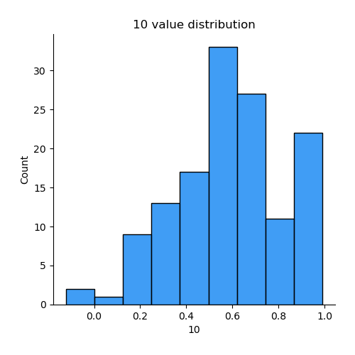
## Feature : 11
- **Feature type** : continous
- **Missing** : 0.0%
- **Unique** : 135
- **Count** :135.0
- **Mean** :0.7139914688775424
- **Std** :0.19788068855173704
- **Min** :0.12785790105463365
- **25%th Percentile** : 0.5897700035289745
- **50%th Percentile** : 0.7343659998047011
- **75%th Percentile** : 0.845550324922792
- **Max** :0.9941846627303138

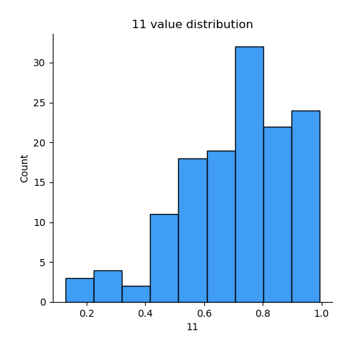
## Feature : 12
- **Feature type** : continous
- **Missing** : 0.0%
- **Unique** : 135
- **Count** :135.0
- **Mean** :0.5283500758529474
- **Std** :0.2891119542550237
- **Min** :-0.2224574900778945
- **25%th Percentile** : 0.30017260094052534
- **50%th Percentile** : 0.5295705824162028
- **75%th Percentile** : 0.7229289198102283
- **Max** :0.9924657308291698

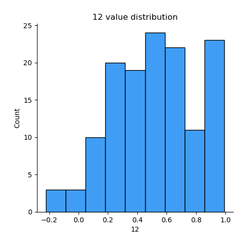
## Feature : 13
- **Feature type** : continous
- **Missing** : 0.0%
- **Unique** : 135
- **Count** :135.0
- **Mean** :0.5112642461109559
- **Std** :0.26813066134745056
- **Min** :-0.2385871958179038
- **25%th Percentile** : 0.32333667579593717
- **50%th Percentile** : 0.48261288390477614
- **75%th Percentile** : 0.6597036871407675
- **Max** :0.9896405445453358

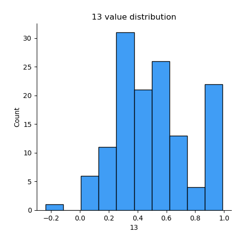
## Feature : 14
- **Feature type** : continous
- **Missing** : 0.0%
- **Unique** : 135
- **Count** :135.0
- **Mean** :0.5373996271596914
- **Std** :0.26296891943985
- **Min** :-0.17742542482944365
- **25%th Percentile** : 0.35627217961868574
- **50%th Percentile** : 0.5176191748169138
- **75%th Percentile** : 0.7055980654493454
- **Max** :0.9850573011960986

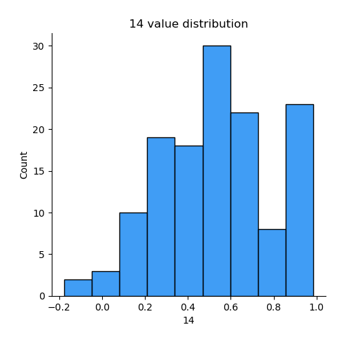
## Feature : 15
- **Feature type** : continous
- **Missing** : 0.0%
- **Unique** : 135
- **Count** :135.0
- **Mean** :0.5912614184167343
- **Std** :0.249789440838675
- **Min** :-0.16421835410845786
- **25%th Percentile** : 0.42630809107659673
- **50%th Percentile** : 0.5712031593228166
- **75%th Percentile** : 0.771279220147016
- **Max** :0.99375076826862

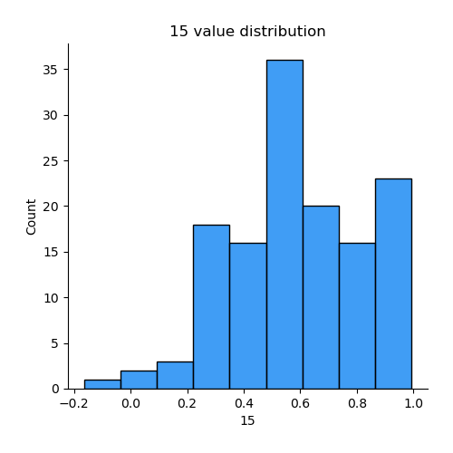
## Feature : 16
- **Feature type** : continous
- **Missing** : 0.0%
- **Unique** : 135
- **Count** :135.0
- **Mean** :0.5434272156170122
- **Std** :0.2680767530652503
- **Min** :-0.22310488944445087
- **25%th Percentile** : 0.35786174659810294
- **50%th Percentile** : 0.5251435080675307
- **75%th Percentile** : 0.7078212372873016
- **Max** :0.9899044779426092

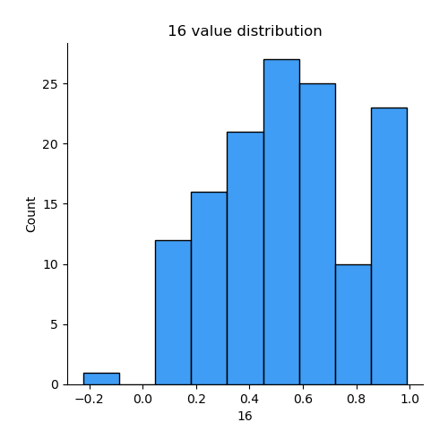
## Feature : 17
- **Feature type** : continous
- **Missing** : 0.0%
- **Unique** : 135
- **Count** :135.0
- **Mean** :0.5841956627716032
- **Std** :0.2555046620271497
- **Min** :-0.16142959084903127
- **25%th Percentile** : 0.4175470757622918
- **50%th Percentile** : 0.5674089760779656
- **75%th Percentile** : 0.7553405744092285
- **Max** :0.9944613007750747

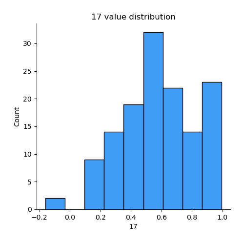
## Feature : 18
- **Feature type** : continous
- **Missing** : 0.0%
- **Unique** : 135
- **Count** :135.0
- **Mean** :0.6217807160940098
- **Std** :0.23004510864721808
- **Min** :0.03195043569534274
- **25%th Percentile** : 0.44345336840477567
- **50%th Percentile** : 0.6436121443577483
- **75%th Percentile** : 0.7612937053716806
- **Max** :0.9926080534671856

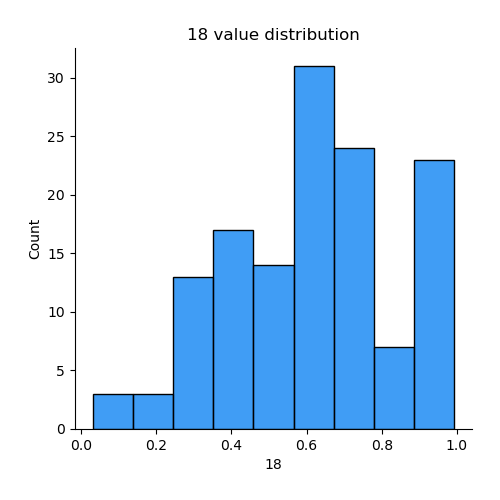
## Feature : 19
- **Feature type** : continous
- **Missing** : 0.0%
- **Unique** : 135
- **Count** :135.0
- **Mean** :0.4214758815872584
- **Std** :0.31185976152387435
- **Min** :-0.2753611012038661
- **25%th Percentile** : 0.19887021511522968
- **50%th Percentile** : 0.3799616871737243
- **75%th Percentile** : 0.5934633995462701
- **Max** :0.9868106936076105

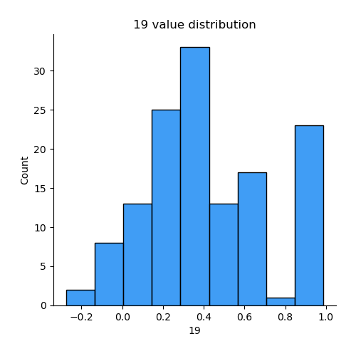
## Feature : 20
- **Feature type** : continous
- **Missing** : 0.0%
- **Unique** : 135
- **Count** :135.0
- **Mean** :0.5348760706186759
- **Std** :0.2842358745686088
- **Min** :-0.1835307829517738
- **25%th Percentile** : 0.3390515008894688
- **50%th Percentile** : 0.5226050844406407
- **75%th Percentile** : 0.7106768614522418
- **Max** :0.9937840590295474

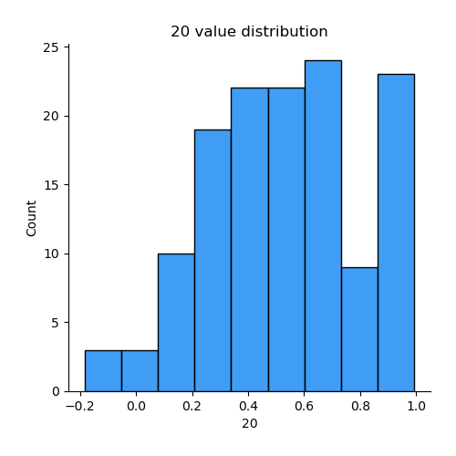
## Feature : 21
- **Feature type** : continous
- **Missing** : 0.0%
- **Unique** : 135
- **Count** :135.0
- **Mean** :0.5724730403182584
- **Std** :0.26096689051177113
- **Min** :-0.29787425172766324
- **25%th Percentile** : 0.3866354894267254
- **50%th Percentile** : 0.5642355091308916
- **75%th Percentile** : 0.7439206983203539
- **Max** :0.9926116527924819

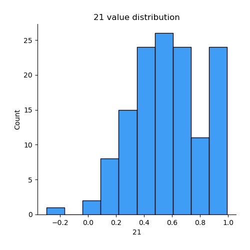
## Feature : 22
- **Feature type** : continous
- **Missing** : 0.0%
- **Unique** : 135
- **Count** :135.0
- **Mean** :0.7339051281187964
- **Std** :0.1777141749532788
- **Min** :0.15751511645218774
- **25%th Percentile** : 0.6256012015603082
- **50%th Percentile** : 0.7502299822026234
- **75%th Percentile** : 0.840377514912785
- **Max** :0.9948339022693805

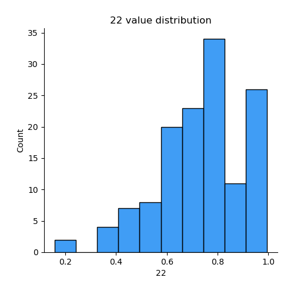
## Feature : 23
- **Feature type** : continous
- **Missing** : 0.0%
- **Unique** : 135
- **Count** :135.0
- **Mean** :0.6426179073441305
- **Std** :0.22718097793011094
- **Min** :-0.050972565580010294
- **25%th Percentile** : 0.5144510801960014
- **50%th Percentile** : 0.6462451452118965
- **75%th Percentile** : 0.7777862630228309
- **Max** :0.9942399606860168

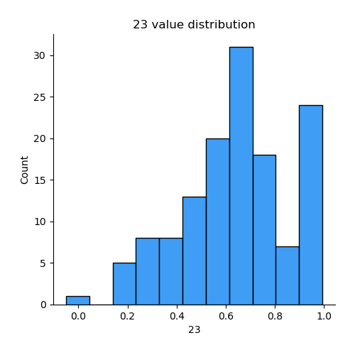
## Feature : 24
- **Feature type** : continous
- **Missing** : 0.0%
- **Unique** : 135
- **Count** :135.0
- **Mean** :0.40043774579235397
- **Std** :0.3102546109581966
- **Min** :-0.4556032015491017
- **25%th Percentile** : 0.21169288980686998
- **50%th Percentile** : 0.35461608386869653
- **75%th Percentile** : 0.5683087431159719
- **Max** :0.9729367820389804

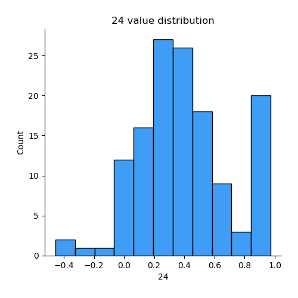
## Feature : 25
- **Feature type** : continous
- **Missing** : 0.0%
- **Unique** : 135
- **Count** :135.0
- **Mean** :0.5944486334731306
- **Std** :0.23969310492686244
- **Min** :-0.03668950374570533
- **25%th Percentile** : 0.4472244534974438
- **50%th Percentile** : 0.5811580087097792
- **75%th Percentile** : 0.7594689682243301
- **Max** :0.9887418671745558

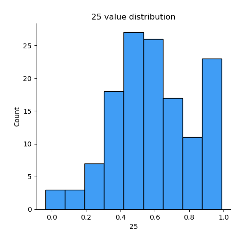
## Feature : 26
- **Feature type** : continous
- **Missing** : 0.0%
- **Unique** : 135
- **Count** :135.0
- **Mean** :0.698152747984646
- **Std** :0.2336079711649441
- **Min** :-0.2690128165586807
- **25%th Percentile** : 0.577856092284062
- **50%th Percentile** : 0.726236322631168
- **75%th Percentile** : 0.8551522636267987
- **Max** :0.9960908314308006

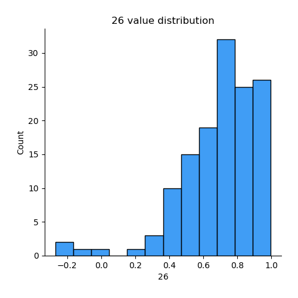
## Feature : 27
- **Feature type** : continous
- **Missing** : 0.0%
- **Unique** : 135
- **Count** :135.0
- **Mean** :0.4598609376151403
- **Std** :0.2890356911507263
- **Min** :-0.2440922036883753
- **25%th Percentile** : 0.24624867602910938
- **50%th Percentile** : 0.42189040951981244
- **75%th Percentile** : 0.5969045838827634
- **Max** :0.9884363719886632

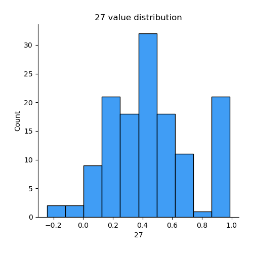
## Feature : 28
- **Feature type** : continous
- **Missing** : 0.0%
- **Unique** : 135
- **Count** :135.0
- **Mean** :0.5609664603630072
- **Std** :0.2574674240540745
- **Min** :-0.19537059727267625
- **25%th Percentile** : 0.4001766861506214
- **50%th Percentile** : 0.5572283024137757
- **75%th Percentile** : 0.7240836857046301
- **Max** :0.9909934906521235

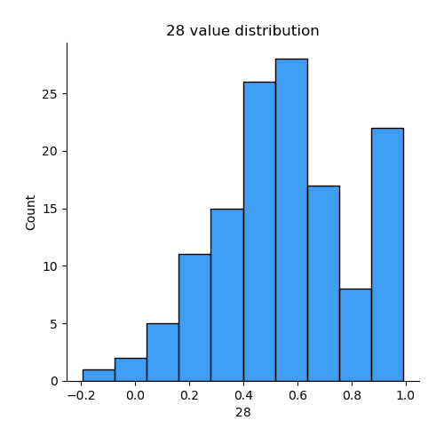
## Feature : 29
- **Feature type** : continous
- **Missing** : 0.0%
- **Unique** : 135
- **Count** :135.0
- **Mean** :0.34542927014766106
- **Std** :0.3204176307232407
- **Min** :-0.41464752753427125
- **25%th Percentile** : 0.12213203959319777
- **50%th Percentile** : 0.28881755265584735
- **75%th Percentile** : 0.5202780792081894
- **Max** :0.9796134228738385

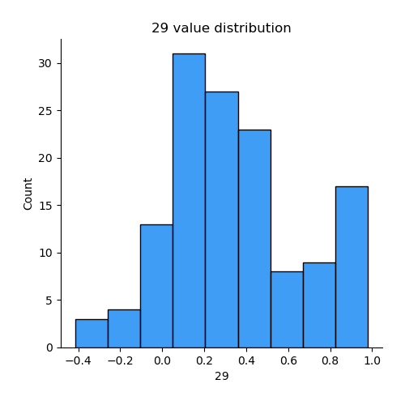
## Feature : 30
- **Feature type** : continous
- **Missing** : 0.0%
- **Unique** : 135
- **Count** :135.0
- **Mean** :0.5660718561009402
- **Std** :0.26375169627650635
- **Min** :-0.1317716911573761
- **25%th Percentile** : 0.37823947739198976
- **50%th Percentile** : 0.5808245319701169
- **75%th Percentile** : 0.7314808832400653
- **Max** :0.9909221164344535

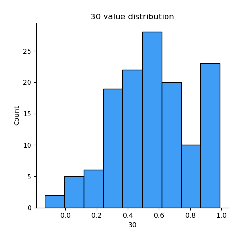
## Feature : 31
- **Feature type** : continous
- **Missing** : 0.0%
- **Unique** : 135
- **Count** :135.0
- **Mean** :0.5986927722974689
- **Std** :0.2560414073534484
- **Min** :-0.1100115065816858
- **25%th Percentile** : 0.41565246784963533
- **50%th Percentile** : 0.6054166800411673
- **75%th Percentile** : 0.7519582993984743
- **Max** :0.9948677682714705

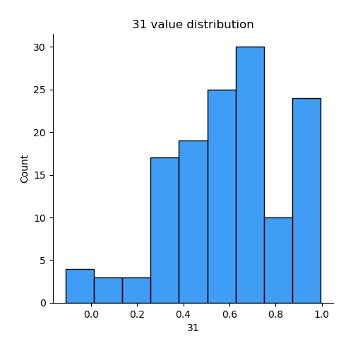
## Feature : 32
- **Feature type** : continous
- **Missing** : 0.0%
- **Unique** : 135
- **Count** :135.0
- **Mean** :0.5094870425477617
- **Std** :0.29815071811463834
- **Min** :-0.3391378999464348
- **25%th Percentile** : 0.3211577713840691
- **50%th Percentile** : 0.5049448377328052
- **75%th Percentile** : 0.6836395845085939
- **Max** :0.9909791602958434

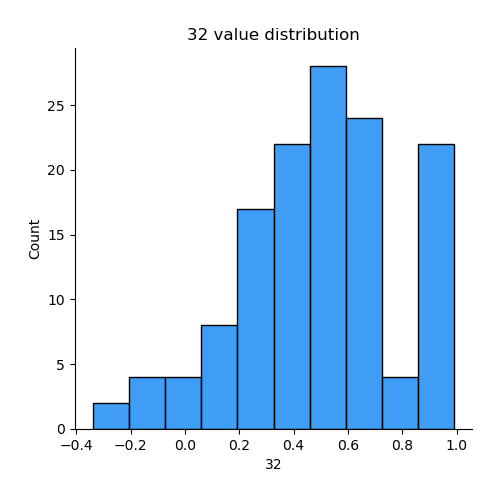
## Feature : 33
- **Feature type** : continous
- **Missing** : 0.0%
- **Unique** : 135
- **Count** :135.0
- **Mean** :0.5570201375099603
- **Std** :0.28044361102764914
- **Min** :-0.35543952114938304
- **25%th Percentile** : 0.38340623277424624
- **50%th Percentile** : 0.570675797531227
- **75%th Percentile** : 0.724326609868019
- **Max** :0.9945115928428873

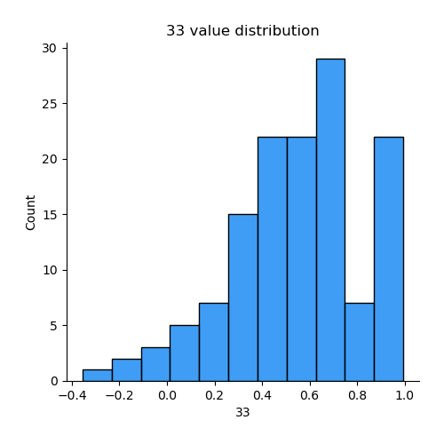
## Feature : 34
- **Feature type** : continous
- **Missing** : 0.0%
- **Unique** : 135
- **Count** :135.0
- **Mean** :0.5498052839896016
- **Std** :0.269066813186632
- **Min** :-0.11273100848271816
- **25%th Percentile** : 0.3366445121218853
- **50%th Percentile** : 0.5597946420796864
- **75%th Percentile** : 0.7137749680702594
- **Max** :0.9836816285659231

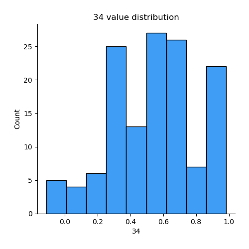
## Feature : 35
- **Feature type** : continous
- **Missing** : 0.0%
- **Unique** : 135
- **Count** :135.0
- **Mean** :0.557653213812833
- **Std** :0.2611222205911527
- **Min** :-0.1638593149970825
- **25%th Percentile** : 0.38068185937261323
- **50%th Percentile** : 0.5315914719968566
- **75%th Percentile** : 0.735303965782333
- **Max** :0.9900092012106778

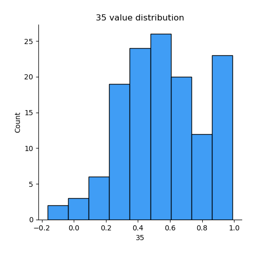
## Feature : 36
- **Feature type** : continous
- **Missing** : 0.0%
- **Unique** : 135
- **Count** :135.0
- **Mean** :0.5684632943304718
- **Std** :0.25959787207698826
- **Min** :-0.2471757871034307
- **25%th Percentile** : 0.3925946259456643
- **50%th Percentile** : 0.5696840517491042
- **75%th Percentile** : 0.7288379638496785
- **Max** :0.9910251265473415

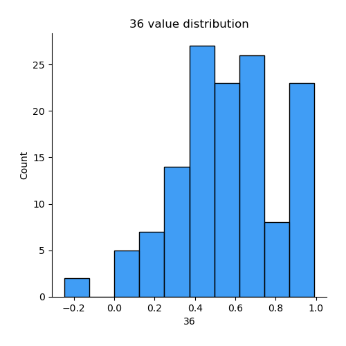
## Feature : 37
- **Feature type** : continous
- **Missing** : 0.0%
- **Unique** : 135
- **Count** :135.0
- **Mean** :0.6182574338952147
- **Std** :0.2743597298964544
- **Min** :-0.3652777577438207
- **25%th Percentile** : 0.4932884951804399
- **50%th Percentile** : 0.637369781985446
- **75%th Percentile** : 0.8175775450687203
- **Max** :0.9961782977455214

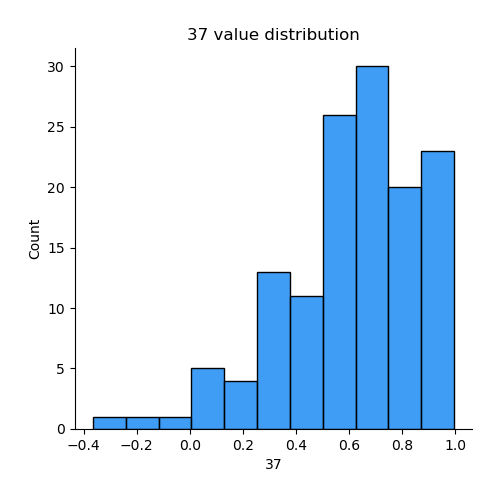
## Feature : 38
- **Feature type** : continous
- **Missing** : 0.0%
- **Unique** : 135
- **Count** :135.0
- **Mean** :0.5038175288537063
- **Std** :0.29957304692409775
- **Min** :-0.2913506928737934
- **25%th Percentile** : 0.28586746150353626
- **50%th Percentile** : 0.5012756443173936
- **75%th Percentile** : 0.708442087434502
- **Max** :0.9935195414424739

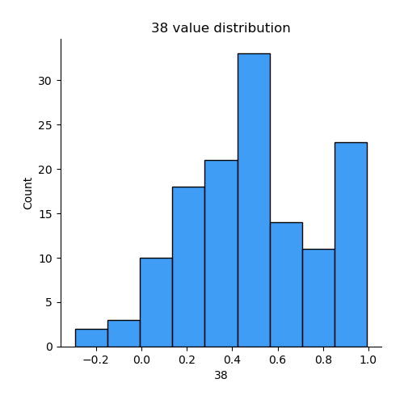
## Feature : 39
- **Feature type** : continous
- **Missing** : 0.0%
- **Unique** : 135
- **Count** :135.0
- **Mean** :0.4620433080669887
- **Std** :0.30622011953514916
- **Min** :-0.31274155240360174
- **25%th Percentile** : 0.25862565650830527
- **50%th Percentile** : 0.43944357326435163
- **75%th Percentile** : 0.6305699057316325
- **Max** :0.9903594653671175

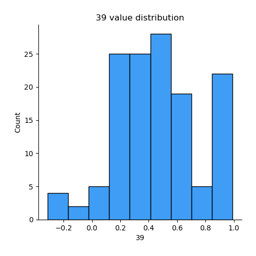
## Feature : 40
- **Feature type** : continous
- **Missing** : 0.0%
- **Unique** : 135
- **Count** :135.0
- **Mean** :0.5213468143781447
- **Std** :0.2759385401299609
- **Min** :-0.22485806757906296
- **25%th Percentile** : 0.3145517828255948
- **50%th Percentile** : 0.5303377614541063
- **75%th Percentile** : 0.6815323763165257
- **Max** :0.984851398158771

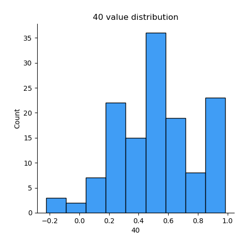
## Feature : 41
- **Feature type** : continous
- **Missing** : 0.0%
- **Unique** : 135
- **Count** :135.0
- **Mean** :0.5411540000002871
- **Std** :0.28633112516643255
- **Min** :-0.25239561664260013
- **25%th Percentile** : 0.37708480085333185
- **50%th Percentile** : 0.5144455271855892
- **75%th Percentile** : 0.7264035659995703
- **Max** :0.99357730661055

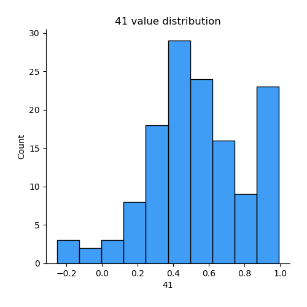
## Feature : 42
- **Feature type** : continous
- **Missing** : 0.0%
- **Unique** : 135
- **Count** :135.0
- **Mean** :0.5152078387700895
- **Std** :0.27843480765258444
- **Min** :-0.09776157609244399
- **25%th Percentile** : 0.32370741281727256
- **50%th Percentile** : 0.5103453878966923
- **75%th Percentile** : 0.6812371651780083
- **Max** :0.9920816657722892

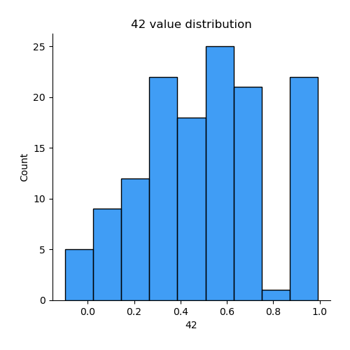
## Feature : 43
- **Feature type** : continous
- **Missing** : 0.0%
- **Unique** : 135
- **Count** :135.0
- **Mean** :0.5297231771529854
- **Std** :0.2908939256692957
- **Min** :-0.24297717304802488
- **25%th Percentile** : 0.3705551294548626
- **50%th Percentile** : 0.4880008682502182
- **75%th Percentile** : 0.7280694867474807
- **Max** :0.994496139330186

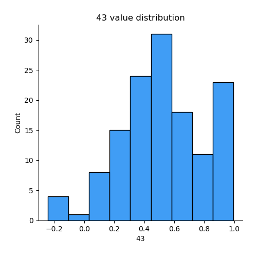
## Feature : 44
- **Feature type** : continous
- **Missing** : 0.0%
- **Unique** : 135
- **Count** :135.0
- **Mean** :0.5940117246464144
- **Std** :0.24682269799727294
- **Min** :-0.03510453420478555
- **25%th Percentile** : 0.41164901724251496
- **50%th Percentile** : 0.5986626240596596
- **75%th Percentile** : 0.743970085593329
- **Max** :0.9928246818561733

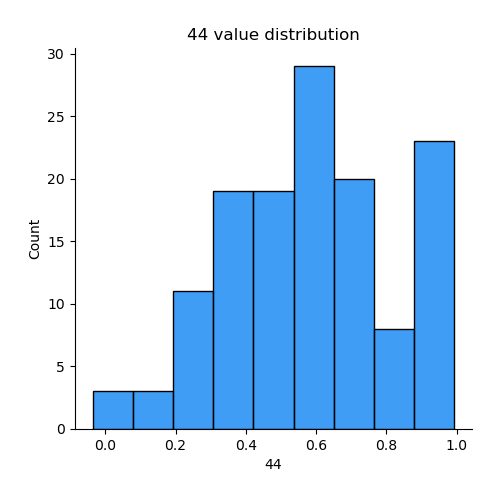
## Feature : 45
- **Feature type** : continous
- **Missing** : 0.0%
- **Unique** : 135
- **Count** :135.0
- **Mean** :0.379441850776187
- **Std** :0.3285580882884734
- **Min** :-0.3028531017041919
- **25%th Percentile** : 0.14250322362296444
- **50%th Percentile** : 0.32233336497132914
- **75%th Percentile** : 0.5723193899094319
- **Max** :0.9851949204365219

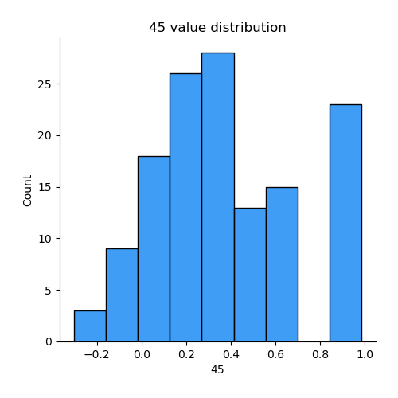
## Feature : 46
- **Feature type** : continous
- **Missing** : 0.0%
- **Unique** : 135
- **Count** :135.0
- **Mean** :0.4916910174979786
- **Std** :0.30896715163218363
- **Min** :-0.20989677418853395
- **25%th Percentile** : 0.2863619255803681
- **50%th Percentile** : 0.478248041964429
- **75%th Percentile** : 0.699472397695549
- **Max** :0.9918926757817735

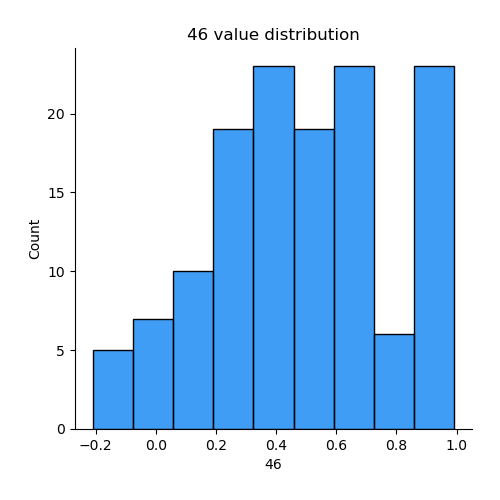
## Feature : 47
- **Feature type** : continous
- **Missing** : 0.0%
- **Unique** : 135
- **Count** :135.0
- **Mean** :0.5375073137079672
- **Std** :0.2854345875656696
- **Min** :-0.3496822453138747
- **25%th Percentile** : 0.3505059823066208
- **50%th Percentile** : 0.5379407804285425
- **75%th Percentile** : 0.7293705930849782
- **Max** :0.9935506228012028

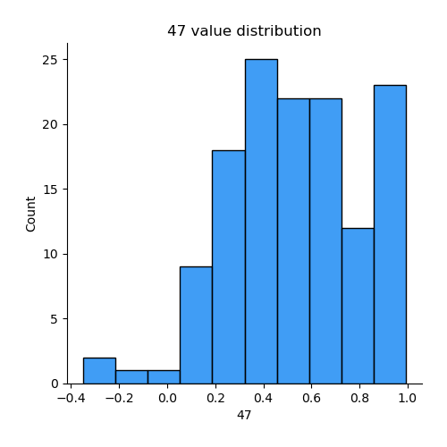
## Feature : 48
- **Feature type** : continous
- **Missing** : 0.0%
- **Unique** : 135
- **Count** :135.0
- **Mean** :0.6335825821767066
- **Std** :0.26444390630188247
- **Min** :-0.4153588695198884
- **25%th Percentile** : 0.4896738982197076
- **50%th Percentile** : 0.6655986516373346
- **75%th Percentile** : 0.8022401678459881
- **Max** :0.9916958077760432

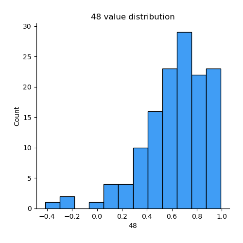
## Feature : 49
- **Feature type** : continous
- **Missing** : 0.0%
- **Unique** : 135
- **Count** :135.0
- **Mean** :0.5407632998069396
- **Std** :0.29542435072739354
- **Min** :-0.31883842349136066
- **25%th Percentile** : 0.31514016695920116
- **50%th Percentile** : 0.5602522217664873
- **75%th Percentile** : 0.7089654928802278
- **Max** :0.9950179750997088

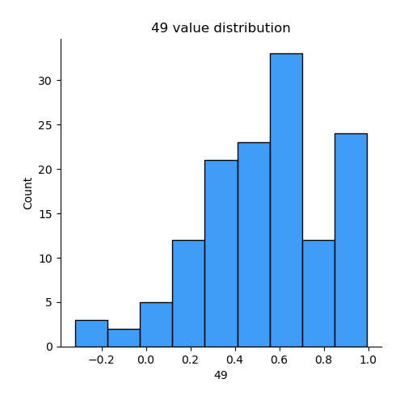
## Feature : 50
- **Feature type** : continous
- **Missing** : 0.0%
- **Unique** : 135
- **Count** :135.0
- **Mean** :0.3488198591025522
- **Std** :0.3252249568439397
- **Min** :-0.45296774054395195
- **25%th Percentile** : 0.1544784049873158
- **50%th Percentile** : 0.27720332273564036
- **75%th Percentile** : 0.5253334038908153
- **Max** :0.9772098569811121

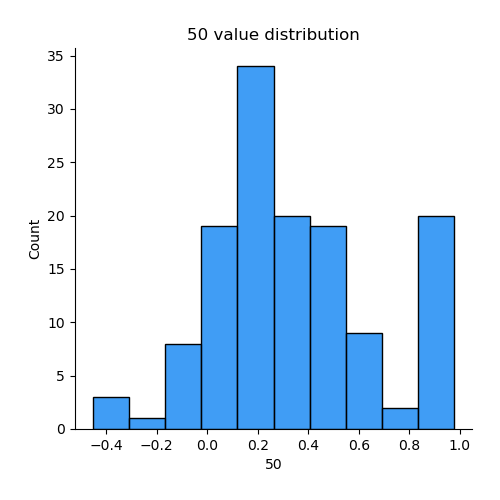
## Feature : 51
- **Feature type** : continous
- **Missing** : 0.0%
- **Unique** : 135
- **Count** :135.0
- **Mean** :0.4803765600555866
- **Std** :0.32070601677355914
- **Min** :-0.4223936123450011
- **25%th Percentile** : 0.2894998587217495
- **50%th Percentile** : 0.4902624149657123
- **75%th Percentile** : 0.6858386000505299
- **Max** :0.9900001567856128

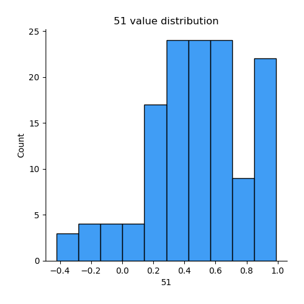
## Feature : 53
- **Feature type** : continous
- **Missing** : 0.0%
- **Unique** : 3
- **Count** :135.0
- **Mean** :1.0
- **Std** :8.415950902694798e-17
- **Min** :0.9999999999999998
- **25%th Percentile** : 0.9999999999999999
- **50%th Percentile** : 1.0
- **75%th Percentile** : 1.0
- **Max** :1.0

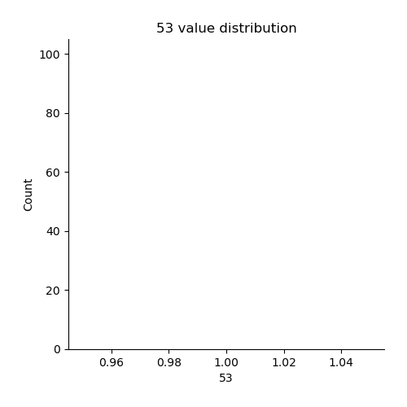
## Feature : 54
- **Feature type** : continous
- **Missing** : 0.0%
- **Unique** : 135
- **Count** :135.0
- **Mean** :0.5519300551226407
- **Std** :0.24677038618009062
- **Min** :-0.07307563375647746
- **25%th Percentile** : 0.38302769336771375
- **50%th Percentile** : 0.533458906661612
- **75%th Percentile** : 0.7133194861474805
- **Max** :0.9868870962794191

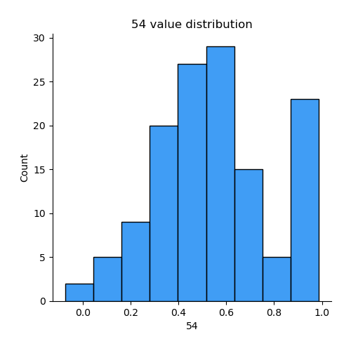
## Feature : 55
- **Feature type** : continous
- **Missing** : 0.0%
- **Unique** : 135
- **Count** :135.0
- **Mean** :0.40962757808278316
- **Std** :0.2779952517666109
- **Min** :-0.2583933571805766
- **25%th Percentile** : 0.23017623553423183
- **50%th Percentile** : 0.345408764017664
- **75%th Percentile** : 0.5612487910371917
- **Max** :0.9873239198103654

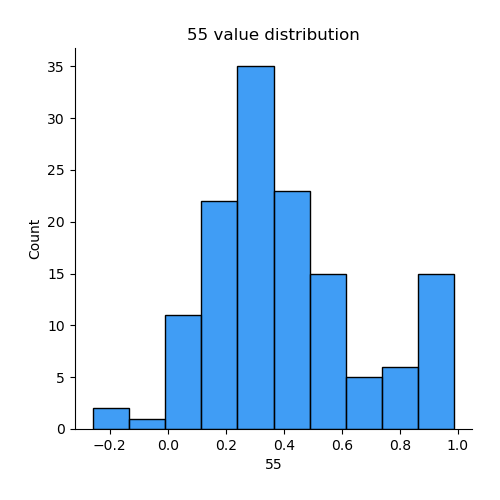
## Feature : 56
- **Feature type** : continous
- **Missing** : 0.0%
- **Unique** : 135
- **Count** :135.0
- **Mean** :0.5437001130695801
- **Std** :0.25984447027253743
- **Min** :-0.203912117545109
- **25%th Percentile** : 0.3865746769757763
- **50%th Percentile** : 0.536463192142885
- **75%th Percentile** : 0.6743114255339346
- **Max** :0.9879669847005962

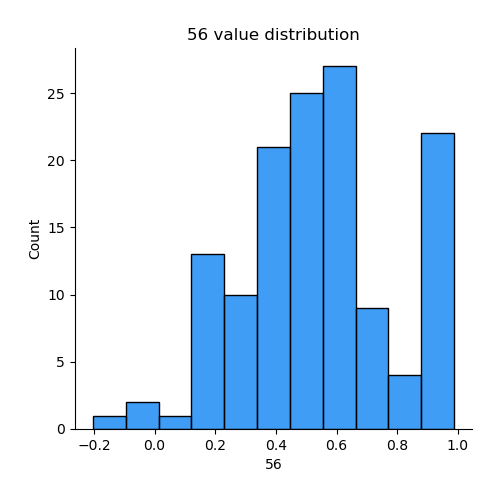
## Feature : 57
- **Feature type** : continous
- **Missing** : 0.0%
- **Unique** : 135
- **Count** :135.0
- **Mean** :0.5377271345808897
- **Std** :0.25266895335577866
- **Min** :-0.06259161202604097
- **25%th Percentile** : 0.3753094464921629
- **50%th Percentile** : 0.5066323293083111
- **75%th Percentile** : 0.667653013780573
- **Max** :0.9910206292631263

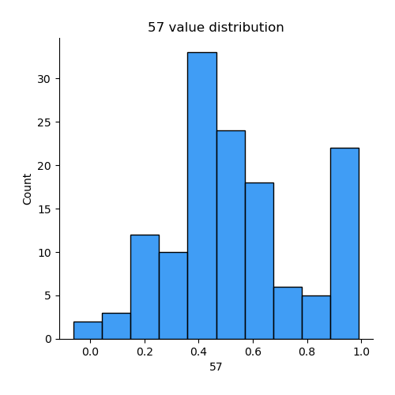
## Feature : 58
- **Feature type** : continous
- **Missing** : 0.0%
- **Unique** : 135
- **Count** :135.0
- **Mean** :0.5300678873646932
- **Std** :0.2552805461131464
- **Min** :-0.08744746308898754
- **25%th Percentile** : 0.3491443434272081
- **50%th Percentile** : 0.49066605405376545
- **75%th Percentile** : 0.6717133304005809
- **Max** :0.9878383778303169

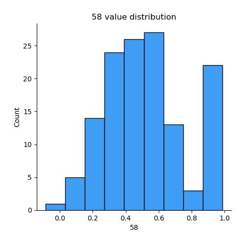
## Feature : 59
- **Feature type** : continous
- **Missing** : 0.0%
- **Unique** : 135
- **Count** :135.0
- **Mean** :0.6811543143163432
- **Std** :0.20508489678129646
- **Min** :-0.0044466410901530615
- **25%th Percentile** : 0.5579721781528855
- **50%th Percentile** : 0.7019467005817784
- **75%th Percentile** : 0.7984161876978089
- **Max** :0.9952987084100154

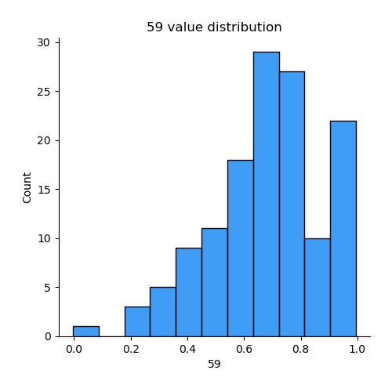
## Feature : 60
- **Feature type** : continous
- **Missing** : 0.0%
- **Unique** : 135
- **Count** :135.0
- **Mean** :0.5272244290197337
- **Std** :0.2520015634642796
- **Min** :-0.07565335655015488
- **25%th Percentile** : 0.3551165722526114
- **50%th Percentile** : 0.4857450540041837
- **75%th Percentile** : 0.664219409434545
- **Max** :0.9831600625090817

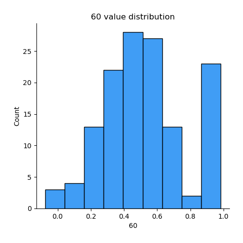
## Feature : 61
- **Feature type** : continous
- **Missing** : 0.0%
- **Unique** : 135
- **Count** :135.0
- **Mean** :0.5071045606964116
- **Std** :0.2577404780245982
- **Min** :-0.008029359097168258
- **25%th Percentile** : 0.3361488714319022
- **50%th Percentile** : 0.4572984017643497
- **75%th Percentile** : 0.6532734300778522
- **Max** :0.9823715605404273

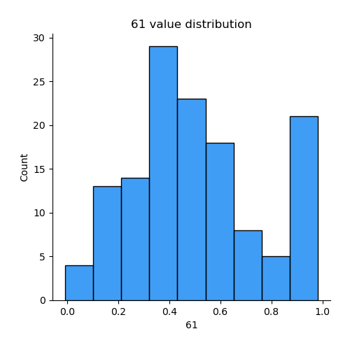
## Feature : 62
- **Feature type** : continous
- **Missing** : 0.0%
- **Unique** : 135
- **Count** :135.0
- **Mean** :0.5400940960721311
- **Std** :0.2597279478359862
- **Min** :-0.04098786749640828
- **25%th Percentile** : 0.3535227073384607
- **50%th Percentile** : 0.5451614402871461
- **75%th Percentile** : 0.7045803846191658
- **Max** :0.9859567844510805

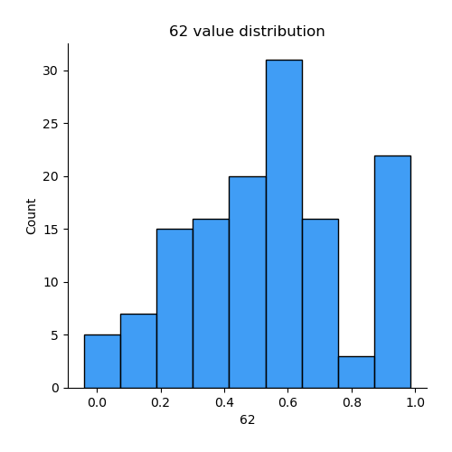
## Feature : 63
- **Feature type** : continous
- **Missing** : 0.0%
- **Unique** : 135
- **Count** :135.0
- **Mean** :0.5178906867393855
- **Std** :0.2687700257686515
- **Min** :-0.04363230431596628
- **25%th Percentile** : 0.3077545389089264
- **50%th Percentile** : 0.5068913753368217
- **75%th Percentile** : 0.652482067394075
- **Max** :0.9903605857527125

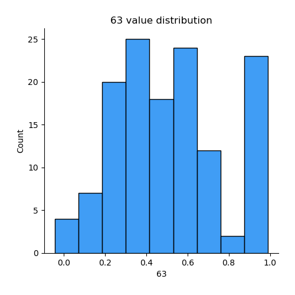
## Feature : 64
- **Feature type** : continous
- **Missing** : 0.0%
- **Unique** : 135
- **Count** :135.0
- **Mean** :0.5955019503099224
- **Std** :0.2527800391828427
- **Min** :-0.17143239727086676
- **25%th Percentile** : 0.4361353853197527
- **50%th Percentile** : 0.6056035499638264
- **75%th Percentile** : 0.7273204172411174
- **Max** :0.9937088112618173

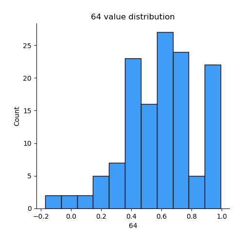
## Feature : 65
- **Feature type** : continous
- **Missing** : 0.0%
- **Unique** : 135
- **Count** :135.0
- **Mean** :0.46318257397553575
- **Std** :0.2856288697261086
- **Min** :-0.1689400636363698
- **25%th Percentile** : 0.29165106237453536
- **50%th Percentile** : 0.4264242492812066
- **75%th Percentile** : 0.6208179039168907
- **Max** :0.9908026681076921

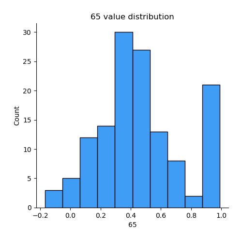
## Feature : 66
- **Feature type** : continous
- **Missing** : 0.0%
- **Unique** : 135
- **Count** :135.0
- **Mean** :0.5376045979925693
- **Std** :0.24434873949374747
- **Min** :-0.19358755286046
- **25%th Percentile** : 0.37744793243173197
- **50%th Percentile** : 0.5313688974881596
- **75%th Percentile** : 0.6847887133980811
- **Max** :0.9853336577455923

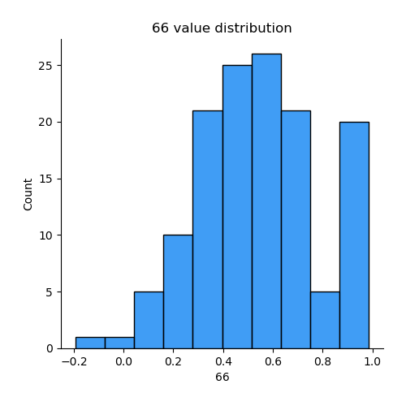
## Feature : 67
- **Feature type** : continous
- **Missing** : 0.0%
- **Unique** : 135
- **Count** :135.0
- **Mean** :0.6526037380931778
- **Std** :0.21600031008766485
- **Min** :0.10666948181776392
- **25%th Percentile** : 0.5198162129680406
- **50%th Percentile** : 0.6525930600995095
- **75%th Percentile** : 0.77757649153208
- **Max** :0.9958037757449429

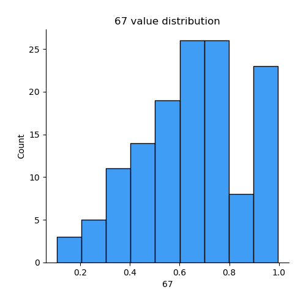
## Feature : 68
- **Feature type** : continous
- **Missing** : 0.0%
- **Unique** : 135
- **Count** :135.0
- **Mean** :0.7472969660191779
- **Std** :0.16676267052453997
- **Min** :0.25503521775483523
- **25%th Percentile** : 0.6442341650342138
- **50%th Percentile** : 0.7585236203812585
- **75%th Percentile** : 0.8449942944238235
- **Max** :0.995908926367117

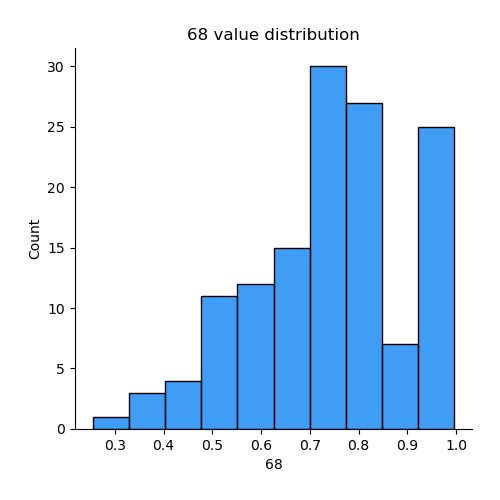
## Feature : 69
- **Feature type** : continous
- **Missing** : 0.0%
- **Unique** : 135
- **Count** :135.0
- **Mean** :0.6995826914702086
- **Std** :0.19569134539253222
- **Min** :0.0979420537999408
- **25%th Percentile** : 0.5778280576058208
- **50%th Percentile** : 0.7019895447849862
- **75%th Percentile** : 0.8387209600830814
- **Max** :0.9974487697459942

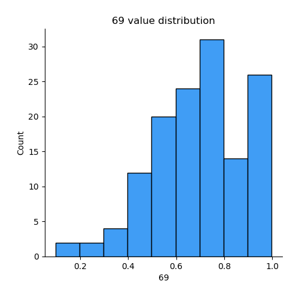
## Feature : 70
- **Feature type** : continous
- **Missing** : 0.0%
- **Unique** : 135
- **Count** :135.0
- **Mean** :0.6296238931349667
- **Std** :0.21180362998868754
- **Min** :0.05557033955956571
- **25%th Percentile** : 0.5079413079974957
- **50%th Percentile** : 0.608293187716939
- **75%th Percentile** : 0.7481240702648033
- **Max** :0.9900680168735287

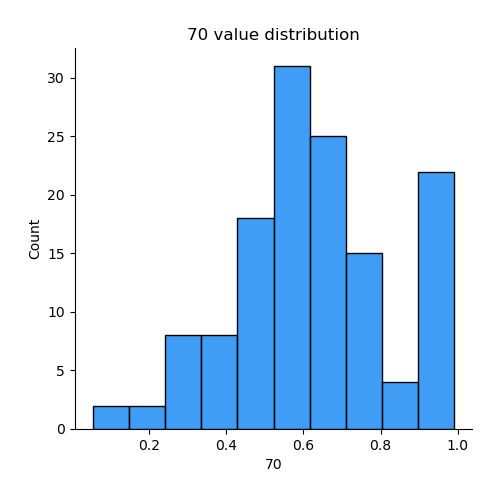
## Feature : 71
- **Feature type** : continous
- **Missing** : 0.0%
- **Unique** : 135
- **Count** :135.0
- **Mean** :0.5938591360868413
- **Std** :0.2393159945286625
- **Min** :0.07706442023871138
- **25%th Percentile** : 0.4411210816107497
- **50%th Percentile** : 0.5632900285173549
- **75%th Percentile** : 0.7552748805316604
- **Max** :0.9930539001309571

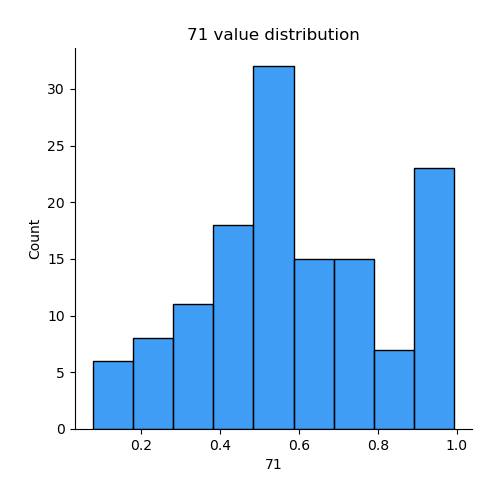
## Feature : 72
- **Feature type** : continous
- **Missing** : 0.0%
- **Unique** : 135
- **Count** :135.0
- **Mean** :0.7391194909321891
- **Std** :0.170603417920864
- **Min** :0.2781094801841407
- **25%th Percentile** : 0.6340056866256918
- **50%th Percentile** : 0.7417815235228614
- **75%th Percentile** : 0.8607670146369336
- **Max** :0.9958860796733289

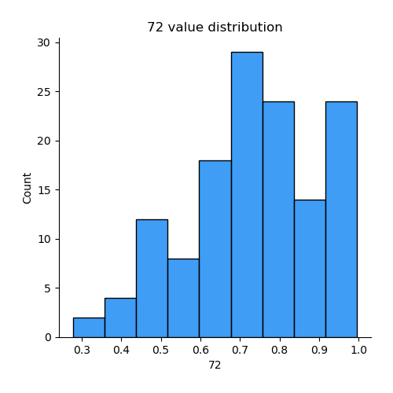
## Feature : 73
- **Feature type** : continous
- **Missing** : 0.0%
- **Unique** : 135
- **Count** :135.0
- **Mean** :0.6136651972768072
- **Std** :0.22209415549530406
- **Min** :0.12935231740833414
- **25%th Percentile** : 0.45766397006871784
- **50%th Percentile** : 0.5886916511364372
- **75%th Percentile** : 0.7424669354002853
- **Max** :0.9953647201365384

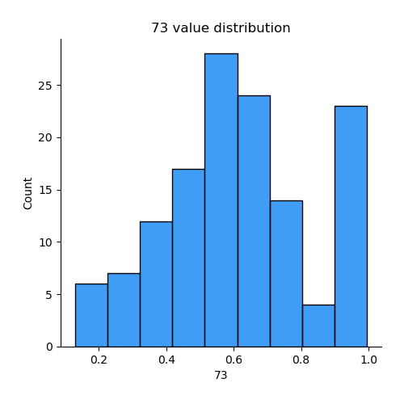
## Feature : 74
- **Feature type** : continous
- **Missing** : 0.0%
- **Unique** : 135
- **Count** :135.0
- **Mean** :0.600689238420511
- **Std** :0.24011407948019342
- **Min** :-0.004464584585842837
- **25%th Percentile** : 0.4381831581692568
- **50%th Percentile** : 0.593024216305571
- **75%th Percentile** : 0.7376974924125257
- **Max** :0.9927518111682893

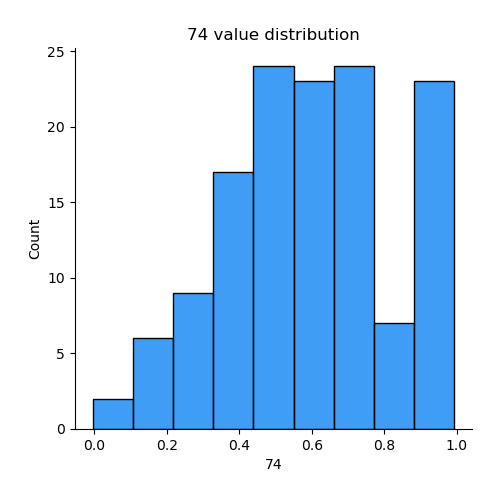
## Feature : 75
- **Feature type** : continous
- **Missing** : 0.0%
- **Unique** : 135
- **Count** :135.0
- **Mean** :0.6789357589079973
- **Std** :0.1954995259615952
- **Min** :0.09431688418396791
- **25%th Percentile** : 0.5705573057003024
- **50%th Percentile** : 0.6738685527504565
- **75%th Percentile** : 0.7994206800553838
- **Max** :0.9954788787262601

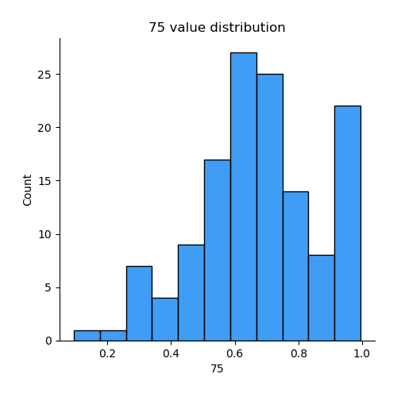
## Feature : 76
- **Feature type** : continous
- **Missing** : 0.0%
- **Unique** : 135
- **Count** :135.0
- **Mean** :0.39838862493171223
- **Std** :0.2938748913575773
- **Min** :-0.2595637651381403
- **25%th Percentile** : 0.18698299566015708
- **50%th Percentile** : 0.3508839280804672
- **75%th Percentile** : 0.5095171605630536
- **Max** :0.9839763044933997

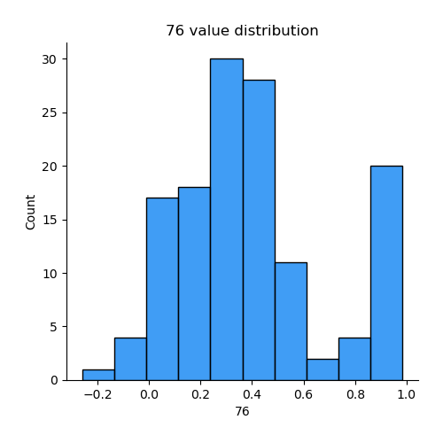
## Feature : 77
- **Feature type** : continous
- **Missing** : 0.0%
- **Unique** : 135
- **Count** :135.0
- **Mean** :0.5982247614515153
- **Std** :0.22586378241804808
- **Min** :0.059400545553980874
- **25%th Percentile** : 0.439638872544479
- **50%th Percentile** : 0.5630722856426499
- **75%th Percentile** : 0.747261908566905
- **Max** :0.9922161103593049

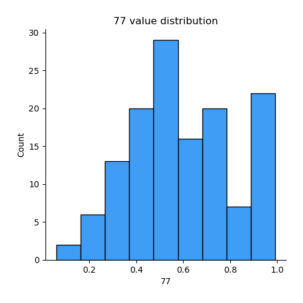
## Feature : 78
- **Feature type** : continous
- **Missing** : 0.0%
- **Unique** : 135
- **Count** :135.0
- **Mean** :0.4817983349193092
- **Std** :0.29857098027872847
- **Min** :-0.18432255827795282
- **25%th Percentile** : 0.2756775518353848
- **50%th Percentile** : 0.46488316723994644
- **75%th Percentile** : 0.6637920644419627
- **Max** :0.9914783505872494

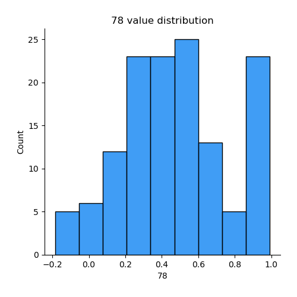
## Feature : 79
- **Feature type** : continous
- **Missing** : 0.0%
- **Unique** : 135
- **Count** :135.0
- **Mean** :0.8243920416284967
- **Std** :0.12925953085392805
- **Min** :0.3589160542740491
- **25%th Percentile** : 0.7491250354443001
- **50%th Percentile** : 0.8317962483165213
- **75%th Percentile** : 0.9171154422181625
- **Max** :0.9973970362909194

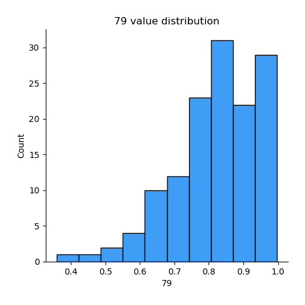
## Feature : 80
- **Feature type** : continous
- **Missing** : 0.0%
- **Unique** : 135
- **Count** :135.0
- **Mean** :0.5497225338186714
- **Std** :0.2437409357729011
- **Min** :-0.016085706603206053
- **25%th Percentile** : 0.38088738598395155
- **50%th Percentile** : 0.5171316817104253
- **75%th Percentile** : 0.692766640229417
- **Max** :0.9870748070211012

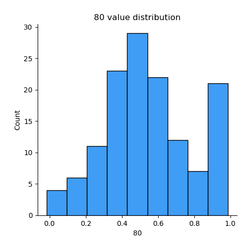
## Feature : 81
- **Feature type** : continous
- **Missing** : 0.0%
- **Unique** : 135
- **Count** :135.0
- **Mean** :0.4037455968011893
- **Std** :0.27248786543355574
- **Min** :-0.18571385034170296
- **25%th Percentile** : 0.21362576701045427
- **50%th Percentile** : 0.3622492667872603
- **75%th Percentile** : 0.5242762066753254
- **Max** :0.9838302544959073

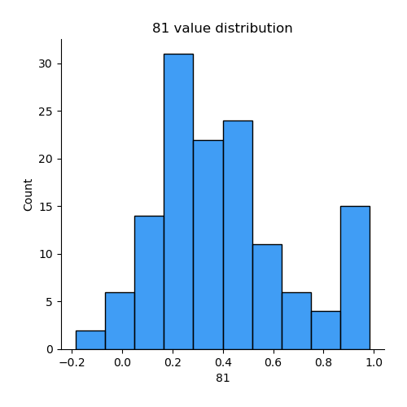
## Feature : 82
- **Feature type** : continous
- **Missing** : 0.0%
- **Unique** : 135
- **Count** :135.0
- **Mean** :0.5322269894996854
- **Std** :0.25978547687420456
- **Min** :-0.16998202684228814
- **25%th Percentile** : 0.3670213608062055
- **50%th Percentile** : 0.5226750249273943
- **75%th Percentile** : 0.6663395143100863
- **Max** :0.9875509616477568

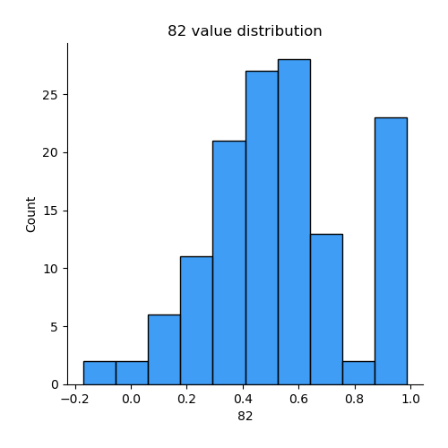
## Feature : 83
- **Feature type** : continous
- **Missing** : 0.0%
- **Unique** : 135
- **Count** :135.0
- **Mean** :0.5512396510332452
- **Std** :0.24742017723529483
- **Min** :0.03943863779278759
- **25%th Percentile** : 0.379334493271237
- **50%th Percentile** : 0.5095839224948628
- **75%th Percentile** : 0.6985206740539229
- **Max** :0.9929524896810018

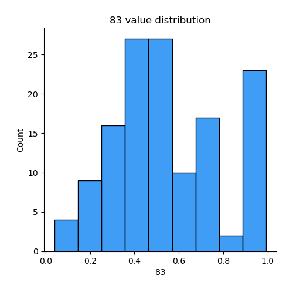
## Feature : 84
- **Feature type** : continous
- **Missing** : 0.0%
- **Unique** : 135
- **Count** :135.0
- **Mean** :0.5065564019507647
- **Std** :0.269178013540603
- **Min** :-0.03260795395702376
- **25%th Percentile** : 0.3203481366736197
- **50%th Percentile** : 0.5050289795063193
- **75%th Percentile** : 0.6267738160418692
- **Max** :0.9884626612754545

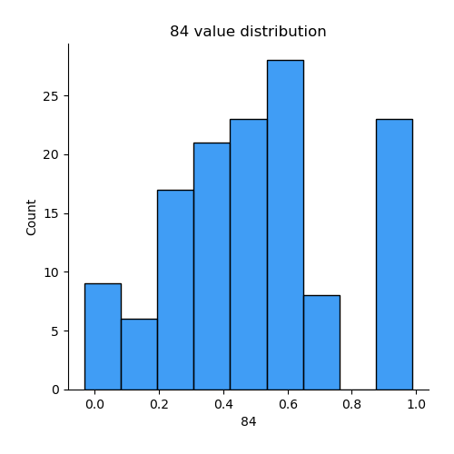
## Feature : 85
- **Feature type** : continous
- **Missing** : 0.0%
- **Unique** : 135
- **Count** :135.0
- **Mean** :0.665420493704778
- **Std** :0.2098522213365738
- **Min** :0.06402906591046975
- **25%th Percentile** : 0.4885875381604754
- **50%th Percentile** : 0.6894773531218372
- **75%th Percentile** : 0.7920458293707109
- **Max** :0.9950088306423902

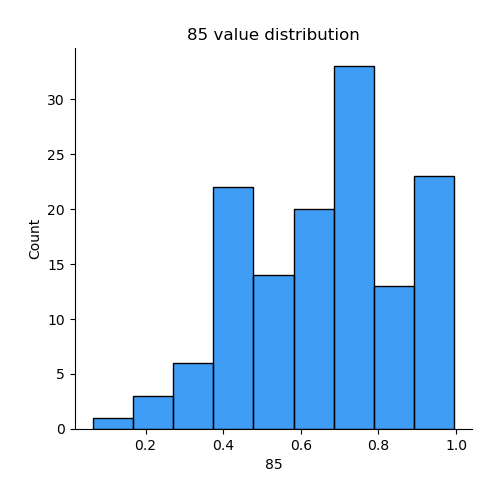
## Feature : 86
- **Feature type** : continous
- **Missing** : 0.0%
- **Unique** : 135
- **Count** :135.0
- **Mean** :0.553928650328997
- **Std** :0.23465045754313113
- **Min** :-0.0412969192714053
- **25%th Percentile** : 0.3913764559179883
- **50%th Percentile** : 0.5111151496577437
- **75%th Percentile** : 0.6758612355037256
- **Max** :0.9844705395624985

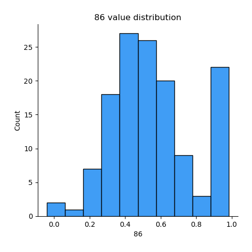
## Feature : 87
- **Feature type** : continous
- **Missing** : 0.0%
- **Unique** : 135
- **Count** :135.0
- **Mean** :0.4984115558059881
- **Std** :0.2636366065427291
- **Min** :-0.07738625228273067
- **25%th Percentile** : 0.3113456875512808
- **50%th Percentile** : 0.469860696301454
- **75%th Percentile** : 0.6396450538034553
- **Max** :0.9846753782448149

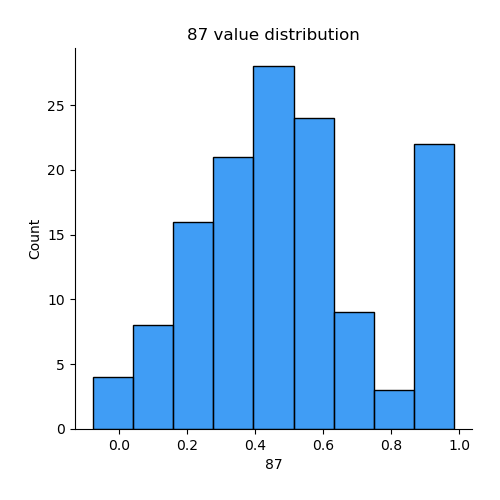
## Feature : 88
- **Feature type** : continous
- **Missing** : 0.0%
- **Unique** : 135
- **Count** :135.0
- **Mean** :0.5435111358151661
- **Std** :0.2544233056355885
- **Min** :-0.012014562671948035
- **25%th Percentile** : 0.352032862942586
- **50%th Percentile** : 0.5386637721378774
- **75%th Percentile** : 0.707893031103001
- **Max** :0.9881060033147758

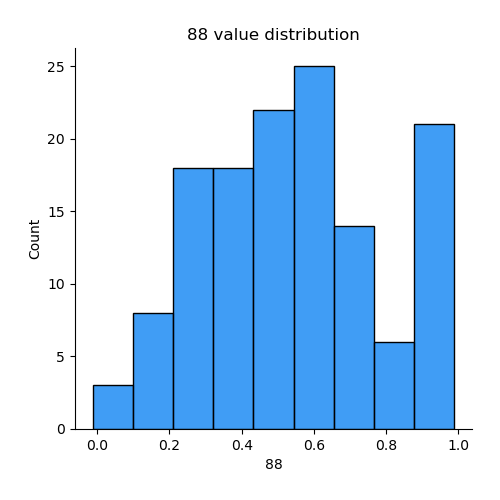
## Feature : 89
- **Feature type** : continous
- **Missing** : 0.0%
- **Unique** : 135
- **Count** :135.0
- **Mean** :0.5036643044032195
- **Std** :0.27399139087903596
- **Min** :-0.10954013929653318
- **25%th Percentile** : 0.3176020832505227
- **50%th Percentile** : 0.47695044440320084
- **75%th Percentile** : 0.6468716977384996
- **Max** :0.9915338324514799

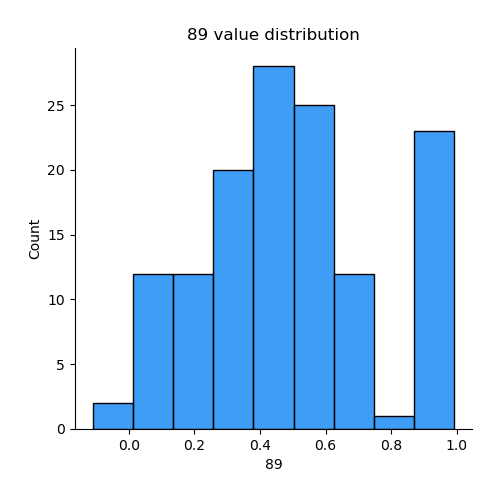
## Feature : 90
- **Feature type** : continous
- **Missing** : 0.0%
- **Unique** : 135
- **Count** :135.0
- **Mean** :0.5821105659621119
- **Std** :0.26272751330886984
- **Min** :-0.15536769182404028
- **25%th Percentile** : 0.4294423923211958
- **50%th Percentile** : 0.6039543883759798
- **75%th Percentile** : 0.7335708494984865
- **Max** :0.9950880440170888

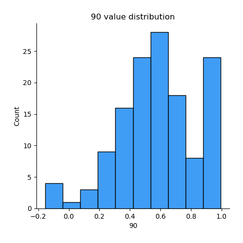
## Feature : 91
- **Feature type** : continous
- **Missing** : 0.0%
- **Unique** : 135
- **Count** :135.0
- **Mean** :0.46349875540070173
- **Std** :0.2875114874290899
- **Min** :-0.26871075127931615
- **25%th Percentile** : 0.2749878081769286
- **50%th Percentile** : 0.43657875906967614
- **75%th Percentile** : 0.5890431072481659
- **Max** :0.9921074320413198

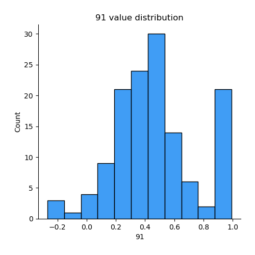
## Feature : 92
- **Feature type** : continous
- **Missing** : 0.0%
- **Unique** : 135
- **Count** :135.0
- **Mean** :0.5372390467590671
- **Std** :0.24286596571904498
- **Min** :-0.13552702942877398
- **25%th Percentile** : 0.37703648434913517
- **50%th Percentile** : 0.5305716753264776
- **75%th Percentile** : 0.6733240474135622
- **Max** :0.9835490184348845

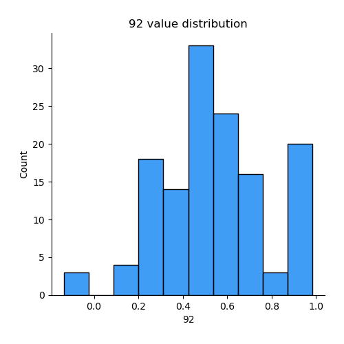
## Feature : 93
- **Feature type** : continous
- **Missing** : 0.0%
- **Unique** : 135
- **Count** :135.0
- **Mean** :0.6095833031614443
- **Std** :0.2458383909831773
- **Min** :0.017842042554775905
- **25%th Percentile** : 0.4395117693964674
- **50%th Percentile** : 0.5953824366316212
- **75%th Percentile** : 0.7745608416179226
- **Max** :0.9958611007324157

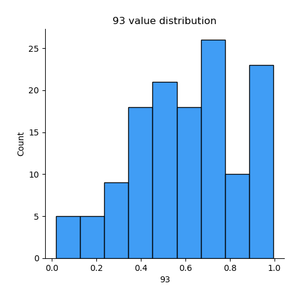
## Feature : 94
- **Feature type** : continous
- **Missing** : 0.0%
- **Unique** : 135
- **Count** :135.0
- **Mean** :0.7380509304875431
- **Std** :0.1706682939627238
- **Min** :0.23794265684388125
- **25%th Percentile** : 0.6420141228937687
- **50%th Percentile** : 0.7321106481382073
- **75%th Percentile** : 0.8529420865539588
- **Max** :0.9955835037733878

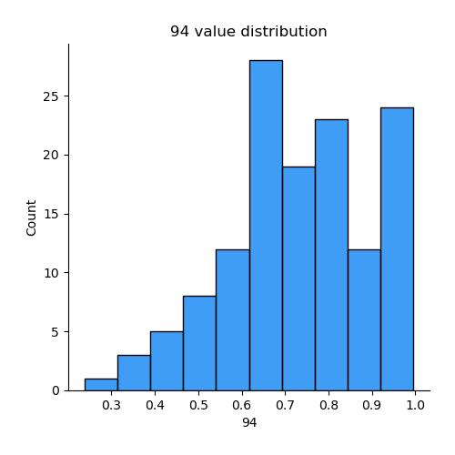
## Feature : 95
- **Feature type** : continous
- **Missing** : 0.0%
- **Unique** : 135
- **Count** :135.0
- **Mean** :0.665397190653984
- **Std** :0.21809176379582207
- **Min** :0.06921173580172699
- **25%th Percentile** : 0.5258253197028118
- **50%th Percentile** : 0.6705532665329117
- **75%th Percentile** : 0.8199974475751368
- **Max** :0.9973338808190148

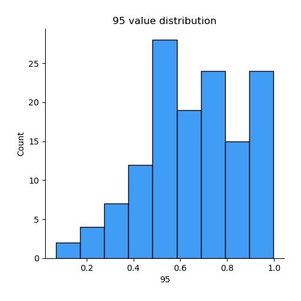
## Feature : 96
- **Feature type** : continous
- **Missing** : 0.0%
- **Unique** : 135
- **Count** :135.0
- **Mean** :0.6256151239713168
- **Std** :0.21174605849995476
- **Min** :0.09117539430940945
- **25%th Percentile** : 0.5062230017044684
- **50%th Percentile** : 0.5985664748143107
- **75%th Percentile** : 0.743924232227402
- **Max** :0.9914601778737407

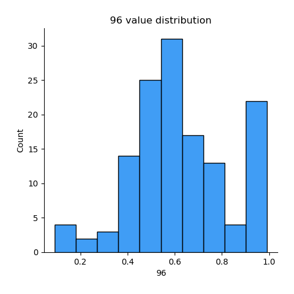
## Feature : 97
- **Feature type** : continous
- **Missing** : 0.0%
- **Unique** : 135
- **Count** :135.0
- **Mean** :0.5643623261751377
- **Std** :0.24601795351608471
- **Min** :0.11956765100505054
- **25%th Percentile** : 0.3649337840968314
- **50%th Percentile** : 0.5442621745615217
- **75%th Percentile** : 0.7168755861810872
- **Max** :0.9918286584136438

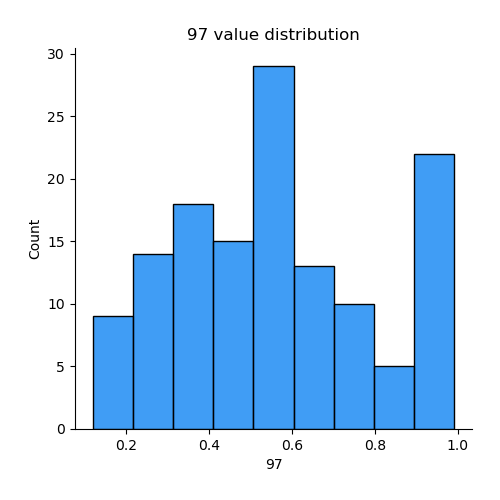
## Feature : 98
- **Feature type** : continous
- **Missing** : 0.0%
- **Unique** : 135
- **Count** :135.0
- **Mean** :0.7291821538294537
- **Std** :0.17130495015087235
- **Min** :0.3022120630942132
- **25%th Percentile** : 0.621472378910747
- **50%th Percentile** : 0.7224756761934998
- **75%th Percentile** : 0.840422828687285
- **Max** :0.9968093087650753

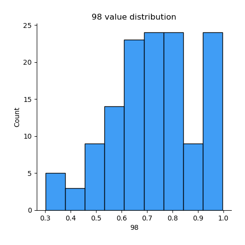
## Feature : 99
- **Feature type** : continous
- **Missing** : 0.0%
- **Unique** : 135
- **Count** :135.0
- **Mean** :0.6104587556214895
- **Std** :0.2256156396059183
- **Min** :0.09115712450012066
- **25%th Percentile** : 0.4684120577884983
- **50%th Percentile** : 0.5989844253654597
- **75%th Percentile** : 0.7437446800840435
- **Max** :0.9949560485999741

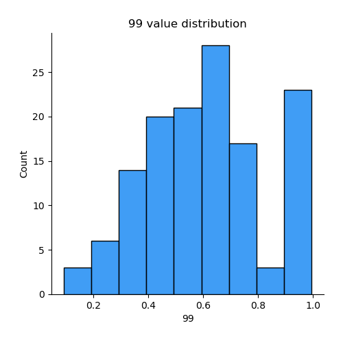
## Feature : 100
- **Feature type** : continous
- **Missing** : 0.0%
- **Unique** : 135
- **Count** :135.0
- **Mean** :0.5686944680233358
- **Std** :0.2636886601775931
- **Min** :-0.1481168183103964
- **25%th Percentile** : 0.3956487094984005
- **50%th Percentile** : 0.5562631215577505
- **75%th Percentile** : 0.7419971865382639
- **Max** :0.9937166111264286

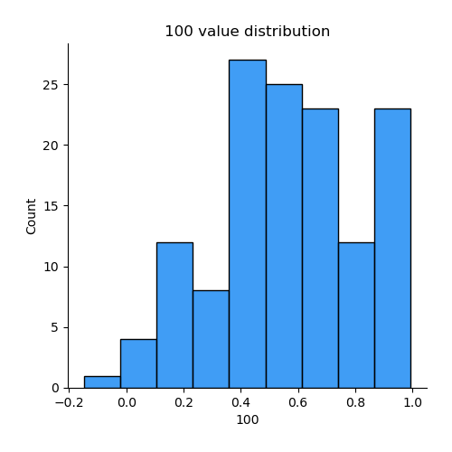
## Feature : 101
- **Feature type** : continous
- **Missing** : 0.0%
- **Unique** : 135
- **Count** :135.0
- **Mean** :0.6524004846508877
- **Std** :0.21480840277235425
- **Min** :0.08995501817203404
- **25%th Percentile** : 0.5095088953562515
- **50%th Percentile** : 0.6596143687577045
- **75%th Percentile** : 0.7940536157570648
- **Max** :0.9945302361703542

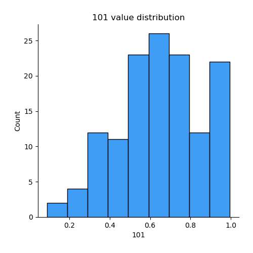
## Feature : 102
- **Feature type** : continous
- **Missing** : 0.0%
- **Unique** : 135
- **Count** :135.0
- **Mean** :0.38402908905670863
- **Std** :0.3028191889674696
- **Min** :-0.18878792286619603
- **25%th Percentile** : 0.18714974737575074
- **50%th Percentile** : 0.32868827080783436
- **75%th Percentile** : 0.5750536747660117
- **Max** :0.9848253656620286

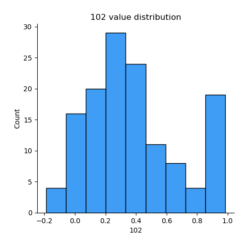
## Feature : 103
- **Feature type** : continous
- **Missing** : 0.0%
- **Unique** : 135
- **Count** :135.0
- **Mean** :0.525789098402158
- **Std** :0.27683871300475155
- **Min** :-0.45926135928123935
- **25%th Percentile** : 0.3186596833432026
- **50%th Percentile** : 0.5411901982789236
- **75%th Percentile** : 0.6732014851504586
- **Max** :0.9916299962143817

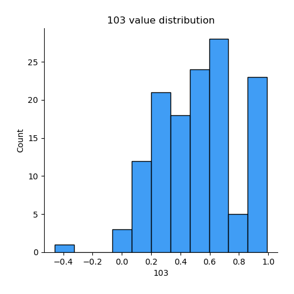
## Feature : 106
- **Feature type** : continous
- **Missing** : 0.0%
- **Unique** : 3
- **Count** :135.0
- **Mean** :1.0
- **Std** :7.791656504413792e-17
- **Min** :0.9999999999999998
- **25%th Percentile** : 1.0
- **50%th Percentile** : 1.0
- **75%th Percentile** : 1.0
- **Max** :1.0

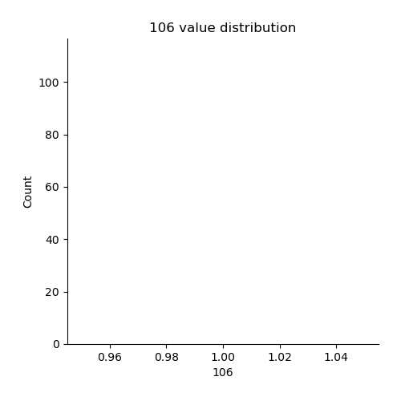
## Feature : 107
- **Feature type** : continous
- **Missing** : 0.0%
- **Unique** : 135
- **Count** :135.0
- **Mean** :0.40776634979554616
- **Std** :0.29371182594018164
- **Min** :-0.18312342682669414
- **25%th Percentile** : 0.20481584297482613
- **50%th Percentile** : 0.36457810949928576
- **75%th Percentile** : 0.5964608810720975
- **Max** :0.9833824993605519

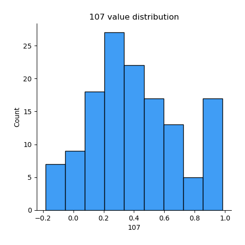
## Feature : 108
- **Feature type** : continous
- **Missing** : 0.0%
- **Unique** : 135
- **Count** :135.0
- **Mean** :0.6967563480693063
- **Std** :0.1891663009383075
- **Min** :0.2250519233903834
- **25%th Percentile** : 0.5705157432349157
- **50%th Percentile** : 0.7120102502213097
- **75%th Percentile** : 0.823904778492625
- **Max** :0.9886251939977215

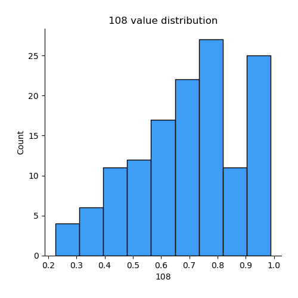
## Feature : 109
- **Feature type** : continous
- **Missing** : 0.0%
- **Unique** : 135
- **Count** :135.0
- **Mean** :0.677517011297055
- **Std** :0.20410495156160777
- **Min** :0.15782755149457256
- **25%th Percentile** : 0.5506237448937794
- **50%th Percentile** : 0.6912885307788754
- **75%th Percentile** : 0.8167047296645866
- **Max** :0.9905060804974924

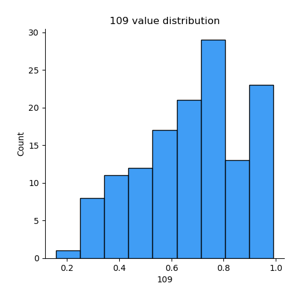
## Feature : 110
- **Feature type** : continous
- **Missing** : 0.0%
- **Unique** : 135
- **Count** :135.0
- **Mean** :0.602235285949659
- **Std** :0.23329422209341727
- **Min** :0.04717214333645165
- **25%th Percentile** : 0.45173350753930774
- **50%th Percentile** : 0.5817343566265016
- **75%th Percentile** : 0.7631180283770969
- **Max** :0.9866733177110785

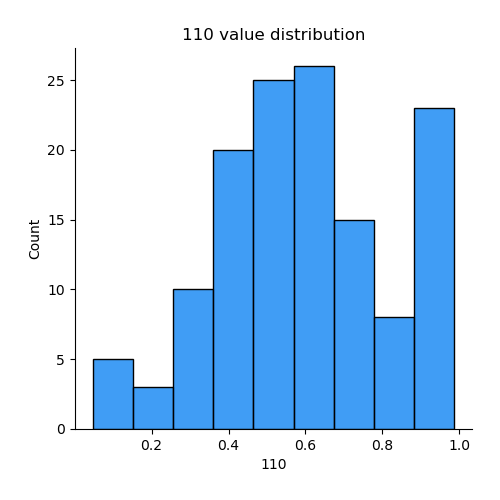
## Feature : 111
- **Feature type** : continous
- **Missing** : 0.0%
- **Unique** : 135
- **Count** :135.0
- **Mean** :0.6276987934363696
- **Std** :0.2178985732283127
- **Min** :0.12800805663213308
- **25%th Percentile** : 0.48449404405446295
- **50%th Percentile** : 0.6287353603243344
- **75%th Percentile** : 0.7630534897509089
- **Max** :0.9915608220941109

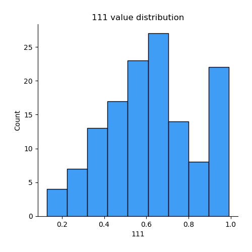
## Feature : 112
- **Feature type** : continous
- **Missing** : 0.0%
- **Unique** : 135
- **Count** :135.0
- **Mean** :0.6485295591138999
- **Std** :0.22088701900689722
- **Min** :0.09174441177549689
- **25%th Percentile** : 0.5095339075834071
- **50%th Percentile** : 0.65461665084019
- **75%th Percentile** : 0.8230734119856339
- **Max** :0.9849787986536174

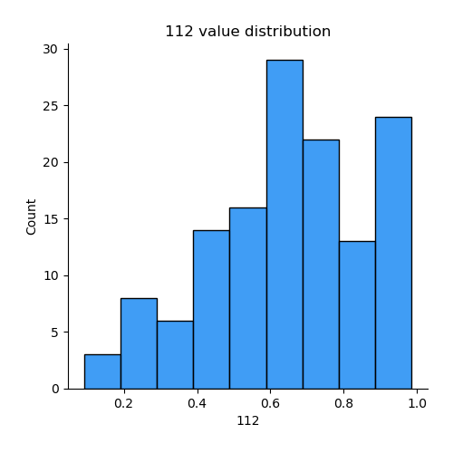
## Feature : 113
- **Feature type** : continous
- **Missing** : 0.0%
- **Unique** : 135
- **Count** :135.0
- **Mean** :0.7440723449715544
- **Std** :0.17177281118083043
- **Min** :-0.02888338048284136
- **25%th Percentile** : 0.6206735156010441
- **50%th Percentile** : 0.7692071093107635
- **75%th Percentile** : 0.8530641280984705
- **Max** :0.9941131314596664

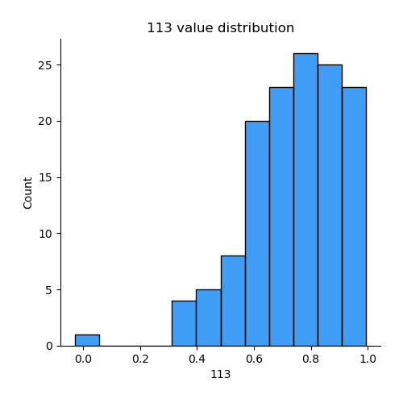
## Feature : 114
- **Feature type** : continous
- **Missing** : 0.0%
- **Unique** : 135
- **Count** :135.0
- **Mean** :0.8382384229627738
- **Std** :0.11520996893949993
- **Min** :0.4891491591256267
- **25%th Percentile** : 0.7944087340950767
- **50%th Percentile** : 0.8550871860917054
- **75%th Percentile** : 0.9144533416038383
- **Max** :0.992784765020327

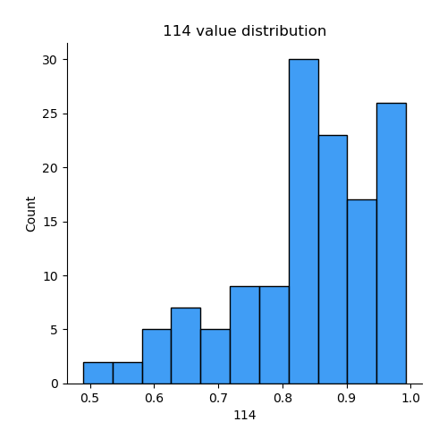
## Feature : 115
- **Feature type** : continous
- **Missing** : 0.0%
- **Unique** : 135
- **Count** :135.0
- **Mean** :0.586103598814579
- **Std** :0.24434785568486472
- **Min** :-0.030942796546416827
- **25%th Percentile** : 0.4235550452321937
- **50%th Percentile** : 0.5720271443305848
- **75%th Percentile** : 0.7417398634867831
- **Max** :0.9890528422285935

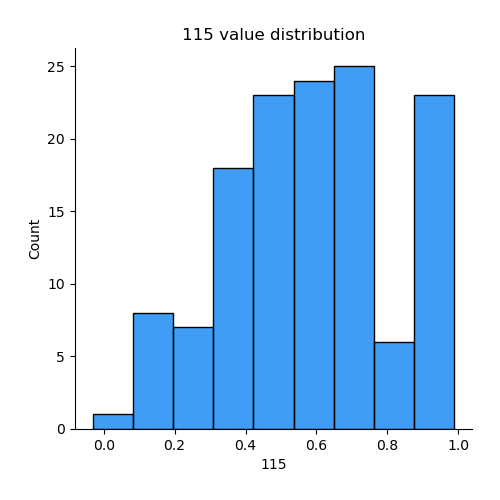
## Feature : 116
- **Feature type** : continous
- **Missing** : 0.0%
- **Unique** : 135
- **Count** :135.0
- **Mean** :0.5897146746732294
- **Std** :0.251463510463021
- **Min** :0.0069547295131249165
- **25%th Percentile** : 0.4052470893572425
- **50%th Percentile** : 0.5915284404990423
- **75%th Percentile** : 0.7713873964837099
- **Max** :0.9890321531442229

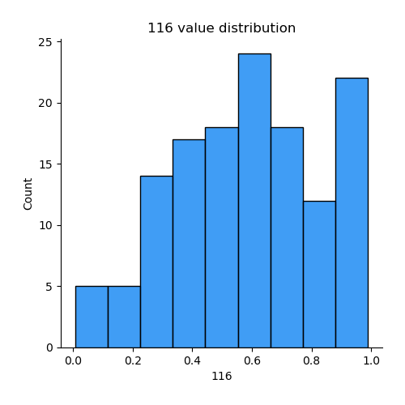
## Feature : 117
- **Feature type** : continous
- **Missing** : 0.0%
- **Unique** : 135
- **Count** :135.0
- **Mean** :0.5738048202094073
- **Std** :0.2401589598132181
- **Min** :-0.0432910584694304
- **25%th Percentile** : 0.4006590723584791
- **50%th Percentile** : 0.5787684336283351
- **75%th Percentile** : 0.7009660483424611
- **Max** :0.9884113522242713

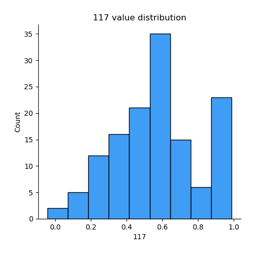
## Feature : 118
- **Feature type** : continous
- **Missing** : 0.0%
- **Unique** : 135
- **Count** :135.0
- **Mean** :0.8157050315428276
- **Std** :0.12006352084554019
- **Min** :0.4405963215043004
- **25%th Percentile** : 0.7487439373556066
- **50%th Percentile** : 0.8351269587314033
- **75%th Percentile** : 0.9032112433927987
- **Max** :0.9928079919257861

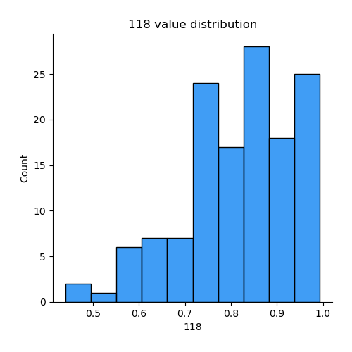
## Feature : 119
- **Feature type** : continous
- **Missing** : 0.0%
- **Unique** : 135
- **Count** :135.0
- **Mean** :0.6383301620161268
- **Std** :0.2190342070600691
- **Min** :0.1058054545127141
- **25%th Percentile** : 0.4872455025584619
- **50%th Percentile** : 0.6524745425461226
- **75%th Percentile** : 0.7631048425273438
- **Max** :0.9913657448125047

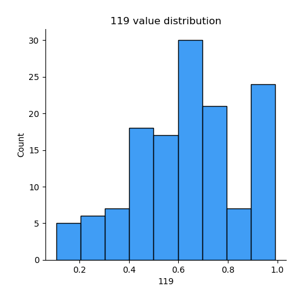
## Feature : 120
- **Feature type** : continous
- **Missing** : 0.0%
- **Unique** : 135
- **Count** :135.0
- **Mean** :0.6400635115397516
- **Std** :0.2114482414690792
- **Min** :0.031913840690560955
- **25%th Percentile** : 0.5151524668041205
- **50%th Percentile** : 0.6303045321357935
- **75%th Percentile** : 0.7622076994021129
- **Max** :0.9849077093971588

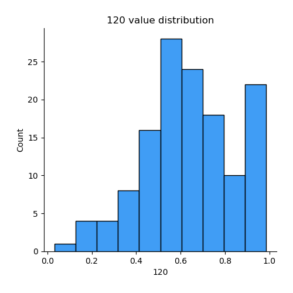
## Feature : 121
- **Feature type** : continous
- **Missing** : 0.0%
- **Unique** : 135
- **Count** :135.0
- **Mean** :0.6376973903744172
- **Std** :0.21828199542894297
- **Min** :0.13374366308420035
- **25%th Percentile** : 0.4827537195410856
- **50%th Percentile** : 0.64683364345539
- **75%th Percentile** : 0.770706612352552
- **Max** :0.9899138387535595

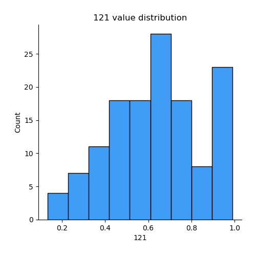
## Feature : 122
- **Feature type** : continous
- **Missing** : 0.0%
- **Unique** : 135
- **Count** :135.0
- **Mean** :0.7547113430620505
- **Std** :0.15936988745417074
- **Min** :0.36866158469566335
- **25%th Percentile** : 0.6684232085758599
- **50%th Percentile** : 0.7585893136802828
- **75%th Percentile** : 0.8685294784855717
- **Max** :0.9909699091815869

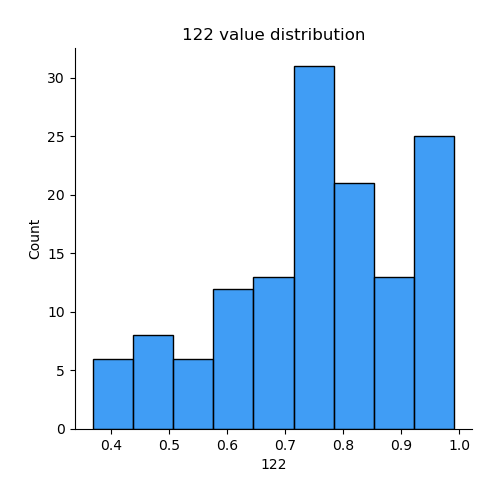
## Feature : 123
- **Feature type** : continous
- **Missing** : 0.0%
- **Unique** : 135
- **Count** :135.0
- **Mean** :0.4440344031592115
- **Std** :0.28393609528212754
- **Min** :-0.19664763849512462
- **25%th Percentile** : 0.2800319927632488
- **50%th Percentile** : 0.37313363861625826
- **75%th Percentile** : 0.6067600454192675
- **Max** :0.9821059072185514

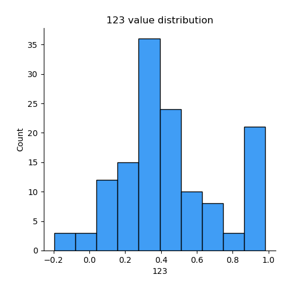
## Feature : 124
- **Feature type** : continous
- **Missing** : 0.0%
- **Unique** : 135
- **Count** :135.0
- **Mean** :0.5334829732461668
- **Std** :0.2706142026603507
- **Min** :-0.1539135282856747
- **25%th Percentile** : 0.34099944256840575
- **50%th Percentile** : 0.4998920928143731
- **75%th Percentile** : 0.7225601096327123
- **Max** :0.9877089987671304

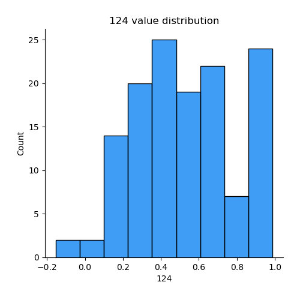
## Feature : 125
- **Feature type** : continous
- **Missing** : 0.0%
- **Unique** : 135
- **Count** :135.0
- **Mean** :0.7638226023429655
- **Std** :0.15178907689106885
- **Min** :0.3307190346510594
- **25%th Percentile** : 0.6773888042832173
- **50%th Percentile** : 0.7844528221383978
- **75%th Percentile** : 0.8551728923164124
- **Max** :0.9922297013411444

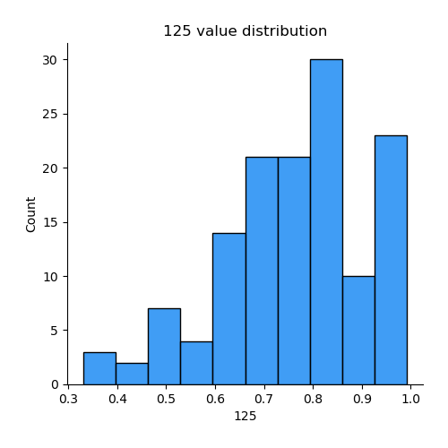
## Feature : 126
- **Feature type** : continous
- **Missing** : 0.0%
- **Unique** : 135
- **Count** :135.0
- **Mean** :0.6452272736688296
- **Std** :0.21686715025449446
- **Min** :-0.03602025301530429
- **25%th Percentile** : 0.49490278323644865
- **50%th Percentile** : 0.6237170957179433
- **75%th Percentile** : 0.8024831172192963
- **Max** :0.991476427974166

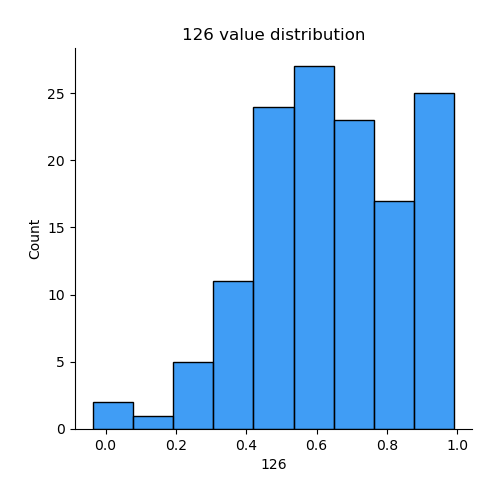
## Feature : 127
- **Feature type** : continous
- **Missing** : 0.0%
- **Unique** : 135
- **Count** :135.0
- **Mean** :0.6512112689390358
- **Std** :0.20504050654720377
- **Min** :0.17295606088504742
- **25%th Percentile** : 0.5087432019739415
- **50%th Percentile** : 0.6456761161372429
- **75%th Percentile** : 0.7902214171148346
- **Max** :0.9878830466072959

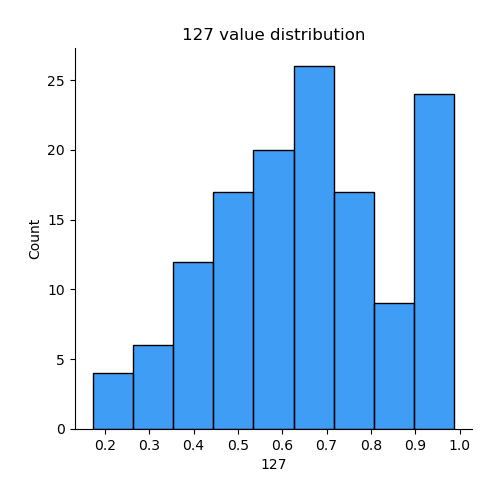
## Feature : 128
- **Feature type** : continous
- **Missing** : 0.0%
- **Unique** : 135
- **Count** :135.0
- **Mean** :0.3927247887506757
- **Std** :0.28903620058077106
- **Min** :-0.21182403670266758
- **25%th Percentile** : 0.2138418650156494
- **50%th Percentile** : 0.33937699889675543
- **75%th Percentile** : 0.5033941200908203
- **Max** :0.9768035556853324

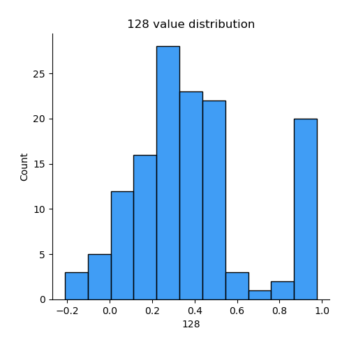
## Feature : 129
- **Feature type** : continous
- **Missing** : 0.0%
- **Unique** : 135
- **Count** :135.0
- **Mean** :0.5928473917783511
- **Std** :0.23184540919805396
- **Min** :0.12164952459048663
- **25%th Percentile** : 0.4170961706444679
- **50%th Percentile** : 0.5739408466878089
- **75%th Percentile** : 0.7560379976022741
- **Max** :0.9861326185567121

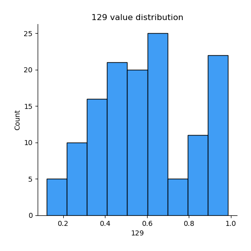
## Feature : 130
- **Feature type** : continous
- **Missing** : 0.0%
- **Unique** : 135
- **Count** :135.0
- **Mean** :0.5852916730402207
- **Std** :0.2483511186850977
- **Min** :-0.14874501721461908
- **25%th Percentile** : 0.4497167233132008
- **50%th Percentile** : 0.5790597276499013
- **75%th Percentile** : 0.7410364461560456
- **Max** :0.9901279477977009

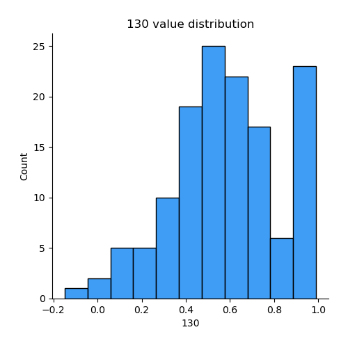
## Feature : 131
- **Feature type** : continous
- **Missing** : 0.0%
- **Unique** : 135
- **Count** :135.0
- **Mean** :0.5411280023679814
- **Std** :0.23788850453743335
- **Min** :0.03253147442638361
- **25%th Percentile** : 0.37105511799271357
- **50%th Percentile** : 0.5135810446958275
- **75%th Percentile** : 0.6627417220727476
- **Max** :0.9852803249869948

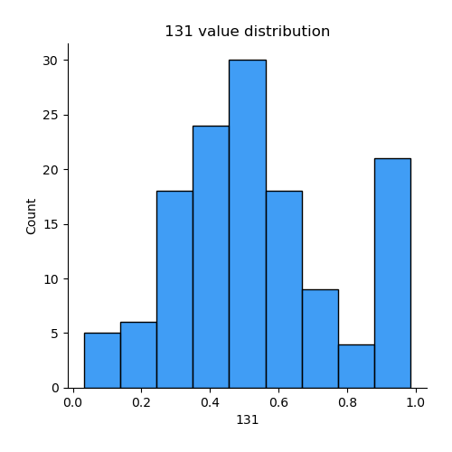
## Feature : 132
- **Feature type** : continous
- **Missing** : 0.0%
- **Unique** : 135
- **Count** :135.0
- **Mean** :0.9238297215720991
- **Std** :0.057989361408062504
- **Min** :0.7533427295710385
- **25%th Percentile** : 0.8957886807085527
- **50%th Percentile** : 0.9369035841852881
- **75%th Percentile** : 0.9688567225917872
- **Max** :0.9966385730921984

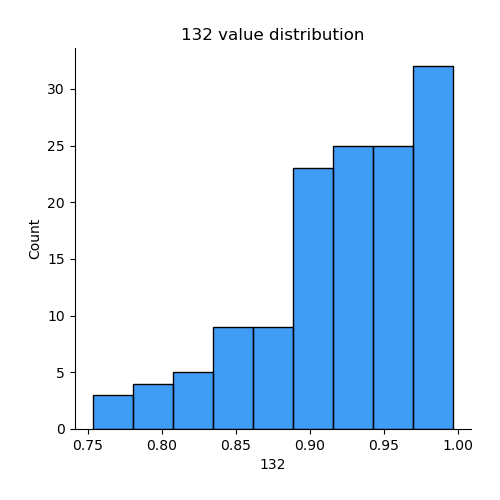
## Feature : 133
- **Feature type** : continous
- **Missing** : 0.0%
- **Unique** : 135
- **Count** :135.0
- **Mean** :0.3881885113215571
- **Std** :0.2970108223673066
- **Min** :-0.1796681482115376
- **25%th Percentile** : 0.16577206593811056
- **50%th Percentile** : 0.3554475773540701
- **75%th Percentile** : 0.5740197902495472
- **Max** :0.9828381908492183

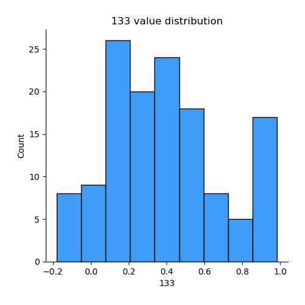
## Feature : 134
- **Feature type** : continous
- **Missing** : 0.0%
- **Unique** : 135
- **Count** :135.0
- **Mean** :0.6875888945394374
- **Std** :0.19081108307806918
- **Min** :0.06639772328961824
- **25%th Percentile** : 0.5533026044612064
- **50%th Percentile** : 0.6901901569792619
- **75%th Percentile** : 0.8220804148191431
- **Max** :0.98922534689461

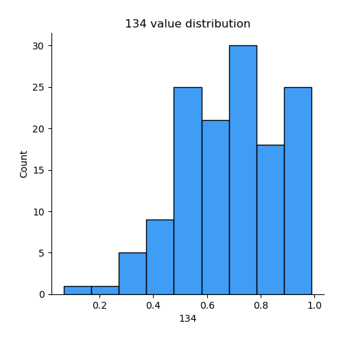
## Feature : 135
- **Feature type** : continous
- **Missing** : 0.0%
- **Unique** : 135
- **Count** :135.0
- **Mean** :0.668212508056991
- **Std** :0.20561073785758324
- **Min** :0.09806548864393645
- **25%th Percentile** : 0.531875582522715
- **50%th Percentile** : 0.6733096658475496
- **75%th Percentile** : 0.8100218343546841
- **Max** :0.991084249580612

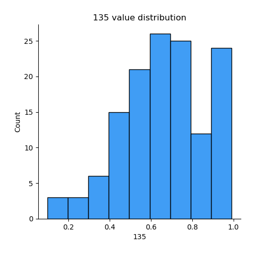
## Feature : 136
- **Feature type** : continous
- **Missing** : 0.0%
- **Unique** : 135
- **Count** :135.0
- **Mean** :0.5754858517775175
- **Std** :0.24524296647282823
- **Min** :-0.021601365402084214
- **25%th Percentile** : 0.40894311097419067
- **50%th Percentile** : 0.5658067480957376
- **75%th Percentile** : 0.7283766419837803
- **Max** :0.9885572613577966

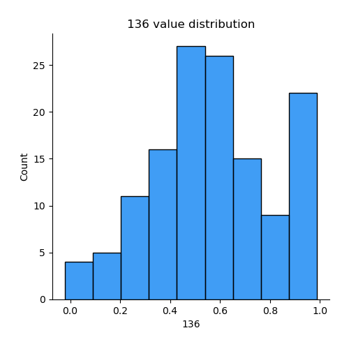
## Feature : 137
- **Feature type** : continous
- **Missing** : 0.0%
- **Unique** : 135
- **Count** :135.0
- **Mean** :0.6224135064121125
- **Std** :0.21539319104587618
- **Min** :0.13416144847203876
- **25%th Percentile** : 0.46481195128484876
- **50%th Percentile** : 0.6214224633499414
- **75%th Percentile** : 0.7591660018472424
- **Max** :0.9928840297264901

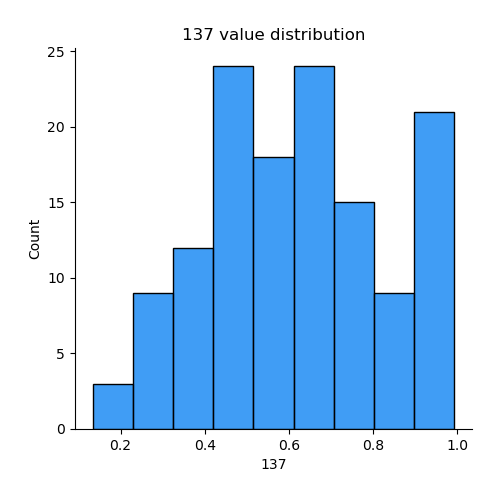
## Feature : 138
- **Feature type** : continous
- **Missing** : 0.0%
- **Unique** : 135
- **Count** :135.0
- **Mean** :0.6702421397494702
- **Std** :0.2040892200589171
- **Min** :0.1595307479886511
- **25%th Percentile** : 0.5424618019736387
- **50%th Percentile** : 0.6596902900771286
- **75%th Percentile** : 0.8316874474761901
- **Max** :0.9846974337947282

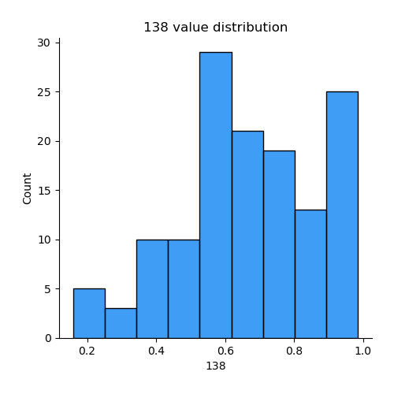
## Feature : 139
- **Feature type** : continous
- **Missing** : 0.0%
- **Unique** : 135
- **Count** :135.0
- **Mean** :0.7271071924051379
- **Std** :0.17588594832521973
- **Min** :-0.011928157542611595
- **25%th Percentile** : 0.6184080126399907
- **50%th Percentile** : 0.7432576002272976
- **75%th Percentile** : 0.8369065031603216
- **Max** :0.9904525591328152

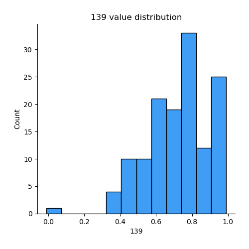
## Feature : 140
- **Feature type** : continous
- **Missing** : 0.0%
- **Unique** : 135
- **Count** :135.0
- **Mean** :0.8247452637730591
- **Std** :0.1282840013014573
- **Min** :0.30699340513138246
- **25%th Percentile** : 0.7610119610949204
- **50%th Percentile** : 0.8454567504640877
- **75%th Percentile** : 0.9206348685038759
- **Max** :0.9945264416633752

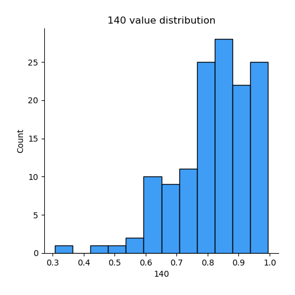
## Feature : 141
- **Feature type** : continous
- **Missing** : 0.0%
- **Unique** : 135
- **Count** :135.0
- **Mean** :0.5823512145677702
- **Std** :0.2535897081665822
- **Min** :-0.12391910252621945
- **25%th Percentile** : 0.4550855025453373
- **50%th Percentile** : 0.5802830037347886
- **75%th Percentile** : 0.744612524603204
- **Max** :0.9906885057288483

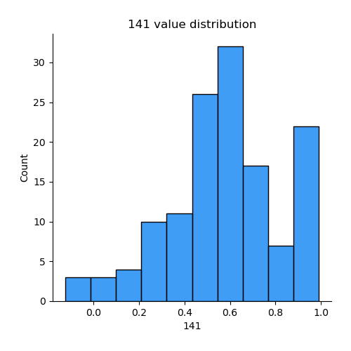
## Feature : 142
- **Feature type** : continous
- **Missing** : 0.0%
- **Unique** : 135
- **Count** :135.0
- **Mean** :0.5837344876136079
- **Std** :0.25374714026372136
- **Min** :-0.004354473695600925
- **25%th Percentile** : 0.3818440157892215
- **50%th Percentile** : 0.5870645201919723
- **75%th Percentile** : 0.7658015231754356
- **Max** :0.9879576096986159

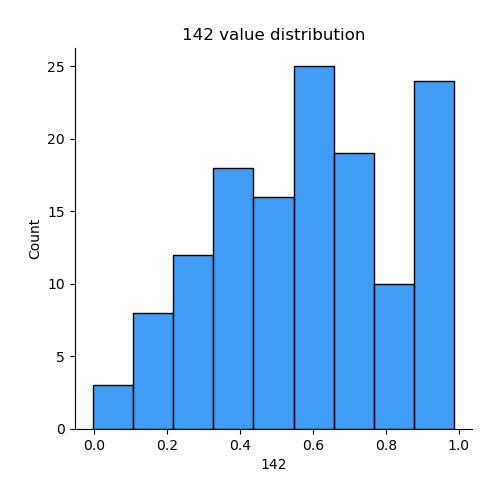
## Feature : 143
- **Feature type** : continous
- **Missing** : 0.0%
- **Unique** : 135
- **Count** :135.0
- **Mean** :0.5779349257868529
- **Std** :0.2350343265837508
- **Min** :0.07727812523643099
- **25%th Percentile** : 0.402939450552674
- **50%th Percentile** : 0.5617375164058344
- **75%th Percentile** : 0.7148668302985155
- **Max** :0.988188101685754

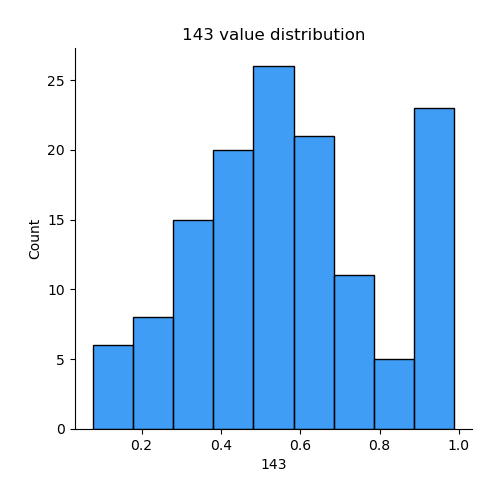
## Feature : 144
- **Feature type** : continous
- **Missing** : 0.0%
- **Unique** : 135
- **Count** :135.0
- **Mean** :0.792728149053319
- **Std** :0.1390364964300035
- **Min** :0.29004579215694215
- **25%th Percentile** : 0.7081910323938798
- **50%th Percentile** : 0.8154240067639782
- **75%th Percentile** : 0.8866087693345714
- **Max** :0.9921700324828566

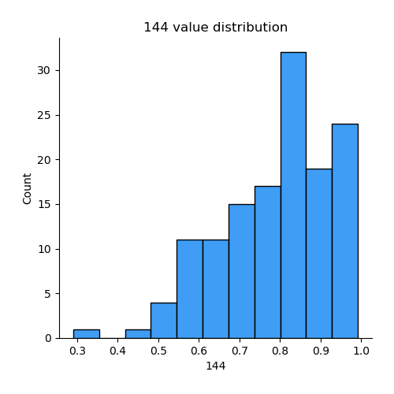
## Feature : 145
- **Feature type** : continous
- **Missing** : 0.0%
- **Unique** : 135
- **Count** :135.0
- **Mean** :0.6213866504034372
- **Std** :0.2363241099807167
- **Min** :0.04519778944332482
- **25%th Percentile** : 0.4505515563127215
- **50%th Percentile** : 0.6401287451352966
- **75%th Percentile** : 0.7688522378874509
- **Max** :0.9907677326462181

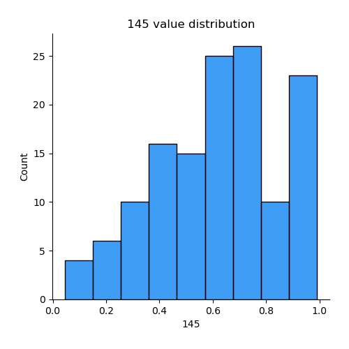
## Feature : 146
- **Feature type** : continous
- **Missing** : 0.0%
- **Unique** : 135
- **Count** :135.0
- **Mean** :0.6259931639354922
- **Std** :0.2169971656865914
- **Min** :-0.02905520846623513
- **25%th Percentile** : 0.4912200661252953
- **50%th Percentile** : 0.6081101132628276
- **75%th Percentile** : 0.7787458687827429
- **Max** :0.9885579776436955

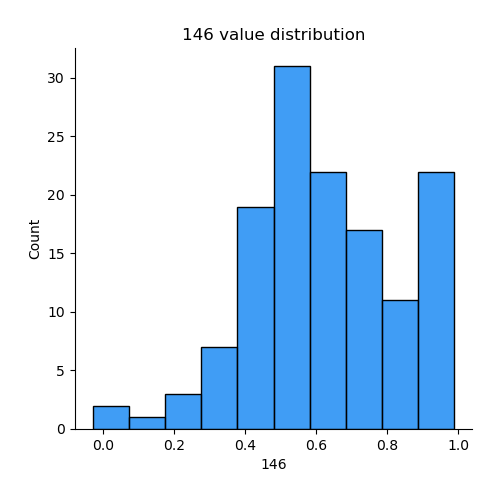
## Feature : 147
- **Feature type** : continous
- **Missing** : 0.0%
- **Unique** : 135
- **Count** :135.0
- **Mean** :0.6288688131552793
- **Std** :0.22766715683157532
- **Min** :0.045983303174193906
- **25%th Percentile** : 0.4956162252633393
- **50%th Percentile** : 0.6273031966782352
- **75%th Percentile** : 0.781198707797257
- **Max** :0.9906972181176222

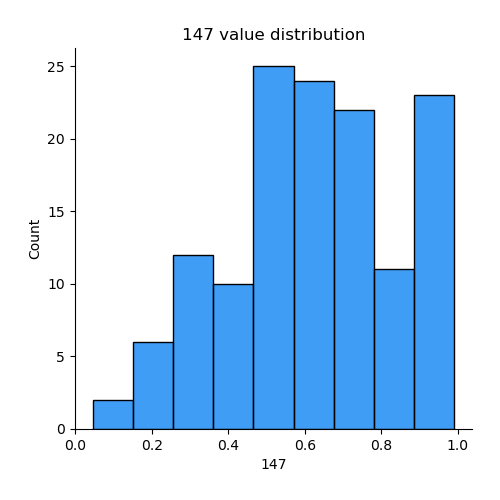
## Feature : 148
- **Feature type** : continous
- **Missing** : 0.0%
- **Unique** : 135
- **Count** :135.0
- **Mean** :0.748926172962225
- **Std** :0.16551920633376474
- **Min** :0.3350471645207099
- **25%th Percentile** : 0.6390777787041757
- **50%th Percentile** : 0.7717651961380064
- **75%th Percentile** : 0.8570387336350943
- **Max** :0.9894656706022165

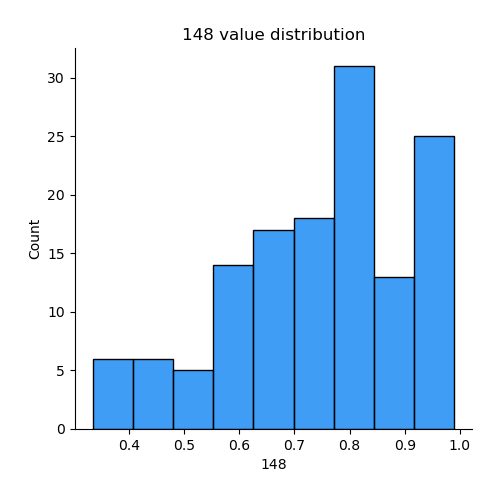
## Feature : 149
- **Feature type** : continous
- **Missing** : 0.0%
- **Unique** : 135
- **Count** :135.0
- **Mean** :0.40814723355354765
- **Std** :0.2887819718383137
- **Min** :-0.18921488700388941
- **25%th Percentile** : 0.2101760004048302
- **50%th Percentile** : 0.3398913607291278
- **75%th Percentile** : 0.5602933744720897
- **Max** :0.9823514881983816

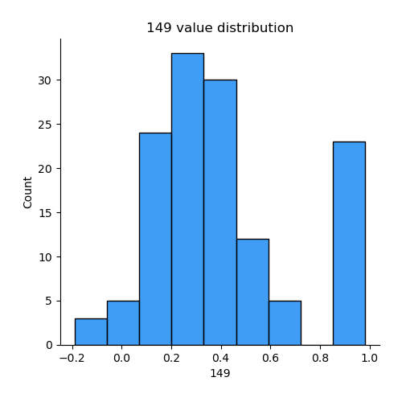
## Feature : 150
- **Feature type** : continous
- **Missing** : 0.0%
- **Unique** : 135
- **Count** :135.0
- **Mean** :0.5474219557034317
- **Std** :0.2640258991385095
- **Min** :-0.057030644534629006
- **25%th Percentile** : 0.3450418868296247
- **50%th Percentile** : 0.5308851406678482
- **75%th Percentile** : 0.7196891910218705
- **Max** :0.9878613960826663

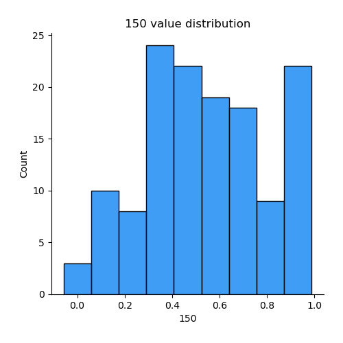
## Feature : 151
- **Feature type** : continous
- **Missing** : 0.0%
- **Unique** : 135
- **Count** :135.0
- **Mean** :0.7473529568300635
- **Std** :0.15971279873528121
- **Min** :0.3211271955951564
- **25%th Percentile** : 0.6469774986058696
- **50%th Percentile** : 0.7581929523607875
- **75%th Percentile** : 0.8670755699451103
- **Max** :0.9919459775670056

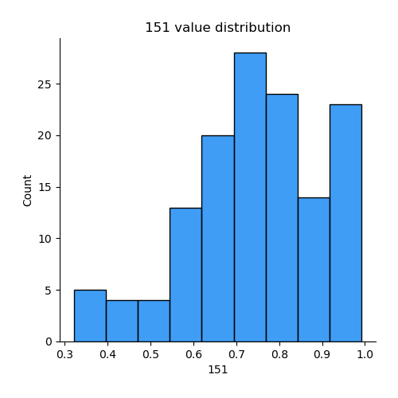
## Feature : 152
- **Feature type** : continous
- **Missing** : 0.0%
- **Unique** : 135
- **Count** :135.0
- **Mean** :0.6234781543101847
- **Std** :0.22662295978655225
- **Min** :-0.00382924720309999
- **25%th Percentile** : 0.4809885020120367
- **50%th Percentile** : 0.6225236351532796
- **75%th Percentile** : 0.7778112791998435
- **Max** :0.9887759305829511

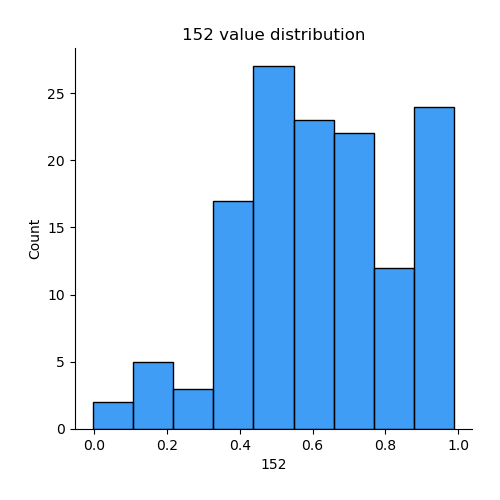
## Feature : 153
- **Feature type** : continous
- **Missing** : 0.0%
- **Unique** : 135
- **Count** :135.0
- **Mean** :0.648702768279118
- **Std** :0.20539888096162515
- **Min** :0.1788831710157083
- **25%th Percentile** : 0.506975458725342
- **50%th Percentile** : 0.6522913572997378
- **75%th Percentile** : 0.7825245931989271
- **Max** :0.9887484787660481

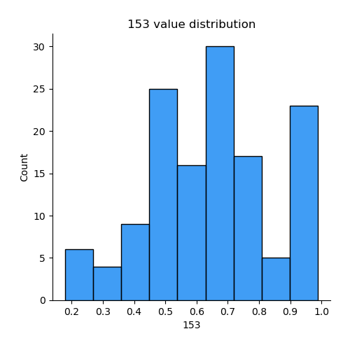
## Feature : 154
- **Feature type** : continous
- **Missing** : 0.0%
- **Unique** : 135
- **Count** :135.0
- **Mean** :0.3717196034948628
- **Std** :0.30173805046891533
- **Min** :-0.15664113263971033
- **25%th Percentile** : 0.18412166383105774
- **50%th Percentile** : 0.2983044117901418
- **75%th Percentile** : 0.5417579391509573
- **Max** :0.9803567261589063

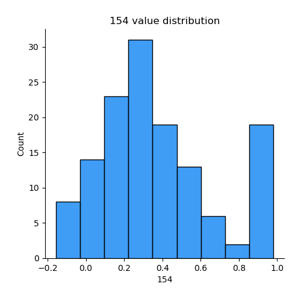
## Feature : 155
- **Feature type** : continous
- **Missing** : 0.0%
- **Unique** : 135
- **Count** :135.0
- **Mean** :0.5385609437309208
- **Std** :0.2444527481405475
- **Min** :0.03347622692458123
- **25%th Percentile** : 0.36581134121042863
- **50%th Percentile** : 0.4876190513768353
- **75%th Percentile** : 0.6988512573769741
- **Max** :0.9871945307841579

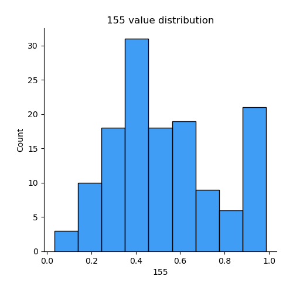
## Feature : 159
- **Feature type** : continous
- **Missing** : 0.0%
- **Unique** : 3
- **Count** :135.0
- **Mean** :1.0
- **Std** :9.098694542933101e-17
- **Min** :0.9999999999999998
- **25%th Percentile** : 1.0
- **50%th Percentile** : 1.0
- **75%th Percentile** : 1.0
- **Max** :1.0

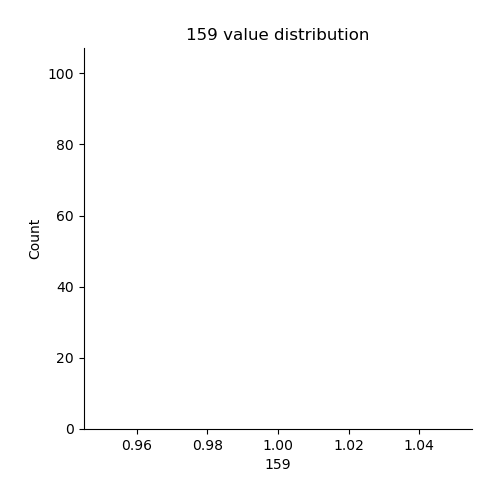
## Feature : 160
- **Feature type** : continous
- **Missing** : 0.0%
- **Unique** : 135
- **Count** :135.0
- **Mean** :0.5701522931963127
- **Std** :0.2414070373534579
- **Min** :0.05263776872535523
- **25%th Percentile** : 0.39489255336385476
- **50%th Percentile** : 0.5672029486122182
- **75%th Percentile** : 0.7406740863139414
- **Max** :0.9887999687795485

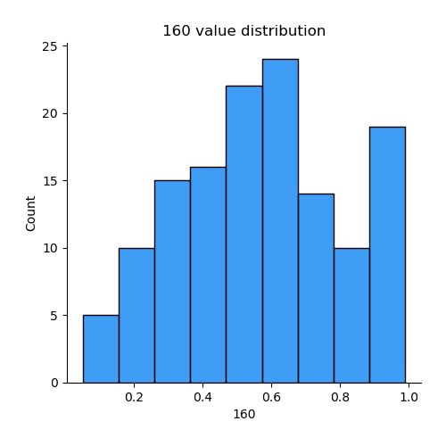
## Feature : 161
- **Feature type** : continous
- **Missing** : 0.0%
- **Unique** : 135
- **Count** :135.0
- **Mean** :0.40398394379056046
- **Std** :0.2972085064991329
- **Min** :-0.2563356021755387
- **25%th Percentile** : 0.21265397140922415
- **50%th Percentile** : 0.3642134364386383
- **75%th Percentile** : 0.5650226862602332
- **Max** :0.9828011009621103

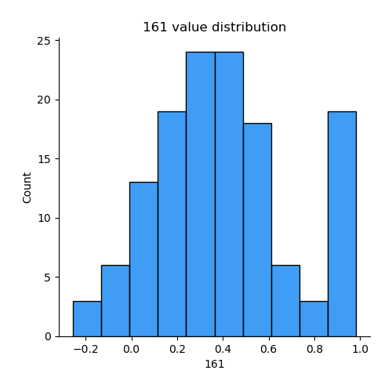
## Feature : 162
- **Feature type** : continous
- **Missing** : 0.0%
- **Unique** : 135
- **Count** :135.0
- **Mean** :0.5538945545386559
- **Std** :0.24967727761118033
- **Min** :-0.09176357035192588
- **25%th Percentile** : 0.4097671401696532
- **50%th Percentile** : 0.5447062421909261
- **75%th Percentile** : 0.7045260505795028
- **Max** :0.9884416019157303

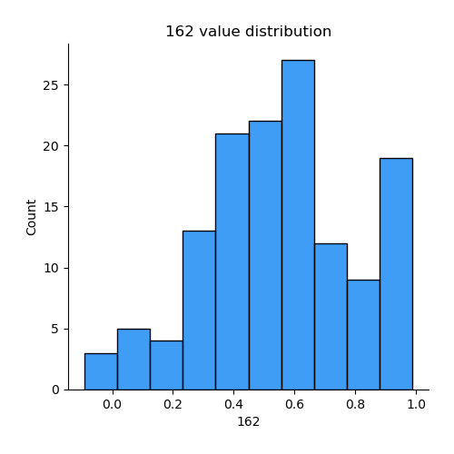
## Feature : 163
- **Feature type** : continous
- **Missing** : 0.0%
- **Unique** : 135
- **Count** :135.0
- **Mean** :0.4758513278389628
- **Std** :0.2747953576526672
- **Min** :-0.38353954206598756
- **25%th Percentile** : 0.30225070287138034
- **50%th Percentile** : 0.45282248134193626
- **75%th Percentile** : 0.6479361372956958
- **Max** :0.988621880777889

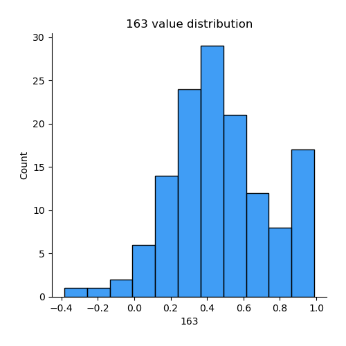
## Feature : 164
- **Feature type** : continous
- **Missing** : 0.0%
- **Unique** : 135
- **Count** :135.0
- **Mean** :0.4170032244084155
- **Std** :0.2873694101377186
- **Min** :-0.20581282726841016
- **25%th Percentile** : 0.20817040885058952
- **50%th Percentile** : 0.35971882196539695
- **75%th Percentile** : 0.602556200376587
- **Max** :0.9706192058007818

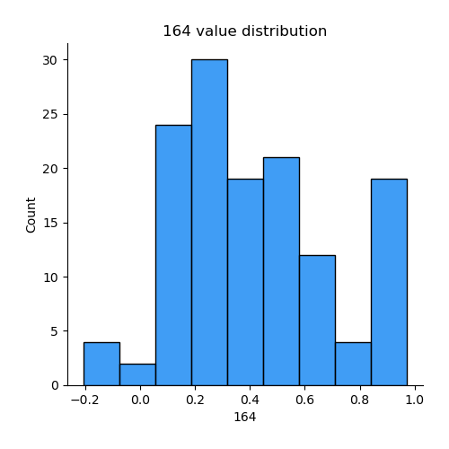
## Feature : 165
- **Feature type** : continous
- **Missing** : 0.0%
- **Unique** : 135
- **Count** :135.0
- **Mean** :0.4197433302323031
- **Std** :0.28221992321837014
- **Min** :-0.17683124132793188
- **25%th Percentile** : 0.21929157901523505
- **50%th Percentile** : 0.35809022267286716
- **75%th Percentile** : 0.5863365310158997
- **Max** :0.9791263232584602

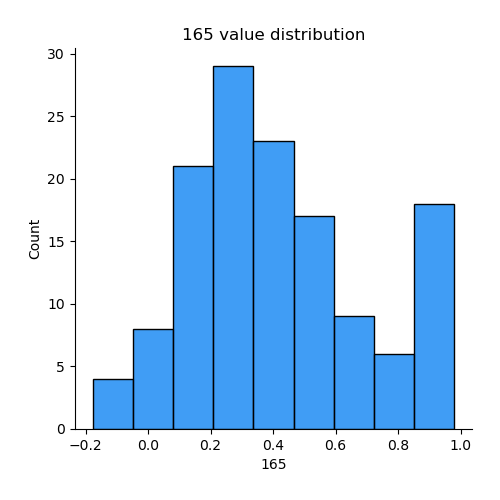
## Feature : 166
- **Feature type** : continous
- **Missing** : 0.0%
- **Unique** : 135
- **Count** :135.0
- **Mean** :0.4357946901158568
- **Std** :0.2920738511482397
- **Min** :-0.22401794194865868
- **25%th Percentile** : 0.2059277798670931
- **50%th Percentile** : 0.42712693401007135
- **75%th Percentile** : 0.6064628926577216
- **Max** :0.9807341512072647

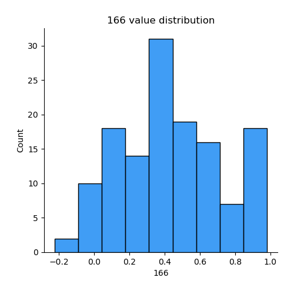
## Feature : 167
- **Feature type** : continous
- **Missing** : 0.0%
- **Unique** : 135
- **Count** :135.0
- **Mean** :0.5053986805481984
- **Std** :0.25434243959875374
- **Min** :-0.025924657332892568
- **25%th Percentile** : 0.32998826318765356
- **50%th Percentile** : 0.4873786275306512
- **75%th Percentile** : 0.6659397405809144
- **Max** :0.9892151161531892

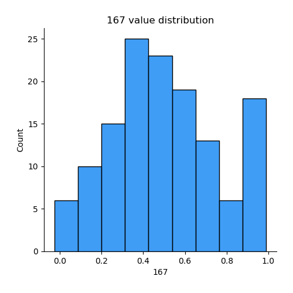
## Feature : 168
- **Feature type** : continous
- **Missing** : 0.0%
- **Unique** : 135
- **Count** :135.0
- **Mean** :0.32830269184707905
- **Std** :0.33881739129792676
- **Min** :-0.5927971055726937
- **25%th Percentile** : 0.08925705212118323
- **50%th Percentile** : 0.2934520467871248
- **75%th Percentile** : 0.5258555779438175
- **Max** :0.9821153163273

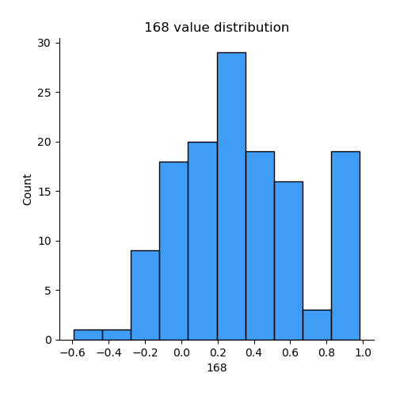
## Feature : 169
- **Feature type** : continous
- **Missing** : 0.0%
- **Unique** : 135
- **Count** :135.0
- **Mean** :0.5103480077515937
- **Std** :0.28937983444946414
- **Min** :-0.34993463154834203
- **25%th Percentile** : 0.32434318703474074
- **50%th Percentile** : 0.5099466058970584
- **75%th Percentile** : 0.6884894280895497
- **Max** :0.9907560243386707

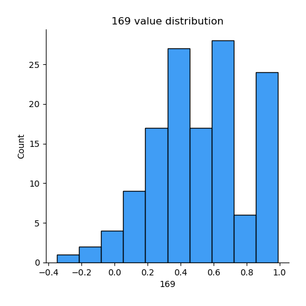
## Feature : 170
- **Feature type** : continous
- **Missing** : 0.0%
- **Unique** : 135
- **Count** :135.0
- **Mean** :0.40462173821242337
- **Std** :0.2894402559344844
- **Min** :-0.27349716404884244
- **25%th Percentile** : 0.202071293177794
- **50%th Percentile** : 0.3612287664645373
- **75%th Percentile** : 0.5939755091849759
- **Max** :0.9765874240344884

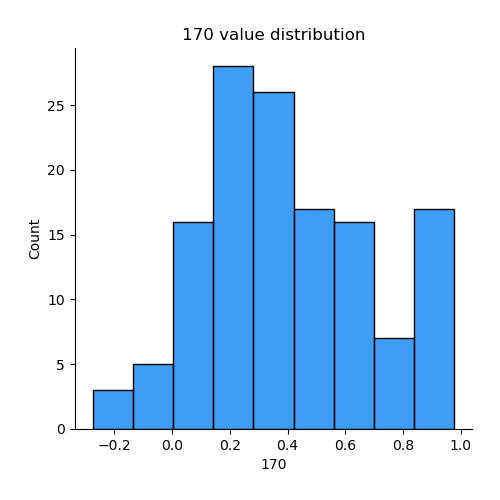
## Feature : 171
- **Feature type** : continous
- **Missing** : 0.0%
- **Unique** : 135
- **Count** :135.0
- **Mean** :0.3780977316635535
- **Std** :0.31518335088336336
- **Min** :-0.27123040461476616
- **25%th Percentile** : 0.14566628184096475
- **50%th Percentile** : 0.35286272931590723
- **75%th Percentile** : 0.5521732533127326
- **Max** :0.9885786140925317

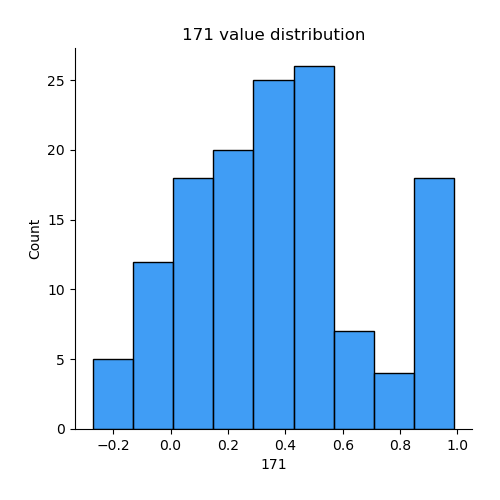
## Feature : 172
- **Feature type** : continous
- **Missing** : 0.0%
- **Unique** : 135
- **Count** :135.0
- **Mean** :0.42062148058895626
- **Std** :0.29498178101231287
- **Min** :-0.291819013633928
- **25%th Percentile** : 0.21751195181768884
- **50%th Percentile** : 0.40109140136128996
- **75%th Percentile** : 0.6028186226450624
- **Max** :0.9861504764843887

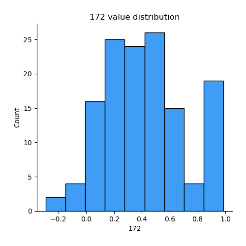
## Feature : 173
- **Feature type** : continous
- **Missing** : 0.0%
- **Unique** : 135
- **Count** :135.0
- **Mean** :0.39287930429093826
- **Std** :0.30530834353612163
- **Min** :-0.21443107527815136
- **25%th Percentile** : 0.1666014985857734
- **50%th Percentile** : 0.34838981864332325
- **75%th Percentile** : 0.5733591404487841
- **Max** :0.9880393899758635

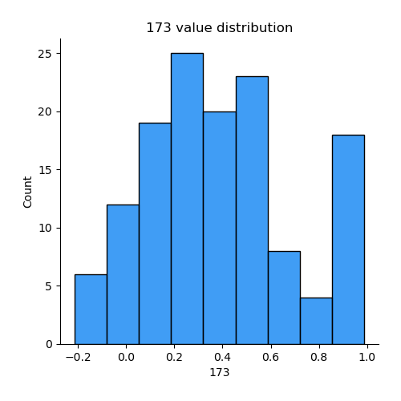
## Feature : 174
- **Feature type** : continous
- **Missing** : 0.0%
- **Unique** : 135
- **Count** :135.0
- **Mean** :0.42203143899571394
- **Std** :0.2873262968022516
- **Min** :-0.38302242483603277
- **25%th Percentile** : 0.22025961964200502
- **50%th Percentile** : 0.3712244799875178
- **75%th Percentile** : 0.61049374570015
- **Max** :0.9757485328121805

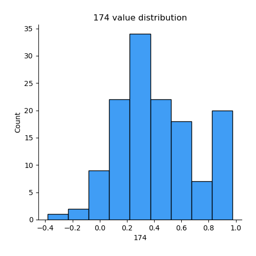
## Feature : 175
- **Feature type** : continous
- **Missing** : 0.0%
- **Unique** : 135
- **Count** :135.0
- **Mean** :0.3090608646182143
- **Std** :0.33651367391230586
- **Min** :-0.4836805661104367
- **25%th Percentile** : 0.09287920102969632
- **50%th Percentile** : 0.2477018970056132
- **75%th Percentile** : 0.4581558818536038
- **Max** :0.9864687176897763

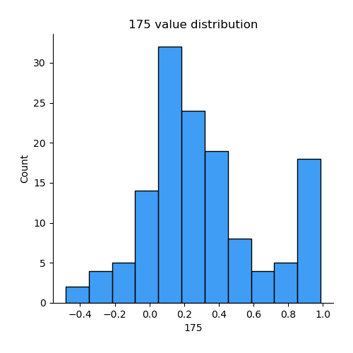
## Feature : 176
- **Feature type** : continous
- **Missing** : 0.0%
- **Unique** : 135
- **Count** :135.0
- **Mean** :0.38761326614282776
- **Std** :0.2972575185660936
- **Min** :-0.1698900738260923
- **25%th Percentile** : 0.19032855562152418
- **50%th Percentile** : 0.3282787946076381
- **75%th Percentile** : 0.5424179852188209
- **Max** :0.9857843816404567

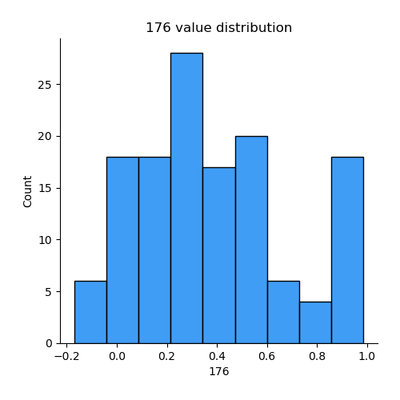
## Feature : 177
- **Feature type** : continous
- **Missing** : 0.0%
- **Unique** : 135
- **Count** :135.0
- **Mean** :0.3880083578070678
- **Std** :0.30898390844718904
- **Min** :-0.31758838172381554
- **25%th Percentile** : 0.16418235531087788
- **50%th Percentile** : 0.34059917196000966
- **75%th Percentile** : 0.5669526362890992
- **Max** :0.9816257040572187

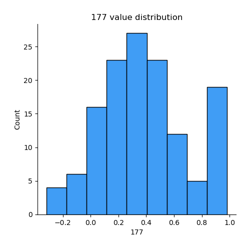
## Feature : 178
- **Feature type** : continous
- **Missing** : 0.0%
- **Unique** : 135
- **Count** :135.0
- **Mean** :0.5010290238880325
- **Std** :0.26107015212969786
- **Min** :-0.11994099306332526
- **25%th Percentile** : 0.3251015524813766
- **50%th Percentile** : 0.48590447095495926
- **75%th Percentile** : 0.6753277905528077
- **Max** :0.9917777525573922

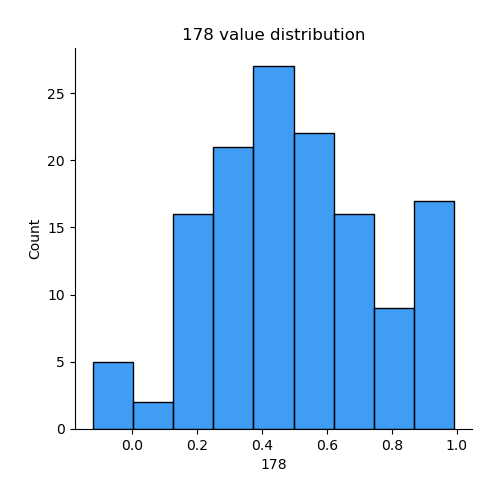
## Feature : 179
- **Feature type** : continous
- **Missing** : 0.0%
- **Unique** : 135
- **Count** :135.0
- **Mean** :0.42421064738671793
- **Std** :0.29137553608997896
- **Min** :-0.4249533912183734
- **25%th Percentile** : 0.21290284695440118
- **50%th Percentile** : 0.396009547762668
- **75%th Percentile** : 0.5804742308369778
- **Max** :0.9863953405248304

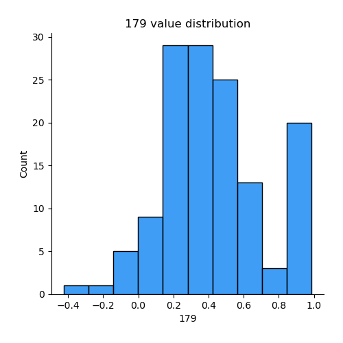
## Feature : 180
- **Feature type** : continous
- **Missing** : 0.0%
- **Unique** : 135
- **Count** :135.0
- **Mean** :0.6161907162882878
- **Std** :0.26232098123566155
- **Min** :-0.09384666965233919
- **25%th Percentile** : 0.45656312525991627
- **50%th Percentile** : 0.6579207895789306
- **75%th Percentile** : 0.8107800339934736
- **Max** :0.9923835452395582

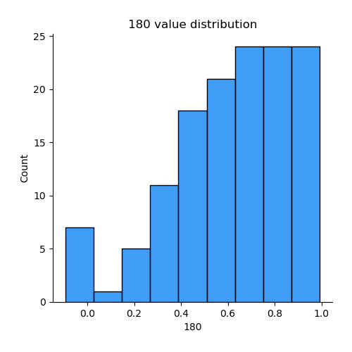
## Feature : 181
- **Feature type** : continous
- **Missing** : 0.0%
- **Unique** : 135
- **Count** :135.0
- **Mean** :0.44576037844991523
- **Std** :0.28776051424358917
- **Min** :-0.39101461836833995
- **25%th Percentile** : 0.27567839917127046
- **50%th Percentile** : 0.4266087847418249
- **75%th Percentile** : 0.6177571200953168
- **Max** :0.9876622504204873

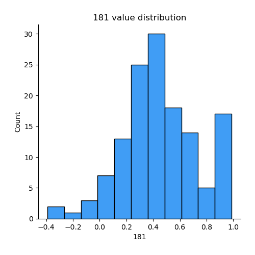
## Feature : 182
- **Feature type** : continous
- **Missing** : 0.0%
- **Unique** : 135
- **Count** :135.0
- **Mean** :0.35531103659470015
- **Std** :0.3188247532485356
- **Min** :-0.36157792260790234
- **25%th Percentile** : 0.14876547010859587
- **50%th Percentile** : 0.2917809785906047
- **75%th Percentile** : 0.545890979020154
- **Max** :0.9800670308235301

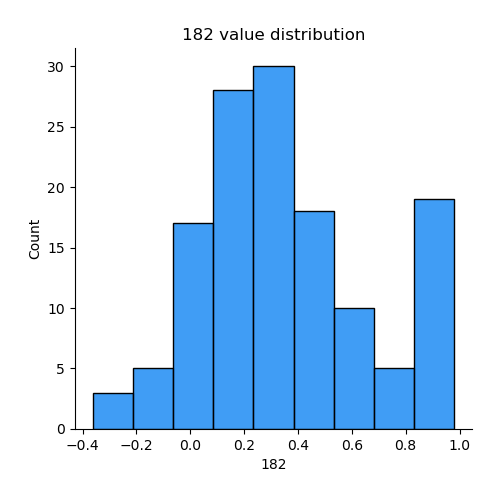
## Feature : 183
- **Feature type** : continous
- **Missing** : 0.0%
- **Unique** : 135
- **Count** :135.0
- **Mean** :0.3926989941285548
- **Std** :0.29082257335071765
- **Min** :-0.3624061576763225
- **25%th Percentile** : 0.2043693289465099
- **50%th Percentile** : 0.35226581937749496
- **75%th Percentile** : 0.5522335024693441
- **Max** :0.983013362570253

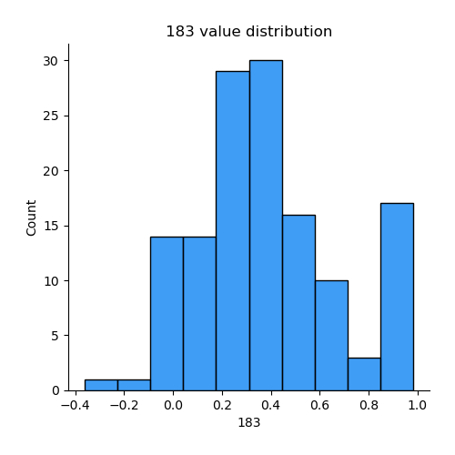
## Feature : 184
- **Feature type** : continous
- **Missing** : 0.0%
- **Unique** : 135
- **Count** :135.0
- **Mean** :0.407587319648738
- **Std** :0.29153576960366495
- **Min** :-0.17653954134065736
- **25%th Percentile** : 0.20950937229790745
- **50%th Percentile** : 0.351857745208878
- **75%th Percentile** : 0.5956551524392336
- **Max** :0.9791419452690536

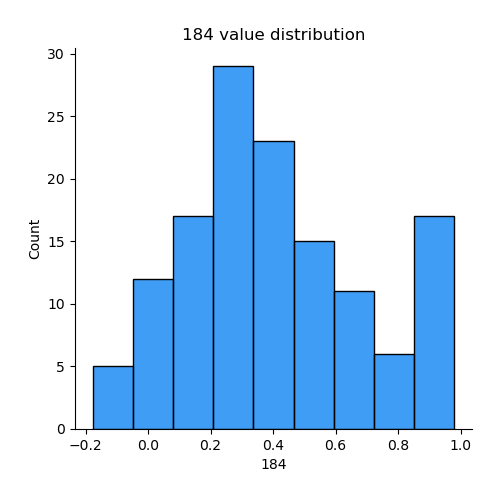
## Feature : 185
- **Feature type** : continous
- **Missing** : 0.0%
- **Unique** : 135
- **Count** :135.0
- **Mean** :0.624701596139371
- **Std** :0.2638993524217246
- **Min** :-0.08189835760921581
- **25%th Percentile** : 0.4168603183852997
- **50%th Percentile** : 0.6658752862651454
- **75%th Percentile** : 0.8351175082030158
- **Max** :0.9926065662459886

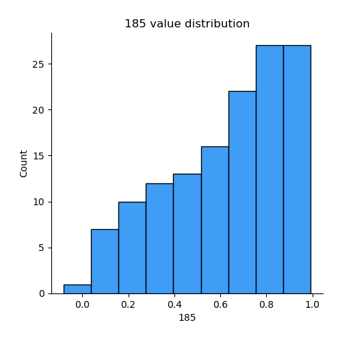
## Feature : 186
- **Feature type** : continous
- **Missing** : 0.0%
- **Unique** : 135
- **Count** :135.0
- **Mean** :0.5300721795375329
- **Std** :0.27333240535428327
- **Min** :-0.18118910042497005
- **25%th Percentile** : 0.36920515825724776
- **50%th Percentile** : 0.5286424055876033
- **75%th Percentile** : 0.7271766064990426
- **Max** :0.9869245621260923

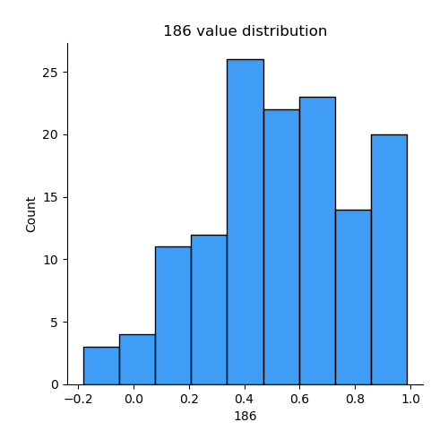
## Feature : 187
- **Feature type** : continous
- **Missing** : 0.0%
- **Unique** : 135
- **Count** :135.0
- **Mean** :0.38153722186791816
- **Std** :0.3132271767846256
- **Min** :-0.37564966945867273
- **25%th Percentile** : 0.15577973449061183
- **50%th Percentile** : 0.3551859202481975
- **75%th Percentile** : 0.5531422712289171
- **Max** :0.9786656893085814

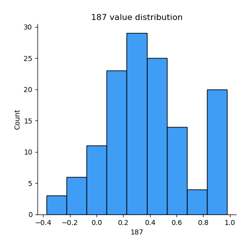
## Feature : 188
- **Feature type** : continous
- **Missing** : 0.0%
- **Unique** : 135
- **Count** :135.0
- **Mean** :0.5414976514316752
- **Std** :0.27773440246928244
- **Min** :-0.18428099165502598
- **25%th Percentile** : 0.3545523005330531
- **50%th Percentile** : 0.5570266391577628
- **75%th Percentile** : 0.7397443450466756
- **Max** :0.9880135648094105

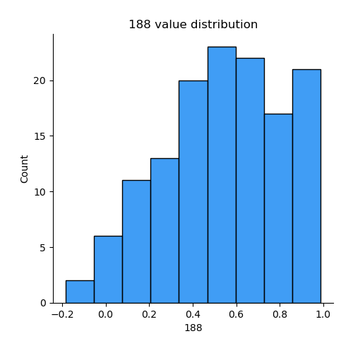
## Feature : 189
- **Feature type** : continous
- **Missing** : 0.0%
- **Unique** : 135
- **Count** :135.0
- **Mean** :0.44876520373920875
- **Std** :0.29101482623816344
- **Min** :-0.23193343771286865
- **25%th Percentile** : 0.2651130452917231
- **50%th Percentile** : 0.4125300610046373
- **75%th Percentile** : 0.6508798313799441
- **Max** :0.9861828403138058

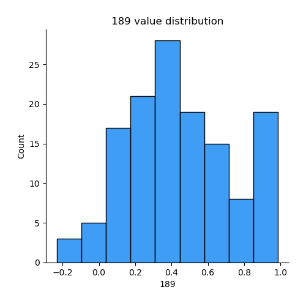
## Feature : 190
- **Feature type** : continous
- **Missing** : 0.0%
- **Unique** : 135
- **Count** :135.0
- **Mean** :0.42318208260005663
- **Std** :0.2972246918069886
- **Min** :-0.27870902507307954
- **25%th Percentile** : 0.21455038941777438
- **50%th Percentile** : 0.3952629272297718
- **75%th Percentile** : 0.620852843895171
- **Max** :0.9725341556648477

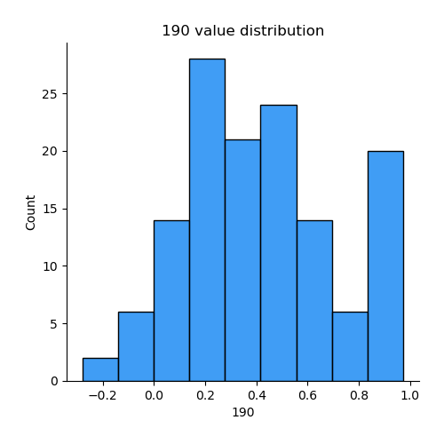
## Feature : 191
- **Feature type** : continous
- **Missing** : 0.0%
- **Unique** : 135
- **Count** :135.0
- **Mean** :0.40688950383865596
- **Std** :0.29773066406661286
- **Min** :-0.4191118922415347
- **25%th Percentile** : 0.2223850450299878
- **50%th Percentile** : 0.36923872740234137
- **75%th Percentile** : 0.5665934825975425
- **Max** :0.9713626701119802

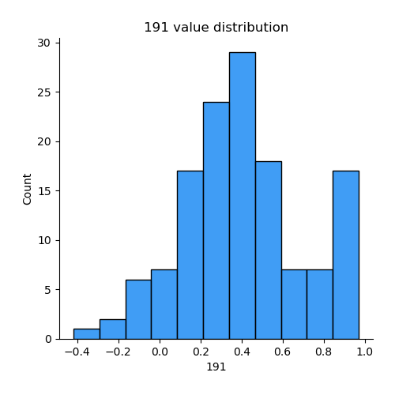
## Feature : 192
- **Feature type** : continous
- **Missing** : 0.0%
- **Unique** : 135
- **Count** :135.0
- **Mean** :0.4217657297629332
- **Std** :0.30064690591535503
- **Min** :-0.33925961611180894
- **25%th Percentile** : 0.1854474784057548
- **50%th Percentile** : 0.3894760340585268
- **75%th Percentile** : 0.6244921523320497
- **Max** :0.9823924229595252

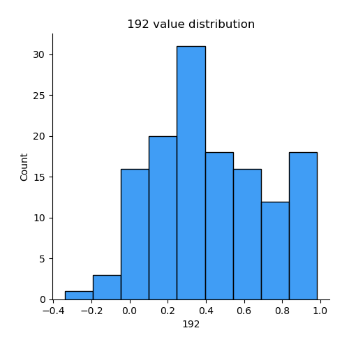
## Feature : 193
- **Feature type** : continous
- **Missing** : 0.0%
- **Unique** : 135
- **Count** :135.0
- **Mean** :0.46503236020927957
- **Std** :0.29245915893493374
- **Min** :-0.20184900490343882
- **25%th Percentile** : 0.25526949990438363
- **50%th Percentile** : 0.4621549506493453
- **75%th Percentile** : 0.6470407677097023
- **Max** :0.9889762328811491

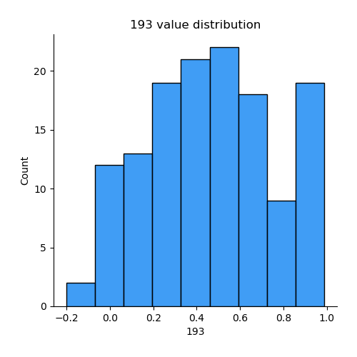
## Feature : 194
- **Feature type** : continous
- **Missing** : 0.0%
- **Unique** : 135
- **Count** :135.0
- **Mean** :0.31862517659363104
- **Std** :0.34219227307550437
- **Min** :-0.5327220526258751
- **25%th Percentile** : 0.08870066092785402
- **50%th Percentile** : 0.2601541650890756
- **75%th Percentile** : 0.5199210325119361
- **Max** :0.9804886158866163

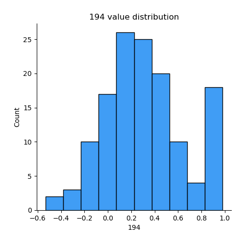
## Feature : 195
- **Feature type** : continous
- **Missing** : 0.0%
- **Unique** : 135
- **Count** :135.0
- **Mean** :0.47967105743811783
- **Std** :0.3014611286170942
- **Min** :-0.3475600046161666
- **25%th Percentile** : 0.2529176313316267
- **50%th Percentile** : 0.4718113220128097
- **75%th Percentile** : 0.7104441591724581
- **Max** :0.9876557338805229

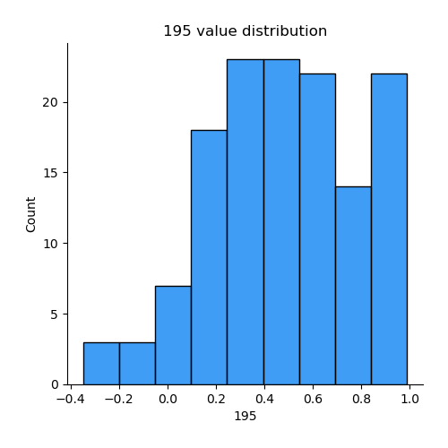
## Feature : 196
- **Feature type** : continous
- **Missing** : 0.0%
- **Unique** : 135
- **Count** :135.0
- **Mean** :0.3975199309766145
- **Std** :0.30577983797375763
- **Min** :-0.3700960961713569
- **25%th Percentile** : 0.19142943433632448
- **50%th Percentile** : 0.34226628703336165
- **75%th Percentile** : 0.6135413185754741
- **Max** :0.9751790746372081

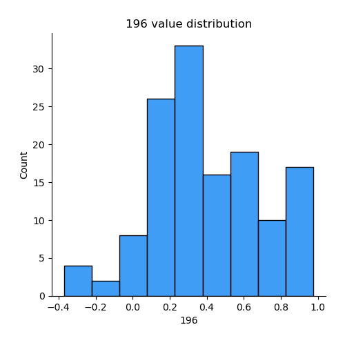
## Feature : 197
- **Feature type** : continous
- **Missing** : 0.0%
- **Unique** : 135
- **Count** :135.0
- **Mean** :0.3575471410966822
- **Std** :0.3217824541686873
- **Min** :-0.24855443133159358
- **25%th Percentile** : 0.12794732418421534
- **50%th Percentile** : 0.3206757209265122
- **75%th Percentile** : 0.5445204778253963
- **Max** :0.9870738455125783

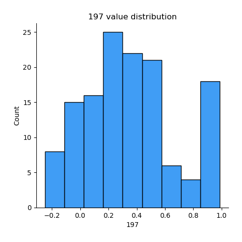
## Feature : 198
- **Feature type** : continous
- **Missing** : 0.0%
- **Unique** : 135
- **Count** :135.0
- **Mean** :0.4085577863117255
- **Std** :0.2980825089759522
- **Min** :-0.4256709871839551
- **25%th Percentile** : 0.1859079878815203
- **50%th Percentile** : 0.37916915836652326
- **75%th Percentile** : 0.5915459010270836
- **Max** :0.985243726903342

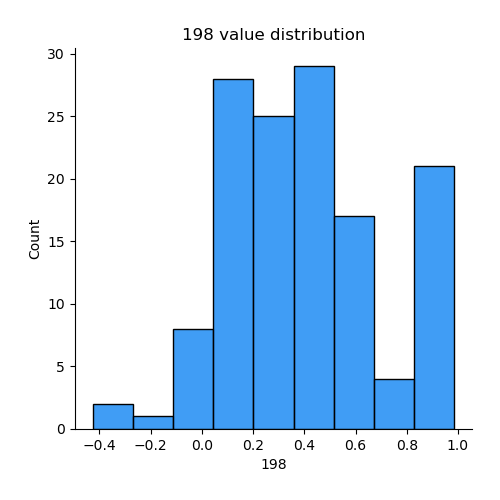
## Feature : 199
- **Feature type** : continous
- **Missing** : 0.0%
- **Unique** : 135
- **Count** :135.0
- **Mean** :0.36365462969619605
- **Std** :0.31917759675169594
- **Min** :-0.37999144356145914
- **25%th Percentile** : 0.14124334359376356
- **50%th Percentile** : 0.32783955645207574
- **75%th Percentile** : 0.5507426455338875
- **Max** :0.9879006195345229

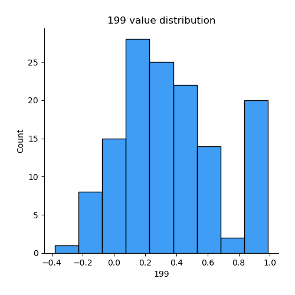
## Feature : 200
- **Feature type** : continous
- **Missing** : 0.0%
- **Unique** : 135
- **Count** :135.0
- **Mean** :0.41111674296125855
- **Std** :0.2933134529469005
- **Min** :-0.352984851051196
- **25%th Percentile** : 0.20971769747550428
- **50%th Percentile** : 0.35404721545775014
- **75%th Percentile** : 0.5683692087982478
- **Max** :0.9752965472539598

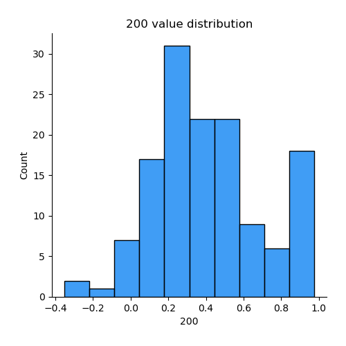
## Feature : 201
- **Feature type** : continous
- **Missing** : 0.0%
- **Unique** : 135
- **Count** :135.0
- **Mean** :0.2953506200451721
- **Std** :0.3378938758948887
- **Min** :-0.37365783339596464
- **25%th Percentile** : 0.07359002006422607
- **50%th Percentile** : 0.22321765600113103
- **75%th Percentile** : 0.4907401208083656
- **Max** :0.9833073753120724

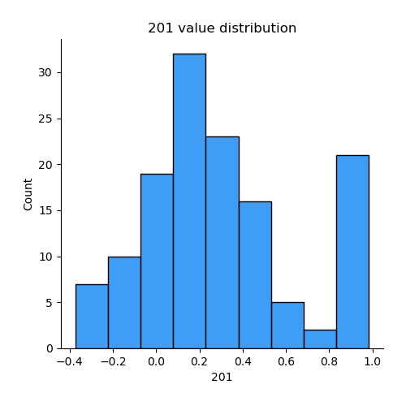
## Feature : 202
- **Feature type** : continous
- **Missing** : 0.0%
- **Unique** : 135
- **Count** :135.0
- **Mean** :0.38841862417573036
- **Std** :0.30543026939654755
- **Min** :-0.3016419763455971
- **25%th Percentile** : 0.20062326410781228
- **50%th Percentile** : 0.353303048720489
- **75%th Percentile** : 0.5640643895353271
- **Max** :0.985314603351108

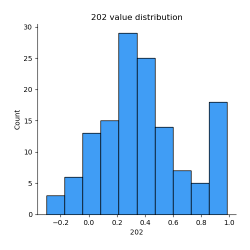
## Feature : 203
- **Feature type** : continous
- **Missing** : 0.0%
- **Unique** : 135
- **Count** :135.0
- **Mean** :0.37809254562833083
- **Std** :0.30968134411676307
- **Min** :-0.31136738039846656
- **25%th Percentile** : 0.16414652358788007
- **50%th Percentile** : 0.36202443820727803
- **75%th Percentile** : 0.5416283936437496
- **Max** :0.9760625320450117

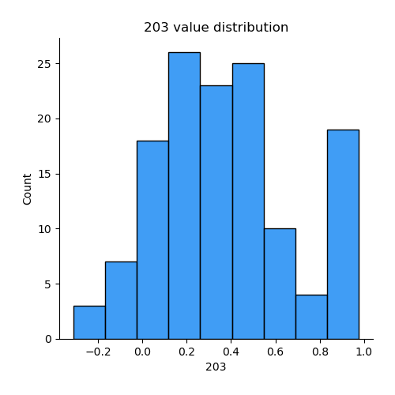
## Feature : 204
- **Feature type** : continous
- **Missing** : 0.0%
- **Unique** : 135
- **Count** :135.0
- **Mean** :0.4660954182642297
- **Std** :0.2752810988657362
- **Min** :-0.07419245258965548
- **25%th Percentile** : 0.24846239883397078
- **50%th Percentile** : 0.4567283178563403
- **75%th Percentile** : 0.6452055329084592
- **Max** :0.9924971085152061

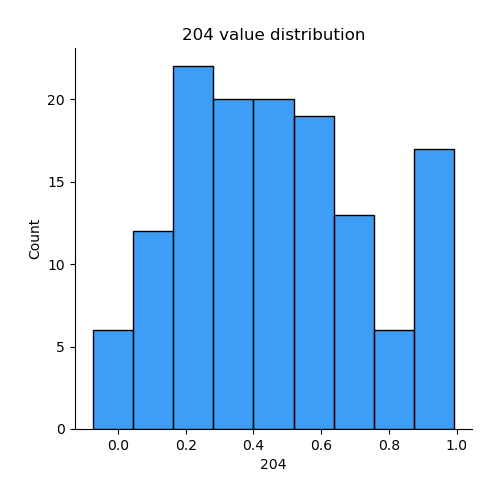
## Feature : 205
- **Feature type** : continous
- **Missing** : 0.0%
- **Unique** : 135
- **Count** :135.0
- **Mean** :0.3819175679148892
- **Std** :0.3096478690169989
- **Min** :-0.5322781540454304
- **25%th Percentile** : 0.16751656674053106
- **50%th Percentile** : 0.32565854407129746
- **75%th Percentile** : 0.5949132687040439
- **Max** :0.9824086670998999

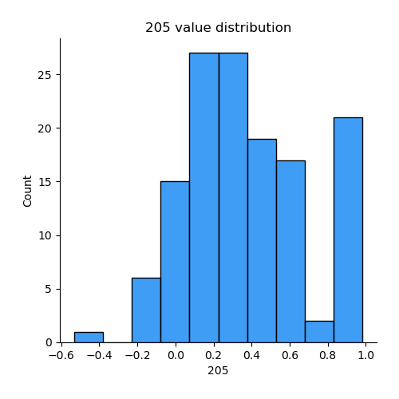
## Feature : 206
- **Feature type** : continous
- **Missing** : 0.0%
- **Unique** : 135
- **Count** :135.0
- **Mean** :0.54206139244021
- **Std** :0.2989488624087722
- **Min** :-0.5048339533292984
- **25%th Percentile** : 0.358715127625998
- **50%th Percentile** : 0.5628073355460176
- **75%th Percentile** : 0.7757239262935804
- **Max** :0.9928052740394089

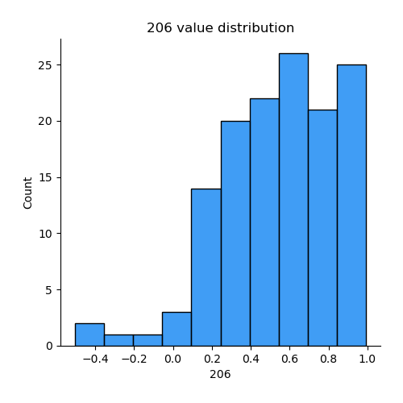
## Feature : 207
- **Feature type** : continous
- **Missing** : 0.0%
- **Unique** : 135
- **Count** :135.0
- **Mean** :0.4009969569797357
- **Std** :0.2886705060911978
- **Min** :-0.2807105018252816
- **25%th Percentile** : 0.19243906695498986
- **50%th Percentile** : 0.33869604340996806
- **75%th Percentile** : 0.5921648850311403
- **Max** :0.9778338624423139

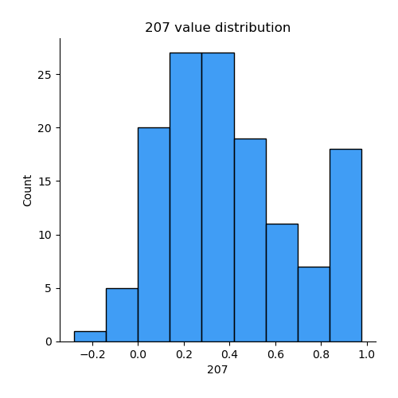
## Feature : 212
- **Feature type** : continous
- **Missing** : 0.0%
- **Unique** : 3
- **Count** :135.0
- **Mean** :1.0
- **Std** :7.732403503772677e-17
- **Min** :0.9999999999999998
- **25%th Percentile** : 1.0
- **50%th Percentile** : 1.0
- **75%th Percentile** : 1.0
- **Max** :1.0

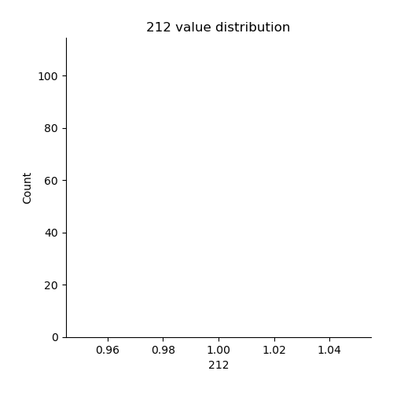
## Feature : 213
- **Feature type** : continous
- **Missing** : 0.0%
- **Unique** : 135
- **Count** :135.0
- **Mean** :0.6705297865018142
- **Std** :0.20824630389169313
- **Min** :0.13620352073459338
- **25%th Percentile** : 0.5283542754309347
- **50%th Percentile** : 0.6814991247416405
- **75%th Percentile** : 0.8318209091621438
- **Max** :0.9908208229689459

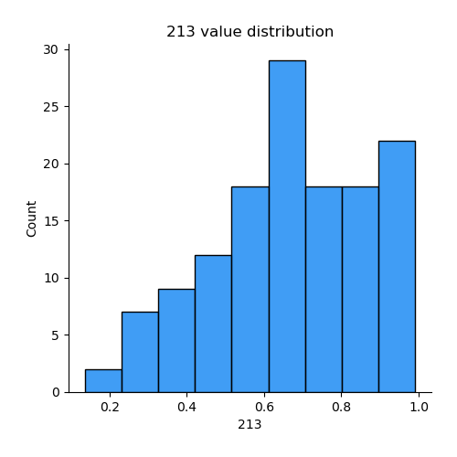
## Feature : 214
- **Feature type** : continous
- **Missing** : 0.0%
- **Unique** : 135
- **Count** :135.0
- **Mean** :0.8184880848048464
- **Std** :0.11961925880048593
- **Min** :0.48184268510129596
- **25%th Percentile** : 0.7464484783257088
- **50%th Percentile** : 0.826297466294047
- **75%th Percentile** : 0.905359050573858
- **Max** :0.9959425912516902

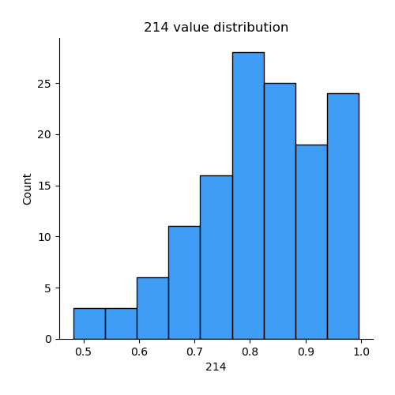
## Feature : 215
- **Feature type** : continous
- **Missing** : 0.0%
- **Unique** : 135
- **Count** :135.0
- **Mean** :0.6291290484922614
- **Std** :0.21869611537557138
- **Min** :0.02886383158354503
- **25%th Percentile** : 0.48150268733234947
- **50%th Percentile** : 0.6175440800652897
- **75%th Percentile** : 0.7674661139106335
- **Max** :0.9917711865862138

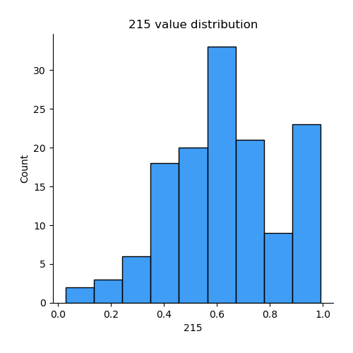
## Feature : 216
- **Feature type** : continous
- **Missing** : 0.0%
- **Unique** : 135
- **Count** :135.0
- **Mean** :0.6360666959331943
- **Std** :0.2163536294645916
- **Min** :0.08794746126759664
- **25%th Percentile** : 0.4819680659535698
- **50%th Percentile** : 0.6299704634203337
- **75%th Percentile** : 0.7915396390644462
- **Max** :0.9863053692240201

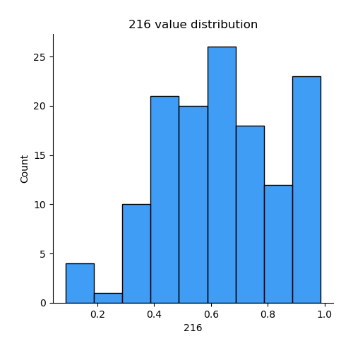
## Feature : 217
- **Feature type** : continous
- **Missing** : 0.0%
- **Unique** : 135
- **Count** :135.0
- **Mean** :0.8164761291920221
- **Std** :0.13308940363774655
- **Min** :0.4268273439505077
- **25%th Percentile** : 0.7375972151032326
- **50%th Percentile** : 0.8419093220673782
- **75%th Percentile** : 0.9127786619249338
- **Max** :0.9966351232576708

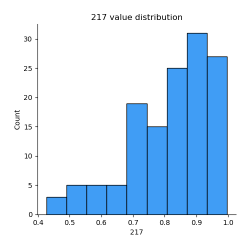
## Feature : 218
- **Feature type** : continous
- **Missing** : 0.0%
- **Unique** : 135
- **Count** :135.0
- **Mean** :0.8053254929559458
- **Std** :0.1274286543202801
- **Min** :0.46706008234180135
- **25%th Percentile** : 0.7141765325908309
- **50%th Percentile** : 0.812031206900242
- **75%th Percentile** : 0.8989020274150226
- **Max** :0.9942759820111057

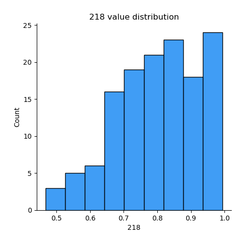
## Feature : 219
- **Feature type** : continous
- **Missing** : 0.0%
- **Unique** : 135
- **Count** :135.0
- **Mean** :0.712652969452375
- **Std** :0.18321333677324528
- **Min** :0.17251495767025712
- **25%th Percentile** : 0.5921433665806968
- **50%th Percentile** : 0.723350123180597
- **75%th Percentile** : 0.8271938371308782
- **Max** :0.9930832562248736

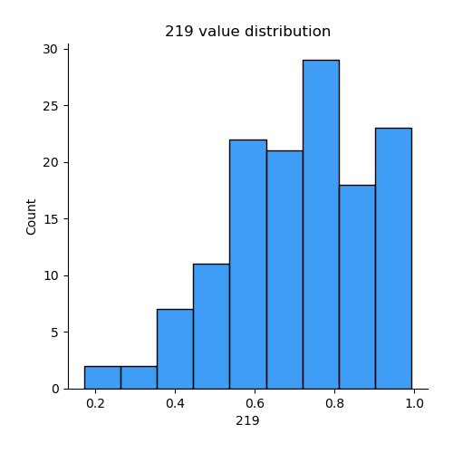
## Feature : 220
- **Feature type** : continous
- **Missing** : 0.0%
- **Unique** : 135
- **Count** :135.0
- **Mean** :0.5110165846914171
- **Std** :0.31248232561818146
- **Min** :-0.2997919299392553
- **25%th Percentile** : 0.2627449287390116
- **50%th Percentile** : 0.5203708391847883
- **75%th Percentile** : 0.7254739308599731
- **Max** :0.991878751584957

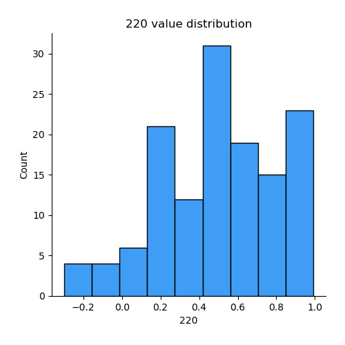
## Feature : 221
- **Feature type** : continous
- **Missing** : 0.0%
- **Unique** : 135
- **Count** :135.0
- **Mean** :0.7420123190435084
- **Std** :0.17202740706653333
- **Min** :0.24144141970870303
- **25%th Percentile** : 0.6407213756404881
- **50%th Percentile** : 0.7498934024016768
- **75%th Percentile** : 0.8516677947738416
- **Max** :0.9957826529404108

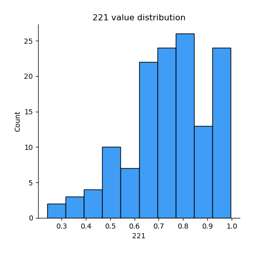
## Feature : 222
- **Feature type** : continous
- **Missing** : 0.0%
- **Unique** : 135
- **Count** :135.0
- **Mean** :0.7096048034515374
- **Std** :0.16871540055440257
- **Min** :0.29484639209446906
- **25%th Percentile** : 0.6029584566588388
- **50%th Percentile** : 0.7020052094652578
- **75%th Percentile** : 0.8226758582820317
- **Max** :0.9900462284954366

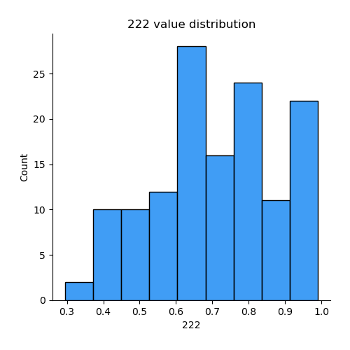
## Feature : 223
- **Feature type** : continous
- **Missing** : 0.0%
- **Unique** : 135
- **Count** :135.0
- **Mean** :0.5678252468501429
- **Std** :0.2723951594623521
- **Min** :-0.08683715018296105
- **25%th Percentile** : 0.36675170363135645
- **50%th Percentile** : 0.5702557243599531
- **75%th Percentile** : 0.7683055603746946
- **Max** :0.9932456350509858

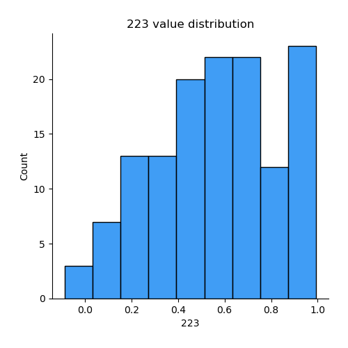
## Feature : 224
- **Feature type** : continous
- **Missing** : 0.0%
- **Unique** : 135
- **Count** :135.0
- **Mean** :0.6018077997737242
- **Std** :0.24592646733737675
- **Min** :-0.03529897007273999
- **25%th Percentile** : 0.43244989796913724
- **50%th Percentile** : 0.5992188597094976
- **75%th Percentile** : 0.7770580210100377
- **Max** :0.9897124550695355

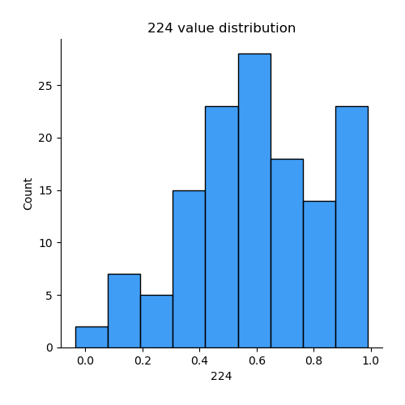
## Feature : 225
- **Feature type** : continous
- **Missing** : 0.0%
- **Unique** : 135
- **Count** :135.0
- **Mean** :0.5942782296415593
- **Std** :0.26252899322507417
- **Min** :-0.05854998123421242
- **25%th Percentile** : 0.3898663832156805
- **50%th Percentile** : 0.6227734993454815
- **75%th Percentile** : 0.7706053742226245
- **Max** :0.995422772663031

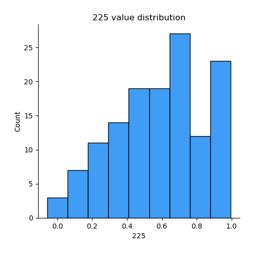
## Feature : 226
- **Feature type** : continous
- **Missing** : 0.0%
- **Unique** : 135
- **Count** :135.0
- **Mean** :0.6724707350931468
- **Std** :0.21965096521953834
- **Min** :0.04693233964781855
- **25%th Percentile** : 0.53609820424492
- **50%th Percentile** : 0.6910066845292346
- **75%th Percentile** : 0.8271723491208611
- **Max** :0.9880832715749136

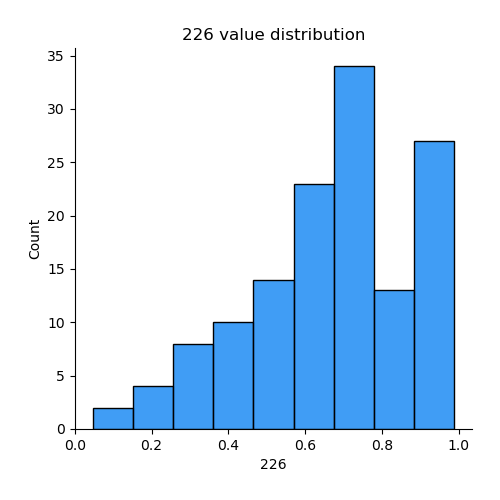
## Feature : 227
- **Feature type** : continous
- **Missing** : 0.0%
- **Unique** : 135
- **Count** :135.0
- **Mean** :0.4107415037694004
- **Std** :0.30900232548450046
- **Min** :-0.28265445573555376
- **25%th Percentile** : 0.19788294702691028
- **50%th Percentile** : 0.33649774637998836
- **75%th Percentile** : 0.5562670796717328
- **Max** :0.9836979245804499

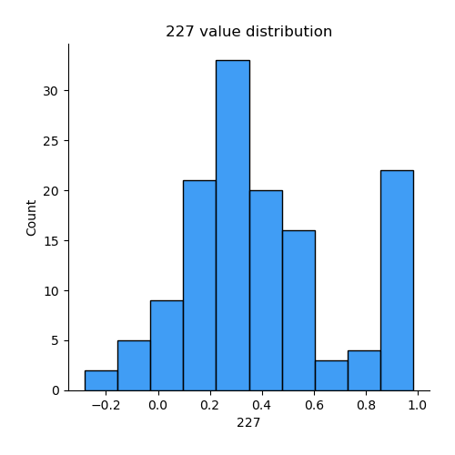
## Feature : 228
- **Feature type** : continous
- **Missing** : 0.0%
- **Unique** : 135
- **Count** :135.0
- **Mean** :0.535236986418956
- **Std** :0.2863614013462707
- **Min** :-0.28332620992156515
- **25%th Percentile** : 0.3334465886624859
- **50%th Percentile** : 0.5389974106457309
- **75%th Percentile** : 0.7197129096290277
- **Max** :0.9938228422651822

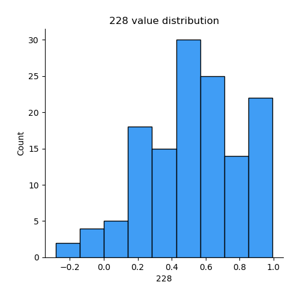
## Feature : 229
- **Feature type** : continous
- **Missing** : 0.0%
- **Unique** : 135
- **Count** :135.0
- **Mean** :0.6964487176880515
- **Std** :0.2215658943481474
- **Min** :0.002793128985461876
- **25%th Percentile** : 0.5542946770415527
- **50%th Percentile** : 0.7314132379194773
- **75%th Percentile** : 0.8480236859556904
- **Max** :0.9917547645732898

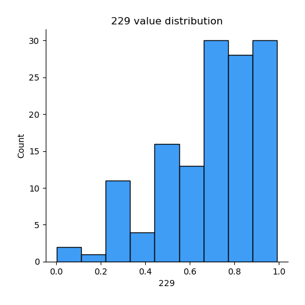
## Feature : 230
- **Feature type** : continous
- **Missing** : 0.0%
- **Unique** : 135
- **Count** :135.0
- **Mean** :0.7004652139384406
- **Std** :0.17902176214791557
- **Min** :0.1924918597977016
- **25%th Percentile** : 0.5923900286167234
- **50%th Percentile** : 0.688170306895756
- **75%th Percentile** : 0.817495435025501
- **Max** :0.9915294914532155

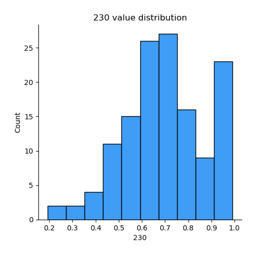
## Feature : 231
- **Feature type** : continous
- **Missing** : 0.0%
- **Unique** : 135
- **Count** :135.0
- **Mean** :0.6238164920531446
- **Std** :0.24866970831665358
- **Min** :-0.03688803229468134
- **25%th Percentile** : 0.4719620530343139
- **50%th Percentile** : 0.6538111962167645
- **75%th Percentile** : 0.803875463943563
- **Max** :0.9937444982962403

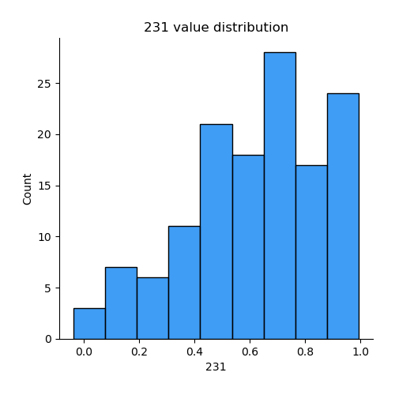
## Feature : 232
- **Feature type** : continous
- **Missing** : 0.0%
- **Unique** : 135
- **Count** :135.0
- **Mean** :0.539889865855269
- **Std** :0.24396148383297703
- **Min** :0.019237613243998183
- **25%th Percentile** : 0.36500264341261496
- **50%th Percentile** : 0.5164162540902324
- **75%th Percentile** : 0.6778121769070093
- **Max** :0.9842714608989731

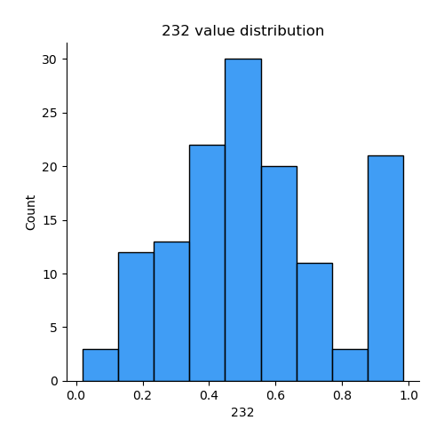
## Feature : 233
- **Feature type** : continous
- **Missing** : 0.0%
- **Unique** : 135
- **Count** :135.0
- **Mean** :0.6080550059823313
- **Std** :0.22546443524206677
- **Min** :-0.024299837410291233
- **25%th Percentile** : 0.4642489872956675
- **50%th Percentile** : 0.5703828822177838
- **75%th Percentile** : 0.7663710200099015
- **Max** :0.979587893360532

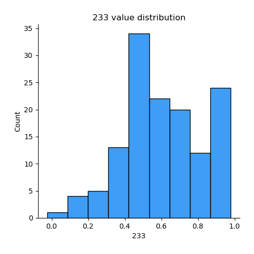
## Feature : 234
- **Feature type** : continous
- **Missing** : 0.0%
- **Unique** : 135
- **Count** :135.0
- **Mean** :0.5672839224264363
- **Std** :0.2680308647555912
- **Min** :-0.23594813635391865
- **25%th Percentile** : 0.3929799599469191
- **50%th Percentile** : 0.5696345694969707
- **75%th Percentile** : 0.7442975930740022
- **Max** :0.9905848771069058

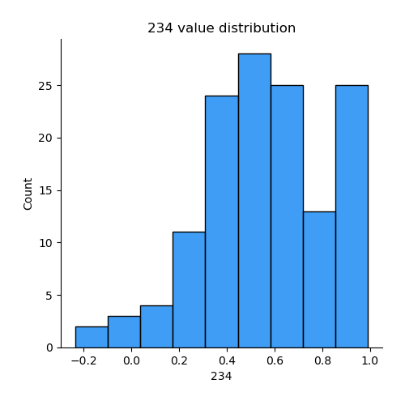
## Feature : 235
- **Feature type** : continous
- **Missing** : 0.0%
- **Unique** : 135
- **Count** :135.0
- **Mean** :0.5080125444161404
- **Std** :0.28203756255783297
- **Min** :-0.2715852079988895
- **25%th Percentile** : 0.319052537625081
- **50%th Percentile** : 0.5096967132420241
- **75%th Percentile** : 0.6656740554662077
- **Max** :0.9854676317666927

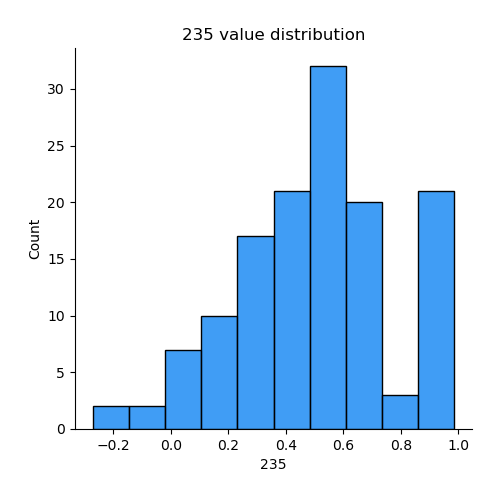
## Feature : 236
- **Feature type** : continous
- **Missing** : 0.0%
- **Unique** : 135
- **Count** :135.0
- **Mean** :0.6887981357473626
- **Std** :0.19951490313891956
- **Min** :0.08000353133100221
- **25%th Percentile** : 0.5502059111976627
- **50%th Percentile** : 0.6939658193343072
- **75%th Percentile** : 0.8363067613541695
- **Max** :0.9906309658376903

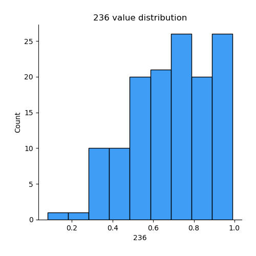
## Feature : 237
- **Feature type** : continous
- **Missing** : 0.0%
- **Unique** : 135
- **Count** :135.0
- **Mean** :0.5193986874646903
- **Std** :0.2637899221736413
- **Min** :-0.12805268829105637
- **25%th Percentile** : 0.33163224971082655
- **50%th Percentile** : 0.49214964544852113
- **75%th Percentile** : 0.6953541879828515
- **Max** :0.985785239150994

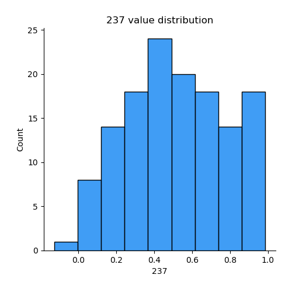
## Feature : 238
- **Feature type** : continous
- **Missing** : 0.0%
- **Unique** : 135
- **Count** :135.0
- **Mean** :0.8571433721769847
- **Std** :0.13352700086403674
- **Min** :0.3240084225192554
- **25%th Percentile** : 0.8145953883453521
- **50%th Percentile** : 0.8955602626317462
- **75%th Percentile** : 0.9370871377429995
- **Max** :0.9983284085609475

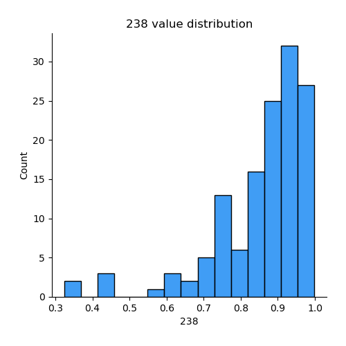
## Feature : 239
- **Feature type** : continous
- **Missing** : 0.0%
- **Unique** : 135
- **Count** :135.0
- **Mean** :0.6408888831131563
- **Std** :0.23751838959310756
- **Min** :0.10424839651298373
- **25%th Percentile** : 0.4984601015797917
- **50%th Percentile** : 0.6614133460193656
- **75%th Percentile** : 0.8150640300924555
- **Max** :0.9895535040734488

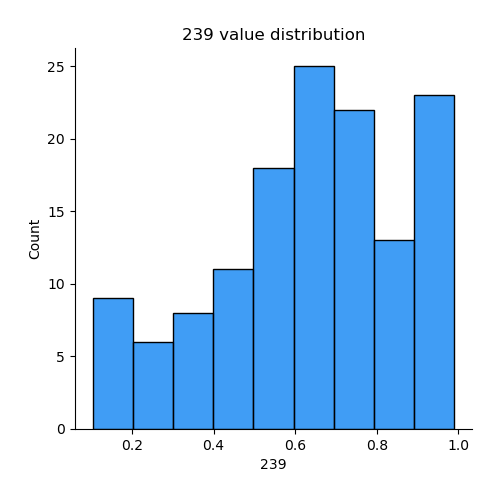
## Feature : 240
- **Feature type** : continous
- **Missing** : 0.0%
- **Unique** : 135
- **Count** :135.0
- **Mean** :0.7217903384385617
- **Std** :0.21402802336036683
- **Min** :-0.16419435804240037
- **25%th Percentile** : 0.6420309157781118
- **50%th Percentile** : 0.7425785230335427
- **75%th Percentile** : 0.8515693605468218
- **Max** :0.9954175481509604

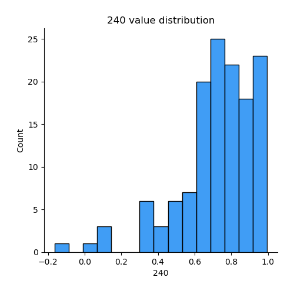
## Feature : 241
- **Feature type** : continous
- **Missing** : 0.0%
- **Unique** : 135
- **Count** :135.0
- **Mean** :0.5932456749255175
- **Std** :0.25452475839375144
- **Min** :-0.2383591127522628
- **25%th Percentile** : 0.44167397277054554
- **50%th Percentile** : 0.5965437710156967
- **75%th Percentile** : 0.7463092564873794
- **Max** :0.9922255859440214

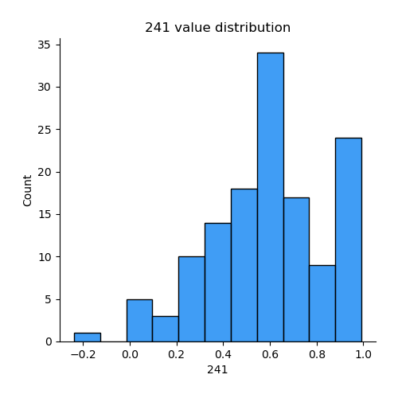
## Feature : 242
- **Feature type** : continous
- **Missing** : 0.0%
- **Unique** : 135
- **Count** :135.0
- **Mean** :0.6562073858299085
- **Std** :0.20696315092882955
- **Min** :0.09190192186001954
- **25%th Percentile** : 0.5020965239126788
- **50%th Percentile** : 0.6388439973965582
- **75%th Percentile** : 0.8222991260577721
- **Max** :0.9808008931247926

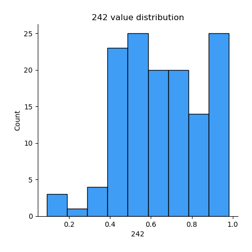
## Feature : 243
- **Feature type** : continous
- **Missing** : 0.0%
- **Unique** : 135
- **Count** :135.0
- **Mean** :0.7686396542360819
- **Std** :0.16632779317009597
- **Min** :0.23173458895395058
- **25%th Percentile** : 0.6639265576621665
- **50%th Percentile** : 0.7976680383245378
- **75%th Percentile** : 0.8968508765483753
- **Max** :0.997645873992803

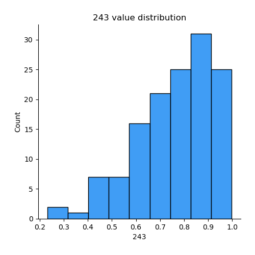
## Feature : 244
- **Feature type** : continous
- **Missing** : 0.0%
- **Unique** : 135
- **Count** :135.0
- **Mean** :0.7830269288846488
- **Std** :0.14527895862642987
- **Min** :0.28755198007090205
- **25%th Percentile** : 0.6722328820076886
- **50%th Percentile** : 0.7969217537454943
- **75%th Percentile** : 0.8905675075085554
- **Max** :0.9938039706150148

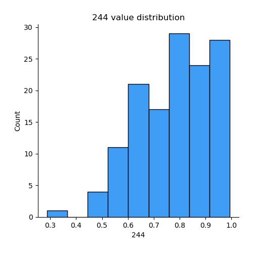
## Feature : 245
- **Feature type** : continous
- **Missing** : 0.0%
- **Unique** : 135
- **Count** :135.0
- **Mean** :0.6532115458255097
- **Std** :0.24539692016164147
- **Min** :-0.23995308513491606
- **25%th Percentile** : 0.5188123155178334
- **50%th Percentile** : 0.6912384422891056
- **75%th Percentile** : 0.8065338747032942
- **Max** :0.9944773079296406

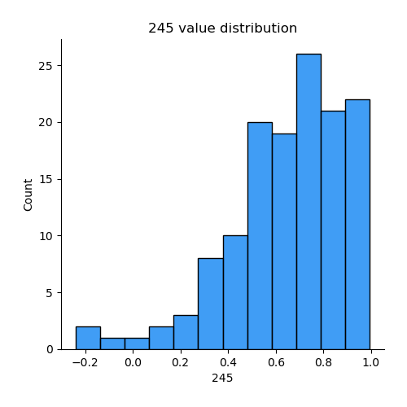
## Feature : 246
- **Feature type** : continous
- **Missing** : 0.0%
- **Unique** : 135
- **Count** :135.0
- **Mean** :0.5013772228887278
- **Std** :0.32299453863640476
- **Min** :-0.380311166929237
- **25%th Percentile** : 0.2671741966006983
- **50%th Percentile** : 0.5516245098129587
- **75%th Percentile** : 0.7309162956155388
- **Max** :0.9920717456551734

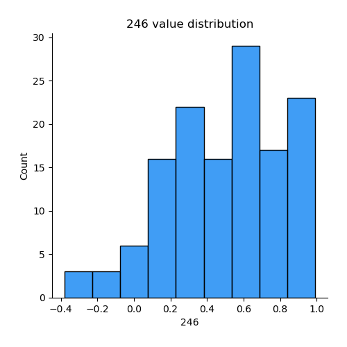
## Feature : 247
- **Feature type** : continous
- **Missing** : 0.0%
- **Unique** : 135
- **Count** :135.0
- **Mean** :0.6840013820586297
- **Std** :0.21439093737663087
- **Min** :-0.05183930644176365
- **25%th Percentile** : 0.5702800989705175
- **50%th Percentile** : 0.701665099544421
- **75%th Percentile** : 0.823631927198476
- **Max** :0.9963754717253409

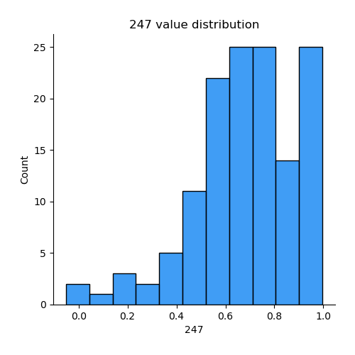
## Feature : 248
- **Feature type** : continous
- **Missing** : 0.0%
- **Unique** : 135
- **Count** :135.0
- **Mean** :0.69479632350664
- **Std** :0.18773635347418202
- **Min** :0.15475359189727336
- **25%th Percentile** : 0.5797346961400707
- **50%th Percentile** : 0.7018883705693311
- **75%th Percentile** : 0.8283778575844523
- **Max** :0.9896330823654073

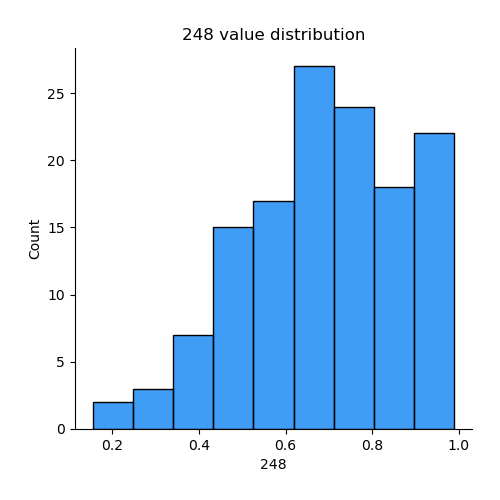
## Feature : 249
- **Feature type** : continous
- **Missing** : 0.0%
- **Unique** : 135
- **Count** :135.0
- **Mean** :0.5271613824323544
- **Std** :0.3100869450340909
- **Min** :-0.23330275698038794
- **25%th Percentile** : 0.3026990331920716
- **50%th Percentile** : 0.5505178649890664
- **75%th Percentile** : 0.7619327368334475
- **Max** :0.9920644132600827

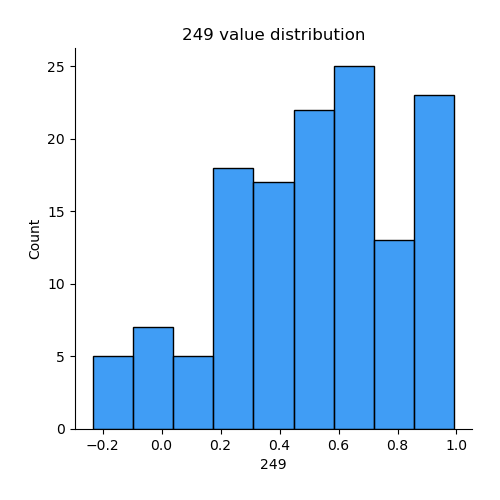
## Feature : 250
- **Feature type** : continous
- **Missing** : 0.0%
- **Unique** : 135
- **Count** :135.0
- **Mean** :0.5821761184232032
- **Std** :0.2578642932782357
- **Min** :-0.014158404278034782
- **25%th Percentile** : 0.41248162353347567
- **50%th Percentile** : 0.5787081886637543
- **75%th Percentile** : 0.75691040666545
- **Max** :0.9901029380589964

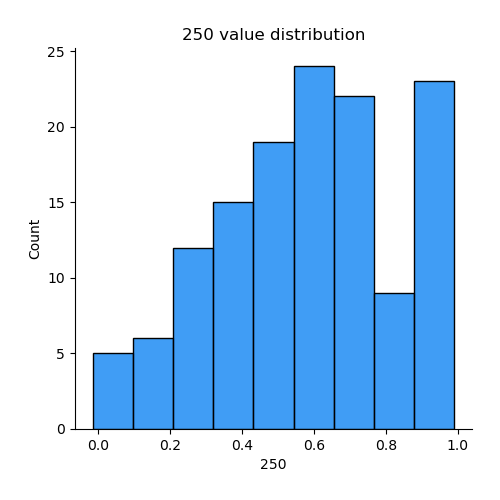
## Feature : 251
- **Feature type** : continous
- **Missing** : 0.0%
- **Unique** : 135
- **Count** :135.0
- **Mean** :0.5547352853253874
- **Std** :0.29794567965648455
- **Min** :-0.16591760597846797
- **25%th Percentile** : 0.35567057712351996
- **50%th Percentile** : 0.5991860417976791
- **75%th Percentile** : 0.7653292240906631
- **Max** :0.9916033513593545

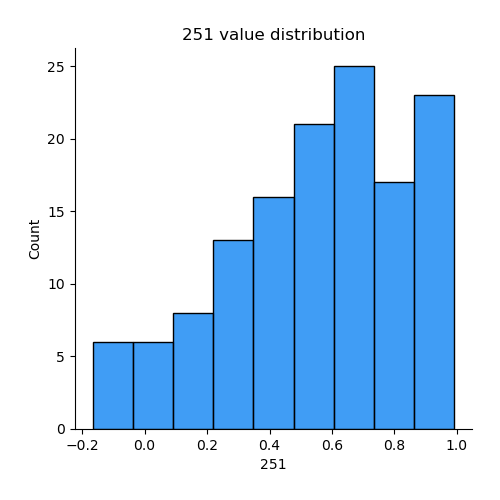
## Feature : 252
- **Feature type** : continous
- **Missing** : 0.0%
- **Unique** : 135
- **Count** :135.0
- **Mean** :0.6650781940727587
- **Std** :0.22611369875143741
- **Min** :0.002170356547388296
- **25%th Percentile** : 0.5177018491620315
- **50%th Percentile** : 0.6844587350105166
- **75%th Percentile** : 0.8134591001398193
- **Max** :0.9889217652820266

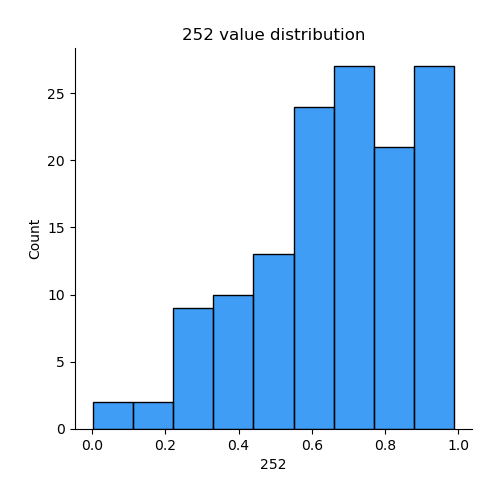
## Feature : 253
- **Feature type** : continous
- **Missing** : 0.0%
- **Unique** : 135
- **Count** :135.0
- **Mean** :0.36572597195845413
- **Std** :0.31880120817413843
- **Min** :-0.21753492066844565
- **25%th Percentile** : 0.14141753524912082
- **50%th Percentile** : 0.29042722544806854
- **75%th Percentile** : 0.5213929857144395
- **Max** :0.9831252987920067

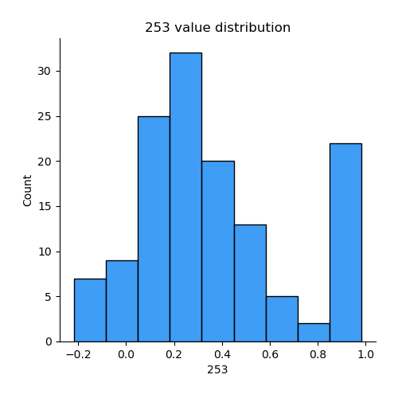
## Feature : 254
- **Feature type** : continous
- **Missing** : 0.0%
- **Unique** : 135
- **Count** :135.0
- **Mean** :0.5368066167475648
- **Std** :0.2985198360954875
- **Min** :-0.2936381816296122
- **25%th Percentile** : 0.3500865831326305
- **50%th Percentile** : 0.54755450679064
- **75%th Percentile** : 0.738679598839673
- **Max** :0.9924758003694826

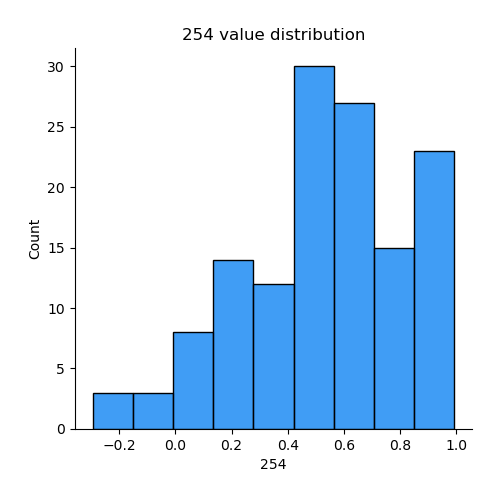
## Feature : 255
- **Feature type** : continous
- **Missing** : 0.0%
- **Unique** : 135
- **Count** :135.0
- **Mean** :0.6733813720909811
- **Std** :0.23707489727240283
- **Min** :-0.01709289945751397
- **25%th Percentile** : 0.5352359866697569
- **50%th Percentile** : 0.7096591898130781
- **75%th Percentile** : 0.8432471099896173
- **Max** :0.9915216725153202

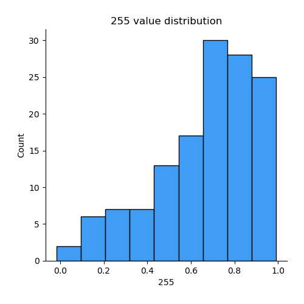
## Feature : 256
- **Feature type** : continous
- **Missing** : 0.0%
- **Unique** : 135
- **Count** :135.0
- **Mean** :0.628285054865863
- **Std** :0.24987046874931368
- **Min** :-0.21732702202155846
- **25%th Percentile** : 0.47896697205645367
- **50%th Percentile** : 0.6658892194598391
- **75%th Percentile** : 0.7762755732509786
- **Max** :0.9907029114248314

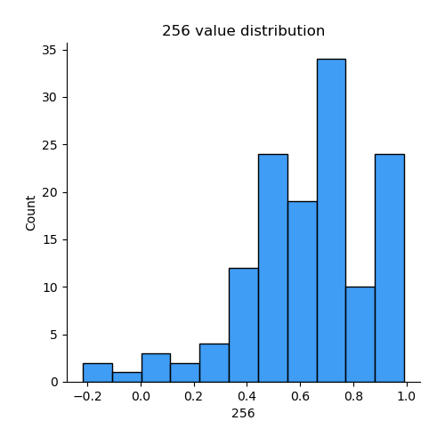
## Feature : 257
- **Feature type** : continous
- **Missing** : 0.0%
- **Unique** : 135
- **Count** :135.0
- **Mean** :0.5729981787117568
- **Std** :0.27975450552112896
- **Min** :-0.140020852422512
- **25%th Percentile** : 0.39742663949239926
- **50%th Percentile** : 0.5814529653025833
- **75%th Percentile** : 0.7727971735914678
- **Max** :0.9902076518943911

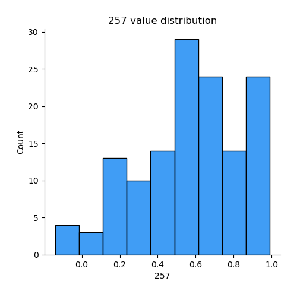
## Feature : 258
- **Feature type** : continous
- **Missing** : 0.0%
- **Unique** : 135
- **Count** :135.0
- **Mean** :0.5022053012701018
- **Std** :0.27103226771842787
- **Min** :-0.37765460666216855
- **25%th Percentile** : 0.3012191839801267
- **50%th Percentile** : 0.4827570958936469
- **75%th Percentile** : 0.6805585371210858
- **Max** :0.9820592737100182

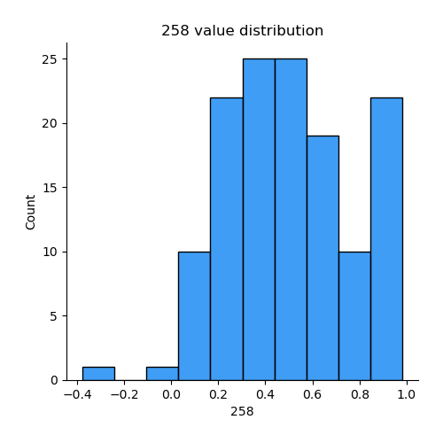
## Feature : 259
- **Feature type** : continous
- **Missing** : 0.0%
- **Unique** : 135
- **Count** :135.0
- **Mean** :0.5057084647706559
- **Std** :0.279662298665053
- **Min** :-0.23716827333477009
- **25%th Percentile** : 0.3133174039832583
- **50%th Percentile** : 0.48464754016376305
- **75%th Percentile** : 0.6746339121946623
- **Max** :0.9840210226323113

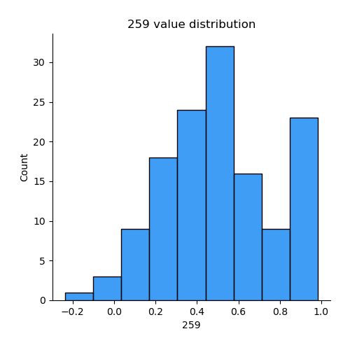
## Feature : 265
- **Feature type** : continous
- **Missing** : 0.0%
- **Unique** : 3
- **Count** :135.0
- **Mean** :1.0
- **Std** :8.415950902694798e-17
- **Min** :0.9999999999999998
- **25%th Percentile** : 0.9999999999999999
- **50%th Percentile** : 1.0
- **75%th Percentile** : 1.0
- **Max** :1.0

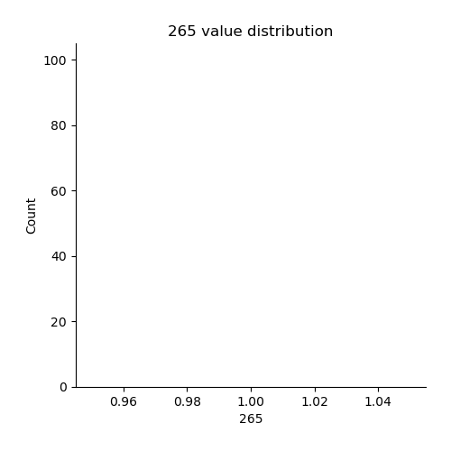
## Feature : 266
- **Feature type** : continous
- **Missing** : 0.0%
- **Unique** : 135
- **Count** :135.0
- **Mean** :0.6813129844277991
- **Std** :0.20200698505237205
- **Min** :0.08068946356983421
- **25%th Percentile** : 0.5452547585116408
- **50%th Percentile** : 0.681651783447412
- **75%th Percentile** : 0.827034398111058
- **Max** :0.9939932309862867

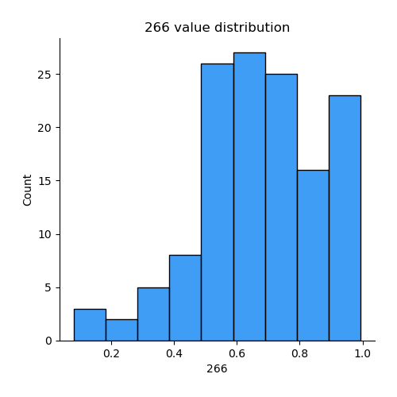
## Feature : 267
- **Feature type** : continous
- **Missing** : 0.0%
- **Unique** : 135
- **Count** :135.0
- **Mean** :0.6021839755094186
- **Std** :0.23933766436976192
- **Min** :-0.12556755730620686
- **25%th Percentile** : 0.4240815008946366
- **50%th Percentile** : 0.5964490707982283
- **75%th Percentile** : 0.7506912957691407
- **Max** :0.9910232132646918

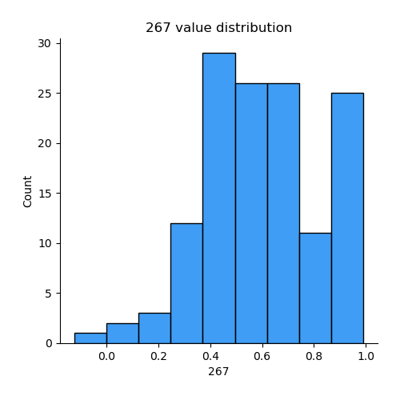
## Feature : 268
- **Feature type** : continous
- **Missing** : 0.0%
- **Unique** : 135
- **Count** :135.0
- **Mean** :0.7747967834380926
- **Std** :0.133336065723703
- **Min** :0.4160184282863798
- **25%th Percentile** : 0.6830323473801034
- **50%th Percentile** : 0.7812456099366942
- **75%th Percentile** : 0.8515907284701656
- **Max** :0.9918519500716135

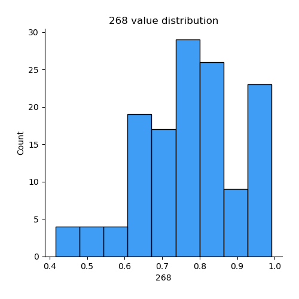
## Feature : 269
- **Feature type** : continous
- **Missing** : 0.0%
- **Unique** : 135
- **Count** :135.0
- **Mean** :0.6651810589399847
- **Std** :0.20249588208591066
- **Min** :0.1706419550541712
- **25%th Percentile** : 0.5342392157766618
- **50%th Percentile** : 0.6579774217993335
- **75%th Percentile** : 0.7993254992710415
- **Max** :0.9934957910009647

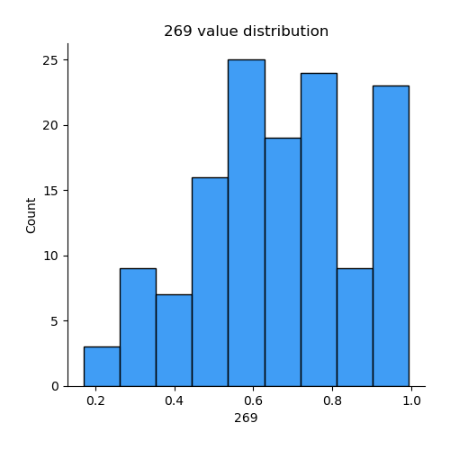
## Feature : 270
- **Feature type** : continous
- **Missing** : 0.0%
- **Unique** : 135
- **Count** :135.0
- **Mean** :0.6477311890511658
- **Std** :0.20887711221807867
- **Min** :0.15929683867677333
- **25%th Percentile** : 0.49782790414031947
- **50%th Percentile** : 0.6589039824776822
- **75%th Percentile** : 0.7857145518676308
- **Max** :0.9920304476225862

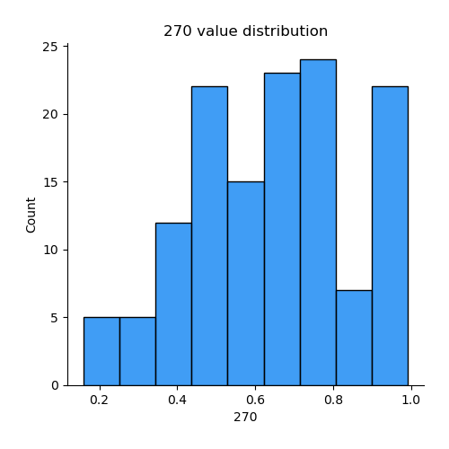
## Feature : 271
- **Feature type** : continous
- **Missing** : 0.0%
- **Unique** : 135
- **Count** :135.0
- **Mean** :0.7382218823899198
- **Std** :0.18244913088296807
- **Min** :0.11935095756464413
- **25%th Percentile** : 0.6359776801593436
- **50%th Percentile** : 0.7624145924880437
- **75%th Percentile** : 0.8522410137943547
- **Max** :0.9954045142537818

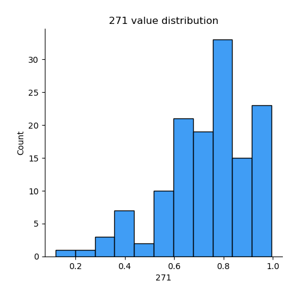
## Feature : 272
- **Feature type** : continous
- **Missing** : 0.0%
- **Unique** : 135
- **Count** :135.0
- **Mean** :0.5739912689522952
- **Std** :0.2526256325371453
- **Min** :-0.06023450400936898
- **25%th Percentile** : 0.41012380567166484
- **50%th Percentile** : 0.5552485552418905
- **75%th Percentile** : 0.7233745513866965
- **Max** :0.9916154629511518

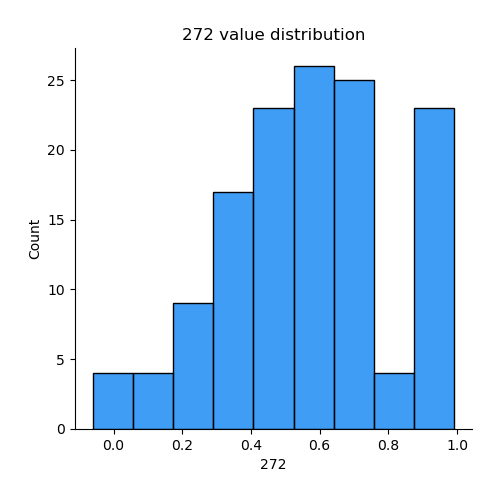
## Feature : 273
- **Feature type** : continous
- **Missing** : 0.0%
- **Unique** : 135
- **Count** :135.0
- **Mean** :0.5901604153674054
- **Std** :0.22865817050391898
- **Min** :-0.009534249046949168
- **25%th Percentile** : 0.4454642101684555
- **50%th Percentile** : 0.5690459323360646
- **75%th Percentile** : 0.7022399701042974
- **Max** :0.9915331251685489

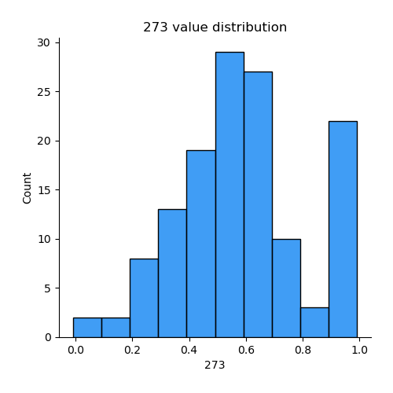
## Feature : 274
- **Feature type** : continous
- **Missing** : 0.0%
- **Unique** : 135
- **Count** :135.0
- **Mean** :0.6100379596368336
- **Std** :0.22439748598109355
- **Min** :-0.13697823851288068
- **25%th Percentile** : 0.4801096260235884
- **50%th Percentile** : 0.6098881554007949
- **75%th Percentile** : 0.7492754495110272
- **Max** :0.9871191684569469

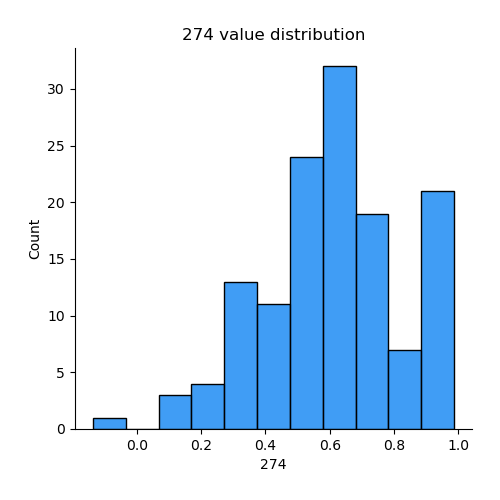
## Feature : 275
- **Feature type** : continous
- **Missing** : 0.0%
- **Unique** : 135
- **Count** :135.0
- **Mean** :0.6250176863491492
- **Std** :0.22360765524947235
- **Min** :-0.04588745261653689
- **25%th Percentile** : 0.5048358738012106
- **50%th Percentile** : 0.6119693226632595
- **75%th Percentile** : 0.7457870294835238
- **Max** :0.9929258477829538

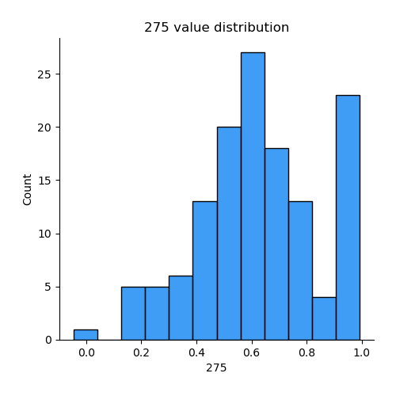
## Feature : 276
- **Feature type** : continous
- **Missing** : 0.0%
- **Unique** : 135
- **Count** :135.0
- **Mean** :0.6823922611116332
- **Std** :0.19413484612162726
- **Min** :0.1773568919236413
- **25%th Percentile** : 0.5653029691968878
- **50%th Percentile** : 0.686784473237013
- **75%th Percentile** : 0.7831607090599931
- **Max** :0.9924375320459388

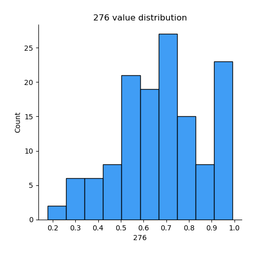
## Feature : 277
- **Feature type** : continous
- **Missing** : 0.0%
- **Unique** : 135
- **Count** :135.0
- **Mean** :0.6319348912362008
- **Std** :0.2211496639880985
- **Min** :0.006206487528770404
- **25%th Percentile** : 0.480532884840166
- **50%th Percentile** : 0.628114861766293
- **75%th Percentile** : 0.7633036939165738
- **Max** :0.9930567674705612

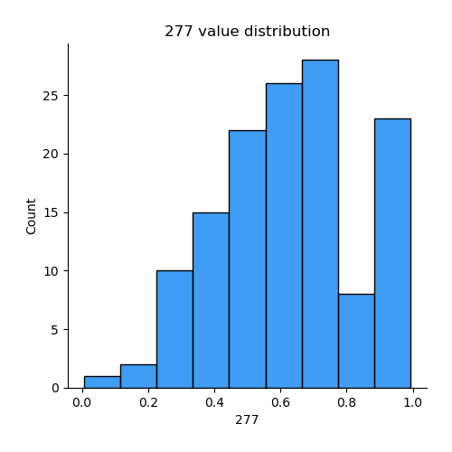
## Feature : 278
- **Feature type** : continous
- **Missing** : 0.0%
- **Unique** : 135
- **Count** :135.0
- **Mean** :0.8475209858516082
- **Std** :0.1014908179070259
- **Min** :0.5041469285498541
- **25%th Percentile** : 0.7842977149328465
- **50%th Percentile** : 0.8526303295579706
- **75%th Percentile** : 0.9131041433825604
- **Max** :0.9970848986581574

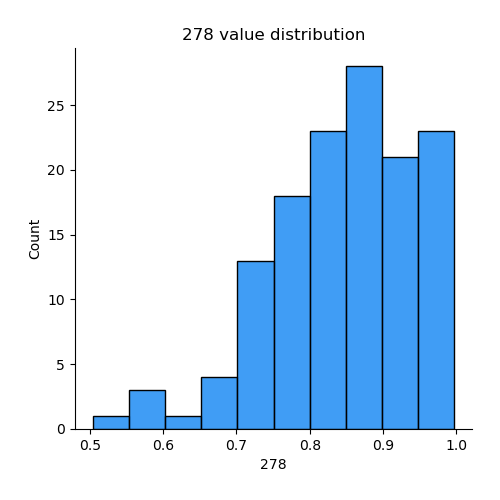
## Feature : 279
- **Feature type** : continous
- **Missing** : 0.0%
- **Unique** : 135
- **Count** :135.0
- **Mean** :0.5195330385892013
- **Std** :0.2607754025997732
- **Min** :0.0928349831521771
- **25%th Percentile** : 0.3163870729894461
- **50%th Percentile** : 0.4800818864686559
- **75%th Percentile** : 0.643595506820655
- **Max** :0.9881728699744828

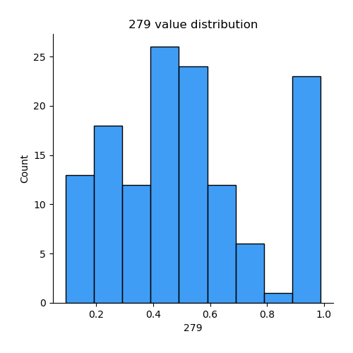
## Feature : 280
- **Feature type** : continous
- **Missing** : 0.0%
- **Unique** : 135
- **Count** :135.0
- **Mean** :0.6721452853829523
- **Std** :0.20223189854954918
- **Min** :0.2153047231879349
- **25%th Percentile** : 0.5381208030933692
- **50%th Percentile** : 0.6718804107247244
- **75%th Percentile** : 0.8043987802417223
- **Max** :0.9945055636010646

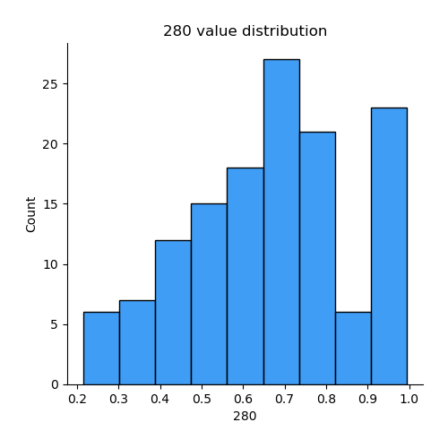
## Feature : 281
- **Feature type** : continous
- **Missing** : 0.0%
- **Unique** : 135
- **Count** :135.0
- **Mean** :0.7483334682483995
- **Std** :0.18437434189786653
- **Min** :0.17103196390879216
- **25%th Percentile** : 0.6496427535372051
- **50%th Percentile** : 0.7675941659715
- **75%th Percentile** : 0.8751609350399628
- **Max** :0.9950697523569062

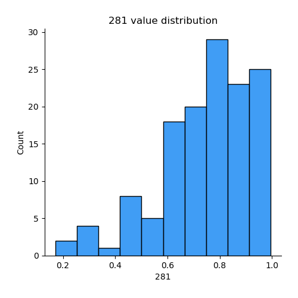
## Feature : 282
- **Feature type** : continous
- **Missing** : 0.0%
- **Unique** : 135
- **Count** :135.0
- **Mean** :0.650407454851821
- **Std** :0.21675977012740433
- **Min** :-0.021341929629986676
- **25%th Percentile** : 0.5209998496456458
- **50%th Percentile** : 0.6546481116707872
- **75%th Percentile** : 0.7940005276975215
- **Max** :0.9938373890448667

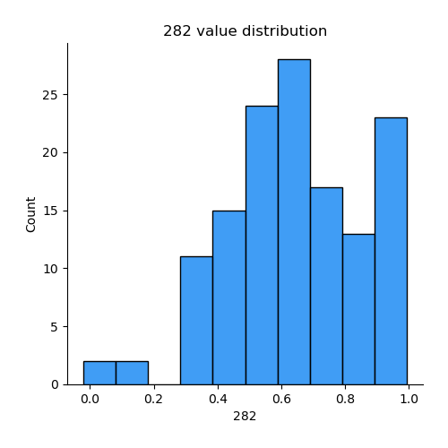
## Feature : 283
- **Feature type** : continous
- **Missing** : 0.0%
- **Unique** : 135
- **Count** :135.0
- **Mean** :0.7595281890326815
- **Std** :0.17304139536493546
- **Min** :0.23502661917141257
- **25%th Percentile** : 0.6726482283420916
- **50%th Percentile** : 0.7768426138418077
- **75%th Percentile** : 0.8797671333808643
- **Max** :0.9960124185725266

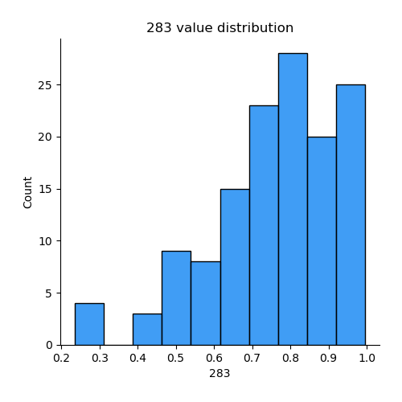
## Feature : 284
- **Feature type** : continous
- **Missing** : 0.0%
- **Unique** : 135
- **Count** :135.0
- **Mean** :0.40199627931612103
- **Std** :0.2990362319855883
- **Min** :-0.4879980776803446
- **25%th Percentile** : 0.21288749508999072
- **50%th Percentile** : 0.3693400770870135
- **75%th Percentile** : 0.5153821017784437
- **Max** :0.9754622601791526

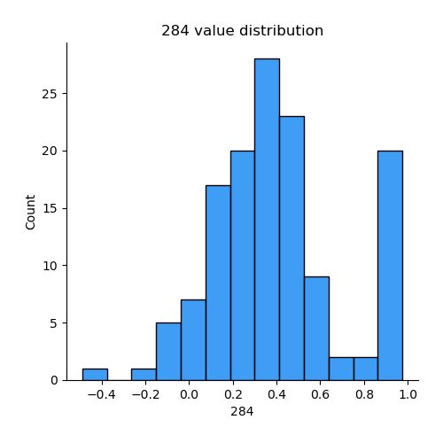
## Feature : 285
- **Feature type** : continous
- **Missing** : 0.0%
- **Unique** : 135
- **Count** :135.0
- **Mean** :0.5839844534211911
- **Std** :0.24018014778273394
- **Min** :-0.11482679460087744
- **25%th Percentile** : 0.4226690246700442
- **50%th Percentile** : 0.5708587622149687
- **75%th Percentile** : 0.7191595448481185
- **Max** :0.9851252566477362

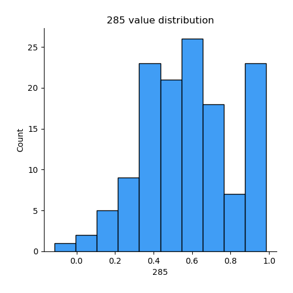
## Feature : 286
- **Feature type** : continous
- **Missing** : 0.0%
- **Unique** : 135
- **Count** :135.0
- **Mean** :0.5681258269649159
- **Std** :0.2824121228830798
- **Min** :-0.21070789398188866
- **25%th Percentile** : 0.3899909672404414
- **50%th Percentile** : 0.5766882498396518
- **75%th Percentile** : 0.76694864776972
- **Max** :0.9924652400694898

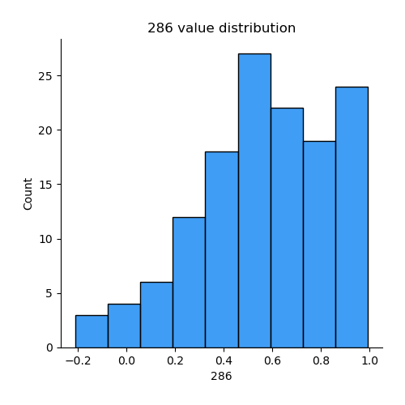
## Feature : 287
- **Feature type** : continous
- **Missing** : 0.0%
- **Unique** : 135
- **Count** :135.0
- **Mean** :0.5089209733095789
- **Std** :0.2649541418788033
- **Min** :-0.05549412294986561
- **25%th Percentile** : 0.33101419387260017
- **50%th Percentile** : 0.4750872599671868
- **75%th Percentile** : 0.6539123685133608
- **Max** :0.9903286515068057

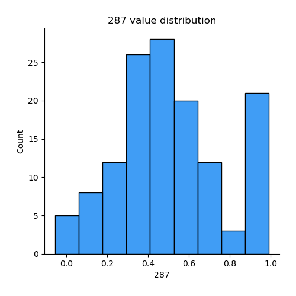
## Feature : 288
- **Feature type** : continous
- **Missing** : 0.0%
- **Unique** : 135
- **Count** :135.0
- **Mean** :0.6568154513472918
- **Std** :0.22046718687317018
- **Min** :0.10767030866963069
- **25%th Percentile** : 0.5025171770930018
- **50%th Percentile** : 0.678396971467356
- **75%th Percentile** : 0.8096331417447171
- **Max** :0.9891385246795831

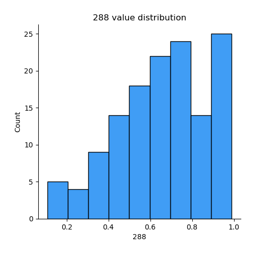
## Feature : 289
- **Feature type** : continous
- **Missing** : 0.0%
- **Unique** : 135
- **Count** :135.0
- **Mean** :0.3712860095076619
- **Std** :0.29765053699396576
- **Min** :-0.16793388886518273
- **25%th Percentile** : 0.16963781843305273
- **50%th Percentile** : 0.32981590193877425
- **75%th Percentile** : 0.5268463230612739
- **Max** :0.98168339615319

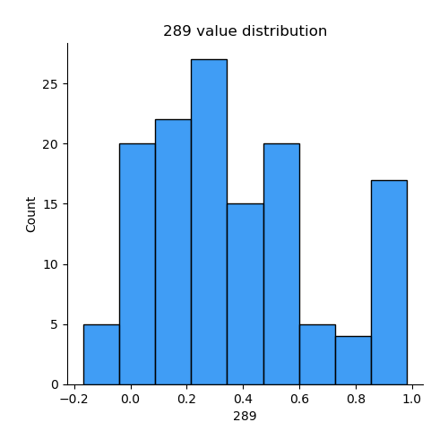
## Feature : 290
- **Feature type** : continous
- **Missing** : 0.0%
- **Unique** : 135
- **Count** :135.0
- **Mean** :0.6145744888237918
- **Std** :0.23547239442789125
- **Min** :0.11233028656215345
- **25%th Percentile** : 0.4268172987666035
- **50%th Percentile** : 0.607302934932061
- **75%th Percentile** : 0.7855733603499373
- **Max** :0.9926493464621101

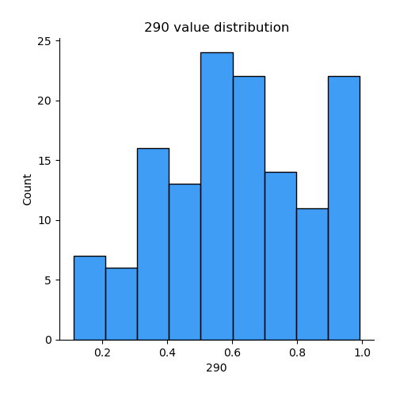
## Feature : 291
- **Feature type** : continous
- **Missing** : 0.0%
- **Unique** : 135
- **Count** :135.0
- **Mean** :0.811545269306273
- **Std** :0.14719468747209966
- **Min** :0.35441515893014736
- **25%th Percentile** : 0.7423933622505245
- **50%th Percentile** : 0.8361085567339797
- **75%th Percentile** : 0.9104407398315606
- **Max** :0.9980068575976893

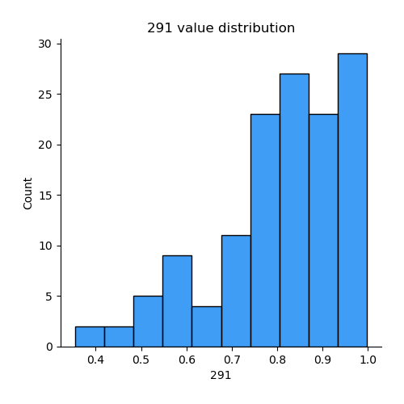
## Feature : 292
- **Feature type** : continous
- **Missing** : 0.0%
- **Unique** : 135
- **Count** :135.0
- **Mean** :0.5713418085322217
- **Std** :0.2693027051996148
- **Min** :-0.1895390074140056
- **25%th Percentile** : 0.4119170341802561
- **50%th Percentile** : 0.5623156829585267
- **75%th Percentile** : 0.7422362063328061
- **Max** :0.9929180079255114

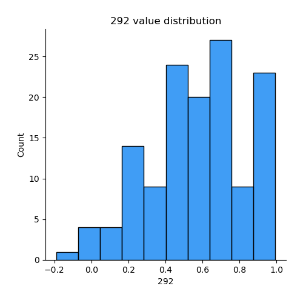
## Feature : 293
- **Feature type** : continous
- **Missing** : 0.0%
- **Unique** : 135
- **Count** :135.0
- **Mean** :0.5426665554311718
- **Std** :0.2795591475887795
- **Min** :-0.1065621276518543
- **25%th Percentile** : 0.3564743842651378
- **50%th Percentile** : 0.5455543877180858
- **75%th Percentile** : 0.7053103508745031
- **Max** :0.9909664535771084

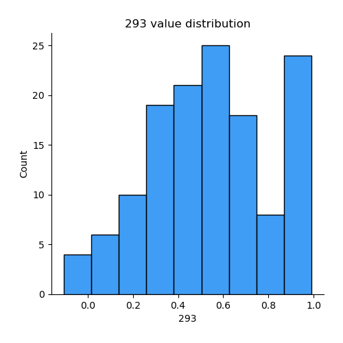
## Feature : 294
- **Feature type** : continous
- **Missing** : 0.0%
- **Unique** : 135
- **Count** :135.0
- **Mean** :0.7433013863254379
- **Std** :0.16337885786391343
- **Min** :0.2724168590343279
- **25%th Percentile** : 0.6466166552459901
- **50%th Percentile** : 0.7570534713282228
- **75%th Percentile** : 0.8563718293026628
- **Max** :0.9935667966311268

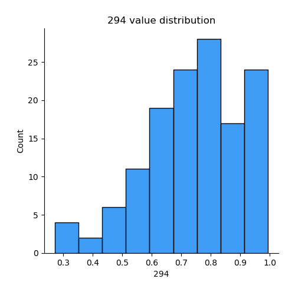
## Feature : 295
- **Feature type** : continous
- **Missing** : 0.0%
- **Unique** : 135
- **Count** :135.0
- **Mean** :0.6390579391667152
- **Std** :0.21610180488244232
- **Min** :0.19275478645088032
- **25%th Percentile** : 0.49270526041709767
- **50%th Percentile** : 0.6401826438899594
- **75%th Percentile** : 0.7946485371123138
- **Max** :0.9914451840816175

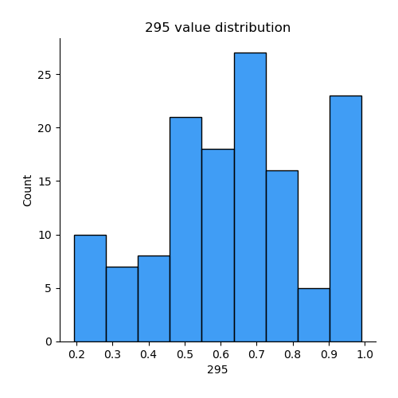
## Feature : 296
- **Feature type** : continous
- **Missing** : 0.0%
- **Unique** : 135
- **Count** :135.0
- **Mean** :0.6309670457250124
- **Std** :0.21889868301281504
- **Min** :0.11007297945825954
- **25%th Percentile** : 0.4840979216929294
- **50%th Percentile** : 0.6349465224387157
- **75%th Percentile** : 0.7767110608967049
- **Max** :0.9934240570107431

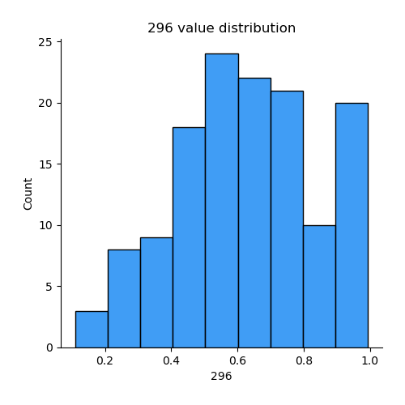
## Feature : 297
- **Feature type** : continous
- **Missing** : 0.0%
- **Unique** : 135
- **Count** :135.0
- **Mean** :0.6313050960035432
- **Std** :0.2541995077299484
- **Min** :-0.20410202274390485
- **25%th Percentile** : 0.48491366492954124
- **50%th Percentile** : 0.6469497792581511
- **75%th Percentile** : 0.8067413677663945
- **Max** :0.9946640420342132

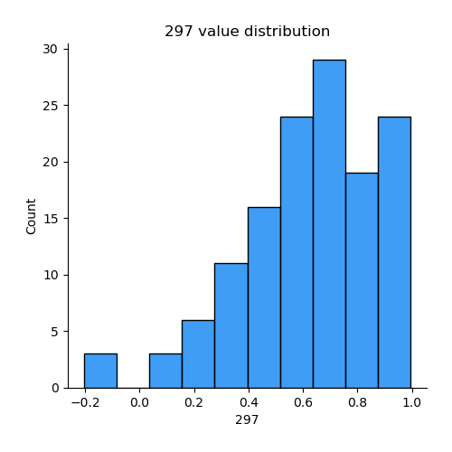
## Feature : 298
- **Feature type** : continous
- **Missing** : 0.0%
- **Unique** : 135
- **Count** :135.0
- **Mean** :0.5440530914551933
- **Std** :0.2634512130073496
- **Min** :-0.09624247019266398
- **25%th Percentile** : 0.37699146509463155
- **50%th Percentile** : 0.5293530097079063
- **75%th Percentile** : 0.7045603974949377
- **Max** :0.9943863804147745

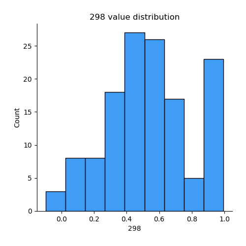
## Feature : 299
- **Feature type** : continous
- **Missing** : 0.0%
- **Unique** : 135
- **Count** :135.0
- **Mean** :0.5351084577757019
- **Std** :0.26517996902186997
- **Min** :-0.1149902747812978
- **25%th Percentile** : 0.3384286725509336
- **50%th Percentile** : 0.518399396739878
- **75%th Percentile** : 0.6892827664265748
- **Max** :0.99151901945444

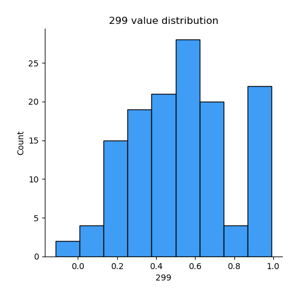
## Feature : 300
- **Feature type** : continous
- **Missing** : 0.0%
- **Unique** : 135
- **Count** :135.0
- **Mean** :0.6055211041786162
- **Std** :0.2294922058905409
- **Min** :-0.09844161076256569
- **25%th Percentile** : 0.46154772533220284
- **50%th Percentile** : 0.6114066879419121
- **75%th Percentile** : 0.7502211612097291
- **Max** :0.9880948485905593

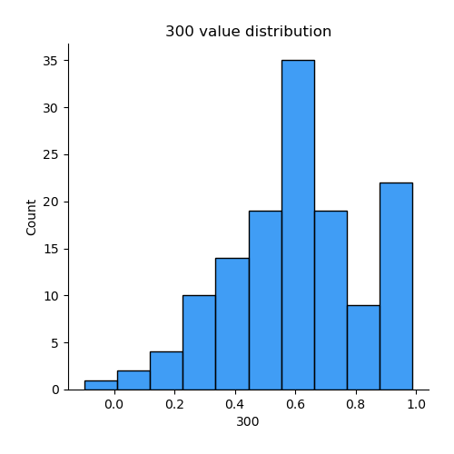
## Feature : 301
- **Feature type** : continous
- **Missing** : 0.0%
- **Unique** : 135
- **Count** :135.0
- **Mean** :0.5728025289824333
- **Std** :0.2630086387652966
- **Min** :-0.06682343324972323
- **25%th Percentile** : 0.39455123687687144
- **50%th Percentile** : 0.5655520334070276
- **75%th Percentile** : 0.7516753861493348
- **Max** :0.9948185071551641

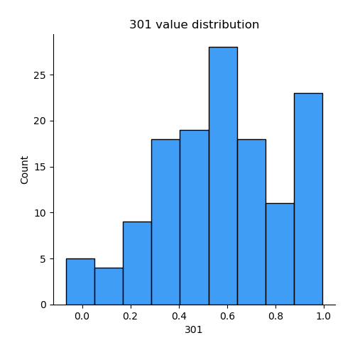
## Feature : 302
- **Feature type** : continous
- **Missing** : 0.0%
- **Unique** : 135
- **Count** :135.0
- **Mean** :0.6252936465301911
- **Std** :0.22806893800609912
- **Min** :0.09090757242865954
- **25%th Percentile** : 0.46406230741018406
- **50%th Percentile** : 0.6384038898480201
- **75%th Percentile** : 0.7717928789238109
- **Max** :0.9936314014523

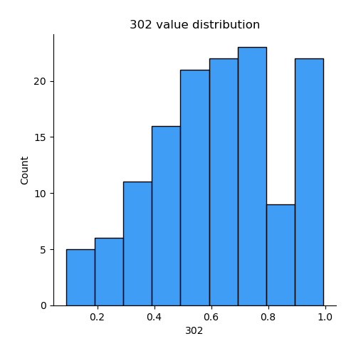
## Feature : 303
- **Feature type** : continous
- **Missing** : 0.0%
- **Unique** : 135
- **Count** :135.0
- **Mean** :0.5668608872361888
- **Std** :0.26321648537182674
- **Min** :-0.09296877690946719
- **25%th Percentile** : 0.3988321294596682
- **50%th Percentile** : 0.5566676801098721
- **75%th Percentile** : 0.732044948681552
- **Max** :0.9910996831133326

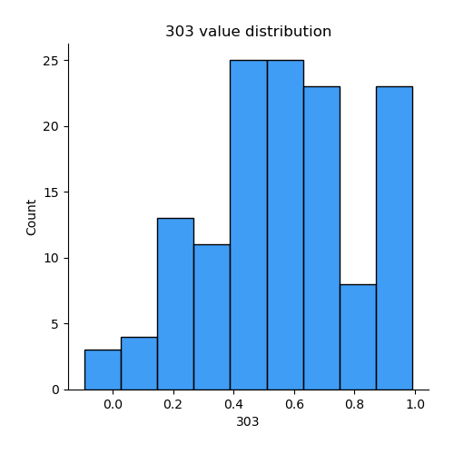
## Feature : 304
- **Feature type** : continous
- **Missing** : 0.0%
- **Unique** : 135
- **Count** :135.0
- **Mean** :0.7929941266399622
- **Std** :0.1371904101962307
- **Min** :0.3182782792025998
- **25%th Percentile** : 0.707454878795605
- **50%th Percentile** : 0.8056525341725608
- **75%th Percentile** : 0.8846786948343737
- **Max** :0.9972566384038714

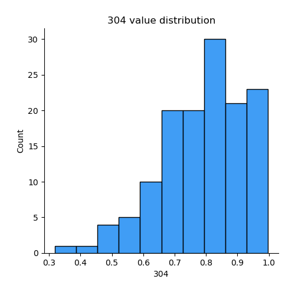
## Feature : 305
- **Feature type** : continous
- **Missing** : 0.0%
- **Unique** : 135
- **Count** :135.0
- **Mean** :0.4645597692777545
- **Std** :0.28159094904596144
- **Min** :-0.09241421022033994
- **25%th Percentile** : 0.25757001223320924
- **50%th Percentile** : 0.40412755151497
- **75%th Percentile** : 0.6102877121538925
- **Max** :0.9895544167221134

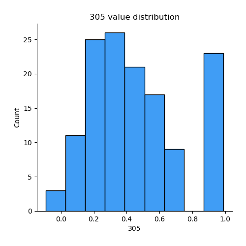
## Feature : 306
- **Feature type** : continous
- **Missing** : 0.0%
- **Unique** : 135
- **Count** :135.0
- **Mean** :0.6076243555700894
- **Std** :0.23909487455286083
- **Min** :-0.0473455545800938
- **25%th Percentile** : 0.4435468076881486
- **50%th Percentile** : 0.6082717197816363
- **75%th Percentile** : 0.7587016992953812
- **Max** :0.9940320848376966

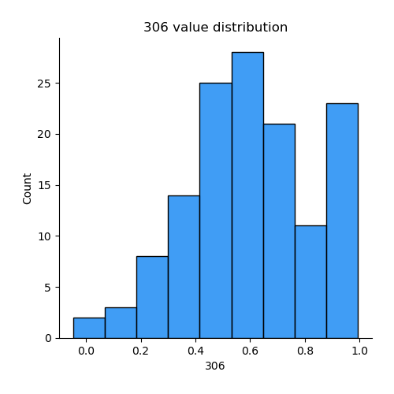
## Feature : 307
- **Feature type** : continous
- **Missing** : 0.0%
- **Unique** : 135
- **Count** :135.0
- **Mean** :0.6829420099109211
- **Std** :0.21633856352204472
- **Min** :0.0671809935956962
- **25%th Percentile** : 0.5421869584721164
- **50%th Percentile** : 0.6983580640657663
- **75%th Percentile** : 0.8384318473626705
- **Max** :0.9942515109277342

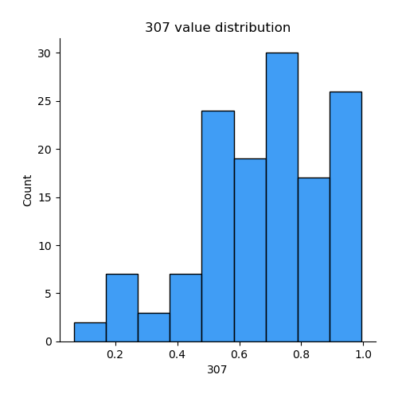
## Feature : 308
- **Feature type** : continous
- **Missing** : 0.0%
- **Unique** : 135
- **Count** :135.0
- **Mean** :0.5754056227274946
- **Std** :0.2752542249724202
- **Min** :-0.2799446595978598
- **25%th Percentile** : 0.41608012226223673
- **50%th Percentile** : 0.5980192792755482
- **75%th Percentile** : 0.748502605704053
- **Max** :0.9904013050575644

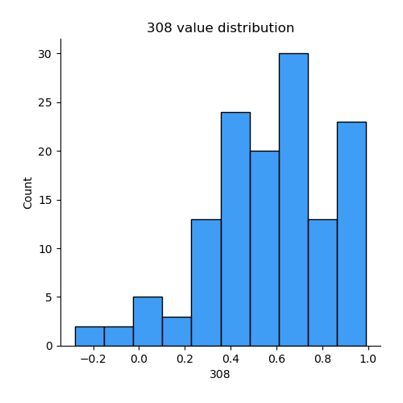
## Feature : 309
- **Feature type** : continous
- **Missing** : 0.0%
- **Unique** : 135
- **Count** :135.0
- **Mean** :0.5959658870336132
- **Std** :0.27352443820493155
- **Min** :-0.018692638879652976
- **25%th Percentile** : 0.4062505230400709
- **50%th Percentile** : 0.6420648499351428
- **75%th Percentile** : 0.7932319682520454
- **Max** :0.9951053509122786

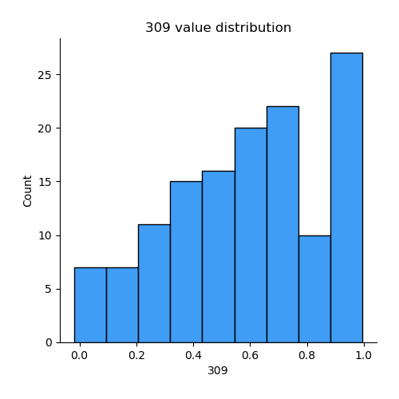
## Feature : 310
- **Feature type** : continous
- **Missing** : 0.0%
- **Unique** : 135
- **Count** :135.0
- **Mean** :0.3478917526710339
- **Std** :0.3135815717996666
- **Min** :-0.42624468517766356
- **25%th Percentile** : 0.1416996749216191
- **50%th Percentile** : 0.2742297196888762
- **75%th Percentile** : 0.47846714027896703
- **Max** :0.9791389637557817

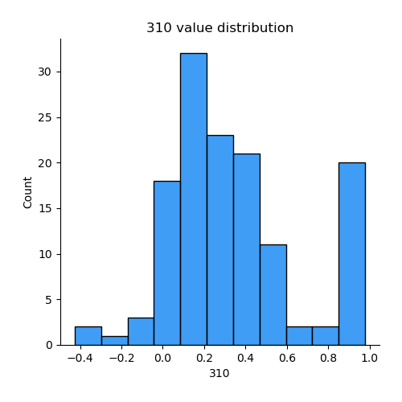
## Feature : 311
- **Feature type** : continous
- **Missing** : 0.0%
- **Unique** : 135
- **Count** :135.0
- **Mean** :0.49158482836143597
- **Std** :0.28725201331064953
- **Min** :-0.3369261135633597
- **25%th Percentile** : 0.281360012277898
- **50%th Percentile** : 0.4868952603270118
- **75%th Percentile** : 0.6542489741766151
- **Max** :0.9873521098640788

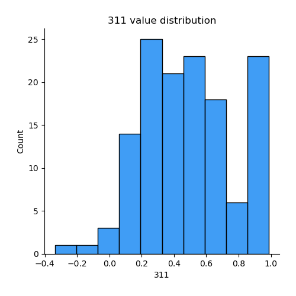
## Feature : 318
- **Feature type** : continous
- **Missing** : 0.0%
- **Unique** : 3
- **Count** :135.0
- **Mean** :1.0
- **Std** :8.68489869167501e-17
- **Min** :0.9999999999999998
- **25%th Percentile** : 1.0
- **50%th Percentile** : 1.0
- **75%th Percentile** : 1.0
- **Max** :1.0

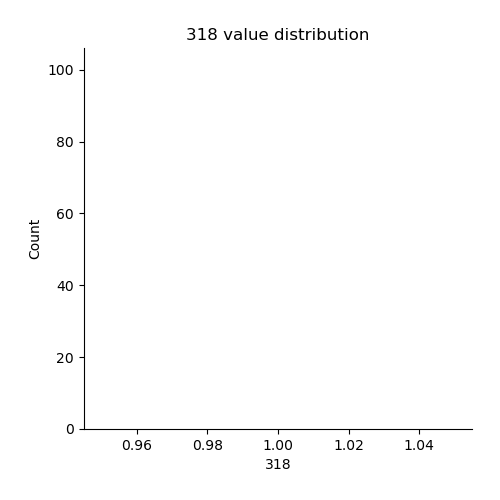
## Feature : 319
- **Feature type** : continous
- **Missing** : 0.0%
- **Unique** : 135
- **Count** :135.0
- **Mean** :0.5830032937832915
- **Std** :0.2392245635203684
- **Min** :-0.0617584046460595
- **25%th Percentile** : 0.43635195099928903
- **50%th Percentile** : 0.567597819888992
- **75%th Percentile** : 0.719481468730615
- **Max** :0.9914178993369546

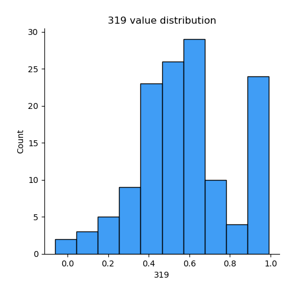
## Feature : 320
- **Feature type** : continous
- **Missing** : 0.0%
- **Unique** : 135
- **Count** :135.0
- **Mean** :0.5720188272493898
- **Std** :0.24488550031908615
- **Min** :-0.10907811907224735
- **25%th Percentile** : 0.4123004690568477
- **50%th Percentile** : 0.5533819000015564
- **75%th Percentile** : 0.7174000513818666
- **Max** :0.9853932322078149

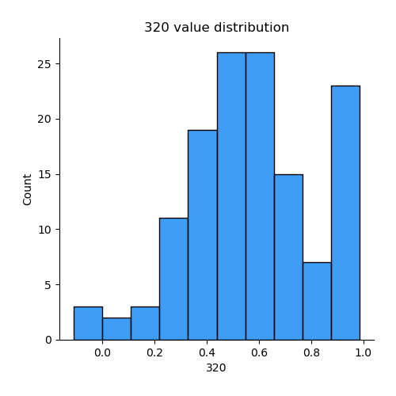
## Feature : 321
- **Feature type** : continous
- **Missing** : 0.0%
- **Unique** : 135
- **Count** :135.0
- **Mean** :0.6801031985704904
- **Std** :0.19952663533535067
- **Min** :0.16517040160915825
- **25%th Percentile** : 0.5656278290683185
- **50%th Percentile** : 0.6754739818704437
- **75%th Percentile** : 0.8059773277084183
- **Max** :0.9908168560430527

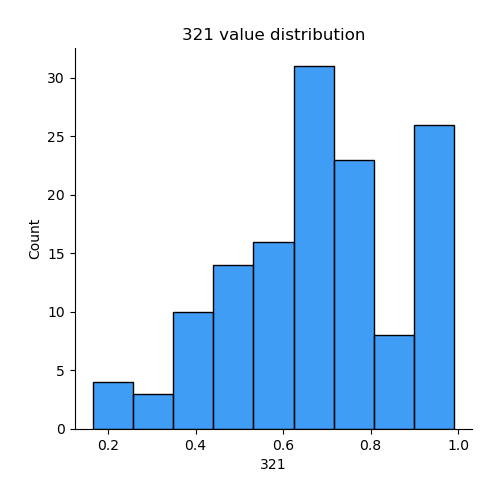
## Feature : 322
- **Feature type** : continous
- **Missing** : 0.0%
- **Unique** : 135
- **Count** :135.0
- **Mean** :0.641014720636469
- **Std** :0.21108161353824126
- **Min** :0.027987868504930253
- **25%th Percentile** : 0.512662183088167
- **50%th Percentile** : 0.6200028261818541
- **75%th Percentile** : 0.7713048108655463
- **Max** :0.9913666600647515

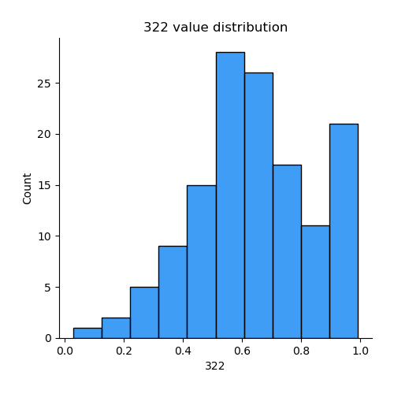
## Feature : 323
- **Feature type** : continous
- **Missing** : 0.0%
- **Unique** : 135
- **Count** :135.0
- **Mean** :0.7795325464426822
- **Std** :0.14897290458444226
- **Min** :0.23342832848163736
- **25%th Percentile** : 0.6858730309784542
- **50%th Percentile** : 0.7972349616759066
- **75%th Percentile** : 0.8768731069480598
- **Max** :0.9955367171850776

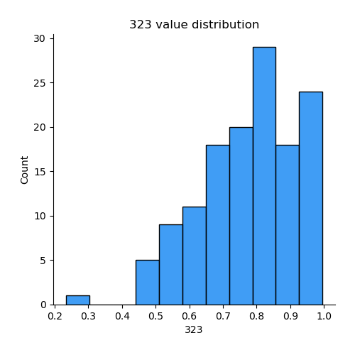
## Feature : 324
- **Feature type** : continous
- **Missing** : 0.0%
- **Unique** : 135
- **Count** :135.0
- **Mean** :0.48762620870343115
- **Std** :0.31098738911405577
- **Min** :-0.32779479807471273
- **25%th Percentile** : 0.29576915262628856
- **50%th Percentile** : 0.4875386326488399
- **75%th Percentile** : 0.6812300410672608
- **Max** :0.9917999341022397

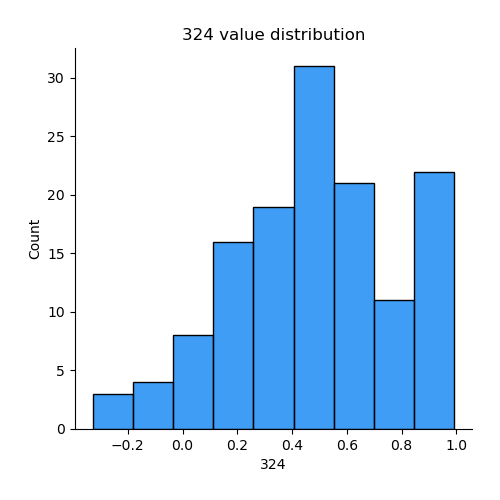
## Feature : 325
- **Feature type** : continous
- **Missing** : 0.0%
- **Unique** : 135
- **Count** :135.0
- **Mean** :0.6562807280722133
- **Std** :0.2196145170984605
- **Min** :0.10741375254135238
- **25%th Percentile** : 0.5236651467666482
- **50%th Percentile** : 0.6690242436938858
- **75%th Percentile** : 0.799225892813725
- **Max** :0.9950337672662427

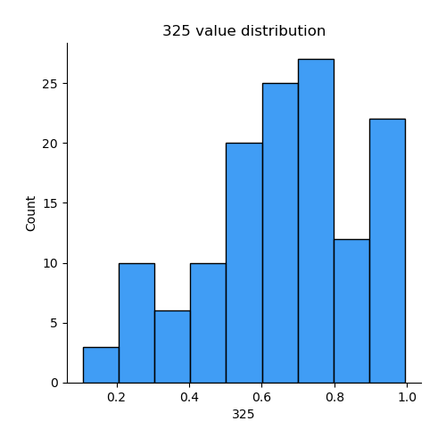
## Feature : 326
- **Feature type** : continous
- **Missing** : 0.0%
- **Unique** : 135
- **Count** :135.0
- **Mean** :0.5741008973595022
- **Std** :0.23306663695479402
- **Min** :-0.038126337848008666
- **25%th Percentile** : 0.4115757431082183
- **50%th Percentile** : 0.5561013601760364
- **75%th Percentile** : 0.7165796879283562
- **Max** :0.9847587652949432

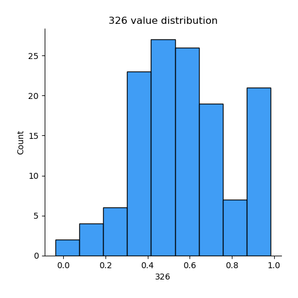
## Feature : 327
- **Feature type** : continous
- **Missing** : 0.0%
- **Unique** : 135
- **Count** :135.0
- **Mean** :0.5489181057201953
- **Std** :0.2767975428321499
- **Min** :-0.31920737603284954
- **25%th Percentile** : 0.3679465895196333
- **50%th Percentile** : 0.5423797269395548
- **75%th Percentile** : 0.7103003946727802
- **Max** :0.9926288806261399

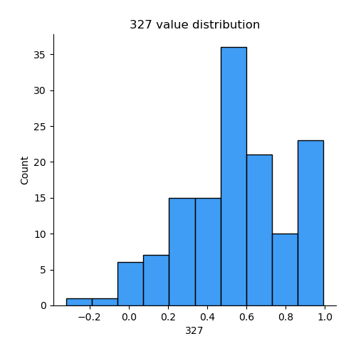
## Feature : 328
- **Feature type** : continous
- **Missing** : 0.0%
- **Unique** : 135
- **Count** :135.0
- **Mean** :0.5754818587232243
- **Std** :0.25881205821949105
- **Min** :-0.09220268235454504
- **25%th Percentile** : 0.4221904311212188
- **50%th Percentile** : 0.5520282429645053
- **75%th Percentile** : 0.7362078684112485
- **Max** :0.988417181803592

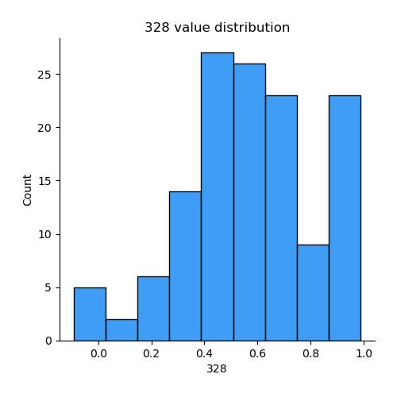
## Feature : 329
- **Feature type** : continous
- **Missing** : 0.0%
- **Unique** : 135
- **Count** :135.0
- **Mean** :0.584460407692787
- **Std** :0.2576176739598412
- **Min** :-0.1314331144769889
- **25%th Percentile** : 0.4174101650226225
- **50%th Percentile** : 0.5746908908084631
- **75%th Percentile** : 0.7511884827645526
- **Max** :0.9948801455420659

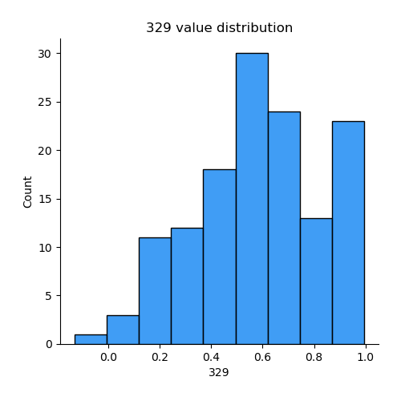
## Feature : 330
- **Feature type** : continous
- **Missing** : 0.0%
- **Unique** : 135
- **Count** :135.0
- **Mean** :0.6175291879403924
- **Std** :0.23300159067024123
- **Min** :-0.12869788273037638
- **25%th Percentile** : 0.47602656648858144
- **50%th Percentile** : 0.5917537510440823
- **75%th Percentile** : 0.7721023279228261
- **Max** :0.9902625144973715

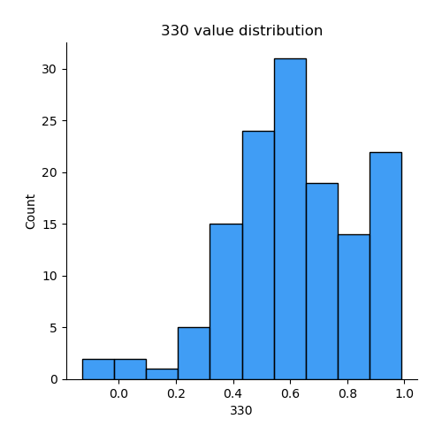
## Feature : 331
- **Feature type** : continous
- **Missing** : 0.0%
- **Unique** : 135
- **Count** :135.0
- **Mean** :0.43955850554029346
- **Std** :0.2939966348825191
- **Min** :-0.06562836807538067
- **25%th Percentile** : 0.21768942578548012
- **50%th Percentile** : 0.40009147294144615
- **75%th Percentile** : 0.5822065523497678
- **Max** :0.9850833387450845

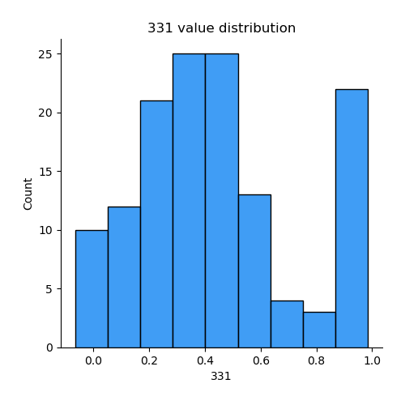
## Feature : 332
- **Feature type** : continous
- **Missing** : 0.0%
- **Unique** : 135
- **Count** :135.0
- **Mean** :0.568387023755313
- **Std** :0.2572042763996121
- **Min** :-0.14071704308499322
- **25%th Percentile** : 0.39839045334680956
- **50%th Percentile** : 0.549399512258768
- **75%th Percentile** : 0.7472836331506546
- **Max** :0.9938892681553987

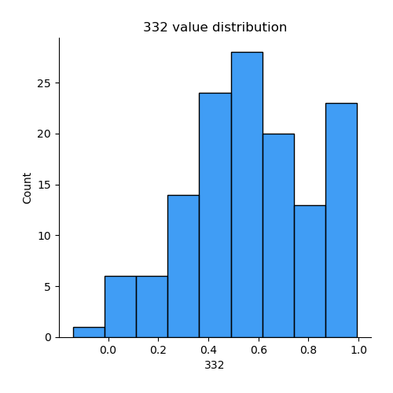
## Feature : 333
- **Feature type** : continous
- **Missing** : 0.0%
- **Unique** : 135
- **Count** :135.0
- **Mean** :0.6654048775600084
- **Std** :0.2212967544076008
- **Min** :-0.10749592151046906
- **25%th Percentile** : 0.5388986655013224
- **50%th Percentile** : 0.6849770095043549
- **75%th Percentile** : 0.805253897509841
- **Max** :0.9926303327001046

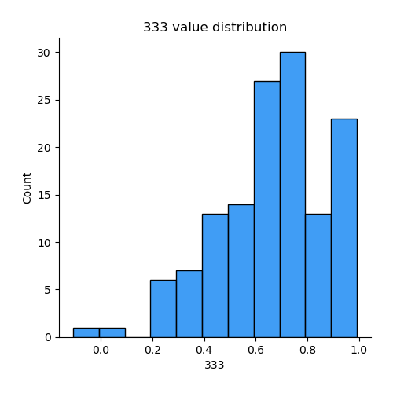
## Feature : 334
- **Feature type** : continous
- **Missing** : 0.0%
- **Unique** : 135
- **Count** :135.0
- **Mean** :0.6684489768961782
- **Std** :0.19765965247484618
- **Min** :0.12396447529155254
- **25%th Percentile** : 0.5474117447409776
- **50%th Percentile** : 0.646657928565789
- **75%th Percentile** : 0.8085865913577107
- **Max** :0.9923318849427638

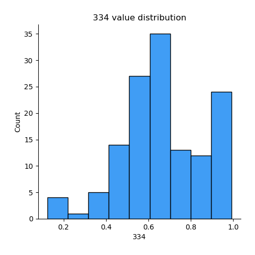
## Feature : 335
- **Feature type** : continous
- **Missing** : 0.0%
- **Unique** : 135
- **Count** :135.0
- **Mean** :0.6421886439798993
- **Std** :0.23764076675025955
- **Min** :-0.15799614566081938
- **25%th Percentile** : 0.479917234921424
- **50%th Percentile** : 0.6487238888965818
- **75%th Percentile** : 0.8162371796009886
- **Max** :0.9937734871041142

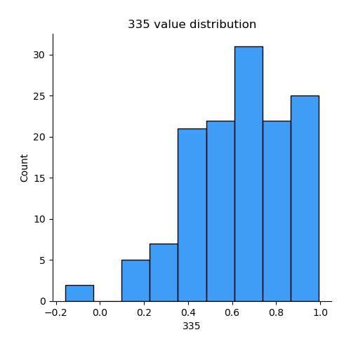
## Feature : 336
- **Feature type** : continous
- **Missing** : 0.0%
- **Unique** : 135
- **Count** :135.0
- **Mean** :0.5432381761340191
- **Std** :0.24904530685443024
- **Min** :-0.04223281065404963
- **25%th Percentile** : 0.3787445913059768
- **50%th Percentile** : 0.546284042268825
- **75%th Percentile** : 0.690013139475887
- **Max** :0.9870222573191023

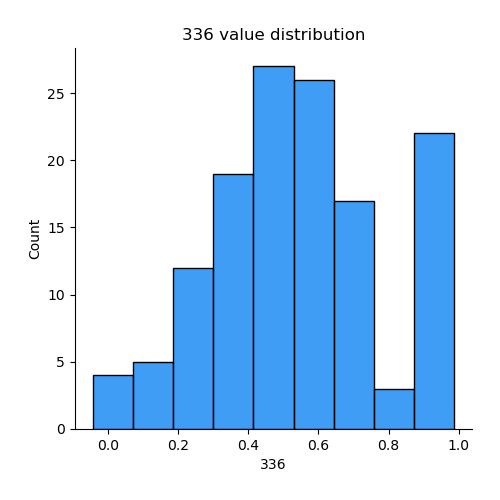
## Feature : 337
- **Feature type** : continous
- **Missing** : 0.0%
- **Unique** : 135
- **Count** :135.0
- **Mean** :0.5800818992825155
- **Std** :0.23120137893168657
- **Min** :0.030686260795754677
- **25%th Percentile** : 0.4102722800757567
- **50%th Percentile** : 0.5438723889711427
- **75%th Percentile** : 0.733631805035593
- **Max** :0.9842592789400015

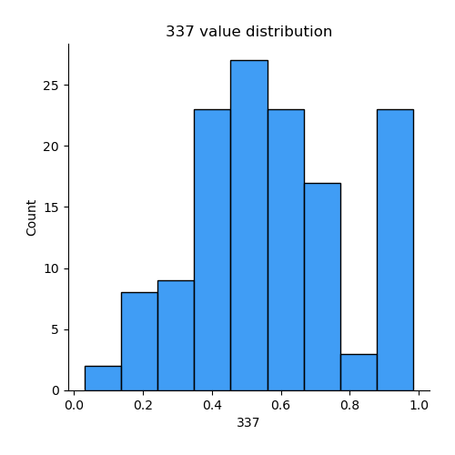
## Feature : 338
- **Feature type** : continous
- **Missing** : 0.0%
- **Unique** : 135
- **Count** :135.0
- **Mean** :0.4983004885182989
- **Std** :0.30364060011806354
- **Min** :-0.3392692786722222
- **25%th Percentile** : 0.3408159383926712
- **50%th Percentile** : 0.4775815974161323
- **75%th Percentile** : 0.6651586216652609
- **Max** :0.9899327431792327

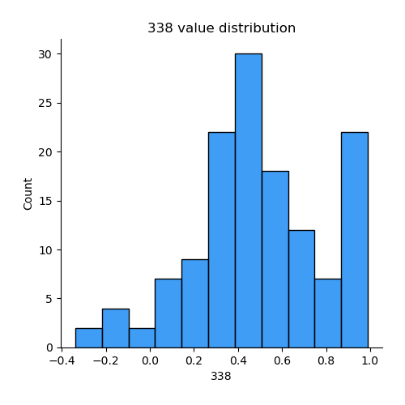
## Feature : 339
- **Feature type** : continous
- **Missing** : 0.0%
- **Unique** : 135
- **Count** :135.0
- **Mean** :0.48658459319838465
- **Std** :0.2850440121872525
- **Min** :-0.324329146275968
- **25%th Percentile** : 0.30606795212252347
- **50%th Percentile** : 0.4717962241951143
- **75%th Percentile** : 0.6281187681438549
- **Max** :0.9889391516181361

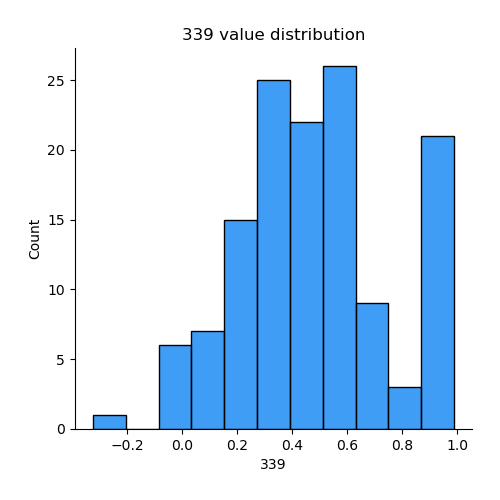
## Feature : 340
- **Feature type** : continous
- **Missing** : 0.0%
- **Unique** : 135
- **Count** :135.0
- **Mean** :0.5835364035710092
- **Std** :0.24665250362810562
- **Min** :0.07883753129218593
- **25%th Percentile** : 0.4415108356985979
- **50%th Percentile** : 0.5631770261991333
- **75%th Percentile** : 0.7557632978403174
- **Max** :0.9864070133762448

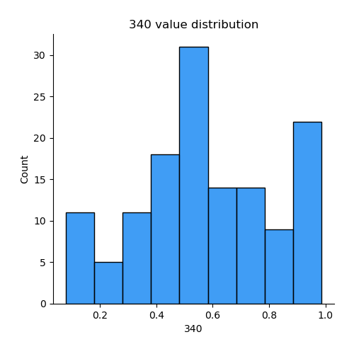
## Feature : 341
- **Feature type** : continous
- **Missing** : 0.0%
- **Unique** : 135
- **Count** :135.0
- **Mean** :0.4910969129183387
- **Std** :0.27665816392430725
- **Min** :-0.22779525090177277
- **25%th Percentile** : 0.29104138259405465
- **50%th Percentile** : 0.49918374292641343
- **75%th Percentile** : 0.6703935448276468
- **Max** :0.9829674870358049

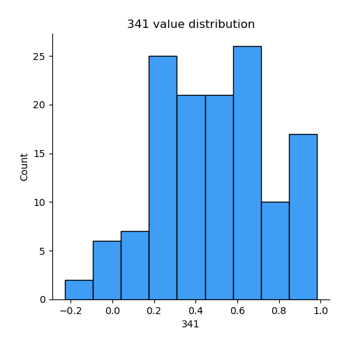
## Feature : 342
- **Feature type** : continous
- **Missing** : 0.0%
- **Unique** : 135
- **Count** :135.0
- **Mean** :0.7317245177747822
- **Std** :0.17352541112486894
- **Min** :0.12212820767064743
- **25%th Percentile** : 0.6120782971170821
- **50%th Percentile** : 0.7239684970535353
- **75%th Percentile** : 0.8662636109186208
- **Max** :0.9958554449797394

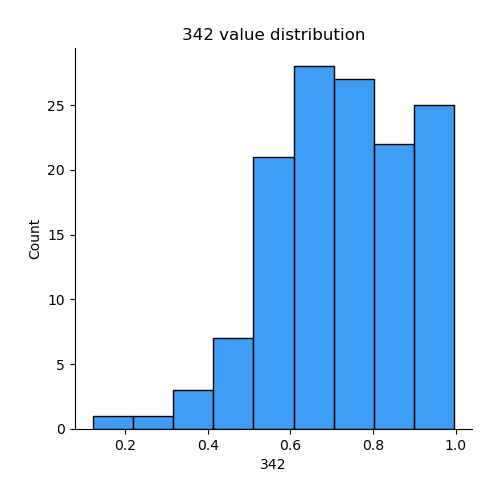
## Feature : 343
- **Feature type** : continous
- **Missing** : 0.0%
- **Unique** : 135
- **Count** :135.0
- **Mean** :0.6003531808765878
- **Std** :0.24894839409919892
- **Min** :-0.10041107829536854
- **25%th Percentile** : 0.4265038326092032
- **50%th Percentile** : 0.5947031086446801
- **75%th Percentile** : 0.7710402866929233
- **Max** :0.9915584856607348

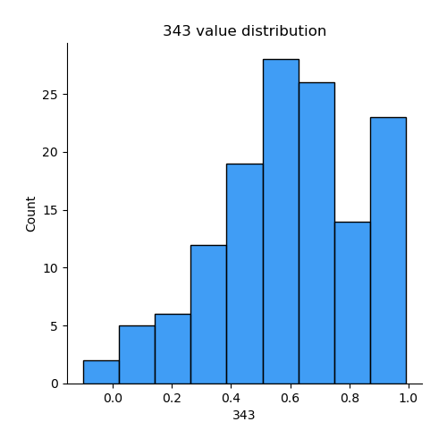
## Feature : 344
- **Feature type** : continous
- **Missing** : 0.0%
- **Unique** : 135
- **Count** :135.0
- **Mean** :0.7372824794511316
- **Std** :0.2051413399704027
- **Min** :0.011758496398627158
- **25%th Percentile** : 0.6506923591653381
- **50%th Percentile** : 0.7611552673537081
- **75%th Percentile** : 0.8702112514154278
- **Max** :0.9969471031498185

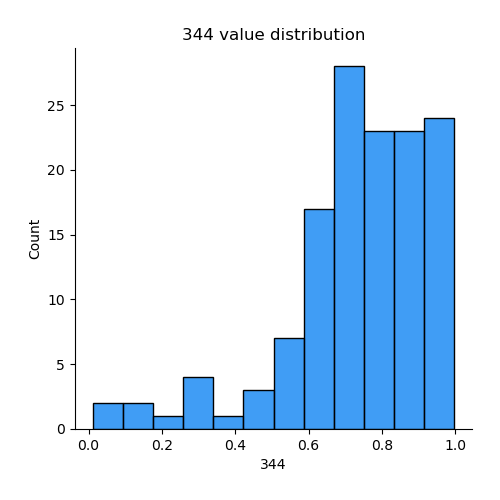
## Feature : 345
- **Feature type** : continous
- **Missing** : 0.0%
- **Unique** : 135
- **Count** :135.0
- **Mean** :0.5376068967343529
- **Std** :0.27507637528035705
- **Min** :-0.25678772889114415
- **25%th Percentile** : 0.37426887808283504
- **50%th Percentile** : 0.5050362973728127
- **75%th Percentile** : 0.7159719943273157
- **Max** :0.9911138100208988

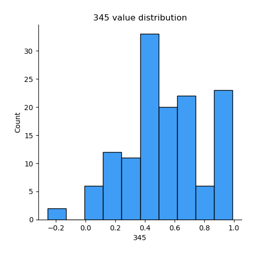
## Feature : 346
- **Feature type** : continous
- **Missing** : 0.0%
- **Unique** : 135
- **Count** :135.0
- **Mean** :0.5761273251864267
- **Std** :0.2456192189556109
- **Min** :-0.23940265675082312
- **25%th Percentile** : 0.4343923743007174
- **50%th Percentile** : 0.5468824494704922
- **75%th Percentile** : 0.7195842873221991
- **Max** :0.9846109279333722

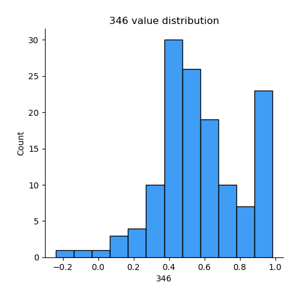
## Feature : 347
- **Feature type** : continous
- **Missing** : 0.0%
- **Unique** : 135
- **Count** :135.0
- **Mean** :0.6320342426274662
- **Std** :0.22853084164449933
- **Min** :-0.11245894721087839
- **25%th Percentile** : 0.5083533877077601
- **50%th Percentile** : 0.6325006836246292
- **75%th Percentile** : 0.7829488070983923
- **Max** :0.99339722973537

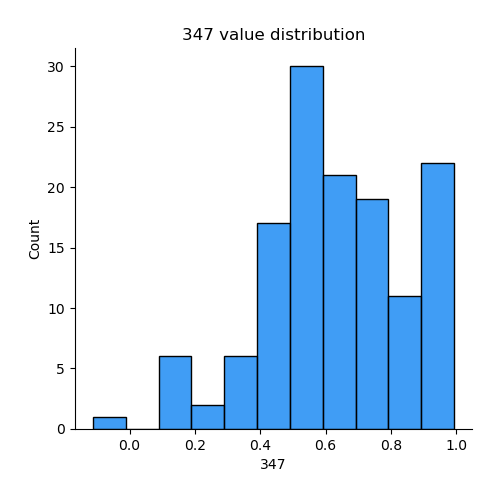
## Feature : 348
- **Feature type** : continous
- **Missing** : 0.0%
- **Unique** : 135
- **Count** :135.0
- **Mean** :0.6248619545585008
- **Std** :0.22537106286071218
- **Min** :0.10036464413968499
- **25%th Percentile** : 0.4945442925530106
- **50%th Percentile** : 0.6132466809648605
- **75%th Percentile** : 0.7641177036237229
- **Max** :0.9920159545829685

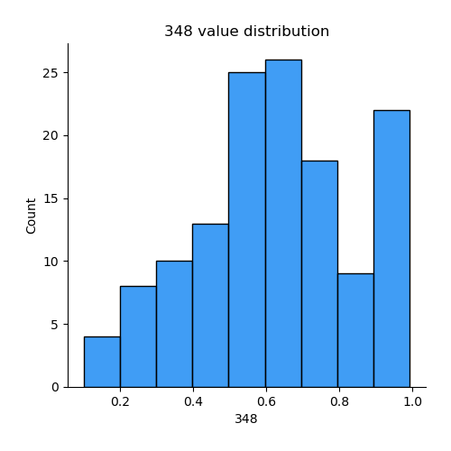
## Feature : 349
- **Feature type** : continous
- **Missing** : 0.0%
- **Unique** : 135
- **Count** :135.0
- **Mean** :0.6390418168081308
- **Std** :0.25909844230265755
- **Min** :-0.3135413295624375
- **25%th Percentile** : 0.4941586642816299
- **50%th Percentile** : 0.6551458203331987
- **75%th Percentile** : 0.8195482303786119
- **Max** :0.9950149604227237

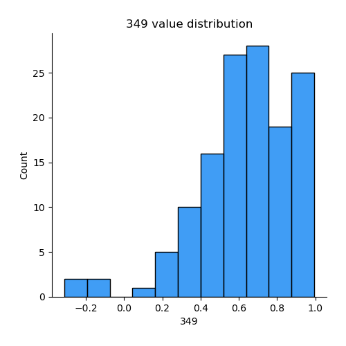
## Feature : 350
- **Feature type** : continous
- **Missing** : 0.0%
- **Unique** : 135
- **Count** :135.0
- **Mean** :0.4698150386154826
- **Std** :0.3152650812594918
- **Min** :-0.21715531548367678
- **25%th Percentile** : 0.24450975546419756
- **50%th Percentile** : 0.4840851166473384
- **75%th Percentile** : 0.642451603574569
- **Max** :0.9924911049143693

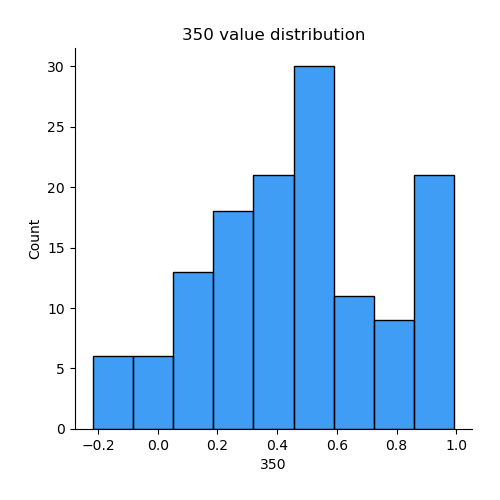
## Feature : 351
- **Feature type** : continous
- **Missing** : 0.0%
- **Unique** : 135
- **Count** :135.0
- **Mean** :0.5952615226576483
- **Std** :0.23895875433700525
- **Min** :-0.1803222062473653
- **25%th Percentile** : 0.446520359312858
- **50%th Percentile** : 0.5857228237389174
- **75%th Percentile** : 0.718802952930211
- **Max** :0.992919534881463

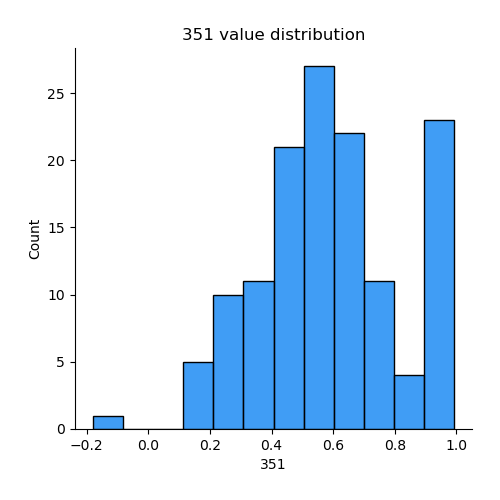
## Feature : 352
- **Feature type** : continous
- **Missing** : 0.0%
- **Unique** : 135
- **Count** :135.0
- **Mean** :0.5640390377755831
- **Std** :0.24304533104035753
- **Min** :-0.13393095229505145
- **25%th Percentile** : 0.4084931161831817
- **50%th Percentile** : 0.5450637482278089
- **75%th Percentile** : 0.7116402546156315
- **Max** :0.9860948619617924

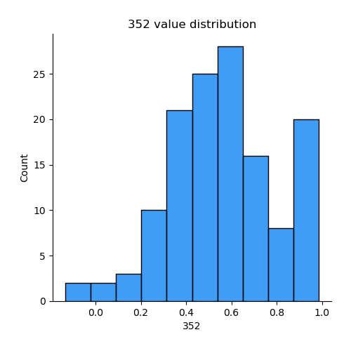
## Feature : 353
- **Feature type** : continous
- **Missing** : 0.0%
- **Unique** : 135
- **Count** :135.0
- **Mean** :0.49474617237033186
- **Std** :0.3136884819279786
- **Min** :-0.34541364686592335
- **25%th Percentile** : 0.29345451024263813
- **50%th Percentile** : 0.5277759597642986
- **75%th Percentile** : 0.6827484013766768
- **Max** :0.9909409674288459

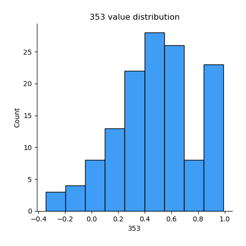
## Feature : 354
- **Feature type** : continous
- **Missing** : 0.0%
- **Unique** : 135
- **Count** :135.0
- **Mean** :0.5471476720687956
- **Std** :0.2673180099438011
- **Min** :-0.2665455072177172
- **25%th Percentile** : 0.3480785128669117
- **50%th Percentile** : 0.5352270275449805
- **75%th Percentile** : 0.6991832824002087
- **Max** :0.9877244704235709

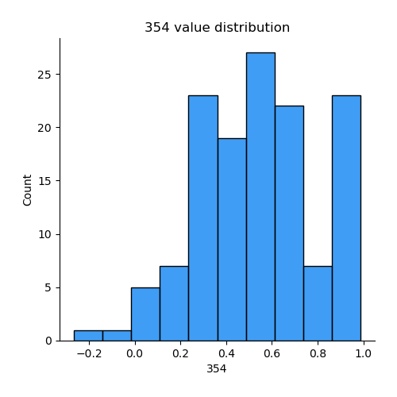
## Feature : 355
- **Feature type** : continous
- **Missing** : 0.0%
- **Unique** : 135
- **Count** :135.0
- **Mean** :0.5254549813071456
- **Std** :0.2985909301865924
- **Min** :-0.3211424368667067
- **25%th Percentile** : 0.33170190669272215
- **50%th Percentile** : 0.5436880552840314
- **75%th Percentile** : 0.717444609254698
- **Max** :0.9917077422003507

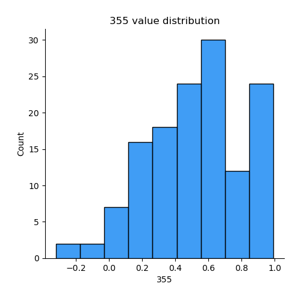
## Feature : 356
- **Feature type** : continous
- **Missing** : 0.0%
- **Unique** : 135
- **Count** :135.0
- **Mean** :0.591811957724999
- **Std** :0.24237077377664606
- **Min** :-0.0697963469360386
- **25%th Percentile** : 0.4344838978948897
- **50%th Percentile** : 0.5799966324401142
- **75%th Percentile** : 0.7366023010296656
- **Max** :0.9911441386870512

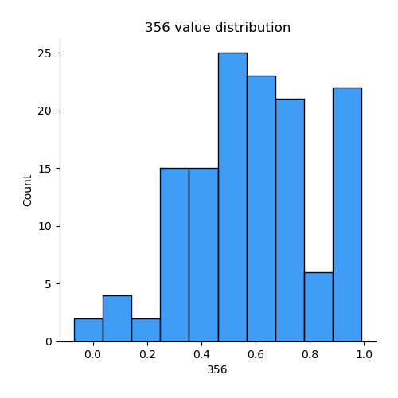
## Feature : 357
- **Feature type** : continous
- **Missing** : 0.0%
- **Unique** : 135
- **Count** :135.0
- **Mean** :0.3844173054758073
- **Std** :0.30993458219861386
- **Min** :-0.17475346005352607
- **25%th Percentile** : 0.17551994884394428
- **50%th Percentile** : 0.30670639696865076
- **75%th Percentile** : 0.5153004998017299
- **Max** :0.9859753900797813

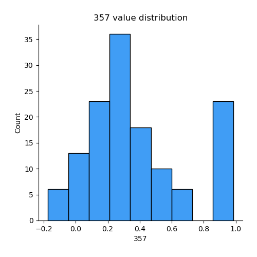
## Feature : 358
- **Feature type** : continous
- **Missing** : 0.0%
- **Unique** : 135
- **Count** :135.0
- **Mean** :0.5331389577517162
- **Std** :0.2797973864070958
- **Min** :-0.24398368223374592
- **25%th Percentile** : 0.35471967519772235
- **50%th Percentile** : 0.5113859869743906
- **75%th Percentile** : 0.7091924664991891
- **Max** :0.9919381188095044

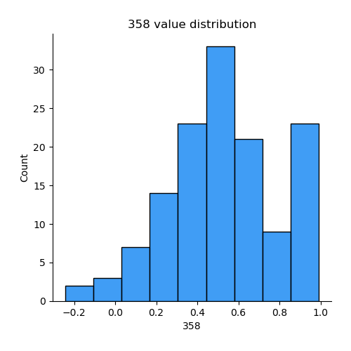
## Feature : 359
- **Feature type** : continous
- **Missing** : 0.0%
- **Unique** : 135
- **Count** :135.0
- **Mean** :0.6221944734281356
- **Std** :0.23869187130921954
- **Min** :-0.287005472821541
- **25%th Percentile** : 0.4673291780637876
- **50%th Percentile** : 0.6236122547605769
- **75%th Percentile** : 0.762182961729643
- **Max** :0.9912633760596986

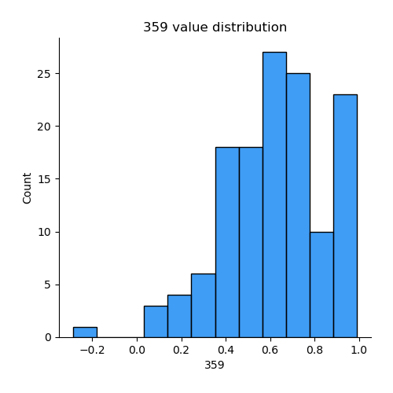
## Feature : 360
- **Feature type** : continous
- **Missing** : 0.0%
- **Unique** : 135
- **Count** :135.0
- **Mean** :0.5790286050750121
- **Std** :0.27155588447983153
- **Min** :-0.29152059602038427
- **25%th Percentile** : 0.43476992170180284
- **50%th Percentile** : 0.5729499731963342
- **75%th Percentile** : 0.7476992389272397
- **Max** :0.989736609780724

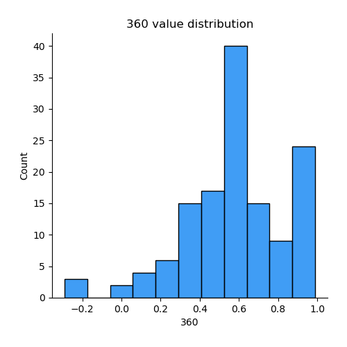
## Feature : 361
- **Feature type** : continous
- **Missing** : 0.0%
- **Unique** : 135
- **Count** :135.0
- **Mean** :0.5342443071989141
- **Std** :0.28967925678956613
- **Min** :-0.1976431946533212
- **25%th Percentile** : 0.3441057480856434
- **50%th Percentile** : 0.5476899185431239
- **75%th Percentile** : 0.6913967656864834
- **Max** :0.9909143998518608

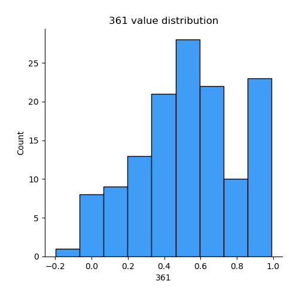
## Feature : 362
- **Feature type** : continous
- **Missing** : 0.0%
- **Unique** : 135
- **Count** :135.0
- **Mean** :0.4868055359171172
- **Std** :0.2773934666133831
- **Min** :-0.1915718864156805
- **25%th Percentile** : 0.2994302956216477
- **50%th Percentile** : 0.47795258087304043
- **75%th Percentile** : 0.6539265465879447
- **Max** :0.9849138101524022

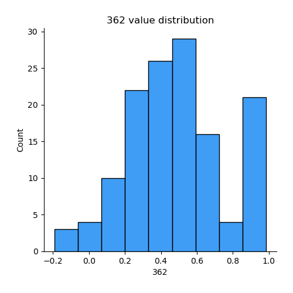
## Feature : 363
- **Feature type** : continous
- **Missing** : 0.0%
- **Unique** : 135
- **Count** :135.0
- **Mean** :0.4751793105250351
- **Std** :0.282167222130591
- **Min** :-0.10654599295846612
- **25%th Percentile** : 0.2838947179683986
- **50%th Percentile** : 0.43135744308809776
- **75%th Percentile** : 0.6395519367727851
- **Max** :0.9862544070886035

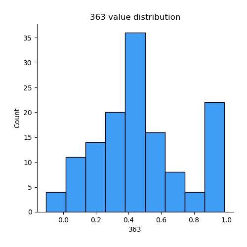
## Feature : 371
- **Feature type** : continous
- **Missing** : 0.0%
- **Unique** : 3
- **Count** :135.0
- **Mean** :1.0
- **Std** :1.0329678986476926e-16
- **Min** :0.9999999999999998
- **25%th Percentile** : 0.9999999999999999
- **50%th Percentile** : 1.0
- **75%th Percentile** : 1.0
- **Max** :1.0

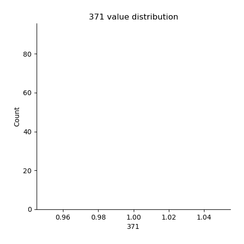
## Feature : 372
- **Feature type** : continous
- **Missing** : 0.0%
- **Unique** : 135
- **Count** :135.0
- **Mean** :0.5908637024015398
- **Std** :0.2452674616518052
- **Min** :-0.04485733151848543
- **25%th Percentile** : 0.41686987460276514
- **50%th Percentile** : 0.5955709201667955
- **75%th Percentile** : 0.7454997727905284
- **Max** :0.9838373619376521

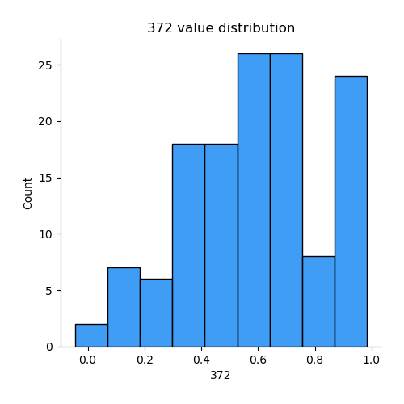
## Feature : 373
- **Feature type** : continous
- **Missing** : 0.0%
- **Unique** : 135
- **Count** :135.0
- **Mean** :0.5680434472963426
- **Std** :0.23943548418941552
- **Min** :-0.02448009377845743
- **25%th Percentile** : 0.4156538288351219
- **50%th Percentile** : 0.5675880824075346
- **75%th Percentile** : 0.6889655717422497
- **Max** :0.9863945648424608

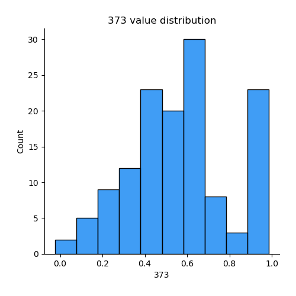
## Feature : 374
- **Feature type** : continous
- **Missing** : 0.0%
- **Unique** : 135
- **Count** :135.0
- **Mean** :0.6439265537551685
- **Std** :0.20739849732574733
- **Min** :0.003370149927760806
- **25%th Percentile** : 0.5142567021170965
- **50%th Percentile** : 0.6344442561628443
- **75%th Percentile** : 0.7786963575577679
- **Max** :0.9924510361732645

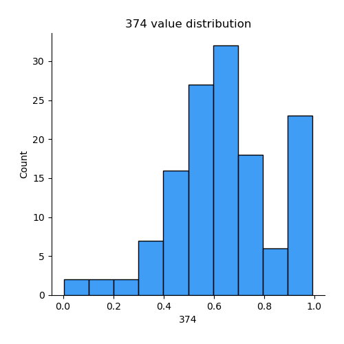
## Feature : 375
- **Feature type** : continous
- **Missing** : 0.0%
- **Unique** : 135
- **Count** :135.0
- **Mean** :0.5774856730566484
- **Std** :0.26540974039983223
- **Min** :-0.18300177605329712
- **25%th Percentile** : 0.43456914640292127
- **50%th Percentile** : 0.5836396435182879
- **75%th Percentile** : 0.7271329643370346
- **Max** :0.993061794605735

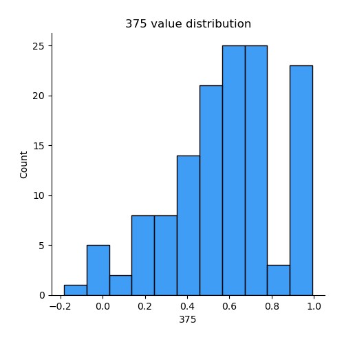
## Feature : 376
- **Feature type** : continous
- **Missing** : 0.0%
- **Unique** : 135
- **Count** :135.0
- **Mean** :0.6235402834412592
- **Std** :0.24267322340845918
- **Min** :-0.013804064390949418
- **25%th Percentile** : 0.4822879986005856
- **50%th Percentile** : 0.6312559254312392
- **75%th Percentile** : 0.7678104615868602
- **Max** :0.996775712774948

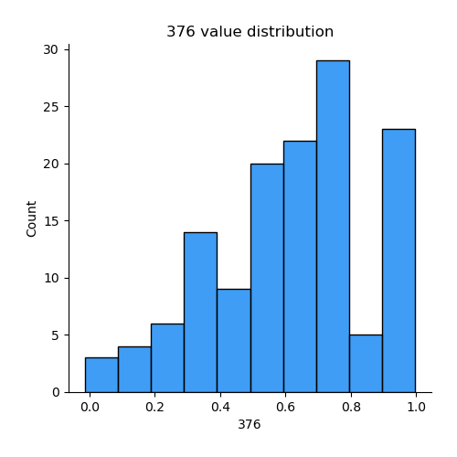
## Feature : 377
- **Feature type** : continous
- **Missing** : 0.0%
- **Unique** : 135
- **Count** :135.0
- **Mean** :0.5636893838945136
- **Std** :0.24412967623542317
- **Min** :0.012443494346793116
- **25%th Percentile** : 0.41369474302517695
- **50%th Percentile** : 0.5250660962111066
- **75%th Percentile** : 0.7012718707714234
- **Max** :0.9931851155440117

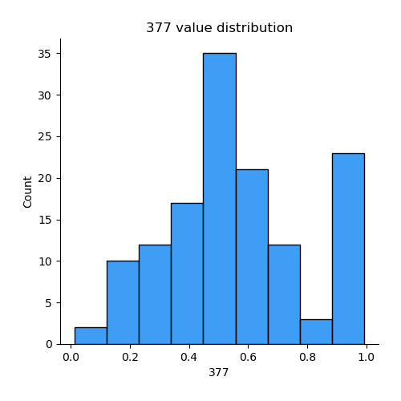
## Feature : 378
- **Feature type** : continous
- **Missing** : 0.0%
- **Unique** : 135
- **Count** :135.0
- **Mean** :0.6089497931890112
- **Std** :0.21824180760030987
- **Min** :-0.20069266499996635
- **25%th Percentile** : 0.4632915330738451
- **50%th Percentile** : 0.5875721408733618
- **75%th Percentile** : 0.7415468240420493
- **Max** :0.9881567346786615

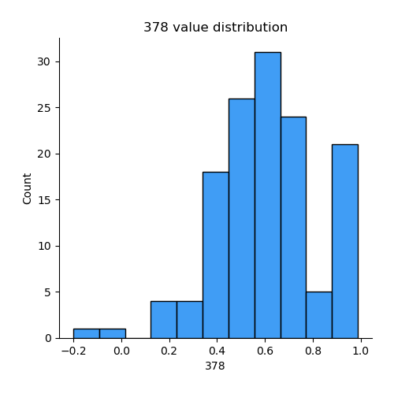
## Feature : 379
- **Feature type** : continous
- **Missing** : 0.0%
- **Unique** : 135
- **Count** :135.0
- **Mean** :0.7133506260679027
- **Std** :0.18730222555628892
- **Min** :0.09318789449195727
- **25%th Percentile** : 0.5926142682189489
- **50%th Percentile** : 0.7245267674789158
- **75%th Percentile** : 0.836230648795432
- **Max** :0.9960702242510239

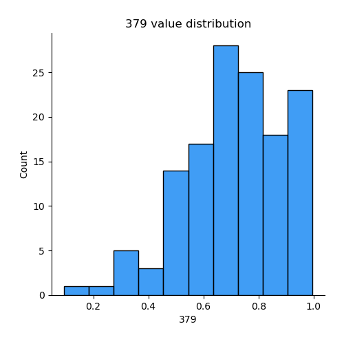
## Feature : 380
- **Feature type** : continous
- **Missing** : 0.0%
- **Unique** : 135
- **Count** :135.0
- **Mean** :0.6913017200606717
- **Std** :0.2068560151372959
- **Min** :0.06813583101016586
- **25%th Percentile** : 0.5575829460097903
- **50%th Percentile** : 0.727005824599336
- **75%th Percentile** : 0.812308747123696
- **Max** :0.9942129266357963

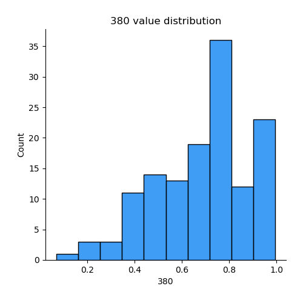
## Feature : 381
- **Feature type** : continous
- **Missing** : 0.0%
- **Unique** : 135
- **Count** :135.0
- **Mean** :0.7342138531603437
- **Std** :0.18191391988376418
- **Min** :0.07247955106174261
- **25%th Percentile** : 0.6341625078629487
- **50%th Percentile** : 0.7557213815920246
- **75%th Percentile** : 0.8445579444158193
- **Max** :0.9974013072289578

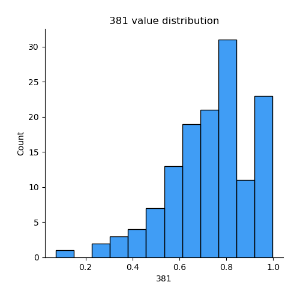
## Feature : 382
- **Feature type** : continous
- **Missing** : 0.0%
- **Unique** : 135
- **Count** :135.0
- **Mean** :0.6680691124178132
- **Std** :0.20177700099845586
- **Min** :0.07305898998575915
- **25%th Percentile** : 0.5437133877529137
- **50%th Percentile** : 0.6691789098397313
- **75%th Percentile** : 0.7887161091117303
- **Max** :0.9925062788458243

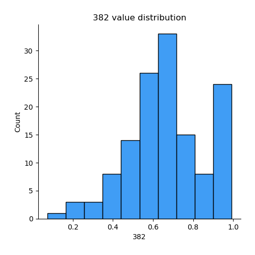
## Feature : 383
- **Feature type** : continous
- **Missing** : 0.0%
- **Unique** : 135
- **Count** :135.0
- **Mean** :0.5572245103736994
- **Std** :0.268253263914552
- **Min** :0.03501643514784211
- **25%th Percentile** : 0.3616726266640322
- **50%th Percentile** : 0.5494978599484872
- **75%th Percentile** : 0.7301490314465753
- **Max** :0.9926672575071058

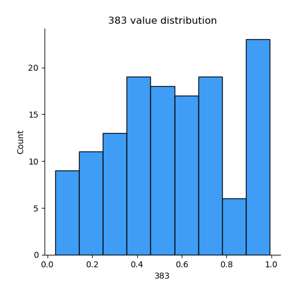
## Feature : 384
- **Feature type** : continous
- **Missing** : 0.0%
- **Unique** : 135
- **Count** :135.0
- **Mean** :0.6121549475888656
- **Std** :0.24696075642441995
- **Min** :-0.21551645696259047
- **25%th Percentile** : 0.4697989220423363
- **50%th Percentile** : 0.619947960535509
- **75%th Percentile** : 0.7742531208103489
- **Max** :0.9965496809941725

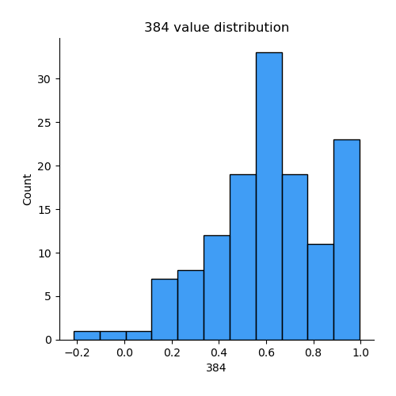
## Feature : 385
- **Feature type** : continous
- **Missing** : 0.0%
- **Unique** : 135
- **Count** :135.0
- **Mean** :0.6436126546191899
- **Std** :0.21742223765192956
- **Min** :-0.004106528405910214
- **25%th Percentile** : 0.5062925883321047
- **50%th Percentile** : 0.6615943847208293
- **75%th Percentile** : 0.7573648554895226
- **Max** :0.9948481545598618

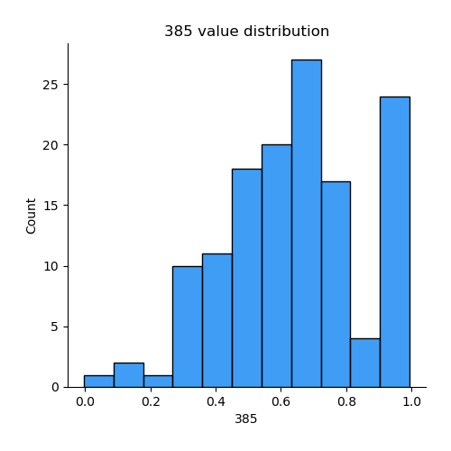
## Feature : 386
- **Feature type** : continous
- **Missing** : 0.0%
- **Unique** : 135
- **Count** :135.0
- **Mean** :0.7817610419502684
- **Std** :0.1678448099490272
- **Min** :0.08446852358509435
- **25%th Percentile** : 0.7013369617711707
- **50%th Percentile** : 0.7998495365534629
- **75%th Percentile** : 0.887734515684026
- **Max** :0.9970853440201906

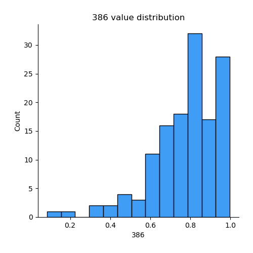
## Feature : 387
- **Feature type** : continous
- **Missing** : 0.0%
- **Unique** : 135
- **Count** :135.0
- **Mean** :0.7594685349603868
- **Std** :0.1601830970689865
- **Min** :0.2923339720486025
- **25%th Percentile** : 0.6620181953083228
- **50%th Percentile** : 0.7697959572338056
- **75%th Percentile** : 0.8545138923990454
- **Max** :0.9961107470528181

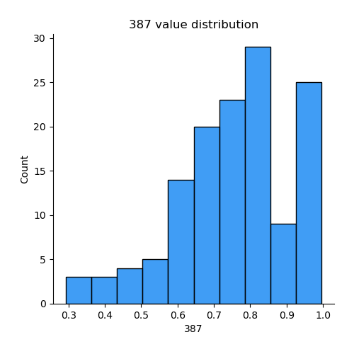
## Feature : 388
- **Feature type** : continous
- **Missing** : 0.0%
- **Unique** : 135
- **Count** :135.0
- **Mean** :0.47091962844958185
- **Std** :0.2840015322744669
- **Min** :-0.4601631200831638
- **25%th Percentile** : 0.2696677658007345
- **50%th Percentile** : 0.4440158749646614
- **75%th Percentile** : 0.6578279553445967
- **Max** :0.9832318424045807

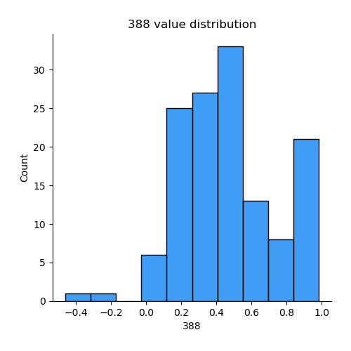
## Feature : 389
- **Feature type** : continous
- **Missing** : 0.0%
- **Unique** : 135
- **Count** :135.0
- **Mean** :0.7539770536310386
- **Std** :0.16773858074561165
- **Min** :0.007686144792728637
- **25%th Percentile** : 0.6434985772489458
- **50%th Percentile** : 0.7739215089779504
- **75%th Percentile** : 0.8709127350685628
- **Max** :0.9927422195840456

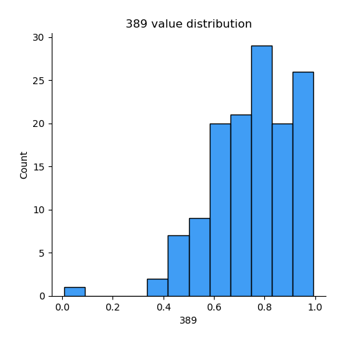
## Feature : 390
- **Feature type** : continous
- **Missing** : 0.0%
- **Unique** : 135
- **Count** :135.0
- **Mean** :0.5914303628299449
- **Std** :0.26244684986296535
- **Min** :-0.06009031371661987
- **25%th Percentile** : 0.42031783839388503
- **50%th Percentile** : 0.5985672181155202
- **75%th Percentile** : 0.7622655730275316
- **Max** :0.9930841097211602

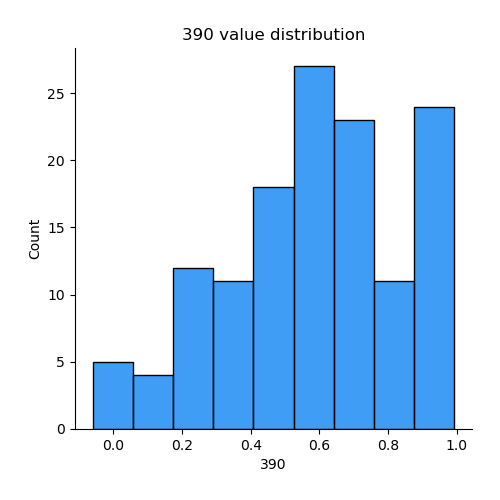
## Feature : 391
- **Feature type** : continous
- **Missing** : 0.0%
- **Unique** : 135
- **Count** :135.0
- **Mean** :0.6756535689407261
- **Std** :0.19679596703591345
- **Min** :0.180608926274863
- **25%th Percentile** : 0.5486555705604408
- **50%th Percentile** : 0.6712221044305616
- **75%th Percentile** : 0.7937079120557817
- **Max** :0.9942875777523958

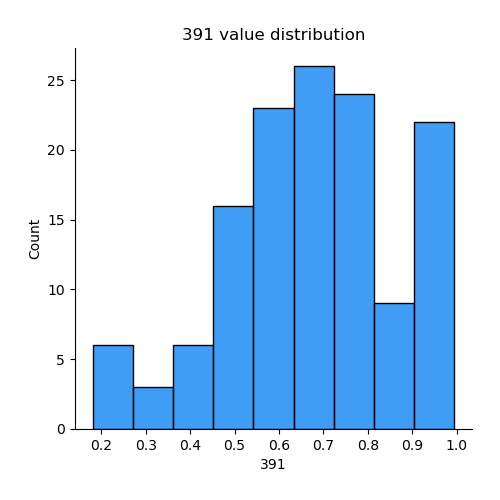
## Feature : 392
- **Feature type** : continous
- **Missing** : 0.0%
- **Unique** : 135
- **Count** :135.0
- **Mean** :0.6165260759169034
- **Std** :0.22223573015984863
- **Min** :0.05825852926798487
- **25%th Percentile** : 0.45773935926321674
- **50%th Percentile** : 0.6109901825084791
- **75%th Percentile** : 0.7522141624167322
- **Max** :0.9901853725098937

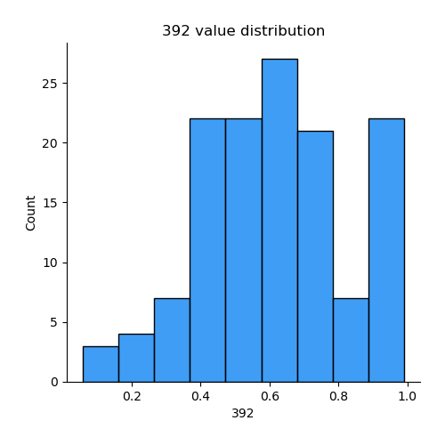
## Feature : 393
- **Feature type** : continous
- **Missing** : 0.0%
- **Unique** : 135
- **Count** :135.0
- **Mean** :0.4327433039050305
- **Std** :0.2854169064675675
- **Min** :-0.16800644350363675
- **25%th Percentile** : 0.23062661309935187
- **50%th Percentile** : 0.41405693541124033
- **75%th Percentile** : 0.5857348131449925
- **Max** :0.9874527887018693

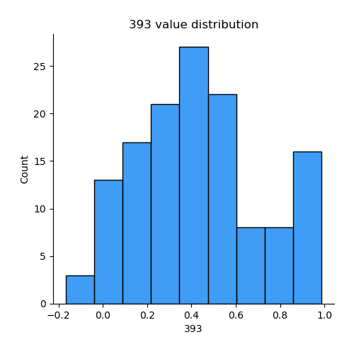
## Feature : 394
- **Feature type** : continous
- **Missing** : 0.0%
- **Unique** : 135
- **Count** :135.0
- **Mean** :0.6013873729258585
- **Std** :0.23810830598549015
- **Min** :-0.06037632895710351
- **25%th Percentile** : 0.4667447329820027
- **50%th Percentile** : 0.5823716859041058
- **75%th Percentile** : 0.7351972839631296
- **Max** :0.9933450638385146

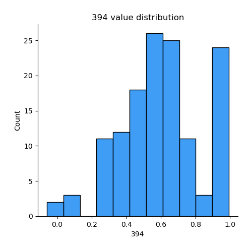
## Feature : 395
- **Feature type** : continous
- **Missing** : 0.0%
- **Unique** : 135
- **Count** :135.0
- **Mean** :0.5959446962869467
- **Std** :0.25388282420699676
- **Min** :-0.068383909202079
- **25%th Percentile** : 0.4357570445213963
- **50%th Percentile** : 0.5975484044648071
- **75%th Percentile** : 0.7469093713461593
- **Max** :0.9934048226635914

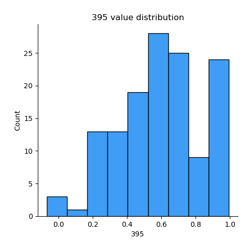
## Feature : 396
- **Feature type** : continous
- **Missing** : 0.0%
- **Unique** : 135
- **Count** :135.0
- **Mean** :0.540656586028988
- **Std** :0.2761681077676303
- **Min** :-0.30980525051661223
- **25%th Percentile** : 0.38945232172900096
- **50%th Percentile** : 0.5644343095098022
- **75%th Percentile** : 0.661111769469038
- **Max** :0.9920856391097846

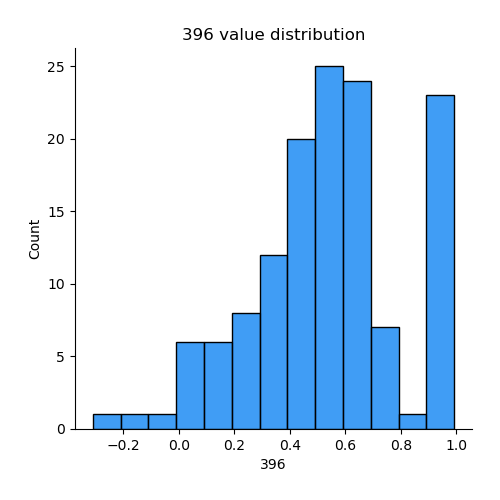
## Feature : 397
- **Feature type** : continous
- **Missing** : 0.0%
- **Unique** : 135
- **Count** :135.0
- **Mean** :0.8300905042484682
- **Std** :0.1484746131045924
- **Min** :0.046196229793052025
- **25%th Percentile** : 0.7688142143863044
- **50%th Percentile** : 0.84868229985627
- **75%th Percentile** : 0.9359713501566369
- **Max** :0.998216760430386

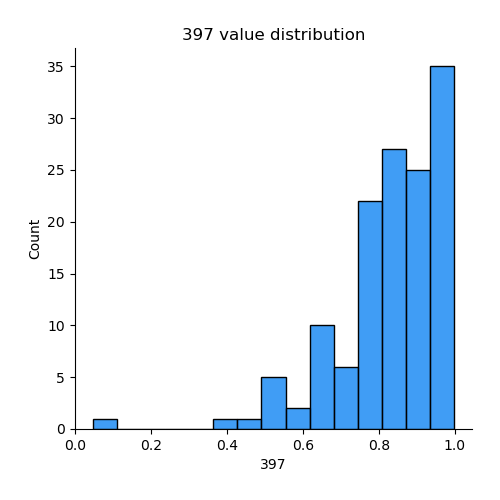
## Feature : 398
- **Feature type** : continous
- **Missing** : 0.0%
- **Unique** : 135
- **Count** :135.0
- **Mean** :0.6011535987154702
- **Std** :0.24674287647026946
- **Min** :-0.08322897451153216
- **25%th Percentile** : 0.42937609043185354
- **50%th Percentile** : 0.618563762753018
- **75%th Percentile** : 0.770794686590983
- **Max** :0.987887705506032

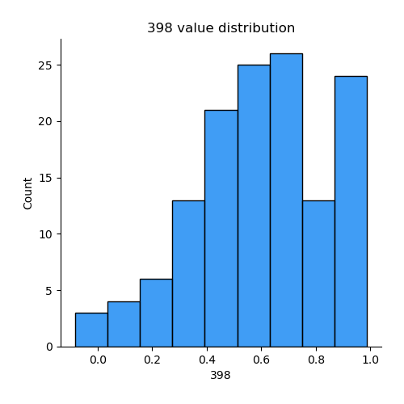
## Feature : 399
- **Feature type** : continous
- **Missing** : 0.0%
- **Unique** : 135
- **Count** :135.0
- **Mean** :0.5579996402539459
- **Std** :0.24675684608540052
- **Min** :-0.06067383933125011
- **25%th Percentile** : 0.3951310656927907
- **50%th Percentile** : 0.5485054019242834
- **75%th Percentile** : 0.6820692364040217
- **Max** :0.9879831965050032

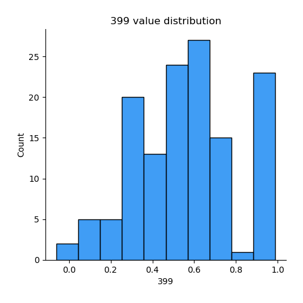
## Feature : 400
- **Feature type** : continous
- **Missing** : 0.0%
- **Unique** : 135
- **Count** :135.0
- **Mean** :0.6304548170244993
- **Std** :0.21990525500476
- **Min** :0.05008524907155864
- **25%th Percentile** : 0.49433351379649376
- **50%th Percentile** : 0.6116848079483368
- **75%th Percentile** : 0.779788320579643
- **Max** :0.9933083066444478

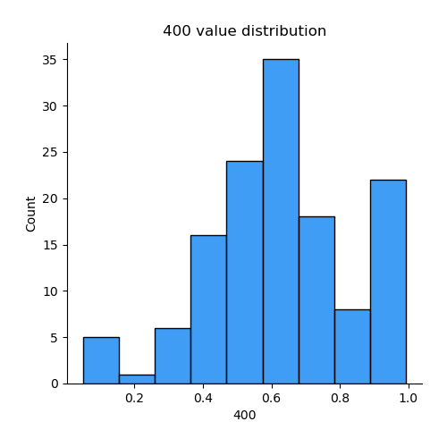
## Feature : 401
- **Feature type** : continous
- **Missing** : 0.0%
- **Unique** : 135
- **Count** :135.0
- **Mean** :0.565168708969758
- **Std** :0.27746586771908643
- **Min** :-0.14745076595009865
- **25%th Percentile** : 0.39451194032013703
- **50%th Percentile** : 0.6023210101011942
- **75%th Percentile** : 0.736671162678887
- **Max** :0.9946267403778409

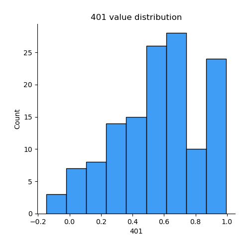
## Feature : 402
- **Feature type** : continous
- **Missing** : 0.0%
- **Unique** : 135
- **Count** :135.0
- **Mean** :0.6209544633061449
- **Std** :0.23915279342084844
- **Min** :0.10561284381588519
- **25%th Percentile** : 0.46767392059872376
- **50%th Percentile** : 0.6276655257813984
- **75%th Percentile** : 0.7695505039404078
- **Max** :0.9970937349799092

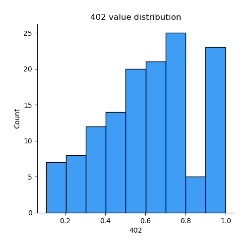
## Feature : 403
- **Feature type** : continous
- **Missing** : 0.0%
- **Unique** : 135
- **Count** :135.0
- **Mean** :0.532817395331596
- **Std** :0.27287121592495445
- **Min** :-0.19313436828859473
- **25%th Percentile** : 0.36786499190823874
- **50%th Percentile** : 0.5062195409126261
- **75%th Percentile** : 0.6842051649176404
- **Max** :0.9921847041679297

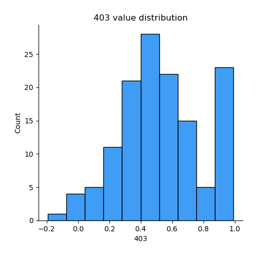
## Feature : 404
- **Feature type** : continous
- **Missing** : 0.0%
- **Unique** : 135
- **Count** :135.0
- **Mean** :0.6043075285501697
- **Std** :0.21661196879603042
- **Min** :-0.16274997265412147
- **25%th Percentile** : 0.4633147938884533
- **50%th Percentile** : 0.5867598172807234
- **75%th Percentile** : 0.7141443758280333
- **Max** :0.9883156250697585

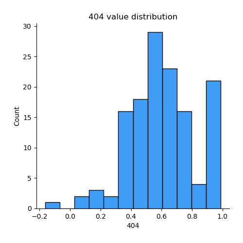
## Feature : 405
- **Feature type** : continous
- **Missing** : 0.0%
- **Unique** : 135
- **Count** :135.0
- **Mean** :0.6655803480355827
- **Std** :0.22255593770695245
- **Min** :-0.011049989562967549
- **25%th Percentile** : 0.5177484127025818
- **50%th Percentile** : 0.6839933475616183
- **75%th Percentile** : 0.808882896865899
- **Max** :0.9965373400784867

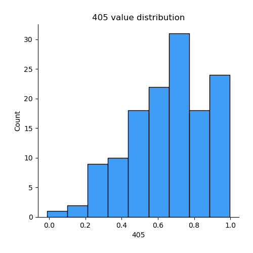
## Feature : 406
- **Feature type** : continous
- **Missing** : 0.0%
- **Unique** : 135
- **Count** :135.0
- **Mean** :0.6951330445301589
- **Std** :0.19345869066569146
- **Min** :0.20383790718214467
- **25%th Percentile** : 0.5481966093678363
- **50%th Percentile** : 0.7185009967558221
- **75%th Percentile** : 0.8219081493568935
- **Max** :0.9954565643554594

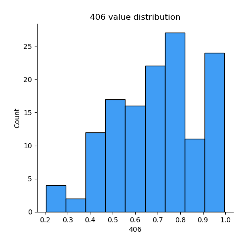
## Feature : 407
- **Feature type** : continous
- **Missing** : 0.0%
- **Unique** : 135
- **Count** :135.0
- **Mean** :0.6729095423554646
- **Std** :0.22166298237241422
- **Min** :-0.035300690657806284
- **25%th Percentile** : 0.5498062834739669
- **50%th Percentile** : 0.7047960751138449
- **75%th Percentile** : 0.8090780730130028
- **Max** :0.9973297193488747

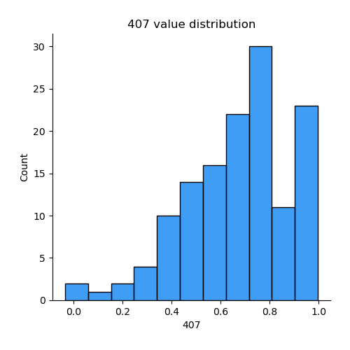
## Feature : 408
- **Feature type** : continous
- **Missing** : 0.0%
- **Unique** : 135
- **Count** :135.0
- **Mean** :0.6647151705308629
- **Std** :0.20557253593312255
- **Min** :0.15694225181271534
- **25%th Percentile** : 0.5102643116525227
- **50%th Percentile** : 0.667599065345105
- **75%th Percentile** : 0.7908791975478393
- **Max** :0.9907283391458841

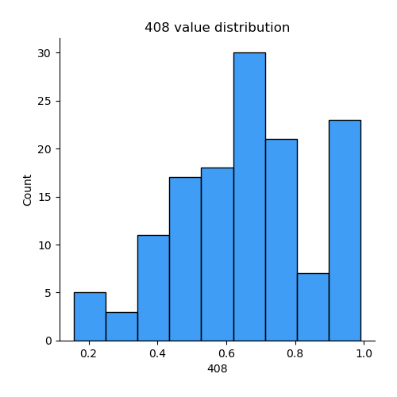
## Feature : 409
- **Feature type** : continous
- **Missing** : 0.0%
- **Unique** : 135
- **Count** :135.0
- **Mean** :0.5432789526410926
- **Std** :0.2647098101491133
- **Min** :-0.07283665157999013
- **25%th Percentile** : 0.33332686182413906
- **50%th Percentile** : 0.554113182089579
- **75%th Percentile** : 0.6943119227413712
- **Max** :0.991132639689831

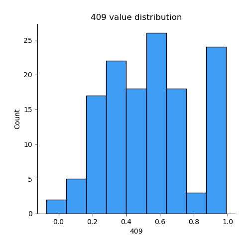
## Feature : 410
- **Feature type** : continous
- **Missing** : 0.0%
- **Unique** : 135
- **Count** :135.0
- **Mean** :0.616009987907041
- **Std** :0.2494788492347617
- **Min** :-0.1967266218927505
- **25%th Percentile** : 0.4473724163184904
- **50%th Percentile** : 0.6312006874715165
- **75%th Percentile** : 0.763845359778441
- **Max** :0.9961618388475535

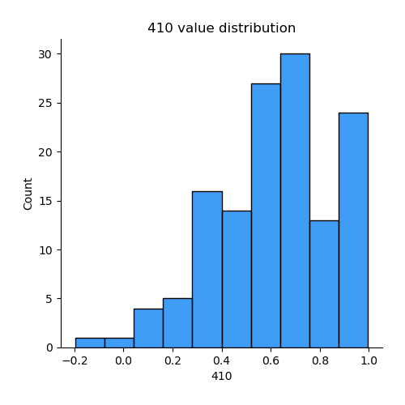
## Feature : 411
- **Feature type** : continous
- **Missing** : 0.0%
- **Unique** : 135
- **Count** :135.0
- **Mean** :0.6237103752174368
- **Std** :0.23604627528039407
- **Min** :-0.016528016912797167
- **25%th Percentile** : 0.4580731564020383
- **50%th Percentile** : 0.6275467325494958
- **75%th Percentile** : 0.7581171157840754
- **Max** :0.99566590586287

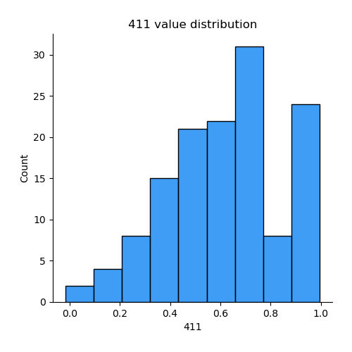
## Feature : 412
- **Feature type** : continous
- **Missing** : 0.0%
- **Unique** : 135
- **Count** :135.0
- **Mean** :0.7136274678096736
- **Std** :0.22654834376407074
- **Min** :-0.012519869908585649
- **25%th Percentile** : 0.5990613216745091
- **50%th Percentile** : 0.7646163204574951
- **75%th Percentile** : 0.8689522889648169
- **Max** :0.9956634592626445

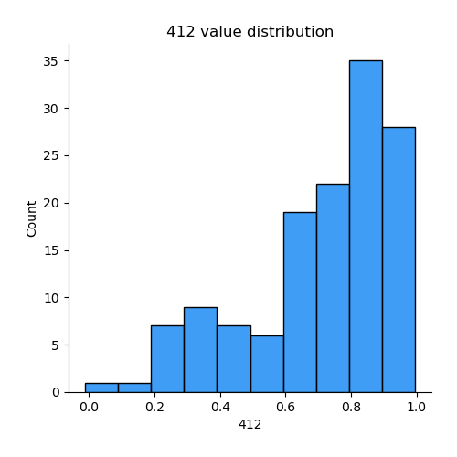
## Feature : 413
- **Feature type** : continous
- **Missing** : 0.0%
- **Unique** : 135
- **Count** :135.0
- **Mean** :0.7307315875301168
- **Std** :0.19822372421897166
- **Min** :-0.1337115682029664
- **25%th Percentile** : 0.6336431038592434
- **50%th Percentile** : 0.7561247966903294
- **75%th Percentile** : 0.8661606956817438
- **Max** :0.9953349352726986

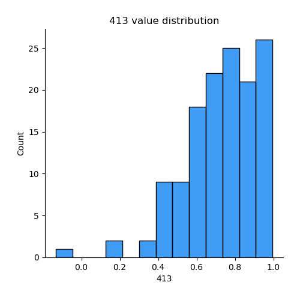
## Feature : 414
- **Feature type** : continous
- **Missing** : 0.0%
- **Unique** : 135
- **Count** :135.0
- **Mean** :0.44086201175021067
- **Std** :0.29801804318352504
- **Min** :-0.3974561082775542
- **25%th Percentile** : 0.2379609172303151
- **50%th Percentile** : 0.40015873386344986
- **75%th Percentile** : 0.6373580211770375
- **Max** :0.9881506968836744

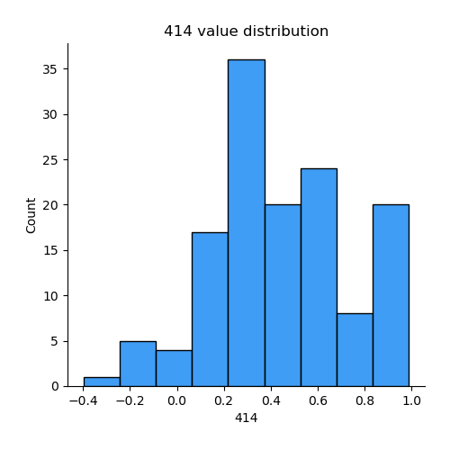
## Feature : 415
- **Feature type** : continous
- **Missing** : 0.0%
- **Unique** : 135
- **Count** :135.0
- **Mean** :0.6564718281864943
- **Std** :0.23299432448756666
- **Min** :-0.076648823132096
- **25%th Percentile** : 0.47199979397582814
- **50%th Percentile** : 0.6944501403666635
- **75%th Percentile** : 0.8088336346891485
- **Max** :0.9948310771183857

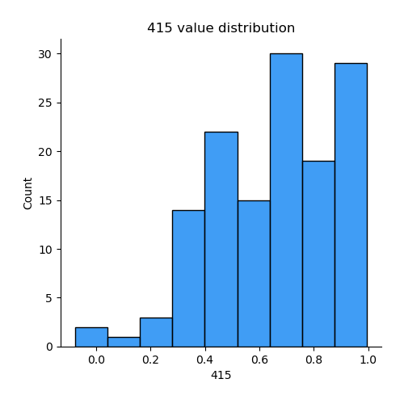
## Feature : 424
- **Feature type** : continous
- **Missing** : 0.0%
- **Unique** : 3
- **Count** :135.0
- **Mean** :1.0
- **Std** :9.199235656337767e-17
- **Min** :0.9999999999999998
- **25%th Percentile** : 0.9999999999999999
- **50%th Percentile** : 1.0
- **75%th Percentile** : 1.0
- **Max** :1.0

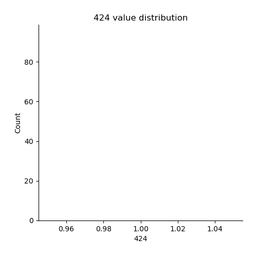
## Feature : 425
- **Feature type** : continous
- **Missing** : 0.0%
- **Unique** : 135
- **Count** :135.0
- **Mean** :0.5907849320282592
- **Std** :0.23930250063531983
- **Min** :-0.04589389866134484
- **25%th Percentile** : 0.44952168590238656
- **50%th Percentile** : 0.5752604469956007
- **75%th Percentile** : 0.7647462366878146
- **Max** :0.9844240118727918

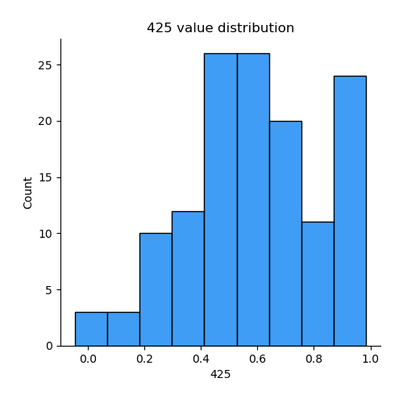
## Feature : 426
- **Feature type** : continous
- **Missing** : 0.0%
- **Unique** : 135
- **Count** :135.0
- **Mean** :0.6971216336306988
- **Std** :0.1917047791592151
- **Min** :0.08106955817954806
- **25%th Percentile** : 0.5778851476188793
- **50%th Percentile** : 0.7007584363810593
- **75%th Percentile** : 0.8398208561849001
- **Max** :0.9896559490813999

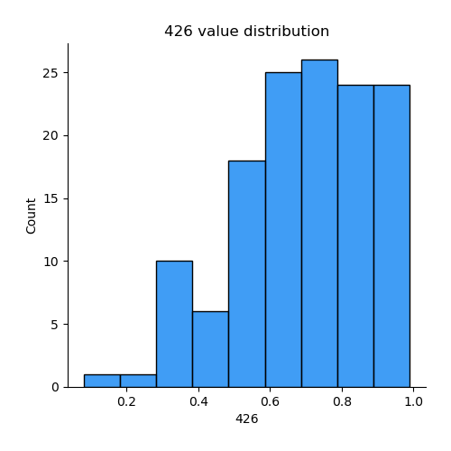
## Feature : 427
- **Feature type** : continous
- **Missing** : 0.0%
- **Unique** : 135
- **Count** :135.0
- **Mean** :0.6483319254570123
- **Std** :0.20291424098730332
- **Min** :0.05603407405750987
- **25%th Percentile** : 0.5223417085243712
- **50%th Percentile** : 0.6414168695718893
- **75%th Percentile** : 0.7706097099535582
- **Max** :0.9927293442740721

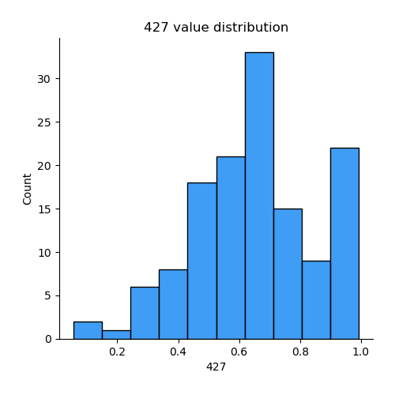
## Feature : 428
- **Feature type** : continous
- **Missing** : 0.0%
- **Unique** : 135
- **Count** :135.0
- **Mean** :0.5426355568496273
- **Std** :0.26840717953723914
- **Min** :-0.2243608217475588
- **25%th Percentile** : 0.3537823951434883
- **50%th Percentile** : 0.5569630016675454
- **75%th Percentile** : 0.6965309653900734
- **Max** :0.9841611714987476

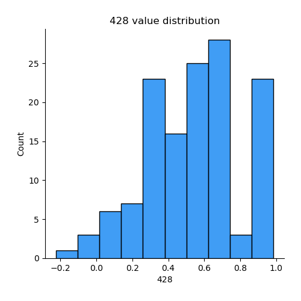
## Feature : 429
- **Feature type** : continous
- **Missing** : 0.0%
- **Unique** : 135
- **Count** :135.0
- **Mean** :0.6256880439471781
- **Std** :0.20740998002377192
- **Min** :0.047618716126930555
- **25%th Percentile** : 0.48024152325986935
- **50%th Percentile** : 0.6128566807889226
- **75%th Percentile** : 0.75129388958351
- **Max** :0.9872661181350035

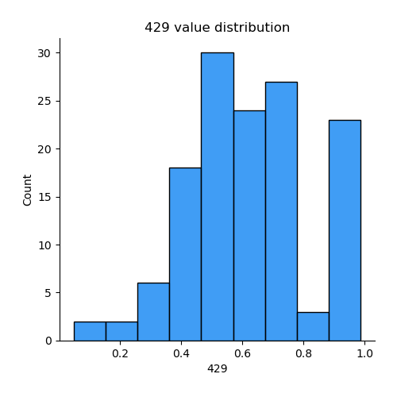
## Feature : 430
- **Feature type** : continous
- **Missing** : 0.0%
- **Unique** : 135
- **Count** :135.0
- **Mean** :0.6398876689200999
- **Std** :0.20953982696884535
- **Min** :-0.0487485483769047
- **25%th Percentile** : 0.5205921496390711
- **50%th Percentile** : 0.641063400148454
- **75%th Percentile** : 0.7957428062988297
- **Max** :0.9858989796996603

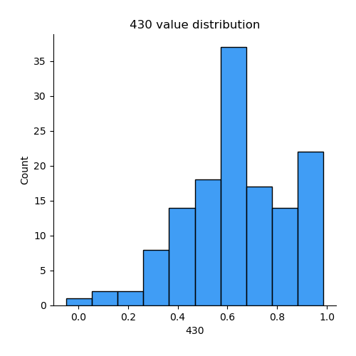
## Feature : 431
- **Feature type** : continous
- **Missing** : 0.0%
- **Unique** : 135
- **Count** :135.0
- **Mean** :0.5719560796126938
- **Std** :0.2443295583045575
- **Min** :0.006714278884430473
- **25%th Percentile** : 0.40863560609457744
- **50%th Percentile** : 0.5805854587548764
- **75%th Percentile** : 0.7199490716032456
- **Max** :0.9846035743771383

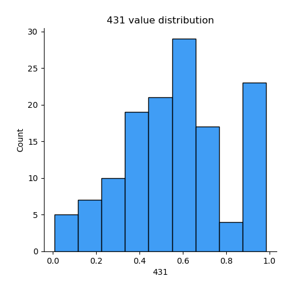
## Feature : 432
- **Feature type** : continous
- **Missing** : 0.0%
- **Unique** : 135
- **Count** :135.0
- **Mean** :0.6918794763999382
- **Std** :0.1762742684416142
- **Min** :0.23265307137995087
- **25%th Percentile** : 0.5627829245839235
- **50%th Percentile** : 0.6747225924348913
- **75%th Percentile** : 0.8108803317292821
- **Max** :0.9893222100952732

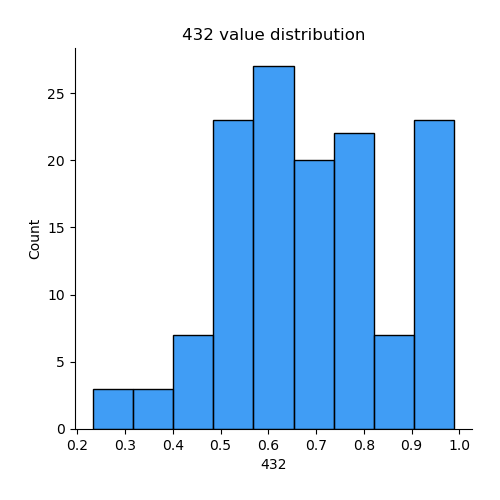
## Feature : 433
- **Feature type** : continous
- **Missing** : 0.0%
- **Unique** : 135
- **Count** :135.0
- **Mean** :0.5579011007501374
- **Std** :0.2546882288855573
- **Min** :-0.04603166710537598
- **25%th Percentile** : 0.3939502747966088
- **50%th Percentile** : 0.5584943684114937
- **75%th Percentile** : 0.7237276360469215
- **Max** :0.9845197927292287

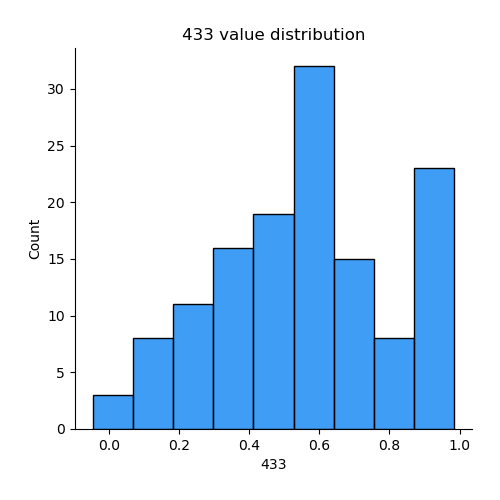
## Feature : 434
- **Feature type** : continous
- **Missing** : 0.0%
- **Unique** : 135
- **Count** :135.0
- **Mean** :0.8415471340319362
- **Std** :0.10370185781705042
- **Min** :0.44689701131143045
- **25%th Percentile** : 0.7766792684336139
- **50%th Percentile** : 0.8446960785517049
- **75%th Percentile** : 0.9139057227153854
- **Max** :0.995775782903399

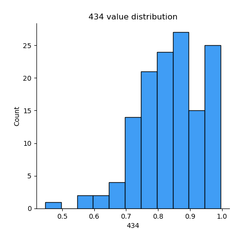
## Feature : 435
- **Feature type** : continous
- **Missing** : 0.0%
- **Unique** : 135
- **Count** :135.0
- **Mean** :0.5541582473871955
- **Std** :0.2380240752115284
- **Min** :-0.06873680902436292
- **25%th Percentile** : 0.3908028289062353
- **50%th Percentile** : 0.5285343153403341
- **75%th Percentile** : 0.698791786189831
- **Max** :0.983307398034418

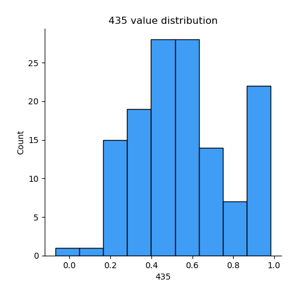
## Feature : 436
- **Feature type** : continous
- **Missing** : 0.0%
- **Unique** : 135
- **Count** :135.0
- **Mean** :0.6288372334250494
- **Std** :0.21691167429291375
- **Min** :-0.031538333386391816
- **25%th Percentile** : 0.5058526287597038
- **50%th Percentile** : 0.609758314877267
- **75%th Percentile** : 0.76899089184953
- **Max** :0.9903399303809458

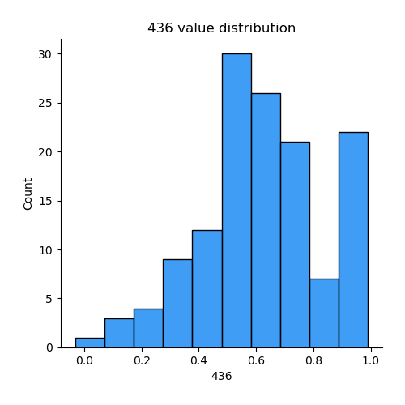
## Feature : 437
- **Feature type** : continous
- **Missing** : 0.0%
- **Unique** : 135
- **Count** :135.0
- **Mean** :0.5933735879903566
- **Std** :0.25995029258190944
- **Min** :-0.035306705268473904
- **25%th Percentile** : 0.4744310038189068
- **50%th Percentile** : 0.6027335401188098
- **75%th Percentile** : 0.7719555670065963
- **Max** :0.9875345390301764

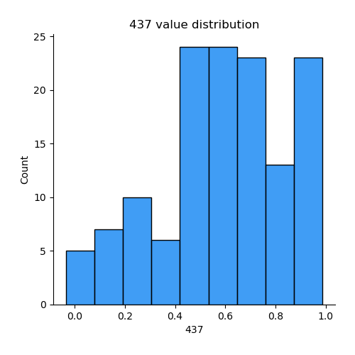
## Feature : 438
- **Feature type** : continous
- **Missing** : 0.0%
- **Unique** : 135
- **Count** :135.0
- **Mean** :0.6160253767013871
- **Std** :0.22449883278557534
- **Min** :-0.03287977162842454
- **25%th Percentile** : 0.47822962538387903
- **50%th Percentile** : 0.604969522006681
- **75%th Percentile** : 0.7653286743430648
- **Max** :0.9860128041212438

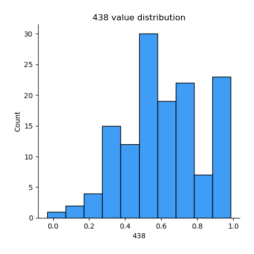
## Feature : 439
- **Feature type** : continous
- **Missing** : 0.0%
- **Unique** : 135
- **Count** :135.0
- **Mean** :0.6029510170686899
- **Std** :0.2537809572322677
- **Min** :-0.09523979843573034
- **25%th Percentile** : 0.44001314735388414
- **50%th Percentile** : 0.6013171689962094
- **75%th Percentile** : 0.7796126184147065
- **Max** :0.9808573464996891

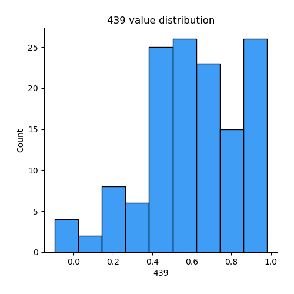
## Feature : 440
- **Feature type** : continous
- **Missing** : 0.0%
- **Unique** : 135
- **Count** :135.0
- **Mean** :0.42106397313056715
- **Std** :0.2797034067757573
- **Min** :-0.1521522442877067
- **25%th Percentile** : 0.22315367174691136
- **50%th Percentile** : 0.3766803324317885
- **75%th Percentile** : 0.56029847643852
- **Max** :0.9672692359429154

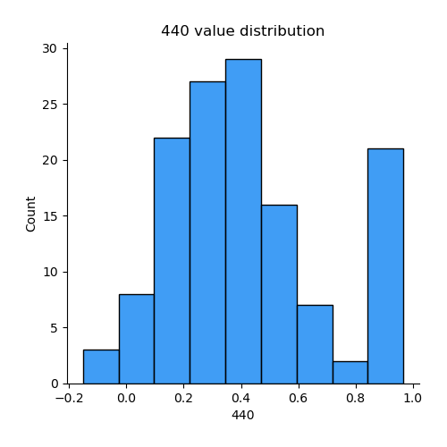
## Feature : 441
- **Feature type** : continous
- **Missing** : 0.0%
- **Unique** : 135
- **Count** :135.0
- **Mean** :0.5719038762492927
- **Std** :0.24242335917150123
- **Min** :-0.04088324360738468
- **25%th Percentile** : 0.4195605768646051
- **50%th Percentile** : 0.5613541388965059
- **75%th Percentile** : 0.7348129580955017
- **Max** :0.9782512270012919

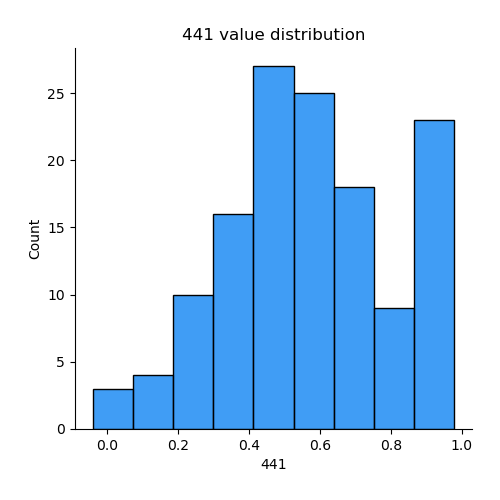
## Feature : 442
- **Feature type** : continous
- **Missing** : 0.0%
- **Unique** : 135
- **Count** :135.0
- **Mean** :0.53518812776996
- **Std** :0.28164613831558216
- **Min** :-0.12108875425470418
- **25%th Percentile** : 0.35028410715683234
- **50%th Percentile** : 0.5208106218026657
- **75%th Percentile** : 0.7381082638360308
- **Max** :0.9809341167860912

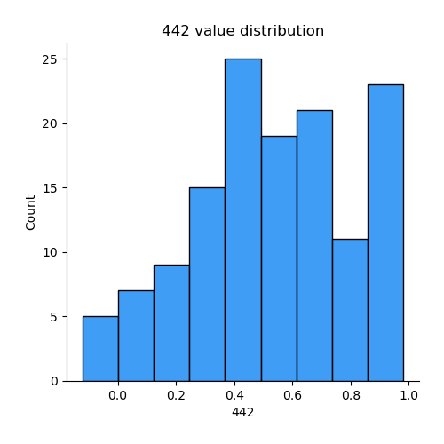
## Feature : 443
- **Feature type** : continous
- **Missing** : 0.0%
- **Unique** : 135
- **Count** :135.0
- **Mean** :0.5104435135912129
- **Std** :0.2542663156275547
- **Min** :-0.049660237459624286
- **25%th Percentile** : 0.32620110343125985
- **50%th Percentile** : 0.46877566935245085
- **75%th Percentile** : 0.6722293919293576
- **Max** :0.980268154966411

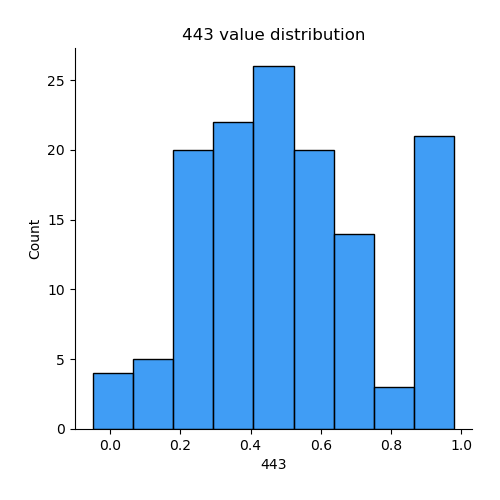
## Feature : 444
- **Feature type** : continous
- **Missing** : 0.0%
- **Unique** : 135
- **Count** :135.0
- **Mean** :0.6333225275906077
- **Std** :0.22936408396774238
- **Min** :0.07495586921727819
- **25%th Percentile** : 0.47889910329776764
- **50%th Percentile** : 0.65570947626909
- **75%th Percentile** : 0.8138042021334098
- **Max** :0.9821337828143584

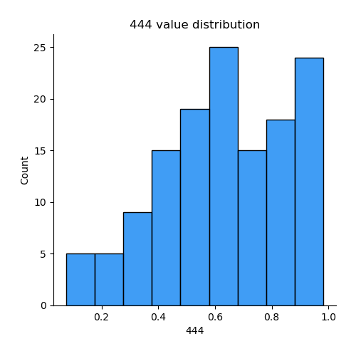
## Feature : 445
- **Feature type** : continous
- **Missing** : 0.0%
- **Unique** : 135
- **Count** :135.0
- **Mean** :0.39138234153305057
- **Std** :0.29729912997534463
- **Min** :-0.24966366459041286
- **25%th Percentile** : 0.15943424310166593
- **50%th Percentile** : 0.3305524462509618
- **75%th Percentile** : 0.5982563527645388
- **Max** :0.9697749758401196

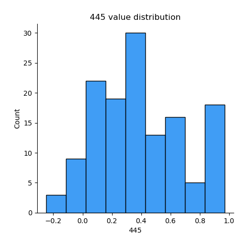
## Feature : 446
- **Feature type** : continous
- **Missing** : 0.0%
- **Unique** : 135
- **Count** :135.0
- **Mean** :0.6053008838861393
- **Std** :0.23729593990847228
- **Min** :0.049384808440490965
- **25%th Percentile** : 0.4363789234388711
- **50%th Percentile** : 0.609879636985889
- **75%th Percentile** : 0.7739855621901048
- **Max** :0.986915853574341

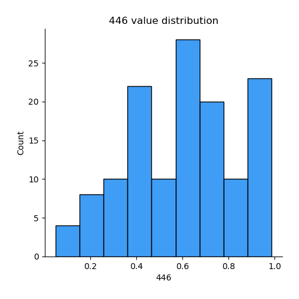
## Feature : 447
- **Feature type** : continous
- **Missing** : 0.0%
- **Unique** : 135
- **Count** :135.0
- **Mean** :0.6947836212212267
- **Std** :0.19476945201610232
- **Min** :0.1359405019202695
- **25%th Percentile** : 0.563027980956988
- **50%th Percentile** : 0.7010824659818213
- **75%th Percentile** : 0.8500992525103254
- **Max** :0.9895664633516794

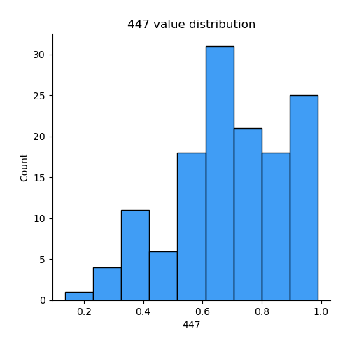
## Feature : 448
- **Feature type** : continous
- **Missing** : 0.0%
- **Unique** : 135
- **Count** :135.0
- **Mean** :0.5317809157056625
- **Std** :0.2704114666450416
- **Min** :-0.2532603733418082
- **25%th Percentile** : 0.3758377644218751
- **50%th Percentile** : 0.5038949661270531
- **75%th Percentile** : 0.7147318969833278
- **Max** :0.9835660928427262

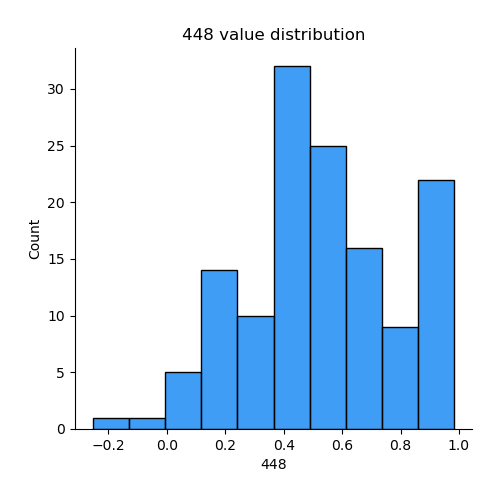
## Feature : 449
- **Feature type** : continous
- **Missing** : 0.0%
- **Unique** : 135
- **Count** :135.0
- **Mean** :0.5515457936280747
- **Std** :0.26313611473124765
- **Min** :-0.018345866828810262
- **25%th Percentile** : 0.35962820174266974
- **50%th Percentile** : 0.5530094511303754
- **75%th Percentile** : 0.7166124477383957
- **Max** :0.9837420692977877

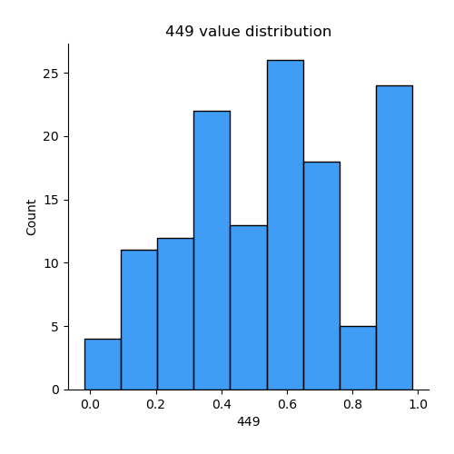
## Feature : 450
- **Feature type** : continous
- **Missing** : 0.0%
- **Unique** : 135
- **Count** :135.0
- **Mean** :0.8754725820101334
- **Std** :0.09485900985082268
- **Min** :0.4610234378154404
- **25%th Percentile** : 0.8209983258572702
- **50%th Percentile** : 0.8871493259016707
- **75%th Percentile** : 0.9468252135534464
- **Max** :0.9953533576551423

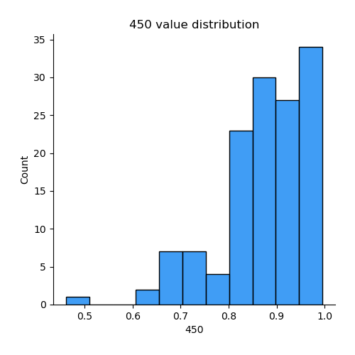
## Feature : 451
- **Feature type** : continous
- **Missing** : 0.0%
- **Unique** : 135
- **Count** :135.0
- **Mean** :0.5744886387911017
- **Std** :0.24543633451587657
- **Min** :-0.027401907206407044
- **25%th Percentile** : 0.42912437994040553
- **50%th Percentile** : 0.5664742979357448
- **75%th Percentile** : 0.7430809741355383
- **Max** :0.9862593145683332

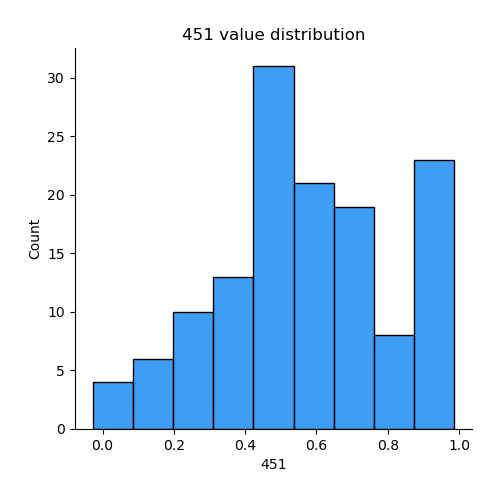
## Feature : 452
- **Feature type** : continous
- **Missing** : 0.0%
- **Unique** : 135
- **Count** :135.0
- **Mean** :0.6791876476248097
- **Std** :0.19913010765559438
- **Min** :0.20899553861020684
- **25%th Percentile** : 0.5491153682370882
- **50%th Percentile** : 0.6713114078275435
- **75%th Percentile** : 0.8347919939936976
- **Max** :0.9910059627029807

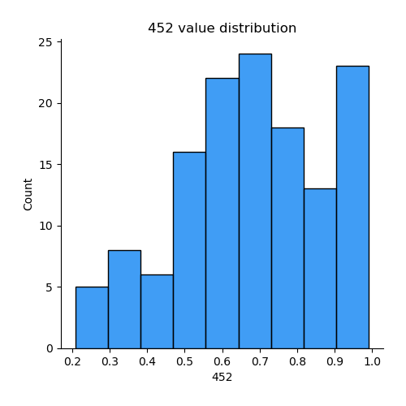
## Feature : 453
- **Feature type** : continous
- **Missing** : 0.0%
- **Unique** : 135
- **Count** :135.0
- **Mean** :0.5985383350633638
- **Std** :0.24827197296076392
- **Min** :-0.11327820386845557
- **25%th Percentile** : 0.4620408536404725
- **50%th Percentile** : 0.5997818189263595
- **75%th Percentile** : 0.7732375048065001
- **Max** :0.988471798728374

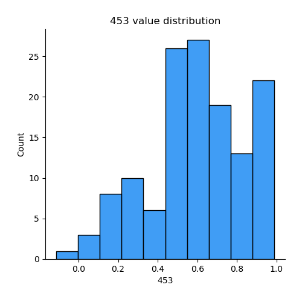
## Feature : 454
- **Feature type** : continous
- **Missing** : 0.0%
- **Unique** : 135
- **Count** :135.0
- **Mean** :0.5205183432887407
- **Std** :0.27103483152787405
- **Min** :-0.22096320622275134
- **25%th Percentile** : 0.3306305194272656
- **50%th Percentile** : 0.5104716170281788
- **75%th Percentile** : 0.6860556453337292
- **Max** :0.9833651001650847

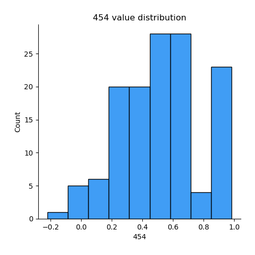
## Feature : 455
- **Feature type** : continous
- **Missing** : 0.0%
- **Unique** : 135
- **Count** :135.0
- **Mean** :0.5834039585692754
- **Std** :0.24146485724206307
- **Min** :0.01446592484678746
- **25%th Percentile** : 0.43231936871061355
- **50%th Percentile** : 0.584415808686499
- **75%th Percentile** : 0.7258479877610422
- **Max** :0.9841055626074152

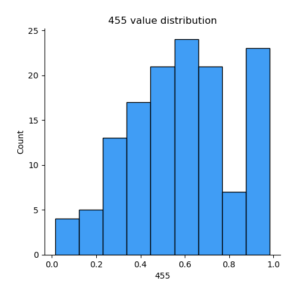
## Feature : 456
- **Feature type** : continous
- **Missing** : 0.0%
- **Unique** : 135
- **Count** :135.0
- **Mean** :0.6353011956099516
- **Std** :0.20875076564985703
- **Min** :0.10942996956886542
- **25%th Percentile** : 0.5124251992712392
- **50%th Percentile** : 0.6388244668806435
- **75%th Percentile** : 0.7671170358749427
- **Max** :0.980719443202065

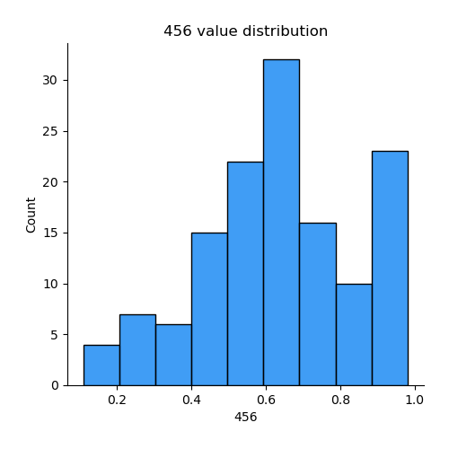
## Feature : 457
- **Feature type** : continous
- **Missing** : 0.0%
- **Unique** : 135
- **Count** :135.0
- **Mean** :0.545193124685439
- **Std** :0.2595121877170532
- **Min** :0.0015044094261055317
- **25%th Percentile** : 0.36194378016119155
- **50%th Percentile** : 0.5481083631054303
- **75%th Percentile** : 0.6907276557478644
- **Max** :0.9857307589745212

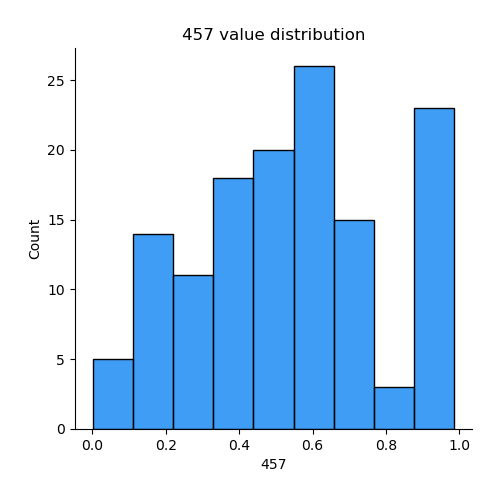
## Feature : 458
- **Feature type** : continous
- **Missing** : 0.0%
- **Unique** : 135
- **Count** :135.0
- **Mean** :0.6446843646867272
- **Std** :0.21020579672937062
- **Min** :0.1410487862645844
- **25%th Percentile** : 0.4921832153816407
- **50%th Percentile** : 0.6364450329321902
- **75%th Percentile** : 0.7907825703873921
- **Max** :0.9867552537306088

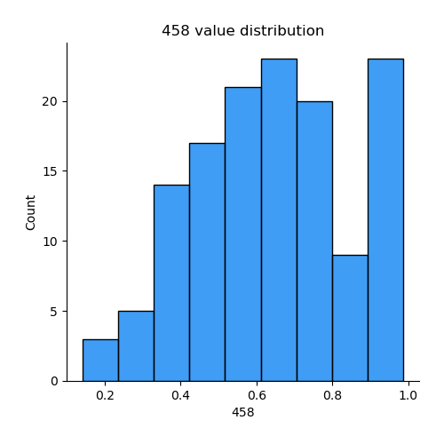
## Feature : 459
- **Feature type** : continous
- **Missing** : 0.0%
- **Unique** : 135
- **Count** :135.0
- **Mean** :0.5234585110902094
- **Std** :0.27306260406558686
- **Min** :-0.15584074178625598
- **25%th Percentile** : 0.3367044573998368
- **50%th Percentile** : 0.526936961876292
- **75%th Percentile** : 0.6888651735183156
- **Max** :0.9833161033428557

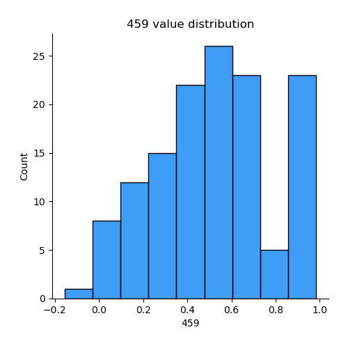
## Feature : 460
- **Feature type** : continous
- **Missing** : 0.0%
- **Unique** : 135
- **Count** :135.0
- **Mean** :0.7897465615094611
- **Std** :0.13728117011458707
- **Min** :0.3873024982609285
- **25%th Percentile** : 0.7011614269872624
- **50%th Percentile** : 0.7865114529348974
- **75%th Percentile** : 0.8862248998317732
- **Max** :0.9945143020156336

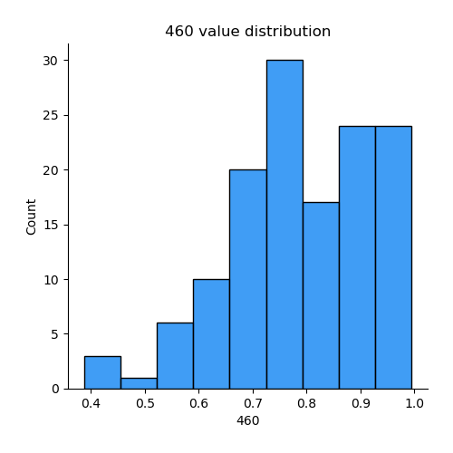
## Feature : 461
- **Feature type** : continous
- **Missing** : 0.0%
- **Unique** : 135
- **Count** :135.0
- **Mean** :0.5036056440106407
- **Std** :0.25573657211225265
- **Min** :-0.042221117609403856
- **25%th Percentile** : 0.3327048993942243
- **50%th Percentile** : 0.46270201968365166
- **75%th Percentile** : 0.6575007833665881
- **Max** :0.9787565994595281

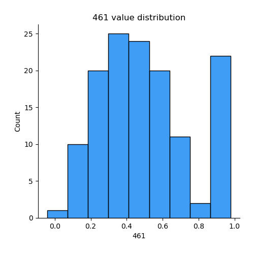
## Feature : 462
- **Feature type** : continous
- **Missing** : 0.0%
- **Unique** : 135
- **Count** :135.0
- **Mean** :0.587883427600479
- **Std** :0.24244834307144594
- **Min** :-0.08871994767037666
- **25%th Percentile** : 0.42632905841186364
- **50%th Percentile** : 0.5987980967680404
- **75%th Percentile** : 0.7485405199075704
- **Max** :0.9882846110138046

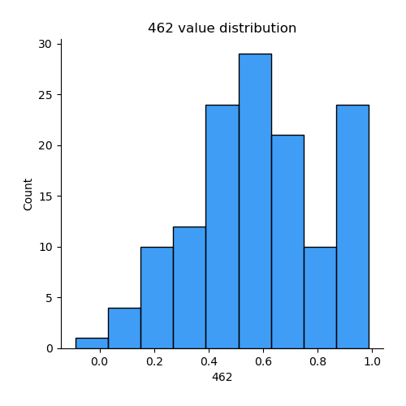
## Feature : 463
- **Feature type** : continous
- **Missing** : 0.0%
- **Unique** : 135
- **Count** :135.0
- **Mean** :0.5738247226401443
- **Std** :0.26785552889750236
- **Min** :-0.17977628246323318
- **25%th Percentile** : 0.3899935136120502
- **50%th Percentile** : 0.5848700964777216
- **75%th Percentile** : 0.7650821219275157
- **Max** :0.9868004818331629

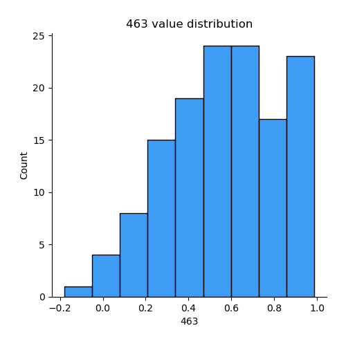
## Feature : 464
- **Feature type** : continous
- **Missing** : 0.0%
- **Unique** : 135
- **Count** :135.0
- **Mean** :0.5881281766682792
- **Std** :0.2471981999200496
- **Min** :-0.22542938188009953
- **25%th Percentile** : 0.4320447319348837
- **50%th Percentile** : 0.5977060994254961
- **75%th Percentile** : 0.7410551016531574
- **Max** :0.9849777978136808

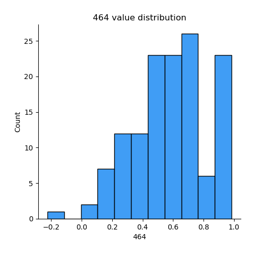
## Feature : 465
- **Feature type** : continous
- **Missing** : 0.0%
- **Unique** : 135
- **Count** :135.0
- **Mean** :0.5307412193912023
- **Std** :0.29608055419343465
- **Min** :-0.21551390960466646
- **25%th Percentile** : 0.3185033845386632
- **50%th Percentile** : 0.5522141538607005
- **75%th Percentile** : 0.7403546705542223
- **Max** :0.985507023258246

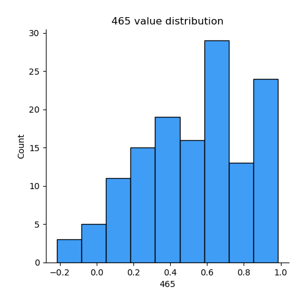
## Feature : 466
- **Feature type** : continous
- **Missing** : 0.0%
- **Unique** : 135
- **Count** :135.0
- **Mean** :0.38630619902252056
- **Std** :0.30828858238726603
- **Min** :-0.3358285063271982
- **25%th Percentile** : 0.16338802394618926
- **50%th Percentile** : 0.3159663147588902
- **75%th Percentile** : 0.5458517890288543
- **Max** :0.9744981871268455

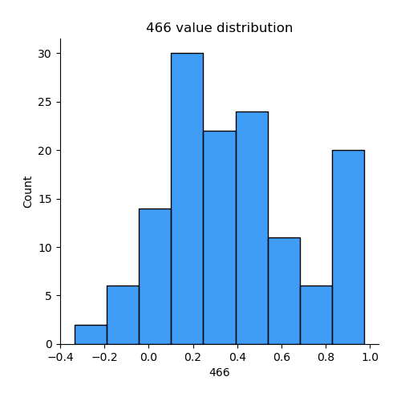
## Feature : 467
- **Feature type** : continous
- **Missing** : 0.0%
- **Unique** : 135
- **Count** :135.0
- **Mean** :0.506842000692194
- **Std** :0.27411613342320656
- **Min** :-0.3342906364356929
- **25%th Percentile** : 0.3045369249890974
- **50%th Percentile** : 0.4771934215141252
- **75%th Percentile** : 0.6720573565588561
- **Max** :0.979462510908039

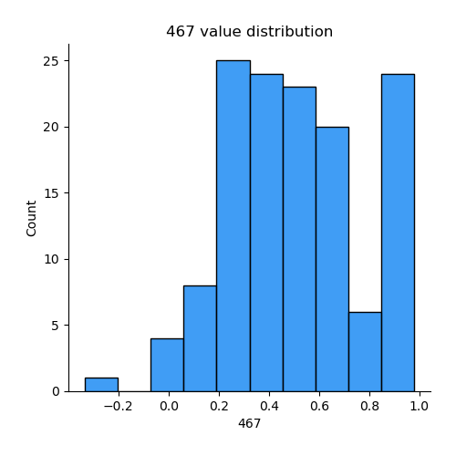
## Feature : 477
- **Feature type** : continous
- **Missing** : 0.0%
- **Unique** : 3
- **Count** :135.0
- **Mean** :1.0
- **Std** :7.791656504413792e-17
- **Min** :0.9999999999999998
- **25%th Percentile** : 1.0
- **50%th Percentile** : 1.0
- **75%th Percentile** : 1.0
- **Max** :1.0

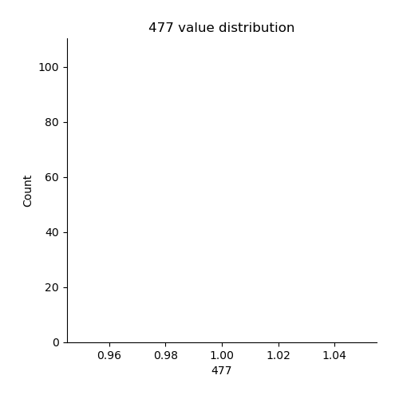
## Feature : 478
- **Feature type** : continous
- **Missing** : 0.0%
- **Unique** : 135
- **Count** :135.0
- **Mean** :0.8009027311928485
- **Std** :0.13385421778279727
- **Min** :0.4356659180534008
- **25%th Percentile** : 0.7197856656620394
- **50%th Percentile** : 0.8224666909541628
- **75%th Percentile** : 0.8935621450899203
- **Max** :0.9918406161152172

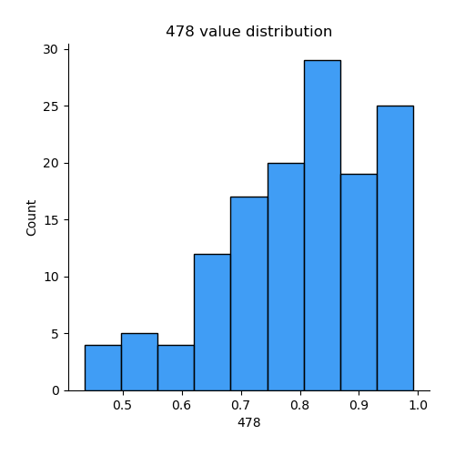
## Feature : 479
- **Feature type** : continous
- **Missing** : 0.0%
- **Unique** : 135
- **Count** :135.0
- **Mean** :0.6149688139928406
- **Std** :0.2281916628239663
- **Min** :-0.20394544356396752
- **25%th Percentile** : 0.4771838692679154
- **50%th Percentile** : 0.597402804116386
- **75%th Percentile** : 0.7822910584229437
- **Max** :0.9888768061418193

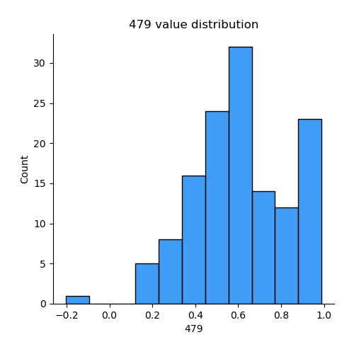
## Feature : 480
- **Feature type** : continous
- **Missing** : 0.0%
- **Unique** : 135
- **Count** :135.0
- **Mean** :0.5067923837623592
- **Std** :0.29932435044568295
- **Min** :-0.27101785541037765
- **25%th Percentile** : 0.2855721419781212
- **50%th Percentile** : 0.5203569728819932
- **75%th Percentile** : 0.6985826857420565
- **Max** :0.9853476914658316

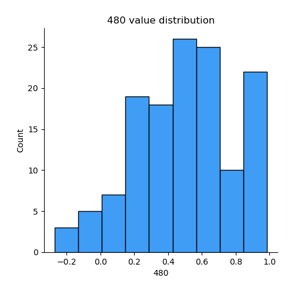
## Feature : 481
- **Feature type** : continous
- **Missing** : 0.0%
- **Unique** : 135
- **Count** :135.0
- **Mean** :0.5783182393094044
- **Std** :0.2341355876885139
- **Min** :-0.045604188466210296
- **25%th Percentile** : 0.412847766861108
- **50%th Percentile** : 0.5643349701868836
- **75%th Percentile** : 0.7156982329227171
- **Max** :0.9898300115944328

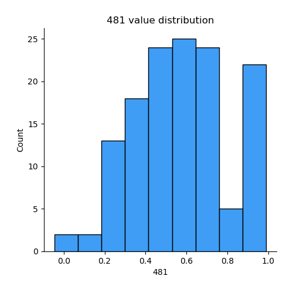
## Feature : 482
- **Feature type** : continous
- **Missing** : 0.0%
- **Unique** : 135
- **Count** :135.0
- **Mean** :0.762650668619099
- **Std** :0.14777166073133471
- **Min** :0.32614862529270916
- **25%th Percentile** : 0.673530466299703
- **50%th Percentile** : 0.7709703746430775
- **75%th Percentile** : 0.8562204775369597
- **Max** :0.9881572696640516

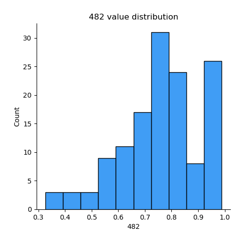
## Feature : 483
- **Feature type** : continous
- **Missing** : 0.0%
- **Unique** : 135
- **Count** :135.0
- **Mean** :0.5472700749386431
- **Std** :0.2771932690157844
- **Min** :-0.20338227142045878
- **25%th Percentile** : 0.35384965639226884
- **50%th Percentile** : 0.5427631186737617
- **75%th Percentile** : 0.7237754741875765
- **Max** :0.9872114993659

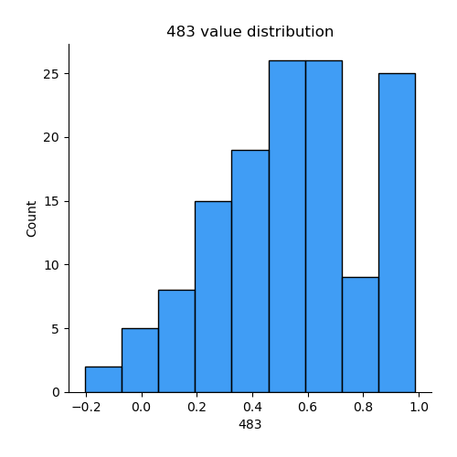
## Feature : 484
- **Feature type** : continous
- **Missing** : 0.0%
- **Unique** : 135
- **Count** :135.0
- **Mean** :0.568174113774311
- **Std** :0.25103251742726823
- **Min** :-0.20203086532707576
- **25%th Percentile** : 0.3975684550125873
- **50%th Percentile** : 0.5491128995942098
- **75%th Percentile** : 0.7332673574753859
- **Max** :0.9821096136503967

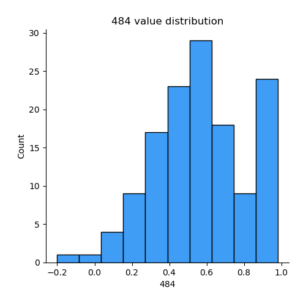
## Feature : 485
- **Feature type** : continous
- **Missing** : 0.0%
- **Unique** : 135
- **Count** :135.0
- **Mean** :0.5744690065230799
- **Std** :0.2630899261261132
- **Min** :-0.08822765317075494
- **25%th Percentile** : 0.42009361381364446
- **50%th Percentile** : 0.5654987749329119
- **75%th Percentile** : 0.7404616639655885
- **Max** :0.9871073789143522

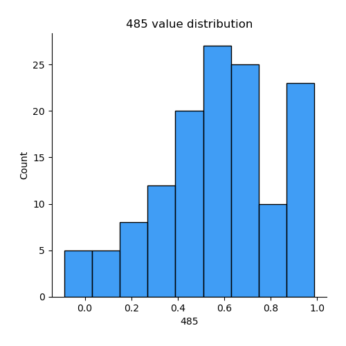
## Feature : 486
- **Feature type** : continous
- **Missing** : 0.0%
- **Unique** : 135
- **Count** :135.0
- **Mean** :0.6585559469255012
- **Std** :0.2137034834699292
- **Min** :-0.01137947430495903
- **25%th Percentile** : 0.519800491078199
- **50%th Percentile** : 0.6786831487219667
- **75%th Percentile** : 0.78920516093585
- **Max** :0.9866109891614008

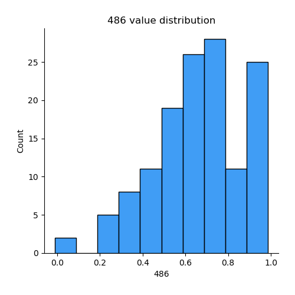
## Feature : 487
- **Feature type** : continous
- **Missing** : 0.0%
- **Unique** : 135
- **Count** :135.0
- **Mean** :0.3998858921855217
- **Std** :0.3030693742526392
- **Min** :-0.3675697442333365
- **25%th Percentile** : 0.19495286227852196
- **50%th Percentile** : 0.34192157955203384
- **75%th Percentile** : 0.5424114677470573
- **Max** :0.9824811880716442

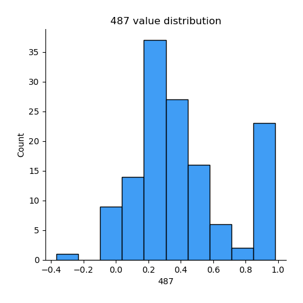
## Feature : 488
- **Feature type** : continous
- **Missing** : 0.0%
- **Unique** : 135
- **Count** :135.0
- **Mean** :0.5073619791242868
- **Std** :0.28837587880028925
- **Min** :-0.33922492372250596
- **25%th Percentile** : 0.3217515029076557
- **50%th Percentile** : 0.4825263934164734
- **75%th Percentile** : 0.6912565807558961
- **Max** :0.9866225063794111

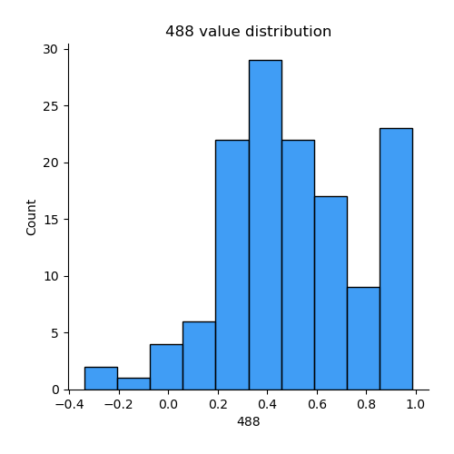
## Feature : 489
- **Feature type** : continous
- **Missing** : 0.0%
- **Unique** : 135
- **Count** :135.0
- **Mean** :0.7159249215154598
- **Std** :0.19778591067965115
- **Min** :0.049476169895874375
- **25%th Percentile** : 0.5873621993490734
- **50%th Percentile** : 0.7474314932241809
- **75%th Percentile** : 0.8502574863727554
- **Max** :0.993950767799644

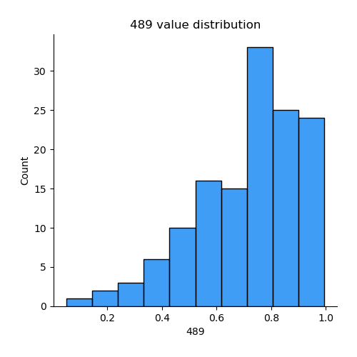
## Feature : 490
- **Feature type** : continous
- **Missing** : 0.0%
- **Unique** : 135
- **Count** :135.0
- **Mean** :0.607126827376757
- **Std** :0.22779243944993363
- **Min** :-0.05888162762630478
- **25%th Percentile** : 0.4724577421546051
- **50%th Percentile** : 0.5874376436746855
- **75%th Percentile** : 0.7512540846586078
- **Max** :0.9849830704662249

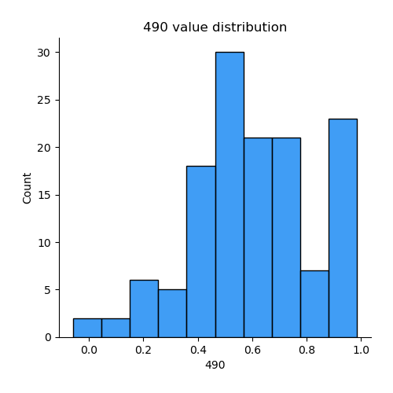
## Feature : 491
- **Feature type** : continous
- **Missing** : 0.0%
- **Unique** : 135
- **Count** :135.0
- **Mean** :0.5970354164859426
- **Std** :0.23195678183321275
- **Min** :0.03556215088336823
- **25%th Percentile** : 0.4333348211088905
- **50%th Percentile** : 0.5818045823833702
- **75%th Percentile** : 0.7525138345256355
- **Max** :0.9875138414746443

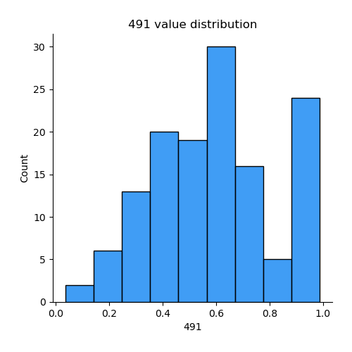
## Feature : 492
- **Feature type** : continous
- **Missing** : 0.0%
- **Unique** : 135
- **Count** :135.0
- **Mean** :0.3805421729545069
- **Std** :0.2915050083851533
- **Min** :-0.24653460547979067
- **25%th Percentile** : 0.18550205527145097
- **50%th Percentile** : 0.3273492620182334
- **75%th Percentile** : 0.4949036390652699
- **Max** :0.9701137508752844

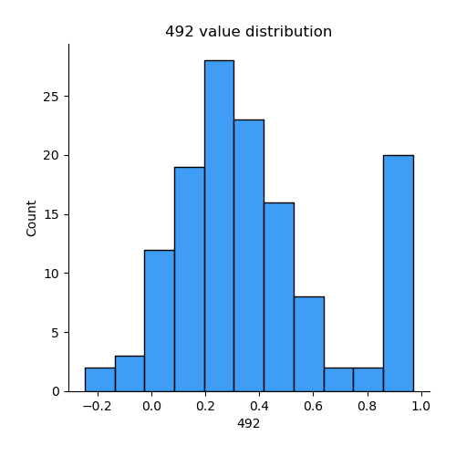
## Feature : 493
- **Feature type** : continous
- **Missing** : 0.0%
- **Unique** : 135
- **Count** :135.0
- **Mean** :0.5416964378660196
- **Std** :0.24640830574725447
- **Min** :-0.053032689521294044
- **25%th Percentile** : 0.3858846417372024
- **50%th Percentile** : 0.517569388612927
- **75%th Percentile** : 0.6918762588394914
- **Max** :0.9770200059761737

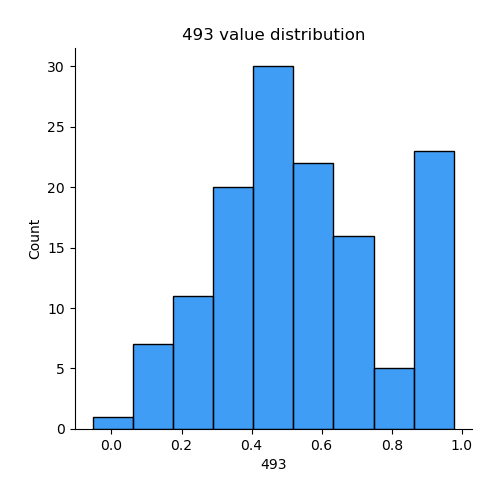
## Feature : 494
- **Feature type** : continous
- **Missing** : 0.0%
- **Unique** : 135
- **Count** :135.0
- **Mean** :0.5598947004310153
- **Std** :0.25753621397125315
- **Min** :-0.1577895275636852
- **25%th Percentile** : 0.3929433891607663
- **50%th Percentile** : 0.531245156966131
- **75%th Percentile** : 0.7249279483099953
- **Max** :0.9879838773731618

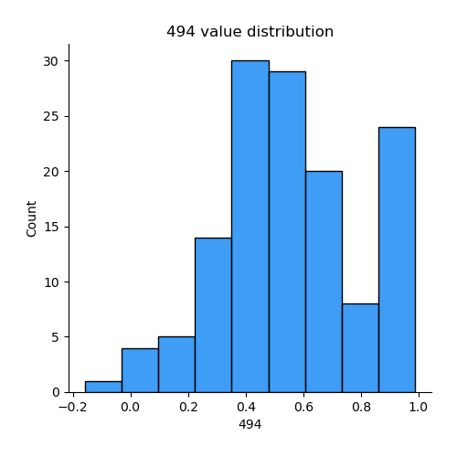
## Feature : 495
- **Feature type** : continous
- **Missing** : 0.0%
- **Unique** : 135
- **Count** :135.0
- **Mean** :0.4895182366323392
- **Std** :0.26657804344967645
- **Min** :-0.14992737705050538
- **25%th Percentile** : 0.31261944988261237
- **50%th Percentile** : 0.465879187915945
- **75%th Percentile** : 0.6292705255358296
- **Max** :0.9829951021786844

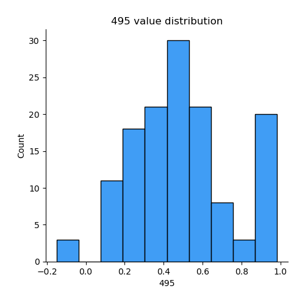
## Feature : 496
- **Feature type** : continous
- **Missing** : 0.0%
- **Unique** : 135
- **Count** :135.0
- **Mean** :0.7374925524853226
- **Std** :0.18108904274039922
- **Min** :-0.042454338722542624
- **25%th Percentile** : 0.6529194047786058
- **50%th Percentile** : 0.7443748578861081
- **75%th Percentile** : 0.8673970978286717
- **Max** :0.9926841381069589

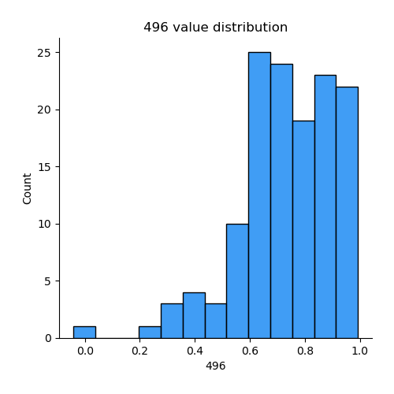
## Feature : 497
- **Feature type** : continous
- **Missing** : 0.0%
- **Unique** : 135
- **Count** :135.0
- **Mean** :0.4062691159930723
- **Std** :0.28380063528395627
- **Min** :-0.305951323908394
- **25%th Percentile** : 0.23846134766682048
- **50%th Percentile** : 0.33462625016724623
- **75%th Percentile** : 0.6023446110543597
- **Max** :0.9753108862359464

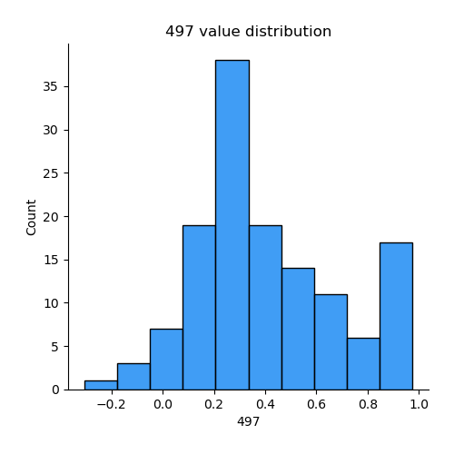
## Feature : 498
- **Feature type** : continous
- **Missing** : 0.0%
- **Unique** : 135
- **Count** :135.0
- **Mean** :0.7700168587001892
- **Std** :0.16104363510728775
- **Min** :0.036432333437872486
- **25%th Percentile** : 0.6659244502899151
- **50%th Percentile** : 0.7913016387530204
- **75%th Percentile** : 0.8851058378535893
- **Max** :0.9950746457786561

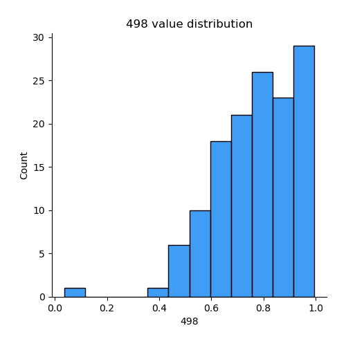
## Feature : 499
- **Feature type** : continous
- **Missing** : 0.0%
- **Unique** : 135
- **Count** :135.0
- **Mean** :0.6532134326682002
- **Std** :0.2122838925595369
- **Min** :0.07725926361832362
- **25%th Percentile** : 0.5041706144362678
- **50%th Percentile** : 0.6502021692533769
- **75%th Percentile** : 0.8012615865581367
- **Max** :0.9879664318083885

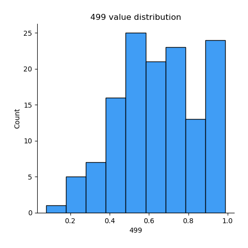
## Feature : 500
- **Feature type** : continous
- **Missing** : 0.0%
- **Unique** : 135
- **Count** :135.0
- **Mean** :0.6242497621019063
- **Std** :0.23642334807813709
- **Min** :-0.07632019223424219
- **25%th Percentile** : 0.47166351606197543
- **50%th Percentile** : 0.6247568916434993
- **75%th Percentile** : 0.784107250105077
- **Max** :0.9887366578398595

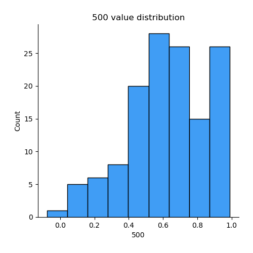
## Feature : 501
- **Feature type** : continous
- **Missing** : 0.0%
- **Unique** : 135
- **Count** :135.0
- **Mean** :0.5453344711886133
- **Std** :0.25251526613733716
- **Min** :-0.09655834271907737
- **25%th Percentile** : 0.4094495347825419
- **50%th Percentile** : 0.5136790544096977
- **75%th Percentile** : 0.6862614063192998
- **Max** :0.9870083231658492

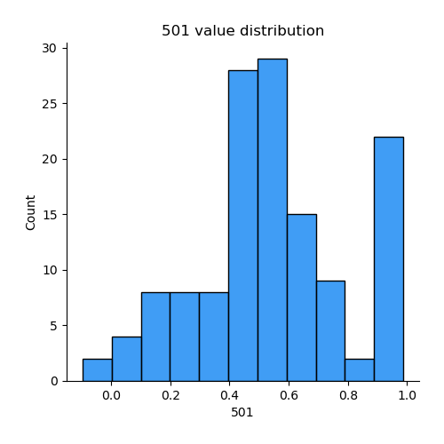
## Feature : 502
- **Feature type** : continous
- **Missing** : 0.0%
- **Unique** : 135
- **Count** :135.0
- **Mean** :0.6229643562998383
- **Std** :0.21696050408852646
- **Min** :-0.0036464950449678654
- **25%th Percentile** : 0.49058808275000465
- **50%th Percentile** : 0.6068620830756428
- **75%th Percentile** : 0.7670796663213192
- **Max** :0.9830602170984166

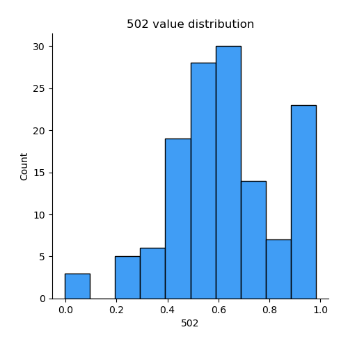
## Feature : 503
- **Feature type** : continous
- **Missing** : 0.0%
- **Unique** : 135
- **Count** :135.0
- **Mean** :0.9118507051582121
- **Std** :0.08507136354961713
- **Min** :0.5446028370824848
- **25%th Percentile** : 0.888031448746627
- **50%th Percentile** : 0.9311846962632879
- **75%th Percentile** : 0.9653364396304948
- **Max** :0.9973029204761716

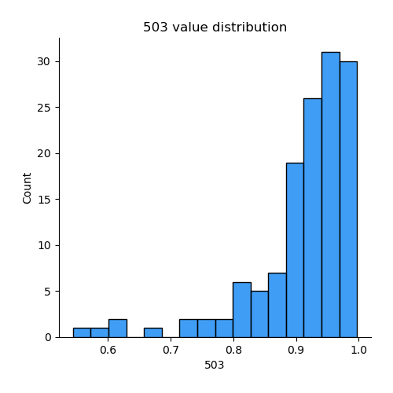
## Feature : 504
- **Feature type** : continous
- **Missing** : 0.0%
- **Unique** : 135
- **Count** :135.0
- **Mean** :0.7958391114908491
- **Std** :0.13139878039051078
- **Min** :0.4005061579767487
- **25%th Percentile** : 0.7035476674040757
- **50%th Percentile** : 0.803676262535634
- **75%th Percentile** : 0.9000339517921305
- **Max** :0.9920669171077953

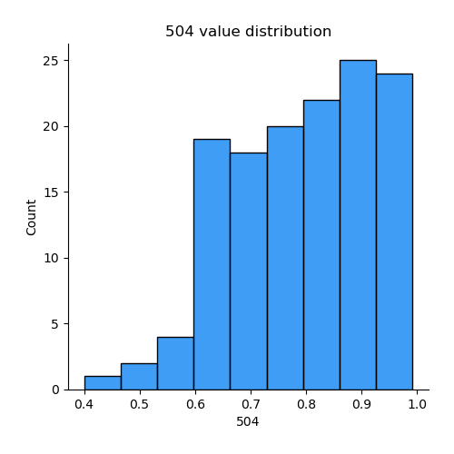
## Feature : 505
- **Feature type** : continous
- **Missing** : 0.0%
- **Unique** : 135
- **Count** :135.0
- **Mean** :0.594456505126448
- **Std** :0.24931661284636242
- **Min** :-0.07315434412369749
- **25%th Percentile** : 0.42412873109831634
- **50%th Percentile** : 0.6032275770383057
- **75%th Percentile** : 0.7590296941474147
- **Max** :0.9886289523786238

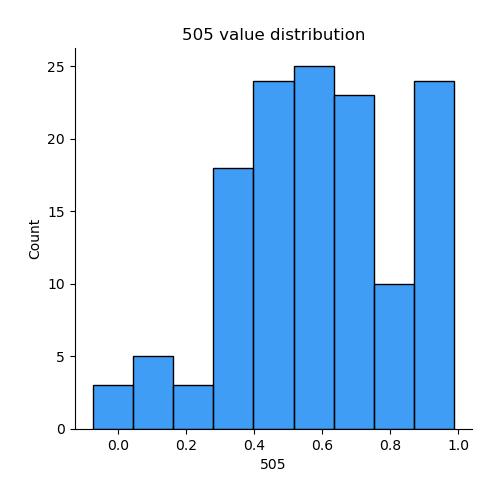
## Feature : 506
- **Feature type** : continous
- **Missing** : 0.0%
- **Unique** : 135
- **Count** :135.0
- **Mean** :0.4949662134212291
- **Std** :0.31331188329412285
- **Min** :-0.3816842407669939
- **25%th Percentile** : 0.29636532891475686
- **50%th Percentile** : 0.5157949031254234
- **75%th Percentile** : 0.7009180831030195
- **Max** :0.9863118524123303

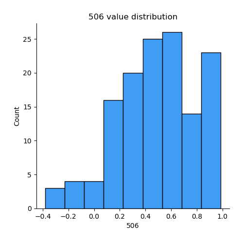
## Feature : 507
- **Feature type** : continous
- **Missing** : 0.0%
- **Unique** : 135
- **Count** :135.0
- **Mean** :0.5675700423244646
- **Std** :0.24060839293407463
- **Min** :-0.0127213392373799
- **25%th Percentile** : 0.41120896935874685
- **50%th Percentile** : 0.5520681785024081
- **75%th Percentile** : 0.6995979511649655
- **Max** :0.990428353256582

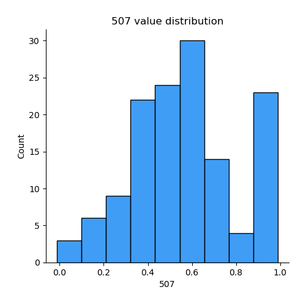
## Feature : 508
- **Feature type** : continous
- **Missing** : 0.0%
- **Unique** : 135
- **Count** :135.0
- **Mean** :0.7589610203024036
- **Std** :0.1473898561882903
- **Min** :0.39738796361337003
- **25%th Percentile** : 0.6549802701035157
- **50%th Percentile** : 0.7665629216947295
- **75%th Percentile** : 0.8612109675936921
- **Max** :0.9879043397963848

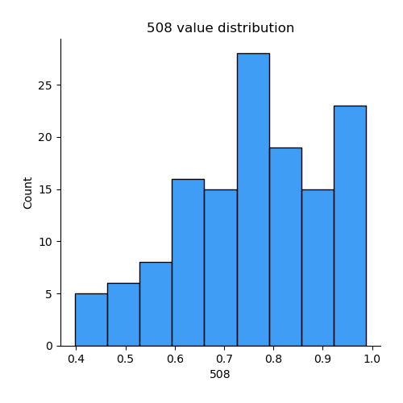
## Feature : 509
- **Feature type** : continous
- **Missing** : 0.0%
- **Unique** : 135
- **Count** :135.0
- **Mean** :0.5176003987846695
- **Std** :0.3130883675558211
- **Min** :-0.3714503664291313
- **25%th Percentile** : 0.3093170178597289
- **50%th Percentile** : 0.5454161377345284
- **75%th Percentile** : 0.7256055672949111
- **Max** :0.9852361408142576

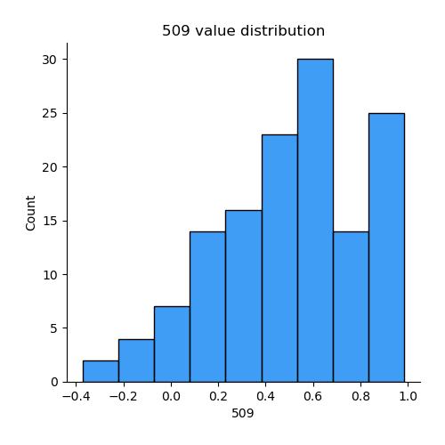
## Feature : 510
- **Feature type** : continous
- **Missing** : 0.0%
- **Unique** : 135
- **Count** :135.0
- **Mean** :0.5575119826990105
- **Std** :0.25635434213609837
- **Min** :-0.14303336599163466
- **25%th Percentile** : 0.39736549517441755
- **50%th Percentile** : 0.5499603826225573
- **75%th Percentile** : 0.7037166469848404
- **Max** :0.9804590885039242

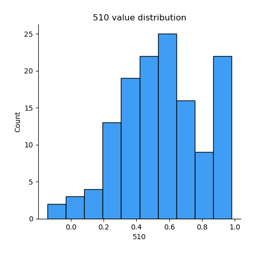
## Feature : 511
- **Feature type** : continous
- **Missing** : 0.0%
- **Unique** : 135
- **Count** :135.0
- **Mean** :0.5451959954647917
- **Std** :0.29279050155888625
- **Min** :-0.33214311457205203
- **25%th Percentile** : 0.3391814777255976
- **50%th Percentile** : 0.5714847622209478
- **75%th Percentile** : 0.7385841959835875
- **Max** :0.9883737735853234

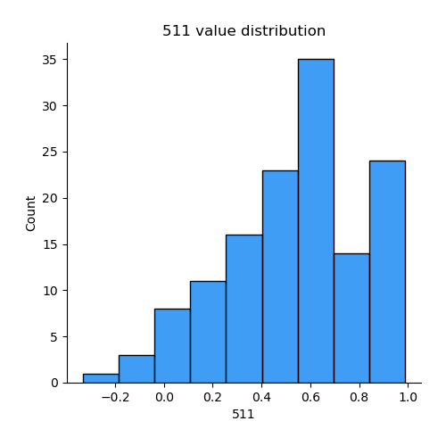
## Feature : 512
- **Feature type** : continous
- **Missing** : 0.0%
- **Unique** : 135
- **Count** :135.0
- **Mean** :0.6577810864417379
- **Std** :0.21601942033316313
- **Min** :0.0873132285396806
- **25%th Percentile** : 0.5455058842838786
- **50%th Percentile** : 0.6735425334833869
- **75%th Percentile** : 0.7839215616285118
- **Max** :0.9874745552655573

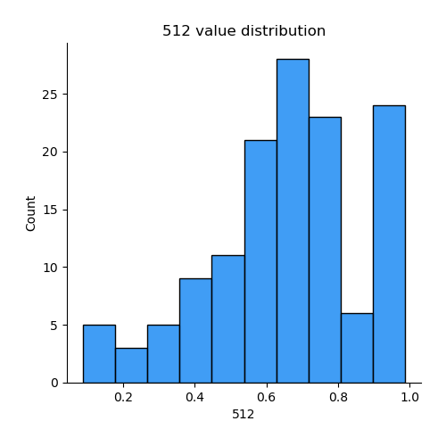
## Feature : 513
- **Feature type** : continous
- **Missing** : 0.0%
- **Unique** : 135
- **Count** :135.0
- **Mean** :0.35516851065661814
- **Std** :0.3152119489556585
- **Min** :-0.24821733503837345
- **25%th Percentile** : 0.13978464400566576
- **50%th Percentile** : 0.285606985913767
- **75%th Percentile** : 0.4758901682081448
- **Max** :0.979474102433088

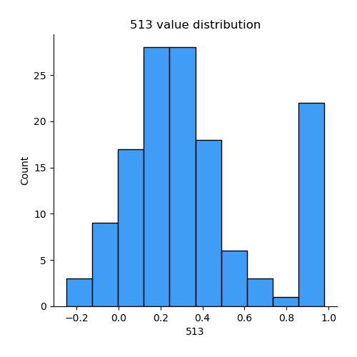
## Feature : 514
- **Feature type** : continous
- **Missing** : 0.0%
- **Unique** : 135
- **Count** :135.0
- **Mean** :0.5221293111967089
- **Std** :0.2886850497203689
- **Min** :-0.29915919863346746
- **25%th Percentile** : 0.3453702466191708
- **50%th Percentile** : 0.48816030968317076
- **75%th Percentile** : 0.7115296004385192
- **Max** :0.9871004305644121

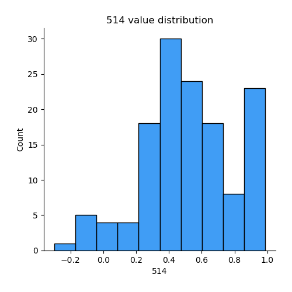
## Feature : 515
- **Feature type** : continous
- **Missing** : 0.0%
- **Unique** : 135
- **Count** :135.0
- **Mean** :0.6970858426518157
- **Std** :0.21156903774887403
- **Min** :0.040319585365012414
- **25%th Percentile** : 0.5947236293677525
- **50%th Percentile** : 0.7162267779156829
- **75%th Percentile** : 0.8562174324290404
- **Max** :0.9904032619870676

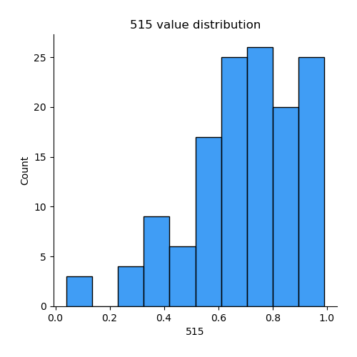
## Feature : 516
- **Feature type** : continous
- **Missing** : 0.0%
- **Unique** : 135
- **Count** :135.0
- **Mean** :0.5637270211399256
- **Std** :0.26100973283827356
- **Min** :-0.15711025173593265
- **25%th Percentile** : 0.4303947168580902
- **50%th Percentile** : 0.566888118304995
- **75%th Percentile** : 0.7231492808147993
- **Max** :0.9842338133687516

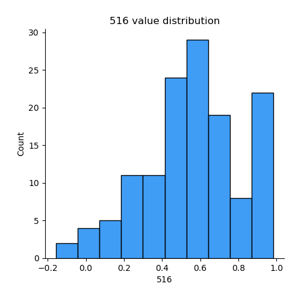
## Feature : 517
- **Feature type** : continous
- **Missing** : 0.0%
- **Unique** : 135
- **Count** :135.0
- **Mean** :0.5730759859715306
- **Std** :0.25224990749885445
- **Min** :-0.01983693262464262
- **25%th Percentile** : 0.4065879767254864
- **50%th Percentile** : 0.5743508828225928
- **75%th Percentile** : 0.7307277391235062
- **Max** :0.9877520620883647

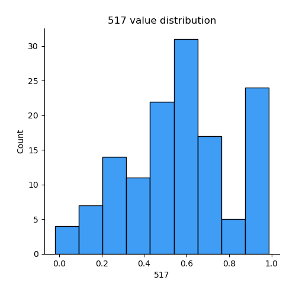
## Feature : 518
- **Feature type** : continous
- **Missing** : 0.0%
- **Unique** : 135
- **Count** :135.0
- **Mean** :0.3607823713281633
- **Std** :0.3089295354478251
- **Min** :-0.3621676126503123
- **25%th Percentile** : 0.14713956548920065
- **50%th Percentile** : 0.3131665914017539
- **75%th Percentile** : 0.5102514638689314
- **Max** :0.9765283839003868

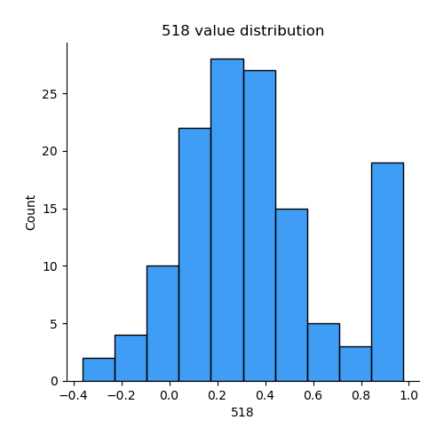
## Feature : 519
- **Feature type** : continous
- **Missing** : 0.0%
- **Unique** : 135
- **Count** :135.0
- **Mean** :0.4717188081396278
- **Std** :0.27915693851959034
- **Min** :-0.13322831043380076
- **25%th Percentile** : 0.24902130673466677
- **50%th Percentile** : 0.4550868730858353
- **75%th Percentile** : 0.638363477296276
- **Max** :0.9799736898630608

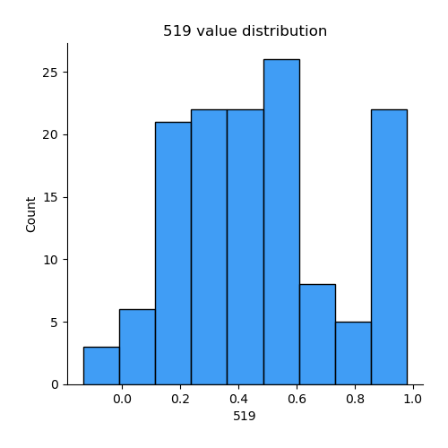
## Feature : 530
- **Feature type** : continous
- **Missing** : 0.0%
- **Unique** : 3
- **Count** :135.0
- **Mean** :1.0
- **Std** :8.894203383953475e-17
- **Min** :0.9999999999999998
- **25%th Percentile** : 0.9999999999999999
- **50%th Percentile** : 1.0
- **75%th Percentile** : 1.0
- **Max** :1.0

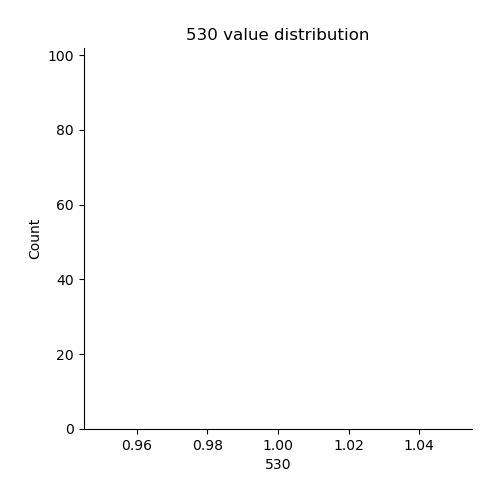
## Feature : 531
- **Feature type** : continous
- **Missing** : 0.0%
- **Unique** : 135
- **Count** :135.0
- **Mean** :0.5928943796161238
- **Std** :0.23877384706705113
- **Min** :-0.0604056330627462
- **25%th Percentile** : 0.41092425845823455
- **50%th Percentile** : 0.5963465232210567
- **75%th Percentile** : 0.756867458211496
- **Max** :0.9895523375681382

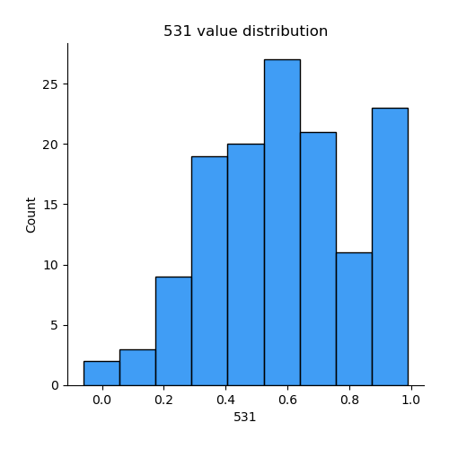
## Feature : 532
- **Feature type** : continous
- **Missing** : 0.0%
- **Unique** : 135
- **Count** :135.0
- **Mean** :0.5481699006207479
- **Std** :0.29227860184662197
- **Min** :-0.19263590131914862
- **25%th Percentile** : 0.3779307837180555
- **50%th Percentile** : 0.562234850976274
- **75%th Percentile** : 0.7516952393846963
- **Max** :0.9901538273894385

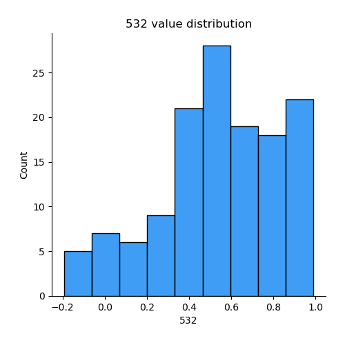
## Feature : 533
- **Feature type** : continous
- **Missing** : 0.0%
- **Unique** : 135
- **Count** :135.0
- **Mean** :0.6581987082544665
- **Std** :0.20459032879722808
- **Min** :0.08372452241039377
- **25%th Percentile** : 0.5149618846876106
- **50%th Percentile** : 0.6717889733788526
- **75%th Percentile** : 0.7785842420290925
- **Max** :0.9909686064764787

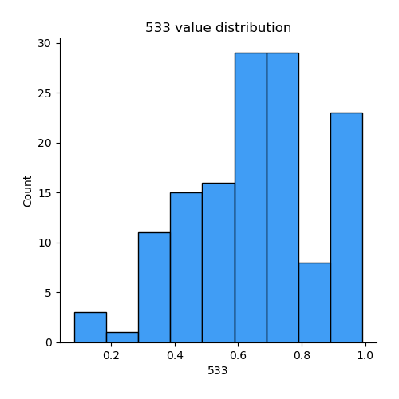
## Feature : 534
- **Feature type** : continous
- **Missing** : 0.0%
- **Unique** : 135
- **Count** :135.0
- **Mean** :0.8915488072740592
- **Std** :0.07114608704331345
- **Min** :0.6606160627068183
- **25%th Percentile** : 0.8510320832316879
- **50%th Percentile** : 0.9020544572821895
- **75%th Percentile** : 0.9422904572875364
- **Max** :0.9952474988839619

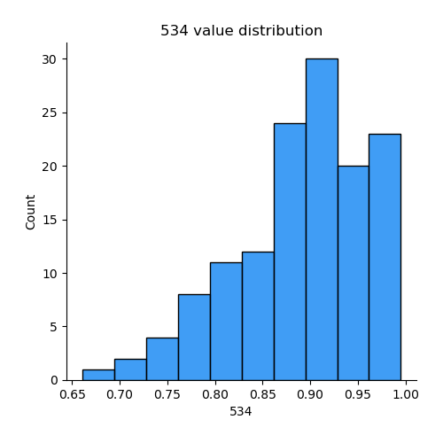
## Feature : 535
- **Feature type** : continous
- **Missing** : 0.0%
- **Unique** : 135
- **Count** :135.0
- **Mean** :0.5812686118377286
- **Std** :0.2599760625216449
- **Min** :-0.02063319266570774
- **25%th Percentile** : 0.39620884074194324
- **50%th Percentile** : 0.580269295471162
- **75%th Percentile** : 0.7552071645723867
- **Max** :0.9912206049320551

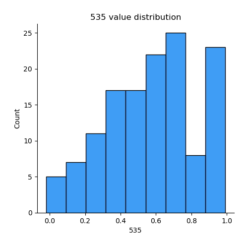
## Feature : 536
- **Feature type** : continous
- **Missing** : 0.0%
- **Unique** : 135
- **Count** :135.0
- **Mean** :0.6281280212463035
- **Std** :0.22566276184256134
- **Min** :-0.16313344720618667
- **25%th Percentile** : 0.4897642091990836
- **50%th Percentile** : 0.628482505423745
- **75%th Percentile** : 0.8023231265521362
- **Max** :0.9908863180347649

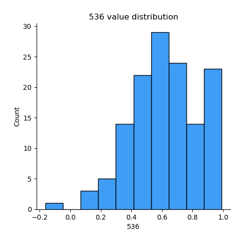
## Feature : 537
- **Feature type** : continous
- **Missing** : 0.0%
- **Unique** : 135
- **Count** :135.0
- **Mean** :0.6014132346657052
- **Std** :0.24814589793321334
- **Min** :-0.036891869780713266
- **25%th Percentile** : 0.4224164405730718
- **50%th Percentile** : 0.6125482781480324
- **75%th Percentile** : 0.764386129501128
- **Max** :0.9934287976239803

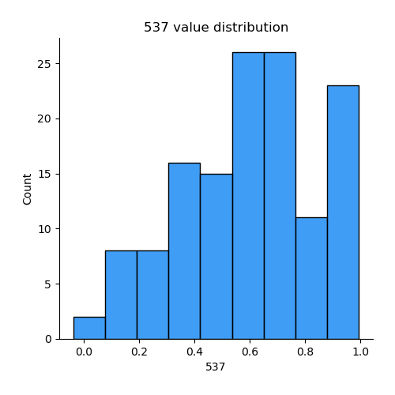
## Feature : 538
- **Feature type** : continous
- **Missing** : 0.0%
- **Unique** : 135
- **Count** :135.0
- **Mean** :0.735003839870916
- **Std** :0.17906913731331606
- **Min** :0.10833617285317167
- **25%th Percentile** : 0.6386649139116114
- **50%th Percentile** : 0.7484603028397666
- **75%th Percentile** : 0.8638127259264381
- **Max** :0.9889693846071789

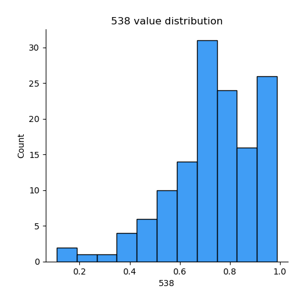
## Feature : 539
- **Feature type** : continous
- **Missing** : 0.0%
- **Unique** : 135
- **Count** :135.0
- **Mean** :0.40926022996835787
- **Std** :0.3043839134048169
- **Min** :-0.43350171151346784
- **25%th Percentile** : 0.19654555278819377
- **50%th Percentile** : 0.3466694851192003
- **75%th Percentile** : 0.5666577383726525
- **Max** :0.9818457388570507

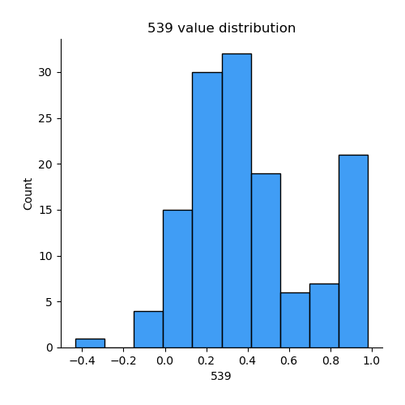
## Feature : 540
- **Feature type** : continous
- **Missing** : 0.0%
- **Unique** : 135
- **Count** :135.0
- **Mean** :0.5145687016660464
- **Std** :0.28919015546148696
- **Min** :-0.1541214622322499
- **25%th Percentile** : 0.30950003617291777
- **50%th Percentile** : 0.5053502626225687
- **75%th Percentile** : 0.7083069929611001
- **Max** :0.9929908700421309

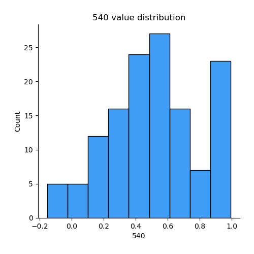
## Feature : 541
- **Feature type** : continous
- **Missing** : 0.0%
- **Unique** : 135
- **Count** :135.0
- **Mean** :0.7217204710631349
- **Std** :0.19382639144626887
- **Min** :-0.06620503158690984
- **25%th Percentile** : 0.6272389987306178
- **50%th Percentile** : 0.7427139934697801
- **75%th Percentile** : 0.8514276928059125
- **Max** :0.99305313246904

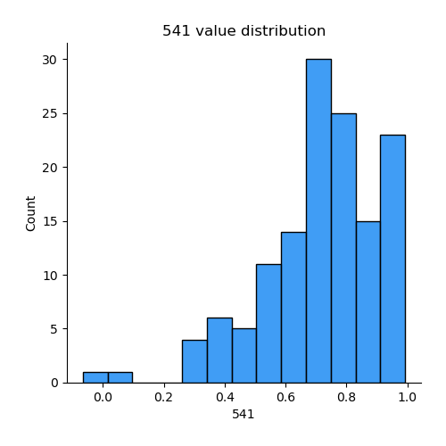
## Feature : 542
- **Feature type** : continous
- **Missing** : 0.0%
- **Unique** : 135
- **Count** :135.0
- **Mean** :0.6456338488103407
- **Std** :0.21062213634981872
- **Min** :-0.047270566684273055
- **25%th Percentile** : 0.514842361698606
- **50%th Percentile** : 0.6332391688867421
- **75%th Percentile** : 0.7828847291579667
- **Max** :0.9880061533474847

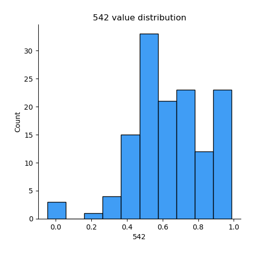
## Feature : 543
- **Feature type** : continous
- **Missing** : 0.0%
- **Unique** : 135
- **Count** :135.0
- **Mean** :0.6271200941150562
- **Std** :0.22233341752292252
- **Min** :-0.03481430264138682
- **25%th Percentile** : 0.48381246131643973
- **50%th Percentile** : 0.6215755291803469
- **75%th Percentile** : 0.7537783049081754
- **Max** :0.9935723521815844

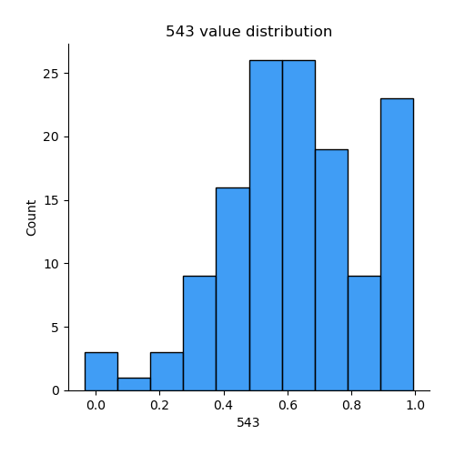
## Feature : 544
- **Feature type** : continous
- **Missing** : 0.0%
- **Unique** : 135
- **Count** :135.0
- **Mean** :0.40911919080583464
- **Std** :0.2859727947093651
- **Min** :-0.13669201140595455
- **25%th Percentile** : 0.21948770321259395
- **50%th Percentile** : 0.35856066276862614
- **75%th Percentile** : 0.5530810212427906
- **Max** :0.9695754987998599

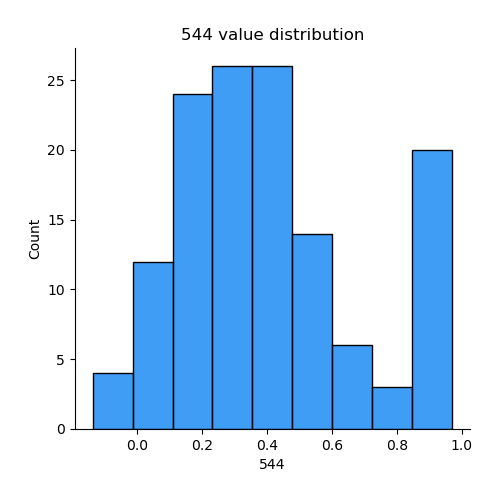
## Feature : 545
- **Feature type** : continous
- **Missing** : 0.0%
- **Unique** : 135
- **Count** :135.0
- **Mean** :0.5985272986745594
- **Std** :0.23157688318882863
- **Min** :-0.0052308857366742826
- **25%th Percentile** : 0.4333215511288777
- **50%th Percentile** : 0.5718148710698716
- **75%th Percentile** : 0.7871206877685608
- **Max** :0.9818374349315212

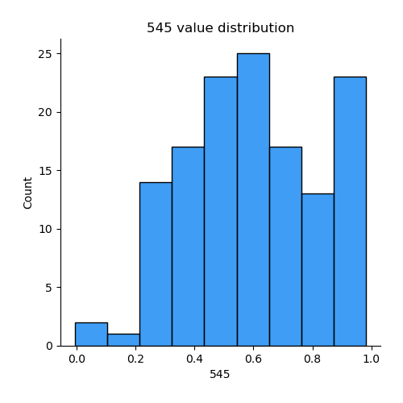
## Feature : 546
- **Feature type** : continous
- **Missing** : 0.0%
- **Unique** : 135
- **Count** :135.0
- **Mean** :0.5667859544713253
- **Std** :0.25385000317841616
- **Min** :-0.10624398997696181
- **25%th Percentile** : 0.40321772552610535
- **50%th Percentile** : 0.5578169454467182
- **75%th Percentile** : 0.725817396574538
- **Max** :0.9887014533793256

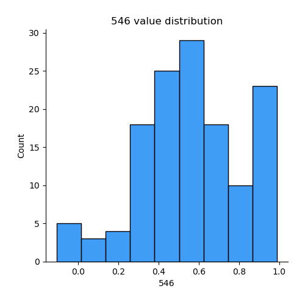
## Feature : 547
- **Feature type** : continous
- **Missing** : 0.0%
- **Unique** : 135
- **Count** :135.0
- **Mean** :0.5241158691011193
- **Std** :0.2621050685587841
- **Min** :-0.12317273756018154
- **25%th Percentile** : 0.31541448666470384
- **50%th Percentile** : 0.5114487487033192
- **75%th Percentile** : 0.6803452808064221
- **Max** :0.9911792684322249

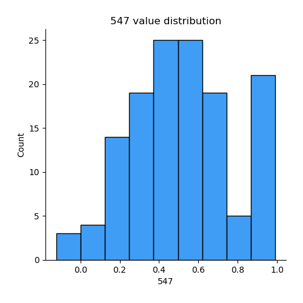
## Feature : 548
- **Feature type** : continous
- **Missing** : 0.0%
- **Unique** : 135
- **Count** :135.0
- **Mean** :0.8211445448375295
- **Std** :0.13593409716062957
- **Min** :0.38772372673943534
- **25%th Percentile** : 0.7699599343015354
- **50%th Percentile** : 0.841680385180603
- **75%th Percentile** : 0.920780125053368
- **Max** :0.9947302139331119

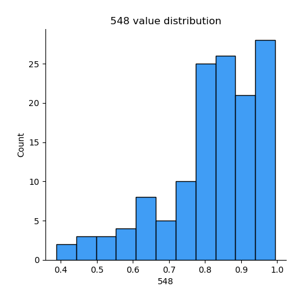
## Feature : 549
- **Feature type** : continous
- **Missing** : 0.0%
- **Unique** : 135
- **Count** :135.0
- **Mean** :0.4250502317353428
- **Std** :0.2882767894008349
- **Min** :-0.24202305441616515
- **25%th Percentile** : 0.2246071428666537
- **50%th Percentile** : 0.3731584171392899
- **75%th Percentile** : 0.6354936229340471
- **Max** :0.9791117351835982

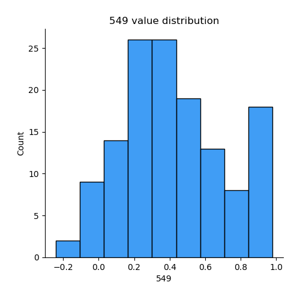
## Feature : 550
- **Feature type** : continous
- **Missing** : 0.0%
- **Unique** : 135
- **Count** :135.0
- **Mean** :0.7701696673581508
- **Std** :0.1531739406518518
- **Min** :0.3059694993156657
- **25%th Percentile** : 0.6802506989587835
- **50%th Percentile** : 0.7875278472764038
- **75%th Percentile** : 0.8672063870771396
- **Max** :0.9963479941993085

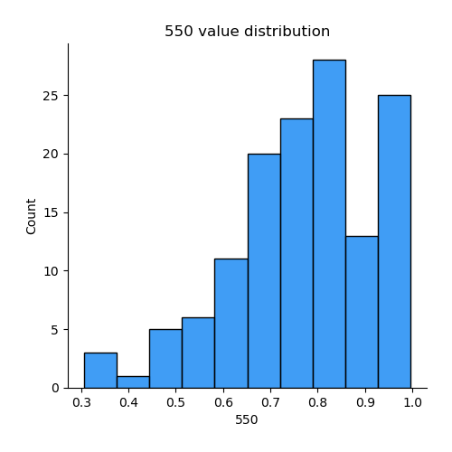
## Feature : 551
- **Feature type** : continous
- **Missing** : 0.0%
- **Unique** : 135
- **Count** :135.0
- **Mean** :0.6445663602805743
- **Std** :0.2132899301804317
- **Min** :0.15866330113846613
- **25%th Percentile** : 0.463709252306586
- **50%th Percentile** : 0.6714224883108119
- **75%th Percentile** : 0.7721509866334048
- **Max** :0.989942242832127

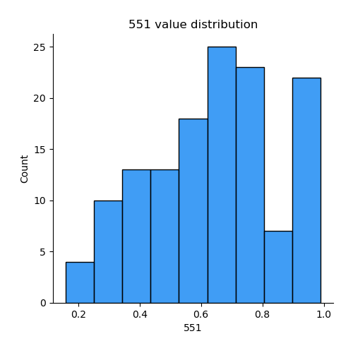
## Feature : 552
- **Feature type** : continous
- **Missing** : 0.0%
- **Unique** : 135
- **Count** :135.0
- **Mean** :0.6002227737462967
- **Std** :0.24615680370822457
- **Min** :-0.044158429561372683
- **25%th Percentile** : 0.43784536692143117
- **50%th Percentile** : 0.6387948419466345
- **75%th Percentile** : 0.7519046310794675
- **Max** :0.9930840617478013

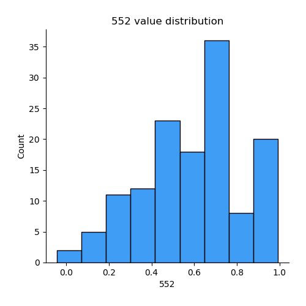
## Feature : 553
- **Feature type** : continous
- **Missing** : 0.0%
- **Unique** : 135
- **Count** :135.0
- **Mean** :0.6150409139949975
- **Std** :0.2205697243256976
- **Min** :-0.06111782912591464
- **25%th Percentile** : 0.4560724061568536
- **50%th Percentile** : 0.6130457661989062
- **75%th Percentile** : 0.7420015220280799
- **Max** :0.9910712895783194

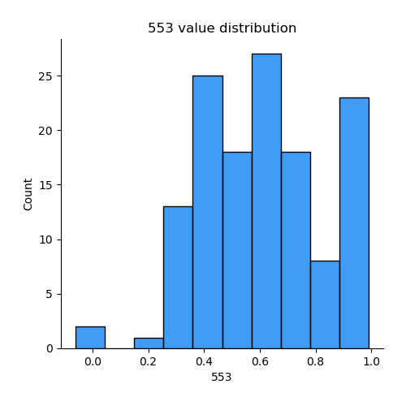
## Feature : 554
- **Feature type** : continous
- **Missing** : 0.0%
- **Unique** : 135
- **Count** :135.0
- **Mean** :0.7131053609659739
- **Std** :0.18387089135701046
- **Min** :0.05643749467438161
- **25%th Percentile** : 0.5787812170358644
- **50%th Percentile** : 0.718355198033739
- **75%th Percentile** : 0.8536428225060693
- **Max** :0.9926697194072182

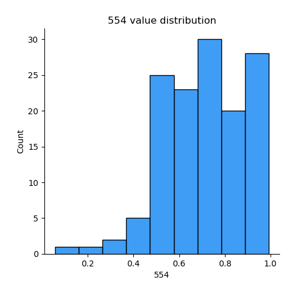
## Feature : 555
- **Feature type** : continous
- **Missing** : 0.0%
- **Unique** : 135
- **Count** :135.0
- **Mean** :0.7639130110409492
- **Std** :0.1589769102347469
- **Min** :0.2743522301564722
- **25%th Percentile** : 0.6753611636809046
- **50%th Percentile** : 0.7850178731793339
- **75%th Percentile** : 0.8646316114397377
- **Max** :0.9909886115388715

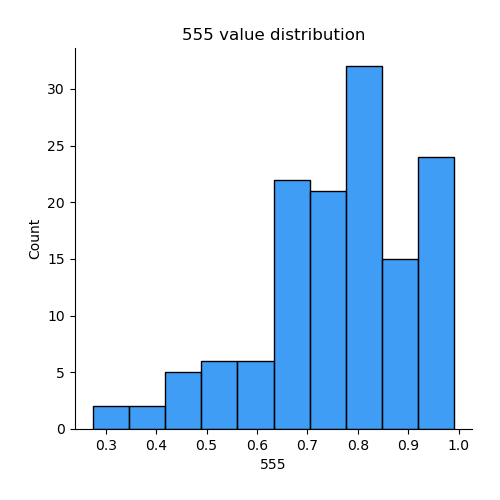
## Feature : 556
- **Feature type** : continous
- **Missing** : 0.0%
- **Unique** : 135
- **Count** :135.0
- **Mean** :0.9280200302568533
- **Std** :0.06927129759403605
- **Min** :0.4614794704255963
- **25%th Percentile** : 0.9009934383754434
- **50%th Percentile** : 0.9426846769502834
- **75%th Percentile** : 0.9723594943460615
- **Max** :0.9983252441033909

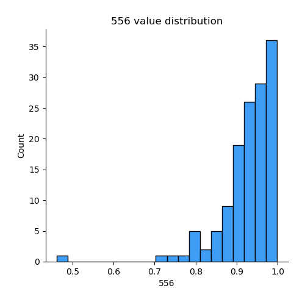
## Feature : 557
- **Feature type** : continous
- **Missing** : 0.0%
- **Unique** : 135
- **Count** :135.0
- **Mean** :0.5834195455276561
- **Std** :0.24552678999705066
- **Min** :-0.06256713111088193
- **25%th Percentile** : 0.42116310938061297
- **50%th Percentile** : 0.5780121031973562
- **75%th Percentile** : 0.7271997459357963
- **Max** :0.9901546159973005

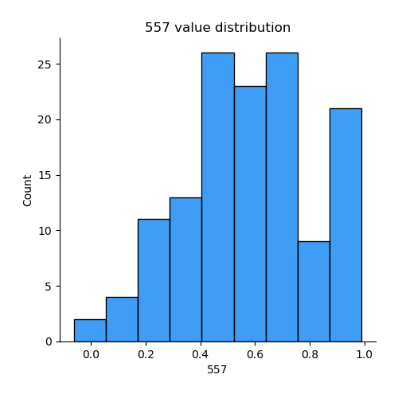
## Feature : 558
- **Feature type** : continous
- **Missing** : 0.0%
- **Unique** : 135
- **Count** :135.0
- **Mean** :0.542348950988392
- **Std** :0.28738376348087785
- **Min** :-0.23953419790417765
- **25%th Percentile** : 0.332204194431907
- **50%th Percentile** : 0.5575077783419338
- **75%th Percentile** : 0.7326289102018488
- **Max** :0.992001528623916

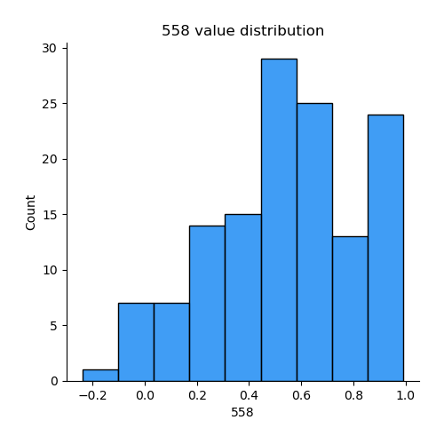
## Feature : 559
- **Feature type** : continous
- **Missing** : 0.0%
- **Unique** : 135
- **Count** :135.0
- **Mean** :0.6446859565744196
- **Std** :0.2108312410207819
- **Min** :0.04014075126448284
- **25%th Percentile** : 0.5044922401990496
- **50%th Percentile** : 0.649177199900139
- **75%th Percentile** : 0.7582653556992788
- **Max** :0.991432554123324

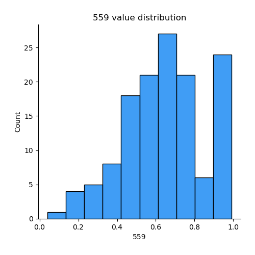
## Feature : 560
- **Feature type** : continous
- **Missing** : 0.0%
- **Unique** : 135
- **Count** :135.0
- **Mean** :0.8601208727673705
- **Std** :0.10893584686689227
- **Min** :0.2469211860581759
- **25%th Percentile** : 0.8245316422731696
- **50%th Percentile** : 0.8728604913665281
- **75%th Percentile** : 0.9193868338589255
- **Max** :0.9943242319223734

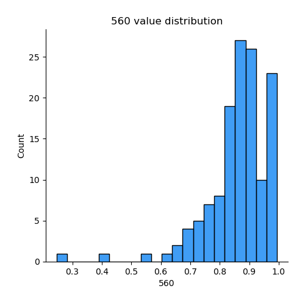
## Feature : 561
- **Feature type** : continous
- **Missing** : 0.0%
- **Unique** : 135
- **Count** :135.0
- **Mean** :0.5583503433727744
- **Std** :0.28428012253251983
- **Min** :-0.14993295726859623
- **25%th Percentile** : 0.3750739712270146
- **50%th Percentile** : 0.6007188393462783
- **75%th Percentile** : 0.7615356377127147
- **Max** :0.9906355916321836

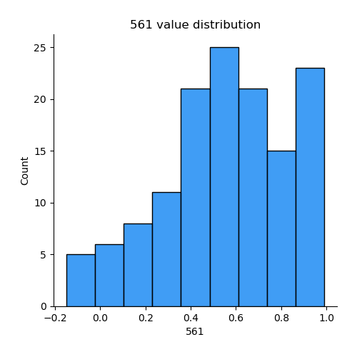
## Feature : 562
- **Feature type** : continous
- **Missing** : 0.0%
- **Unique** : 135
- **Count** :135.0
- **Mean** :0.6130968153126808
- **Std** :0.23043392360356496
- **Min** :-0.08732856764617944
- **25%th Percentile** : 0.46121092583627493
- **50%th Percentile** : 0.5966752475421595
- **75%th Percentile** : 0.7998526505874652
- **Max** :0.9925840380901079

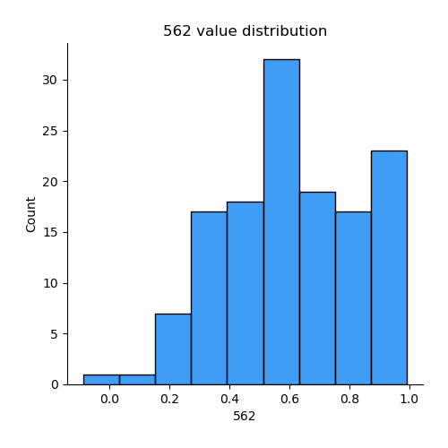
## Feature : 563
- **Feature type** : continous
- **Missing** : 0.0%
- **Unique** : 135
- **Count** :135.0
- **Mean** :0.5818824310481896
- **Std** :0.2675277311482206
- **Min** :-0.12107754838900206
- **25%th Percentile** : 0.3700102999685043
- **50%th Percentile** : 0.6064602485972738
- **75%th Percentile** : 0.7595608742946136
- **Max** :0.9917825505738842

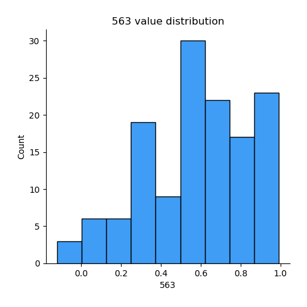
## Feature : 564
- **Feature type** : continous
- **Missing** : 0.0%
- **Unique** : 135
- **Count** :135.0
- **Mean** :0.729802555232033
- **Std** :0.17901936516501163
- **Min** :0.18741530837763964
- **25%th Percentile** : 0.6376945893678926
- **50%th Percentile** : 0.7521176801519176
- **75%th Percentile** : 0.849215822381127
- **Max** :0.9890887612294654

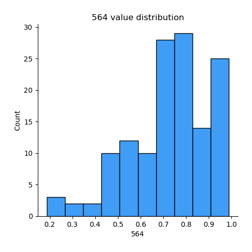
## Feature : 565
- **Feature type** : continous
- **Missing** : 0.0%
- **Unique** : 135
- **Count** :135.0
- **Mean** :0.3669865249833797
- **Std** :0.3106006794932122
- **Min** :-0.3745010391459757
- **25%th Percentile** : 0.15926613849739574
- **50%th Percentile** : 0.2847972114188888
- **75%th Percentile** : 0.49270241933105896
- **Max** :0.9846768850581578

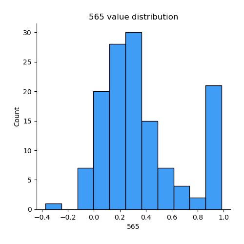
## Feature : 566
- **Feature type** : continous
- **Missing** : 0.0%
- **Unique** : 135
- **Count** :135.0
- **Mean** :0.5313379807313081
- **Std** :0.29035973052413555
- **Min** :-0.2235516445067475
- **25%th Percentile** : 0.327119113061377
- **50%th Percentile** : 0.5395323227836764
- **75%th Percentile** : 0.7365483790652798
- **Max** :0.9932278965189834

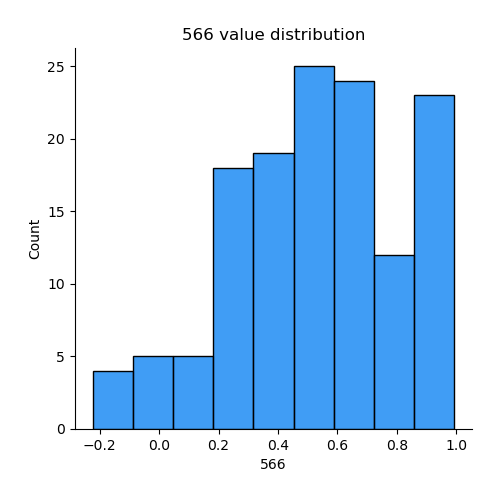
## Feature : 567
- **Feature type** : continous
- **Missing** : 0.0%
- **Unique** : 135
- **Count** :135.0
- **Mean** :0.7012969003283828
- **Std** :0.20770008650373298
- **Min** :0.06692288392460691
- **25%th Percentile** : 0.5963562196658905
- **50%th Percentile** : 0.7240679641185226
- **75%th Percentile** : 0.8362013259782934
- **Max** :0.9937346131437992

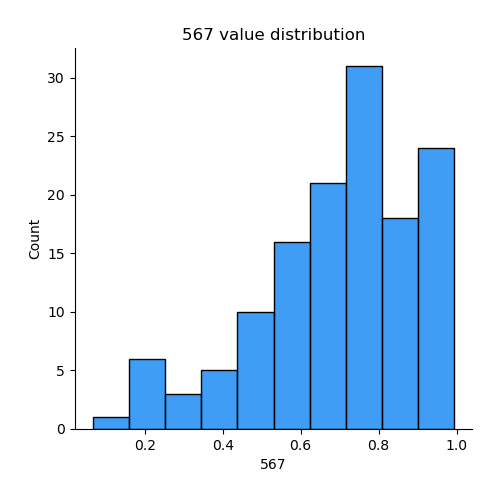
## Feature : 568
- **Feature type** : continous
- **Missing** : 0.0%
- **Unique** : 135
- **Count** :135.0
- **Mean** :0.6095775560691127
- **Std** :0.23345342339332886
- **Min** :-0.0028050142650270006
- **25%th Percentile** : 0.45125968408860795
- **50%th Percentile** : 0.6034986897454375
- **75%th Percentile** : 0.753010607365896
- **Max** :0.99059909826321

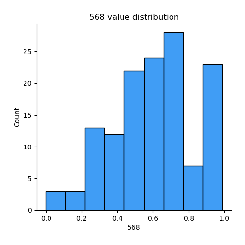
## Feature : 569
- **Feature type** : continous
- **Missing** : 0.0%
- **Unique** : 135
- **Count** :135.0
- **Mean** :0.6132207244339444
- **Std** :0.2324439484104715
- **Min** :-0.04163671136284889
- **25%th Percentile** : 0.46448784451791425
- **50%th Percentile** : 0.6140776048090848
- **75%th Percentile** : 0.749671353629925
- **Max** :0.987724418841658

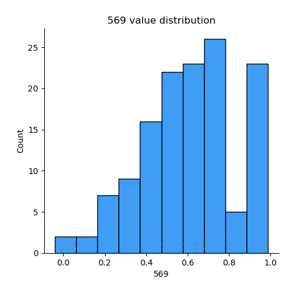
## Feature : 570
- **Feature type** : continous
- **Missing** : 0.0%
- **Unique** : 135
- **Count** :135.0
- **Mean** :0.3994884291787191
- **Std** :0.2997179496111213
- **Min** :-0.28832056528250477
- **25%th Percentile** : 0.19787049507786486
- **50%th Percentile** : 0.3754785898650571
- **75%th Percentile** : 0.5632825371473971
- **Max** :0.9738209693266389

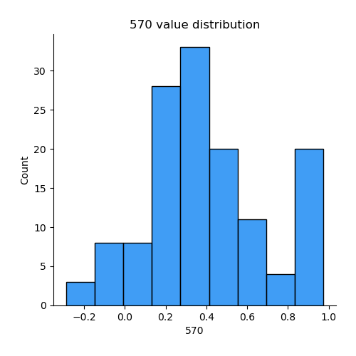
## Feature : 571
- **Feature type** : continous
- **Missing** : 0.0%
- **Unique** : 135
- **Count** :135.0
- **Mean** :0.5188886400012456
- **Std** :0.26560755875207387
- **Min** :-0.11923987720103418
- **25%th Percentile** : 0.3314218595384405
- **50%th Percentile** : 0.49533226761443416
- **75%th Percentile** : 0.6775966180349347
- **Max** :0.9809412988216195

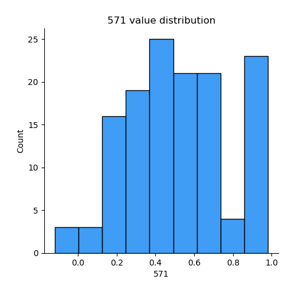
## Feature : 583
- **Feature type** : continous
- **Missing** : 0.0%
- **Unique** : 3
- **Count** :135.0
- **Mean** :1.0
- **Std** :7.366884084838669e-17
- **Min** :0.9999999999999998
- **25%th Percentile** : 1.0
- **50%th Percentile** : 1.0
- **75%th Percentile** : 1.0
- **Max** :1.0

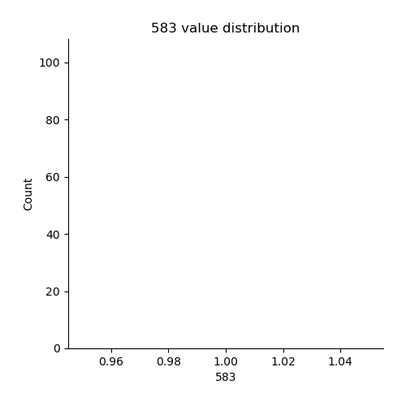
## Feature : 584
- **Feature type** : continous
- **Missing** : 0.0%
- **Unique** : 135
- **Count** :135.0
- **Mean** :0.4679988744041991
- **Std** :0.3219501796815947
- **Min** :-0.3682359747873041
- **25%th Percentile** : 0.26407610384216895
- **50%th Percentile** : 0.4690686482465878
- **75%th Percentile** : 0.6686292797496329
- **Max** :0.9919009639007269

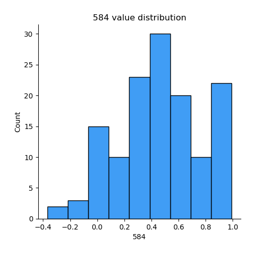
## Feature : 585
- **Feature type** : continous
- **Missing** : 0.0%
- **Unique** : 135
- **Count** :135.0
- **Mean** :0.6257671701188303
- **Std** :0.21850845744420755
- **Min** :0.15372463346161694
- **25%th Percentile** : 0.4585652636592788
- **50%th Percentile** : 0.6235201744446558
- **75%th Percentile** : 0.7683708990785107
- **Max** :0.9941594322909205

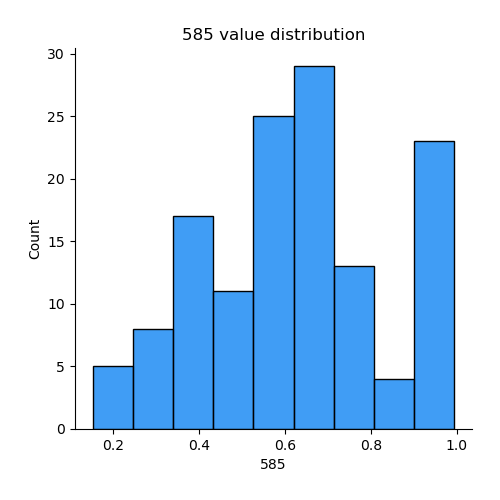
## Feature : 586
- **Feature type** : continous
- **Missing** : 0.0%
- **Unique** : 135
- **Count** :135.0
- **Mean** :0.5311856088814111
- **Std** :0.25247174726477384
- **Min** :-0.05658828437691086
- **25%th Percentile** : 0.33915049938466946
- **50%th Percentile** : 0.5089794487897531
- **75%th Percentile** : 0.6804480315661767
- **Max** :0.9842397969784608

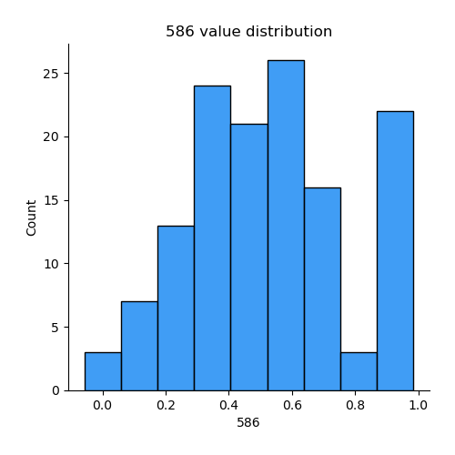
## Feature : 587
- **Feature type** : continous
- **Missing** : 0.0%
- **Unique** : 135
- **Count** :135.0
- **Mean** :0.5489540790086556
- **Std** :0.2764867068235743
- **Min** :-0.19698934118227143
- **25%th Percentile** : 0.36616968563068375
- **50%th Percentile** : 0.5502837848031986
- **75%th Percentile** : 0.7484752078367265
- **Max** :0.9925040675034552

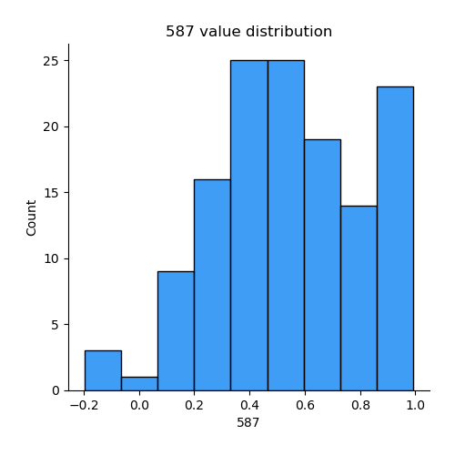
## Feature : 588
- **Feature type** : continous
- **Missing** : 0.0%
- **Unique** : 135
- **Count** :135.0
- **Mean** :0.5920826410604899
- **Std** :0.24351721559875666
- **Min** :-0.004734576419895684
- **25%th Percentile** : 0.4199852720007555
- **50%th Percentile** : 0.5658626827201759
- **75%th Percentile** : 0.7693203902046823
- **Max** :0.9918534473970645

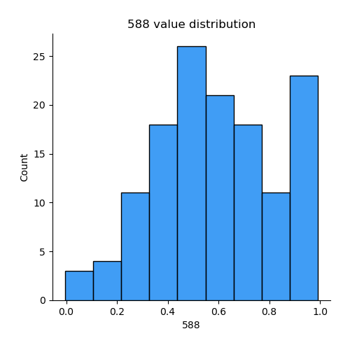
## Feature : 589
- **Feature type** : continous
- **Missing** : 0.0%
- **Unique** : 135
- **Count** :135.0
- **Mean** :0.5539964929838836
- **Std** :0.2808918925566703
- **Min** :-0.24987136468715318
- **25%th Percentile** : 0.3628098091616895
- **50%th Percentile** : 0.5587142979150084
- **75%th Percentile** : 0.7353605501962792
- **Max** :0.9935005273334925

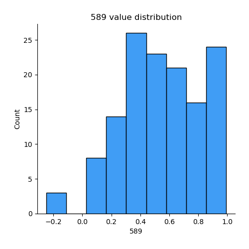
## Feature : 590
- **Feature type** : continous
- **Missing** : 0.0%
- **Unique** : 135
- **Count** :135.0
- **Mean** :0.6474595427667282
- **Std** :0.2161125374545219
- **Min** :0.02573077005667548
- **25%th Percentile** : 0.5054483931283343
- **50%th Percentile** : 0.6517227599055987
- **75%th Percentile** : 0.7906643884116453
- **Max** :0.9915026975609263

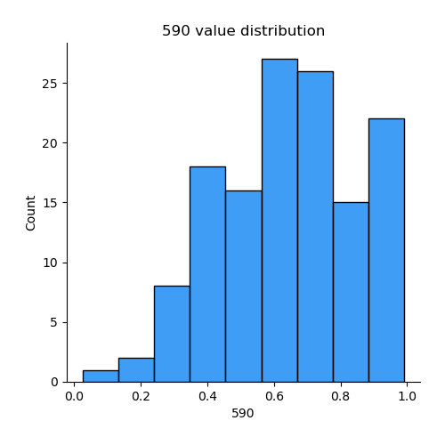
## Feature : 591
- **Feature type** : continous
- **Missing** : 0.0%
- **Unique** : 135
- **Count** :135.0
- **Mean** :0.5123411707711049
- **Std** :0.26619675339165394
- **Min** :-0.24515304106070315
- **25%th Percentile** : 0.330393279244794
- **50%th Percentile** : 0.4604980582531193
- **75%th Percentile** : 0.6567704110440616
- **Max** :0.9893371832792239

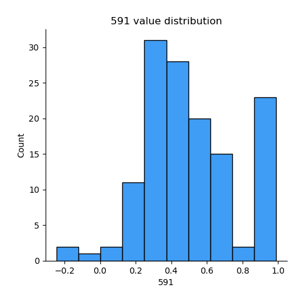
## Feature : 592
- **Feature type** : continous
- **Missing** : 0.0%
- **Unique** : 135
- **Count** :135.0
- **Mean** :0.617973648947795
- **Std** :0.24758234902829465
- **Min** :-0.12059255492804824
- **25%th Percentile** : 0.47286455098288704
- **50%th Percentile** : 0.6139735484703006
- **75%th Percentile** : 0.7778767305868404
- **Max** :0.9948389730376695

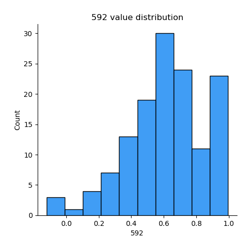
## Feature : 593
- **Feature type** : continous
- **Missing** : 0.0%
- **Unique** : 135
- **Count** :135.0
- **Mean** :0.5662145700686569
- **Std** :0.27941917126234816
- **Min** :-0.17342222594868534
- **25%th Percentile** : 0.3500351516771324
- **50%th Percentile** : 0.5631067237703559
- **75%th Percentile** : 0.7608218151864781
- **Max** :0.9915731232433085

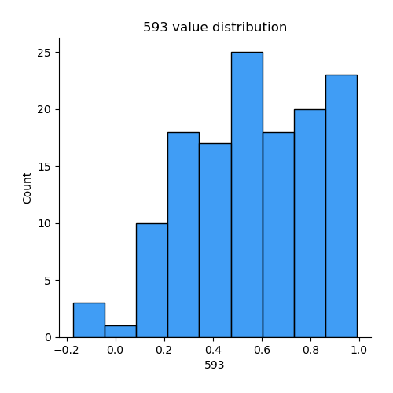
## Feature : 594
- **Feature type** : continous
- **Missing** : 0.0%
- **Unique** : 135
- **Count** :135.0
- **Mean** :0.7649874850050148
- **Std** :0.14891170619577587
- **Min** :0.24602911063931082
- **25%th Percentile** : 0.6680864256264866
- **50%th Percentile** : 0.7633885140586835
- **75%th Percentile** : 0.8739340257864978
- **Max** :0.9956981871718781

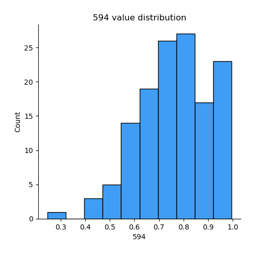
## Feature : 595
- **Feature type** : continous
- **Missing** : 0.0%
- **Unique** : 135
- **Count** :135.0
- **Mean** :0.6421661689373894
- **Std** :0.24561121829968777
- **Min** :-0.024430792092422368
- **25%th Percentile** : 0.47928092576979897
- **50%th Percentile** : 0.6829178426976928
- **75%th Percentile** : 0.8149471802726584
- **Max** :0.99363957317789

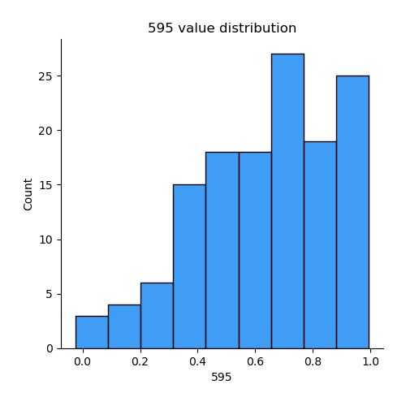
## Feature : 596
- **Feature type** : continous
- **Missing** : 0.0%
- **Unique** : 135
- **Count** :135.0
- **Mean** :0.533614193287567
- **Std** :0.24702890666531782
- **Min** :-0.306901687176332
- **25%th Percentile** : 0.36187382708658344
- **50%th Percentile** : 0.5255912652172966
- **75%th Percentile** : 0.6471241284814073
- **Max** :0.9867835406960724

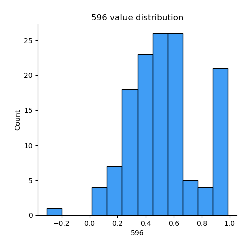
## Feature : 597
- **Feature type** : continous
- **Missing** : 0.0%
- **Unique** : 135
- **Count** :135.0
- **Mean** :0.6121268448176257
- **Std** :0.23065689945189471
- **Min** :-0.08972473134907984
- **25%th Percentile** : 0.46790172348454434
- **50%th Percentile** : 0.6036207887453926
- **75%th Percentile** : 0.7546038484037887
- **Max** :0.9859643191642068

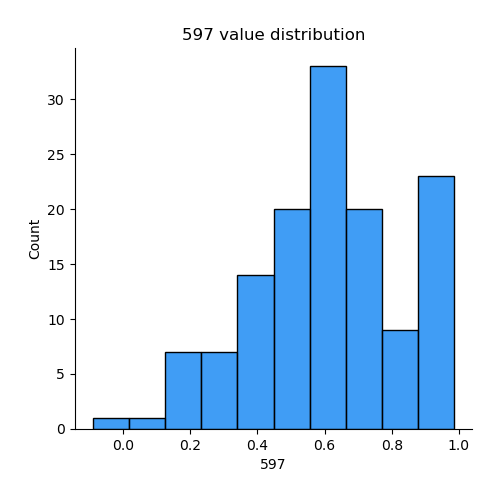
## Feature : 598
- **Feature type** : continous
- **Missing** : 0.0%
- **Unique** : 135
- **Count** :135.0
- **Mean** :0.5745038453750999
- **Std** :0.28072122545061134
- **Min** :-0.328993801387694
- **25%th Percentile** : 0.38738161701441287
- **50%th Percentile** : 0.5925487570946126
- **75%th Percentile** : 0.787189873080729
- **Max** :0.992073534750854

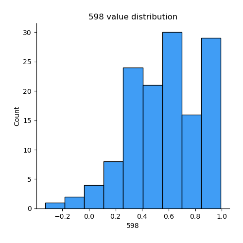
## Feature : 599
- **Feature type** : continous
- **Missing** : 0.0%
- **Unique** : 135
- **Count** :135.0
- **Mean** :0.46286401874047556
- **Std** :0.29923187959911307
- **Min** :-0.25612529342491874
- **25%th Percentile** : 0.25704340804901965
- **50%th Percentile** : 0.4120215756490631
- **75%th Percentile** : 0.6479642175111049
- **Max** :0.9885299158396097

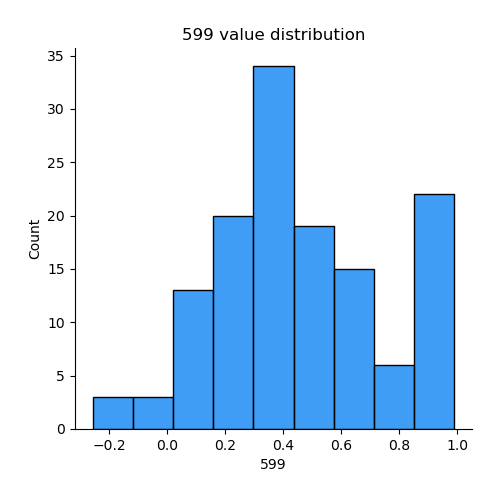
## Feature : 600
- **Feature type** : continous
- **Missing** : 0.0%
- **Unique** : 135
- **Count** :135.0
- **Mean** :0.5638645928923071
- **Std** :0.2588259663503293
- **Min** :-0.08792548958056634
- **25%th Percentile** : 0.3875970744082711
- **50%th Percentile** : 0.5464482719718569
- **75%th Percentile** : 0.7571800527858499
- **Max** :0.9866843037362625

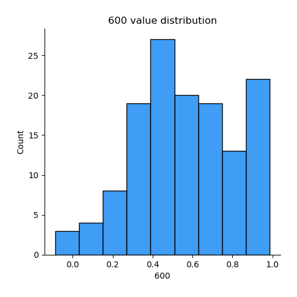
## Feature : 601
- **Feature type** : continous
- **Missing** : 0.0%
- **Unique** : 135
- **Count** :135.0
- **Mean** :0.4466354621883497
- **Std** :0.2814866818124266
- **Min** :-0.22922776973208678
- **25%th Percentile** : 0.2532354554888998
- **50%th Percentile** : 0.4182371915998464
- **75%th Percentile** : 0.6276648994841683
- **Max** :0.9812279833234961

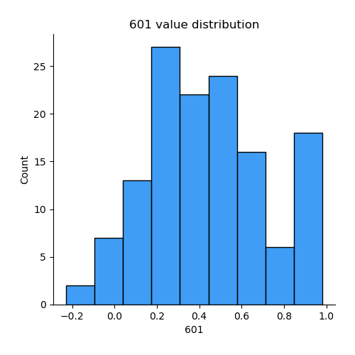
## Feature : 602
- **Feature type** : continous
- **Missing** : 0.0%
- **Unique** : 135
- **Count** :135.0
- **Mean** :0.6334186035491941
- **Std** :0.23018371800403398
- **Min** :-0.13910542522008484
- **25%th Percentile** : 0.47951183504452405
- **50%th Percentile** : 0.6339044907994208
- **75%th Percentile** : 0.7949093611148472
- **Max** :0.994267349741425

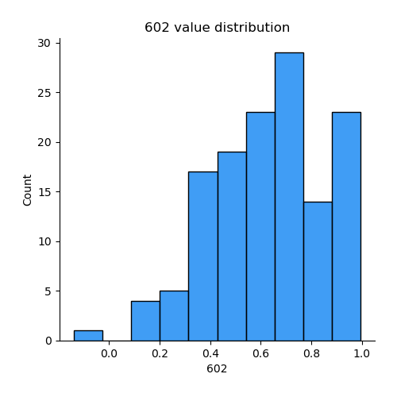
## Feature : 603
- **Feature type** : continous
- **Missing** : 0.0%
- **Unique** : 135
- **Count** :135.0
- **Mean** :0.6094712682568808
- **Std** :0.2587672084192972
- **Min** :0.015840549482757364
- **25%th Percentile** : 0.4263226836069772
- **50%th Percentile** : 0.618210180835338
- **75%th Percentile** : 0.8057183821085849
- **Max** :0.9942356447577659

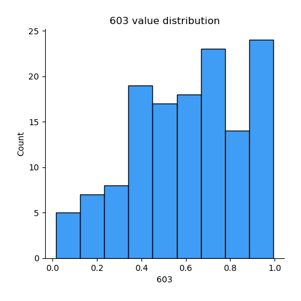
## Feature : 604
- **Feature type** : continous
- **Missing** : 0.0%
- **Unique** : 135
- **Count** :135.0
- **Mean** :0.6422861019088162
- **Std** :0.2482276979988453
- **Min** :-0.2086547587817152
- **25%th Percentile** : 0.496904431253518
- **50%th Percentile** : 0.6474721335635538
- **75%th Percentile** : 0.8164112338035479
- **Max** :0.995113968776644

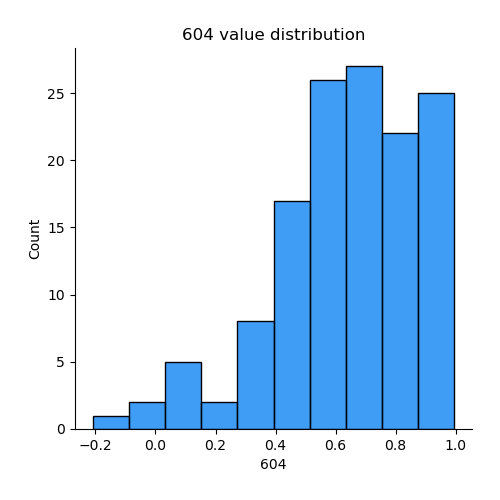
## Feature : 605
- **Feature type** : continous
- **Missing** : 0.0%
- **Unique** : 135
- **Count** :135.0
- **Mean** :0.5185013134264564
- **Std** :0.3025290859042045
- **Min** :-0.36564808322227565
- **25%th Percentile** : 0.31073537092507153
- **50%th Percentile** : 0.5111625768538031
- **75%th Percentile** : 0.7047589129769385
- **Max** :0.9919939325947796

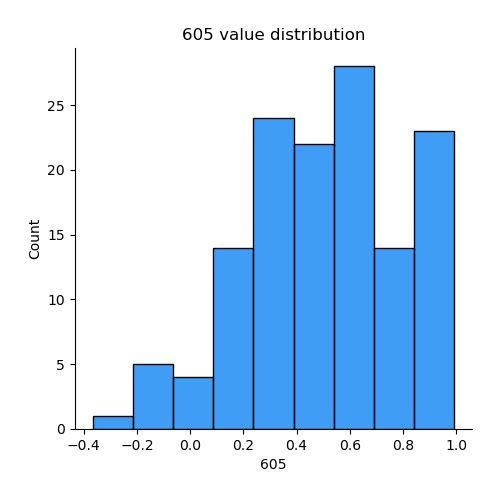
## Feature : 606
- **Feature type** : continous
- **Missing** : 0.0%
- **Unique** : 135
- **Count** :135.0
- **Mean** :0.6140249643586396
- **Std** :0.22320804083318838
- **Min** :0.1013640256979801
- **25%th Percentile** : 0.45953729027236173
- **50%th Percentile** : 0.598983172329139
- **75%th Percentile** : 0.7566391494493577
- **Max** :0.9873989491961674

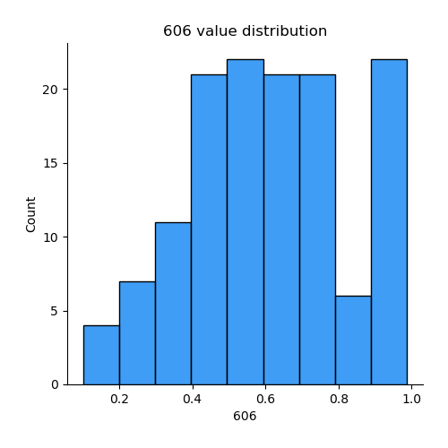
## Feature : 607
- **Feature type** : continous
- **Missing** : 0.0%
- **Unique** : 135
- **Count** :135.0
- **Mean** :0.5648217538936013
- **Std** :0.25791053821876864
- **Min** :-0.21705346200425238
- **25%th Percentile** : 0.3840077366985058
- **50%th Percentile** : 0.5487096157923766
- **75%th Percentile** : 0.762824975430207
- **Max** :0.991710697932955

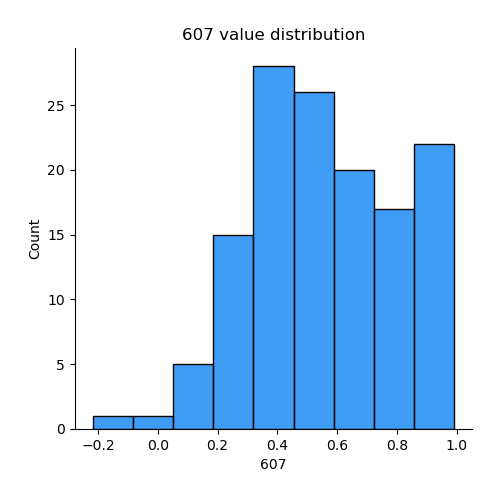
## Feature : 608
- **Feature type** : continous
- **Missing** : 0.0%
- **Unique** : 135
- **Count** :135.0
- **Mean** :0.5656478748982133
- **Std** :0.25573171784511356
- **Min** :-0.09307612607317771
- **25%th Percentile** : 0.3682173913123374
- **50%th Percentile** : 0.5784740813495707
- **75%th Percentile** : 0.7323798715636045
- **Max** :0.9904119445150973

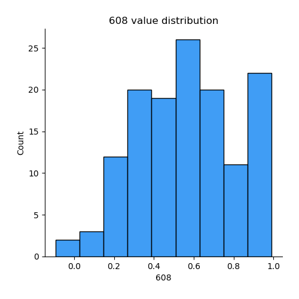
## Feature : 609
- **Feature type** : continous
- **Missing** : 0.0%
- **Unique** : 135
- **Count** :135.0
- **Mean** :0.7139338050081657
- **Std** :0.2539255746471916
- **Min** :-0.3976519827740061
- **25%th Percentile** : 0.6302682196582216
- **50%th Percentile** : 0.755857448861319
- **75%th Percentile** : 0.88465393625259
- **Max** :0.9974961096076713

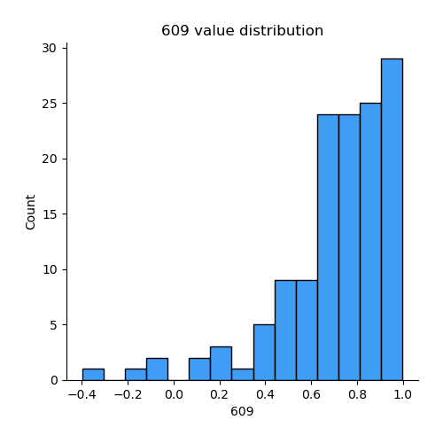
## Feature : 610
- **Feature type** : continous
- **Missing** : 0.0%
- **Unique** : 135
- **Count** :135.0
- **Mean** :0.43290024524124215
- **Std** :0.3397773030985725
- **Min** :-0.41520019087905485
- **25%th Percentile** : 0.20012322792812962
- **50%th Percentile** : 0.39716894435737166
- **75%th Percentile** : 0.6866865079356859
- **Max** :0.9923736835907532

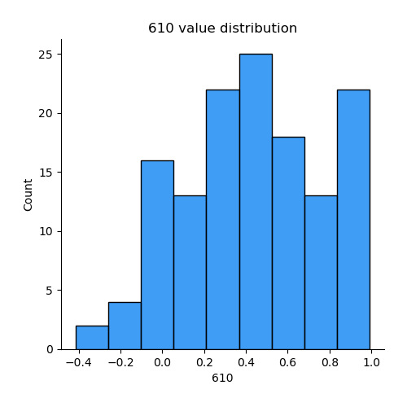
## Feature : 611
- **Feature type** : continous
- **Missing** : 0.0%
- **Unique** : 135
- **Count** :135.0
- **Mean** :0.5449259310166966
- **Std** :0.2722625390865562
- **Min** :-0.3112876712263429
- **25%th Percentile** : 0.3453911030208617
- **50%th Percentile** : 0.548822994450548
- **75%th Percentile** : 0.7182564381977943
- **Max** :0.9933800601710574

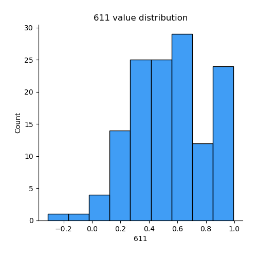
## Feature : 612
- **Feature type** : continous
- **Missing** : 0.0%
- **Unique** : 135
- **Count** :135.0
- **Mean** :0.516362564435707
- **Std** :0.2648667416837535
- **Min** :-0.1303967796403924
- **25%th Percentile** : 0.3223923046648181
- **50%th Percentile** : 0.5008790024996957
- **75%th Percentile** : 0.6904239027871779
- **Max** :0.9821503655005904

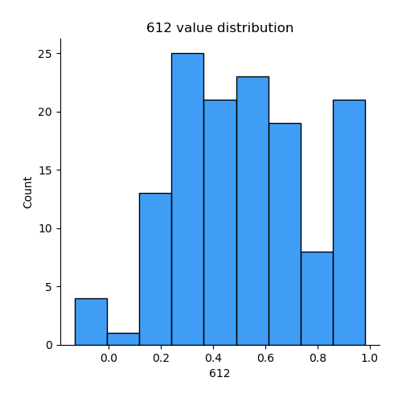
## Feature : 613
- **Feature type** : continous
- **Missing** : 0.0%
- **Unique** : 135
- **Count** :135.0
- **Mean** :0.4824190361498758
- **Std** :0.32699127816558315
- **Min** :-0.3217688482337801
- **25%th Percentile** : 0.27137507902925756
- **50%th Percentile** : 0.49098010480466475
- **75%th Percentile** : 0.7106129719662024
- **Max** :0.9919466252214376

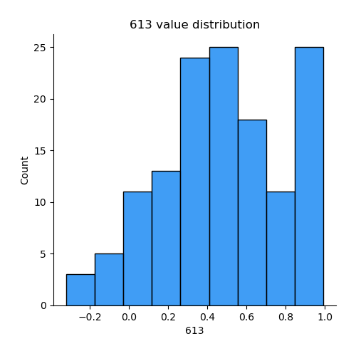
## Feature : 614
- **Feature type** : continous
- **Missing** : 0.0%
- **Unique** : 135
- **Count** :135.0
- **Mean** :0.5422266180230763
- **Std** :0.26677720882665257
- **Min** :-0.08466641984514905
- **25%th Percentile** : 0.3231859600751956
- **50%th Percentile** : 0.5293246904714906
- **75%th Percentile** : 0.722904544486201
- **Max** :0.9910774100002236

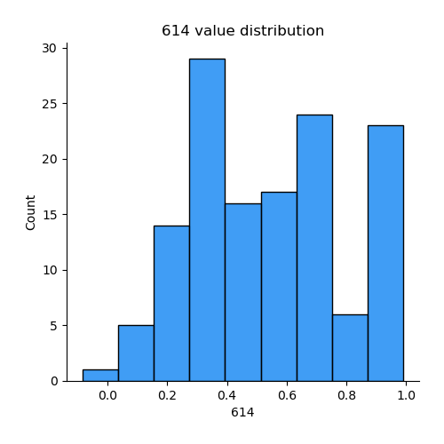
## Feature : 615
- **Feature type** : continous
- **Missing** : 0.0%
- **Unique** : 135
- **Count** :135.0
- **Mean** :0.4859064111570735
- **Std** :0.3240283911146045
- **Min** :-0.2928852201136601
- **25%th Percentile** : 0.24172238218470368
- **50%th Percentile** : 0.4843104509133377
- **75%th Percentile** : 0.7210214757370457
- **Max** :0.9930081621858375

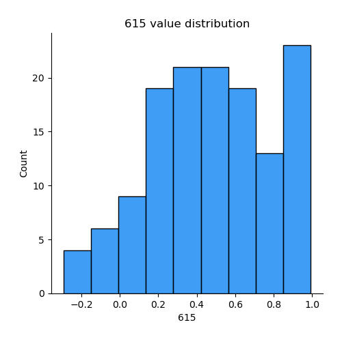
## Feature : 616
- **Feature type** : continous
- **Missing** : 0.0%
- **Unique** : 135
- **Count** :135.0
- **Mean** :0.5976752563185892
- **Std** :0.2409251800883174
- **Min** :0.009854158456419486
- **25%th Percentile** : 0.4466601256367722
- **50%th Percentile** : 0.6071298706659028
- **75%th Percentile** : 0.7589061192054041
- **Max** :0.9896737119089654

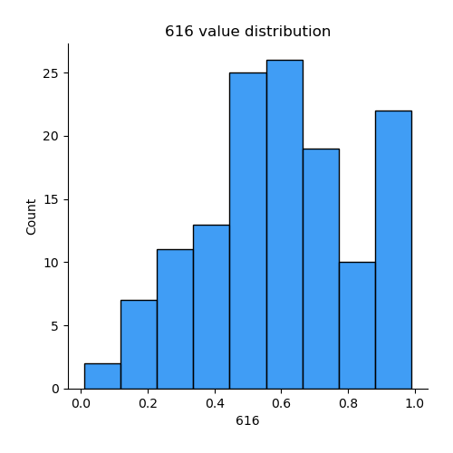
## Feature : 617
- **Feature type** : continous
- **Missing** : 0.0%
- **Unique** : 135
- **Count** :135.0
- **Mean** :0.4388896068334414
- **Std** :0.2962011176236607
- **Min** :-0.21408541514956933
- **25%th Percentile** : 0.23733143093527717
- **50%th Percentile** : 0.38122789975296895
- **75%th Percentile** : 0.6026589832692002
- **Max** :0.9890219805578717

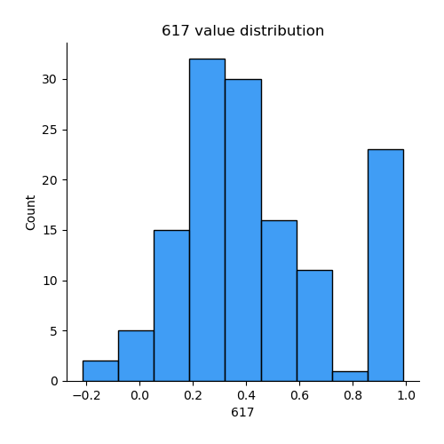
## Feature : 618
- **Feature type** : continous
- **Missing** : 0.0%
- **Unique** : 135
- **Count** :135.0
- **Mean** :0.5465501814549982
- **Std** :0.2831242599346137
- **Min** :-0.22632367181724466
- **25%th Percentile** : 0.3574543748161326
- **50%th Percentile** : 0.547461962617317
- **75%th Percentile** : 0.7362786431992463
- **Max** :0.9932521227211528

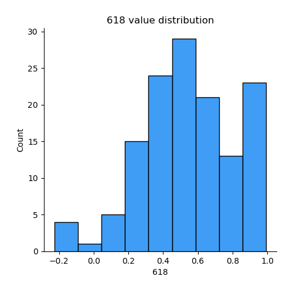
## Feature : 619
- **Feature type** : continous
- **Missing** : 0.0%
- **Unique** : 135
- **Count** :135.0
- **Mean** :0.5261519883280859
- **Std** :0.3000828405300049
- **Min** :-0.256312841498468
- **25%th Percentile** : 0.2815469993255987
- **50%th Percentile** : 0.5135177563914056
- **75%th Percentile** : 0.7395219107800723
- **Max** :0.991595252846374

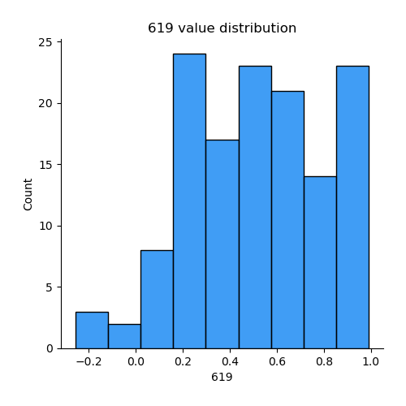
## Feature : 620
- **Feature type** : continous
- **Missing** : 0.0%
- **Unique** : 135
- **Count** :135.0
- **Mean** :0.6218450366628309
- **Std** :0.2726306467739876
- **Min** :-0.4606466240136562
- **25%th Percentile** : 0.48478941668368614
- **50%th Percentile** : 0.6390709641467379
- **75%th Percentile** : 0.7980498335670919
- **Max** :0.9943744447345307

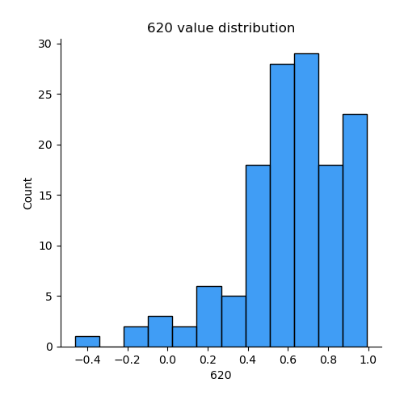
## Feature : 621
- **Feature type** : continous
- **Missing** : 0.0%
- **Unique** : 135
- **Count** :135.0
- **Mean** :0.4821544974439006
- **Std** :0.3417761009185459
- **Min** :-0.39366566039497025
- **25%th Percentile** : 0.1860424212478255
- **50%th Percentile** : 0.5295438914586639
- **75%th Percentile** : 0.7240474181599645
- **Max** :0.9924711729650831

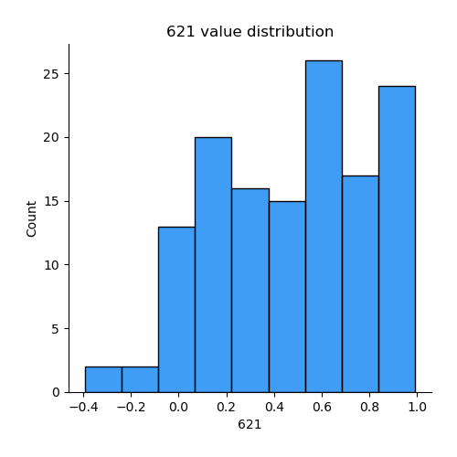
## Feature : 622
- **Feature type** : continous
- **Missing** : 0.0%
- **Unique** : 135
- **Count** :135.0
- **Mean** :0.46780629119000583
- **Std** :0.28050240970933266
- **Min** :-0.15052204378098305
- **25%th Percentile** : 0.2857784717655444
- **50%th Percentile** : 0.44716990427257913
- **75%th Percentile** : 0.6337824858321477
- **Max** :0.9842893387163563

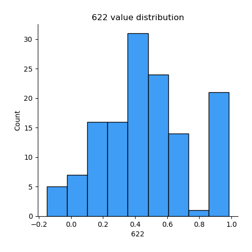
## Feature : 623
- **Feature type** : continous
- **Missing** : 0.0%
- **Unique** : 135
- **Count** :135.0
- **Mean** :0.4969159707875393
- **Std** :0.2969837807840625
- **Min** :-0.2450016044917732
- **25%th Percentile** : 0.32425964923227174
- **50%th Percentile** : 0.48736166171536965
- **75%th Percentile** : 0.6778737786963058
- **Max** :0.9898857938963331

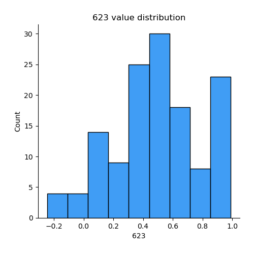
## Feature : 636
- **Feature type** : continous
- **Missing** : 0.0%
- **Unique** : 3
- **Count** :135.0
- **Mean** :1.0
- **Std** :7.850462293418876e-17
- **Min** :0.9999999999999998
- **25%th Percentile** : 1.0
- **50%th Percentile** : 1.0
- **75%th Percentile** : 1.0
- **Max** :1.0

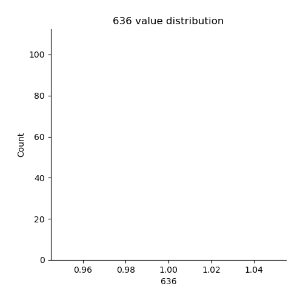
## Feature : 637
- **Feature type** : continous
- **Missing** : 0.0%
- **Unique** : 135
- **Count** :135.0
- **Mean** :0.4378742414067837
- **Std** :0.31508420829650735
- **Min** :-0.28947789006355445
- **25%th Percentile** : 0.20854138152954363
- **50%th Percentile** : 0.42296822035627957
- **75%th Percentile** : 0.6144157036373967
- **Max** :0.990630327956367

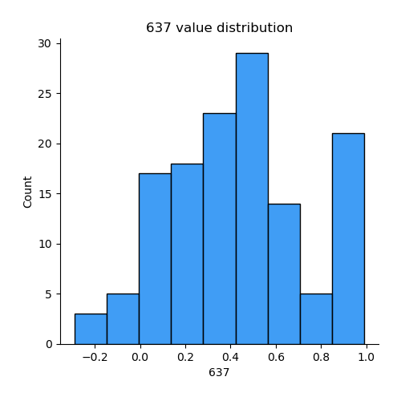
## Feature : 638
- **Feature type** : continous
- **Missing** : 0.0%
- **Unique** : 135
- **Count** :135.0
- **Mean** :0.48604689618422425
- **Std** :0.3013458111461384
- **Min** :-0.4390396933844284
- **25%th Percentile** : 0.2704335481786596
- **50%th Percentile** : 0.48110678193936823
- **75%th Percentile** : 0.697920647525584
- **Max** :0.9868335530857564

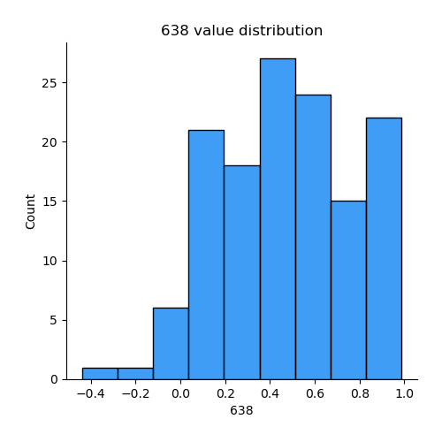
## Feature : 639
- **Feature type** : continous
- **Missing** : 0.0%
- **Unique** : 135
- **Count** :135.0
- **Mean** :0.8409274514696367
- **Std** :0.1095375874894469
- **Min** :0.5659524881959586
- **25%th Percentile** : 0.758976413208172
- **50%th Percentile** : 0.8521819978506165
- **75%th Percentile** : 0.9175399595352977
- **Max** :0.9977370072371851

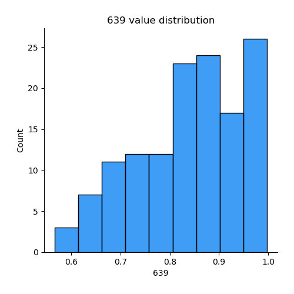
## Feature : 640
- **Feature type** : continous
- **Missing** : 0.0%
- **Unique** : 135
- **Count** :135.0
- **Mean** :0.6946521977717347
- **Std** :0.2125569538517469
- **Min** :-0.1508759809720259
- **25%th Percentile** : 0.5618728467082297
- **50%th Percentile** : 0.7286602080145616
- **75%th Percentile** : 0.820170406404106
- **Max** :0.9948903776156005

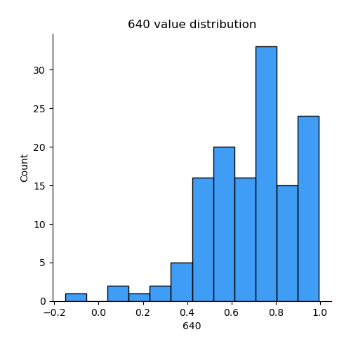
## Feature : 641
- **Feature type** : continous
- **Missing** : 0.0%
- **Unique** : 135
- **Count** :135.0
- **Mean** :0.8306849339707117
- **Std** :0.13339924713317663
- **Min** :0.18275258658495863
- **25%th Percentile** : 0.755845566627912
- **50%th Percentile** : 0.8531738653699027
- **75%th Percentile** : 0.9195220196604037
- **Max** :0.9983848279458198

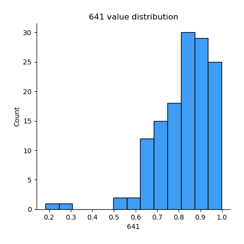
## Feature : 642
- **Feature type** : continous
- **Missing** : 0.0%
- **Unique** : 135
- **Count** :135.0
- **Mean** :0.6960195582032012
- **Std** :0.1943107618719569
- **Min** :0.0009726611638006865
- **25%th Percentile** : 0.5725768396176223
- **50%th Percentile** : 0.7066245660928563
- **75%th Percentile** : 0.8175043023017942
- **Max** :0.990945675737881

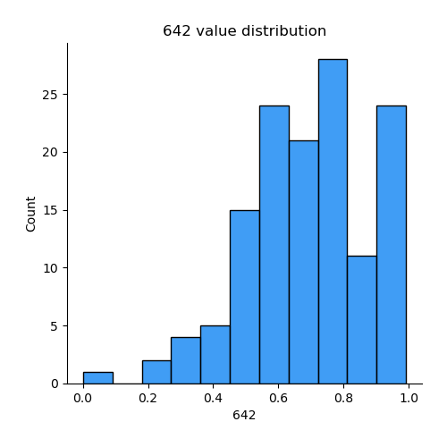
## Feature : 643
- **Feature type** : continous
- **Missing** : 0.0%
- **Unique** : 135
- **Count** :135.0
- **Mean** :0.4393903541333519
- **Std** :0.3240017046023955
- **Min** :-0.19762745826295292
- **25%th Percentile** : 0.21910777428935424
- **50%th Percentile** : 0.4265449495956241
- **75%th Percentile** : 0.6387592380848589
- **Max** :0.9920518724257068

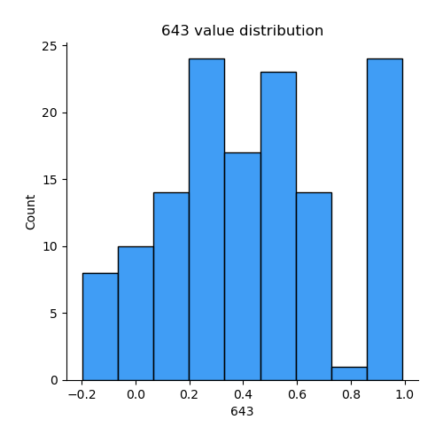
## Feature : 644
- **Feature type** : continous
- **Missing** : 0.0%
- **Unique** : 135
- **Count** :135.0
- **Mean** :0.6839918987788794
- **Std** :0.21320758269489848
- **Min** :0.11587026444038456
- **25%th Percentile** : 0.5761261462899763
- **50%th Percentile** : 0.6928514923612551
- **75%th Percentile** : 0.8241891959631986
- **Max** :0.9965327828217282

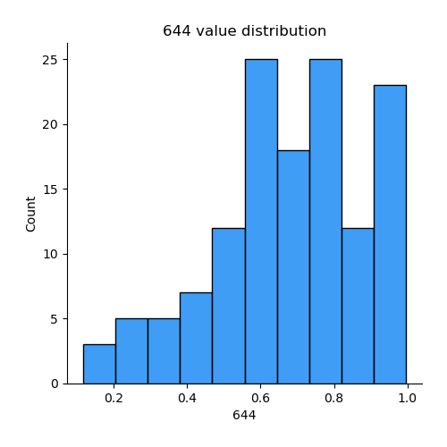
## Feature : 645
- **Feature type** : continous
- **Missing** : 0.0%
- **Unique** : 135
- **Count** :135.0
- **Mean** :0.740951505913361
- **Std** :0.16963747085008038
- **Min** :0.21420562202205312
- **25%th Percentile** : 0.6302568964895463
- **50%th Percentile** : 0.7584471238663288
- **75%th Percentile** : 0.8460739902766294
- **Max** :0.9949562047135694

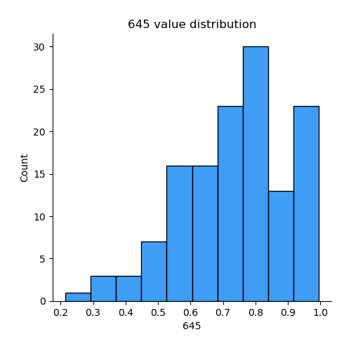
## Feature : 646
- **Feature type** : continous
- **Missing** : 0.0%
- **Unique** : 135
- **Count** :135.0
- **Mean** :0.5513034627595376
- **Std** :0.2888686528092684
- **Min** :-0.30663661537095416
- **25%th Percentile** : 0.3705789794782539
- **50%th Percentile** : 0.5525751146843693
- **75%th Percentile** : 0.7633290870702502
- **Max** :0.9924627835208705

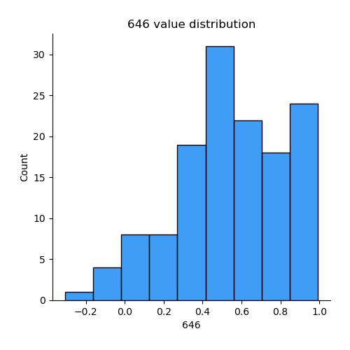
## Feature : 647
- **Feature type** : continous
- **Missing** : 0.0%
- **Unique** : 135
- **Count** :135.0
- **Mean** :0.6640040266830726
- **Std** :0.20949419458778593
- **Min** :0.020313288930181608
- **25%th Percentile** : 0.5224270038031332
- **50%th Percentile** : 0.6626161891686502
- **75%th Percentile** : 0.7996792823277925
- **Max** :0.9937620926768899

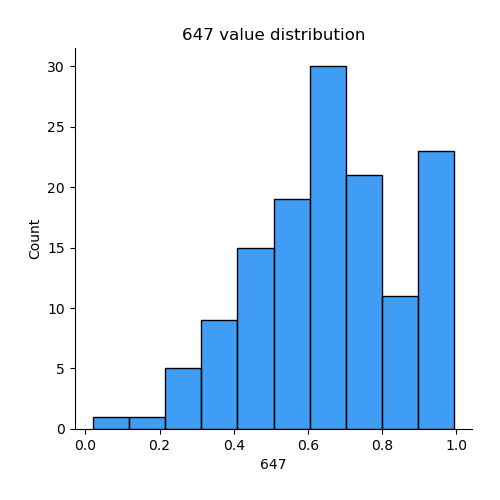
## Feature : 648
- **Feature type** : continous
- **Missing** : 0.0%
- **Unique** : 135
- **Count** :135.0
- **Mean** :0.33904893062344554
- **Std** :0.334463520042237
- **Min** :-0.4810501640109155
- **25%th Percentile** : 0.09518490677104713
- **50%th Percentile** : 0.3323948465226848
- **75%th Percentile** : 0.4695357456445413
- **Max** :0.9706151983086602

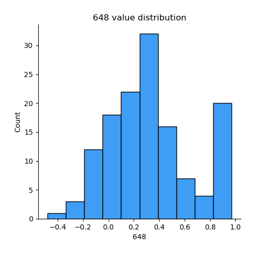
## Feature : 649
- **Feature type** : continous
- **Missing** : 0.0%
- **Unique** : 135
- **Count** :135.0
- **Mean** :0.5035715499319032
- **Std** :0.29634860518401956
- **Min** :-0.2538071411170382
- **25%th Percentile** : 0.28005553208039113
- **50%th Percentile** : 0.4740172237739017
- **75%th Percentile** : 0.7213692533085259
- **Max** :0.9917729184702693

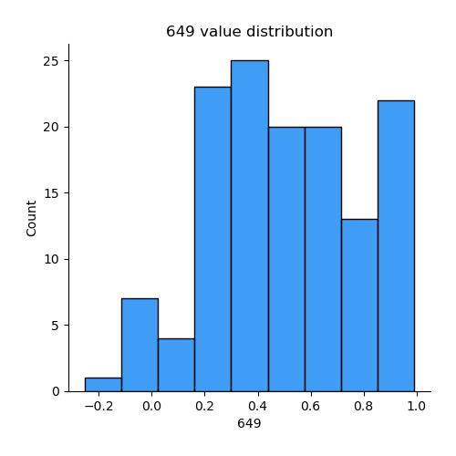
## Feature : 650
- **Feature type** : continous
- **Missing** : 0.0%
- **Unique** : 135
- **Count** :135.0
- **Mean** :0.5125554117339618
- **Std** :0.30221925126784266
- **Min** :-0.5316780724387772
- **25%th Percentile** : 0.31758087832536375
- **50%th Percentile** : 0.4953513405955379
- **75%th Percentile** : 0.6999287046528145
- **Max** :0.9928222679133013

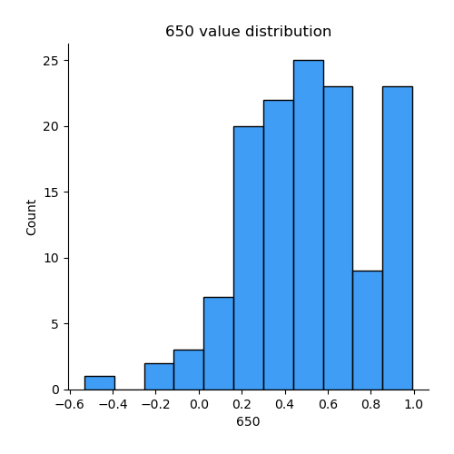
## Feature : 651
- **Feature type** : continous
- **Missing** : 0.0%
- **Unique** : 135
- **Count** :135.0
- **Mean** :0.577408967767039
- **Std** :0.2554209160322471
- **Min** :-0.2976959221994081
- **25%th Percentile** : 0.4113900306692673
- **50%th Percentile** : 0.5794879531579925
- **75%th Percentile** : 0.7150074147380889
- **Max** :0.9942552001741707

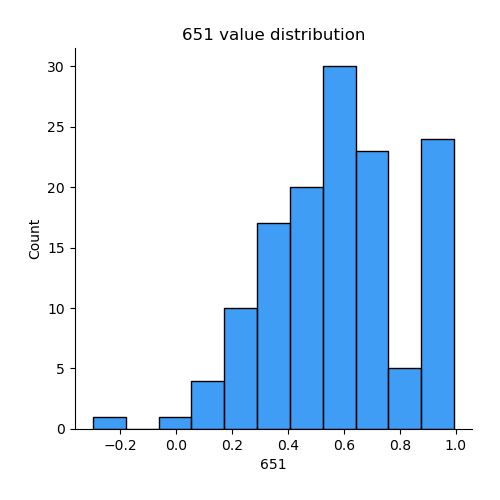
## Feature : 652
- **Feature type** : continous
- **Missing** : 0.0%
- **Unique** : 135
- **Count** :135.0
- **Mean** :0.5836893166331545
- **Std** :0.2534113491093894
- **Min** :-0.012829447104217
- **25%th Percentile** : 0.4016420762420241
- **50%th Percentile** : 0.5818685156017538
- **75%th Percentile** : 0.7809986609840575
- **Max** :0.9879649380165232

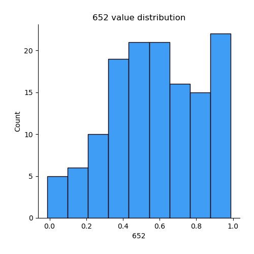
## Feature : 653
- **Feature type** : continous
- **Missing** : 0.0%
- **Unique** : 135
- **Count** :135.0
- **Mean** :0.30576186871098154
- **Std** :0.34385033321681746
- **Min** :-0.5353183188108593
- **25%th Percentile** : 0.05364702846017137
- **50%th Percentile** : 0.2631169832982592
- **75%th Percentile** : 0.5048511948724859
- **Max** :0.9795309086589338

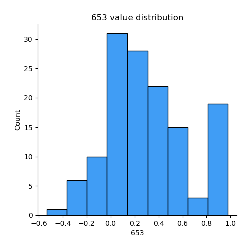
## Feature : 654
- **Feature type** : continous
- **Missing** : 0.0%
- **Unique** : 135
- **Count** :135.0
- **Mean** :0.509340474277202
- **Std** :0.315248793864948
- **Min** :-0.4213995048343422
- **25%th Percentile** : 0.298086532843409
- **50%th Percentile** : 0.545537363665327
- **75%th Percentile** : 0.7076667196418509
- **Max** :0.9923040767035552

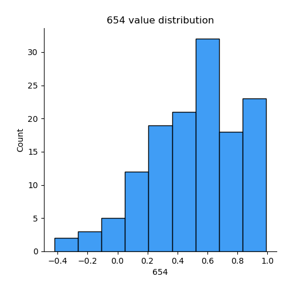
## Feature : 655
- **Feature type** : continous
- **Missing** : 0.0%
- **Unique** : 135
- **Count** :135.0
- **Mean** :0.5661415618051565
- **Std** :0.2580447358847222
- **Min** :-0.205792173653833
- **25%th Percentile** : 0.4079043676908449
- **50%th Percentile** : 0.5739309299172181
- **75%th Percentile** : 0.7031681771706955
- **Max** :0.9928330907631163

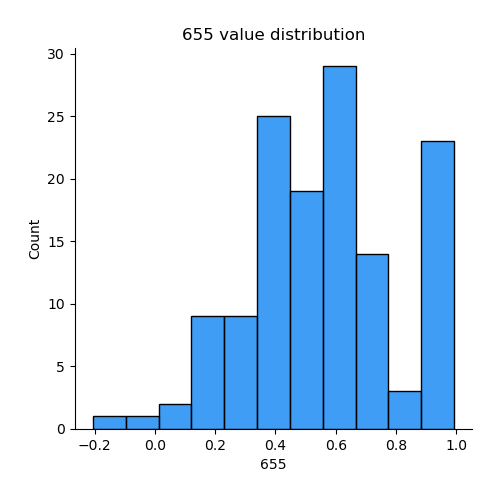
## Feature : 656
- **Feature type** : continous
- **Missing** : 0.0%
- **Unique** : 135
- **Count** :135.0
- **Mean** :0.449725710987942
- **Std** :0.3411480561070849
- **Min** :-0.5525779366162398
- **25%th Percentile** : 0.26870933209995096
- **50%th Percentile** : 0.4686514146257183
- **75%th Percentile** : 0.6321339231098959
- **Max** :0.9938525934951895

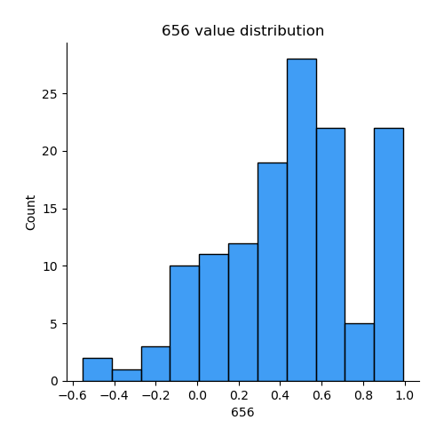
## Feature : 657
- **Feature type** : continous
- **Missing** : 0.0%
- **Unique** : 135
- **Count** :135.0
- **Mean** :0.6007436328916506
- **Std** :0.25023838516514524
- **Min** :-0.024285901450219333
- **25%th Percentile** : 0.4338224735718974
- **50%th Percentile** : 0.5797455264367819
- **75%th Percentile** : 0.7624585304525084
- **Max** :0.9970399491989714

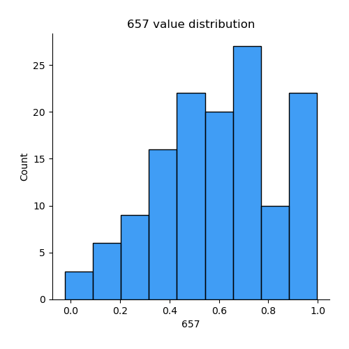
## Feature : 658
- **Feature type** : continous
- **Missing** : 0.0%
- **Unique** : 135
- **Count** :135.0
- **Mean** :0.5595497099033188
- **Std** :0.2654380904186682
- **Min** :-0.22539240462271387
- **25%th Percentile** : 0.39035306439202766
- **50%th Percentile** : 0.5642367130938789
- **75%th Percentile** : 0.7215395831288952
- **Max** :0.9865141245877738

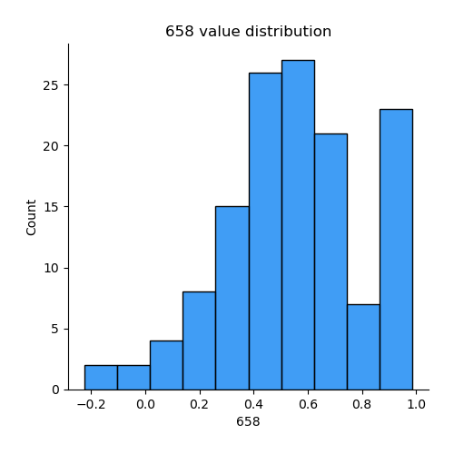
## Feature : 659
- **Feature type** : continous
- **Missing** : 0.0%
- **Unique** : 135
- **Count** :135.0
- **Mean** :0.5063533351184453
- **Std** :0.28980235815357336
- **Min** :-0.22284891328481804
- **25%th Percentile** : 0.28162645901623484
- **50%th Percentile** : 0.5048686065652028
- **75%th Percentile** : 0.6700348681652238
- **Max** :0.9872596627040704

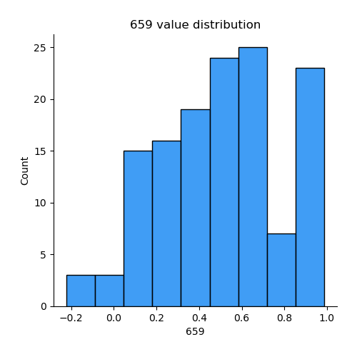
## Feature : 660
- **Feature type** : continous
- **Missing** : 0.0%
- **Unique** : 135
- **Count** :135.0
- **Mean** :0.5490115135548514
- **Std** :0.28382745681819843
- **Min** :-0.14591048137713658
- **25%th Percentile** : 0.36948616897497677
- **50%th Percentile** : 0.5575322444572346
- **75%th Percentile** : 0.7405688044989309
- **Max** :0.9925821086102834

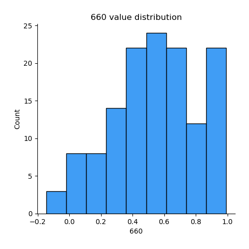
## Feature : 661
- **Feature type** : continous
- **Missing** : 0.0%
- **Unique** : 135
- **Count** :135.0
- **Mean** :0.4614467166760886
- **Std** :0.33691017625158926
- **Min** :-0.40345331009765245
- **25%th Percentile** : 0.2693981130154645
- **50%th Percentile** : 0.4848010014369124
- **75%th Percentile** : 0.6611078058285569
- **Max** :0.993900131132973

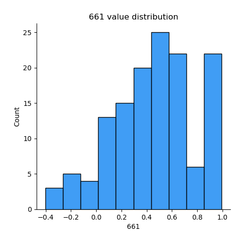
## Feature : 662
- **Feature type** : continous
- **Missing** : 0.0%
- **Unique** : 135
- **Count** :135.0
- **Mean** :0.903561839028537
- **Std** :0.08848145191975697
- **Min** :0.3752770225336339
- **25%th Percentile** : 0.8617416553129311
- **50%th Percentile** : 0.9236913569427307
- **75%th Percentile** : 0.9597530000361572
- **Max** :0.9990703839798956

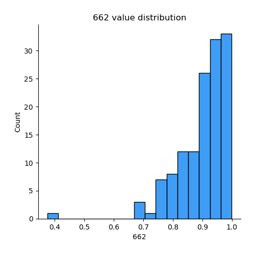
## Feature : 663
- **Feature type** : continous
- **Missing** : 0.0%
- **Unique** : 135
- **Count** :135.0
- **Mean** :0.43382638525263767
- **Std** :0.32600524506739437
- **Min** :-0.4224069242084238
- **25%th Percentile** : 0.2102451853391007
- **50%th Percentile** : 0.41347734534378977
- **75%th Percentile** : 0.6144031858775378
- **Max** :0.9909801783314854

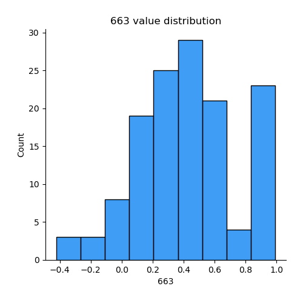
## Feature : 664
- **Feature type** : continous
- **Missing** : 0.0%
- **Unique** : 135
- **Count** :135.0
- **Mean** :0.4822668004081114
- **Std** :0.2976954059245067
- **Min** :-0.47006543012160534
- **25%th Percentile** : 0.2589929176018455
- **50%th Percentile** : 0.4743635710624256
- **75%th Percentile** : 0.694356598029058
- **Max** :0.9873363506318551

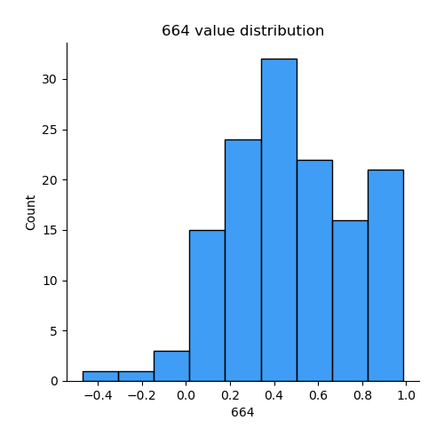
## Feature : 665
- **Feature type** : continous
- **Missing** : 0.0%
- **Unique** : 135
- **Count** :135.0
- **Mean** :0.8099503987103132
- **Std** :0.1330774450516334
- **Min** :0.40969834906638075
- **25%th Percentile** : 0.7226742949772518
- **50%th Percentile** : 0.8239660841206274
- **75%th Percentile** : 0.8978490918737257
- **Max** :0.9978014104720181

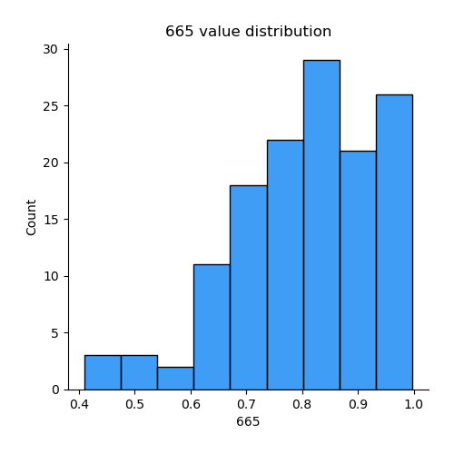
## Feature : 666
- **Feature type** : continous
- **Missing** : 0.0%
- **Unique** : 135
- **Count** :135.0
- **Mean** :0.6712901780648393
- **Std** :0.21608108022228986
- **Min** :-0.0014743716138540725
- **25%th Percentile** : 0.5347092425754929
- **50%th Percentile** : 0.6918017176887554
- **75%th Percentile** : 0.8154617054216227
- **Max** :0.9948640142872232

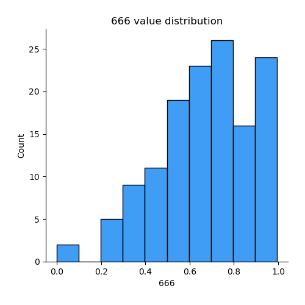
## Feature : 667
- **Feature type** : continous
- **Missing** : 0.0%
- **Unique** : 135
- **Count** :135.0
- **Mean** :0.809599313098664
- **Std** :0.1342949491159013
- **Min** :0.36251153468444397
- **25%th Percentile** : 0.7164817227887637
- **50%th Percentile** : 0.8130681084931586
- **75%th Percentile** : 0.9025571837310216
- **Max** :0.9977688925452463

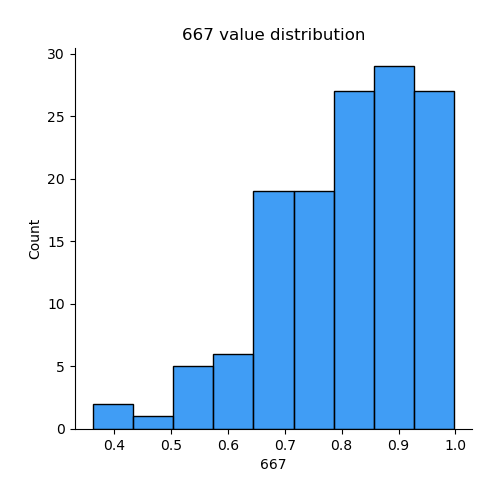
## Feature : 668
- **Feature type** : continous
- **Missing** : 0.0%
- **Unique** : 135
- **Count** :135.0
- **Mean** :0.6899611548252976
- **Std** :0.1973118977298579
- **Min** :0.04936730433864576
- **25%th Percentile** : 0.5576331270656735
- **50%th Percentile** : 0.7164864605850811
- **75%th Percentile** : 0.8058925689046619
- **Max** :0.9942589994854413

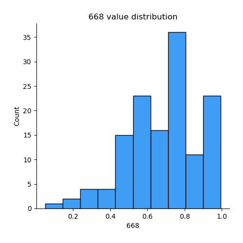
## Feature : 669
- **Feature type** : continous
- **Missing** : 0.0%
- **Unique** : 135
- **Count** :135.0
- **Mean** :0.4226766943213409
- **Std** :0.3233642110616547
- **Min** :-0.23881934049618758
- **25%th Percentile** : 0.17803236047829007
- **50%th Percentile** : 0.4012922718338776
- **75%th Percentile** : 0.5931940031509406
- **Max** :0.9908545318865356

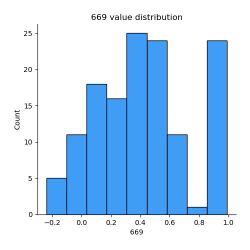
## Feature : 670
- **Feature type** : continous
- **Missing** : 0.0%
- **Unique** : 135
- **Count** :135.0
- **Mean** :0.6678453366734297
- **Std** :0.22647625466160343
- **Min** :-0.06617773036333124
- **25%th Percentile** : 0.529516068448868
- **50%th Percentile** : 0.6679401898752494
- **75%th Percentile** : 0.8156398484210788
- **Max** :0.9964838723270776

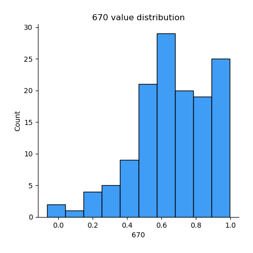
## Feature : 671
- **Feature type** : continous
- **Missing** : 0.0%
- **Unique** : 135
- **Count** :135.0
- **Mean** :0.7404813914260395
- **Std** :0.16905604041418124
- **Min** :0.11490884521320391
- **25%th Percentile** : 0.6477750617926895
- **50%th Percentile** : 0.7414743032332177
- **75%th Percentile** : 0.8458465668999348
- **Max** :0.9952630622182504

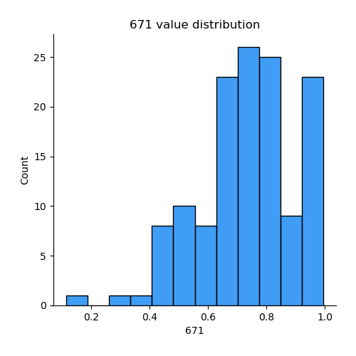
## Feature : 672
- **Feature type** : continous
- **Missing** : 0.0%
- **Unique** : 135
- **Count** :135.0
- **Mean** :0.5387883199545581
- **Std** :0.30509349559927196
- **Min** :-0.44562838073793665
- **25%th Percentile** : 0.31614327563112415
- **50%th Percentile** : 0.5344613440311384
- **75%th Percentile** : 0.7763781447226602
- **Max** :0.9949040639260542

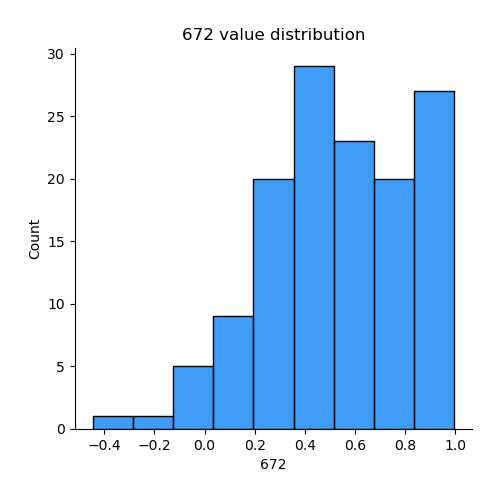
## Feature : 673
- **Feature type** : continous
- **Missing** : 0.0%
- **Unique** : 135
- **Count** :135.0
- **Mean** :0.6810873981050652
- **Std** :0.1987148573805993
- **Min** :0.16486469792477096
- **25%th Percentile** : 0.5479503067519542
- **50%th Percentile** : 0.6854320239753842
- **75%th Percentile** : 0.804465806443512
- **Max** :0.9944360501269163

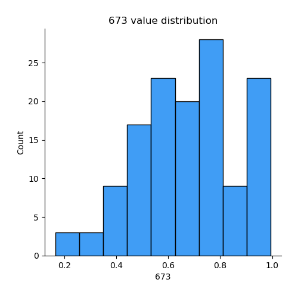
## Feature : 674
- **Feature type** : continous
- **Missing** : 0.0%
- **Unique** : 135
- **Count** :135.0
- **Mean** :0.32155945319673807
- **Std** :0.3405479350980433
- **Min** :-0.6535512656323157
- **25%th Percentile** : 0.11673464690293303
- **50%th Percentile** : 0.2794063125367726
- **75%th Percentile** : 0.48263664095649617
- **Max** :0.9814530019208717

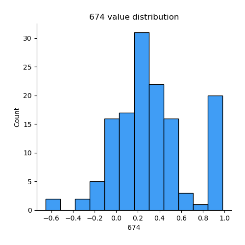
## Feature : 675
- **Feature type** : continous
- **Missing** : 0.0%
- **Unique** : 135
- **Count** :135.0
- **Mean** :0.4398925242228357
- **Std** :0.3205422201907046
- **Min** :-0.5419290883387329
- **25%th Percentile** : 0.21186012209827926
- **50%th Percentile** : 0.4010651736660486
- **75%th Percentile** : 0.6433005844273889
- **Max** :0.9905308064236702

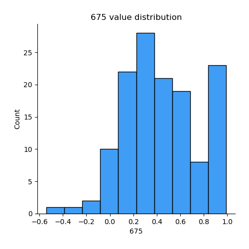
## Feature : 689
- **Feature type** : continous
- **Missing** : 0.0%
- **Unique** : 3
- **Count** :135.0
- **Mean** :1.0
- **Std** :8.524548308960713e-17
- **Min** :0.9999999999999998
- **25%th Percentile** : 1.0
- **50%th Percentile** : 1.0
- **75%th Percentile** : 1.0
- **Max** :1.0

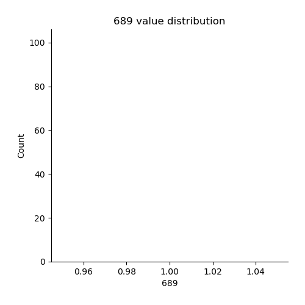
## Feature : 690
- **Feature type** : continous
- **Missing** : 0.0%
- **Unique** : 135
- **Count** :135.0
- **Mean** :0.5729693201759906
- **Std** :0.23112900198861502
- **Min** :0.02720680306431816
- **25%th Percentile** : 0.40687168069661345
- **50%th Percentile** : 0.5612233524208552
- **75%th Percentile** : 0.7223980845252845
- **Max** :0.9862249477496332

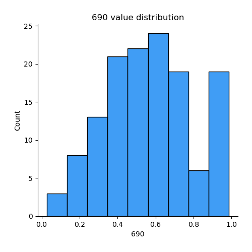
## Feature : 691
- **Feature type** : continous
- **Missing** : 0.0%
- **Unique** : 135
- **Count** :135.0
- **Mean** :0.4841733499737348
- **Std** :0.27487933218503235
- **Min** :-0.08407523593713093
- **25%th Percentile** : 0.2965536403969667
- **50%th Percentile** : 0.45750738547860026
- **75%th Percentile** : 0.6088796030308526
- **Max** :0.989547837206291

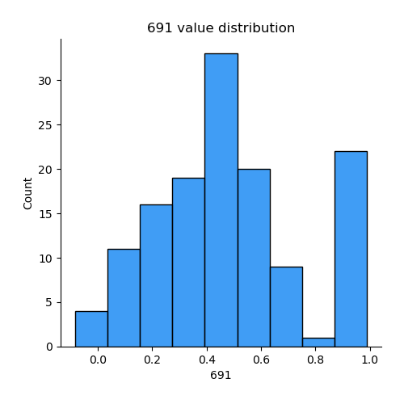
## Feature : 692
- **Feature type** : continous
- **Missing** : 0.0%
- **Unique** : 135
- **Count** :135.0
- **Mean** :0.5372020722461651
- **Std** :0.26731553137957653
- **Min** :0.0013115879117632765
- **25%th Percentile** : 0.35397474060314194
- **50%th Percentile** : 0.5269943936534357
- **75%th Percentile** : 0.7071113429924767
- **Max** :0.9904405971912934

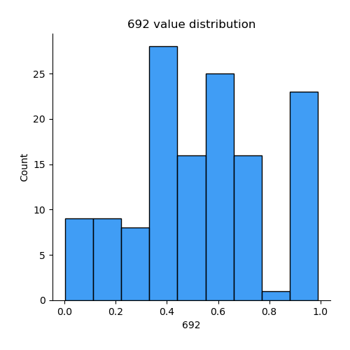
## Feature : 693
- **Feature type** : continous
- **Missing** : 0.0%
- **Unique** : 135
- **Count** :135.0
- **Mean** :0.4952463049951236
- **Std** :0.2753242660067481
- **Min** :-0.08956737647684938
- **25%th Percentile** : 0.29552367068353796
- **50%th Percentile** : 0.4727026032370591
- **75%th Percentile** : 0.6236788557660278
- **Max** :0.9905837066652694

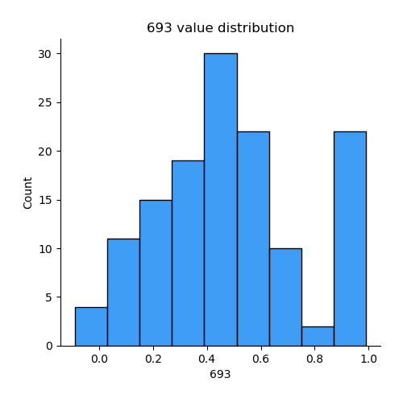
## Feature : 694
- **Feature type** : continous
- **Missing** : 0.0%
- **Unique** : 135
- **Count** :135.0
- **Mean** :0.620363665693287
- **Std** :0.21795802400783104
- **Min** :0.11139317606199288
- **25%th Percentile** : 0.47920921886877565
- **50%th Percentile** : 0.6061996502703819
- **75%th Percentile** : 0.7608254579917334
- **Max** :0.9913460875908591

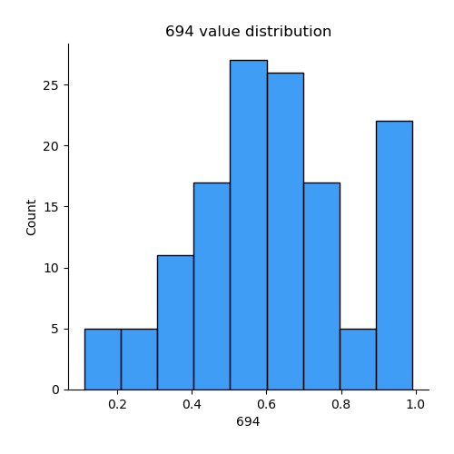
## Feature : 695
- **Feature type** : continous
- **Missing** : 0.0%
- **Unique** : 135
- **Count** :135.0
- **Mean** :0.41105226041107573
- **Std** :0.30442062627938304
- **Min** :-0.1678973864834142
- **25%th Percentile** : 0.1927191913493716
- **50%th Percentile** : 0.34022028979815805
- **75%th Percentile** : 0.5970287476005139
- **Max** :0.9846083839833852

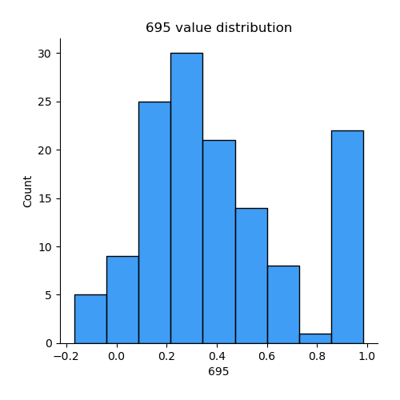
## Feature : 696
- **Feature type** : continous
- **Missing** : 0.0%
- **Unique** : 135
- **Count** :135.0
- **Mean** :0.46619831351344837
- **Std** :0.300772788931417
- **Min** :-0.4200573281480695
- **25%th Percentile** : 0.2814146260568343
- **50%th Percentile** : 0.444123829173288
- **75%th Percentile** : 0.6266689209975922
- **Max** :0.9924914565622172

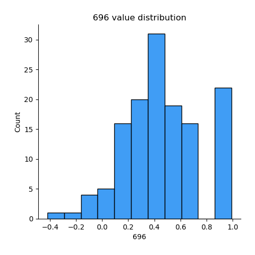
## Feature : 697
- **Feature type** : continous
- **Missing** : 0.0%
- **Unique** : 135
- **Count** :135.0
- **Mean** :0.5424554584763276
- **Std** :0.25965784255018515
- **Min** :0.03697118718641091
- **25%th Percentile** : 0.3873705373780181
- **50%th Percentile** : 0.5423015315719785
- **75%th Percentile** : 0.6922504501811813
- **Max** :0.9911440498299705

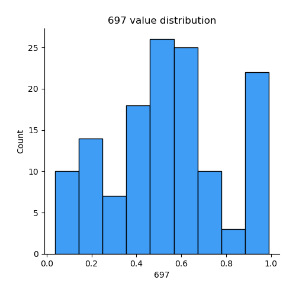
## Feature : 698
- **Feature type** : continous
- **Missing** : 0.0%
- **Unique** : 135
- **Count** :135.0
- **Mean** :0.6075450100980412
- **Std** :0.23069047405092052
- **Min** :-0.05136210614381614
- **25%th Percentile** : 0.4729371009980492
- **50%th Percentile** : 0.5797543566484191
- **75%th Percentile** : 0.7179245131596959
- **Max** :0.9936032990788894

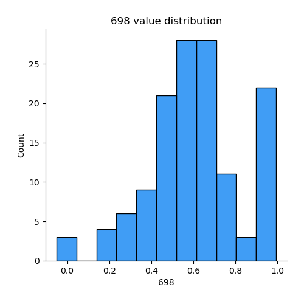
## Feature : 699
- **Feature type** : continous
- **Missing** : 0.0%
- **Unique** : 135
- **Count** :135.0
- **Mean** :0.5162901406929674
- **Std** :0.2707346313677568
- **Min** :-0.14168722521926955
- **25%th Percentile** : 0.31037662937140054
- **50%th Percentile** : 0.4970468712923425
- **75%th Percentile** : 0.6604995273932345
- **Max** :0.9898896529820193

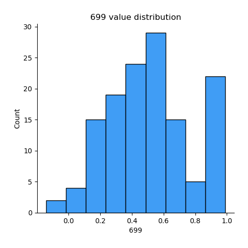
## Feature : 700
- **Feature type** : continous
- **Missing** : 0.0%
- **Unique** : 135
- **Count** :135.0
- **Mean** :0.4775335983463993
- **Std** :0.2951556887090632
- **Min** :-0.45111409157616145
- **25%th Percentile** : 0.26189782723812716
- **50%th Percentile** : 0.4821102663754294
- **75%th Percentile** : 0.6177297547885536
- **Max** :0.9839270884701589

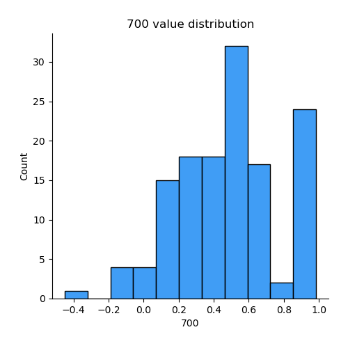
## Feature : 701
- **Feature type** : continous
- **Missing** : 0.0%
- **Unique** : 135
- **Count** :135.0
- **Mean** :0.5483239607279173
- **Std** :0.24914464238196118
- **Min** :-0.2529946876897918
- **25%th Percentile** : 0.4005329007309778
- **50%th Percentile** : 0.5162696716359704
- **75%th Percentile** : 0.665219877278588
- **Max** :0.9870533023224902

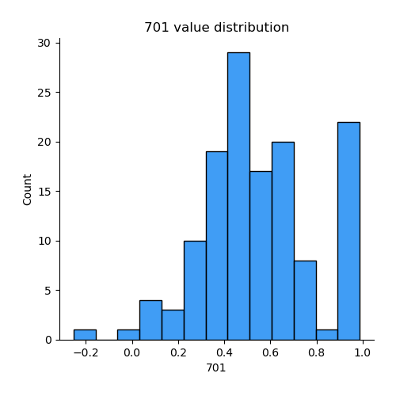
## Feature : 702
- **Feature type** : continous
- **Missing** : 0.0%
- **Unique** : 135
- **Count** :135.0
- **Mean** :0.4700398631635415
- **Std** :0.29781027204758126
- **Min** :-0.2726391161043188
- **25%th Percentile** : 0.2748970623324681
- **50%th Percentile** : 0.44641672842100666
- **75%th Percentile** : 0.6214479366267771
- **Max** :0.988568304673824

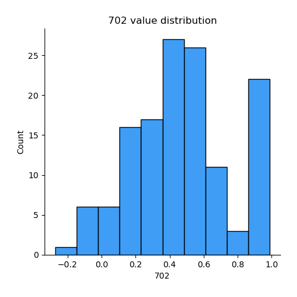
## Feature : 703
- **Feature type** : continous
- **Missing** : 0.0%
- **Unique** : 135
- **Count** :135.0
- **Mean** :0.42809266668958723
- **Std** :0.30214274950178155
- **Min** :-0.19422978585010725
- **25%th Percentile** : 0.2536482297511016
- **50%th Percentile** : 0.3848592142893818
- **75%th Percentile** : 0.5712276735380641
- **Max** :0.9896458791298864

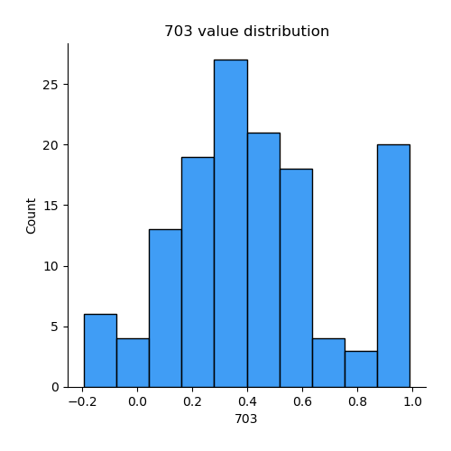
## Feature : 704
- **Feature type** : continous
- **Missing** : 0.0%
- **Unique** : 135
- **Count** :135.0
- **Mean** :0.56185880176301
- **Std** :0.24324842337718958
- **Min** :-0.011932980318537657
- **25%th Percentile** : 0.40232913378932184
- **50%th Percentile** : 0.5413027105459165
- **75%th Percentile** : 0.7122514770857844
- **Max** :0.9879347125860904

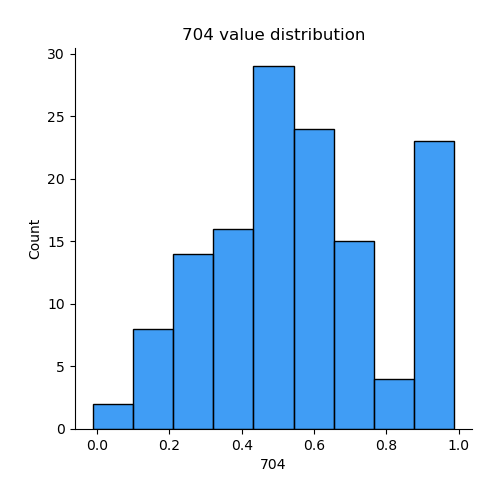
## Feature : 705
- **Feature type** : continous
- **Missing** : 0.0%
- **Unique** : 135
- **Count** :135.0
- **Mean** :0.4634845379343727
- **Std** :0.29099249409862604
- **Min** :-0.24573057234731835
- **25%th Percentile** : 0.2628146433652141
- **50%th Percentile** : 0.46091640061756983
- **75%th Percentile** : 0.6321931814169364
- **Max** :0.9884547895271589

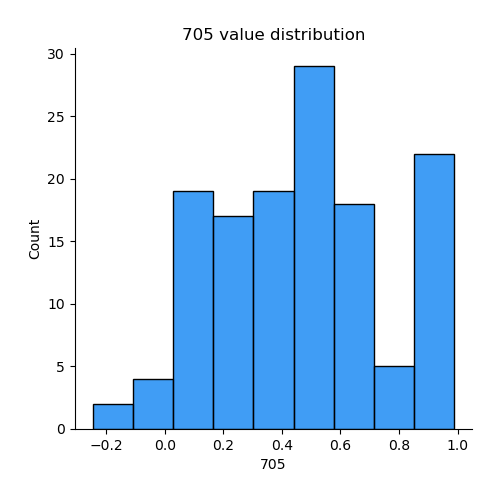
## Feature : 706
- **Feature type** : continous
- **Missing** : 0.0%
- **Unique** : 135
- **Count** :135.0
- **Mean** :0.6713274547967636
- **Std** :0.2163434971351333
- **Min** :0.0436220011008152
- **25%th Percentile** : 0.566906897226031
- **50%th Percentile** : 0.6949338485569665
- **75%th Percentile** : 0.8019872164811368
- **Max** :0.995424097861189

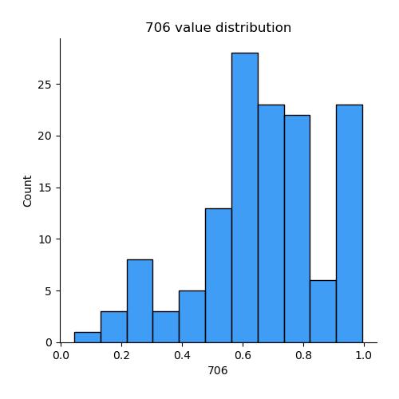
## Feature : 707
- **Feature type** : continous
- **Missing** : 0.0%
- **Unique** : 135
- **Count** :135.0
- **Mean** :0.5476486809365038
- **Std** :0.2628019579302553
- **Min** :-0.11674109773220724
- **25%th Percentile** : 0.3928468163182999
- **50%th Percentile** : 0.5189217559081839
- **75%th Percentile** : 0.7069057606172111
- **Max** :0.9912194629856256

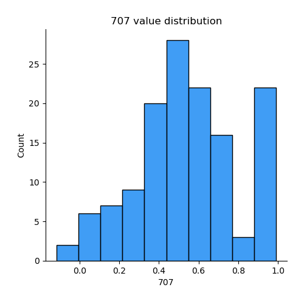
## Feature : 708
- **Feature type** : continous
- **Missing** : 0.0%
- **Unique** : 135
- **Count** :135.0
- **Mean** :0.5952516094416004
- **Std** :0.2441713129433187
- **Min** :-0.01613095115184449
- **25%th Percentile** : 0.479868885213064
- **50%th Percentile** : 0.5943413625472489
- **75%th Percentile** : 0.7395841379896335
- **Max** :0.9940748536379322

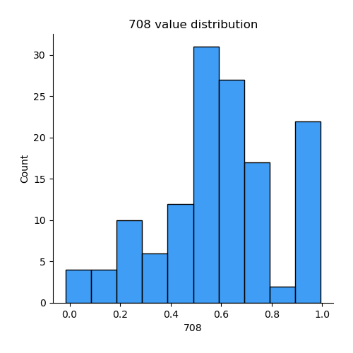
## Feature : 709
- **Feature type** : continous
- **Missing** : 0.0%
- **Unique** : 135
- **Count** :135.0
- **Mean** :0.522588401702645
- **Std** :0.2724530687765138
- **Min** :-0.008978989337848088
- **25%th Percentile** : 0.3327248554628537
- **50%th Percentile** : 0.48497728004344953
- **75%th Percentile** : 0.6863504269955529
- **Max** :0.9919093019616803

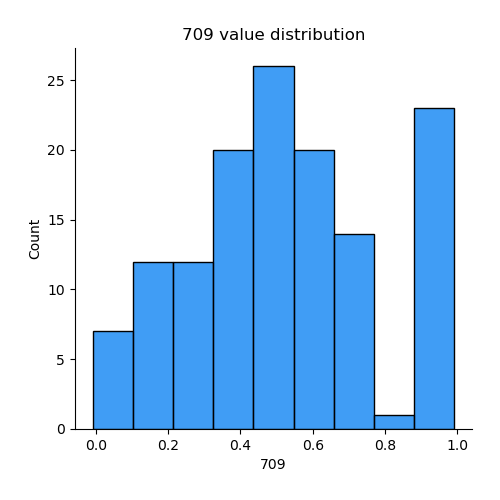
## Feature : 710
- **Feature type** : continous
- **Missing** : 0.0%
- **Unique** : 135
- **Count** :135.0
- **Mean** :0.633058168504946
- **Std** :0.20981936709724827
- **Min** :0.10128695831525501
- **25%th Percentile** : 0.49146824659431043
- **50%th Percentile** : 0.6118672523891556
- **75%th Percentile** : 0.7519895866325339
- **Max** :0.9864547850861645

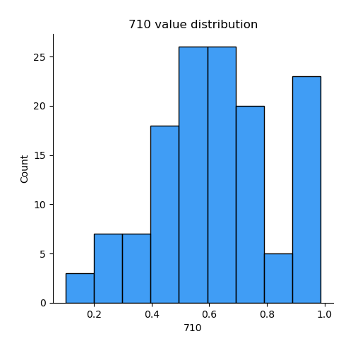
## Feature : 711
- **Feature type** : continous
- **Missing** : 0.0%
- **Unique** : 135
- **Count** :135.0
- **Mean** :0.5502454050508415
- **Std** :0.2488319367204158
- **Min** :-0.0552719630709531
- **25%th Percentile** : 0.3753749657222708
- **50%th Percentile** : 0.529190973231239
- **75%th Percentile** : 0.7038641520814424
- **Max** :0.9920969671499762

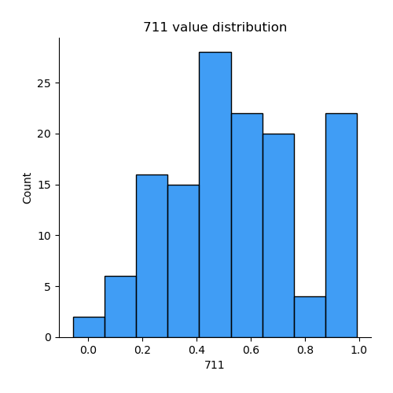
## Feature : 712
- **Feature type** : continous
- **Missing** : 0.0%
- **Unique** : 135
- **Count** :135.0
- **Mean** :0.6322013874212696
- **Std** :0.21978574936778317
- **Min** :0.07326504593910822
- **25%th Percentile** : 0.5007521999834113
- **50%th Percentile** : 0.6180516393203305
- **75%th Percentile** : 0.7742822580546818
- **Max** :0.9921739858092277

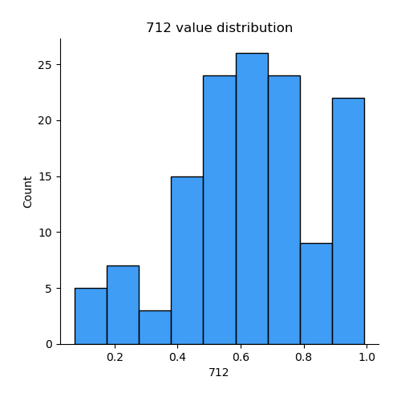
## Feature : 713
- **Feature type** : continous
- **Missing** : 0.0%
- **Unique** : 135
- **Count** :135.0
- **Mean** :0.5658966046330914
- **Std** :0.26536487254150604
- **Min** :-0.12104032384038542
- **25%th Percentile** : 0.40588611095256755
- **50%th Percentile** : 0.5750015930998211
- **75%th Percentile** : 0.7311020520692117
- **Max** :0.9955270697320107

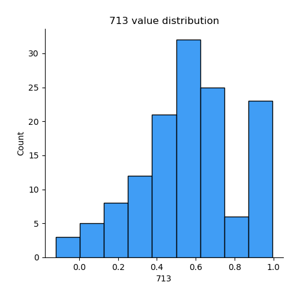
## Feature : 714
- **Feature type** : continous
- **Missing** : 0.0%
- **Unique** : 135
- **Count** :135.0
- **Mean** :0.4252061172694986
- **Std** :0.32162501750633693
- **Min** :-0.29557210630468317
- **25%th Percentile** : 0.18495927148737554
- **50%th Percentile** : 0.39841260352606894
- **75%th Percentile** : 0.6114769581623782
- **Max** :0.9914834561083721

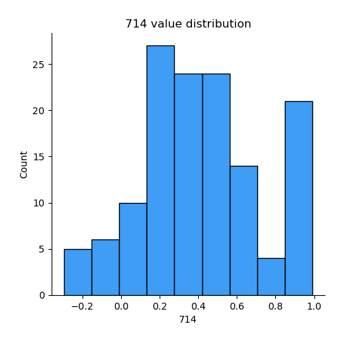
## Feature : 715
- **Feature type** : continous
- **Missing** : 0.0%
- **Unique** : 135
- **Count** :135.0
- **Mean** :0.6841100506995078
- **Std** :0.2227349890763695
- **Min** :-0.137527923939873
- **25%th Percentile** : 0.5625319564286355
- **50%th Percentile** : 0.6935061722662941
- **75%th Percentile** : 0.8327016887756613
- **Max** :0.995616149842045

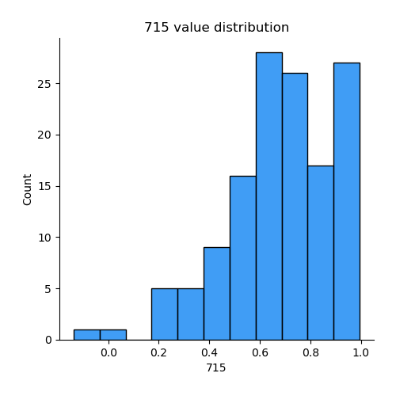
## Feature : 716
- **Feature type** : continous
- **Missing** : 0.0%
- **Unique** : 135
- **Count** :135.0
- **Mean** :0.5594191999374931
- **Std** :0.24289675507131345
- **Min** :-0.00501537460896657
- **25%th Percentile** : 0.3932253461715809
- **50%th Percentile** : 0.5418744723764846
- **75%th Percentile** : 0.7219459771401731
- **Max** :0.986468841295351

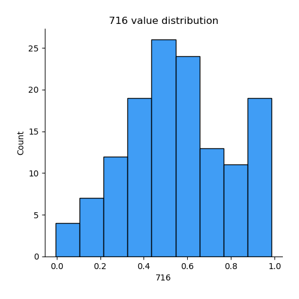
## Feature : 717
- **Feature type** : continous
- **Missing** : 0.0%
- **Unique** : 135
- **Count** :135.0
- **Mean** :0.4470335161066638
- **Std** :0.3014150555604542
- **Min** :-0.23700716003761152
- **25%th Percentile** : 0.24707492142082466
- **50%th Percentile** : 0.44287947380722936
- **75%th Percentile** : 0.5903648503379421
- **Max** :0.9904982563529757

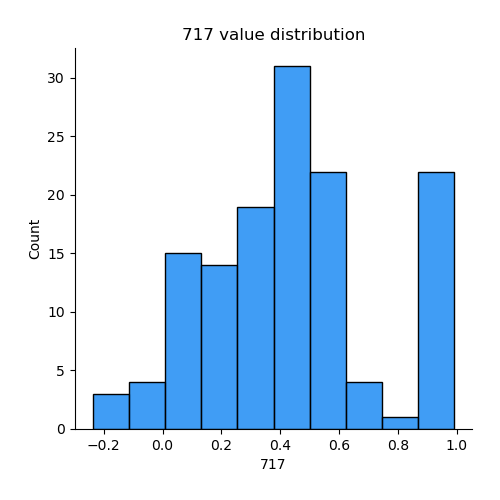
## Feature : 718
- **Feature type** : continous
- **Missing** : 0.0%
- **Unique** : 135
- **Count** :135.0
- **Mean** :0.5122838571620726
- **Std** :0.28252703193995976
- **Min** :-0.05141401157248713
- **25%th Percentile** : 0.3349175038722729
- **50%th Percentile** : 0.5092005151592998
- **75%th Percentile** : 0.6773292958811263
- **Max** :0.9891637875418925

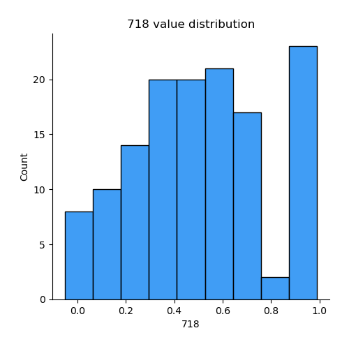
## Feature : 719
- **Feature type** : continous
- **Missing** : 0.0%
- **Unique** : 135
- **Count** :135.0
- **Mean** :0.4604321970630934
- **Std** :0.30019926618145576
- **Min** :-0.2086886629768744
- **25%th Percentile** : 0.2476507500564951
- **50%th Percentile** : 0.46432879964635354
- **75%th Percentile** : 0.6084843668702458
- **Max** :0.9908206073204321

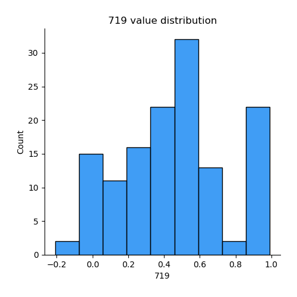
## Feature : 720
- **Feature type** : continous
- **Missing** : 0.0%
- **Unique** : 135
- **Count** :135.0
- **Mean** :0.6014650415009538
- **Std** :0.2314156295775197
- **Min** :0.006799370995114524
- **25%th Percentile** : 0.4461443504954332
- **50%th Percentile** : 0.5915018749248377
- **75%th Percentile** : 0.7342068973855251
- **Max** :0.9924389113014789

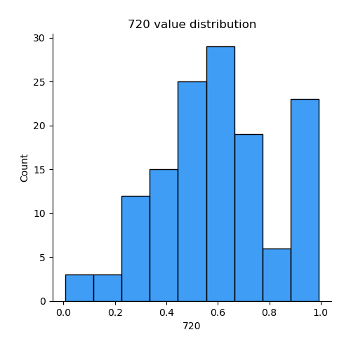
## Feature : 721
- **Feature type** : continous
- **Missing** : 0.0%
- **Unique** : 135
- **Count** :135.0
- **Mean** :0.3682815104395412
- **Std** :0.31257742991594334
- **Min** :-0.2539956444618132
- **25%th Percentile** : 0.1571599936929377
- **50%th Percentile** : 0.28461751922288236
- **75%th Percentile** : 0.5103099725106703
- **Max** :0.9838446574783721

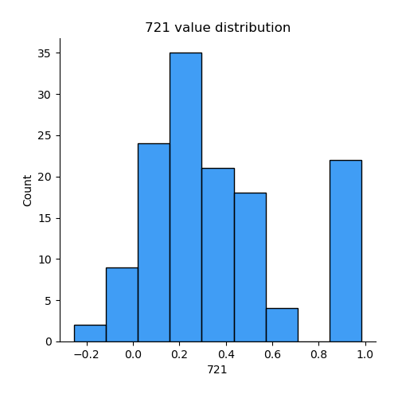
## Feature : 722
- **Feature type** : continous
- **Missing** : 0.0%
- **Unique** : 135
- **Count** :135.0
- **Mean** :0.4588757240080429
- **Std** :0.3069631676181082
- **Min** :-0.4517681292743016
- **25%th Percentile** : 0.2513458515559044
- **50%th Percentile** : 0.4294720229775674
- **75%th Percentile** : 0.618599384116896
- **Max** :0.991366839047191

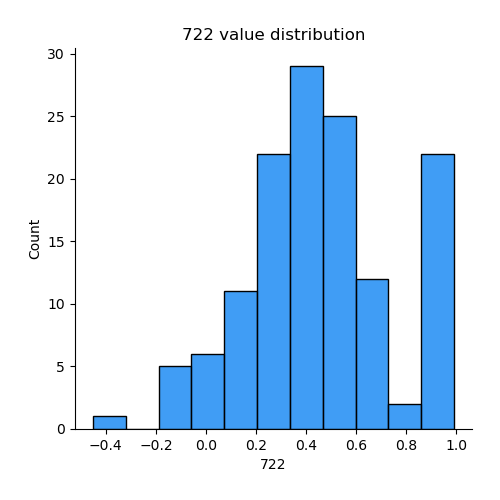
## Feature : 723
- **Feature type** : continous
- **Missing** : 0.0%
- **Unique** : 135
- **Count** :135.0
- **Mean** :0.5211558935452177
- **Std** :0.2684596858491993
- **Min** :-0.12555847395605696
- **25%th Percentile** : 0.3308755053610607
- **50%th Percentile** : 0.5237384793107667
- **75%th Percentile** : 0.6718131481355308
- **Max** :0.9915770341127046

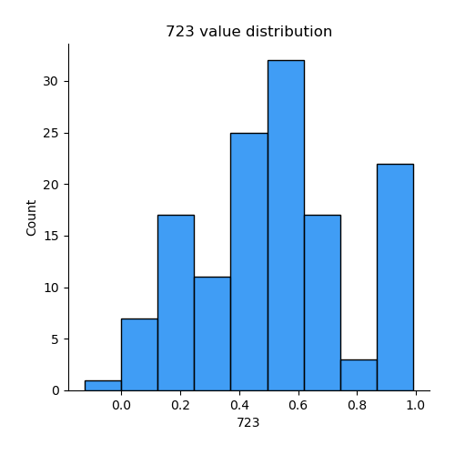
## Feature : 724
- **Feature type** : continous
- **Missing** : 0.0%
- **Unique** : 135
- **Count** :135.0
- **Mean** :0.5452894180253315
- **Std** :0.27036928089654305
- **Min** :-0.2132170250652826
- **25%th Percentile** : 0.400530601552897
- **50%th Percentile** : 0.5464497084504513
- **75%th Percentile** : 0.7058738472223249
- **Max** :0.9931761374094003

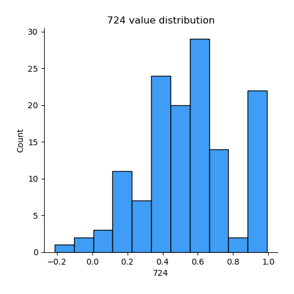
## Feature : 725
- **Feature type** : continous
- **Missing** : 0.0%
- **Unique** : 135
- **Count** :135.0
- **Mean** :0.46717758265442855
- **Std** :0.3040668625893846
- **Min** :-0.19912610512319212
- **25%th Percentile** : 0.235159530769803
- **50%th Percentile** : 0.47377511714976367
- **75%th Percentile** : 0.628360083362804
- **Max** :0.9898977917972673

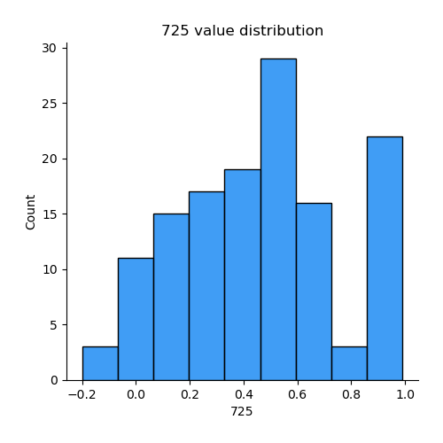
## Feature : 726
- **Feature type** : continous
- **Missing** : 0.0%
- **Unique** : 135
- **Count** :135.0
- **Mean** :0.4744360471047723
- **Std** :0.2766165974819828
- **Min** :-0.20719447818828782
- **25%th Percentile** : 0.27446602109001444
- **50%th Percentile** : 0.4360237235169156
- **75%th Percentile** : 0.6567925523361937
- **Max** :0.9863319468675568

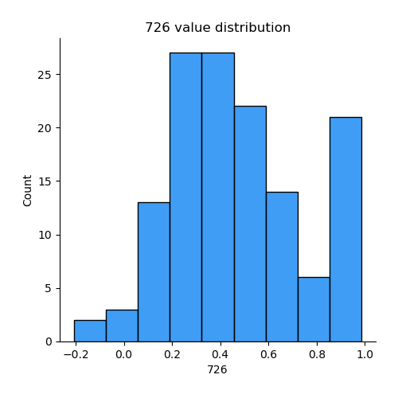
## Feature : 727
- **Feature type** : continous
- **Missing** : 0.0%
- **Unique** : 135
- **Count** :135.0
- **Mean** :0.46047629455174766
- **Std** :0.30860937752352713
- **Min** :-0.3729040143798611
- **25%th Percentile** : 0.24399003792069446
- **50%th Percentile** : 0.4366733360435085
- **75%th Percentile** : 0.6541985983657761
- **Max** :0.9868562766334686

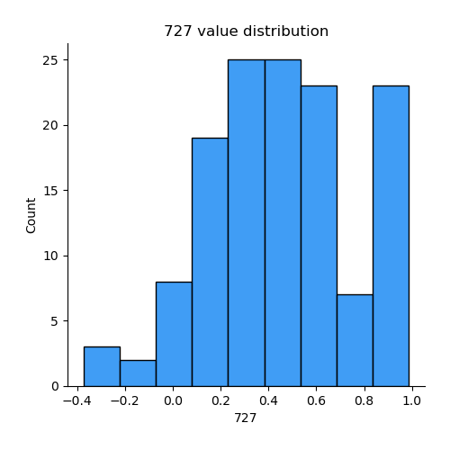
## Feature : 742
- **Feature type** : continous
- **Missing** : 0.0%
- **Unique** : 3
- **Count** :135.0
- **Mean** :1.0
- **Std** :8.894203383953475e-17
- **Min** :0.9999999999999998
- **25%th Percentile** : 0.9999999999999999
- **50%th Percentile** : 1.0
- **75%th Percentile** : 1.0
- **Max** :1.0

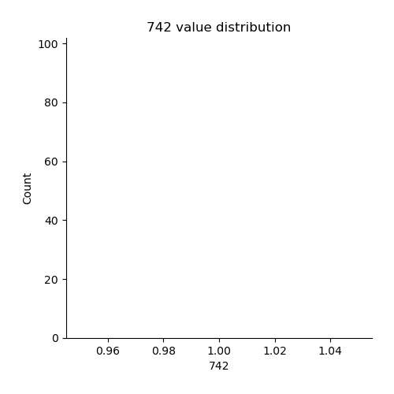
## Feature : 743
- **Feature type** : continous
- **Missing** : 0.0%
- **Unique** : 135
- **Count** :135.0
- **Mean** :0.5058659452204072
- **Std** :0.2826346363325625
- **Min** :-0.3840840105063391
- **25%th Percentile** : 0.29637708174912347
- **50%th Percentile** : 0.49651974783352326
- **75%th Percentile** : 0.6859889967418378
- **Max** :0.9868901066557317

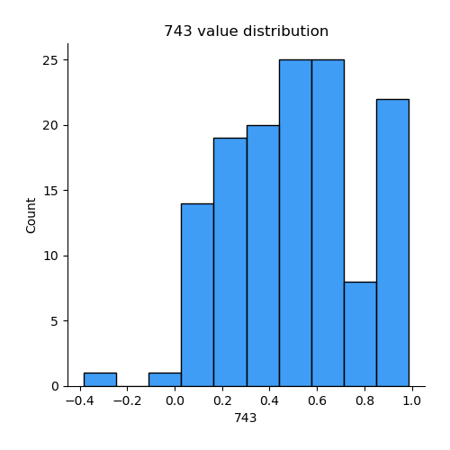
## Feature : 744
- **Feature type** : continous
- **Missing** : 0.0%
- **Unique** : 135
- **Count** :135.0
- **Mean** :0.599463091535238
- **Std** :0.21898554867745026
- **Min** :-0.08741162490954038
- **25%th Percentile** : 0.4556933825585031
- **50%th Percentile** : 0.5818078447259154
- **75%th Percentile** : 0.7469065840026143
- **Max** :0.9899376017374658

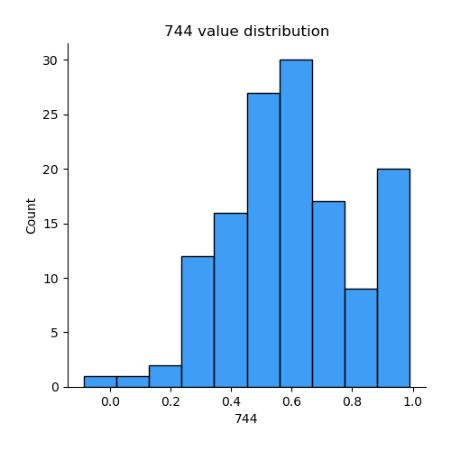
## Feature : 745
- **Feature type** : continous
- **Missing** : 0.0%
- **Unique** : 135
- **Count** :135.0
- **Mean** :0.5363986505075281
- **Std** :0.2680415357365733
- **Min** :-0.40047468115408535
- **25%th Percentile** : 0.37036087794117944
- **50%th Percentile** : 0.5425516005178044
- **75%th Percentile** : 0.725487007956084
- **Max** :0.9895454218235179

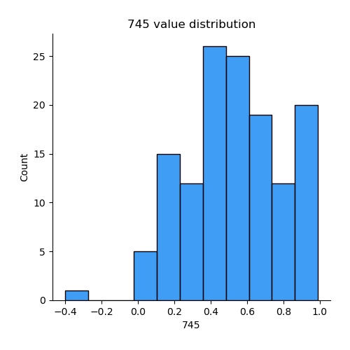
## Feature : 746
- **Feature type** : continous
- **Missing** : 0.0%
- **Unique** : 135
- **Count** :135.0
- **Mean** :0.6997150390327171
- **Std** :0.17526407122815998
- **Min** :0.12882401376136968
- **25%th Percentile** : 0.5975121309297446
- **50%th Percentile** : 0.6958654942093265
- **75%th Percentile** : 0.8061482438463672
- **Max** :0.989088223210568

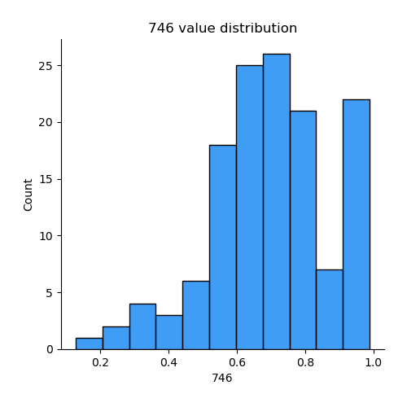
## Feature : 747
- **Feature type** : continous
- **Missing** : 0.0%
- **Unique** : 135
- **Count** :135.0
- **Mean** :0.4086860286670022
- **Std** :0.29941539388177413
- **Min** :-0.36157856510258424
- **25%th Percentile** : 0.21535117502371767
- **50%th Percentile** : 0.3600308624002217
- **75%th Percentile** : 0.575865721419073
- **Max** :0.9806575379189232

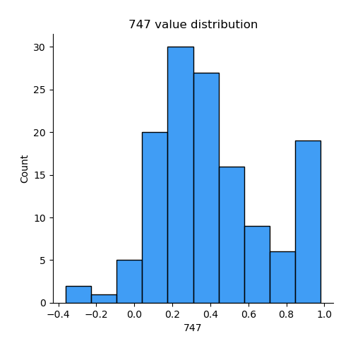
## Feature : 748
- **Feature type** : continous
- **Missing** : 0.0%
- **Unique** : 135
- **Count** :135.0
- **Mean** :0.4873928072605818
- **Std** :0.279753708694628
- **Min** :-0.2676906395230361
- **25%th Percentile** : 0.30126378704356305
- **50%th Percentile** : 0.4643283484597703
- **75%th Percentile** : 0.6529638494020165
- **Max** :0.9904832634242609

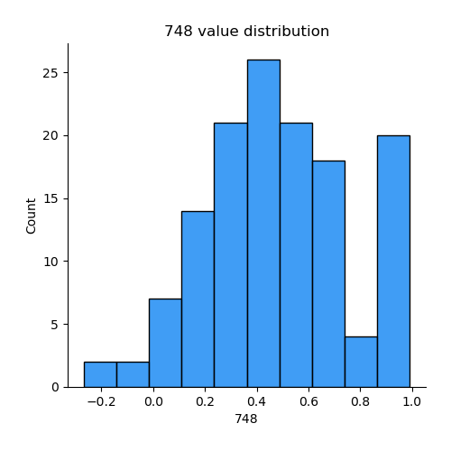
## Feature : 749
- **Feature type** : continous
- **Missing** : 0.0%
- **Unique** : 135
- **Count** :135.0
- **Mean** :0.6554383073083321
- **Std** :0.21412206230484698
- **Min** :-0.30439783388817543
- **25%th Percentile** : 0.5437926655540518
- **50%th Percentile** : 0.6722205491078231
- **75%th Percentile** : 0.7934987128997093
- **Max** :0.9872250737945976

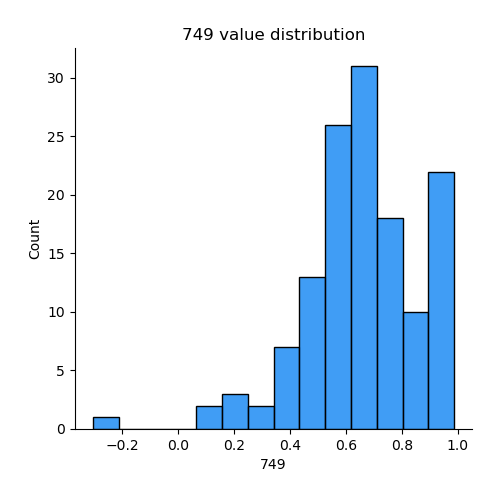
## Feature : 750
- **Feature type** : continous
- **Missing** : 0.0%
- **Unique** : 135
- **Count** :135.0
- **Mean** :0.5833342972984753
- **Std** :0.22627847487759778
- **Min** :0.08891778419101364
- **25%th Percentile** : 0.4399374089225667
- **50%th Percentile** : 0.5569719481614124
- **75%th Percentile** : 0.7379419530341669
- **Max** :0.980633043692859

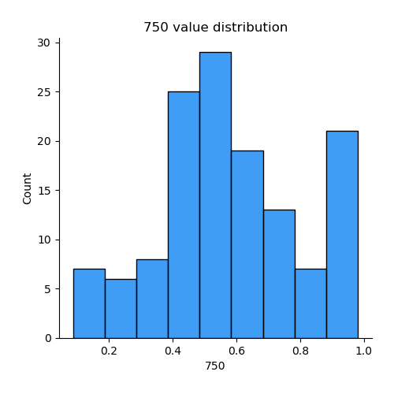
## Feature : 751
- **Feature type** : continous
- **Missing** : 0.0%
- **Unique** : 135
- **Count** :135.0
- **Mean** :0.6009843612212937
- **Std** :0.2142864325243353
- **Min** :-0.1384846257300158
- **25%th Percentile** : 0.46257372435121813
- **50%th Percentile** : 0.5857652437771445
- **75%th Percentile** : 0.696917410289833
- **Max** :0.9903264303223573

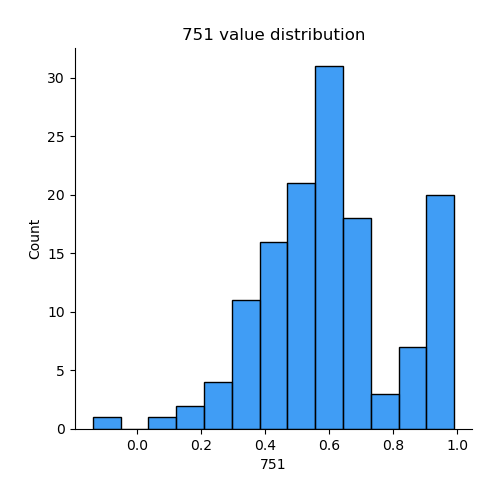
## Feature : 752
- **Feature type** : continous
- **Missing** : 0.0%
- **Unique** : 135
- **Count** :135.0
- **Mean** :0.37174445231517805
- **Std** :0.29119349483847906
- **Min** :-0.2518991958619139
- **25%th Percentile** : 0.17749789383723716
- **50%th Percentile** : 0.3077233944663238
- **75%th Percentile** : 0.5218192270412938
- **Max** :0.9679388524682547

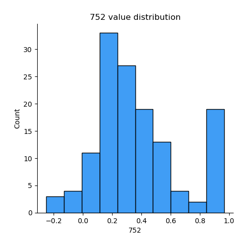
## Feature : 753
- **Feature type** : continous
- **Missing** : 0.0%
- **Unique** : 135
- **Count** :135.0
- **Mean** :0.5704509745636929
- **Std** :0.2402520444717611
- **Min** :-0.3121990651367756
- **25%th Percentile** : 0.41894214203642366
- **50%th Percentile** : 0.5419626795907807
- **75%th Percentile** : 0.7202418881976913
- **Max** :0.9812743111348521

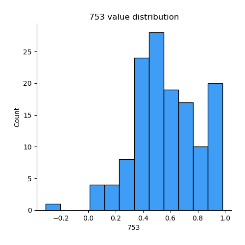
## Feature : 754
- **Feature type** : continous
- **Missing** : 0.0%
- **Unique** : 135
- **Count** :135.0
- **Mean** :0.5361487318722368
- **Std** :0.25699464369430736
- **Min** :-0.2208726829673271
- **25%th Percentile** : 0.38506192979663045
- **50%th Percentile** : 0.5116925496951897
- **75%th Percentile** : 0.6554119506196229
- **Max** :0.9787105083532402

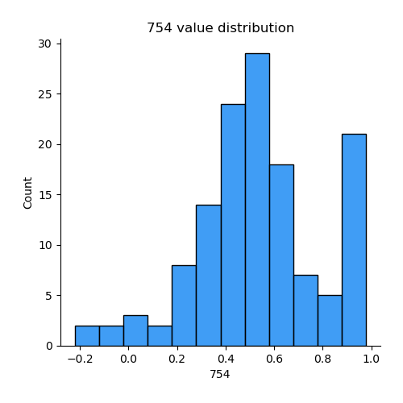
## Feature : 755
- **Feature type** : continous
- **Missing** : 0.0%
- **Unique** : 135
- **Count** :135.0
- **Mean** :0.5320950090683243
- **Std** :0.24449076978717998
- **Min** :-0.14330998945489143
- **25%th Percentile** : 0.37121631763185725
- **50%th Percentile** : 0.5222769322576378
- **75%th Percentile** : 0.662432086569144
- **Max** :0.9852575500550438

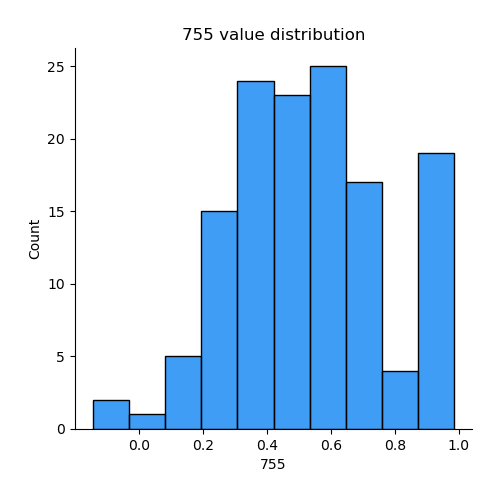
## Feature : 756
- **Feature type** : continous
- **Missing** : 0.0%
- **Unique** : 135
- **Count** :135.0
- **Mean** :0.7991340944372557
- **Std** :0.13835876884673323
- **Min** :0.20833001406585747
- **25%th Percentile** : 0.7296645288984678
- **50%th Percentile** : 0.8139998929028378
- **75%th Percentile** : 0.8977381403230031
- **Max** :0.9920001105638016

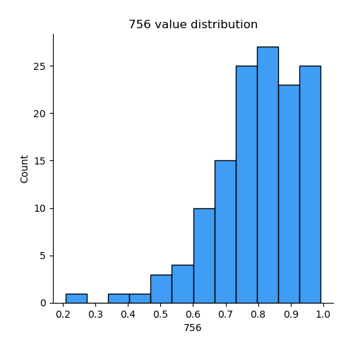
## Feature : 757
- **Feature type** : continous
- **Missing** : 0.0%
- **Unique** : 135
- **Count** :135.0
- **Mean** :0.39029311577480197
- **Std** :0.2896167530277463
- **Min** :-0.18837024210661119
- **25%th Percentile** : 0.17598871881557884
- **50%th Percentile** : 0.3283646410725107
- **75%th Percentile** : 0.5731338439152336
- **Max** :0.9754540360393608

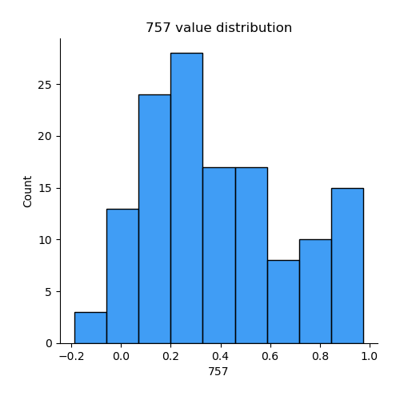
## Feature : 758
- **Feature type** : continous
- **Missing** : 0.0%
- **Unique** : 135
- **Count** :135.0
- **Mean** :0.6850115600875426
- **Std** :0.1816478410654887
- **Min** :0.19906903379249943
- **25%th Percentile** : 0.5756613229539608
- **50%th Percentile** : 0.6772751074125222
- **75%th Percentile** : 0.8047469236156396
- **Max** :0.9900479798822929

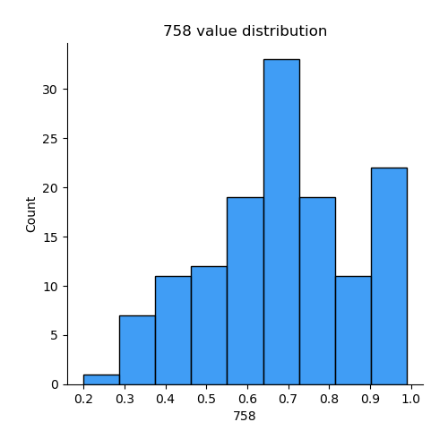
## Feature : 759
- **Feature type** : continous
- **Missing** : 0.0%
- **Unique** : 135
- **Count** :135.0
- **Mean** :0.6215400233151768
- **Std** :0.21268510640746832
- **Min** :-0.14191678260526672
- **25%th Percentile** : 0.4878253510741158
- **50%th Percentile** : 0.6100142500312433
- **75%th Percentile** : 0.7422364943306771
- **Max** :0.9886137351903737

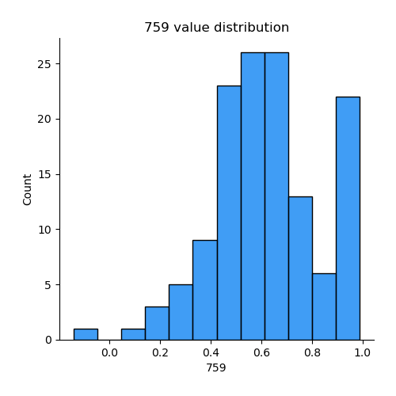
## Feature : 760
- **Feature type** : continous
- **Missing** : 0.0%
- **Unique** : 135
- **Count** :135.0
- **Mean** :0.543511115101982
- **Std** :0.24961309516677235
- **Min** :-0.11478358657391985
- **25%th Percentile** : 0.3835371216675564
- **50%th Percentile** : 0.526860331925876
- **75%th Percentile** : 0.6831994866040363
- **Max** :0.988090313902204

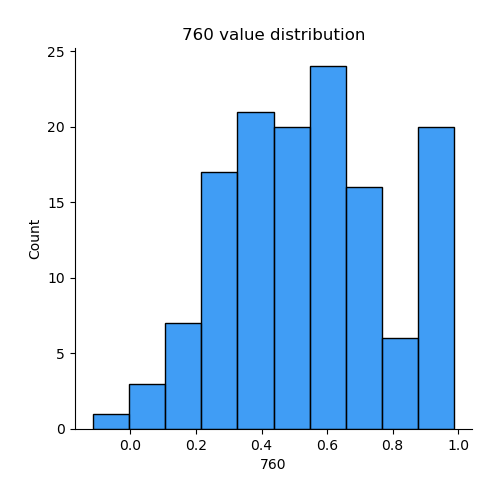
## Feature : 761
- **Feature type** : continous
- **Missing** : 0.0%
- **Unique** : 135
- **Count** :135.0
- **Mean** :0.5912933626390718
- **Std** :0.22462689030676244
- **Min** :-0.15610299902624347
- **25%th Percentile** : 0.4675333698253229
- **50%th Percentile** : 0.5692915873711492
- **75%th Percentile** : 0.7202892751647092
- **Max** :0.9883351561423408

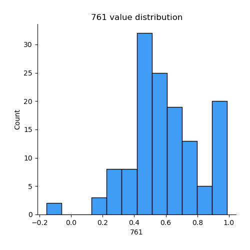
## Feature : 762
- **Feature type** : continous
- **Missing** : 0.0%
- **Unique** : 135
- **Count** :135.0
- **Mean** :0.6685546925797515
- **Std** :0.19460970042481499
- **Min** :0.17019582018847587
- **25%th Percentile** : 0.5448142863071681
- **50%th Percentile** : 0.6859567656951997
- **75%th Percentile** : 0.8053476159621304
- **Max** :0.9886053468583765

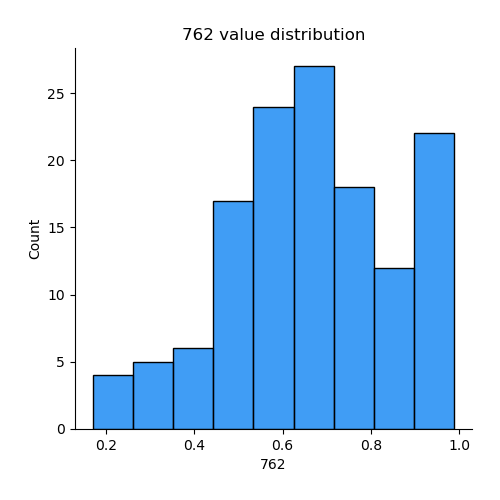
## Feature : 763
- **Feature type** : continous
- **Missing** : 0.0%
- **Unique** : 135
- **Count** :135.0
- **Mean** :0.7328820576045949
- **Std** :0.16698816582680348
- **Min** :0.232803566533955
- **25%th Percentile** : 0.6360088091677263
- **50%th Percentile** : 0.7392150634510195
- **75%th Percentile** : 0.8451434990230778
- **Max** :0.9852071080267504

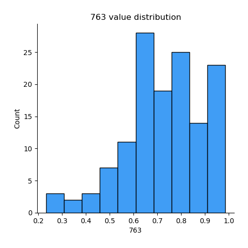
## Feature : 764
- **Feature type** : continous
- **Missing** : 0.0%
- **Unique** : 135
- **Count** :135.0
- **Mean** :0.8677529115174051
- **Std** :0.09041330174255341
- **Min** :0.5585502638656432
- **25%th Percentile** : 0.8193976566350417
- **50%th Percentile** : 0.8819145402684911
- **75%th Percentile** : 0.9320493350068324
- **Max** :0.9947002161214578

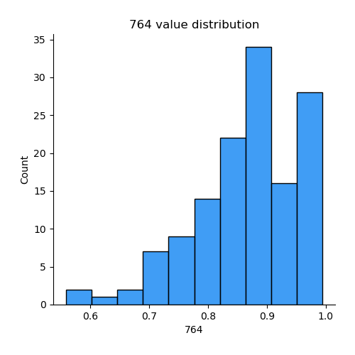
## Feature : 765
- **Feature type** : continous
- **Missing** : 0.0%
- **Unique** : 135
- **Count** :135.0
- **Mean** :0.5405279906370922
- **Std** :0.2494880338335402
- **Min** :-0.21783883556388017
- **25%th Percentile** : 0.38629892440390295
- **50%th Percentile** : 0.5234270159128813
- **75%th Percentile** : 0.6745141357967683
- **Max** :0.9857445675665286

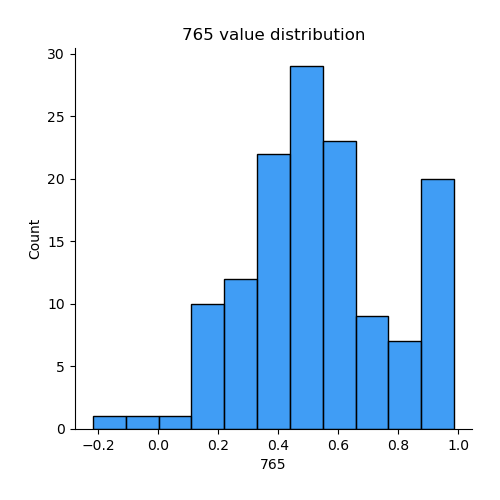
## Feature : 766
- **Feature type** : continous
- **Missing** : 0.0%
- **Unique** : 135
- **Count** :135.0
- **Mean** :0.47806376644606846
- **Std** :0.3077804267773612
- **Min** :-0.4469064976721563
- **25%th Percentile** : 0.23481330128738587
- **50%th Percentile** : 0.47849086239337374
- **75%th Percentile** : 0.6819752958161884
- **Max** :0.9879704637841348

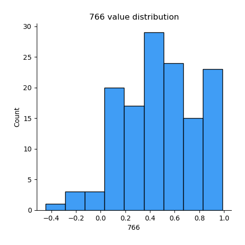
## Feature : 767
- **Feature type** : continous
- **Missing** : 0.0%
- **Unique** : 135
- **Count** :135.0
- **Mean** :0.5764963914345801
- **Std** :0.22274301893120949
- **Min** :0.09542199254885536
- **25%th Percentile** : 0.4243536904895452
- **50%th Percentile** : 0.5694715484686358
- **75%th Percentile** : 0.6934359908932186
- **Max** :0.9865263430394604

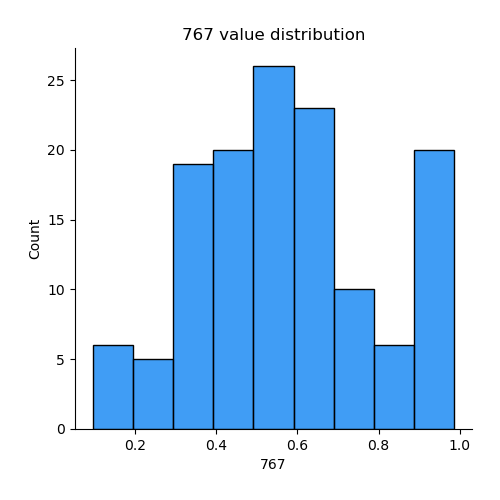
## Feature : 768
- **Feature type** : continous
- **Missing** : 0.0%
- **Unique** : 135
- **Count** :135.0
- **Mean** :0.9265647076339246
- **Std** :0.07541124179724033
- **Min** :0.35047895452017563
- **25%th Percentile** : 0.9071442763602884
- **50%th Percentile** : 0.9438205898641714
- **75%th Percentile** : 0.9667484906185465
- **Max** :0.9973510527378456

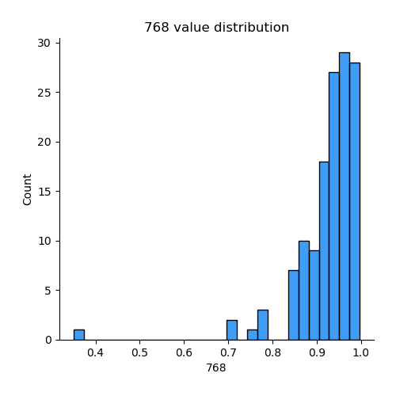
## Feature : 769
- **Feature type** : continous
- **Missing** : 0.0%
- **Unique** : 135
- **Count** :135.0
- **Mean** :0.4873052603601168
- **Std** :0.30908157603955605
- **Min** :-0.4493992367722799
- **25%th Percentile** : 0.25613710301859394
- **50%th Percentile** : 0.4965163529111934
- **75%th Percentile** : 0.6944906714894303
- **Max** :0.9868718683858305

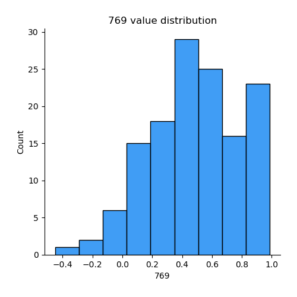
## Feature : 770
- **Feature type** : continous
- **Missing** : 0.0%
- **Unique** : 135
- **Count** :135.0
- **Mean** :0.5968173428418126
- **Std** :0.22063383219462918
- **Min** :0.0059954976374094375
- **25%th Percentile** : 0.4652819118330021
- **50%th Percentile** : 0.5739659401320532
- **75%th Percentile** : 0.7449007881612855
- **Max** :0.9926693961273023

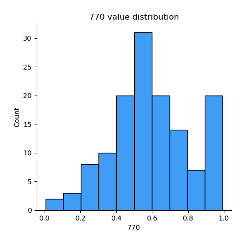
## Feature : 771
- **Feature type** : continous
- **Missing** : 0.0%
- **Unique** : 135
- **Count** :135.0
- **Mean** :0.5174789639546534
- **Std** :0.28829491242730837
- **Min** :-0.38613605827327346
- **25%th Percentile** : 0.32780299292702986
- **50%th Percentile** : 0.5183316490057718
- **75%th Percentile** : 0.7142876409757528
- **Max** :0.9886830517686431

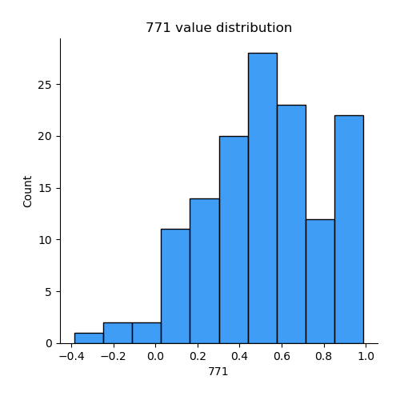
## Feature : 772
- **Feature type** : continous
- **Missing** : 0.0%
- **Unique** : 135
- **Count** :135.0
- **Mean** :0.6920664666878308
- **Std** :0.17904338324895802
- **Min** :0.03634396231528392
- **25%th Percentile** : 0.5749689789527097
- **50%th Percentile** : 0.6978026454315408
- **75%th Percentile** : 0.8039942217811071
- **Max** :0.9906296271287922

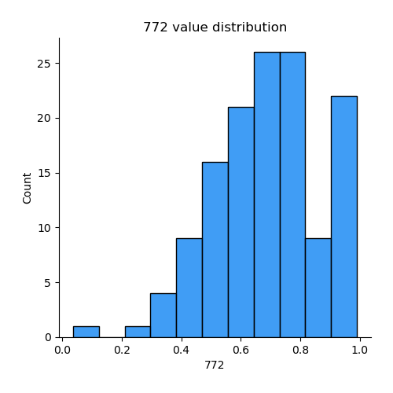
## Feature : 773
- **Feature type** : continous
- **Missing** : 0.0%
- **Unique** : 135
- **Count** :135.0
- **Mean** :0.37782215850531625
- **Std** :0.30146354743489506
- **Min** :-0.311479453473748
- **25%th Percentile** : 0.19092564487479036
- **50%th Percentile** : 0.3212313760923796
- **75%th Percentile** : 0.5046479223022122
- **Max** :0.9782580524981991

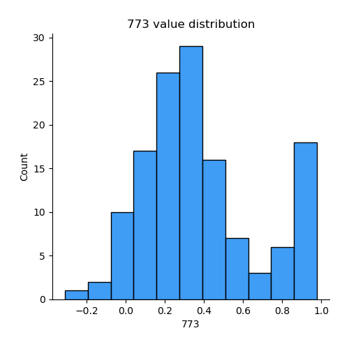
## Feature : 774
- **Feature type** : continous
- **Missing** : 0.0%
- **Unique** : 135
- **Count** :135.0
- **Mean** :0.5122293654154083
- **Std** :0.27650245650037525
- **Min** :-0.23562160257054682
- **25%th Percentile** : 0.3365063376947157
- **50%th Percentile** : 0.4968916866510274
- **75%th Percentile** : 0.6817071545803457
- **Max** :0.9910283101616063

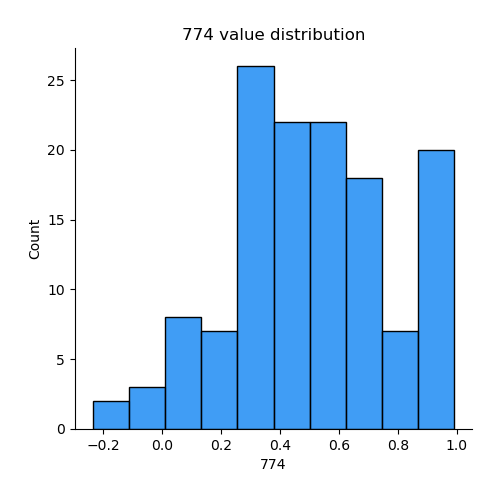
## Feature : 775
- **Feature type** : continous
- **Missing** : 0.0%
- **Unique** : 135
- **Count** :135.0
- **Mean** :0.6354750890467074
- **Std** :0.2219444177587676
- **Min** :-0.3366238121646519
- **25%th Percentile** : 0.4903310163652116
- **50%th Percentile** : 0.6338302076980535
- **75%th Percentile** : 0.7766914171529269
- **Max** :0.9884788453474956

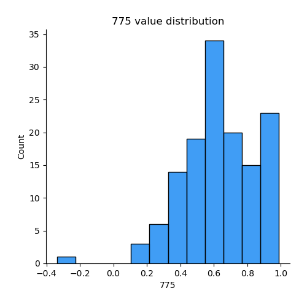
## Feature : 776
- **Feature type** : continous
- **Missing** : 0.0%
- **Unique** : 135
- **Count** :135.0
- **Mean** :0.5599140156354617
- **Std** :0.23909129414370708
- **Min** :-0.180038863333643
- **25%th Percentile** : 0.3964990754608033
- **50%th Percentile** : 0.5518338262708552
- **75%th Percentile** : 0.7056609215574101
- **Max** :0.9852269893719202

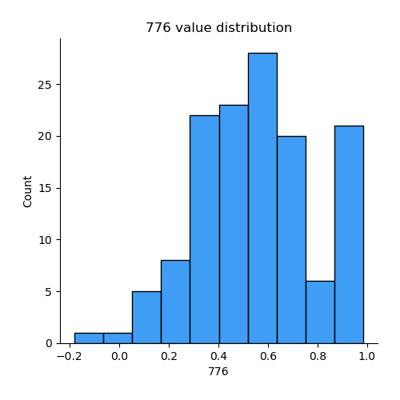
## Feature : 777
- **Feature type** : continous
- **Missing** : 0.0%
- **Unique** : 135
- **Count** :135.0
- **Mean** :0.5852436127181725
- **Std** :0.23553010949753267
- **Min** :-0.25233424771096
- **25%th Percentile** : 0.43160422900856965
- **50%th Percentile** : 0.5638281302083009
- **75%th Percentile** : 0.7243054478770112
- **Max** :0.9857363986658152

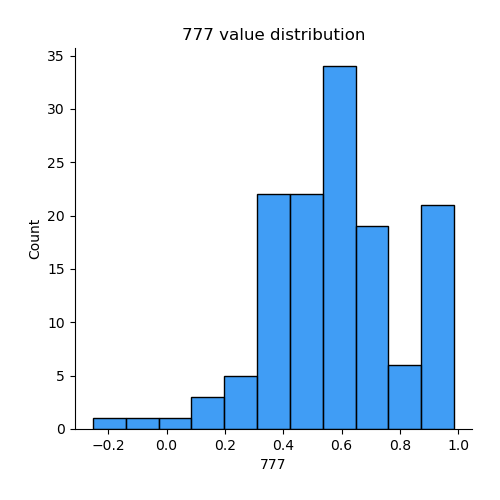
## Feature : 778
- **Feature type** : continous
- **Missing** : 0.0%
- **Unique** : 135
- **Count** :135.0
- **Mean** :0.3584993434250119
- **Std** :0.30300519770351053
- **Min** :-0.24447514441196438
- **25%th Percentile** : 0.1381755134891195
- **50%th Percentile** : 0.307235153781016
- **75%th Percentile** : 0.5326836518274164
- **Max** :0.972619539632454

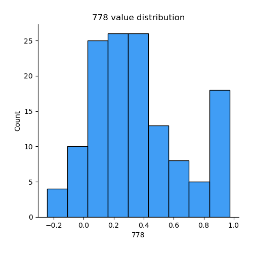
## Feature : 779
- **Feature type** : continous
- **Missing** : 0.0%
- **Unique** : 135
- **Count** :135.0
- **Mean** :0.5157027652276954
- **Std** :0.25691119482724484
- **Min** :-0.017686602475393966
- **25%th Percentile** : 0.33653905059770384
- **50%th Percentile** : 0.5091805408145353
- **75%th Percentile** : 0.7041589806359965
- **Max** :0.9778465171345364

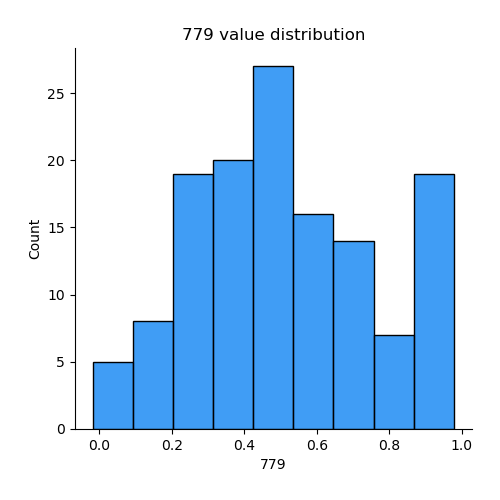
## Feature : 795
- **Feature type** : continous
- **Missing** : 0.0%
- **Unique** : 3
- **Count** :135.0
- **Mean** :1.0
- **Std** :7.240945162353718e-17
- **Min** :0.9999999999999998
- **25%th Percentile** : 1.0
- **50%th Percentile** : 1.0
- **75%th Percentile** : 1.0
- **Max** :1.0

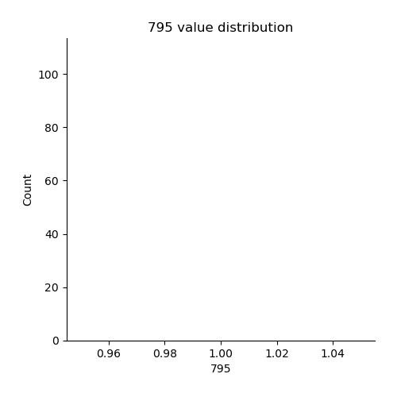
## Feature : 796
- **Feature type** : continous
- **Missing** : 0.0%
- **Unique** : 135
- **Count** :135.0
- **Mean** :0.7087698820648151
- **Std** :0.19234077615846035
- **Min** :0.17375057243150735
- **25%th Percentile** : 0.5950909218129892
- **50%th Percentile** : 0.7157322321195085
- **75%th Percentile** : 0.8433362174999123
- **Max** :0.9938692762538607

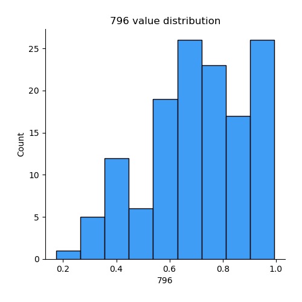
## Feature : 797
- **Feature type** : continous
- **Missing** : 0.0%
- **Unique** : 135
- **Count** :135.0
- **Mean** :0.9332590063025085
- **Std** :0.054667177498914046
- **Min** :0.6917148854194809
- **25%th Percentile** : 0.9097144462964367
- **50%th Percentile** : 0.9441679679292665
- **75%th Percentile** : 0.9680669301777534
- **Max** :0.9986666426041562

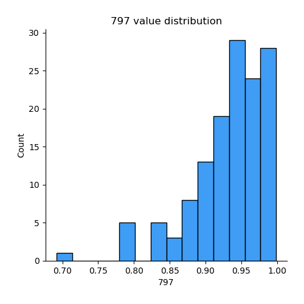
## Feature : 798
- **Feature type** : continous
- **Missing** : 0.0%
- **Unique** : 135
- **Count** :135.0
- **Mean** :0.703732043915053
- **Std** :0.1795652855810394
- **Min** :0.2009929806819736
- **25%th Percentile** : 0.5936026384669298
- **50%th Percentile** : 0.7068588729337129
- **75%th Percentile** : 0.8259395192227758
- **Max** :0.9921372914003239

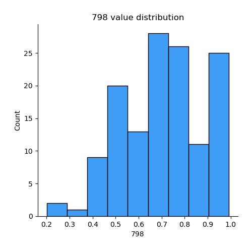
## Feature : 799
- **Feature type** : continous
- **Missing** : 0.0%
- **Unique** : 135
- **Count** :135.0
- **Mean** :0.4811039336152943
- **Std** :0.30637313690012413
- **Min** :-0.285182217550737
- **25%th Percentile** : 0.2760961616953671
- **50%th Percentile** : 0.4685568957382507
- **75%th Percentile** : 0.6282844485775441
- **Max** :0.9905572656737119

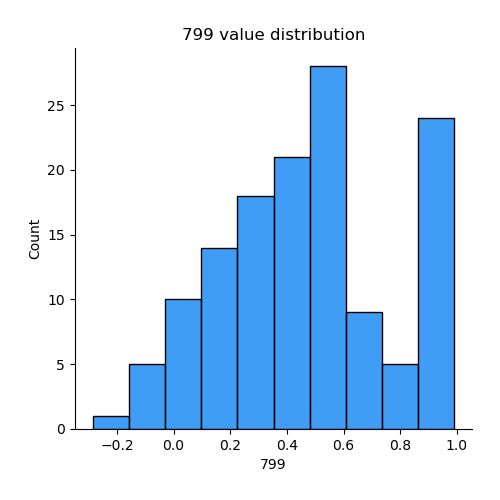
## Feature : 800
- **Feature type** : continous
- **Missing** : 0.0%
- **Unique** : 135
- **Count** :135.0
- **Mean** :0.7045883836371167
- **Std** :0.1964867838636912
- **Min** :0.16128878848681266
- **25%th Percentile** : 0.5770945977062402
- **50%th Percentile** : 0.7135054885133764
- **75%th Percentile** : 0.8297462402945688
- **Max** :0.9966064067873706

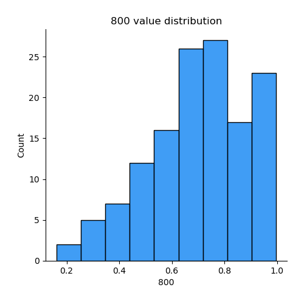
## Feature : 801
- **Feature type** : continous
- **Missing** : 0.0%
- **Unique** : 135
- **Count** :135.0
- **Mean** :0.7810039131244307
- **Std** :0.1478521889400803
- **Min** :0.29137938148063713
- **25%th Percentile** : 0.7041844423803401
- **50%th Percentile** : 0.7901560655222777
- **75%th Percentile** : 0.8736209779934729
- **Max** :0.9967913228695976

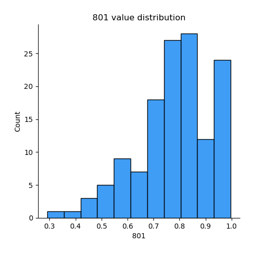
## Feature : 802
- **Feature type** : continous
- **Missing** : 0.0%
- **Unique** : 135
- **Count** :135.0
- **Mean** :0.6517008763618503
- **Std** :0.23097410469560142
- **Min** :-0.1356533926424365
- **25%th Percentile** : 0.5099566079304705
- **50%th Percentile** : 0.6677984559734477
- **75%th Percentile** : 0.8075953334288202
- **Max** :0.9944999622855334

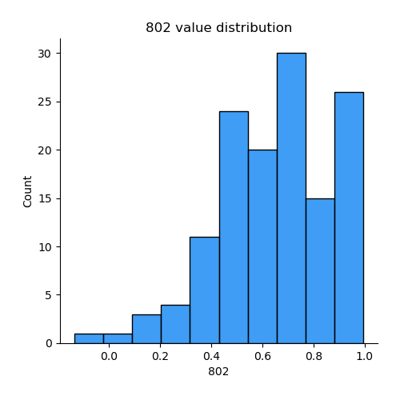
## Feature : 803
- **Feature type** : continous
- **Missing** : 0.0%
- **Unique** : 135
- **Count** :135.0
- **Mean** :0.7606490874053616
- **Std** :0.15184124528652249
- **Min** :0.3381392210205425
- **25%th Percentile** : 0.6680795946205018
- **50%th Percentile** : 0.7552509751130376
- **75%th Percentile** : 0.8591289365913543
- **Max** :0.9968664932087291

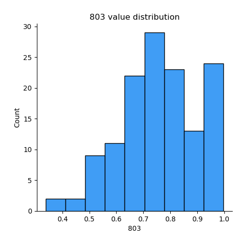
## Feature : 804
- **Feature type** : continous
- **Missing** : 0.0%
- **Unique** : 135
- **Count** :135.0
- **Mean** :0.38781692675770796
- **Std** :0.3056084596602482
- **Min** :-0.3091779077454754
- **25%th Percentile** : 0.17188925361745316
- **50%th Percentile** : 0.34664463343543367
- **75%th Percentile** : 0.5058243630015766
- **Max** :0.9854881628184572

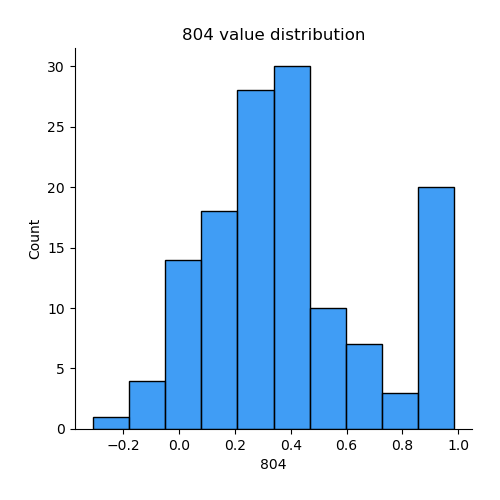
## Feature : 805
- **Feature type** : continous
- **Missing** : 0.0%
- **Unique** : 135
- **Count** :135.0
- **Mean** :0.6027491390229989
- **Std** :0.2418828105745458
- **Min** :-0.09725329958368628
- **25%th Percentile** : 0.44587864933494814
- **50%th Percentile** : 0.6079025719844932
- **75%th Percentile** : 0.7530258258043543
- **Max** :0.9917573286012138

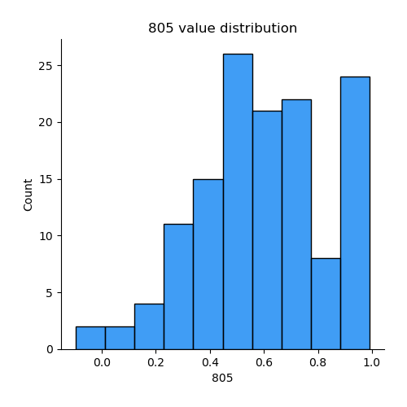
## Feature : 806
- **Feature type** : continous
- **Missing** : 0.0%
- **Unique** : 135
- **Count** :135.0
- **Mean** :0.5379198673285692
- **Std** :0.29029921323126173
- **Min** :-0.4296983668043021
- **25%th Percentile** : 0.36826350300933386
- **50%th Percentile** : 0.5312504142642355
- **75%th Percentile** : 0.7154475031040428
- **Max** :0.9949761467841844

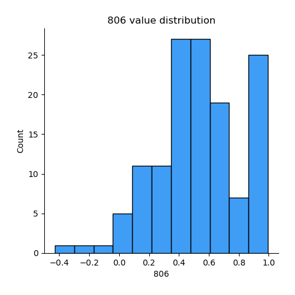
## Feature : 807
- **Feature type** : continous
- **Missing** : 0.0%
- **Unique** : 135
- **Count** :135.0
- **Mean** :0.6160090641276651
- **Std** :0.22594285053564273
- **Min** :0.03876580884590989
- **25%th Percentile** : 0.440833828325803
- **50%th Percentile** : 0.6093816554987661
- **75%th Percentile** : 0.7592945165987923
- **Max** :0.9935903949929907

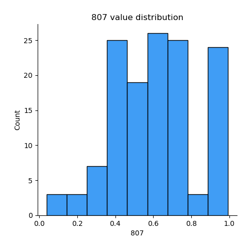
## Feature : 808
- **Feature type** : continous
- **Missing** : 0.0%
- **Unique** : 135
- **Count** :135.0
- **Mean** :0.6210207386687193
- **Std** :0.2251495471812354
- **Min** :0.12819109821748492
- **25%th Percentile** : 0.44249653995302546
- **50%th Percentile** : 0.6254057053237791
- **75%th Percentile** : 0.7677658090705031
- **Max** :0.9905189618978375

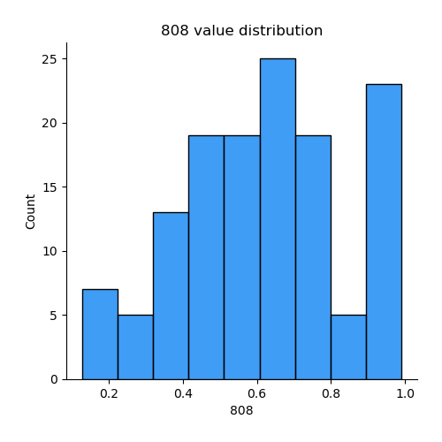
## Feature : 809
- **Feature type** : continous
- **Missing** : 0.0%
- **Unique** : 135
- **Count** :135.0
- **Mean** :0.355248049768565
- **Std** :0.3176989699380392
- **Min** :-0.28009423608771056
- **25%th Percentile** : 0.10964345611745613
- **50%th Percentile** : 0.3273753033218086
- **75%th Percentile** : 0.548216215287841
- **Max** :0.9842308314325205

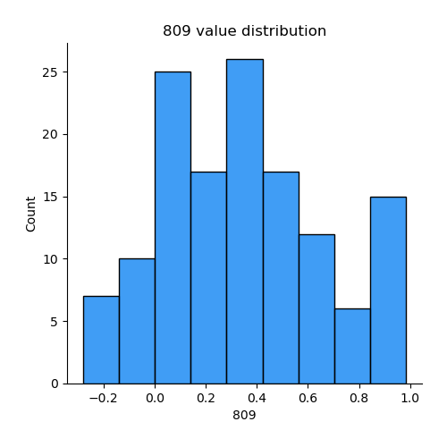
## Feature : 810
- **Feature type** : continous
- **Missing** : 0.0%
- **Unique** : 135
- **Count** :135.0
- **Mean** :0.5456525062616294
- **Std** :0.2795630544714829
- **Min** :-0.11070991145517098
- **25%th Percentile** : 0.36509215185535304
- **50%th Percentile** : 0.5356127487617295
- **75%th Percentile** : 0.7281792404860452
- **Max** :0.9929402862846272

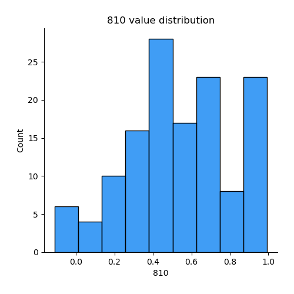
## Feature : 811
- **Feature type** : continous
- **Missing** : 0.0%
- **Unique** : 135
- **Count** :135.0
- **Mean** :0.5847110818328443
- **Std** :0.2583147794074914
- **Min** :-0.17452607890252483
- **25%th Percentile** : 0.4248164118044355
- **50%th Percentile** : 0.5806344564328259
- **75%th Percentile** : 0.7489513667388771
- **Max** :0.994488582198996

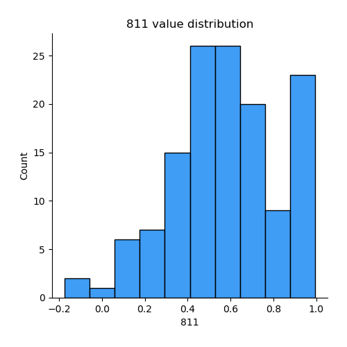
## Feature : 812
- **Feature type** : continous
- **Missing** : 0.0%
- **Unique** : 135
- **Count** :135.0
- **Mean** :0.4999246855388199
- **Std** :0.3034780965989911
- **Min** :-0.30549124254034876
- **25%th Percentile** : 0.3252789719161068
- **50%th Percentile** : 0.4911071849472744
- **75%th Percentile** : 0.6824571559629948
- **Max** :0.992981895804871

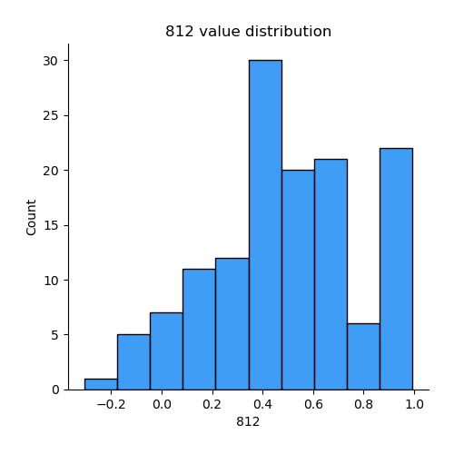
## Feature : 813
- **Feature type** : continous
- **Missing** : 0.0%
- **Unique** : 135
- **Count** :135.0
- **Mean** :0.6592768306597827
- **Std** :0.21844881246053843
- **Min** :0.01586665328517783
- **25%th Percentile** : 0.5062755439605653
- **50%th Percentile** : 0.6749412950314994
- **75%th Percentile** : 0.7954296021171279
- **Max** :0.9955821085413763

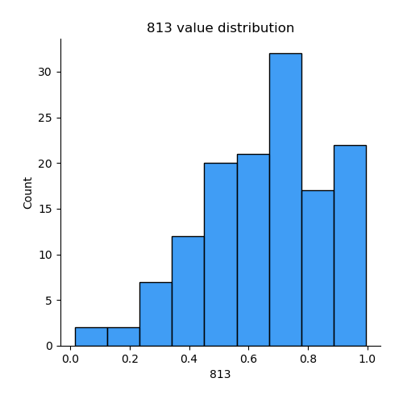
## Feature : 814
- **Feature type** : continous
- **Missing** : 0.0%
- **Unique** : 135
- **Count** :135.0
- **Mean** :0.5796698008477761
- **Std** :0.24973916519021389
- **Min** :-0.081820035539381
- **25%th Percentile** : 0.419356725531104
- **50%th Percentile** : 0.5768782354379058
- **75%th Percentile** : 0.7504079863475244
- **Max** :0.9893393316977822

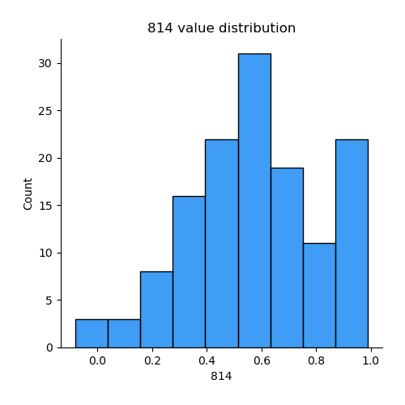
## Feature : 815
- **Feature type** : continous
- **Missing** : 0.0%
- **Unique** : 135
- **Count** :135.0
- **Mean** :0.5287608323670603
- **Std** :0.28285157567399577
- **Min** :-0.17675715966049416
- **25%th Percentile** : 0.30129164535064534
- **50%th Percentile** : 0.5354677738070595
- **75%th Percentile** : 0.7362040474797723
- **Max** :0.9896037697314886

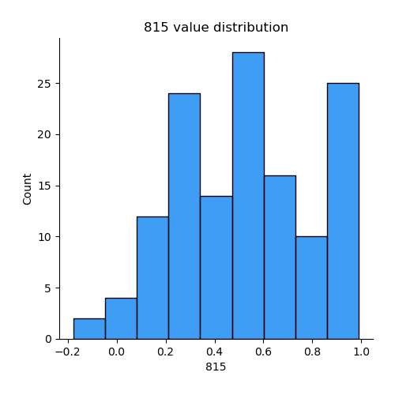
## Feature : 816
- **Feature type** : continous
- **Missing** : 0.0%
- **Unique** : 135
- **Count** :135.0
- **Mean** :0.5727696673359368
- **Std** :0.2610250998430566
- **Min** :-0.0322027909003381
- **25%th Percentile** : 0.36454766411649786
- **50%th Percentile** : 0.5672848855710763
- **75%th Percentile** : 0.748376689001206
- **Max** :0.992939954963768

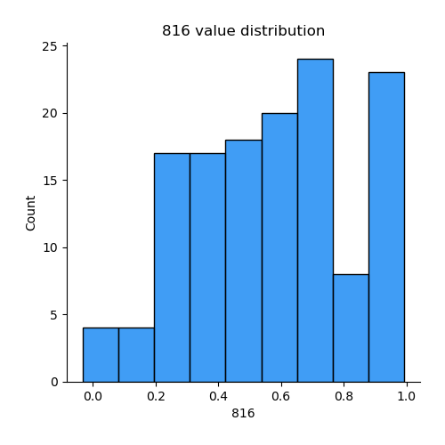
## Feature : 817
- **Feature type** : continous
- **Missing** : 0.0%
- **Unique** : 135
- **Count** :135.0
- **Mean** :0.495223294996454
- **Std** :0.3206378590430889
- **Min** :-0.3192771946030778
- **25%th Percentile** : 0.29941505016238285
- **50%th Percentile** : 0.5124407510221475
- **75%th Percentile** : 0.7135275993001006
- **Max** :0.9926826222945262

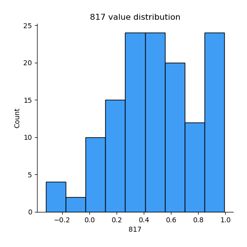
## Feature : 818
- **Feature type** : continous
- **Missing** : 0.0%
- **Unique** : 135
- **Count** :135.0
- **Mean** :0.8177175968552116
- **Std** :0.13129564533598262
- **Min** :0.3820162975595712
- **25%th Percentile** : 0.7382839072796469
- **50%th Percentile** : 0.836068534110706
- **75%th Percentile** : 0.9105732335846981
- **Max** :0.9972048225725024

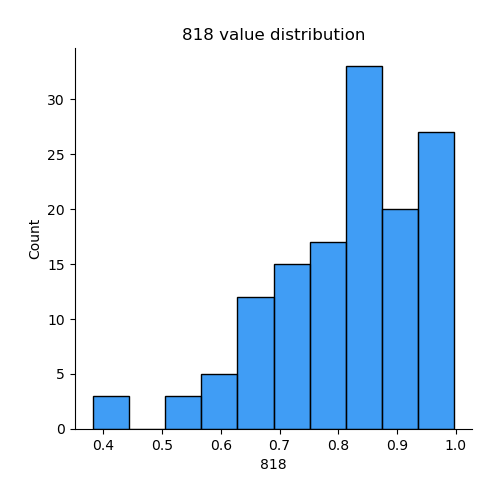
## Feature : 819
- **Feature type** : continous
- **Missing** : 0.0%
- **Unique** : 135
- **Count** :135.0
- **Mean** :0.45032747403240264
- **Std** :0.3053527643465361
- **Min** :-0.22027649066760652
- **25%th Percentile** : 0.2297909086302858
- **50%th Percentile** : 0.43693837650450845
- **75%th Percentile** : 0.603319812803345
- **Max** :0.9907036332461598

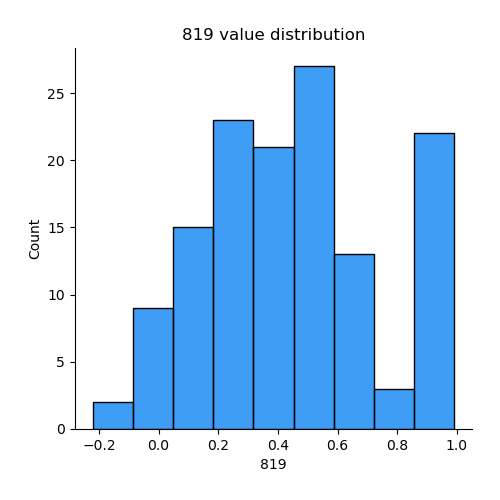
## Feature : 820
- **Feature type** : continous
- **Missing** : 0.0%
- **Unique** : 135
- **Count** :135.0
- **Mean** :0.4973870416434771
- **Std** :0.28618530556536786
- **Min** :-0.3836424104675619
- **25%th Percentile** : 0.29173291230145837
- **50%th Percentile** : 0.4997427263166208
- **75%th Percentile** : 0.6902761822580059
- **Max** :0.9873031478560138

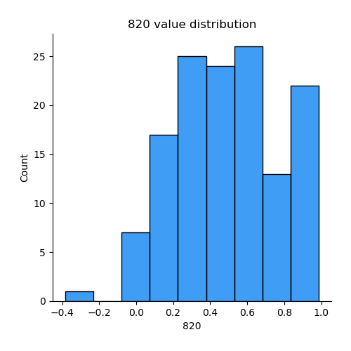
## Feature : 821
- **Feature type** : continous
- **Missing** : 0.0%
- **Unique** : 135
- **Count** :135.0
- **Mean** :0.8915963298299124
- **Std** :0.11999615407441225
- **Min** :0.27746527375865515
- **25%th Percentile** : 0.8712965849416019
- **50%th Percentile** : 0.9257818092266547
- **75%th Percentile** : 0.9581087530415502
- **Max** :0.9992137939548366

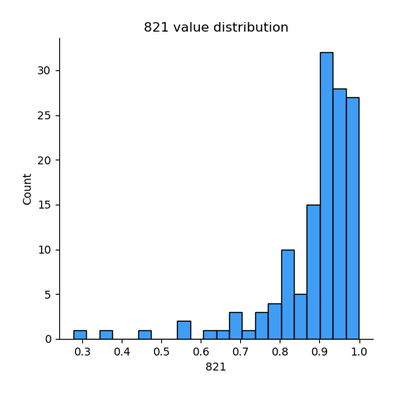
## Feature : 822
- **Feature type** : continous
- **Missing** : 0.0%
- **Unique** : 135
- **Count** :135.0
- **Mean** :0.6898538805422841
- **Std** :0.1974308060968233
- **Min** :0.07565652733599268
- **25%th Percentile** : 0.5753628651309601
- **50%th Percentile** : 0.6900027215610057
- **75%th Percentile** : 0.8236315004892314
- **Max** :0.9951039704202753

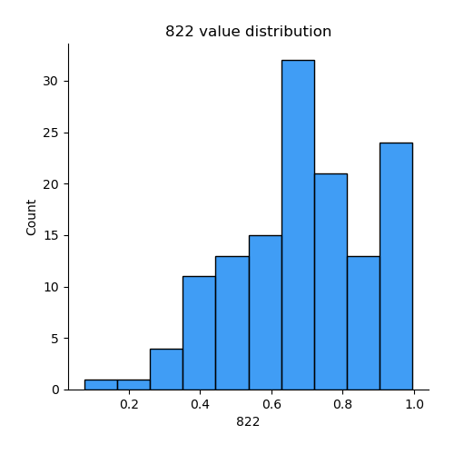
## Feature : 823
- **Feature type** : continous
- **Missing** : 0.0%
- **Unique** : 135
- **Count** :135.0
- **Mean** :0.8594094989145531
- **Std** :0.13194677190022552
- **Min** :0.19864521474597632
- **25%th Percentile** : 0.8260561129377066
- **50%th Percentile** : 0.8886262268426374
- **75%th Percentile** : 0.9292886536384573
- **Max** :0.9980449769822207

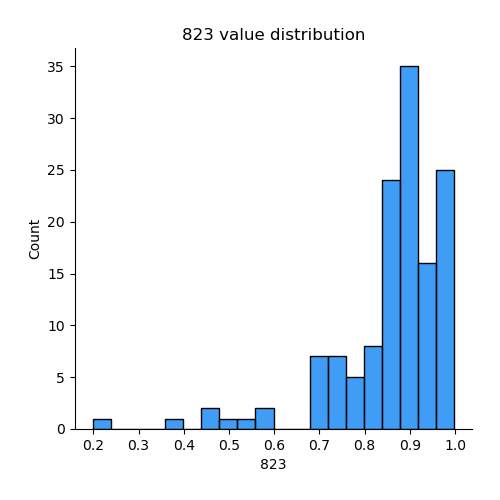
## Feature : 824
- **Feature type** : continous
- **Missing** : 0.0%
- **Unique** : 135
- **Count** :135.0
- **Mean** :0.6956190660699302
- **Std** :0.1883726064818931
- **Min** :0.177318466886834
- **25%th Percentile** : 0.5635075904938276
- **50%th Percentile** : 0.7052841672334874
- **75%th Percentile** : 0.8051550848954079
- **Max** :0.9919071485606775

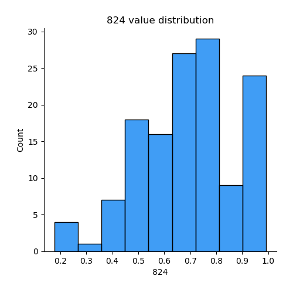
## Feature : 825
- **Feature type** : continous
- **Missing** : 0.0%
- **Unique** : 135
- **Count** :135.0
- **Mean** :0.45045804396112477
- **Std** :0.3126290057656887
- **Min** :-0.23780060335899902
- **25%th Percentile** : 0.22759474159962995
- **50%th Percentile** : 0.4174239708670132
- **75%th Percentile** : 0.6261379431506648
- **Max** :0.9901271192164195

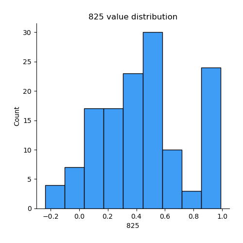
## Feature : 826
- **Feature type** : continous
- **Missing** : 0.0%
- **Unique** : 135
- **Count** :135.0
- **Mean** :0.6734457844873226
- **Std** :0.21745035446970862
- **Min** :-0.12219841658778567
- **25%th Percentile** : 0.5400169012872927
- **50%th Percentile** : 0.6903329257757496
- **75%th Percentile** : 0.807936534392014
- **Max** :0.9969058586237342

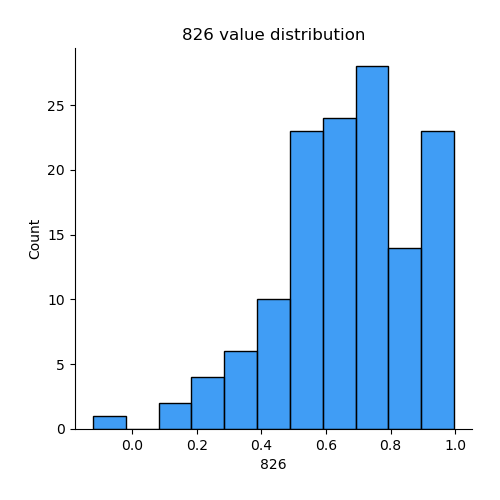
## Feature : 827
- **Feature type** : continous
- **Missing** : 0.0%
- **Unique** : 135
- **Count** :135.0
- **Mean** :0.7585220230556681
- **Std** :0.16715293707347972
- **Min** :0.25820152136662006
- **25%th Percentile** : 0.6551164152051006
- **50%th Percentile** : 0.7772091260185563
- **75%th Percentile** : 0.8853171990807128
- **Max** :0.9973811300690879

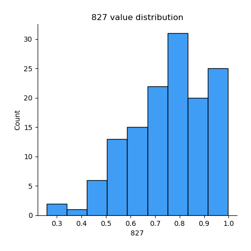
## Feature : 828
- **Feature type** : continous
- **Missing** : 0.0%
- **Unique** : 135
- **Count** :135.0
- **Mean** :0.5953141719475743
- **Std** :0.2757634861683849
- **Min** :-0.3211437527340917
- **25%th Percentile** : 0.4083953080429241
- **50%th Percentile** : 0.6178745707003258
- **75%th Percentile** : 0.794910836967187
- **Max** :0.9947545682873087

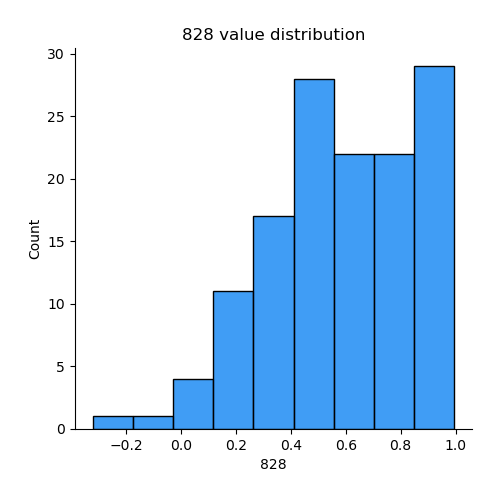
## Feature : 829
- **Feature type** : continous
- **Missing** : 0.0%
- **Unique** : 135
- **Count** :135.0
- **Mean** :0.7313981925617397
- **Std** :0.18136949609310565
- **Min** :0.11875363262459561
- **25%th Percentile** : 0.6414466942075472
- **50%th Percentile** : 0.7332231780225185
- **75%th Percentile** : 0.8465788058664
- **Max** :0.99618315175824

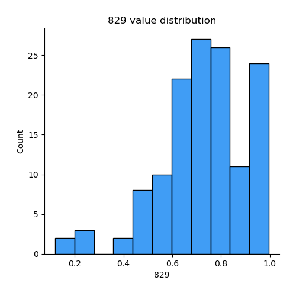
## Feature : 830
- **Feature type** : continous
- **Missing** : 0.0%
- **Unique** : 135
- **Count** :135.0
- **Mean** :0.36173175417784065
- **Std** :0.31700271230800764
- **Min** :-0.48559974940274836
- **25%th Percentile** : 0.15914493934039597
- **50%th Percentile** : 0.310923972361541
- **75%th Percentile** : 0.5164278757668729
- **Max** :0.9862950717905841

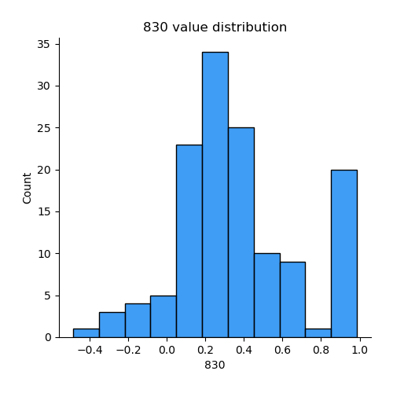
## Feature : 831
- **Feature type** : continous
- **Missing** : 0.0%
- **Unique** : 135
- **Count** :135.0
- **Mean** :0.5027373416734143
- **Std** :0.2936098548230829
- **Min** :-0.428299345313918
- **25%th Percentile** : 0.2807934086209508
- **50%th Percentile** : 0.5178196315745949
- **75%th Percentile** : 0.7118051627680237
- **Max** :0.989858338411886

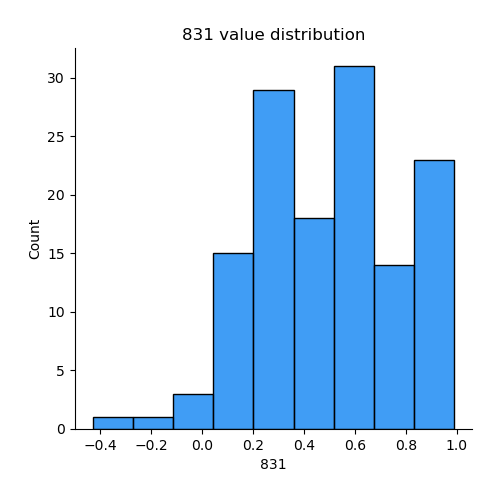
## Feature : 848
- **Feature type** : continous
- **Missing** : 0.0%
- **Unique** : 3
- **Count** :135.0
- **Mean** :1.0
- **Std** :1.0195230578599467e-16
- **Min** :0.9999999999999998
- **25%th Percentile** : 0.9999999999999999
- **50%th Percentile** : 1.0
- **75%th Percentile** : 1.0
- **Max** :1.0

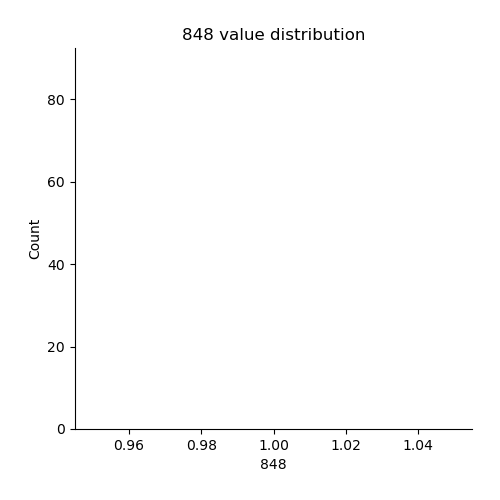
## Feature : 849
- **Feature type** : continous
- **Missing** : 0.0%
- **Unique** : 135
- **Count** :135.0
- **Mean** :0.73608831611379
- **Std** :0.1767011097269819
- **Min** :0.19463505744124251
- **25%th Percentile** : 0.6113100819216402
- **50%th Percentile** : 0.7564204766153132
- **75%th Percentile** : 0.8528399951752155
- **Max** :0.9936366533366064

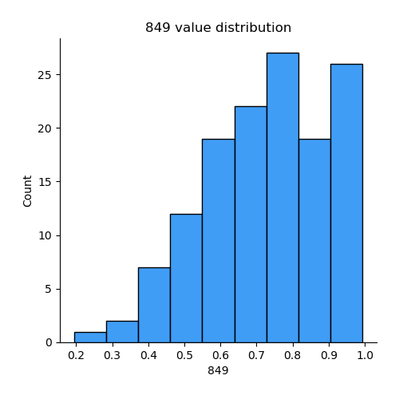
## Feature : 850
- **Feature type** : continous
- **Missing** : 0.0%
- **Unique** : 135
- **Count** :135.0
- **Mean** :0.7870035502425471
- **Std** :0.13255358277595203
- **Min** :0.44505186251220663
- **25%th Percentile** : 0.7109200404503366
- **50%th Percentile** : 0.7878918627430538
- **75%th Percentile** : 0.86863005649767
- **Max** :0.9938839643033676

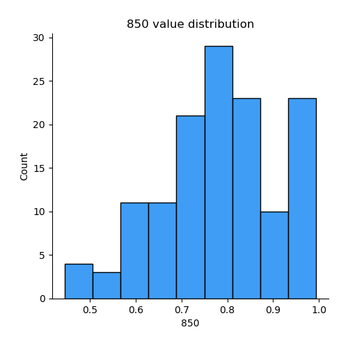
## Feature : 851
- **Feature type** : continous
- **Missing** : 0.0%
- **Unique** : 135
- **Count** :135.0
- **Mean** :0.5585339853478869
- **Std** :0.26525535231042946
- **Min** :-0.05927670401970678
- **25%th Percentile** : 0.37262770600243744
- **50%th Percentile** : 0.5371423737890869
- **75%th Percentile** : 0.7376870386652219
- **Max** :0.9929101086760419

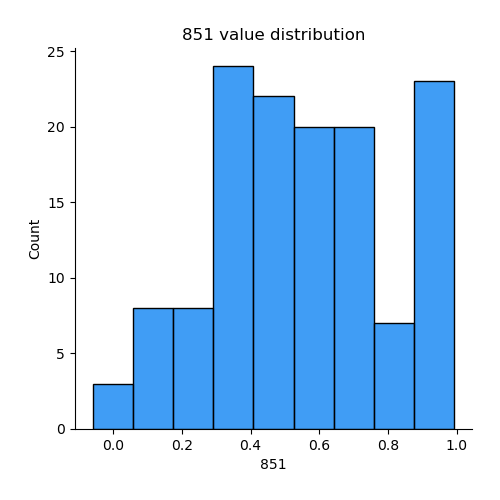
## Feature : 852
- **Feature type** : continous
- **Missing** : 0.0%
- **Unique** : 135
- **Count** :135.0
- **Mean** :0.7223174137605248
- **Std** :0.18352449220895017
- **Min** :0.17076225563754335
- **25%th Percentile** : 0.622295328722642
- **50%th Percentile** : 0.745353793329064
- **75%th Percentile** : 0.8332062934744275
- **Max** :0.9963532430919638

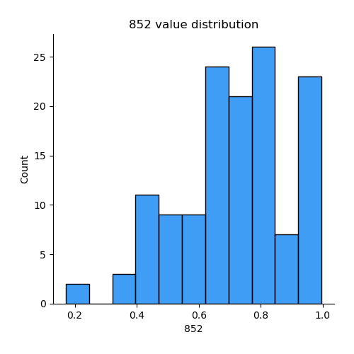
## Feature : 853
- **Feature type** : continous
- **Missing** : 0.0%
- **Unique** : 135
- **Count** :135.0
- **Mean** :0.7071656976386369
- **Std** :0.1938376161949095
- **Min** :0.09771056453136165
- **25%th Percentile** : 0.5892140468838769
- **50%th Percentile** : 0.7154765978463703
- **75%th Percentile** : 0.8419286181156636
- **Max** :0.9934194209350391

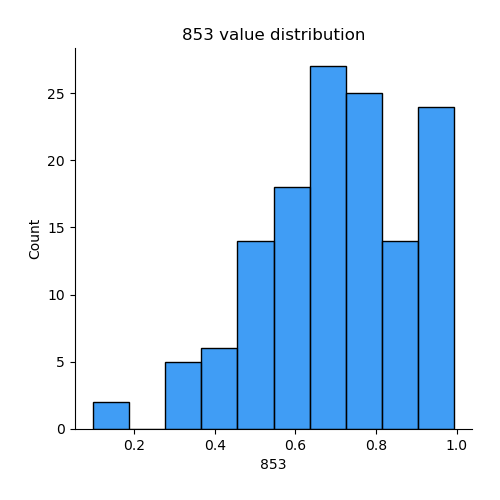
## Feature : 854
- **Feature type** : continous
- **Missing** : 0.0%
- **Unique** : 135
- **Count** :135.0
- **Mean** :0.6397922655675555
- **Std** :0.22319182345460575
- **Min** :0.0009457593371272423
- **25%th Percentile** : 0.5064974433457008
- **50%th Percentile** : 0.6358928660929759
- **75%th Percentile** : 0.7739926031655323
- **Max** :0.9913436058988573

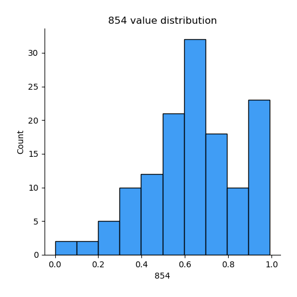
## Feature : 855
- **Feature type** : continous
- **Missing** : 0.0%
- **Unique** : 135
- **Count** :135.0
- **Mean** :0.7663602465408558
- **Std** :0.15586922454483768
- **Min** :0.2241169149265814
- **25%th Percentile** : 0.6765945793866515
- **50%th Percentile** : 0.7702438808403889
- **75%th Percentile** : 0.8615223981369797
- **Max** :0.9935730810813782

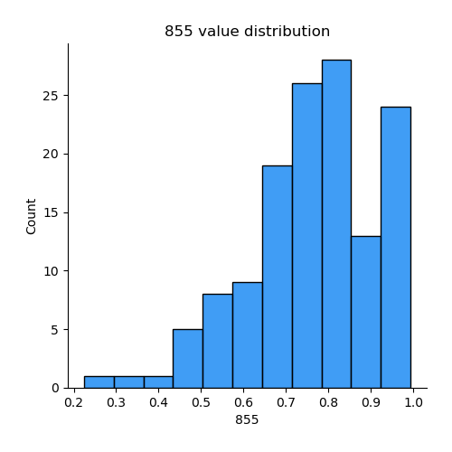
## Feature : 856
- **Feature type** : continous
- **Missing** : 0.0%
- **Unique** : 135
- **Count** :135.0
- **Mean** :0.42144089424607933
- **Std** :0.2968739699238097
- **Min** :-0.18289710840811957
- **25%th Percentile** : 0.23202021740665263
- **50%th Percentile** : 0.3802356376370944
- **75%th Percentile** : 0.5717643733857096
- **Max** :0.9837112780513991

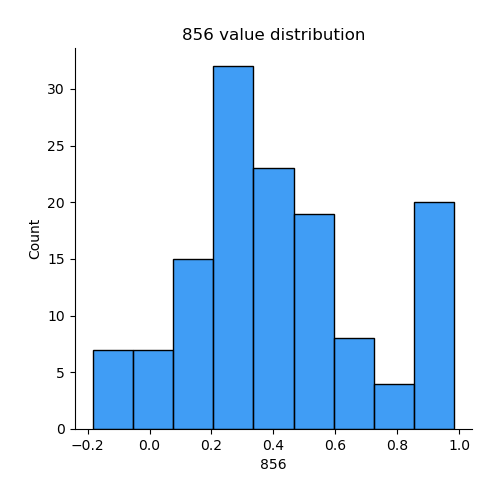
## Feature : 857
- **Feature type** : continous
- **Missing** : 0.0%
- **Unique** : 135
- **Count** :135.0
- **Mean** :0.6265191276868239
- **Std** :0.22770808037861312
- **Min** :0.022367998740495262
- **25%th Percentile** : 0.48725257234030167
- **50%th Percentile** : 0.6063155164942136
- **75%th Percentile** : 0.7979134861380381
- **Max** :0.9912635979511266

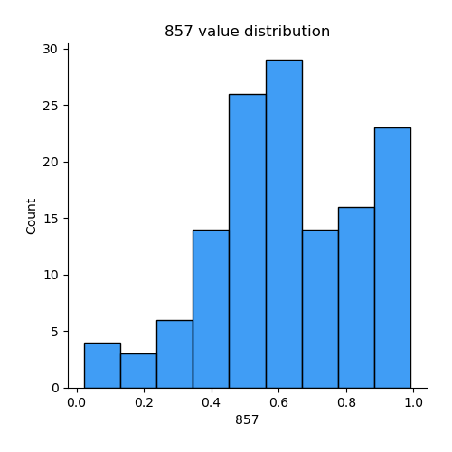
## Feature : 858
- **Feature type** : continous
- **Missing** : 0.0%
- **Unique** : 135
- **Count** :135.0
- **Mean** :0.5340305730800569
- **Std** :0.2892179979254009
- **Min** :-0.30823952515489933
- **25%th Percentile** : 0.3351272189824295
- **50%th Percentile** : 0.5543218588301416
- **75%th Percentile** : 0.7254595956575471
- **Max** :0.9886001336152932

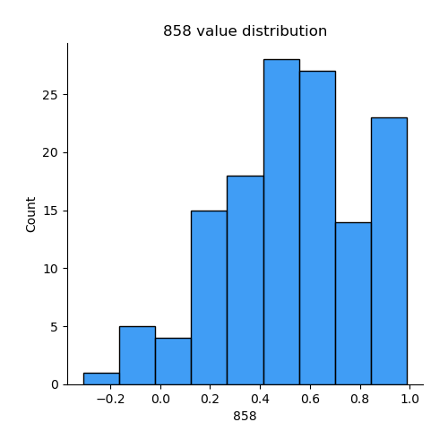
## Feature : 859
- **Feature type** : continous
- **Missing** : 0.0%
- **Unique** : 135
- **Count** :135.0
- **Mean** :0.7122146906308474
- **Std** :0.19605026655008737
- **Min** :0.1762229245927623
- **25%th Percentile** : 0.5943271704484682
- **50%th Percentile** : 0.7348606734004652
- **75%th Percentile** : 0.8330620325782345
- **Max** :0.9943174663791997

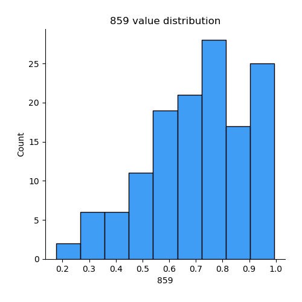
## Feature : 860
- **Feature type** : continous
- **Missing** : 0.0%
- **Unique** : 135
- **Count** :135.0
- **Mean** :0.6334460952485421
- **Std** :0.20746314056846524
- **Min** :0.08325168446935494
- **25%th Percentile** : 0.4954054817585948
- **50%th Percentile** : 0.6130982179584846
- **75%th Percentile** : 0.778988150476734
- **Max** :0.9871032907947823

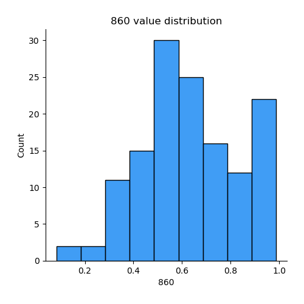
## Feature : 861
- **Feature type** : continous
- **Missing** : 0.0%
- **Unique** : 135
- **Count** :135.0
- **Mean** :0.41558396836835904
- **Std** :0.29575265209435997
- **Min** :-0.21836355647052727
- **25%th Percentile** : 0.17718988475903058
- **50%th Percentile** : 0.39495191046225303
- **75%th Percentile** : 0.5996653530848073
- **Max** :0.9809266309646674

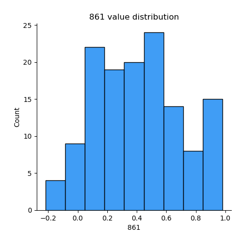
## Feature : 862
- **Feature type** : continous
- **Missing** : 0.0%
- **Unique** : 135
- **Count** :135.0
- **Mean** :0.577365120111077
- **Std** :0.25534634113855964
- **Min** :-0.015456802353567153
- **25%th Percentile** : 0.4040898093040504
- **50%th Percentile** : 0.5727695295967206
- **75%th Percentile** : 0.7409987717457117
- **Max** :0.9909341119434896

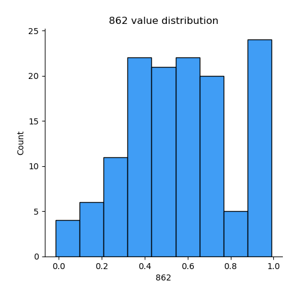
## Feature : 863
- **Feature type** : continous
- **Missing** : 0.0%
- **Unique** : 135
- **Count** :135.0
- **Mean** :0.6779040466013269
- **Std** :0.19828755540154264
- **Min** :0.18839674882644494
- **25%th Percentile** : 0.5438224317854885
- **50%th Percentile** : 0.6654934338147573
- **75%th Percentile** : 0.8076541781922493
- **Max** :0.9929272767399407

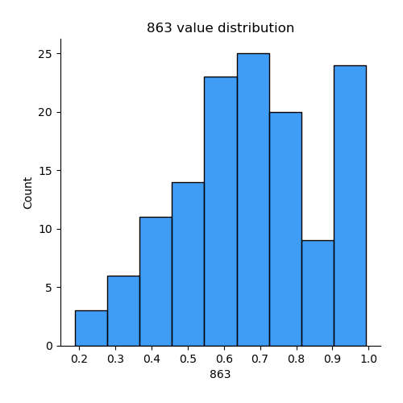
## Feature : 864
- **Feature type** : continous
- **Missing** : 0.0%
- **Unique** : 135
- **Count** :135.0
- **Mean** :0.5439599512574798
- **Std** :0.27595928063657094
- **Min** :-0.14760950164771244
- **25%th Percentile** : 0.3547150467999053
- **50%th Percentile** : 0.541114590043699
- **75%th Percentile** : 0.7026193926546331
- **Max** :0.9903176461675726

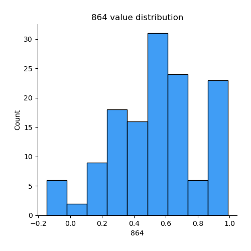
## Feature : 865
- **Feature type** : continous
- **Missing** : 0.0%
- **Unique** : 135
- **Count** :135.0
- **Mean** :0.6638580775932623
- **Std** :0.21974602439189694
- **Min** :0.13939224453694005
- **25%th Percentile** : 0.4854738094430016
- **50%th Percentile** : 0.6866336518823705
- **75%th Percentile** : 0.8012744580883608
- **Max** :0.9932595978869991

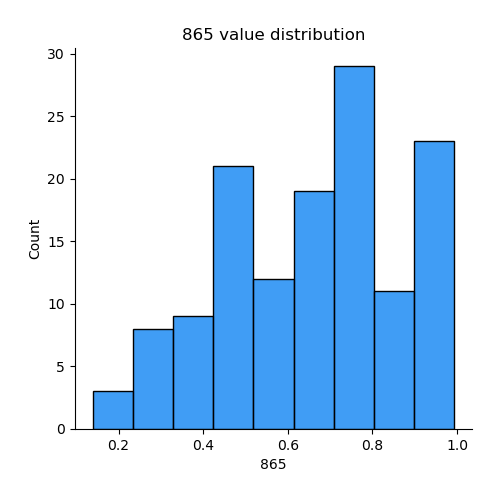
## Feature : 866
- **Feature type** : continous
- **Missing** : 0.0%
- **Unique** : 135
- **Count** :135.0
- **Mean** :0.7091646474725067
- **Std** :0.17009076088700142
- **Min** :0.28244513311005887
- **25%th Percentile** : 0.5893714568639161
- **50%th Percentile** : 0.6919066242329897
- **75%th Percentile** : 0.8235426525399516
- **Max** :0.9895002371615679

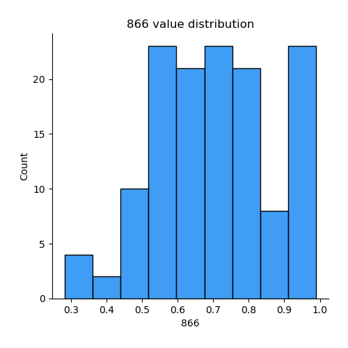
## Feature : 867
- **Feature type** : continous
- **Missing** : 0.0%
- **Unique** : 135
- **Count** :135.0
- **Mean** :0.5543485449658561
- **Std** :0.2548163676962944
- **Min** :-0.1921476575753514
- **25%th Percentile** : 0.39236685330451704
- **50%th Percentile** : 0.5344713873657951
- **75%th Percentile** : 0.7049398850824243
- **Max** :0.9841387999685037

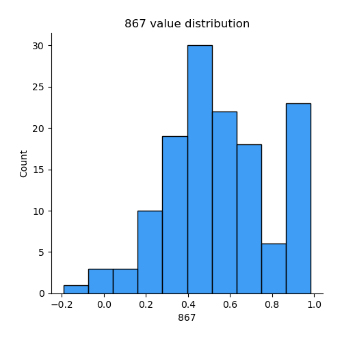
## Feature : 868
- **Feature type** : continous
- **Missing** : 0.0%
- **Unique** : 135
- **Count** :135.0
- **Mean** :0.6231074985768628
- **Std** :0.2239716250462218
- **Min** :-0.07433454110388155
- **25%th Percentile** : 0.48379374934457126
- **50%th Percentile** : 0.6043019149357389
- **75%th Percentile** : 0.7846871981364789
- **Max** :0.992670328198691

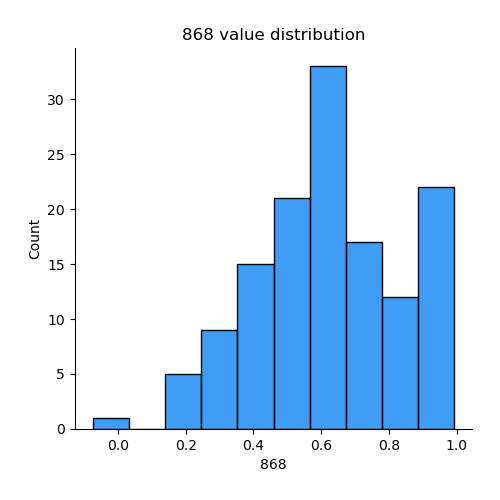
## Feature : 869
- **Feature type** : continous
- **Missing** : 0.0%
- **Unique** : 135
- **Count** :135.0
- **Mean** :0.5746350208841398
- **Std** :0.26600579499552035
- **Min** :-0.16179858288619825
- **25%th Percentile** : 0.41164169606925294
- **50%th Percentile** : 0.5860004214978539
- **75%th Percentile** : 0.7325704189450064
- **Max** :0.9918958481509691

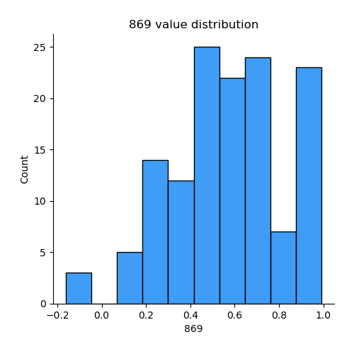
## Feature : 870
- **Feature type** : continous
- **Missing** : 0.0%
- **Unique** : 135
- **Count** :135.0
- **Mean** :0.6686999824301457
- **Std** :0.22200671742981185
- **Min** :-0.049557644777936456
- **25%th Percentile** : 0.52948838662787
- **50%th Percentile** : 0.67466966350215
- **75%th Percentile** : 0.8073634104643079
- **Max** :0.9935978012068909

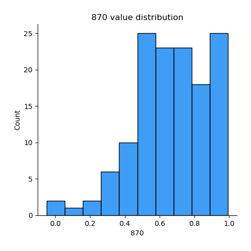
## Feature : 871
- **Feature type** : continous
- **Missing** : 0.0%
- **Unique** : 135
- **Count** :135.0
- **Mean** :0.5098886362622463
- **Std** :0.2777305838140057
- **Min** :-0.11599086884270067
- **25%th Percentile** : 0.31317917298226294
- **50%th Percentile** : 0.4775482512158552
- **75%th Percentile** : 0.6710898520382127
- **Max** :0.9886830339315126

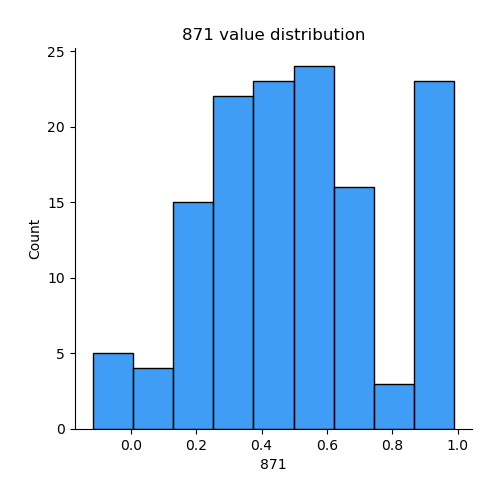
## Feature : 872
- **Feature type** : continous
- **Missing** : 0.0%
- **Unique** : 135
- **Count** :135.0
- **Mean** :0.5976808260651097
- **Std** :0.22021310605079772
- **Min** :-0.04037581160278331
- **25%th Percentile** : 0.46687220996874657
- **50%th Percentile** : 0.5908762295291897
- **75%th Percentile** : 0.7454503329704243
- **Max** :0.9910648884112992

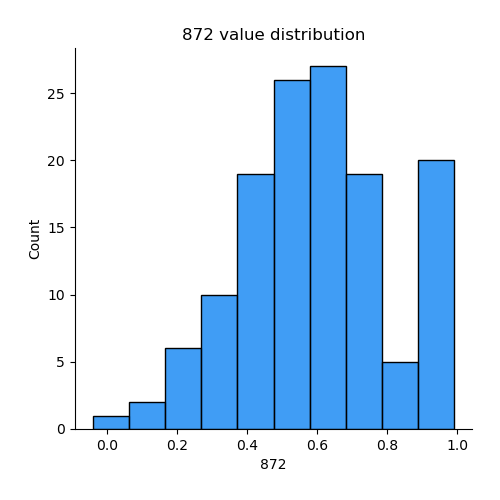
## Feature : 873
- **Feature type** : continous
- **Missing** : 0.0%
- **Unique** : 135
- **Count** :135.0
- **Mean** :0.6645169104177455
- **Std** :0.22328174522670086
- **Min** :0.08407547705287385
- **25%th Percentile** : 0.5135144652733137
- **50%th Percentile** : 0.6616590028417352
- **75%th Percentile** : 0.8199723337699616
- **Max** :0.9930804909164364

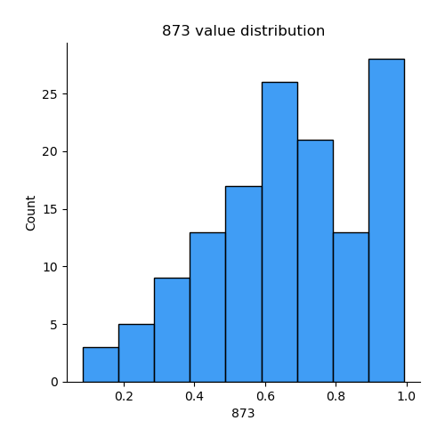
## Feature : 874
- **Feature type** : continous
- **Missing** : 0.0%
- **Unique** : 135
- **Count** :135.0
- **Mean** :0.8989706168808503
- **Std** :0.07940887937757549
- **Min** :0.5956301412882798
- **25%th Percentile** : 0.8574324346995301
- **50%th Percentile** : 0.9117141162157207
- **75%th Percentile** : 0.9528729907623406
- **Max** :0.9982438801711344

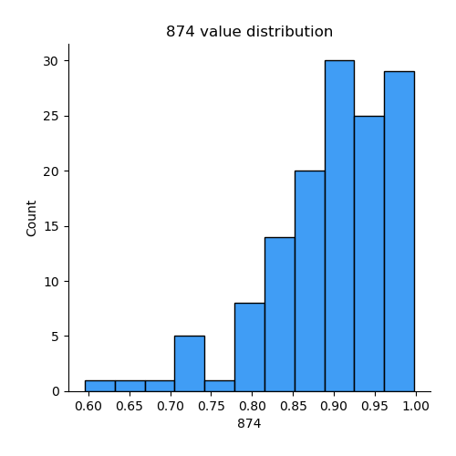
## Feature : 875
- **Feature type** : continous
- **Missing** : 0.0%
- **Unique** : 135
- **Count** :135.0
- **Mean** :0.6988242669471144
- **Std** :0.20665261947897826
- **Min** :0.07152071922454889
- **25%th Percentile** : 0.5485606016734943
- **50%th Percentile** : 0.7152339706583284
- **75%th Percentile** : 0.8435515705542245
- **Max** :0.994679463244651

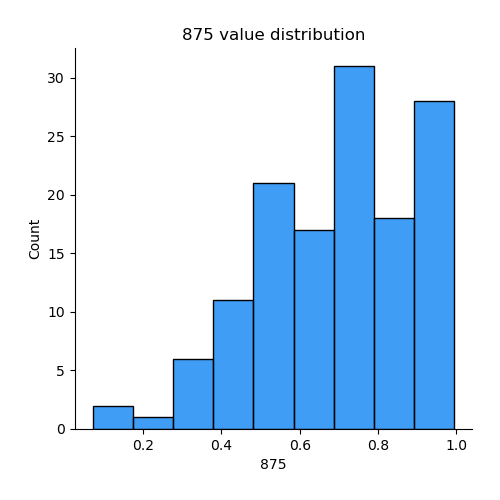
## Feature : 876
- **Feature type** : continous
- **Missing** : 0.0%
- **Unique** : 135
- **Count** :135.0
- **Mean** :0.7721020324010287
- **Std** :0.14418031035686282
- **Min** :0.3499403787071443
- **25%th Percentile** : 0.6887887158915438
- **50%th Percentile** : 0.7824261045936026
- **75%th Percentile** : 0.8524859396093938
- **Max** :0.9935006545889087

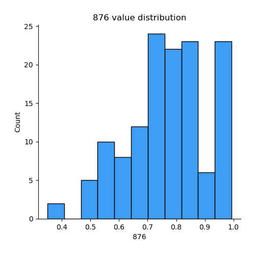
## Feature : 877
- **Feature type** : continous
- **Missing** : 0.0%
- **Unique** : 135
- **Count** :135.0
- **Mean** :0.5328362991465907
- **Std** :0.2680514123620998
- **Min** :-0.034015457494588903
- **25%th Percentile** : 0.3360198721773681
- **50%th Percentile** : 0.4884462105260696
- **75%th Percentile** : 0.7026716208777749
- **Max** :0.9893888560252327

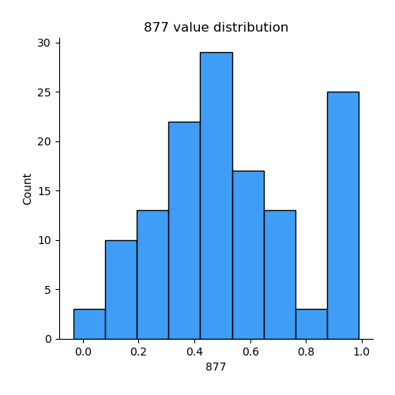
## Feature : 878
- **Feature type** : continous
- **Missing** : 0.0%
- **Unique** : 135
- **Count** :135.0
- **Mean** :0.7166414089279708
- **Std** :0.1914695255655104
- **Min** :0.13233715923613587
- **25%th Percentile** : 0.6122312302918377
- **50%th Percentile** : 0.7346769021051637
- **75%th Percentile** : 0.8248023764616735
- **Max** :0.9959296817197574

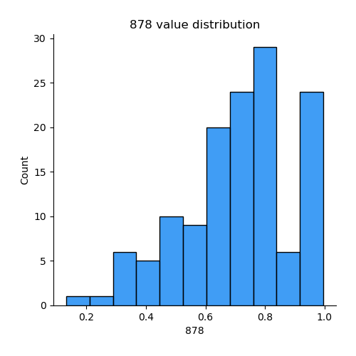
## Feature : 879
- **Feature type** : continous
- **Missing** : 0.0%
- **Unique** : 135
- **Count** :135.0
- **Mean** :0.6955426091607592
- **Std** :0.20182163912761486
- **Min** :-0.0733422945121022
- **25%th Percentile** : 0.5607932262430916
- **50%th Percentile** : 0.7059723419238233
- **75%th Percentile** : 0.8312283348582288
- **Max** :0.9930814980193107

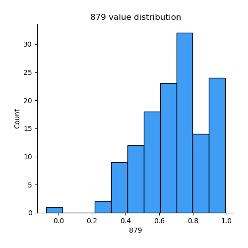
## Feature : 880
- **Feature type** : continous
- **Missing** : 0.0%
- **Unique** : 135
- **Count** :135.0
- **Mean** :0.6144165824144199
- **Std** :0.2477883206994002
- **Min** :-0.20195483685770474
- **25%th Percentile** : 0.43450279988383633
- **50%th Percentile** : 0.6299504549201076
- **75%th Percentile** : 0.7809842845009076
- **Max** :0.991989168518647

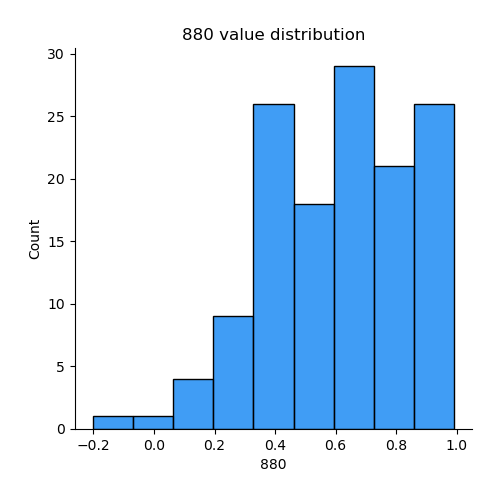
## Feature : 881
- **Feature type** : continous
- **Missing** : 0.0%
- **Unique** : 135
- **Count** :135.0
- **Mean** :0.7182456613095406
- **Std** :0.19191739989710038
- **Min** :0.17937275180099319
- **25%th Percentile** : 0.6041867633484168
- **50%th Percentile** : 0.7331739943864296
- **75%th Percentile** : 0.8450989259962871
- **Max** :0.9920742049317545

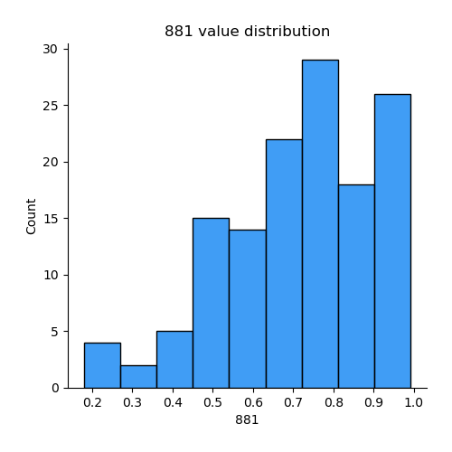
## Feature : 882
- **Feature type** : continous
- **Missing** : 0.0%
- **Unique** : 135
- **Count** :135.0
- **Mean** :0.40404109227526197
- **Std** :0.30372275770510376
- **Min** :-0.41971629901413215
- **25%th Percentile** : 0.20241126794572809
- **50%th Percentile** : 0.390602858521096
- **75%th Percentile** : 0.547890661745291
- **Max** :0.9840317716619368

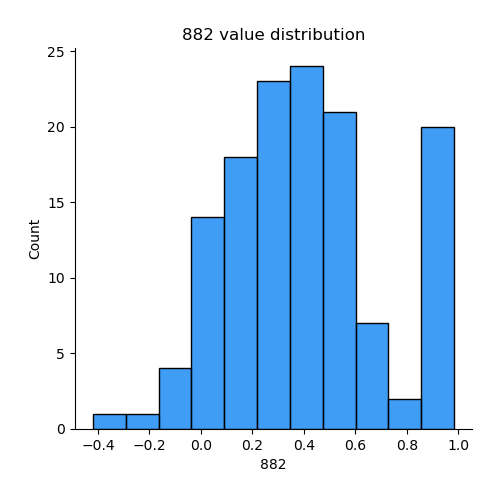
## Feature : 883
- **Feature type** : continous
- **Missing** : 0.0%
- **Unique** : 135
- **Count** :135.0
- **Mean** :0.5551443843147893
- **Std** :0.26839329161370845
- **Min** :-0.28455789691604516
- **25%th Percentile** : 0.37294034537764464
- **50%th Percentile** : 0.5640474963992865
- **75%th Percentile** : 0.7328833542002327
- **Max** :0.99032251304908

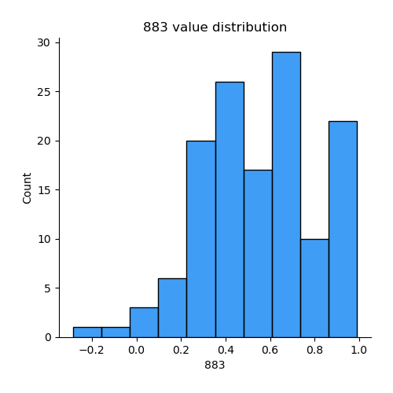
## Feature : 901
- **Feature type** : continous
- **Missing** : 0.0%
- **Unique** : 3
- **Count** :135.0
- **Mean** :1.0
- **Std** :8.631779546943986e-17
- **Min** :0.9999999999999998
- **25%th Percentile** : 0.9999999999999999
- **50%th Percentile** : 1.0
- **75%th Percentile** : 1.0
- **Max** :1.0

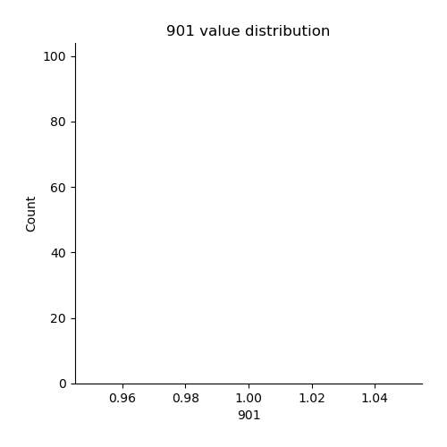
## Feature : 902
- **Feature type** : continous
- **Missing** : 0.0%
- **Unique** : 135
- **Count** :135.0
- **Mean** :0.697924753792834
- **Std** :0.18312737375900248
- **Min** :0.08952977142183192
- **25%th Percentile** : 0.5823180788976647
- **50%th Percentile** : 0.6964752707032464
- **75%th Percentile** : 0.8052962829068004
- **Max** :0.992629917667216

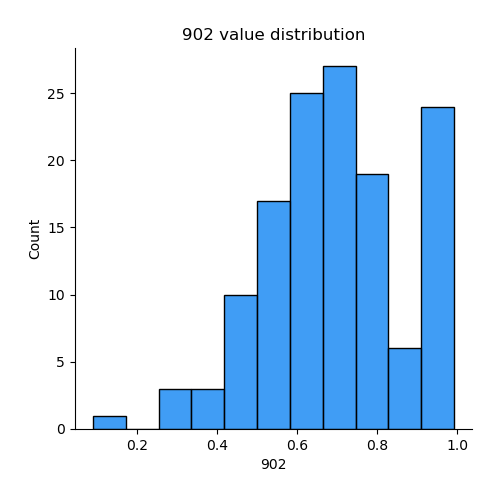
## Feature : 903
- **Feature type** : continous
- **Missing** : 0.0%
- **Unique** : 135
- **Count** :135.0
- **Mean** :0.4919503007697977
- **Std** :0.3066211682206307
- **Min** :-0.2381277585848434
- **25%th Percentile** : 0.27906421419889615
- **50%th Percentile** : 0.4816801944606885
- **75%th Percentile** : 0.6720815080120177
- **Max** :0.9920115881044714

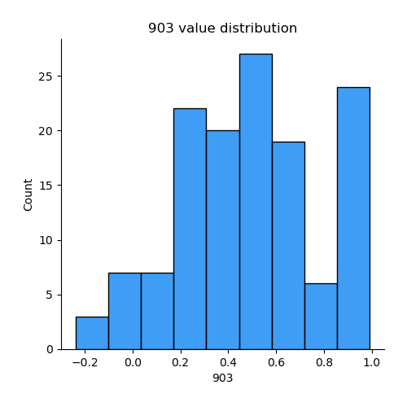
## Feature : 904
- **Feature type** : continous
- **Missing** : 0.0%
- **Unique** : 135
- **Count** :135.0
- **Mean** :0.7658457065414626
- **Std** :0.16975367543518374
- **Min** :0.20625158438136454
- **25%th Percentile** : 0.6693648652612412
- **50%th Percentile** : 0.7930223865789043
- **75%th Percentile** : 0.8806325539106892
- **Max** :0.9976887646094286

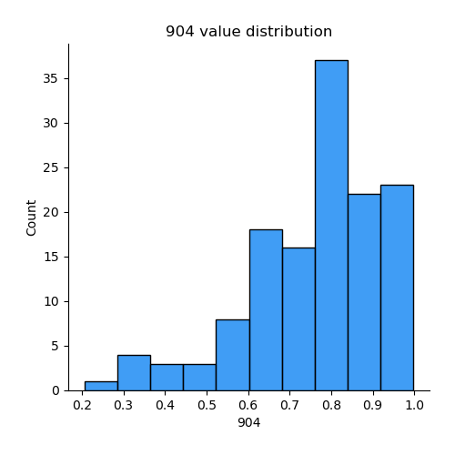
## Feature : 905
- **Feature type** : continous
- **Missing** : 0.0%
- **Unique** : 135
- **Count** :135.0
- **Mean** :0.8049991646128637
- **Std** :0.12514230006310778
- **Min** :0.39737730756892325
- **25%th Percentile** : 0.7367965055608633
- **50%th Percentile** : 0.8171536034973836
- **75%th Percentile** : 0.8657328194847227
- **Max** :0.9972516936908961

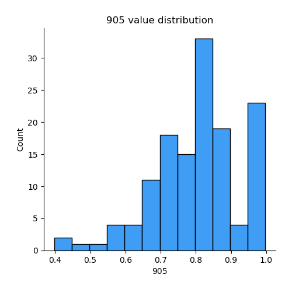
## Feature : 906
- **Feature type** : continous
- **Missing** : 0.0%
- **Unique** : 135
- **Count** :135.0
- **Mean** :0.642127467108986
- **Std** :0.24480516636662877
- **Min** :-0.17367598954508046
- **25%th Percentile** : 0.4914769590000467
- **50%th Percentile** : 0.663654936307181
- **75%th Percentile** : 0.814461396682431
- **Max** :0.9934091312480976

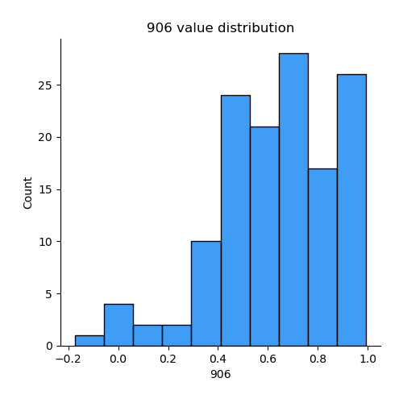
## Feature : 907
- **Feature type** : continous
- **Missing** : 0.0%
- **Unique** : 135
- **Count** :135.0
- **Mean** :0.7859355364068639
- **Std** :0.13739296563913278
- **Min** :0.4262962380498408
- **25%th Percentile** : 0.6987522563507336
- **50%th Percentile** : 0.7870544884186577
- **75%th Percentile** : 0.8722167649681343
- **Max** :0.9970113131773118

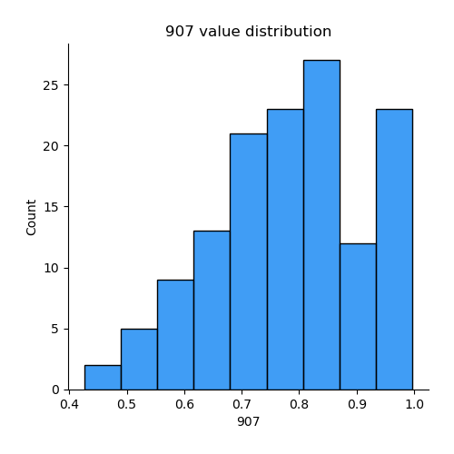
## Feature : 908
- **Feature type** : continous
- **Missing** : 0.0%
- **Unique** : 135
- **Count** :135.0
- **Mean** :0.3802742285502218
- **Std** :0.3123856435789063
- **Min** :-0.3804795908531083
- **25%th Percentile** : 0.16104333052181194
- **50%th Percentile** : 0.3443992773909758
- **75%th Percentile** : 0.4968464271235025
- **Max** :0.9854491551303618

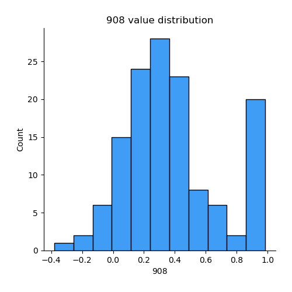
## Feature : 909
- **Feature type** : continous
- **Missing** : 0.0%
- **Unique** : 135
- **Count** :135.0
- **Mean** :0.6027263501630762
- **Std** :0.24990813200788686
- **Min** :-0.17310742843144888
- **25%th Percentile** : 0.4422394315047292
- **50%th Percentile** : 0.6077881149911329
- **75%th Percentile** : 0.7618136031478839
- **Max** :0.9909237633036934

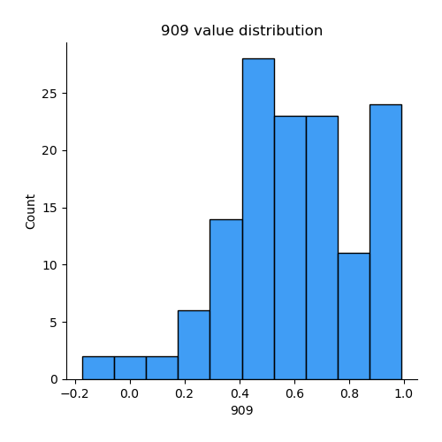
## Feature : 910
- **Feature type** : continous
- **Missing** : 0.0%
- **Unique** : 135
- **Count** :135.0
- **Mean** :0.524445020396517
- **Std** :0.30862727835974263
- **Min** :-0.5227850247524365
- **25%th Percentile** : 0.31605655576852165
- **50%th Percentile** : 0.5294635863779565
- **75%th Percentile** : 0.7222859236456474
- **Max** :0.9957804078914165

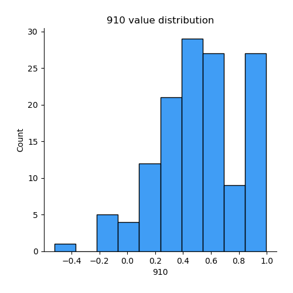
## Feature : 911
- **Feature type** : continous
- **Missing** : 0.0%
- **Unique** : 135
- **Count** :135.0
- **Mean** :0.669692903924363
- **Std** :0.2065096661992841
- **Min** :-0.020756393401300262
- **25%th Percentile** : 0.543398149275562
- **50%th Percentile** : 0.6752676226015695
- **75%th Percentile** : 0.796172131896306
- **Max** :0.9951634126449938

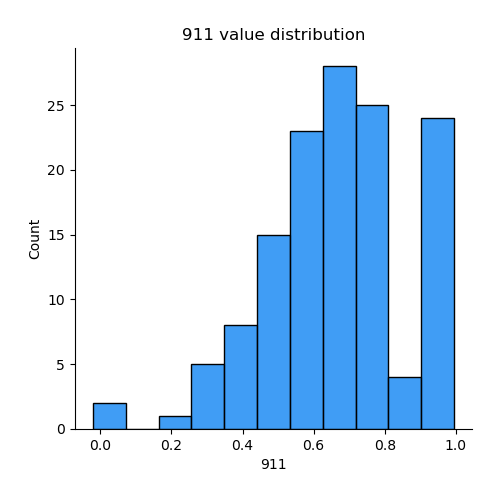
## Feature : 912
- **Feature type** : continous
- **Missing** : 0.0%
- **Unique** : 135
- **Count** :135.0
- **Mean** :0.6244836707055398
- **Std** :0.22632607361593426
- **Min** :0.05613102523302117
- **25%th Percentile** : 0.43910028033846993
- **50%th Percentile** : 0.6449812714266672
- **75%th Percentile** : 0.7832980163253764
- **Max** :0.9924544240195585

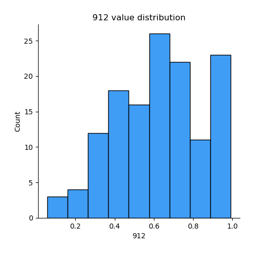
## Feature : 913
- **Feature type** : continous
- **Missing** : 0.0%
- **Unique** : 135
- **Count** :135.0
- **Mean** :0.37573765020432903
- **Std** :0.3072815747546668
- **Min** :-0.20751701301355888
- **25%th Percentile** : 0.1229892827670474
- **50%th Percentile** : 0.34733372145850533
- **75%th Percentile** : 0.5448777591640066
- **Max** :0.9833629080760755

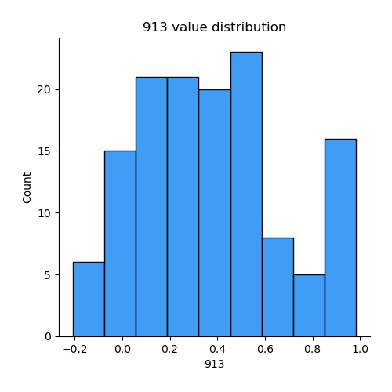
## Feature : 914
- **Feature type** : continous
- **Missing** : 0.0%
- **Unique** : 135
- **Count** :135.0
- **Mean** :0.5649562445223935
- **Std** :0.2761995791966298
- **Min** :-0.0965388691560906
- **25%th Percentile** : 0.38001239807918974
- **50%th Percentile** : 0.6024027476276973
- **75%th Percentile** : 0.7484322717426994
- **Max** :0.9947697392287042

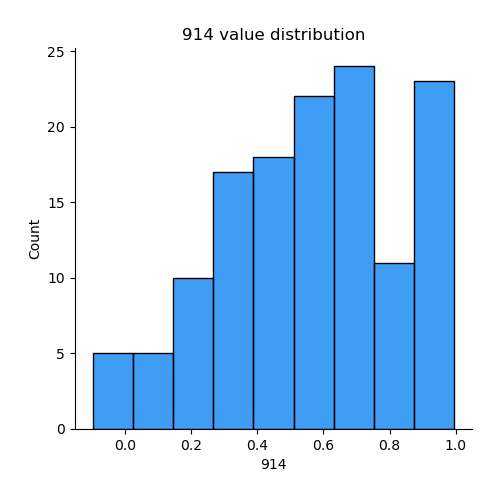
## Feature : 915
- **Feature type** : continous
- **Missing** : 0.0%
- **Unique** : 135
- **Count** :135.0
- **Mean** :0.5953688604733788
- **Std** :0.25539022866173416
- **Min** :-0.19555305232553707
- **25%th Percentile** : 0.42896093892045273
- **50%th Percentile** : 0.6124570263951504
- **75%th Percentile** : 0.7618704495009928
- **Max** :0.9949208757229856

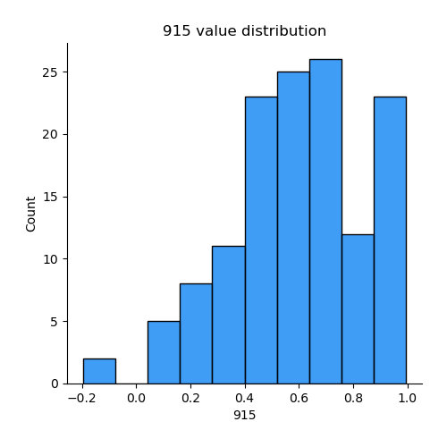
## Feature : 916
- **Feature type** : continous
- **Missing** : 0.0%
- **Unique** : 135
- **Count** :135.0
- **Mean** :0.5176274366176522
- **Std** :0.3029134426305196
- **Min** :-0.33358130380884987
- **25%th Percentile** : 0.318940132838051
- **50%th Percentile** : 0.5276416125127164
- **75%th Percentile** : 0.7172110261290496
- **Max** :0.9949670594178429

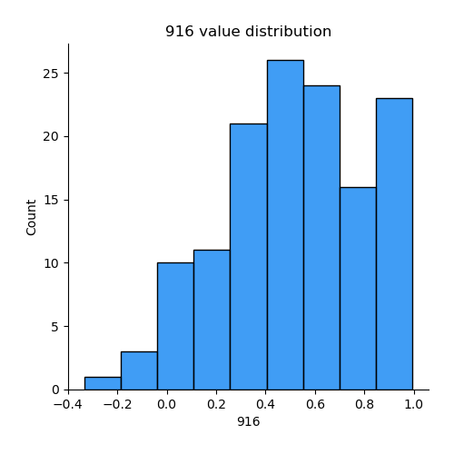
## Feature : 917
- **Feature type** : continous
- **Missing** : 0.0%
- **Unique** : 135
- **Count** :135.0
- **Mean** :0.6702800086311467
- **Std** :0.22622899641256825
- **Min** :-0.019768516358309483
- **25%th Percentile** : 0.5418810856273392
- **50%th Percentile** : 0.6978045650553794
- **75%th Percentile** : 0.8170618054784045
- **Max** :0.9969771091308431

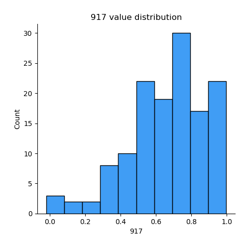
## Feature : 918
- **Feature type** : continous
- **Missing** : 0.0%
- **Unique** : 135
- **Count** :135.0
- **Mean** :0.5760657949179473
- **Std** :0.2470998853100475
- **Min** :-0.09521771928492323
- **25%th Percentile** : 0.4201499464766049
- **50%th Percentile** : 0.5547008580120677
- **75%th Percentile** : 0.7465683215106325
- **Max** :0.9894016821040356

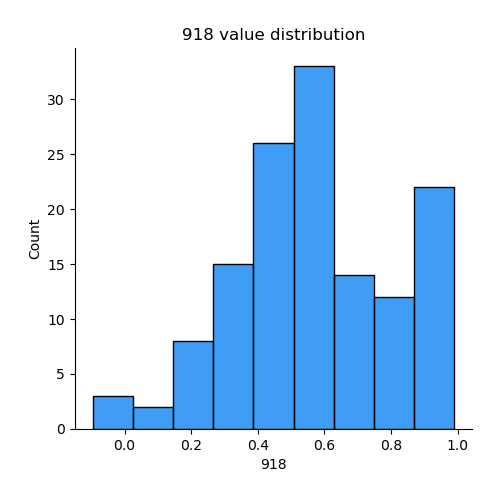
## Feature : 919
- **Feature type** : continous
- **Missing** : 0.0%
- **Unique** : 135
- **Count** :135.0
- **Mean** :0.5505764372669579
- **Std** :0.27043400068559736
- **Min** :-0.11256275599655757
- **25%th Percentile** : 0.3355343852488314
- **50%th Percentile** : 0.5632465045271319
- **75%th Percentile** : 0.7279023131068023
- **Max** :0.9887345725678646

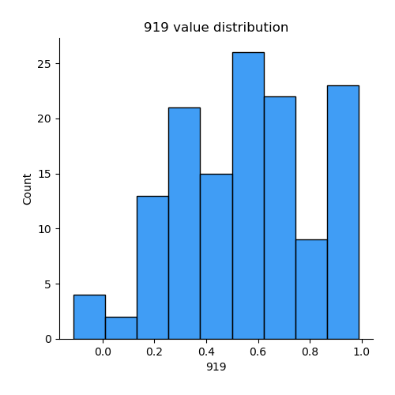
## Feature : 920
- **Feature type** : continous
- **Missing** : 0.0%
- **Unique** : 135
- **Count** :135.0
- **Mean** :0.5921187033783148
- **Std** :0.2523129246018118
- **Min** :-0.05428223536479214
- **25%th Percentile** : 0.4067476085360947
- **50%th Percentile** : 0.5858100393622612
- **75%th Percentile** : 0.7766707830768591
- **Max** :0.9947579997071688

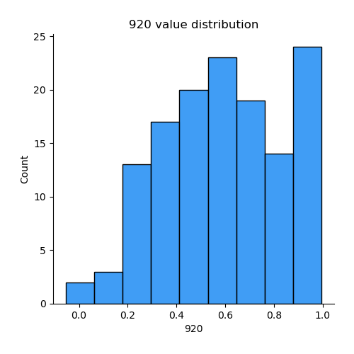
## Feature : 921
- **Feature type** : continous
- **Missing** : 0.0%
- **Unique** : 135
- **Count** :135.0
- **Mean** :0.4948289839314744
- **Std** :0.3292598701535509
- **Min** :-0.335809476287369
- **25%th Percentile** : 0.27797220993830485
- **50%th Percentile** : 0.5125134537959535
- **75%th Percentile** : 0.6988147167098266
- **Max** :0.9943774739957001

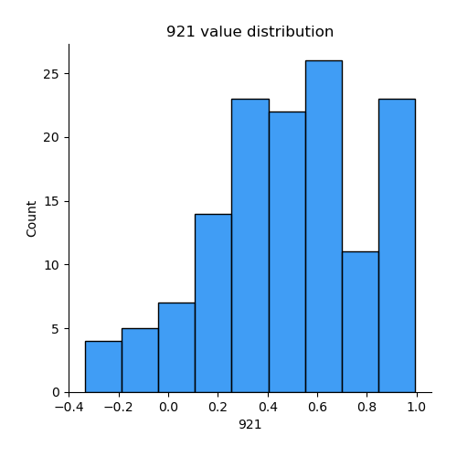
## Feature : 922
- **Feature type** : continous
- **Missing** : 0.0%
- **Unique** : 135
- **Count** :135.0
- **Mean** :0.8217410187425188
- **Std** :0.13911237797259843
- **Min** :0.19189016037091058
- **25%th Percentile** : 0.7416828996998323
- **50%th Percentile** : 0.8480324423874707
- **75%th Percentile** : 0.9143940155554335
- **Max** :0.9977994614265715

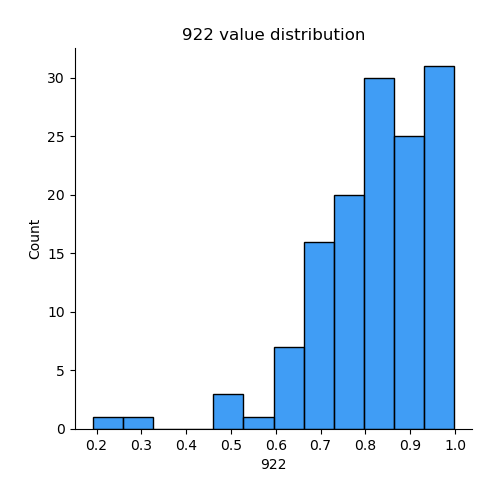
## Feature : 923
- **Feature type** : continous
- **Missing** : 0.0%
- **Unique** : 135
- **Count** :135.0
- **Mean** :0.46652206696245424
- **Std** :0.3043198770670239
- **Min** :-0.29007818005832986
- **25%th Percentile** : 0.24482233962045863
- **50%th Percentile** : 0.45621267562827433
- **75%th Percentile** : 0.6303897048109317
- **Max** :0.9927070831606343

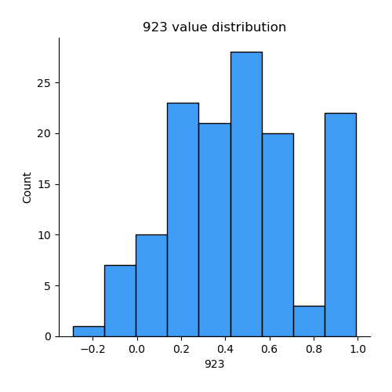
## Feature : 924
- **Feature type** : continous
- **Missing** : 0.0%
- **Unique** : 135
- **Count** :135.0
- **Mean** :0.5297419853434671
- **Std** :0.2727252880359698
- **Min** :-0.3932730926025578
- **25%th Percentile** : 0.3465629462863753
- **50%th Percentile** : 0.5023532464897864
- **75%th Percentile** : 0.7147777770847963
- **Max** :0.989178193022039

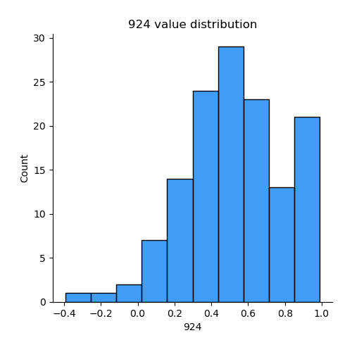
## Feature : 925
- **Feature type** : continous
- **Missing** : 0.0%
- **Unique** : 135
- **Count** :135.0
- **Mean** :0.8489764239425346
- **Std** :0.1555717762401045
- **Min** :0.020654585949020424
- **25%th Percentile** : 0.8096541319236352
- **50%th Percentile** : 0.8896589958735007
- **75%th Percentile** : 0.9332193645674558
- **Max** :0.9980691689285877

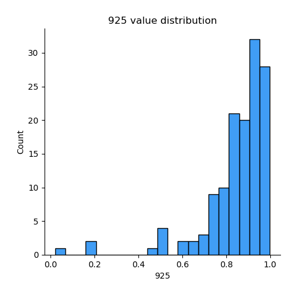
## Feature : 926
- **Feature type** : continous
- **Missing** : 0.0%
- **Unique** : 135
- **Count** :135.0
- **Mean** :0.7228788887354807
- **Std** :0.178725855635379
- **Min** :0.0673138292986811
- **25%th Percentile** : 0.6211400395075822
- **50%th Percentile** : 0.724679229989518
- **75%th Percentile** : 0.841678129412827
- **Max** :0.9966431951820822

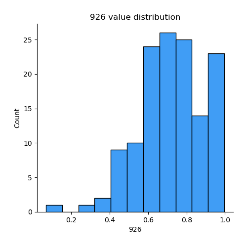
## Feature : 927
- **Feature type** : continous
- **Missing** : 0.0%
- **Unique** : 135
- **Count** :135.0
- **Mean** :0.8883318189415915
- **Std** :0.1348587781962808
- **Min** :0.16106569004359939
- **25%th Percentile** : 0.8633887835939549
- **50%th Percentile** : 0.9280467754875951
- **75%th Percentile** : 0.9626650999309292
- **Max** :0.9994572938364124

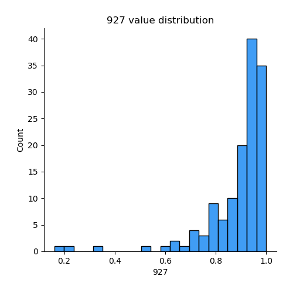
## Feature : 928
- **Feature type** : continous
- **Missing** : 0.0%
- **Unique** : 135
- **Count** :135.0
- **Mean** :0.6928391852135825
- **Std** :0.18786597847283246
- **Min** :0.15249351843640038
- **25%th Percentile** : 0.5741321365687477
- **50%th Percentile** : 0.696954350592695
- **75%th Percentile** : 0.8004864570263972
- **Max** :0.9912019694615186

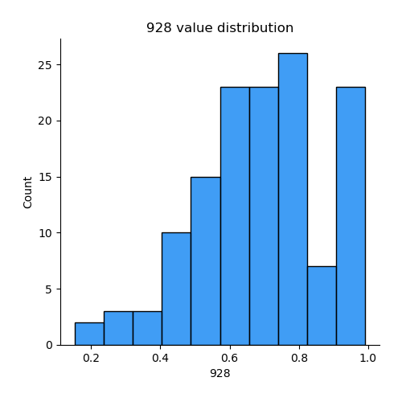
## Feature : 929
- **Feature type** : continous
- **Missing** : 0.0%
- **Unique** : 135
- **Count** :135.0
- **Mean** :0.4599838482443576
- **Std** :0.3130161117134255
- **Min** :-0.263102303383592
- **25%th Percentile** : 0.23757567689644496
- **50%th Percentile** : 0.4395181384112486
- **75%th Percentile** : 0.6262129632003548
- **Max** :0.9900966564853322

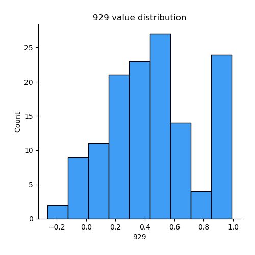
## Feature : 930
- **Feature type** : continous
- **Missing** : 0.0%
- **Unique** : 135
- **Count** :135.0
- **Mean** :0.7328994860039271
- **Std** :0.19561888321601187
- **Min** :-0.0820958089740822
- **25%th Percentile** : 0.6259269558345739
- **50%th Percentile** : 0.746386243460464
- **75%th Percentile** : 0.8553776208642985
- **Max** :0.9975030094681927

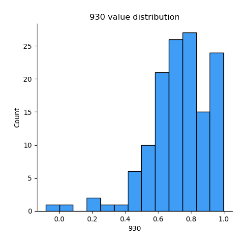
## Feature : 931
- **Feature type** : continous
- **Missing** : 0.0%
- **Unique** : 135
- **Count** :135.0
- **Mean** :0.7773057962158597
- **Std** :0.1542152981845289
- **Min** :0.2927078255781025
- **25%th Percentile** : 0.6776386575285023
- **50%th Percentile** : 0.8099477534674
- **75%th Percentile** : 0.8707009438886316
- **Max** :0.9977970386291297

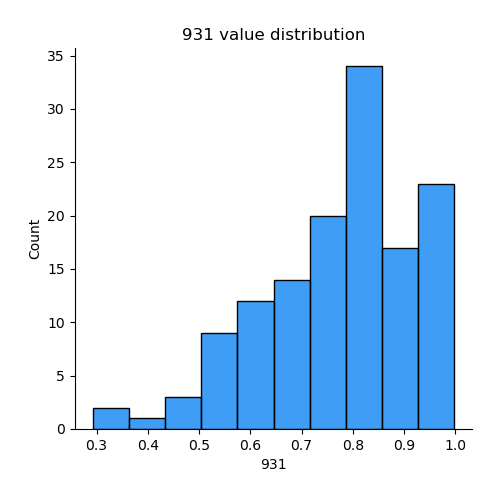
## Feature : 932
- **Feature type** : continous
- **Missing** : 0.0%
- **Unique** : 135
- **Count** :135.0
- **Mean** :0.5845429349541986
- **Std** :0.2930456880708374
- **Min** :-0.40651281586098037
- **25%th Percentile** : 0.409842874771086
- **50%th Percentile** : 0.6158767194395184
- **75%th Percentile** : 0.7985276480259849
- **Max** :0.9943585465967407

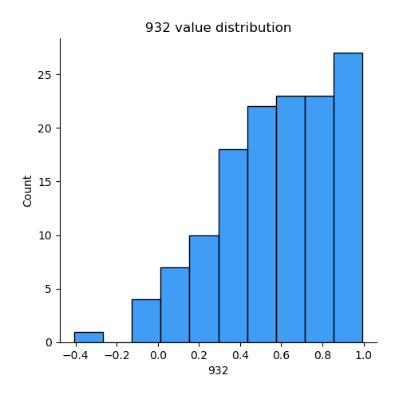
## Feature : 933
- **Feature type** : continous
- **Missing** : 0.0%
- **Unique** : 135
- **Count** :135.0
- **Mean** :0.750026705691015
- **Std** :0.18406621638572804
- **Min** :0.14910983263753194
- **25%th Percentile** : 0.6651809128526294
- **50%th Percentile** : 0.777202880740141
- **75%th Percentile** : 0.8615869751602089
- **Max** :0.9973418298205897

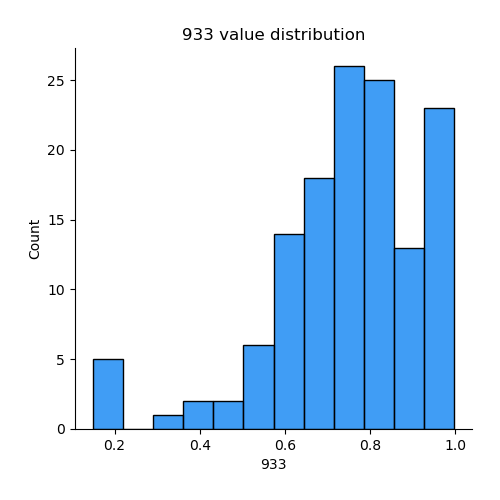
## Feature : 934
- **Feature type** : continous
- **Missing** : 0.0%
- **Unique** : 135
- **Count** :135.0
- **Mean** :0.3604110325196434
- **Std** :0.31652795569026143
- **Min** :-0.5653825030930694
- **25%th Percentile** : 0.16964663167024185
- **50%th Percentile** : 0.27888440205590864
- **75%th Percentile** : 0.5168308576925864
- **Max** :0.9846358875866789

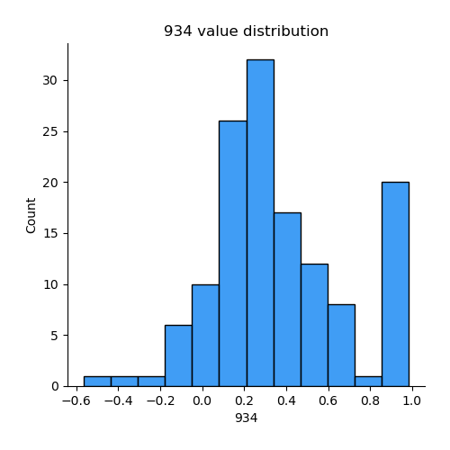
## Feature : 935
- **Feature type** : continous
- **Missing** : 0.0%
- **Unique** : 135
- **Count** :135.0
- **Mean** :0.4990980632102148
- **Std** :0.3011695236916099
- **Min** :-0.49779999010900156
- **25%th Percentile** : 0.276826396371186
- **50%th Percentile** : 0.47914695127970064
- **75%th Percentile** : 0.7038013165176047
- **Max** :0.9910733253227485

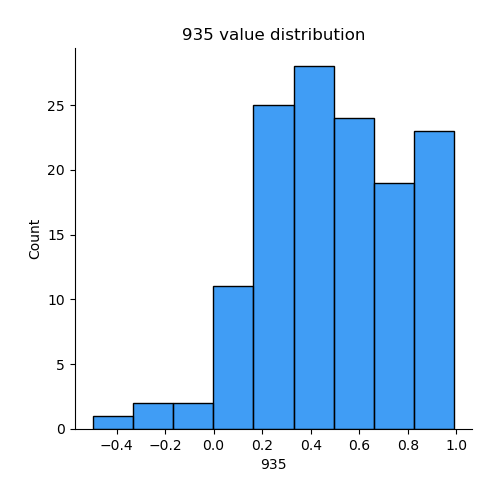
## Feature : 954
- **Feature type** : continous
- **Missing** : 0.0%
- **Unique** : 3
- **Count** :135.0
- **Mean** :1.0
- **Std** :6.781766501501598e-17
- **Min** :0.9999999999999998
- **25%th Percentile** : 1.0
- **50%th Percentile** : 1.0
- **75%th Percentile** : 1.0
- **Max** :1.0

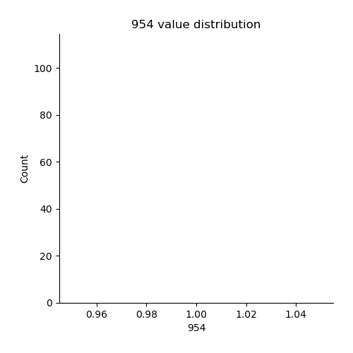
## Feature : 955
- **Feature type** : continous
- **Missing** : 0.0%
- **Unique** : 135
- **Count** :135.0
- **Mean** :0.5404109794307526
- **Std** :0.2583991953961669
- **Min** :0.03374604794020627
- **25%th Percentile** : 0.36066827920211103
- **50%th Percentile** : 0.5233524510367907
- **75%th Percentile** : 0.674961707748678
- **Max** :0.9945311465540935

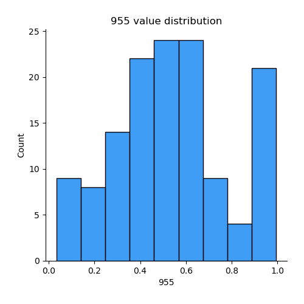
## Feature : 956
- **Feature type** : continous
- **Missing** : 0.0%
- **Unique** : 135
- **Count** :135.0
- **Mean** :0.6910368845637875
- **Std** :0.18625608679760827
- **Min** :0.1865399876089787
- **25%th Percentile** : 0.5783612314557844
- **50%th Percentile** : 0.6736615111513382
- **75%th Percentile** : 0.7952080181520047
- **Max** :0.9944273458278319

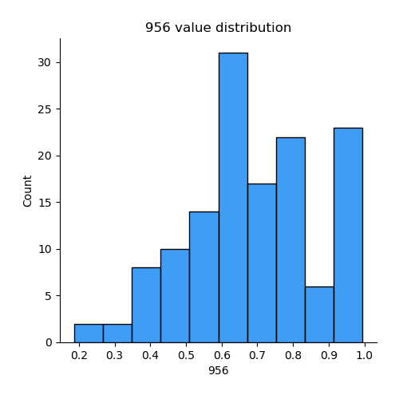
## Feature : 957
- **Feature type** : continous
- **Missing** : 0.0%
- **Unique** : 135
- **Count** :135.0
- **Mean** :0.7928862119446792
- **Std** :0.16101576628079894
- **Min** :0.2055729060211116
- **25%th Percentile** : 0.7177223672263706
- **50%th Percentile** : 0.8283810722228069
- **75%th Percentile** : 0.8943798312881448
- **Max** :0.9940702948465261

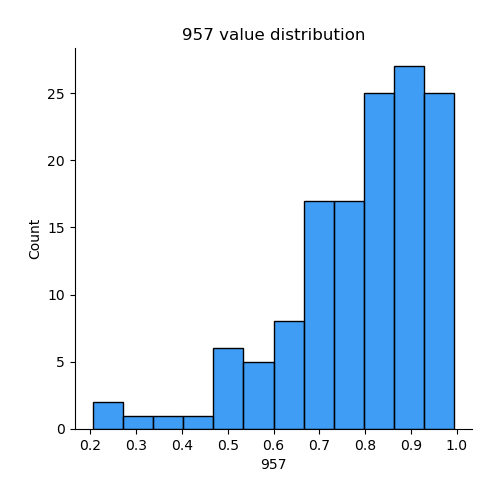
## Feature : 958
- **Feature type** : continous
- **Missing** : 0.0%
- **Unique** : 135
- **Count** :135.0
- **Mean** :0.645804730877077
- **Std** :0.22194783398936557
- **Min** :-0.03315497366854618
- **25%th Percentile** : 0.47740504779116155
- **50%th Percentile** : 0.6517135808869174
- **75%th Percentile** : 0.7940249249061032
- **Max** :0.9908546366265317

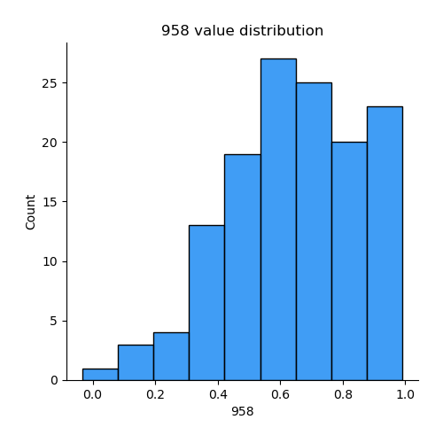
## Feature : 959
- **Feature type** : continous
- **Missing** : 0.0%
- **Unique** : 135
- **Count** :135.0
- **Mean** :0.7522369741036288
- **Std** :0.16822529836507144
- **Min** :0.16704766474250815
- **25%th Percentile** : 0.6488454262543216
- **50%th Percentile** : 0.7584010721334729
- **75%th Percentile** : 0.8735129363909218
- **Max** :0.992989121578799

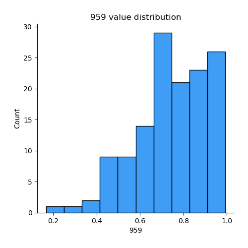
## Feature : 960
- **Feature type** : continous
- **Missing** : 0.0%
- **Unique** : 135
- **Count** :135.0
- **Mean** :0.41892999781416873
- **Std** :0.287259804798782
- **Min** :-0.43909531458165646
- **25%th Percentile** : 0.21882632883219622
- **50%th Percentile** : 0.39399637505719504
- **75%th Percentile** : 0.527764995011418
- **Max** :0.9694680020746091

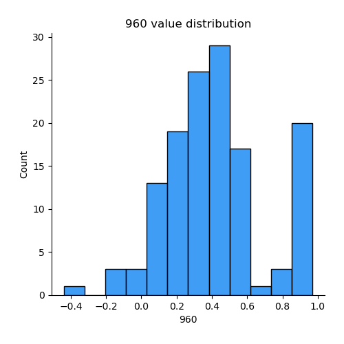
## Feature : 961
- **Feature type** : continous
- **Missing** : 0.0%
- **Unique** : 135
- **Count** :135.0
- **Mean** :0.611467843009773
- **Std** :0.23065811211428117
- **Min** :-0.18090750792772678
- **25%th Percentile** : 0.4639439874553903
- **50%th Percentile** : 0.5980213421280356
- **75%th Percentile** : 0.7408155520749136
- **Max** :0.9878601385899816

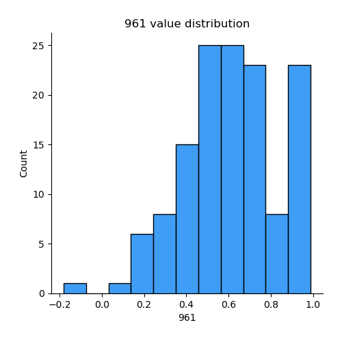
## Feature : 962
- **Feature type** : continous
- **Missing** : 0.0%
- **Unique** : 135
- **Count** :135.0
- **Mean** :0.5963229114506535
- **Std** :0.262959321431143
- **Min** :-0.3158816395264879
- **25%th Percentile** : 0.4336549856587385
- **50%th Percentile** : 0.6100249312569174
- **75%th Percentile** : 0.7700767583891279
- **Max** :0.9927020666508208

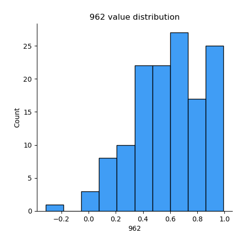
## Feature : 963
- **Feature type** : continous
- **Missing** : 0.0%
- **Unique** : 135
- **Count** :135.0
- **Mean** :0.6147046977434031
- **Std** :0.21522664207634482
- **Min** :0.0526963298865692
- **25%th Percentile** : 0.46831380011489554
- **50%th Percentile** : 0.6061818083764613
- **75%th Percentile** : 0.7246930358339441
- **Max** :0.992207145750892

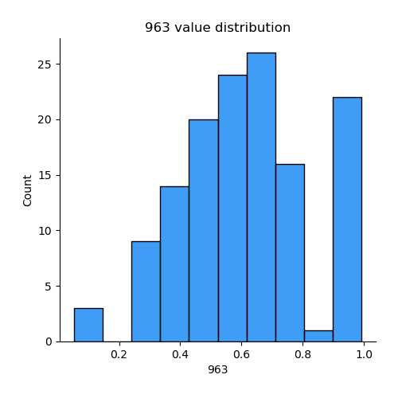
## Feature : 964
- **Feature type** : continous
- **Missing** : 0.0%
- **Unique** : 135
- **Count** :135.0
- **Mean** :0.7409564779642976
- **Std** :0.16841886216715377
- **Min** :0.21377184970475718
- **25%th Percentile** : 0.6444488077022282
- **50%th Percentile** : 0.7485384110907612
- **75%th Percentile** : 0.8629356235536707
- **Max** :0.9885931842674409

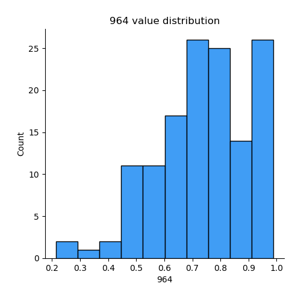
## Feature : 965
- **Feature type** : continous
- **Missing** : 0.0%
- **Unique** : 135
- **Count** :135.0
- **Mean** :0.3981049652598875
- **Std** :0.2961161840474402
- **Min** :-0.25169892034757474
- **25%th Percentile** : 0.20535908101852932
- **50%th Percentile** : 0.3756854226667305
- **75%th Percentile** : 0.5468773545915624
- **Max** :0.9761624002935115

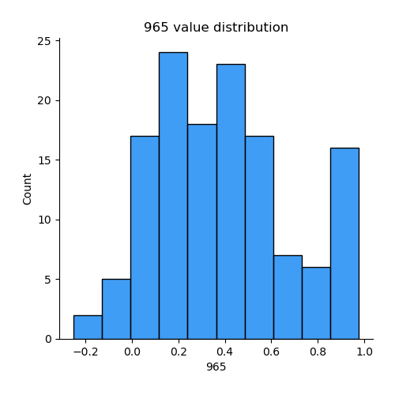
## Feature : 966
- **Feature type** : continous
- **Missing** : 0.0%
- **Unique** : 135
- **Count** :135.0
- **Mean** :0.6427017562516744
- **Std** :0.23548745932435228
- **Min** :0.005387745077607112
- **25%th Percentile** : 0.5152984142756559
- **50%th Percentile** : 0.6510918560526892
- **75%th Percentile** : 0.8027217570863092
- **Max** :0.9892174719214561

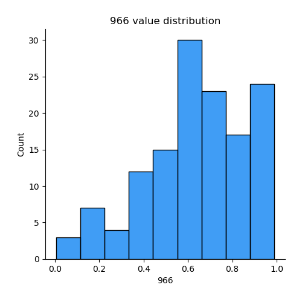
## Feature : 967
- **Feature type** : continous
- **Missing** : 0.0%
- **Unique** : 135
- **Count** :135.0
- **Mean** :0.805714172534962
- **Std** :0.13933878673041775
- **Min** :0.4314811805775465
- **25%th Percentile** : 0.7368327344351067
- **50%th Percentile** : 0.8240721525827657
- **75%th Percentile** : 0.8985383056190523
- **Max** :0.9971790299660388

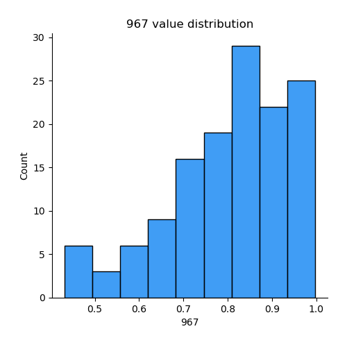
## Feature : 968
- **Feature type** : continous
- **Missing** : 0.0%
- **Unique** : 135
- **Count** :135.0
- **Mean** :0.5695589994695095
- **Std** :0.26535020215844396
- **Min** :-0.28460849916202496
- **25%th Percentile** : 0.4209446603296123
- **50%th Percentile** : 0.5539545797808011
- **75%th Percentile** : 0.7366223350201391
- **Max** :0.9895068524467856

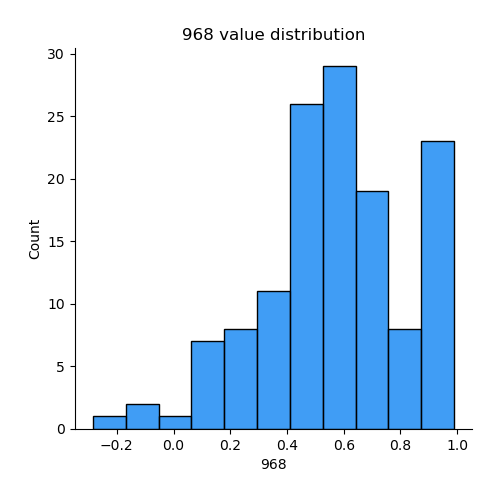
## Feature : 969
- **Feature type** : continous
- **Missing** : 0.0%
- **Unique** : 135
- **Count** :135.0
- **Mean** :0.6324900291009254
- **Std** :0.22473980677120295
- **Min** :0.10773174566322892
- **25%th Percentile** : 0.4723652849107296
- **50%th Percentile** : 0.6379983009715168
- **75%th Percentile** : 0.7590791140699257
- **Max** :0.9906206107336287

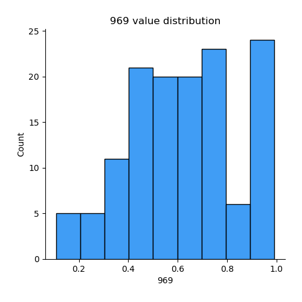
## Feature : 970
- **Feature type** : continous
- **Missing** : 0.0%
- **Unique** : 135
- **Count** :135.0
- **Mean** :0.8388522178459783
- **Std** :0.11054401396612687
- **Min** :0.5293600030787351
- **25%th Percentile** : 0.7696211317636534
- **50%th Percentile** : 0.8489298263332504
- **75%th Percentile** : 0.919717005464296
- **Max** :0.995817576461397

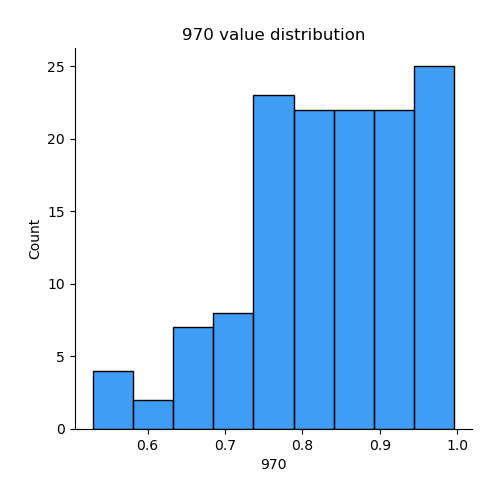
## Feature : 971
- **Feature type** : continous
- **Missing** : 0.0%
- **Unique** : 135
- **Count** :135.0
- **Mean** :0.6449097375185548
- **Std** :0.21319561997795677
- **Min** :-0.0024662031260112467
- **25%th Percentile** : 0.502362697705836
- **50%th Percentile** : 0.6570749737771987
- **75%th Percentile** : 0.7618083470766186
- **Max** :0.9892072249551784

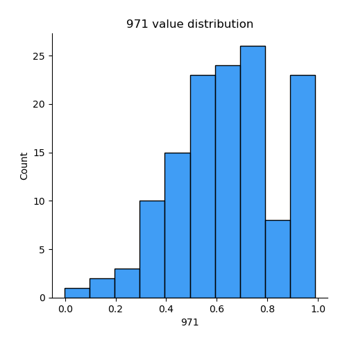
## Feature : 972
- **Feature type** : continous
- **Missing** : 0.0%
- **Unique** : 135
- **Count** :135.0
- **Mean** :0.7271624267113219
- **Std** :0.17692288227828007
- **Min** :0.18226235112515562
- **25%th Percentile** : 0.6229572081223955
- **50%th Percentile** : 0.7309248747925102
- **75%th Percentile** : 0.8489258300120077
- **Max** :0.9922319983786034

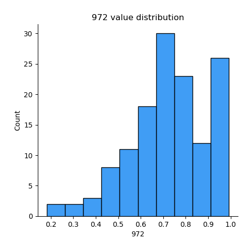
## Feature : 973
- **Feature type** : continous
- **Missing** : 0.0%
- **Unique** : 135
- **Count** :135.0
- **Mean** :0.6246345572446302
- **Std** :0.25315209579555203
- **Min** :-0.22762722203933744
- **25%th Percentile** : 0.48686347818154
- **50%th Percentile** : 0.644493669512286
- **75%th Percentile** : 0.7861771846373489
- **Max** :0.9920158654158097

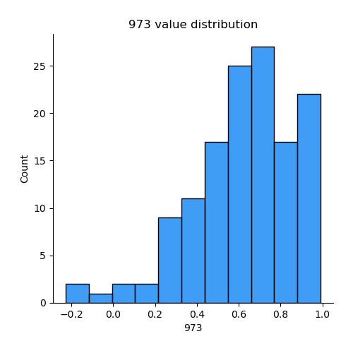
## Feature : 974
- **Feature type** : continous
- **Missing** : 0.0%
- **Unique** : 135
- **Count** :135.0
- **Mean** :0.6725307648530241
- **Std** :0.20566294216509537
- **Min** :0.026965181900239617
- **25%th Percentile** : 0.5417015587666452
- **50%th Percentile** : 0.6613233608750785
- **75%th Percentile** : 0.7951310760819792
- **Max** :0.9918759563187884

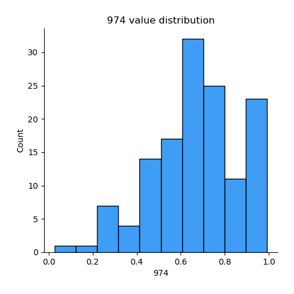
## Feature : 975
- **Feature type** : continous
- **Missing** : 0.0%
- **Unique** : 135
- **Count** :135.0
- **Mean** :0.5850294345638436
- **Std** :0.25947051485056577
- **Min** :-0.2117240123570643
- **25%th Percentile** : 0.4320349408782689
- **50%th Percentile** : 0.5682827064699566
- **75%th Percentile** : 0.7651849843993421
- **Max** :0.9893821079871439

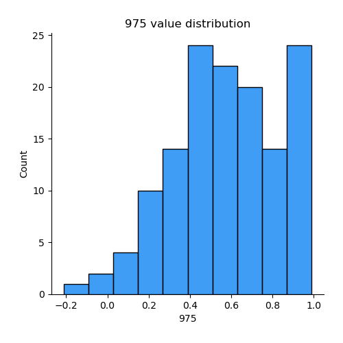
## Feature : 976
- **Feature type** : continous
- **Missing** : 0.0%
- **Unique** : 135
- **Count** :135.0
- **Mean** :0.6977622207535822
- **Std** :0.1767418524649148
- **Min** :0.14914250985506886
- **25%th Percentile** : 0.58429548315775
- **50%th Percentile** : 0.7053374610956746
- **75%th Percentile** : 0.8026741829089907
- **Max** :0.9899742630882177

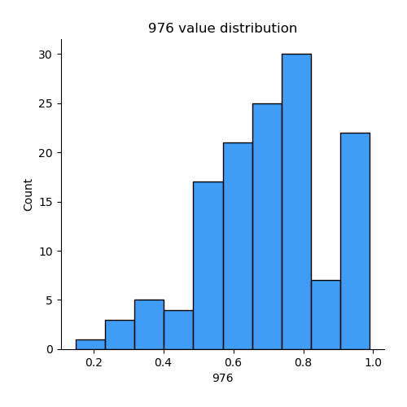
## Feature : 977
- **Feature type** : continous
- **Missing** : 0.0%
- **Unique** : 135
- **Count** :135.0
- **Mean** :0.669279412148644
- **Std** :0.2107623576965299
- **Min** :0.11655727601360234
- **25%th Percentile** : 0.5371273530366623
- **50%th Percentile** : 0.6714116466182312
- **75%th Percentile** : 0.7931676112066282
- **Max** :0.9907885466295859

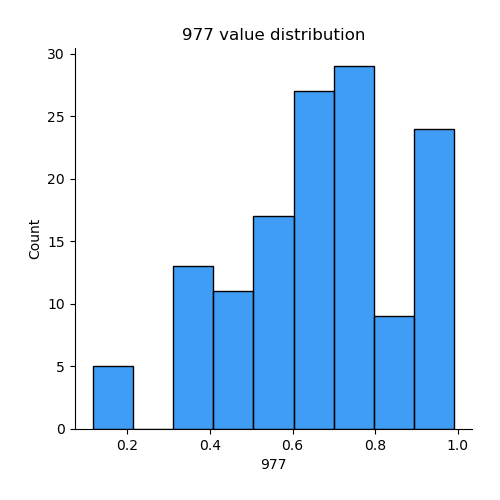
## Feature : 978
- **Feature type** : continous
- **Missing** : 0.0%
- **Unique** : 135
- **Count** :135.0
- **Mean** :0.7522991951398522
- **Std** :0.15370304279296215
- **Min** :0.3620886706491565
- **25%th Percentile** : 0.6542290856476611
- **50%th Percentile** : 0.7513080163167102
- **75%th Percentile** : 0.8520896304591177
- **Max** :0.992985546846603

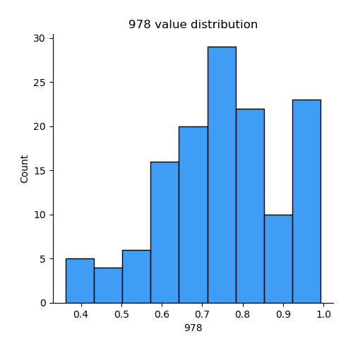
## Feature : 979
- **Feature type** : continous
- **Missing** : 0.0%
- **Unique** : 135
- **Count** :135.0
- **Mean** :0.6652021844720936
- **Std** :0.20968560544545073
- **Min** :0.02533270004545437
- **25%th Percentile** : 0.5493067898586025
- **50%th Percentile** : 0.6755738098670253
- **75%th Percentile** : 0.7883932922282894
- **Max** :0.9917165079403591

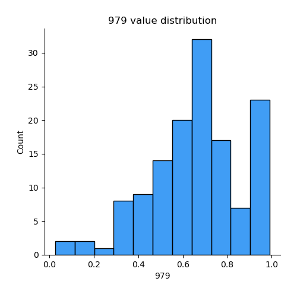
## Feature : 980
- **Feature type** : continous
- **Missing** : 0.0%
- **Unique** : 135
- **Count** :135.0
- **Mean** :0.9365754190443536
- **Std** :0.0467030858326137
- **Min** :0.8086364942770582
- **25%th Percentile** : 0.906241189059402
- **50%th Percentile** : 0.9430419402758359
- **75%th Percentile** : 0.9699627056201376
- **Max** :0.9990939242480752

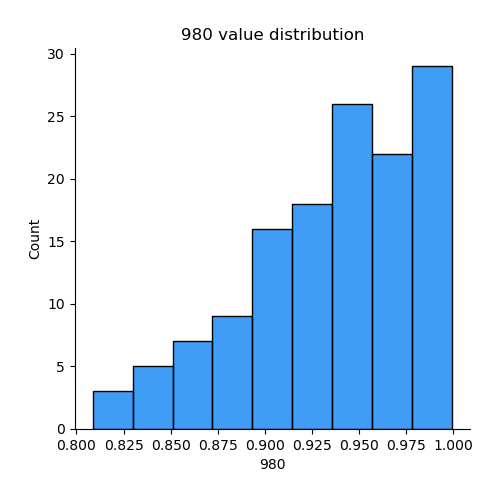
## Feature : 981
- **Feature type** : continous
- **Missing** : 0.0%
- **Unique** : 135
- **Count** :135.0
- **Mean** :0.505812774666865
- **Std** :0.26314567045808374
- **Min** :-0.027908244588238894
- **25%th Percentile** : 0.29758083365010524
- **50%th Percentile** : 0.4824421201536485
- **75%th Percentile** : 0.624518793484349
- **Max** :0.9890511398860539

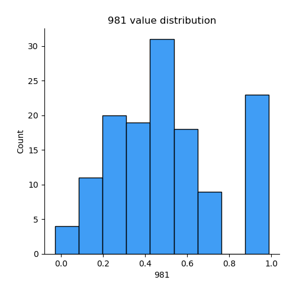
## Feature : 982
- **Feature type** : continous
- **Missing** : 0.0%
- **Unique** : 135
- **Count** :135.0
- **Mean** :0.6801334010389458
- **Std** :0.2049534544388574
- **Min** :0.0815473163940796
- **25%th Percentile** : 0.5635255495052656
- **50%th Percentile** : 0.6844637484547884
- **75%th Percentile** : 0.8082328140918338
- **Max** :0.9949908336403926

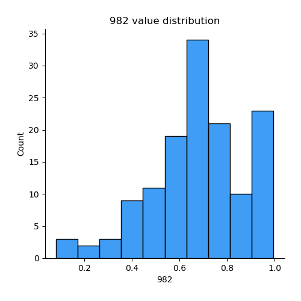
## Feature : 983
- **Feature type** : continous
- **Missing** : 0.0%
- **Unique** : 135
- **Count** :135.0
- **Mean** :0.7627116948095077
- **Std** :0.17616236176916736
- **Min** :0.14915818103458303
- **25%th Percentile** : 0.6636269037181501
- **50%th Percentile** : 0.7850948429688084
- **75%th Percentile** : 0.8813632593187685
- **Max** :0.9936329019681018

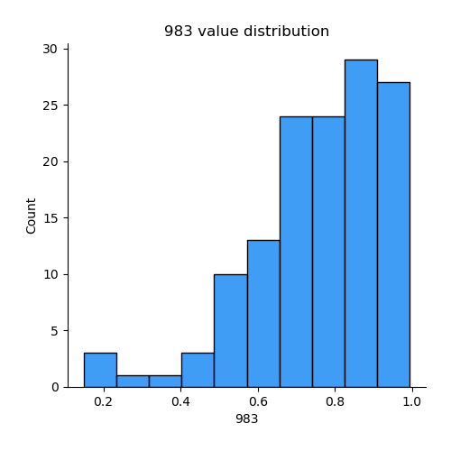
## Feature : 984
- **Feature type** : continous
- **Missing** : 0.0%
- **Unique** : 135
- **Count** :135.0
- **Mean** :0.6198200759867472
- **Std** :0.24854428902935638
- **Min** :-0.2805279804941382
- **25%th Percentile** : 0.45325982216689364
- **50%th Percentile** : 0.6411531691073383
- **75%th Percentile** : 0.7729332141542975
- **Max** :0.9902778686917499

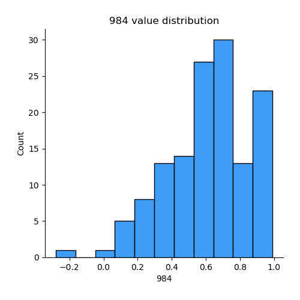
## Feature : 985
- **Feature type** : continous
- **Missing** : 0.0%
- **Unique** : 135
- **Count** :135.0
- **Mean** :0.6898949383399707
- **Std** :0.20867173897813587
- **Min** :0.027897160712031573
- **25%th Percentile** : 0.5591439044984403
- **50%th Percentile** : 0.7075421297973222
- **75%th Percentile** : 0.8421634568858409
- **Max** :0.9931193861331602

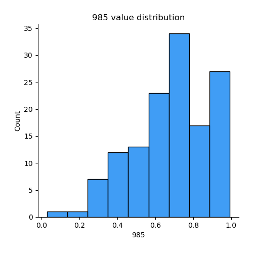
## Feature : 986
- **Feature type** : continous
- **Missing** : 0.0%
- **Unique** : 135
- **Count** :135.0
- **Mean** :0.37674433078985553
- **Std** :0.31160818764726755
- **Min** :-0.5433719800753538
- **25%th Percentile** : 0.17351403333457754
- **50%th Percentile** : 0.33449025950258177
- **75%th Percentile** : 0.5241809115113072
- **Max** :0.9780120018697595

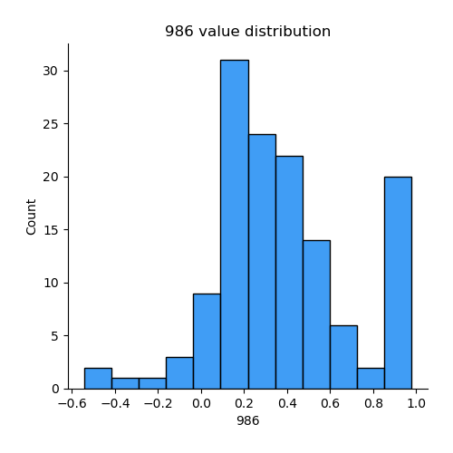
## Feature : 987
- **Feature type** : continous
- **Missing** : 0.0%
- **Unique** : 135
- **Count** :135.0
- **Mean** :0.5355895468308833
- **Std** :0.2698737122327506
- **Min** :-0.36461775547634306
- **25%th Percentile** : 0.3676648244407421
- **50%th Percentile** : 0.5025937834939893
- **75%th Percentile** : 0.7144042155616397
- **Max** :0.9855909298327364

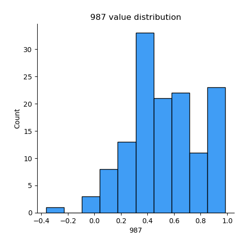
## Feature : 1007
- **Feature type** : continous
- **Missing** : 0.0%
- **Unique** : 3
- **Count** :135.0
- **Mean** :1.0
- **Std** :7.112776712998809e-17
- **Min** :0.9999999999999998
- **25%th Percentile** : 1.0
- **50%th Percentile** : 1.0
- **75%th Percentile** : 1.0
- **Max** :1.0

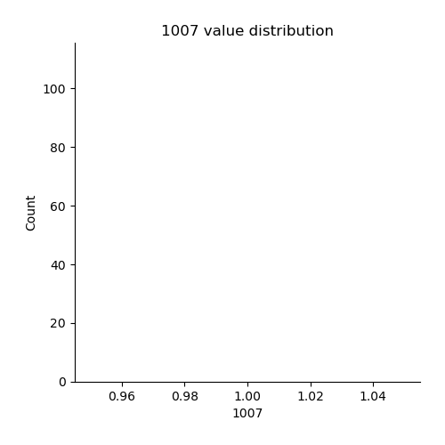
## Feature : 1008
- **Feature type** : continous
- **Missing** : 0.0%
- **Unique** : 135
- **Count** :135.0
- **Mean** :0.6447404357173658
- **Std** :0.21335768689923668
- **Min** :0.0897190166051235
- **25%th Percentile** : 0.5222770857770958
- **50%th Percentile** : 0.6433683487339897
- **75%th Percentile** : 0.7692470690854929
- **Max** :0.994562034209321

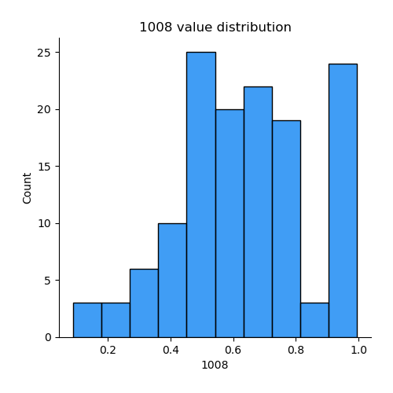
## Feature : 1009
- **Feature type** : continous
- **Missing** : 0.0%
- **Unique** : 135
- **Count** :135.0
- **Mean** :0.42081213503149706
- **Std** :0.32362167838324685
- **Min** :-0.4057707695474946
- **25%th Percentile** : 0.19795090105972
- **50%th Percentile** : 0.35734327594708865
- **75%th Percentile** : 0.5931957699249099
- **Max** :0.988716871534759

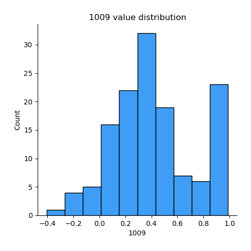
## Feature : 1010
- **Feature type** : continous
- **Missing** : 0.0%
- **Unique** : 135
- **Count** :135.0
- **Mean** :0.5255800523065713
- **Std** :0.26962547825087585
- **Min** :-0.24421352537517171
- **25%th Percentile** : 0.34600247393616584
- **50%th Percentile** : 0.4844431009444012
- **75%th Percentile** : 0.7069131293473274
- **Max** :0.9884017723123947

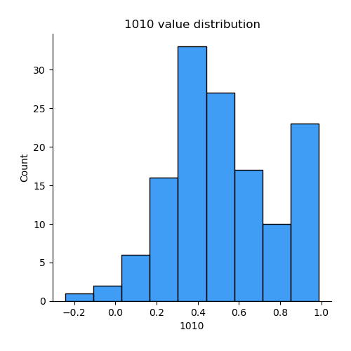
## Feature : 1011
- **Feature type** : continous
- **Missing** : 0.0%
- **Unique** : 135
- **Count** :135.0
- **Mean** :0.4991356358174959
- **Std** :0.29857847446679303
- **Min** :-0.1507348904208898
- **25%th Percentile** : 0.2837283674479032
- **50%th Percentile** : 0.47630931603830157
- **75%th Percentile** : 0.6680113143968964
- **Max** :0.9915744042438551

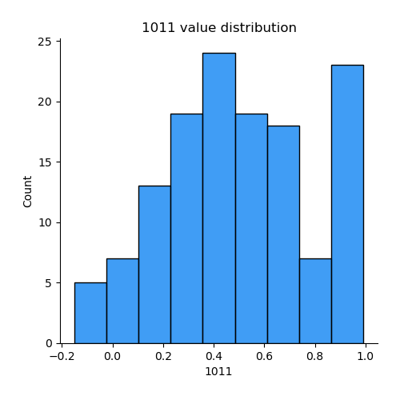
## Feature : 1012
- **Feature type** : continous
- **Missing** : 0.0%
- **Unique** : 135
- **Count** :135.0
- **Mean** :0.3307077336152746
- **Std** :0.3422328645854407
- **Min** :-0.6548400998982693
- **25%th Percentile** : 0.12200208301715704
- **50%th Percentile** : 0.27397986754949244
- **75%th Percentile** : 0.5019882272571234
- **Max** :0.9830368812355382

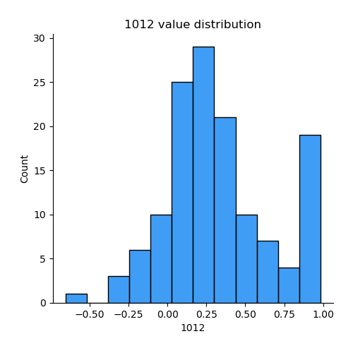
## Feature : 1013
- **Feature type** : continous
- **Missing** : 0.0%
- **Unique** : 135
- **Count** :135.0
- **Mean** :0.49085902927477476
- **Std** :0.2825066632074083
- **Min** :-0.33228241467140895
- **25%th Percentile** : 0.31182582339395676
- **50%th Percentile** : 0.46546148695616424
- **75%th Percentile** : 0.6812289571280943
- **Max** :0.9864368282862798

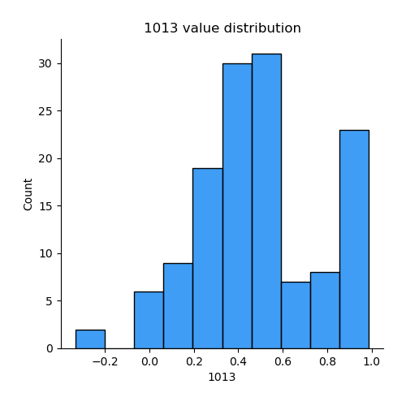
## Feature : 1014
- **Feature type** : continous
- **Missing** : 0.0%
- **Unique** : 135
- **Count** :135.0
- **Mean** :0.4221542979622558
- **Std** :0.32218001346586134
- **Min** :-0.2375515810134635
- **25%th Percentile** : 0.1788651339484838
- **50%th Percentile** : 0.406183896100862
- **75%th Percentile** : 0.5848333052136591
- **Max** :0.9887850585900219

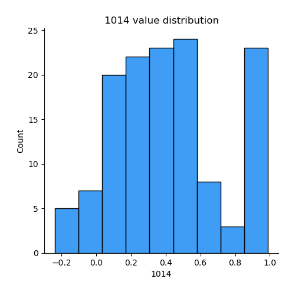
## Feature : 1015
- **Feature type** : continous
- **Missing** : 0.0%
- **Unique** : 135
- **Count** :135.0
- **Mean** :0.5920427687837474
- **Std** :0.2404751198936857
- **Min** :0.11928566119517758
- **25%th Percentile** : 0.40124134271719203
- **50%th Percentile** : 0.5699308576229429
- **75%th Percentile** : 0.7689295890694787
- **Max** :0.9919425816496255

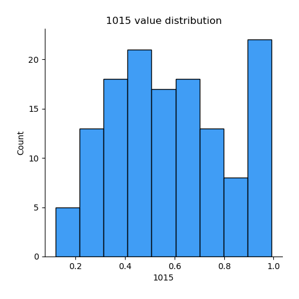
## Feature : 1016
- **Feature type** : continous
- **Missing** : 0.0%
- **Unique** : 135
- **Count** :135.0
- **Mean** :0.4322282934861349
- **Std** :0.29032510533422495
- **Min** :-0.2923775570539195
- **25%th Percentile** : 0.23113518775686068
- **50%th Percentile** : 0.3896733386916032
- **75%th Percentile** : 0.5861210836996326
- **Max** :0.9813324830036569

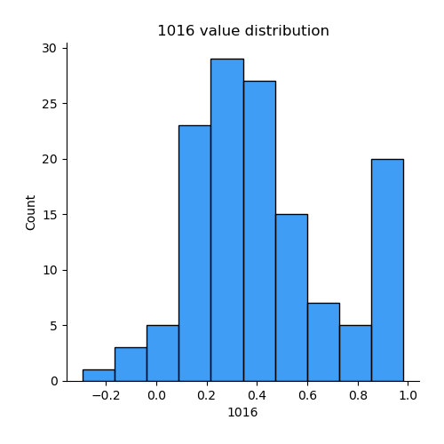
## Feature : 1017
- **Feature type** : continous
- **Missing** : 0.0%
- **Unique** : 135
- **Count** :135.0
- **Mean** :0.29360099045477456
- **Std** :0.33222990683742015
- **Min** :-0.4473333396586998
- **25%th Percentile** : 0.08421118760303173
- **50%th Percentile** : 0.22216413164801627
- **75%th Percentile** : 0.4630176727981916
- **Max** :0.986389273496565

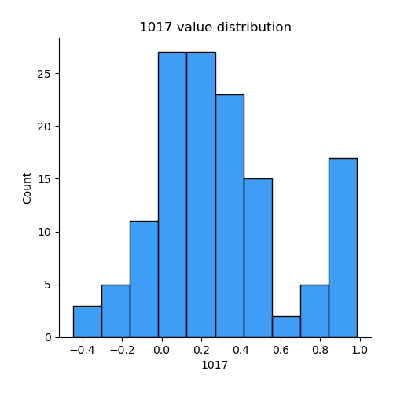
## Feature : 1018
- **Feature type** : continous
- **Missing** : 0.0%
- **Unique** : 135
- **Count** :135.0
- **Mean** :0.4022505529594969
- **Std** :0.3128959559161596
- **Min** :-0.28354328855362154
- **25%th Percentile** : 0.18152753738453847
- **50%th Percentile** : 0.35769303843902317
- **75%th Percentile** : 0.5494324790820624
- **Max** :0.9849261091366095

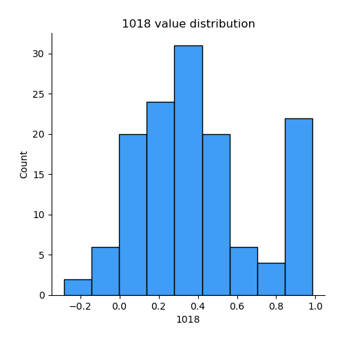
## Feature : 1019
- **Feature type** : continous
- **Missing** : 0.0%
- **Unique** : 135
- **Count** :135.0
- **Mean** :0.49521444638650697
- **Std** :0.276352104329064
- **Min** :-0.02768878707541288
- **25%th Percentile** : 0.30593669419625436
- **50%th Percentile** : 0.45469589125178916
- **75%th Percentile** : 0.6298591947590221
- **Max** :0.9900022976319165

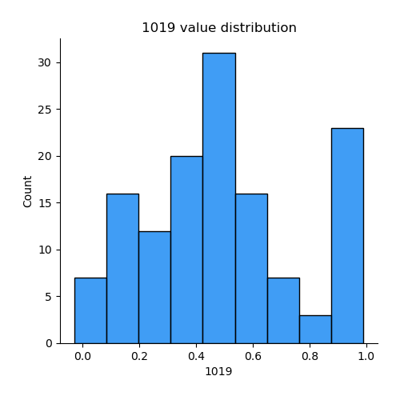
## Feature : 1020
- **Feature type** : continous
- **Missing** : 0.0%
- **Unique** : 135
- **Count** :135.0
- **Mean** :0.4173132472163158
- **Std** :0.31239395354887656
- **Min** :-0.3956151698800465
- **25%th Percentile** : 0.22083228268566574
- **50%th Percentile** : 0.35745562045042845
- **75%th Percentile** : 0.5841173520520697
- **Max** :0.9888273727358887

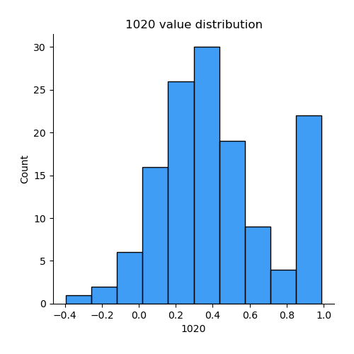
## Feature : 1021
- **Feature type** : continous
- **Missing** : 0.0%
- **Unique** : 135
- **Count** :135.0
- **Mean** :0.5463177547226205
- **Std** :0.2681875673251579
- **Min** :-0.037804438150977206
- **25%th Percentile** : 0.34271330842542835
- **50%th Percentile** : 0.5244967197905331
- **75%th Percentile** : 0.7316700004188204
- **Max** :0.9917675134813602

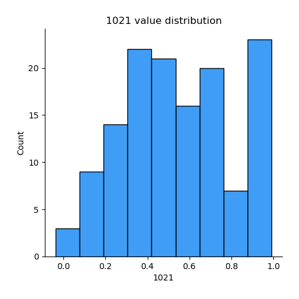
## Feature : 1022
- **Feature type** : continous
- **Missing** : 0.0%
- **Unique** : 135
- **Count** :135.0
- **Mean** :0.5423667621949134
- **Std** :0.25003698582177175
- **Min** :0.008982146693245253
- **25%th Percentile** : 0.3669258299418563
- **50%th Percentile** : 0.5152395114530206
- **75%th Percentile** : 0.7180532837826172
- **Max** :0.983459883934461

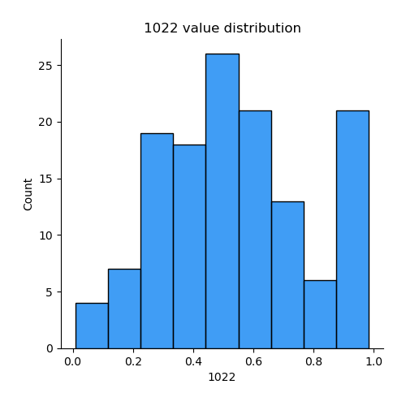
## Feature : 1023
- **Feature type** : continous
- **Missing** : 0.0%
- **Unique** : 135
- **Count** :135.0
- **Mean** :0.39325891497153886
- **Std** :0.31210422094975887
- **Min** :-0.41816433487418786
- **25%th Percentile** : 0.19005513168795413
- **50%th Percentile** : 0.35911725882222484
- **75%th Percentile** : 0.5247215623634147
- **Max** :0.9840070599062426

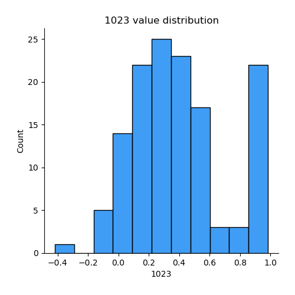
## Feature : 1024
- **Feature type** : continous
- **Missing** : 0.0%
- **Unique** : 135
- **Count** :135.0
- **Mean** :0.41099240987195235
- **Std** :0.30176964493589076
- **Min** :-0.35930426616259936
- **25%th Percentile** : 0.19557052463206284
- **50%th Percentile** : 0.3568937909161531
- **75%th Percentile** : 0.5756631111877577
- **Max** :0.9816290385929668

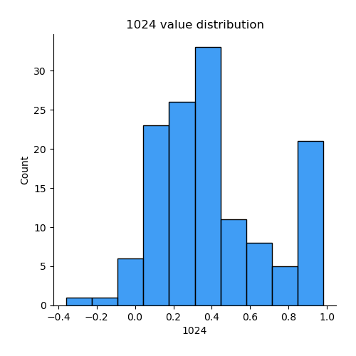
## Feature : 1025
- **Feature type** : continous
- **Missing** : 0.0%
- **Unique** : 135
- **Count** :135.0
- **Mean** :0.484815373690849
- **Std** :0.288976098419416
- **Min** :-0.2299352206449734
- **25%th Percentile** : 0.2758361531354839
- **50%th Percentile** : 0.4751905244192483
- **75%th Percentile** : 0.6527369929413489
- **Max** :0.9891103888126047

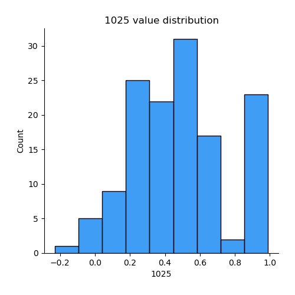
## Feature : 1026
- **Feature type** : continous
- **Missing** : 0.0%
- **Unique** : 135
- **Count** :135.0
- **Mean** :0.4274097501434934
- **Std** :0.32374204904890236
- **Min** :-0.15654116698724183
- **25%th Percentile** : 0.18274012871626238
- **50%th Percentile** : 0.40692961382527354
- **75%th Percentile** : 0.5996957309678451
- **Max** :0.9908231901480078

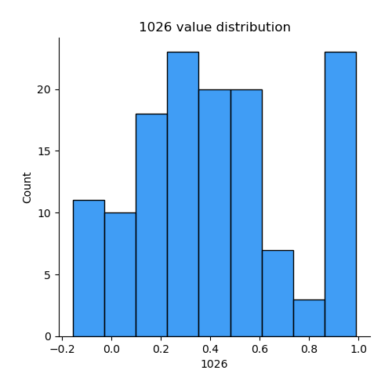
## Feature : 1027
- **Feature type** : continous
- **Missing** : 0.0%
- **Unique** : 135
- **Count** :135.0
- **Mean** :0.4000677953753984
- **Std** :0.3171686838464163
- **Min** :-0.27145201820552073
- **25%th Percentile** : 0.18420065895137558
- **50%th Percentile** : 0.34796507357889706
- **75%th Percentile** : 0.5758158592433522
- **Max** :0.9896164350000761

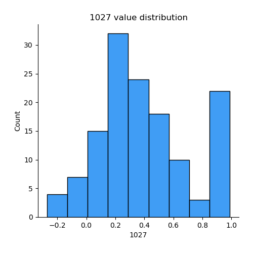
## Feature : 1028
- **Feature type** : continous
- **Missing** : 0.0%
- **Unique** : 135
- **Count** :135.0
- **Mean** :0.4098552408020811
- **Std** :0.2952634686845704
- **Min** :-0.3284775006171741
- **25%th Percentile** : 0.22171970957757692
- **50%th Percentile** : 0.36052866676630474
- **75%th Percentile** : 0.5509619040098629
- **Max** :0.9781473240603431

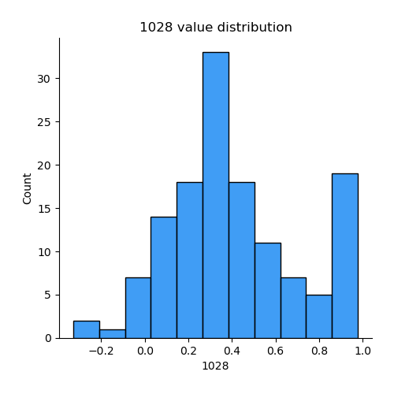
## Feature : 1029
- **Feature type** : continous
- **Missing** : 0.0%
- **Unique** : 135
- **Count** :135.0
- **Mean** :0.46477214721044396
- **Std** :0.30893242392528736
- **Min** :-0.2578555913751963
- **25%th Percentile** : 0.23321210080853355
- **50%th Percentile** : 0.4442911649623071
- **75%th Percentile** : 0.6113604479414332
- **Max** :0.9894691895546731

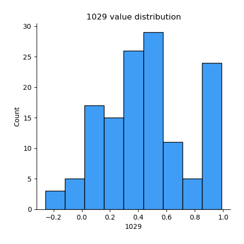
## Feature : 1030
- **Feature type** : continous
- **Missing** : 0.0%
- **Unique** : 135
- **Count** :135.0
- **Mean** :0.546058166932117
- **Std** :0.2654549181991937
- **Min** :-0.06596879581787049
- **25%th Percentile** : 0.34981945012429744
- **50%th Percentile** : 0.5210857903381668
- **75%th Percentile** : 0.7175880837508912
- **Max** :0.9918471155801624

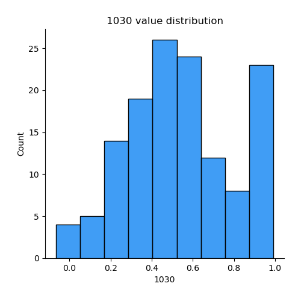
## Feature : 1031
- **Feature type** : continous
- **Missing** : 0.0%
- **Unique** : 135
- **Count** :135.0
- **Mean** :0.47348045550668516
- **Std** :0.3072652960821706
- **Min** :-0.27268196536014494
- **25%th Percentile** : 0.2522258132012607
- **50%th Percentile** : 0.43819820097876017
- **75%th Percentile** : 0.6364784938938518
- **Max** :0.9902372112008377

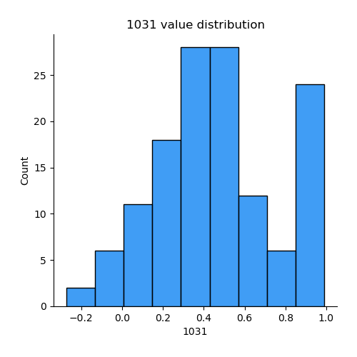
## Feature : 1032
- **Feature type** : continous
- **Missing** : 0.0%
- **Unique** : 135
- **Count** :135.0
- **Mean** :0.5182294583195686
- **Std** :0.26531779740355155
- **Min** :-0.024971351161189728
- **25%th Percentile** : 0.33545977328635224
- **50%th Percentile** : 0.5020110817228916
- **75%th Percentile** : 0.669019736318041
- **Max** :0.9910376216866176

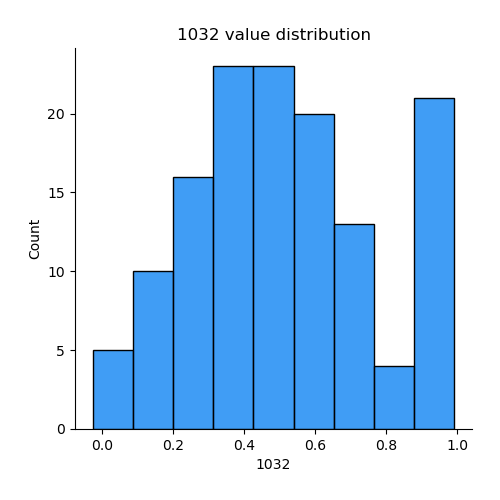
## Feature : 1033
- **Feature type** : continous
- **Missing** : 0.0%
- **Unique** : 135
- **Count** :135.0
- **Mean** :0.7817938708904092
- **Std** :0.1629036834263121
- **Min** :0.2807297142811452
- **25%th Percentile** : 0.6867411195986707
- **50%th Percentile** : 0.8016616566381304
- **75%th Percentile** : 0.9073860815138384
- **Max** :0.9959961011178062

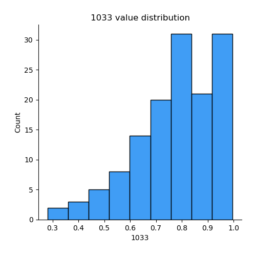
## Feature : 1034
- **Feature type** : continous
- **Missing** : 0.0%
- **Unique** : 135
- **Count** :135.0
- **Mean** :0.6169837367448885
- **Std** :0.22258414985867844
- **Min** :0.10416944904902131
- **25%th Percentile** : 0.4672724145474145
- **50%th Percentile** : 0.5922945246408072
- **75%th Percentile** : 0.749949475522466
- **Max** :0.9942460137425044

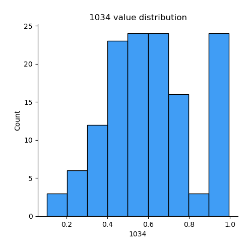
## Feature : 1035
- **Feature type** : continous
- **Missing** : 0.0%
- **Unique** : 135
- **Count** :135.0
- **Mean** :0.4142339768904534
- **Std** :0.3251712680015128
- **Min** :-0.2976325666066667
- **25%th Percentile** : 0.19200655537705819
- **50%th Percentile** : 0.34466368449954854
- **75%th Percentile** : 0.5815276666102704
- **Max** :0.9876369238814491

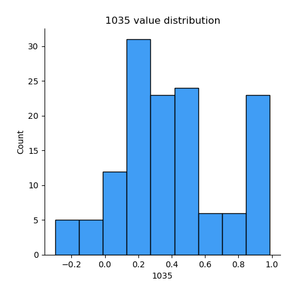
## Feature : 1036
- **Feature type** : continous
- **Missing** : 0.0%
- **Unique** : 135
- **Count** :135.0
- **Mean** :0.5149822463459944
- **Std** :0.2742035938744876
- **Min** :-0.11169947128780304
- **25%th Percentile** : 0.34915228708459967
- **50%th Percentile** : 0.4983212227762551
- **75%th Percentile** : 0.6848074545489813
- **Max** :0.9887926046021694

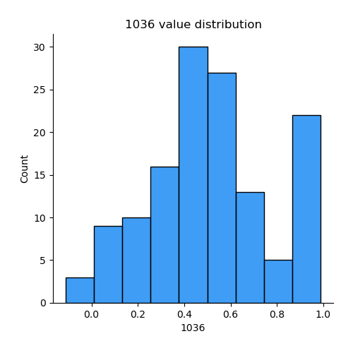
## Feature : 1037
- **Feature type** : continous
- **Missing** : 0.0%
- **Unique** : 135
- **Count** :135.0
- **Mean** :0.4637281797525451
- **Std** :0.3201653544516455
- **Min** :-0.27755973851042093
- **25%th Percentile** : 0.23310092797204868
- **50%th Percentile** : 0.4456432063035969
- **75%th Percentile** : 0.6796139995820535
- **Max** :0.9897591538227773

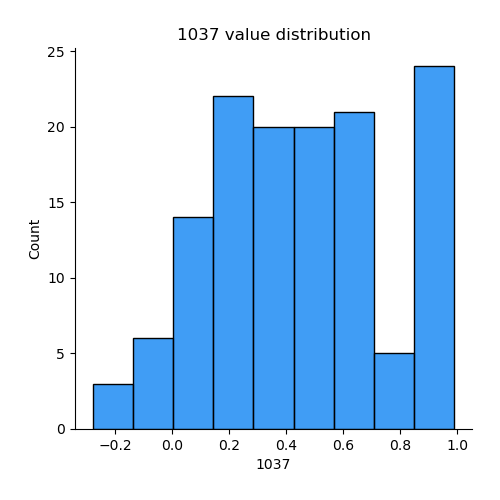
## Feature : 1038
- **Feature type** : continous
- **Missing** : 0.0%
- **Unique** : 135
- **Count** :135.0
- **Mean** :0.32358063533500003
- **Std** :0.34799864886946774
- **Min** :-0.5713370314641737
- **25%th Percentile** : 0.10840399834413435
- **50%th Percentile** : 0.2621151720794931
- **75%th Percentile** : 0.504669188315835
- **Max** :0.9847179894913416

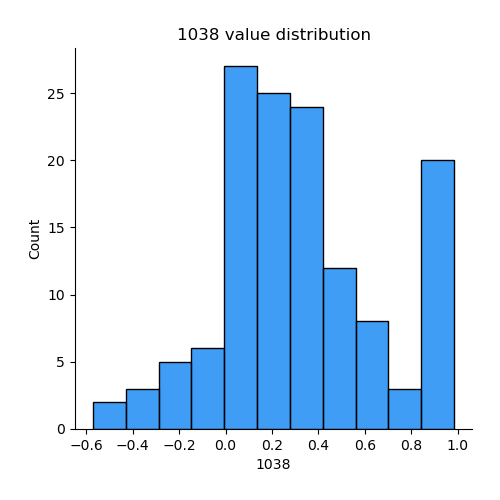
## Feature : 1039
- **Feature type** : continous
- **Missing** : 0.0%
- **Unique** : 135
- **Count** :135.0
- **Mean** :0.4690287543046978
- **Std** :0.28337603077280393
- **Min** :-0.09854704655458475
- **25%th Percentile** : 0.2613053590800535
- **50%th Percentile** : 0.4188426640434733
- **75%th Percentile** : 0.6399676627271801
- **Max** :0.9851866083174757

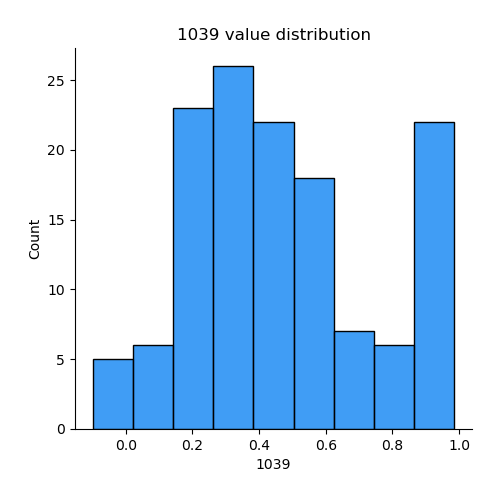
## Feature : 1060
- **Feature type** : continous
- **Missing** : 0.0%
- **Unique** : 3
- **Count** :135.0
- **Mean** :1.0
- **Std** :8.361123277344475e-17
- **Min** :0.9999999999999998
- **25%th Percentile** : 1.0
- **50%th Percentile** : 1.0
- **75%th Percentile** : 1.0
- **Max** :1.0

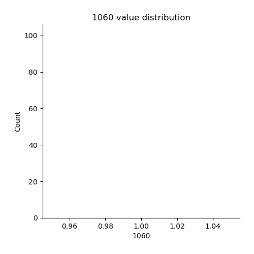
## Feature : 1061
- **Feature type** : continous
- **Missing** : 0.0%
- **Unique** : 135
- **Count** :135.0
- **Mean** :0.6415832654932966
- **Std** :0.23075166048467158
- **Min** :-0.19861822892279804
- **25%th Percentile** : 0.5162139355723461
- **50%th Percentile** : 0.6517219073703387
- **75%th Percentile** : 0.7857947404362668
- **Max** :0.9936024668503061

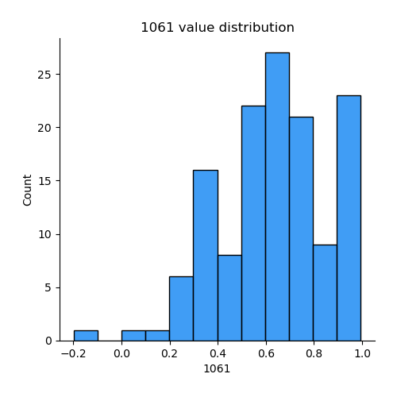
## Feature : 1062
- **Feature type** : continous
- **Missing** : 0.0%
- **Unique** : 135
- **Count** :135.0
- **Mean** :0.5690985124036612
- **Std** :0.2739135280631489
- **Min** :-0.21765568905684812
- **25%th Percentile** : 0.3862319175616271
- **50%th Percentile** : 0.5603779951975132
- **75%th Percentile** : 0.7609445433388171
- **Max** :0.9911182593693083

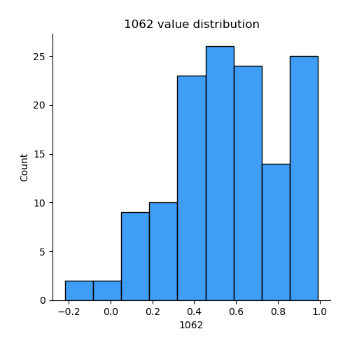
## Feature : 1063
- **Feature type** : continous
- **Missing** : 0.0%
- **Unique** : 135
- **Count** :135.0
- **Mean** :0.6693035546373418
- **Std** :0.22121950979666102
- **Min** :0.08451692865589157
- **25%th Percentile** : 0.49524141183192594
- **50%th Percentile** : 0.692209043328909
- **75%th Percentile** : 0.829019517159498
- **Max** :0.9959846193361913

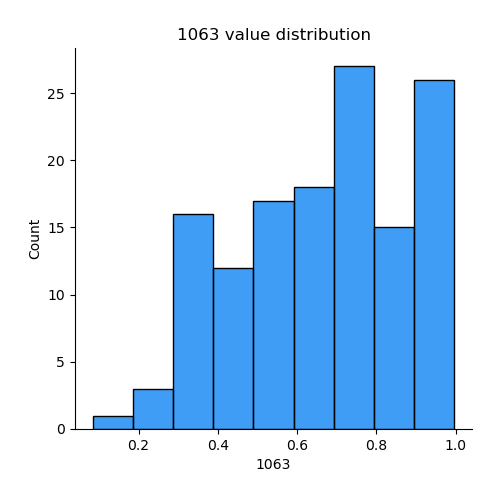
## Feature : 1064
- **Feature type** : continous
- **Missing** : 0.0%
- **Unique** : 135
- **Count** :135.0
- **Mean** :0.4055112834027198
- **Std** :0.29744112189978295
- **Min** :-0.21832777024813632
- **25%th Percentile** : 0.1988864827934024
- **50%th Percentile** : 0.3643839098784424
- **75%th Percentile** : 0.5323323059291158
- **Max** :0.9823811136065365

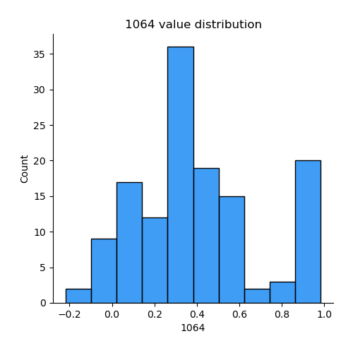
## Feature : 1065
- **Feature type** : continous
- **Missing** : 0.0%
- **Unique** : 135
- **Count** :135.0
- **Mean** :0.5305461725570223
- **Std** :0.27386134544440593
- **Min** :-0.13176540833750752
- **25%th Percentile** : 0.3318514870509517
- **50%th Percentile** : 0.5280525863785568
- **75%th Percentile** : 0.7038123425173075
- **Max** :0.989255053523812

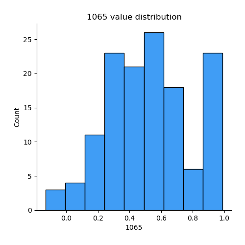
## Feature : 1066
- **Feature type** : continous
- **Missing** : 0.0%
- **Unique** : 135
- **Count** :135.0
- **Mean** :0.4624690094909537
- **Std** :0.3300997514567245
- **Min** :-0.556995510084153
- **25%th Percentile** : 0.24126959521932712
- **50%th Percentile** : 0.437001285271535
- **75%th Percentile** : 0.6969254297977503
- **Max** :0.9923192402473369

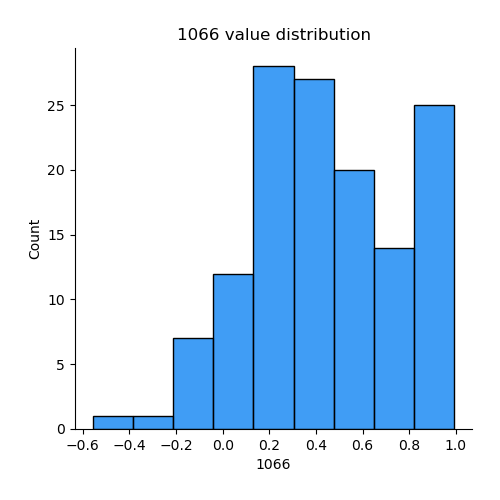
## Feature : 1067
- **Feature type** : continous
- **Missing** : 0.0%
- **Unique** : 135
- **Count** :135.0
- **Mean** :0.716595424720936
- **Std** :0.1994843908847899
- **Min** :-0.1074533910717148
- **25%th Percentile** : 0.6231597068558552
- **50%th Percentile** : 0.7390931168606607
- **75%th Percentile** : 0.8422005678199058
- **Max** :0.9964089383419471

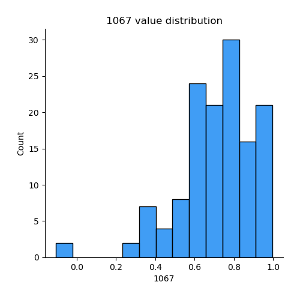
## Feature : 1068
- **Feature type** : continous
- **Missing** : 0.0%
- **Unique** : 135
- **Count** :135.0
- **Mean** :0.5284802069448964
- **Std** :0.2719343799649578
- **Min** :-0.26336147921555964
- **25%th Percentile** : 0.3369369837277434
- **50%th Percentile** : 0.5121415192900806
- **75%th Percentile** : 0.7168121256550763
- **Max** :0.9912362799590458

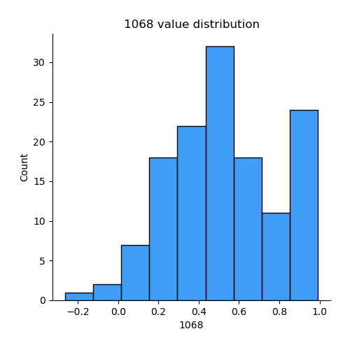
## Feature : 1069
- **Feature type** : continous
- **Missing** : 0.0%
- **Unique** : 135
- **Count** :135.0
- **Mean** :0.37264392549576586
- **Std** :0.30123267177236257
- **Min** :-0.2958472589299269
- **25%th Percentile** : 0.15641393168746442
- **50%th Percentile** : 0.3250805245574779
- **75%th Percentile** : 0.554660909297494
- **Max** :0.9823488588863429

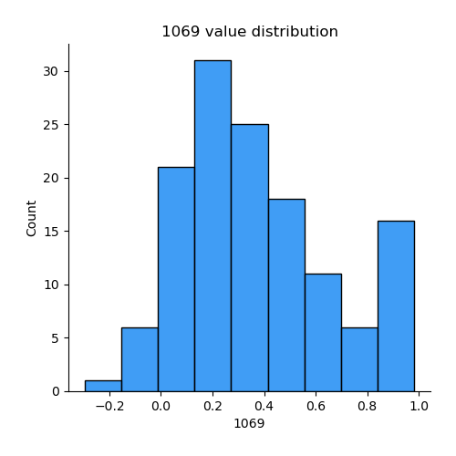
## Feature : 1070
- **Feature type** : continous
- **Missing** : 0.0%
- **Unique** : 135
- **Count** :135.0
- **Mean** :0.5190749179131097
- **Std** :0.29467510695550925
- **Min** :-0.45411405905758384
- **25%th Percentile** : 0.3160792536135933
- **50%th Percentile** : 0.5230529033802654
- **75%th Percentile** : 0.700070787261782
- **Max** :0.9942767179969294

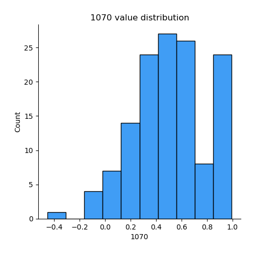
## Feature : 1071
- **Feature type** : continous
- **Missing** : 0.0%
- **Unique** : 135
- **Count** :135.0
- **Mean** :0.5924357086026594
- **Std** :0.25488485359855945
- **Min** :-0.2378696882951877
- **25%th Percentile** : 0.40644895270066067
- **50%th Percentile** : 0.580185357296867
- **75%th Percentile** : 0.7749529947786279
- **Max** :0.9942298710911135

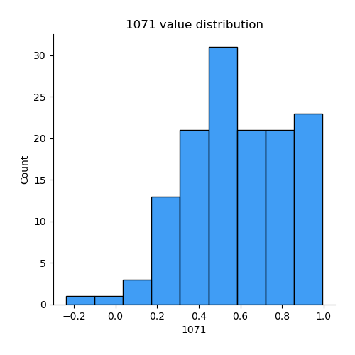
## Feature : 1072
- **Feature type** : continous
- **Missing** : 0.0%
- **Unique** : 135
- **Count** :135.0
- **Mean** :0.5226529588493807
- **Std** :0.2877426882111142
- **Min** :-0.2035222884855346
- **25%th Percentile** : 0.3274186655869419
- **50%th Percentile** : 0.49330806009137085
- **75%th Percentile** : 0.7119060114861291
- **Max** :0.9943755421909043

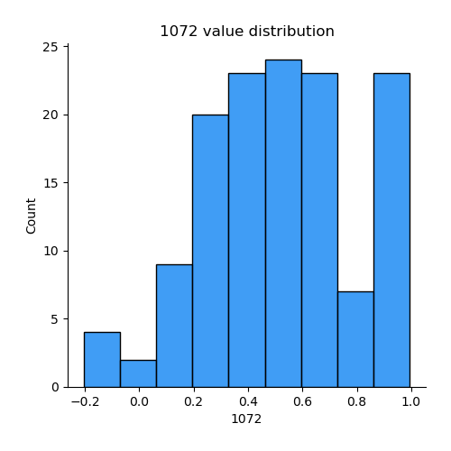
## Feature : 1073
- **Feature type** : continous
- **Missing** : 0.0%
- **Unique** : 135
- **Count** :135.0
- **Mean** :0.5759503934088283
- **Std** :0.2632268083054497
- **Min** :-0.2061238441803957
- **25%th Percentile** : 0.40299369911528404
- **50%th Percentile** : 0.5541034064967312
- **75%th Percentile** : 0.7382767066998375
- **Max** :0.9952189295027803

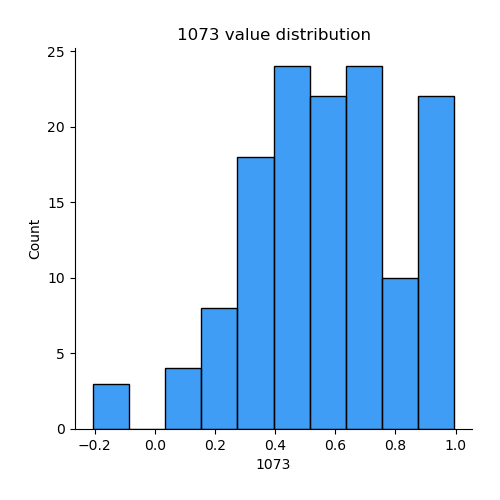
## Feature : 1074
- **Feature type** : continous
- **Missing** : 0.0%
- **Unique** : 135
- **Count** :135.0
- **Mean** :0.6156238805459766
- **Std** :0.2224975171994926
- **Min** :0.04880615192687765
- **25%th Percentile** : 0.4786292706683942
- **50%th Percentile** : 0.6054287269473669
- **75%th Percentile** : 0.759288385135195
- **Max** :0.9923222993588259

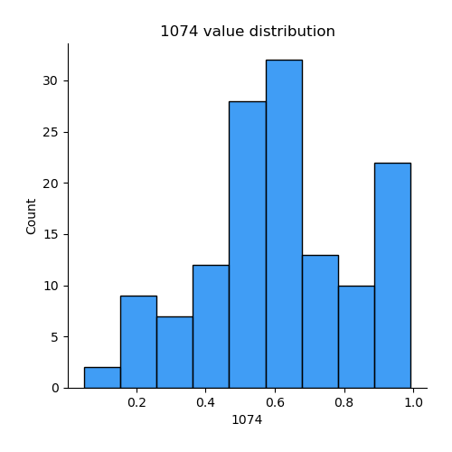
## Feature : 1075
- **Feature type** : continous
- **Missing** : 0.0%
- **Unique** : 135
- **Count** :135.0
- **Mean** :0.49996331605844163
- **Std** :0.28762034570499634
- **Min** :-0.3482713055572963
- **25%th Percentile** : 0.2940802551974651
- **50%th Percentile** : 0.4760510970369474
- **75%th Percentile** : 0.6957845973228616
- **Max** :0.9852441934955459

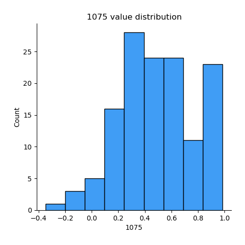
## Feature : 1076
- **Feature type** : continous
- **Missing** : 0.0%
- **Unique** : 135
- **Count** :135.0
- **Mean** :0.516257012584291
- **Std** :0.28677275143690534
- **Min** :-0.15653251831404028
- **25%th Percentile** : 0.3345021922071259
- **50%th Percentile** : 0.5014042391486544
- **75%th Percentile** : 0.7301708582931123
- **Max** :0.9944669660737004

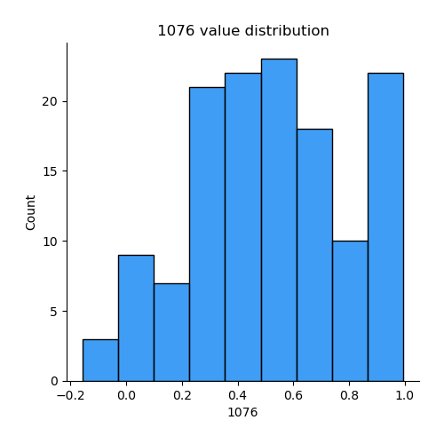
## Feature : 1077
- **Feature type** : continous
- **Missing** : 0.0%
- **Unique** : 135
- **Count** :135.0
- **Mean** :0.5408172504701225
- **Std** :0.2986820101518416
- **Min** :-0.29734679230693417
- **25%th Percentile** : 0.32662930307589766
- **50%th Percentile** : 0.5399597935819515
- **75%th Percentile** : 0.7289200235294495
- **Max** :0.9960738599561338

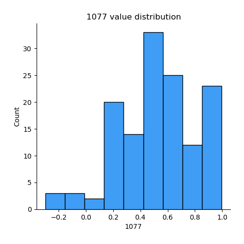
## Feature : 1078
- **Feature type** : continous
- **Missing** : 0.0%
- **Unique** : 135
- **Count** :135.0
- **Mean** :0.6734635312593797
- **Std** :0.21823126549552804
- **Min** :-0.06150075529757872
- **25%th Percentile** : 0.5427602729720289
- **50%th Percentile** : 0.6748565110535051
- **75%th Percentile** : 0.8119903059893674
- **Max** :0.9965845411387021

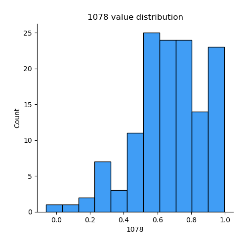
## Feature : 1079
- **Feature type** : continous
- **Missing** : 0.0%
- **Unique** : 135
- **Count** :135.0
- **Mean** :0.4515952818264858
- **Std** :0.31132293659702176
- **Min** :-0.40017178438791445
- **25%th Percentile** : 0.24829889009016054
- **50%th Percentile** : 0.41129691575363697
- **75%th Percentile** : 0.6145194022351725
- **Max** :0.9909751152495343

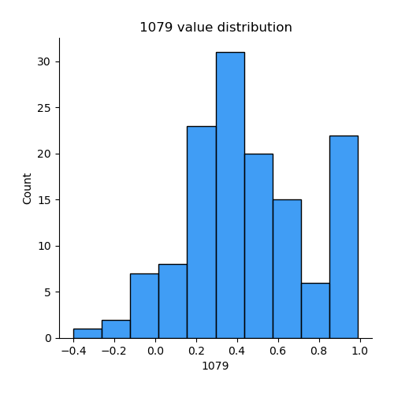
## Feature : 1080
- **Feature type** : continous
- **Missing** : 0.0%
- **Unique** : 135
- **Count** :135.0
- **Mean** :0.4940403376639861
- **Std** :0.2756733646165989
- **Min** :-0.2803109500509945
- **25%th Percentile** : 0.32163767116612696
- **50%th Percentile** : 0.47034062484463246
- **75%th Percentile** : 0.6811194434402614
- **Max** :0.9894413792136566

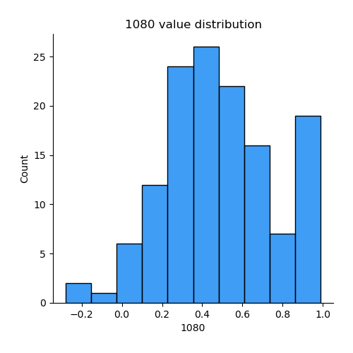
## Feature : 1081
- **Feature type** : continous
- **Missing** : 0.0%
- **Unique** : 135
- **Count** :135.0
- **Mean** :0.6735779668177092
- **Std** :0.2192895910641821
- **Min** :-0.08715168096904628
- **25%th Percentile** : 0.5743449797900944
- **50%th Percentile** : 0.6857688491518604
- **75%th Percentile** : 0.810954435984871
- **Max** :0.9969558294384893

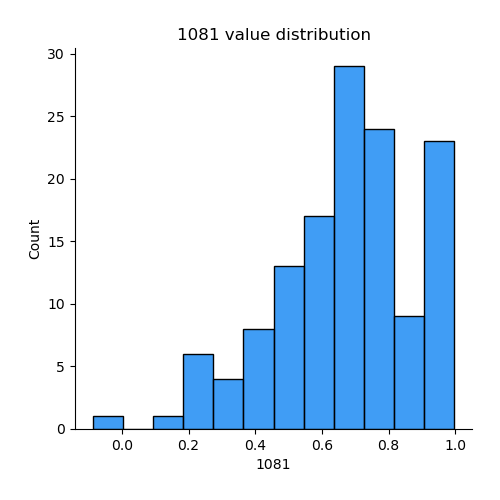
## Feature : 1082
- **Feature type** : continous
- **Missing** : 0.0%
- **Unique** : 135
- **Count** :135.0
- **Mean** :0.6863748918114183
- **Std** :0.20637258124875313
- **Min** :0.06752024985799474
- **25%th Percentile** : 0.5627504533944703
- **50%th Percentile** : 0.7113232435810782
- **75%th Percentile** : 0.8288398504404841
- **Max** :0.9960050157682533

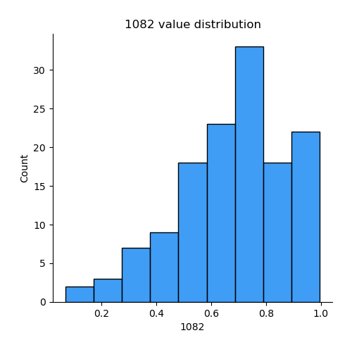
## Feature : 1083
- **Feature type** : continous
- **Missing** : 0.0%
- **Unique** : 135
- **Count** :135.0
- **Mean** :0.7206699135381126
- **Std** :0.20519329221907773
- **Min** :-0.06283827178134571
- **25%th Percentile** : 0.6324438748909085
- **50%th Percentile** : 0.7434170094531359
- **75%th Percentile** : 0.8552028765241233
- **Max** :0.9965082763608021

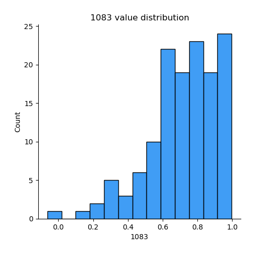
## Feature : 1084
- **Feature type** : continous
- **Missing** : 0.0%
- **Unique** : 135
- **Count** :135.0
- **Mean** :0.6508061974473698
- **Std** :0.21026109213029345
- **Min** :0.017968687223707636
- **25%th Percentile** : 0.5179225853302492
- **50%th Percentile** : 0.6386512371530145
- **75%th Percentile** : 0.7913851059421636
- **Max** :0.992434250329724

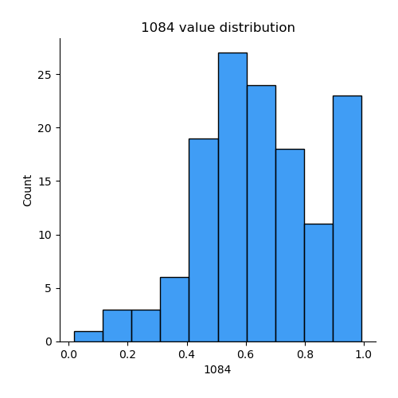
## Feature : 1085
- **Feature type** : continous
- **Missing** : 0.0%
- **Unique** : 135
- **Count** :135.0
- **Mean** :0.5959721283268516
- **Std** :0.23043740901739698
- **Min** :0.1468223980229181
- **25%th Percentile** : 0.42476446094629877
- **50%th Percentile** : 0.5816457771829107
- **75%th Percentile** : 0.7166631924359359
- **Max** :0.991537970447563

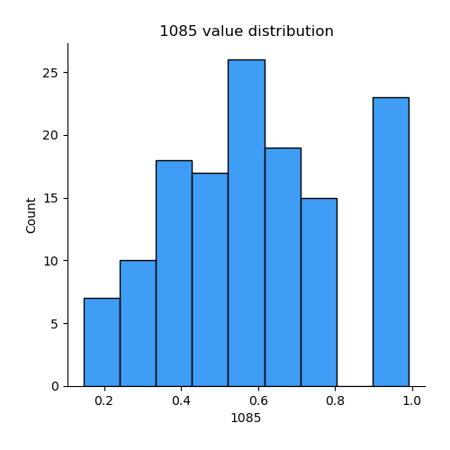
## Feature : 1086
- **Feature type** : continous
- **Missing** : 0.0%
- **Unique** : 135
- **Count** :135.0
- **Mean** :0.8920830506428636
- **Std** :0.09576263721134554
- **Min** :0.5403790127159943
- **25%th Percentile** : 0.8450527609232286
- **50%th Percentile** : 0.9102181754703893
- **75%th Percentile** : 0.964060445684117
- **Max** :0.9990495550489766

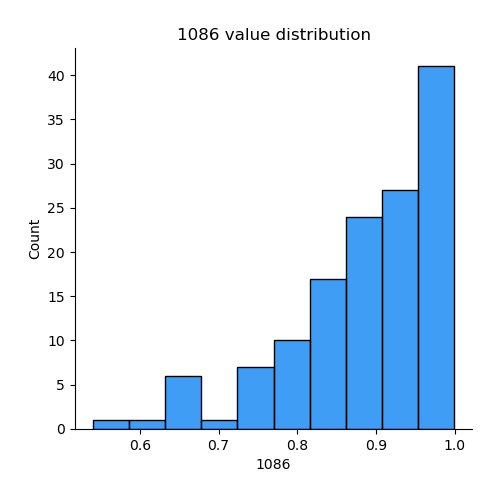
## Feature : 1087
- **Feature type** : continous
- **Missing** : 0.0%
- **Unique** : 135
- **Count** :135.0
- **Mean** :0.6223922542563213
- **Std** :0.24794423007891475
- **Min** :-0.4150984115270885
- **25%th Percentile** : 0.45699027711053286
- **50%th Percentile** : 0.6337656643669237
- **75%th Percentile** : 0.7842944497354147
- **Max** :0.9939803375130417

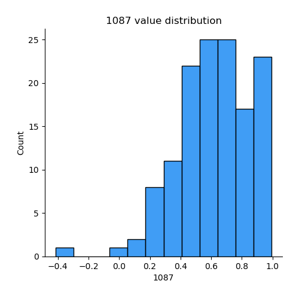
## Feature : 1088
- **Feature type** : continous
- **Missing** : 0.0%
- **Unique** : 135
- **Count** :135.0
- **Mean** :0.5406634395204224
- **Std** :0.30124732876957916
- **Min** :-0.38677763882331717
- **25%th Percentile** : 0.34986026617098887
- **50%th Percentile** : 0.5556918965689603
- **75%th Percentile** : 0.7343889653710739
- **Max** :0.9941121451277231

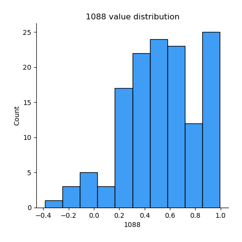
## Feature : 1089
- **Feature type** : continous
- **Missing** : 0.0%
- **Unique** : 135
- **Count** :135.0
- **Mean** :0.594481900529112
- **Std** :0.2688754022231356
- **Min** :-0.4094148244819579
- **25%th Percentile** : 0.40926307364011294
- **50%th Percentile** : 0.5998047335865532
- **75%th Percentile** : 0.7751270543180102
- **Max** :0.9952498463580467

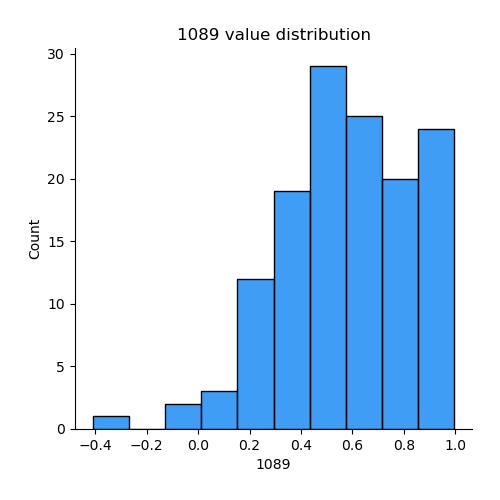
## Feature : 1090
- **Feature type** : continous
- **Missing** : 0.0%
- **Unique** : 135
- **Count** :135.0
- **Mean** :0.3867661325214779
- **Std** :0.3030163485160797
- **Min** :-0.4741882496753083
- **25%th Percentile** : 0.1889053273278259
- **50%th Percentile** : 0.317500227222486
- **75%th Percentile** : 0.5495721202142787
- **Max** :0.9841073980380968

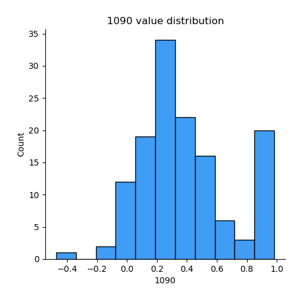
## Feature : 1091
- **Feature type** : continous
- **Missing** : 0.0%
- **Unique** : 135
- **Count** :135.0
- **Mean** :0.4676826518225464
- **Std** :0.2990227275067048
- **Min** :-0.4381406645312572
- **25%th Percentile** : 0.2592418792907508
- **50%th Percentile** : 0.4375906574527422
- **75%th Percentile** : 0.6644623097852917
- **Max** :0.9911439971746093

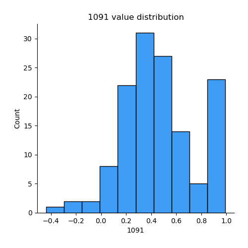
## Feature : 1113
- **Feature type** : continous
- **Missing** : 0.0%
- **Unique** : 3
- **Count** :135.0
- **Mean** :1.0
- **Std** :6.98225596019958e-17
- **Min** :0.9999999999999998
- **25%th Percentile** : 1.0
- **50%th Percentile** : 1.0
- **75%th Percentile** : 1.0
- **Max** :1.0

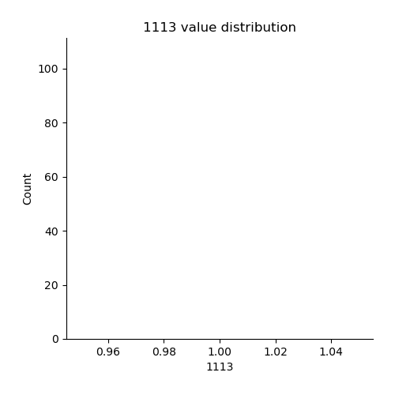
## Feature : 1114
- **Feature type** : continous
- **Missing** : 0.0%
- **Unique** : 135
- **Count** :135.0
- **Mean** :0.5952190424262517
- **Std** :0.25720762527749197
- **Min** :-0.09802479726885942
- **25%th Percentile** : 0.42381894434588274
- **50%th Percentile** : 0.5933832975272132
- **75%th Percentile** : 0.7575183173503054
- **Max** :0.9908842424013703

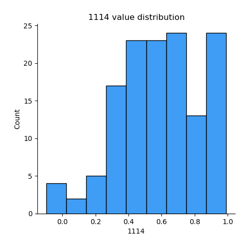
## Feature : 1115
- **Feature type** : continous
- **Missing** : 0.0%
- **Unique** : 135
- **Count** :135.0
- **Mean** :0.7884195424913572
- **Std** :0.14992553775449255
- **Min** :0.32619455406677494
- **25%th Percentile** : 0.7067927981656028
- **50%th Percentile** : 0.8024985361276444
- **75%th Percentile** : 0.888358074117865
- **Max** :0.9977549529856231

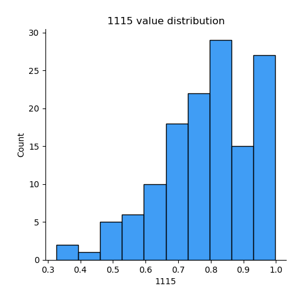
## Feature : 1116
- **Feature type** : continous
- **Missing** : 0.0%
- **Unique** : 135
- **Count** :135.0
- **Mean** :0.3729859456122105
- **Std** :0.30540694859031176
- **Min** :-0.4126626909971369
- **25%th Percentile** : 0.15043441907964977
- **50%th Percentile** : 0.3282732856701651
- **75%th Percentile** : 0.4801245120959801
- **Max** :0.9763831490501335

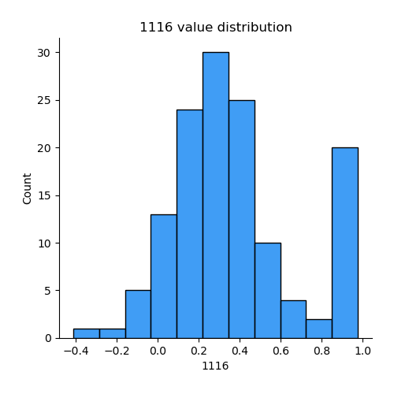
## Feature : 1117
- **Feature type** : continous
- **Missing** : 0.0%
- **Unique** : 135
- **Count** :135.0
- **Mean** :0.5503248052605776
- **Std** :0.2626295235058537
- **Min** :-0.161525531096553
- **25%th Percentile** : 0.3934179294327417
- **50%th Percentile** : 0.5251305152780918
- **75%th Percentile** : 0.7273987016713055
- **Max** :0.9884952134162953

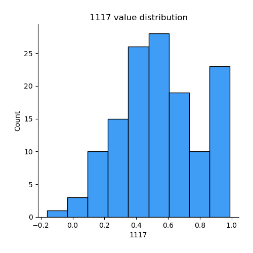
## Feature : 1118
- **Feature type** : continous
- **Missing** : 0.0%
- **Unique** : 135
- **Count** :135.0
- **Mean** :0.5413724487585202
- **Std** :0.2907867961860654
- **Min** :-0.2879867769188224
- **25%th Percentile** : 0.3652097501775166
- **50%th Percentile** : 0.537007346811703
- **75%th Percentile** : 0.7446045460518915
- **Max** :0.9939758568128114

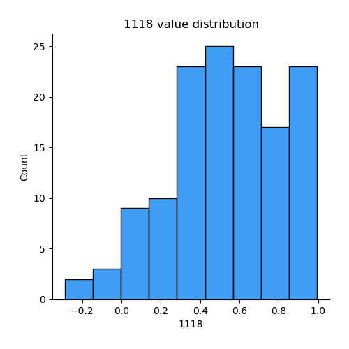
## Feature : 1119
- **Feature type** : continous
- **Missing** : 0.0%
- **Unique** : 135
- **Count** :135.0
- **Mean** :0.6002315282801337
- **Std** :0.22745585069396257
- **Min** :0.02260585316049804
- **25%th Percentile** : 0.45466121581278673
- **50%th Percentile** : 0.5897266348265815
- **75%th Percentile** : 0.7181906051193252
- **Max** :0.9940464722930328

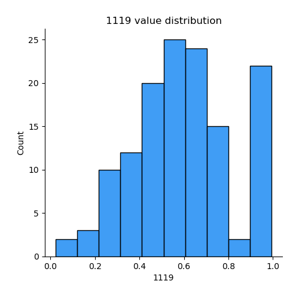
## Feature : 1120
- **Feature type** : continous
- **Missing** : 0.0%
- **Unique** : 135
- **Count** :135.0
- **Mean** :0.7569056438796236
- **Std** :0.1561854858952461
- **Min** :0.2559902123566147
- **25%th Percentile** : 0.6563794593660426
- **50%th Percentile** : 0.778844791173825
- **75%th Percentile** : 0.8594809138725652
- **Max** :0.9909940023965736

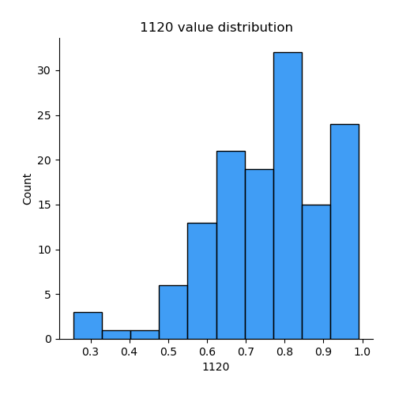
## Feature : 1121
- **Feature type** : continous
- **Missing** : 0.0%
- **Unique** : 135
- **Count** :135.0
- **Mean** :0.37894292273992647
- **Std** :0.30193579550812377
- **Min** :-0.22261602851769316
- **25%th Percentile** : 0.1812556764442874
- **50%th Percentile** : 0.35603650552670524
- **75%th Percentile** : 0.5410995838205795
- **Max** :0.9795816395000926

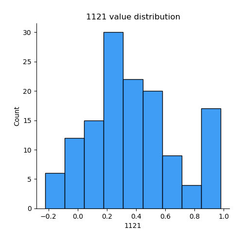
## Feature : 1122
- **Feature type** : continous
- **Missing** : 0.0%
- **Unique** : 135
- **Count** :135.0
- **Mean** :0.6786926462689379
- **Std** :0.22247477038660546
- **Min** :0.006009820753611807
- **25%th Percentile** : 0.5373245850503967
- **50%th Percentile** : 0.719355942336786
- **75%th Percentile** : 0.8239950316519921
- **Max** :0.9950402529277249

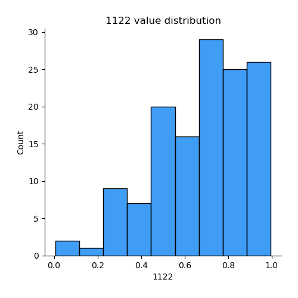
## Feature : 1123
- **Feature type** : continous
- **Missing** : 0.0%
- **Unique** : 135
- **Count** :135.0
- **Mean** :0.7274466924020789
- **Std** :0.20420701571017927
- **Min** :-0.03500774890691999
- **25%th Percentile** : 0.6446931831689342
- **50%th Percentile** : 0.7438973469296256
- **75%th Percentile** : 0.8406326560001647
- **Max** :0.9954058058776475

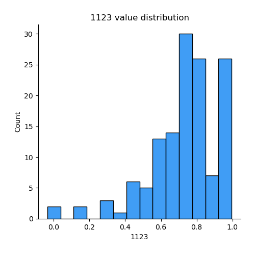
## Feature : 1124
- **Feature type** : continous
- **Missing** : 0.0%
- **Unique** : 135
- **Count** :135.0
- **Mean** :0.6072798796928128
- **Std** :0.25388892995128537
- **Min** :-0.0763722531008624
- **25%th Percentile** : 0.45787191448529674
- **50%th Percentile** : 0.6207315316355809
- **75%th Percentile** : 0.7680719167343348
- **Max** :0.9943228903161349

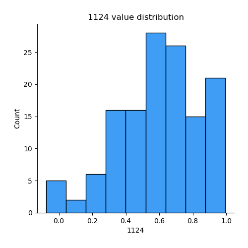
## Feature : 1125
- **Feature type** : continous
- **Missing** : 0.0%
- **Unique** : 135
- **Count** :135.0
- **Mean** :0.6189018794843358
- **Std** :0.23755313932592295
- **Min** :-0.05299925568599055
- **25%th Percentile** : 0.4713548924437092
- **50%th Percentile** : 0.6103829620299541
- **75%th Percentile** : 0.7800201406149516
- **Max** :0.9934016342701912

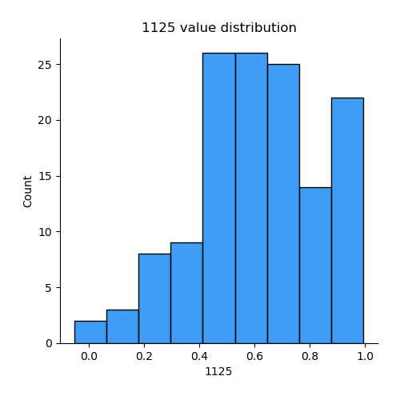
## Feature : 1126
- **Feature type** : continous
- **Missing** : 0.0%
- **Unique** : 135
- **Count** :135.0
- **Mean** :0.6283371637331185
- **Std** :0.24211201144846178
- **Min** :-0.08550190085584057
- **25%th Percentile** : 0.4777815697944807
- **50%th Percentile** : 0.6396097331487164
- **75%th Percentile** : 0.7951818172586405
- **Max** :0.9870033675130675

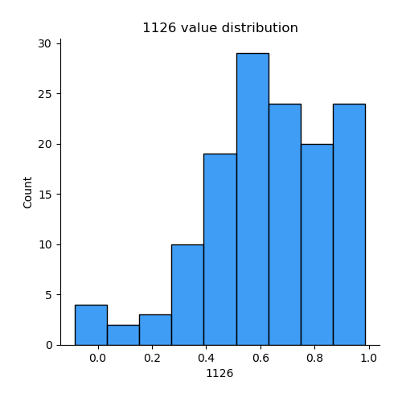
## Feature : 1127
- **Feature type** : continous
- **Missing** : 0.0%
- **Unique** : 135
- **Count** :135.0
- **Mean** :0.6986669121317416
- **Std** :0.19427694472881174
- **Min** :0.17878550899220486
- **25%th Percentile** : 0.5758415771832877
- **50%th Percentile** : 0.7223196183675635
- **75%th Percentile** : 0.8266301325556249
- **Max** :0.9932025503332073

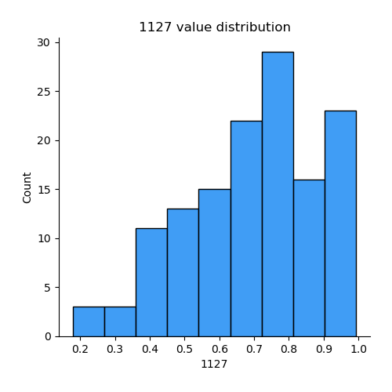
## Feature : 1128
- **Feature type** : continous
- **Missing** : 0.0%
- **Unique** : 135
- **Count** :135.0
- **Mean** :0.7150238651283145
- **Std** :0.1928101474312829
- **Min** :0.08537870592068096
- **25%th Percentile** : 0.6112165639422958
- **50%th Percentile** : 0.7296471531711614
- **75%th Percentile** : 0.8488311847057379
- **Max** :0.9944250446889423

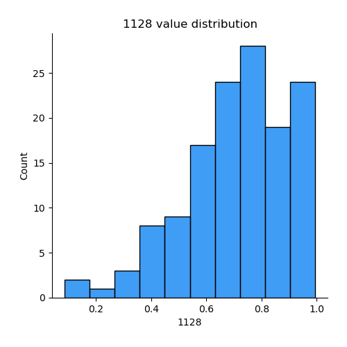
## Feature : 1129
- **Feature type** : continous
- **Missing** : 0.0%
- **Unique** : 135
- **Count** :135.0
- **Mean** :0.5489543235391032
- **Std** :0.29352872157532844
- **Min** :-0.22556141359437448
- **25%th Percentile** : 0.3666563648289388
- **50%th Percentile** : 0.5520709652133454
- **75%th Percentile** : 0.7328040282837247
- **Max** :0.9926256477566193

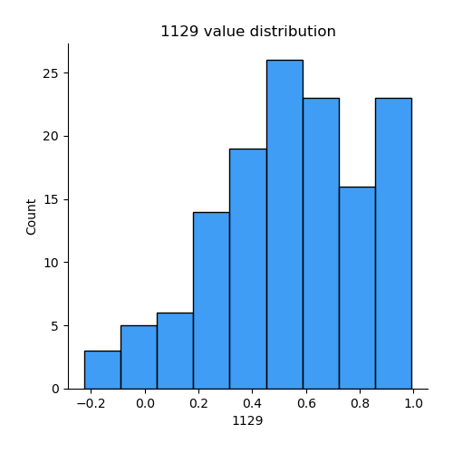
## Feature : 1130
- **Feature type** : continous
- **Missing** : 0.0%
- **Unique** : 135
- **Count** :135.0
- **Mean** :0.7373839844033835
- **Std** :0.16871999804216553
- **Min** :0.15972882043381642
- **25%th Percentile** : 0.6385907371190566
- **50%th Percentile** : 0.7359529839684966
- **75%th Percentile** : 0.8509191741182907
- **Max** :0.9955995697284361

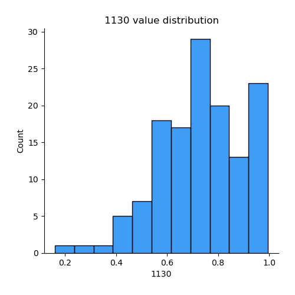
## Feature : 1131
- **Feature type** : continous
- **Missing** : 0.0%
- **Unique** : 135
- **Count** :135.0
- **Mean** :0.544672684446986
- **Std** :0.2676513974028409
- **Min** :-0.16816525094195742
- **25%th Percentile** : 0.3462555202940327
- **50%th Percentile** : 0.5201432119862777
- **75%th Percentile** : 0.7199054601142882
- **Max** :0.9911733003155399

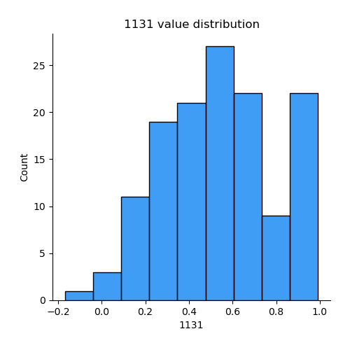
## Feature : 1132
- **Feature type** : continous
- **Missing** : 0.0%
- **Unique** : 135
- **Count** :135.0
- **Mean** :0.6554755217524271
- **Std** :0.2148452283452993
- **Min** :-0.31196158366022264
- **25%th Percentile** : 0.5404360931476138
- **50%th Percentile** : 0.660054617635879
- **75%th Percentile** : 0.7958951530178111
- **Max** :0.9870671054068938

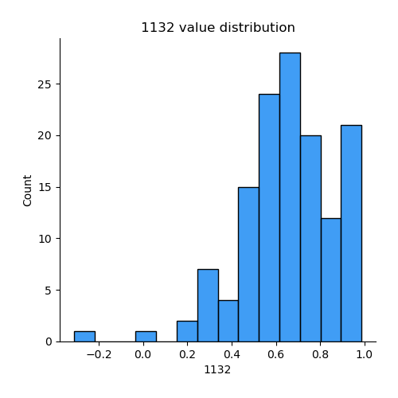
## Feature : 1133
- **Feature type** : continous
- **Missing** : 0.0%
- **Unique** : 135
- **Count** :135.0
- **Mean** :0.7388846801175794
- **Std** :0.1874207491665906
- **Min** :-0.15314305404424763
- **25%th Percentile** : 0.6276340973743564
- **50%th Percentile** : 0.7622488796794894
- **75%th Percentile** : 0.8521735920407564
- **Max** :0.99503896918122

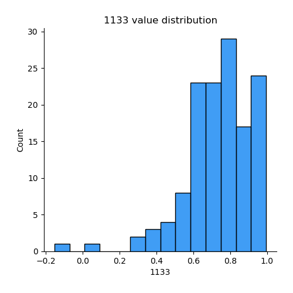
## Feature : 1134
- **Feature type** : continous
- **Missing** : 0.0%
- **Unique** : 135
- **Count** :135.0
- **Mean** :0.6983128640502485
- **Std** :0.19137375029325254
- **Min** :0.0996268916768025
- **25%th Percentile** : 0.6011067328554399
- **50%th Percentile** : 0.6849762582105127
- **75%th Percentile** : 0.8266085262677849
- **Max** :0.9948198203285447

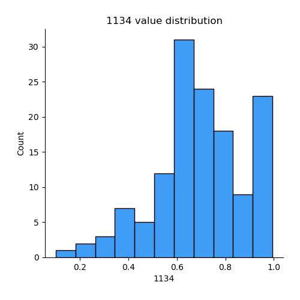
## Feature : 1135
- **Feature type** : continous
- **Missing** : 0.0%
- **Unique** : 135
- **Count** :135.0
- **Mean** :0.7702802368103392
- **Std** :0.16252294196330908
- **Min** :0.008007099623380545
- **25%th Percentile** : 0.6926755028195559
- **50%th Percentile** : 0.7876204880815436
- **75%th Percentile** : 0.8566640446208249
- **Max** :0.997571360366392

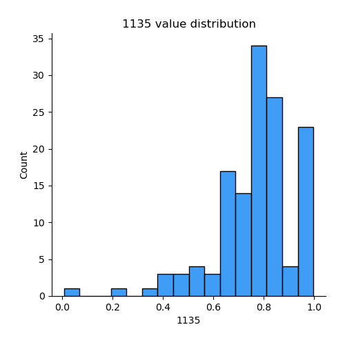
## Feature : 1136
- **Feature type** : continous
- **Missing** : 0.0%
- **Unique** : 135
- **Count** :135.0
- **Mean** :0.7957881695655147
- **Std** :0.15516597624088516
- **Min** :0.2703190371981595
- **25%th Percentile** : 0.7179292922171381
- **50%th Percentile** : 0.8284185907831678
- **75%th Percentile** : 0.8942756192983967
- **Max** :0.9960268130985228

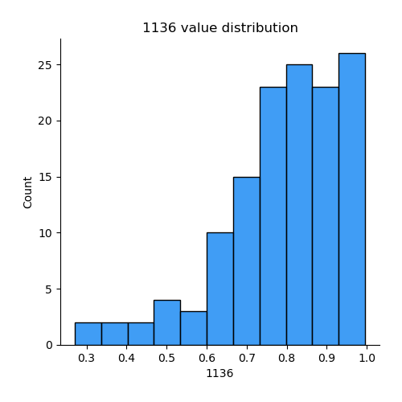
## Feature : 1137
- **Feature type** : continous
- **Missing** : 0.0%
- **Unique** : 135
- **Count** :135.0
- **Mean** :0.39315542552736915
- **Std** :0.32548728454071396
- **Min** :-0.4046329323574258
- **25%th Percentile** : 0.16728208907179493
- **50%th Percentile** : 0.3465969133058316
- **75%th Percentile** : 0.5694821151556161
- **Max** :0.988089038962417

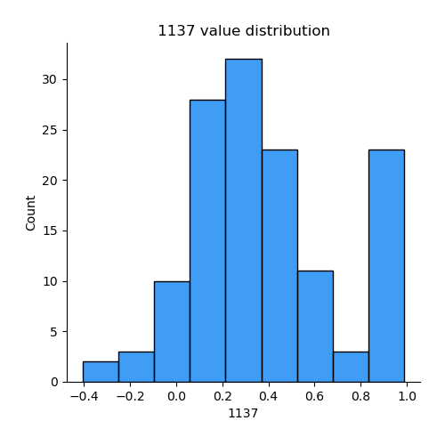
## Feature : 1138
- **Feature type** : continous
- **Missing** : 0.0%
- **Unique** : 135
- **Count** :135.0
- **Mean** :0.6418638508483797
- **Std** :0.2292221793324884
- **Min** :-0.061529343326476665
- **25%th Percentile** : 0.5197326092267547
- **50%th Percentile** : 0.6380883640119019
- **75%th Percentile** : 0.7722926757433066
- **Max** :0.994604917516526

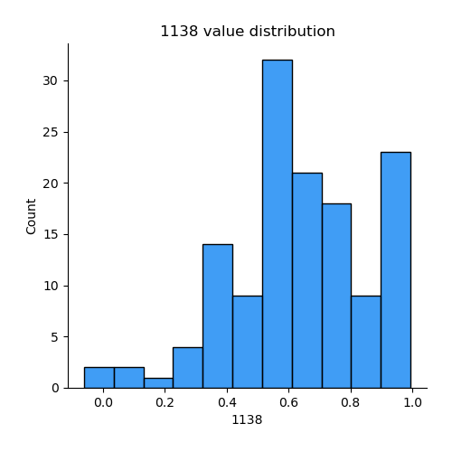
## Feature : 1139
- **Feature type** : continous
- **Missing** : 0.0%
- **Unique** : 135
- **Count** :135.0
- **Mean** :0.9304042764921225
- **Std** :0.05832567256741493
- **Min** :0.6560783486646374
- **25%th Percentile** : 0.9037105816769835
- **50%th Percentile** : 0.9418460896018476
- **75%th Percentile** : 0.968128491406216
- **Max** :0.9993209381047726

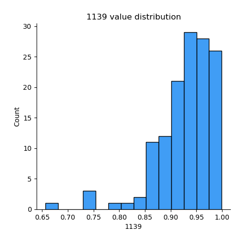
## Feature : 1140
- **Feature type** : continous
- **Missing** : 0.0%
- **Unique** : 135
- **Count** :135.0
- **Mean** :0.5730121599659554
- **Std** :0.2714119100014641
- **Min** :-0.13218870360109233
- **25%th Percentile** : 0.40348817696711137
- **50%th Percentile** : 0.5775387840262592
- **75%th Percentile** : 0.7378747287021217
- **Max** :0.9916204213323768

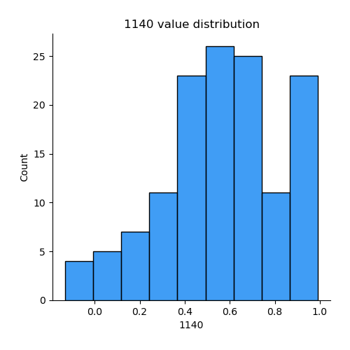
## Feature : 1141
- **Feature type** : continous
- **Missing** : 0.0%
- **Unique** : 135
- **Count** :135.0
- **Mean** :0.7658392091298725
- **Std** :0.16305005916112691
- **Min** :0.17641208314060325
- **25%th Percentile** : 0.6763542959474245
- **50%th Percentile** : 0.7689490065572643
- **75%th Percentile** : 0.8744845541618096
- **Max** :0.9964745021522624

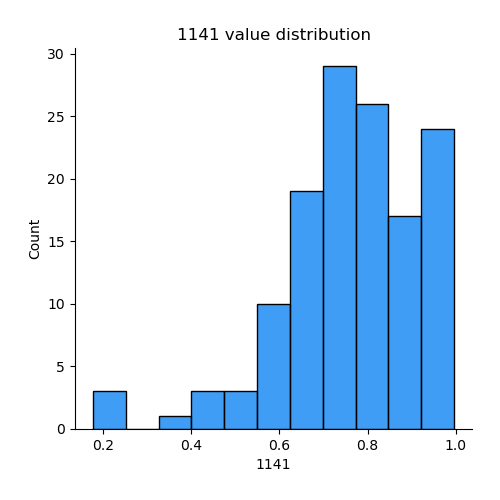
## Feature : 1142
- **Feature type** : continous
- **Missing** : 0.0%
- **Unique** : 135
- **Count** :135.0
- **Mean** :0.354151014901068
- **Std** :0.3119569117334694
- **Min** :-0.4634304137088825
- **25%th Percentile** : 0.13521598201319396
- **50%th Percentile** : 0.28470426625094414
- **75%th Percentile** : 0.4942981930766937
- **Max** :0.9775036246296128

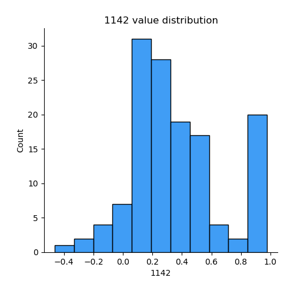
## Feature : 1143
- **Feature type** : continous
- **Missing** : 0.0%
- **Unique** : 135
- **Count** :135.0
- **Mean** :0.47486403145272366
- **Std** :0.2881950967410753
- **Min** :-0.2188491750095024
- **25%th Percentile** : 0.28664691488895855
- **50%th Percentile** : 0.425137904557753
- **75%th Percentile** : 0.650946191999868
- **Max** :0.9886425999925122

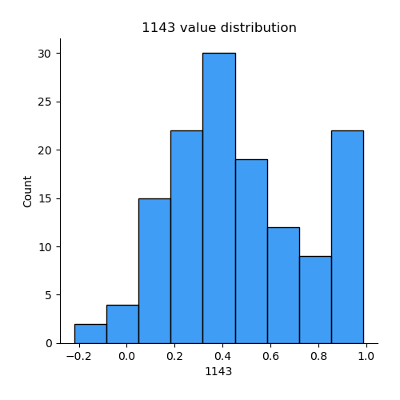
## Feature : 1166
- **Feature type** : continous
- **Missing** : 0.0%
- **Unique** : 3
- **Count** :135.0
- **Mean** :1.0
- **Std** :8.415950902694798e-17
- **Min** :0.9999999999999998
- **25%th Percentile** : 0.9999999999999999
- **50%th Percentile** : 1.0
- **75%th Percentile** : 1.0
- **Max** :1.0

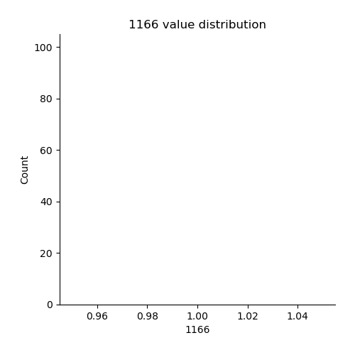
## Feature : 1167
- **Feature type** : continous
- **Missing** : 0.0%
- **Unique** : 135
- **Count** :135.0
- **Mean** :0.6881579249001529
- **Std** :0.21582637083911183
- **Min** :-0.03894034529320696
- **25%th Percentile** : 0.5570307521717385
- **50%th Percentile** : 0.6918442635472253
- **75%th Percentile** : 0.8356577790722075
- **Max** :0.9949430516507205

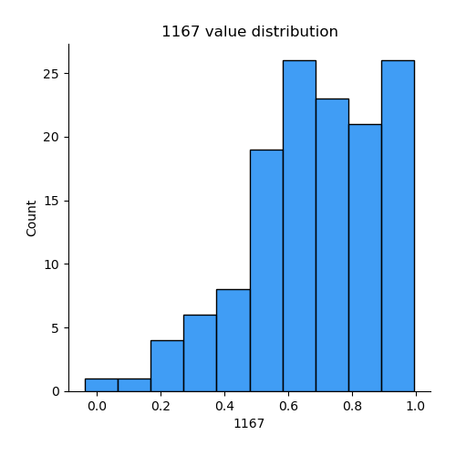
## Feature : 1168
- **Feature type** : continous
- **Missing** : 0.0%
- **Unique** : 135
- **Count** :135.0
- **Mean** :0.5274742942464385
- **Std** :0.24914832327011305
- **Min** :-0.11147206783192735
- **25%th Percentile** : 0.3700256740893409
- **50%th Percentile** : 0.507685255992171
- **75%th Percentile** : 0.6658322545755149
- **Max** :0.9883239850248631

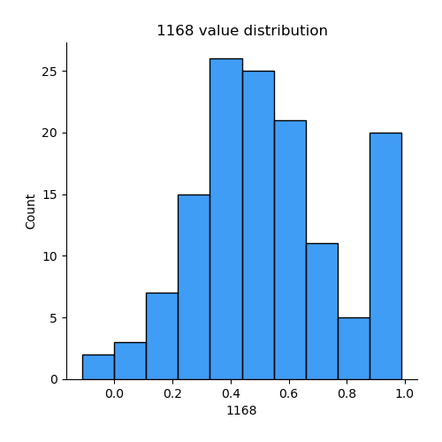
## Feature : 1169
- **Feature type** : continous
- **Missing** : 0.0%
- **Unique** : 135
- **Count** :135.0
- **Mean** :0.8086639382262258
- **Std** :0.125925227359298
- **Min** :0.4728576267468307
- **25%th Percentile** : 0.7346870252225479
- **50%th Percentile** : 0.8204839760376533
- **75%th Percentile** : 0.8935078165277224
- **Max** :0.995541505346692

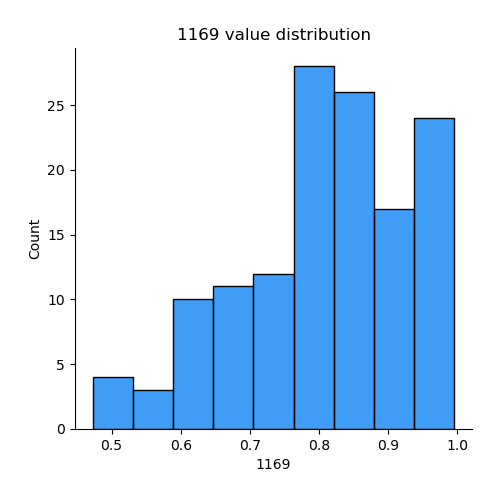
## Feature : 1170
- **Feature type** : continous
- **Missing** : 0.0%
- **Unique** : 135
- **Count** :135.0
- **Mean** :0.6689518452479107
- **Std** :0.24028197194586307
- **Min** :-0.20273002359421718
- **25%th Percentile** : 0.5424193071798498
- **50%th Percentile** : 0.6971389033700817
- **75%th Percentile** : 0.8473261149035896
- **Max** :0.994082340048735

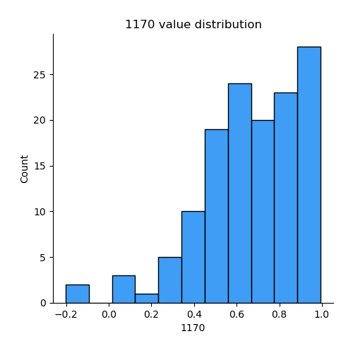
## Feature : 1171
- **Feature type** : continous
- **Missing** : 0.0%
- **Unique** : 135
- **Count** :135.0
- **Mean** :0.5610657799004927
- **Std** :0.25958700303832055
- **Min** :-0.17618614304273036
- **25%th Percentile** : 0.39394814154044844
- **50%th Percentile** : 0.5712205856438647
- **75%th Percentile** : 0.6918779841397269
- **Max** :0.9914053975309408

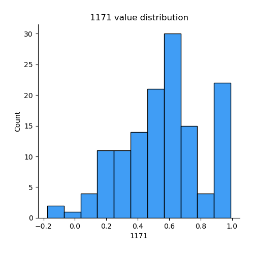
## Feature : 1172
- **Feature type** : continous
- **Missing** : 0.0%
- **Unique** : 135
- **Count** :135.0
- **Mean** :0.6205673025421267
- **Std** :0.23724504271136485
- **Min** :-0.09488706134614826
- **25%th Percentile** : 0.476060119729177
- **50%th Percentile** : 0.6154553067927454
- **75%th Percentile** : 0.8028355200525339
- **Max** :0.9857587468139004

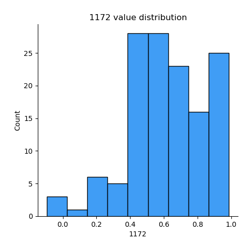
## Feature : 1173
- **Feature type** : continous
- **Missing** : 0.0%
- **Unique** : 135
- **Count** :135.0
- **Mean** :0.4542556329720072
- **Std** :0.27691640299302556
- **Min** :-0.14467955307313987
- **25%th Percentile** : 0.22658631492671594
- **50%th Percentile** : 0.4245933903342263
- **75%th Percentile** : 0.6429649815290887
- **Max** :0.9885962907079273

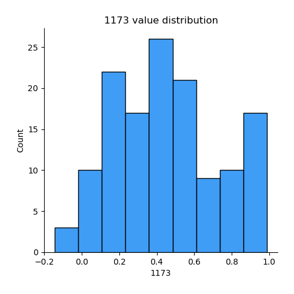
## Feature : 1174
- **Feature type** : continous
- **Missing** : 0.0%
- **Unique** : 135
- **Count** :135.0
- **Mean** :0.6397185845159773
- **Std** :0.2265253847852211
- **Min** :-0.033914467853358415
- **25%th Percentile** : 0.5077586738862696
- **50%th Percentile** : 0.6470228827325225
- **75%th Percentile** : 0.7931003155769856
- **Max** :0.9916474571956735

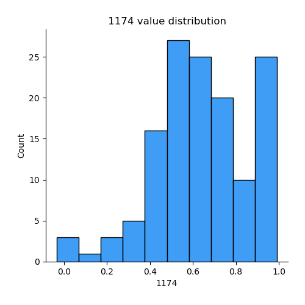
## Feature : 1175
- **Feature type** : continous
- **Missing** : 0.0%
- **Unique** : 135
- **Count** :135.0
- **Mean** :0.5957361710696685
- **Std** :0.26328250168915135
- **Min** :-0.25766727728245653
- **25%th Percentile** : 0.4612516648702829
- **50%th Percentile** : 0.5908877233857034
- **75%th Percentile** : 0.7591303103465509
- **Max** :0.9939399693248948

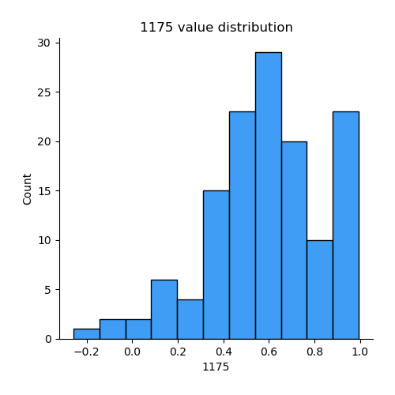
## Feature : 1176
- **Feature type** : continous
- **Missing** : 0.0%
- **Unique** : 135
- **Count** :135.0
- **Mean** :0.5881765937953225
- **Std** :0.26343112120782314
- **Min** :-0.19360995820688093
- **25%th Percentile** : 0.450645041394228
- **50%th Percentile** : 0.6001456330301563
- **75%th Percentile** : 0.7300091200807055
- **Max** :0.9920359211601957

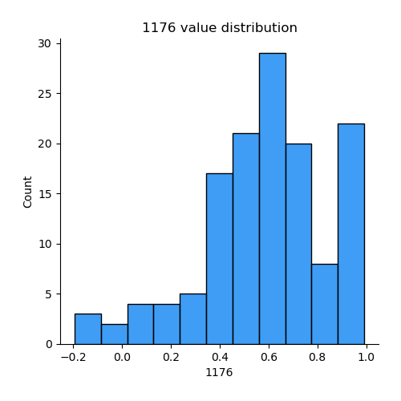
## Feature : 1177
- **Feature type** : continous
- **Missing** : 0.0%
- **Unique** : 135
- **Count** :135.0
- **Mean** :0.7097731160945385
- **Std** :0.2294271667901984
- **Min** :-0.1702674629457682
- **25%th Percentile** : 0.6130270279015311
- **50%th Percentile** : 0.7363884533311585
- **75%th Percentile** : 0.8603951066887774
- **Max** :0.9957121338638262

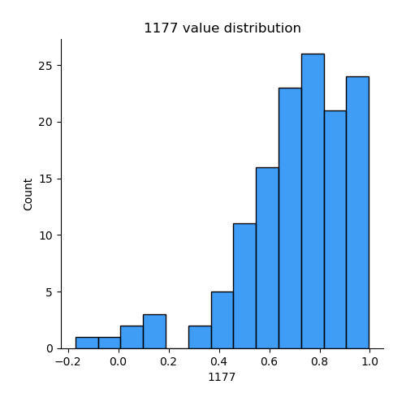
## Feature : 1178
- **Feature type** : continous
- **Missing** : 0.0%
- **Unique** : 135
- **Count** :135.0
- **Mean** :0.6055641146746216
- **Std** :0.23810465103314907
- **Min** :-0.24249726027765092
- **25%th Percentile** : 0.4286210267396938
- **50%th Percentile** : 0.5992312190109202
- **75%th Percentile** : 0.7705625135613527
- **Max** :0.9826980839329932

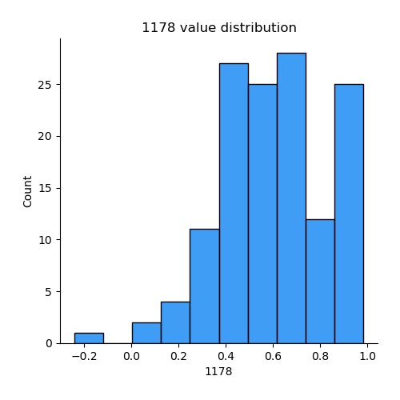
## Feature : 1179
- **Feature type** : continous
- **Missing** : 0.0%
- **Unique** : 135
- **Count** :135.0
- **Mean** :0.5757172269085299
- **Std** :0.250409164079846
- **Min** :-0.16474615944691862
- **25%th Percentile** : 0.426230496227478
- **50%th Percentile** : 0.5842422922457996
- **75%th Percentile** : 0.7455144698499307
- **Max** :0.9897344992732385

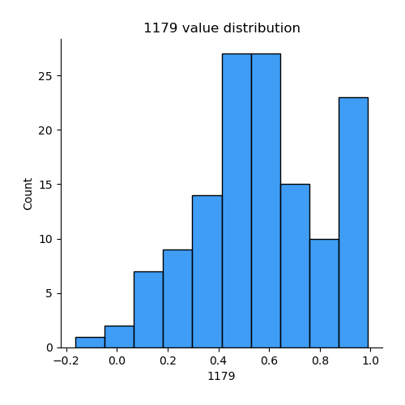
## Feature : 1180
- **Feature type** : continous
- **Missing** : 0.0%
- **Unique** : 135
- **Count** :135.0
- **Mean** :0.6195547446198872
- **Std** :0.233433591407049
- **Min** :-0.013081072803199829
- **25%th Percentile** : 0.4623603923874367
- **50%th Percentile** : 0.6159168827800617
- **75%th Percentile** : 0.7779220018381513
- **Max** :0.9892386493030639

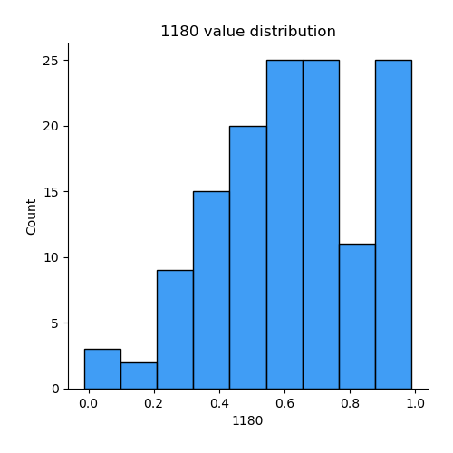
## Feature : 1181
- **Feature type** : continous
- **Missing** : 0.0%
- **Unique** : 135
- **Count** :135.0
- **Mean** :0.6634040224116866
- **Std** :0.2585858953292853
- **Min** :-0.32973895201791953
- **25%th Percentile** : 0.537809875743358
- **50%th Percentile** : 0.7084008510334792
- **75%th Percentile** : 0.828874225922803
- **Max** :0.9967090590088635

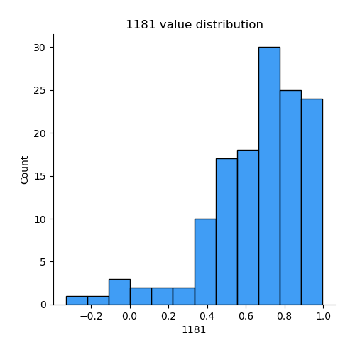
## Feature : 1182
- **Feature type** : continous
- **Missing** : 0.0%
- **Unique** : 135
- **Count** :135.0
- **Mean** :0.5223636489556538
- **Std** :0.3037343513503553
- **Min** :-0.4577552292535681
- **25%th Percentile** : 0.3154952769242595
- **50%th Percentile** : 0.5331054912755722
- **75%th Percentile** : 0.724887767265358
- **Max** :0.9949729755037915

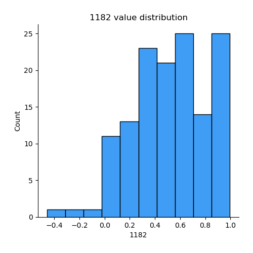
## Feature : 1183
- **Feature type** : continous
- **Missing** : 0.0%
- **Unique** : 135
- **Count** :135.0
- **Mean** :0.5482419193924883
- **Std** :0.2703768163943979
- **Min** :-0.25199230252149274
- **25%th Percentile** : 0.3883487183628627
- **50%th Percentile** : 0.525582775627826
- **75%th Percentile** : 0.7136388878176438
- **Max** :0.9928497058307191

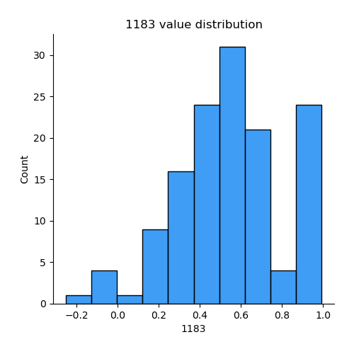
## Feature : 1184
- **Feature type** : continous
- **Missing** : 0.0%
- **Unique** : 135
- **Count** :135.0
- **Mean** :0.5657284426877665
- **Std** :0.2432838804041349
- **Min** :-0.07541989901524132
- **25%th Percentile** : 0.41555813582952483
- **50%th Percentile** : 0.5333295995400845
- **75%th Percentile** : 0.7394584112554066
- **Max** :0.9802513272464703

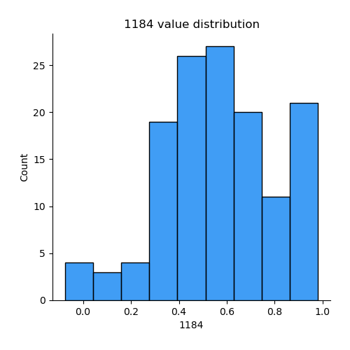
## Feature : 1185
- **Feature type** : continous
- **Missing** : 0.0%
- **Unique** : 135
- **Count** :135.0
- **Mean** :0.5814091524086686
- **Std** :0.2881524219418306
- **Min** :-0.25661549449817556
- **25%th Percentile** : 0.41227931559270997
- **50%th Percentile** : 0.5885296617534731
- **75%th Percentile** : 0.7753160552897951
- **Max** :0.994441255564983

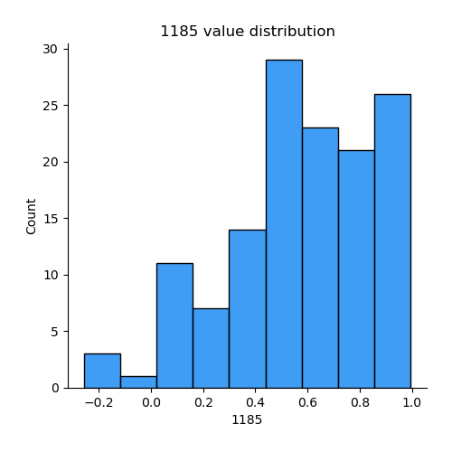
## Feature : 1186
- **Feature type** : continous
- **Missing** : 0.0%
- **Unique** : 135
- **Count** :135.0
- **Mean** :0.6205891084756672
- **Std** :0.23028447561014262
- **Min** :0.11126850332346679
- **25%th Percentile** : 0.45868883757245127
- **50%th Percentile** : 0.6157758390664104
- **75%th Percentile** : 0.7709036807614065
- **Max** :0.9924330629945595

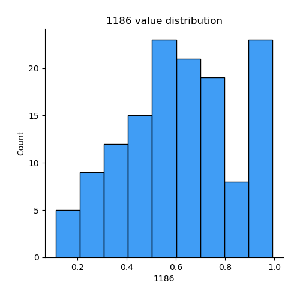
## Feature : 1187
- **Feature type** : continous
- **Missing** : 0.0%
- **Unique** : 135
- **Count** :135.0
- **Mean** :0.5725135194687665
- **Std** :0.29362671349403946
- **Min** :-0.2348237659776618
- **25%th Percentile** : 0.41650890832372073
- **50%th Percentile** : 0.5921732960650675
- **75%th Percentile** : 0.7749433287541958
- **Max** :0.9942405562878139

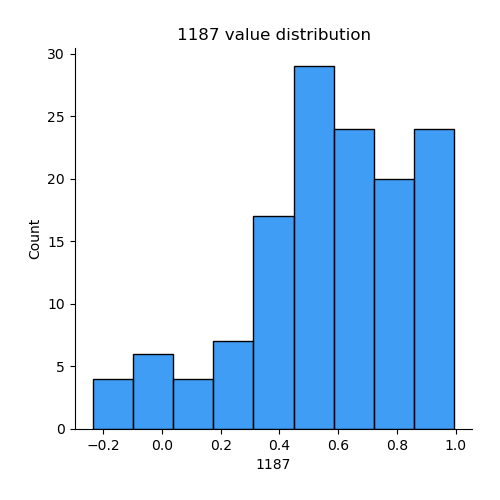
## Feature : 1188
- **Feature type** : continous
- **Missing** : 0.0%
- **Unique** : 135
- **Count** :135.0
- **Mean** :0.6300400292695405
- **Std** :0.22842775653626257
- **Min** :-0.06236536613813647
- **25%th Percentile** : 0.477045690291546
- **50%th Percentile** : 0.6366363016139533
- **75%th Percentile** : 0.7816484507487937
- **Max** :0.9907650459690239

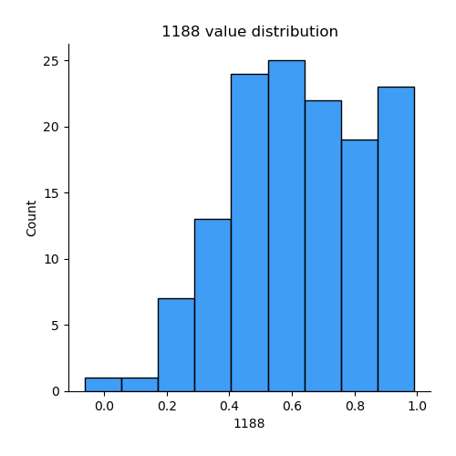
## Feature : 1189
- **Feature type** : continous
- **Missing** : 0.0%
- **Unique** : 135
- **Count** :135.0
- **Mean** :0.47517273381079794
- **Std** :0.2939606359619856
- **Min** :-0.18997093672239557
- **25%th Percentile** : 0.25467896401772816
- **50%th Percentile** : 0.44222211605219863
- **75%th Percentile** : 0.6351821556873782
- **Max** :0.9907513266145136

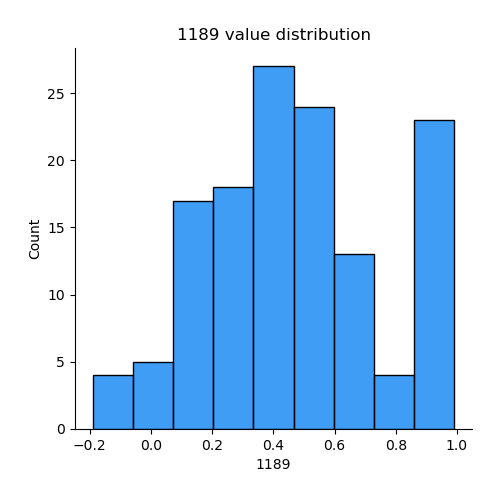
## Feature : 1190
- **Feature type** : continous
- **Missing** : 0.0%
- **Unique** : 135
- **Count** :135.0
- **Mean** :0.5437423988069641
- **Std** :0.3013004952889857
- **Min** :-0.35594499577343175
- **25%th Percentile** : 0.3519113841166429
- **50%th Percentile** : 0.5519598102400022
- **75%th Percentile** : 0.7317987973998663
- **Max** :0.9923556418108264

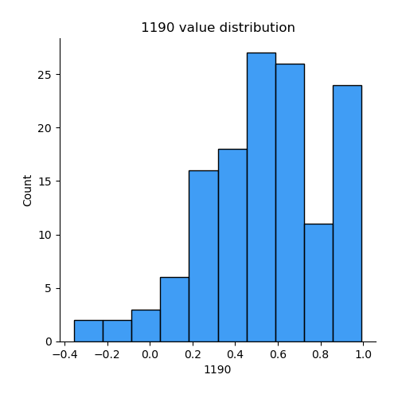
## Feature : 1191
- **Feature type** : continous
- **Missing** : 0.0%
- **Unique** : 135
- **Count** :135.0
- **Mean** :0.5660090274077356
- **Std** :0.27510441688283194
- **Min** :-0.08087541600833735
- **25%th Percentile** : 0.3898905627261811
- **50%th Percentile** : 0.5542566353579242
- **75%th Percentile** : 0.7466206940290154
- **Max** :0.9916402569979426

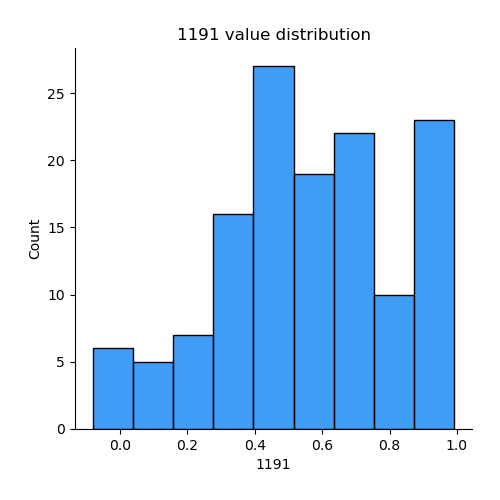
## Feature : 1192
- **Feature type** : continous
- **Missing** : 0.0%
- **Unique** : 135
- **Count** :135.0
- **Mean** :0.785241163978448
- **Std** :0.23505869336912064
- **Min** :-0.21293379883663757
- **25%th Percentile** : 0.7435615141238856
- **50%th Percentile** : 0.8487714296052845
- **75%th Percentile** : 0.9376380841044869
- **Max** :0.9979128678710405

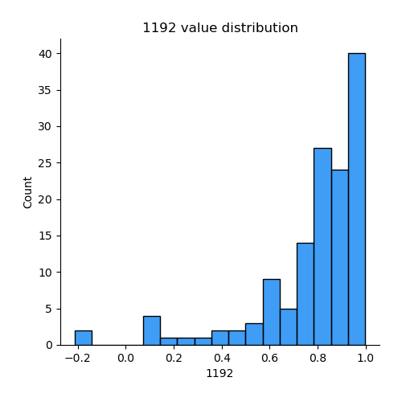
## Feature : 1193
- **Feature type** : continous
- **Missing** : 0.0%
- **Unique** : 135
- **Count** :135.0
- **Mean** :0.5996639224556847
- **Std** :0.28655993445049
- **Min** :-0.3580827619030997
- **25%th Percentile** : 0.4395505028975103
- **50%th Percentile** : 0.6225977243086621
- **75%th Percentile** : 0.7981111591923663
- **Max** :0.9947530875311223

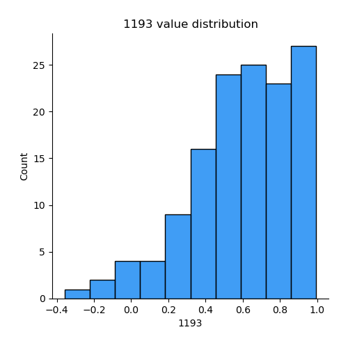
## Feature : 1194
- **Feature type** : continous
- **Missing** : 0.0%
- **Unique** : 135
- **Count** :135.0
- **Mean** :0.4946163819364962
- **Std** :0.27319066764355815
- **Min** :-0.13723572362363715
- **25%th Percentile** : 0.2882277512529987
- **50%th Percentile** : 0.47383929963464044
- **75%th Percentile** : 0.6557673590470682
- **Max** :0.991494286401027

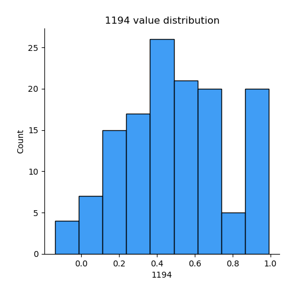
## Feature : 1195
- **Feature type** : continous
- **Missing** : 0.0%
- **Unique** : 135
- **Count** :135.0
- **Mean** :0.649908557708354
- **Std** :0.2574883724492005
- **Min** :-0.3501742099843264
- **25%th Percentile** : 0.5027421608319032
- **50%th Percentile** : 0.6871721418068408
- **75%th Percentile** : 0.8256949377261337
- **Max** :0.994421877262464

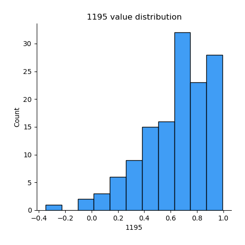
## Feature : 1219
- **Feature type** : continous
- **Missing** : 0.0%
- **Unique** : 3
- **Count** :135.0
- **Mean** :1.0
- **Std** :9.494473102102237e-17
- **Min** :0.9999999999999998
- **25%th Percentile** : 0.9999999999999999
- **50%th Percentile** : 1.0
- **75%th Percentile** : 1.0
- **Max** :1.0

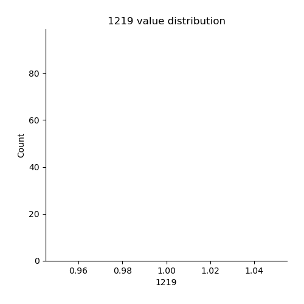
## Feature : 1220
- **Feature type** : continous
- **Missing** : 0.0%
- **Unique** : 135
- **Count** :135.0
- **Mean** :0.38268717368448635
- **Std** :0.313199935134401
- **Min** :-0.4453122395296908
- **25%th Percentile** : 0.15432915269154418
- **50%th Percentile** : 0.3499970112929417
- **75%th Percentile** : 0.5347311827143327
- **Max** :0.9798258209964208

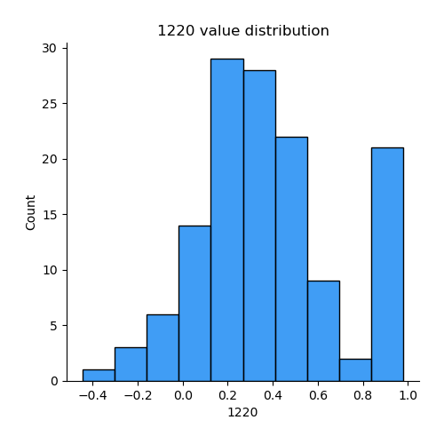
## Feature : 1221
- **Feature type** : continous
- **Missing** : 0.0%
- **Unique** : 135
- **Count** :135.0
- **Mean** :0.647541888516748
- **Std** :0.22833438284777105
- **Min** :-0.0887486427647287
- **25%th Percentile** : 0.4927018915636194
- **50%th Percentile** : 0.6430454713786862
- **75%th Percentile** : 0.8107203691265252
- **Max** :0.9875752385448072

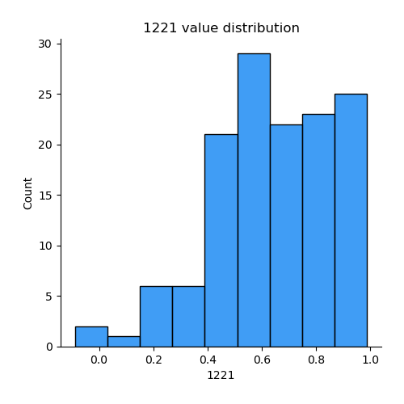
## Feature : 1222
- **Feature type** : continous
- **Missing** : 0.0%
- **Unique** : 135
- **Count** :135.0
- **Mean** :0.5719777340069653
- **Std** :0.28507968313807663
- **Min** :-0.26797519320529467
- **25%th Percentile** : 0.39152950584309587
- **50%th Percentile** : 0.5864640429929052
- **75%th Percentile** : 0.7617452881088322
- **Max** :0.9937410108543374

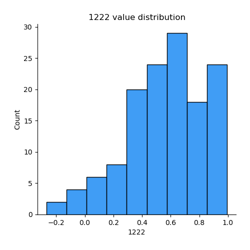
## Feature : 1223
- **Feature type** : continous
- **Missing** : 0.0%
- **Unique** : 135
- **Count** :135.0
- **Mean** :0.6384210787306169
- **Std** :0.22275419165187646
- **Min** :0.0014866668161781264
- **25%th Percentile** : 0.5168613497799015
- **50%th Percentile** : 0.6541133986730371
- **75%th Percentile** : 0.7488247400502179
- **Max** :0.9951578502809982

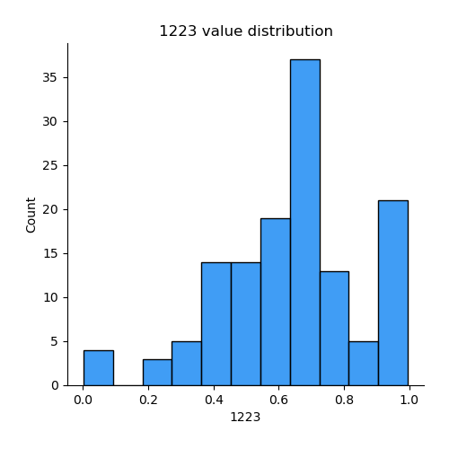
## Feature : 1224
- **Feature type** : continous
- **Missing** : 0.0%
- **Unique** : 135
- **Count** :135.0
- **Mean** :0.6290332448541135
- **Std** :0.21694919799032
- **Min** :0.12516358707283257
- **25%th Percentile** : 0.4849941459311945
- **50%th Percentile** : 0.6190997000151583
- **75%th Percentile** : 0.7761183642113936
- **Max** :0.9900802332721935

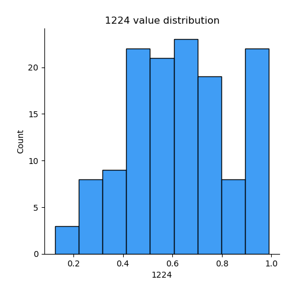
## Feature : 1225
- **Feature type** : continous
- **Missing** : 0.0%
- **Unique** : 135
- **Count** :135.0
- **Mean** :0.3891312561963432
- **Std** :0.30024671561797145
- **Min** :-0.24821361536897182
- **25%th Percentile** : 0.1688957812455814
- **50%th Percentile** : 0.36996989773186234
- **75%th Percentile** : 0.5442869689765153
- **Max** :0.9836302344713391

## Feature : 1226
- **Feature type** : continous
- **Missing** : 0.0%
- **Unique** : 135
- **Count** :135.0
- **Mean** :0.564579984219069
- **Std** :0.27052431363662477
- **Min** :-0.10208424021756514
- **25%th Percentile** : 0.36583570206512916
- **50%th Percentile** : 0.5783888462043218
- **75%th Percentile** : 0.7440050026689726
- **Max** :0.9946356081934964

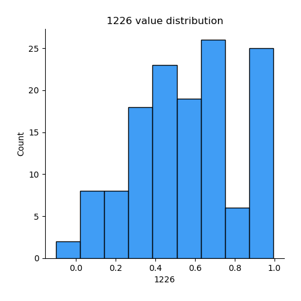
## Feature : 1227
- **Feature type** : continous
- **Missing** : 0.0%
- **Unique** : 135
- **Count** :135.0
- **Mean** :0.6987886003006634
- **Std** :0.2117410979567183
- **Min** :-0.01684817797672129
- **25%th Percentile** : 0.5756908979176631
- **50%th Percentile** : 0.7231872915756036
- **75%th Percentile** : 0.8497587286835598
- **Max** :0.9962735778547728

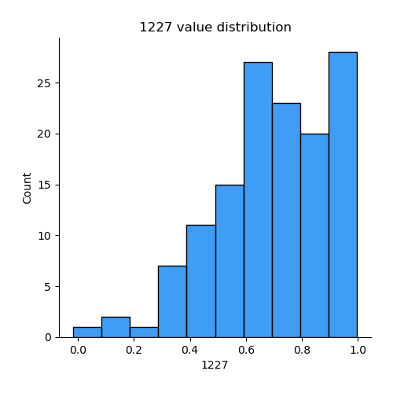
## Feature : 1228
- **Feature type** : continous
- **Missing** : 0.0%
- **Unique** : 135
- **Count** :135.0
- **Mean** :0.5437699615382063
- **Std** :0.2977894636510656
- **Min** :-0.2644189079336147
- **25%th Percentile** : 0.3859114324728883
- **50%th Percentile** : 0.5844772745219802
- **75%th Percentile** : 0.7128884451077433
- **Max** :0.9939530403230135

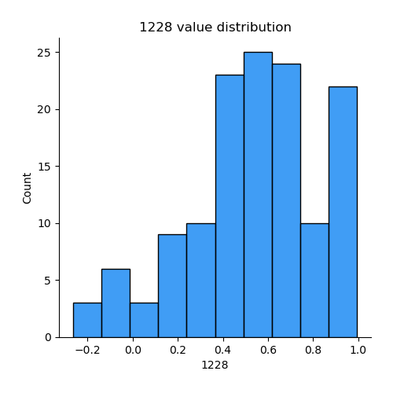
## Feature : 1229
- **Feature type** : continous
- **Missing** : 0.0%
- **Unique** : 135
- **Count** :135.0
- **Mean** :0.6844670540041967
- **Std** :0.22628859954381425
- **Min** :-0.0716225776067419
- **25%th Percentile** : 0.5689819475836213
- **50%th Percentile** : 0.7183140004305871
- **75%th Percentile** : 0.8157569333029961
- **Max** :0.995459584103132

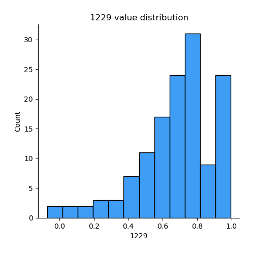
## Feature : 1230
- **Feature type** : continous
- **Missing** : 0.0%
- **Unique** : 135
- **Count** :135.0
- **Mean** :0.607308047879046
- **Std** :0.250316329335914
- **Min** :-0.12266798634797205
- **25%th Percentile** : 0.4283078267488478
- **50%th Percentile** : 0.6075512831311635
- **75%th Percentile** : 0.7776991140317355
- **Max** :0.9862626974972676

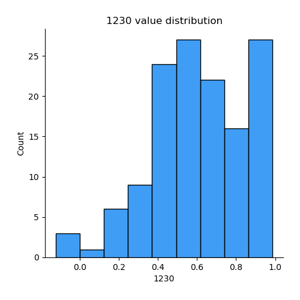
## Feature : 1231
- **Feature type** : continous
- **Missing** : 0.0%
- **Unique** : 135
- **Count** :135.0
- **Mean** :0.5658119765394319
- **Std** :0.2501315075629681
- **Min** :-0.06369051060612262
- **25%th Percentile** : 0.41471801598528757
- **50%th Percentile** : 0.5608790268801628
- **75%th Percentile** : 0.7000982372280904
- **Max** :0.9863830129699708

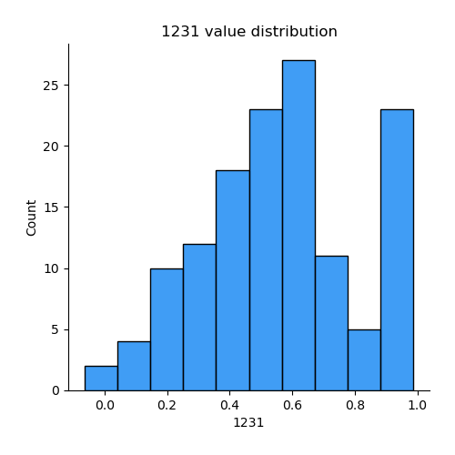
## Feature : 1232
- **Feature type** : continous
- **Missing** : 0.0%
- **Unique** : 135
- **Count** :135.0
- **Mean** :0.6085549388446713
- **Std** :0.22899427918984233
- **Min** :0.033791298876070304
- **25%th Percentile** : 0.4668206317155273
- **50%th Percentile** : 0.5938829558891817
- **75%th Percentile** : 0.7462020360621187
- **Max** :0.9946795431472257

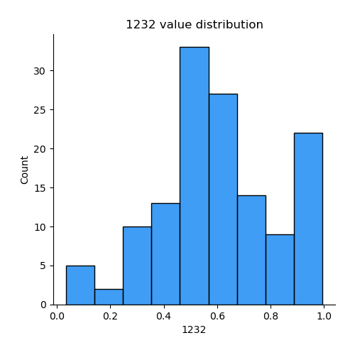
## Feature : 1233
- **Feature type** : continous
- **Missing** : 0.0%
- **Unique** : 135
- **Count** :135.0
- **Mean** :0.5518345380315858
- **Std** :0.3054534987937035
- **Min** :-0.32161155110398715
- **25%th Percentile** : 0.37408276665445384
- **50%th Percentile** : 0.5874763146639924
- **75%th Percentile** : 0.7462651856317859
- **Max** :0.9936406337486108

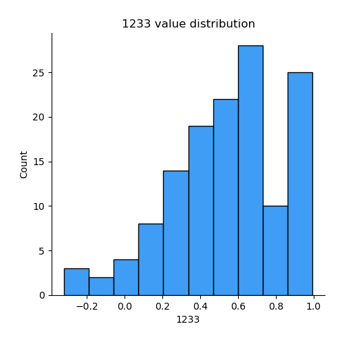
## Feature : 1234
- **Feature type** : continous
- **Missing** : 0.0%
- **Unique** : 135
- **Count** :135.0
- **Mean** :0.637732605337863
- **Std** :0.2315493506652569
- **Min** :-0.015539380091353073
- **25%th Percentile** : 0.4990577813583482
- **50%th Percentile** : 0.6428716481751152
- **75%th Percentile** : 0.791027353674095
- **Max** :0.9949409214565987

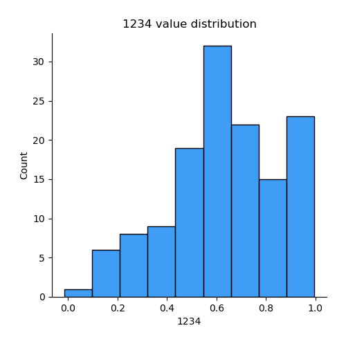
## Feature : 1235
- **Feature type** : continous
- **Missing** : 0.0%
- **Unique** : 135
- **Count** :135.0
- **Mean** :0.4675065841707282
- **Std** :0.3032437590261349
- **Min** :-0.29700993785736646
- **25%th Percentile** : 0.25676241692731194
- **50%th Percentile** : 0.434867047625416
- **75%th Percentile** : 0.6362506261831846
- **Max** :0.9910203188362874

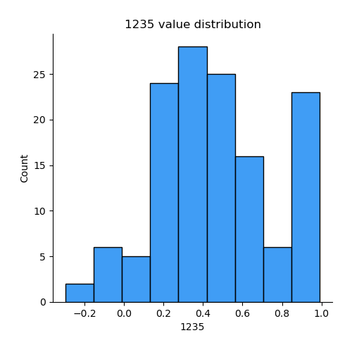
## Feature : 1236
- **Feature type** : continous
- **Missing** : 0.0%
- **Unique** : 135
- **Count** :135.0
- **Mean** :0.5975559443454483
- **Std** :0.21331945428842752
- **Min** :-0.10302289118342214
- **25%th Percentile** : 0.4611831147895779
- **50%th Percentile** : 0.5819597832296632
- **75%th Percentile** : 0.6996878979093453
- **Max** :0.9903325852802398

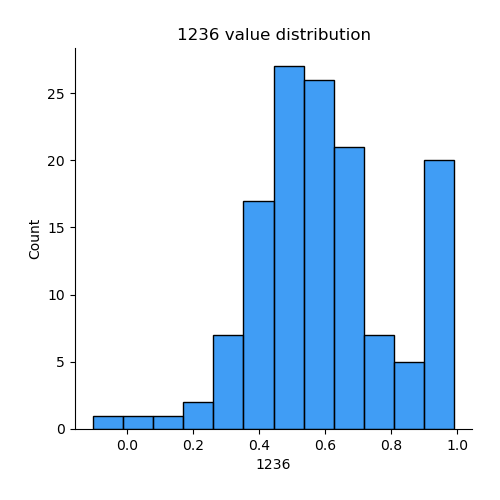
## Feature : 1237
- **Feature type** : continous
- **Missing** : 0.0%
- **Unique** : 135
- **Count** :135.0
- **Mean** :0.665903260120665
- **Std** :0.24203147049266655
- **Min** :-0.09796457761502722
- **25%th Percentile** : 0.5382524199337471
- **50%th Percentile** : 0.6828355148558166
- **75%th Percentile** : 0.8358327513070682
- **Max** :0.9964465647887647

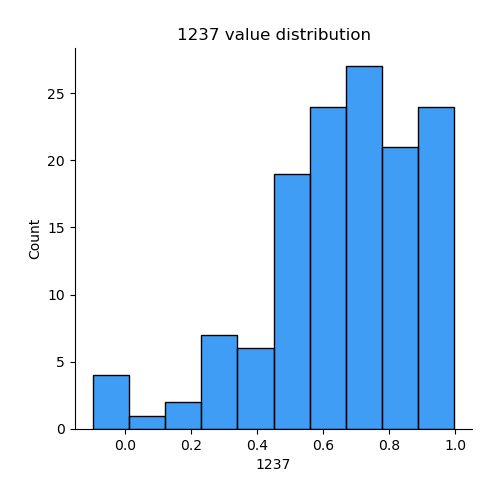
## Feature : 1238
- **Feature type** : continous
- **Missing** : 0.0%
- **Unique** : 135
- **Count** :135.0
- **Mean** :0.7344447229720461
- **Std** :0.17644193351100063
- **Min** :0.16739849583531358
- **25%th Percentile** : 0.6418611798633401
- **50%th Percentile** : 0.744985516309631
- **75%th Percentile** : 0.8352727841842119
- **Max** :0.9954452780813257

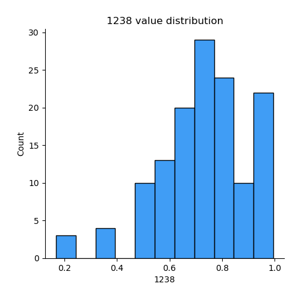
## Feature : 1239
- **Feature type** : continous
- **Missing** : 0.0%
- **Unique** : 135
- **Count** :135.0
- **Mean** :0.6944858604038514
- **Std** :0.22442343717693447
- **Min** :-0.07014105321721996
- **25%th Percentile** : 0.5991650021572748
- **50%th Percentile** : 0.7113579065334561
- **75%th Percentile** : 0.8261882583977357
- **Max** :0.9964819880600438

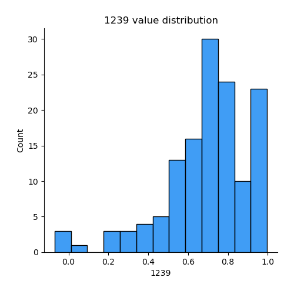
## Feature : 1240
- **Feature type** : continous
- **Missing** : 0.0%
- **Unique** : 135
- **Count** :135.0
- **Mean** :0.7293922524475609
- **Std** :0.18001941193046436
- **Min** :0.176151484348658
- **25%th Percentile** : 0.6105239082647461
- **50%th Percentile** : 0.7294798475030342
- **75%th Percentile** : 0.8541306192287939
- **Max** :0.9928567803584183

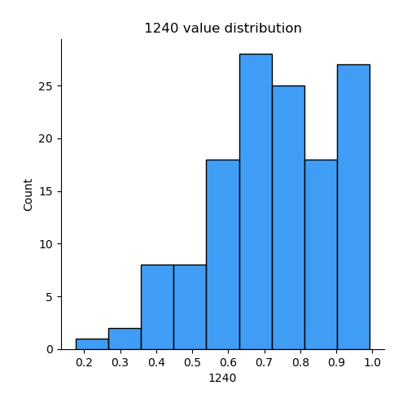
## Feature : 1241
- **Feature type** : continous
- **Missing** : 0.0%
- **Unique** : 135
- **Count** :135.0
- **Mean** :0.45787025094800454
- **Std** :0.30379283070760127
- **Min** :-0.188977945393718
- **25%th Percentile** : 0.23973565039696212
- **50%th Percentile** : 0.3930343779321872
- **75%th Percentile** : 0.6422929380820261
- **Max** :0.9914789723157293

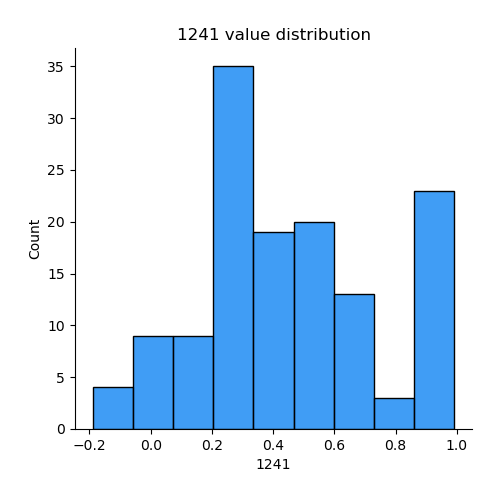
## Feature : 1242
- **Feature type** : continous
- **Missing** : 0.0%
- **Unique** : 135
- **Count** :135.0
- **Mean** :0.641296439160177
- **Std** :0.2416188640698358
- **Min** :-0.1570929764463145
- **25%th Percentile** : 0.4941763866922494
- **50%th Percentile** : 0.652409765061106
- **75%th Percentile** : 0.8035911933058064
- **Max** :0.9957876361065107

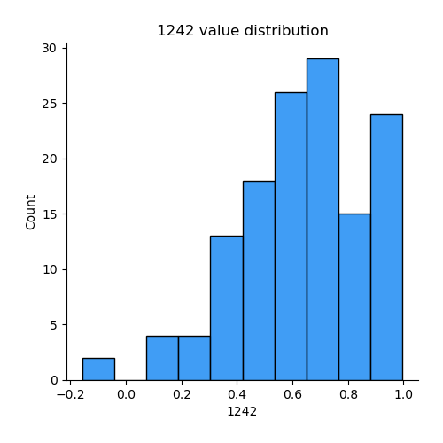
## Feature : 1243
- **Feature type** : continous
- **Missing** : 0.0%
- **Unique** : 135
- **Count** :135.0
- **Mean** :0.7254747761685222
- **Std** :0.19858121200525541
- **Min** :0.0211653890742238
- **25%th Percentile** : 0.6096733788694226
- **50%th Percentile** : 0.759551504438908
- **75%th Percentile** : 0.8547831198912076
- **Max** :0.9959034389209719

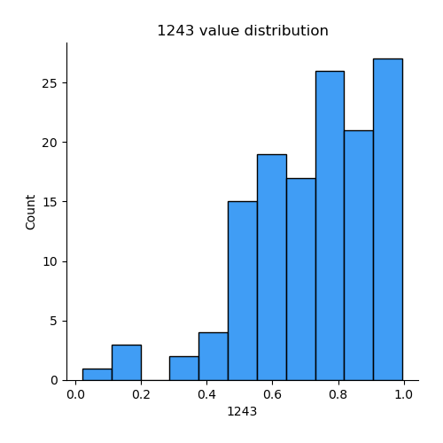
## Feature : 1244
- **Feature type** : continous
- **Missing** : 0.0%
- **Unique** : 135
- **Count** :135.0
- **Mean** :0.5952348019991869
- **Std** :0.2857518120348916
- **Min** :-0.2772483051730515
- **25%th Percentile** : 0.4396911280037099
- **50%th Percentile** : 0.6391226894571312
- **75%th Percentile** : 0.7784397281082244
- **Max** :0.9924830303676654

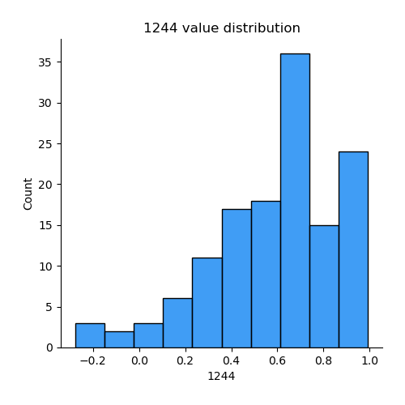
## Feature : 1245
- **Feature type** : continous
- **Missing** : 0.0%
- **Unique** : 135
- **Count** :135.0
- **Mean** :0.7894592233461027
- **Std** :0.1970846145047835
- **Min** :-0.18948590981951108
- **25%th Percentile** : 0.7196898856935232
- **50%th Percentile** : 0.8294272258176942
- **75%th Percentile** : 0.9268528808177952
- **Max** :0.9972368580079748

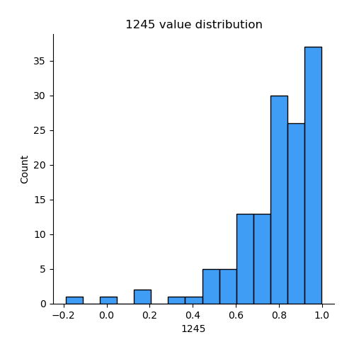
## Feature : 1246
- **Feature type** : continous
- **Missing** : 0.0%
- **Unique** : 135
- **Count** :135.0
- **Mean** :0.3425607889130915
- **Std** :0.32808499381516726
- **Min** :-0.48262640808012647
- **25%th Percentile** : 0.12330789190742492
- **50%th Percentile** : 0.2872797756274963
- **75%th Percentile** : 0.5124609307923058
- **Max** :0.9824751015864382

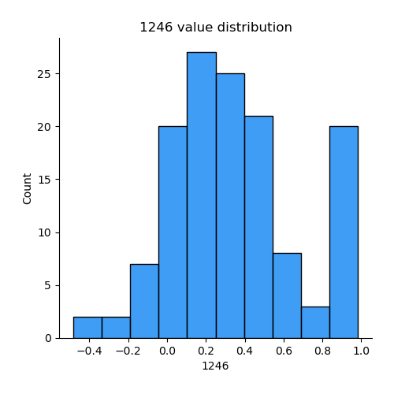
## Feature : 1247
- **Feature type** : continous
- **Missing** : 0.0%
- **Unique** : 135
- **Count** :135.0
- **Mean** :0.5314061664738456
- **Std** :0.28452303364277326
- **Min** :-0.31706685767061776
- **25%th Percentile** : 0.3146138593229763
- **50%th Percentile** : 0.532025192654567
- **75%th Percentile** : 0.7142120593986305
- **Max** :0.9929506245845039

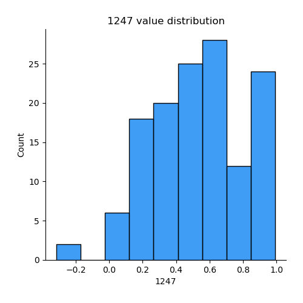
## Feature : 1272
- **Feature type** : continous
- **Missing** : 0.0%
- **Unique** : 3
- **Count** :135.0
- **Mean** :1.0
- **Std** :8.524548308960713e-17
- **Min** :0.9999999999999998
- **25%th Percentile** : 0.9999999999999999
- **50%th Percentile** : 1.0
- **75%th Percentile** : 1.0
- **Max** :1.0

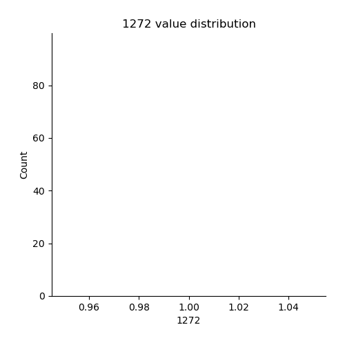
## Feature : 1273
- **Feature type** : continous
- **Missing** : 0.0%
- **Unique** : 135
- **Count** :135.0
- **Mean** :0.45203902144186364
- **Std** :0.2834353108847214
- **Min** :-0.3550236769930964
- **25%th Percentile** : 0.2792178934201325
- **50%th Percentile** : 0.41380140547674094
- **75%th Percentile** : 0.6177823665175941
- **Max** :0.9886788799163349

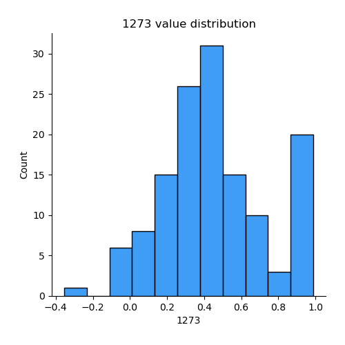
## Feature : 1274
- **Feature type** : continous
- **Missing** : 0.0%
- **Unique** : 135
- **Count** :135.0
- **Mean** :0.38616797555767346
- **Std** :0.30770399552529326
- **Min** :-0.34539663277906424
- **25%th Percentile** : 0.17722658042843678
- **50%th Percentile** : 0.3398864684272846
- **75%th Percentile** : 0.5537763536813824
- **Max** :0.9733196270026303

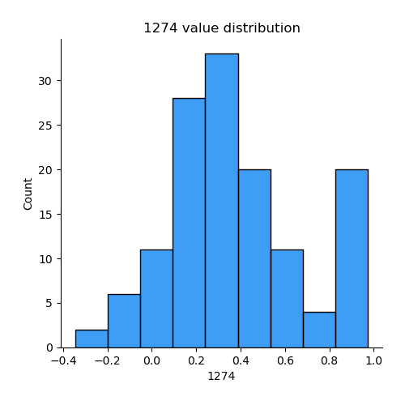
## Feature : 1275
- **Feature type** : continous
- **Missing** : 0.0%
- **Unique** : 135
- **Count** :135.0
- **Mean** :0.3901013911793185
- **Std** :0.30127620925490595
- **Min** :-0.39749270553935534
- **25%th Percentile** : 0.16846844499036165
- **50%th Percentile** : 0.335378647643247
- **75%th Percentile** : 0.5313771568385406
- **Max** :0.9794204008833831

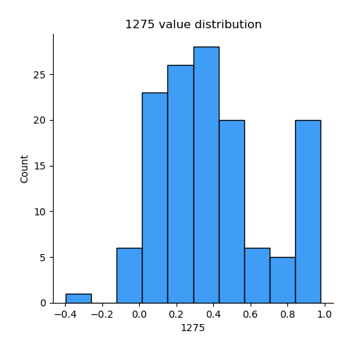
## Feature : 1276
- **Feature type** : continous
- **Missing** : 0.0%
- **Unique** : 135
- **Count** :135.0
- **Mean** :0.4002328923270753
- **Std** :0.28204121180031777
- **Min** :-0.20570604240718057
- **25%th Percentile** : 0.22704649590473636
- **50%th Percentile** : 0.34366656375158133
- **75%th Percentile** : 0.5011526842664294
- **Max** :0.9725785626003993

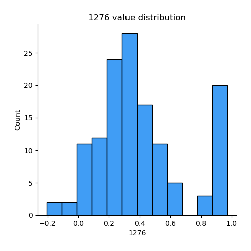
## Feature : 1277
- **Feature type** : continous
- **Missing** : 0.0%
- **Unique** : 135
- **Count** :135.0
- **Mean** :0.5436178033850135
- **Std** :0.30806588930292744
- **Min** :-0.3561103211619997
- **25%th Percentile** : 0.36441960752743285
- **50%th Percentile** : 0.5763750987428603
- **75%th Percentile** : 0.7907942999033741
- **Max** :0.9850503634824532

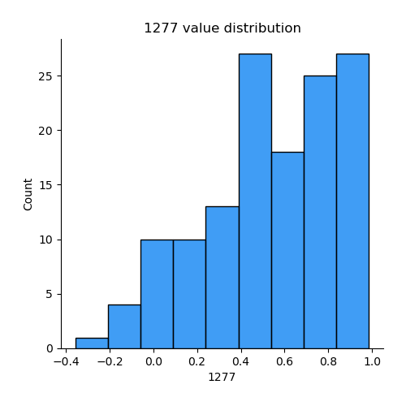
## Feature : 1278
- **Feature type** : continous
- **Missing** : 0.0%
- **Unique** : 135
- **Count** :135.0
- **Mean** :0.5231891579112041
- **Std** :0.2529219948873852
- **Min** :-0.3379218970046118
- **25%th Percentile** : 0.37089401844189196
- **50%th Percentile** : 0.48349172022109194
- **75%th Percentile** : 0.6535011686632335
- **Max** :0.9813765757510177

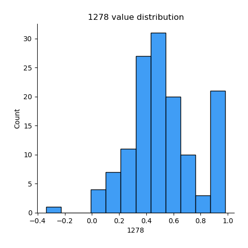
## Feature : 1279
- **Feature type** : continous
- **Missing** : 0.0%
- **Unique** : 135
- **Count** :135.0
- **Mean** :0.38958795038564664
- **Std** :0.3056547514669005
- **Min** :-0.3597059921135288
- **25%th Percentile** : 0.18236357291453686
- **50%th Percentile** : 0.352774452319547
- **75%th Percentile** : 0.5148374521813393
- **Max** :0.9704237577356838

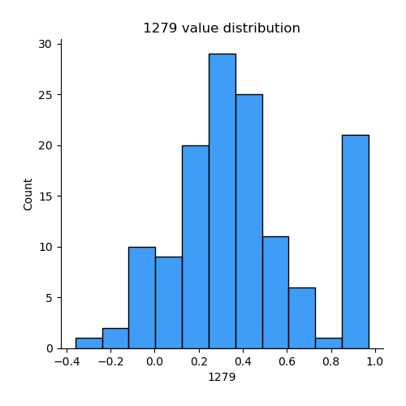
## Feature : 1280
- **Feature type** : continous
- **Missing** : 0.0%
- **Unique** : 135
- **Count** :135.0
- **Mean** :0.5341655087067047
- **Std** :0.2642423658892625
- **Min** :-0.08994670095241325
- **25%th Percentile** : 0.3604935498457909
- **50%th Percentile** : 0.5000672517998236
- **75%th Percentile** : 0.6992593456318154
- **Max** :0.9844778734263632

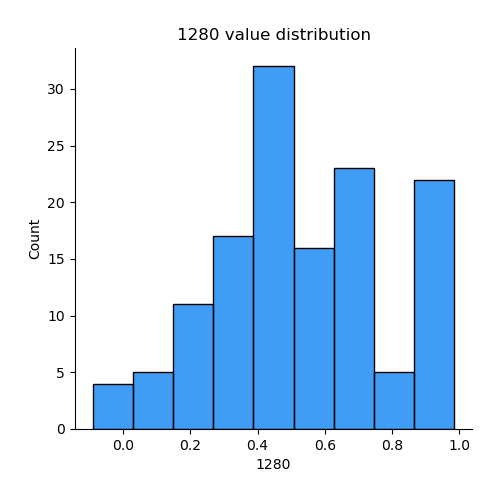
## Feature : 1281
- **Feature type** : continous
- **Missing** : 0.0%
- **Unique** : 135
- **Count** :135.0
- **Mean** :0.4494202619824946
- **Std** :0.29144910614384606
- **Min** :-0.4455577823654308
- **25%th Percentile** : 0.243796642163356
- **50%th Percentile** : 0.4273657390347649
- **75%th Percentile** : 0.5981492689420173
- **Max** :0.9792672372236462

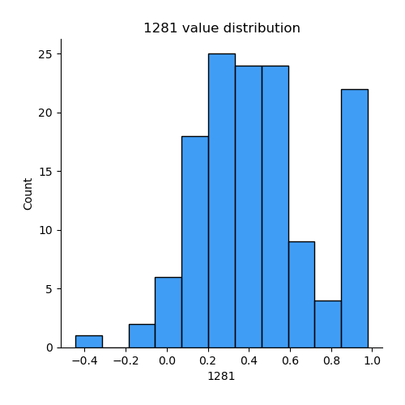
## Feature : 1282
- **Feature type** : continous
- **Missing** : 0.0%
- **Unique** : 135
- **Count** :135.0
- **Mean** :0.4198656933572554
- **Std** :0.29020120531325205
- **Min** :-0.20240971941050673
- **25%th Percentile** : 0.23893559190156588
- **50%th Percentile** : 0.36367651050657734
- **75%th Percentile** : 0.5834652822311306
- **Max** :0.9677148514627394

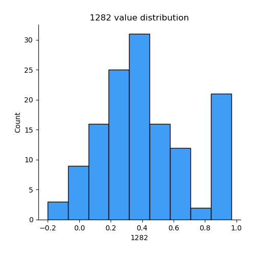
## Feature : 1283
- **Feature type** : continous
- **Missing** : 0.0%
- **Unique** : 135
- **Count** :135.0
- **Mean** :0.3823605500918058
- **Std** :0.29369031837741344
- **Min** :-0.21216220867806668
- **25%th Percentile** : 0.19083059960920423
- **50%th Percentile** : 0.34484402096686667
- **75%th Percentile** : 0.5177688097238698
- **Max** :0.9719516419044804

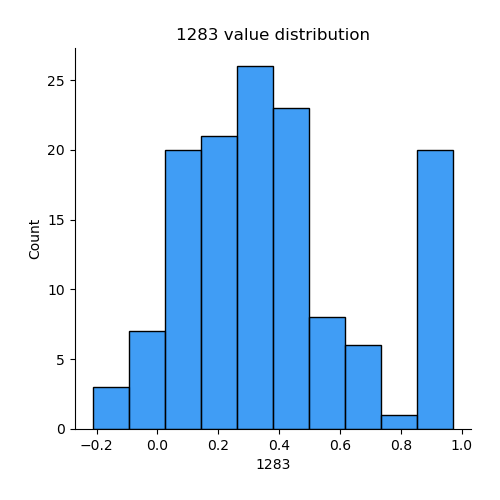
## Feature : 1284
- **Feature type** : continous
- **Missing** : 0.0%
- **Unique** : 135
- **Count** :135.0
- **Mean** :0.40782128834961784
- **Std** :0.2901495628230461
- **Min** :-0.14827377442527925
- **25%th Percentile** : 0.20872291633863035
- **50%th Percentile** : 0.3541828899934504
- **75%th Percentile** : 0.5349744133362525
- **Max** :0.9787604010509331

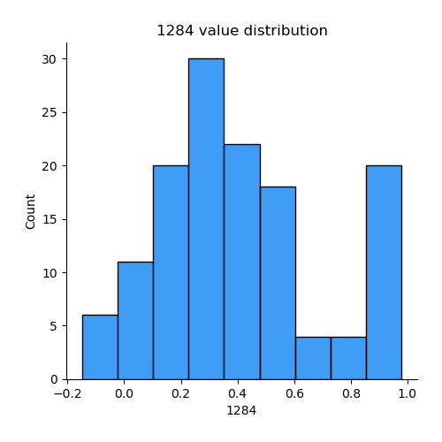
## Feature : 1285
- **Feature type** : continous
- **Missing** : 0.0%
- **Unique** : 135
- **Count** :135.0
- **Mean** :0.5140454195761089
- **Std** :0.25493241340109224
- **Min** :-0.1313288761342966
- **25%th Percentile** : 0.36202960041920107
- **50%th Percentile** : 0.4881795975571934
- **75%th Percentile** : 0.6503817671932157
- **Max** :0.9856683091728319

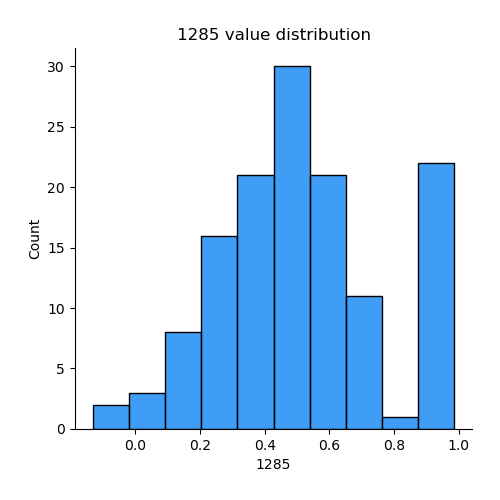
## Feature : 1286
- **Feature type** : continous
- **Missing** : 0.0%
- **Unique** : 135
- **Count** :135.0
- **Mean** :0.3341382828803601
- **Std** :0.33873060314414705
- **Min** :-0.5768404795353738
- **25%th Percentile** : 0.10503688879546469
- **50%th Percentile** : 0.29350538161904094
- **75%th Percentile** : 0.474847863246633
- **Max** :0.9702203605406915

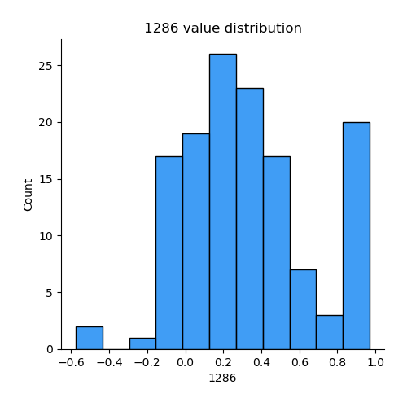
## Feature : 1287
- **Feature type** : continous
- **Missing** : 0.0%
- **Unique** : 135
- **Count** :135.0
- **Mean** :0.45500357251506046
- **Std** :0.30017730756809463
- **Min** :-0.461102826117666
- **25%th Percentile** : 0.2712210868531029
- **50%th Percentile** : 0.440632370504938
- **75%th Percentile** : 0.6171019219826859
- **Max** :0.9788954835576807

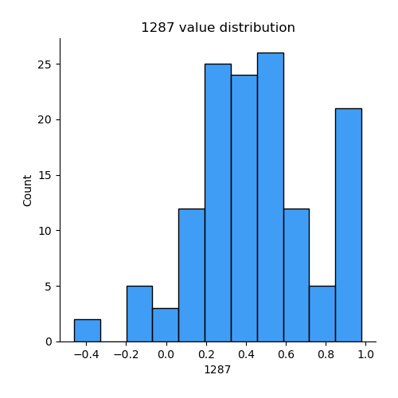
## Feature : 1288
- **Feature type** : continous
- **Missing** : 0.0%
- **Unique** : 135
- **Count** :135.0
- **Mean** :0.372403205102377
- **Std** :0.2931412632202314
- **Min** :-0.36664596297960894
- **25%th Percentile** : 0.18569141978731224
- **50%th Percentile** : 0.3028017867974017
- **75%th Percentile** : 0.5093817962675551
- **Max** :0.973236148161704

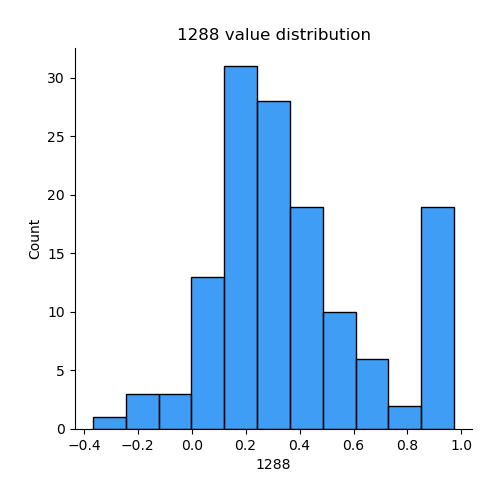
## Feature : 1289
- **Feature type** : continous
- **Missing** : 0.0%
- **Unique** : 135
- **Count** :135.0
- **Mean** :0.37921485231571567
- **Std** :0.3109203622263196
- **Min** :-0.3774060897770916
- **25%th Percentile** : 0.17651878982895575
- **50%th Percentile** : 0.31527782756976636
- **75%th Percentile** : 0.5158779108103777
- **Max** :0.9833370114318126

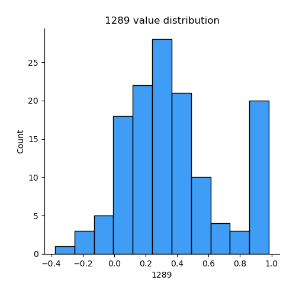
## Feature : 1290
- **Feature type** : continous
- **Missing** : 0.0%
- **Unique** : 135
- **Count** :135.0
- **Mean** :0.41036882929408336
- **Std** :0.3006073156914133
- **Min** :-0.4591291705029837
- **25%th Percentile** : 0.20729162576062968
- **50%th Percentile** : 0.3512358176761453
- **75%th Percentile** : 0.5414808344006393
- **Max** :0.9834695921747452

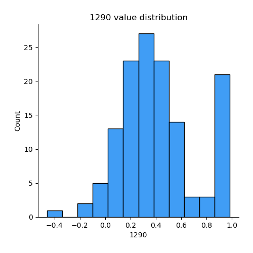
## Feature : 1291
- **Feature type** : continous
- **Missing** : 0.0%
- **Unique** : 135
- **Count** :135.0
- **Mean** :0.3688918262298866
- **Std** :0.3202950546057768
- **Min** :-0.4508480850602473
- **25%th Percentile** : 0.15705354952689615
- **50%th Percentile** : 0.31700627194866837
- **75%th Percentile** : 0.5019921713983757
- **Max** :0.9852362770520616

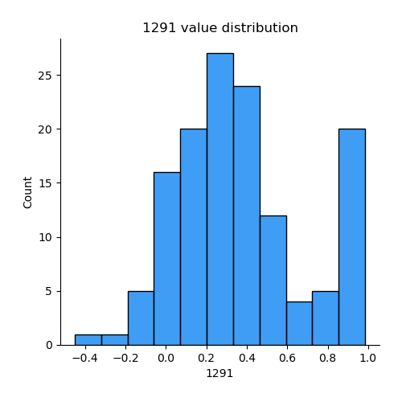
## Feature : 1292
- **Feature type** : continous
- **Missing** : 0.0%
- **Unique** : 135
- **Count** :135.0
- **Mean** :0.40840886162863205
- **Std** :0.2959559734605892
- **Min** :-0.3953162767065472
- **25%th Percentile** : 0.2114277525262368
- **50%th Percentile** : 0.37833129359346085
- **75%th Percentile** : 0.5127783553657883
- **Max** :0.9684448252534981

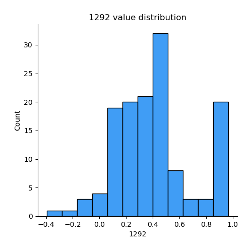
## Feature : 1293
- **Feature type** : continous
- **Missing** : 0.0%
- **Unique** : 135
- **Count** :135.0
- **Mean** :0.33011555271251136
- **Std** :0.33257355895578755
- **Min** :-0.33757770489530053
- **25%th Percentile** : 0.0918578995868588
- **50%th Percentile** : 0.24913631011369827
- **75%th Percentile** : 0.4966507408228018
- **Max** :0.9803772592435617

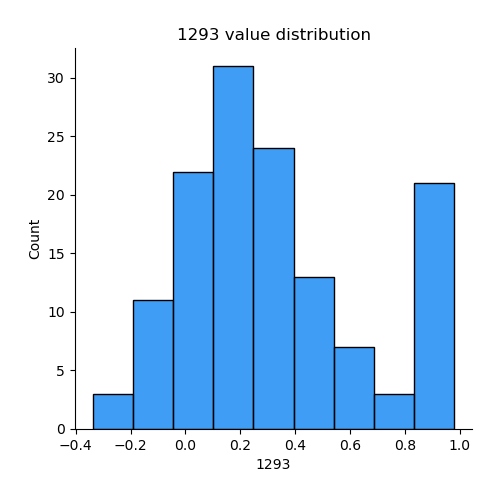
## Feature : 1294
- **Feature type** : continous
- **Missing** : 0.0%
- **Unique** : 135
- **Count** :135.0
- **Mean** :0.4056598620657503
- **Std** :0.2994993719537313
- **Min** :-0.315043212556836
- **25%th Percentile** : 0.19663819708266683
- **50%th Percentile** : 0.3541848914511407
- **75%th Percentile** : 0.5189098327807051
- **Max** :0.9819414636387047

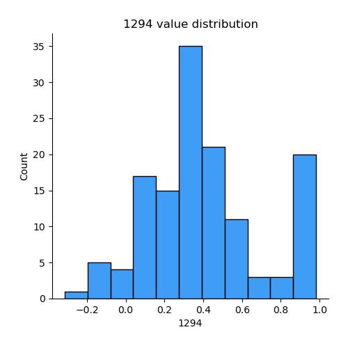
## Feature : 1295
- **Feature type** : continous
- **Missing** : 0.0%
- **Unique** : 135
- **Count** :135.0
- **Mean** :0.3718122549126772
- **Std** :0.3068075665200296
- **Min** :-0.13105769710010073
- **25%th Percentile** : 0.14609844479378348
- **50%th Percentile** : 0.320312514570577
- **75%th Percentile** : 0.5004223173544344
- **Max** :0.9691406385371932

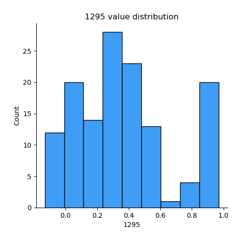
## Feature : 1296
- **Feature type** : continous
- **Missing** : 0.0%
- **Unique** : 135
- **Count** :135.0
- **Mean** :0.5190483238970338
- **Std** :0.24990098530935329
- **Min** :-0.09633894726996253
- **25%th Percentile** : 0.3388457428599678
- **50%th Percentile** : 0.4716953009202332
- **75%th Percentile** : 0.666576352977409
- **Max** :0.9885517980667957

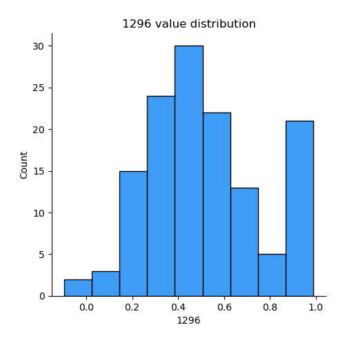
## Feature : 1297
- **Feature type** : continous
- **Missing** : 0.0%
- **Unique** : 135
- **Count** :135.0
- **Mean** :0.36921870607512325
- **Std** :0.3212644463064167
- **Min** :-0.4919301130196718
- **25%th Percentile** : 0.15312730593466778
- **50%th Percentile** : 0.3305677737669828
- **75%th Percentile** : 0.5467056731254776
- **Max** :0.9755503940710647

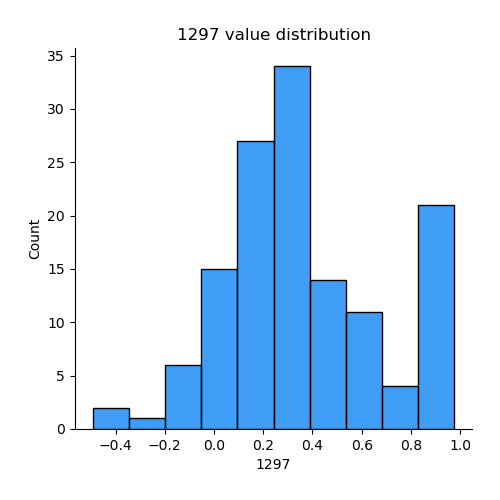
## Feature : 1298
- **Feature type** : continous
- **Missing** : 0.0%
- **Unique** : 135
- **Count** :135.0
- **Mean** :0.6093944240593178
- **Std** :0.29024470744129327
- **Min** :-0.5299311841560969
- **25%th Percentile** : 0.4501753913830341
- **50%th Percentile** : 0.6623425133964561
- **75%th Percentile** : 0.8255028805360642
- **Max** :0.9904640683366823

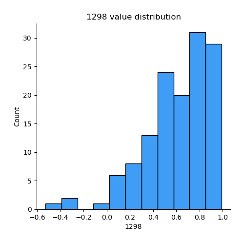
## Feature : 1299
- **Feature type** : continous
- **Missing** : 0.0%
- **Unique** : 135
- **Count** :135.0
- **Mean** :0.4056320984808627
- **Std** :0.29339744353013864
- **Min** :-0.15867898439895195
- **25%th Percentile** : 0.188234306008495
- **50%th Percentile** : 0.3546459621660364
- **75%th Percentile** : 0.580973573752847
- **Max** :0.9796670152351036

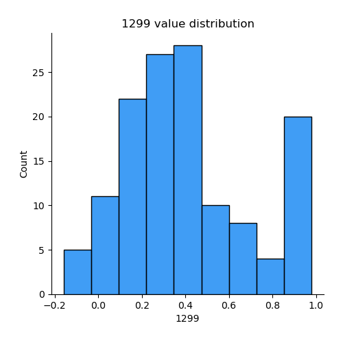
## Feature : 1325
- **Feature type** : continous
- **Missing** : 0.0%
- **Unique** : 3
- **Count** :135.0
- **Mean** :1.0
- **Std** :7.612514017715856e-17
- **Min** :0.9999999999999998
- **25%th Percentile** : 1.0
- **50%th Percentile** : 1.0
- **75%th Percentile** : 1.0
- **Max** :1.0

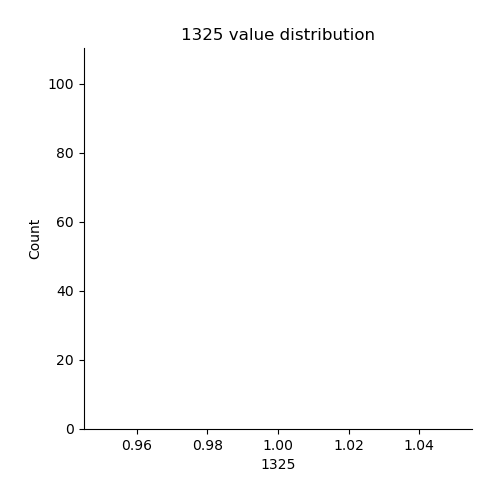
## Feature : 1326
- **Feature type** : continous
- **Missing** : 0.0%
- **Unique** : 135
- **Count** :135.0
- **Mean** :0.552446021583787
- **Std** :0.27841791776227215
- **Min** :-0.35703887411143104
- **25%th Percentile** : 0.39704021426028724
- **50%th Percentile** : 0.5424400354985026
- **75%th Percentile** : 0.7218953572147776
- **Max** :0.9842888416266778

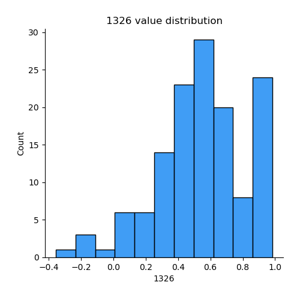
## Feature : 1327
- **Feature type** : continous
- **Missing** : 0.0%
- **Unique** : 135
- **Count** :135.0
- **Mean** :0.5527617123328887
- **Std** :0.2525863096340163
- **Min** :-0.17183045967119917
- **25%th Percentile** : 0.374189544859615
- **50%th Percentile** : 0.5548109410695873
- **75%th Percentile** : 0.7081155926863605
- **Max** :0.9904993195361321

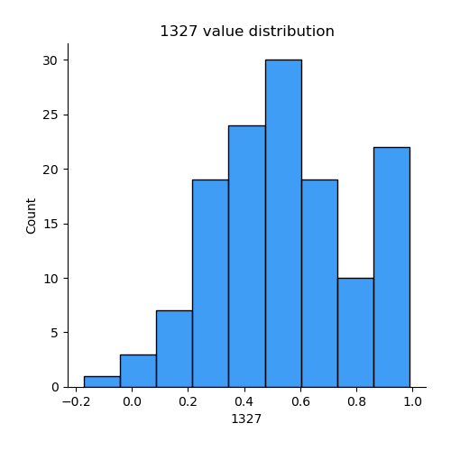
## Feature : 1328
- **Feature type** : continous
- **Missing** : 0.0%
- **Unique** : 135
- **Count** :135.0
- **Mean** :0.5673400586576423
- **Std** :0.24646750376840465
- **Min** :0.05136628188627299
- **25%th Percentile** : 0.4001085721387194
- **50%th Percentile** : 0.5455404978738234
- **75%th Percentile** : 0.7361918405436261
- **Max** :0.9812904160546199

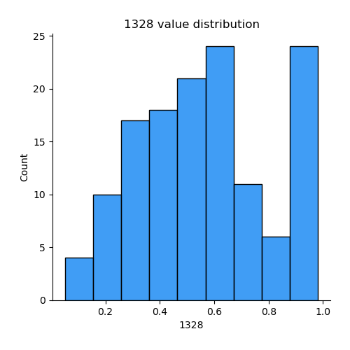
## Feature : 1329
- **Feature type** : continous
- **Missing** : 0.0%
- **Unique** : 135
- **Count** :135.0
- **Mean** :0.4252675129899597
- **Std** :0.2864598512110548
- **Min** :-0.42854349883020554
- **25%th Percentile** : 0.22724373706367607
- **50%th Percentile** : 0.42133082427886437
- **75%th Percentile** : 0.5729923396089573
- **Max** :0.9799147273165099

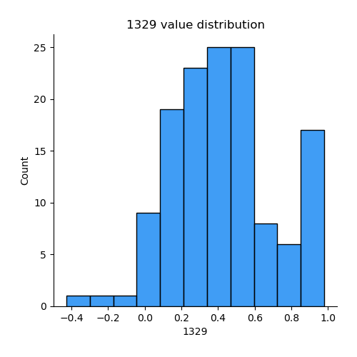
## Feature : 1330
- **Feature type** : continous
- **Missing** : 0.0%
- **Unique** : 135
- **Count** :135.0
- **Mean** :0.5633265227887131
- **Std** :0.25142672328746546
- **Min** :-0.06596453987868213
- **25%th Percentile** : 0.39889048693684415
- **50%th Percentile** : 0.5327290314295454
- **75%th Percentile** : 0.7210190946961603
- **Max** :0.9824631562392797

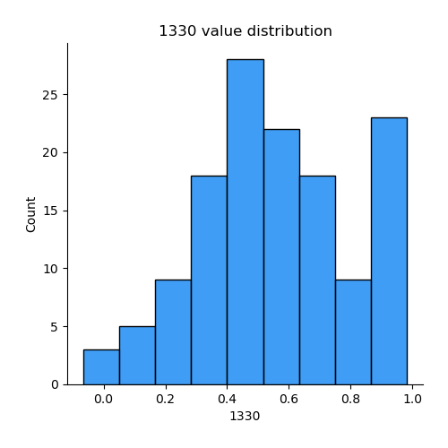
## Feature : 1331
- **Feature type** : continous
- **Missing** : 0.0%
- **Unique** : 135
- **Count** :135.0
- **Mean** :0.5480919789270268
- **Std** :0.26572467206881634
- **Min** :-0.08129562338413698
- **25%th Percentile** : 0.375350108197834
- **50%th Percentile** : 0.529033855894283
- **75%th Percentile** : 0.7438526260256381
- **Max** :0.9868408613597122

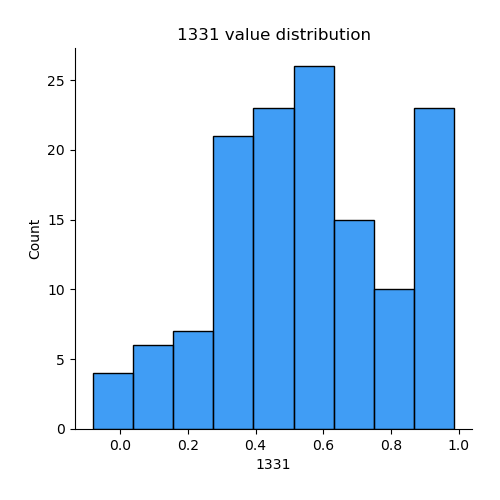
## Feature : 1332
- **Feature type** : continous
- **Missing** : 0.0%
- **Unique** : 135
- **Count** :135.0
- **Mean** :0.5119437537316548
- **Std** :0.286767868159556
- **Min** :-0.22612292146943033
- **25%th Percentile** : 0.33409882654005474
- **50%th Percentile** : 0.512097001731176
- **75%th Percentile** : 0.6774531700749211
- **Max** :0.9843264883222125

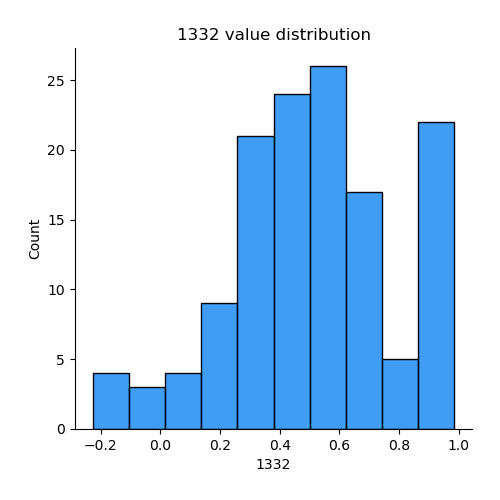
## Feature : 1333
- **Feature type** : continous
- **Missing** : 0.0%
- **Unique** : 135
- **Count** :135.0
- **Mean** :0.6856171323430759
- **Std** :0.22105358640969686
- **Min** :-0.07247136065387899
- **25%th Percentile** : 0.545620280079465
- **50%th Percentile** : 0.7222171443902065
- **75%th Percentile** : 0.8485910271347623
- **Max** :0.992297292692522

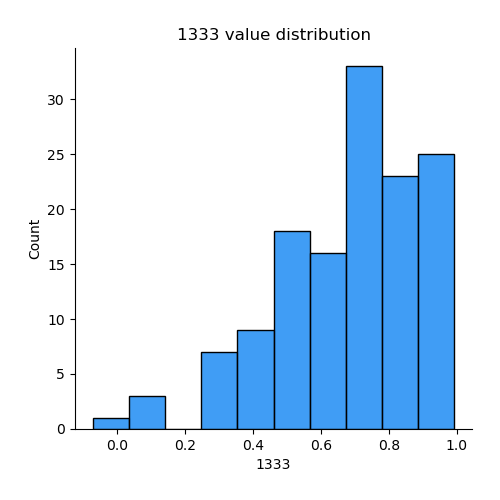
## Feature : 1334
- **Feature type** : continous
- **Missing** : 0.0%
- **Unique** : 135
- **Count** :135.0
- **Mean** :0.5702237469012843
- **Std** :0.25502091081131734
- **Min** :-0.19722100212807153
- **25%th Percentile** : 0.3936420817766353
- **50%th Percentile** : 0.545656804525999
- **75%th Percentile** : 0.7458280029158546
- **Max** :0.9785442665114811

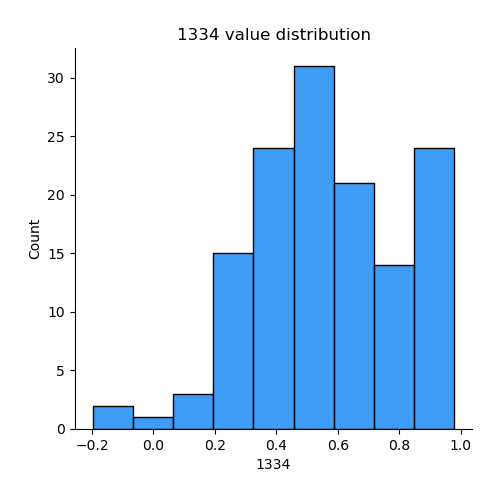
## Feature : 1335
- **Feature type** : continous
- **Missing** : 0.0%
- **Unique** : 135
- **Count** :135.0
- **Mean** :0.5119345002569674
- **Std** :0.2625804829688673
- **Min** :-0.11616785395658714
- **25%th Percentile** : 0.32788488631574997
- **50%th Percentile** : 0.458894740525773
- **75%th Percentile** : 0.7018729836465385
- **Max** :0.9848565557176058

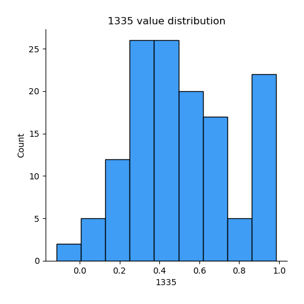
## Feature : 1336
- **Feature type** : continous
- **Missing** : 0.0%
- **Unique** : 135
- **Count** :135.0
- **Mean** :0.5816988793291614
- **Std** :0.23698108074290508
- **Min** :0.07271998389254093
- **25%th Percentile** : 0.3974742600359489
- **50%th Percentile** : 0.5539151684368957
- **75%th Percentile** : 0.7679520862941234
- **Max** :0.9835543893851811

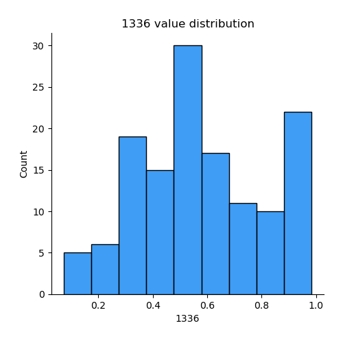
## Feature : 1337
- **Feature type** : continous
- **Missing** : 0.0%
- **Unique** : 135
- **Count** :135.0
- **Mean** :0.5488395252524185
- **Std** :0.28603941470070143
- **Min** :-0.36170707357234505
- **25%th Percentile** : 0.3967348370229623
- **50%th Percentile** : 0.5569713331522558
- **75%th Percentile** : 0.7380367633759619
- **Max** :0.9869693732249635

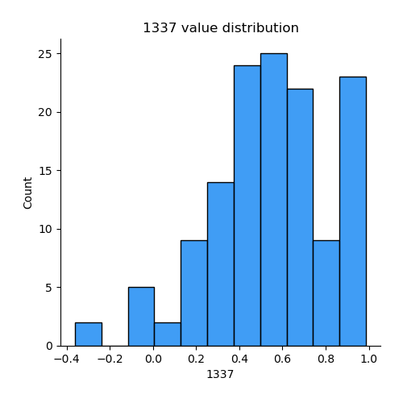
## Feature : 1338
- **Feature type** : continous
- **Missing** : 0.0%
- **Unique** : 135
- **Count** :135.0
- **Mean** :0.4811954838220926
- **Std** :0.3064475001208456
- **Min** :-0.522464109818844
- **25%th Percentile** : 0.25737723924263756
- **50%th Percentile** : 0.4536339538478134
- **75%th Percentile** : 0.6810709388014003
- **Max** :0.9931959010975281

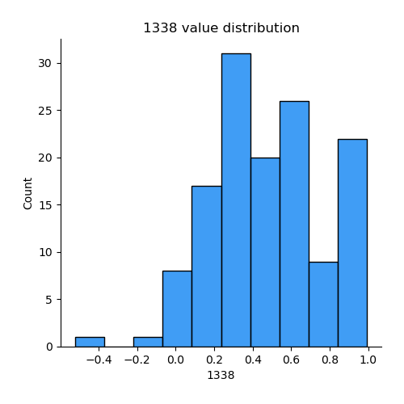
## Feature : 1339
- **Feature type** : continous
- **Missing** : 0.0%
- **Unique** : 135
- **Count** :135.0
- **Mean** :0.506641516391273
- **Std** :0.2842100346501943
- **Min** :-0.2290110742307664
- **25%th Percentile** : 0.3336233598121906
- **50%th Percentile** : 0.5052817934686333
- **75%th Percentile** : 0.6518879878440225
- **Max** :0.9825361483715344

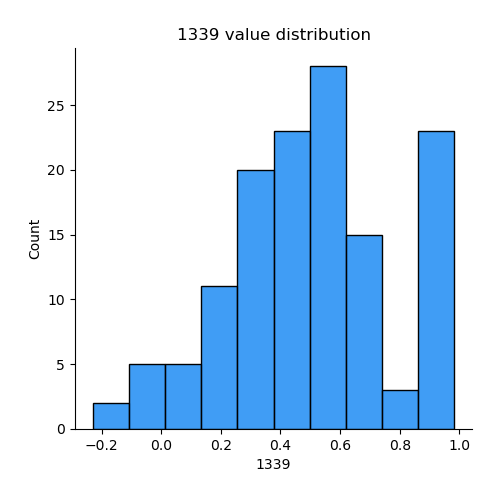
## Feature : 1340
- **Feature type** : continous
- **Missing** : 0.0%
- **Unique** : 135
- **Count** :135.0
- **Mean** :0.55086550778571
- **Std** :0.258555427437465
- **Min** :-0.3641884836539572
- **25%th Percentile** : 0.38038925733852696
- **50%th Percentile** : 0.5471090956544158
- **75%th Percentile** : 0.7334168543785513
- **Max** :0.9784966817853105

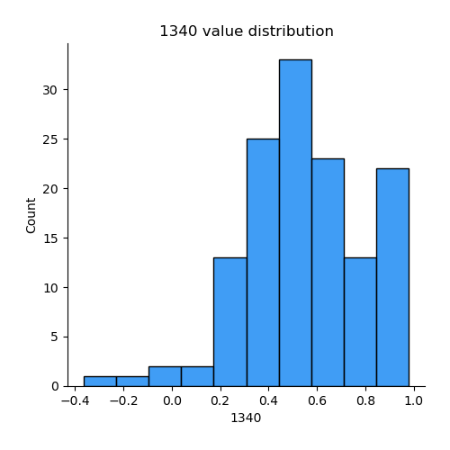
## Feature : 1341
- **Feature type** : continous
- **Missing** : 0.0%
- **Unique** : 135
- **Count** :135.0
- **Mean** :0.539358081935536
- **Std** :0.28564121911462353
- **Min** :-0.18505375702352359
- **25%th Percentile** : 0.33565304687323105
- **50%th Percentile** : 0.5223174988037272
- **75%th Percentile** : 0.7506771677290267
- **Max** :0.9926734446852452

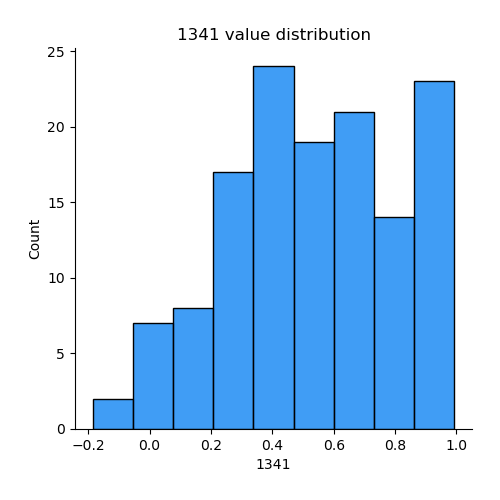
## Feature : 1342
- **Feature type** : continous
- **Missing** : 0.0%
- **Unique** : 135
- **Count** :135.0
- **Mean** :0.607563704058843
- **Std** :0.2387336750534004
- **Min** :0.004428810011669469
- **25%th Percentile** : 0.45602554364749004
- **50%th Percentile** : 0.6113121449865564
- **75%th Percentile** : 0.7672378330410574
- **Max** :0.9929994226629263

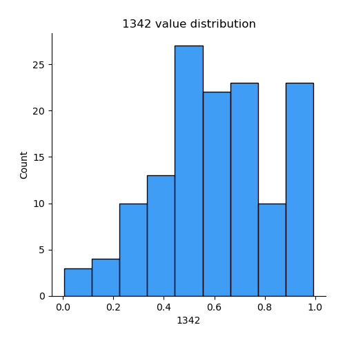
## Feature : 1343
- **Feature type** : continous
- **Missing** : 0.0%
- **Unique** : 135
- **Count** :135.0
- **Mean** :0.5388551524989572
- **Std** :0.28827706677262316
- **Min** :-0.22839186463420352
- **25%th Percentile** : 0.35032998316341657
- **50%th Percentile** : 0.5240678092693434
- **75%th Percentile** : 0.7297991098035128
- **Max** :0.992394372581977

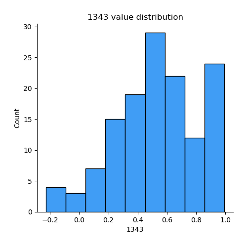
## Feature : 1344
- **Feature type** : continous
- **Missing** : 0.0%
- **Unique** : 135
- **Count** :135.0
- **Mean** :0.5960354399482481
- **Std** :0.23906136550757306
- **Min** :-0.1902748278554037
- **25%th Percentile** : 0.4421558755477626
- **50%th Percentile** : 0.5760434127002884
- **75%th Percentile** : 0.7638937372093818
- **Max** :0.9879653790390468

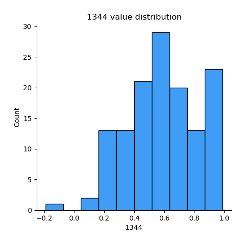
## Feature : 1345
- **Feature type** : continous
- **Missing** : 0.0%
- **Unique** : 135
- **Count** :135.0
- **Mean** :0.4470324971009526
- **Std** :0.2906509558692859
- **Min** :-0.11213464913569082
- **25%th Percentile** : 0.23904805096404957
- **50%th Percentile** : 0.407649252425142
- **75%th Percentile** : 0.6290587665930206
- **Max** :0.9874078614292803

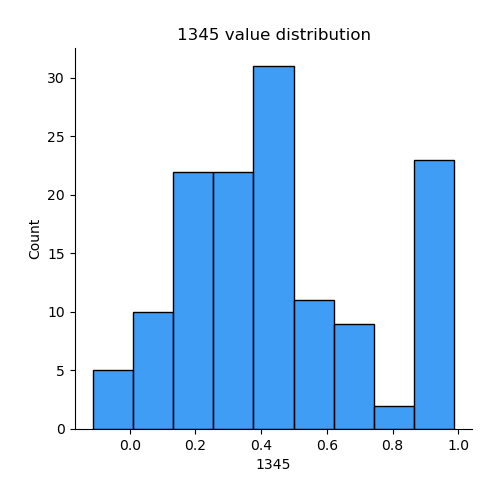
## Feature : 1346
- **Feature type** : continous
- **Missing** : 0.0%
- **Unique** : 135
- **Count** :135.0
- **Mean** :0.520145356129614
- **Std** :0.2875627518729525
- **Min** :-0.24712658791340203
- **25%th Percentile** : 0.3315097052202511
- **50%th Percentile** : 0.5124314881976061
- **75%th Percentile** : 0.6941395135860817
- **Max** :0.990819191218002

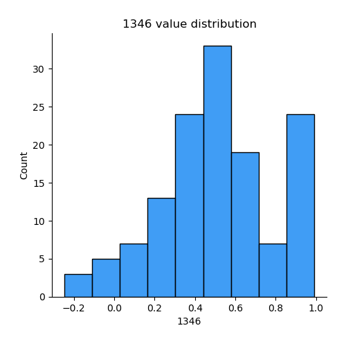
## Feature : 1347
- **Feature type** : continous
- **Missing** : 0.0%
- **Unique** : 135
- **Count** :135.0
- **Mean** :0.5227445715744893
- **Std** :0.27276525332499485
- **Min** :-0.022029964890078073
- **25%th Percentile** : 0.3229188722619498
- **50%th Percentile** : 0.5052692704893952
- **75%th Percentile** : 0.7016248430452784
- **Max** :0.989134049042192

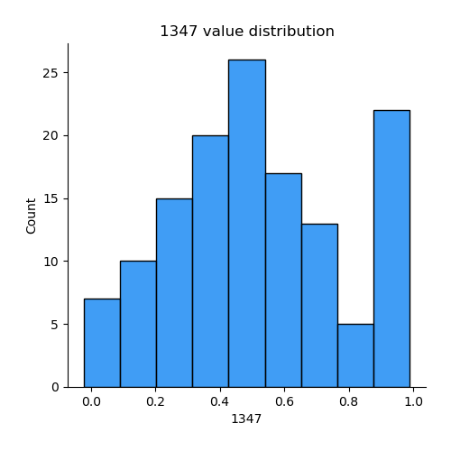
## Feature : 1348
- **Feature type** : continous
- **Missing** : 0.0%
- **Unique** : 135
- **Count** :135.0
- **Mean** :0.6861929984429715
- **Std** :0.2534200888151969
- **Min** :-0.17231832545769488
- **25%th Percentile** : 0.5786921885900118
- **50%th Percentile** : 0.7370101325204603
- **75%th Percentile** : 0.8532266783742908
- **Max** :0.9924093180879795

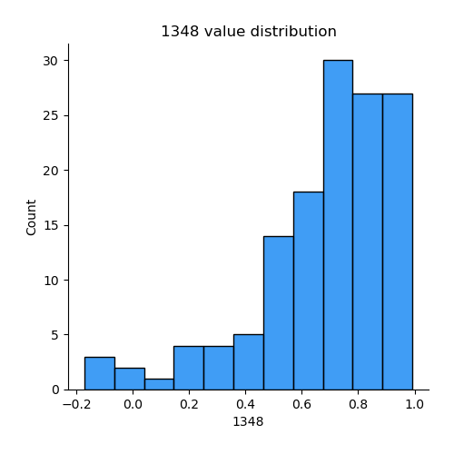
## Feature : 1349
- **Feature type** : continous
- **Missing** : 0.0%
- **Unique** : 135
- **Count** :135.0
- **Mean** :0.5813776940449602
- **Std** :0.27439933980724424
- **Min** :-0.2206283019633408
- **25%th Percentile** : 0.40450157093559236
- **50%th Percentile** : 0.6046539634329646
- **75%th Percentile** : 0.782147318977583
- **Max** :0.9904363558216375

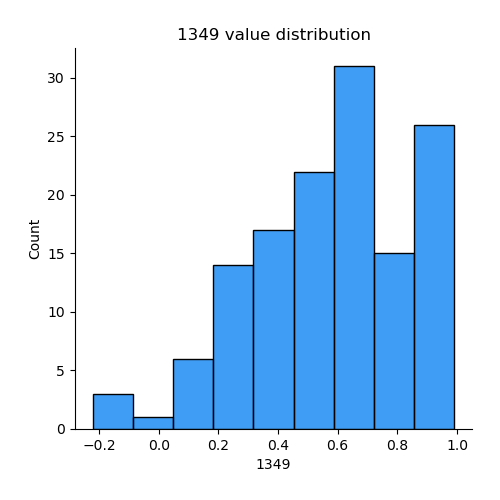
## Feature : 1350
- **Feature type** : continous
- **Missing** : 0.0%
- **Unique** : 135
- **Count** :135.0
- **Mean** :0.42463598752339615
- **Std** :0.3007857986155717
- **Min** :-0.43347492883164257
- **25%th Percentile** : 0.22189182638988914
- **50%th Percentile** : 0.415248884717861
- **75%th Percentile** : 0.6133897743210838
- **Max** :0.9863830381265535

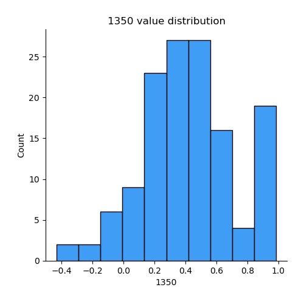
## Feature : 1351
- **Feature type** : continous
- **Missing** : 0.0%
- **Unique** : 135
- **Count** :135.0
- **Mean** :0.682357655319439
- **Std** :0.2620520211836694
- **Min** :-0.5455823822053082
- **25%th Percentile** : 0.5920533745705421
- **50%th Percentile** : 0.7167506264921186
- **75%th Percentile** : 0.8564779819735542
- **Max** :0.9940195979428886

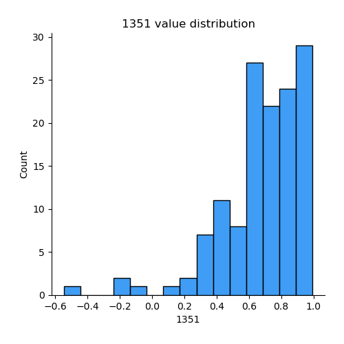
## Feature : 1378
- **Feature type** : continous
- **Missing** : 0.0%
- **Unique** : 3
- **Count** :135.0
- **Mean** :1.0
- **Std** :7.612514017715856e-17
- **Min** :0.9999999999999998
- **25%th Percentile** : 1.0
- **50%th Percentile** : 1.0
- **75%th Percentile** : 1.0
- **Max** :1.0

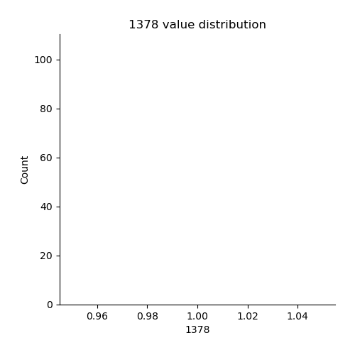
## Feature : 1379
- **Feature type** : continous
- **Missing** : 0.0%
- **Unique** : 135
- **Count** :135.0
- **Mean** :0.5146435607877045
- **Std** :0.27065217210455456
- **Min** :-0.11942449684647322
- **25%th Percentile** : 0.34340282206190614
- **50%th Percentile** : 0.46096767833331115
- **75%th Percentile** : 0.6631758678783539
- **Max** :0.9913456603524025

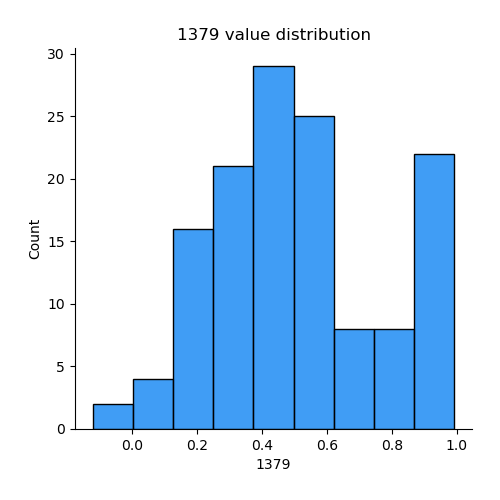
## Feature : 1380
- **Feature type** : continous
- **Missing** : 0.0%
- **Unique** : 135
- **Count** :135.0
- **Mean** :0.5998351209872989
- **Std** :0.23693077836075513
- **Min** :-0.16099931856533628
- **25%th Percentile** : 0.4668508451118908
- **50%th Percentile** : 0.5998527746464871
- **75%th Percentile** : 0.7518541984373042
- **Max** :0.9915149129238343

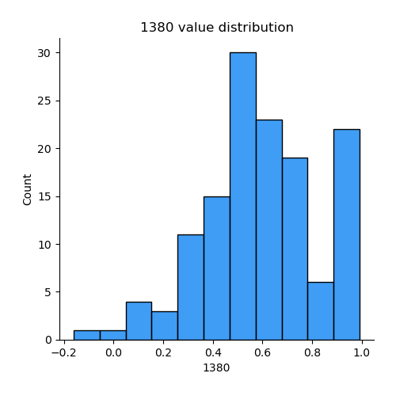
## Feature : 1381
- **Feature type** : continous
- **Missing** : 0.0%
- **Unique** : 135
- **Count** :135.0
- **Mean** :0.3545880236999318
- **Std** :0.304833933836119
- **Min** :-0.42002822079328705
- **25%th Percentile** : 0.15011918475072888
- **50%th Percentile** : 0.2610192447613364
- **75%th Percentile** : 0.5509109854554297
- **Max** :0.9839576576612001

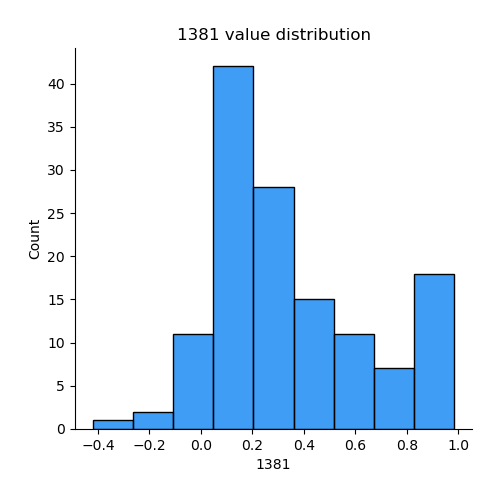
## Feature : 1382
- **Feature type** : continous
- **Missing** : 0.0%
- **Unique** : 135
- **Count** :135.0
- **Mean** :0.6204832668159773
- **Std** :0.22367769884374863
- **Min** :0.017633392708484807
- **25%th Percentile** : 0.46819257178249496
- **50%th Percentile** : 0.6109317632594851
- **75%th Percentile** : 0.7495137196952308
- **Max** :0.9906122563432121

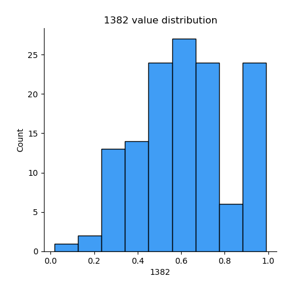
## Feature : 1383
- **Feature type** : continous
- **Missing** : 0.0%
- **Unique** : 135
- **Count** :135.0
- **Mean** :0.6795636004349617
- **Std** :0.21150374000835706
- **Min** :0.15287115380420763
- **25%th Percentile** : 0.5125114878026004
- **50%th Percentile** : 0.6820698317858127
- **75%th Percentile** : 0.8357627336183254
- **Max** :0.9939658101683138

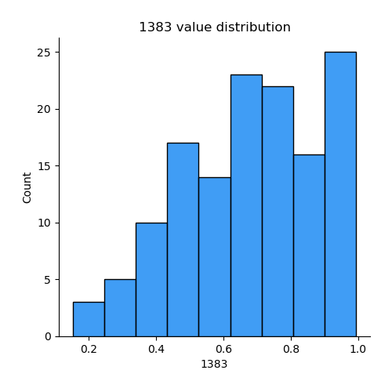
## Feature : 1384
- **Feature type** : continous
- **Missing** : 0.0%
- **Unique** : 135
- **Count** :135.0
- **Mean** :0.5770910891191041
- **Std** :0.24567775615255155
- **Min** :0.02692910798247095
- **25%th Percentile** : 0.40618399438374164
- **50%th Percentile** : 0.5622985038121856
- **75%th Percentile** : 0.7246775353975174
- **Max** :0.990149148165573

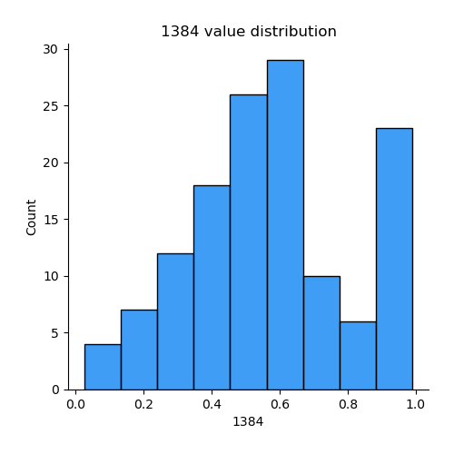
## Feature : 1385
- **Feature type** : continous
- **Missing** : 0.0%
- **Unique** : 135
- **Count** :135.0
- **Mean** :0.6635998372365942
- **Std** :0.217900657627897
- **Min** :-0.10575404050767544
- **25%th Percentile** : 0.5165927372497731
- **50%th Percentile** : 0.6661680059638773
- **75%th Percentile** : 0.8140468139177448
- **Max** :0.9935830404848573

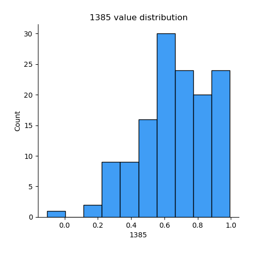
## Feature : 1386
- **Feature type** : continous
- **Missing** : 0.0%
- **Unique** : 135
- **Count** :135.0
- **Mean** :0.5617426563001665
- **Std** :0.2733799999963804
- **Min** :-0.27966105466536273
- **25%th Percentile** : 0.4010887282847688
- **50%th Percentile** : 0.5515364972782909
- **75%th Percentile** : 0.7625937354758278
- **Max** :0.9847703129442298

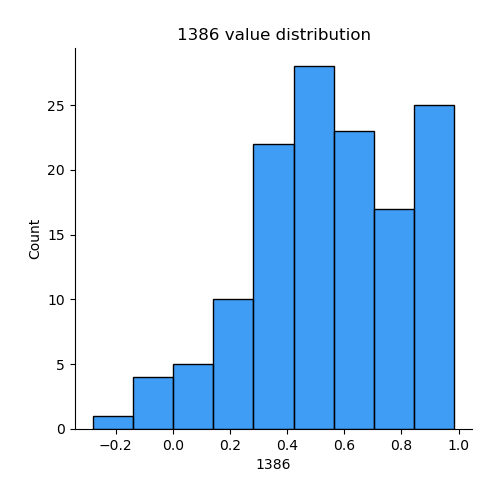
## Feature : 1387
- **Feature type** : continous
- **Missing** : 0.0%
- **Unique** : 135
- **Count** :135.0
- **Mean** :0.6015114198182053
- **Std** :0.22358774380122987
- **Min** :-0.04440289539658693
- **25%th Percentile** : 0.4491845833306812
- **50%th Percentile** : 0.5611677506404782
- **75%th Percentile** : 0.7406967871511014
- **Max** :0.9913785924911693

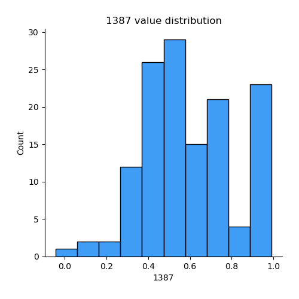
## Feature : 1388
- **Feature type** : continous
- **Missing** : 0.0%
- **Unique** : 135
- **Count** :135.0
- **Mean** :0.5934260744181437
- **Std** :0.23706477632712888
- **Min** :-0.033434145037376004
- **25%th Percentile** : 0.428612323034052
- **50%th Percentile** : 0.5807059542768139
- **75%th Percentile** : 0.7332801298305269
- **Max** :0.987361678186684

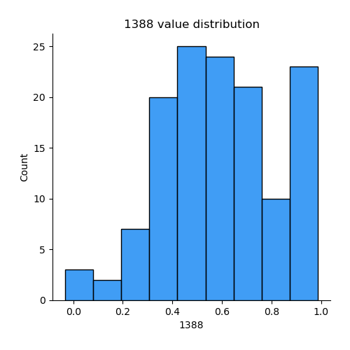
## Feature : 1389
- **Feature type** : continous
- **Missing** : 0.0%
- **Unique** : 135
- **Count** :135.0
- **Mean** :0.7334383786428431
- **Std** :0.18485611489669004
- **Min** :0.1923025516093138
- **25%th Percentile** : 0.6205624143388178
- **50%th Percentile** : 0.7453037520003334
- **75%th Percentile** : 0.8618996126746507
- **Max** :0.995175249160928

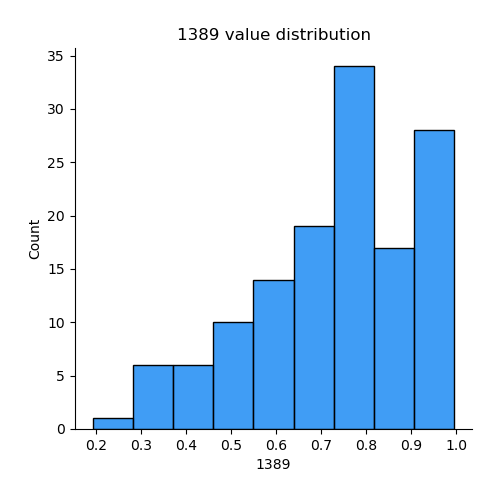
## Feature : 1390
- **Feature type** : continous
- **Missing** : 0.0%
- **Unique** : 135
- **Count** :135.0
- **Mean** :0.5199593026753159
- **Std** :0.29301876132084514
- **Min** :-0.4865784224107262
- **25%th Percentile** : 0.34949682219467176
- **50%th Percentile** : 0.5160809417571139
- **75%th Percentile** : 0.6941862539725966
- **Max** :0.993193654883006

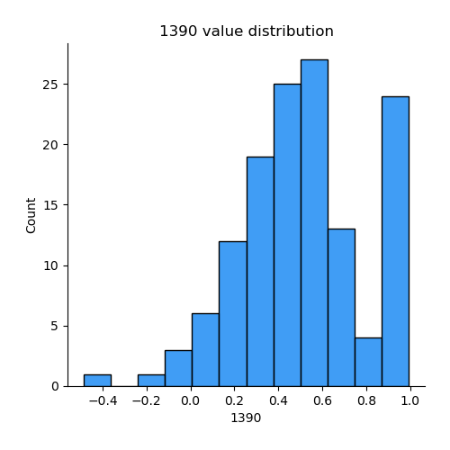
## Feature : 1391
- **Feature type** : continous
- **Missing** : 0.0%
- **Unique** : 135
- **Count** :135.0
- **Mean** :0.5183697514664907
- **Std** :0.26743531147453703
- **Min** :-0.0916063561470456
- **25%th Percentile** : 0.32706092308730833
- **50%th Percentile** : 0.48918348311402504
- **75%th Percentile** : 0.6751578535984601
- **Max** :0.9906725553142264

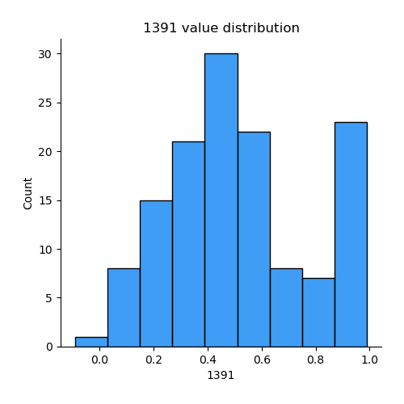
## Feature : 1392
- **Feature type** : continous
- **Missing** : 0.0%
- **Unique** : 135
- **Count** :135.0
- **Mean** :0.5442125431317993
- **Std** :0.26009333537074625
- **Min** :-0.19173598946524725
- **25%th Percentile** : 0.4202460523807485
- **50%th Percentile** : 0.5282019077542551
- **75%th Percentile** : 0.6866865924544827
- **Max** :0.9815518180203467

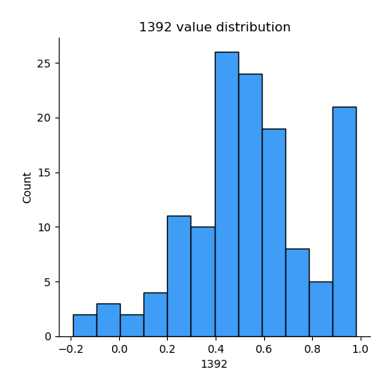
## Feature : 1393
- **Feature type** : continous
- **Missing** : 0.0%
- **Unique** : 135
- **Count** :135.0
- **Mean** :0.579823545448466
- **Std** :0.27114808518711037
- **Min** :-0.2775175942529526
- **25%th Percentile** : 0.41484613271309023
- **50%th Percentile** : 0.5776559501441946
- **75%th Percentile** : 0.7610600645341234
- **Max** :0.9942027532316073

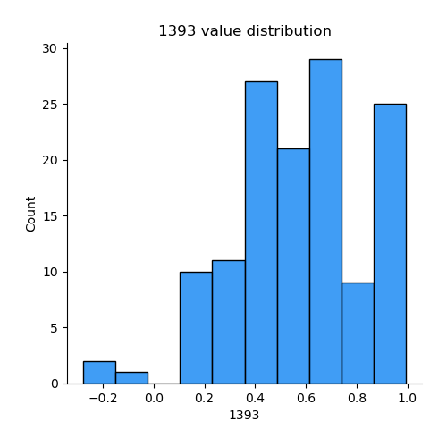
## Feature : 1394
- **Feature type** : continous
- **Missing** : 0.0%
- **Unique** : 135
- **Count** :135.0
- **Mean** :0.5566902613937114
- **Std** :0.2674681423108207
- **Min** :-0.19417577525060029
- **25%th Percentile** : 0.3684223281594226
- **50%th Percentile** : 0.54626445160527
- **75%th Percentile** : 0.727804412871185
- **Max** :0.9907849769265086

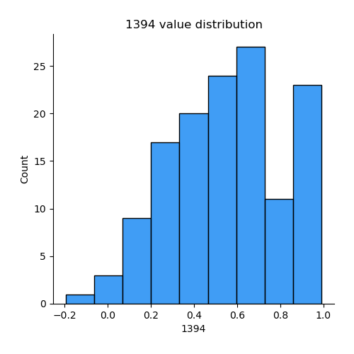
## Feature : 1395
- **Feature type** : continous
- **Missing** : 0.0%
- **Unique** : 135
- **Count** :135.0
- **Mean** :0.5724532854661143
- **Std** :0.2840862824446834
- **Min** :-0.38670729064478326
- **25%th Percentile** : 0.409935125258991
- **50%th Percentile** : 0.5712638990019953
- **75%th Percentile** : 0.7681448858170699
- **Max** :0.9952957209474842

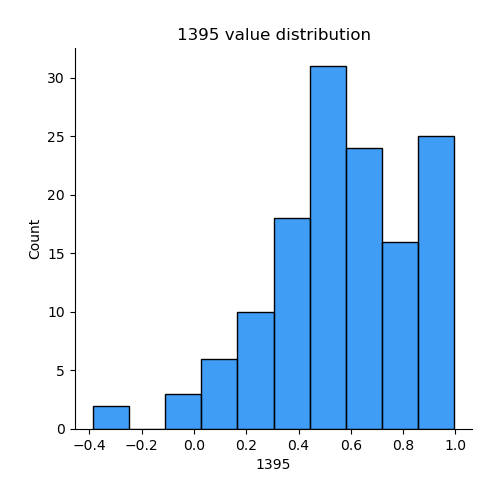
## Feature : 1396
- **Feature type** : continous
- **Missing** : 0.0%
- **Unique** : 135
- **Count** :135.0
- **Mean** :0.6302651611864021
- **Std** :0.23313251012747993
- **Min** :-0.0038074732536599303
- **25%th Percentile** : 0.4661135501544713
- **50%th Percentile** : 0.624064131012592
- **75%th Percentile** : 0.7884804067080855
- **Max** :0.9933060766592328

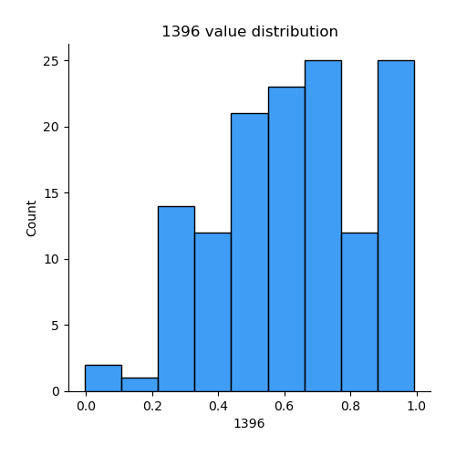
## Feature : 1397
- **Feature type** : continous
- **Missing** : 0.0%
- **Unique** : 135
- **Count** :135.0
- **Mean** :0.41985280972525185
- **Std** :0.31619271782724234
- **Min** :-0.3238671315414497
- **25%th Percentile** : 0.18686726047538985
- **50%th Percentile** : 0.3647992205596536
- **75%th Percentile** : 0.6105759357741638
- **Max** :0.9883342469511884

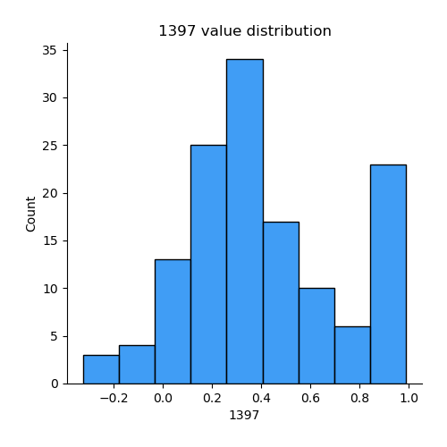
## Feature : 1398
- **Feature type** : continous
- **Missing** : 0.0%
- **Unique** : 135
- **Count** :135.0
- **Mean** :0.5198134971614414
- **Std** :0.3041937117741411
- **Min** :-0.26848951863998627
- **25%th Percentile** : 0.30010195313151444
- **50%th Percentile** : 0.5174134193871813
- **75%th Percentile** : 0.7455670201207744
- **Max** :0.9944402081367968

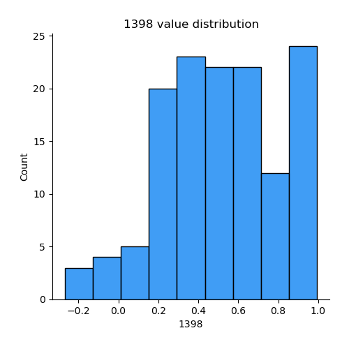
## Feature : 1399
- **Feature type** : continous
- **Missing** : 0.0%
- **Unique** : 135
- **Count** :135.0
- **Mean** :0.5743326708825677
- **Std** :0.2723541379381794
- **Min** :-0.32328531982865477
- **25%th Percentile** : 0.39254448597023617
- **50%th Percentile** : 0.5852213104516228
- **75%th Percentile** : 0.7710666090531046
- **Max** :0.995105772979764

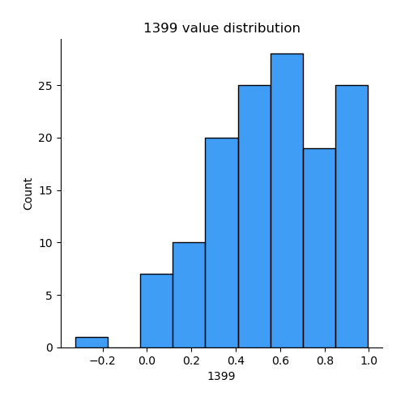
## Feature : 1400
- **Feature type** : continous
- **Missing** : 0.0%
- **Unique** : 135
- **Count** :135.0
- **Mean** :0.7714782085987687
- **Std** :0.1581426687883634
- **Min** :0.2878551626158042
- **25%th Percentile** : 0.6729366736855948
- **50%th Percentile** : 0.7965003482863285
- **75%th Percentile** : 0.881867620123419
- **Max** :0.9949242976764976

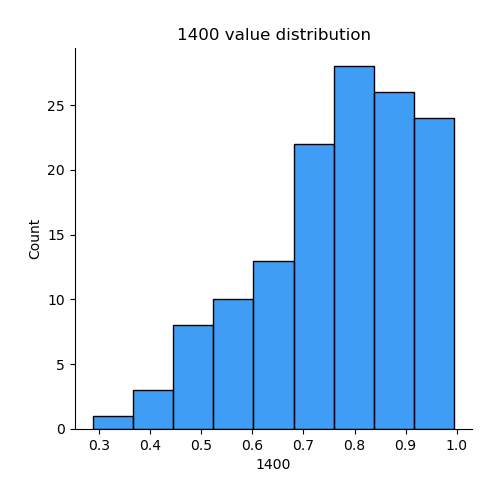
## Feature : 1401
- **Feature type** : continous
- **Missing** : 0.0%
- **Unique** : 135
- **Count** :135.0
- **Mean** :0.6431551013743552
- **Std** :0.2354219866140006
- **Min** :-0.2160302948462513
- **25%th Percentile** : 0.5051463138804027
- **50%th Percentile** : 0.6518109127015235
- **75%th Percentile** : 0.8102473800334841
- **Max** :0.9957465759079557

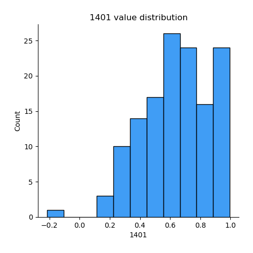
## Feature : 1402
- **Feature type** : continous
- **Missing** : 0.0%
- **Unique** : 135
- **Count** :135.0
- **Mean** :0.3698017321917069
- **Std** :0.3142337855903509
- **Min** :-0.2377161229859371
- **25%th Percentile** : 0.13630076328164348
- **50%th Percentile** : 0.3098693232073345
- **75%th Percentile** : 0.5455383885896824
- **Max** :0.9781118487526108

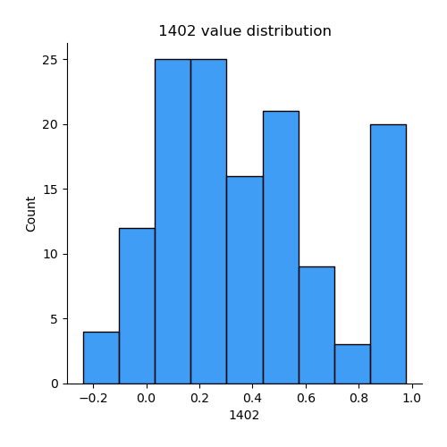
## Feature : 1403
- **Feature type** : continous
- **Missing** : 0.0%
- **Unique** : 135
- **Count** :135.0
- **Mean** :0.5881326201253378
- **Std** :0.24921551902367955
- **Min** :-0.1266566137177769
- **25%th Percentile** : 0.4102661574041591
- **50%th Percentile** : 0.5863990717940308
- **75%th Percentile** : 0.7686489661232493
- **Max** :0.9883136064557934

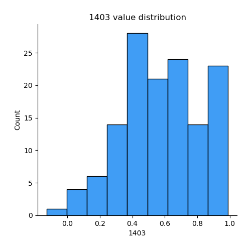
## Feature : 1431
- **Feature type** : continous
- **Missing** : 0.0%
- **Unique** : 3
- **Count** :135.0
- **Mean** :1.0
- **Std** :8.470423645496557e-17
- **Min** :0.9999999999999998
- **25%th Percentile** : 0.9999999999999999
- **50%th Percentile** : 1.0
- **75%th Percentile** : 1.0
- **Max** :1.0

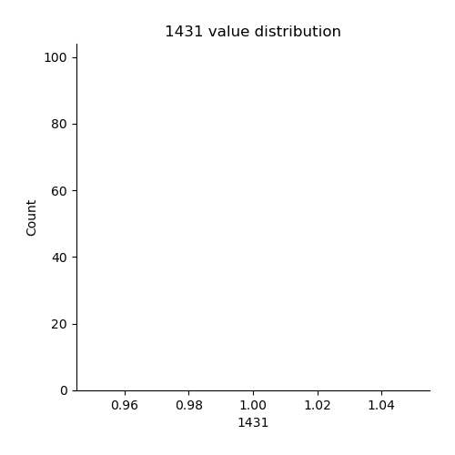
## Feature : 1432
- **Feature type** : continous
- **Missing** : 0.0%
- **Unique** : 135
- **Count** :135.0
- **Mean** :0.5585949389963706
- **Std** :0.23157770283161105
- **Min** :-0.02721557056566686
- **25%th Percentile** : 0.40626934539550796
- **50%th Percentile** : 0.5387727118402978
- **75%th Percentile** : 0.6764452266840045
- **Max** :0.9848203793187794

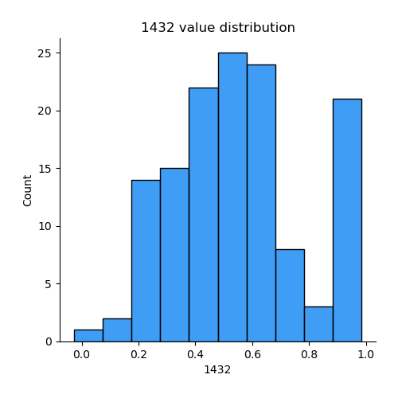
## Feature : 1433
- **Feature type** : continous
- **Missing** : 0.0%
- **Unique** : 135
- **Count** :135.0
- **Mean** :0.37557393966124336
- **Std** :0.2934036123186421
- **Min** :-0.26825806225021404
- **25%th Percentile** : 0.16016501468642694
- **50%th Percentile** : 0.33407966301408654
- **75%th Percentile** : 0.5362722822144511
- **Max** :0.9845504720096252

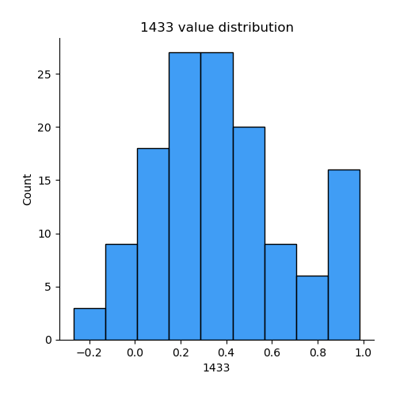
## Feature : 1434
- **Feature type** : continous
- **Missing** : 0.0%
- **Unique** : 135
- **Count** :135.0
- **Mean** :0.5322263385328552
- **Std** :0.26070424968070416
- **Min** :-0.23181869922563622
- **25%th Percentile** : 0.3843374264565391
- **50%th Percentile** : 0.5154782814301395
- **75%th Percentile** : 0.6771658564807488
- **Max** :0.9868473129283802

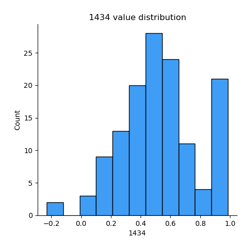
## Feature : 1435
- **Feature type** : continous
- **Missing** : 0.0%
- **Unique** : 135
- **Count** :135.0
- **Mean** :0.592506300125191
- **Std** :0.2188590997124915
- **Min** :0.1878809517222549
- **25%th Percentile** : 0.4424618703895872
- **50%th Percentile** : 0.5478928267280034
- **75%th Percentile** : 0.7183550862331216
- **Max** :0.9923353294428513

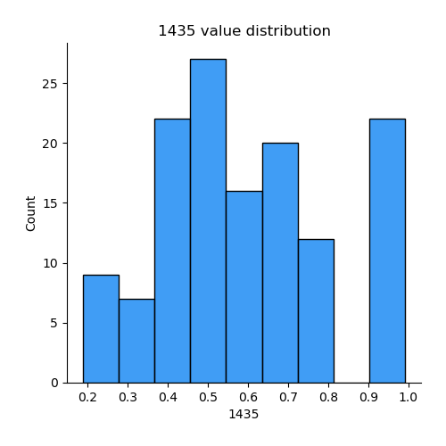
## Feature : 1436
- **Feature type** : continous
- **Missing** : 0.0%
- **Unique** : 135
- **Count** :135.0
- **Mean** :0.5342834812586857
- **Std** :0.2620286479918156
- **Min** :-0.298427439518834
- **25%th Percentile** : 0.3692171824146221
- **50%th Percentile** : 0.5361157945557663
- **75%th Percentile** : 0.6741493844087024
- **Max** :0.9901361328976848

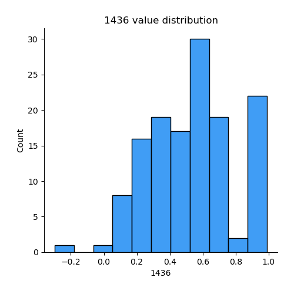
## Feature : 1437
- **Feature type** : continous
- **Missing** : 0.0%
- **Unique** : 135
- **Count** :135.0
- **Mean** :0.6951436072819027
- **Std** :0.18679345636305292
- **Min** :0.15671019178161538
- **25%th Percentile** : 0.5872432727300083
- **50%th Percentile** : 0.6933654893505471
- **75%th Percentile** : 0.8096583476936214
- **Max** :0.9949566086064944

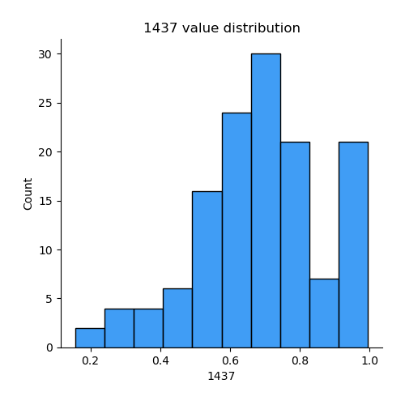
## Feature : 1438
- **Feature type** : continous
- **Missing** : 0.0%
- **Unique** : 135
- **Count** :135.0
- **Mean** :0.5543922609212759
- **Std** :0.23197449962692995
- **Min** :0.01773342671155842
- **25%th Percentile** : 0.40283753492612295
- **50%th Percentile** : 0.5185092082734972
- **75%th Percentile** : 0.6860497404598334
- **Max** :0.9832772099391954

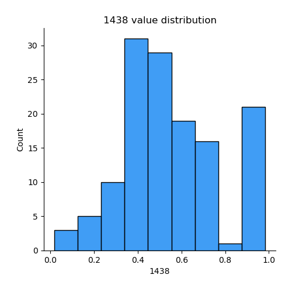
## Feature : 1439
- **Feature type** : continous
- **Missing** : 0.0%
- **Unique** : 135
- **Count** :135.0
- **Mean** :0.5045454825657609
- **Std** :0.2537728959393257
- **Min** :-0.11700925958184095
- **25%th Percentile** : 0.33413839267154943
- **50%th Percentile** : 0.46854586152489086
- **75%th Percentile** : 0.6251297703992929
- **Max** :0.9829737153355589

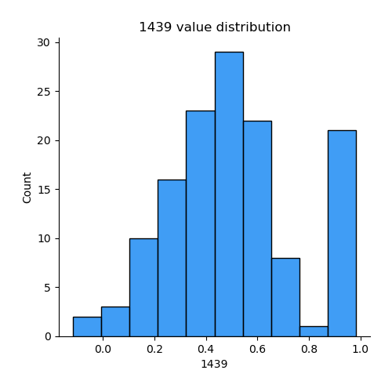
## Feature : 1440
- **Feature type** : continous
- **Missing** : 0.0%
- **Unique** : 135
- **Count** :135.0
- **Mean** :0.5434676587992527
- **Std** :0.2496102846006274
- **Min** :0.059005238003270226
- **25%th Percentile** : 0.3701572490162724
- **50%th Percentile** : 0.5259372868155143
- **75%th Percentile** : 0.696814339573754
- **Max** :0.9911067641773366

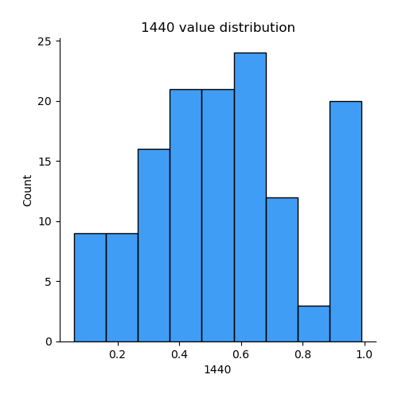
## Feature : 1441
- **Feature type** : continous
- **Missing** : 0.0%
- **Unique** : 135
- **Count** :135.0
- **Mean** :0.547723246773951
- **Std** :0.2562818582583839
- **Min** :-0.21694983974031945
- **25%th Percentile** : 0.38303797530344974
- **50%th Percentile** : 0.5152927824412452
- **75%th Percentile** : 0.7125087409873768
- **Max** :0.9913439959324779

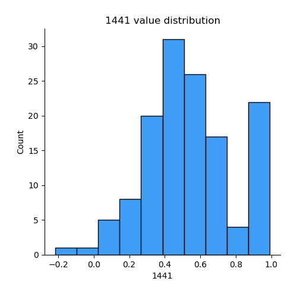
## Feature : 1442
- **Feature type** : continous
- **Missing** : 0.0%
- **Unique** : 135
- **Count** :135.0
- **Mean** :0.6088356053850594
- **Std** :0.2333612430741478
- **Min** :-0.029725298281526678
- **25%th Percentile** : 0.4460225885277564
- **50%th Percentile** : 0.6121906457644881
- **75%th Percentile** : 0.7338581861034335
- **Max** :0.9937929713347369

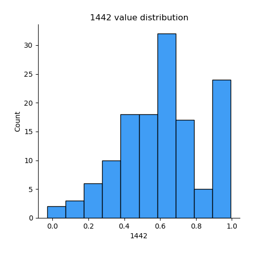
## Feature : 1443
- **Feature type** : continous
- **Missing** : 0.0%
- **Unique** : 135
- **Count** :135.0
- **Mean** :0.4647506213001879
- **Std** :0.28513187413247515
- **Min** :-0.24279967575660116
- **25%th Percentile** : 0.2886745909710408
- **50%th Percentile** : 0.4154744963467586
- **75%th Percentile** : 0.6129691967238653
- **Max** :0.990120482942905

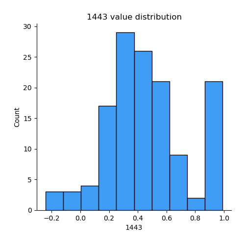
## Feature : 1444
- **Feature type** : continous
- **Missing** : 0.0%
- **Unique** : 135
- **Count** :135.0
- **Mean** :0.538960292429041
- **Std** :0.23601262995075573
- **Min** :-0.057549888747575724
- **25%th Percentile** : 0.3618536210021235
- **50%th Percentile** : 0.5359697961302452
- **75%th Percentile** : 0.6569445825872888
- **Max** :0.9844874359806551

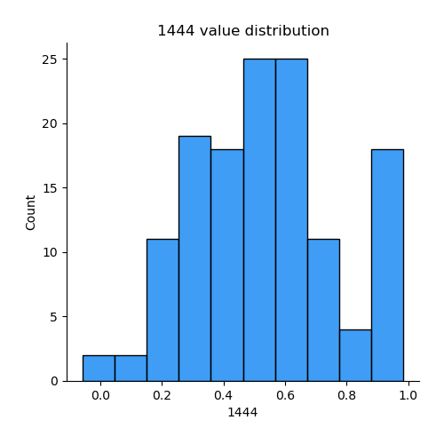
## Feature : 1445
- **Feature type** : continous
- **Missing** : 0.0%
- **Unique** : 135
- **Count** :135.0
- **Mean** :0.6316464679137387
- **Std** :0.22065675387060643
- **Min** :0.14462884469120488
- **25%th Percentile** : 0.46673433701618505
- **50%th Percentile** : 0.6164288209558457
- **75%th Percentile** : 0.7720146209843457
- **Max** :0.9940662526789847

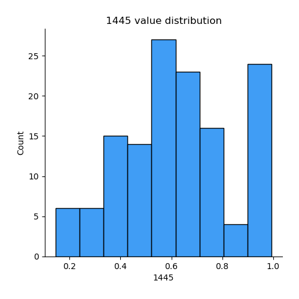
## Feature : 1446
- **Feature type** : continous
- **Missing** : 0.0%
- **Unique** : 135
- **Count** :135.0
- **Mean** :0.759879312394572
- **Std** :0.1613111935723367
- **Min** :0.22010802933836346
- **25%th Percentile** : 0.6704825848384215
- **50%th Percentile** : 0.7573039369044499
- **75%th Percentile** : 0.8650751789045702
- **Max** :0.99681786421902

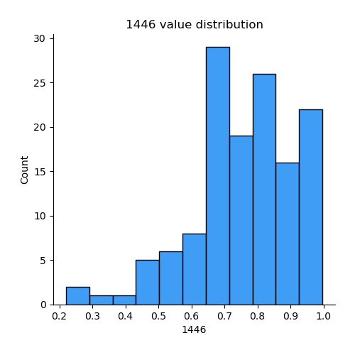
## Feature : 1447
- **Feature type** : continous
- **Missing** : 0.0%
- **Unique** : 135
- **Count** :135.0
- **Mean** :0.6889314132274882
- **Std** :0.19854181990587288
- **Min** :0.04378254789383712
- **25%th Percentile** : 0.5655473200234493
- **50%th Percentile** : 0.6967126164771885
- **75%th Percentile** : 0.8272965403001824
- **Max** :0.9966757274545747

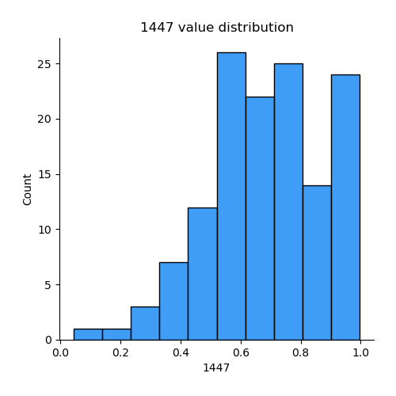
## Feature : 1448
- **Feature type** : continous
- **Missing** : 0.0%
- **Unique** : 135
- **Count** :135.0
- **Mean** :0.6394777721496562
- **Std** :0.1970977241312153
- **Min** :0.13422581145800766
- **25%th Percentile** : 0.5162473664939955
- **50%th Percentile** : 0.6143751819597776
- **75%th Percentile** : 0.7356788736144335
- **Max** :0.9934687877729158

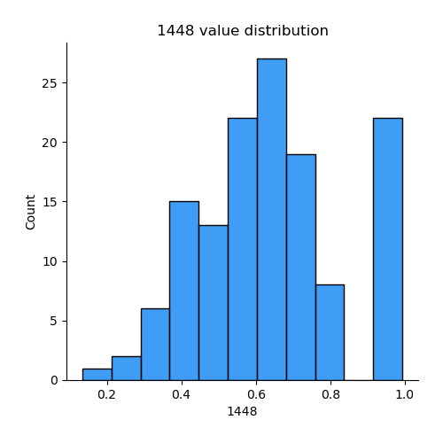
## Feature : 1449
- **Feature type** : continous
- **Missing** : 0.0%
- **Unique** : 135
- **Count** :135.0
- **Mean** :0.6313520259959171
- **Std** :0.21892162586439476
- **Min** :0.18005594464838967
- **25%th Percentile** : 0.4585617517110886
- **50%th Percentile** : 0.6473816498002369
- **75%th Percentile** : 0.7823032385258534
- **Max** :0.9919134808812166

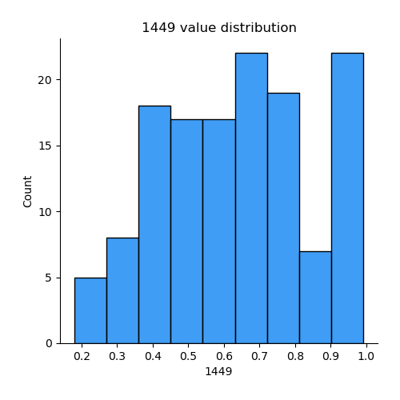
## Feature : 1450
- **Feature type** : continous
- **Missing** : 0.0%
- **Unique** : 135
- **Count** :135.0
- **Mean** :0.7895981691814973
- **Std** :0.14099358865150852
- **Min** :0.19911825571321176
- **25%th Percentile** : 0.7209243770423255
- **50%th Percentile** : 0.8025286858128151
- **75%th Percentile** : 0.8752728802170967
- **Max** :0.9966799140345902

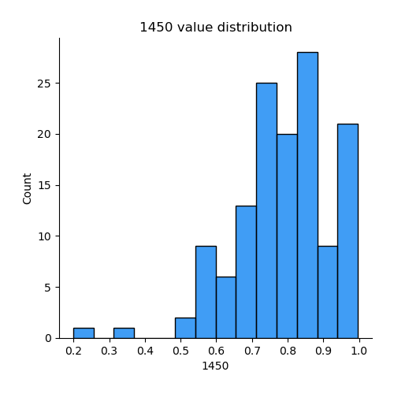
## Feature : 1451
- **Feature type** : continous
- **Missing** : 0.0%
- **Unique** : 135
- **Count** :135.0
- **Mean** :0.6237658911687064
- **Std** :0.2159151053300964
- **Min** :0.13529467944879486
- **25%th Percentile** : 0.47456161695257776
- **50%th Percentile** : 0.6114352958166229
- **75%th Percentile** : 0.743891581550576
- **Max** :0.9946992913409725

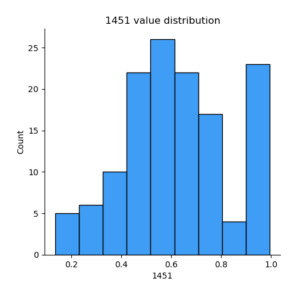
## Feature : 1452
- **Feature type** : continous
- **Missing** : 0.0%
- **Unique** : 135
- **Count** :135.0
- **Mean** :0.6112861409708267
- **Std** :0.23127794082810535
- **Min** :-0.15888231010889664
- **25%th Percentile** : 0.46371644498992404
- **50%th Percentile** : 0.6038279249293903
- **75%th Percentile** : 0.7411842269081652
- **Max** :0.9935483726010917

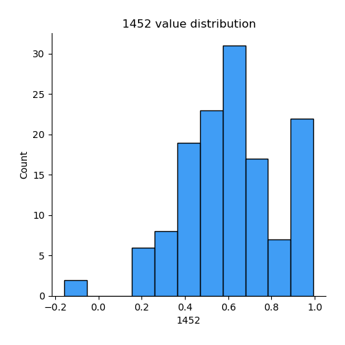
## Feature : 1453
- **Feature type** : continous
- **Missing** : 0.0%
- **Unique** : 135
- **Count** :135.0
- **Mean** :0.6939802618672661
- **Std** :0.17979589713882313
- **Min** :0.30277268610071106
- **25%th Percentile** : 0.5882191587795119
- **50%th Percentile** : 0.6930299678702591
- **75%th Percentile** : 0.8054496869213603
- **Max** :0.9952623800258535

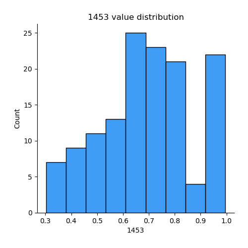
## Feature : 1454
- **Feature type** : continous
- **Missing** : 0.0%
- **Unique** : 135
- **Count** :135.0
- **Mean** :0.3791659105463589
- **Std** :0.29878384311771644
- **Min** :-0.4510564884142724
- **25%th Percentile** : 0.15431792701750402
- **50%th Percentile** : 0.329640973309617
- **75%th Percentile** : 0.5536714502529658
- **Max** :0.9826332596574162

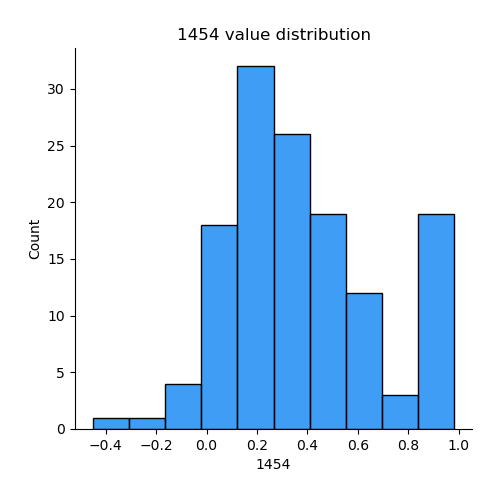
## Feature : 1455
- **Feature type** : continous
- **Missing** : 0.0%
- **Unique** : 135
- **Count** :135.0
- **Mean** :0.5493315177123473
- **Std** :0.25915035044345486
- **Min** :-0.2646517033874344
- **25%th Percentile** : 0.39333754088010936
- **50%th Percentile** : 0.5420690730032105
- **75%th Percentile** : 0.7063698368880555
- **Max** :0.9901396946753301

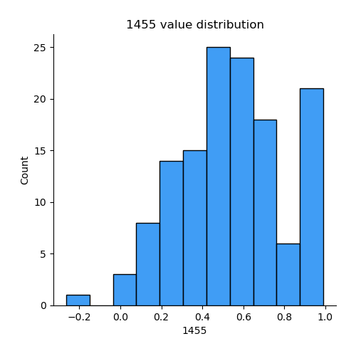
## Feature : 1484
- **Feature type** : continous
- **Missing** : 0.0%
- **Unique** : 3
- **Count** :135.0
- **Mean** :1.0
- **Std** :8.737694914694383e-17
- **Min** :0.9999999999999998
- **25%th Percentile** : 0.9999999999999999
- **50%th Percentile** : 1.0
- **75%th Percentile** : 1.0
- **Max** :1.0

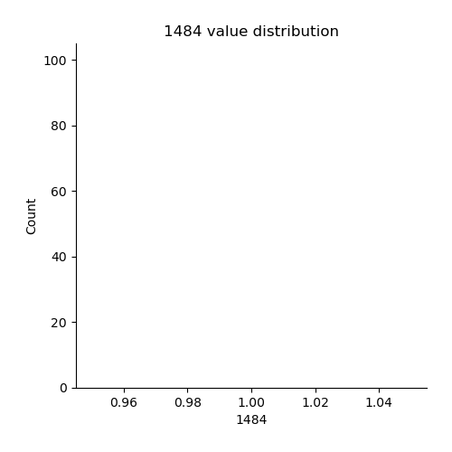
## Feature : 1485
- **Feature type** : continous
- **Missing** : 0.0%
- **Unique** : 135
- **Count** :135.0
- **Mean** :0.3941159694642852
- **Std** :0.2927097049607269
- **Min** :-0.1685409649791524
- **25%th Percentile** : 0.17080158495530912
- **50%th Percentile** : 0.3522004360567405
- **75%th Percentile** : 0.5675307775679344
- **Max** :0.9776316082732844

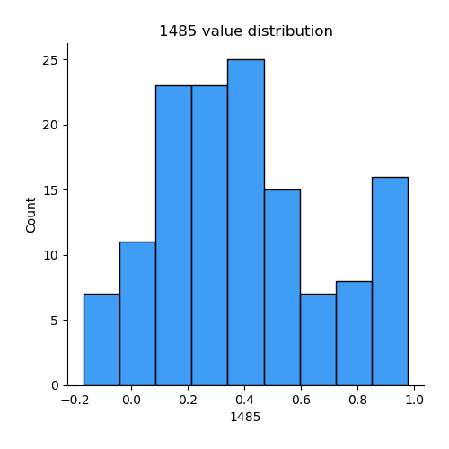
## Feature : 1486
- **Feature type** : continous
- **Missing** : 0.0%
- **Unique** : 135
- **Count** :135.0
- **Mean** :0.7014436232467576
- **Std** :0.19035342517020115
- **Min** :0.10752706989843049
- **25%th Percentile** : 0.5841480496436606
- **50%th Percentile** : 0.7010751806819913
- **75%th Percentile** : 0.8417149417636594
- **Max** :0.9918255922415483

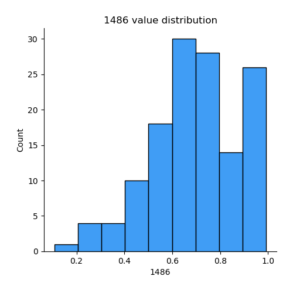
## Feature : 1487
- **Feature type** : continous
- **Missing** : 0.0%
- **Unique** : 135
- **Count** :135.0
- **Mean** :0.6920647625836929
- **Std** :0.19392253853648855
- **Min** :0.10739430965208172
- **25%th Percentile** : 0.5547401894865384
- **50%th Percentile** : 0.7004861989096864
- **75%th Percentile** : 0.8298407491009117
- **Max** :0.9901740471761882

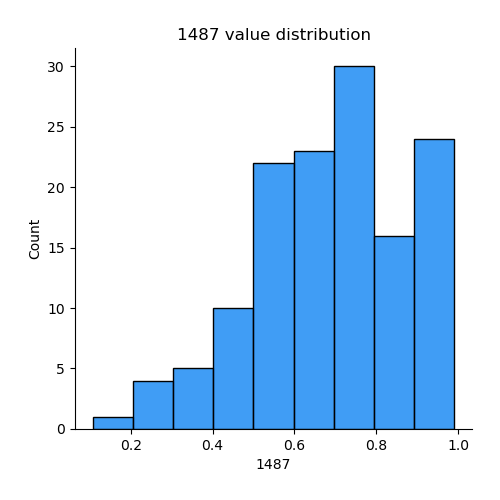
## Feature : 1488
- **Feature type** : continous
- **Missing** : 0.0%
- **Unique** : 135
- **Count** :135.0
- **Mean** :0.5860811880338621
- **Std** :0.2414202807667777
- **Min** :0.02148969320804566
- **25%th Percentile** : 0.43097787854283787
- **50%th Percentile** : 0.5645870542896967
- **75%th Percentile** : 0.7584160303208635
- **Max** :0.9885501478559083

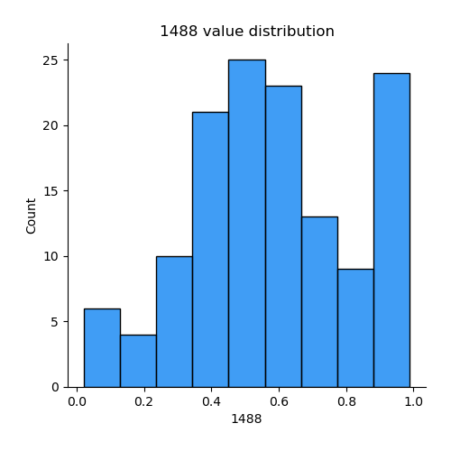
## Feature : 1489
- **Feature type** : continous
- **Missing** : 0.0%
- **Unique** : 135
- **Count** :135.0
- **Mean** :0.6312305021373689
- **Std** :0.21031181658527048
- **Min** :0.11381207793053548
- **25%th Percentile** : 0.4954063323255563
- **50%th Percentile** : 0.6160635794939511
- **75%th Percentile** : 0.7454485637611018
- **Max** :0.9914438517158577

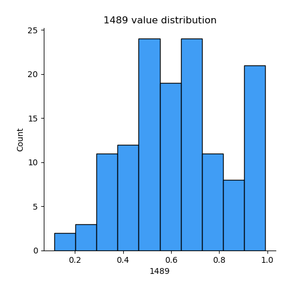
## Feature : 1490
- **Feature type** : continous
- **Missing** : 0.0%
- **Unique** : 135
- **Count** :135.0
- **Mean** :0.671851493374534
- **Std** :0.206194473695489
- **Min** :0.054792933759261864
- **25%th Percentile** : 0.5370617779156521
- **50%th Percentile** : 0.6835307533960328
- **75%th Percentile** : 0.8339641449330986
- **Max** :0.9832619139724563

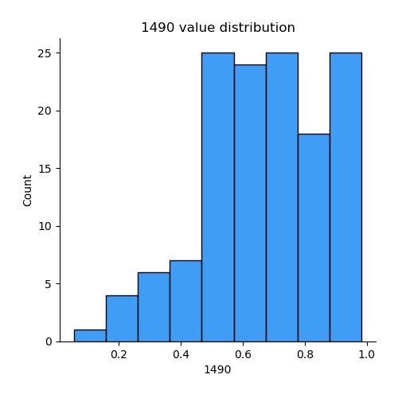
## Feature : 1491
- **Feature type** : continous
- **Missing** : 0.0%
- **Unique** : 135
- **Count** :135.0
- **Mean** :0.7514194156997166
- **Std** :0.16682698852672737
- **Min** :-0.026902958339854014
- **25%th Percentile** : 0.6727440367865019
- **50%th Percentile** : 0.7602677007945514
- **75%th Percentile** : 0.8608071655583369
- **Max** :0.9908346518980111

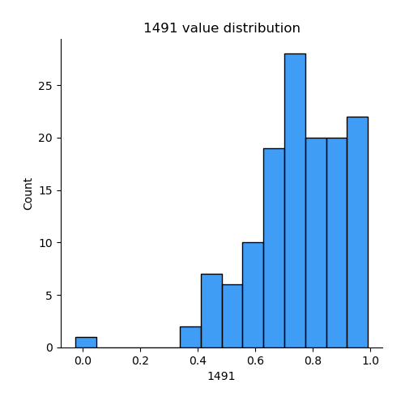
## Feature : 1492
- **Feature type** : continous
- **Missing** : 0.0%
- **Unique** : 135
- **Count** :135.0
- **Mean** :0.8360524433999085
- **Std** :0.12179094072999927
- **Min** :0.4781126386809497
- **25%th Percentile** : 0.7545509099402161
- **50%th Percentile** : 0.8582806663410936
- **75%th Percentile** : 0.9253021185406971
- **Max** :0.9953135256232517

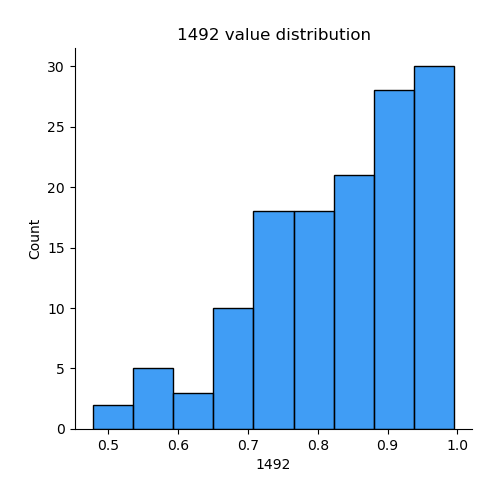
## Feature : 1493
- **Feature type** : continous
- **Missing** : 0.0%
- **Unique** : 135
- **Count** :135.0
- **Mean** :0.6029764400064649
- **Std** :0.24244437795662785
- **Min** :-0.15592251854343445
- **25%th Percentile** : 0.48476211786384016
- **50%th Percentile** : 0.5834580996905948
- **75%th Percentile** : 0.7686076765154781
- **Max** :0.99033613981922

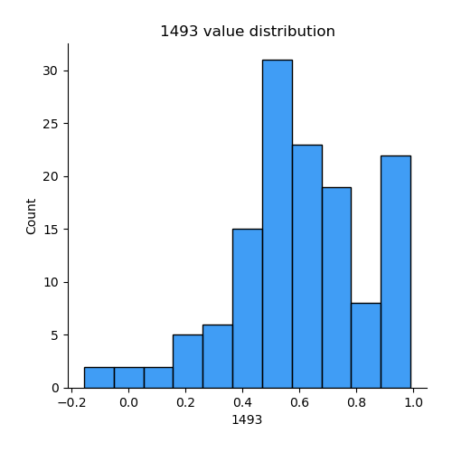
## Feature : 1494
- **Feature type** : continous
- **Missing** : 0.0%
- **Unique** : 135
- **Count** :135.0
- **Mean** :0.588060531516173
- **Std** :0.2543223036775535
- **Min** :-0.07784088573517378
- **25%th Percentile** : 0.40538578813364223
- **50%th Percentile** : 0.5891673401688218
- **75%th Percentile** : 0.789698079418246
- **Max** :0.9891634041558481

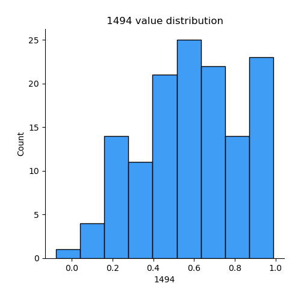
## Feature : 1495
- **Feature type** : continous
- **Missing** : 0.0%
- **Unique** : 135
- **Count** :135.0
- **Mean** :0.5852378957713039
- **Std** :0.22969604384557193
- **Min** :0.10367979989887183
- **25%th Percentile** : 0.4306408081179164
- **50%th Percentile** : 0.5631885605465969
- **75%th Percentile** : 0.7222262941613604
- **Max** :0.9893126273295343

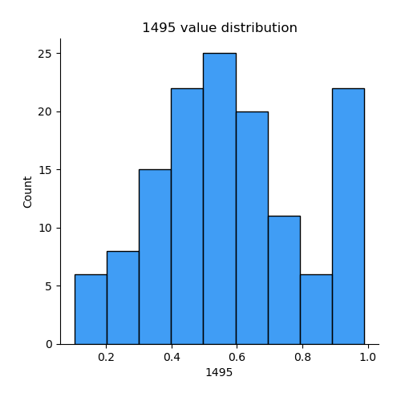
## Feature : 1496
- **Feature type** : continous
- **Missing** : 0.0%
- **Unique** : 135
- **Count** :135.0
- **Mean** :0.8093943253086077
- **Std** :0.1353278593199771
- **Min** :0.35914069367666285
- **25%th Percentile** : 0.7344485439472552
- **50%th Percentile** : 0.8280733391191216
- **75%th Percentile** : 0.9098844433116469
- **Max** :0.992620939168287

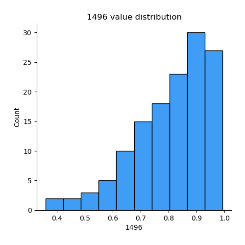
## Feature : 1497
- **Feature type** : continous
- **Missing** : 0.0%
- **Unique** : 135
- **Count** :135.0
- **Mean** :0.6326226981966946
- **Std** :0.22736416700634737
- **Min** :0.060256488997264344
- **25%th Percentile** : 0.4703129338948524
- **50%th Percentile** : 0.6635707876281773
- **75%th Percentile** : 0.7766543018996661
- **Max** :0.9916361993437947

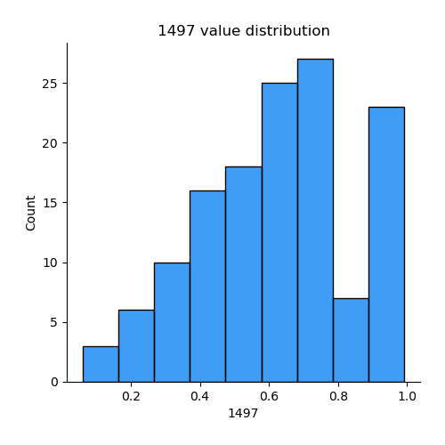
## Feature : 1498
- **Feature type** : continous
- **Missing** : 0.0%
- **Unique** : 135
- **Count** :135.0
- **Mean** :0.6339349840915174
- **Std** :0.20955055211564122
- **Min** :-0.06019224998693364
- **25%th Percentile** : 0.48800542541642755
- **50%th Percentile** : 0.6087859224867579
- **75%th Percentile** : 0.7908095511425196
- **Max** :0.9903883081102551

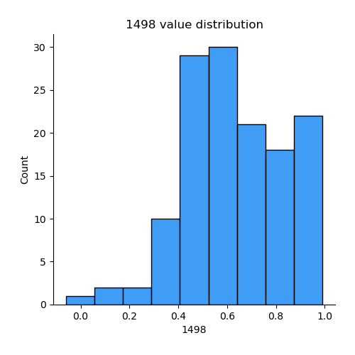
## Feature : 1499
- **Feature type** : continous
- **Missing** : 0.0%
- **Unique** : 135
- **Count** :135.0
- **Mean** :0.641364647883742
- **Std** :0.2188573160315867
- **Min** :0.0918365438256939
- **25%th Percentile** : 0.4969847319286888
- **50%th Percentile** : 0.6627593176132607
- **75%th Percentile** : 0.7825822357573872
- **Max** :0.9926488938458199

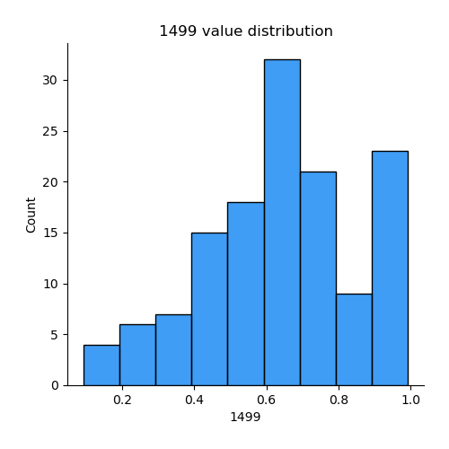
## Feature : 1500
- **Feature type** : continous
- **Missing** : 0.0%
- **Unique** : 135
- **Count** :135.0
- **Mean** :0.7539522005949967
- **Std** :0.16133848862526315
- **Min** :0.30396327678981516
- **25%th Percentile** : 0.6582305719563137
- **50%th Percentile** : 0.7692555226159692
- **75%th Percentile** : 0.8770572255512417
- **Max** :0.9902414659543619

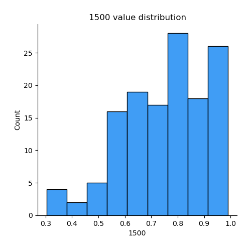
## Feature : 1501
- **Feature type** : continous
- **Missing** : 0.0%
- **Unique** : 135
- **Count** :135.0
- **Mean** :0.4223769392827441
- **Std** :0.28716105374613254
- **Min** :-0.20549471995289528
- **25%th Percentile** : 0.21781038470631983
- **50%th Percentile** : 0.3671519224992578
- **75%th Percentile** : 0.5419383911327593
- **Max** :0.9806027179141598

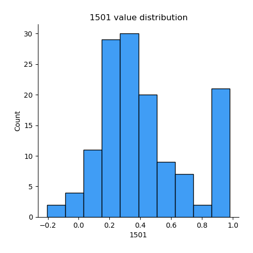
## Feature : 1502
- **Feature type** : continous
- **Missing** : 0.0%
- **Unique** : 135
- **Count** :135.0
- **Mean** :0.5607914458248114
- **Std** :0.25843937277614537
- **Min** :-0.018666154800591625
- **25%th Percentile** : 0.40550629557996776
- **50%th Percentile** : 0.5440308031305214
- **75%th Percentile** : 0.7558104033622677
- **Max** :0.9902367198038853

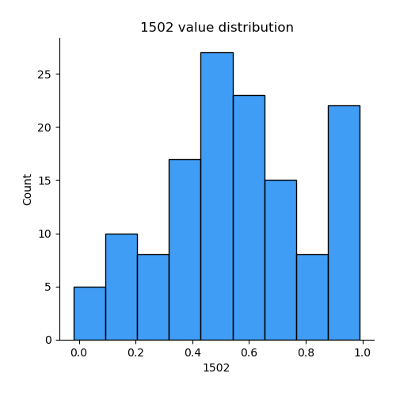
## Feature : 1503
- **Feature type** : continous
- **Missing** : 0.0%
- **Unique** : 135
- **Count** :135.0
- **Mean** :0.7682590570172115
- **Std** :0.1511697613803701
- **Min** :0.21242389806681858
- **25%th Percentile** : 0.6786568859268225
- **50%th Percentile** : 0.7795671118930316
- **75%th Percentile** : 0.8721420599231763
- **Max** :0.9923675706157921

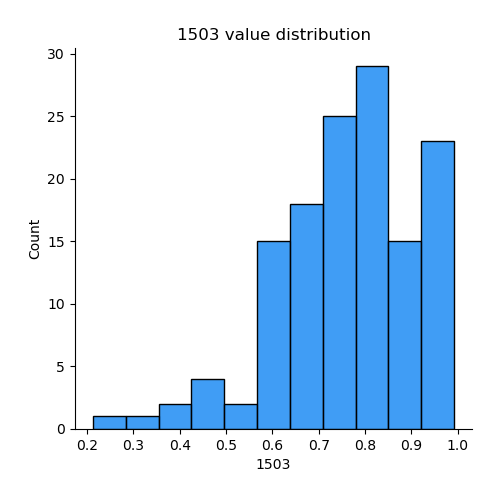
## Feature : 1504
- **Feature type** : continous
- **Missing** : 0.0%
- **Unique** : 135
- **Count** :135.0
- **Mean** :0.6388661111892004
- **Std** :0.21735504375536766
- **Min** :-0.08187377514813747
- **25%th Percentile** : 0.4959500918372832
- **50%th Percentile** : 0.6319602025689263
- **75%th Percentile** : 0.7920724742680947
- **Max** :0.9905176563837277

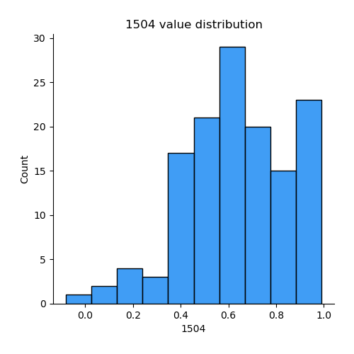
## Feature : 1505
- **Feature type** : continous
- **Missing** : 0.0%
- **Unique** : 135
- **Count** :135.0
- **Mean** :0.6693025245888278
- **Std** :0.18816094190258445
- **Min** :0.2446530602341823
- **25%th Percentile** : 0.5325936338665809
- **50%th Percentile** : 0.6742259845182823
- **75%th Percentile** : 0.7776436205138573
- **Max** :0.9908425213542186

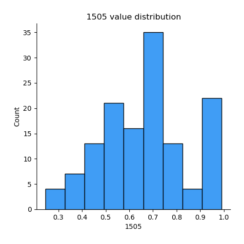
## Feature : 1506
- **Feature type** : continous
- **Missing** : 0.0%
- **Unique** : 135
- **Count** :135.0
- **Mean** :0.366628811520296
- **Std** :0.303773523465144
- **Min** :-0.16588859588200489
- **25%th Percentile** : 0.1718317674199739
- **50%th Percentile** : 0.30004275988235235
- **75%th Percentile** : 0.5204845046157079
- **Max** :0.9716728728818887

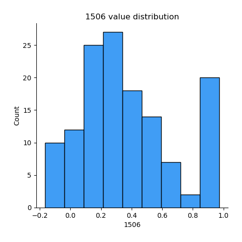
## Feature : 1507
- **Feature type** : continous
- **Missing** : 0.0%
- **Unique** : 135
- **Count** :135.0
- **Mean** :0.5463079612678726
- **Std** :0.24938276866067355
- **Min** :-0.046358198316670006
- **25%th Percentile** : 0.3707018737947124
- **50%th Percentile** : 0.5290251018136689
- **75%th Percentile** : 0.7124146850145637
- **Max** :0.9855595871380128

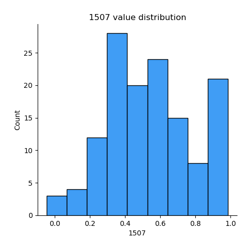
## Feature : 1537
- **Feature type** : continous
- **Missing** : 0.0%
- **Unique** : 3
- **Count** :135.0
- **Mean** :1.0
- **Std** :8.894203383953475e-17
- **Min** :0.9999999999999998
- **25%th Percentile** : 1.0
- **50%th Percentile** : 1.0
- **75%th Percentile** : 1.0
- **Max** :1.0

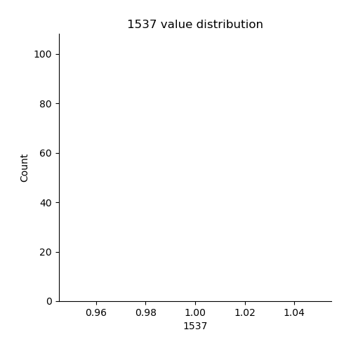
## Feature : 1538
- **Feature type** : continous
- **Missing** : 0.0%
- **Unique** : 135
- **Count** :135.0
- **Mean** :0.5383002782680744
- **Std** :0.25853407285445357
- **Min** :-0.289296039635956
- **25%th Percentile** : 0.3863297252074036
- **50%th Percentile** : 0.5113715110471242
- **75%th Percentile** : 0.7199088564551439
- **Max** :0.9807277981789785

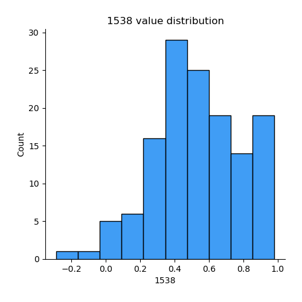
## Feature : 1539
- **Feature type** : continous
- **Missing** : 0.0%
- **Unique** : 135
- **Count** :135.0
- **Mean** :0.3931533950682189
- **Std** :0.29376584759093455
- **Min** :-0.2192700140633377
- **25%th Percentile** : 0.17189053430422352
- **50%th Percentile** : 0.36776561700352195
- **75%th Percentile** : 0.5458556640207808
- **Max** :0.9823231940088641

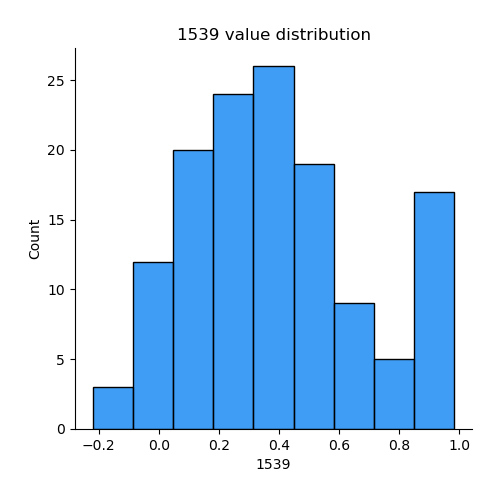
## Feature : 1540
- **Feature type** : continous
- **Missing** : 0.0%
- **Unique** : 135
- **Count** :135.0
- **Mean** :0.5450248528056334
- **Std** :0.260596762531126
- **Min** :-0.23561624396121558
- **25%th Percentile** : 0.3558490254979494
- **50%th Percentile** : 0.5631156483594864
- **75%th Percentile** : 0.7457447147019944
- **Max** :0.9853763651461265

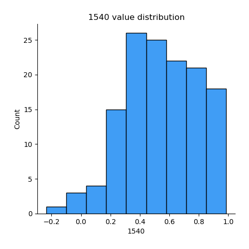
## Feature : 1541
- **Feature type** : continous
- **Missing** : 0.0%
- **Unique** : 135
- **Count** :135.0
- **Mean** :0.4475309054295368
- **Std** :0.28161034482557856
- **Min** :-0.23956968031124123
- **25%th Percentile** : 0.2773584893418781
- **50%th Percentile** : 0.40876835831855174
- **75%th Percentile** : 0.6337103112120609
- **Max** :0.9880816148402372

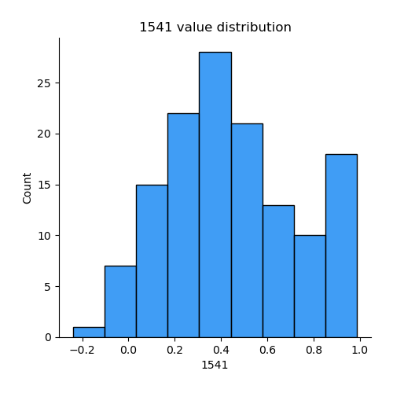
## Feature : 1542
- **Feature type** : continous
- **Missing** : 0.0%
- **Unique** : 135
- **Count** :135.0
- **Mean** :0.4172698582190347
- **Std** :0.28932097373217036
- **Min** :-0.20981069401468935
- **25%th Percentile** : 0.20070687903980827
- **50%th Percentile** : 0.35858478622548035
- **75%th Percentile** : 0.5929397572955267
- **Max** :0.9691562436646192

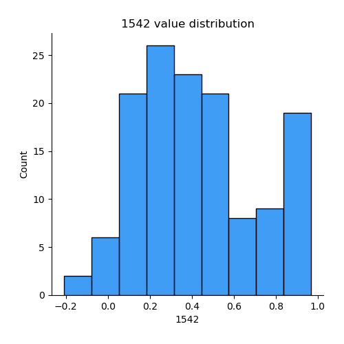
## Feature : 1543
- **Feature type** : continous
- **Missing** : 0.0%
- **Unique** : 135
- **Count** :135.0
- **Mean** :0.3995801786735121
- **Std** :0.2859421284823869
- **Min** :-0.12013041399641108
- **25%th Percentile** : 0.1916705432391499
- **50%th Percentile** : 0.3615068530521487
- **75%th Percentile** : 0.5784044894775809
- **Max** :0.974317172226956

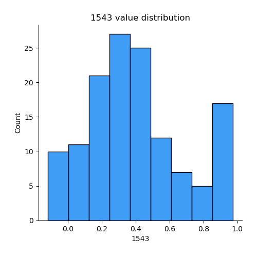
## Feature : 1544
- **Feature type** : continous
- **Missing** : 0.0%
- **Unique** : 135
- **Count** :135.0
- **Mean** :0.4200269584539548
- **Std** :0.2920040048200889
- **Min** :-0.13367800434549026
- **25%th Percentile** : 0.1865361409731247
- **50%th Percentile** : 0.38564959003795357
- **75%th Percentile** : 0.5963067194309739
- **Max** :0.9845762494510814

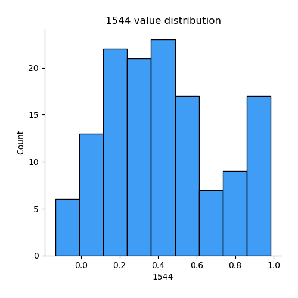
## Feature : 1545
- **Feature type** : continous
- **Missing** : 0.0%
- **Unique** : 135
- **Count** :135.0
- **Mean** :0.4735068504804568
- **Std** :0.27526844132102585
- **Min** :-0.38866343551258675
- **25%th Percentile** : 0.27123826251445127
- **50%th Percentile** : 0.45691492827086416
- **75%th Percentile** : 0.6622116805186166
- **Max** :0.9816930298663843

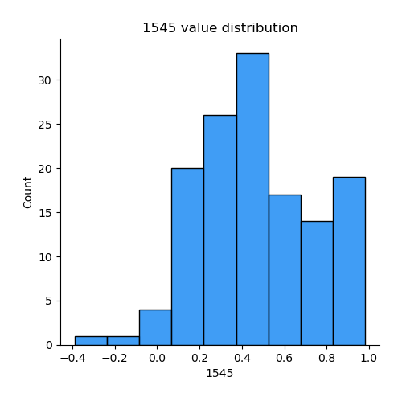
## Feature : 1546
- **Feature type** : continous
- **Missing** : 0.0%
- **Unique** : 135
- **Count** :135.0
- **Mean** :0.30654251273506256
- **Std** :0.3366336369271547
- **Min** :-0.5174183348667301
- **25%th Percentile** : 0.07597685015161901
- **50%th Percentile** : 0.25747240745501776
- **75%th Percentile** : 0.48282645680220615
- **Max** :0.9789862388721524

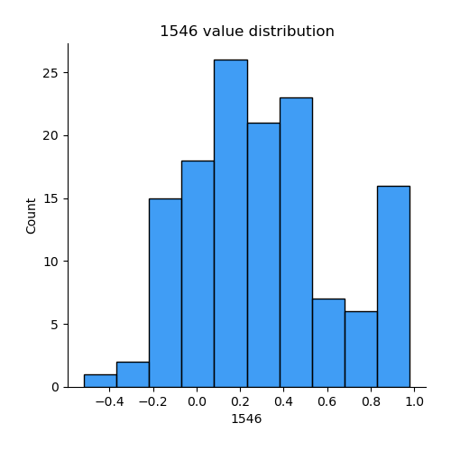
## Feature : 1547
- **Feature type** : continous
- **Missing** : 0.0%
- **Unique** : 135
- **Count** :135.0
- **Mean** :0.4727730049754965
- **Std** :0.2862196011336122
- **Min** :-0.30542339398997664
- **25%th Percentile** : 0.27718335656492943
- **50%th Percentile** : 0.41740744288039394
- **75%th Percentile** : 0.66025094890318
- **Max** :0.9920448118130221

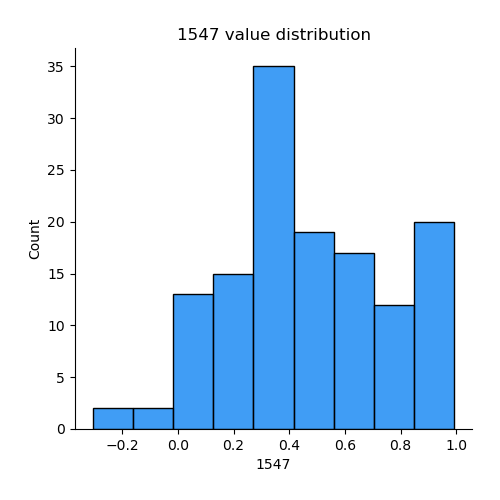
## Feature : 1548
- **Feature type** : continous
- **Missing** : 0.0%
- **Unique** : 135
- **Count** :135.0
- **Mean** :0.3893244885679572
- **Std** :0.29906423920274317
- **Min** :-0.3292643520088389
- **25%th Percentile** : 0.1729538285253256
- **50%th Percentile** : 0.3228154223972573
- **75%th Percentile** : 0.6168267029063905
- **Max** :0.9765014902802175

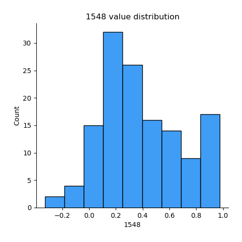
## Feature : 1549
- **Feature type** : continous
- **Missing** : 0.0%
- **Unique** : 135
- **Count** :135.0
- **Mean** :0.34160725605597086
- **Std** :0.3205994415636947
- **Min** :-0.3667845066572494
- **25%th Percentile** : 0.11955870657910171
- **50%th Percentile** : 0.29850733194638035
- **75%th Percentile** : 0.5293451870254837
- **Max** :0.984230174790305

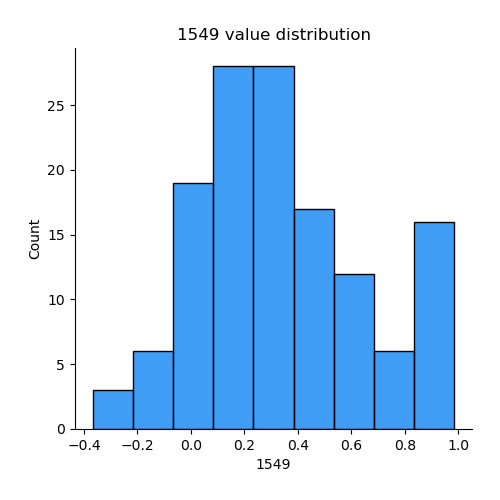
## Feature : 1550
- **Feature type** : continous
- **Missing** : 0.0%
- **Unique** : 135
- **Count** :135.0
- **Mean** :0.4005603303699393
- **Std** :0.29472646878292885
- **Min** :-0.25782360308215635
- **25%th Percentile** : 0.16502925056338516
- **50%th Percentile** : 0.37745039598266816
- **75%th Percentile** : 0.5751775447555547
- **Max** :0.981124160744745

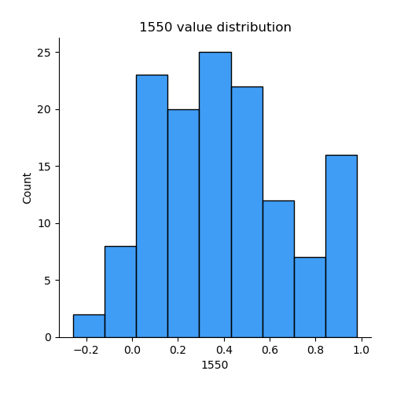
## Feature : 1551
- **Feature type** : continous
- **Missing** : 0.0%
- **Unique** : 135
- **Count** :135.0
- **Mean** :0.36017754414367076
- **Std** :0.31221553344631564
- **Min** :-0.29472238137481416
- **25%th Percentile** : 0.14595483126123424
- **50%th Percentile** : 0.3171462060927785
- **75%th Percentile** : 0.5219271768682029
- **Max** :0.9835068159898975

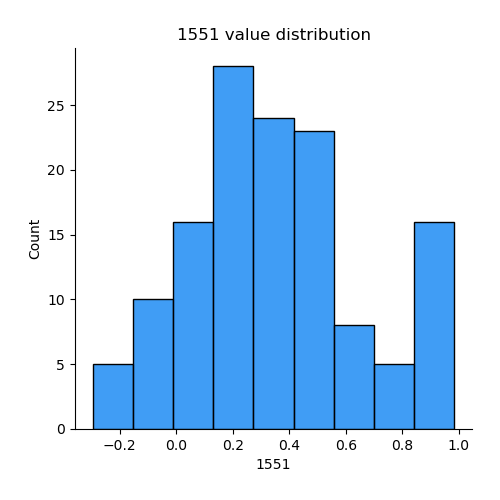
## Feature : 1552
- **Feature type** : continous
- **Missing** : 0.0%
- **Unique** : 135
- **Count** :135.0
- **Mean** :0.4054425875482259
- **Std** :0.29584179228960666
- **Min** :-0.23952329521130783
- **25%th Percentile** : 0.18939866526964658
- **50%th Percentile** : 0.3993793580788992
- **75%th Percentile** : 0.563837216807434
- **Max** :0.9739437560990332

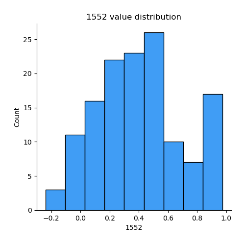
## Feature : 1553
- **Feature type** : continous
- **Missing** : 0.0%
- **Unique** : 135
- **Count** :135.0
- **Mean** :0.2855727819324379
- **Std** :0.3329031618887614
- **Min** :-0.40833659052328275
- **25%th Percentile** : 0.05860131932486791
- **50%th Percentile** : 0.23033298976197195
- **75%th Percentile** : 0.44973535513721413
- **Max** :0.9825030144270557

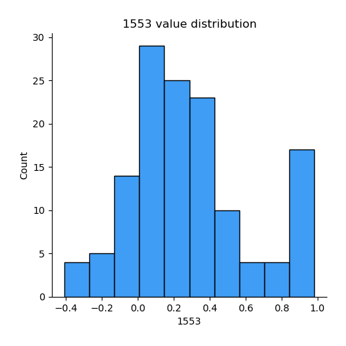
## Feature : 1554
- **Feature type** : continous
- **Missing** : 0.0%
- **Unique** : 135
- **Count** :135.0
- **Mean** :0.3872074258320463
- **Std** :0.3072421777134287
- **Min** :-0.31571795204220393
- **25%th Percentile** : 0.18064612859484874
- **50%th Percentile** : 0.35532153283381585
- **75%th Percentile** : 0.5786738104860847
- **Max** :0.982609412136526

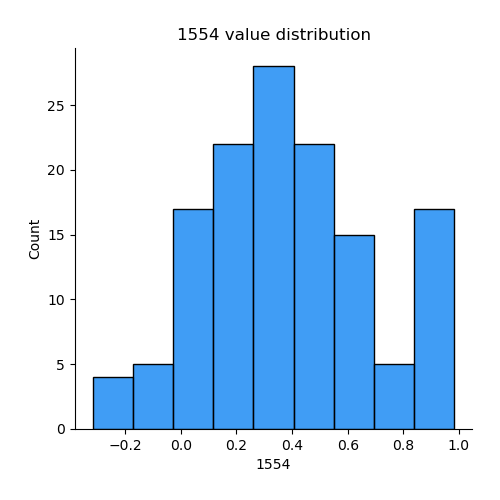
## Feature : 1555
- **Feature type** : continous
- **Missing** : 0.0%
- **Unique** : 135
- **Count** :135.0
- **Mean** :0.37604373870179203
- **Std** :0.3033635354913178
- **Min** :-0.20123727230527727
- **25%th Percentile** : 0.1536673833331152
- **50%th Percentile** : 0.34651972769657746
- **75%th Percentile** : 0.5440349175646245
- **Max** :0.9782206858882473

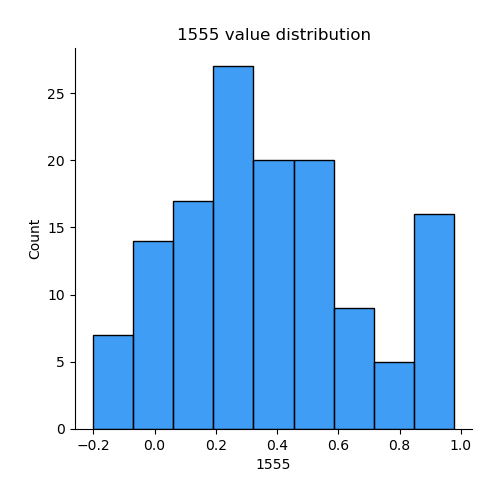
## Feature : 1556
- **Feature type** : continous
- **Missing** : 0.0%
- **Unique** : 135
- **Count** :135.0
- **Mean** :0.4544082918394945
- **Std** :0.27913725086349206
- **Min** :-0.3659955009520614
- **25%th Percentile** : 0.25374910837837994
- **50%th Percentile** : 0.42177137023706823
- **75%th Percentile** : 0.649290646976639
- **Max** :0.9899506997951351

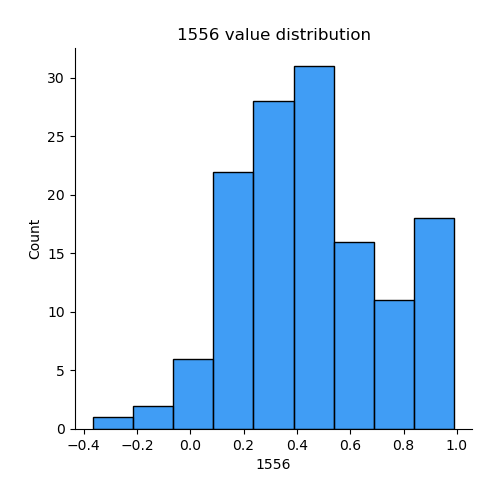
## Feature : 1557
- **Feature type** : continous
- **Missing** : 0.0%
- **Unique** : 135
- **Count** :135.0
- **Mean** :0.37746844482137437
- **Std** :0.30407653956152264
- **Min** :-0.3104922871834889
- **25%th Percentile** : 0.14437993342329242
- **50%th Percentile** : 0.35189889501171845
- **75%th Percentile** : 0.5451784588378481
- **Max** :0.9848641822985508

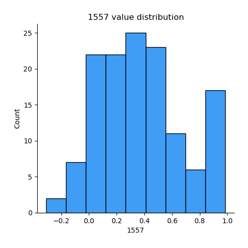
## Feature : 1558
- **Feature type** : continous
- **Missing** : 0.0%
- **Unique** : 135
- **Count** :135.0
- **Mean** :0.6000037029490456
- **Std** :0.2697656399245879
- **Min** :-0.23668302296475704
- **25%th Percentile** : 0.39333102607801046
- **50%th Percentile** : 0.6530746428674353
- **75%th Percentile** : 0.8087126653372054
- **Max** :0.9905432618261113

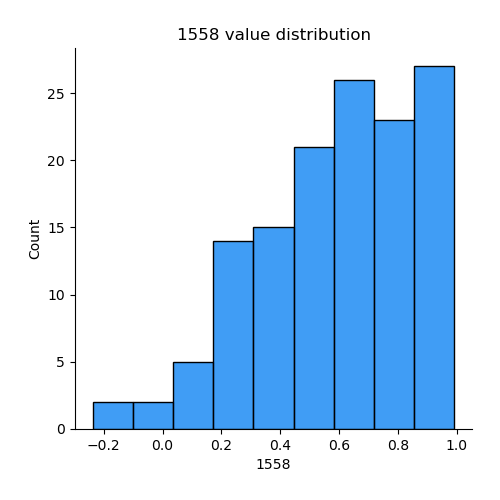
## Feature : 1559
- **Feature type** : continous
- **Missing** : 0.0%
- **Unique** : 135
- **Count** :135.0
- **Mean** :0.3907773765970179
- **Std** :0.2929542608599016
- **Min** :-0.22334056737485602
- **25%th Percentile** : 0.18987437091930345
- **50%th Percentile** : 0.34065779125025525
- **75%th Percentile** : 0.571213962253246
- **Max** :0.9766003687702551

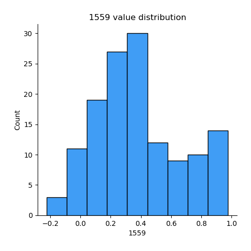
## Feature : 1590
- **Feature type** : continous
- **Missing** : 0.0%
- **Unique** : 3
- **Count** :135.0
- **Mean** :1.0
- **Std** :7.672692930616877e-17
- **Min** :0.9999999999999998
- **25%th Percentile** : 1.0
- **50%th Percentile** : 1.0
- **75%th Percentile** : 1.0
- **Max** :1.0

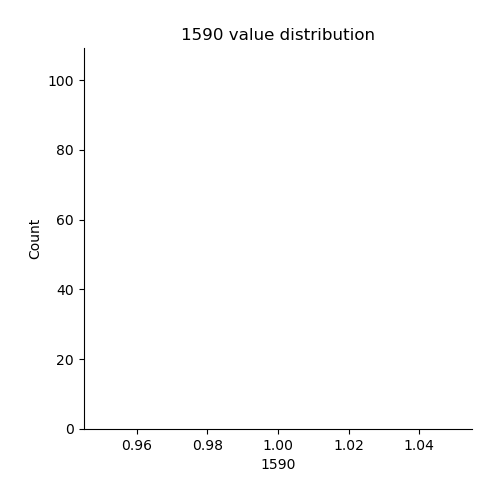
## Feature : 1591
- **Feature type** : continous
- **Missing** : 0.0%
- **Unique** : 135
- **Count** :135.0
- **Mean** :0.6754438524492724
- **Std** :0.21444052008162293
- **Min** :0.09202844489575622
- **25%th Percentile** : 0.53402133476087
- **50%th Percentile** : 0.6946619240027252
- **75%th Percentile** : 0.8254153767237318
- **Max** :0.9907145870280452

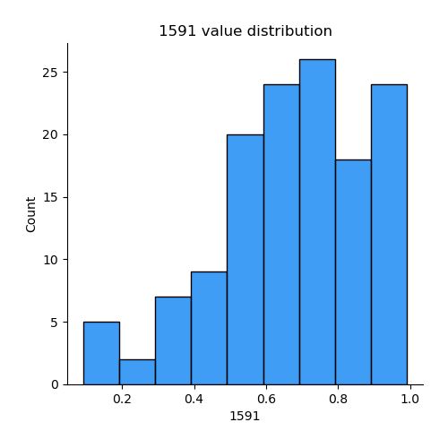
## Feature : 1592
- **Feature type** : continous
- **Missing** : 0.0%
- **Unique** : 135
- **Count** :135.0
- **Mean** :0.8105051933930015
- **Std** :0.1254822903179757
- **Min** :0.38928734622311884
- **25%th Percentile** : 0.7514298709602131
- **50%th Percentile** : 0.8201412794113593
- **75%th Percentile** : 0.8816301624313052
- **Max** :0.9968727608069201

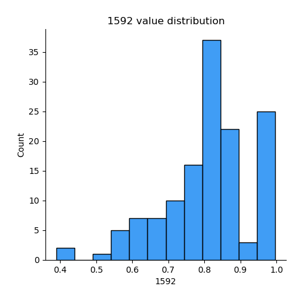
## Feature : 1593
- **Feature type** : continous
- **Missing** : 0.0%
- **Unique** : 135
- **Count** :135.0
- **Mean** :0.6236754210852108
- **Std** :0.22625749243585097
- **Min** :0.006675338788519912
- **25%th Percentile** : 0.46198297091632357
- **50%th Percentile** : 0.6273456753697357
- **75%th Percentile** : 0.77299633666716
- **Max** :0.992647026851864

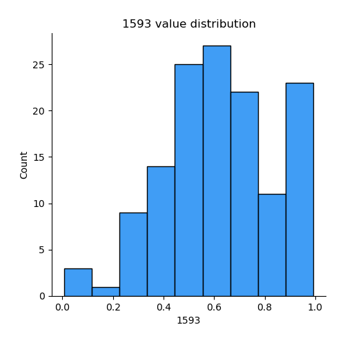
## Feature : 1594
- **Feature type** : continous
- **Missing** : 0.0%
- **Unique** : 135
- **Count** :135.0
- **Mean** :0.6441100794217873
- **Std** :0.2206672343996883
- **Min** :-0.1113241909864191
- **25%th Percentile** : 0.503807697414187
- **50%th Percentile** : 0.6396194167152972
- **75%th Percentile** : 0.8057876002509897
- **Max** :0.9828250170570377

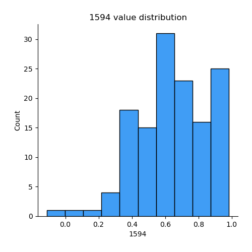
## Feature : 1595
- **Feature type** : continous
- **Missing** : 0.0%
- **Unique** : 135
- **Count** :135.0
- **Mean** :0.8039614602290835
- **Std** :0.14390089974000456
- **Min** :0.08493686896467101
- **25%th Percentile** : 0.729399542385791
- **50%th Percentile** : 0.8288341124413133
- **75%th Percentile** : 0.8933845534632779
- **Max** :0.9980719976619623

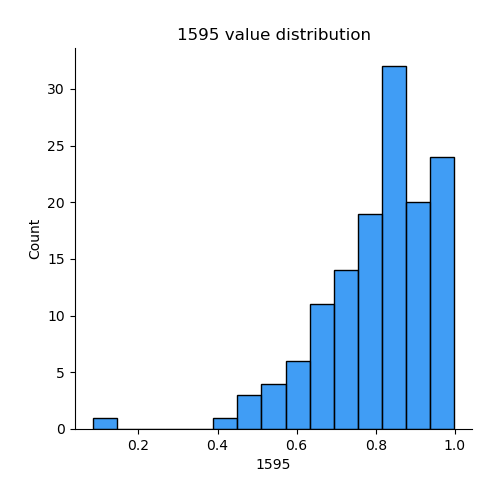
## Feature : 1596
- **Feature type** : continous
- **Missing** : 0.0%
- **Unique** : 135
- **Count** :135.0
- **Mean** :0.7996732054532357
- **Std** :0.13160252098989675
- **Min** :0.39836259596095963
- **25%th Percentile** : 0.7209323100788986
- **50%th Percentile** : 0.807546705736718
- **75%th Percentile** : 0.8986913829715293
- **Max** :0.9970614694446195

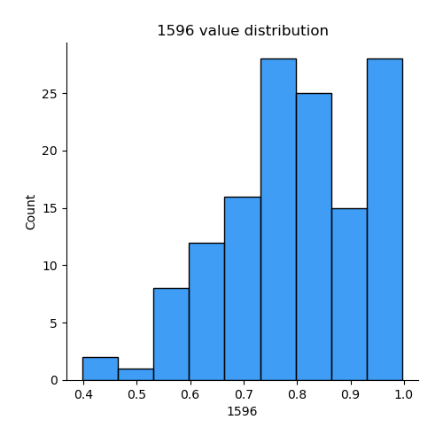
## Feature : 1597
- **Feature type** : continous
- **Missing** : 0.0%
- **Unique** : 135
- **Count** :135.0
- **Mean** :0.7357164171713955
- **Std** :0.16797793806105513
- **Min** :0.19486283181335737
- **25%th Percentile** : 0.6396802364334235
- **50%th Percentile** : 0.7423457505898147
- **75%th Percentile** : 0.8427204576698396
- **Max** :0.9948996645421414

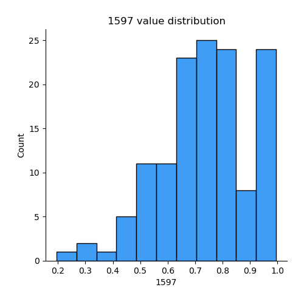
## Feature : 1598
- **Feature type** : continous
- **Missing** : 0.0%
- **Unique** : 135
- **Count** :135.0
- **Mean** :0.5223869195097904
- **Std** :0.31127217899407555
- **Min** :-0.3709741263113131
- **25%th Percentile** : 0.32257981511614275
- **50%th Percentile** : 0.5420116286862917
- **75%th Percentile** : 0.7155504782989838
- **Max** :0.9936644171477146

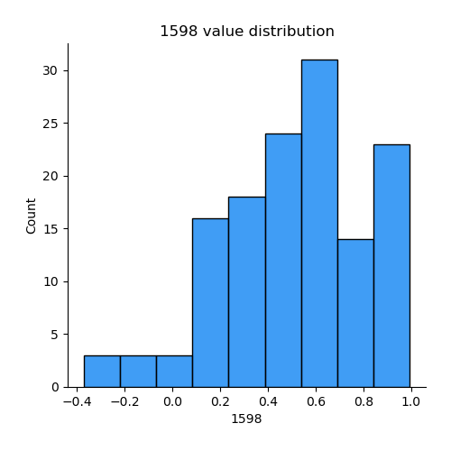
## Feature : 1599
- **Feature type** : continous
- **Missing** : 0.0%
- **Unique** : 135
- **Count** :135.0
- **Mean** :0.7543415904474506
- **Std** :0.16220640485563703
- **Min** :0.18634355189111557
- **25%th Percentile** : 0.6617273602773563
- **50%th Percentile** : 0.7660310083696421
- **75%th Percentile** : 0.8526848067527812
- **Max** :0.995925102010856

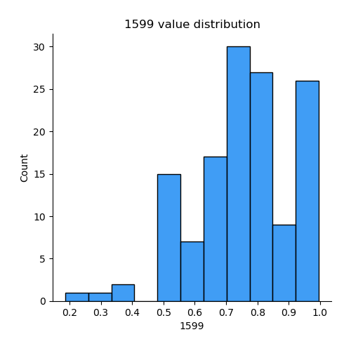
## Feature : 1600
- **Feature type** : continous
- **Missing** : 0.0%
- **Unique** : 135
- **Count** :135.0
- **Mean** :0.6898556235530074
- **Std** :0.18673807783545665
- **Min** :0.06835829707200086
- **25%th Percentile** : 0.5706857526883893
- **50%th Percentile** : 0.6961068171129318
- **75%th Percentile** : 0.8110033898436844
- **Max** :0.9914911487151876

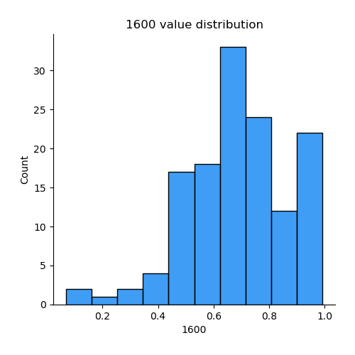
## Feature : 1601
- **Feature type** : continous
- **Missing** : 0.0%
- **Unique** : 135
- **Count** :135.0
- **Mean** :0.5669724930724582
- **Std** :0.2727594732115464
- **Min** :-0.23704302584310163
- **25%th Percentile** : 0.3887732802092555
- **50%th Percentile** : 0.5828799644392894
- **75%th Percentile** : 0.7376703484984417
- **Max** :0.9925309321174547

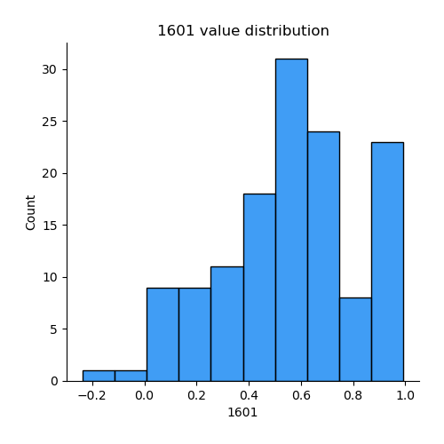
## Feature : 1602
- **Feature type** : continous
- **Missing** : 0.0%
- **Unique** : 135
- **Count** :135.0
- **Mean** :0.5847500095241528
- **Std** :0.24685649184477973
- **Min** :-0.0772023040327561
- **25%th Percentile** : 0.43631043024684035
- **50%th Percentile** : 0.5606318908228662
- **75%th Percentile** : 0.7553515023484245
- **Max** :0.9905129620282987

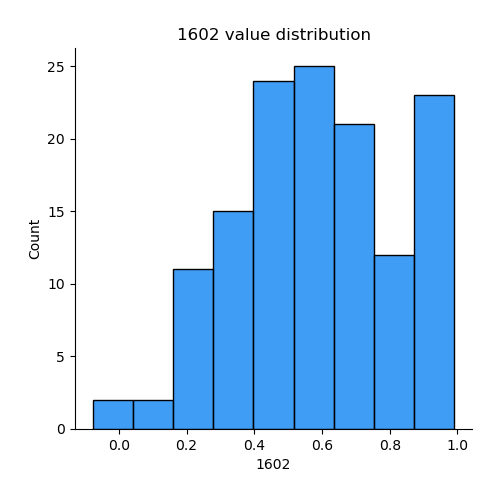
## Feature : 1603
- **Feature type** : continous
- **Missing** : 0.0%
- **Unique** : 135
- **Count** :135.0
- **Mean** :0.5903442669096026
- **Std** :0.26646268213319013
- **Min** :-0.20833561873566436
- **25%th Percentile** : 0.40781834193065314
- **50%th Percentile** : 0.633639506971768
- **75%th Percentile** : 0.7591448789304769
- **Max** :0.9927745263598445

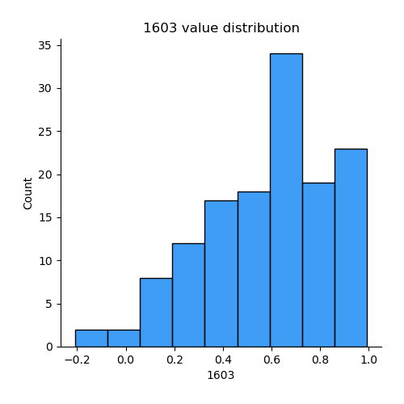
## Feature : 1604
- **Feature type** : continous
- **Missing** : 0.0%
- **Unique** : 135
- **Count** :135.0
- **Mean** :0.6661718626613983
- **Std** :0.22575227194160985
- **Min** :-0.03799925730103649
- **25%th Percentile** : 0.528556915609773
- **50%th Percentile** : 0.6814832121585137
- **75%th Percentile** : 0.8187188090361195
- **Max** :0.9905599222554766

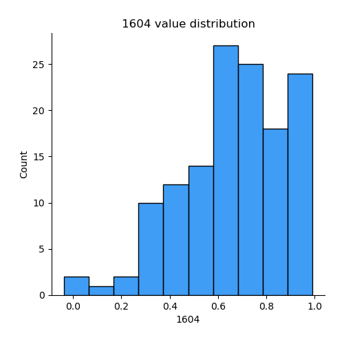
## Feature : 1605
- **Feature type** : continous
- **Missing** : 0.0%
- **Unique** : 135
- **Count** :135.0
- **Mean** :0.40082833200332374
- **Std** :0.30222266855455515
- **Min** :-0.1528326497634627
- **25%th Percentile** : 0.1853899471593796
- **50%th Percentile** : 0.3249357496804375
- **75%th Percentile** : 0.540626082082394
- **Max** :0.9849943428440352

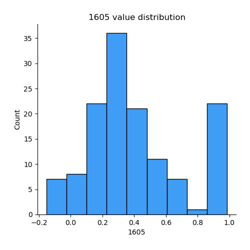
## Feature : 1606
- **Feature type** : continous
- **Missing** : 0.0%
- **Unique** : 135
- **Count** :135.0
- **Mean** :0.5594362907863113
- **Std** :0.28049218837607276
- **Min** :-0.4765587882467564
- **25%th Percentile** : 0.3629956585587212
- **50%th Percentile** : 0.5716195311563305
- **75%th Percentile** : 0.7433601996095314
- **Max** :0.993233128184701

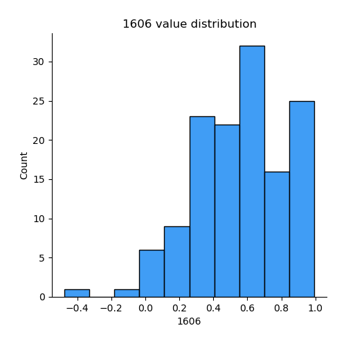
## Feature : 1607
- **Feature type** : continous
- **Missing** : 0.0%
- **Unique** : 135
- **Count** :135.0
- **Mean** :0.7003105434369937
- **Std** :0.2216787510247182
- **Min** :-0.14606576380433367
- **25%th Percentile** : 0.5497588440293787
- **50%th Percentile** : 0.7393816223675737
- **75%th Percentile** : 0.8479385685848522
- **Max** :0.9944540421212372

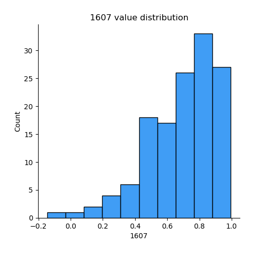
## Feature : 1608
- **Feature type** : continous
- **Missing** : 0.0%
- **Unique** : 135
- **Count** :135.0
- **Mean** :0.6973607614924255
- **Std** :0.18185457777885314
- **Min** :0.04916515061309375
- **25%th Percentile** : 0.578145917130025
- **50%th Percentile** : 0.698505807387809
- **75%th Percentile** : 0.8110891076008906
- **Max** :0.9912418042426732

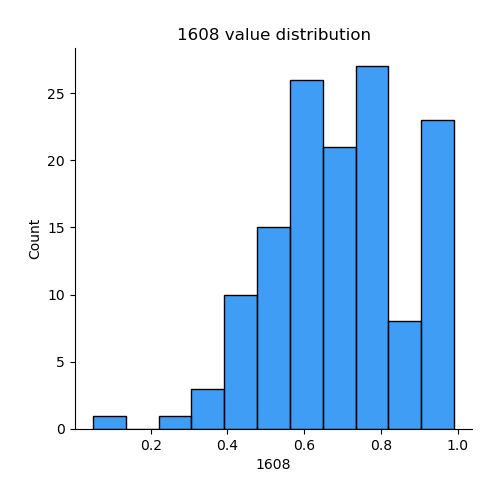
## Feature : 1609
- **Feature type** : continous
- **Missing** : 0.0%
- **Unique** : 135
- **Count** :135.0
- **Mean** :0.6176483920752878
- **Std** :0.2407817170178805
- **Min** :-0.09009214928628988
- **25%th Percentile** : 0.4490279248497701
- **50%th Percentile** : 0.6237602866533104
- **75%th Percentile** : 0.7711446033784252
- **Max** :0.9911510740804632

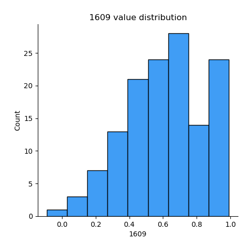
## Feature : 1610
- **Feature type** : continous
- **Missing** : 0.0%
- **Unique** : 135
- **Count** :135.0
- **Mean** :0.5327299401735992
- **Std** :0.25177985196065744
- **Min** :-0.38149176096485066
- **25%th Percentile** : 0.37199681056877054
- **50%th Percentile** : 0.5158917768571818
- **75%th Percentile** : 0.6654896847874441
- **Max** :0.9819797030655693

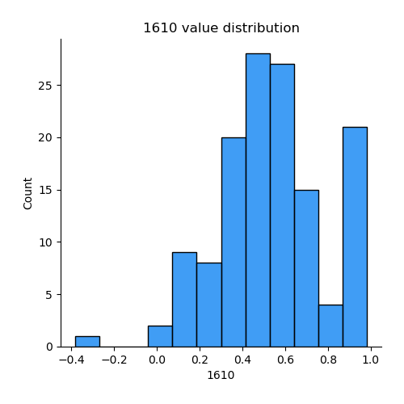
## Feature : 1611
- **Feature type** : continous
- **Missing** : 0.0%
- **Unique** : 135
- **Count** :135.0
- **Mean** :0.5557224959062294
- **Std** :0.2413100548918758
- **Min** :0.07322747626554284
- **25%th Percentile** : 0.3835112747383679
- **50%th Percentile** : 0.5440016026306087
- **75%th Percentile** : 0.6835059167894169
- **Max** :0.9850421955377275

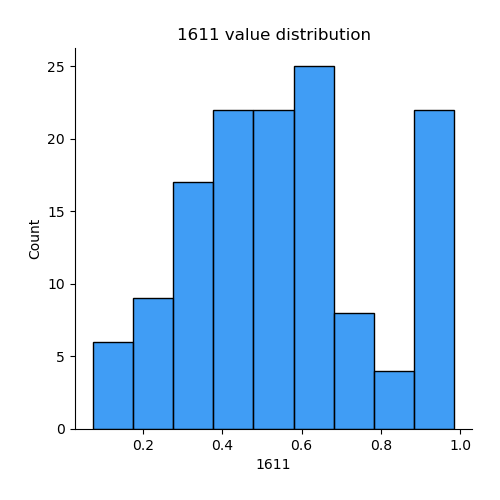
## Feature : 1643
- **Feature type** : continous
- **Missing** : 0.0%
- **Unique** : 3
- **Count** :135.0
- **Mean** :1.0
- **Std** :8.68489869167501e-17
- **Min** :0.9999999999999998
- **25%th Percentile** : 0.9999999999999999
- **50%th Percentile** : 1.0
- **75%th Percentile** : 1.0
- **Max** :1.0

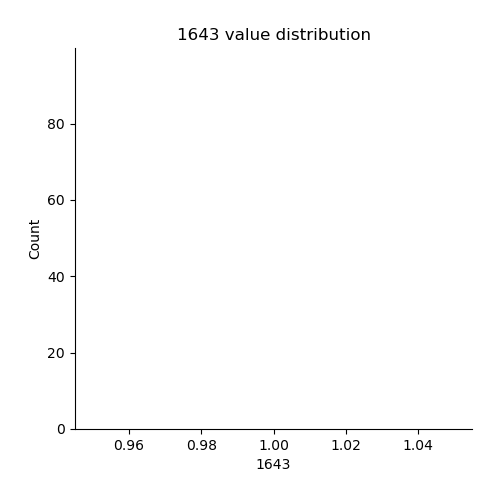
## Feature : 1644
- **Feature type** : continous
- **Missing** : 0.0%
- **Unique** : 135
- **Count** :135.0
- **Mean** :0.6607831690201951
- **Std** :0.2247978080575811
- **Min** :-0.00040120867725862083
- **25%th Percentile** : 0.5273423943194007
- **50%th Percentile** : 0.6643738289008562
- **75%th Percentile** : 0.8026383227195344
- **Max** :0.9913790887720196

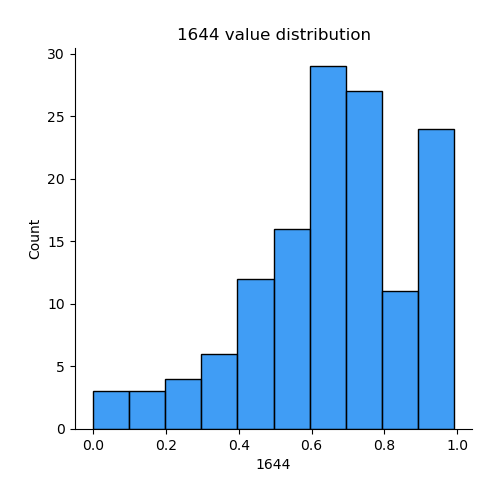
## Feature : 1645
- **Feature type** : continous
- **Missing** : 0.0%
- **Unique** : 135
- **Count** :135.0
- **Mean** :0.6332338861481326
- **Std** :0.22921816822795227
- **Min** :0.1125020326899898
- **25%th Percentile** : 0.46816459379046615
- **50%th Percentile** : 0.6284452283265684
- **75%th Percentile** : 0.7952815527730074
- **Max** :0.9925003436753385

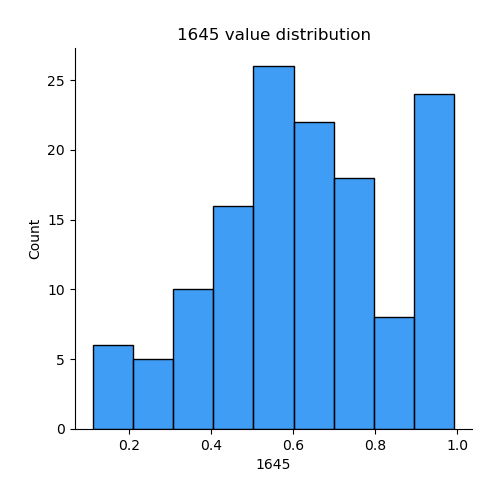
## Feature : 1646
- **Feature type** : continous
- **Missing** : 0.0%
- **Unique** : 135
- **Count** :135.0
- **Mean** :0.7626663226254705
- **Std** :0.14451760823901216
- **Min** :0.40900189579917695
- **25%th Percentile** : 0.6630897016976594
- **50%th Percentile** : 0.7582621239128713
- **75%th Percentile** : 0.8634370854270206
- **Max** :0.9928155191160295

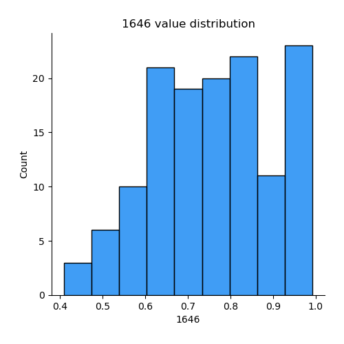
## Feature : 1647
- **Feature type** : continous
- **Missing** : 0.0%
- **Unique** : 135
- **Count** :135.0
- **Mean** :0.6867315205478002
- **Std** :0.19067131526961936
- **Min** :0.16248248520679234
- **25%th Percentile** : 0.5486379252955966
- **50%th Percentile** : 0.6855282076623398
- **75%th Percentile** : 0.7959716551440246
- **Max** :0.9894049581943792

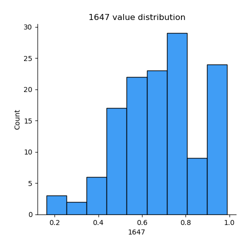
## Feature : 1648
- **Feature type** : continous
- **Missing** : 0.0%
- **Unique** : 135
- **Count** :135.0
- **Mean** :0.6743949686386298
- **Std** :0.19741612195628608
- **Min** :0.12945604948418551
- **25%th Percentile** : 0.5418709250588378
- **50%th Percentile** : 0.6949271443858752
- **75%th Percentile** : 0.804023221329581
- **Max** :0.9923573515322316

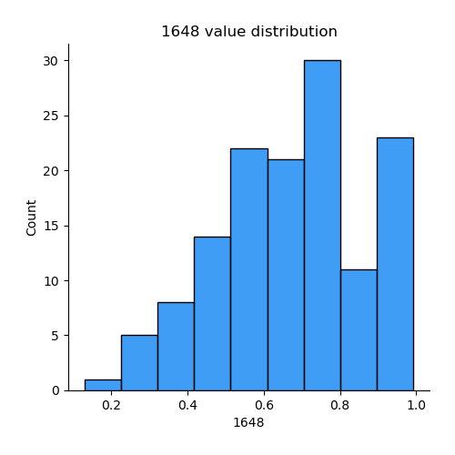
## Feature : 1649
- **Feature type** : continous
- **Missing** : 0.0%
- **Unique** : 135
- **Count** :135.0
- **Mean** :0.7506491850875243
- **Std** :0.17759182880568367
- **Min** :0.22974702325510493
- **25%th Percentile** : 0.652111868697872
- **50%th Percentile** : 0.7568500124818528
- **75%th Percentile** : 0.8853867389221663
- **Max** :0.9961287221483012

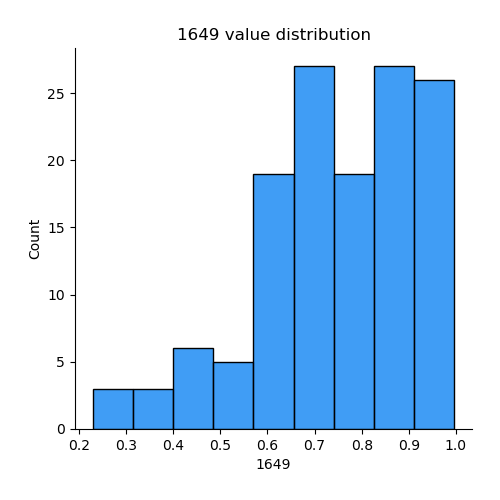
## Feature : 1650
- **Feature type** : continous
- **Missing** : 0.0%
- **Unique** : 135
- **Count** :135.0
- **Mean** :0.578954936606236
- **Std** :0.24701201767317243
- **Min** :-0.11741857307088348
- **25%th Percentile** : 0.4440293068683683
- **50%th Percentile** : 0.5609615301980027
- **75%th Percentile** : 0.7033041118324571
- **Max** :0.9931363717008017

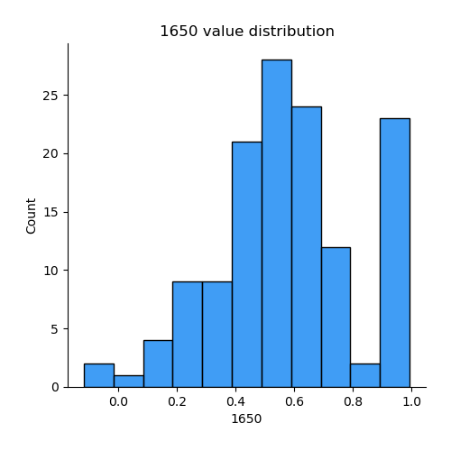
## Feature : 1651
- **Feature type** : continous
- **Missing** : 0.0%
- **Unique** : 135
- **Count** :135.0
- **Mean** :0.5861266705917667
- **Std** :0.24381138796117488
- **Min** :0.0043328895505798035
- **25%th Percentile** : 0.4455384526823718
- **50%th Percentile** : 0.5748756189639281
- **75%th Percentile** : 0.747320162089461
- **Max** :0.9912152499932388

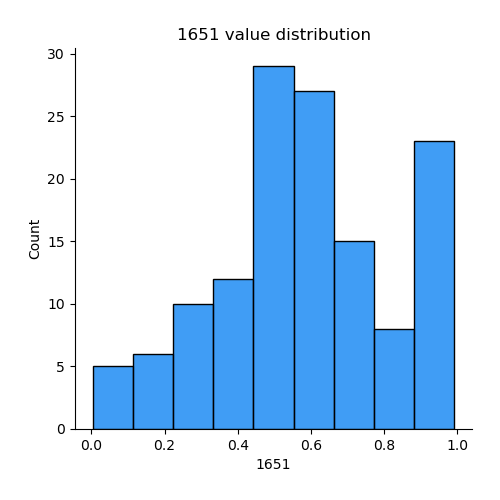
## Feature : 1652
- **Feature type** : continous
- **Missing** : 0.0%
- **Unique** : 135
- **Count** :135.0
- **Mean** :0.6421070779223738
- **Std** :0.20721193434273122
- **Min** :-0.10935323243127577
- **25%th Percentile** : 0.4963453913018414
- **50%th Percentile** : 0.6424923853243608
- **75%th Percentile** : 0.7633856431722599
- **Max** :0.9898366373762822

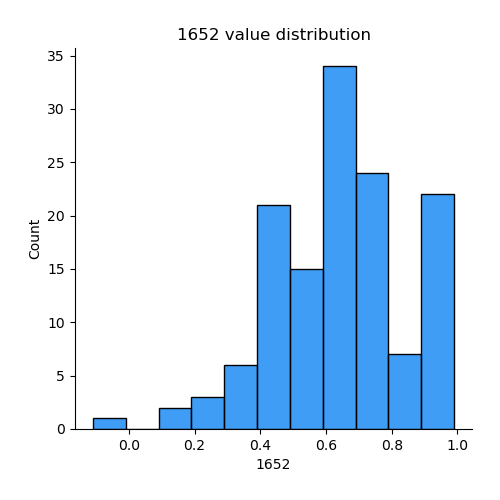
## Feature : 1653
- **Feature type** : continous
- **Missing** : 0.0%
- **Unique** : 135
- **Count** :135.0
- **Mean** :0.6246437077164093
- **Std** :0.24298334062682933
- **Min** :-0.17510314401855587
- **25%th Percentile** : 0.4817661656534979
- **50%th Percentile** : 0.631658987385724
- **75%th Percentile** : 0.7719588701412486
- **Max** :0.9943860606556868

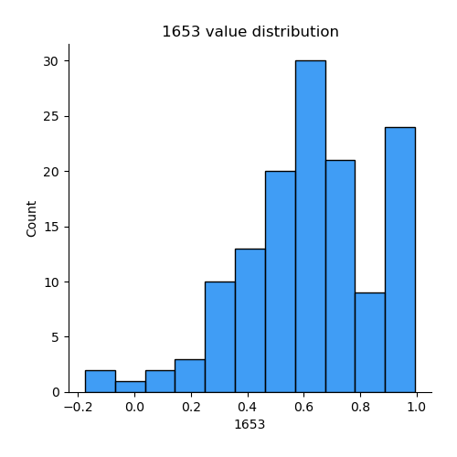
## Feature : 1654
- **Feature type** : continous
- **Missing** : 0.0%
- **Unique** : 135
- **Count** :135.0
- **Mean** :0.6976657331563643
- **Std** :0.18639389763394132
- **Min** :0.1992782473683054
- **25%th Percentile** : 0.5663446924283999
- **50%th Percentile** : 0.6971468376605532
- **75%th Percentile** : 0.8250750666446077
- **Max** :0.9954052573625595

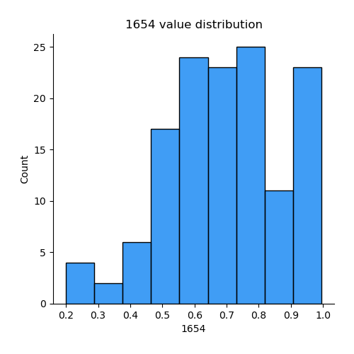
## Feature : 1655
- **Feature type** : continous
- **Missing** : 0.0%
- **Unique** : 135
- **Count** :135.0
- **Mean** :0.6384284192004391
- **Std** :0.23404250294798662
- **Min** :-0.11892382932550348
- **25%th Percentile** : 0.49734375586875734
- **50%th Percentile** : 0.6573038444348349
- **75%th Percentile** : 0.7599932148850022
- **Max** :0.9946895081776045

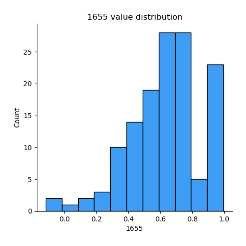
## Feature : 1656
- **Feature type** : continous
- **Missing** : 0.0%
- **Unique** : 135
- **Count** :135.0
- **Mean** :0.8654673845685169
- **Std** :0.0905219377165336
- **Min** :0.6080208253310638
- **25%th Percentile** : 0.8226994485197501
- **50%th Percentile** : 0.8718772739321657
- **75%th Percentile** : 0.9201675378719686
- **Max** :0.9978079054178907

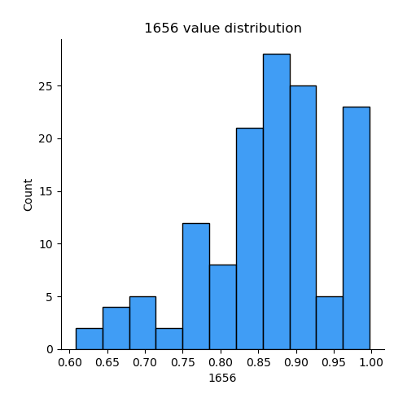
## Feature : 1657
- **Feature type** : continous
- **Missing** : 0.0%
- **Unique** : 135
- **Count** :135.0
- **Mean** :0.523048148406723
- **Std** :0.2529713372145986
- **Min** :0.013045312326906035
- **25%th Percentile** : 0.3451041431012189
- **50%th Percentile** : 0.49818999775054157
- **75%th Percentile** : 0.6431440867444629
- **Max** :0.9906788611146186

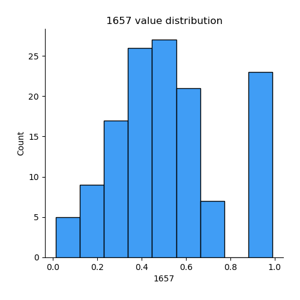
## Feature : 1658
- **Feature type** : continous
- **Missing** : 0.0%
- **Unique** : 135
- **Count** :135.0
- **Mean** :0.6834993710399797
- **Std** :0.20419027431400993
- **Min** :0.1893894477223107
- **25%th Percentile** : 0.5865437592619831
- **50%th Percentile** : 0.6907932771913782
- **75%th Percentile** : 0.805532111765201
- **Max** :0.9955765293338467

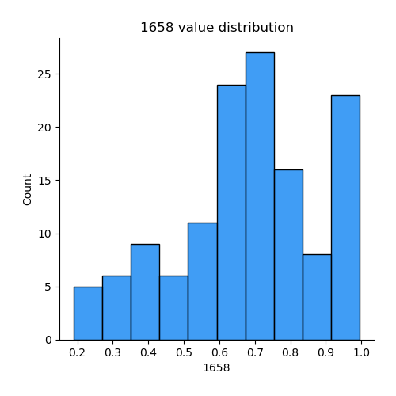
## Feature : 1659
- **Feature type** : continous
- **Missing** : 0.0%
- **Unique** : 135
- **Count** :135.0
- **Mean** :0.7659781337020027
- **Std** :0.17611772118014069
- **Min** :0.08030784123715021
- **25%th Percentile** : 0.6901664935146137
- **50%th Percentile** : 0.7794109729569844
- **75%th Percentile** : 0.8636946751909009
- **Max** :0.9965614068752432

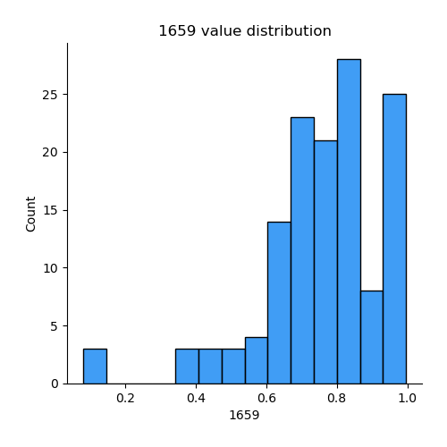
## Feature : 1660
- **Feature type** : continous
- **Missing** : 0.0%
- **Unique** : 135
- **Count** :135.0
- **Mean** :0.6655016427742937
- **Std** :0.22079909655018165
- **Min** :-0.041451708231674045
- **25%th Percentile** : 0.541397460753672
- **50%th Percentile** : 0.6640830292456688
- **75%th Percentile** : 0.8190095748929902
- **Max** :0.9922571101231837

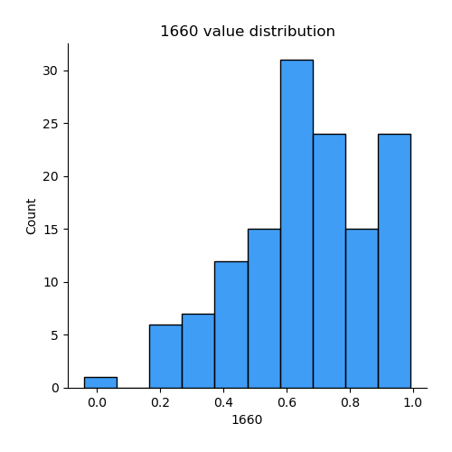
## Feature : 1661
- **Feature type** : continous
- **Missing** : 0.0%
- **Unique** : 135
- **Count** :135.0
- **Mean** :0.7454286889038807
- **Std** :0.1922798164113137
- **Min** :0.10721487158241011
- **25%th Percentile** : 0.6429549145000353
- **50%th Percentile** : 0.7677756354208759
- **75%th Percentile** : 0.8751172893956733
- **Max** :0.9975112590625642

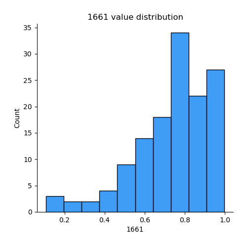
## Feature : 1662
- **Feature type** : continous
- **Missing** : 0.0%
- **Unique** : 135
- **Count** :135.0
- **Mean** :0.36144247800612733
- **Std** :0.31873484721062917
- **Min** :-0.39594133753610816
- **25%th Percentile** : 0.1378385351889206
- **50%th Percentile** : 0.30599226460009105
- **75%th Percentile** : 0.5427557685080305
- **Max** :0.9789361390503221

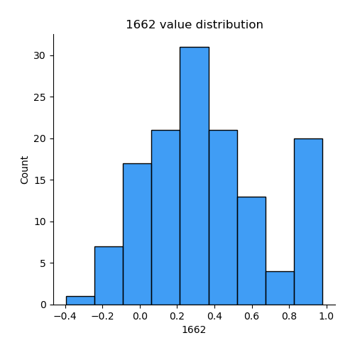
## Feature : 1663
- **Feature type** : continous
- **Missing** : 0.0%
- **Unique** : 135
- **Count** :135.0
- **Mean** :0.5642072677289824
- **Std** :0.25250247787953695
- **Min** :-0.03465918736443054
- **25%th Percentile** : 0.39291947173488095
- **50%th Percentile** : 0.5502061164949279
- **75%th Percentile** : 0.7376722198570553
- **Max** :0.9891719257967078

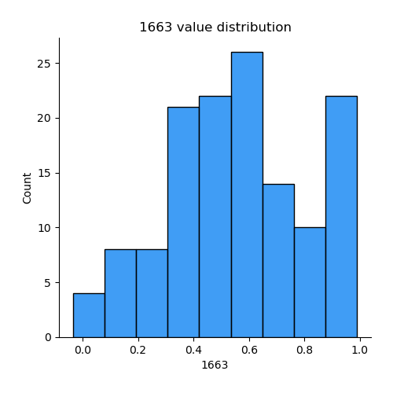
## Feature : 1696
- **Feature type** : continous
- **Missing** : 0.0%
- **Unique** : 3
- **Count** :135.0
- **Mean** :1.0
- **Std** :7.490705934335218e-17
- **Min** :0.9999999999999998
- **25%th Percentile** : 1.0
- **50%th Percentile** : 1.0
- **75%th Percentile** : 1.0
- **Max** :1.0

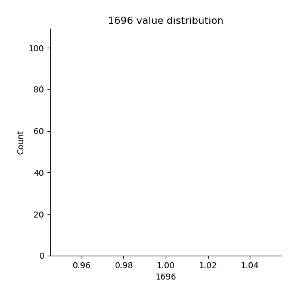
## Feature : 1697
- **Feature type** : continous
- **Missing** : 0.0%
- **Unique** : 135
- **Count** :135.0
- **Mean** :0.5931038896697685
- **Std** :0.24523363194886744
- **Min** :-0.24853844674249978
- **25%th Percentile** : 0.4597236125227677
- **50%th Percentile** : 0.5864629264475536
- **75%th Percentile** : 0.7171575165850688
- **Max** :0.992085093760219

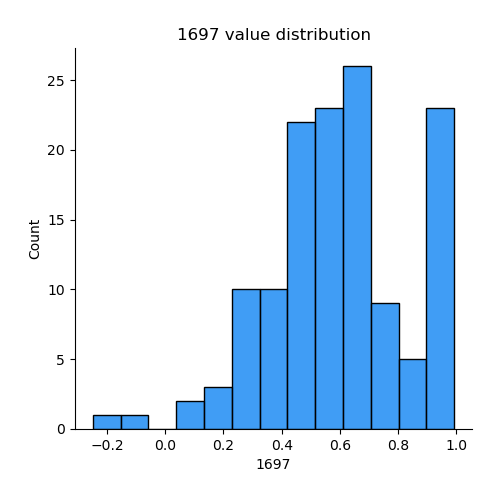
## Feature : 1698
- **Feature type** : continous
- **Missing** : 0.0%
- **Unique** : 135
- **Count** :135.0
- **Mean** :0.575620717524356
- **Std** :0.2453529458568375
- **Min** :-0.032663538414793726
- **25%th Percentile** : 0.42541434930136635
- **50%th Percentile** : 0.5497030654876958
- **75%th Percentile** : 0.7426362550261083
- **Max** :0.98624888628456

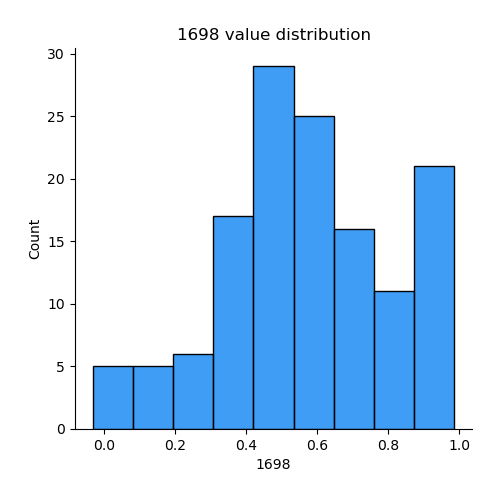
## Feature : 1699
- **Feature type** : continous
- **Missing** : 0.0%
- **Unique** : 135
- **Count** :135.0
- **Mean** :0.6641711442239944
- **Std** :0.2083955419828676
- **Min** :0.0530732573689033
- **25%th Percentile** : 0.5387929472374171
- **50%th Percentile** : 0.6809037091121799
- **75%th Percentile** : 0.7853675633447679
- **Max** :0.993428777500404

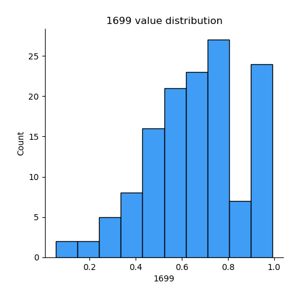
## Feature : 1700
- **Feature type** : continous
- **Missing** : 0.0%
- **Unique** : 135
- **Count** :135.0
- **Mean** :0.6306927756837507
- **Std** :0.22334100754633626
- **Min** :0.15096628090493097
- **25%th Percentile** : 0.4934973111796012
- **50%th Percentile** : 0.6601252353013269
- **75%th Percentile** : 0.7578969376852189
- **Max** :0.9944332643149874

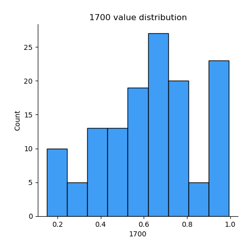
## Feature : 1701
- **Feature type** : continous
- **Missing** : 0.0%
- **Unique** : 135
- **Count** :135.0
- **Mean** :0.803566700631398
- **Std** :0.1240002066660611
- **Min** :0.41981554829070666
- **25%th Percentile** : 0.7218554761465541
- **50%th Percentile** : 0.8092269046010168
- **75%th Percentile** : 0.8880901437751044
- **Max** :0.9962166258940168

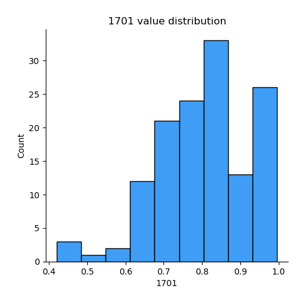
## Feature : 1702
- **Feature type** : continous
- **Missing** : 0.0%
- **Unique** : 135
- **Count** :135.0
- **Mean** :0.4793691373843022
- **Std** :0.3227206522923523
- **Min** :-0.5165970451192599
- **25%th Percentile** : 0.2758438501861994
- **50%th Percentile** : 0.501519989843456
- **75%th Percentile** : 0.6562519298020425
- **Max** :0.9936117092121284

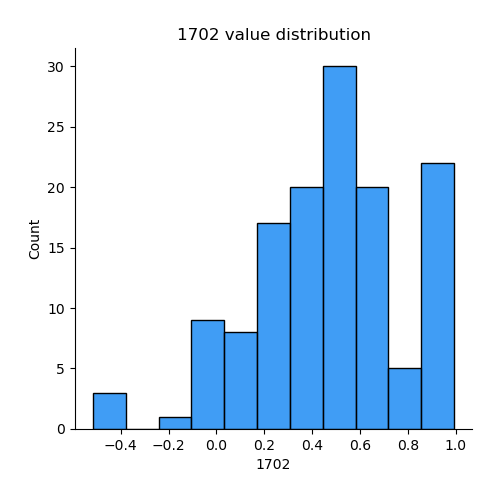
## Feature : 1703
- **Feature type** : continous
- **Missing** : 0.0%
- **Unique** : 135
- **Count** :135.0
- **Mean** :0.670861161851784
- **Std** :0.20961621972813033
- **Min** :-0.06753089074484923
- **25%th Percentile** : 0.5508717288736361
- **50%th Percentile** : 0.6854751424531673
- **75%th Percentile** : 0.7924290041693114
- **Max** :0.9938678288416302

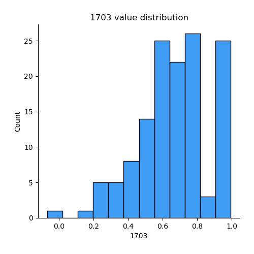
## Feature : 1704
- **Feature type** : continous
- **Missing** : 0.0%
- **Unique** : 135
- **Count** :135.0
- **Mean** :0.5452502680705863
- **Std** :0.2520003836150307
- **Min** :-0.2552598035344969
- **25%th Percentile** : 0.371143094345997
- **50%th Percentile** : 0.5356747019044172
- **75%th Percentile** : 0.6838590378071563
- **Max** :0.986169551505122

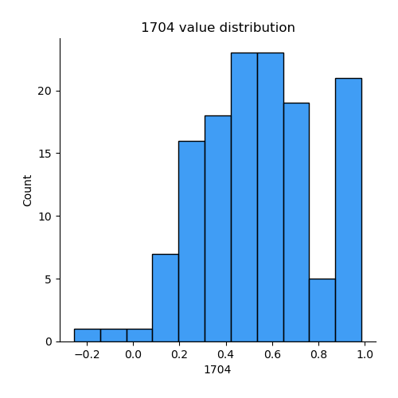
## Feature : 1705
- **Feature type** : continous
- **Missing** : 0.0%
- **Unique** : 135
- **Count** :135.0
- **Mean** :0.5405281350715703
- **Std** :0.28222970554840326
- **Min** :-0.28350668373749405
- **25%th Percentile** : 0.3854228822914632
- **50%th Percentile** : 0.54926538632123
- **75%th Percentile** : 0.6803318762301186
- **Max** :0.9916085226649625

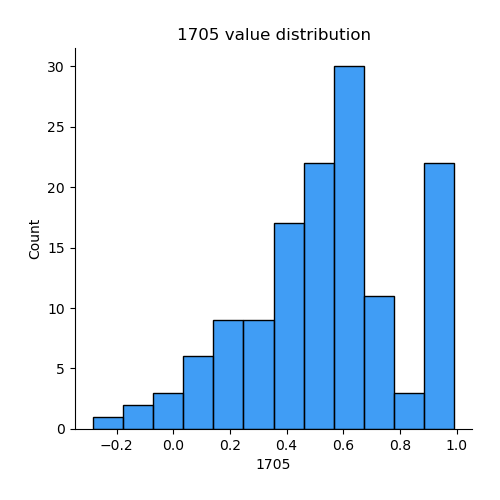
## Feature : 1706
- **Feature type** : continous
- **Missing** : 0.0%
- **Unique** : 135
- **Count** :135.0
- **Mean** :0.5641132331467331
- **Std** :0.25662170538834794
- **Min** :-0.13980750164413763
- **25%th Percentile** : 0.39947800198065175
- **50%th Percentile** : 0.5646124900042417
- **75%th Percentile** : 0.7153569061882781
- **Max** :0.9893880286140879

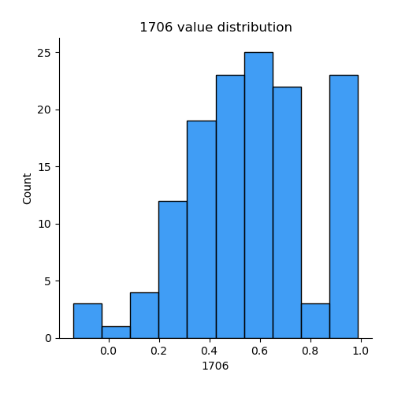
## Feature : 1707
- **Feature type** : continous
- **Missing** : 0.0%
- **Unique** : 135
- **Count** :135.0
- **Mean** :0.5662790780860015
- **Std** :0.27657929791788777
- **Min** :-0.290653987168443
- **25%th Percentile** : 0.38235028085914025
- **50%th Percentile** : 0.5787307303136298
- **75%th Percentile** : 0.7263361874671515
- **Max** :0.9916357680342422

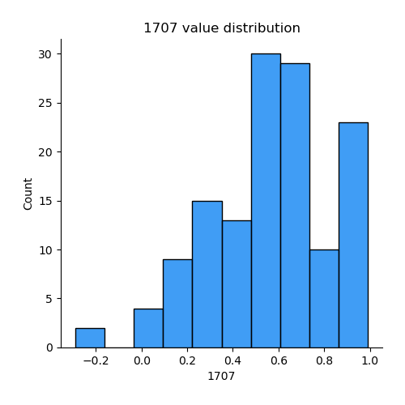
## Feature : 1708
- **Feature type** : continous
- **Missing** : 0.0%
- **Unique** : 135
- **Count** :135.0
- **Mean** :0.6015994452092527
- **Std** :0.24860868838789119
- **Min** :-0.15513467710607748
- **25%th Percentile** : 0.4631307517859179
- **50%th Percentile** : 0.604859151497118
- **75%th Percentile** : 0.7603398423109415
- **Max** :0.9908713866685698

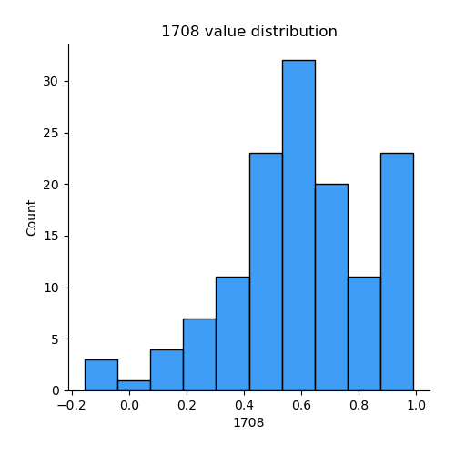
## Feature : 1709
- **Feature type** : continous
- **Missing** : 0.0%
- **Unique** : 135
- **Count** :135.0
- **Mean** :0.4451880956908459
- **Std** :0.2882926293832231
- **Min** :-0.14852898004483014
- **25%th Percentile** : 0.23602898886785745
- **50%th Percentile** : 0.38684372050943755
- **75%th Percentile** : 0.6035661890784687
- **Max** :0.988867374866223

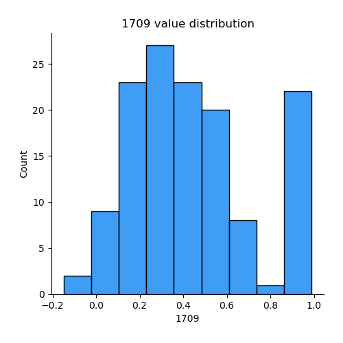
## Feature : 1710
- **Feature type** : continous
- **Missing** : 0.0%
- **Unique** : 135
- **Count** :135.0
- **Mean** :0.5836507548426327
- **Std** :0.258399463162528
- **Min** :-0.11949240706771806
- **25%th Percentile** : 0.40382607019585615
- **50%th Percentile** : 0.5896987048264879
- **75%th Percentile** : 0.7530238786505319
- **Max** :0.9941818910126229

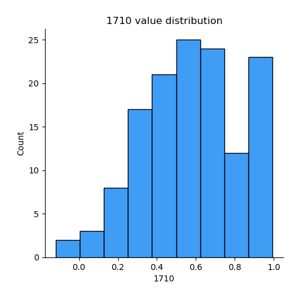
## Feature : 1711
- **Feature type** : continous
- **Missing** : 0.0%
- **Unique** : 135
- **Count** :135.0
- **Mean** :0.6365307025999578
- **Std** :0.2416012143709624
- **Min** :-0.0868410757347129
- **25%th Percentile** : 0.49189741898674616
- **50%th Percentile** : 0.6637906680578389
- **75%th Percentile** : 0.7818525404524502
- **Max** :0.9939375924181141

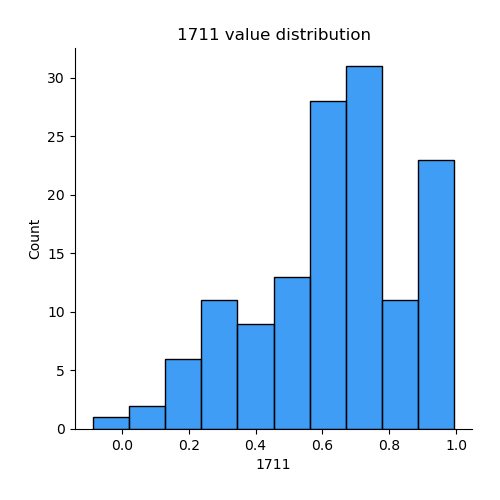
## Feature : 1712
- **Feature type** : continous
- **Missing** : 0.0%
- **Unique** : 135
- **Count** :135.0
- **Mean** :0.679985689462467
- **Std** :0.1836420524097411
- **Min** :0.18807100659929227
- **25%th Percentile** : 0.5516370306497373
- **50%th Percentile** : 0.6724392682928584
- **75%th Percentile** : 0.7842580130493656
- **Max** :0.9915651620251127

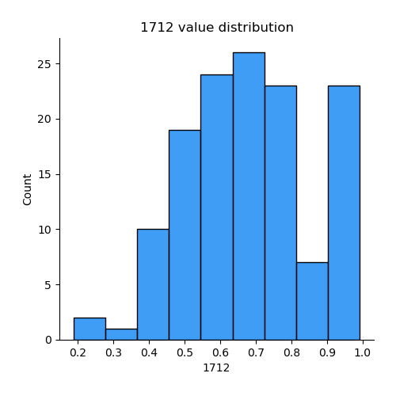
## Feature : 1713
- **Feature type** : continous
- **Missing** : 0.0%
- **Unique** : 135
- **Count** :135.0
- **Mean** :0.6070391126910288
- **Std** :0.25456415057871506
- **Min** :-0.2571169960002177
- **25%th Percentile** : 0.4533730072983231
- **50%th Percentile** : 0.6168654945268898
- **75%th Percentile** : 0.7518557273620834
- **Max** :0.9910585517178364

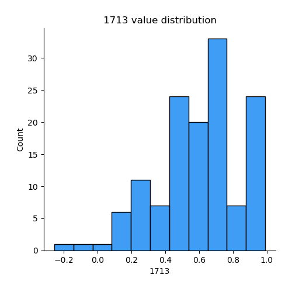
## Feature : 1714
- **Feature type** : continous
- **Missing** : 0.0%
- **Unique** : 135
- **Count** :135.0
- **Mean** :0.5524449078962532
- **Std** :0.24812656309743
- **Min** :-0.15403405212631094
- **25%th Percentile** : 0.41736935945916287
- **50%th Percentile** : 0.538970163492837
- **75%th Percentile** : 0.7030237641344008
- **Max** :0.9846810146896833

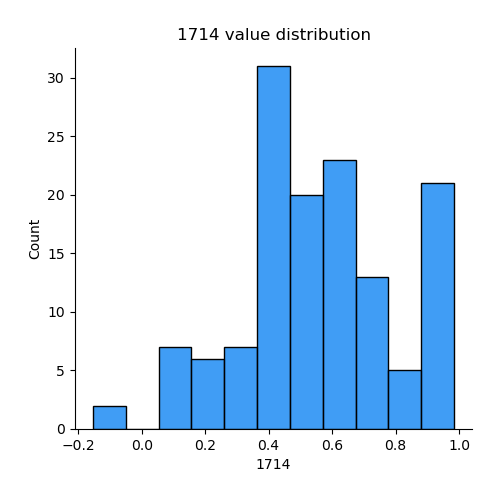
## Feature : 1715
- **Feature type** : continous
- **Missing** : 0.0%
- **Unique** : 135
- **Count** :135.0
- **Mean** :0.5428766959489908
- **Std** :0.23956599255258454
- **Min** :0.01370257896390851
- **25%th Percentile** : 0.36919631125994845
- **50%th Percentile** : 0.521042312471821
- **75%th Percentile** : 0.6538846806289849
- **Max** :0.9871894708238348

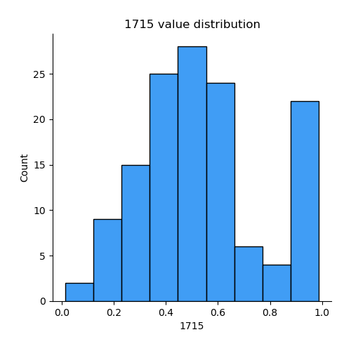
## Feature : 1749
- **Feature type** : continous
- **Missing** : 0.0%
- **Unique** : 3
- **Count** :135.0
- **Mean** :1.0
- **Std** :6.98225596019958e-17
- **Min** :0.9999999999999998
- **25%th Percentile** : 1.0
- **50%th Percentile** : 1.0
- **75%th Percentile** : 1.0
- **Max** :1.0

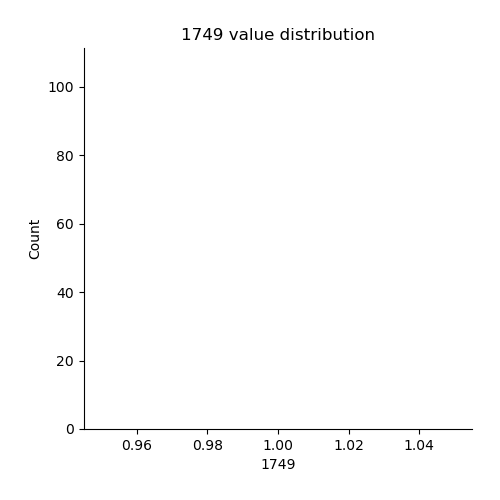
## Feature : 1750
- **Feature type** : continous
- **Missing** : 0.0%
- **Unique** : 135
- **Count** :135.0
- **Mean** :0.5878270611095898
- **Std** :0.2529071994504351
- **Min** :-0.078163596786334
- **25%th Percentile** : 0.3920142473728064
- **50%th Percentile** : 0.59925559581834
- **75%th Percentile** : 0.7463970450640607
- **Max** :0.986184314140132

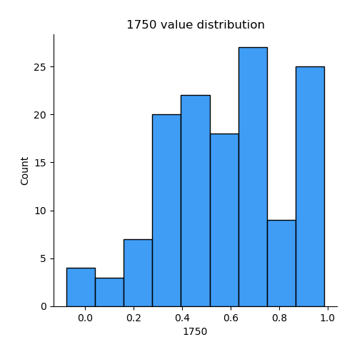
## Feature : 1751
- **Feature type** : continous
- **Missing** : 0.0%
- **Unique** : 135
- **Count** :135.0
- **Mean** :0.5751446084963111
- **Std** :0.23134466075388466
- **Min** :0.05519958369064988
- **25%th Percentile** : 0.4332077941383653
- **50%th Percentile** : 0.551152356619503
- **75%th Percentile** : 0.7071490133200631
- **Max** :0.9889434740423889

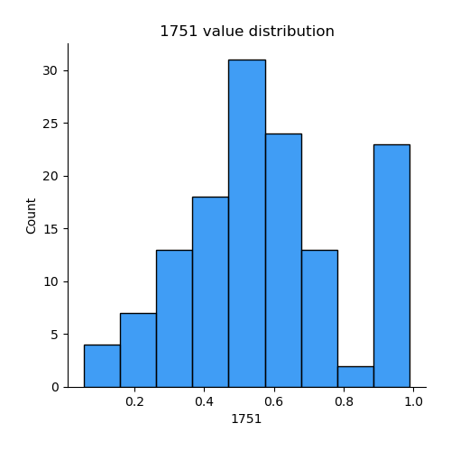
## Feature : 1752
- **Feature type** : continous
- **Missing** : 0.0%
- **Unique** : 135
- **Count** :135.0
- **Mean** :0.6339176877493514
- **Std** :0.20694732878923697
- **Min** :0.13905005002048804
- **25%th Percentile** : 0.5032012553892936
- **50%th Percentile** : 0.6050661701853897
- **75%th Percentile** : 0.7712929285026908
- **Max** :0.9927161827817101

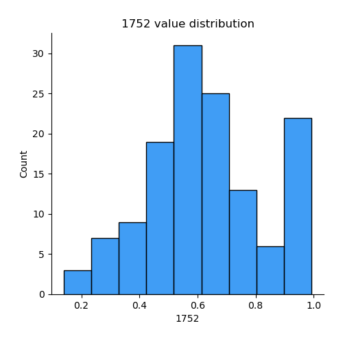
## Feature : 1753
- **Feature type** : continous
- **Missing** : 0.0%
- **Unique** : 135
- **Count** :135.0
- **Mean** :0.6259410560490661
- **Std** :0.24509644247315568
- **Min** :-0.10794745558445293
- **25%th Percentile** : 0.49372659928248064
- **50%th Percentile** : 0.6365232269466989
- **75%th Percentile** : 0.7661131916412649
- **Max** :0.9933193504102821

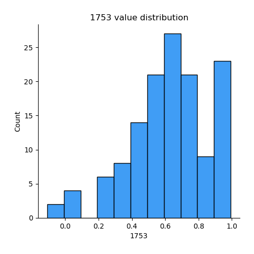
## Feature : 1754
- **Feature type** : continous
- **Missing** : 0.0%
- **Unique** : 135
- **Count** :135.0
- **Mean** :0.6143276622596432
- **Std** :0.2449001328267558
- **Min** :0.010546740020329124
- **25%th Percentile** : 0.4605652189793147
- **50%th Percentile** : 0.6110788497819469
- **75%th Percentile** : 0.7606145817210921
- **Max** :0.9974452727672588

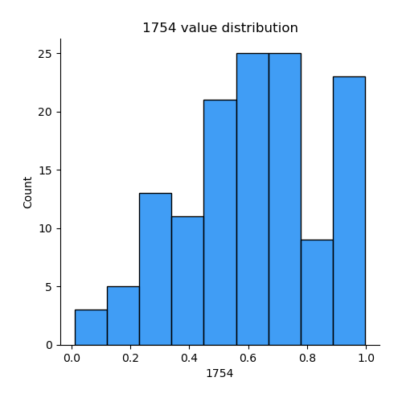
## Feature : 1755
- **Feature type** : continous
- **Missing** : 0.0%
- **Unique** : 135
- **Count** :135.0
- **Mean** :0.5640263258619373
- **Std** :0.25010811438412606
- **Min** :-0.022474688842492523
- **25%th Percentile** : 0.3738748841081175
- **50%th Percentile** : 0.5366127677454166
- **75%th Percentile** : 0.7080338513053002
- **Max** :0.9923634367854907

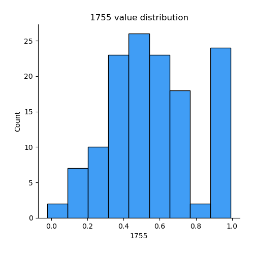
## Feature : 1756
- **Feature type** : continous
- **Missing** : 0.0%
- **Unique** : 135
- **Count** :135.0
- **Mean** :0.6015893255961724
- **Std** :0.21526227378046606
- **Min** :-0.13495475949782648
- **25%th Percentile** : 0.47137557612760084
- **50%th Percentile** : 0.5774987888822238
- **75%th Percentile** : 0.7340853800155716
- **Max** :0.9867088476372068

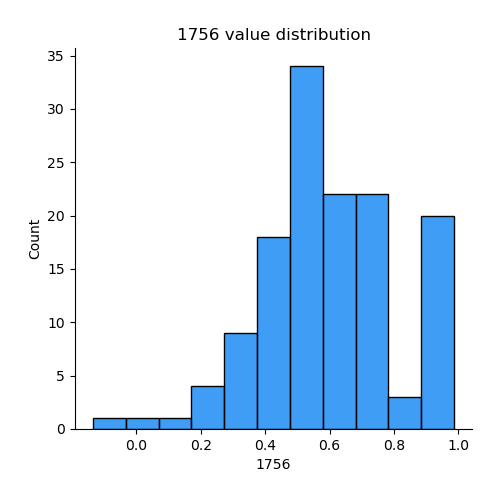
## Feature : 1757
- **Feature type** : continous
- **Missing** : 0.0%
- **Unique** : 135
- **Count** :135.0
- **Mean** :0.697663262014186
- **Std** :0.19800291706394174
- **Min** :0.06312334167752252
- **25%th Percentile** : 0.5742084849905336
- **50%th Percentile** : 0.7110521482083901
- **75%th Percentile** : 0.8202208405760905
- **Max** :0.9966599212106876

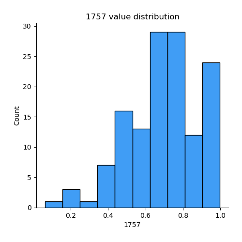
## Feature : 1758
- **Feature type** : continous
- **Missing** : 0.0%
- **Unique** : 135
- **Count** :135.0
- **Mean** :0.6908789562167181
- **Std** :0.20316421034263918
- **Min** :0.1365096300557364
- **25%th Percentile** : 0.5544285758783434
- **50%th Percentile** : 0.7070471744939186
- **75%th Percentile** : 0.8188026020153594
- **Max** :0.9940186311028225

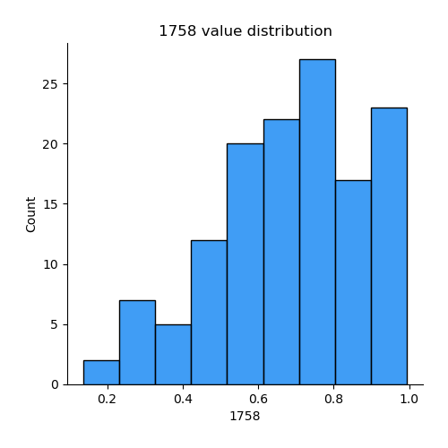
## Feature : 1759
- **Feature type** : continous
- **Missing** : 0.0%
- **Unique** : 135
- **Count** :135.0
- **Mean** :0.7142794303183465
- **Std** :0.19518252455719196
- **Min** :0.10788306338980175
- **25%th Percentile** : 0.5923818316860875
- **50%th Percentile** : 0.7322560062404075
- **75%th Percentile** : 0.8346266233143346
- **Max** :0.9963076323470034

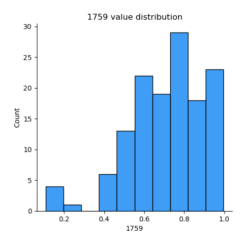
## Feature : 1760
- **Feature type** : continous
- **Missing** : 0.0%
- **Unique** : 135
- **Count** :135.0
- **Mean** :0.6559929108960723
- **Std** :0.2161601112177848
- **Min** :0.10281402521483483
- **25%th Percentile** : 0.501902581675483
- **50%th Percentile** : 0.6635195533444833
- **75%th Percentile** : 0.7882684488462559
- **Max** :0.9919263018796975

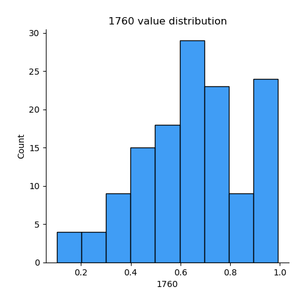
## Feature : 1761
- **Feature type** : continous
- **Missing** : 0.0%
- **Unique** : 135
- **Count** :135.0
- **Mean** :0.5595499378876821
- **Std** :0.25672218802117075
- **Min** :-0.11364677309375538
- **25%th Percentile** : 0.38829797691798174
- **50%th Percentile** : 0.5346905699890954
- **75%th Percentile** : 0.7578636070586611
- **Max** :0.9904837994047248

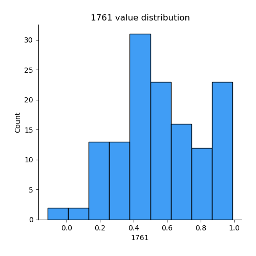
## Feature : 1762
- **Feature type** : continous
- **Missing** : 0.0%
- **Unique** : 135
- **Count** :135.0
- **Mean** :0.632135281415091
- **Std** :0.23693021486242524
- **Min** :0.049068541182621675
- **25%th Percentile** : 0.49123868150168204
- **50%th Percentile** : 0.6376074880208107
- **75%th Percentile** : 0.7804025255941038
- **Max** :0.995220997054064

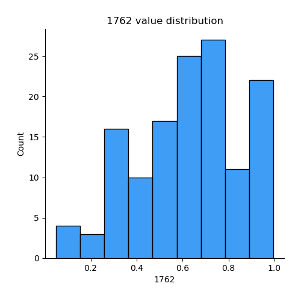
## Feature : 1763
- **Feature type** : continous
- **Missing** : 0.0%
- **Unique** : 135
- **Count** :135.0
- **Mean** :0.6468405027346029
- **Std** :0.22466969816885785
- **Min** :-0.04123950141643912
- **25%th Percentile** : 0.5016343231413887
- **50%th Percentile** : 0.6590999565216341
- **75%th Percentile** : 0.7823037346928449
- **Max** :0.9950850798115942

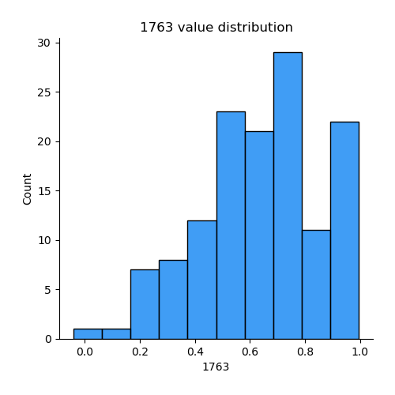
## Feature : 1764
- **Feature type** : continous
- **Missing** : 0.0%
- **Unique** : 135
- **Count** :135.0
- **Mean** :0.7995241114391817
- **Std** :0.15520942239310967
- **Min** :0.22755707569153324
- **25%th Percentile** : 0.6969979953699408
- **50%th Percentile** : 0.8248959961060077
- **75%th Percentile** : 0.9077979618880874
- **Max** :0.9968255793136414

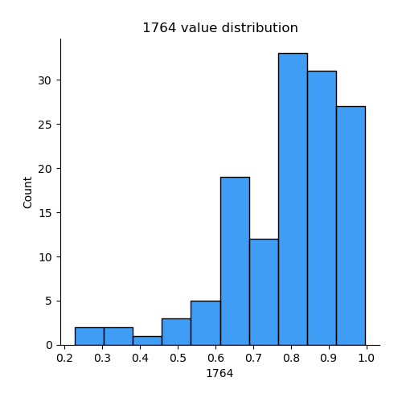
## Feature : 1765
- **Feature type** : continous
- **Missing** : 0.0%
- **Unique** : 135
- **Count** :135.0
- **Mean** :0.790455725445956
- **Std** :0.14687800574292242
- **Min** :0.23062428207017188
- **25%th Percentile** : 0.7001691009454001
- **50%th Percentile** : 0.8039074005060297
- **75%th Percentile** : 0.8939106442802461
- **Max** :0.9961776066874019

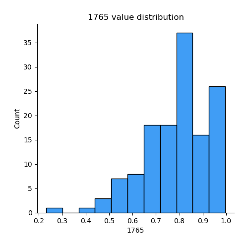
## Feature : 1766
- **Feature type** : continous
- **Missing** : 0.0%
- **Unique** : 135
- **Count** :135.0
- **Mean** :0.4479052943958688
- **Std** :0.2863416262802592
- **Min** :-0.2618712629212947
- **25%th Percentile** : 0.2429169201384596
- **50%th Percentile** : 0.3950656509575753
- **75%th Percentile** : 0.6382600299504244
- **Max** :0.9855897692879498

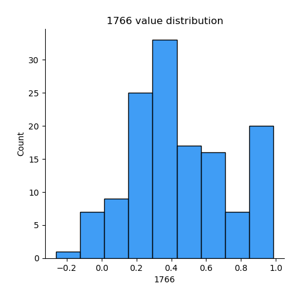
## Feature : 1767
- **Feature type** : continous
- **Missing** : 0.0%
- **Unique** : 135
- **Count** :135.0
- **Mean** :0.7282782280881328
- **Std** :0.18402711200855393
- **Min** :0.1453106942369501
- **25%th Percentile** : 0.5996994800991347
- **50%th Percentile** : 0.7529020196796737
- **75%th Percentile** : 0.8518869885038537
- **Max** :0.9930466969189649

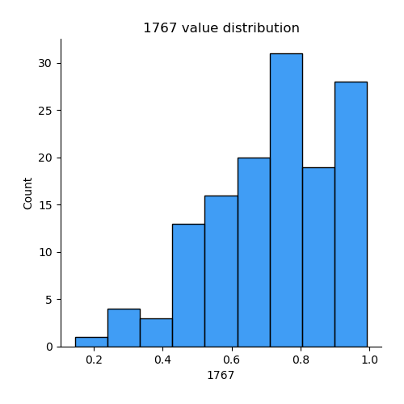
## Feature : 1802
- **Feature type** : continous
- **Missing** : 0.0%
- **Unique** : 3
- **Count** :135.0
- **Mean** :1.0
- **Std** :7.304186058818017e-17
- **Min** :0.9999999999999998
- **25%th Percentile** : 1.0
- **50%th Percentile** : 1.0
- **75%th Percentile** : 1.0
- **Max** :1.0

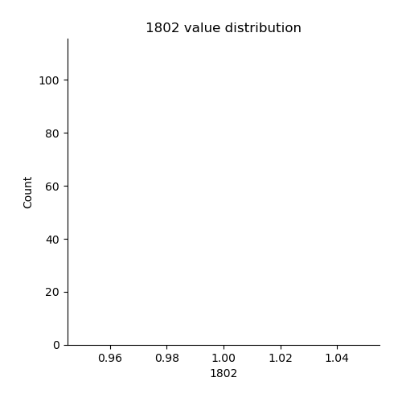
## Feature : 1803
- **Feature type** : continous
- **Missing** : 0.0%
- **Unique** : 135
- **Count** :135.0
- **Mean** :0.6120825438679262
- **Std** :0.22942634695998423
- **Min** :-0.09489250022531709
- **25%th Percentile** : 0.4643405757328397
- **50%th Percentile** : 0.5909518247750433
- **75%th Percentile** : 0.7438269798920898
- **Max** :0.9829550639437475

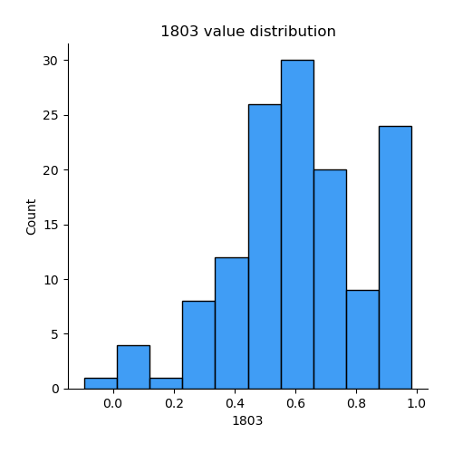
## Feature : 1804
- **Feature type** : continous
- **Missing** : 0.0%
- **Unique** : 135
- **Count** :135.0
- **Mean** :0.7267376582708549
- **Std** :0.1748539733058437
- **Min** :0.19684605215166986
- **25%th Percentile** : 0.6013446569938627
- **50%th Percentile** : 0.7286563218165736
- **75%th Percentile** : 0.8713244960977418
- **Max** :0.9901176442021234

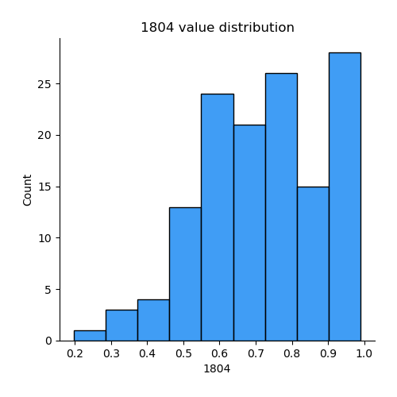
## Feature : 1805
- **Feature type** : continous
- **Missing** : 0.0%
- **Unique** : 135
- **Count** :135.0
- **Mean** :0.6420695157802624
- **Std** :0.21799185396096013
- **Min** :0.009849571692580252
- **25%th Percentile** : 0.5123517466154348
- **50%th Percentile** : 0.6330286068201382
- **75%th Percentile** : 0.7834081509047128
- **Max** :0.9876550178741121

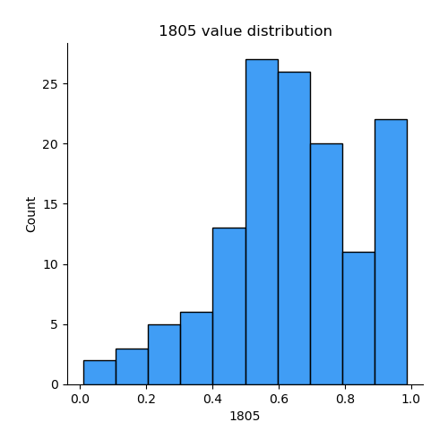
## Feature : 1806
- **Feature type** : continous
- **Missing** : 0.0%
- **Unique** : 135
- **Count** :135.0
- **Mean** :0.548396501347646
- **Std** :0.2641528665083338
- **Min** :-0.17409005886796725
- **25%th Percentile** : 0.3594657749338131
- **50%th Percentile** : 0.5496462666501813
- **75%th Percentile** : 0.7138815434719161
- **Max** :0.9878227348883621

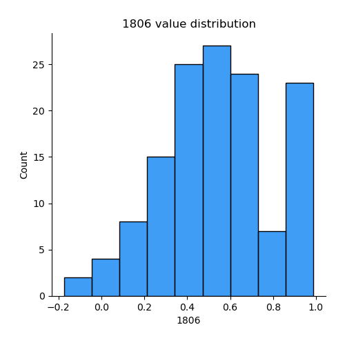
## Feature : 1807
- **Feature type** : continous
- **Missing** : 0.0%
- **Unique** : 135
- **Count** :135.0
- **Mean** :0.6308042961151058
- **Std** :0.20994049672972293
- **Min** :0.048159307025674614
- **25%th Percentile** : 0.4708993022886931
- **50%th Percentile** : 0.6148731495026981
- **75%th Percentile** : 0.7831145161107421
- **Max** :0.9866130928655994

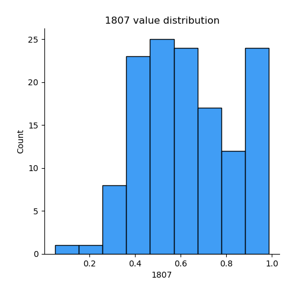
## Feature : 1808
- **Feature type** : continous
- **Missing** : 0.0%
- **Unique** : 135
- **Count** :135.0
- **Mean** :0.6697592382143008
- **Std** :0.19379324108894952
- **Min** :0.18920962839999664
- **25%th Percentile** : 0.5568842378868624
- **50%th Percentile** : 0.6607390778742487
- **75%th Percentile** : 0.8051626966042844
- **Max** :0.9844437819899465

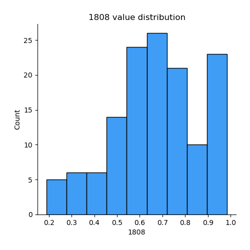
## Feature : 1809
- **Feature type** : continous
- **Missing** : 0.0%
- **Unique** : 135
- **Count** :135.0
- **Mean** :0.575457832679426
- **Std** :0.25472359029299835
- **Min** :-0.10923857705506551
- **25%th Percentile** : 0.41696275125120746
- **50%th Percentile** : 0.574108582952342
- **75%th Percentile** : 0.7493209478842491
- **Max** :0.9888948297814387

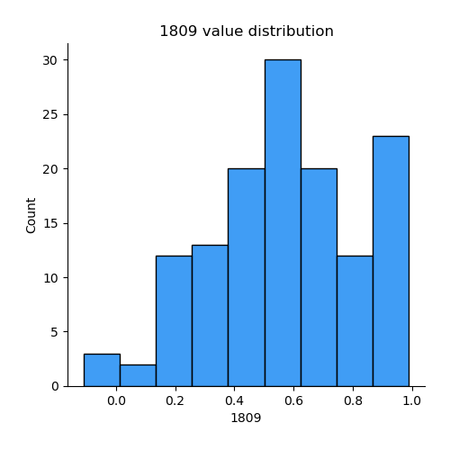
## Feature : 1810
- **Feature type** : continous
- **Missing** : 0.0%
- **Unique** : 135
- **Count** :135.0
- **Mean** :0.6928880531272297
- **Std** :0.184024404793774
- **Min** :0.23041020476277654
- **25%th Percentile** : 0.5433725459086047
- **50%th Percentile** : 0.6965690219792404
- **75%th Percentile** : 0.8303323533145263
- **Max** :0.9896937061108566

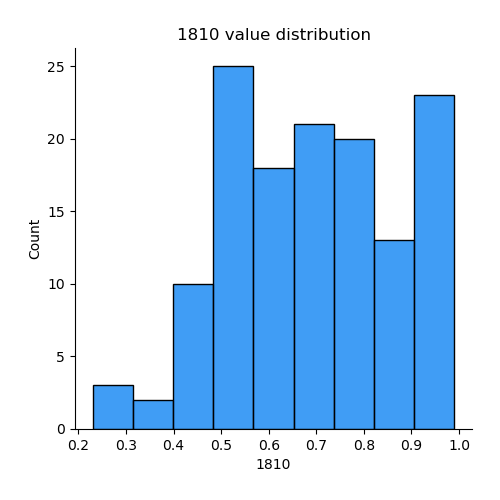
## Feature : 1811
- **Feature type** : continous
- **Missing** : 0.0%
- **Unique** : 135
- **Count** :135.0
- **Mean** :0.5674787066400931
- **Std** :0.2551139489239687
- **Min** :-0.12560319776346418
- **25%th Percentile** : 0.4220654507427952
- **50%th Percentile** : 0.5569547396721545
- **75%th Percentile** : 0.7357445773144922
- **Max** :0.9861876438263248

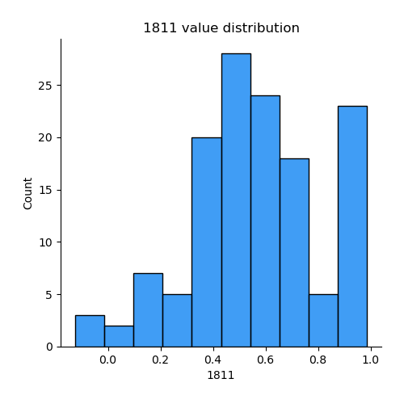
## Feature : 1812
- **Feature type** : continous
- **Missing** : 0.0%
- **Unique** : 135
- **Count** :135.0
- **Mean** :0.8478434091248376
- **Std** :0.1006958187173952
- **Min** :0.5373735239771625
- **25%th Percentile** : 0.7828691930941951
- **50%th Percentile** : 0.8586365406648157
- **75%th Percentile** : 0.9098166032279429
- **Max** :0.9955046005660894

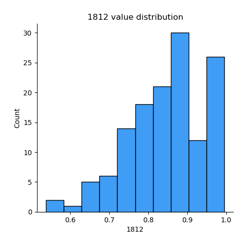
## Feature : 1813
- **Feature type** : continous
- **Missing** : 0.0%
- **Unique** : 135
- **Count** :135.0
- **Mean** :0.5202037584028372
- **Std** :0.2506475077778764
- **Min** :-0.006801177455174698
- **25%th Percentile** : 0.3445676349418337
- **50%th Percentile** : 0.4920690529898654
- **75%th Percentile** : 0.6446315549402879
- **Max** :0.9845004258284892

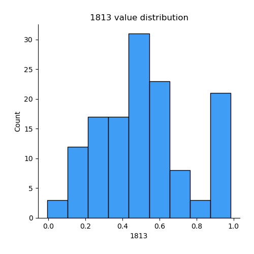
## Feature : 1814
- **Feature type** : continous
- **Missing** : 0.0%
- **Unique** : 135
- **Count** :135.0
- **Mean** :0.6355582463008196
- **Std** :0.2206641362812497
- **Min** :0.04055565187977248
- **25%th Percentile** : 0.5067399898330127
- **50%th Percentile** : 0.6382997328794566
- **75%th Percentile** : 0.781804572058739
- **Max** :0.9926882057534427

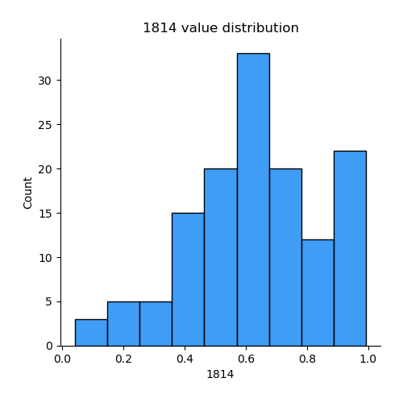
## Feature : 1815
- **Feature type** : continous
- **Missing** : 0.0%
- **Unique** : 135
- **Count** :135.0
- **Mean** :0.6326172971919399
- **Std** :0.23042294264027108
- **Min** :0.00917890208253076
- **25%th Percentile** : 0.48559150163154474
- **50%th Percentile** : 0.6428689444216295
- **75%th Percentile** : 0.782186564250621
- **Max** :0.9889541344662178

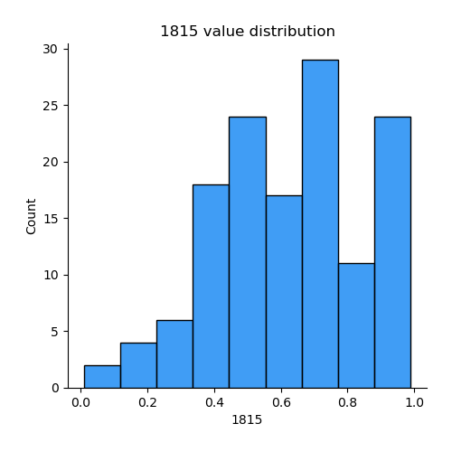
## Feature : 1816
- **Feature type** : continous
- **Missing** : 0.0%
- **Unique** : 135
- **Count** :135.0
- **Mean** :0.6104837371663879
- **Std** :0.23944999241465803
- **Min** :-0.2449338747790355
- **25%th Percentile** : 0.45251043526237755
- **50%th Percentile** : 0.6097284370036763
- **75%th Percentile** : 0.7544872900082293
- **Max** :0.9845832592852118

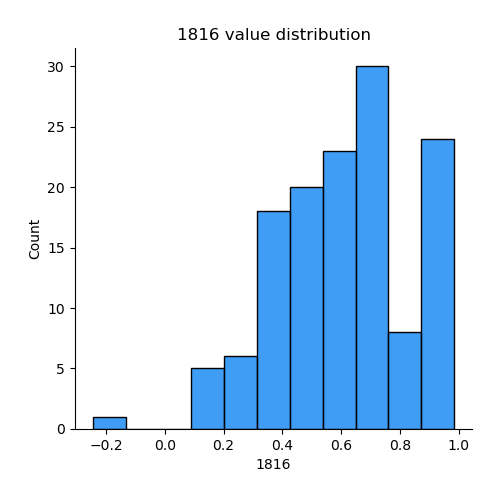
## Feature : 1817
- **Feature type** : continous
- **Missing** : 0.0%
- **Unique** : 135
- **Count** :135.0
- **Mean** :0.5932559391024175
- **Std** :0.25771017498319676
- **Min** :-0.09840289351968055
- **25%th Percentile** : 0.41820597582162256
- **50%th Percentile** : 0.5796724166835838
- **75%th Percentile** : 0.781731123116688
- **Max** :0.9872148016591312

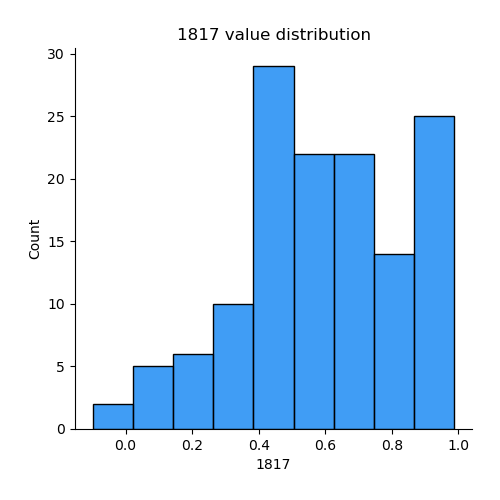
## Feature : 1818
- **Feature type** : continous
- **Missing** : 0.0%
- **Unique** : 135
- **Count** :135.0
- **Mean** :0.40245697731164587
- **Std** :0.30335214388535225
- **Min** :-0.2994864558821874
- **25%th Percentile** : 0.18158464491276746
- **50%th Percentile** : 0.35339130393572377
- **75%th Percentile** : 0.5610562102569276
- **Max** :0.9778028940631022

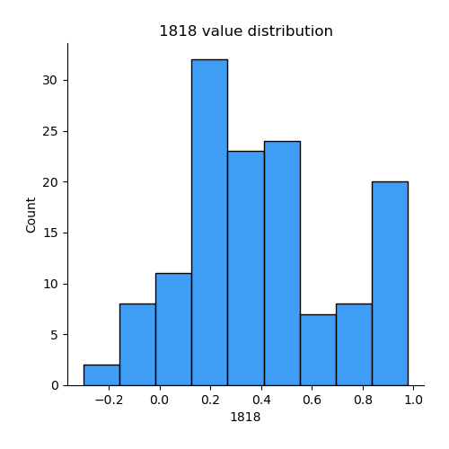
## Feature : 1819
- **Feature type** : continous
- **Missing** : 0.0%
- **Unique** : 135
- **Count** :135.0
- **Mean** :0.5317642370735953
- **Std** :0.264776062539244
- **Min** :-0.04968793437218666
- **25%th Percentile** : 0.33677289551644074
- **50%th Percentile** : 0.5029309925923743
- **75%th Percentile** : 0.7233813796427311
- **Max** :0.9840785065362649

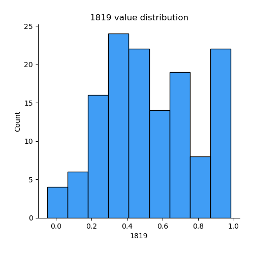
## Feature : 1855
- **Feature type** : continous
- **Missing** : 0.0%
- **Unique** : 3
- **Count** :135.0
- **Mean** :1.0
- **Std** :8.361123277344475e-17
- **Min** :0.9999999999999998
- **25%th Percentile** : 1.0
- **50%th Percentile** : 1.0
- **75%th Percentile** : 1.0
- **Max** :1.0

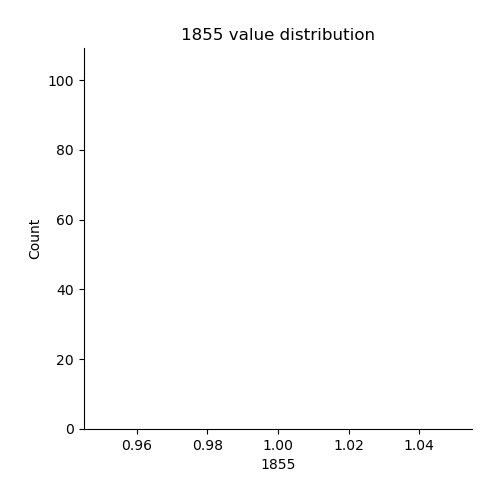
## Feature : 1856
- **Feature type** : continous
- **Missing** : 0.0%
- **Unique** : 135
- **Count** :135.0
- **Mean** :0.8050822970554006
- **Std** :0.1281648484563513
- **Min** :0.4063377521382747
- **25%th Percentile** : 0.741577928772855
- **50%th Percentile** : 0.8163191083492218
- **75%th Percentile** : 0.8815746303647637
- **Max** :0.9916326475185534

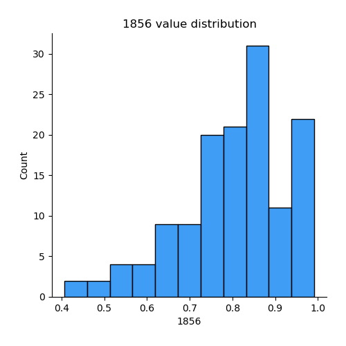
## Feature : 1857
- **Feature type** : continous
- **Missing** : 0.0%
- **Unique** : 135
- **Count** :135.0
- **Mean** :0.6429250405838456
- **Std** :0.21700374435525566
- **Min** :0.06641433341498287
- **25%th Percentile** : 0.5031743757405192
- **50%th Percentile** : 0.6600153878145039
- **75%th Percentile** : 0.7692282596000378
- **Max** :0.9929581028201259

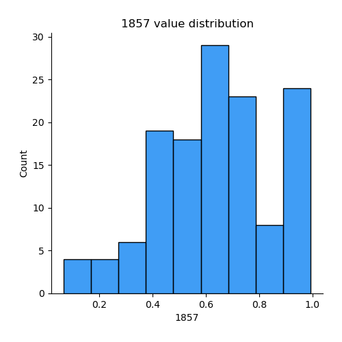
## Feature : 1858
- **Feature type** : continous
- **Missing** : 0.0%
- **Unique** : 135
- **Count** :135.0
- **Mean** :0.5104846609533392
- **Std** :0.28916858637406667
- **Min** :-0.3375383829817177
- **25%th Percentile** : 0.3143678861399114
- **50%th Percentile** : 0.5170352853893383
- **75%th Percentile** : 0.6688622135891913
- **Max** :0.9865715977706362

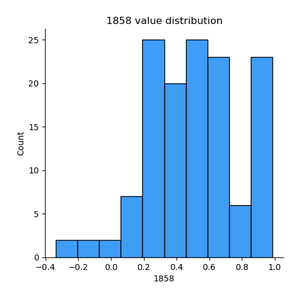
## Feature : 1859
- **Feature type** : continous
- **Missing** : 0.0%
- **Unique** : 135
- **Count** :135.0
- **Mean** :0.5911179625692048
- **Std** :0.2269647291916941
- **Min** :0.07410204050007509
- **25%th Percentile** : 0.43432814388788
- **50%th Percentile** : 0.591406631248891
- **75%th Percentile** : 0.7059636868918502
- **Max** :0.9935256252587009

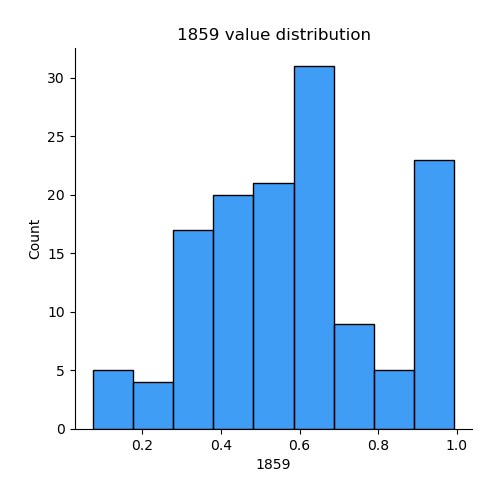
## Feature : 1860
- **Feature type** : continous
- **Missing** : 0.0%
- **Unique** : 135
- **Count** :135.0
- **Mean** :0.7655504543502982
- **Std** :0.14401749420103033
- **Min** :0.27030259265205164
- **25%th Percentile** : 0.6673516754989772
- **50%th Percentile** : 0.7813467639015209
- **75%th Percentile** : 0.8726703642895579
- **Max** :0.9886146855700252

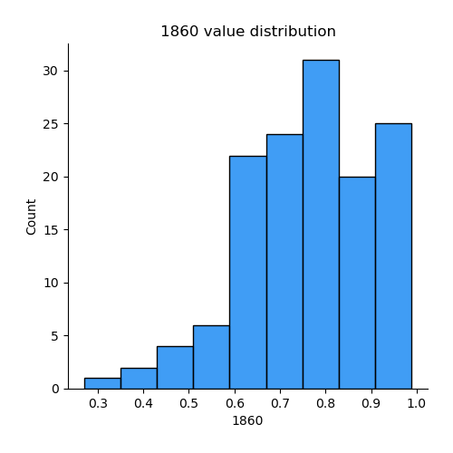
## Feature : 1861
- **Feature type** : continous
- **Missing** : 0.0%
- **Unique** : 135
- **Count** :135.0
- **Mean** :0.5447963633891946
- **Std** :0.2811304495275219
- **Min** :-0.36518990185741895
- **25%th Percentile** : 0.31506904750292464
- **50%th Percentile** : 0.5473882403460217
- **75%th Percentile** : 0.7189922232464572
- **Max** :0.9879382871662961

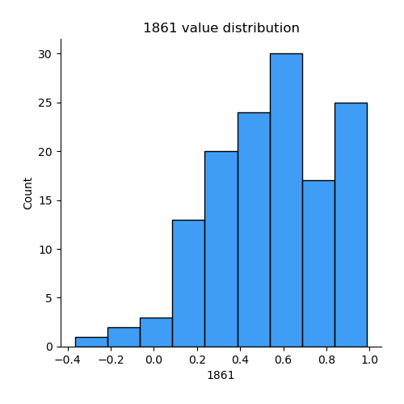
## Feature : 1862
- **Feature type** : continous
- **Missing** : 0.0%
- **Unique** : 135
- **Count** :135.0
- **Mean** :0.5566881833399396
- **Std** :0.2501387888258301
- **Min** :-0.17526247093359004
- **25%th Percentile** : 0.400055079080613
- **50%th Percentile** : 0.5434531608498069
- **75%th Percentile** : 0.7030590265884997
- **Max** :0.9836948574142608

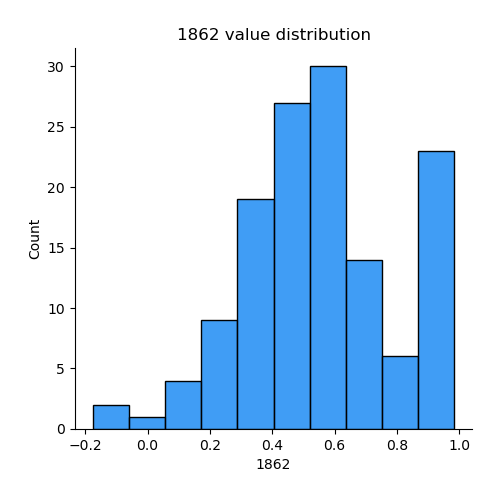
## Feature : 1863
- **Feature type** : continous
- **Missing** : 0.0%
- **Unique** : 135
- **Count** :135.0
- **Mean** :0.5638105319604721
- **Std** :0.2646926915088655
- **Min** :-0.3543312744879436
- **25%th Percentile** : 0.35824105887288604
- **50%th Percentile** : 0.5898936692323643
- **75%th Percentile** : 0.7391194231475614
- **Max** :0.9878344030815727

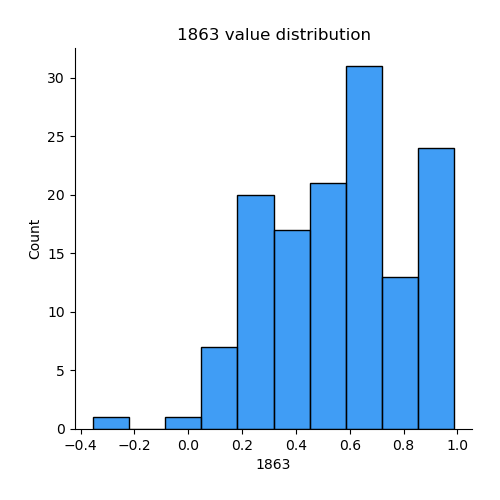
## Feature : 1864
- **Feature type** : continous
- **Missing** : 0.0%
- **Unique** : 135
- **Count** :135.0
- **Mean** :0.6622262966475321
- **Std** :0.2066972344292203
- **Min** :0.06895857843332555
- **25%th Percentile** : 0.5481336844427507
- **50%th Percentile** : 0.675421012642609
- **75%th Percentile** : 0.783018122683006
- **Max** :0.9902128814771375

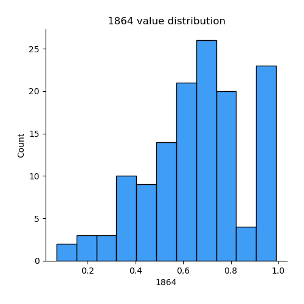
## Feature : 1865
- **Feature type** : continous
- **Missing** : 0.0%
- **Unique** : 135
- **Count** :135.0
- **Mean** :0.37340785656397246
- **Std** :0.31162746452800205
- **Min** :-0.293245465550596
- **25%th Percentile** : 0.16913551289573134
- **50%th Percentile** : 0.3237347266029468
- **75%th Percentile** : 0.49785994282857504
- **Max** :0.9840782859466675

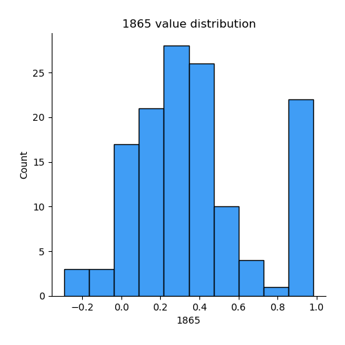
## Feature : 1866
- **Feature type** : continous
- **Missing** : 0.0%
- **Unique** : 135
- **Count** :135.0
- **Mean** :0.5313374163414568
- **Std** :0.2737018943027695
- **Min** :-0.149294782902172
- **25%th Percentile** : 0.36843445559904575
- **50%th Percentile** : 0.5164566221889008
- **75%th Percentile** : 0.7164664112776551
- **Max** :0.9858128580944551

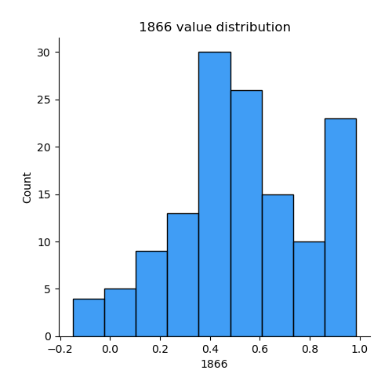
## Feature : 1867
- **Feature type** : continous
- **Missing** : 0.0%
- **Unique** : 135
- **Count** :135.0
- **Mean** :0.7150212108940271
- **Std** :0.18936921720431701
- **Min** :0.1622189639407783
- **25%th Percentile** : 0.6081553201364525
- **50%th Percentile** : 0.7337286257937389
- **75%th Percentile** : 0.8635476546625644
- **Max** :0.9936604364383067

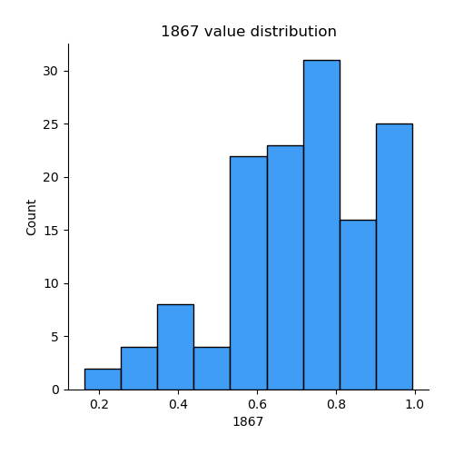
## Feature : 1868
- **Feature type** : continous
- **Missing** : 0.0%
- **Unique** : 135
- **Count** :135.0
- **Mean** :0.6080292526360236
- **Std** :0.2217103931848622
- **Min** :0.051578277641592694
- **25%th Percentile** : 0.45274217590393595
- **50%th Percentile** : 0.6023274946104994
- **75%th Percentile** : 0.7429207996580474
- **Max** :0.989608407389517

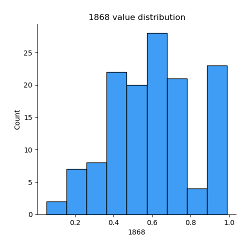
## Feature : 1869
- **Feature type** : continous
- **Missing** : 0.0%
- **Unique** : 135
- **Count** :135.0
- **Mean** :0.6029427321765223
- **Std** :0.22474391588903297
- **Min** :-0.025462712967607208
- **25%th Percentile** : 0.4427078767835765
- **50%th Percentile** : 0.5923197860877499
- **75%th Percentile** : 0.7320289886300455
- **Max** :0.9906412637609808

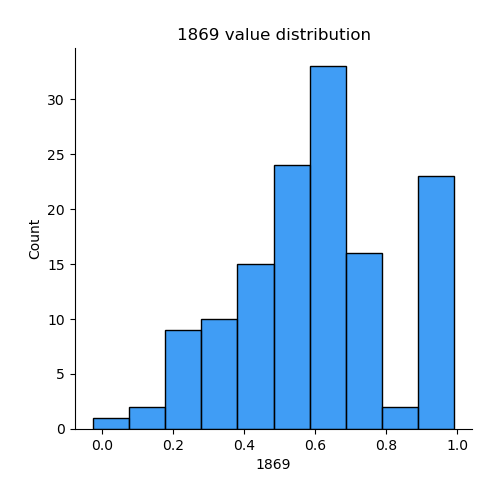
## Feature : 1870
- **Feature type** : continous
- **Missing** : 0.0%
- **Unique** : 135
- **Count** :135.0
- **Mean** :0.3750554634654177
- **Std** :0.3021804027370503
- **Min** :-0.24984802863374336
- **25%th Percentile** : 0.1767322609995603
- **50%th Percentile** : 0.3515891324994623
- **75%th Percentile** : 0.5590125576285656
- **Max** :0.9780622274030145

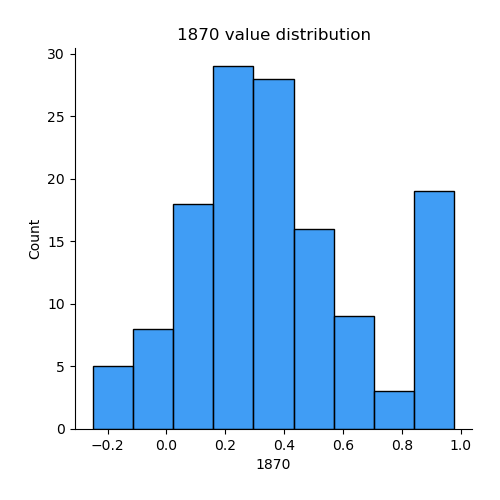
## Feature : 1871
- **Feature type** : continous
- **Missing** : 0.0%
- **Unique** : 135
- **Count** :135.0
- **Mean** :0.5024869188847022
- **Std** :0.261166018814091
- **Min** :-0.1579283860584936
- **25%th Percentile** : 0.2919982956504997
- **50%th Percentile** : 0.4786503401277257
- **75%th Percentile** : 0.6656553499970809
- **Max** :0.9844612380337627

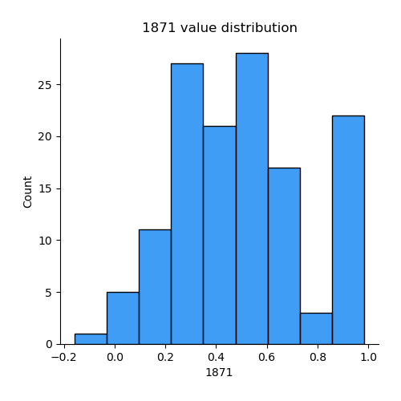
## Feature : 1908
- **Feature type** : continous
- **Missing** : 0.0%
- **Unique** : 3
- **Count** :135.0
- **Mean** :1.0
- **Std** :8.524548308960713e-17
- **Min** :0.9999999999999998
- **25%th Percentile** : 1.0
- **50%th Percentile** : 1.0
- **75%th Percentile** : 1.0
- **Max** :1.0

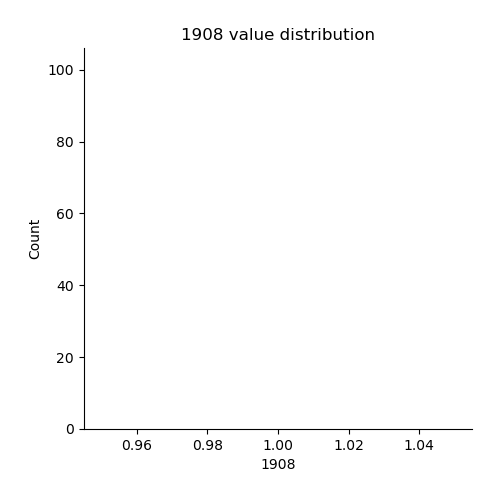
## Feature : 1909
- **Feature type** : continous
- **Missing** : 0.0%
- **Unique** : 135
- **Count** :135.0
- **Mean** :0.6198273478700221
- **Std** :0.22223775019371222
- **Min** :-0.03327733703103676
- **25%th Percentile** : 0.4747934026654619
- **50%th Percentile** : 0.6287036005108423
- **75%th Percentile** : 0.7490292103754923
- **Max** :0.9929691568397223

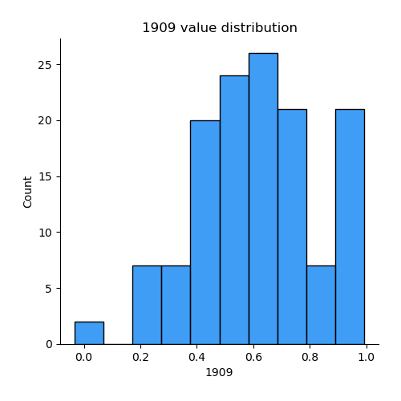
## Feature : 1910
- **Feature type** : continous
- **Missing** : 0.0%
- **Unique** : 135
- **Count** :135.0
- **Mean** :0.549517675288076
- **Std** :0.28092352799879283
- **Min** :-0.09341286447957393
- **25%th Percentile** : 0.3431243998292378
- **50%th Percentile** : 0.5657759912690966
- **75%th Percentile** : 0.7501401325518549
- **Max** :0.9940772957666437

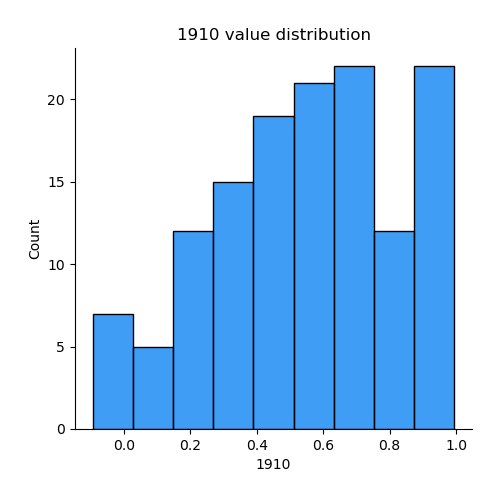
## Feature : 1911
- **Feature type** : continous
- **Missing** : 0.0%
- **Unique** : 135
- **Count** :135.0
- **Mean** :0.6744351456820535
- **Std** :0.18912005285833916
- **Min** :0.1030980632590211
- **25%th Percentile** : 0.5348349413128028
- **50%th Percentile** : 0.6744991112057644
- **75%th Percentile** : 0.7949906991291626
- **Max** :0.9933721570335435

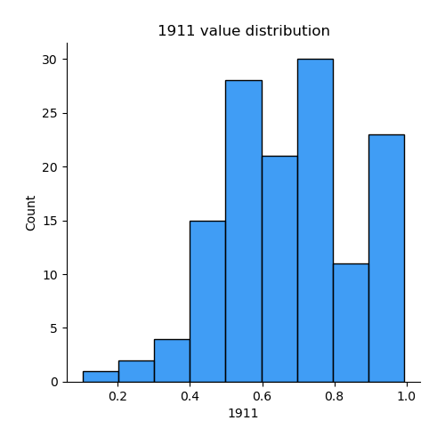
## Feature : 1912
- **Feature type** : continous
- **Missing** : 0.0%
- **Unique** : 135
- **Count** :135.0
- **Mean** :0.8860587540662294
- **Std** :0.07790838986203909
- **Min** :0.5555335051010838
- **25%th Percentile** : 0.8396658036492388
- **50%th Percentile** : 0.9034827698693374
- **75%th Percentile** : 0.9392488048012815
- **Max** :0.9954985944655153

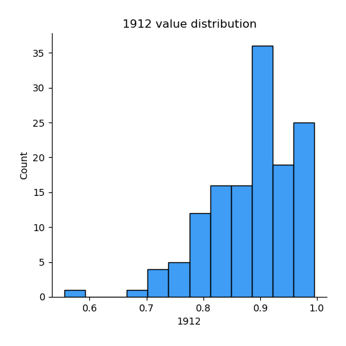
## Feature : 1913
- **Feature type** : continous
- **Missing** : 0.0%
- **Unique** : 135
- **Count** :135.0
- **Mean** :0.5772191502666353
- **Std** :0.26787101880096165
- **Min** :-0.0773782426220044
- **25%th Percentile** : 0.3736196111065184
- **50%th Percentile** : 0.595901021089295
- **75%th Percentile** : 0.7563561206095282
- **Max** :0.9922797433705196

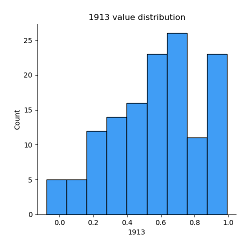
## Feature : 1914
- **Feature type** : continous
- **Missing** : 0.0%
- **Unique** : 135
- **Count** :135.0
- **Mean** :0.6172205769461183
- **Std** :0.22549456839885504
- **Min** :0.0227819328774932
- **25%th Percentile** : 0.4698900137305626
- **50%th Percentile** : 0.5902087829153044
- **75%th Percentile** : 0.7951654928283594
- **Max** :0.9941963574938896

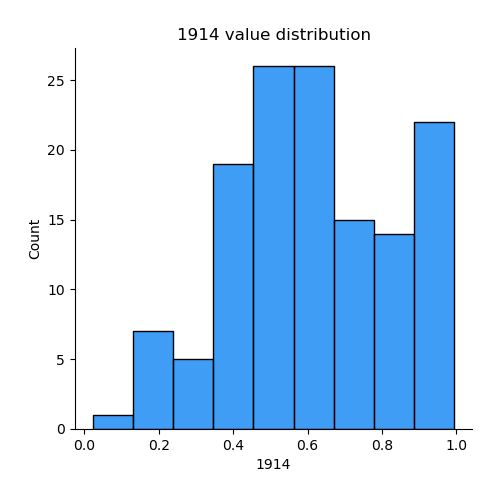
## Feature : 1915
- **Feature type** : continous
- **Missing** : 0.0%
- **Unique** : 135
- **Count** :135.0
- **Mean** :0.600627940060267
- **Std** :0.25054931547925136
- **Min** :-0.02110974200392443
- **25%th Percentile** : 0.4088352500242849
- **50%th Percentile** : 0.6214113977519353
- **75%th Percentile** : 0.7660862210918895
- **Max** :0.9935106791818158

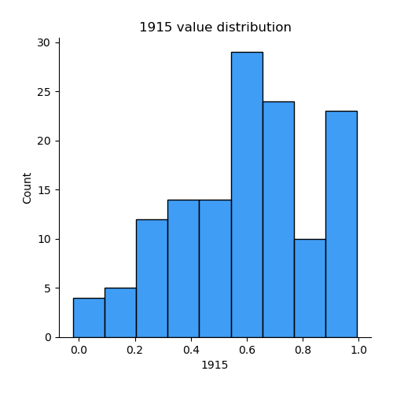
## Feature : 1916
- **Feature type** : continous
- **Missing** : 0.0%
- **Unique** : 135
- **Count** :135.0
- **Mean** :0.7393894760810865
- **Std** :0.17079220924019745
- **Min** :0.19211250762532442
- **25%th Percentile** : 0.6306901722189558
- **50%th Percentile** : 0.7419170974662704
- **75%th Percentile** : 0.8584056306643149
- **Max** :0.9922416116641547

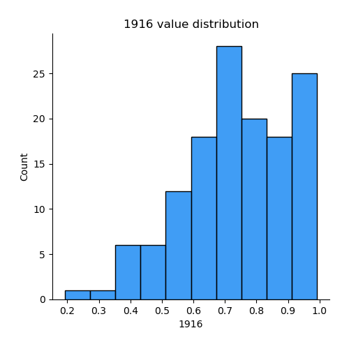
## Feature : 1917
- **Feature type** : continous
- **Missing** : 0.0%
- **Unique** : 135
- **Count** :135.0
- **Mean** :0.39632556133650026
- **Std** :0.29564642109836653
- **Min** :-0.24667879285144256
- **25%th Percentile** : 0.19462534447972307
- **50%th Percentile** : 0.32774400982183693
- **75%th Percentile** : 0.529935124377271
- **Max** :0.9803221742176847

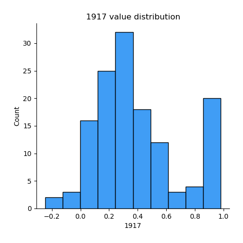
## Feature : 1918
- **Feature type** : continous
- **Missing** : 0.0%
- **Unique** : 135
- **Count** :135.0
- **Mean** :0.5514900157102118
- **Std** :0.2743699339277819
- **Min** :-0.22454435489784
- **25%th Percentile** : 0.3661153734871493
- **50%th Percentile** : 0.5548600555319212
- **75%th Percentile** : 0.7652747091301574
- **Max** :0.9938705978713451

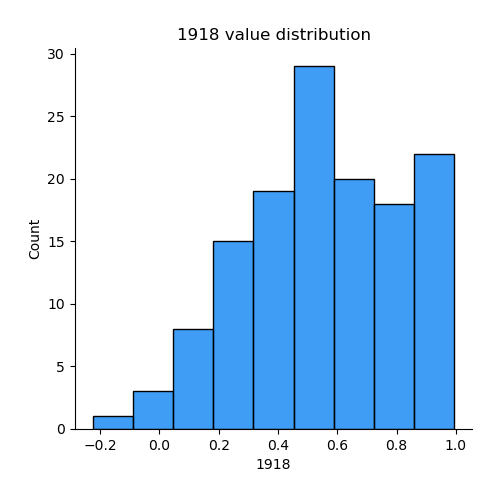
## Feature : 1919
- **Feature type** : continous
- **Missing** : 0.0%
- **Unique** : 135
- **Count** :135.0
- **Mean** :0.7224006532069673
- **Std** :0.19231794641695818
- **Min** :0.08064930587502987
- **25%th Percentile** : 0.6306711444484532
- **50%th Percentile** : 0.7491084484284717
- **75%th Percentile** : 0.8557513784506907
- **Max** :0.9943291773760781

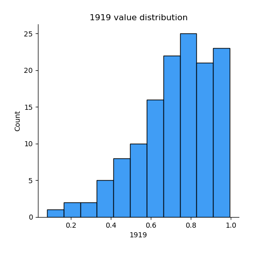
## Feature : 1920
- **Feature type** : continous
- **Missing** : 0.0%
- **Unique** : 135
- **Count** :135.0
- **Mean** :0.6316436703503315
- **Std** :0.20956101663485002
- **Min** :0.0629180767755396
- **25%th Percentile** : 0.49703118600359175
- **50%th Percentile** : 0.6026501938559227
- **75%th Percentile** : 0.7727643351322941
- **Max** :0.9919213147209589

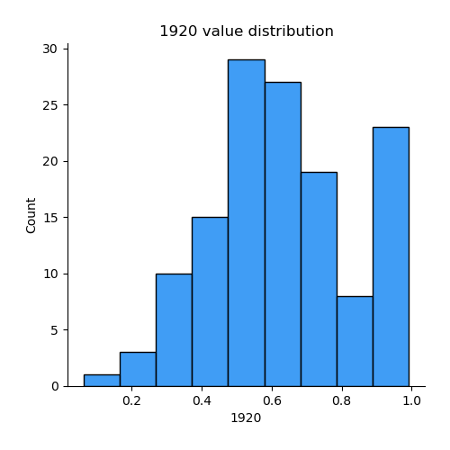
## Feature : 1921
- **Feature type** : continous
- **Missing** : 0.0%
- **Unique** : 135
- **Count** :135.0
- **Mean** :0.636826479839285
- **Std** :0.21311510476151582
- **Min** :0.065781563738752
- **25%th Percentile** : 0.4968369183096526
- **50%th Percentile** : 0.6245420252139577
- **75%th Percentile** : 0.771166330100052
- **Max** :0.9895138852380172

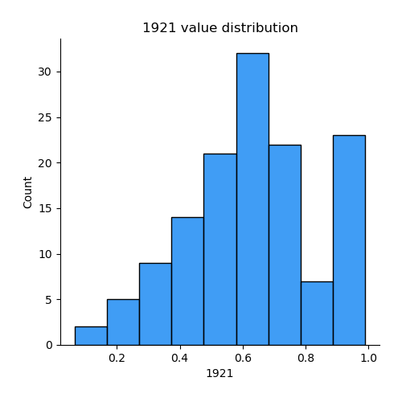
## Feature : 1922
- **Feature type** : continous
- **Missing** : 0.0%
- **Unique** : 135
- **Count** :135.0
- **Mean** :0.3996607356518302
- **Std** :0.296349342956364
- **Min** :-0.23862784160150233
- **25%th Percentile** : 0.16826530555082614
- **50%th Percentile** : 0.38770024898350597
- **75%th Percentile** : 0.538952729082563
- **Max** :0.981067183997349

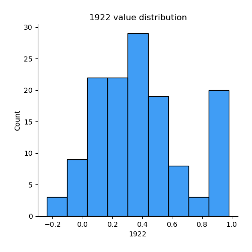
## Feature : 1923
- **Feature type** : continous
- **Missing** : 0.0%
- **Unique** : 135
- **Count** :135.0
- **Mean** :0.5408065669923577
- **Std** :0.24886389911770426
- **Min** :-0.0629119054050122
- **25%th Percentile** : 0.3575502957798755
- **50%th Percentile** : 0.517041436628242
- **75%th Percentile** : 0.6994085687020528
- **Max** :0.9817271505109844

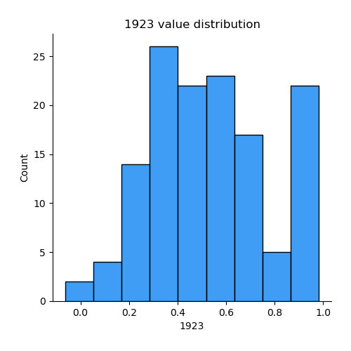
## Feature : 1961
- **Feature type** : continous
- **Missing** : 0.0%
- **Unique** : 3
- **Count** :135.0
- **Mean** :1.0
- **Std** :8.30593374168936e-17
- **Min** :0.9999999999999998
- **25%th Percentile** : 1.0
- **50%th Percentile** : 1.0
- **75%th Percentile** : 1.0
- **Max** :1.0

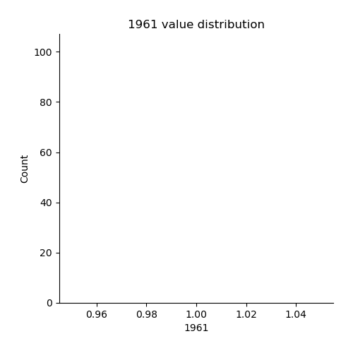
## Feature : 1962
- **Feature type** : continous
- **Missing** : 0.0%
- **Unique** : 135
- **Count** :135.0
- **Mean** :0.48688941886321085
- **Std** :0.321667709783513
- **Min** :-0.39747086357057165
- **25%th Percentile** : 0.29838574221660763
- **50%th Percentile** : 0.49041360495405467
- **75%th Percentile** : 0.6727072826796361
- **Max** :0.9933234808348148

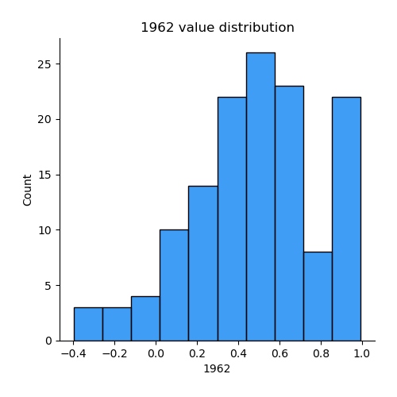
## Feature : 1963
- **Feature type** : continous
- **Missing** : 0.0%
- **Unique** : 135
- **Count** :135.0
- **Mean** :0.6395542994119229
- **Std** :0.20886249932722922
- **Min** :0.07384445595957516
- **25%th Percentile** : 0.48042455470135825
- **50%th Percentile** : 0.6081396659552998
- **75%th Percentile** : 0.7787341617215544
- **Max** :0.9947988617986859

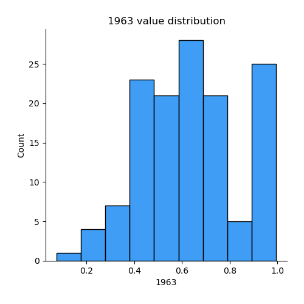
## Feature : 1964
- **Feature type** : continous
- **Missing** : 0.0%
- **Unique** : 135
- **Count** :135.0
- **Mean** :0.5467338643184706
- **Std** :0.2526680538616976
- **Min** :-0.09230806858081017
- **25%th Percentile** : 0.3908521565806773
- **50%th Percentile** : 0.5583311884141795
- **75%th Percentile** : 0.684602657778761
- **Max** :0.9855781667166987

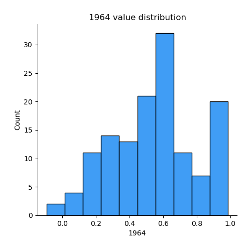
## Feature : 1965
- **Feature type** : continous
- **Missing** : 0.0%
- **Unique** : 135
- **Count** :135.0
- **Mean** :0.5504227817568333
- **Std** :0.3009849408623073
- **Min** :-0.334017051957001
- **25%th Percentile** : 0.3779744736361036
- **50%th Percentile** : 0.580776580260405
- **75%th Percentile** : 0.7170696634919628
- **Max** :0.9934550761074195

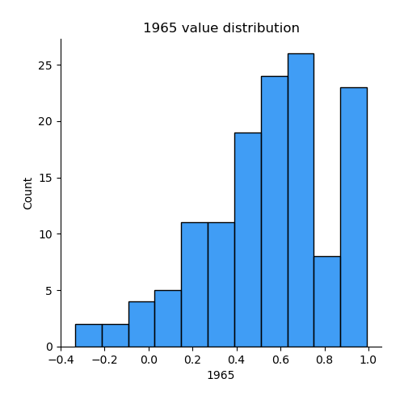
## Feature : 1966
- **Feature type** : continous
- **Missing** : 0.0%
- **Unique** : 135
- **Count** :135.0
- **Mean** :0.6030609453416886
- **Std** :0.24467279224281369
- **Min** :-0.05605042216330982
- **25%th Percentile** : 0.437636442675881
- **50%th Percentile** : 0.603441443688421
- **75%th Percentile** : 0.7504691018716827
- **Max** :0.9933167742626542

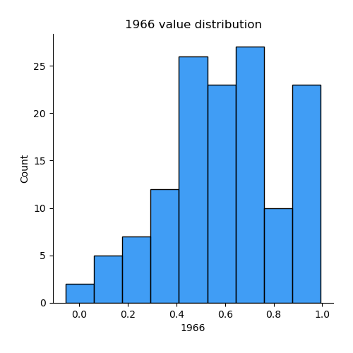
## Feature : 1967
- **Feature type** : continous
- **Missing** : 0.0%
- **Unique** : 135
- **Count** :135.0
- **Mean** :0.5538936217753448
- **Std** :0.30465006993338434
- **Min** :-0.2536440219760508
- **25%th Percentile** : 0.3455401197407579
- **50%th Percentile** : 0.592011239344623
- **75%th Percentile** : 0.7238025826765457
- **Max** :0.9946876761578297

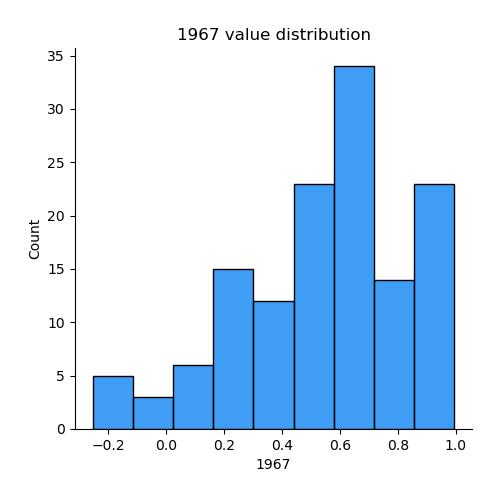
## Feature : 1968
- **Feature type** : continous
- **Missing** : 0.0%
- **Unique** : 135
- **Count** :135.0
- **Mean** :0.6671651559702224
- **Std** :0.2216915713723422
- **Min** :-0.001693495109517819
- **25%th Percentile** : 0.5471135004466354
- **50%th Percentile** : 0.6831599048123473
- **75%th Percentile** : 0.8077749641041793
- **Max** :0.9927155569754496

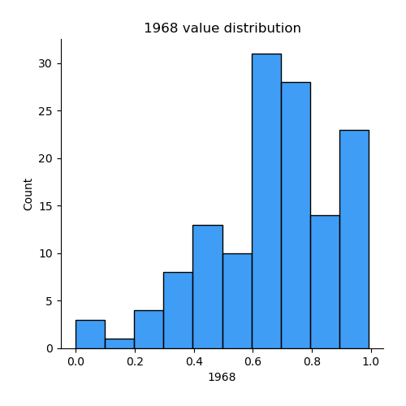
## Feature : 1969
- **Feature type** : continous
- **Missing** : 0.0%
- **Unique** : 135
- **Count** :135.0
- **Mean** :0.5199521892213294
- **Std** :0.25794752179802644
- **Min** :0.018664320719768004
- **25%th Percentile** : 0.33439867701232323
- **50%th Percentile** : 0.5051746282038707
- **75%th Percentile** : 0.6530806866534431
- **Max** :0.9895806162706948

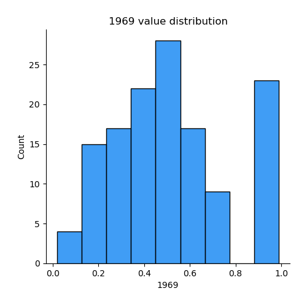
## Feature : 1970
- **Feature type** : continous
- **Missing** : 0.0%
- **Unique** : 135
- **Count** :135.0
- **Mean** :0.6243700669467233
- **Std** :0.2622956690824494
- **Min** :-0.30323925160861587
- **25%th Percentile** : 0.4673491835173734
- **50%th Percentile** : 0.6513285045079561
- **75%th Percentile** : 0.8075448857110941
- **Max** :0.9957364817161322

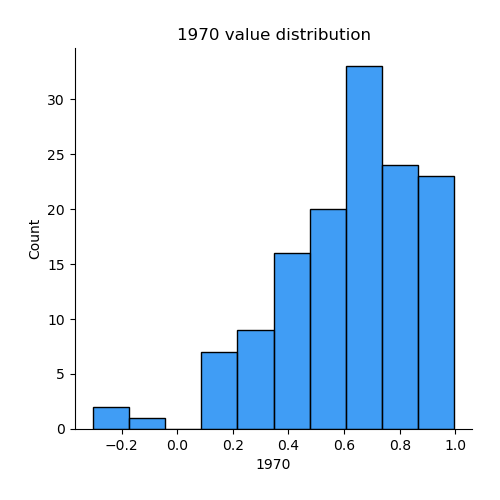
## Feature : 1971
- **Feature type** : continous
- **Missing** : 0.0%
- **Unique** : 135
- **Count** :135.0
- **Mean** :0.5860189403801642
- **Std** :0.2724054163183934
- **Min** :-0.19678337860403816
- **25%th Percentile** : 0.40204597615365845
- **50%th Percentile** : 0.5949908956206452
- **75%th Percentile** : 0.7786010175596372
- **Max** :0.9934044052132586

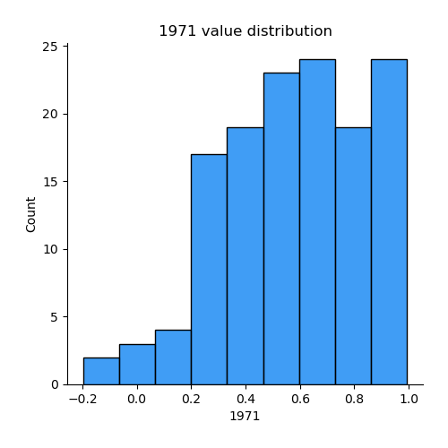
## Feature : 1972
- **Feature type** : continous
- **Missing** : 0.0%
- **Unique** : 135
- **Count** :135.0
- **Mean** :0.7858605576157149
- **Std** :0.14648839274799255
- **Min** :0.29575954575160907
- **25%th Percentile** : 0.7076528010617686
- **50%th Percentile** : 0.7963880437180034
- **75%th Percentile** : 0.8774587451738471
- **Max** :0.995833882045399

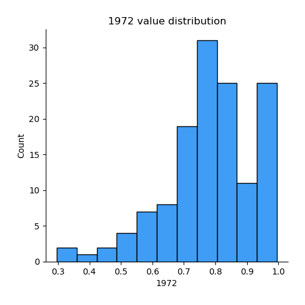
## Feature : 1973
- **Feature type** : continous
- **Missing** : 0.0%
- **Unique** : 135
- **Count** :135.0
- **Mean** :0.6154517517357393
- **Std** :0.27135483808655897
- **Min** :-0.07785237874760174
- **25%th Percentile** : 0.4511515560687043
- **50%th Percentile** : 0.6590187623618668
- **75%th Percentile** : 0.7952842320582063
- **Max** :0.9944374010399412

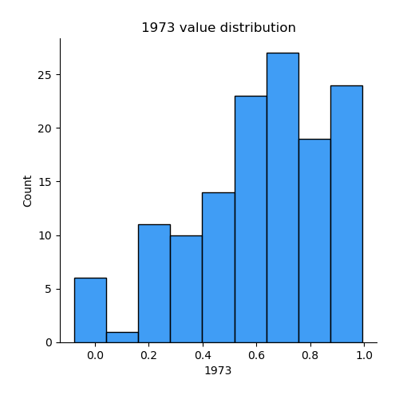
## Feature : 1974
- **Feature type** : continous
- **Missing** : 0.0%
- **Unique** : 135
- **Count** :135.0
- **Mean** :0.5251217110886309
- **Std** :0.25309680368994164
- **Min** :-0.10074132210705034
- **25%th Percentile** : 0.33883162279909784
- **50%th Percentile** : 0.5286766158868519
- **75%th Percentile** : 0.6758560090671126
- **Max** :0.9882331927944543

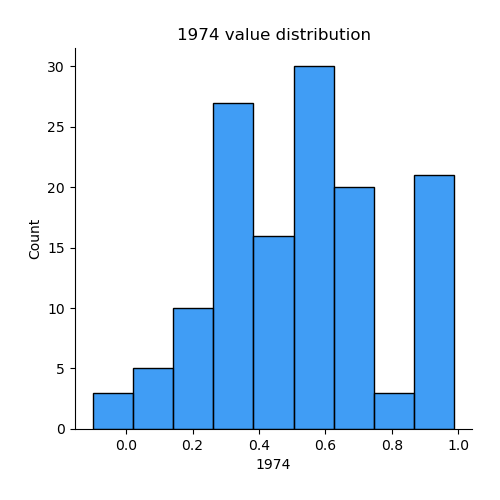
## Feature : 1975
- **Feature type** : continous
- **Missing** : 0.0%
- **Unique** : 135
- **Count** :135.0
- **Mean** :0.6016289226881225
- **Std** :0.2320460210270629
- **Min** :-0.06444189477127199
- **25%th Percentile** : 0.4579912807307651
- **50%th Percentile** : 0.6139792900066177
- **75%th Percentile** : 0.7117795346774225
- **Max** :0.9914595660319806

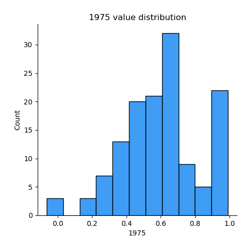
## Feature : 2014
- **Feature type** : continous
- **Missing** : 0.0%
- **Unique** : 3
- **Count** :135.0
- **Mean** :1.0
- **Std** :7.551855568819006e-17
- **Min** :0.9999999999999998
- **25%th Percentile** : 1.0
- **50%th Percentile** : 1.0
- **75%th Percentile** : 1.0
- **Max** :1.0

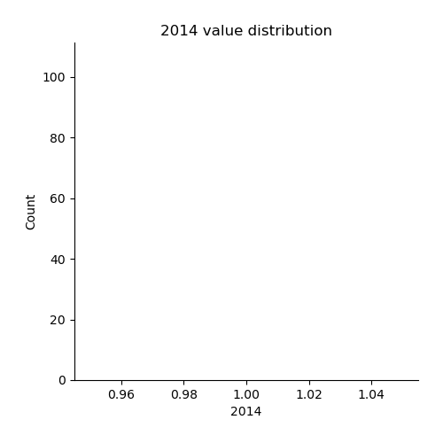
## Feature : 2015
- **Feature type** : continous
- **Missing** : 0.0%
- **Unique** : 135
- **Count** :135.0
- **Mean** :0.44249837302317024
- **Std** :0.31836094700553325
- **Min** :-0.4232714079202545
- **25%th Percentile** : 0.23975420104863385
- **50%th Percentile** : 0.4107991044211395
- **75%th Percentile** : 0.6156877539148604
- **Max** :0.9913103411130211

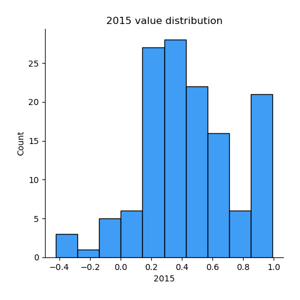
## Feature : 2016
- **Feature type** : continous
- **Missing** : 0.0%
- **Unique** : 135
- **Count** :135.0
- **Mean** :0.47730669632692485
- **Std** :0.30711283763420394
- **Min** :-0.48580613667870304
- **25%th Percentile** : 0.2511990558608722
- **50%th Percentile** : 0.4840461108500205
- **75%th Percentile** : 0.6767930805243179
- **Max** :0.9877643676216815

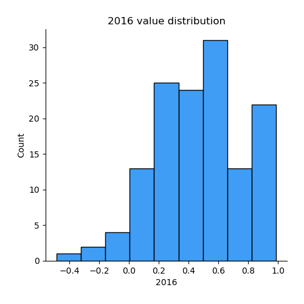
## Feature : 2017
- **Feature type** : continous
- **Missing** : 0.0%
- **Unique** : 135
- **Count** :135.0
- **Mean** :0.846471687387174
- **Std** :0.10803391958945698
- **Min** :0.5333280709108301
- **25%th Percentile** : 0.7781446646914087
- **50%th Percentile** : 0.8486173916228494
- **75%th Percentile** : 0.926883966038508
- **Max** :0.9977412866696246

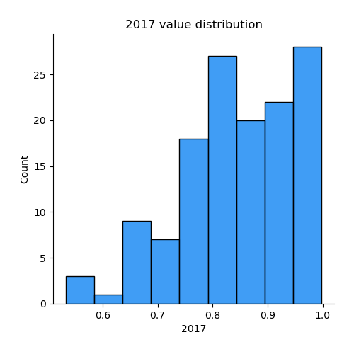
## Feature : 2018
- **Feature type** : continous
- **Missing** : 0.0%
- **Unique** : 135
- **Count** :135.0
- **Mean** :0.7026225741651213
- **Std** :0.19130765284944604
- **Min** :0.050524330464922676
- **25%th Percentile** : 0.5704996596932486
- **50%th Percentile** : 0.7162016174060176
- **75%th Percentile** : 0.8235446641502796
- **Max** :0.9943120384513968

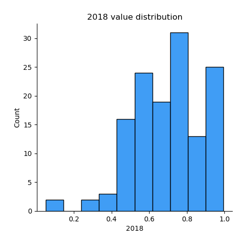
## Feature : 2019
- **Feature type** : continous
- **Missing** : 0.0%
- **Unique** : 135
- **Count** :135.0
- **Mean** :0.8452653342294731
- **Std** :0.12553413873356203
- **Min** :0.31879062082754733
- **25%th Percentile** : 0.7849233489538243
- **50%th Percentile** : 0.8664431140228597
- **75%th Percentile** : 0.9296489041542075
- **Max** :0.9976266045228762

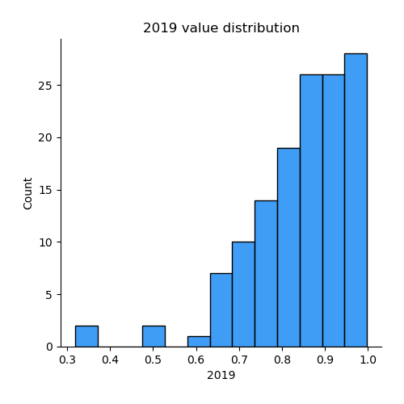
## Feature : 2020
- **Feature type** : continous
- **Missing** : 0.0%
- **Unique** : 135
- **Count** :135.0
- **Mean** :0.6999105374771737
- **Std** :0.18718979291513063
- **Min** :0.0940691570685642
- **25%th Percentile** : 0.5838711361980619
- **50%th Percentile** : 0.7082259251898365
- **75%th Percentile** : 0.8149545503144922
- **Max** :0.9928294793938044

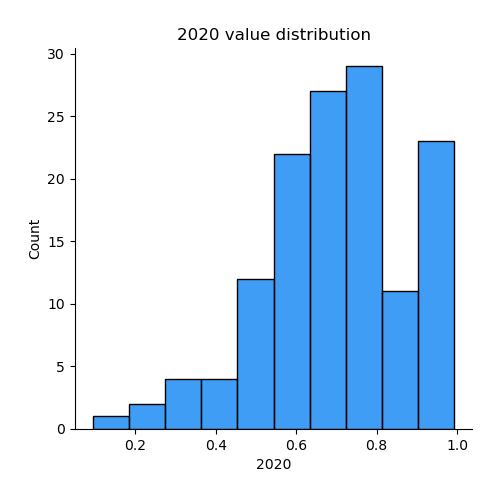
## Feature : 2021
- **Feature type** : continous
- **Missing** : 0.0%
- **Unique** : 135
- **Count** :135.0
- **Mean** :0.4384429245624148
- **Std** :0.315688825690096
- **Min** :-0.16540120421530016
- **25%th Percentile** : 0.20592588973069842
- **50%th Percentile** : 0.4141542917838463
- **75%th Percentile** : 0.6002708242737542
- **Max** :0.9896273554682568

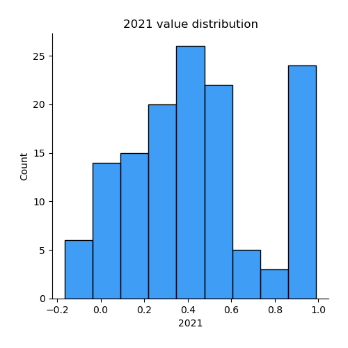
## Feature : 2022
- **Feature type** : continous
- **Missing** : 0.0%
- **Unique** : 135
- **Count** :135.0
- **Mean** :0.6923067407545421
- **Std** :0.20479757428904777
- **Min** :0.05039754318085955
- **25%th Percentile** : 0.5855783549316063
- **50%th Percentile** : 0.6980612904482149
- **75%th Percentile** : 0.8301905798977928
- **Max** :0.9957607344890514

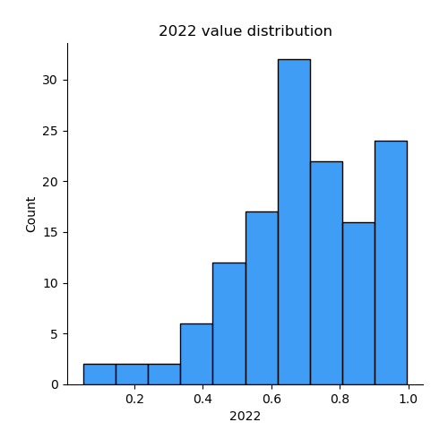
## Feature : 2023
- **Feature type** : continous
- **Missing** : 0.0%
- **Unique** : 135
- **Count** :135.0
- **Mean** :0.7610270960608855
- **Std** :0.15666671066952628
- **Min** :0.3424041237088261
- **25%th Percentile** : 0.6581312628366933
- **50%th Percentile** : 0.7711722068023393
- **75%th Percentile** : 0.862014601798752
- **Max** :0.9961217616322597

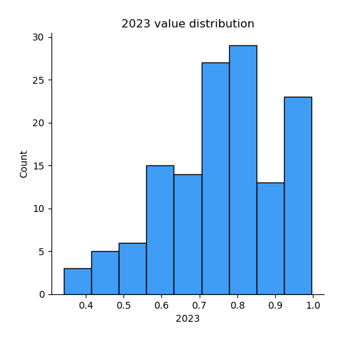
## Feature : 2024
- **Feature type** : continous
- **Missing** : 0.0%
- **Unique** : 135
- **Count** :135.0
- **Mean** :0.559707141812811
- **Std** :0.2968579331442356
- **Min** :-0.4082313442623341
- **25%th Percentile** : 0.3318305161009415
- **50%th Percentile** : 0.5658259052231968
- **75%th Percentile** : 0.7942453253392626
- **Max** :0.9953541682423227

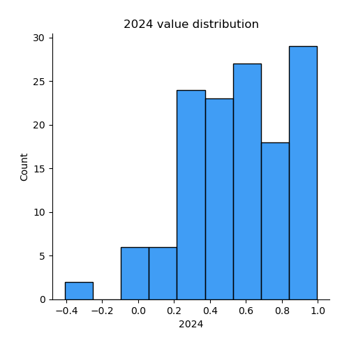
## Feature : 2025
- **Feature type** : continous
- **Missing** : 0.0%
- **Unique** : 135
- **Count** :135.0
- **Mean** :0.7235106902118494
- **Std** :0.16860029469423296
- **Min** :0.355919479439983
- **25%th Percentile** : 0.6064787761982338
- **50%th Percentile** : 0.7134999478335801
- **75%th Percentile** : 0.8301432648051924
- **Max** :0.9956611920061916

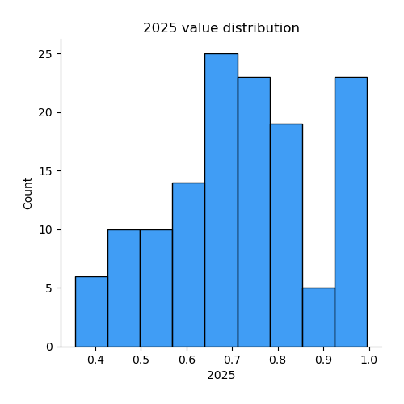
## Feature : 2026
- **Feature type** : continous
- **Missing** : 0.0%
- **Unique** : 135
- **Count** :135.0
- **Mean** :0.3233988658428011
- **Std** :0.34148941410671385
- **Min** :-0.675924672886914
- **25%th Percentile** : 0.12005444857717769
- **50%th Percentile** : 0.26598521868335995
- **75%th Percentile** : 0.4784541227160185
- **Max** :0.9772731383848495

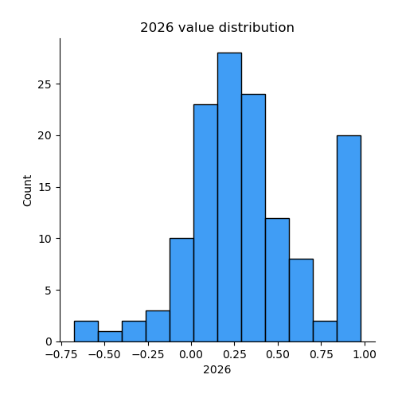
## Feature : 2027
- **Feature type** : continous
- **Missing** : 0.0%
- **Unique** : 135
- **Count** :135.0
- **Mean** :0.4601373357301939
- **Std** :0.31211097737703647
- **Min** :-0.5228356001190755
- **25%th Percentile** : 0.2306821966860888
- **50%th Percentile** : 0.4420027853571409
- **75%th Percentile** : 0.6627489108994201
- **Max** :0.9904594276023174

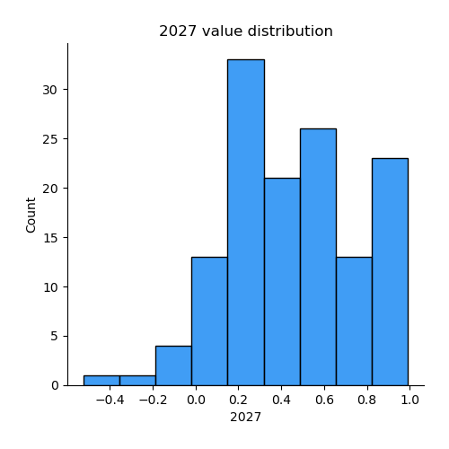
## Feature : 2067
- **Feature type** : continous
- **Missing** : 0.0%
- **Unique** : 3
- **Count** :135.0
- **Mean** :1.0
- **Std** :7.177147045072709e-17
- **Min** :0.9999999999999998
- **25%th Percentile** : 1.0
- **50%th Percentile** : 1.0
- **75%th Percentile** : 1.0
- **Max** :1.0

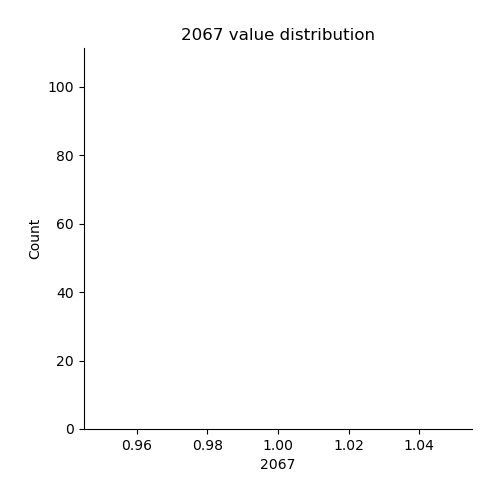
## Feature : 2068
- **Feature type** : continous
- **Missing** : 0.0%
- **Unique** : 135
- **Count** :135.0
- **Mean** :0.5782959452086934
- **Std** :0.22963407959667906
- **Min** :-0.02248697525780276
- **25%th Percentile** : 0.41635151329171693
- **50%th Percentile** : 0.56270588738673
- **75%th Percentile** : 0.7211559869551242
- **Max** :0.986730758863304

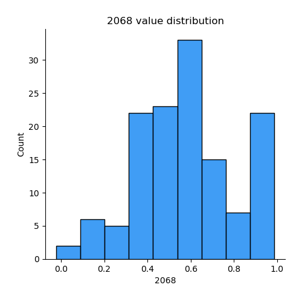
## Feature : 2069
- **Feature type** : continous
- **Missing** : 0.0%
- **Unique** : 135
- **Count** :135.0
- **Mean** :0.4808146967749224
- **Std** :0.2918297681528944
- **Min** :-0.2100747572651357
- **25%th Percentile** : 0.2746985116867489
- **50%th Percentile** : 0.4619775053126066
- **75%th Percentile** : 0.6455909331480743
- **Max** :0.9904544385403198

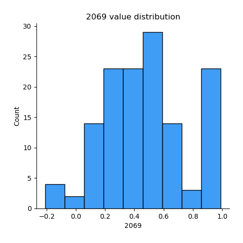
## Feature : 2070
- **Feature type** : continous
- **Missing** : 0.0%
- **Unique** : 135
- **Count** :135.0
- **Mean** :0.51084370446618
- **Std** :0.27765758429217136
- **Min** :-0.11737697447606951
- **25%th Percentile** : 0.30297171453631555
- **50%th Percentile** : 0.4899146886949349
- **75%th Percentile** : 0.6863571171503775
- **Max** :0.9885061563696964

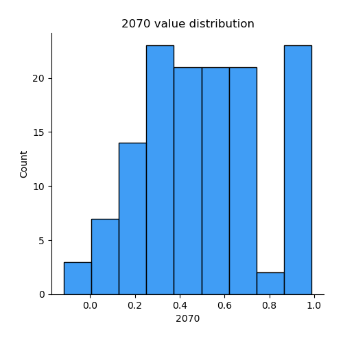
## Feature : 2071
- **Feature type** : continous
- **Missing** : 0.0%
- **Unique** : 135
- **Count** :135.0
- **Mean** :0.4967523452568674
- **Std** :0.2906693362435052
- **Min** :-0.2396424258880484
- **25%th Percentile** : 0.30707847640279495
- **50%th Percentile** : 0.49203187927916514
- **75%th Percentile** : 0.6499510160493077
- **Max** :0.9922908940265769

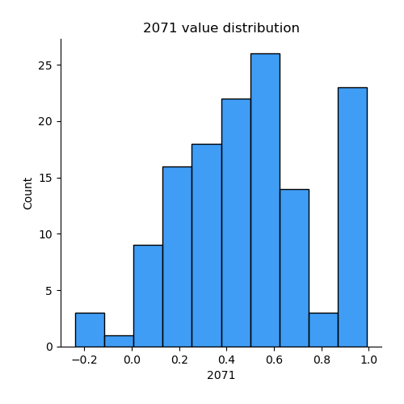
## Feature : 2072
- **Feature type** : continous
- **Missing** : 0.0%
- **Unique** : 135
- **Count** :135.0
- **Mean** :0.6069111623831888
- **Std** :0.24889422298261293
- **Min** :-0.12795907262189718
- **25%th Percentile** : 0.44687501730668855
- **50%th Percentile** : 0.6006582033866263
- **75%th Percentile** : 0.7706318549686222
- **Max** :0.9906035544140227

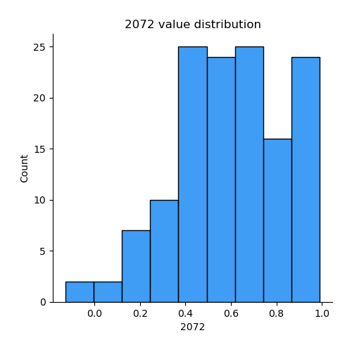
## Feature : 2073
- **Feature type** : continous
- **Missing** : 0.0%
- **Unique** : 135
- **Count** :135.0
- **Mean** :0.4060082034994708
- **Std** :0.3002440637058569
- **Min** :-0.15101965699403785
- **25%th Percentile** : 0.20352201546272575
- **50%th Percentile** : 0.33484962817123126
- **75%th Percentile** : 0.5645786465338922
- **Max** :0.984474220879963

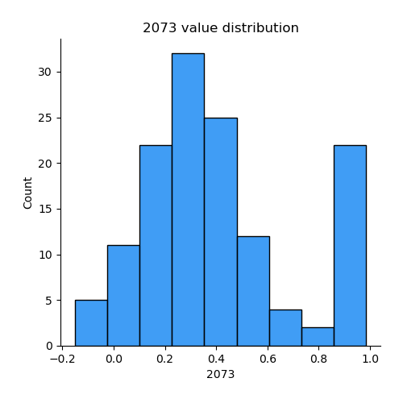
## Feature : 2074
- **Feature type** : continous
- **Missing** : 0.0%
- **Unique** : 135
- **Count** :135.0
- **Mean** :0.48860676294833194
- **Std** :0.3010966424300096
- **Min** :-0.4245009477631392
- **25%th Percentile** : 0.29534934930689
- **50%th Percentile** : 0.4623453923281187
- **75%th Percentile** : 0.6689090208116032
- **Max** :0.9917003437770119

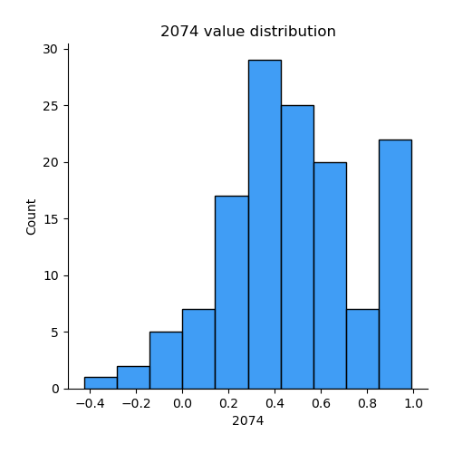
## Feature : 2075
- **Feature type** : continous
- **Missing** : 0.0%
- **Unique** : 135
- **Count** :135.0
- **Mean** :0.5593445032798376
- **Std** :0.26038363155811267
- **Min** :-0.0993376511791409
- **25%th Percentile** : 0.3761262299956945
- **50%th Percentile** : 0.5444081181804339
- **75%th Percentile** : 0.7274809803647677
- **Max** :0.9903497027746044

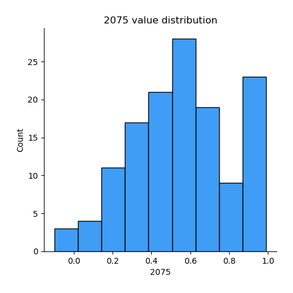
## Feature : 2076
- **Feature type** : continous
- **Missing** : 0.0%
- **Unique** : 135
- **Count** :135.0
- **Mean** :0.6040840364588524
- **Std** :0.2315099102599959
- **Min** :0.07832274738655129
- **25%th Percentile** : 0.4704183514490551
- **50%th Percentile** : 0.5936002633029142
- **75%th Percentile** : 0.7346821077868844
- **Max** :0.9923338554438006

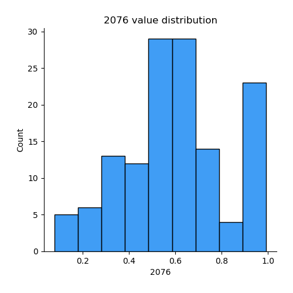
## Feature : 2077
- **Feature type** : continous
- **Missing** : 0.0%
- **Unique** : 135
- **Count** :135.0
- **Mean** :0.5172847643672361
- **Std** :0.278429747695909
- **Min** :-0.19906218909258847
- **25%th Percentile** : 0.3145815085923418
- **50%th Percentile** : 0.4886461415697375
- **75%th Percentile** : 0.6893164634826059
- **Max** :0.9907673366385169

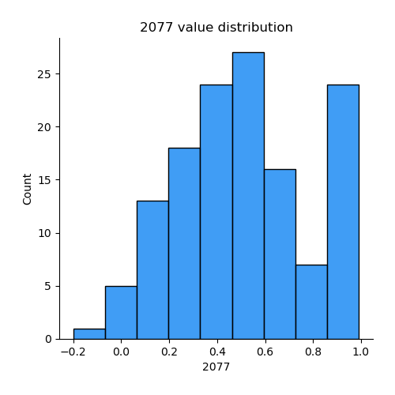
## Feature : 2078
- **Feature type** : continous
- **Missing** : 0.0%
- **Unique** : 135
- **Count** :135.0
- **Mean** :0.47386186565008603
- **Std** :0.27906040953157335
- **Min** :-0.18600387982697975
- **25%th Percentile** : 0.26377961422166096
- **50%th Percentile** : 0.44034772333670075
- **75%th Percentile** : 0.6504097858433252
- **Max** :0.9849388081559686

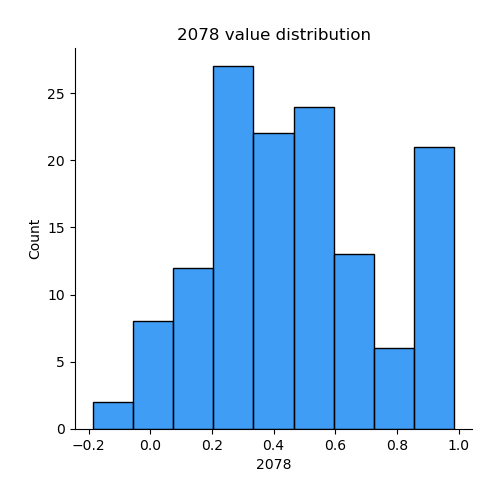
## Feature : 2079
- **Feature type** : continous
- **Missing** : 0.0%
- **Unique** : 135
- **Count** :135.0
- **Mean** :0.5135894609766684
- **Std** :0.2632082371823063
- **Min** :-0.035492797254527524
- **25%th Percentile** : 0.33304215443831164
- **50%th Percentile** : 0.47207953505844075
- **75%th Percentile** : 0.670826838150683
- **Max** :0.9862213235327746

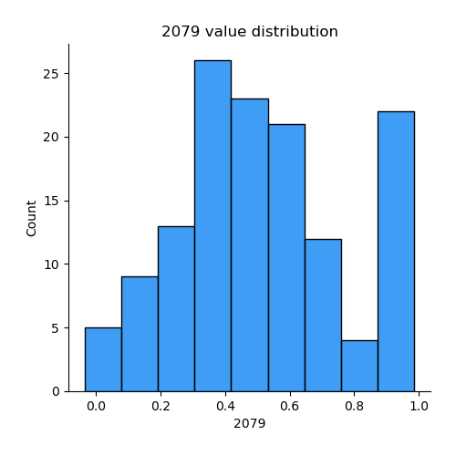
## Feature : 2120
- **Feature type** : continous
- **Missing** : 0.0%
- **Unique** : 3
- **Count** :135.0
- **Mean** :1.0
- **Std** :8.842341697622394e-17
- **Min** :0.9999999999999998
- **25%th Percentile** : 1.0
- **50%th Percentile** : 1.0
- **75%th Percentile** : 1.0
- **Max** :1.0

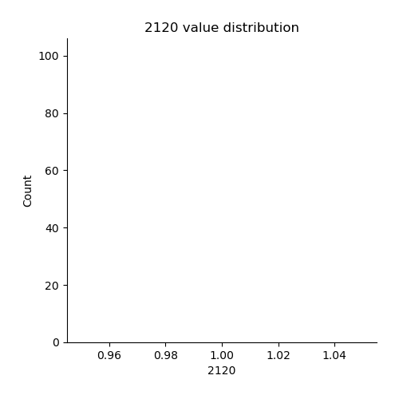
## Feature : 2121
- **Feature type** : continous
- **Missing** : 0.0%
- **Unique** : 135
- **Count** :135.0
- **Mean** :0.4879718591040734
- **Std** :0.3097096735193472
- **Min** :-0.45933217311784
- **25%th Percentile** : 0.27631267741226717
- **50%th Percentile** : 0.5045915101882703
- **75%th Percentile** : 0.6968094893722184
- **Max** :0.9856363849920463

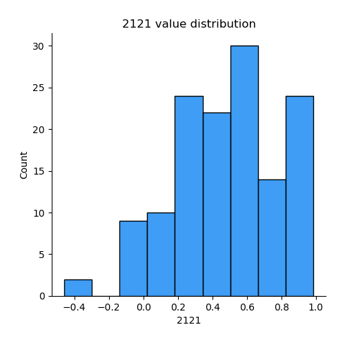
## Feature : 2122
- **Feature type** : continous
- **Missing** : 0.0%
- **Unique** : 135
- **Count** :135.0
- **Mean** :0.595785424362047
- **Std** :0.22241003373570686
- **Min** :0.034897517034594795
- **25%th Percentile** : 0.4450021998653967
- **50%th Percentile** : 0.5753209531186745
- **75%th Percentile** : 0.7436466828910557
- **Max** :0.9937267872523436

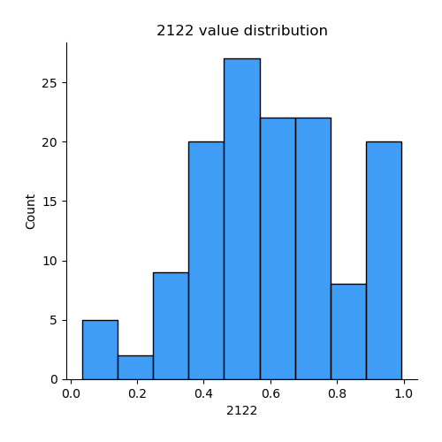
## Feature : 2123
- **Feature type** : continous
- **Missing** : 0.0%
- **Unique** : 135
- **Count** :135.0
- **Mean** :0.5200992120755813
- **Std** :0.28842937198478313
- **Min** :-0.3877972029382147
- **25%th Percentile** : 0.320664535600494
- **50%th Percentile** : 0.5242261915707602
- **75%th Percentile** : 0.7300942696598235
- **Max** :0.9881685059346552

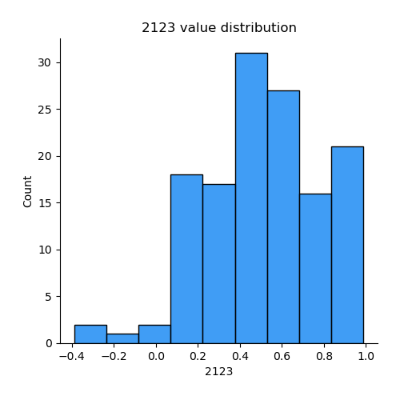
## Feature : 2124
- **Feature type** : continous
- **Missing** : 0.0%
- **Unique** : 135
- **Count** :135.0
- **Mean** :0.7002629159695506
- **Std** :0.1764986280402623
- **Min** :0.060233559866694944
- **25%th Percentile** : 0.5825692969691205
- **50%th Percentile** : 0.720153927769761
- **75%th Percentile** : 0.7973398709043575
- **Max** :0.9906297327139518

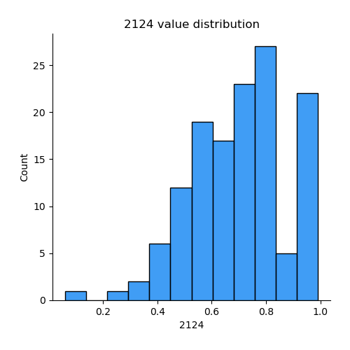
## Feature : 2125
- **Feature type** : continous
- **Missing** : 0.0%
- **Unique** : 135
- **Count** :135.0
- **Mean** :0.38243345917128185
- **Std** :0.2985284945973171
- **Min** :-0.2638569757925154
- **25%th Percentile** : 0.18222933920063553
- **50%th Percentile** : 0.3371252912842123
- **75%th Percentile** : 0.503102390424411
- **Max** :0.9760997380976842

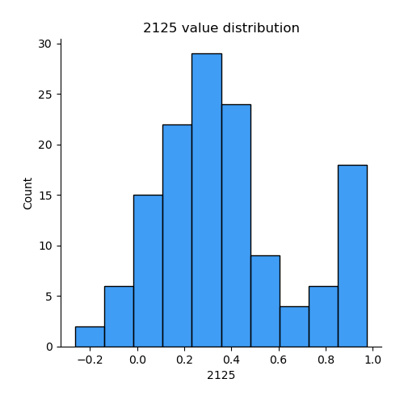
## Feature : 2126
- **Feature type** : continous
- **Missing** : 0.0%
- **Unique** : 135
- **Count** :135.0
- **Mean** :0.5200974473320646
- **Std** :0.2738453301261193
- **Min** :-0.23197209090975218
- **25%th Percentile** : 0.35620035187610716
- **50%th Percentile** : 0.5237328880322644
- **75%th Percentile** : 0.6970318372837772
- **Max** :0.9902675524449445

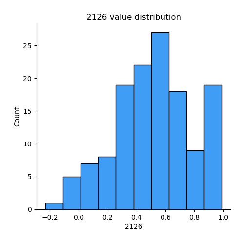
## Feature : 2127
- **Feature type** : continous
- **Missing** : 0.0%
- **Unique** : 135
- **Count** :135.0
- **Mean** :0.6459477341598957
- **Std** :0.22173827703308024
- **Min** :-0.3204509349898221
- **25%th Percentile** : 0.522597059888978
- **50%th Percentile** : 0.6571155953529797
- **75%th Percentile** : 0.7994873867267743
- **Max** :0.9884513167575807

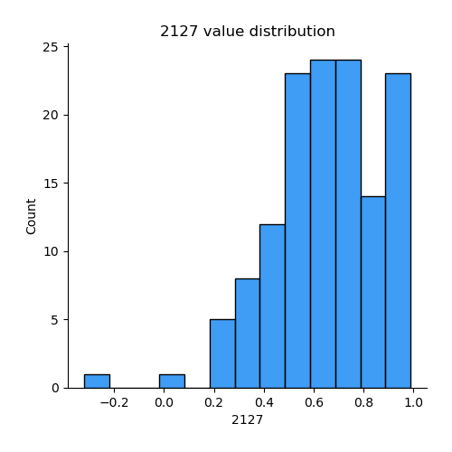
## Feature : 2128
- **Feature type** : continous
- **Missing** : 0.0%
- **Unique** : 135
- **Count** :135.0
- **Mean** :0.5640428715860855
- **Std** :0.2391266556985089
- **Min** :0.04531759562203828
- **25%th Percentile** : 0.39309638227909505
- **50%th Percentile** : 0.5566920582495958
- **75%th Percentile** : 0.7307376743378926
- **Max** :0.9838447186763241

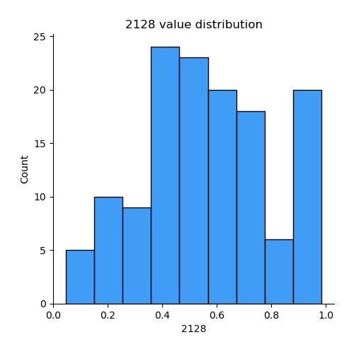
## Feature : 2129
- **Feature type** : continous
- **Missing** : 0.0%
- **Unique** : 135
- **Count** :135.0
- **Mean** :0.5962086187346701
- **Std** :0.22691395922884777
- **Min** :-0.215084642631036
- **25%th Percentile** : 0.4620421143227993
- **50%th Percentile** : 0.57421171327001
- **75%th Percentile** : 0.7362143208135659
- **Max** :0.9846233643562521

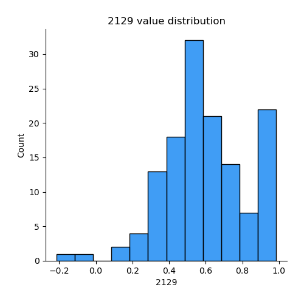
## Feature : 2130
- **Feature type** : continous
- **Missing** : 0.0%
- **Unique** : 135
- **Count** :135.0
- **Mean** :0.353407363894165
- **Std** :0.3119618085020553
- **Min** :-0.35403792961203356
- **25%th Percentile** : 0.15891210980788245
- **50%th Percentile** : 0.295509794875084
- **75%th Percentile** : 0.539218266383793
- **Max** :0.9653871488416964

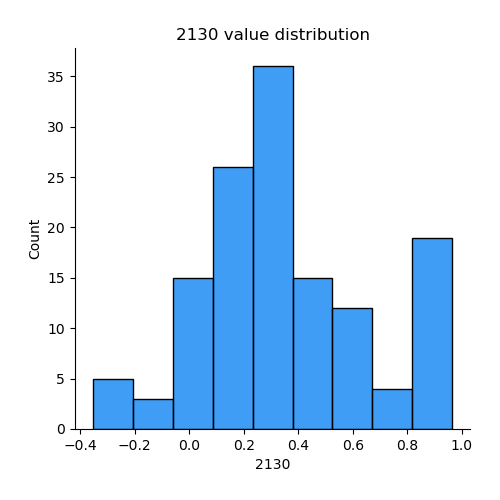
## Feature : 2131
- **Feature type** : continous
- **Missing** : 0.0%
- **Unique** : 135
- **Count** :135.0
- **Mean** :0.5253895966396663
- **Std** :0.25247920001127827
- **Min** :-0.08623825099300927
- **25%th Percentile** : 0.35246823662925075
- **50%th Percentile** : 0.5117680451665264
- **75%th Percentile** : 0.6886110658183766
- **Max** :0.976970413160464

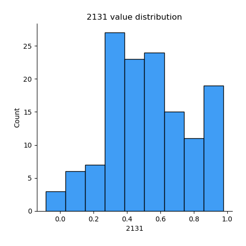
## Feature : 2173
- **Feature type** : continous
- **Missing** : 0.0%
- **Unique** : 3
- **Count** :135.0
- **Mean** :1.0
- **Std** :8.30593374168936e-17
- **Min** :0.9999999999999998
- **25%th Percentile** : 0.9999999999999999
- **50%th Percentile** : 1.0
- **75%th Percentile** : 1.0
- **Max** :1.0

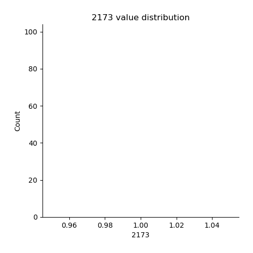
## Feature : 2174
- **Feature type** : continous
- **Missing** : 0.0%
- **Unique** : 135
- **Count** :135.0
- **Mean** :0.6843115829059379
- **Std** :0.21010943483874456
- **Min** :0.16804563342138634
- **25%th Percentile** : 0.5414359379824843
- **50%th Percentile** : 0.6926687470104929
- **75%th Percentile** : 0.8395085668190739
- **Max** :0.9929617320663572

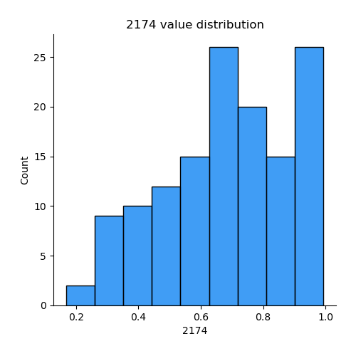
## Feature : 2175
- **Feature type** : continous
- **Missing** : 0.0%
- **Unique** : 135
- **Count** :135.0
- **Mean** :0.9329069101944054
- **Std** :0.05943086102627492
- **Min** :0.5738820341018337
- **25%th Percentile** : 0.9069621341101206
- **50%th Percentile** : 0.944261686640716
- **75%th Percentile** : 0.9730115774365109
- **Max** :0.9989189472311846

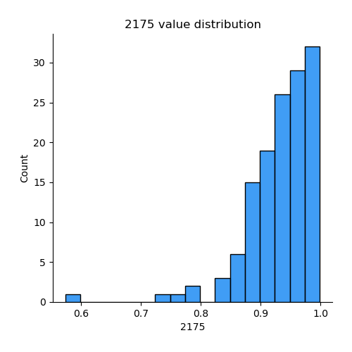
## Feature : 2176
- **Feature type** : continous
- **Missing** : 0.0%
- **Unique** : 135
- **Count** :135.0
- **Mean** :0.6945698665093748
- **Std** :0.19921677083989095
- **Min** :0.1295997047112632
- **25%th Percentile** : 0.5618464236767462
- **50%th Percentile** : 0.7134979582962591
- **75%th Percentile** : 0.8194009493969602
- **Max** :0.9915264513644567

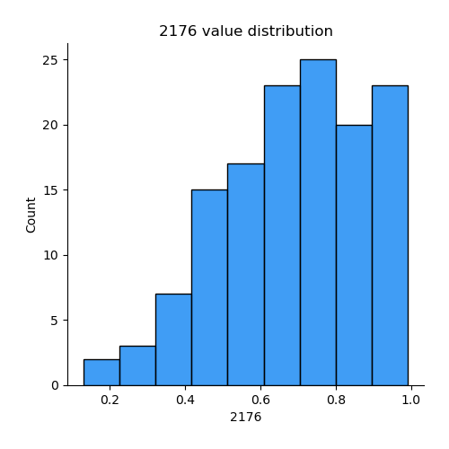
## Feature : 2177
- **Feature type** : continous
- **Missing** : 0.0%
- **Unique** : 135
- **Count** :135.0
- **Mean** :0.4881329421910065
- **Std** :0.2990253428020074
- **Min** :-0.17555716012848174
- **25%th Percentile** : 0.28468156853087334
- **50%th Percentile** : 0.48437301072077077
- **75%th Percentile** : 0.6527641317722497
- **Max** :0.9914120435997577

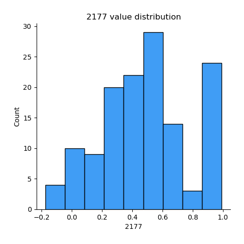
## Feature : 2178
- **Feature type** : continous
- **Missing** : 0.0%
- **Unique** : 135
- **Count** :135.0
- **Mean** :0.7003945867811858
- **Std** :0.20123529209425509
- **Min** :-0.036686771786458044
- **25%th Percentile** : 0.5997283164426244
- **50%th Percentile** : 0.7226207258359372
- **75%th Percentile** : 0.8241751222862759
- **Max** :0.9974661891400951

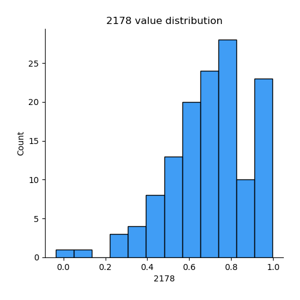
## Feature : 2179
- **Feature type** : continous
- **Missing** : 0.0%
- **Unique** : 135
- **Count** :135.0
- **Mean** :0.7914685893788515
- **Std** :0.14912611382179533
- **Min** :0.17736301993207146
- **25%th Percentile** : 0.6944853249355483
- **50%th Percentile** : 0.8082002113756882
- **75%th Percentile** : 0.8914066589421759
- **Max** :0.99681608834276

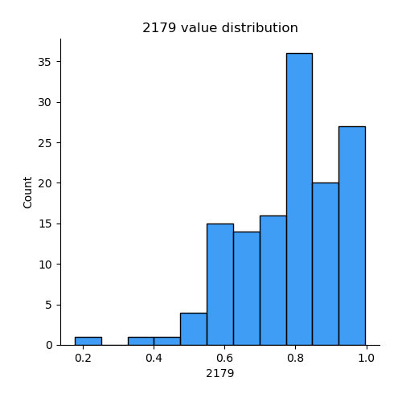
## Feature : 2180
- **Feature type** : continous
- **Missing** : 0.0%
- **Unique** : 135
- **Count** :135.0
- **Mean** :0.6530273316330925
- **Std** :0.2506446904368941
- **Min** :-0.20357303797046142
- **25%th Percentile** : 0.5094780764514553
- **50%th Percentile** : 0.6875114067341851
- **75%th Percentile** : 0.8396789264952864
- **Max** :0.995822246686268

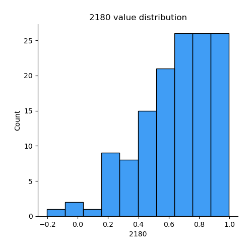
## Feature : 2181
- **Feature type** : continous
- **Missing** : 0.0%
- **Unique** : 135
- **Count** :135.0
- **Mean** :0.8004313573043694
- **Std** :0.13224239550508807
- **Min** :0.3583488598613824
- **25%th Percentile** : 0.7125659512054557
- **50%th Percentile** : 0.8127527074128095
- **75%th Percentile** : 0.892685479821662
- **Max** :0.9961521880501909

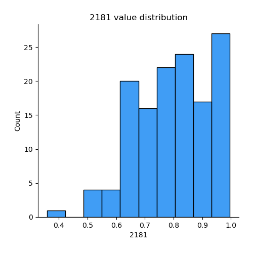
## Feature : 2182
- **Feature type** : continous
- **Missing** : 0.0%
- **Unique** : 135
- **Count** :135.0
- **Mean** :0.3506955513308187
- **Std** :0.32813559213055427
- **Min** :-0.4953799458148984
- **25%th Percentile** : 0.13155527862113625
- **50%th Percentile** : 0.2972306108978816
- **75%th Percentile** : 0.5371164096717398
- **Max** :0.9843811888348277

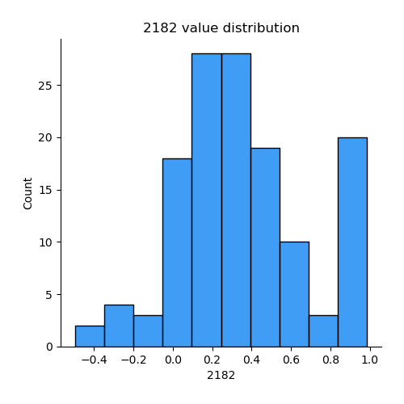
## Feature : 2183
- **Feature type** : continous
- **Missing** : 0.0%
- **Unique** : 135
- **Count** :135.0
- **Mean** :0.544659592729755
- **Std** :0.28218539785915114
- **Min** :-0.330160168448678
- **25%th Percentile** : 0.36046404449105524
- **50%th Percentile** : 0.5363669490637628
- **75%th Percentile** : 0.7251800917578836
- **Max** :0.9908308118074618

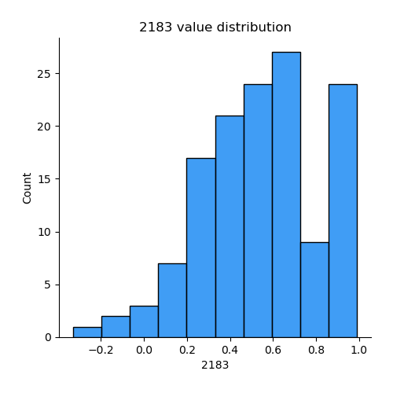
## Feature : 2226
- **Feature type** : continous
- **Missing** : 0.0%
- **Unique** : 3
- **Count** :135.0
- **Mean** :1.0
- **Std** :8.842341697622394e-17
- **Min** :0.9999999999999998
- **25%th Percentile** : 1.0
- **50%th Percentile** : 1.0
- **75%th Percentile** : 1.0
- **Max** :1.0

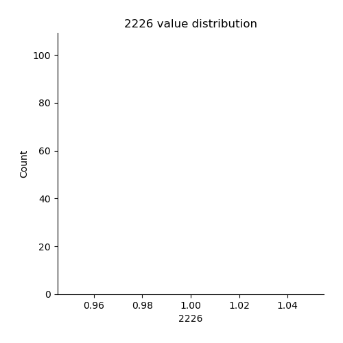
## Feature : 2227
- **Feature type** : continous
- **Missing** : 0.0%
- **Unique** : 135
- **Count** :135.0
- **Mean** :0.7240760849612876
- **Std** :0.18977715012741933
- **Min** :0.16830524331502814
- **25%th Percentile** : 0.596196100453145
- **50%th Percentile** : 0.7499240702522998
- **75%th Percentile** : 0.8479690831165024
- **Max** :0.9952688522555806

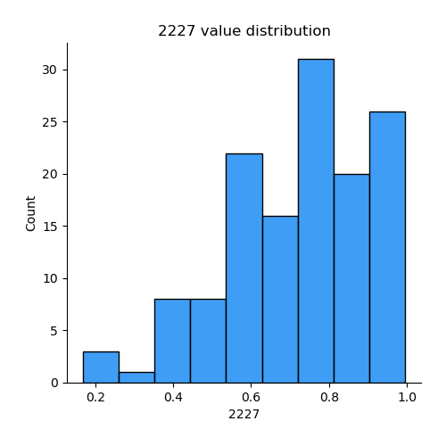
## Feature : 2228
- **Feature type** : continous
- **Missing** : 0.0%
- **Unique** : 135
- **Count** :135.0
- **Mean** :0.7816550218026848
- **Std** :0.1370526000031692
- **Min** :0.44275438185950255
- **25%th Percentile** : 0.6973843754397395
- **50%th Percentile** : 0.7855733031495269
- **75%th Percentile** : 0.8677964732897046
- **Max** :0.9938029028354297

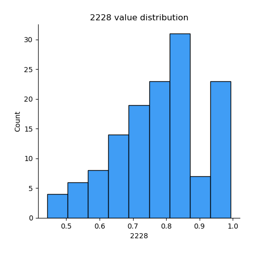
## Feature : 2229
- **Feature type** : continous
- **Missing** : 0.0%
- **Unique** : 135
- **Count** :135.0
- **Mean** :0.5544583933789393
- **Std** :0.25429899778766696
- **Min** :0.032253508227658274
- **25%th Percentile** : 0.3734823431002876
- **50%th Percentile** : 0.5464958596312148
- **75%th Percentile** : 0.7090907389710064
- **Max** :0.9911948155513076

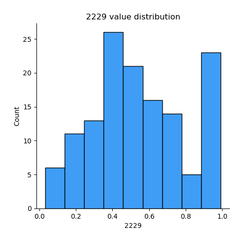
## Feature : 2230
- **Feature type** : continous
- **Missing** : 0.0%
- **Unique** : 135
- **Count** :135.0
- **Mean** :0.746912328183365
- **Std** :0.1726120084524856
- **Min** :0.20764529956350547
- **25%th Percentile** : 0.6588409844335539
- **50%th Percentile** : 0.7656443448811119
- **75%th Percentile** : 0.8464624050859695
- **Max** :0.9968630509449659

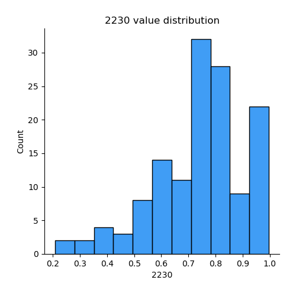
## Feature : 2231
- **Feature type** : continous
- **Missing** : 0.0%
- **Unique** : 135
- **Count** :135.0
- **Mean** :0.712158353738186
- **Std** :0.18437158934888137
- **Min** :0.08888367191680842
- **25%th Percentile** : 0.5893354368649701
- **50%th Percentile** : 0.699991365784141
- **75%th Percentile** : 0.8442892749467502
- **Max** :0.9956329830641047

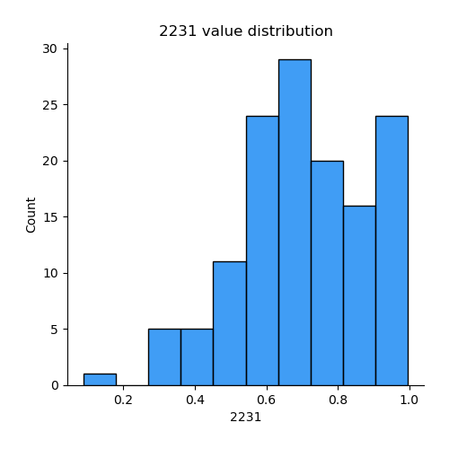
## Feature : 2232
- **Feature type** : continous
- **Missing** : 0.0%
- **Unique** : 135
- **Count** :135.0
- **Mean** :0.6335670884219187
- **Std** :0.23588005960162783
- **Min** :-0.1598319057262586
- **25%th Percentile** : 0.48476523781697267
- **50%th Percentile** : 0.6251113887807376
- **75%th Percentile** : 0.7934443297974524
- **Max** :0.9922310833499925

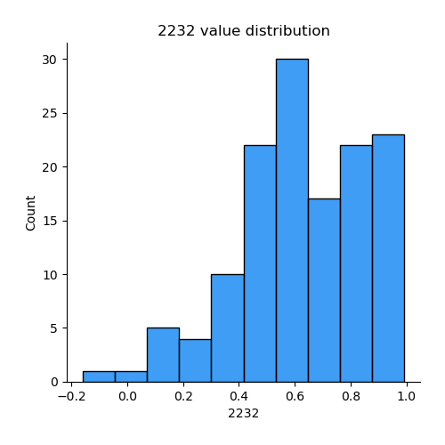
## Feature : 2233
- **Feature type** : continous
- **Missing** : 0.0%
- **Unique** : 135
- **Count** :135.0
- **Mean** :0.7644660107011897
- **Std** :0.15670593829253812
- **Min** :0.3193505716447476
- **25%th Percentile** : 0.6732752311245038
- **50%th Percentile** : 0.7686595894038403
- **75%th Percentile** : 0.8846136297013307
- **Max** :0.9956837067007338

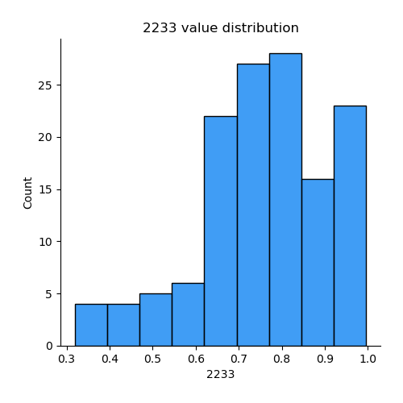
## Feature : 2234
- **Feature type** : continous
- **Missing** : 0.0%
- **Unique** : 135
- **Count** :135.0
- **Mean** :0.39686762086187427
- **Std** :0.30500121263927216
- **Min** :-0.3288251914569015
- **25%th Percentile** : 0.17644722688755232
- **50%th Percentile** : 0.35374878063209847
- **75%th Percentile** : 0.5600929761720153
- **Max** :0.9826206924185172

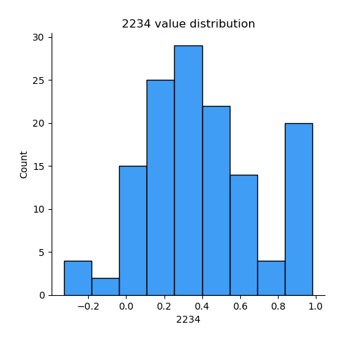
## Feature : 2235
- **Feature type** : continous
- **Missing** : 0.0%
- **Unique** : 135
- **Count** :135.0
- **Mean** :0.5674988384948955
- **Std** :0.26559106158793255
- **Min** :-0.3268868112706458
- **25%th Percentile** : 0.39152501371306714
- **50%th Percentile** : 0.582528422974386
- **75%th Percentile** : 0.7303550218100932
- **Max** :0.9904767855853849

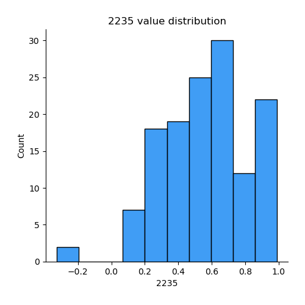
## Feature : 2279
- **Feature type** : continous
- **Missing** : 0.0%
- **Unique** : 3
- **Count** :135.0
- **Mean** :1.0
- **Std** :8.194439641982742e-17
- **Min** :0.9999999999999998
- **25%th Percentile** : 0.9999999999999999
- **50%th Percentile** : 1.0
- **75%th Percentile** : 1.0
- **Max** :1.0

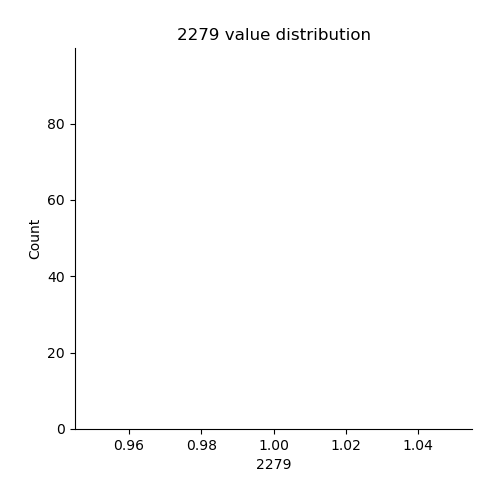
## Feature : 2280
- **Feature type** : continous
- **Missing** : 0.0%
- **Unique** : 135
- **Count** :135.0
- **Mean** :0.6947224007564266
- **Std** :0.19548390353111392
- **Min** :-0.0024382167500474226
- **25%th Percentile** : 0.5810757306768146
- **50%th Percentile** : 0.712710454016295
- **75%th Percentile** : 0.7971939916662811
- **Max** :0.9917981060589525

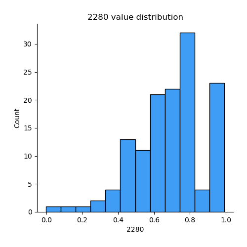
## Feature : 2281
- **Feature type** : continous
- **Missing** : 0.0%
- **Unique** : 135
- **Count** :135.0
- **Mean** :0.49247196932559517
- **Std** :0.30012815696026174
- **Min** :-0.21486940295726048
- **25%th Percentile** : 0.29814462738274466
- **50%th Percentile** : 0.47811429603637784
- **75%th Percentile** : 0.662738337207263
- **Max** :0.9890483922510521

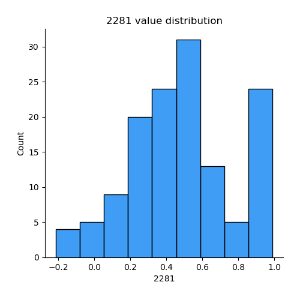
## Feature : 2282
- **Feature type** : continous
- **Missing** : 0.0%
- **Unique** : 135
- **Count** :135.0
- **Mean** :0.7677813776095819
- **Std** :0.16587641949818654
- **Min** :0.16080505134036222
- **25%th Percentile** : 0.6809665715747654
- **50%th Percentile** : 0.79595231173002
- **75%th Percentile** : 0.8676012792128285
- **Max** :0.9967324746678263

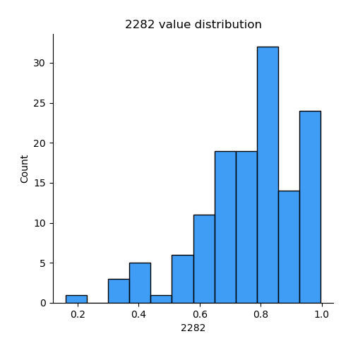
## Feature : 2283
- **Feature type** : continous
- **Missing** : 0.0%
- **Unique** : 135
- **Count** :135.0
- **Mean** :0.8214995072407424
- **Std** :0.11922014317571306
- **Min** :0.4068474995298158
- **25%th Percentile** : 0.7509404250060123
- **50%th Percentile** : 0.8376165245102918
- **75%th Percentile** : 0.8867060085200182
- **Max** :0.9979436932519702

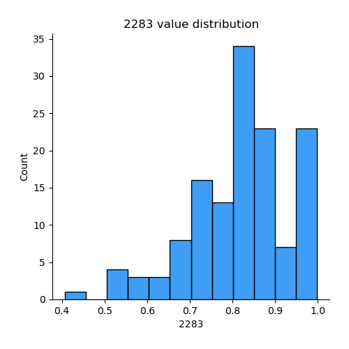
## Feature : 2284
- **Feature type** : continous
- **Missing** : 0.0%
- **Unique** : 135
- **Count** :135.0
- **Mean** :0.6437424852884547
- **Std** :0.26363693400035926
- **Min** :-0.2576346952914301
- **25%th Percentile** : 0.4956525734255657
- **50%th Percentile** : 0.6701608199122968
- **75%th Percentile** : 0.8364285630414494
- **Max** :0.995499743214143

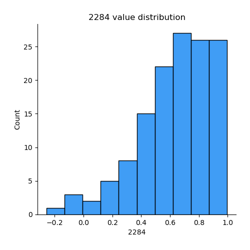
## Feature : 2285
- **Feature type** : continous
- **Missing** : 0.0%
- **Unique** : 135
- **Count** :135.0
- **Mean** :0.8276929290082183
- **Std** :0.11391823219921707
- **Min** :0.31595351162741087
- **25%th Percentile** : 0.7636192836238751
- **50%th Percentile** : 0.8290688407256231
- **75%th Percentile** : 0.8964010749741089
- **Max** :0.9969605561471901

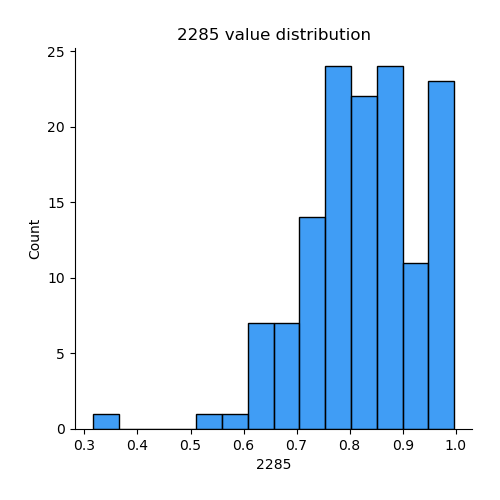
## Feature : 2286
- **Feature type** : continous
- **Missing** : 0.0%
- **Unique** : 135
- **Count** :135.0
- **Mean** :0.3512519688186026
- **Std** :0.33061911581069503
- **Min** :-0.4777212874552713
- **25%th Percentile** : 0.15644082227583697
- **50%th Percentile** : 0.28928424789361284
- **75%th Percentile** : 0.5504867463657674
- **Max** :0.9839204116307464

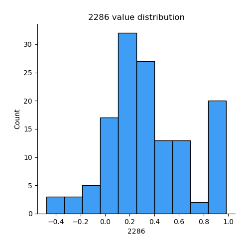
## Feature : 2287
- **Feature type** : continous
- **Missing** : 0.0%
- **Unique** : 135
- **Count** :135.0
- **Mean** :0.5367941797682599
- **Std** :0.28978503691563423
- **Min** :-0.3776136351664375
- **25%th Percentile** : 0.33496978883152273
- **50%th Percentile** : 0.5516567048998056
- **75%th Percentile** : 0.7309946495570159
- **Max** :0.9913469565361045

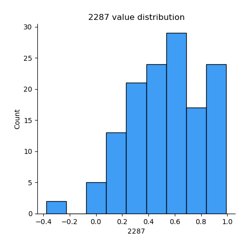
## Feature : 2332
- **Feature type** : continous
- **Missing** : 0.0%
- **Unique** : 3
- **Count** :135.0
- **Mean** :1.0
- **Std** :7.96677177378812e-17
- **Min** :0.9999999999999998
- **25%th Percentile** : 1.0
- **50%th Percentile** : 1.0
- **75%th Percentile** : 1.0
- **Max** :1.0

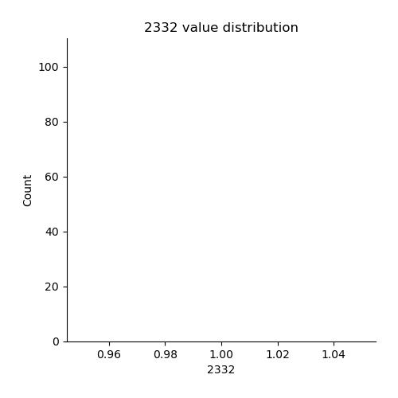
## Feature : 2333
- **Feature type** : continous
- **Missing** : 0.0%
- **Unique** : 135
- **Count** :135.0
- **Mean** :0.5159167796209749
- **Std** :0.260484987884316
- **Min** :-0.017924900998913505
- **25%th Percentile** : 0.3399908973801403
- **50%th Percentile** : 0.4937607044600341
- **75%th Percentile** : 0.6406518765208421
- **Max** :0.9906028496876784

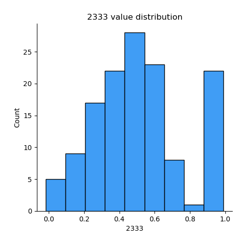
## Feature : 2334
- **Feature type** : continous
- **Missing** : 0.0%
- **Unique** : 135
- **Count** :135.0
- **Mean** :0.7095615661115603
- **Std** :0.1852637718027298
- **Min** :0.1269533373949994
- **25%th Percentile** : 0.6188657873463885
- **50%th Percentile** : 0.7179810820759677
- **75%th Percentile** : 0.8185072954371964
- **Max** :0.9947133101600929

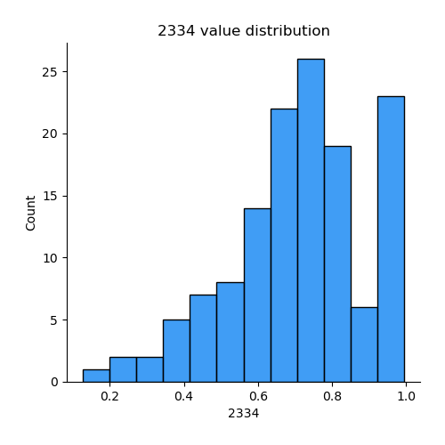
## Feature : 2335
- **Feature type** : continous
- **Missing** : 0.0%
- **Unique** : 135
- **Count** :135.0
- **Mean** :0.8052908255976003
- **Std** :0.14494523848388594
- **Min** :0.32424909859215484
- **25%th Percentile** : 0.7151098775385037
- **50%th Percentile** : 0.8384934252426886
- **75%th Percentile** : 0.9038175819568817
- **Max** :0.9963947498714334

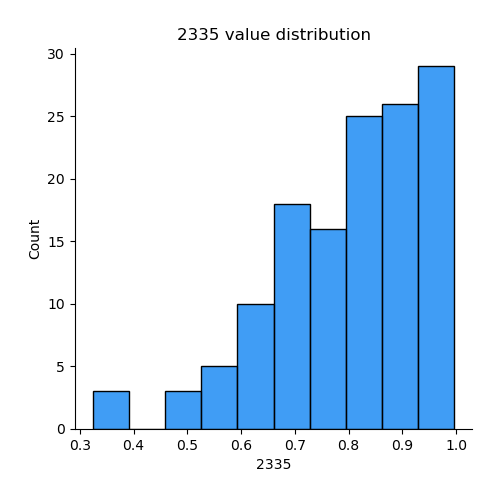
## Feature : 2336
- **Feature type** : continous
- **Missing** : 0.0%
- **Unique** : 135
- **Count** :135.0
- **Mean** :0.6471034644538514
- **Std** :0.22448812839756507
- **Min** :0.03331131634829338
- **25%th Percentile** : 0.4971951480543536
- **50%th Percentile** : 0.6699375795026998
- **75%th Percentile** : 0.7884134632535782
- **Max** :0.9915334098259586

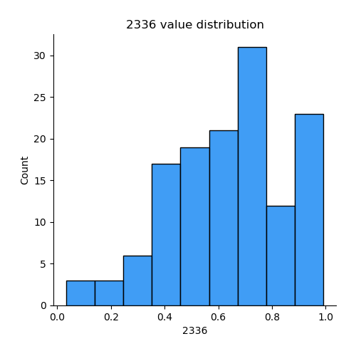
## Feature : 2337
- **Feature type** : continous
- **Missing** : 0.0%
- **Unique** : 135
- **Count** :135.0
- **Mean** :0.7438887684752976
- **Std** :0.17404190785732404
- **Min** :0.2784794211283692
- **25%th Percentile** : 0.6482364526254478
- **50%th Percentile** : 0.7613938237342117
- **75%th Percentile** : 0.8675208431472576
- **Max** :0.9942671211140842

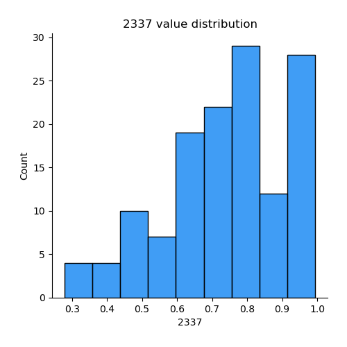
## Feature : 2338
- **Feature type** : continous
- **Missing** : 0.0%
- **Unique** : 135
- **Count** :135.0
- **Mean** :0.3858719859615732
- **Std** :0.30626392621196513
- **Min** :-0.4480469367482099
- **25%th Percentile** : 0.19150276816532424
- **50%th Percentile** : 0.3115325197624797
- **75%th Percentile** : 0.5331051946575474
- **Max** :0.97858643486643

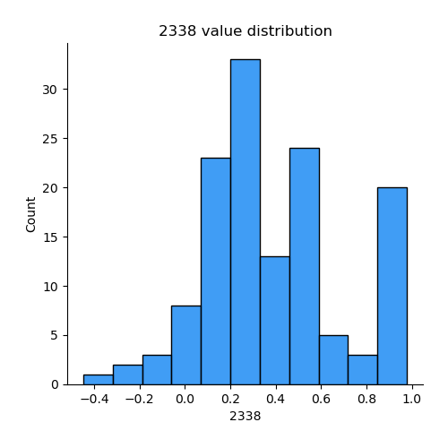
## Feature : 2339
- **Feature type** : continous
- **Missing** : 0.0%
- **Unique** : 135
- **Count** :135.0
- **Mean** :0.5579744595141863
- **Std** :0.25240502294780026
- **Min** :-0.06237270688981315
- **25%th Percentile** : 0.40297591657746445
- **50%th Percentile** : 0.5331474863926436
- **75%th Percentile** : 0.7161527526710939
- **Max** :0.9843737272101705

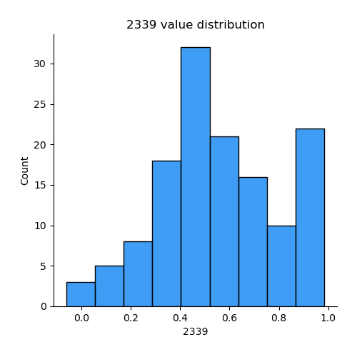
## Feature : 2385
- **Feature type** : continous
- **Missing** : 0.0%
- **Unique** : 3
- **Count** :135.0
- **Mean** :1.0
- **Std** :7.304186058818017e-17
- **Min** :0.9999999999999998
- **25%th Percentile** : 1.0
- **50%th Percentile** : 1.0
- **75%th Percentile** : 1.0
- **Max** :1.0

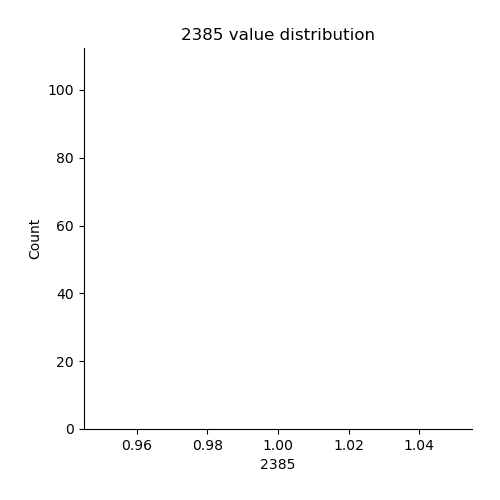
## Feature : 2386
- **Feature type** : continous
- **Missing** : 0.0%
- **Unique** : 135
- **Count** :135.0
- **Mean** :0.645408620770268
- **Std** :0.21173615319503375
- **Min** :0.16275196777570516
- **25%th Percentile** : 0.5214266125119694
- **50%th Percentile** : 0.6424934506672215
- **75%th Percentile** : 0.7644150003631991
- **Max** :0.9928257141972565

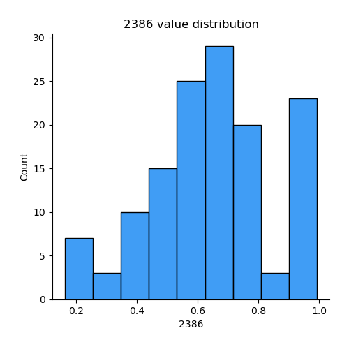
## Feature : 2387
- **Feature type** : continous
- **Missing** : 0.0%
- **Unique** : 135
- **Count** :135.0
- **Mean** :0.42607876435216596
- **Std** :0.3139353330850569
- **Min** :-0.24466885530432628
- **25%th Percentile** : 0.21697321737147904
- **50%th Percentile** : 0.3687375979282306
- **75%th Percentile** : 0.5962013575711781
- **Max** :0.9889397375368375

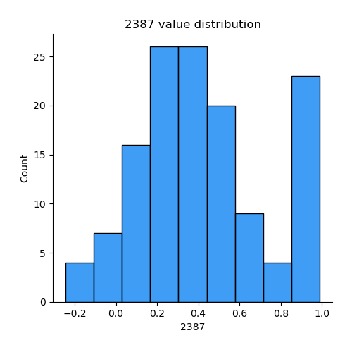
## Feature : 2388
- **Feature type** : continous
- **Missing** : 0.0%
- **Unique** : 135
- **Count** :135.0
- **Mean** :0.533842233343046
- **Std** :0.26139541758129325
- **Min** :-0.11405037622718409
- **25%th Percentile** : 0.3528891352708685
- **50%th Percentile** : 0.5031182930636292
- **75%th Percentile** : 0.670949399466412
- **Max** :0.9905489820459508

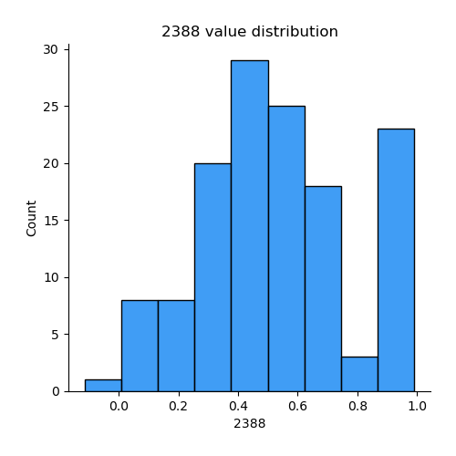
## Feature : 2389
- **Feature type** : continous
- **Missing** : 0.0%
- **Unique** : 135
- **Count** :135.0
- **Mean** :0.5001186578690126
- **Std** :0.29386149539932344
- **Min** :-0.2751021983745546
- **25%th Percentile** : 0.2868599720635867
- **50%th Percentile** : 0.4702283599505669
- **75%th Percentile** : 0.7046871062897881
- **Max** :0.9898834169725467

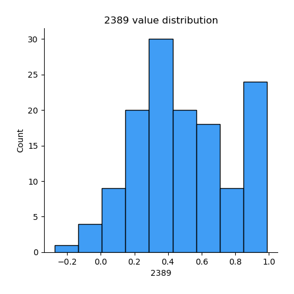
## Feature : 2390
- **Feature type** : continous
- **Missing** : 0.0%
- **Unique** : 135
- **Count** :135.0
- **Mean** :0.3154639397995299
- **Std** :0.3398925776354342
- **Min** :-0.47677524158413953
- **25%th Percentile** : 0.06617079123401101
- **50%th Percentile** : 0.2684339335809571
- **75%th Percentile** : 0.4846197293874124
- **Max** :0.9847278200074007

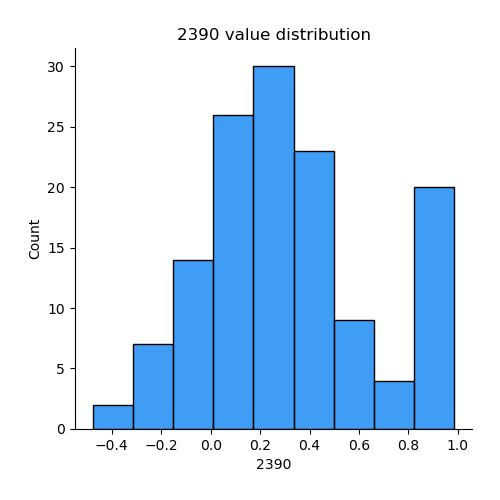
## Feature : 2391
- **Feature type** : continous
- **Missing** : 0.0%
- **Unique** : 135
- **Count** :135.0
- **Mean** :0.4891665618021392
- **Std** :0.2708856297748476
- **Min** :-0.22248975613714073
- **25%th Percentile** : 0.30794378533867717
- **50%th Percentile** : 0.45265877907078883
- **75%th Percentile** : 0.6395911488649436
- **Max** :0.9854016639988344

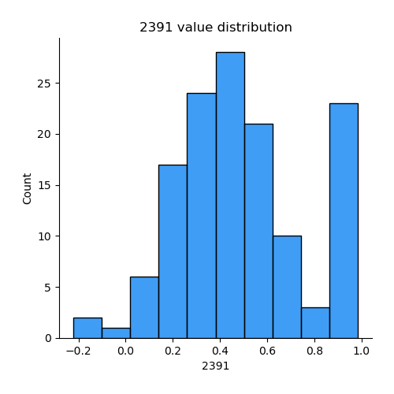
## Feature : 2438
- **Feature type** : continous
- **Missing** : 0.0%
- **Unique** : 3
- **Count** :135.0
- **Mean** :1.0
- **Std** :9.149103208687634e-17
- **Min** :0.9999999999999998
- **25%th Percentile** : 0.9999999999999999
- **50%th Percentile** : 1.0
- **75%th Percentile** : 1.0
- **Max** :1.0

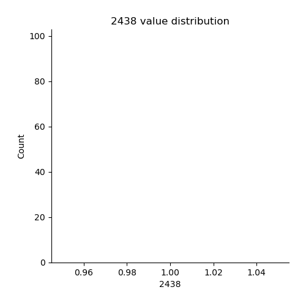
## Feature : 2439
- **Feature type** : continous
- **Missing** : 0.0%
- **Unique** : 135
- **Count** :135.0
- **Mean** :0.6728395820351942
- **Std** :0.20986017943413118
- **Min** :0.14017089799610816
- **25%th Percentile** : 0.5530467101342982
- **50%th Percentile** : 0.6699652150945462
- **75%th Percentile** : 0.8063914182054411
- **Max** :0.9959891926918792

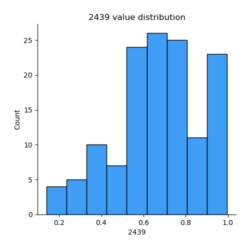
## Feature : 2440
- **Feature type** : continous
- **Missing** : 0.0%
- **Unique** : 135
- **Count** :135.0
- **Mean** :0.5917104415009078
- **Std** :0.2831176772430656
- **Min** :-0.31621253145583217
- **25%th Percentile** : 0.41933754852774885
- **50%th Percentile** : 0.6217419430485713
- **75%th Percentile** : 0.7758240835648453
- **Max** :0.994467560556048

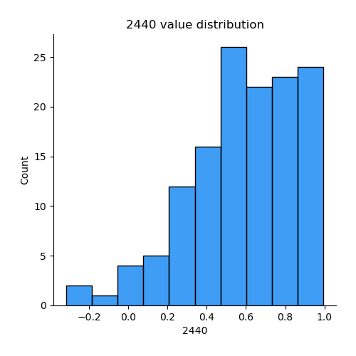
## Feature : 2441
- **Feature type** : continous
- **Missing** : 0.0%
- **Unique** : 135
- **Count** :135.0
- **Mean** :0.6873142925392657
- **Std** :0.20763409981416964
- **Min** :0.15669913453111145
- **25%th Percentile** : 0.5709136070731391
- **50%th Percentile** : 0.7024707002115043
- **75%th Percentile** : 0.8263103912246641
- **Max** :0.9958447919138088

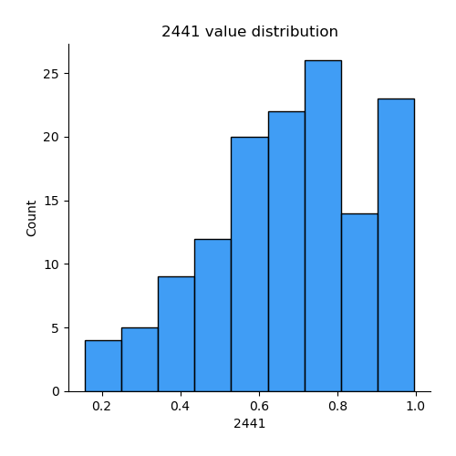
## Feature : 2442
- **Feature type** : continous
- **Missing** : 0.0%
- **Unique** : 135
- **Count** :135.0
- **Mean** :0.3993837647862501
- **Std** :0.3019206848043122
- **Min** :-0.28471986869852545
- **25%th Percentile** : 0.21989930861239027
- **50%th Percentile** : 0.34672954279513096
- **75%th Percentile** : 0.5768589266331487
- **Max** :0.9859755753341628

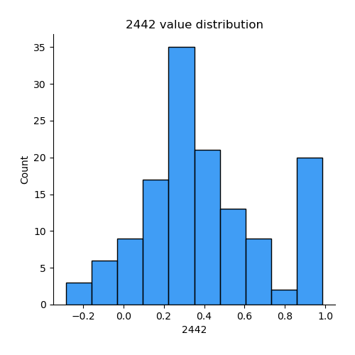
## Feature : 2443
- **Feature type** : continous
- **Missing** : 0.0%
- **Unique** : 135
- **Count** :135.0
- **Mean** :0.5084688630948918
- **Std** :0.286723861527879
- **Min** :-0.31476468015895603
- **25%th Percentile** : 0.3389216882212434
- **50%th Percentile** : 0.4833840773389332
- **75%th Percentile** : 0.6760088087501697
- **Max** :0.9904115158887641

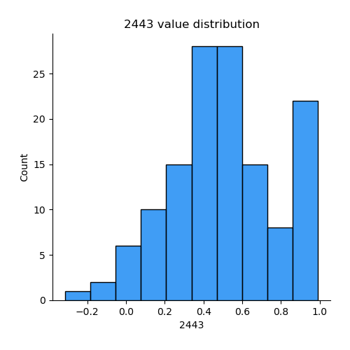
## Feature : 2491
- **Feature type** : continous
- **Missing** : 0.0%
- **Unique** : 3
- **Count** :135.0
- **Mean** :1.0
- **Std** :8.470423645496557e-17
- **Min** :0.9999999999999998
- **25%th Percentile** : 1.0
- **50%th Percentile** : 1.0
- **75%th Percentile** : 1.0
- **Max** :1.0

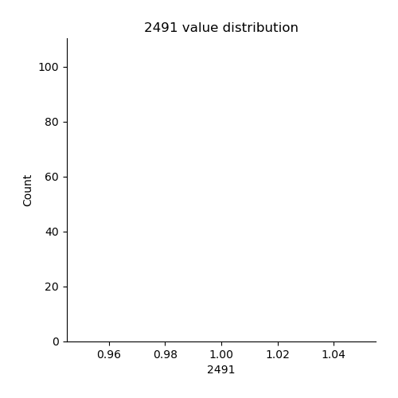
## Feature : 2492
- **Feature type** : continous
- **Missing** : 0.0%
- **Unique** : 135
- **Count** :135.0
- **Mean** :0.6070061927855799
- **Std** :0.25584685040333216
- **Min** :0.006170210636917825
- **25%th Percentile** : 0.4457155528892734
- **50%th Percentile** : 0.6177014971646029
- **75%th Percentile** : 0.7921501543655801
- **Max** :0.9925428836986

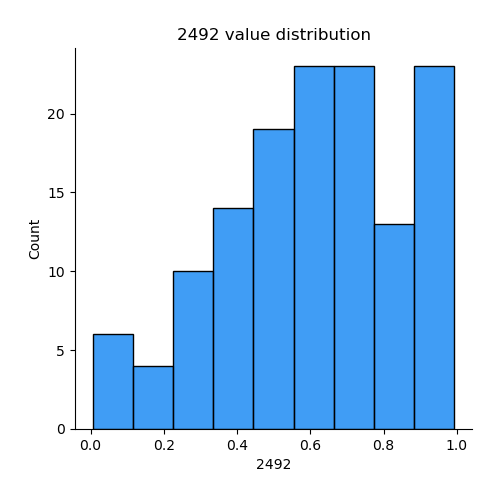
## Feature : 2493
- **Feature type** : continous
- **Missing** : 0.0%
- **Unique** : 135
- **Count** :135.0
- **Mean** :0.8209653707158882
- **Std** :0.11659070954564596
- **Min** :0.5048777570206244
- **25%th Percentile** : 0.7403967843189219
- **50%th Percentile** : 0.831984359069508
- **75%th Percentile** : 0.8981289973568749
- **Max** :0.9972063745088527

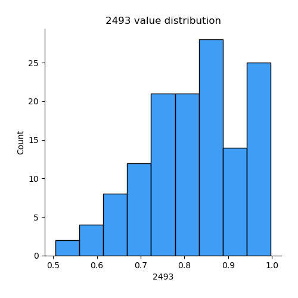
## Feature : 2494
- **Feature type** : continous
- **Missing** : 0.0%
- **Unique** : 135
- **Count** :135.0
- **Mean** :0.34340770147840693
- **Std** :0.3200048693876113
- **Min** :-0.3854089221846659
- **25%th Percentile** : 0.11768261347682567
- **50%th Percentile** : 0.2895250460531393
- **75%th Percentile** : 0.5048262154292738
- **Max** :0.9785053064325366

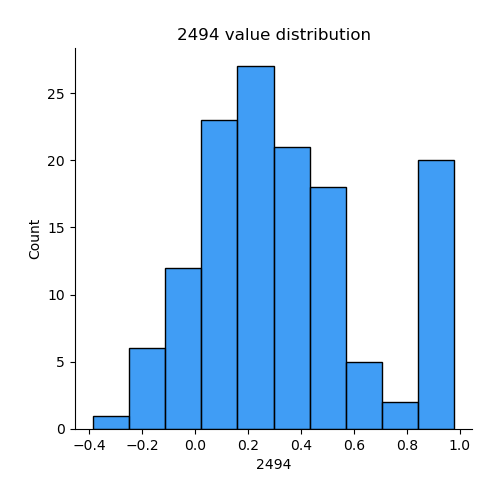
## Feature : 2495
- **Feature type** : continous
- **Missing** : 0.0%
- **Unique** : 135
- **Count** :135.0
- **Mean** :0.49966790008523865
- **Std** :0.281899979477868
- **Min** :-0.2296119184185962
- **25%th Percentile** : 0.30677646212770077
- **50%th Percentile** : 0.4633747257590594
- **75%th Percentile** : 0.6413478211062947
- **Max** :0.989162797713004

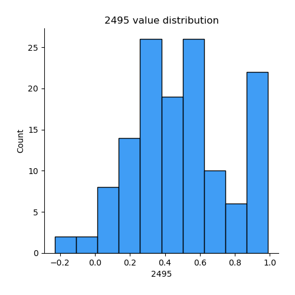
## Feature : 2544
- **Feature type** : continous
- **Missing** : 0.0%
- **Unique** : 3
- **Count** :135.0
- **Mean** :1.0
- **Std** :8.737694914694383e-17
- **Min** :0.9999999999999998
- **25%th Percentile** : 0.9999999999999999
- **50%th Percentile** : 1.0
- **75%th Percentile** : 1.0
- **Max** :1.0

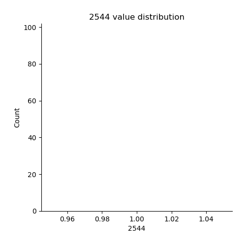
## Feature : 2545
- **Feature type** : continous
- **Missing** : 0.0%
- **Unique** : 135
- **Count** :135.0
- **Mean** :0.6915753388400657
- **Std** :0.23081648370111185
- **Min** :-0.10701455216578384
- **25%th Percentile** : 0.5654812199346977
- **50%th Percentile** : 0.7190161756837694
- **75%th Percentile** : 0.85414972724764
- **Max** :0.9927116750633126

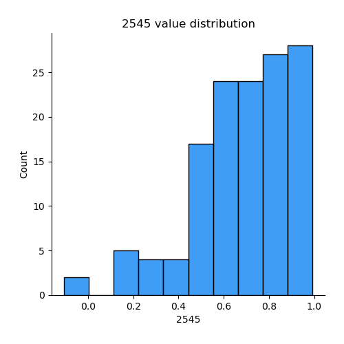
## Feature : 2546
- **Feature type** : continous
- **Missing** : 0.0%
- **Unique** : 135
- **Count** :135.0
- **Mean** :0.5160632176789971
- **Std** :0.2517501798926764
- **Min** :-0.0321251752786695
- **25%th Percentile** : 0.32764215216124476
- **50%th Percentile** : 0.49050134886609315
- **75%th Percentile** : 0.651028456083566
- **Max** :0.9921740023440989

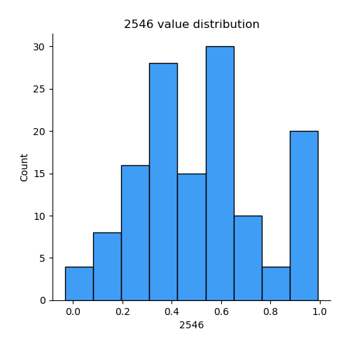
## Feature : 2547
- **Feature type** : continous
- **Missing** : 0.0%
- **Unique** : 135
- **Count** :135.0
- **Mean** :0.7666312111310593
- **Std** :0.15220282877467523
- **Min** :0.3437836248777745
- **25%th Percentile** : 0.6775592581563976
- **50%th Percentile** : 0.7796933576868287
- **75%th Percentile** : 0.8728607116233331
- **Max** :0.9934756262805555

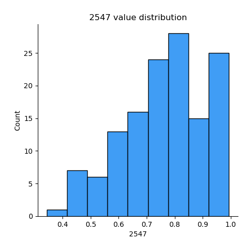
## Feature : 2597
- **Feature type** : continous
- **Missing** : 0.0%
- **Unique** : 3
- **Count** :135.0
- **Mean** :1.0
- **Std** :9.638701203969144e-17
- **Min** :0.9999999999999998
- **25%th Percentile** : 0.9999999999999999
- **50%th Percentile** : 1.0
- **75%th Percentile** : 1.0
- **Max** :1.0

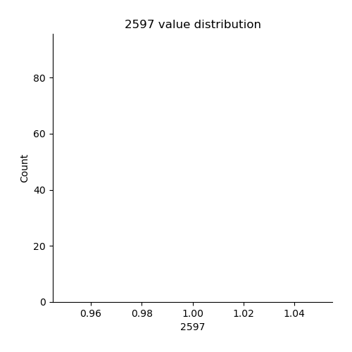
## Feature : 2598
- **Feature type** : continous
- **Missing** : 0.0%
- **Unique** : 135
- **Count** :135.0
- **Mean** :0.3472022986255188
- **Std** :0.3295094022839494
- **Min** :-0.5274169079118595
- **25%th Percentile** : 0.08954967154655458
- **50%th Percentile** : 0.2899715117734142
- **75%th Percentile** : 0.5597571167673929
- **Max** :0.9794908443933238

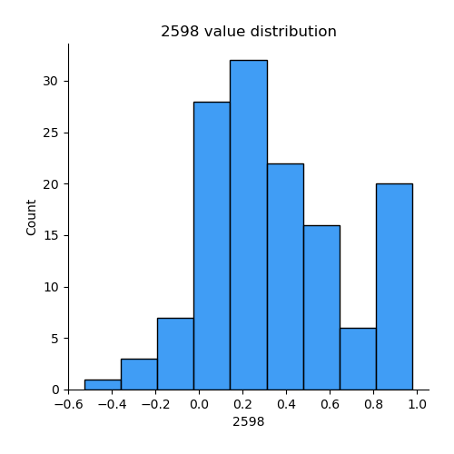
## Feature : 2599
- **Feature type** : continous
- **Missing** : 0.0%
- **Unique** : 135
- **Count** :135.0
- **Mean** :0.6136240841316138
- **Std** :0.24345000567793415
- **Min** :-0.11111182016463482
- **25%th Percentile** : 0.4663679466263174
- **50%th Percentile** : 0.6300304136523036
- **75%th Percentile** : 0.7721917257558577
- **Max** :0.9903552212119293

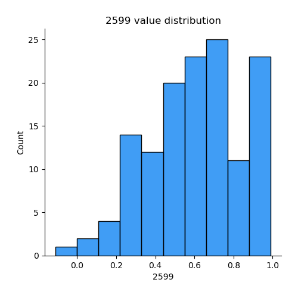
## Feature : 2650
- **Feature type** : continous
- **Missing** : 0.0%
- **Unique** : 3
- **Count** :135.0
- **Mean** :1.0
- **Std** :9.638701203969144e-17
- **Min** :0.9999999999999998
- **25%th Percentile** : 0.9999999999999999
- **50%th Percentile** : 1.0
- **75%th Percentile** : 1.0
- **Max** :1.0

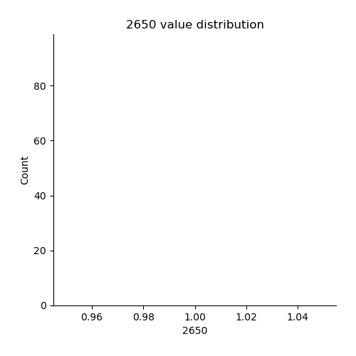
## Feature : 2651
- **Feature type** : continous
- **Missing** : 0.0%
- **Unique** : 135
- **Count** :135.0
- **Mean** :0.41269599237491156
- **Std** :0.29168219695303166
- **Min** :-0.20587989143878233
- **25%th Percentile** : 0.1907228910672836
- **50%th Percentile** : 0.36729298990433634
- **75%th Percentile** : 0.5814633255925352
- **Max** :0.9801341792757496

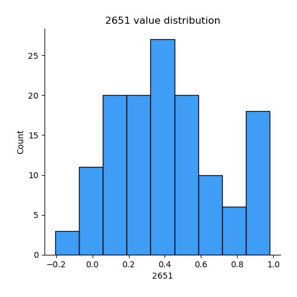
## Feature : 2703
- **Feature type** : continous
- **Missing** : 0.0%
- **Unique** : 3
- **Count** :135.0
- **Mean** :1.0
- **Std** :9.298689742973024e-17
- **Min** :0.9999999999999998
- **25%th Percentile** : 0.9999999999999999
- **50%th Percentile** : 1.0
- **75%th Percentile** : 1.0
- **Max** :1.0

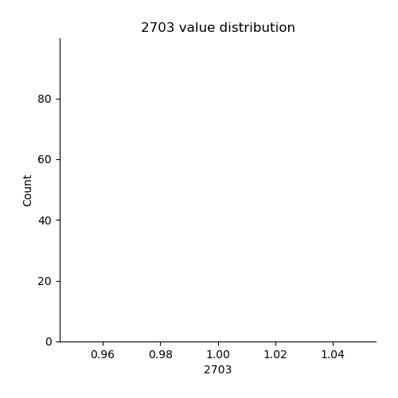

[<< Go back](../README.md)
